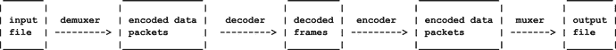

# 十二、 FFmpeg/Libav

根据“FFmpeg 初学者教程”( [`http://keycorner.org/pub/text/doc/ffmpegtutorial.htm`](http://keycorner.org/pub/text/doc/ffmpegtutorial.%0dhtm) )，FFmpeg 是一个完整的、跨平台的命令行工具，能够记录、转换和流式传输各种格式的数字音频和视频。它可以用来快速轻松地完成大多数多媒体任务，如音频压缩、音频/视频格式转换、从视频中提取图像等。

FFmpeg 由一组命令行工具和一组库组成，可用于将音频(和视频)文件从一种格式转换为另一种格式。它既可以在容器上工作，也可以在编解码器上工作。它不是为播放或录制音频而设计的；它更像是一个通用的转换工具。

## 资源

*   FFmpeg 首页( [`http://ffmpeg.org/`](http://ffmpeg.org/)
*   FFmpeg 文档( [`http://ffmpeg.org/ffmpeg.html`](http://ffmpeg.org/ffmpeg.html)
*   Libav 主页 （ [`https://libav.org/`](https://libav.org/) ）
*   在 [`https://github.com/chelyaev/ffmpeg-tutorial`](https://github.com/chelyaev/ffmpeg-tutorial) 更新代码的 FFmpeg 和 SDL 教程( [`http://dranger.com/ffmpeg/`](http://dranger.com/ffmpeg/) )

## FFmpeg/Libav 之争

FFmpeg 开始于 2000 年，为处理多媒体数据提供库和程序。然而，在过去的几年里，开发人员之间发生了一些纠纷，导致了 2011 年 Libav 项目的分叉。从那以后，这两个项目一直在进行，几乎是并行的，并且经常互相借鉴。然而，形势依然严峻，似乎没有解决的可能。

这对开发者来说是不幸的。虽然程序通常可以在这两个系统之间移植，但有时在 API 和行为上存在差异。还有发行版支持的问题。多年来，Debian 及其衍生产品只支持 Libav，忽略了 FFmpeg。这已经改变了，现在两者都支持。参见“为什么 Debian 回到 FFmpeg”([`https://lwn.net/Articles/650816/`](https://lwn.net/Articles/650816/))对其中一些问题的讨论。

## FFmpeg 命令行工具

主要的 FFmpeg 工具是`ffmpeg`本身。最简单的用途是作为从一种格式到另一种格式的转换器，如下所示:

```sh
        ffmpeg -i file.ogg file.mp3

```

这将把 Vorbis 编解码器数据的 Ogg 容器转换成 MP2 编解码器数据的 MPEG 容器。

Libav 的等价物是`avconv`，运行方式类似。

```sh
      avconv -i file.ogg file.mp3

```

在内部，`ffmpeg`使用模块流水线，如图 [12-1](#Fig1) 所示。



图 12-1。

FFmpeg/Libav pipeline (Source: [`http://ffmpeg.org/ffmpeg.html`](http://ffmpeg.org/ffmpeg.html) )

如果默认值不合适，可以使用选项设置多路复用器/多路分解器和解码器/编码器。

以下是其他命令:

*   `ffprobe`给出关于文件的信息。
*   是一个简单的媒体播放器。
*   `ffserver`是媒体服务器。

## 设计

有许多库可用于 FFmpeg/Libav 编程。Libav 构建了以下库:

*   libavcodec 公司
*   libavdevice
*   libavfilter
*   libavformat
*   libavresample
*   滑鹌

FFmepg 构建以下内容:

*   libavcodec 公司
*   libavdevice
*   libavfilter
*   libavformat
*   libavresample
*   滑鹌
*   libpostproc
*   libswresample
*   libswscale

FFmpeg 中的额外库用于视频后处理和缩放。

使用这些系统都不是一个简单的过程。Libav 网站声明，“Libav 一直是一个非常实验性的、由开发者驱动的项目。它是许多多媒体项目中的关键组件，并且不断添加新功能。为了提供一个稳定的基础，主要版本每四到六个月削减一次，并至少维持两年。”

FFmpeg 网站声明，“FFmpeg 一直是一个非常实验性和开发者驱动的项目。它是许多多媒体项目中的关键组件，并且不断添加新功能。开发分支快照在 99%的时间里都工作得很好，所以人们不怕使用它们。”

我的经验是，这两个项目的“实验”性质导致了不稳定的核心 API，定期废弃和替换关键功能。比如`libavcodec`版本 56 中的函数`avcodec_decode_audio`现在升级到版本 4: `avcodec_decode_audio4`。甚至那个版本现在也在 FFmpeg 和 Libav 的上游版本(版本 57)中被弃用，取而代之的是在版本 56 中不存在的函数，比如`avcodec_send_packet`。除此之外，还有两个项目具有相同的目标和大体相同的 API，但并不总是如此。比如 FFmpeg 有`swr_alloc_set_opts`，而 Libav 用的是`av_opt_set_int`。此外，视听编解码器和容器本身也在不断发展。

这样做的结果是，互联网上的许多示例程序不再编译，不再使用废弃的 API，或者属于“其他”系统。这并不是要贬低两个成就高超的系统，只是希望不要这么乱。

## 解码 MP3 文件

以下程序将 MP3 文件解码为原始 PCM 文件。这是使用 FFmpeg/Libav 所能完成的最简单的任务，但不幸的是这并不简单。首先，你要注意你要处理的是一个编解码器，而不是一个包含编解码器的文件。这不是一个 FFmpeg/Libav 问题，而是一个一般性问题。

扩展名为`.mpg`或`.mp3`的文件可能包含许多不同的格式。如果我对我拥有的一些文件运行命令`file`，我会得到不同的结果。

```sh
BST.mp3: MPEG ADTS, layer III, v1, 128 kbps, 44.1 kHz, Stereo
Beethoven_Fr_Elise.mp3: MPEG ADTS, layer III, v1, 128 kbps, 44.1 kHz, Stereo
Angel-no-vocal.mp3: Audio file with ID3 version 2.3.0
01DooWackaDoo.mp3: Audio file with ID3 version 2.3.0, \
    contains: MPEG ADTS, layer III, v1, 224 kbps, 44.1 kHz, JntStereo

```

前两个文件只包含一个编解码器，可以由下面的程序管理。第三和第四个文件是容器文件，包含 MPEG+ID3 数据。这些需要使用`avformat`函数来管理，例如`av_read_frame` [<sup>1</sup>](#Fn1) 。

该程序基本上是 FFmpeg/Libav 源代码发行版中的一个标准示例。它基于 FFmpeg 源中的`ffmpeg-3.2/doc/examples/decoding_encoding.c`和 Libav 源中的`libav-12/doc/examples/avcodec.c`。顺便提一下，两个程序都使用了`avcodec_decode_audio4`，这在这两个上游版本中都被否决了，也没有替换函数`avcodec_send_packet`的例子。

更严重的问题是，MP3 文件越来越多地使用平面格式。在这种情况下，不同的通道位于不同的平面。FFmpeg/Libav 函数`avcodec_decode_audio4`通过将每个平面放置在单独的数据阵列中来正确处理这一问题，但当它作为 PCM 数据输出时，平面必须交错。示例中没有这样做，这可能会导致 PCM 数据不正确(大量咔嗒声，然后是半速音频)。

相关的 FFmpeg 功能如下:

*   注册所有可能的多路复用器、多路分解器和协议。
*   `avformat_open_input`:打开输入流。
*   `av_find_stream_info`:提取流信息。
*   `av_init_packet`:设定数据包中的默认值。
*   `avcodec_find_decoder`:找到合适的解码器。
*   `avcodec_alloc_context3`:设置主数据结构的默认值。
*   `avcodec_open2`:打开解码器。
*   `fread`:FFmpeg 处理循环从数据流中一次读取一个缓冲区。
*   `avcodec_decode_audio4`:将音频帧解码成原始音频数据。

其余的代码交错数据流以输出到 PCM 文件。生成的文件可以通过以下方式播放:

```sh
      aplay -c 2 -r 44100 /tmp/test.sw -f S16_LE

```

该计划如下:

```sh
/*
 * copyright (c) 2001 Fabrice Bellard
 *
 * This file is part of Libav.
 *
 * Libav is free software; you can redistribute it and/or
 * modify it under the terms of the GNU Lesser General Public
 * License as published by the Free Software Foundation; either
 * version 2.1 of the License, or (at your option) any later version.
 *
 * Libav is distributed in the hope that it will be useful,
 * but WITHOUT ANY WARRANTY; without even the implied warranty of
 * MERCHANTABILITY or FITNESS FOR A PARTICULAR PURPOSE.  See the GNU
 * Lesser General Public License for more details.
 *
 * You should have received a copy of the GNU Lesser General Public
 * License along with Libav; if not, write to the Free Software
 * Foundation, Inc., 51 Franklin Street, Fifth Floor, Boston, MA 02110-1301 USA
 */

// From http://code.haskell.org/∼thielema/audiovideo-example/cbits/
// Adapted to version version 2.8.6-1ubuntu2 by Jan Newmarch

/**
 * @file
 * libavcodec API use example.
 *
 * @example libavcodec/api-example.c
 * Note that this library only handles codecs (mpeg, mpeg4, etc...),
 * not file formats (avi, vob, etc...). See library 'libavformat' for the
 * format handling
 */

#include <stdlib.h>
#include <stdio.h>
#include <string.h>

#ifdef HAVE_AV_CONFIG_H
#undef HAVE_AV_CONFIG_H
#endif

#include "libavcodec/avcodec.h"
#include <libavformat/avformat.h>

#define INBUF_SIZE 4096
#define AUDIO_INBUF_SIZE 20480
#define AUDIO_REFILL_THRESH 4096

void die(char *s) {
    fputs(s, stderr);
    exit(1);
}

/*
 * Audio decoding.
 */
static void audio_decode_example(AVFormatContext* container,
                                 const char *outfilename, const char *filename)
{
    AVCodec *codec;
    AVCodecContext *context = NULL;
    int len;
    FILE *f, *outfile;
    uint8_t inbuf[AUDIO_INBUF_SIZE + FF_INPUT_BUFFER_PADDING_SIZE];
    AVPacket avpkt;
    AVFrame *decoded_frame = NULL;
    int num_streams = 0;
    int sample_size = 0;

    av_init_packet(&avpkt);

    printf("Audio decoding\n");

    int stream_id = -1;

    // To find the first audio stream. This process may not be necessary
    // if you can gurarantee that the container contains only the desired
    // audio stream
    int i;
    for (i = 0; i < container->nb_streams; i++) {
        if (container->streams[i]->codec->codec_type == AVMEDIA_TYPE_AUDIO) {
            stream_id = i;
            break;
        }
    }

    /* find the appropriate audio decoder */
    AVCodecContext* codec_context = container->streams[stream_id]->codec;
    codec = avcodec_find_decoder(codec_context->codec_id);
    if (!codec) {
        fprintf(stderr, "codec not found\n");
        exit(1);
    }

    context = avcodec_alloc_context3(codec);;

    /* open it */
    if (avcodec_open2(context, codec, NULL) < 0) {
        fprintf(stderr, "could not open codec\n");
        exit(1);
    }

    f = fopen(filename, "rb");
    if (!f) {
        fprintf(stderr, "could not open %s\n", filename);
        exit(1);
    }
    outfile = fopen(outfilename, "wb");
    if (!outfile) {
        av_free(context);
        exit(1);
    }

    /* decode until eof */
    avpkt.data = inbuf;
    avpkt.size = fread(inbuf, 1, AUDIO_INBUF_SIZE, f);

    while (avpkt.size > 0) {
        int got_frame = 0;

        if (!decoded_frame) {
            if (!(decoded_frame = av_frame_alloc())) {
                fprintf(stderr, "out of memory\n");
                exit(1);
            }
        } else {
            av_frame_unref(decoded_frame);
        }
        printf("Stream idx %d\n", avpkt.stream_index);

        len = avcodec_decode_audio4(context, decoded_frame, &got_frame, &avpkt);
        if (len < 0) {
            fprintf(stderr, "Error while decoding\n");
            exit(1);
        }
        if (got_frame) {
            printf("Decoded frame nb_samples %d, format %d\n",
                   decoded_frame->nb_samples,
                   decoded_frame->format);
            if (decoded_frame->data[1] != NULL)
                printf("Data[1] not null\n");
            else
                printf("Data[1] is null\n");
            /* if a frame has been decoded, output it */
            int data_size = av_samples_get_buffer_size(NULL, context->channels,
                                                       decoded_frame->nb_samples,
                                                       context->sample_fmt, 1);
            // first time: count the number of  planar streams
            if (num_streams == 0) {
                while (num_streams < AV_NUM_DATA_POINTERS &&
                       decoded_frame->data[num_streams] != NULL)
                    num_streams++;
                printf("Number of streams %d\n", num_streams);
            }

            // first time: set sample_size from 0 to e.g 2 for 16-bit data
            if (sample_size == 0) {
                sample_size =
                    data_size / (num_streams * decoded_frame->nb_samples);
            }

            int m, n;
            for (n = 0; n < decoded_frame->nb_samples; n++) {
                // interleave the samples from the planar streams
                for (m = 0; m < num_streams; m++) {
                    fwrite(&decoded_frame->data[m][n*sample_size],
                           1, sample_size, outfile);
                }
            }
        }
        avpkt.size -= len;
        avpkt.data += len;
        if (avpkt.size < AUDIO_REFILL_THRESH) {
            /* Refill the input buffer, to avoid trying to decode
             * incomplete frames. Instead of this, one could also use
             * a parser, or use a proper container format through
             * libavformat. */
            memmove(inbuf, avpkt.data, avpkt.size);
            avpkt.data = inbuf;
            len = fread(avpkt.data + avpkt.size, 1,
                        AUDIO_INBUF_SIZE - avpkt.size, f);
            if (len > 0)
                avpkt.size += len;
        }
    }

    fclose(outfile);
    fclose(f);

    avcodec_close(context);
    av_free(context);
    av_free(decoded_frame);
}

int main(int argc, char **argv)
{
    const char *filename = "Beethoven_Fr_Elise.mp3";
    AVFormatContext *pFormatCtx = NULL;

    if (argc == 2) {
        filename = argv[1];
    }

    // Register all formats and codecs
    av_register_all();
    if(avformat_open_input(&pFormatCtx, filename, NULL, NULL)!=0) {
        fprintf(stderr, "Can't get format of file %s\n", filename);
        return -1; // Couldn't open file
    }
    // Retrieve stream information
    if(avformat_find_stream_info(pFormatCtx, NULL)<0)
        return -1; // Couldn't find stream information
    av_dump_format(pFormatCtx, 0, filename, 0);
    printf("Num streams %d\n", pFormatCtx->nb_streams);
    printf("Bit rate %d\n", pFormatCtx->bit_rate);
    audio_decode_example(pFormatCtx, "/tmp/test.sw", filename);

    return 0;
}

```

## 结论

本章简要介绍了 FFmpeg/Libav，查看了 libavcodec 库。FFmpeg 和 Libav 要复杂得多，它们可以进行复杂得多的转换。此外，他们还可以进行视频处理，这在第 [15](15.html) 章中有说明。

Footnotes [1](#Fn1_source)

第 [15 章](15.html)和第 [21 章](21.html)中给出了 av_read_frame 的示例。