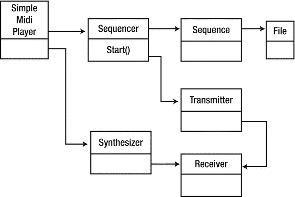

# 十八、MIDI Java 声音

Java Sound 有一个开发良好的 MIDI 系统，有干净分离的组件，如音序器和合成器，它允许元事件和普通 MIDI 事件挂钩。本章考虑使用 MIDI API 编程。

## 资源

许多资源可用于 Java Sound。

*   Java 平台标准版 7 API 规范( [`http://docs.oracle.com/javase/7/docs/api/`](http://docs.oracle.com/javase/7/docs/api/) )是所有标准 Java APIs 的参考点，包括`javax.sound.sampled`。
*   Java 教程( [`http://docs.oracle.com/javase/tutorial/sound/index.html`](http://docs.oracle.com/javase/tutorial/sound/index.html) )中的“Trail: Sound”教程很好地概述了 sampled 和 MIDI 包。
*   Java Sound Resources ( [`www.jsresources.org/faq_audio.html`](http://www.jsresources.org/faq_audio.html) )的音频编程常见问题解答了很多关于 Java Sound 的问题。
*   Java Sound 程序员指南( [`http://docs.oracle.com/javase/7/docs/technotes/guides/sound/programmer_guide/contents.html`](http://docs.oracle.com/javase/7/docs/technotes/guides/sound/programmer_guide/contents.html) )是一本来自甲骨文(前 Sun MicroSystems)的关于 Java Sound 的完整书籍。
*   声音组( [`http://openjdk.java.net/groups/sound/`](http://openjdk.java.net/groups/sound/) )由设计、实现和维护各种 OpenJDK 声音组件的开发人员组成。您可以在开源社区中找到更多关于 Java Sound 正在进行的开发的信息。
*   查看 Gervill 软件声音合成器源( [`https://java.net/projects/gervill/sources/Mercurial/show`](https://java.net/projects/gervill/sources/Mercurial/show) )。

## 主要的 Java 声音 MIDI 类

Java Sound 依靠一组类来支持 MIDI。这些是 Java 中的标准。以下是主要类别:

*   `MidiSystem`类是所有 MIDI 类的入口点。
*   `MidiDevice`包括合成器、音序器、MIDI 输入端口和 MIDI 输出端口。
*   一个`Transmitter`向一个`Receiver`发送`MidiEvent`个对象。一个`Transmitter`是 MIDI 事件的来源，一个`Receiver`是事件的消费者。
*   `Sequencer`是用于采集和回放 MIDI 事件序列的设备。它有发射器，因为它通常会将存储在序列中的 MIDI 信息发送到另一个设备，如合成器或 MIDI 输出端口。它也有接收器，因为它可以采集 MIDI 信息并将它们存储在序列中。( [`http://docs.oracle.com/javase/7/docs/technotes/guides/sound/programmer_guide/chapter8.html#118852`](http://docs.oracle.com/javase/7/docs/technotes/guides/sound/programmer_guide/chapter8.html#118852) )。
*   一个`Synthesizer`是用来产生声音的装置。它是`javax.sound.midi`包中唯一产生音频数据的对象( [`http://docs.oracle.com/javase/7/docs/technotes/guides/sound/programmer_guide/chapter8.html#118852`](http://docs.oracle.com/javase/7/docs/technotes/guides/sound/programmer_guide/chapter8.html#118852) )。

## 设备信息

通过查询`MidiSystem`的`DeviceInfo`对象列表，可以找到设备信息。每个信息对象包含诸如`Name`和`Vendor`的字段。您可以通过`MidiSystem.getMidiDevice(info)`使用该信息对象找到实际设备。然后，可以向该设备查询其接收器和发送器以及其类型，如序列发生器或合成器。

一个恼人的部分是，你无法获得所有设备的发射机和接收机的列表，只有那些开放的。您可以请求默认的发送器和接收器，这将隐式地打开它们。因此，您可以看到，在请求缺省值之前，列表可能是空的，但是如果有缺省值，那么之后它就不是空的了！如果没有默认值，将抛出一个`M` `idiUnavailableException`异常。

该计划如下:

```sh
import javax.sound.midi.*;
import java.util.*;

public class DeviceInfo {

    public static void main(String[] args) throws Exception {
        MidiDevice.Info[] devices;

        /*
        MidiDevice.Info[] info = p.getDeviceInfo();
        for (int m = 0; m < info.length; m++) {
            System.out.println(info[m].toString());
        }
        */

        System.out.println("MIDI devices:");
        devices = MidiSystem.getMidiDeviceInfo();
        for (MidiDevice.Info info: devices) {
            System.out.println("    Name: " + info.toString() +
                               ", Decription: " +
                               info.getDescription() +
                               ", Vendor: " +
                               info.getVendor());
            MidiDevice device = MidiSystem.getMidiDevice(info);
            if (! device.isOpen()) {
                device.open();
            }
            if (device instanceof Sequencer) {
                System.out.println("        Device is a sequencer");
            }
            if (device instanceof Synthesizer) {
                System.out.println("        Device is a synthesizer");
            }
            System.out.println("        Open receivers:");
            List<Receiver> receivers = device.getReceivers();
            for (Receiver r: receivers) {
                System.out.println("            " + r.toString());
            }
            try {
                System.out.println("\n        Default receiver: " +
                                   device.getReceiver().toString());

                System.out.println("\n        Open receivers now:");
                receivers = device.getReceivers();
                for (Receiver r: receivers) {
                    System.out.println("            " + r.toString());
                }
            } catch(MidiUnavailableException e) {
                System.out.println("        No default receiver");
            }

            System.out.println("\n        Open transmitters:");
            List<Transmitter> transmitters = device.getTransmitters();
            for (Transmitter t: transmitters) {
                System.out.println("            " + t.toString());
            }
            try {
                System.out.println("\n        Default transmitter: " +
                                   device.getTransmitter().toString());

                System.out.println("\n        Open transmitters now:");
                transmitters = device.getTransmitters();
                for (Transmitter t: transmitters) {
                    System.out.println("            " + t.toString());
                }
            } catch(MidiUnavailableException e) {
                System.out.println("        No default transmitter");
            }
            device.close();
        }

        Sequencer sequencer = MidiSystem.getSequencer();
        System.out.println("Default system sequencer is " +
                           sequencer.getDeviceInfo().toString() +
                           " (" + sequencer.getClass() + ")");

        Synthesizer synthesizer = MidiSystem.getSynthesizer();
        System.out.println("Default system synthesizer is " +
                           synthesizer.getDeviceInfo().toString() +
                           " (" + synthesizer.getClass() + ")");

    }
}

```

我的系统上的输出如下:

```sh
MIDI devices:
    Name: Gervill, Decription: Software MIDI Synthesizer, Vendor: OpenJDK
        Device is a synthesizer
        Open receivers:

        Default receiver: com.sun.media.sound.SoftReceiver@72f2a824

        Open receivers now:
            com.sun.media.sound.SoftReceiver@72f2a824

        Open transmitters:
        No default transmitter
    Name: Real Time Sequencer, Decription: Software sequencer, Vendor: Oracle Corporation
        Device is a sequencer
        Open receivers:

        Default receiver: com.sun.media.sound.RealTimeSequencer$SequencerReceiver@c23c5ff

        Open receivers now:
            com.sun.media.sound.RealTimeSequencer$SequencerReceiver@c23c5ff

        Open transmitters:
        Default transmitter: com.sun.media.sound.RealTimeSequencer$SequencerTransmitter@4e13aa4e

        Open transmitters now:
            com.sun.media.sound.RealTimeSequencer$SequencerTransmitter@4e13aa4e
Default system sequencer is Real Time Sequencer
Default system synthesizer is Gervill

```

## 转储 MIDI 文件

这两个程序从`jsresources.org`转储一个 MIDI 文件到控制台。`MidiSystem`从文件中创建一个`Sequence`。序列的每个轨道都循环播放，每个轨道中的每个事件都被检查。虽然可以就地打印，但是每个事件都被传递给一个`Receiver`对象，在本例中是`DumpReceiver`。该对象可以做任何事情，但在本例中只是将事件打印到`stdout`。

`The` `DumpSequence.java`程序读取一个作为命令行参数给出的 MIDI 文件，并以可读形式将其内容列表转储到标准输出。它首先获取一个`Sequence`并打印出关于序列的信息，然后依次获取每个轨道，打印出轨道的内容。

```sh
 /*
 *      DumpSequence.java
 *
 *      This file is part of jsresources.org
 */

/*
 * Copyright (c) 1999, 2000 by Matthias Pfisterer
 * All rights reserved.
 *
 * Redistribution and use in source and binary forms, with or without
 * modification, are permitted provided that the following conditions
 * are met:
 *
 * - Redistributions of source code must retain the above copyright notice,
 *   this list of conditions and the following disclaimer.
 * - Redistributions in binary form must reproduce the above copyright
 *   notice, this list of conditions and the following disclaimer in the
 *   documentation and/or other materials provided with the distribution.
 *
 * THIS SOFTWARE IS PROVIDED BY THE COPYRIGHT HOLDERS AND CONTRIBUTORS
 * "AS IS" AND ANY EXPRESS OR IMPLIED WARRANTIES, INCLUDING, BUT NOT
 * LIMITED TO, THE IMPLIED WARRANTIES OF MERCHANTABILITY AND FITNESS
 * FOR A PARTICULAR PURPOSE ARE DISCLAIMED. IN NO EVENT SHALL THE
 * COPYRIGHT OWNER OR CONTRIBUTORS BE LIABLE FOR ANY DIRECT, INDIRECT,
 * INCIDENTAL, SPECIAL, EXEMPLARY, OR CONSEQUENTIAL DAMAGES
 * (INCLUDING, BUT NOT LIMITED TO, PROCUREMENT OF SUBSTITUTE GOODS OR
 * SERVICES; LOSS OF USE, DATA, OR PROFITS; OR BUSINESS INTERRUPTION)
 * HOWEVER CAUSED AND ON ANY THEORY OF LIABILITY, WHETHER IN CONTRACT,
 * STRICT LIABILITY, OR TORT (INCLUDING NEGLIGENCE OR OTHERWISE)
 * ARISING IN ANY WAY OUT OF THE USE OF THIS SOFTWARE, EVEN IF ADVISED
 * OF THE POSSIBILITY OF SUCH DAMAGE.
 */

import java.io.File;
import java.io.IOException;

import javax.sound.midi.MidiSystem;
import javax.sound.midi.InvalidMidiDataException;
import javax.sound.midi.Sequence;
import javax.sound.midi.Track;
import javax.sound.midi.MidiEvent;
import javax.sound.midi.MidiMessage;
import javax.sound.midi.ShortMessage;
import javax.sound.midi.MetaMessage;
import javax.sound.midi.SysexMessage;
import javax.sound.midi.Receiver;

public class DumpSequence
{
    private static String[]    sm_astrKeyNames = {"C", "C#", "D", "D#", "E", "F", "F#", "G", "G#", "A", "A#", "B"};

    private static Receiver    sm_receiver = new DumpReceiver(System.out, true);

    public static void main(String[] args) {
        /*
         *      We check that there is exactely one command-line
         *      argument. If not, we display the usage message and
         *      exit.
         */
        if (args.length != 1) {
            out("DumpSequence: usage:");
            out("\tjava DumpSequence <midifile>");
            System.exit(1);
        }
        /*
         *      Now, that we're shure there is an argument, we take it as
         *      the filename of the soundfile we want to play.
         */
        String  strFilename = args[0];
        File    midiFile = new File(strFilename);

        /*
         *      We try to get a Sequence object, which the content
         *      of the MIDI file.
         */
        Sequence      sequence = null;
        try {
            sequence = MidiSystem.getSequence(midiFile);
        } catch (InvalidMidiDataException e) {
            e.printStackTrace();
            System.exit(1);
        } catch (IOException e) {
            e.printStackTrace();
            System.exit(1);
        }

        /*
         *        And now, we output the data.
         */
        if (sequence == null) {
            out("Cannot retrieve Sequence.");
        } else {
            out("------------------------------------------------------------------------");
            out("File: " + strFilename);
            out("------------------------------------------------------------------------");
            out("Length: " + sequence.getTickLength() + " ticks");
            out("Duration: " + sequence.getMicrosecondLength() + " microseconds");
            out("------------------------------------------------------------------------");
            float      fDivisionType = sequence.getDivisionType();
            String     strDivisionType = null;
            if (fDivisionType == Sequence.PPQ) {
                strDivisionType = "PPQ";
            } else if (fDivisionType == Sequence.SMPTE_24) {
                strDivisionType = "SMPTE, 24 frames per second";
            } else if (fDivisionType == Sequence.SMPTE_25) {
                strDivisionType = "SMPTE, 25 frames per second";
            } else if (fDivisionType == Sequence.SMPTE_30DROP) {
                strDivisionType = "SMPTE, 29.97 frames per second";
            } else if (fDivisionType == Sequence.SMPTE_30) {
                strDivisionType = "SMPTE, 30 frames per second";
            }

            out("DivisionType: " + strDivisionType);

            String      strResolutionType = null;
            if (sequence.getDivisionType() == Sequence.PPQ) {
                strResolutionType = " ticks per beat";
            } else {
                strResolutionType = " ticks per frame";
            }
            out("Resolution: " + sequence.getResolution() + strResolutionType);
            out("------------------------------------------------------------------------");
            Track[]    tracks = sequence.getTracks();
            for (int nTrack = 0; nTrack < tracks.length; nTrack++) {
                out("Track " + nTrack + ":");
                out("-----------------------");
                Track        track = tracks[nTrack];
                for (int nEvent = 0; nEvent < track.size(); nEvent++) {
                    MidiEvent  event = track.get(nEvent);
                    output(event);
                }
                out("--------------------------------------------------------------------");
            }
        }
    }

    public static void output(MidiEvent event) {
        MidiMessage     message = event.getMessage();
        long            lTicks = event.getTick();
        sm_receiver.send(message, lTicks);
    }

    private static void out(String strMessage) {
        System.out.println(strMessage);
    }
}
/*** DumpSequence.java ***/

```

有几个网站有合法的免费 MIDI 文件。文件 [`http://files.mididb.com/amy-winehouse/rehab.mid`](http://files.mididb.com/amy-winehouse/rehab.mid) 给出了结果。

```sh
---------------------------------------------------------------------------
File: rehab.mid
---------------------------------------------------------------------------
Length: 251475 ticks
Duration: 216788738 microseconds
---------------------------------------------------------------------------
DivisionType: PPQ
Resolution: 480 ticks per beat
---------------------------------------------------------------------------
Track 0:
-----------------------
tick 0: Time Signature: 4/4, MIDI clocks per metronome tick: 24, 1/32 per 24 MIDI clocks: 8
tick 0: Key Signature: C major
tick 0: SMTPE Offset: 32:0:0.0.0
tick 0: Set Tempo: 145.0 bpm
tick 0: End of Track
---------------------------------------------------------------------------
Track 1:
-----------------------
tick 0: Sequence/Track Name: amy winehouse - rehab
tick 0: Instrument Name: GM Device
tick 40: Sysex message: F0 7E 7F 09 01 F7
tick 40: End of Track
---------------------------------------------------------------------------
Track 2:
-----------------------
tick 0: MIDI Channel Prefix: 1
tick 0: Sequence/Track Name: amy winehouse - rehab
tick 0: Instrument Name: GM Device  2
tick 480: [B1 79 00] channel 2: control change 121 value: 0
tick 485: [B1 0A 40] channel 2: control change 10 value: 64
tick 490: [B1 5D 14] channel 2: control change 93 value: 20
tick 495: [B1 5B 00] channel 2: control change 91 value: 0
tick 500: [B1 0B 7F] channel 2: control change 11 value: 127
tick 505: [B1 07 69] channel 2: control change 7 value: 105
tick 510: [E1 00 40] channel 2: pitch wheel change 8192
tick 515: [B1 00 00] channel 2: control change 0 value: 0
tick 520: [C1 22] channel 2: program change 34
...

```

## 播放 MIDI 文件

要播放 MIDI 文件，您可以使用`MidiSystem`从`File`创建一个`Sequence`。您还可以从`MidiSystem`中创建一个`Sequencer`，并将序列传递给它。音序器将通过其`Transmitter`输出 MIDI 信息。这就完成了系统的 MIDI 事件发生端的设置。

游戏面是通过从`MidiSystem`中获取一个`Synthesizer`来构建的。从合成器中找到`Receiver`,并将其提供给 MIDI 事件的发送器。通过调用音序器上的`start()`开始播放，音序器从文件中读取并将 MIDI 事件传递给它的发送器。这些被传递到合成器的接收器并播放。图 [18-1](#Fig1) 显示了相关类的 UML 类图。



图 18-1。

Class diagram for the SimpleMidiPlayer

这段代码来自播放一个音频文件(简单)。原文被大量评论，但我已经删除了它的大部分印刷书籍。逻辑是从文件中加载一个序列，获得默认的序列器，并将该序列设置到序列器中。音序器不一定是合成器，但默认音序器通常是合成器。如果没有，你得到默认的合成器，然后将音序器的发射器连接到合成器的接收器。然后通过调用音序器上的`start()`来播放 MIDI 文件。

```sh
/*
 *        SimpleMidiPlayer.java
 *
 *        This file is part of jsresources.org
 */

/*
 * Copyright (c) 1999 - 2001 by Matthias Pfisterer
 * All rights reserved.
 *
 * Redistribution and use in source and binary forms, with or without
 * modification, are permitted provided that the following conditions
 * are met:
 *
 * - Redistributions of source code must retain the above copyright notice,
 *   this list of conditions and the following disclaimer.
 * - Redistributions in binary form must reproduce the above copyright
 *   notice, this list of conditions and the following disclaimer in the
 *   documentation and/or other materials provided with the distribution.
 *
 * THIS SOFTWARE IS PROVIDED BY THE COPYRIGHT HOLDERS AND CONTRIBUTORS
 * "AS IS" AND ANY EXPRESS OR IMPLIED WARRANTIES, INCLUDING, BUT NOT
 * LIMITED TO, THE IMPLIED WARRANTIES OF MERCHANTABILITY AND FITNESS
 * FOR A PARTICULAR PURPOSE ARE DISCLAIMED. IN NO EVENT SHALL THE
 * COPYRIGHT OWNER OR CONTRIBUTORS BE LIABLE FOR ANY DIRECT, INDIRECT,
 * INCIDENTAL, SPECIAL, EXEMPLARY, OR CONSEQUENTIAL DAMAGES
 * (INCLUDING, BUT NOT LIMITED TO, PROCUREMENT OF SUBSTITUTE GOODS OR
 * SERVICES; LOSS OF USE, DATA, OR PROFITS; OR BUSINESS INTERRUPTION)
 * HOWEVER CAUSED AND ON ANY THEORY OF LIABILITY, WHETHER IN CONTRACT,
 * STRICT LIABILITY, OR TORT (INCLUDING NEGLIGENCE OR OTHERWISE)
 * ARISING IN ANY WAY OUT OF THE USE OF THIS SOFTWARE, EVEN IF ADVISED
 * OF THE POSSIBILITY OF SUCH DAMAGE.
 */

import java.io.File;
import java.io.IOException;

import javax.sound.midi.InvalidMidiDataException;
import javax.sound.midi.MidiSystem;
import javax.sound.midi.MidiUnavailableException;
import javax.sound.midi.MetaEventListener;
import javax.sound.midi.MetaMessage;
import javax.sound.midi.Sequence;
import javax.sound.midi.Sequencer;
import javax.sound.midi.Synthesizer;
import javax.sound.midi.Receiver;
import javax.sound.midi.Transmitter;
import javax.sound.midi.MidiChannel;
import javax.sound.midi.ShortMessage;

public class SimpleMidiPlayer {

    private static Sequencer sm_sequencer = null;
    private static Synthesizer sm_synthesizer = null;

    public static void main(String[]args) {

        if (args.length == 0 || args[0].equals("-h")) {
            printUsageAndExit();
        }

        String strFilename = args[0];
        File midiFile = new File(strFilename);

        /*
         *      We read in the MIDI file to a Sequence object.
         */
        Sequence sequence = null;
        try {
            sequence = MidiSystem.getSequence(midiFile);
        }
        catch(InvalidMidiDataException e) {
            e.printStackTrace();
            System.exit(1);
        }
        catch(IOException e) {
            e.printStackTrace();
            System.exit(1);
        }

        /*
         *      Now, we need a Sequencer to play the sequence.
         *      Here, we simply request the default sequencer.
         *      With an argument of false, it does not create
         *      a default syntesizer.
         */
        try {
            sm_sequencer = MidiSystem.getSequencer(false);
        }
        catch(MidiUnavailableException e) {
            e.printStackTrace();
            System.exit(1);
        }
        if (sm_sequencer == null) {
            out("SimpleMidiPlayer.main(): can't get a Sequencer");
            System.exit(1);
        }

        try {
            sm_sequencer.open();
        }
        catch(MidiUnavailableException e) {
            e.printStackTrace();
            System.exit(1);
        }

        /*
         *      Next step is to tell the Sequencer which
         *      Sequence it has to play.
         */
        try {
            sm_sequencer.setSequence(sequence);
        }
        catch(InvalidMidiDataException e) {
            e.printStackTrace();
            System.exit(1);
        }

        Receiver synthReceiver = null;
        if (!(sm_sequencer instanceof Synthesizer)) {
            /*
             *      We try to get the default synthesizer, open()
             *      it and chain it to the sequencer with a
             *      Transmitter-Receiver pair.
             */
            try {
                sm_synthesizer = MidiSystem.getSynthesizer();
                sm_synthesizer.open();
                synthReceiver = sm_synthesizer.getReceiver();
                Transmitter seqTransmitter = sm_sequencer.getTransmitter();
                seqTransmitter.setReceiver(synthReceiver);
            }
            catch(MidiUnavailableException e) {
                e.printStackTrace();
            }
        }

        /*
         *      Now, we can start playing
         */
        sm_sequencer.start();

        try {
            Thread.sleep(5000);
        }
        catch(InterruptedException e) {
            e.printStackTrace();
        }
    }

    private static void printUsageAndExit() {
        out("SimpleMidiPlayer: usage:");
        out("\tjava SimpleMidiPlayer <midifile>");
        System.exit(1);
    }

    private static void out(String strMessage) {
        System.out.println(strMessage);
    }
}

Playing a file to an external MIDI synthesizer

```

我有一台 Edirol Studio Canvas SD-20 合成器，是花了几百澳币买的。它通过 USB 接口插入电脑。ALSA 通过以下几点认识到这一点:

```sh
 $ amidi -l
Dir Device    Name
IO  hw:2,0,0  SD-20 Part A
IO  hw:2,0,1  SD-20 Part B
I   hw:2,0,2  SD-20 MIDI

```

`MidiDevice.Info`设备信息列出`hw:2,0,0`两次，一次用于输入，一次用于输出，其他值类似。设备信息可以通过`toString`方法识别，该方法返回值如`"SD20 [hw:2,0,0]"`。从设备信息中，可以发现该设备与使用`MidiSystem.getMidiDevice(info)`前一样。输入和输出设备可以通过它支持的`maxOutputReceivers`的数量来区分:零表示无，而任何其他值(包括–1！)表示它有一个 MIDI 接收器。选择外部接收器是通过代码来完成的，用以下代码替换合成器的先前设置:

```sh
                Receiver        synthReceiver = null;
                MidiDevice.Info[] devices;
                devices = MidiSystem.getMidiDeviceInfo();

                for (MidiDevice.Info info: devices) {
                    System.out.println("    Name: " + info.toString() +
                                       ", Decription: " +
                                       info.getDescription() +
                                       ", Vendor: " +
                                       info.getVendor());
                    if (info.toString().equals("SD20 [hw:2,0,0]")) {
                        MidiDevice device = MidiSystem.getMidiDevice(info);
                        if (device.getMaxReceivers() != 0) {
                            try {
                                device.open();
                                System.out.println("  max receivers: " + device.getMaxReceivers());
                                receiver = device.getReceiver();
                                System.out.println("Found a receiver");
                                break;
                            } catch(Exception e) {}
                        }
                    }
                }

               if (receiver == null) {
            System.out.println("Receiver is null");
            System.exit(1);
              }
              try {
            Transmitter seqTransmitter = sm_sequencer.getTransmitter();
            seqTransmitter.setReceiver(receiver);
              }
        catch(MidiUnavailableException e) {
            e.printStackTrace();
             }

             /*
              *      Now, we can start playing as before
              */

```

## 改变音色库

音色库是一组以某种方式编码的“声音”，用于生成播放的音乐。Java 的默认声音合成器是 Gervill 合成器，它在`$HOME/.gervill/soundbank-emg.sf2`中寻找默认的声音库。这个默认的声音库很小；只有 1.9MB 大小。而且听起来，嗯，质量很差。

DaWicked1 在“Better Java-midi instrument sounds for Linux”([`www.minecraftforum.net/forums/mapping-and-modding/mapping-and-modding-tutorials/1571330-better-java-midi-instrument-sounds-for-linux`](http://www.minecraftforum.net/forums/mapping-and-modding/mapping-and-modding-tutorials/1571330-better-java-midi-instrument-sounds-for-linux))中提供了两种方法来改善这一点:更简单的方法是用更好的字体(如 FluidSynth 字体)替换声音字体，使用默认名称。

第二种方法是编程式的，可能更好，因为它允许在运行时有更多的灵活性和选择。

## 改变音调和速度

更改 MIDI 文件的回放速度意味着更改从音序器发送 MIDI 信息的速率。Java 序列器有控制这种情况的方法，比如`setTempoFactor`。序列器将通过以不同的速率发送消息来响应此方法。

可以通过改变`NOTE_ON`和`NOTE_OFF`消息的音调来改变音符的音调。这不仅要为将来的音符做，也要为当前正在播放的音符做。幸运的是，有一个名为弯音的 MIDI 命令，它可以被发送到合成器，以改变所有当前播放和未来音符的音高。弯音值 0x2000 对应于没有音高变化；高达 0x4000 的值表示音高增加，低于 0x 4000 的值表示音高减少。有许多网站给出了复杂的公式，但最简单的似乎是 MIDI 弯音范围( [`www.ultimatemetal.com/forum/threads/midi-pitch-bend-range.680677/`](http://www.ultimatemetal.com/forum/threads/midi-pitch-bend-range.680677/) )，它指出 683 的音高变化大致是一个半音。因此，您更改音高值并向接收器发送一个新的弯音事件。

你寻找来自ʿ的用户的输入。然后这些调用适当的方法。说明这一点的程序是对本章前面给出的`SimpleMidiPlayer`的改编，称为`AdjustableMidiPlayer.java`。在正文中，您将对`sleep`的调用替换为以下内容:

```sh
        BufferedReader br = new BufferedReader(new
                                               InputStreamReader(System.in));
        String str = null;
        System.out.println("Enter lines of text.");
        System.out.println("Enter 'stop' to quit.");
        do {
            try {
                str = br.readLine();
                if (str.length() >= 2) {
                    byte[] bytes = str.getBytes();
                    if (bytes[0] == 27 && bytes[1] == 91) {
                        if (bytes[2] == 65) {
                            // up
                            increasePitch();
                        } else if (bytes[2] == 66) {
                            // down
                            decreasePitch();
                        } else if (bytes[2] == 67) {
                            //right
                            faster();
                        } else if (bytes[2] == 68) {
                            //left
                            slower();
                        }
                    }
                }
            } catch(java.io.IOException e) {
            }
        } while(!str.equals("stop"));
    }
where the new functions are given by
    private void increasePitch() {
        // 683 from www.ultimatemetal.com/forum/threads/midi-pitch-bend-range.680677/
        pitch += 683;
        for (int n = 0; n < 16; n++) {
            try {
                MidiMessage msg =
                    new ShortMessage(ShortMessage.PITCH_BEND,
                                     n,
                                     pitch & 0x7F, pitch >> 7);
                synthReceiver.send(msg, 0);
            } catch (Exception e) {
            }
        }
    }

    private void decreasePitch() {
        // 683 from www.ultimatemetal.com/forum/threads/midi-pitch-bend-range.680677/
        pitch -= 683;
        for (int n = 0; n < 16; n++) {
            try {
                MidiMessage msg =
                    new ShortMessage(ShortMessage.PITCH_BEND,
                                     n,
                                     pitch & 0x7F, pitch >> 7);
                synthReceiver.send(msg, 0);
            } catch (Exception e) {
            }
        }
    }

    float speed = 1.0f;

    private void faster() {
        speed *= 1.2f;
        sm_sequencer.setTempoFactor(speed);
    }

    private void slower() {
        speed /= 1.2f;
        sm_sequencer.setTempoFactor(speed);
    }

```

## 使用TiMidity代替默认的格维尔合成器

软合成器TiMidity可以作为后端合成器运行，使用 ALSA 序列器，如下所示:

```sh
$timidity -iA -B2,8 -Os -EFreverb=0

Opening sequencer port: 128:0 128:1 128:2 128:3

```

(对于 FluidSynth 来说也差不多。)这是在端口 128:0 上打开的，依此类推。

不幸的是，这对于 Java Sound 来说是不可见的，Java Sound 要么需要默认的 Gervill 合成器，要么需要原始的 MIDI 合成器，比如硬件合成器。正如在第 [19](19.html) 章中所讨论的，你可以通过使用 ALSA 原始 MIDI 端口来解决这个问题。

您可以通过以下方式添加原始 MIDI 端口:

```sh
modprobe snd-seq snd-virmidi

```

这将把虚拟设备带入 ALSA 原始 MIDI 和 ALSA 音序器空间:

```sh
$amidi -l
Dir Device    Name
IO  hw:3,0    Virtual Raw MIDI (16 subdevices)
IO  hw:3,1    Virtual Raw MIDI (16 subdevices)
IO  hw:3,2    Virtual Raw MIDI (16 subdevices)
IO  hw:3,3    Virtual Raw MIDI (16 subdevices)

$aplaymidi -l
 Port    Client name                      Port name
 14:0    Midi Through                     Midi Through Port-0
 28:0    Virtual Raw MIDI 3-0             VirMIDI 3-0
 29:0    Virtual Raw MIDI 3-1             VirMIDI 3-1
 30:0    Virtual Raw MIDI 3-2             VirMIDI 3-2
 31:0    Virtual Raw MIDI 3-3             VirMIDI 3-3

```

虚拟原始 MIDI 端口 3-0 可以通过以下方式连接到TiMidity端口 0:

```sh
aconnect 28:0 128:0

```

玩到TiMidity的最后一步是把`AdaptableMidiPlayer.java`的一行字由此改过来:

```sh
if (info.toString().equals("SD20 [hw:2,0,0]")) {

```

对此:

```sh
if (info.toString().equals("VirMIDI [hw:3,0,0]")) {

```

## 结论

本章使用 MIDI API 构建了一些程序，并讨论了如何使用外部硬件合成器和软合成器，如TiMidity。