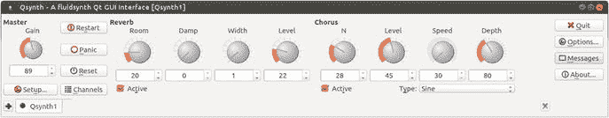

# 20.流体合成

FluidSynth 是一个播放 MIDI 文件的应用，也是一个 MIDI 应用库。

## 资源

以下是一些资源:

*   FluidSynth 主页( [`http://sourceforge.net/apps/trac/fluidsynth/`](http://sourceforge.net/apps/trac/fluidsynth/) )
*   FluidSynth 下载页面( [`http://sourceforge.net/projects/fluidsynth/`](http://sourceforge.net/projects/fluidsynth/) )
*   FluidSynth 1.1 开发者文档( [`http://fluidsynth.sourceforge.net/api/`](http://fluidsynth.sourceforge.net/api/) `)`
*   Sourcearchive.com`fluidsynth`文档( [`http://fluidsynth.sourcearchive.com/documentation/1.1.5-1/main.html`](http://fluidsynth.sourcearchive.com/documentation/1.1.5-1/main.html) )

## 演员

`fluidsynth`是一个命令行 MIDI 播放器。它在 ALSA 的命令行下运行，如下所示:

```sh
fluidsynth -a alsa -l <soundfont> <files...>

```

一种常用的声音字体是`/usr/share/sounds/sf2/FluidR3_GM.sf2`。

Qsynth 是`fluidsynth`的 GUI 界面。看起来像图 [20-1](#Fig1) 。



图 20-1。

Qsynth

## 播放 MIDI 文件

FluidSynth API 包括以下内容:

*   使用`new_fluid_player`创建的音序器
*   使用`new_fluid_synth`创建的合成器
*   使用`new_fluid_audio_driver`创建的音频播放器，它运行在一个单独的线程中
*   一个“设置”对象，可用于控制其他组件的许多功能，由`new_fluid_settings`创建，并由`fluid_settings_setstr`等调用修改

使用 ALSA 播放 MIDI 文件序列的典型程序如下。它创建各种对象，设置音频播放器使用 ALSA，然后将每个声音字体和 MIDI 文件添加到播放器中。然后对`fluid_player_play`的调用依次播放每个 MIDI 文件。

```sh
#include <fluidsynth.h>
#include <fluid_midi.h>

int main(int argc, char** argv)
{
    int i;
    fluid_settings_t* settings;
    fluid_synth_t* synth;
    fluid_player_t* player;
    fluid_audio_driver_t* adriver;

    settings = new_fluid_settings();
    fluid_settings_setstr(settings, "audio.driver", "alsa");
    synth = new_fluid_synth(settings);
    player = new_fluid_player(synth);

    adriver = new_fluid_audio_driver(settings, synth);
    /* process command line arguments */
    for (i = 1; i < argc; i++) {
        if (fluid_is_soundfont(argv[i])) {
            fluid_synth_sfload(synth, argv[1], 1);
        } else {
            fluid_player_add(player, argv[i]);
        }
    }
    /* play the midi files, if any */
    fluid_player_play(player);
    /* wait for playback termination */
    fluid_player_join(player);
    /* cleanup */
    delete_fluid_audio_driver(adriver);
    delete_fluid_player(player);
    delete_fluid_synth(synth);
    delete_fluid_settings(settings);
    return 0;
}

```

## 计算机编程语言

[`pyFluidSynth`](http://code.google.com/p/pyfluidsynth/) 是一个绑定到 FluidSynth 的 Python，允许你向 FluidSynth 发送 MIDI 命令。

## 结论

本章简要讨论了 FluidSynth 的编程模型和 API。