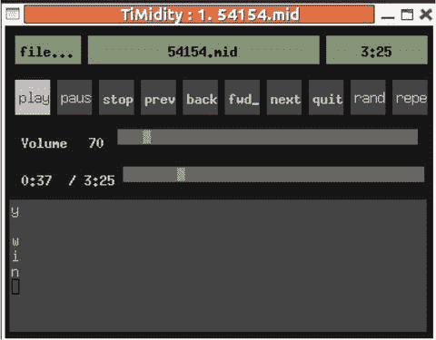

# 二十一、TiMidity

TiMidity被设计成一个独立的应用。为此，您应该构建一个新的“接口”它也可以被颠覆，就好像它是一个可以被调用的库。本章解释了这两种方式。

## TiMidity设计

TiMidity被设计成一个独立的应用。当它被构建时，你得到了一个可执行文件，但是没有一个可以被调用的函数库，不像 FluidSynth。

TiMidity你能做的就是增加不同的接口。例如，有 ncurses、Xaw 和哑接口可以在运行时调用，例如:

```sh
timidity -in ...
timidity -ia ...
timidity -id ...

```

还有其他更专业的应用，如 WRD、emacs、ALSA 和远程接口。

例如，Xaw 接口看起来如图 [21-1](#Fig1) 所示。



图 21-1。

TiMidity with Xaw interface

这个想法似乎是，如果你想要额外的东西，也许你应该建立一个自定义界面，并驱动它从TiMidity。

这并不总是适合我，因为我更喜欢能够以一种简单的方式将TiMidity嵌入到我自己的应用中。本章的其余部分从两方面来看。

*   将TiMidity转化为一个库，并将其包含在您自己的代码中
*   构建您自己的界面

## 把TiMidity变成图书馆

TiMidity不是被设计成一个库，所以你必须说服它。这并不难；你只需要摆弄一下构建系统。

### 托管环境挂钩

一个由应用控制的系统在一个受管理的环境中工作得不是很好，比如 Windows(或者更近一些的环境，比如 Android)。在这样的环境中，你不能调用TiMidity的`main`，而是调用属于框架的`main`函数。这将依次调用应用中的适当函数。

要使用这样的钩子，你需要下载TiMidity的源代码，要么从包管理器，要么从TiMidity++网站( [`http://timidity.sourceforge.net/`](http://timidity.sourceforge.net/) )。

出于谨慎，`main`函数的变体在文件`timidity/timidity.c`中。被各种`define`控制，可以有`main`或者`win_main`。更有趣的定义之一是`ANOTHER_MAIN`。如果这样定义，那么`main`函数的任何版本都不会被编译，你会得到一个自由主对象模块。

如果从顶级源目录按以下方式构建TiMidity，将产生一个错误，即`main`函数未定义:

```sh
CFLAGS="-DANOTHER_MAIN" ./configure
make

```

这是一个钩子，你需要把TiMidity从一个独立的应用变成能够被另一个应用调用的库。请注意，您不能仅仅从构建中删除`timidity/timidity.c`。该文件包含太多其他关键功能！

### 建造图书馆

要将TiMidity构建为一个静态库，移除前面所示的`main`函数，并尝试构建TiMidity。我发现我还需要指定我想要使用的输出系统，比如 ALSA。

```sh
CFLAGS="-DANOTHER_MAIN" ./configure --enable-audio=alsa
nake clean
make

```

这构建了几个`.ar`文件和许多对象`.o`模块，但无法构建最终的`timidity`可执行文件，因为(当然)没有`main`函数。它还会在`timidity`子目录中留下一堆未链接的文件。

通过从TiMidity源目录的顶部运行以下命令，可以将所有的目标模块收集到一个归档文件中:

```sh
ar cru  libtimidity.a */*.o
ranlib libtimidity.a

```

因为您必须从源代码开始构建TiMidity，所以在您尝试构建这个备选库版本之前，请检查它是否在正常模式下工作。通过这种方式，你可以发现你需要，比如说，`libasound-dev`库来使用 ALSA，在你被其他东西弄混之前！

### 图书馆入口点

用`ANOTHER_MAIN`构建的TiMidity暴露了这些公共入口点:

```sh
void timidity_start_initialize(void);
int timidity_pre_load_configuration(void);
int timidity_post_load_configuration(void);
void timidity_init_player(void);
int timidity_play_main(int nfiles, char **files);
int got_a_configuration;

```

它们似乎没有在任何方便的头文件中定义。

### 最小的应用

真正TiMidity的应用被编码为在许多不同的操作系统上使用许多不同版本的库。如前所述，在构建目标文件和库的过程中，大部分依赖项都被考虑进去了。

一个最小的应用只是在`my_main.c`中的库入口点周围包装你自己的`main`。

```sh
#include <stdio.h>

extern void timidity_start_initialize(void);
extern int timidity_pre_load_configuration(void);
extern int timidity_post_load_configuration(void);
extern void timidity_init_player(void);
extern int timidity_play_main(int nfiles, char **files);
extern int got_a_configuration;

int main(int argc, char **argv)
{
    int err, main_ret;

    timidity_start_initialize();

    if ((err = timidity_pre_load_configuration()) != 0)
        return err;

    err += timidity_post_load_configuration();

    if (err) {
        printf("couldn't load configuration file\n");
        exit(1);
    }

    timidity_init_player();

    main_ret = timidity_play_main(argc, argv);

    return main_ret;
}

```

`compile`命令需要引入TiMidity库和任何其他需要的库，用于 ALSA 应用。

```sh
my_timidity: my_main.o
        gcc -g -o my_timidity my_main.o libtimidity.a  -lasound -lm

```

### 向 MIDI 文件播放背景视频

作为一个更复杂的例子，让我们看看在播放 MIDI 文件的同时播放一个视频文件。假设视频文件没有音频成分，并且没有尝试在两个流之间执行任何同步——这是额外的复杂性！

要播放视频文件，您可以使用 FFmpeg 库将视频流解码为视频帧。然后，您需要在某种 GUI 对象中显示这些帧，有许多工具包可以做到这一点。我选择了 Gtk 工具包，因为它是 Gnome 的基础，是 C 语言的，支持许多其他东西，比如 i18n 等等。我的代码是基于斯蒂芬·德朗格的“一个 ffmpeg 和 SDL 教程”( [`http://dranger.com/ffmpeg/`](http://dranger.com/ffmpeg/) )，它使用了 SDL 工具包来显示。

这使用`pthreads`包在单独的线程中运行视频和 MIDI。我通过硬编码文件名和固定视频帧的大小来作弊。让它在 Gtk 3.0 下工作真的很糟糕，因为 Gtk 3.0 已经移除了像素图，而且花了太多太长的时间才发现发生了什么。

我将代码分成了两个文件，一个使用 Gtk 播放视频，另一个播放TiMidity库并调用视频。视频播放文件为`video_code.c`。此处省略了代码，因为它本质上是第 [15 章](15.html)中描述的代码。

文件`video_player.c`设置TiMidity环境，调用视频在后台播放，然后调用`play_midi`。内容如下:

```sh
#include <string.h>
#include <pthread.h>
#include <stdio.h>
#include <stdlib.h>

void timidity_start_initialize(void);
int timidity_pre_load_configuration(void);
int timidity_post_load_configuration(void);
void timidity_init_player(void);

void *init_gtk(void *args);
void init_ffmpeg();

#define MIDI_FILE "54154.mid"

static void *play_midi(void *args) {
    char *argv[1];
    argv[0] = MIDI_FILE;
    int argc = 1;

    timidity_play_main(argc, argv);

    printf("Audio finished\n");
    exit(0);
}

int main(int argc, char** argv)
{

    int i;

    /* Timidity stuff */
    int err;

    timidity_start_initialize();
    if ((err = timidity_pre_load_configuration()) == 0) {
        err = timidity_post_load_configuration();
    }
    if (err) {
        printf("couldn't load configuration file\n");
        exit(1);
    }

    timidity_init_player();

    init_ffmpeg();
    pthread_t tid_gtk;
    pthread_create(&tid_gtk, NULL, init_gtk, NULL);

    play_midi(NULL);
    return 0;
}

```

## 构建新界面

前面的部分播放了 MIDI 和背景视频，本质上是作为独立的应用，作为独立的非交互线程。TiMidity允许一个用户界面的更大集成，可以动态地添加到TiMidity中。

### 共享对象

你可以构建自己的接口，添加到TiMidity中，而不用改变或重新编译TiMidity。这样的接口被构建为可动态加载的共享库，当TiMidity开始时被加载。

你必须小心编译和链接标志来构建这些库(参见 [`http://stackoverflow.com/questions/7252550/loadable-bash-builtin`](http://stackoverflow.com/questions/7252550/loadable-bash-builtin) “在 Linux 中构建共享对象”)。为了从`my_interface.c`构建共享对象`if_my_interface.so`，我使用了以下代码:

```sh
gcc  -fPIC $(CFLAGS) -c -o my_interface.o my_interface.c
gcc -shared -o if_my_interface.so my_interface.o

```

TiMidity只会加载以`if_`开头的文件。它们可以驻留在任何目录中，默认为类似于`/usr/lib/timidity`或`/usr/local/lib/timidity`(参见`timidity -h`中的“支持的动态加载接口”目录)。

加载动态模块的默认目录可以用选项`-d`覆盖，如下所示:

```sh
timidity -d. -im --trace 54154.mid

```

### 入口点

每个接口必须有一个可以被动态加载器调用的唯一函数。回想一下，使用命令行选项`-i`选择接口，例如`timidity -iT ...`，以选择 VT100 接口。你的接口必须有一个不被任何其他接口使用的 ASCII 字母标识符，比如说`m`代表“我的接口”然后加载程序将寻找一个函数，如下所示，其中函数名中的`m`是标识符:

```sh
ControlMode *interface_m_loader(void)

```

这个函数很简单:它只是返回类型为`ControlMode`的结构的地址，该结构在接口代码的其他地方定义。

```sh
ControlMode *interface_m_loader(void)
{
    return &ctl;
}

```

### 控制方式

`ControlMode`结构如下:

```sh
typedef struct {
  char *id_name, id_character;
  char *id_short_name;
  int verbosity, trace_playing, opened;

  int32 flags;

  int  (*open)(int using_stdin, int using_stdout);
  void (*close)(void);
  int (*pass_playing_list)(int number_of_files, char *list_of_files[]);
  int  (*read)(int32 *valp);
  int  (*write)(char *buf, int32 size);
  int  (*cmsg)(int type, int verbosity_level, char *fmt, ...);
  void (*event)(CtlEvent *ev);  /* Control events */
} ControlMode;

```

这定义了关于接口和一组函数的信息，这些函数由TiMidity调用，以响应TiMidity内的事件和动作。例如，对于“我的界面”,该结构如下:

```sh
ControlMode ctl=
    {
        "my interface", 'm',
        "my iface",
        1,          /* verbosity */
        0,          /* trace playing */
        0,          /* opened */
        0,          /* flags */
        ctl_open,
        ctl_close,
        pass_playing_list,
        ctl_read,
        NULL,       /* write */
        cmsg,
        ctl_event
    };

```

这些领域有些是显而易见的，但有些则不那么明显。

`open`

*   调用这个函数来设置哪些文件用于 I/O。

`close`

*   这叫做关闭它们。

`pass_playing_list`

*   这个函数被传递了一个要播放的文件列表。最有可能的操作是遍历这个列表，对每个列表调用`play_midi_file`。

`read`

*   我还不确定这是干什么用的。

`write`

*   我还不确定这是干什么用的。

`cmsg`

*   这被称为信息消息。

`event`

*   这是处理 MIDI 控制事件的主要功能。通常，对于每种类型的控制事件，它都是一个大开关。

### 包括文件

这太乱了。一个典型的接口将需要知道TiMidity使用的一些常数和函数。虽然这些是为TiMidity而有逻辑地组织起来的，但是对于一个新的界面来说，它们不是方便地组织起来的。所以，你必须不断地引入额外的包含，这些额外的包含指向其他外部的，需要更多的包含，等等。这些可能在不同的目录中，比如`timidity`和`utils`，所以你必须指向许多不同的包含目录。

请注意，您将需要TiMidity的源代码来获得这些包含文件；你可以从 SourceForge TiMidity++下载( [`http://sourceforge.net/projects/timidity/?source=dlp`](http://sourceforge.net/projects/timidity/?source=dlp) )。

### 我的简单界面

这基本上和TiMidity中内置的“哑”接口做的是一样的。它是从当前目录加载的，并通过以下命令调用:

```sh
timidity -im -d. 54154.mid

```

代码在一个文件中，`my_interface.c`。

下面的代码中有两个主要的函数，其余的都省略了。重要的功能有`ctl_event`和`ctl_lyric`。函数`ctl_event`处理TiMidity产生的事件。对于这个接口，您只想在播放时打印歌词，所以当一个`CTLE_LYRIC`事件发生时，调用`ctl_lyric`。`ctl_lyric`功能使用TiMidity功能`event2string`查找歌词，并将其打印到输出，如果需要，根据歌词文本打印换行符。接口文件如下所示:

```sh
/*
  my_interface.c
*/

#ifdef HAVE_CONFIG_H
#include "config.h"
#endif /* HAVE_CONFIG_H */
#include <stdio.h>
#include <stdlib.h>
#include <stdarg.h>
#ifndef NO_STRING_H
#include <string.h>
#else
#include <strings.h>
#endif

#include "support.h"
#include "timidity.h"
#include "output.h"
#include "controls.h"
#include "instrum.h"
#include "playmidi.h"
#include "readmidi.h"

static int ctl_open(int using_stdin, int using_stdout);
static void ctl_close(void);
static int ctl_read(int32 *valp);
static int cmsg(int type, int verbosity_level, char *fmt, ...);
static void ctl_total_time(long tt);
static void ctl_file_name(char *name);
static void ctl_current_time(int ct);
static void ctl_lyric(int lyricid);
static void ctl_event(CtlEvent *e);
static int pass_playing_list(int number_of_files, char *list_of_files[]);

#define ctl karaoke_control_mode

ControlMode ctl=
    {
        "my interface", 'm',
        "my iface",
        1,          /* verbosity */
        0,          /* trace playing */
        0,          /* opened */
        0,          /* flags */
        ctl_open,
        ctl_close,
        pass_playing_list,
        ctl_read,
        NULL,       /* write */
        cmsg,
        ctl_event
    };

static FILE *outfp;
int karaoke_error_count;
static char *current_file;
struct midi_file_info *current_file_info;

static int pass_playing_list(int number_of_files, char *list_of_files[]) {
    int n;

    for (n = 0; n < number_of_files; n++) {
        printf("Playing list %s\n", list_of_files[n]);

        current_file = list_of_files[n];

        play_midi_file( list_of_files[n]);
    }
    return 0;
}

/*ARGSUSED*/
static int ctl_open(int using_stdin, int using_stdout)
{
    // sets output channel and prints info about the file

}

static void ctl_close(void)
{
    // close error channel

}

/*ARGSUSED*/
static int ctl_read(int32 *valp)
{
    return RC_NONE;
}

static int cmsg(int type, int verbosity_level, char *fmt, ...)
{
    // prints an error message

    return 0;
}

static void ctl_total_time(long tt)
{
    // counts playing time

}

static void ctl_file_name(char *name)
{
    // prints playing status

}

static void ctl_current_time(int secs)
{
    // keeps track of current time

}

static void ctl_lyric(int lyricid)
{
    char *lyric;

    current_file_info = get_midi_file_info(current_file, 1);

    lyric = event2string(lyricid);
    if(lyric != NULL)
        {
            if(lyric[0] == ME_KARAOKE_LYRIC)
                {
                    if(lyric[1] == '/' || lyric[1] == '\\')
                        {
                            fprintf(outfp, "\n%s", lyric + 2);
                            fflush(outfp);
                        }
                    else if(lyric[1] == '@')
                        {
                            if(lyric[2] == 'L')
                                fprintf(outfp, "\nLanguage: %s\n", lyric + 3);
                            else if(lyric[2] == 'T')
                                fprintf(outfp, "Title: %s\n", lyric + 3);
                            else
                                fprintf(outfp, "%s\n", lyric + 1);
                        }
                    else
                        {
                            fputs(lyric + 1, outfp);
                            fflush(outfp);
                        }
                }
            else
                {
                    if(lyric[0] == ME_CHORUS_TEXT || lyric[0] == ME_INSERT_TEXT)
                        fprintf(outfp, "\r");
                    fputs(lyric + 1, outfp);
                    fflush(outfp);
                }
        }
}

static void ctl_event(CtlEvent *e)
{
    switch(e->type)
        {
        case CTLE_NOW_LOADING:
            ctl_file_name((char *)e->v1);
            break;
        case CTLE_LOADING_DONE:
            // MIDI file is loaded, about to play
            current_file_info = get_midi_file_info(current_file, 1);
            if (current_file_info != NULL) {
                printf("file info not NULL\n");
            } else {
                printf("File info is NULL\n");
            }
            break;
        case CTLE_PLAY_START:

            ctl_total_time(e->v1);
            break;
        case CTLE_CURRENT_TIME:
            ctl_current_time((int)e->v1);
            break;
#ifndef CFG_FOR_SF
        case CTLE_LYRIC:
            ctl_lyric((int)e->v1);
            break;
#endif
        }
}

/*
 * interface_<id>_loader();
 */
ControlMode *interface_m_loader(void)
{
    return &ctl;
}

```

它被编译成接口文件`if_my_interface.so`，如下所示:

```sh
gcc  -fPIC -c -o my_interface.o my_interface.c
gcc -shared  -o if_my_interface.so my_interface.o

```

### 运行我的简单界面

当我试图使用标准包TiMidity v2.13.2-40.1 运行该接口时，它在一个内存释放调用中崩溃。代码被剥离了，所以追踪原因并不容易，我还没有费心去做——我不确定软件包发行版是针对什么库、代码版本等等进行编译的。

我从源头上建立了自己的TiMidity的副本。这工作得很好。请注意，当您从源代码构建TiMidity时，您需要指定它可以加载动态模块，例如，使用以下代码:

```sh
congfigure --enable-audio=alsa --enable-vt100 --enable-debug –enable-dynamic

```

与源建立在子目录TiMidity++-2.14.0，玩使用这个界面是由

```sh
TiMidity++-2.14.0/timidity/timidity -d. -im 54154.mid

```

### 向 MIDI 文件播放背景视频

你可以从播放之前给出的视频中获取代码，并把它作为TiMidity系统的“后端”作为“视频”接口。本质上所有需要做的就是从简单的接口改变`ctl_open`来调用 Gtk 代码播放视频，改变接口的身份。

新的“视频”界面是`video_player_interface.c`。唯一重要的变化是对`ctl_open`的修改，现在内容如下:

```sh
extern void init_gtk(void *args);

/*ARGSUSED*/
static int ctl_open(int using_stdin, int using_stdout)
{

    outfp=stdout;
    ctl.opened=1;

    init_ffmpeg();

    /* start Gtk in its own thread */
    pthread_t tid_gtk;
    pthread_create(&tid_gtk, NULL, init_gtk, NULL);

    return 0;
}

if_video_player.so

```

构建命令如下所示:

```sh
CFLAGS = -ITiMidity++-2.14.0/timidity -ITiMidity++-2.14.0 -ITiMidity++-2.14.0/utils  $(shell pkg-config --cflags gtk+-3.0 libavformat libavcodec libswscale libavutil )

LIBS3 =  $(shell pkg-config --libs gtk+-3.0 libavformat libavcodec libswscale libavutil )

video_code.o: video_code.c
        gcc  -fPIC $(CFLAGS) -c -o video_code.o video_code.c

if_video_player.so: video_player_interface.c video_code.o
        gcc  -fPIC $(CFLAGS) -c -o video_player_interface.o video_player_interface.c
        gcc -shared -o if_video_player.so video_player_interface.o video_code.o \
        $(LIBS3)

```

它使用以下命令运行:

```sh
TiMidity++-2.14.0/timidity/timidity -d. -iv
 54154.mid

```

## 结论

TiMidity不是为其他应用设计的。要么你添加一个新的接口，要么你绕开TiMidity的设计去生产一个库。本章展示了这两种机制，并用简单和更复杂的例子进行了说明。