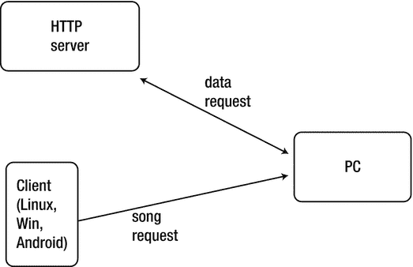
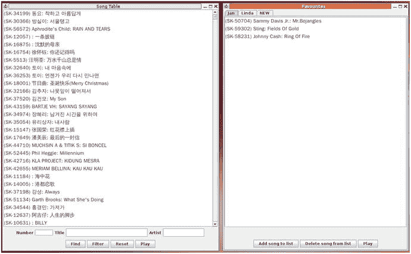
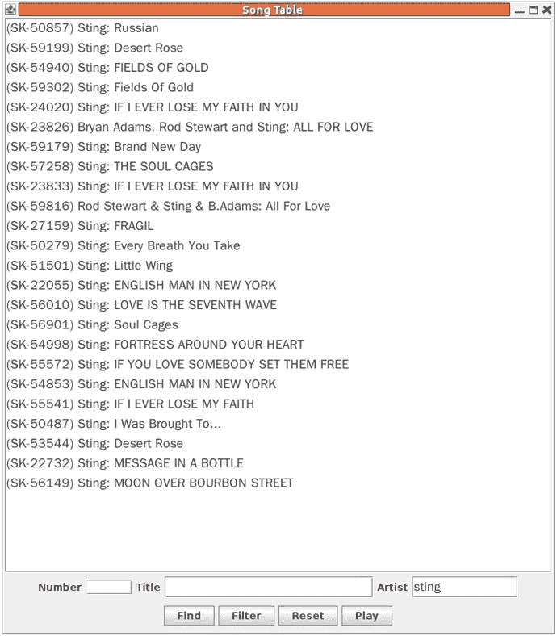

# 24.MP3+G

本章探讨如何使用 MP3+G 格式的卡拉 ok 文件。文件从服务器下载到与显示设备(我的电视)相连的(小)电脑上。使用运行在 Linux 或 Windows 上的 Java Swing 应用程序选择文件。

在第 [23](23.html) 章中，我讨论了用于卡拉 ok 的 MP3+G 格式。每首“歌曲”由两个文件组成:音频的 MP3 文件和视频的低质量 CDG 文件(主要是歌词)。通常这两个文件是压缩在一起的。

使用`cdrdao`和`cdgrip.py`可以从 CDG 卡拉 ok 光盘中提取文件。当给定 MP3 文件作为参数时，VLC 可以播放它们。它将从同一个目录中提取 CDG 文件。

许多人已经收集了相当多的 MP3+G 歌曲。在这一章中，你将考虑如何列出并播放它们，同时保存喜爱歌曲的列表。本章着眼于一个 Java 应用程序来执行这一点，这实际上只是标准的 Swing 编程。本章不考虑特殊的音频或卡拉 ok 功能。

我把我的文件保存在服务器上。我可以在家里的其他计算机上以多种方式访问它们:Samba 共享、HTTP 下载、SSH 文件系统(`sshfs`)等等。一些机制不如其他机制可移植；比如`sshfs`不是标准的 Windows 应用，SMB/Samba 也不是标准的 Android 客户端。所以，在使用`sshfs`(标准 Linux 下的一个显而易见的工具)让一切工作正常后，我将应用程序转换成 HTTP 访问。这有它自己的皱纹。

环境如图 [24-1](#Fig1) 所示。



图 24-1。

Client requesting songs on an HTTP server to play on PC

Linux 和 Windows 的 Java 客户端应用程序如图 [24-2](#Fig2) 所示。



图 24-2。

User interface on client

这显示了歌曲的主窗口，在它的右边是两个人的收藏夹窗口，Jan 和 Linda。该应用程序处理多种语言；显示英语、韩语和中文。

过滤器可以应用于主歌曲列表。例如，对歌手 Sting 的过滤给出了图 [24-3](#Fig3) 。



图 24-3。

Songs by Sting

当点击播放时，关于选择的信息被发送到媒体播放器，目前是一个连接到我的 HiFi/TV 的 CubieBoard2。媒体计算机从 HTTP 服务器获取文件。使用 VLC 在媒体计算机上播放文件，因为它可以处理 MP3+G 文件。

## 文件组织

如果 MP3+G 歌曲是从 CDG 卡拉 ok 光盘中抓取的，那么自然的组织将是把文件存储在目录中，每个目录对应一张光盘。通过按普通艺术家、音乐风格等对目录进行分组，你可以给出更多的结构。你可以假设一个目录结构，音乐文件作为叶节点。这些文件保存在 HTTP 服务器上。

我的服务器上目前有大量这样的文件。需要向客户提供关于这些文件的信息。经过一些试验后，使用 Java 的对象序列化方法创建并序列化了一个`SongInformation`的`Vector`。序列化文件也保存在 HTTP 服务器上。当客户机启动时，它从 HTTP 服务器获取这个文件并反序列化它。

构建这个向量意味着遍历 HTTP 服务器上的目录树，并在遍历过程中记录信息。遍历目录树的 Java 代码相当简单。如果您希望它是独立于操作系统的，这有点乏味，但是 Java 1.7 引入了一些机制来使这变得更容易。这些属于新的 I/O ( `NIO.2`)系统。第一类重要性是 [`java.nio.file.Path`](http://docs.oracle.com/javase/7/docs/api/java/nio/file/Path.html) ，它是一个可以用来在文件系统中定位文件的对象。它通常代表一个依赖于系统的文件路径。一个表示文件位置的字符串，比如说，在 Linux 或 Windows 文件系统中，可以用下面的代码转换成一个`Path`对象:

```sh
Path startingDir = FileSystems.getDefault().getPath(dirString);

```

从给定路径遍历文件系统是通过遍历文件树并在每个点调用一个节点“访问者”来完成的。visitor 是`SimpleFileVisitor<Path>`的子类，只有对于叶节点，您才需要重写该方法。

```sh
public FileVisitResult visitFile(Path file, BasicFileAttributes attr)

```

遍历是通过以下方式完成的:

```sh
Visitor pf = new Visitor();
Files.walkFileTree(startingDir, pf);

```

Java 教程网站上的“遍历文件树”( [`http://docs.oracle.com/javase/tutorial/essential/io/walk.html`](http://docs.oracle.com/javase/tutorial/essential/io/walk.html) )给出了对此的完整解释。您使用它将所有歌曲信息从光盘加载到`SongTable.java`中的歌曲路径向量中。

## 歌曲信息

关于每首歌曲的信息应该包括它在文件系统中的路径、艺术家的名字、歌曲的标题以及任何其他有用的信息。这个信息必须从歌曲的文件路径中提取出来。在我当前的设置中，文件如下所示:

```sh
/server/KARAOKE/Sonken/SK-50154 - Crosby, Stills - Carry On.mp3

```

每首歌曲都有一个合理的唯一标识符(SK-50154)，一个唯一的路径，一个艺术家和标题。相当简单的模式匹配代码可以提取这些部分，如下所示:

```sh
Path file = ...
String fname = file.getFileName().toString();
if (fname.endsWith(".zip") ||
    fname.endsWith(".mp3")) {
    String root = fname.substring(0, fname.length()-4);
    String parts[] = root.split(" - ", 3);
    if (parts.length != 3)
        return;

        String index = parts[0];
        String artist = parts[1];
        String title = parts[2];

        SongInformation info = new SongInformation(file,
                                                   index,
                                                   title,
                                                   artist);

```

(用`cdrip.py`制作的图案不太一样，但是代码很容易改。)

`SongInformation`类捕获这些信息，并且还包含针对不同字段进行字符串模式匹配的方法。例如，要检查标题是否匹配，请使用以下命令:

```sh
public boolean titleMatch(String pattern) {
    return title.matches("(?i).*" + pattern + ".*");
}

```

这提供了使用 Java 正则表达式支持的不区分大小写的匹配。详见 Lars Vogel 的《Java Regex 教程》( [`www.vogella.com/articles/JavaRegularExpressions/article.html`](http://www.vogella.com/articles/JavaRegularExpressions/article.html) )。

以下是完整的`SongInformation`文件:

```sh
import java.nio.file.Path;
import java.io.Serializable;

public class SongInformation implements Serializable {

    // Public fields of each song record

    public String path;

    public String index;

    /**
     * song title in Unicode
     */
    public String title;

    /**
     * artist in Unicode
     */
    public String artist;

    public SongInformation(Path path,
                           String index,
                           String title,
                           String artist) {
        this.path = path.toString();
        this.index = index;
        this.title = title;
        this.artist = artist;
    }

    public String toString() {
        return "(" + index + ") " + artist + ": " + title;
    }

    public boolean titleMatch(String pattern) {
        return title.matches("(?i).*" + pattern + ".*");
    }

    public boolean artistMatch(String pattern) {
        return artist.matches("(?i).*" + pattern + ".*");
    }

    public boolean numberMatch(String pattern) {
        return index.equals(pattern);
    }
}

```

## 歌曲表

`SongTable`通过遍历文件树构建了一个`SongInformation`对象的向量。

如果有很多歌曲(比如说，数以千计)，这会导致启动时间很慢。为了减少这种情况，一旦加载了一个表，就通过将它写入一个`ObjectOutputStream`来将它作为一个持久对象保存到磁盘上。下次程序启动时，会尝试使用`ObjectInputStream`从这里读回它。注意，您没有使用 Java 持久性 API ( [`http://en.wikibooks.org/wiki/Java_Persistence/What_is_Java_persistence%3F`](http://en.wikibooks.org/wiki/Java_Persistence/What_is_Java_persistence%3F) )。它是为 J2EE 设计的，对我们来说太重了。

`SongTable`还包括基于模式和标题(或艺术家或编号)之间的匹配来构建更小的歌曲表的代码。它可以搜索模式和歌曲之间的匹配，并基于匹配建立新的表。它包含一个指向原始表的指针，以便以后恢复。这允许模式搜索使用相同的数据结构。

`SongTable`的代码如下:

```sh
import java.util.Vector;
import java.io.FileInputStream;
import java.io.*;
import java.nio.charset.Charset;
import java.nio.file.Files;
import java.nio.file.Path;
import java.nio.file.Paths;
import java.nio.file.SimpleFileVisitor;
import java.nio.file.FileVisitResult;
import java.nio.file.FileSystems;
import java.nio.file.attribute.*;

class Visitor
    extends SimpleFileVisitor<Path> {

    private Vector<SongInformation> songs;

    public Visitor(Vector<SongInformation> songs) {
        this.songs = songs;
    }

    @Override
    public FileVisitResult visitFile(Path file,
                                   BasicFileAttributes attr) {
        if (attr.isRegularFile()) {
            String fname = file.getFileName().toString();
            //System.out.println("Regular file " + fname);
            if (fname.endsWith(".zip") ||
                fname.endsWith(".mp3") ||
                fname.endsWith(".kar")) {
                String root = fname.substring(0, fname.length()-4);
                //System.err.println(" root " + root);
                String parts[] = root.split(" - ", 3);
                if (parts.length != 3)
                    return java.nio.file.FileVisitResult.CONTINUE;

                String index = parts[0];
                String artist = parts[1];
                String title = parts[2];

                SongInformation info = new SongInformation(file,
                                                           index,
                                                           title,
                                                           artist);
                songs.add(info);
            }
        }

        return java.nio.file.FileVisitResult.CONTINUE;
    }
}

public class SongTable {

    private static final String SONG_INFO_ROOT = "/server/KARAOKE/KARAOKE/";

    private static Vector<SongInformation> allSongs;

    public Vector<SongInformation> songs =
        new Vector<SongInformation>  ();

    public static long[] langCount = new long[0x23];

    public SongTable(Vector<SongInformation> songs) {
        this.songs = songs;
    }

    public SongTable(String[] args) throws java.io.IOException,
                                           java.io.FileNotFoundException {
        if (args.length >= 1) {
            System.err.println("Loading from " + args[0]);
            loadTableFromSource(args[0]);
            saveTableToStore();
        } else {
            loadTableFromStore();
        }
    }

    private boolean loadTableFromStore() {
        try {

            File storeFile = new File("/server/KARAOKE/SongStore");

            FileInputStream in = new FileInputStream(storeFile);
            ObjectInputStream is = new ObjectInputStream(in);
            songs = (Vector<SongInformation>) is.readObject();
            in.close();
        } catch(Exception e) {
            System.err.println("Can't load store file " + e.toString());
            return false;
        }
        return true;
    }

    private void saveTableToStore() {
        try {
            File storeFile = new File("/server/KARAOKE/SongStore");
            FileOutputStream out = new FileOutputStream(storeFile);
            ObjectOutputStream os = new ObjectOutputStream(out);
            os.writeObject(songs);
            os.flush();
            out.close();
        } catch(Exception e) {
            System.err.println("Can't save store file " + e.toString());
        }
    }

    private void loadTableFromSource(String dir) throws java.io.IOException,
                              java.io.FileNotFoundException {

        Path startingDir = FileSystems.getDefault().getPath(dir);
        Visitor pf = new Visitor(songs);
        Files.walkFileTree(startingDir, pf);
    }

    public java.util.Iterator<SongInformation> iterator() {
        return songs.iterator();
    }

    public SongTable titleMatches( String pattern) {
        Vector<SongInformation> matchSongs =
            new Vector<SongInformation>  ();

        for (SongInformation song: songs) {
            if (song.titleMatch(pattern)) {
                matchSongs.add(song);
            }
        }
        return new SongTable(matchSongs);
    }

     public SongTable artistMatches( String pattern) {
        Vector<SongInformation> matchSongs =
            new Vector<SongInformation>  ();

        for (SongInformation song: songs) {
            if (song.artistMatch(pattern)) {
                matchSongs.add(song);
            }
        }
        return new SongTable(matchSongs);
    }

    public SongTable numberMatches( String pattern) {
        Vector<SongInformation> matchSongs =
            new Vector<SongInformation>  ();

        for (SongInformation song: songs) {
            if (song.numberMatch(pattern)) {
                matchSongs.add(song);
            }
        }
        return new SongTable(matchSongs);
    }

    public String toString() {
        StringBuffer buf = new StringBuffer();
        for (SongInformation song: songs) {
            buf.append(song.toString() + "\n");
        }
        return buf.toString();
    }

    public static void main(String[] args) {
        // for testing
        SongTable songs = null;
        try {
            songs = new SongTable(new String[] {SONG_INFO_ROOT});
        } catch(Exception e) {
            System.err.println(e.toString());
            System.exit(1);
        }

        System.out.println(songs.artistMatches("Tom Jones").toString());

        System.exit(0);
    }
}

```

## 收藏夹

我已经为我的家庭环境系统建立了这个系统，并且我有一群定期来访的朋友。我们每个人都有自己喜欢的歌曲要唱，所以我们在纸片上列出了丢失的歌曲、洒了酒的歌曲等等。所以，这个系统包括了一个最喜欢的歌曲列表。

每个收藏夹列表本质上都是另一个`SongTable`。但是我在桌子周围放了一个`JList`来显示它。`JList`使用了一个`DefaultListModel`，构造函数通过遍历这个表并添加元素将一个歌曲表加载到这个列表中。

```sh
        int n = 0;
        java.util.Iterator<SongInformation> iter = favouriteSongs.iterator();
        while(iter.hasNext()) {
            model.add(n++, iter.next());
        }

```

其他 Swing 代码在底部添加了三个按钮:

*   将歌曲添加到列表
*   从列表中删除歌曲
*   播放音乐

将一首歌曲添加到列表意味着从主歌曲表中取出所选项目，并将其添加到该表中。主表被传递到构造函数中，只是为了获取它的选择而保留。所选对象被添加到 Swing `JList`和 favorites `SongTable`中。

播放一首歌曲的方法很简单:歌曲的完整路径被写入标准输出，换行结束。然后，管道中的另一个程序可以拾取它；这将在本章的后面介绍。

最喜欢的东西如果不能从一天坚持到下一天就没什么用了！因此，与之前相同的对象存储方法被用于完整的歌曲表。每次对服务器进行更改时，都会保存每个收藏夹文件。

以下是`Favourites`的代码:

```sh
import java.awt.*;
import java.awt.event.*;
import javax.swing.event.*;
import javax.swing.*;
import javax.swing.SwingUtilities;
import java.util.regex.*;
import java.io.*;
import java.nio.file.FileSystems;
import java.nio.file.*;

public class Favourites extends JPanel {
    private DefaultListModel model = new DefaultListModel();
    private JList list;

    // whose favoutites these are
    private String user;

    // songs in this favourites list
    private final SongTable favouriteSongs;

    // pointer back to main song table list
    private final SongTableSwing songTable;

    // This font displays Asian and European characters.
    // It should be in your distro.
    // Fonts displaying all Unicode are zysong.ttf and Cyberbit.ttf
    // See http://unicode.org/resources/fonts.html
    private Font font = new Font("WenQuanYi Zen Hei", Font.PLAIN, 16);

    private int findIndex = -1;

    public Favourites(final SongTableSwing songTable,
                      final SongTable favouriteSongs,
                      String user) {
        this.songTable = songTable;
        this.favouriteSongs = favouriteSongs;
        this.user = user;

        if (font == null) {
            System.err.println("Can't find font");
        }

        int n = 0;
        java.util.Iterator<SongInformation> iter = favouriteSongs.iterator();
        while(iter.hasNext()) {
            model.add(n++, iter.next());
        }

        BorderLayout mgr = new BorderLayout();

        list = new JList(model);
        list.setFont(font);
        JScrollPane scrollPane = new JScrollPane(list);

        setLayout(mgr);
        add(scrollPane, BorderLayout.CENTER);

        JPanel bottomPanel = new JPanel();
        bottomPanel.setLayout(new GridLayout(2, 1));
        add(bottomPanel, BorderLayout.SOUTH);

        JPanel searchPanel = new JPanel();
        bottomPanel.add(searchPanel);
        searchPanel.setLayout(new FlowLayout());

        JPanel buttonPanel = new JPanel();
        bottomPanel.add(buttonPanel);
        buttonPanel.setLayout(new FlowLayout());

        JButton addSong = new JButton("Add song to list");
        JButton deleteSong = new JButton("Delete song from list");
        JButton play = new JButton("Play");

        buttonPanel.add(addSong);
        buttonPanel.add(deleteSong);
        buttonPanel.add(play);

        play.addActionListener(new ActionListener() {
                public void actionPerformed(ActionEvent e) {
                    playSong();
                }
            });

        deleteSong.addActionListener(new ActionListener() {
                public void actionPerformed(ActionEvent e) {
                    SongInformation song = (SongInformation) list.getSelectedValue();
                    model.removeElement(song);
                    favouriteSongs.songs.remove(song);
                    saveToStore();
                }
            });

        addSong.addActionListener(new ActionListener() {
                public void actionPerformed(ActionEvent e) {
                    SongInformation song = songTable.getSelection();
                    model.addElement(song);
                    favouriteSongs.songs.add(song);
                    saveToStore();
                }
            });
     }

    private void saveToStore() {
        try {
            File storeFile = new File("/server/KARAOKE/favourites/" + user);
            FileOutputStream out = new FileOutputStream(storeFile);
            ObjectOutputStream os = new ObjectOutputStream(out);
            os.writeObject(favouriteSongs.songs);
            os.flush();
            out.close();
        } catch(Exception e) {
            System.err.println("Can't save favourites file " + e.toString());
        }
    }

    /**
     * "play" a song by printing its file path to standard out.
     * Can be used in a pipeline this way
     */
    public void playSong() {
        SongInformation song = (SongInformation) list.getSelectedValue();
        if (song == null) {
            return;
        }
        System.out.println(song.path.toString());
    }

    class SongInformationRenderer extends JLabel implements ListCellRenderer {

        public Component getListCellRendererComponent(
                                                      JList list,
                                                      Object value,
                                                      int index,
                                                      boolean isSelected,
                                                      boolean cellHasFocus) {
            setText(value.toString());
            return this;
        }
    }
}

```

## 所有收藏夹

这里没什么特别的。它只是加载每个人的表，并构建一个放在`JTabbedPane`中的`Favourites`对象。它还添加了一个用于添加更多用户的新选项卡。

`AllFavourites`的代码如下:

```sh
import java.awt.*;
import java.awt.event.*;
import javax.swing.*;
import java.util.Vector;
import java.nio.file.*;
import java.io.*;

public class AllFavourites extends JTabbedPane {
    private SongTableSwing songTable;

    public AllFavourites(SongTableSwing songTable) {
        this.songTable = songTable;

        loadFavourites();

        NewPanel newP = new NewPanel(this);
        addTab("NEW", null, newP);
    }

    private void loadFavourites() {
        String userHome = System.getProperty("user.home");
        Path favouritesPath = FileSystems.getDefault().getPath("/server/KARAOKE/favourites");
        try {
            DirectoryStream<Path> stream =
                Files.newDirectoryStream(favouritesPath);
            for (Path entry: stream) {
                int nelmts = entry.getNameCount();
                Path last = entry.subpath(nelmts-1, nelmts);
                System.err.println("Favourite: " + last.toString());
                File storeFile = entry.toFile();

                FileInputStream in = new FileInputStream(storeFile);
                ObjectInputStream is = new ObjectInputStream(in);
                Vector<SongInformation> favouriteSongs =
                    (Vector<SongInformation>) is.readObject();
                in.close();
                for (SongInformation s: favouriteSongs) {
                    System.err.println("Fav: " + s.toString());
                }

                SongTable favouriteSongsTable = new SongTable(favouriteSongs);
                Favourites f = new Favourites(songTable,
                                              favouriteSongsTable,
                                              last.toString());
                addTab(last.toString(), null, f, last.toString());
                System.err.println("Loaded favs " + last.toString());
            }
        } catch(Exception e) {
            System.err.println(e.toString());
        }
    }

    class NewPanel extends JPanel {
        private JTabbedPane pane;

        public NewPanel(final JTabbedPane pane) {
            this.pane = pane;

            setLayout(new FlowLayout());
            JLabel nameLabel = new JLabel("Name of new person");
            final JTextField nameField = new JTextField(10);
            add(nameLabel);
            add(nameField);

            nameField.addActionListener(new ActionListener(){
                    public void actionPerformed(ActionEvent e){
                        String name = nameField.getText();

                        SongTable songs = new SongTable(new Vector<SongInformation>());
                        Favourites favs = new Favourites(songTable, songs, name);

                        pane.addTab(name, null, favs);
                    }});

        }
    }
}

```

## 摇摆歌单

这主要是加载不同歌曲表和构建 Swing 界面的代码。它还根据匹配的模式过滤显示表。最初加载的表被保留用于恢复和修补匹配。`SongTableSwing`的代码如下:

```sh
import java.awt.*;
import java.awt.event.*;
import javax.swing.event.*;
import javax.swing.*;
import javax.swing.SwingUtilities;
import java.util.regex.*;
import java.io.*;

public class SongTableSwing extends JPanel {
   private DefaultListModel model = new DefaultListModel();
    private JList list;
    private static SongTable allSongs;

    private JTextField numberField;
    private JTextField langField;
    private JTextField titleField;
    private JTextField artistField;

    // This font displays Asian and European characters.
    // It should be in your distro.
    // Fonts displaying all Unicode are zysong.ttf and Cyberbit.ttf
    // See http://unicode.org/resources/fonts.html
    private Font font = new Font("WenQuanYi Zen Hei", Font.PLAIN, 16);
    // font = new Font("Bitstream Cyberbit", Font.PLAIN, 16);

    private int findIndex = -1;

    /**
     * Describe <code>main</code> method here.
     *
     * @param args a <code>String</code> value
     */
    public static final void main(final String[] args) {
        if (args.length >= 1 &&
            args[0].startsWith("-h")) {
            System.err.println("Usage: java SongTableSwing [song directory]");
            System.exit(0);
        }

        allSongs = null;
        try {
            allSongs = new SongTable(args);
        } catch(Exception e) {
            System.err.println(e.toString());
            System.exit(1);
        }

        JFrame frame = new JFrame();
        frame.setTitle("Song Table");
        frame.setSize(700, 800);
        frame.setDefaultCloseOperation(JFrame.EXIT_ON_CLOSE);

        SongTableSwing panel = new SongTableSwing(allSongs);
        frame.getContentPane().add(panel);

        frame.setVisible(true);

        JFrame favourites = new JFrame();
        favourites.setTitle("Favourites");
        favourites.setSize(600, 800);
        favourites.setDefaultCloseOperation(JFrame.EXIT_ON_CLOSE);

        AllFavourites lists = new AllFavourites(panel);
        favourites.getContentPane().add(lists);

        favourites.setVisible(true);

    }

    public SongTableSwing(SongTable songs) {

        if (font == null) {
            System.err.println("Can't fnd font");
        }

        int n = 0;
        java.util.Iterator<SongInformation> iter = songs.iterator();
        while(iter.hasNext()) {
            model.add(n++, iter.next());
            // model.add(n++, iter.next().toString());
        }

        BorderLayout mgr = new BorderLayout();

        list = new JList(model);
        // list = new JList(songs);
        list.setFont(font);
        JScrollPane scrollPane = new JScrollPane(list);

        // Support DnD
        list.setDragEnabled(true);

        setLayout(mgr);
        add(scrollPane, BorderLayout.CENTER);

        JPanel bottomPanel = new JPanel();
        bottomPanel.setLayout(new GridLayout(2, 1));
        add(bottomPanel, BorderLayout.SOUTH);

        JPanel searchPanel = new JPanel();
        bottomPanel.add(searchPanel);
        searchPanel.setLayout(new FlowLayout());

        JLabel numberLabel = new JLabel("Number");
        numberField = new JTextField(5);

        JLabel langLabel = new JLabel("Language");
        langField = new JTextField(8);

        JLabel titleLabel = new JLabel("Title");
        titleField = new JTextField(20);
        titleField.setFont(font);

        JLabel artistLabel = new JLabel("Artist");
        artistField = new JTextField(10);
        artistField.setFont(font);

        searchPanel.add(numberLabel);
        searchPanel.add(numberField);
        searchPanel.add(titleLabel);
        searchPanel.add(titleField);
        searchPanel.add(artistLabel);
        searchPanel.add(artistField);

        titleField.getDocument().addDocumentListener(new DocumentListener() {
                public void changedUpdate(DocumentEvent e) {
                    // rest find to -1 to restart any find searches
                    findIndex = -1;
                    // System.out.println("reset find index");
                }
                public void insertUpdate(DocumentEvent e) {
                    findIndex = -1;
                    // System.out.println("reset insert find index");
                }
                public void removeUpdate(DocumentEvent e) {
                    findIndex = -1;
                    // System.out.println("reset remove find index");
                }
            }
            );
        artistField.getDocument().addDocumentListener(new DocumentListener() {
                public void changedUpdate(DocumentEvent e) {
                    // rest find to -1 to restart any find searches
                    findIndex = -1;
                    // System.out.println("reset insert find index");
                }
                public void insertUpdate(DocumentEvent e) {
                    findIndex = -1;
                    // System.out.println("reset insert find index");
                }
                public void removeUpdate(DocumentEvent e) {
                    findIndex = -1;
                    // System.out.println("reset insert find index");
                }
            }
            );

        titleField.addActionListener(new ActionListener(){
                public void actionPerformed(ActionEvent e){
                    filterSongs();
                }});
        artistField.addActionListener(new ActionListener(){
                public void actionPerformed(ActionEvent e){
                    filterSongs();
                }});

        JPanel buttonPanel = new JPanel();
        bottomPanel.add(buttonPanel);
        buttonPanel.setLayout(new FlowLayout());

        JButton find = new JButton("Find");
        JButton filter = new JButton("Filter");
        JButton reset = new JButton("Reset");
        JButton play = new JButton("Play");
        buttonPanel.add(find);
        buttonPanel.add(filter);
        buttonPanel.add(reset);
        buttonPanel.add(play);

        find.addActionListener(new ActionListener() {
                public void actionPerformed(ActionEvent e) {
                    findSong();
                }
            });

        filter.addActionListener(new ActionListener() {
                public void actionPerformed(ActionEvent e) {
                    filterSongs();
                }
            });

        reset.addActionListener(new ActionListener() {
                public void actionPerformed(ActionEvent e) {
                    resetSongs();
                }
            });

        play.addActionListener(new ActionListener() {
                public void actionPerformed(ActionEvent e) {
                    playSong();
                }
            });

     }

    public void findSong() {
        String number = numberField.getText();
        String language = langField.getText();
        String title = titleField.getText();
        String artist = artistField.getText();

        if (number.length() != 0) {
            return;
        }

        for (int n = findIndex + 1; n < model.getSize(); n++) {
            SongInformation info = (SongInformation) model.getElementAt(n);

            if ((title.length() != 0) && (artist.length() != 0)) {
                if (info.titleMatch(title) && info.artistMatch(artist)) {
                        findIndex = n;
                        list.setSelectedIndex(n);
                        list.ensureIndexIsVisible(n);
                        break;
                }
            } else {
                if ((title.length() != 0) && info.titleMatch(title)) {
                    findIndex = n;
                    list.setSelectedIndex(n);
                    list.ensureIndexIsVisible(n);
                    break;
                } else if ((artist.length() != 0) && info.artistMatch(artist)) {
                    findIndex = n;
                    list.setSelectedIndex(n);
                    list.ensureIndexIsVisible(n);
                    break;

                }
            }

        }
    }

    public void filterSongs() {
        String title = titleField.getText();
        String artist = artistField.getText();
        String number = numberField.getText();
        SongTable filteredSongs = allSongs;

        if (allSongs == null) {
            return;
        }

        if (title.length() != 0) {
            filteredSongs = filteredSongs.titleMatches(title);
        }
        if (artist.length() != 0) {
            filteredSongs = filteredSongs.artistMatches(artist);
        }
        if (number.length() != 0) {
            filteredSongs = filteredSongs.numberMatches(number);
        }

        model.clear();
        int n = 0;
        java.util.Iterator<SongInformation> iter = filteredSongs.iterator();
        while(iter.hasNext()) {
            model.add(n++, iter.next());
        }
    }

    public void resetSongs() {
        artistField.setText("");
        titleField.setText("");
        model.clear();
        int n = 0;
        java.util.Iterator<SongInformation> iter = allSongs.iterator();
        while(iter.hasNext()) {
            model.add(n++, iter.next());
        }
    }
    /**
     * "play" a song by printing its file path to standard out.
     * Can be used in a pipeline this way
     */
    public void playSong() {
        SongInformation song = (SongInformation) list.getSelectedValue();
        if (song == null) {
            return;
        }
        System.out.println(song.path);
    }

    public SongInformation getSelection() {
        return (SongInformation) (list.getSelectedValue());
    }

    class SongInformationRenderer extends JLabel implements ListCellRenderer {

        public Component getListCellRendererComponent(
                                                      JList list,
                                                      Object value,
                                                      int index,
                                                      boolean isSelected,
                                                      boolean cellHasFocus) {
            setText(value.toString());
            return this;
        }
    }
}

```

## 播放歌曲

每当“播放”一首歌曲时，它的文件路径都被写入标准输出。这使得它适用于 bash shell 管道，如下所示:

```sh
#!/bin/bash

```

```sh
VLC_OPTS="--play-and-exit --fullscreen"

java  SongTableSwing |
while read line
do
        if expr match "$line" ".*mp3"
        then
                vlc $VLC_OPTS "$line"
        elif expr match "$line" ".*zip"
        then
                rm -f /tmp/karaoke/*
                unzip -d /tmp/karaoke "$line"
                vlc $VLC_OPTS /tmp/karaoke/*.mp3
        fi
done

```

## 可见光通讯

VLC 是一个非常灵活的媒体播放器。它依靠大量的插件来增强其基本的核心功能。您在前面的章节中看到，如果一个目录包含一个 MP3 文件和一个具有相同基本名称的 CDG 文件，那么通过让它播放 MP3 文件，它也将显示 CDG 视频。

卡拉 ok 玩家的普遍期望是，你可以调整速度和音高。目前 VLC 不能调整音高，但它有一个插件来调整速度(同时保持音高不变)。这个插件可以通过 VLC 的 Lua 接口访问。设置完成后，您可以从启动 VLC 的进程(如命令行 shell)通过标准输入发送如下命令:

```sh
rate 1.04

```

这将改变速度，保持音高不变。

设置 VLC 接受来自`stdin`的 Lua 命令可通过以下命令选项完成:

```sh
vlc -I luaintf --lua-intf cli ...

```

注意，这去掉了标准的 GUI 控件(菜单等等),只从`stdin`开始控制 VLC。

目前，给 VLC 增加俯仰控制并不简单。深呼吸。

*   关闭 PulseAudio，启动 Jack。
*   运行`jack-rack`并安装`TAP_pitch`过滤器。
*   用杰克输出运行 VLC。
*   使用`qjackctl`，通过`jack-rack`钩住 VLC 输出，输出到系统。
*   通过`jack-rack`图形用户界面控制俯仰。

## 通过网络播放歌曲

实际上，我想把服务器磁盘上的歌曲播放到与电视相连的 Raspberry Pi 或 CubieBoard 上，并从我腿上的上网本上控制播放。这是一个分布式系统。

在计算机上安装服务器文件很简单:可以使用 NFS、Samba 等等。我目前使用的`sshfs`如下:

```sh
sshfs -o idmap=user -o rw -o allow_other newmarch@192.168.1.101:/home/httpd/html /server

```

对于远程访问/控制，我用 TCP 客户机/服务器替换了上一节的`run`命令。在客户端，控制播放器，我有这个:

```sh
java SongTableSwing | client 192.168.1.7

```

在(Raspberry Pi/CubieBoard)服务器上，我运行以下代码:

```sh
#!/bin/bash
set -x
VLC_OPTS="--play-and-exit -f"

server |
while read line
do
        if expr match "$line" ".*mp3"
        then
                vlc $VLC_OPTS "$line"
        elif expr match "$line" ".*zip"
        then
                rm -f /tmp/karaoke/*
                unzip -d /tmp/karaoke "$line"
                vlc $VLC_OPTS /tmp/karaoke/*.mp3
        fi
done

```

客户机/服务器文件只是标准的 TCP 文件。客户端从标准输入中读取换行符结束的字符串，并将其写入服务器，服务器将同一行打印到标准输出中。这里是`client.c`:

```sh
#include <stdio.h>
#include <sys/types.h>
#include <sys/socket.h>
#include <netinet/in.h>
#include <stdlib.h>
#include <string.h>

#define SIZE 1024
char buf[SIZE];
#define PORT 13000
int main(int argc, char *argv[]) {
    int sockfd;
    int nread;
    struct sockaddr_in serv_addr;
    if (argc != 2) {
        fprintf(stderr, "usage: %s IPaddr\n", argv[0]);
        exit(1);
    }

    while (fgets(buf, SIZE , stdin) != NULL) {
        /* create endpoint */
        if ((sockfd = socket(AF_INET, SOCK_STREAM, 0)) < 0) {
            perror(NULL); exit(2);
        }
        /* connect to server */
        serv_addr.sin_family = AF_INET;
        serv_addr.sin_addr.s_addr = inet_addr(argv[1]);
        serv_addr.sin_port = htons(PORT);

        while (connect(sockfd,
                       (struct sockaddr *) &serv_addr,
                       sizeof(serv_addr)) < 0) {
            /* allow for timesouts etc */
            perror(NULL);
            sleep(1);
        }

        printf("%s", buf);
        nread = strlen(buf);
        /* transfer data and quit */
        write(sockfd, buf, nread);
        close(sockfd);
    }
}

```

这里是`server.c`:

```sh
#include <stdio.h>
#include <sys/types.h>
#include <sys/socket.h>
#include <netinet/in.h>
#include <stdlib.h>
#include <signal.h>

#define SIZE 1024
char buf[SIZE];
#define TIME_PORT 13000

int sockfd, client_sockfd;

void intHandler(int dummy) {
    close(client_sockfd);
    close(sockfd);
    exit(1);
}

int main(int argc, char *argv[]) {
    int sockfd, client_sockfd;
    int nread, len;
    struct sockaddr_in serv_addr, client_addr;
    time_t t;

    signal(SIGINT, intHandler);

    /* create endpoint */
    if ((sockfd = socket(AF_INET, SOCK_STREAM, 0)) < 0) {
        perror(NULL); exit(2);
    }
    /* bind address */
    serv_addr.sin_family = AF_INET;
    serv_addr.sin_addr.s_addr = htonl(INADDR_ANY);
    serv_addr.sin_port = htons(TIME_PORT);
    if (bind(sockfd,
             (struct sockaddr *) &serv_addr,
             sizeof(serv_addr)) < 0) {
        perror(NULL); exit(3);
    }
    /* specify queue */
    listen(sockfd, 5);
    for (;;) {
        len = sizeof(client_addr);
        client_sockfd = accept(sockfd,
                               (struct sockaddr *) &client_addr,
                               &len);
        if (client_sockfd == -1) {
            perror(NULL); continue;
        }
        while ((nread = read(client_sockfd, buf, SIZE-1)) > 0) {
            buf[nread] = '\0';
            fputs(buf, stdout);
            fflush(stdout);
        }
        close(client_sockfd);
    }
}

```

## 结论

本章展示了如何为 MP3+G 文件构建播放器。