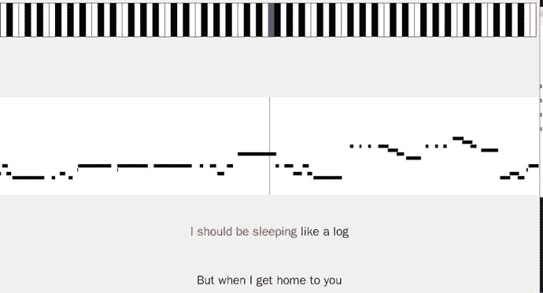
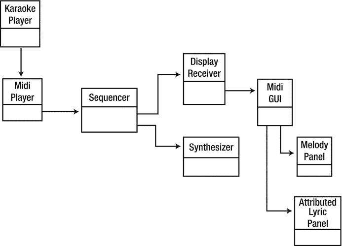

# 25.使用 Java 声音的卡拉 ok 应用程序

Java 对卡拉 ok 没有库支持。这太具体应用了。在这一章中，我给你一个可以播放 KAR 文件的卡拉 ok 播放器的代码。播放器将显示两行要播放的歌词，已经播放的单词用红色突出显示。在顶部，它显示了一个简单的钢琴键盘，其音符在 MIDI 文件的通道 1 中播放。中间显示旋律线，中间竖线显示当前播放的音符。

玩家长得像图 [25-1](#Fig1) 。



图 25-1。

User interface of karaoke player

图 [25-2](#Fig2) 显示了 UML 图。



图 25-2。

Class diagram of karaoke player

## 资源

以下是一些资源:

*   卡拉 ok 时间( [`http://gnese.free.fr/Projects/KaraokeTime/?language=en`](http://gnese.free.fr/Projects/KaraokeTime/?language=en) )，下载为`KaraokeTime.zip`。
*   第[章第 8](08.html) ，【MIDI 包概述】( [`http://docs.oracle.com/javase/7/docs/technotes/guides/sound/programmer_guide/chapter8.html#118852`](http://docs.oracle.com/javase/7/docs/technotes/guides/sound/programmer_guide/chapter8.html#118852) )

## 卡拉 ok 播放器

`KaraokePlayer`类提取卡拉 ok 文件的文件名，并创建一个`MidiPlayer`来处理该文件。

```sh
/*
 * KaraokePlayer.java
 *
 */

import javax.swing.*;

public class KaraokePlayer {

    public static void main(String[] args) throws Exception {
        if (args.length != 1) {
            System.err.println("KaraokePlayer: usage: " +
                             "KaraokePlayer <midifile>");
            System.exit(1);
        }
        String  strFilename = args[0];

        MidiPlayer midiPlayer = new MidiPlayer();
        midiPlayer.playMidiFile(strFilename);
    }
}

```

## 媒体播放机

`MidiPlayer`类从文件中创建一个`Sequence`。很多地方都需要序列信息，所以不是通过参数传递序列，而是存储在一个单独的(静态)对象中，一个`SequenceInformation`。这使得序列有效地成为系统的全局对象。

然后，播放器获得默认的音序器，并将 MIDI 事件传输到两个接收器对象:播放事件的默认合成器和管理所有 GUI 处理的`DisplayReceiver`。`Sequencer`方法`getTransmitter()`名不副实:每次调用它时，它都返回一个新的发送器，每次都向各自的接收器播放相同的事件。

以下摘自 Java SE 文档，具体来说，第 [10 章](10.html)，“发送和接收 MIDI 消息”( [`http://docs.oracle.com/javase/7/docs/technotes/guides/sound/programmer_guide/chapter10.html`](http://docs.oracle.com/javase/7/docs/technotes/guides/sound/programmer_guide/chapter10.html) ):

*   这段代码(在他们的例子中)引入了对`MidiDevice.getTransmitter`方法的双重调用，将结果分配给`inPortTrans1`和`inPortTrans2`。如前所述，一个设备可以拥有多个发射机和接收机。每次为给定设备调用`MidiDevice.getTransmitter()`时，都会返回另一个发送器，直到没有更多的发送器可用为止，此时会抛出一个异常。

这样，序列器可以发送给两个接收器。

接收者没有得到`MetaMessages`。这些包含文本或歌词事件等信息。`DisplayReceiver`被注册为`MetaEventListener`，这样它就可以管理这些事件以及其他事件。

`MidiPlayer`如下所示:

```sh
import javax.sound.midi.MidiSystem;
import javax.sound.midi.InvalidMidiDataException;
import javax.sound.midi.Sequence;
import javax.sound.midi.Receiver;
import javax.sound.midi.Sequencer;
import javax.sound.midi.Transmitter;
import javax.sound.midi.MidiChannel;
import javax.sound.midi.MidiDevice;
import javax.sound.midi.Synthesizer;
import javax.sound.midi.ShortMessage;
import javax.sound.midi.SysexMessage;

import java.io.File;
import java.io.IOException;

public class MidiPlayer {

    private DisplayReceiver receiver;

    public  void playMidiFile(String strFilename) throws Exception {
        File    midiFile = new File(strFilename);

        /*
         *      We try to get a Sequence object, loaded with the content
         *      of the MIDI file.
         */
        Sequence        sequence = null;
        try {
            sequence = MidiSystem.getSequence(midiFile);
        }
        catch (InvalidMidiDataException e) {
            e.printStackTrace();
            System.exit(1);
        }
        catch (IOException e) {
            e.printStackTrace();
            System.exit(1);
        }

        if (sequence == null) {
            out("Cannot retrieve Sequence.");
        } else {
            SequenceInformation.setSequence(sequence);
            playMidi(sequence);
        }
    }

    public  void playMidi(Sequence sequence) throws Exception {

        Sequencer sequencer = MidiSystem.getSequencer(true);
        sequencer.open();
        sequencer.setSequence(sequence);

        receiver = new DisplayReceiver(sequencer);
        sequencer.getTransmitter().setReceiver(receiver);
        sequencer.addMetaEventListener(receiver);

        if (sequencer instance of Synthesizer) {
            Debug.println("Sequencer is also a synthesizer");
        } else {
            Debug.println("Sequencer is not a synthesizer");
        }
        //sequencer.start();

        /*
        Synthesizer synthesizer = MidiSystem.getSynthesizer();
        synthesizer.open();

        if (synthesizer.getDefaultSoundbank() == null) {
            // then you know that java sound is using the hardware soundbank
            Debug.println("Synthesizer using h/w soundbank");
        } else Debug.println("Synthesizer using s/w soundbank");

        Receiver synthReceiver = synthesizer.getReceiver();
        Transmitter seqTransmitter = sequencer.getTransmitter();
        seqTransmitter.setReceiver(synthReceiver);
        MidiChannel[] channels = synthesizer.getChannels();
        Debug.println("Num channels is " + channels.length);
        */
        sequencer.start();

        /* default synth doesn't support pitch bending
        Synthesizer synthesizer = MidiSystem.getSynthesizer();
        MidiChannel[] channels = synthesizer.getChannels();
        for (int i = 0; i < channels.length; i++) {
            System.out.printf("Channel %d has bend %d\n", i, channels[i].getPitchBend());
            channels[i].setPitchBend(16000);
            System.out.printf("Channel %d now has bend %d\n", i, channels[i].getPitchBend());
        }
        */

        /* set volume - doesn't work */
        /*KaraokeUML
        for (int i = 0; i < channels.length; i++) {
            channels[i].controlChange(7, 0);
        }
        */
        /*
        System.out.println("Turning notes off");
        for (int i = 0; i < channels.length; i++) {
            channels[i].allNotesOff();
            channels[i].allSoundOff();
        }
        */

        /* set volume - doesn't work either */
        /*
        try {
            Thread.sleep(5000);
        } catch (InterruptedException e) {
            // TODO Auto-generated catch block
            e.printStackTrace();
        }

        if (synthReceiver == MidiSystem.getReceiver())
            System.out.println("Reciver is default");
        else
            System.out.println("Reciver is not default");
        System.out.println("Receiver is " + synthReceiver.toString());
        //synthReceiver = MidiSystem.getReceiver();
        System.out.println("Receiver is now " + synthReceiver.toString());
        ShortMessage volMessage = new ShortMessage();
        int midiVolume = 1;
        for (Receiver rec: synthesizer.getReceivers()) {
            System.out.println("Setting vol on recveiver " + rec.toString());
        for (int i = 0; i < channels.length; i++) {
            try {
                // volMessage.setMessage(ShortMessage.CONTROL_CHANGE, i, 123, midiVolume);
                volMessage.setMessage(ShortMessage.CONTROL_CHANGE, i, 7, midiVolume);
            } catch (InvalidMidiDataException e) {
                e.printStackTrace();
}
            synthReceiver.send(volMessage, -1);
            rec.send(volMessage, -1);
        }
        }
        System.out.println("Changed midi volume");
        */
        /* master volume control using sysex */
        /* http://www.blitter.com/∼russtopia/MIDI/∼jglatt/tech/midispec/mastrvol.htm */
        /*
        SysexMessage sysexMessage = new SysexMessage();
        /* volume values from http://www.bandtrax.com.au/sysex.htm */
        /* default volume 0x7F * 128 + 0x7F from */
        /*
        byte[] data = {(byte) 0xF0, (byte) 0x7F, (byte) 0x7F, (byte) 0x04,
                       (byte) 0x01, (byte) 0x0, (byte) 0x7F, (byte) 0xF7};
        sysexMessage.setMessage(data, data.length);
        synthReceiver.send(sysexMessage, -1);
        for (Receiver rec: synthesizer.getReceivers()) {
            System.out.println("Setting vol on recveiver " + rec.toString());
            rec.send(sysexMessage, -1);
        }
        */
     }

    public DisplayReceiver getReceiver() {
        return receiver;
    }

    private static void out(String strMessage)
    {
        System.out.println(strMessage);
    }
}

```

## 显示接收器

`DisplayReceiver`收集了作为`Receiver`的`ShortMessages`和作为`MetaEventListener`的`MetaMessages`。看音符和歌词都需要这些。

`DisplayReceiver`解码发送给它的笔记和文本。反过来，它将这些传递给一个`MidiGUI`来显示它们。这个类如下:

```sh
/**
 * DisplayReceiver
 *
 * Acts as a Midi receiver to the default Java Midi sequencer.
 * It collects Midi events and Midi meta messages from the sequencer.
 * these are handed to a UI object for display.
 *
 * The current UI object is a MidiGUI but could be replaced.
 */

import javax.sound.midi.*;
import javax.swing.SwingUtilities;

public class DisplayReceiver implements Receiver,
                                        MetaEventListener {
    private MidiGUI gui;KaraokeUML
    private Sequencer sequencer;
    private int melodyChannel = SequenceInformation.getMelodyChannel();

    public DisplayReceiver(Sequencer sequencer) {
        this.sequencer = sequencer;
        gui = new MidiGUI(sequencer);
    }

    public void close() {
    }

    /**
     * Called by a Transmitter to receive events
     * as a Receiver
     */
    public void send(MidiMessage msg, long timeStamp) {
        // Note on/off messages come from the midi player
        // but not meta messages

        if (msg instanceof ShortMessage) {
            ShortMessage smsg = (ShortMessage) msg;

            String strMessage = "Channel " + smsg.getChannel() + " ";

            switch (smsg.getCommand())
                {
                case Constants.MIDI_NOTE_OFF:
                    strMessage += "note Off " +
                        getKeyName(smsg.getData1()) + " " + timeStamp;
                    break;

                case Constants.MIDI_NOTE_ON:
                    strMessage += "note On " +
                        getKeyName(smsg.getData1()) + " " + timeStamp;
                    break;
                }
            Debug.println(strMessage);
            if (smsg.getChannel() == melodyChannel) {
                gui.setNote(timeStamp, smsg.getCommand(), smsg.getData1());
            }

        }
    }

    public void meta(MetaMessage msg) {
        Debug.println("Reciever got a meta message");
        if (((MetaMessage) msg).getType() == Constants.MIDI_TEXT_TYPE) {
            setLyric((MetaMessage) msg);
        } else if (((MetaMessage) msg).getType() == Constants.MIDI_END_OF_TRACK)  {
            System.exit(0);
        }
    }

    public void setLyric(MetaMessage message) {
        byte[] data = message.getData();
        String str = new String(data);
        Debug.println("Lyric +\"" + str + "\" at " + sequencer.getTickPosition());
        gui.setLyric(str);

    }

    private static String[] keyNames = {"C", "C#", "D", "D#", "E", "F", "F#", "G", "G#", "A", "A#", "B"};

    public static String getKeyName(int keyNumber) {
        if (keyNumber > 127) {
            return "illegal value";
        } else {
            int note = keyNumber % 12;
            int octave = keyNumber / 12;
            return keyNames[note] + (octave - 1);
        }
    }

}

```

## 图形系统

用两种方法调用`MidiGUI`:`setLyric()`和`setNote()`。GUI 由三个主要区域组成:一个区域在旋律播放时提供“钢琴”视图(`pianoPanel`)，一个区域显示完整的旋律音符(`melodyPanel`)，一组`Panel`显示歌词。`setNote()`相当简单，因为它只调用了`pianoPanel. setLyric()`中的`drawNote()`，而`pianoPanel. setLyric()`要复杂得多。

大多数卡拉 ok 播放器会显示几行歌词。随着歌词的播放，文本通常会改变颜色以与之匹配。到了一行末尾，焦点会切换到下一行，上一行会被另一行歌词替换。

每行必须容纳一行歌词。该线必须能够对播放的歌词做出反应。这由稍后显示的`AttributedTextPanel`处理。主要任务是将歌词中的变化传递给所选面板，以便它可以用正确的颜色显示它们。

这里`MidiGUI`的另一个主要任务是当检测到行尾时在`AttributedTextPanel`之间切换焦点，并更新下一行文本。新的文本行不能来自播放的歌词，而是必须从包含所有音符和歌词的序列中构建。便利类`SequenceInformation`(稍后显示)接受一个`Sequence`对象，并有一个方法提取一组`LyricLine`对象。显示一条线的每个面板都被赋予该数组中的一条线。

```sh
import javax.swing.*;
import java.awt.*;
import java.awt.event.*;
import javax.sound.midi.*;
import java.util.Vector;
import java.util.Map;
import java.io.*;

public class MidiGUI extends JFrame {
    //private GridLayout mgr = new GridLayout(3,1);
    private BorderLayout mgr = new BorderLayout();

    private PianoPanel pianoPanel;
    private MelodyPanel melodyPanel;

    private AttributedLyricPanel lyric1;
    private AttributedLyricPanel lyric2;
    private AttributedLyricPanel[] lyricLinePanels;
    private int whichLyricPanel = 0;

    private JPanel lyricsPanel = new JPanel();

    private Sequencer sequencer;
    private Sequence sequence;
    private Vector<LyricLine> lyricLines;

    private int lyricLine = -1;

    private boolean inLyricHeader = true;
    private Vector<DurationNote> melodyNotes;

    private Map<Character, String> pinyinMap;

    private int language;

    public MidiGUI(final Sequencer sequencer) {
        this.sequencer = sequencer;
        sequence = sequencer.getSequence();

        // get lyrics and notes from Sequence Info
        lyricLines = SequenceInformation.getLyrics();
        melodyNotes = SequenceInformation.getMelodyNotes();
        language = SequenceInformation.getLanguage();

        pianoPanel = new PianoPanel(sequencer);
        melodyPanel = new MelodyPanel(sequencer);

        pinyinMap = CharsetEncoding.loadPinyinMap();
        lyric1 = new AttributedLyricPanel(pinyinMap);
        lyric2 = new AttributedLyricPanel(pinyinMap);
        lyricLinePanels = new AttributedLyricPanel[] {
            lyric1, lyric2};

        Debug.println("Lyrics ");

        for (LyricLine line: lyricLines) {
            Debug.println(line.line + " " + line.startTick + " " + line.endTick +
                          " num notes " + line.notes.size());
        }

        getContentPane().setLayout(mgr);
        /*
        getContentPane().add(pianoPanel);
        getContentPane().add(melodyPanel);

        getContentPane().add(lyricsPanel);
        */
        getContentPane().add(pianoPanel, BorderLayout.PAGE_START);
        getContentPane().add(melodyPanel,  BorderLayout.CENTER);

        getContentPane().add(lyricsPanel,  BorderLayout.PAGE_END);

        lyricsPanel.setLayout(new GridLayout(2, 1));
        lyricsPanel.add(lyric1);
        lyricsPanel.add(lyric2);
        setLanguage(language);

        setText(lyricLinePanels[whichLyricPanel], lyricLines.elementAt(0).line);

        Debug.println("First lyric line: " + lyricLines.elementAt(0).line);
        if (lyricLine < lyricLines.size() - 1) {
            setText(lyricLinePanels[(whichLyricPanel+1) % 2], lyricLines.elementAt(1).line);
            Debug.println("Second lyric line: " + lyricLines.elementAt(1).line);
        }

        // handle window closing
        setDefaultCloseOperation(JFrame.DO_NOTHING_ON_CLOSE);
        addWindowListener(new WindowAdapter() {
                public void windowClosing(WindowEvent e) {
                    sequencer.stop();
                    System.exit(0);
                }
            });

        // handle resize events
        addComponentListener(new ComponentAdapter() {
                public void componentResized(ComponentEvent e) {
                    Debug.printf("Component has resized to width %d, height %d\n",
                                      getWidth(), getHeight());
                    // force resize of children - especially the middle MelodyPanel
                    e.getComponent().validate();
                }
                public void componentShown(ComponentEvent e) {
                    Debug.printf("Component is visible with width %d, height %d\n",
                                      getWidth(), getHeight());
                }
            });

        setSize(1600, 900);
        setVisible(true);
    }

    public void setLanguage(int lang) {
        lyric1.setLanguage(lang);
        lyric2.setLanguage(lang);
    }

    /**
     * A lyric starts with a header section
     * We have to skip over that, but can pick useful
     * data out of it
     */

    /**
     * header format is
     *   \@Llanguage code
     *   \@Ttitle
     *   \@Tsinger
     */

    public void setLyric(String txt) {
        Debug.println("Setting lyric to " + txt);
        if (inLyricHeader) {
            if (txt.startsWith("@")) {
                Debug.println("Header: " + txt);
                return;
            } else {
                inLyricHeader = false;
            }
        }

        if ((lyricLine == -1) && (txt.charAt(0) == '\\')) {
            lyricLine = 0;
            colourLyric(lyricLinePanels[whichLyricPanel], txt.substring(1));
            // lyricLinePanels[whichLyricPanel].colourLyric(txt.substring(1));
            return;
        }

        if (txt.equals("\r\n") || (txt.charAt(0) == '/') || (txt.charAt(0) == '\\')) {
            if (lyricLine < lyricLines.size() -1)
                Debug.println("Setting next lyric line to \"" +
                              lyricLines.elementAt(lyricLine + 1).line + "\"");

            final int thisPanel = whichLyricPanel;
            whichLyricPanel = (whichLyricPanel + 1) % 2;

            Debug.println("Setting new lyric line at tick " +
                          sequencer.getTickPosition());

            lyricLine++;

            // if it's a \ r /, the rest of the txt should be the next  word to
            // be coloured

            if ((txt.charAt(0) == '/') || (txt.charAt(0) == '\\')) {
                Debug.println("Colouring newline of " + txt);
                colourLyric(lyricLinePanels[whichLyricPanel], txt.substring(1));
            }

            // Update the current line of text to show the one after next
            // But delay the update until 0.25 seconds after the next line
            // starts playing, to preserve visual continuity
            if (lyricLine + 1 < lyricLines.size()) {
                /*
                  long startNextLineTick = lyricLines.elementAt(lyricLine).startTick;
                  long delayForTicks = startNextLineTick - sequencer.getTickPosition();
                  Debug.println("Next  current "  + startNextLineTick + " " + sequencer.getTickPosition());
                  float microSecsPerQNote = sequencer.getTempoInMPQ();
                  float delayInMicroSecs = microSecsPerQNote * delayForTicks / 24 + 250000L;
                */

                final Vector<DurationNote> notes = lyricLines.elementAt(lyricLine).notes;

                final int nextLineForPanel = lyricLine + 1;

                if (lyricLines.size() >= nextLineForPanel) {
                    Timer timer = new Timer((int) 1000,
                                            new ActionListener() {
                                                public void actionPerformed(ActionEvent e) {
                                                    if (nextLineForPanel >= lyricLines.size()) {
                                                        return;
                                                    }
                                                    setText(lyricLinePanels[thisPanel], lyricLines.elementAt(nextLineForPanel).line);
                                                    //lyricLinePanels[thisPanel].setText(lyricLines.elementAt(nextLineForPanel).line);

                                                }
                                            });
                    timer.setRepeats(false);
                    timer.start();
                } else {
                    // no more lines
                }
            }
        } else {
            Debug.println("Playing lyric " + txt);
            colourLyric(lyricLinePanels[whichLyricPanel], txt);
            //lyricLinePanels[whichLyricPanel].colourLyric(txt);
        }
    }

    /**
     * colour the lyric of a panel.
     * called by one thread, makes changes in GUI thread
     */
    private void colourLyric(final AttributedLyricPanel p, final String txt) {
        SwingUtilities.invokeLater(new Runnable() {
                public void run() {
                    Debug.print("Colouring lyric \"" + txt + "\"");
                    if (p == lyric1) Debug.println(" on panel 1");
                    else Debug.println(" on panel 2");
                    p.colourLyric(txt);
                }
            }
            );
    }

    /**
     * set the lyric of a panel.
     * called by one thread, makes changes in GUI thread
     */
    private void setText(final AttributedLyricPanel p, final String txt) {
        SwingUtilities.invokeLater(new Runnable() {
                public void run() {
                    Debug.println("Setting text \"" + txt + "\"");
                    if (p == lyric1) Debug.println(" on panel 1");
                    else Debug.println(" on panel 2");
                    p.setText(txt);
                }
            }
            );
    }

    public void setNote(long timeStamp, int onOff, int note) {
        Debug.printf("Setting note in gui to %d\n", note);

        if (onOff == Constants.MIDI_NOTE_OFF) {
            pianoPanel.drawNoteOff(note);
        } else if (onOff == Constants.MIDI_NOTE_ON) {
            pianoPanel.drawNoteOn(note);
        }
    }
}

```

## AttributedLyricPanel

显示一行歌词的面板必须能够以两种颜色显示文本:已经播放的歌词和尚未播放的歌词。Java `AttributedText`类对此很有用，因为文本可以用不同的属性标记，比如颜色。这被包裹在一个`AttributedTextPanel`中，稍后显示。

一个小问题与语言有关。中文既有汉字形式，也有一种罗马化的拼音形式。说中文的人可以阅读汉字。像我这样的人只能理解拼音形式。因此，如果语言是中文，那么`AttributedTextPanel`会在汉字旁边显示拼音。语言身份也应该传递给`AttributedLyricPanel`。

`AttributedLyricPanel`如下所示:

```sh
import javax.swing.*;
import java.awt.*;
import java.awt.font.*;
import java.text.*;
import java.util.Map;

public class AttributedLyricPanel extends JPanel {

    private final int PINYIN_Y = 40;
    private final int TEXT_Y = 90;

    private String text;
    private AttributedString attrText;
    private int coloured = 0;
    private Font font = new Font(Constants.CHINESE_FONT, Font.PLAIN, 36);
    private Font smallFont = new Font(Constants.CHINESE_FONT, Font.PLAIN, 24);
    private Color red = Color.RED;
    private int language;
    private String pinyinTxt = null;

    private Map<Character, String> pinyinMap = null;

    public AttributedLyricPanel(Map<Character, String> pinyinMap) {
        this.pinyinMap = pinyinMap;
    }

    public Dimension getPreferredSize() {
        return new Dimension(1000, TEXT_Y + 20);
    }

    public void setLanguage(int lang) {
        language = lang;
        Debug.printf("Lang in panel is %X\n", lang);
    }

    public boolean isChinese() {
        switch (language) {
        case SongInformation.CHINESE1:
        case SongInformation.CHINESE2:
        case SongInformation.CHINESE8:
        case SongInformation.CHINESE131:
        case SongInformation.TAIWANESE3:
        case SongInformation.TAIWANESE7:
        case SongInformation.CANTONESE:
            return true;
        }
        return false;
    }

    public void setText(String txt) {
        coloured = 0;
        text = txt;
        Debug.println("set text " + text);
        attrText = new AttributedString(text);
        if (text.length() == 0) {
            return;
        }
        attrText.addAttribute(TextAttribute.FONT, font, 0, text.length());

        if (isChinese()) {
            pinyinTxt = "";
            for (int n = 0; n < txt.length(); n++) {
                char ch = txt.charAt(n);
                String pinyin = pinyinMap.get(ch);
                if (pinyin != null) {
                    pinyinTxt += pinyin + " ";
                } else {
                    Debug.printf("No pinyin map for character \"%c\"\n", ch);
                }
            }

        }

        repaint();
    }

    public void colourLyric(String txt) {
        coloured += txt.length();
        if (coloured != 0) {
            repaint();
        }
    }

    /**
     * Draw the string with the first part in red, rest in green.
     * String is centred
     */

    @Override
    public void paintComponent(Graphics g) {
        if ((text.length() == 0) || (coloured > text.length())) {
            return;
        }
        g.setFont(font);
        FontMetrics metrics = g.getFontMetrics();
        int strWidth = metrics.stringWidth(text);
        int panelWidth = getWidth();
        int offset = (panelWidth - strWidth) / 2;

        if (coloured != 0) {
            try {
                attrText.addAttribute(TextAttribute.FOREGROUND, red, 0, coloured);
            } catch(Exception e) {
                System.out.println(attrText.toString() + " " + e.toString());
            }
        }
        g.clearRect(0, 0, getWidth(), getHeight());
        try {
            g.drawString(attrText.getIterator(), offset, TEXT_Y);
        } catch (Exception e) {
            System.err.println("Attr Str exception on " + text);
        }
        // Draw the Pinyin if it's not zero
        if (pinyinTxt != null && pinyinTxt.length() != 0) {
            g.setFont(smallFont);
            metrics = g.getFontMetrics();
            strWidth = metrics.stringWidth(pinyinTxt);
            offset = (panelWidth - strWidth) / 2;

            g.drawString(pinyinTxt, offset, PINYIN_Y);
            g.setFont(font);
        }
    }
}

```

## 钢琴面板

`PianoPanel`展示了一个类似钢琴的键盘。当音符打开时，它会将音符涂成蓝色，并将之前播放的任何音符恢复正常。关闭便笺时，便笺会恢复正常颜色(黑色或白色)。

音符着色由`setNote`调用，因为没有来自音序器的开/关信息。

`PianoPanel`如下所示:

```sh
import java.util.Vector;
import javax.swing.*;
import java.awt.*;
import javax.sound.midi.*;

public class PianoPanel extends JPanel {

    private final int HEIGHT = 100;
    private final int HEIGHT_OFFSET = 10;

    long timeStamp;
    private Vector<DurationNote> notes;
    private Vector<DurationNote> sungNotes;
    private int lastNoteDrawn = -1;
    private Sequencer sequencer;
    private Sequence sequence;
    private int maxNote;
    private int minNote;

    private Vector<DurationNote> unresolvedNotes = new Vector<DurationNote> ();

    private int playingNote = -1;

    public PianoPanel(Sequencer sequencer) {

        maxNote = SequenceInformation.getMaxMelodyNote();
        minNote = SequenceInformation.getMinMelodyNote();
        Debug.println("Max: " + maxNote + " Min " + minNote);
    }

    public Dimension getPreferredSize() {
        return new Dimension(1000, 120);
    }

    public void drawNoteOff(int note) {
        if (note < minNote || note > maxNote) {
            return;
        }

        Debug.println("Note off played is " + note);
        if (note != playingNote) {
            // Sometimes "note off" followed immediately by "note on"
            // gets mixed up to "note on" followed by "note off".
            // Ignore the "note off" since the next note has already
            // been processed
            Debug.println("Ignoring note off");
            return;
        }
        playingNote = -1;
        repaint();
    }

    public void drawNoteOn(int note) {
        if (note < minNote || note > maxNote) {
            return;
        }

        Debug.println("Note on played is " + note);
        playingNote = note;
        repaint();

    }

    private void drawPiano(Graphics g, int width, int height) {
        int noteWidth = width / (Constants.MIDI_NOTE_C8 - Constants.MIDI_NOTE_A0);
        for (int noteNum =  Constants.MIDI_NOTE_A0; // A0
             noteNum <=  Constants.MIDI_NOTE_C8; // C8
             noteNum++) {

            drawNote(g, noteNum, noteWidth);
        }
    }

    private void drawNote(Graphics g, int noteNum, int width) {
        if (isWhite(noteNum)) {
            noteNum -= Constants.MIDI_NOTE_A0;
            g.setColor(Color.WHITE);
            g.fillRect(noteNum*width, HEIGHT_OFFSET, width, HEIGHT);
            g.setColor(Color.BLACK);
            g.drawRect(noteNum*width, HEIGHT_OFFSET, width, HEIGHT);
        } else {
            noteNum -= Constants.MIDI_NOTE_A0;
            g.setColor(Color.BLACK);
            g.fillRect(noteNum*width, HEIGHT_OFFSET, width, HEIGHT);
        }
        if (playingNote != -1) {
            g.setColor(Color.BLUE);
            g.fillRect((playingNote - Constants.MIDI_NOTE_A0) * width, HEIGHT_OFFSET, width, HEIGHT);
        }
    }

    private boolean isWhite(int noteNum) {
        noteNum = noteNum % 12;
        switch (noteNum) {
        case 1:
        case 3:
        case 6:
        case 8:
        case 10:
        case 13:
            return false;
        default:
            return true;
        }
    }

    @Override
    public void paintComponent(Graphics g) {

        int ht = getHeight();
        int width = getWidth();

        drawPiano(g, width, ht);

    }
}

```

## melodyangel

`MelodyPanel`是一个滚动面板，显示旋律的所有音符。当前播放的音符在显示屏上居中。这是通过将所有音符绘制到一个`BufferedImage`中，然后每 50 毫秒复制一次相关部分来完成的。

`MelodyPanel`如下所示:

```sh
import java.util.Vector;
import javax.swing.*;
import java.awt.*;
import java.awt.event.*;
import javax.sound.midi.*;
import java.awt.image.BufferedImage;
import java.io.*;
import javax.imageio.*;

public class MelodyPanel extends JPanel {

    private static int DBL_BUF_SCALE = 2;
    private static final int NOTE_HEIGHT = 10;
    private static final int SLEEP_MSECS = 5;

    private long timeStamp;
    private Vector<DurationNote> notes;
    private Sequencer sequencer;
    private Sequence sequence;
    private int maxNote;
    private int minNote;
    private long tickLength = -1;
    private long currentTick = -1;
    private Image image = null;

    /**
     * The panel where the melody notes are shown in a
     * scrolling panel
     */
    public MelodyPanel(Sequencer sequencer) {

        maxNote = SequenceInformation.getMaxMelodyNote();
        minNote = SequenceInformation.getMinMelodyNote();
        Debug.println("Max: " + maxNote + " Min " + minNote);
        notes = SequenceInformation.getMelodyNotes();
        this.sequencer = sequencer;
        tickLength = sequencer.getTickLength() + 1000; // hack to make white space at end, plus fix bug

        //new TickPointer().start();
        // handle resize events
        addComponentListener(new ComponentAdapter() {
                public void componentResized(ComponentEvent e) {
                    Debug.printf("Component melody panel has resized to width %d, height %d\n",
                                      getWidth(), getHeight());
                }
                public void componentShown(ComponentEvent e) {
                    Debug.printf("Component malody panel is visible with width %d, height %d\n",
                                      getWidth(), getHeight());
                }
            });

    }

    /**
     * Redraw the melody image after each tick
     * to give a scrolling effect
     */
    private class TickPointer extends Thread {
        public void run() {
            while (true) {
                currentTick = sequencer.getTickPosition();
                MelodyPanel.this.repaint();
                /*
                SwingUtilities.invokeLater(
                                            new Runnable() {
                                                public void run() {
                                                    synchronized(MelodyPanel.this) {
                                                    MelodyPanel.this.repaint();
                                                    }
                                                }
                                            });
                */
                try {
                    sleep(SLEEP_MSECS);
                } catch (Exception e) {
                    // keep going
                    e.printStackTrace();
                }
            }
        }

    }

    /**
     * Draw the melody into a buffer so we can just copy bits to the screen
     */
    private void drawMelody(Graphics g, int front, int width, int height) {
        try {
        g.setColor(Color.WHITE);
        g.fillRect(0, 0, width, height);
        g.setColor(Color.BLACK);

        String title = SequenceInformation.getTitle();
        if (title != null) {
            //Font f = new Font("SanSerif", Font.ITALIC, 40);
            Font f = new Font(Constants.CHINESE_FONT, Font.ITALIC, 40);
            g.setFont(f);
            int strWidth = g.getFontMetrics().stringWidth(title);
            g.drawString(title, (front - strWidth/2), height/2);
            Debug.println("Drawn title " + title);
        }

        for (DurationNote note: notes) {
            long startNote = note.startTick;
            long endNote = note.endTick;
            int value = note.note;

            int ht = (value - minNote) * (height - NOTE_HEIGHT) / (maxNote - minNote) + NOTE_HEIGHT/2;
            // it's upside down
            ht = height - ht;

            long start = front + (int) (startNote * DBL_BUF_SCALE);
            long end = front + (int) (endNote * DBL_BUF_SCALE);

            drawNote(g, ht, start, end);
            //g.drawString(title, (int)start, (int)height/2);
        }
        } catch(Exception e) {
            System.err.println("Drawing melody error " + e.toString());
        }
    }

    /**
     * Draw a horizontal bar to represent a nore
     */
    private void drawNote(Graphics g, int height, long start, long end) {
        Debug.printf("Drawing melody at start %d end %d height %d\n", start, end,  height - NOTE_HEIGHT/2);

        g.fillRect((int) start, height - NOTE_HEIGHT/2, (int) (end-start), NOTE_HEIGHT);
    }

    /**
     * Draw a vertical line in the middle of the screen to
     * represent where we are in the playing notes
     */
    private void paintTick(Graphics g, long width, long height) {
        long x = (currentTick * width) / tickLength;
        g.drawLine((int) width/2, 0, (int) width/2, (int) height);
        //System.err.println("Painted tcik");
    }

    // leave space at the front of the image to draw title, etc
    int front = 1000;

    /**
     * First time, draw the melody notes into an off-screen buffer
     * After that, copy a segment of the buffer into the image,
     * with the centre of the image the current note
     */
    @Override
    public void paintComponent(Graphics g) {
        int ht = getHeight();
        int width = getWidth();
        //int front = width / 2;

        synchronized(this) {
        if (image == null) {
            /*
             * We want to stretch out the notes so that they appear nice and wide on the screen.
             * A DBL_BUF_SCALE of 2 does this okay. But then tickLength * DBL_BUF_SCALE may end
             * up larger than an int, and we can't make a BufferedImage wider than MAXINT.
             * So we may have to adjust DBL_BUF_SCALE.
             *
             * Yes, I know we ask Java to rescale images on the fly, but that costs in runtime.
             */

            Debug.println("tick*DBLBUFSCALE " + tickLength * DBL_BUF_SCALE);

            if ((long) (tickLength * DBL_BUF_SCALE) > (long) Short.MAX_VALUE) {
                // DBL_BUF_SCALE = ((float)  Integer.MAX_VALUE) / ((float) tickLength);
                DBL_BUF_SCALE = 1;
                Debug.println("Adjusted DBL_BUF_SCALE to "+ DBL_BUF_SCALE);
            }

            Debug.println("DBL_BUF_SCALE is "+ DBL_BUF_SCALE);

            // draw melody into a buffered image
            Debug.printf("New buffered img width %d ht %d\n", tickLength, ht);
            image = new BufferedImage(front + (int) (tickLength * DBL_BUF_SCALE), ht, BufferedImage.TYPE_INT_RGB);
            Graphics ig = image.getGraphics();
            drawMelody(ig, front, (int) (tickLength * DBL_BUF_SCALE), ht);
            new TickPointer().start();

            try {
                File outputfile = new File("saved.png");
                ImageIO.write((BufferedImage) image, "png", outputfile);
            } catch (Exception e) {
                System.err.println("Error in image write " + e.toString());
            }

        }
        //System.err.printf("Drawing img from %d ht %d width %d\n",
        //                front + (int) (currentTick * DBL_BUF_SCALE - width/2), ht, width);

        boolean b = g.drawImage(image, 0, 0, width, ht,
                                front + (int) (currentTick * DBL_BUF_SCALE - width/2), 0,
                                front + (int) (currentTick * DBL_BUF_SCALE + width/2), ht,
                    null);
        /*System.out.printf("Ht of BI %d, width %d\n", ((BufferedImage)image).getHeight(),
                          ((BufferedImage) image).getWidth());
        */

        //if (b) System.err.println("Drawn ok"); else System.err.println("NOt drawn ok");
        paintTick(g, width, ht);
        }
    }

}

```

## 序列信息

`SequenceInformation`类是一个方便的类，由其他几个类使用。它存储序列、歌词线和旋律音符的副本，以通过用户界面显示歌词和旋律，以及歌曲标题、设置音符显示比例的最大和最小音符，以及旋律在哪个频道上。

```sh
public class SequenceInformation {

    private static Sequence sequence = null;
    private static Vector<LyricLine> lyricLines = null;
    private static Vector<DurationNote> melodyNotes = null;
    private static int lang = -1;
    private static String title = null;
    private static String performer = null;
    private static int maxNote;
    private static int minNote;

    private static int melodyChannel = -1;// no such channel
    ...
}

```

该类的方法如下:

```sh
public static void setSequence(Sequence seq)
public static long getTickLength()
public static int getMelodyChannel()
public static int getLanguage()
public static String getTitle()
public static String getPerformer()
public static Vector<LyricLine> getLyrics()
public static Vector<DurationNote> getMelodyNotes()
public static int getMaxMelodyNote()
public static int getMinMelodyNote()

```

`getLyrics()`的代码需要遍历序列中的轨道，寻找`MIDI_TEXT_TYPE`类型的`MetaMessage`，然后将它们添加到当前行，或者在换行符上开始新的一行。在这个过程中，它从文件的开始处获取表演者和标题的元数据。

```sh
    /*
     * Build a vector of lyric lines
     * Each line has a start and an end tick
     * and a string for the lyrics in that line
     */
    public static Vector<LyricLine> getLyrics() {
        if (lyricLines != null) {
            return lyricLines;
        }

        lyricLines = new Vector<LyricLine> ();
        LyricLine nextLyricLine = new LyricLine();
        StringBuffer buff = new StringBuffer();
        long ticks = 0L;

        Track[] tracks = sequence.getTracks();
        for (int nTrack = 0; nTrack < tracks.length; nTrack++) {
            for (int n = 0; n < tracks[nTrack].size(); n++) {
                MidiEvent evt = tracks[nTrack].get(n);
                MidiMessage msg = evt.getMessage();
                ticks = evt.getTick();

                if (msg instanceof MetaMessage) {
                    Debug.println("Got a meta mesg in seq");
                    if (((MetaMessage) msg).getType() == Constants.MIDI_TEXT_TYPE) {
                        MetaMessage message = (MetaMessage) msg;

                        byte[] data = message.getData();
                        String str = new String(data);
                        Debug.println("Got a text mesg in seq \"" + str + "\" " + ticks);

                        if (ticks == 0) {
                            if (str.startsWith("@L")) {
                                lang = decodeLang(str.substring(2));
                            } else if (str.startsWith("@T")) {
                                if (title == null) {
                                    title = str.substring(2);
                                } else {
                                    performer = str.substring(2);
                                }
                            }

                        }
                        if (ticks > 0) {
                            //if (str.equals("\r") || str.equals("\n")) {
                            if ((data[0] == '/') || (data[0] == '\\')) {
                                if (buff.length() == 0) {
                                    // blank line -  maybe at start of song
                                    // fix start time from NO_TICK
                                    nextLyricLine.startTick = ticks;
                                } else {
                                    nextLyricLine.line = buff.toString();
                                    nextLyricLine.endTick = ticks;
                                    lyricLines.add(nextLyricLine);
                                    buff.delete(0, buff.length());

                                    nextLyricLine = new LyricLine();
                                }
                                buff.append(str.substring(1));
                            } else {
                                if (nextLyricLine.startTick == Constants.NO_TICK) {
                                    nextLyricLine.startTick = ticks;
                                }
                                buff.append(str);
                            }
                        }
                    }
                }
            }
            // save last line (but only once)
            if (buff.length() != 0) {
                nextLyricLine.line = buff.toString();
                nextLyricLine.endTick = ticks;
                lyricLines.add(nextLyricLine);
                buff.delete(0, buff.length());
            }
        }
        if (Debug.DEBUG) {
            dumpLyrics();
        }
        return lyricLines;
    }

```

`getMelodyNotes()`的代码遍历序列，在旋律通道中寻找 MIDI 开/关音符。代码有点混乱，因为一些歌曲有“不干净”的数据:它们可能包含超出允许范围的音符值，有时会重叠，而不是一个音符在下一个音符开始之前结束。这段代码如下:

```sh
    /*
     * gets a vector of lyric notes
     * side-effect: sets last tick
     */
    public static Vector<DurationNote> getMelodyNotes() {
        if (melodyChannel == -1) {
            getMelodyChannel();
        }

        if (melodyNotes != null) {
            return melodyNotes;
        }

        melodyNotes = new Vector<DurationNote> ();
        Vector<DurationNote> unresolvedNotes = new Vector<DurationNote> ();

        Track[] tracks = sequence.getTracks();
        for (int nTrack = 0; nTrack < tracks.length; nTrack++) {
            for (int n = 0; n < tracks[nTrack].size(); n++) {
                MidiEvent evt = tracks[nTrack].get(n);
                MidiMessage msg = evt.getMessage();
                long ticks = evt.getTick();

                if (msg instanceof ShortMessage) {
                    ShortMessage smsg= (ShortMessage) msg;
                    if (smsg.getChannel() == melodyChannel) {
                        int note = smsg.getData1();
                        if (note < Constants.MIDI_NOTE_A0 || note > Constants.MIDI_NOTE_C8) {
                            continue;
                        }

                        if (smsg.getCommand() == Constants.MIDI_NOTE_ON) {
                            // note on
                            DurationNote dnote = new DurationNote(ticks, note);
                            melodyNotes.add(dnote);
                            unresolvedNotes.add(dnote);

                        } else if (smsg.getCommand() == Constants.MIDI_NOTE_OFF) {
                            // note off
                            for (int m = 0; m < unresolvedNotes.size(); m++) {
                                DurationNote dnote = unresolvedNotes.elementAt(m);
                                if (dnote.note == note) {
                                    dnote.duration = ticks - dnote.startTick;
                                    dnote.endTick = ticks;
                                    unresolvedNotes.remove(m);
                                }
                            }

                        }

                    }
                }
            }
        }
        return melodyNotes;
    }

```

任何复杂度的最后一个方法是`getMelodyChannel()`。MIDI 信息不区分哪个通道包含旋律。大多数歌曲都有 1 频道的旋律，但不是全部。因此，必须使用一种启发式方法:搜索第一个要播放的音符非常接近第一个真正歌词的频道。这不是 100%可靠的。

```sh
    public static int getMelodyChannel() {
        boolean firstNoteSeen[] = {false, false, false, false, false, false, false, false,
                                   false, false, false, false, false, false, false, false};
        boolean possibleChannel[] = {false, false, false, false, false, false, false, false,
                                   false, false, false, false, false, false, false, false};
        if (melodyChannel != -1) {
            return melodyChannel;
        }

        if (lyricLines == null) {
            lyricLines = getLyrics();
        }

        long startLyricTick = ((LyricLine) lyricLines.get(0)).startTick;
        Debug.printf("Lyrics start at %d\n", startLyricTick);

        Track[] tracks = sequence.getTracks();
        for (int nTrack = 0; nTrack < tracks.length; nTrack++) {
            Track track = tracks[nTrack];
            for (int nEvent = 0; nEvent < track.size(); nEvent++) {
                MidiEvent evt = track.get(nEvent);
                MidiMessage msg = evt.getMessage();
                if (msg instanceof ShortMessage) {
                    ShortMessage smsg= (ShortMessage) msg;
                    int channel = smsg.getChannel();
                    if (firstNoteSeen[channel]) {
                        continue;
                    }
                    if (smsg.getCommand() == Constants.MIDI_NOTE_ON) {
                        long tick = evt.getTick();
                        Debug.printf("First note on for channel %d at tick %d\n",
                                          channel, tick);
                        firstNoteSeen[channel] = true;
                        if (Math.abs(startLyricTick - tick) < 10) {
                            // close enough - we hope!
                            melodyChannel = channel;
                            possibleChannel[channel] = true;
                            Debug.printf("Possible melody channel is %d\n", channel);
                        }
                        if (tick > startLyricTick + 11) {
                            break;
                        }
                    }
                }
            }
        }

        return melodyChannel;
    }

```

其他方法相对简单，在此省略。

## 拼音

对于中文文件，我的目标之一是显示中国象形文字的拼音(罗马化形式)。为此，我需要能够将任何序列的汉字改写成拼音形式。我找不到字符及其对应字符的列表。最接近的是汉英词典( [`www.mandarintools.com/worddict.html`](http://www.mandarintools.com/worddict.html) )，你可以从里面下载词典作为文本文件。该文件中的典型行如下:

```sh
不賴 不赖 [bu4 lai4] /not bad/good/fine/

```

每一行都有繁体字、简化字、[…]的拼音，然后是英文意思。

我使用下面的 shell 脚本创建了一个字符/拼音对列表:

```sh
#!/bin/bash

# get pairs of character + pinyin by throwing away other stuff in the dictionary

awk '{print $2, $3}' cedict_ts.u8 | grep -v '[A-Z]' |
  grep -v '^.[^ ]' | sed -e 's/\[//' -e 's/\]//' -e 's/[0-9]$//' |
    sort | uniq -w 1 > pinyinmap.txt

```

给出如下所示的行:

```sh
好 hao
妁 shuo
如 ru
妃 fei

```

然后可以将它读入 Java Map，然后可以进行快速查找，将中文翻译成拼音。

## 带采样的卡拉 ok 播放器

到目前为止所描述的卡拉 ok 播放器在功能上等同于`kmidi`和`pykar`。它播放 KAR 文件，显示音符，滚动歌词。要跟着唱，你需要使用 ALSA 或 PulseAudio 播放器。

但是 Java 也可以播放样本声音，这在前面的章节中已经讨论过了。因此，可以将该代码引入卡拉 ok 播放器，以提供更完整的解决方案。对于 MIDI，Java 通常只给出一个 Gervill 合成器，这是一个通过 PulseAudio 默认设备播放的软件合成器。实际的输出设备不能通过 Java 访问，而是由底层的 PulseAudio 输出设备控制。但是对于采样媒体，输入设备是可以控制的。因此，在下面的代码中，选择框允许选择采样的输入设备，并将输出设备保留为默认值。

```sh
/*
 * KaraokePlayer.java
 *
 */

import javax.swing.*;
import javax.sound.sampled.*;

public class KaraokePlayerSampled {

    public static void main(String[] args) throws Exception {
        if (args.length != 1) {
            System.err.println("KaraokePlayer: usage: " +
                               "KaraokePlayer <midifile>");
            System.exit(1);
        }
        String  strFilename = args[0];

        Mixer.Info[] mixerInfo = AudioSystem.getMixerInfo();

        String[] possibleValues = new String[mixerInfo.length];
        for(int cnt = 0; cnt < mixerInfo.length; cnt++){
            possibleValues[cnt] = mixerInfo[cnt].getName();
        }
        Object selectedValue = JOptionPane.showInputDialog(null, "Choose mixer", "Input",
                                                       JOptionPane.INFORMATION_MESSAGE, null,
                                                       possibleValues, possibleValues[0]);

        System.out.println("Mixer string selected " + ((String)selectedValue));

        Mixer mixer = null;
        for(int cnt = 0; cnt < mixerInfo.length; cnt++){
            if (mixerInfo[cnt].getName().equals((String)selectedValue)) {
                mixer = AudioSystem.getMixer(mixerInfo[cnt]);
                System.out.println("Got a mixer");
                break;
            }
        }//end for loop

        MidiPlayer midiPlayer = new MidiPlayer();
        midiPlayer.playMidiFile(strFilename);

        SampledPlayer sampledPlayer = new SampledPlayer(/* midiPlayer.getReceiver(), */ mixer);
        sampledPlayer.playAudio();
    }
}

```

播放样本媒体的代码与您之前看到的非常相似。

```sh
import java.io.IOException;

import javax.sound.sampled.Line;
import javax.sound.sampled.Mixer;
import javax.sound.sampled.AudioFormat;
import javax.sound.sampled.AudioInputStream;
import javax.sound.sampled.AudioSystem;
import javax.sound.sampled.DataLine;
import javax.sound.sampled.TargetDataLine;
import javax.sound.sampled.FloatControl;
import javax.sound.sampled.LineUnavailableException;
import javax.sound.sampled.SourceDataLine;
import javax.sound.sampled.Control;

import javax.swing.*;

public class SampledPlayer {

    private DisplayReceiver receiver;
    private Mixer mixer;

    public SampledPlayer(/* DisplayReceiver receiver, */ Mixer mixer) {
        this.receiver = receiver;
        this.mixer = mixer;
    }

    //This method creates and returns an
    // AudioFormat object for a given set of format
    // parameters.  If these parameters don't work
    // well for you, try some of the other
    // allowable parameter values, which are shown
    // in comments following the declarations.
    private static AudioFormat getAudioFormat(){
        float sampleRate = 44100.0F;
        //8000,11025,16000,22050,44100
        int sampleSizeInBits = 16;
        //8,16
        int channels = 1;
        //1,2
        boolean signed = true;
        //true,false
        boolean bigEndian = false;
        //true,false
        return new AudioFormat(sampleRate,
                               sampleSizeInBits,
                               channels,
                               signed,
                               bigEndian);
    }//end getAudioFormat

    public  void playAudio() throws Exception {
        AudioFormat audioFormat;
        TargetDataLine targetDataLine;

        audioFormat = getAudioFormat();
        DataLine.Info dataLineInfo =
            new DataLine.Info(
                              TargetDataLine.class,
                              audioFormat);
        targetDataLine = (TargetDataLine)
            AudioSystem.getLine(dataLineInfo);

        targetDataLine.open(audioFormat,
                            audioFormat.getFrameSize() * Constants.FRAMES_PER_BUFFER);
        targetDataLine.start();

        /*
        for (Control control: targetDataLine.getControls()) {
            System.out.println("Target control: " + control.getType());
        }
        */

        playAudioStream(new AudioInputStream(targetDataLine), mixer);
    } // playAudioFile

    /** Plays audio from the given audio input stream. */
    public  void playAudioStream(AudioInputStream audioInputStream, Mixer mixer) {

        new AudioPlayer(audioInputStream, mixer).start();
    } // playAudioStream

    class AudioPlayer extends Thread {
        AudioInputStream audioInputStream;
        SourceDataLine dataLine;
        AudioFormat audioFormat;

        // YIN stuff
        // PitchProcessorWrapper ppw;

        AudioPlayer( AudioInputStream audioInputStream, Mixer mixer) {
            this.audioInputStream = audioInputStream;

            // Set to nearly max, like Midi sequencer does
            Thread curr = Thread.currentThread();
            Debug.println("Priority on sampled: " + curr.getPriority());
            int priority = Thread.NORM_PRIORITY
                + ((Thread.MAX_PRIORITY - Thread.NORM_PRIORITY) * 3) / 4;
            curr.setPriority(priority);
            Debug.println("Priority now on sampled: " + curr.getPriority());

            // Audio format provides information like sample rate, size, channels.
            audioFormat = audioInputStream.getFormat();
            Debug.println( "Play input audio format=" + audioFormat );

            // Open a data line to play our type of sampled audio.
            // Use SourceDataLine for play and TargetDataLine for record.

            if (mixer == null) {
                System.out.println("can't find a mixer");
            } else {
                Line.Info[] lines = mixer.getSourceLineInfo();
                if (lines.length >= 1) {
                    try {
                        dataLine = (SourceDataLine) AudioSystem.getLine(lines[0]);
                        System.out.println("Got a source line for " + mixer.toString());
                    } catch(Exception e) {
                    }
                } else {
                    System.out.println("no source lines for this mixer " + mixer.toString());
                }
            }

                for (Control control: mixer.getControls()) {
                    System.out.println("Mixer control: " + control.getType());
                }

            DataLine.Info info = null;
            if (dataLine == null) {
                info = new DataLine.Info( SourceDataLine.class, audioFormat );
                if ( !AudioSystem.isLineSupported( info ) ) {
                    System.out.println( "Play.playAudioStream does not handle this type of audio on this system." );
                    return;
                }
            }

            try {
                // Create a SourceDataLine for play back (throws LineUnavailableException).
                if (dataLine == null) {
                    dataLine = (SourceDataLine) AudioSystem.getLine( info );
                }
                Debug.println( "SourceDataLine class=" + dataLine.getClass() );

                // The line acquires system resources (throws LineAvailableException).
                dataLine.open( audioFormat,
                               audioFormat.getFrameSize() * Constants.FRAMES_PER_BUFFER);

                for (Control control: dataLine.getControls()) {
                    System.out.println("Source control: " + control.getType());
                }
                // Adjust the volume on the output line.
                if( dataLine.isControlSupported( FloatControl.Type.VOLUME) ) {
                    // if( dataLine.isControlSupported( FloatControl.Type.MASTER_GAIN ) ) {
                    //FloatControl volume = (FloatControl) dataLine.getControl( FloatControl.Type.MASTER_GAIN );
                    FloatControl volume = (FloatControl) dataLine.getControl( FloatControl.Type.VOLUME);
                    System.out.println("Max vol " + volume.getMaximum());
                    System.out.println("Min vol " + volume.getMinimum());
                    System.out.println("Current vol " + volume.getValue());
                    volume.setValue( 60000.0F );
                    System.out.println("New vol " + volume.getValue());
                } else {
                    System.out.println("Volume control not supported");
                }
                if (dataLine.isControlSupported( FloatControl.Type.REVERB_RETURN)) {
                    System.out.println("reverb return supported");
                } else {
                    System.out.println("reverb return not supported");
                }
                if (dataLine.isControlSupported( FloatControl.Type.REVERB_SEND)) {
                    System.out.println("reverb send supported");
                } else {
                    System.out.println("reverb send not supported");
                }

            } catch ( LineUnavailableException e ) {
                e.printStackTrace();
            }

            // ppw = new PitchProcessorWrapper(audioInputStream, receiver);
        }

        public void run() {

            // Allows the line to move data in and out to a port.
            dataLine.start();

            // Create a buffer for moving data from the audio stream to the line.
            int bufferSize = (int) audioFormat.getSampleRate() * audioFormat.getFrameSize();
            bufferSize =  audioFormat.getFrameSize() * Constants.FRAMES_PER_BUFFER;
            Debug.println("Buffer size: " + bufferSize);
            byte [] buffer = new byte[bufferSize];

            try {
                int bytesRead = 0;
                while ( bytesRead >= 0 ) {
                    bytesRead = audioInputStream.read( buffer, 0, buffer.length );
                    if ( bytesRead >= 0 ) {
                        int framesWritten = dataLine.write( buffer, 0, bytesRead );
                        // ppw.write(buffer, bytesRead);
                    }
                } // while
            } catch ( IOException e ) {
                e.printStackTrace();
            }

            // Continues data line I/O until its buffer is drained.
            dataLine.drain();

            Debug.println( "Sampled player closing line." );
            // Closes the data line, freeing any resources such as the audio device.
            dataLine.close();
        }
    }

    // Turn into a GUI version or pick up from prefs
    public void listMixers() {
        try{
            Mixer.Info[] mixerInfo =
                AudioSystem.getMixerInfo();
            System.out.println("Available mixers:");
            for(int cnt = 0; cnt < mixerInfo.length;
                cnt++){
                System.out.println(mixerInfo[cnt].
                                   getName());

                Mixer mixer = AudioSystem.getMixer(mixerInfo[cnt]);
                Line.Info[] sourceLines = mixer.getSourceLineInfo();
                for (Line.Info s: sourceLines) {
                    System.out.println("  Source line: " + s.toString());
                }
                Line.Info[] targetLines = mixer.getTargetLineInfo();
                for (Line.Info t: targetLines) {
                    System.out.println("  Target line: " + t.toString());
                }

            }//end for loop
        } catch(Exception e) {
        }
    }
}

```

## 对设备选择的评论

如果选择了默认设备，则输入和输出设备是 PulseAudio 默认设备。通常这两个都是计算机的声卡。但是，可以使用 PulseAudio 音量控制等功能来更改默认设备。这些可以设置输入设备和/或输出设备。该对话还可以用于设置采样媒体的输入设备。

这提出了一些可能的情况:

*   默认 PulseAudio 器件选择相同的输入和输出器件。
*   默认 PulseAudio 器件选择不同的输入和输出器件。
*   默认的 PulseAudio 设备用于输出，而 ALSA 设备用于输入，但物理设备是相同的。
*   默认的 PulseAudio 设备用于输出，ALSA 设备用于输入，物理设备不同。

使用不同的器件会产生时钟漂移问题，即器件具有不同步的不同时钟。最糟糕的情况似乎是第二种情况，在我的系统上播放一首三分钟的歌曲时，我可以听到播放采样音频时有明显的延迟，而 KAR 文件播放得很愉快。它还在播放采样音频时引入了明显的延迟。

## 表演

程序`top`可以让你很好的了解各种进程使用了多少 CPU。我目前的电脑是一台高端戴尔笔记本电脑，配有四核英特尔 i7-2760QM CPU，运行频率为 2.4GHz。根据 CPU 基准测试( [`www.cpubenchmark.net/`](http://www.cpubenchmark.net/) )，该处理器位于“高端 CPU 图表”中在这台电脑上，用各种 KAR 文件进行了测试，PulseAudio 占用了大约 30%的 CPU，而 Java 占用了大约 60%。有时会超过这些数字。附加功能已经所剩无几了！

此外，在播放 MIDI 文件时，有时 Java 进程会挂起，以高达 600%的 CPU 使用率恢复(我不知道`top`如何设法记录这一点)。这使得它实际上无法使用，我不知道问题出在哪里。

## 结论

Java 声音对卡拉 ok 没有直接支持。本章介绍了如何将 Java 声音库与 Swing 等其他库结合起来，为 MIDI 文件创建一个卡拉 ok 播放器。运行这些程序需要一台高端电脑。