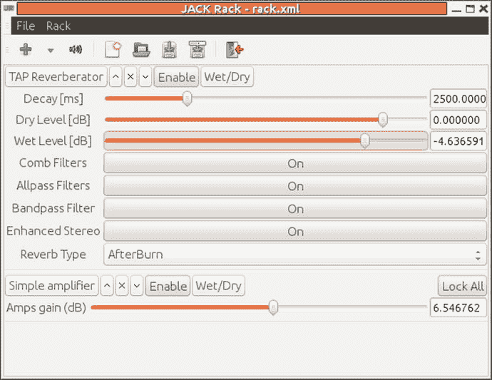
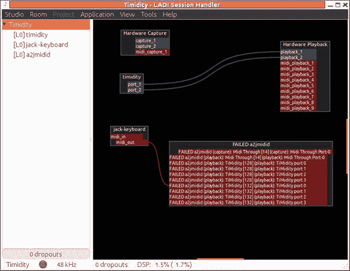
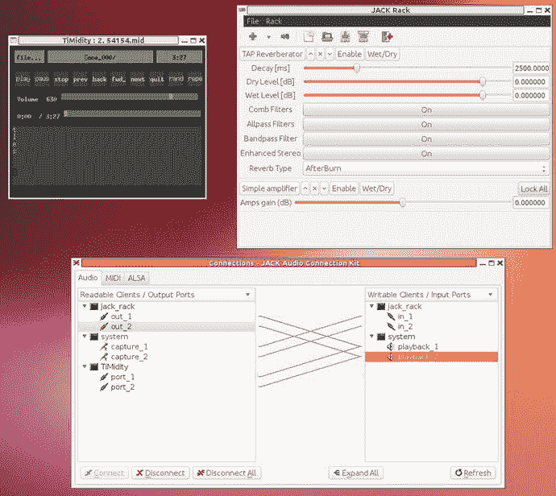
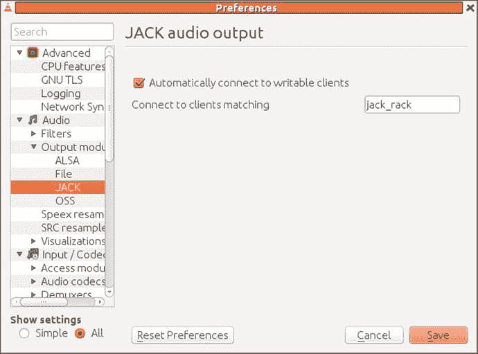
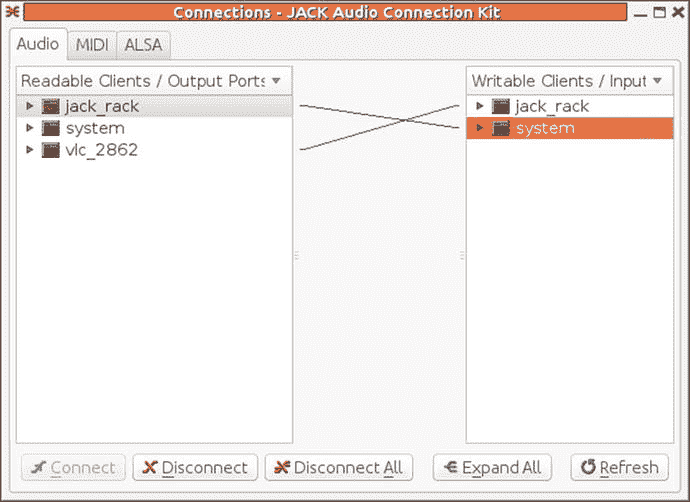
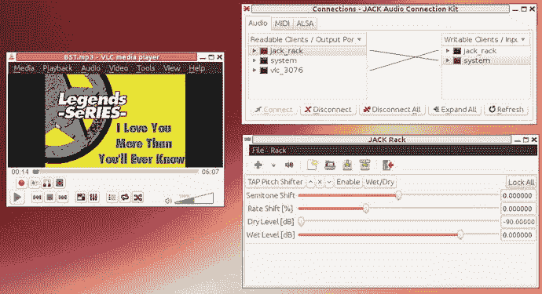

# 29.杰克和卡拉 ok

插孔是为专业音响设计的。在这一章中，你将把前几章的技术应用到构建一个卡拉 ok 系统中。

## 使用千斤顶架实现效果

卡拉 ok 从 MIDI 信号源和麦克风接收输入。这些混合在一起。一般来说，有一个整体音量控制，但通常也有一个麦克风音量控制。虽然 MIDI 源应该直接通过，但通常会对麦克风应用混响效果。

这些都是 LADSPA 模块可以提供的效果(参见第 [14 章](14.html))。Jack 应用`jack-rack`使这些插件可以被 Jack 应用访问，以便 LADSPA 效果可以被应用到 Jack 管道。

向会话中添加一个模块相当简单。点击+按钮，从巨大的效果菜单中选择。例如，从实用程序菜单中选择卡拉 ok 插件，如图 [29-1](#Fig1) 所示。


图 29-1。

Selecting Karaoke effect in Jack Rack

以下是一些可能相关的模块:

*   卡拉 ok(编号 1409)，显示在工具菜单中。这将尝试从音乐轨道中移除中央人声。
*   模拟器➤混响菜单中有许多混响模块。TAP 混响器似乎是功能最全的(但不保证实时)。
    *   g 动词
    *   平板混响
    *   拍子混响器(来自拍子插件)The TAP Reverberator seems to be the most full featured (but is not guaranteed to be in real time).
*   振幅➤放大器菜单中有许多放大器。

一个`jack-rack`应用可以应用多个模块，也可以运行多个应用。例如，将音量控制应用到麦克风，然后在将其发送到扬声器之前应用混响，可以通过添加抽头混响器和其中一个放大器来完成。这看起来像图 [29-2](#Fig2) 。



图 29-2。

Jack Rack with reverb and amplifier plug-ins

我在 USB 声霸 TruStudioPro 上运行这个。这才 16 位，我好像找不到合适的插孔硬件配置。所以，我用一个插头设备手动运行 Jack，Jack 抱怨过这个设备，但不管怎样它还是工作了。

```sh
jackd -dalsa -dplughw:2 -r 48000

```

虽然`gladish`可以在它的插孔配置菜单下看到它，但我还没能让`gladish`接受声霸作为设置。到目前为止，我只能设法让杰克运行下作为一个插头设备，`gladish`不断交换回一个硬件设备。

`qjackctl`很好地保存和恢复会话，使用正确的插件和设置启动`jack-rack`,并将其链接到正确的捕获和回放端口。

## 播放 MIDI

主要合成器引擎 Timothy 和 FluidSynth 将输出到 ALSA 设备。为了让他们进入 Jack 世界，Jack 需要用`-Xseq`选项启动，或者需要运行`a2jmidid`。

您可以尝试使用 Jack 会话管理器来管理连接(例如，`qjackctl`)。但这在使用 MIDI 合成器(如 TiMidity 或 FluidSynth)时遇到了障碍，因为它们假设 PulseAudio 输出而不是 Jack 输出。恢复会话无法恢复带有插孔输出的合成器。

您可以尝试使用 LADSPA 来管理连接。不幸的是，我至今无法使用`gladish`管理 Jack 服务器设置。因此，它使用默认的 ALSA 设置启动 Jack，而不使用`-Xseq`设置将 ALSA 端口映射到 Jack。你需要启动`a2jmidid`，它才能成功管理一个会话，比如`timidity`、`jack_keyboard`、`a2jmidid`。

即使这样，连接图看起来还是一团乱(图 [29-3](#Fig3) )。



图 29-3。

LADISH playing MIDI

## 胆怯加上千斤顶架

在第 [28](28.html) 章中，你用一个插孔后端和一个 Xaw 接口的胆怯给出了一个基本的卡拉 ok 系统。你现在可以通过使用千斤顶效果来改善这一点。

*   使用插孔输出和 Xaw 接口运行胆怯，并使用以下命令将歌词与声音同步:

    ```sh
    timidity -ia -B2,8 -Oj -EFverb=0 --trace --trace-text-meta

    ```

*   运行安装了 TAP 混响器和音量控制的 Jack Rack。
*   使用`qjackctl`连接端口。

最终的系统如图 [29-4](#Fig4) 所示。



图 29-4。

TiMidity with Jack Rack

## 定制胆怯构建

如果我试图动态加载另一个接口，Ubuntu 发行版的胆怯版本会崩溃。随着代码被剥离，不可能找出原因。所以，要添加一个新的接口，你需要从源头上建立胆怯。

我现在使用的命令如下:

```sh
./configure --enable-audio=alsa,jack \
            --enable-interface=xaw,gtk \
            --enable-server \
            --enable-dynamic
make clean
make

```

一个带键的接口，比如说“k”，可以用如下的 Jack 输出来运行:

```sh
timidity -d. -ik -Oj --trace  --trace-text-meta 54154.mid

```

## 使用插孔架音高移位播放 MP3+G

播放器 VLC 将播放 MP3+G 文件。通常 MP3+G 是一个压缩文件，包含一个 MP3 文件和一个 CDG 文件，它们有相同的根目录。这必须解压缩，然后可以播放给 VLC 的 MP3 文件名。

```sh
vlc file.mp3

```

这将获得 CDG 文件并显示歌词。

VLC 可与带`--aout jack`选项的千斤顶一起使用。

```sh
vlc --aout jack file.mp3

```

对 VLC 的常见要求是具有“俯仰控制”机制。虽然应该有可能给 VLC 增加 LADPSA 俯仰控制，但还没有人着手去做。但是你仍然可以通过`jack-rack`添加 LADSPA 效果。

步骤如下:

1.  您可能需要暂时停止 PulseAudio，例如使用`pasuspender cat`。
2.  使用以下命令启动照常运行的 Jack 守护进程:

    ```sh
    jackd -d alsa

    ```

3.  开始`qjackctl`这样你就可以控制一些插孔连接。
4.  Start `jack-rack`. Using the + button, select Frequency ➤ Pitch shifters ➤ TAP Pitch Shifter. Don’t forget to enable it; it should look like Figure [29-5](#Fig5).

    

    图 29-5。

    Jack Rack with pitch shifter Note that in `qjackctl`, `jack-rack` shows as `jack_rack` (the minus has been replaced with an underscore), which is the proper Jack name of `jack-rack`. Connect the output of `jack-rack` to `system`.  
5.  Now start `vlc --aout jack` so you can set up the correct configuration. Choose Tools ➤ Preferences, and in “Show settings” set the radio button to All. Then under Audio ➤ Output modules ➤ Jack, check “Automatically connect to writable clients” and connect to clients matching `jack_rack` (note the underscore). This should look like Figure [29-6](#Fig6).

    

    图 29-6。

    VLC selecting output client  
6.  The next time you start `vlc` with, for example, `vlc --aout jack BST.mp3`, `qjackctl` should look like Figure [29-7](#Fig7).

    

    图 29-7。

    qjackctl with VLC connected to Jack Rack  

音乐应该通过`jack-rack`播放，你可以调整音高。

图 [29-8](#Fig8) 显示了 VLC 通过音调滤波器播放 MP3 音频的结果，同时也显示了 CDG 的视频。



图 29-8。

VLC playing through pitch shifter

## 结论

本章讨论了构建插孔管道以给 MIDI 和 MP3+G 文件添加效果的多种方法。