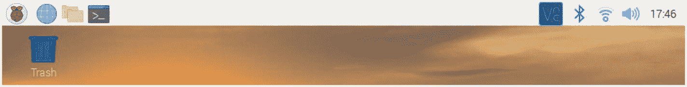
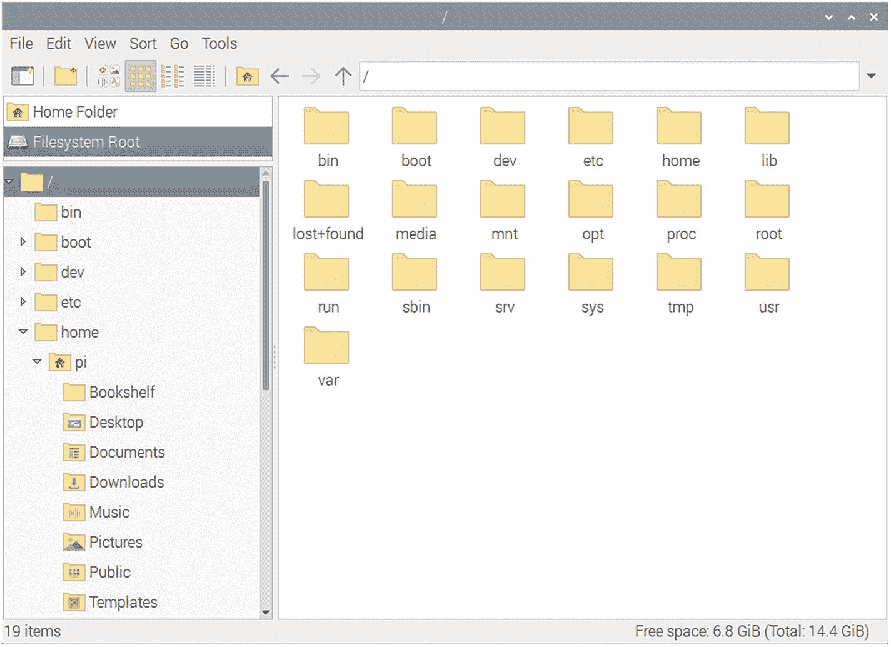
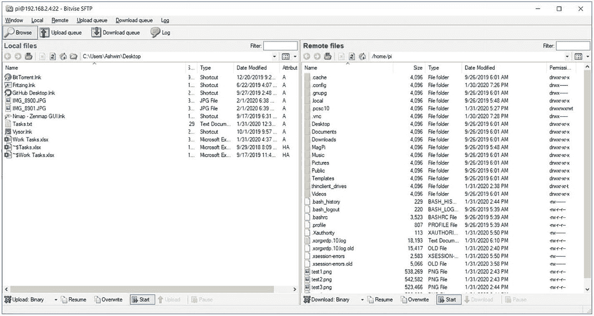

# 二、做好准备

上一章我们熟悉了单板机和树莓派。我们还学习了 Linux 和 Raspberry Pi 操作系统的基础知识。我们学习了如何使用 RPi 操作系统准备 SD 卡，以及如何使用 RPi 操作系统启动 RPi 板。我们还学习了使用终端模拟器的一些基础知识。

作为上一章的延续，我们将在本章中探讨以下概念:

*   操作系统 Shell

*   Raspberry Pi 操作系统 GUI

*   命令提示符

*   Linux 文件系统

*   远程访问 RPi

学完这一章，我们会对 Linux 的终端模拟器和 shell 非常得心应手。我们也会对 Linux 文件系统感到满意。

我想再提一件事。在整本书的演示中，我使用了一个带有 4 GB 内存的 RPi 4 B。然而，本书中的所有演示将适用于任何 RPi 板模型。不特定于 RPi OS 的命令可以在任何 Debian Linux 发行版或衍生版上运行。如果任何命令是特定于 RPi OS 的，并且与 Debian 不兼容，那么我会在描述中提到它。

## 操作系统 Shell

在任何操作系统中，Shell 都是用于访问系统服务的用户界面。

它接受用户的输入，并根据输入执行程序。当程序完成执行时，shell 显示程序的输出。

所有的操作系统都有 Shell。一个操作系统可以有多个 Shell。shell 可以使用命令行界面(CLI)(像 Unix 终端模拟器程序)或图形用户界面。在本章中，我们将详细探讨这两个概念。

基于命令行界面(CLI)的 shells 需要用户记住命令。我们将在本书的这一章和其余章节中探讨各种命令。Shell 命令可以放入脚本中，用于在类似 Unix 的计算机上执行各种任务。

基于图形用户界面(GUI)的 shells 更易于使用。基本上，它们使用了一种用于类 Unix 操作系统的桌面环境。我们可以在 [`https://itsfoss.com/best-linux-desktop-environments/`](https://itsfoss.com/best-linux-desktop-environments/) 的文章中了解更多关于桌面环境的信息。

## Raspberry Pi 操作系统 GUI

让我们对 RPi OS GUI 有一个概述。在这本书的结尾，我们有一个专门的章节来探索 Raspberry Pi 操作系统的一些 GUI 工具。在本节中，我们将对 RPi 操作系统的 GUI 进行一个非常简短的概述。树莓 Pi OS 使用的是 PIXEL 桌面，这是一个定制的 LXDE ( **L** 轻量级**X**11**D**esktop**E**n 环境)。其他流行的类似 Unix 操作系统的桌面环境有 KDE、GNOME 和 XFCE。在 RPi 操作系统中使用这些是可能的，但是为了简单起见，我们将在整本书的演示中坚持使用默认的 LXDE。

让我们对 RPi 操作系统的 GUI 有一个大致的了解。当我们启动它时，我们可以看到一个像任何其他类 Unix 环境一样的桌面。桌面有一个任务栏，在那里我们可以看到各种选项(图 [2-1](#Fig1) )。



图 2-1

树莓 Pi 操作系统桌面

最左边角落的树莓果符号是 RPi OS 菜单，在这里我们可以找到所有的 GUI 包，让我们的生活更加轻松。旁边的地球符号是网页浏览器的快捷方式。旁边的文件夹符号是**文件浏览器**实用程序的快捷方式。旁边的黑色图标是 **lxterminal** 的快捷方式，这是 RPi OS 的默认命令行终端仿真器。我们已经简单地使用它来更改网络设置。

在右侧，我们可以看到 VNC 服务器的标志。这是因为我使用 Windows 电脑远程访问桌面。我们将在本章的后半部分详细了解它。之后，我们会看到一个蓝牙符号。我们可以使用这个连接到我们选择的蓝牙设备。接下来是 WiFi 符号。我们可以连接到我们选择的无线网络。之后，我们可以看到用于调节声音的音频表和一个时钟。在桌面上，唯一的图标是回收站，在那里您可以找到最近删除的项目，它们可以从这里恢复或永久删除。如果你曾经使用过任何基于 GUI 的操作系统，你会发现这一切都很熟悉。

## 命令提示符

我们可以使用终端模拟器 **lxterminal** 来访问命令提示符。打开 lxterminal 窗口并执行以下命令:

```sh
echo $SHELL

```

它将返回以下输出:

```sh
/bin/bash

```

这是 RPi 操作系统的默认 Shell。它被称为 **Bash** shell。输出是 Bash shell 程序的可执行文件的位置。RPi OS 有其他 Shell。我们可以使用以下命令来查看它们:

```sh
ls -la /bin/*sh*

```

它将返回以下输出:

```sh
pi@raspberrypi:~ $ ls -la /bin/*sh*
-rwxr-xr-x 1 root root 925124 Apr 18  2019 /bin/bash
-rwxr-xr-x 1 root root  91896 Jan 18  2019 /bin/dash
lrwxrwxrwx 1 root root      4 Apr 18  2019 /bin/rbash -> bash
lrwxrwxrwx 1 root root      4 May 27 12:35 /bin/sh -> dash

```

输出中有四行。正如我们所看到的，有四个 shells，即 bash、dash、rbash 和 sh。rbash 和 sh 只是到 bash 和 dash shells 的符号链接(在前面的输出中用符号`->`表示)。所以 RPi OS 有两个 shell，Bash 是默认的 shell。

现在不要太担心这些命令。我们将在接下来的章节中详细了解它们。

### 更新 RPi 操作系统

在上一章中，我们学习了如何在 RPi 操作系统上启动和运行 RPi 板。我们跳过了在首次配置 RPi 时更新 RPi OS 的过程。现在让我们从命令提示符更新它。所有最新的软件包都在 RPi OS 存储库中进行了更新，我们可以通过使用互联网参考该存储库来更新 RPi OS。以下命令用于从所有已配置的源下载软件包信息:

```sh
sudo apt-get update -y

```

这将更新有关软件包或其依赖项的更新版本的信息。在此之后，我们必须运行以下命令:

```sh
sudo apt-get dist-upgrade -y

```

该命令升级所有软件包及其依赖项，并删除所有过时的软件包。两个命令中的参数`-y`意味着每当执行提示 Yes/No 时，我们就输入`y`。

最后，使用以下命令更新固件:

```sh
sudo rpi-update

```

这就是我们如何更新 RPi 操作系统和 RPi 板上的固件。

## Linux 文件系统

在这一节中，我们将简要讨论 Linux 文件系统。Linux 文件系统是模仿 Unix 文件系统的。我们可以使用文件浏览器来浏览文件系统。当我们打开文件资源管理器时，它会打开文件夹`/home/pi`的可视视图。文件夹也称为目录。图 [2-2](#Fig2) 是显示`/home/pi`的文件浏览器截图。


图 2-2

文件浏览器

我们可以在`/home/pi`文件夹中看到很多文件夹和文件。这个文件夹是用户 **pi** 的主目录。在最上面的部分，在菜单栏下面，我们可以看到一个地址栏。在那里，键入字符`/`并按回车键。这个`/`是文件系统的根目录。大多数流行的类 Unix 操作系统的文件系统都是树状结构，目录`/`是这棵树的根。图 [2-3](#Fig3) 是该目录的文件浏览器视图。



图 2-3

/(根)目录的文件浏览器视图

在这里，我们可以看到根目录下的许多目录。以下是重要目录的简要描述:

*   `/bin`:`/bin`目录中有许多用户可执行文件。

*   这个目录有一个引导程序，一个内核可执行文件，以及在计算机上引导一个类似 Unix 的操作系统所需的配置文件。在 RPi OS 中，`config.txt`文件包含所有与引导相关的选项。

*   `/dev`:该目录包含所有连接到电脑的硬件设备的设备文件。

*   `/etc`:该目录包含主机的本地系统配置文件。

*   `/home`:这是用户文件的主目录存储。每个用户在这个目录中都有一个子目录。

*   `/lib`:该目录有引导系统所需的共享库文件。

*   在这里，所有新的存储设备都已安装。例如，当我们将便携式 USB 驱动器连接到 RPi 时，它会显示在这里。

*   `/mnt`:这是常规文件系统的临时挂载点。

*   可选文件位于此处。可选文件的一个例子是供应商提供的程序。

*   `/root`:这不是(`/`)文件系统的根目录。这是根用户的主目录。

*   这些是系统二进制文件。这些是用于系统管理的可执行程序。

*   `/tmp`:这是临时目录。它被操作系统和许多程序用来存储临时文件。用户也可以将文件临时存储在这个位置。请注意，操作系统可能会在没有任何警告的情况下清除存储在此处的文件。

*   这些是可共享的只读文件，包括可执行的二进制文件和库、man 文件以及其他类型的文档。

*   `/var`:可变数据文件存储在这里。例如日志文件、MySQL 和其他数据库文件、web 服务器数据文件、电子邮件收件箱和其他特定于程序的文件。

## 远程访问 RPi

我们可以远程访问 RPi 的桌面和命令提示符。为了访问命令提示符，我们已经在操作系统设置后配置 RPi 时启用了远程 SSH。我们可以使用任何 SSH 客户端。然而，我发现逐位 SSH 客户端是最方便的。我们可以从 [`www.bitvise.com/ssh-client-download`](http://www.bitvise.com/ssh-client-download) 下载安装到 Windows 操作系统上。这是免费的。一旦我们安装好，我们就打开它。我们在微软 Windows 的搜索栏输入 SSH 就可以找到。逐位 SSH 连接窗口如图 [2-4](#Fig4) 所示。


图 2-4

逐位 SSH 连接窗口

填写主机、用户名和密码的详细信息(pi 和 raspberry 是默认组合，以防您忘记)。然后点击**登录**按钮。当我们第一次登录任何新主机时，它显示图 [2-5](#Fig5) 中的信息。


图 2-5

主机密钥验证窗口

点击**接受并保存**按钮。这将把 RPi 的主机密钥保存到 Windows 计算机上，并且当我们下次建立新的连接时，对于同一个 RPi，不会再显示此消息。一旦我们连接上，就会显示 RPi OS 命令提示符，如图 [2-6](#Fig6) 所示。


图 2-6

使用 SSH 远程访问 RPi OS 命令窗口

它还打开一个文件传输窗口，如图 [2-7](#Fig7) 所示。



图 2-7

文件传输窗口

我们可以简单地将文件从 Windows 拖放到 RPi，反之亦然。左边是当前用户的 Windows 桌面，右边是 RPi OS 上用户 **pi** 的主目录。

这就是我们如何访问 RPi OS 的命令提示符并可视化地传输文件。现在，我们将了解如何远程访问桌面。RPi 操作系统与 VNC 服务器一起提供。我们已经在安装后的配置时启用了 VNC 服务器。我们只需要在 Windows 电脑上安装一个 VNC 浏览器。从 [`www.realvnc.com/en/connect/download/viewer/`](http://www.realvnc.com/en/connect/download/viewer/) 下载即可。我们可以在 Windows 搜索中输入 VNC 来搜索它。该应用的窗口如图 [2-8](#Fig8) 所示。


图 2-8

VNC 浏览器窗口

在菜单中，点击**文件** ➤ **新建连接**。打开一个新的连接窗口，如图 [2-9](#Fig9) 所示。


图 2-9

连接详细信息

填写您想要为您的连接设置的 IP 地址和名称，并点击 **OK** 按钮。它将在 VNC 浏览器应用程序窗口中创建一个对应于该连接的图标。双击连接，出现图 [2-10](#Fig10) 窗口。


图 2-10

证书

只需输入用户名和密码。点击复选框**记住密码**，这样我们就不会再次被要求输入凭证。最后，点击**确定**按钮。将会打开一个远程桌面窗口，如图 [2-11](#Fig11) 所示。


图 2-11

使用 VNC 浏览器的远程桌面

除非您使用非常过时的网络设备，否则响应是实时和流畅的。我们可以这样执行所有与 GUI 相关的任务，而不需要额外的显示器。

这就是我们如何远程访问 RPi 的命令提示符和桌面。

## 摘要

在本章中，我们学习了 Linux shell、GUI 和命令提示符的基础知识。我们还学习了如何使用命令更新 RPi 操作系统和固件。我们终于学会了如何远程访问命令提示符和桌面。所有这些主题都是开始学习 Linux 操作系统命令所需要的。

在下一章，我们将继续探索 Linux 操作系统的旅程。我们将学习一些简单的文件和目录相关的命令。我们还将学习一些文本编辑器的基础知识。