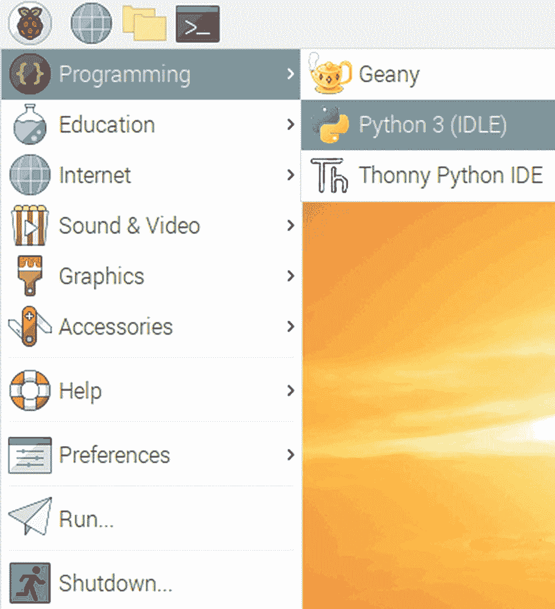
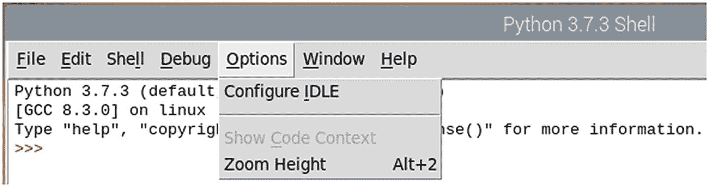
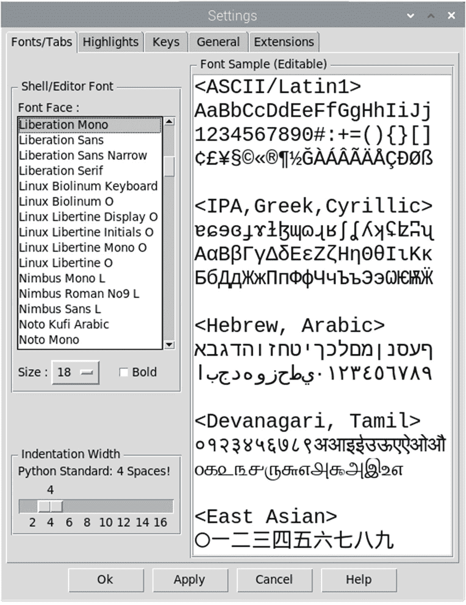
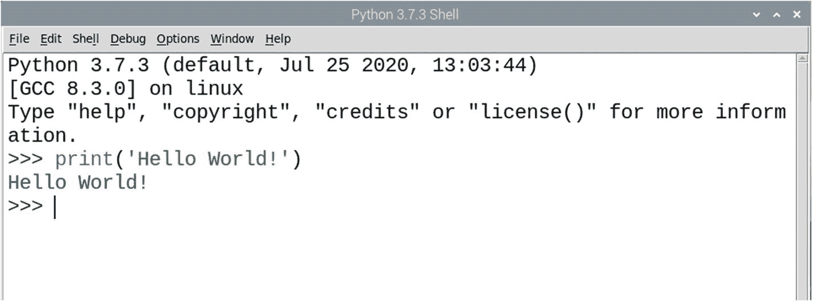
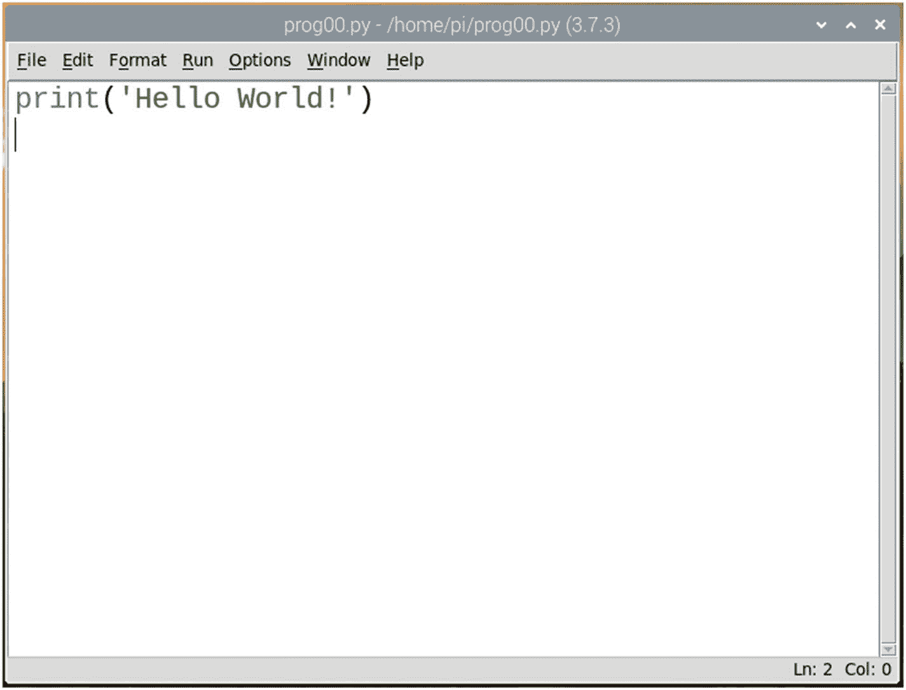
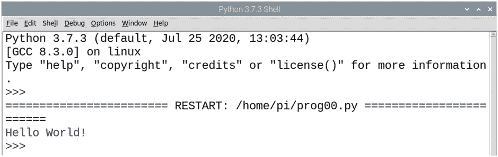

# 八、高级编程语言介绍

在上一章中，我们总结了 Linux shell 脚本。在这一章中，我们将学习如何用高级编程语言编写程序，比如 C、C++和 Python 3，以及 RPi OS。以下是我们将在本章中详细学习的主题列表:

*   C 和 C++编程

*   Python 编程语言

*   Debian 衍生工具上的 Python 3

学完这一章后，我们将能熟练地在 Linux 平台上使用现代编程语言编写程序。

## C 和 C++编程

C 和 C++是非常通用的编程语言。截至目前，几乎所有的操作系统(具体来说就是 OS 内核和设备驱动)都是用 C 编程语言编写的。我从 2003 年开始在 Linux 平台上写 C 和 C++程序。我主要使用 GCC (GNU 编译器集合)来编译使用任何 Linux 发行版的 C 程序。另外，我在 Linux 上使用 C++的 g++编译器。因此，在这一节中，我将简要介绍使用 GCC 和 g++编译器进行编译的过程。我们还将看到如何执行编译后的字节码。

这两个编译器都预装在 RPi 操作系统上。如果您想确认，只需运行以下命令:

```sh
sudo apt-get install build-essential

```

它将返回包含以下字符串的消息:

```sh
build-essential is already the newest version (12.6).

```

意味着已经安装了 GCC 和 g++。

我们可以使用以下命令来验证版本:

```sh
gcc -v
g++ -v

```

我们可以使用任何文本编辑器创建并保存一个名为`prog00.c`的 C 程序，如下所示:

```sh
#include<stdio.h>
int main( void )
{
            printf("Hello, World\n");
            return 0;
}

```

使用以下命令编译它:

```sh
gcc prog00.c -o prog00

```

这里，`-o`后面的字符串是我们程序的可执行文件的名称。如果我们不使用`-o`后跟文件名，默认情况下它会创建`a.out`可执行文件。使用以下命令运行可执行文件:

```sh
./prog00

```

它将输出如下:

```sh
Hello, World

```

我们也可以写一个 C++程序，`prog01.cpp`，如下所示:

```sh
#include<iostream>
using namespace std;
int main(void)
{
cout<<"Hello, World\n";
return 0;
}

```

我们可以这样编译它:

```sh
g++ prog01.cpp -o prog01

```

我们可以如下运行它:

```sh
./prog01

```

输出如下所示:

```sh
Hello, World

```

这就是我们如何在 Linux 平台上编译和运行 C 和 C++程序。本节绝不是 GCC 和 g++的全面指南。您可能有兴趣了解更多关于 GCC 的信息。可以在这里访问 **GCC** 项目主页: [https:// gcc. gnu. org/](https://gcc.gnu.org/) 。

## Python 编程语言

Python 3 是一种高级的解释性编程语言。它是一种通用编程语言。在这一节中，我们将深入讨论 Python 编程语言及其哲学。

### Python 编程语言的历史

Python 是 ABC 编程语言的继承者，而 ABC 编程语言本身受到了 T2 ALGOL 68 和 T4 SETL T5 编程语言的启发。它是由吉多·范·罗苏姆在 20 世纪 80 年代末度假期间作为个人业余项目创建的，当时他正在荷兰的 Centrum wisk unde(CWI)信息中心(英文:“国家数学和计算机科学研究所”)工作。从 Python 编程语言的最初发布到 2018 年 7 月 12 日，Guido 一直是这个项目的首席开发人员和*仁慈的生命独裁者(BDFL)* 。7 月 12 日之后，他开始了永久休假，现在在 Python 指导委员会工作。以下是 Python 发布时间表中的重要里程碑:

*   1991 年 2 月:van Rossum 向 alt.sources 发布了代码(标记为版本 0.9.0)

*   1994 年 1 月:1.0 版本发布。

*   2000 年 10 月:Python 2.0 发布。

*   2006 年 12 月:Python 3.0 发布。

*   2019 年 12 月:Python 2.x 正式退役，不再受 Python 软件基金会支持。

正如我们在时间线中看到的，Python 2.x 版本不再受支持，Python 3 是最新的。Python 3 不向后兼容 Python 2。Python 3 是 Python 编程语言的最新版本，也是受支持的版本。因此，我们将在整本书中使用 Python 3 来演示数据可视化的程序。除非明确提到，否则在本书中，Python 指的是 Python 3。

### Python 增强建议

为了指导 Python 的开发、维护和支持，Python 领导层提出了 Python 增强提案(PEPs)的概念。它们是 Python 项目中建议新特性和修复问题的主要机制。我们可以通过以下网址了解更多关于 pep 的信息:

[www. python. org/ dev/ peps/](http://www.python.org/dev/peps/)

[www . python . org/dev/peps/pep-0001/](http://www.python.org/dev/peps/pep-0001/)

#### Python 编程语言的哲学

Python 的哲学在 PEP20 中有详细介绍。它被称为**Python 的禅宗**可以在[www . Python . org/dev/peps/pep-0020/](http://www.python.org/dev/peps/pep-0020/)找到。以下是人教版的要点。有几个很有趣:

1.  漂亮总比难看好。

2.  显性比隐性好。

3.  简单比复杂好。

4.  复杂总比复杂好。

5.  扁平的比嵌套的好。

6.  疏比密好。

7.  可读性很重要。

8.  特例不足以特殊到打破规则。

9.  然而，实用性战胜了纯粹性。

10.  错误永远不应该无声无息地过去。

11.  第 10 点是如此，除非明确沉默。

12.  面对暧昧，拒绝猜测的诱惑。

13.  应该有一种——最好只有一种——显而易见的方法来做这件事。

14.  然而，这种方式一开始可能并不明显，除非你是荷兰人。

15.  现在总比没有好。

16.  然而，从来没有比现在“正确”更好。

17.  如果实现很难解释，这是一个坏主意。

18.  如果实现很容易解释，这可能是一个好主意。

19.  名称空间是一个非常棒的想法——让我们多做一些吧！

这些是影响了 Python 编程语言的发展并继续影响的一般哲学指导方针。

### Python 的应用

正如我们所见，Python 是一种通用编程语言，它在以下领域有大量应用:

1.  Web 开发

2.  GUI 开发

3.  科学和数值计算

4.  软件开发

5.  系统管理员

我们可以在 www . Python . org/success-stories/上阅读各种项目的 Python 案例研究。

## Debian 衍生工具上的 Python 3

Python 3 预装在 Debian 和所有衍生产品上，如 Ubuntu 或 Raspberry Pi OS。所以我们不必单独安装它。两个主要的 Python 版本，Python 2 和 Python 3，都预装在 Debian 衍生产品中。Python 2 和 Python 3 的可执行文件分别被命名为 **python** 和 **python3** 。我们必须使用可执行文件 **python3** 进行演示。要了解所需二进制可执行文件的版本和位置，请逐一运行以下命令:

```sh
python3 -V
which python3

```

## Python 模式

Python 有各种模式。让我们逐一讨论。在开始讨论之前，我们先来看看什么是空闲。IDLE 代表 Integrated Development and Learning Environment，是 Python 软件基金会为 Python 编程开发的 IDE(集成开发环境)。

并非所有的 Linux 发行版都预装了 IDLE。我们可以通过依次运行以下命令将它安装在 Debian 及其衍生产品(包括 Raspberry Pi OS)上:

```sh
sudo apt-get update --fix-missing
sudo apt-get install idle3 -y

```

一旦安装完成，我们可以在菜单中找到空闲(在这种情况下，树莓 Pi OS 菜单)如图 [8-1](#Fig1) 所示。



图 8-1

在 Raspberry Pi 操作系统菜单中空闲

我们还可以通过运行以下命令在 Linux 上启动 IDLE:

```sh
idle

```

它将启动一个窗口，如图 [8-2](#Fig2) 所示。


图 8-2

空闲窗口

在我们继续之前，我们需要为我们的眼睛的舒适配置它。我们可以通过点击**选项➤配置空闲**来改变字体，如图 [8-3](#Fig3) 所示。



图 8-3

配置空闲

以下窗口打开(如图 [8-4](#Fig4) 所示),您可以在此更改空闲字符的字体和大小。



图 8-4

空闲配置窗口

现在，让我们讨论 Python 的各种模式。

### 对话方式

Python 的交互模式是命令行类型的 shell，它执行当前语句并在控制台上给出即时反馈。它在活动内存中运行以前输入的语句。当新的语句被输入解释器并由解释器执行时，输入的代码被求值。当我们打开 IDLE 时，我们会看到一个命令行提示符。无非就是 Python 的交互模式。让我们看一个简单的例子。让我们在交互提示中输入习惯的 **Hello World** 程序，如下所示:

```sh
print('Hello World!')

```

按 Enter 键将该行输入解释器并执行它。图 [8-5](#Fig5) 是输出的截图。



图 8-5

空闲时的 Python 交互模式

我们也可以从命令提示符启动 Python 的交互模式。在 Linux 命令提示符下(例如 lxterminal)，我们必须运行命令 **python3** 来启动它。图 [8-6](#Fig6) 是 RPi OS 命令提示符下交互模式的截图(远程访问)。


图 8-6

Linux 命令提示符下的 Python 交互模式

### 脚本模式

我们可以写一个 Python 程序，保存在磁盘上。然后我们可以通过多种方式来启动它。这就是所谓的脚本模式。让我们在空闲时演示一下。我们可以使用任何文本编辑器来编写 Python 程序。但是，由于 IDLE 是一个 IDE，所以用 IDLE 编写和运行 Python 程序很方便。让我们先看看那个。在空闲时，点击**文件➤新建文件**。它将创建一个空白的新文件。向其中添加以下代码:

```sh
print('Hello World!')

```

然后在磁盘上以 **prog00.py** 的名称保存，如图 [8-7](#Fig7) 所示。



图 8-7

空闲代码编辑器中的 Python 程序

在菜单中，点击**运行➤运行模块**。在 IDLE 的提示下执行程序，如图 [8-8](#Fig8) 所示。



图 8-8

在空闲提示符下执行的 Python 程序

我们甚至可以在操作系统的命令提示符下用 Python 的解释器启动程序。打开操作系统的命令提示符，导航到存储程序的目录。

在 Linux 终端中，我们必须在命令提示符下运行以下命令:

```sh
python3 prog00.py

```

然后解释器将在命令提示符下运行程序，输出(如果有的话)将出现在那里。

在 Linux 中，有另一种方法可以运行程序，而不用显式地使用解释器。我们必须将 **shebang** 行添加到代码文件的开头。例如，我们的代码文件如下所示:

```sh
#!/usr/bin/python3
print('Hello World!')

```

第一条线被称为 **shebang** 线。它告诉 shell 使用什么解释器及其位置。然后运行以下命令更改文件权限，使其对所有者可执行，如下所示:

```sh
chmod 755 prog00.py

```

然后我们可以像其他可执行文件一样用**直接启动我们的 Python 程序文件。/** 如下:

```sh
./prog00.py

```

shell 将执行程序并在终端中打印输出。请注意，这仅适用于类 Unix 系统，因为它们支持使用 **shebang** 执行程序。

## 摘要

在这一章中，我们开始学习 Linux 上的 C 和 C++编程。然后我们探索了 Python 编程语言的基础。我们学习了如何编写基本的 Python 程序，以及如何以各种方式执行它们。我们还学习了 Python 编程语言的各种模式，以及如何从命令提示符启动它。

现在，我们对 RPi OS 上的高级编程语言(以及 Debian 衍生工具)已经非常熟悉了。我们可以用 C、C++和 Python 3 编写和执行程序。您可能想在 Raspberry Pi 操作系统上探索 Java 编程。RPi OS 预装了 Java 和相关的 ide。

在下一章中，我们将继续我们用 Python 3 编程的美妙旅程，并为 GPIO(通用输入/输出)编程编写程序。为此，我们将使用发光二极管、电阻、试验板和其他电子元件。我们还将简要介绍数字电子中的各种总线。