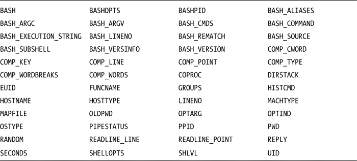
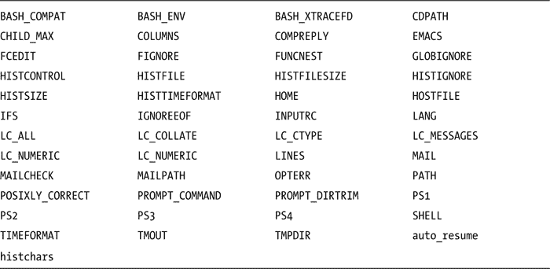

# 五、参数和变量

自从 30 多年前 Unix shell 诞生以来，变量就一直是它的一部分，但是这些年来，它们的功能不断发展。标准的 Unix shell 现在有了参数扩展，可以对其内容执行复杂的操作。`bash`增加了更多的扩展能力以及索引和关联数组。

本章涵盖了您可以对变量和参数做什么，包括它们的范围。换句话说，在定义了一个变量之后，在哪里可以访问它的值呢？本章简要介绍了程序员可以使用的 shell 使用的 80 多个变量。它讨论了如何命名变量，以及如何用参数扩展来区分它们。

位置参数是传递给脚本的参数。它们可以用`shift`命令操作，按数字单独使用或循环使用。

数组为一个名称分配多个值。`bash`既有数字索引数组，也有从`bash-4.0`开始的关联数组，它们由字符串而不是数字来赋值和引用。

变量的命名

变量名只能包含字母、数字和下划线，并且必须以字母或下划线开头。除了这些限制，你可以自由地建立你认为合适的名字。然而，使用一致的方案来命名变量是一个好主意，选择有意义的名称对使您的代码自文档化大有帮助。

也许最常引用的(尽管很少实现)惯例是环境变量应该用大写字母，而局部变量应该用小写字母。鉴于`bash`本身在内部使用了超过 80 个大写变量，这是一种危险的做法，冲突并不少见。我见过诸如`PATH`、`HOME`、`LINES`、`SECONDS`和`UID`这样的变量被误用，带来潜在的灾难性后果。没有一个`bash`的变量以下划线开头，所以在我的第一本书 *Shell 脚本编写方法:一个问题解决方法* (Apress，2005)中，我使用大写名称加下划线来表示 Shell 函数设置的值。

单字母的名字应该很少使用。它们适合作为循环中的索引，其唯一的功能是作为计数器。传统上用于这个目的的字母是`i`，但我更喜欢`n`。(在教室里教编程的时候，黑板上的字母`I`太容易和数字 1 混淆，所以我开始用`n`代表“数字”，25 年后我还在用它)。

我使用单字母变量名的另一个地方是从文件中读取一次性材料的时候。例如，如果我只需要文件中的一个或两个字段，我可以这样使用:

```sh
while IFS=: read login a b c name e
do
  printf "%-12s %s\n" "$login" "$name"
done < /etc/passwd
```

我推荐使用两种命名方案中的任何一种。第一个是 Heiner Steven 在`http://www.shelldorado.com/``. He capitalizes the first letter of all variables and also the first letters of further words in the name: `ConfigFile``LastDir``FastMath`在他的 Shelldorado 网站上使用的。在某些情况下，他的用法更接近我的。`

 `我用的都是小写字母:`configfile`、`lastdir`、`fastmath`。当组合在一起的单词含糊不清或难以阅读时，我用下划线将它们分开:`line_width`、`bg_underline`、`day_of_week`。

无论您选择什么系统，重要的是名称给出了变量包含的内容的真实指示。但是不要忘乎所以，用这样的东西:

```sh
long_variable_name_which_may_tell_you_something_about_its_purpose=1
```

一个变量的范围:你能从这里看到它吗？

默认情况下，变量的定义只有定义它的 shell(以及该 shell 的子 shell)知道。调用当前脚本的脚本不会知道这个变量，被当前脚本调用的脚本也不会知道这个变量，除非它被导出到*环境*。

环境是一个形式为`name=value`的字符串数组。每当执行外部命令(创建子进程)时，无论是编译后的二进制命令还是解释后的脚本，该数组都会在后台传递给它。在 shell 脚本中，这些字符串可以作为变量使用。

可以使用 shell 内置命令`export`将脚本中分配的变量导出到环境中:

```sh
var=whatever
export var
```

在`bash`中，这可以缩写成这样:

```sh
export var=whatever
```

没有必要导出一个变量，除非你想让当前脚本调用的脚本(或其他程序)可以使用它...).导出变量不会使它在除子进程之外的任何地方可见。

清单 5-1 告诉你变量`$x`是否在环境中，如果有的话，它包含什么。

[***清单 5-1***](#_list1) 。`showvar`，打印变量`x`的值

```sh
if [[ ${x+X} = X ]] ## If $x is set
then
  if [[ -n $x ]] ## if $x is not empty
  then
    printf "  \$x = %s\n" "$x"
  else
    printf "  \$x is set but empty\n"
  fi
else
  printf " %s is not set\n" "\$x"
fi
```

一旦变量被导出，它将一直保留在环境中，直到被取消设置:

```sh
$ unset x
$ showvar
  $x is not set
$ x=3
$ showvar
  $x is not set
$ export x
$ showvar
  $x = 3
$ x= ## in bash, reassignment doesn't remove a variable from the environment
$ showvar
  $x is set but empty
```

 **注意** `showvar`不是一个 bash 命令，而是一个如[清单 5-1](#list1) 所示的脚本，它使用`x`的值。

子 shell 中设置的变量对于调用它的脚本是不可见的。子 Subshells 包括命令替换，如在`$(command)`或``command``中；管道的所有元素，以及括号中的代码，如`( command )`。

关于 shell 编程，可能最常被问到的问题是，“我的变量去哪里了？我知道我设置了它们，为什么它们是空的？”通常，这是由于将一个命令的输出通过管道传输到一个分配变量的循环中造成的:

```sh
printf "%s\n" ${RANDOM}{,,,,,} |
  while read num
  do
    (( num > ${biggest:=0} )) && biggest=$num
  done
printf "The largest number is: %d\n" "$biggest"
```

当`biggest`被发现为空时，在所有的 shell 论坛中都可以听到关于在`while`循环中设置的变量在它们之外不可用的抱怨。但问题不在于循环；这是因为循环是管道的一部分，因此在 subshell 中执行。

在 bash-4.2 中，一个新选项`lastpipe`使管道中的最后一个进程能够在当前 shell 中执行。通过以下方式调用它:

```sh
shopt -s lastpipe
```

Shell变量

shell 要么设置要么使用 80 多个变量。其中许多是由`bash`内部使用的，对 shell 程序员来说用处不大。有些用于调试，有些常用于 shell 程序。大约一半是由 shell 自己设置的，其余的是由操作系统、用户、终端或脚本设置的。

在 shell 设置的那些中，您已经看到了`RANDOM`，它返回 0 到 32，767 之间的随机整数，以及`PWD`，它包含当前工作目录的路径。您看到了在解析命令行选项时使用的`OPTIND`和`OPTARG`([第 4 章](04.html))。有时，`BASH_VERSION`(或`BASH_VERSINFO`)用于确定正在运行的 shell 是否能够运行脚本。本书中的一些脚本至少需要`bash-3.0`，并且可能使用其中一个变量来确定当前的 shell 是否足够新以运行该脚本:

```sh
case $BASH_VERSION in
  [12].*) echo "You need at least bash3.0 to run this script" >&2; exit 2;;
esac
```

提示字符串变量`PS1`和`PS2`，在命令行交互 shells 中使用；`PS3`与`select`内置命令一起使用，在执行跟踪模式下`PS4`打印在每一行之前(详见第 10 章[)。](10.html)

Shell变量

以下变量由 shell 设置:



shell 使用以下变量，可能会为其中一些变量设置默认值(例如，`IFS`):



参见[附录 A](16.html) 了解所有Shell变量的描述。

参数扩展

现代 Unix shell 的大部分功能来自于它的参数扩展。在 Bourne shell 中，这些主要涉及测试参数是已设置还是为空，以及用默认值或替代值进行替换。合并到 POSIX 标准中的 KornShell additions 增加了字符串操作。KornShell 93 增加了更多扩展，这些扩展还没有被纳入标准，但是`bash`已经采用了。`bash-4.0`增加了两个新的资料片。

伯恩·谢尔

Bourne shell 和它的后继程序有一些扩展，可以用缺省值替换一个空的或未设置的变量，如果一个变量是空的或未设置的，就给它分配一个缺省值，如果一个变量是空的或未设置的，就停止执行并打印一条错误消息。

${var:-default}和${var-default}:使用默认值

最常用的扩展`${var:-default}`检查变量是否未设置或为空，如果是，则扩展为默认字符串:

```sh
$ var=
$ sa "${var:-default}"  ## The sa script was introduced in Chapter 4
:default:
```

如果省略冒号，则扩展只检查变量是否未设置:

```sh
$ var=
$ sa "${var-default}" ## var is set, so expands to nothing
::
$ unset var
$ sa "${var-default}" ## var is unset, so expands to "default"
:default:
```

如果选项未提供默认值或环境中未继承默认值，则此代码片段会将默认值分配给`$filename`:

```sh
defaultfile=$HOME/.bashrc
## parse options here
filename=${filename:-"$defaultfile"}
```

${var:+alternate}、${var+alternate}:使用替代值

如果参数不为空，或者如果设置了不带冒号的参数，则前一个扩展的补码将替换替代值。仅当`$var`被设置且不为空时，第一次扩展才会使用`alternate`:

```sh
$ var=
$ sa "${var:+alternate}" ## $var is set but empty
::
$ var=value
$ sa "${var:+alternate}" ## $var is not empty
:alernate:
```

如果没有冒号，如果设置了变量，则使用`alternate`，即使变量为空:

```sh
$ var=
$ sa "${var+alternate}" ## var is set
:altername:
$ unset var
$ sa "${var+alternate}" ## $var is not set
::
$ var=value
$ sa "${var:+alternate}" ## $var is set and not empty
:alternate:
```

向变量添加字符串时经常使用这种扩展。如果变量为空，您不想添加分隔符:

```sh
$ var=
$ for n in a b c d e f g
> do
>   var="$var $n"
> done
$ sa "$var"
: a b c d e f g:
```

为了防止前导空格，可以使用参数扩展:

```sh
$ var=
$ for n in a b c d e f g
> do
>   var="${var:+"$var "}$n"
> done
$ sa "$var"
:a b c d e f g:
```

这是对`n`的每个值执行以下操作的一种简化方法:

```sh
if [ -n "$var" ]
then
  var="$var $n"
else
  var=$n
fi
```

或者:

```sh
[ -n "$var" ] && var="$var $n" || var=$n
```

${var:=default}，${var=default}:分配默认值

`${var:=default}`扩展的行为方式与`${var:-default}`相同，只是它也将默认值赋给变量:

```sh
$ unset n
$ while :
> do
>  echo :$n:
>  [ ${n:=0} -gt 3 ] && break ## set $n to 0 if unset or empty
>  n=$(( $n + 1 ))
> done
::
:1:
:2:
:3:
:4:
```

${var:？消息}，${var？message}:如果为空或未设置，则显示错误消息

如果`var`为空或未设置，`message`将被打印到标准错误，脚本将以状态 1 退出。如果`message`为空，将打印`parameter null or not set`。[清单 5-2](#list2) 需要两个非空的命令行参数，并在它们缺失或为空时使用这个扩展来显示错误消息。

[***清单 5-2***](#_list2) 。`checkarg`，如果参数未设置或为空，退出

```sh
## Check for unset arguments
: ${1?An argument is required} \
  ${2?Two arguments are required}

## Check for empty arguments
: ${1:?A non-empty argument is required} \
  ${2:?Two non-empty arguments are required}

echo "Thank you."
```

第一次扩展失败时会打印出`message`，脚本将在此时退出:

```sh
$ checkarg
/home/chris/bin/checkarg: line 10: 1: An argument is required
$ checkarg x
/home/chris/bin/checkarg: line 10: 2: Two arguments are required
$ checkarg '' ''
/home/chris/bin/checkarg: line 13: 1: A non-empty argument is required
$ checkarg x ''
/home/chris/bin/checkarg: line 13: 2: Two non-empty arguments are required
$ checkarg x x
Thank you.
```

POSIX Shell

除了来自 Bourne shell 的扩展，POSIX shell 还包括许多来自 KornShell 的扩展。这些包括返回长度和从变量内容的开头或结尾删除模式。

${#var}:变量内容的长度

此扩展返回变量扩展值的长度:

```sh
read passwd
if [ ${#passwd} -lt 8 ]
then
  printf "Password is too short: %d characters\n" "$#" >&2
  exit 1
fi
```

${var%PATTERN}:从末尾删除最短的匹配

变量被扩展，匹配`PATTERN`的最短字符串从扩展值的末尾删除。这里和其他参数扩展中的`PATTERN` 是文件名扩展(又名*文件打包*)模式。

给定字符串`Toronto`和模式`o*`，最短的匹配模式就是最终的`o`:

```sh
$ var=Toronto
$ var=${var%o*}
$ printf "%s\n" "$var"
Toront
```

因为被截断的字符串已经被分配给了`var`，所以现在与模式匹配的最短字符串是`ont`:

```sh
$ printf "%s\n" "${var%o*}"
Tor
```

这个扩展可以用来替换外部命令`dirname`，它去掉了路径的文件名部分，留下了到目录的路径([清单 5-3](#list3) )。如果字符串中没有斜杠，如果是当前目录中现有文件的名称，则打印当前目录；否则，打印一个点。

[***清单 5-3***](#_list3) 。`dname`，打印文件路径的目录部分

```sh
case $1 in
  */*) printf "%s\n" "${1%/*}" ;;
  *) [ -e "$1" ] && printf "%s\n" "$PWD" || echo '.' ;;
esac
```

 **注意**我称这个脚本为`dname`而不是`dirname`，因为它不符合`dirname`命令的 POSIX 规范。在下一章中，有一个名为`dirname`的 shell 函数实现了 POSIX 命令。

```sh
$ dname /etc/passwd
/etc
$ dname bin
/home/chris
```

${var%%PATTERN}:从末尾删除最长的匹配项

变量被展开，从展开值的末尾开始匹配`PATTERN`的最长字符串被删除:

```sh
$ var=Toronto
$ sa "${var%%o*}"
:t:
```

${var#PATTERN}:从开头删除最短的匹配

变量被扩展，匹配`PATTERN`的最短字符串从扩展值的开始处删除:

```sh
$ var=Toronto
$ sa "${var#*o}"
:ronto:
```

${var##PATTERN}:从开头删除最长的匹配

变量被扩展，匹配`PATTERN`的最长字符串从扩展值的开头删除。这通常用于从`$0`参数中提取脚本的名称，该参数包含脚本的完整路径:

```sh
scriptname=${0##*/} ## /home/chris/bin/script => script
```

尝试

在`bash2`中引入了 KornShell 93 的两个扩展:搜索和替换以及子串提取。

${var//PATTERN/STRING}:用字符串替换模式的所有实例

因为问号匹配任何单个字符，所以本示例隐藏了一个密码:

```sh
$ passwd=zxQ1.=+-a
$ printf "%s\n" "${passwd//?/*}"
*********
```

使用单斜线时，只替换第一个匹配的字符。

```sh
$ printf "%s\n" "${passwd/[[:punct:]]/*}"
zxQ1*=+-a
```

${var:OFFSET:LENGTH}:返回$var 的子字符串

返回从`OFFSET`开始的`$var`的子串。如果指定了`LENGTH`,则替换该数量的字符；否则，返回字符串的其余部分。第一个字符位于偏移量`0`:

```sh
$ var=Toronto
$ sa "${var:3:2}"
:on:
$ sa "${var:3}"
:onto:
```

负的`OFFSET`从字符串的末尾开始计数。如果使用文字减号(与变量中包含的减号相反)，则必须在它前面加一个空格，以防止它被解释为`default`扩展:

```sh
$ sa "${var: -3}"
:nto:
```

${!var}:间接引用

如果一个变量包含另一个变量的名称，例如`x=yes`和`a=x`，`bash`可以使用间接引用:

```sh
$ x=yes
$ a=x
$ sa "${!a}"
:yes:
```

使用`eval` builtin 命令可以达到同样的效果，它扩展了它的参数，并将结果字符串作为命令执行:

```sh
$ eval "sa \$$a"
:yes:
```

关于`eval`的更详细解释，参见[第 9 章](09.html)。

Bash-4.0

在 4.0 版本中，`bash`引入了两个新的参数扩展，一个用于转换大写，一个用于转换小写。都有单字符和全局版本。

${var^PATTERN}:转换成大写

`var`的第一个字符如果匹配`PATTERN`就转换成大写；用一个双插入符号(`^^`，它转换所有匹配`PATTERN`的字符。如果省略`PATTERN`，则匹配所有字符:

```sh
$ var=toronto
$ sa "${var^}"
:Toronto:
$ sa "${var^[n-z]}"
:Toronto:
$ sa "${var^^[a-m]}" ## matches all characters from a to m inclusive
:toronto:
$ sa "${var^^[n-q]}"
:tOrONtO:
$ sa "${var^^}"
:TORONTO:
```

${var，PATTERN}:转换成小写

除了将大写字母转换为小写字母之外，此扩展的工作方式与上一个扩展相同:

```sh
$ var=TORONTO
$ sa "${var,,}"
:toronto:
$ sa "${var,,[N-Q]}"
:ToRonTo:There is also an undocumented expansion that inverts the case:
$ var=Toronto
$ sa "${var~}"
:toronto:
$ sa "${var~~}"
:tORONTO:
```

位置参数

位置参数可以通过数字(`$1 ... $9 ${10} ...`)单独引用，也可以通过`"$@"`或`"$*"`一次性引用。正如已经提到的，大于`9`的参数必须用大括号括起来:`${10}`、`${11}`。

不带参数的`shift`命令删除第一个位置参数，并将剩余的参数向前移动，以便`$2`变成`$1` , `$3`变成`$2`，依此类推。有了一个论点，它可以删除更多。要删除前三个参数，请提供一个包含要删除的参数数量的参数:

```sh
$ shift 3
```

要删除所有参数，使用特殊参数`$#`，它包含位置参数的数量:

```sh
$ shift "$#"
```

要删除最后两个位置参数以外的所有参数，请使用以下命令:

```sh
$ shift "$(( $# - 2 ))"
```

要依次使用每个参数，有两种常用方法。第一种方法是通过展开`"$@"`来遍历参数值:

```sh
for param in "$@"  ## or just:  for param
do
  : do something with $param
done
```

这是第二个:

```sh
while (( $# ))
do
  : do something with $1
  shift
done
```

数组

迄今为止使用的所有变量都是*标量变量*；也就是说，它们只包含一个值。相比之下，*数组变量*可以包含很多值。POSIX shell 不支持数组，但是`bash`(从版本 2 开始)支持。它的数组是一维的，由整数索引，从`bash-4.0`开始，也由字符串索引。

整数索引数组

数组变量的单个成员用一个形式为`[N]`的下标来赋值和访问。第一个元素的索引为`0`。在`bash`中，数组是稀疏的；它们不需要被分配连续的索引。一个数组可以有一个索引为`0`的元素，另一个索引为`42`的元素，中间没有元素。

显示数组

数组元素由名称和大括号中的下标引用。这个例子将使用 shell 变量`BASH_VERSINFO`。它是一个数组，包含正在运行的 shell 的版本信息。第一个元素是主要版本号，第二个是次要版本号:

```sh
$ printf "%s\n" "${BASH_VERSINFO[0]}"
4
$ printf "%s\n" "${BASH_VERSINFO[1]}"
3
```

一个数组的所有元素可以用一条语句打印出来。下标`@`和`*`类似于它们与位置参数的使用:`*`如果被引用，则扩展为单个参数；如果未加引号，将对结果进行分词和文件名扩展。使用`@`作为下标并引用展开，每个元素展开为一个单独的自变量，不再对它们进行进一步的展开。

```sh
$ printf "%s\n" "${BASH_VERSINFO[*]}"
4 3 30 1 release i686-pc-linux-gnuoldld
$  printf "%s\n" "${BASH_VERSINFO[@]}"
4
3
30
1
release
i686-pc-linux-gnu
```

各种参数扩展对数组起作用；例如，要从数组中获取第二个和第三个元素，请使用以下命令:

```sh
$ printf "%s\n" "${BASH_VERSINFO[@]:1:2}" ## minor version number and patch level
3
30
```

当下标为`*`或`@`时，长度扩展返回数组中元素的数量，如果给定了数字索引，则返回单个元素的长度:

```sh
$ printf "%s\n" "${#BASH_VERSINFO[*]}"
6
$ printf "%s\n" "${#BASH_VERSINFO[2]}" "${#BASH_VERSINFO[5]}"
2
17
```

分配数组元素

可以使用索引来分配元素；以下命令创建一个稀疏数组:

```sh
name[0]=Aaron
name[42]=Adams
```

当元素被连续赋值(或者*打包*)时，索引数组更有用，因为它使得对它们的操作更简单。可以直接对下一个未分配的元素进行分配:

```sh
$ unset a
$ a[${#a[@]}]="1 $RANDOM" ## ${#a[@]} is 0
$ a[${#a[@]}]="2 $RANDOM" ## ${#a[@]} is 1
$ a[${#a[@]}]="3 $RANDOM" ## ${#a[@]} is 2
$ a[${#a[@]}]="4 $RANDOM" ## ${#a[@]} is 3
$ printf "%s\n" "${a[@]}"
1 6007
2 3784
3 32330
4 25914
```

一条命令就可以填充整个数组:

```sh
$ province=( Quebec Ontario Manitoba )
$ printf "%s\n" "${province[@]}"
Quebec
Ontario
Manitoba
```

`+=`操作符可用于将值追加到索引数组的末尾。这使得下一个未赋值元素的赋值形式更加简洁:

```sh
$ province+=( Saskatchewan )
$ province+=( Alberta "British Columbia" "Nova Scotia" )
$ printf "%-25s %-25s %s\n" "${province[@]}"
Quebec                    Ontario                   Manitoba
Saskatchewan              Alberta                   British Columbia
Nova Scotia
```

关联数组

4.0 版的`bash`中引入的关联数组使用字符串作为下标，并且必须在使用前声明:

```sh
$ declare -A array
$ for subscript in a b c d e
> do
>   array[$subscript]="$subscript $RANDOM"
> done
$ printf ":%s:\n" "${array["c"]}" ## print one element
:c 1574:
$ printf ":%s:\n" "${array[@]}" ## print the entire array
:a 13856:
:b 6235:
:c 1574:
:d 14020:
:e 9165:
```

摘要

到目前为止，本章最大的主题是参数扩展，而到目前为止，参数扩展的最大部分专门讨论由 KornShell 引入并集成到标准 Unix shell 中的那些扩展。这些工具为 POSIX shell 提供了强大的功能。本章给出的例子相对简单；参数扩展的全部潜力将在本书后面开发严肃的程序时展示。

其次重要的是数组。尽管不是 POSIX 标准的一部分，但它们通过使以逻辑单元收集数据成为可能，为 shell 添加了大量功能。

理解变量的作用域可以省去很多麻烦，而命名良好的变量使程序更容易理解和维护。

操纵位置参数是 shell 编程的一个次要但重要的方面，本章给出的例子将在本书的后面部分重新讨论和扩展。

命令

*   `declare`:声明变量并设置其属性
*   `eval`:展开参数并执行结果命令
*   `export`:将变量放入环境中，以便它们可用于子进程
*   `shift`:删除位置参数并重新编号
*   `shopt`:设置Shell选项
*   `unset`:完全删除一个变量

概念

*   *环境*:从调用程序继承并传递给子进程的变量集合
*   *数组变量*:包含多个值的变量，使用下标访问
*   *标量变量*:包含单个值的变量
*   *关联数组*:下标为字符串而非整数的数组变量

练习

1.  默认情况下，可以在哪里访问脚本中赋值的变量？选择所有适用的选项:
    *   在当前脚本中
    *   在当前脚本中定义的函数中
    *   在调用当前脚本的脚本中
    *   在当前脚本调用的脚本中
    *   在当前脚本的子Shell中
2.  我建议不要使用单个字母的变量名，但是给出了几个合理的地方。你能想到它们的其他合法用途吗？
3.  给定`var=192.168.0.123`，编写一个使用参数扩展提取第二个数`168`的脚本。`