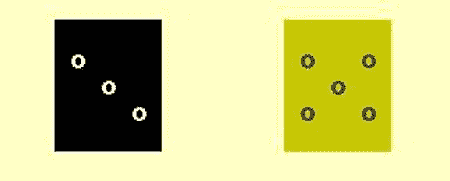

第十四章


编写屏幕脚本

Unix 纯粹主义者会对这一章摇头。传统上，屏幕操作是通过`termcap`或`terminfo`数据库来完成的，这些数据库提供了操作任何几十种甚至上百种终端所需的信息。数据库的 shell 接口是一个外部命令，`tput`。

在某些系统上，`tput` 使用的是`termcap`数据库；在其他系统上(大多数是新系统)，它使用`terminfo`数据库。两个数据库的命令是不同的，所以为一个系统编写的`tput`命令可能在另一个系统上不起作用。

在一个系统中，将光标放在第 10 行第 20 列的命令如下:

```sh
tput cup 9 19
```

在另一个系统上，这是命令:

```sh
tput cm 9 19
```

这些命令将为`TERM`变量中指定的任何类型的终端产生正确的输出。(注:`tput`从 0 开始计数。)

然而，过多的终端类型，出于所有的意图和目的，已经减少到一个单一的，标准的类型。这个标准，ISO 6429(又名 ECMA-48，原名 ANSI X3.64 或 VT100)，无处不在，不支持它的终端少之又少。因此，现在为单一终端类型编码是可行的。这种同质性的一个优点是必要的编码可以完全在外壳内完成。不需要外部命令。

电传打字机对帆布

将脚本的输出发送到终端屏幕有两种方法。第一种也是更传统的方法使用终端，就好像它是一台打印机或电传打字机一样(这就是屏幕或终端的缩写`tty`的由来)。在这种模式下，每打印一行，纸张(或屏幕图像)就会向上滚动。旧线条落到地板上(或从屏幕顶部消失)。它很简单，对于许多应用来说绰绰有余。

第二种方法将屏幕视为黑板或画布，并打印到其表面的特定点。它会擦除和套印先前写入的部分。它可以在屏幕上按列或特定位置打印文本。终端变成一个随机访问而不是串行的设备。

本章将屏幕视为画布或黑板。它为屏幕操作定义了许多变量和函数，并展示了一些使用它们的演示程序。

拉伸画布

要将屏幕用作画布，最重要的功能是能够将光标定位在屏幕上的任何给定位置。其顺序是`ESC[<ROW>;<COL>H`。当转换为`printf`格式字符串时，它可以直接使用或在函数中使用:

```sh
cu_row_col=$'\e[%d;%dH'
printf "$cu_row_col" 5 10  ## Row 5, column 10
echo "Here I am!"
```

本章中的所有函数都是`screen-funcs`库的一部分，它是`screen-vars`文件的来源。[清单 14-1](#list1) 给出了屏幕操作功能。

[***清单 14-1***](#_list1) 。`screen-funcs`，屏幕操作函数库

```sh
. screen-vars
```

`printat`函数([清单 14-2](#list2) )将光标放在请求的位置，如果还有其他参数，它将打印出来。如果没有指定行和列，`printat`将光标移动到屏幕的左上角。

[***清单 14-2***](#_list2) 。`printat`，将光标放在指定位置，打印可选字符串

```sh
printat() #@ USAGE: printat [row [column [string]]]
{
    printf "${cu_row_col?}" ${1:-1} ${2:-1}
    if [ $# -gt 2 ]
    then
      shift 2
      printf "%s" "$*"
    fi
}
```

命令序列导入器

像所有的转义序列一样，`cu_row_col`以`ESC[`开始。这是命令序列介绍者(CSI) 。在`screen-vars`文件中定义([清单 14-3](#list3) )。

[***清单 14-3***](#_list3) 。`screen-vars`，屏幕变量定义

```sh
ESC=$'\e'
CSI=$ESC[
```

给画布涂底漆

在屏幕上绘图之前，通常必须清除它，并且不时地，屏幕的各个部分将需要被清除。这些变量包含清除屏幕或线条的基本序列([清单 14-4](#list4) )。

[***清单 14-4***](#_list4) 。`screen-vars`，用于擦除全部或部分屏幕的变量定义

```sh
topleft=${CSI}H      ## move cursor to top left corner of screen
cls=${CSI}J          ## clear the screen
clear=$topleft$cls   ## clear the screen and move to top left corner
clearEOL=${CSI}K     ## clear from cursor to end of line
clearBOL=${CSI}1K    ## clear from cursor to beginning of line
clearEOS=${CSI}0J    ## clear from cursor to end of screen
clearBOS=${CSI}1J    ## clear from cursor to beginning of screen
```

还有清除屏幕矩形区域的功能，这将在本章后面介绍。

移动光标

除了将移动到绝对位置，光标还可以相对于其当前位置移动。前四个序列与光标键生成的序列相同，它们接受移动多行或多列的参数。接下来的两个按钮打开和关闭光标。以下两个变量分别保存光标位置并将其移回保存的位置。

最后两个移动到下一行或上一行，与前一打印行的开头在同一列。删除了`printf`说明符、`%s`，因为它会消耗将要打印的参数([清单 14-5](#list5) )。

[***清单 14-5***](#_list5) 。`screen-vars`，用于移动光标的变量定义

```sh
## cursor movement strings
     cu_up=${CSI}%sA
   cu_down=${CSI}%sB
  cu_right=${CSI}%sC
   cu_left=${CSI}%sD

## turn the cursor off and on
   cu_hide=${CSI}?25l
   cu_show=${CSI}?12l${CSI}?25h

## save the cursor position
   cu_save=${CSI}s                  ## or ${ESC}7
## move cursor to saved position
cu_restore=${CSI}u                  ## or ${ESC}8

## move cursor to next/previous line in block
     cu_NL=$cu_restore${cu_down/\%s/}$cu_save
     cu_PL=$cu_restore${cu_up/\%s/}$cu_save
```

光标移动的格式字符串使用`%s`说明符而不是`%d`，即使任何参数都是数字。这是因为当没有参数填充时，`printf`用零替换`%d`。如果发生这种情况，光标根本不会移动。对于`%s`，当没有参数时，它们移动一列或一行，因为`%s`被一个空字符串代替。

清单 14-6 中的脚本让这些变量和`printat`函数开始工作。

[***清单 14-6***](#_list6) 。`screen-demo1`，使`printat`工作的脚本

```sh
. screen-funcs                             ## source the screen-funcs library
printf "$clear$cu_hide"                    ## Clear the screen and hide the cursor
printat 10 10 "${cu_save}XX"               ## move, save position, and print XX
sleep 1                                    ## ZZZZZZZZ
printat 20 20 "20/20"                      ## move and print
sleep 1                                    ## ZZZZZZZZ
printf "$cu_restore$cu_down${cu_save}YY"   ## restore pos., move, print, save pos.
sleep 1                                    ## ZZZZZZZZ
printf "$cu_restore$cu_down${cu_save}ZZ" 4 ## restore pos., move, print, save pos.
sleep 1                                    ## ZZZZZZZZ
printat 1 1 "$cu_show"                     ## move to top left and show cursor
```

作为一种变化，尝试将第一个`printat`命令的坐标改为其他值，比如 5 和 40。

更改呈现模式和颜色

字符可以以粗体、下划线或反转模式打印，也可以在支持它们的终端上以各种颜色打印。(还有剩下不要的吗？)这些属性都用形式为`ESC` `[ATTRm`的序列修改，其中`ATTR`是属性或颜色的编号([清单 14-7](#list7) )。可以通过用分号分隔来指定多个属性。

颜色用整数 0 到 7 指定，9 将重置为默认值。前景色以 3 为前缀，背景色以 4 为前缀。属性也由 0 到 7 指定，但没有前缀。虽然定义了八个属性，但只有三个得到广泛支持:1(粗体)、4(下划线)和 7(反转)。这些属性可以分别用值 22、24 和 27 单独关闭。值为 0 会将所有属性和颜色重置为默认值。

[***清单 14-7***](#_list7) 。`screen-vars`，颜色和属性的变量定义

```sh
## colours
  black=0
    red=1
  green=2
 yellow=3
   blue=4
magenta=5
   cyan=6
  white=7

     fg=3  ## foreground prefix
     bg=4  ## background prefix

## attributes
     bold=1
underline=4
  reverse=7

## set colors
    set_bg="${CSI}4%dm"          ## set background color
    set_fg="${CSI}3%dm"          ## set foreground color
    set_fgbg="${CSI}3%d;4%dm"    ## set foreground and background colors
```

如下一个演示脚本所示，颜色和属性可以在“tty”模式和“canvas”模式中使用([清单 14-8](#list8) )。

[***清单 14-8***](#_list8) 。`screen-demo2`，颜色和属性模式

```sh
. screen-funcs
echo
for attr in "$underline" 0 "$reverse" "$bold" "$bold;$reverse"
do
  printf "$set_attr" "$attr"
  printf "$set_fg %s " "$red" RED
  printf "$set_fg %s " "$green" GREEN
  printf "$set_fg %s " "$blue" BLUE
  printf "$set_fg %s " "$black" BLACK
  printf "\e[m\n"
done
echo
```

在屏幕上放置一个文本块

`put_block`函数在当前光标位置一个接一个地打印其参数；`put_block_at`将光标移动到指定位置，移动参数以删除行和列，然后用剩余的参数调用`put_block`([清单 14-9](#list9) )。

`cu_NL`变量将光标移动到保存的位置，然后向下移动一行并保存该位置。

[***清单 14-9***](#_list9) 。`put_block``put_block_``at`，在屏幕上的任何地方打印一块文本

```sh
put_block() #@ Print arguments in a block beginning at the current position
{
  printf "$cu_save"      ## save cursor location
  printf "%s$cu_NL" "$@" ## restore cursor location, move line down, save cursor
}

put_block_at() #@ Print arguments in a block at the position in $1 and $2
{
  printat "$1" "$2"
  shift 2
  put_block "$@"
}
```

清单 14-10 显示了`screen-demo3`的脚本，它在屏幕上以柱状格式显示数据块。

[***清单 14-10***](#_list10) 。`screen-demo3`

```sh
. screenfuncs

printf "$cls"
put_block_at 3 12 First Second Third Fourth Fifth
put_block_at 2 50 January February March April May June July
```

`screen-demo3`的输出如下:

```sh
                                                 January
           First                                 February
           Second                                March
           Third                                 April
           Fourth                                May
           Fifth                                 June
                                                 July
```

当屏幕为空时，`put_block`和`put_block_at`功能工作正常。如果屏幕上已经有很多文本，输出可能会模糊不清。对于这些情况，有`print_block_at`和`print_block`函数清除块周围的矩形区域。

为了确定需要清除的宽度，`put_block`将其参数传递给`_max_length`函数，该函数循环遍历参数以找到最长的([清单 14-11](#list11) )。

[***清单 14-11***](#_list11) 。`_max_length`，在`_MAX_LENGTH`中存储最长参数的长度

```sh
_max_length() #@ store length of longest argument in _MAX_LENGTH
{
  local var
  _MAX_LENGTH=${#1}      ## initialize with length of first parameter
  shift                  ## ...and remove first parameter
  for var                ## loop through remaining parameters
  do
    [ "${#var}" -gt "$_MAX_LENGTH" ] && _MAX_LENGTH=${#var}
  done
}
```

`print_block`函数使用`_max_length`的结果作为`printf` ( [清单 14-12](#list12) )的宽度规格。文本前后打印空行，每行前后打印一个空格。`print_block_at`和`put_block_at`唯一的区别就是一个叫`print_block`，一个叫`put_block`。

[***清单 14-12***](#_list12) 。`print_block` ，清除区域和打印块

```sh
print_block() #@ Print arguments in a block with space around them
{
  local _MAX_LENGTH
  _max_length "$@"
  printf "$cu_save"
  printf " %-${_MAX_LENGTH}s $cu_NL" " " "$@" " "
}

print_block_at() #@ Move to position, remove 2 parameters and call print_block
{
  printat $1 $2
  shift 2
  print_block "$@"
}
```

用`print_block`或`print_block`打印的文本更可能是单个字符串，而不是单独的参数。要将字符串分割成足够短的单词或短语以适应给定的空间，使用`wrap`函数 ( [清单 14-13](#list13) )。这个函数将一个字符串拆分成具有命令行指定的最大宽度的行。

[***清单 14-13***](#_list13) 。`wrap`，将字符串拆分成元素不超过最大长度的数组

```sh
wrap() #@ USAGE: wrap string length
{      #@ requires bash-3.1 or later
  local words=$1 textwidth=$2 line= opts=$-
  local len=0 templen=0
  set -f

  unset -v wrap
  for word in $words
  do
    templen=$(( $len + 1 + ${#word} )) ## Test adding a word
    if [ "$templen" -gt "$textwidth" ] ## Does adding a word exceed length?
    then
      wrap+=( "$line" )                ## Yes, store line in array
      printf -v line "%s" "$word"      ## begin new line
      len=${#word}
    else
      len=$templen                     ## No, add word to line
      printf -v line "%s" "${line:+"$line "}" "$word"
    fi
  done
  wrap+=( "$line" )

  case $opts in
    *f*) ;;
    *) set +f ;;
  esac
}
```

在[清单 14-14](#list14) 中显示的例子使用了`wrap`和`print_block_at`。

[***清单 14-14***](#_list14) 。`screen-demo4`，演示了`wrap`和`print_block`功能

```sh
clear
wrap "The quick brown fox jumps over the lazy dog" 15
x=xxxxxxxxxxxxxxxxxxxxxxxxxxxxxxxxxxxxxxxxxxxxxxxxxxxxxxxxxxxxxxxxxxxxxxxxxxxxxxxx
printat 1 1
printf "%s\n" $x{,,,,,,,,,,}          ## print 11 lines of 'x's
print_block_at 3 33 "${wrap[@]}"
printat 12 1
```

输出如下所示:

```sh
xxxxxxxxxxxxxxxxxxxxxxxxxxxxxxxxxxxxxxxxxxxxxxxxxxxxxxxxxxxxxxxxxxxxxxxxxxxxxxxx
xxxxxxxxxxxxxxxxxxxxxxxxxxxxxxxxxxxxxxxxxxxxxxxxxxxxxxxxxxxxxxxxxxxxxxxxxxxxxxxx
xxxxxxxxxxxxxxxxxxxxxxxxxxxxxxxx                 xxxxxxxxxxxxxxxxxxxxxxxxxxxxxxx
xxxxxxxxxxxxxxxxxxxxxxxxxxxxxxxx The quick       xxxxxxxxxxxxxxxxxxxxxxxxxxxxxxx
xxxxxxxxxxxxxxxxxxxxxxxxxxxxxxxx brown fox jumps xxxxxxxxxxxxxxxxxxxxxxxxxxxxxxx
xxxxxxxxxxxxxxxxxxxxxxxxxxxxxxxx over the lazy   xxxxxxxxxxxxxxxxxxxxxxxxxxxxxxx
xxxxxxxxxxxxxxxxxxxxxxxxxxxxxxxx dog             xxxxxxxxxxxxxxxxxxxxxxxxxxxxxxx
xxxxxxxxxxxxxxxxxxxxxxxxxxxxxxxx                 xxxxxxxxxxxxxxxxxxxxxxxxxxxxxxx
xxxxxxxxxxxxxxxxxxxxxxxxxxxxxxxxxxxxxxxxxxxxxxxxxxxxxxxxxxxxxxxxxxxxxxxxxxxxxxxx
xxxxxxxxxxxxxxxxxxxxxxxxxxxxxxxxxxxxxxxxxxxxxxxxxxxxxxxxxxxxxxxxxxxxxxxxxxxxxxxx
xxxxxxxxxxxxxxxxxxxxxxxxxxxxxxxxxxxxxxxxxxxxxxxxxxxxxxxxxxxxxxxxxxxxxxxxxxxxxxxx
```

滚动文本

通过将数组与子串扩展相结合，文本可以在屏幕的任何区域滚动。因为整个区域可以用一个`printf`命令打印，所以滚动很快，尽管随着数组大小的增加，滚动会变慢。[清单 14-15](#list15) 中的演示将`/usr/bin/`中的文件名存储在数组`list`中；向上滚动列表；等待一秒钟；然后向下滚动。

每个循环，向上和向下，都包含一个注释掉的`read -t "$delay"`行。当取消注释时，它会减慢滚动速度。它使用`bash-4.x`小数延迟。如果您使用的是早期版本，请使用`sleep`来代替。大多数实现(当然是 GNU 和*BSD)都接受分数参数。

[***清单 14-15***](#_list15) 。`scroll-demo`，上下滚动文本块

```sh
list=( /usr/bin/* )          ## try it with other directories or lists
rows=9                       ## number of rows in scrolling area
delay=.01                    ## delay between scroll advance
width=-33.33                 ## width spec: (no more than) 33 chars, flush left
x=XXXXXXXXXXXXXXXXXXXXXXXXXX ## bar of 'X's
x=$x$x$x$x                   ## longer bar

clear                        ## clear the screen
printf "%50.50s\n" $x{,,,,,,,,,,,,,}          ## print 14 lines of 'X's

n=0                          ## start display with first element

## scroll upwards until reaching the bottom
while [ $(( n += 1 )) -lt $(( ${#list[@]} - $rows )) ]
do
  printf "\e[3;1H"
  printf "\e[7C %${width}s\n" "${list[@]:n:rows}"
#  read -sn1 -t "$delay" && break
done
sleep 1

## scroll downwards until reaching the top
while [ $(( n -= 1 )) -ge 0 ]
do
  printf "\e[3;1H"
  printf "\e[7C %${width}s\n" "${list[@]:n:rows}"
#  read -sn1 -t "$delay" && break
done

printf "\e[15;1H"    ## finish with cursor well below scrolling area
```

滚石杂志说

骰子在许多游戏中都有使用，如果您满足于只打印数字，那么编程起来很简单:

```sh
printf "%s\n" "$(( $RANDOM % 6 + 1 ))"
```

然而，一个令人满意的图形呈现可以用 shell 编程实现，而且非常容易。要打印骰子，将光标定位在屏幕上所需的位置，设置前景色和背景色，并打印数组中的元素([图 14-1](#Fig1) )。



[图 14-1](#_Fig1) 。[清单 14-16](#list16) 包含了这些骰子的代码

可以用大约 25 行代码对六个骰子的阵列进行编程。每个骰子由 18 个变量串联而成。其中一些与那些在`screen-funcs`库中的内容相同，但是它们的名字在这里被缩短以保持行更短。以下是对编号为 5 的骰子的描述:

```sh
$b    ## set bold attribute (optional)
$cs   ## save cursor position
$p0   ## print blank row
$cr   ## restore cursor to left side of die
$dn   ## move down one line
$cs   ## save cursor position
$p4   ## print row with two pips
$cr   ## restore cursor to left side of die
$dn   ## move down one line
$cs   ## save cursor position
$p2   ## print row with one pip
$cr   ## restore cursor to left side of die
$dn   ## move down one line
$cs   ## save cursor position
$p4   ## print row with two pips
$cr   ## restore cursor to left side of die
$dn   ## move down one line
$p0   ## print blank row
```

定义骰子后，清单 14-16 中的脚本清空屏幕，并在屏幕顶部附近打印两个随机骰子。

[***清单 14-16***](#_list16) 。`dice`，定义六个骰子的阵列，并在屏幕上放置两个

```sh
pip=o                      ## character to use for the pips
p0="       "               ## blank line
p1=" $pip     "            ## one pip at the left
p2="   $pip   "            ## one pipe in the middle of the line
p3="     $pip "            ## one pip at the right
p4=" $pip   $pip "         ## two pips
p5=" $pip $pip $pip "      ## three pips

cs=$'\e7'                  ## save cursor position
cr=$'\e8'                  ## restore cursor position
dn=$'\e[B'                 ## move down 1 line
b=$'\e[1m'                 ## set bold attribute
cu_put='\e[%d;%dH'         ## format string to position cursor
fgbg='\e[3%d;4%dm'         ## format string to set colors

dice=(
  ## dice with values 1 to 6 (array elements 0 to 5)
  "$b$cs$p0$cr$dn$cs$p0$cr$dn$cs$p2$cr$dn$cs$p0$cr$dn$p0"
  "$b$cs$p0$cr$dn$cs$p1$cr$dn$cs$p0$cr$dn$cs$p3$cr$dn$p0"
  "$b$cs$p0$cr$dn$cs$p1$cr$dn$cs$p2$cr$dn$cs$p3$cr$dn$p0"
  "$b$cs$p0$cr$dn$cs$p4$cr$dn$cs$p0$cr$dn$cs$p4$cr$dn$p0"
  "$b$cs$p0$cr$dn$cs$p4$cr$dn$cs$p2$cr$dn$cs$p4$cr$dn$p0"
  "$b$cs$p0$cr$dn$cs$p5$cr$dn$cs$p0$cr$dn$cs$p5$cr$dn$p0"
  )

clear
printf "$cu_put" 2 5               ## position cursor
printf "$fgbg" 7 0                 ## white on black
printf "%s\n" "${dice[RANDOM%6]}"  ## print random die

printf "$cu_put" 2 20              ## position cursor
printf "$fgbg" 0 3                 ## black on yellow
printf "%s\n" "${dice[RANDOM%6]}"  ## print random die
```

摘要

不涉及传统的 ASCII 艺术，有许多方法可以在终端屏幕上画图。本章介绍了其中的一些，给出了可以用来创建更多的基础知识。

练习

1.  编写一个函数`hbar`，它接受两个整数参数，一个宽度和一个颜色，并打印一个具有该颜色和宽度的条形。编写第二个函数`hbar_at`，它接受四个参数:行、列、宽度和颜色；将光标移动到行和列；并将剩下的争论交给`hbar`。
2.  编写一个函数`clear_area`，它接受两个整数参数，即行和列，并清除多个行和列的矩形区域。