# 二、了解环境

在使用 Visual Studio Code作为您选择的编辑器之前，为了充分利用开发环境，了解工作区是如何组织的以及有哪些命令和工具是很方便的。

VS 代码用户界面和布局被优化以最大化代码编辑的空间，它还提供了简单的快捷方式来快速访问给定上下文中需要的所有附加工具。更具体地说，用户界面分为五个区域:代码编辑器、状态栏、活动栏、面板区域和侧栏。本章解释了用户界面是如何组织的，以及如何最有效地使用它。

Note

本章中讨论的所有特性都适用于任何语言的任何文件，无论图中显示的语言是什么(通常是 C#)，它们都是可用的。您可以通过文件➤打开文件打开一个或多个代码文件，以激活一些编辑器窗口并探索本章中讨论的功能。然后，第 4 章更详细地讨论了如何使用一种或多种语言同时处理单个文件和多个文件。

## 欢迎页面

启动时，Visual Studio Code显示欢迎页面，如图 [2-1](#Fig1) 所示。

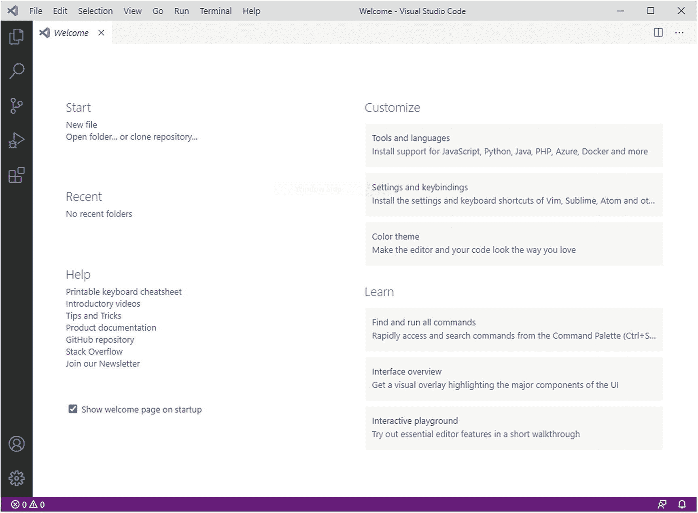

图 2-1

欢迎页面

在页面的左侧，在 **Start** 组下，您可以找到创建和打开文件和文件夹以及克隆现有 Git 存储库的快捷方式。在**最近**组下面是最近打开的文件和文件夹列表，你可以点击快速打开。在**帮助**组下，有一些有用的链接指向备忘单、介绍性视频、产品文档和其他关于 Visual Studio Code的学习资源。在欢迎页面的右侧，在**自定义**组下，可以找到通过安装扩展、更改键盘快捷键、更改颜色主题来自定义 Visual Studio Code的快捷方式。在 **Learn** 组下是关于命令和用户界面学习资源的附加快捷方式。

欢迎页面中突出显示的大多数特性在本书中都有讨论。默认情况下，欢迎页面设置为在每次启动代码时显示。要更改此默认行为，请取消选中**启动时显示欢迎页面**复选框。要在启动时重新启用欢迎页面，请点击**帮助➤欢迎**并重新添加复选标记。

## 代码编辑器

代码编辑器当然是你在 VS 代码中花费最多时间的地方。当您创建新文件或打开现有文件和文件夹时，代码编辑器变得可用。您可以一次编辑一个文件，也可以同时并排编辑多个文件。图 [2-2](#Fig2) 显示了后者的一个例子。

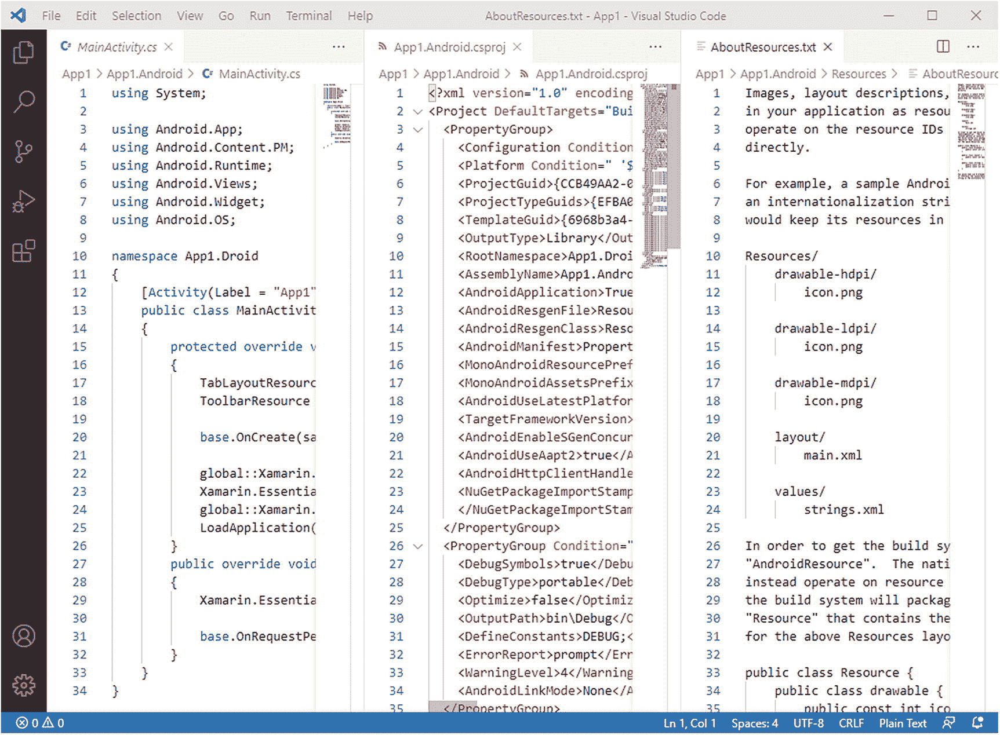

图 2-2

代码编辑器和多个文件视图

为此，您有几个选择:

*   右键单击浏览器栏中的文件名，然后选择**打开到侧面**。

*   按住 Ctrl 键并单击浏览器栏中的文件名。这将在本章后面的“侧栏”一节中讨论。

*   Ctrl+\(或 macOS 上的⌘+\)将编辑器一分为二。

请注意，如果您已经打开了三个文件，并且想要打开另一个文件，活动的编辑器将显示该文件。开放编辑器也可以组织成组。为此，您可以将一个打开的编辑器的标题拖放到另一个编辑器附近，它们将被分组到同一个空间，浏览器栏将显示组列表。您可以通过按 Ctrl + 1、2 和 3 在编辑器之间快速切换。请记住，这适用于多达九个编辑器窗口。代码编辑器是 Visual Studio Code的核心，它提供了大量强大的生产力特性，我们将在下一章深入讨论这些特性。现在，知道如何打开和排列编辑器窗口就足够了。

### 重新排序、调整大小和缩放编辑器窗口

您可以根据自己的偏好对编辑器窗口进行重新排序和调整大小。要对编辑器重新排序，请点按编辑器的标题(您可以在此处看到文件名),并将编辑器移动到不同的位置。当指针在编辑器的边界上时，可以通过单击鼠标左键来调整编辑器的大小，直到它显示为左/右箭头对。

您还可以通过分别单击 Ctrl++和 Ctrl+-，放大和缩小活动编辑器。或者，您可以选择视图➤放大和视图➤缩小。您可以使用外观➤重置缩放来重置原始缩放因子。

Note

在 Visual Studio Code中，缩放实际上是一种辅助功能。作为一种暗示，当您缩放代码编辑器时，其他所有内容也将被缩放。

## 状态栏

状态栏包含有关当前文件或文件夹的信息，并提供一些快速操作的快捷方式。图 [2-3](#Fig3) 显示了一个状态栏如何出现的例子。

图 2-3

状态栏

状态栏从左至右包含以下信息:

*   Git 版本控制信息和选项，比如当前分支。这只有在 VS 代码连接到 Git 存储库时才可见。

*   在源代码中检测到错误和警告。

*   以行和列表示的光标位置。

*   制表符大小，在本例中为**空格** **: 4** 。您可以单击此处更改缩进大小，并将缩进转换为制表符或空格。

*   当前文件的编码。

*   当前的行终止符。

*   打开文件的编程语言或标记语言。通过单击当前语言名称，您可以从弹出的下拉列表中更改语言。

*   项目名称，如果打开的文件夹包含受支持的项目系统。值得注意的是，如果文件夹包含多个项目文件，单击此项可以在项目之间切换。

*   “反馈”按钮，使您能够在 Twitter 上共享您对 Visual Studio Code的反馈。

*   通知图标，显示新通知的数量(如果有)。通知消息通常来自扩展，或者是关于产品更新的。

值得一提的是，状态栏颜色会根据情况而变化。例如，当您打开单个文件时，它是紫色的；当您打开文件夹时，它是蓝色的；当 Visual Studio Code处于调试模式时，它是橙色的。此外，第三方扩展可能会使用状态栏来显示它们自己的信息。

## 活动栏

活动栏位于工作区的左侧，可以看作是侧栏的折叠容器。图 [2-4](#Fig4) 所示为活动栏。

图 2-4

活动栏

活动栏提供了资源管理器、搜索、Git、运行和调试、扩展、帐户和设置工具的快捷方式，这些工具将在下一节中介绍。当您单击快捷方式时，与所选工具相关的侧栏会变得可见。您可以再次单击同一快捷方式来折叠侧栏。

## 侧栏

侧边栏是 Visual Studio Code中最重要的工具之一，也是您将更多与之交互的工具之一。它由五个工具组成，每个工具都由相应的图标启用，在以下小节中进行了描述。

### 浏览器栏

通过单击边栏顶部的第一个图标可以启用浏览器栏，浏览器栏提供了您正在处理的文件夹或文件的结构化、有组织的视图。**打开编辑器**子视图包含活动文件列表，包括不属于项目或文件夹的打开文件或已被修改的文件。相反，它们显示在子视图中，子视图的名称是文件夹或项目名称。图 [2-5](#Fig5) 提供了一个探索者的例子。

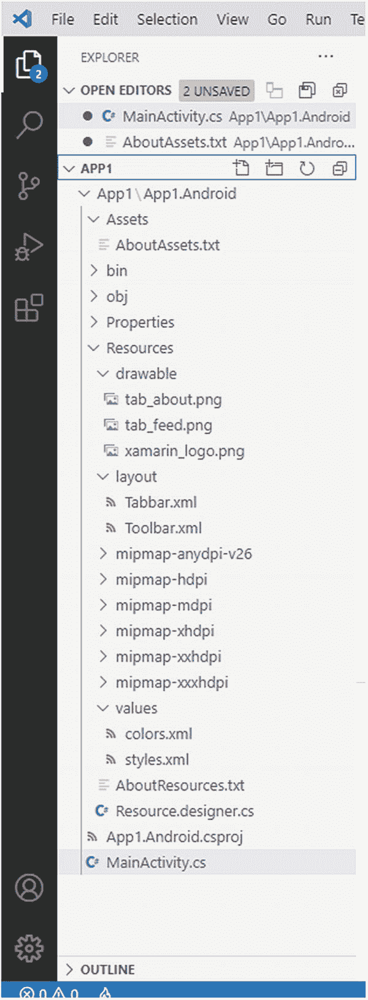

图 2-5

浏览器栏

Note

您必须将光标悬停在文件夹名称(图 [2-5](#Fig5) 中的 APP1)上，以使四个按钮可见。

显示文件夹结构的子视图提供了四个按钮(从左到右):**新建文件**、**新建文件夹**、**刷新浏览器**和**在浏览器中折叠文件夹**，每个按钮都是不言自明的。**打开编辑器**子视图有三个按钮(鼠标悬停时出现):**切换垂直/水平编辑器布局**、**保存所有编辑器**和**关闭所有编辑器**。在资源管理器中右键单击一个文件夹或文件名会提供一个上下文菜单，该菜单提供常用命令(如本章前面提到的**打开到侧面**)。一个很有意思的命令是**在资源管理器**中显示(或者在 Mac 上**显示给查找器**，在 Linux 上**打开包含文件夹**，打开选中项目的包含文件夹。请注意，活动栏中的资源管理器图标也报告了已修改文件的数量。

#### 大纲视图

浏览器栏的底部包含另一组名为**的轮廓**。该组提供了代码文件中定义的类型和成员或隐式。图 [2-6](#Fig6) 和 [2-7](#Fig7) 分别显示了基于打字稿文件和基于 HTML 文件的轮廓。

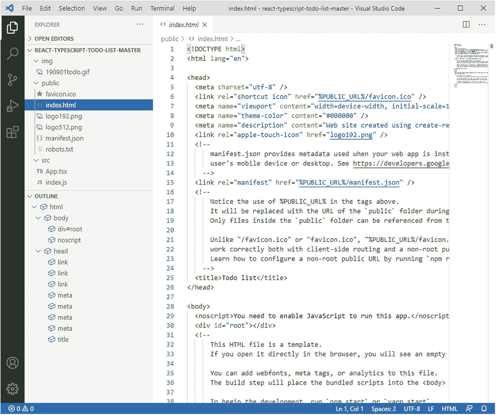

图 2-7

HTML 文件的大纲视图

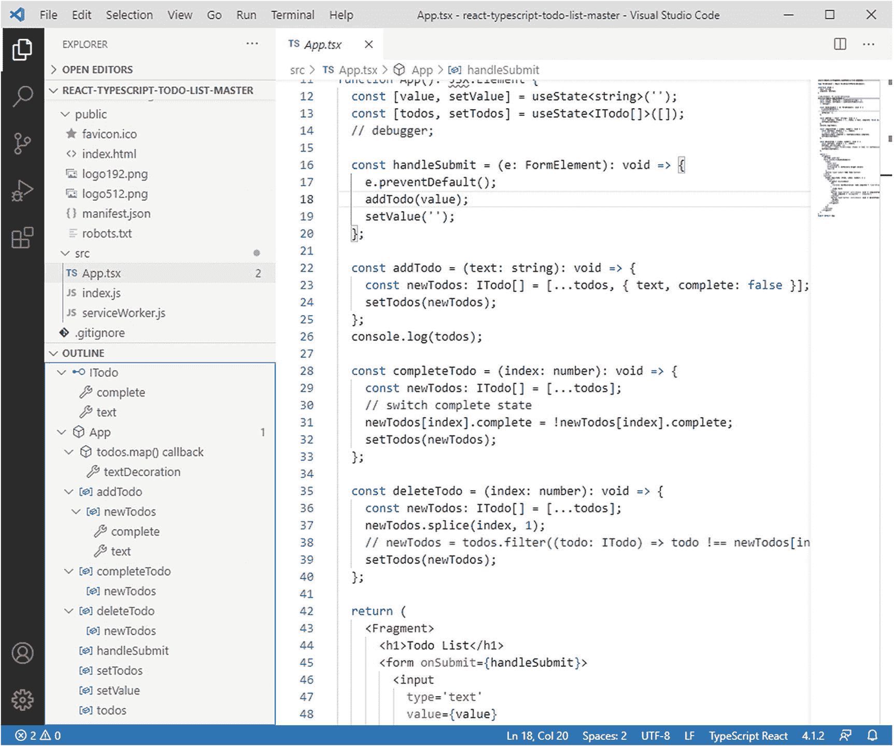

图 2-6

类型脚本文件的大纲视图

您可以展开标记文件中定义的类型和成员，以查看它们定义的其他对象，并且可以单击每个项目，将光标放在源代码中选定的项目定义上。值得一提的是，Visual Studio Code用不同的颜色(在 Visual Studio Light 主题的情况下为红色)突出显示有潜在问题的项，这些项在代码编辑器中用波浪线突出显示。目前，Outline 视图只对 JavaScript、TypeScript、HTML、Markdown 和 JSON 等语言可用。安装适当的扩展时，可能会支持其他语言。

### 搜索工具

通过单击搜索图标可以启用搜索工具，该工具允许进行搜索，并且可以选择替换文件中的文本。您可以搜索一个或多个单词，包括特殊字符(如*和？)，甚至可以基于正则表达式进行搜索。图 [2-8](#Fig8) 显示了运行中的搜索工具，扩展了高级选项(要包括的文件和要排除的文件)，您可以通过单击位于替换下的 **…** 按钮来启用这些选项。在该示例中，仅在内执行搜索。cs 文件。

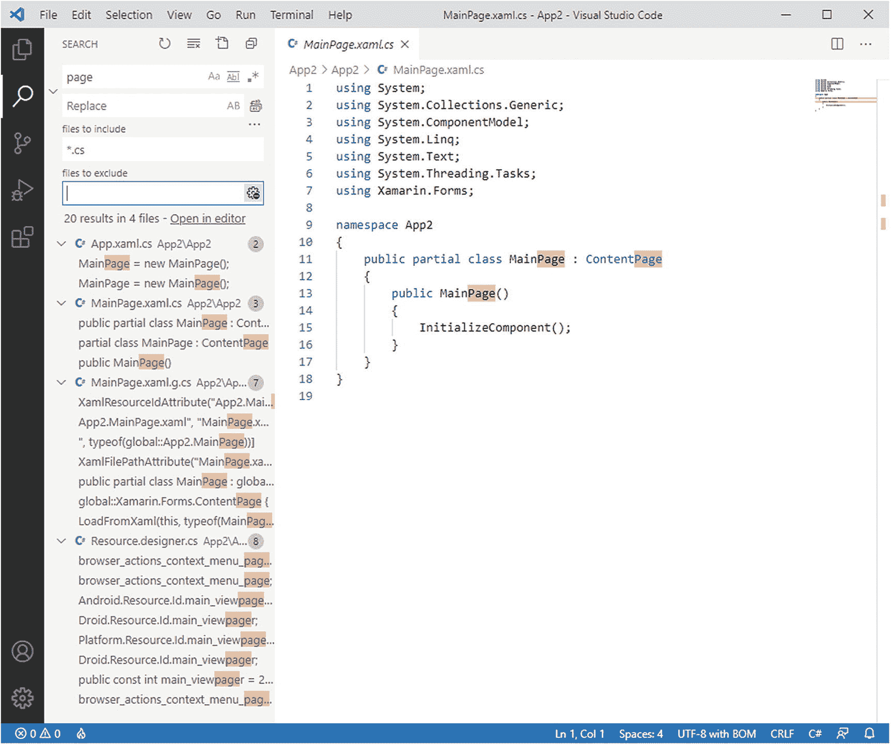

图 2-8

搜索工具

搜索结果显示在分层视图中，该视图对包含指定搜索关键字的所有文件进行分组，显示包含该关键字的代码行的摘录。文件列表和代码编辑器中的匹配项也会突出显示。最后，您可以点击工具栏中靠近搜索标题的**清除搜索结果**按钮来清除搜索结果。如果您想用新文本替换某些文本，您可以在**替换**文本框中输入新文本，然后点击**全部替换**按钮。

### Git 酒吧

侧栏提供了对版本控制的 Git 集成的访问。Git 集成是一个核心话题，将在第 [7](07.html) 章中详细讨论，但是为了侧栏的完整性，这里提供了一个快速浏览。

Git 栏可以通过单击侧栏顶部的第三个按钮(带有一种叉状图标)来启用，并提供对所有常见源代码控制操作的访问，例如初始化存储库、提交代码文件和同步分支。Git 图标还显示了本地修改的文件数量。图 [2-9](#Fig9) 显示了一个例子。修改后的文件列在**修改**组下。每个列出的文件都有三个按钮:**打开文件**、**废弃变更**和**阶段变更**。在 Git 中，正如您将在第 7 章[中了解到的，阶段化变更的概念意味着将变更从主代码分支中分离出来，以便开发人员可以评估是提交变更还是丢弃变更。单击文件名将启用拆分视图，显示修改后的代码和原始代码之间的差异；该主题也将在第](07.html) [7](07.html) 章中进行更全面的讨论。

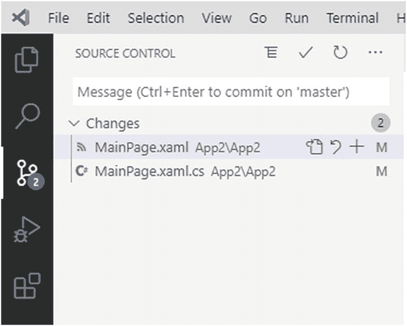

图 2-9

Git 酒吧

Git 栏还提供了一个弹出菜单，其中包含 Visual Studio Code中支持的 Git 命令的列表，这些命令被组织到子菜单中，例如 Commit、Push、Pull 以及本书后面将会介绍的其他几个命令。点击 Git 栏右上角的 **…** 按钮打开菜单。

### 运行和调试栏

Visual Studio Code不仅仅是一个简单的代码编辑器，还是一个功能齐全的开发工具，它附带了一个集成的调试器.NET Core，并且可以用第三方调试器为其他平台和语言进行扩展。第 9 章更详细地描述了 Visual Studio Code的这一重要部分，但是现在请注意，您可以通过单击侧边栏顶部的第四个图标来访问调试工具。这将打开运行和调试栏，如图 [2-10](#Fig10) 所示。

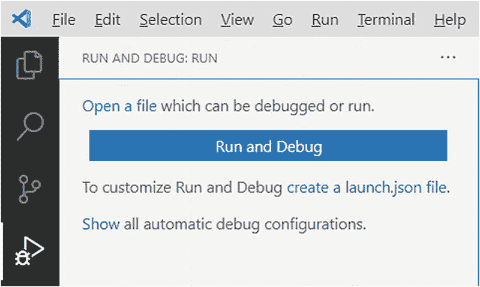

图 2-10

运行和调试栏

在第 9 章中，你将看到如何配置调试工具，以及它们在 Visual Studio Code中的强大功能。您还将看到安装额外的调试器是多么容易。

### 扩展栏

可以通过单击活动栏中从顶部数第五个按钮来启用扩展栏，并允许搜索和安装 Visual Studio Code的扩展，其中包括其他语言、调试器、代码片段等等。扩展性将在第 [6](06.html) 章中讨论，但是图 [2-11](#Fig11) 提供了一个扩展栏如何出现的例子。

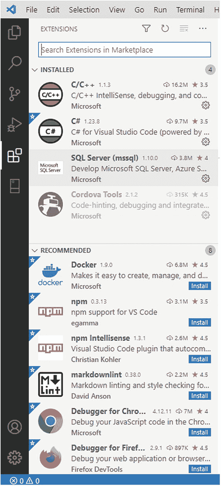

图 2-11

扩展栏

您不仅可以在线搜索扩展，还可以看到已安装的扩展以及禁用和推荐的扩展的列表。

### “帐户”按钮

Visual Studio Code的最大好处之一是，您可以通过将开发环境安排在对您最方便的配置中，以多种方式对其进行自定义。这包括扩展、键盘快捷键、常规设置等等。

如果您在多台机器上运行 VS 代码，如果您可以在所有机器上自动重新创建您的环境，而不需要在每台机器上手动设置您的首选项，这将非常有用。幸运的是，这可以通过侧边栏上的**账户**按钮来实现。

有了这个工具，你可以用一个 Microsoft 或 GitHub 帐户登录，你的设置将在你用同一个帐户登录的所有 VS 代码安装中同步。以下是可以同步的设置列表:

*   常规设置

*   快捷键

*   扩展ˌ扩张

*   用户定义的代码片段

*   用户界面的状态

点击**账户**按钮，然后**打开设置同步**，即可启用设置同步。此时，代码显示一个设置列表，您可以跨机器同步这些设置，默认情况下选择所有设置，如图 [2-12](#Fig12) 所示。

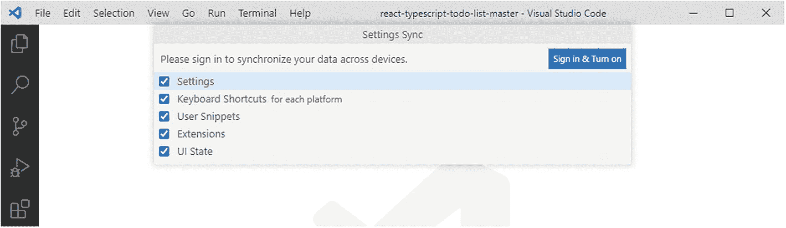

图 2-12

选择要同步的设置

选择您想要同步的设置，然后点击**登录&打开**。在这一点上，你会被要求指定你想使用哪种帐户，如微软或 GitHub。显然，您需要在所有其他代码安装上使用相同的帐户。将打开一个浏览器窗口，您可以在其中输入凭据，登录完成后，您将很快收到一条确认消息。

Note

在 Windows 上，防火墙可能会提示您一条警告，说 VS 代码正在试图打开 Web 上的资源。如果发生这种情况，您可以安全地允许此操作。

此时，Visual Studio Code开始同步所有选定的设置，这可能需要一段时间。在后台，设置同步基于两个文件，settings.json 和 extensions.json，VS 代码需要从不同的安装中合并这两个文件。如果在自动合并这些文件时遇到问题，VS Code 会提供一个选项，让您使用与 Git 相同的合并工具来手动合并设置。这是一个非常有用的特性，它将为您节省大量时间，让您在不同的机器上获得同样舒适的环境。

### 设置按钮

“设置”按钮用齿轮图标表示，位于活动栏的底部。如果你点击它，你会看到一个弹出菜单，上面有一列命令，代表自定义 Visual Studio Code的快捷方式(这将在第 [5](05.html) 章中详细讨论)。其中，菜单中的命令使您能够手动搜索产品更新。

## 在文件间导航

除了单击编辑器的选项卡之外，Visual Studio Code还提供了两种在文件之间导航的方式。最快的方法是按 Alt+Left 或 Alt+Right 在活动文件之间切换。

如果您改为按 Ctrl+Tab，您将能够浏览当前打开的文件列表并选择一个进行编辑，如图 [2-13](#Fig13) 所示。

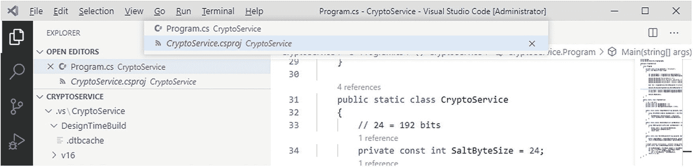

图 2-13

在活动文件之间导航

## 命令选项板

与代码编辑器、活动栏和侧边栏一起，命令面板是 Visual Studio Code中另一个非常重要的工具，它使您能够通过键盘访问 Visual Studio Code内置命令以及由扩展添加的命令。你可以打开命令面板，如图 [2-14](#Fig14) 用**视图** ➤ **命令面板**或者通过 Ctrl+Shift+P 键盘快捷键(macOS 上的⌘+P)打开。

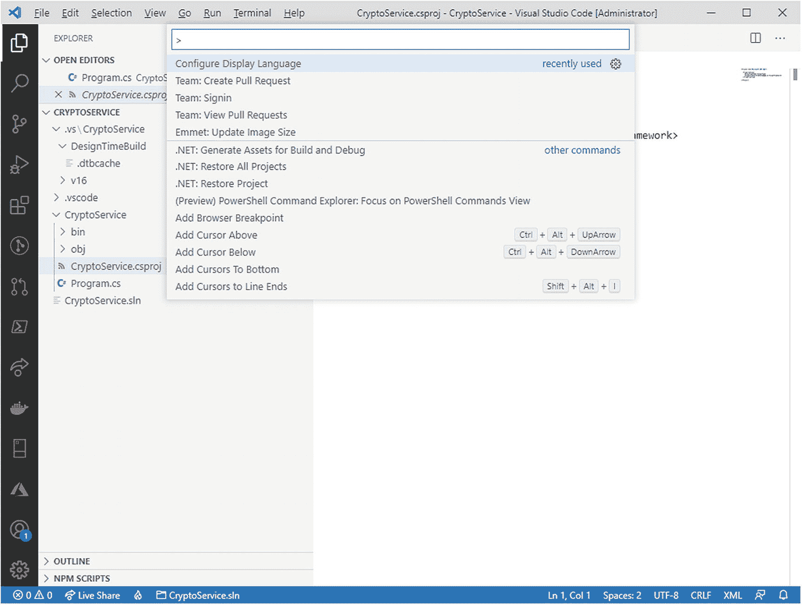

图 2-14

命令选项板

命令选项板不仅仅是菜单命令或用户界面工具，还包括在其他地方无法访问的其他操作。例如，命令面板使您能够安装扩展以及恢复当前项目或文件夹上的 NuGet 包。您可以简单地上下移动来查看可用命令的完整列表，并且可以键入一些字符来过滤列表。您会注意到它们中有多少是菜单中可用的映射操作，并且其中许多都有可用的键盘快捷键。与扩展、调试和 Git 相关的其他命令将在后面的章节中讨论，所以此时开始使用命令面板是很重要的。

## 面板区域

Visual Studio Code通常不仅需要显示关于源代码的信息，还需要显示来自 Git 引擎、外部工具或调试器的信息。为了以一种有组织的方式实现这一点，环境提供了所谓的面板区域，默认情况下，它出现在用户界面的底部。

Panels 区域由四个内置面板组成:问题、输出、调试控制台和终端，本节将分别讨论这四个面板。默认情况下，面板区域是不可见的，当面板所代表的信息变得可用时(例如调试器发送有关源代码中符号的信息)，它通常会弹出。此外，默认情况下，面板区域出现在 VS 代码用户界面的底部，但是您可以通过右键单击面板，然后选择**右移面板**或**左移面板**，或者使用**将面板移至底部**来恢复原始位置，从而将其移动到工作区的一侧。此外，您现在可以使用鼠标将面板拖放到不同的位置。现在让我们更详细地讨论每个面板。

### 问题面板

对于具有内置增强编辑支持的语言，如 TypeScript ( [`https://www.typescriptlang.org`](https://www.typescriptlang.org) )，或者添加了扩展以提供高级编辑功能的语言，如 C#，Visual Studio Code可以在您键入时检测代码问题。在代码编辑器中，这些通常用红色曲线突出显示(表示阻塞错误)，用绿色突出显示(表示警告)。错误、警告和信息性消息的列表也显示在“问题”面板中。这可以通过点击状态栏左下角的错误数量来启用(参见图 [2-15](#Fig15) )。

由于图标不同，问题面板可以很容易地区分错误和警告(红色背景上的白色 x 表示错误，黄色背景上的黑色感叹号表示警告)。图 [2-15](#Fig15) 显示了一个基于 C#代码的例子，其中包含一个未使用的变量(警告)和一个语法错误。

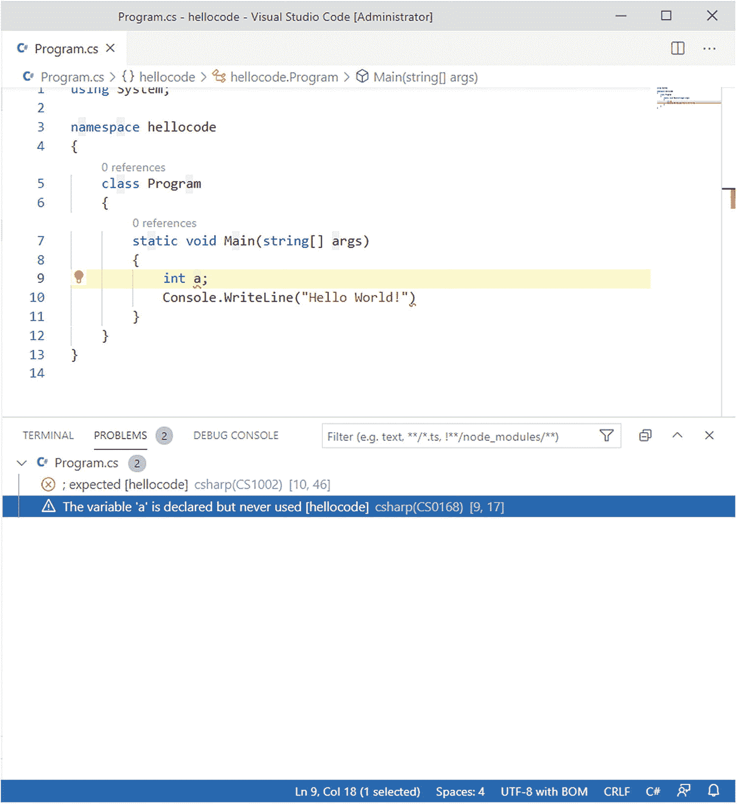

图 2-15

问题面板

如果打开了多个文件,“问题”面板会按文件名对问题进行分组。此外，对于每个问题，您将能够看到文件夹名称和在源代码文件中的位置。只要双击一个问题，VS 代码就会将光标移动到代码编辑器中选中的项目。

Note

代码编辑器还提供了一种在输入时快速修复代码问题的方法，但这与问题面板无关，将在下一章讨论。

### 输出面板

“输出”面板是 Visual Studio Code显示来自内部和外部工具(如运行时工具、Git 命令、扩展和任务)的消息的地方。图 [2-16](#Fig16) 显示了基于输出的示例.NET 的 NuGet 包管理器。

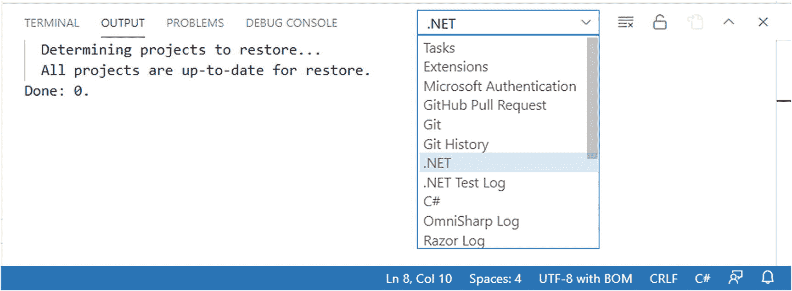

图 2-16

输出面板

因为在针对源代码文件的操作期间(例如，包还原然后编译)或者在 Visual Studio Code生存期(例如扩展)期间，可能会同时运行多个工具，所以您可以使用面板中的下拉框来更改视图并查看每个工具的输出。如果外部工具的执行失败，并且您想要获得关于发生了什么的更多信息，那么这个工具特别有用。

### 调试控制台面板

顾名思义，调试控制台面板是调试器用来显示代码执行信息的专用面板。图 [2-17](#Fig17) 显示了一个基于简单 C#应用执行的例子。

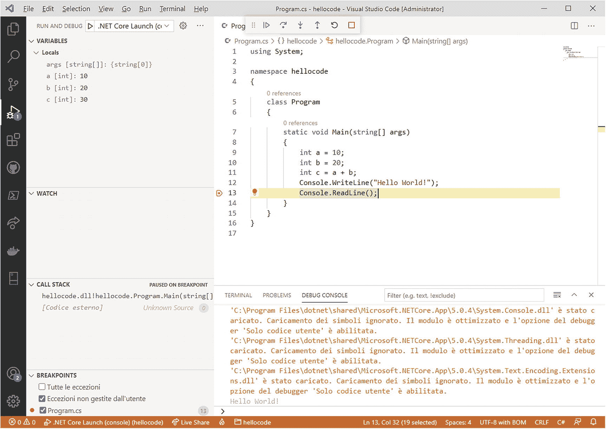

图 2-17

调试控制台面板

调试控制台不仅显示有关代码执行、调试符号的信息以及调试器需要显示的任何其他信息，还充当一个交互式控制台，您可以在其中计算表达式。图 [2-17](#Fig17) 显示一个数学表达式已经使用代码中定义的变量进行了手动求值。调试在 Visual Studio Code中是一个非常重要的主题，在第 9 章[中有详细的讨论，在那里你可以找到关于调试控制台的更多信息。](09.html)

### 使用终端

Visual Studio Code允许直接在开发环境中针对操作系统执行命令。事实上，您可以选择**终端** ➤ **新建终端**命令，在工作区底部的面板中打开一个新的终端实例。图 [2-18](#Fig18) 显示了一个基于 Windows 的例子。

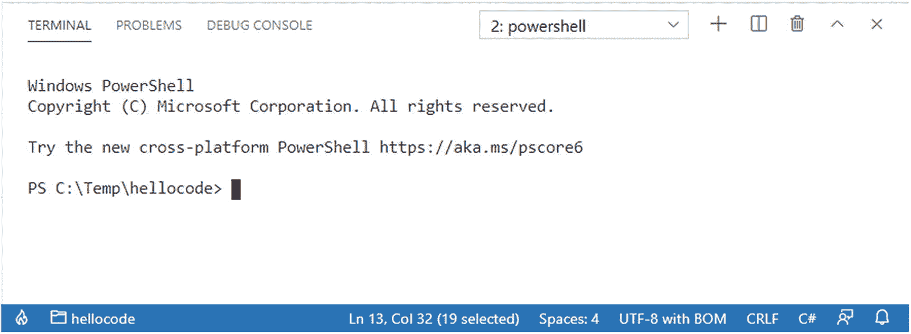

图 2-18

终端面板

在 macOS 和 Linux 上，终端工具基于每个系统的 bash shell。在 Windows 上，默认情况下，终端基于 PowerShell。但是，您可以通过单击面板工具栏上的下拉菜单，然后单击**选择默认Shell**来选择不同的工具。此时，您将能够从命令面板中选择 Windows 命令提示符、PowerShell 和 Git bash 命令行工具。您也可以通过点击**新建终端**按钮(带有 **+** 符号的图标)来打开多个终端实例。

Visual Studio Code还使用终端面板来启动针对操作系统的自动脚本和命令。例如，当您生成 C#应用时，Visual Studio Code会启动.NET Core 编译器，其输出显示在终端面板，如图 [2-19](#Fig19) 所示。

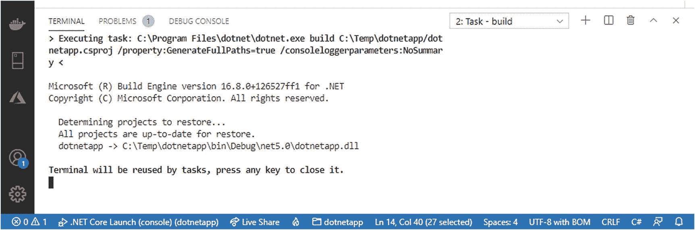

图 2-19

用于自动脚本的终端面板

## 摘要

在本章中，您了解了 Visual Studio Code中的工作区以及您将经常使用的工具。您看到了如何利用欢迎页面中的快捷方式，以及如何排列编辑器窗口。

您看到了状态栏如何提供关于活动文件的信息，以及活动栏如何是边栏中包含的工具的快捷方式的折叠容器:浏览器栏、搜索工具、Git 栏、调试栏、扩展栏、帐户按钮和设置按钮。您看到了如何在文件之间快速导航，以及命令面板如何提供通过键盘访问命令的方法，包括 Visual Studio Code命令和扩展的命令。您还浏览了环境中的另一个重要区域，Panels 区域，在这里您可以获得关于代码问题的信息，从内部和外部工具和调试器获得消息，并通过终端执行命令和脚本。

现在您已经看到了环境是如何组织的，是时候享受一下代码编辑器中所有强大的生产力特性了。这是下一章的主题。