# 七、将 Git 用于源代码控制

编写软件通常需要协作。无论您是开发团队的一员，参与开源项目，还是与客户互动的个人开发人员，都是如此。微软强烈支持协作和开源，因此 Visual Studio Code 提供了一个集成的源代码控制系统，该系统基于 Git，可以扩展到其他提供商。

本章不仅描述了 Visual Studio Code 中所有现成可用的源代码协作集成工具，还描述了如何使用在工作中非常有用的扩展来更好地审查您的代码并将您的工作推送到 Azure DevOps。请注意，源代码控制和版本控制这两个术语可以互换使用。

## Visual Studio Code 中的源代码管理

Visual Studio Code 通过可扩展性支持不同的源代码管理提供程序，但它提供了对 Git 的集成支持。Git ( [`https://git-scm.com/`](https://git-scm.com/) )是一个非常流行的分布式、跨平台的版本控制引擎，它使得小型和大型项目的协作更加容易。它受欢迎的原因之一是 Git 是开源的，因此它一直受到大型开源社区的喜爱。

Visual Studio Code 适用于任何 Git 存储库，如 GitHub 或 Azure DevOps，并提供了一种管理代码提交的集成方式。

注意这一章不是 Git 的指南；相反，它是一个学习 Visual Studio Code 如何使用它的地方，所以要了解更多信息，请访问 Git 官方页面。另外，请记住 Visual Studio Code 要求 Git 引擎安装在本地，所以请确保您的机器上有该引擎，或者从 [`https://git-scm.com/downloads`](https://git-scm.com/downloads) 下载。为了演示 Git 版本控制如何与 Visual Studio Code 一起工作，我将使用一个名为 Greeter 的小型 TypeScript 项目，它可以从微软的 TypeScript 示例库中获得( [`https://github.com/Microsoft/TypeScriptSamples`](https://github.com/Microsoft/TypeScriptSamples) )。您可以在您的系统上下载存储库，并解压缩磁盘上的 Greeter 子文件夹。显然，你可以完全自由地使用你选择的另一个例子或另一个项目，不管是什么语言，但是要理解本章中的例子，你需要 Greeter。此时，在 Visual Studio Code 中打开项目，开始协作处理源代码。

### 下载其他源代码管理提供程序

正如我前面提到的，VS 代码通过可扩展性支持额外的源代码管理器，也称为 SCM。您可以打开扩展栏并在搜索框中键入`SCM providers`来查找针对其他源代码控制引擎的第三方扩展。图 [7-1](#Fig1) 显示了一个选择扩展的例子，该扩展增加了对 Subversion 引擎的支持( [`https://subversion.apache.org`](https://subversion.apache.org) )。

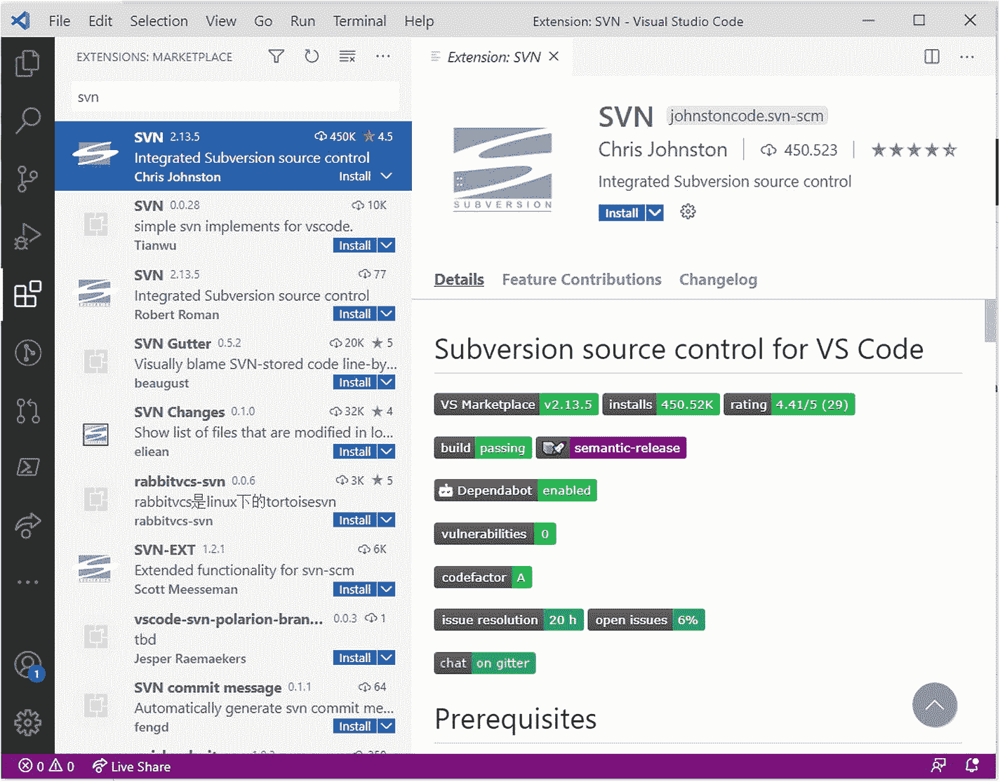

图 7-1

安装其他源代码管理提供程序

因为 VS 代码只为 Git 提供框内支持，所以本章不讨论其他源代码控制提供者。如果您希望安装 SCM 扩展，请确保参考制造商提供的文档。

## 管理存储库

使用 Git，版本控制同时支持本地存储库和远程存储库工作。本节解释了如何创建这两者，提供了在文档中找不到的信息，特别是对于远程存储库。

Note

repository 的一个非常流行的缩写是 *repo* 。虽然这个术语在本书中没有用到，但是你会经常遇到，尤其是在搜索有关开源项目的信息时。

### 初始化本地 Git 存储库

作为下面示例的起点，打开之前下载的欢迎项目。您需要做的第一件事是为当前项目创建一个本地存储库。这是通过从侧栏打开 Git 工具来完成的，如图 [7-2](#Fig2) 所示。

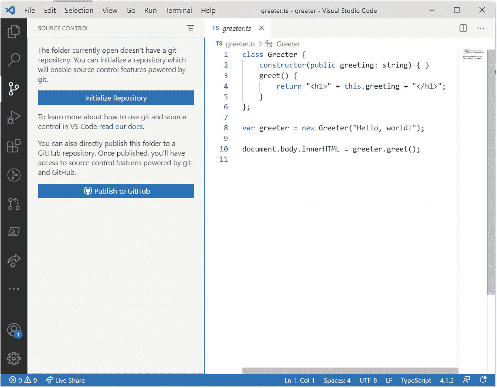

图 7-2

准备初始化本地 Git 存储库

点击 **Publish to GitHub** 按钮将允许您初始化一个本地存储库并同时发布到 GitHub，但是因为理解流程如何工作以及如何正确地将 VS 代码授权给 GitHub 是很重要的，所以这里的步骤分为首先创建一个本地存储库，然后发布到远程存储库。点击顶部的**初始化储存库**按钮(见图 [7-2](#Fig2) )。Visual Studio Code 将初始化本地存储库，并显示现在受版本控制但尚未提交的文件列表(参见图 [7-3](#Fig3) )。

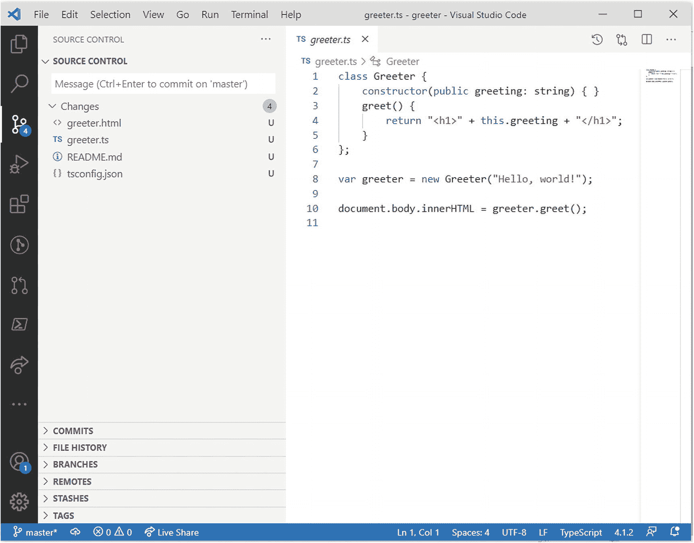

图 7-3

文件受版本控制，但尚未提交

注意 Git 图标是如何显示未决变更的数量的。这是一个重要的指示器，每当您有未决的、未提交的变更时，您总是会看到它。编写提交说明，然后按 Ctrl+Enter。您将看到一条警告消息，指出目前没有暂存文件，您将被要求直接暂存和提交所有文件。我们将在下一节讨论分期，所以现在单击 **Yes** 。此时，文件被提交到本地存储库，并且挂起的更改列表将被清除。现在有一个问题:您需要一个远程存储库，但是官方文档没有描述如何将它与 VS 代码关联起来。下一节将解释如何实现这一点。

### 创建远程存储库

Visual Studio Code 适用于任何 Git 存储库。有很多平台使用 Git 作为版本控制引擎，但可能最受欢迎的平台是 GitHub、Atlassian Bitbucket 和 Microsoft Azure DevOps。本节向您展示了如何在 GitHub 上创建远程存储库。我选择 GitHub 不仅是因为该平台的流行，还因为 Visual Studio Code 包含一个名为 GitHub 的内置扩展，该扩展旨在简化 GitHub 本身的工作流程。这需要您拥有一个现有的 GitHub 帐户，或者在 [`https://github.com/join`](https://github.com/join) 免费创建一个。Visual Studio Code 使得通过单击鼠标将存储库发布到 GitHub 变得非常容易，但是 VS 代码首先需要得到 GitHub 引擎的授权，因此有一些预备步骤只需做一次。

Note

GitHub 不再支持 Edge、Internet Explorer 等微软浏览器。虽然您可以用这两种方式打开网站，但有些操作将不可用。我推荐用 Chrome 或者 Firefox 之类的浏览器打开 GitHub。

在状态栏上，点击**发布到 GitHub** 按钮，该按钮由一个代表带箭头的云的图标标识，位于**主**分支名称的右侧。图 [7-4](#Fig4) 显示该按钮在绿框内。

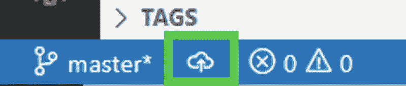

图 7-4

“发布到 GitHub”按钮

一个警告将通知您 VS 代码想要访问 GitHub，在您单击 OK 接受之后，它将打开默认浏览器，指向一个 GitHub 页面，在那里可以授权 VS 代码。点击**授权**，然后输入你的 GitHub 凭证，接受扩展所需的访问要求。接下来，GitHub 生成一个特定于 Visual Studio Code 的授权令牌，它看起来像是在我的机器上生成的，如图 [7-5](#Fig5) 所示。

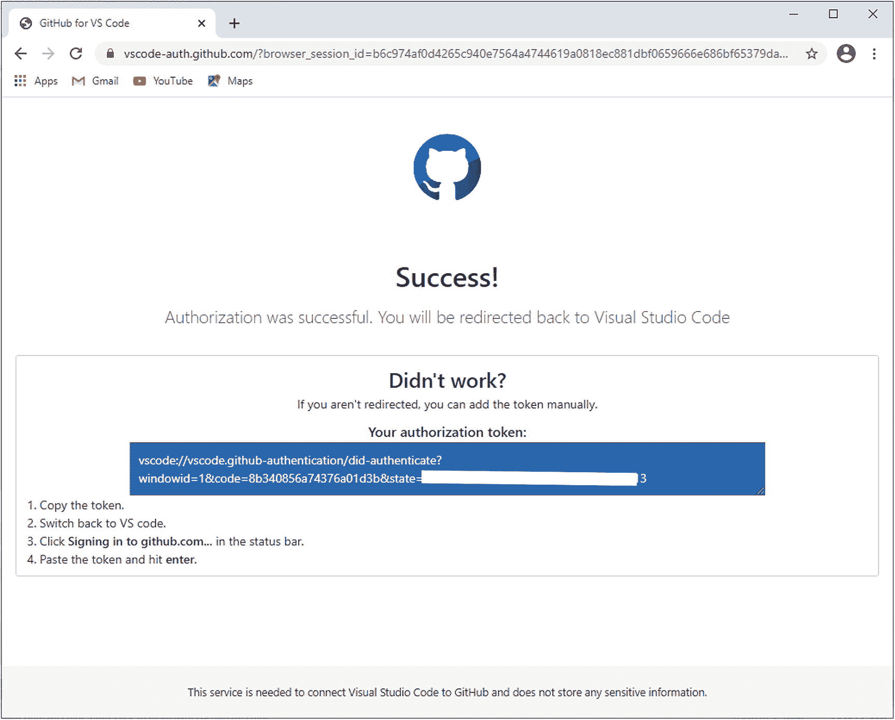

图 7-5

为 Visual Studio Code 生成的授权令牌

您的浏览器将询问您是否允许打开包含 Visual Studio Code 的 URL。允许这样做，以便 Visual Studio Code 能够自动完成身份验证过程。(这是对以前版本的改进，以前版本需要手动输入令牌。)此时，VS 代码被启用来访问 GitHub。正如我前面提到的，授权 Visual Studio Code 所需的步骤只需完成一次。请注意，您不会得到授权已完成的确认…这是一个静默的过程。

此时，您需要再次点击状态栏上的**发布到 GitHub** 按钮。VS 代码显示了一个包含存储库名称的文本框；默认情况下，这基于当前的文件夹名称，但是您可以编写不同的名称。它还提供了两个基于文件夹名称将资源库发布到 GitHub 的选项，如图 [7-6](#Fig6) 所示；一个选项是发布到私有存储库，另一个选项是发布到公共存储库。

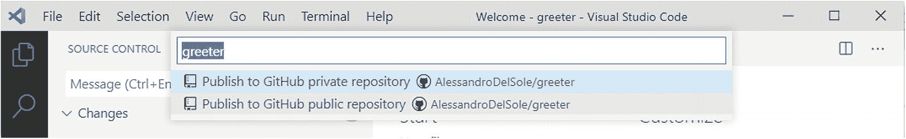

图 7-6

远程发布存储库的可用选项

对于当前示例，将使用 public 选项，但是您可以自由选择您喜欢的选项。发布完成后，您会收到一条确认消息和一个在浏览器中打开 GitHub 存储库的选项。

Note

如果您使用不同于 GitHub 的平台，您可以通过单击位于源代码控制栏右上角的 **…** 按钮，然后选择 **Remote** ➤ **Add Remote** 来轻松关联远程存储库。这在本章末尾的“使用 Azure DevOps 和 Team Foundation Server”一节中有实际解释。

## 处理文件更改

Git 在本地跟踪您的代码文件上的更改，VS 代码中的 Git 图标显示有挂起更改的文件的数量。这个数字实际上只有在您保存文件后才会更新。在 VS 代码中，处理文件更改非常简单。在图 [7-7](#Fig7) 中，你可以看到在 Git 图标中未决变更的数量是如何突出显示的，以及有变更的文件是如何用棕色 M 标记的(其中 M 代表已修改)，而删除的文件用红色 D 标记(其中 D 代表已删除)。注意，这些标记在浏览器栏中也是可见的。

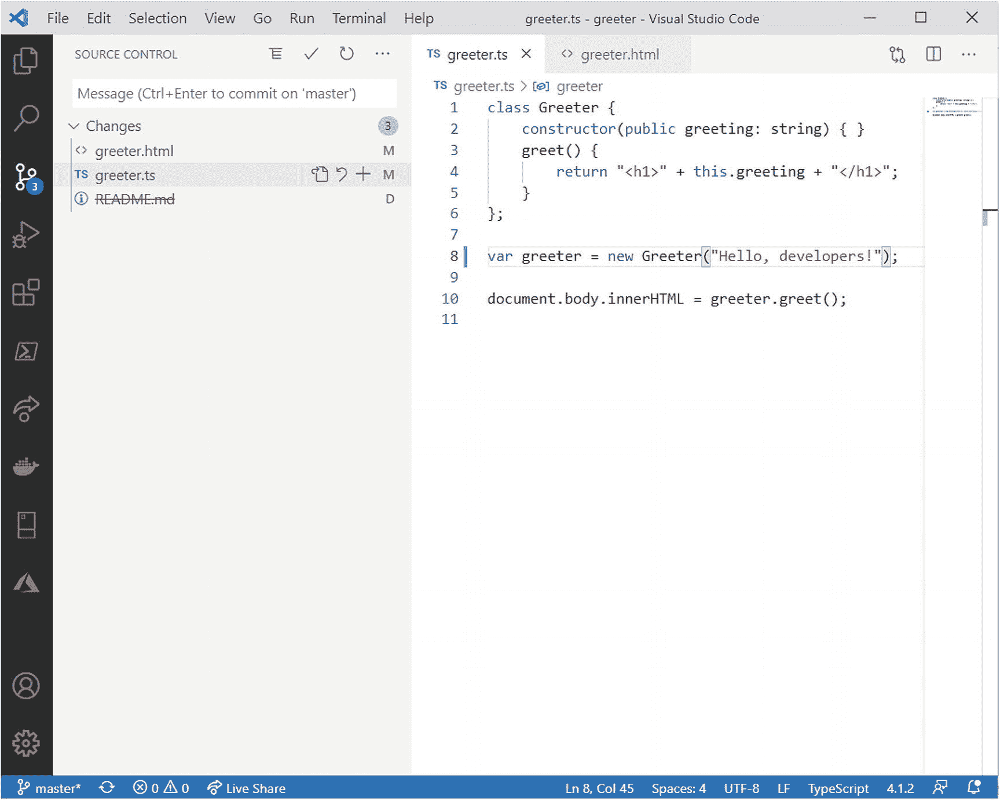

图 7-7

确定待定变更的数量

通过单击列表中的文件，您可以使用 **Diff** 工具查看文件的当前版本和以前版本之间的差异。图 [7-8](#Fig8) 给出了一个例子。

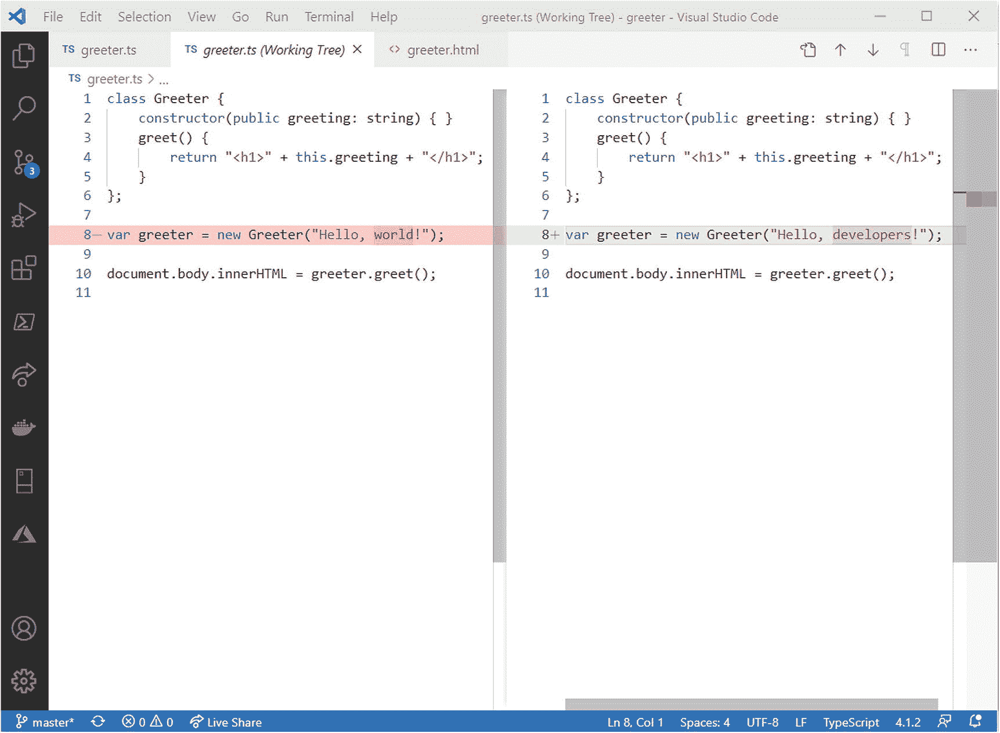

图 7-8

使用比较工具比较文件版本

左侧显示旧版本，右侧显示新版本。用红色突出显示的行代表已经删除的代码，而用绿色突出显示的行代表新代码。代码行内部的具体变化用较暗的红色和绿色表示，正如你在图 [7-8](#Fig8) 中看到的单词`world`和`developers`。当使用任何版本控制引擎时，这是一个非常重要的工具。

### 暂存更改

您可以升级文件进行转移，这意味着将它们标记为准备好下次提交。这实际上不是强制性的，因为您可以直接提交，但是拥有一个可视化的变更表示是很有用的。您只需点击文件名称附近的 **+** 符号即可升级文件，或者右键点击**变更**标题，然后选择**升级所有变更**或点击工具栏上的加号图标即可升级所有文件。Visual Studio Code 将暂存文件组织到一个逻辑容器中，如图 [7-9](#Fig9) 所示。同样，您可以通过单击**–**符号来取消暂存文件。

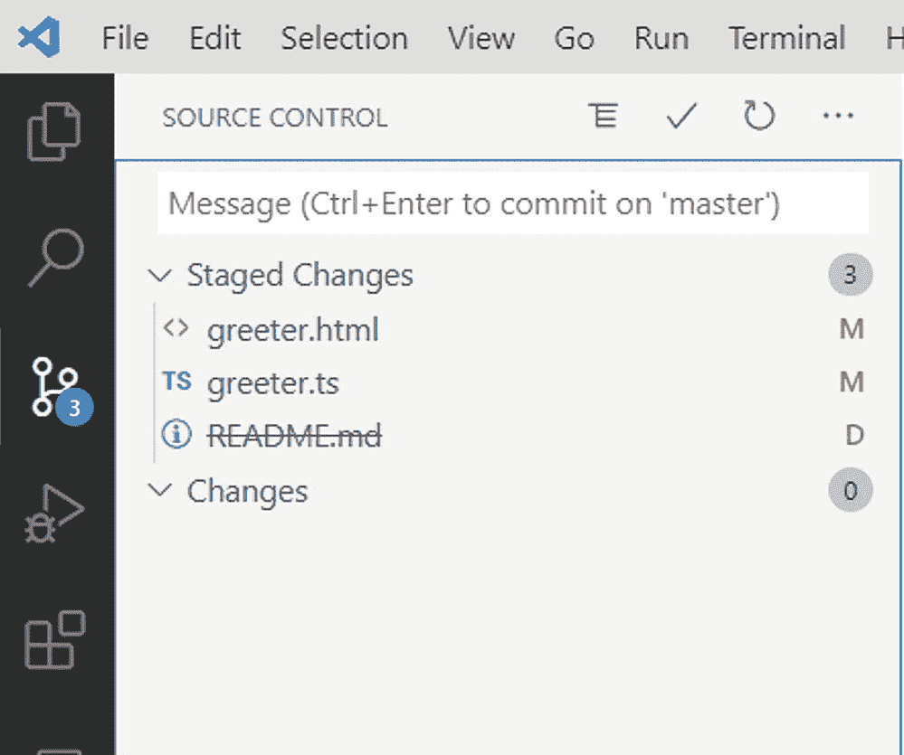

图 7-9

阶段性和非阶段性变化的观点

基于 staging 的工作流非常方便，因为如果您不再想要提交文件，您可以在代码提交到存储库之前简单地取消它。

## 管理提交

**…** 按钮提供对附加动作的访问，例如**提交**、**同步**、**拉取**、**存储、**和**拉取(重置)**。图 [7-10](#Fig10) 显示了 VS 代码中可用的内置 Git 同步命令的完整列表。注意其中一些被分组到子菜单中，例如图 [7-10](#Fig10) 中可以看到的**拉、推**。

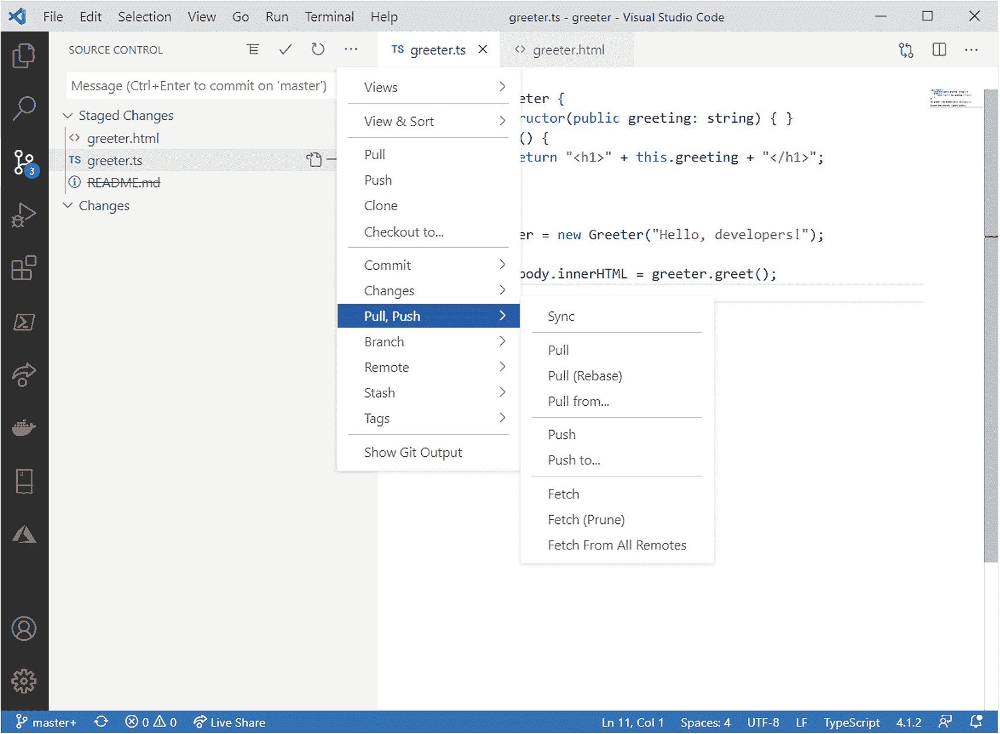

图 7-10

提交和同步更改的快捷方式

当您对源代码的工作感到满意时，您可以选择 **Commit** ➤ **Commit All** 命令来提交您的更改。请记住，此操作会将文件提交到本地存储库。此外，在提交之前，您可能希望检查暂存的和非暂存的更改，以便提交代码时不会丢失任何文件。您必须使用 **Push** 命令将变更发送到远程存储库。

您还可以选择使用**提交** ➤ **撤销上一次提交**命令来撤销上一次提交并恢复到之前的版本。**拉**和**拉(Rebase)** ，都在**拉、推**子菜单中，允许你将一个分支合并到另一个分支中； **Pull** 是非破坏性的，合并两个分支的历史，而 **Pull (Rebase)** 通过为本地分支中的每个提交创建新的提交来重写项目历史。同一个子菜单中的 **Sync** 命令首先执行 **Pull** 操作，然后执行 **Push** 操作，这样本地和远程存储库就同步了。

还有一个名为 **Stash** 的命令，它允许在缓存中存储修改的跟踪变更和阶段变更，这样您就可以在当前分支上有未完成的工作时切换到另一个分支。然后，使用**弹出最新保存**和**弹出保存**命令，在**保存**子菜单下，您可以分别重新拍摄您未完成作品的最新版本或未完成作品的特定版本。

每次使用 Git 命令，比如**提交**和**推送**，Visual Studio Code 都会将 Git 命令行的输出重定向到输出面板。图 [7-11](#Fig11) 给出了一个例子。

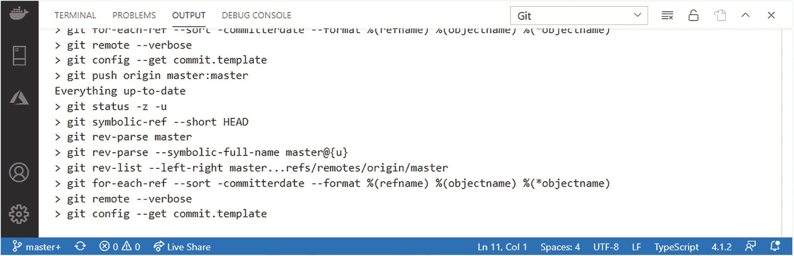

图 7-11

来自 Git 命令行的消息显示在输出面板中

您需要从输出面板的下拉菜单中选择 **Git** 来查看 Git 输出。您也可以使用图 [7-10](#Fig10) 所示的弹出菜单中的**显示 Git 输出**命令打开输出面板。

## 使用 Git 命令行界面

命令面板支持特定的 Git 命令，您可以像在命令行终端中一样键入这些命令。图 [7-12](#Fig12) 显示了可用 Git 命令的部分列表，通过在命令面板中键入`Git`来显示。命令的完整列表很长，无法完全包含在图 [7-12](#Fig12) 中，但是您可以在自己的计算机上键入`Git`并滚动列表来查看所有可用的命令。

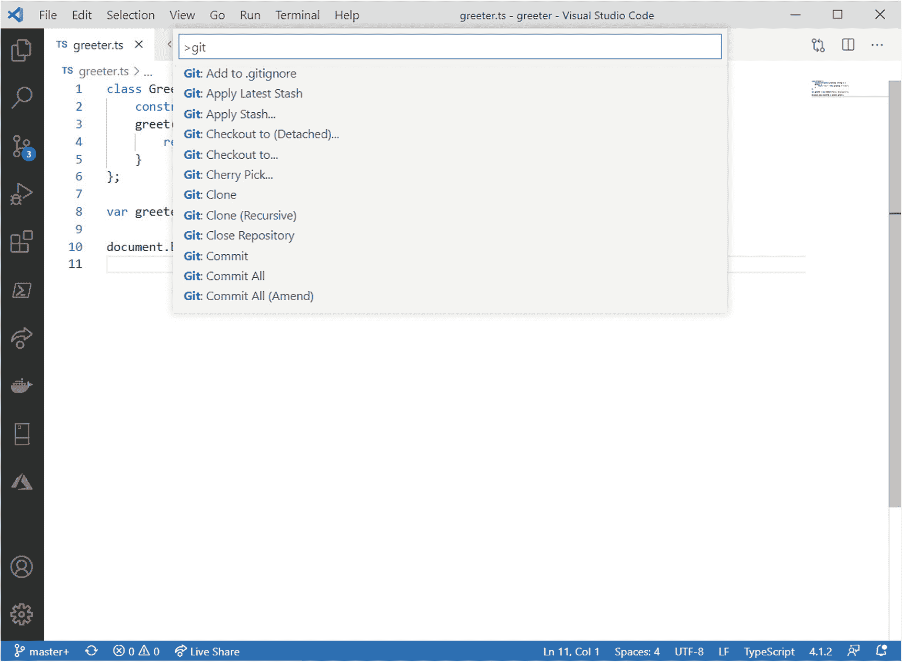

图 7-12

命令面板中支持的 Git 命令

值得一提的是，命令列表也是按最近使用的命令和所有命令分组的。

例如，您可以使用`Git Sync`来同步本地和远程存储库，或者您可以使用`Git Push`将挂起的更改发送到远程存储库。使用`Git`命令的一个常见场景是分支。

## 创建和管理分支

为了更好地理解什么是分支，假设您有一个项目，在它生命周期的某一点，进入生产阶段。您需要继续开发您的项目，但是您不希望在您已经编写的代码上进行开发。

您可以使用分支创建两个历史。当您创建一个存储库时，您还会得到一个名为 **master** 的默认分支。

Note

GitHub 最近有变化，所以如果你先直接在这个平台上创建一个远程资源库，主分支就不再叫 **master** ，而是叫 **main** 。这个变化是特定于 GitHub 的，所以如果你在本地或者其他平台上创建一个 Git 仓库，你仍然可以得到**主**分支。

继续这个例子，**主**分支可以包含已经投入生产的代码，现在你可以创建一个新的分支，比如**开发**，基于主分支但又不同于主分支。在 Visual Studio Code 中，您有不同的选项来创建新的分支:第一个选项是通过键入`Git branch`，选择 **Git: Create Branch** 选项，并指定新的分支名称，如 **development** ，从命令面板创建分支。这在本地创建了一个新的分支，基于**主**。第二个选项是点击状态栏中的当前分支名称(本例中为**主**，然后点击**创建新分支**命令(见图 [7-13](#Fig13) )。输入新的分支名称，然后按 Enter。

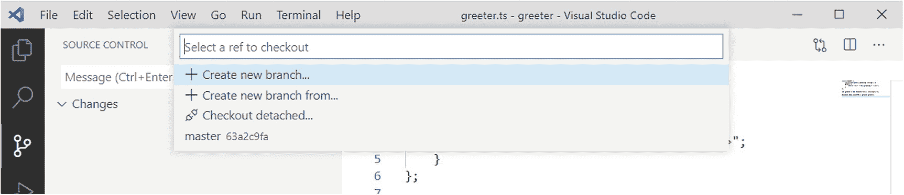

图 7-13

创建分支

此外，您可以使用 **Create new branch from** 命令从非活动分支创建一个新分支。创建新分支时，状态栏会将其显示为活动分支；当你准备好了，你可以通过**发布变更**按钮将新的分支发布到远程存储库，由云图标表示(见图 [7-14](#Fig14) )。

图 7-14

新分支被设置为活动的，可以发布了

### 切换到不同的分支

切换到不同的分支非常容易。只需点击状态栏中活动分支的名称，VS Code 就会显示分支列表，如图 [7-15](#Fig15) 所示。如果存储库已经有一个远程分支，它也将在列表中可见。

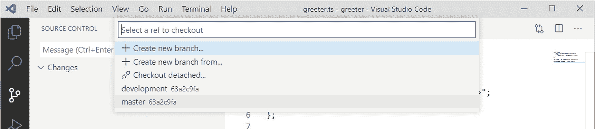

图 7-15

选择不同的分支

单击所需的分支，VS Code 将其检出并设置为活动分支。

### 从分支合并

假设您已经完成并测试了开发分支的一些工作，并且您想要将这些工作发布到生产中。因为生产代码在主分支上，所以您必须将所有工作从开发分支带到主分支。这是一个合并操作(通常通过 pull 请求发生，这将在本章后面描述)。您可以使用 **Git: Merge Branch** 命令，通过命令面板将一个分支合并到另一个分支中。VS 代码显示分支列表，您需要选择想要合并到当前分支的分支(参见图 [7-16](#Fig16) )。

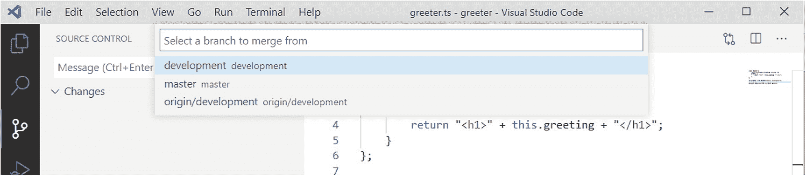

图 7-16

从分支合并

Note

请记住，接收合并的分支是活动分支，所以在开始合并操作之前，请确保您已经切换到正确的分支。

在这个例子中，进行了一些变更并将其推送到开发分支，然后选择主分支作为活动分支，来自开发的变更将被合并到主分支中。

一旦合并操作完成，记得将您的更改推送到远程存储库。

#### 解决合并冲突

当您合并修改了相同代码文件的分支时，Visual Studio Code 利用 Git 工具将不同的编辑合并到目标文件中的一个代码中。然而，有时 VS 代码不能自动合并编辑，在这种情况下，它会引发一个*合并冲突*。如果发生这种情况，VS Code 会显示一个编辑器，其中会突出显示存在冲突的代码，用不同的颜色显示当前版本和即将到来的版本，如图 [7-17](#Fig17) 所示，该图显示了一个由于不同分支中同一行代码的编辑而导致冲突的示例。

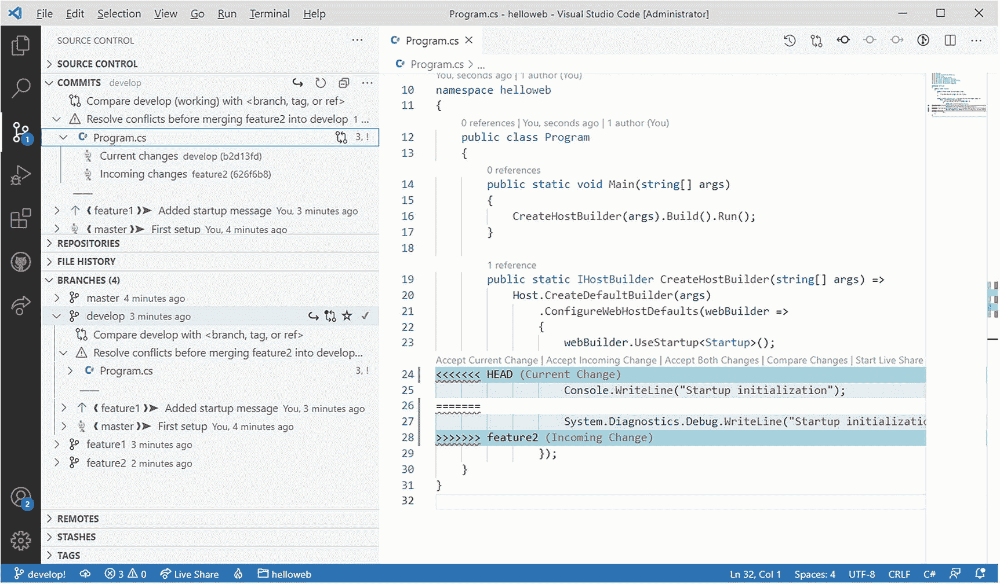

图 7-17

解决合并冲突

冲突也可以在侧边栏的“提交”面板中看到，并且必须在合并完成之前解决。如图 [7-17](#Fig17) 所示，代码编辑器提供了内联快捷方式来快速解决冲突:

*   *接受当前变更*:保留现有代码，拒绝引入的变更。

*   *接受引入的变更*:用引入的编辑覆盖现有的代码。

*   *接受两个变更*:保留现有的和输入的代码。传入代码被追加到现有代码中。

*   *比较变更*:在有几个冲突的情况下，允许决定应该合并现有代码还是引入的代码。

*   *启动实时共享*:只有安装了实时共享扩展才可用，允许启动实时共享会话，向其他开发者寻求帮助。

什么是正确的选择只取决于你的喜好。Visual Studio Code 为您提供了一种集成的、用户友好的方式来快速解决合并冲突，而无需处理复杂的 Git 命令。

### 关于重置分支的提示

在 Visual Studio Code 中 Git 的可用命令中，您会发现一个名为 Rebase 的命令。在 Git 中，重定基础仍然允许您将一个分支所做的更改包含在另一个分支中，但是重定基础和合并以不同的方式完成这项任务。

更具体地说，重定基础不会在分支之间产生重叠，而是将代码更改附加到目标分支的末尾，这意味着代码的历史更容易理解，即使需要频繁地将一个分支的提交合并到另一个分支中。

因此，重定基础提供了访问更线性历史的可能性，因为与合并不同，它允许您不将不必要的提交合并到目标分支中。

但是，应该小心使用重定基数。例如，如果另一个团队成员在同一个分支上工作，最好避免重定基础，因为这可能导致分支的重复，而不是合并变更。

### 删除分支

有时，您可能会创建一些分支，这些分支只是为了测试一些代码，在应用生命周期管理中并不真正需要。在这种情况下，在命令面板中，可以使用 **Git: Delete Branch** 命令。

使用如图 [7-16](#Fig16) 所示的用户界面，VS 代码显示分支列表。选择要删除的分支，然后按 Enter 键。请记住，不能删除活动分支，您首先需要切换到不同的分支。另外，请记住，只有创建了远程分支，才能删除它们。

## 用扩展增强 Git 工具的功能

Git 的集成工具涵盖了作为开发人员在使用本地和远程存储库管理源代码时可能会遇到的所有需求，但是还有一些扩展为集成工具提供了额外的功能。

本节描述最有用的免费扩展，它们将改善您在 Visual Studio Code 中的协作体验。

### Git 历史

Git History 是一个免费的扩展，可以让你查看源代码的历史，比如每次提交的信息和作者，还可以显示文件是如何通过分支的；此外，它还添加了一些命令，使得针对 Git 管理代码变得更加容易。安装完扩展后，可以在浏览器栏的文件夹视图中右键单击一个文件，然后选择 **Git: View File History** 。

图 [7-18](#Fig18) 显示了一个基于有三次提交的文件的例子。如果可用的话，该视图显示包含文件的分支、提交的注释和作者以及提交 ID，并且它允许按分支和作者搜索和过滤内容。本地分支以绿色突出显示，远程分支以红色突出显示。

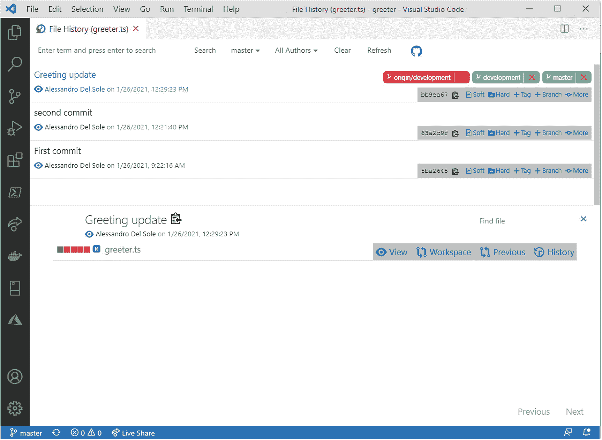

图 7-18

使用 Git 历史查看提交的历史

Note

如果提交作者将一张图片与 Git 凭证相关联，Git 历史记录会在作者姓名附近显示该图片。

如果点击每个提交右侧的**更多**快捷方式，会出现一个菜单，显示一些非常有用的命令，使处理提交更加容易(见图 [7-19](#Fig19) )。

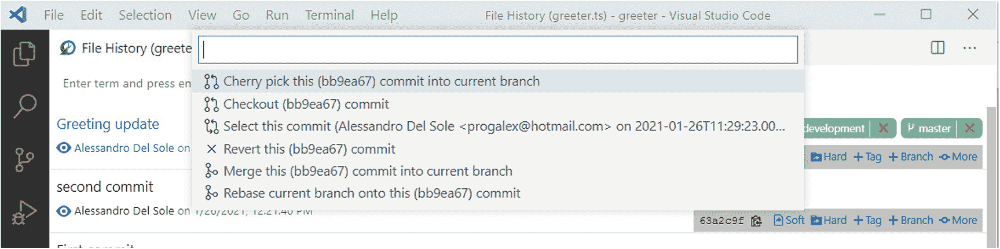

图 7-19

Git History 提供的命令使得处理提交变得更加容易

在视图的底部，您将看到所选提交中涉及的文件列表。如果您单击一个文件名，您还可以获得快捷方式，将该文件与以前的版本进行比较，并查看该文件的历史记录。Git History 是一个非常有用的扩展，尤其是当您的团队使用敏捷方法时，因为对于 backlog 中的每个任务，都会创建一个新的分支，然后在 sprint 结束时合并到一个分支中，这使得遍历工作的历史更加容易。

### 走吧

另一个非常有用的扩展是 GitLens，它可以提高你的工作效率。在第一次使用时，GitLens 要求您获得 GitHub 的授权，因此 VS Code 会邀请您按照创建第一个远程存储库时的步骤进行操作。GitLens 为 VS 代码添加了许多与 Git 相关的特性和命令。例如，GitLens 用一些有用的 Git 组扩展了源代码控制栏(见图 [7-20](#Fig20) )。

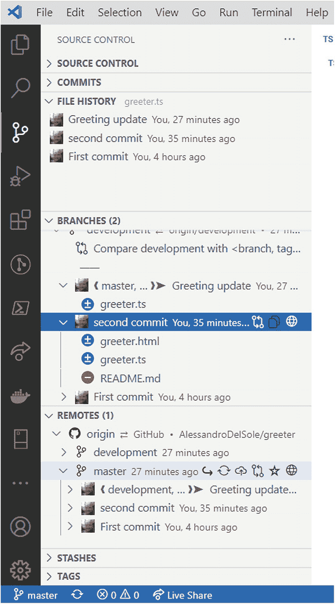

图 7-20

gittens 扩展的源码控制栏

GitLens 扩展为源代码控制栏增加了几个区域。**分支**和**远程**区域分别显示本地和远程分支的列表，对于每个分支，GitLens 显示提交列表。可以展开每个提交以查看提交消息、提交中涉及的文件列表以及表示对文件所做操作的图标。**隐藏**区域显示具有相似结构的隐藏变更(如果有的话)。**文件历史**区域显示了一个文件的提交列表(这需要一个打开的编辑器)。对于每次提交，您可以看到名称、作者和上次编辑的时间。

VS 代码中的状态栏现在通过 GitLens 提供了一个包含当前提交的作者姓名和上次编辑时间的字段。如果点击这个信息，VS 代码会显示一个命令列表，如图 [7-21](#Fig21) 所示。

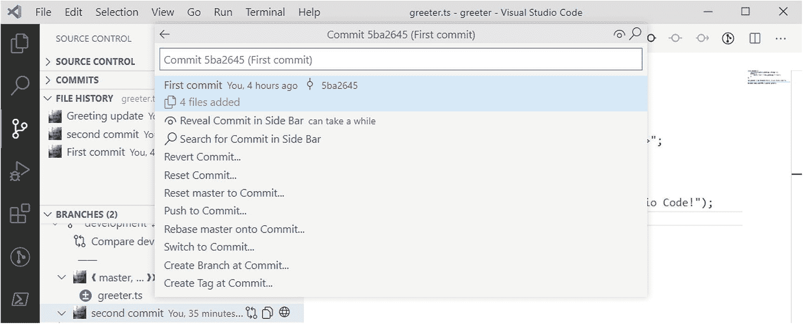

图 7-21

gittens 命令

这些命令不仅允许您打开远程存储库中的提交，还允许您打开提交修订。此外，您可以将提交 ID 或消息复制到剪贴板。您也可以展开下面的文件名，查看当前代码提交的各个详细信息。

GitLens 还在代码片段本身的上方添加了关于对特定代码片段所做编辑的摘要信息。图 [7-22](#Fig22) 显示了一个例子，GitLens 突出显示了作者在 4 小时前对`Greeter`类进行了代码更改。

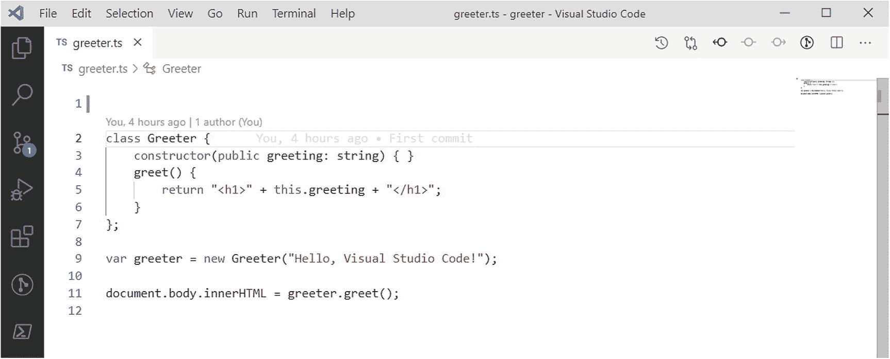

图 7-22

GitLens 添加了关于代码片段的摘要信息。

Note

如果您将光标悬停在 GitLens 上，您将在一个交互式弹出框中看到一些信息，如作者、代码差异和提交号。

如果你点击分隔线的左侧，你会看到如图 [7-21](#Fig21) 所示的菜单。如果你点击作者的名字，VS 代码会显示一个弹出框，其中包含所选作者提交的列表，如果你将鼠标悬停在提交名称上，你会看到完整的提交细节(参见图 [7-23](#Fig23) )。

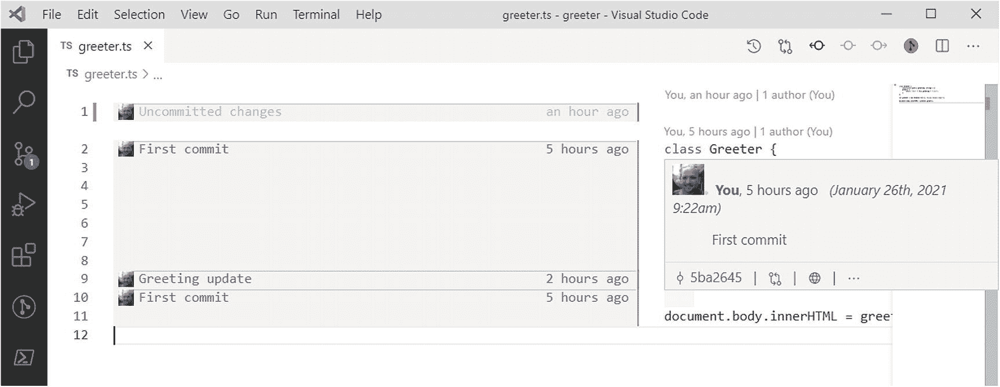

图 7-23

显示提交信息的 gittens

右键单击代码编辑器时，可以在上下文菜单中使用其他命令，例如**将提交 ID 复制到剪贴板**、**将消息复制到剪贴板**，以及**将远程文件 URL 复制到剪贴板**，所有这些命令都是不言自明的。

Note

上述所有命令也可通过代码编辑器栏右上角的快捷方式获得(参见图 [7-23](#Fig23) )。

### GitHub 拉请求和问题

Git 中的 Pull 请求使执行代码审查变得更加容易，而 issues 使您能够跟踪来自其他开发人员的反馈。对于拉请求，您的代码不会自动合并到一个分支中，直到团队中的其他人审查并接受它。如果您将 GitHub 用于您的存储库，名为**GitHub Pull Requests and Issues**的扩展可用于在 Visual Studio Code 中引入对 Pull 请求的支持。当您第一次安装扩展(并重新加载环境)时，会要求您登录 GitHub。为此，您可以点击侧边栏中的**设置**，然后点击**登录以使用 GitHub 拉请求和发布**，或者点击 GitHub 栏中的**登录**按钮。只需按照与授权 GitLens 相同的步骤操作即可。

在您提供您的 GITHUB 凭证并打开一个与 GitHub 上的远程存储库相关联的文件夹后，您将能够利用 GitHub 栏，您可以通过单击侧栏上的 GitHub 图标来启用它。GITHUB 视图的示例如图 [7-24](#Fig24) 所示。

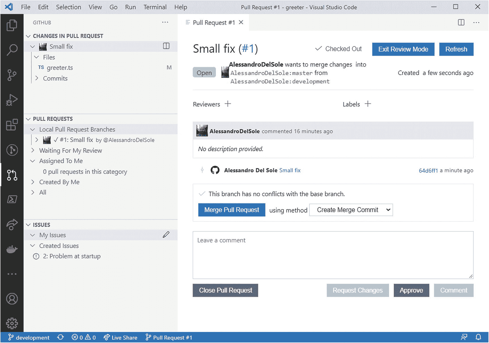

图 7-24

GitHub 拉请求视图

该扩展支持查看和提交 pull 请求，而不考虑它们的来源，可以是 VS Code、GitHub 或连接到同一个存储库的另一个开发环境。当“拉”请求可用时，您会看到它们在视图中列出。如果您选择一个拉动请求，一个新的编辑器窗口将出现，显示所有拉动请求的详细信息，您可以选择添加注释，然后关闭、拒绝或批准拉动请求(参见图 [7-24](#Fig24) )。

您还可以通过单击 **Checkout** 按钮在本地处理拉请求，该按钮显示在树形视图中的本地拉请求分支节点下。

您可以通过使用 **+** 按钮在 Visual Studio Code 中创建问题，之后您可以编辑并保存它们，以便它们与远程存储库相关联。查看问题发生在浏览器内部，因此当您单击问题右侧的地球图标时，默认的 web 浏览器会打开该问题的 GitHub 页面。

这是一个非常有用的扩展，特别是如果你在敏捷团队中工作，但是记住它只支持 GitHub 作为主机。

## 使用 Azure DevOps 和 Team Foundation Server

Azure DevOps ( [`https://dev.azure.com`](https://dev.azure.com) )和 Team Foundation Server 是微软管理整个应用生命周期的完整解决方案，从开发到测试，再到持续集成和交付。Azure DevOps 是一种云服务，而 Team Foundation Server 在内部工作。在众多特性中，它们都提供了基于两个引擎的源代码控制功能:Git 和 Microsoft Team Foundation Server 引擎。

在这一节中，我将解释如何配置一个 Git 存储库，您可以将它用于 Visual Studio Code 的源代码控制，好消息是您不需要任何扩展。我将使用 Azure DevOps，这样您就不需要在本地安装 Team Foundation Server。此外，我将重用前面几节中描述的 Greeter 项目。如果您也想这样做，只需删除本地。git 文件夹位于项目文件夹下。

你显然需要一个 Azure DevOps 上的账号，你可以使用微软账号来创建。如果没有，您可以在 [`www.outlook.com`](http://www.outlook.com) 获得一个微软帐户，然后在 [`https://aka.ms/SignupAzureDevOps`](https://aka.ms/SignupAzureDevOps) 获得一个 Azure DevOps 帐户。首次配置您的帐户时，请遵循所有必要的说明。

### 创建团队项目

在主页上，点击**新建项目**按钮。如图 [7-25](#Fig25) 所示，您需要提供团队项目名称、源代码控制引擎和工作项流程。

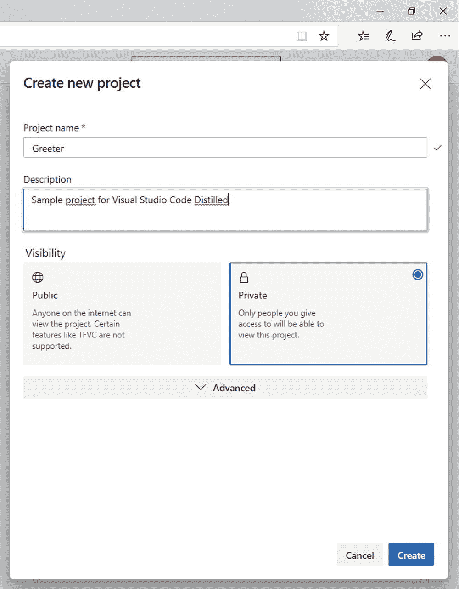

图 7-25

在 Azure DevOps 中创建团队项目

输入项目名称，点击**创建**。几秒钟后，您的新团队项目就准备好了。此时，Azure DevOps 站点显示了一个页面，其中包含您的新团队项目的所有信息。现在点击屏幕左侧的 **Repos** ，这样你就可以看到新 Git 仓库的所有信息(见图 [7-26](#Fig26) )。请注意，新存储库是以与新项目相同的名称创建的。将存储库 URL 复制到剪贴板，因为很快就会用到它。

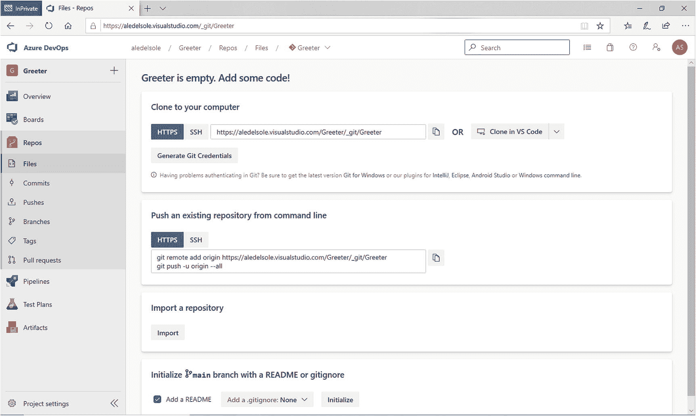

图 7-26

关于 Azure DevOps 上 Git 存储库的信息

既然已经设置了远程存储库，那么您有几个选项可以将它与 Visual Studio Code 关联起来。您可以将存储库克隆到本地机器上，或者甚至可以使用 Git CLI。然而，最简单也是最有效的选择是使用你在本章第一部分看到的 VS 代码工具，如下所述。

### 将 Visual Studio Code 连接到远程储存库

回到 Visual Studio Code。首先要做的是初始化一个本地 Git 存储库(参见本章前面的“初始化一个本地 Git 存储库”一节作为复习)。一旦建立了本地存储库，就可以毫不费力地将其连接到远程 Azure DevOps 存储库。

在源控制栏中，点击 **…** 按钮，然后点击**远程** ➤ **添加远程**。您首先需要指定远程存储库的名称(这是您在 Azure 中指定的名称)，然后您可以选择输入您创建的远程存储库的 URL，因此粘贴 URL 并按 enter 键(参见图 [7-27](#Fig27) )。

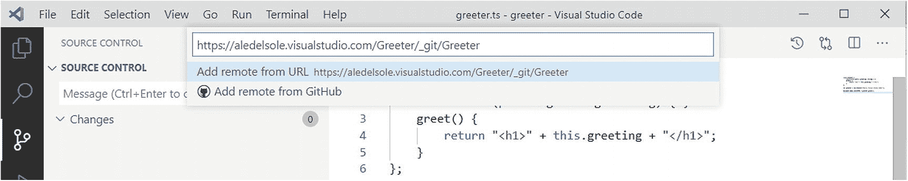

图 7-27

指定 Azure DevOps 远程存储库

还会要求您提供一个名称，用作项目标识符。输入您选择的名称，不带空格，然后按 Enter 键。此时，Visual Studio Code 将本地存储库链接到远程存储库，但是请注意，您不会收到任何操作完成的确认消息，只会在状态栏上显示指示符。

最后一步是将分支推送到远程存储库，使用本章第一部分描述的任何选项；然而，你需要关心主分支。如前所述，由于 Azure DevOps 中最近的变化反映了 GitHub 的功能，当您在 Azure DevOps 上创建一个存储库时，主分支现在被命名为`main`而不是`master`。问题是 VS 代码仍然创建了一个`master`分支。所以基本上你需要从 VS 代码中推出`master`分支，然后创建一个拉请求将`master`合并到`main`中，这样你就可以使用新的分支了。

Note

如果您将现有代码连接到远程存储库，所有这些步骤都是必要的。如果您从为一个新项目创建一个远程存储库开始，您可以在 VS 代码中克隆这个存储库，这样您就可以直接从主分支开始。

一旦变更被推送，它们在 Azure DevOps 项目的 Repos 视图中是可见的(参见图 [7-28](#Fig28) )。

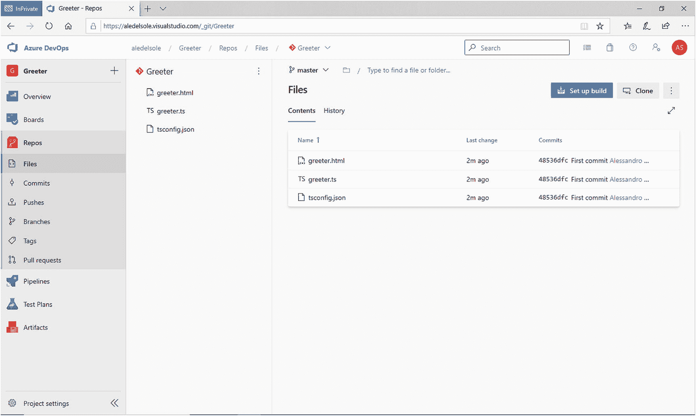

图 7-28

源代码已经推送到 Azure DevOps

既然您的代码已经被远程推送，其他开发人员将能够在项目上进行协作。关键是在本地 Git 存储库和远程 Azure DevOps 存储库之间建立连接有多容易，所有这些都是在 Visual Studio Code 中完成的。

## 摘要

编写软件涉及到协作，无论你是开发团队的一员，参与开源项目，还是与客户有互动的个人开发者。在本章中，您已经探索了 Visual Studio Code 如何提供集成的工具来与 Git 一起工作，Git 是流行的开放源代码和跨平台源代码控制提供程序。

您已经看到了如何使用 Git bar 创建本地存储库，以及如何使用来自集成终端的几个命令将它与远程存储库相关联。您还看到了如何处理文件更改，包括提交，以及如何从环境中直接创建和管理分支。此外，还向您介绍了一些有用的扩展，如 Git History、Git Lens 和 GitHub Pull Requests and Issues，它们将通过添加每个开发人员在团队协作时都需要的重要功能来提高您的工作效率。最后，您了解了将本地存储库链接到 Azure DevOps 上托管的远程 Git 存储库是多么容易，Azure devo PS 是微软管理整个应用生命周期的首要云解决方案。在幕后，Visual Studio Code 调用 Git 命令来对您的源代码执行操作，并且它被预先配置为与这个外部工具一起工作。

然而，Visual Studio Code 并不局限于使用一小组预定义的工具；相反，它可以被配置为基本上与任何外部程序一起工作。这是你将在下一章学到的东西。