# 8.自动化任务

如前一章所述，Visual Studio 代码不仅仅是一个简单的代码编辑器，因为它使您能够通过运行外部工具来执行诸如编译和测试代码之类的操作。在这一章中，你将学习 VS 代码如何通过任务执行外部程序，包括现有的任务和定制的任务。要运行本章中提供的示例，您需要以下软件:

*   Node.js，一个基于 Chrome 的 JavaScript 引擎的免费开源 JavaScript 运行时，你可以从 [`https://nodejs.org`](https://nodejs.org) 下载

*   TypeScript 编译器(tsc ),通过 Node.js 命令行使用以下命令安装:

```sh
> npm install -g typescript

```

使用 Node.js 和 TypeScript 有助于避免对操作系统和专有开发环境的依赖。显然，本章讨论的所有主题也适用于其他语言和平台。对于本章最后一个关于 Windows 上 MSBuild 任务的例子，你反而需要微软 Visual Studio 2019。社区版在 [`https://visualstudio.microsoft.com`](https://visualstudio.microsoft.com) 免费提供。

## 了解任务

从本质上讲，Visual Studio 代码是一个以代码为中心的工具，因此它通常需要执行外部程序来完成应用生命周期中的一些操作，如编译、调试和测试。

在 Visual Studio 代码术语中，在应用生命周期的流程中与外部程序集成是一项*任务*。运行任务不仅意味着执行外部程序，还意味着获得外部程序的输出，并以最方便的方式在用户界面(如集成终端)内显示。

Note

任务仅适用于文件夹，不适用于单个代码文件。

任务基本上是一组用 JSON 符号表示的指令和属性，存储在一个名为 tasks.json 的特殊文件中。如果 VS 代码能够检测文件夹中的项目或源代码的类型，tasks.json 文件并不总是必需的，VS 代码会为您完成所有工作。如果 VS 代码无法检测到项目或源代码的类型，或者如果您对任务的默认设置不满意，在当前文件夹下，它会生成一个名为。vscode，并在该文件夹中生成 tasks.json 文件。如果 VS 代码能够检测文件夹中的项目或源代码的类型，它还会用适当的信息预先填充 tasks.json 内容；否则，您需要手动配置 tasks.json。为了更好地理解，我将解释 VS 代码可以检测到的任务以及它为您配置的任务，然后我将讨论如何手动创建和配置任务。

### 任务类型

对于源代码文件夹，可以使用的任务类型没有限制，但最常见的有以下几种:

*   *构建任务*:构建任务被配置为将源代码、资产、元数据和资源编译成二进制或可执行文件，例如库或程序。

*   *测试任务*:测试任务被配置为在源代码中运行单元测试。

*   *观察任务*:观察任务在所谓的观察模式下启动编译器。在这种模式下，编译器总是在最近一次编译后监视对任何未解析文件的更改，并在每次保存时重新编译它们。

Visual Studio 代码提供了执行生成任务的内置快捷方式。当添加新任务时，VS 代码会自我更新，为新任务提供快捷方式。此外，您可以区分相同类型的任务。例如，您可以有一个默认的生成任务和其他只能在特定情况下执行的自定义生成任务。

### 运行和管理任务

在实践中理解任务的第一种方法是运行现有的预配置任务。为了简单起见，启动 Visual Studio 代码并打开名为 **simple** 的项目文件夹，该文件夹来自您之前从 GitHub ( [`https://github.com/Microsoft/TypeScriptSamples`](https://github.com/Microsoft/TypeScriptSamples) )上的 TypeScript 示例库中下载的示例集合。

Visual Studio 代码将其检测为 TypeScript 项目，因此它预配置了一些任务(在下一节中，我将提供有关任务自动检测的更多细节)。现在打开**终端**菜单。如图 [8-1](#Fig1) 所示，有几个与任务相关的命令。

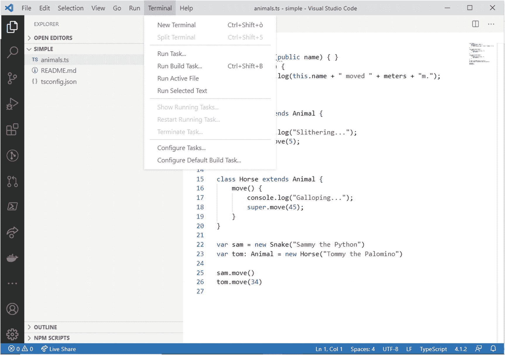

图 8-1

在终端菜单中运行和管理任务的命令

表 [8-1](#Tab1) 中提供了每个命令的解释。

表 8-1

用于任务执行和管理的命令

<colgroup><col class="tcol1 align-left"> <col class="tcol2 align-left"></colgroup> 
| 

命令

 | 

描述

 |
| --- | --- |
| 运行任务 | 在命令选项板中显示可用任务列表，并运行选定的任务 |
| 运行生成任务 | 运行默认的、预配置的构建任务(如果有) |
| 终止任务 | 强制停止任务 |
| 重新开始运行任务 | 重新启动当前运行的任务 |
| 显示正在运行的任务 | 在终端面板中显示当前运行任务的输出 |
| 配置任务 | 显示命令选项板中可用任务的列表，并允许在 tasks.json 文件编辑器中编辑选定的任务 |
| 配置默认构建任务 | 显示命令选项板中可用任务的列表，并允许选择任务用作构建任务 |

如果选择**运行任务**，VS Code 打开命令面板，显示可用任务类别列表，如图 [8-2](#Fig2) 所示。

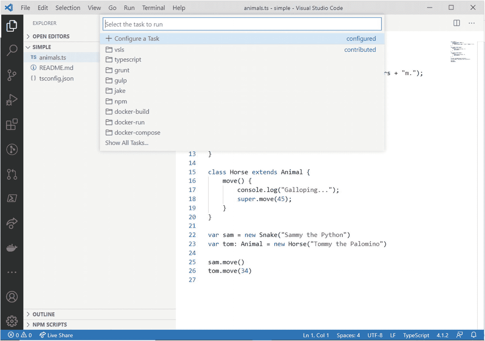

图 8-2

从命令选项板中选择任务类别

在这里，您可以按类别选择一组可用的任务。在这种情况下，你需要选择**类型脚本**类别。此时，命令面板显示该类别的可用任务列表，如图 [8-3](#Fig3) 所示。

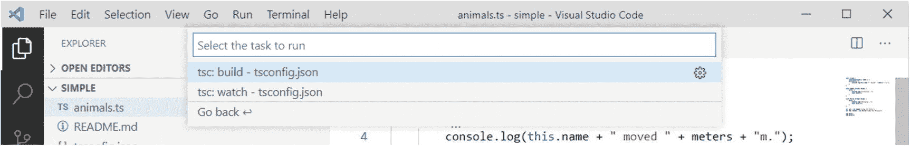

图 8-3

从命令选项板运行任务

可以看到，有两个任务， **tsc: build** 和 **tsc: watch** ，都指向 tsconfig.json 项目文件。这意味着这两个任务都将针对指定的文件运行。 **tsc** 是命令行类型脚本编译器的名称，而 **build** 和 **watch** 是两个预配置的任务，前面已经提供了它们的描述。如果选择 **tsc build** ，Visual Studio Code 启动 tsc 编译器，将 TypeScript 代码编译成 JavaScript 代码，如图 [8-4](#Fig4) 所示。

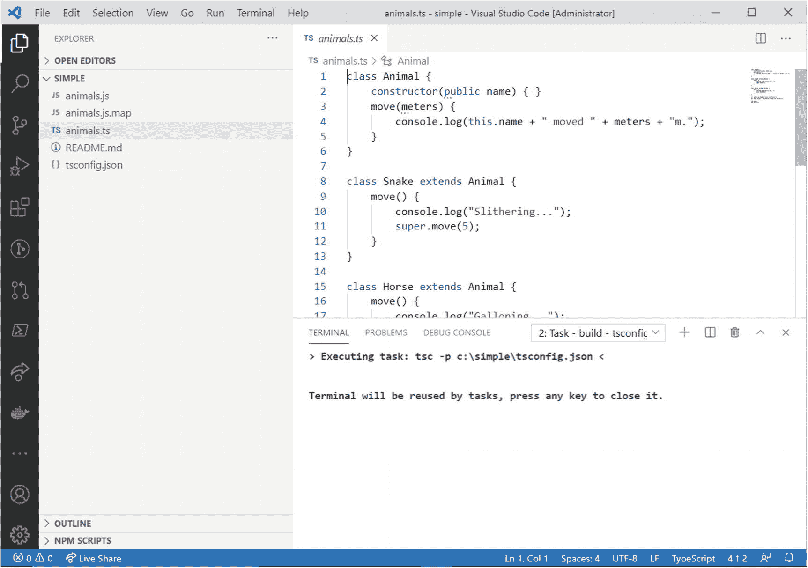

图 8-4

执行构建任务

Note

对于 TypeScript，构建任务将 TypeScript 代码编译成 JavaScript 代码。对于其他语言，构建任务从源代码生成二进制文件。更一般地说，构建任务根据语言从编译过程中产生预期的输出。此外，可用任务的列表会根据您正在处理的项目或文件夹的类型而有所不同。比如，对于。NET 核心项目，只有一个名为 **build** 的任务可用。

终端面板显示任务执行的进度和结果。在这种情况下，任务的结果也通过生成一个. js 文件和一个. js.map 文件来表示，现在可以在浏览器栏中看到。

Note

如果终端显示一条错误消息，说明由于系统上禁用了运行脚本，无法加载. ps1 文件，请尝试首先以管理员身份重新启动 VS 代码，然后重复这些步骤。如果这不能解决问题，您需要在您的计算机上启用脚本执行。如果您是计算机管理员，您可以自己完成此操作；否则，您需要询问网络管理员。您可以在 [`https:/go.microsoft.com/fwlink/?LinkID=135170`](https://go.microsoft.com/fwlink/%253FLinkID%253D135170) 找到更多关于如何根据您的环境启用脚本执行以及如何启用特定权限的详细信息。

您可以分别使用**终止任务**和**重启运行任务**命令停止和重启任务，两者都在表 [8-1](#Tab1) 中描述。现在，假设有一个严重错误阻止构建任务成功完成。出于演示目的，从 simple.ts 文件的代码中删除一个右括号，然后再次运行构建任务。此时，Visual Studio 代码将在终端面板中显示来自 tsc 工具的详细日志，如图 [8-5](#Fig5) 所示，描述错误和导致错误的代码行。


图 8-5

Visual Studio 代码以方便的方式显示了外部工具的输出

在现实世界中，这种错误可能不会发生，因为您在代码编辑器中有问题面板和红色曲线来突出显示错误。但这实际上是 Visual Studio 代码如何与外部工具集成并在终端面板中直接显示其输出的示例，有助于用尽可能详细的信息解决问题。

### 默认的生成任务

因为构建源代码是最常用的任务，所以 Visual Studio Code 在终端菜单中提供了运行这个任务的内置快捷方式，称为**运行构建任务**(windows 上的 Ctrl+Shift+B，macOS 上的⇧+⌘+B)。然而，您首先需要设置一个默认的构建任务，因为否则**运行构建任务**命令将像**运行任务**命令一样。

为此，选择**终端** ➤ **配置默认构建任务**。当命令面板出现时，选择您想要设置为默认构建任务的任务，在本例中选择 **tsc 构建**。当您这样做时，Visual Studio 代码实际上正在更改其默认配置，因此会在。vscode 文件夹，然后在新的编辑器窗口中打开该文件。tasks.json 的内容和结构将在接下来的“配置任务”一节中讨论，所以现在让我们把重点放在新的默认构建任务上。选择**终端** ➤ **运行构建任务**，或者使用键盘快捷键，你会看到默认的构建任务将如何执行，而不需要每次都从命令面板中指定。

### 自动检测的任务

Visual Studio 代码可以自动检测以下环境的任务:Grunt、Gulp、Jake 和 Node.js。自动检测任务意味着 Visual Studio 代码可以分析为上述平台之一构建的项目，并生成适当的任务，而无需创建自定义任务。图 [8-6](#Fig6) 展示了一个基于 Visual Studio 代码的节点调试器扩展的例子，其源代码可在 [`https://github.com/Microsoft/vscode-node-debug`](https://github.com/Microsoft/vscode-node-debug) 获得。

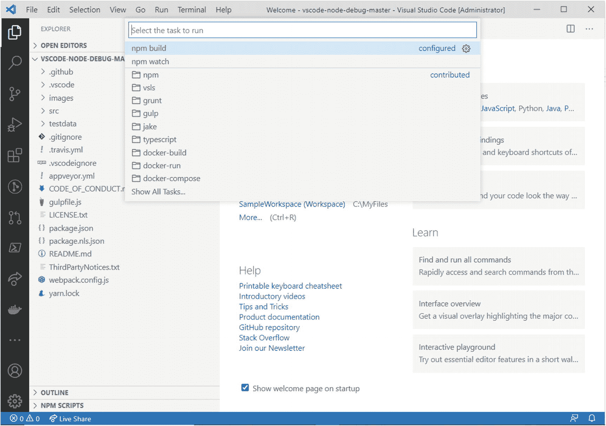

图 8-6

自动检测的任务

该扩展的源代码由 JavaScript 和 TypeScript 文件组成，构建在 Node.js 运行时之上。因此，Visual Studio 代码已经能够检测到许多适合这种项目的任务，例如 **npm 构建**和 **npm 观察**任务。然后，您可以打开 **npm** 类别，查看可以针对 npm 运行的预配置任务的完整列表。

自动检测的任务非常有用，因为它们允许您在任务自动化方面节省大量时间。然而，通常情况下，现有任务无法满足您的需求，因此您需要进行自定义。

Note

为了自动检测任务，幕后 VS 代码需要安装特定的环境。比如，只有安装了 Node.js，VS 代码才能基于 Node.js 自动检测任务；同样，只有安装了 Gulp，它才能基于 Gulp 自动检测任务，依此类推。

### 配置任务

当 Visual Studio 代码无法自动检测文件夹的任务时，或者当自动检测不能满足您的需要时，您可以通过编辑 tasks.json 文件来创建和配置自定义任务。在这一节中，我将给出两个例子来帮助您理解如何配置您自己的任务。

更具体地说，我将解释如何使用 OmniPascal 扩展和免费的 Pascal 编译器编译 Pascal 源代码文件，所有操作系统都可以使用，以及如何基于完整的。通过调用 MSBuild.exe 编译器在 Windows 上运行. NET Framework。

要完成这两个示例，您需要以下内容:

*   Visual Studio 代码的 OmniPascal 语言扩展，可以通过扩展面板下载。这个扩展对于启用 Pascal 语法突出显示和代码导航很有用，尽管您仍然可以在没有它的情况下编译源文件。

*   免费的 Pascal 编译器，包括使用 Pascal 开发应用所需的全部内容，并提供免费的命令行编译器。Windows、macOS、Linux 等系统都有免费的 Pascal，可以从 [`https://www.freepascal.org`](https://www.freepascal.org) 下载。

*   仅在 Windows 上，下载最新版本的。NET 框架(撰写本文时是 4.8 版)，其中包括 MSBuild.exe 工具。

让我们从一个基于 Pascal 语言的例子开始。

#### 第一个例子:编译 Pascal 源代码

在这一节中，我将解释如何创建一个定制任务，通过从 VS 代码中调用免费的 Pascal 命令行编译器来编译 Pascal 源代码文件。假设你已经下载并安装了前文所列的软件，在磁盘上找到免费的 Pascal 文件夹安装(通常在 Windows 上是 C:\ FPC \版本号，在 macOS 和 Linux 上是/FPC/版本号)，然后打开 **examples** 文件夹。在 Visual Studio 代码中，打开任何包含一些 Pascal 源代码的文件夹。我会用一个叫 fcl-json 的。

图 [8-7](#Fig7) 显示了当前打开的 Pascal 源文件中 Visual Studio 代码的外观。


图 8-7

编辑 Pascal 源代码

之前安装的 OmniPascal 扩展支持语法着色和其他常见的编辑特性。现在假设您想通过调用免费的 Pascal 命令行编译器将源代码编译成可执行的二进制文件。您可以通过创建自定义任务来实现这一点。按照以下步骤创建一个新的 tasks.json 文件并设置自定义任务:

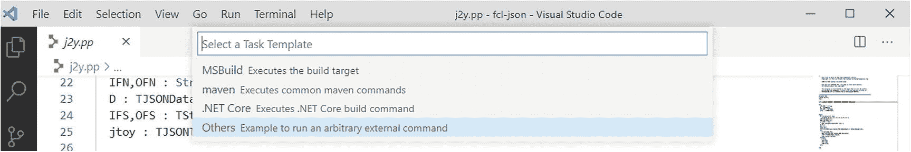

图 8-9

选择任务模板

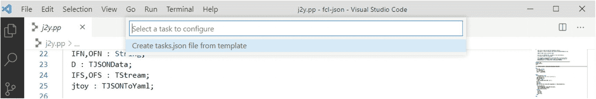

图 8-8

从头开始创建新任务

1.  选择**终端** ➤ **配置任务**。当命令面板出现要求配置任务时，从模板中选择**创建 tasks.json 文件(见图 [8-8](#Fig8) )。此时没有现有的任务需要配置，所以您唯一能做的就是创建一个新的 tasks.json 文件。**

2.  命令面板显示可用任务模板列表: **MSBuild** 、 **maven** 、**。网芯**，和**其他**(见图 [8-9](#Fig9) )。选择**其他**创建一个独立于其他系统的新任务。

Visual Studio 代码生成一个名为。vscode 和该文件夹中的一个新的 tasks.json 文件，该文件的内容如下:

```sh
{
    // See https://go.microsoft.com/fwlink/?LinkId=733558
    // for the documentation about the tasks.json format
    "version": "2.0.0",
    "tasks": [
        {
            "label": "echo",
            "type": "shell",
            "command": "echo Hello"
        }
    ]
}

```

这个 JSON 文件的核心节点是一个名为`tasks`的数组。它包含一个任务列表，对于每个任务，您可以指定 VS 代码将用来在命令面板中显示它的文本(`label`)、任务类型(`type`)以及将要执行的外部程序(`command`)。另外一个名为`args`的 JSON 属性允许您为所调用的程序指定命令行参数。在即将到来的“了解 tasks.json 属性”部分的表 [8-2](#Tab2) 中提供了支持的 JSON 属性列表，但是如果您不耐烦，可以快速查看该表，然后返回这里。

表 8-2

任务自定义的可用属性

<colgroup><col class="tcol1 align-left"> <col class="tcol2 align-left"></colgroup> 
| 

属性名称

 | 

描述

 |
| --- | --- |
| `label` | 用于标识任务的字符串(例如，在命令选项板中)。 |
| `type` | 表示任务类型。对于自定义任务，支持的值是`shell`和`process`。使用`shell`，命令被解释为 shell 命令(比如 bash、cmd 或 PowerShell)。使用`process`，该命令被解释为要执行的过程。 |
| `command` | 要执行的命令或外部程序。 |
| `args` | 要传递给命令的命令行参数数组。 |
| `windows` | 允许指定特定于 Windows 操作系统的任务属性。 |
| `osx` | 允许指定特定于 macOS 的任务属性。 |
| `linux` | 允许指定特定于 Linux 及其发行版的任务属性。 |
| `group` | 允许定义任务组和指定任务所属的组。 |
| `presentation` | 定义 Visual Studio 代码如何处理用户界面中的任务输出(请参见下面的示例)。 |
| `options` | 允许提供关于`cwd`(当前工作目录)、`env`(环境变量)和`shell`(默认 shell)选项的自定义值。 |

现在假设您想要创建一个构建任务，按照惯例，这是您用来编译源代码的任务类型。可以通过修改 tasks.json 来实现这一点，如下所示:

```sh
{
    // See https://go.microsoft.com/fwlink/?LinkId=733558
    // for the documentation about the tasks.json format
    "version": "2.0.0",
    "tasks": [
        {
            "label": "build",
            "type": "shell",
            "command": "fpc",
            "args": ["${file}"]
        }
    ]
}

```

要点如下:

*   现在,`label`属性值是`build`,因此该任务显然是作为构建任务提供的。

*   `type`属性值为`shell`，意味着它将由操作系统的Shell执行。

*   `command`属性值为`fpc`，是自由 Pascal 编译器的文件名。

*   `args`属性值是要传递给外部程序的命令行参数数组；在这种情况下，只有一个参数，即活动的源文件，由变量`$(file)`表示。

Note

一般来说，只有在操作系统的环境变量(如 Windows 上的`PATH`)中注册了完整路径的情况下，才可以调用外部程序，而无需指定其完整路径。在 Free Pascal 的情况下，安装程序声称负责注册程序的路径，但是要记住查看其他程序的环境变量。

您当然可以指定要编译的文件的名称，但是使用变量更灵活，因此您可以简单地编译代码编辑器中当前活动的任何文件。变量在“理解替代变量”一节中讨论，并在本章后面的表 [8-3](#Tab3) 中总结。注意智能感知如何帮助你在 tasks.json 中找到合适的属性，如图 [8-10](#Fig10) 所示。

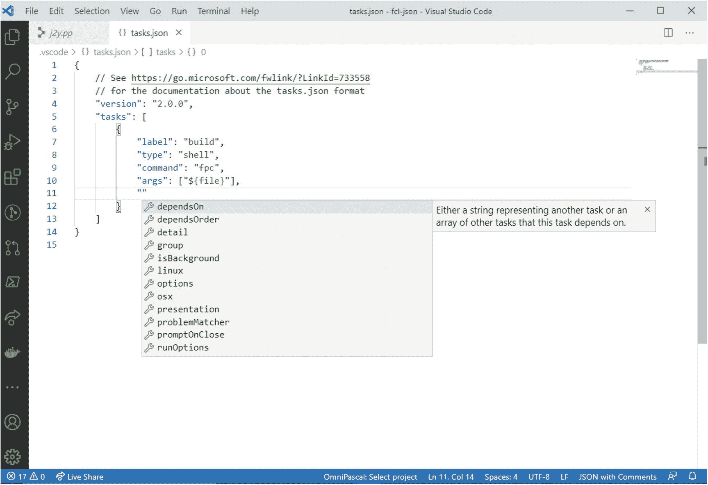

图 8-10

智能感知有助于定义任务属性

表 8-3

支持的替代变量

<colgroup><col class="tcol1 align-left"> <col class="tcol2 align-left"></colgroup> 
| 

可变的

 | 

描述

 |
| --- | --- |
| `${workspaceFolder}` | 表示当前打开的文件夹的路径。 |
| `${workspaceFolderBasename}` | 表示当前打开的文件夹的名称，不带任何斜杠。 |
| `${file}` | 活动代码文件的路径。 |
| `${relativeFile}` | 相对于`${workspaceFolder}`的活动代码文件。 |
| `${fileBasename}` | 活动代码文件的基本名称，不带路径和前导斜杠。 |
| `${fileBasenameNoExtension}` | 不带扩展名的活动代码文件的基本名称。 |
| `${fileDirname}` | 包含活动代码文件的目录的路径。 |
| `${fileExtname}` | 活动代码文件的文件扩展名。 |
| `${cwd}` | 任务的当前工作目录。 |
| `${lineNumber}` | 活动文件中当前选定的行号。 |
| `${selectedText}` | 活动文件中当前选定的文本。 |
| `${env.VARIABLENAME}` | 引用一个环境变量，比如`{$env.PATH}`。 |

保存并关闭 tasks.json，然后打开一个 Pascal 源文件。现在您可以运行新创建的构建任务了。选择**终端** ➤ **运行任务**，从命令面板中选择**构建**任务(见图 [8-11](#Fig11) )。

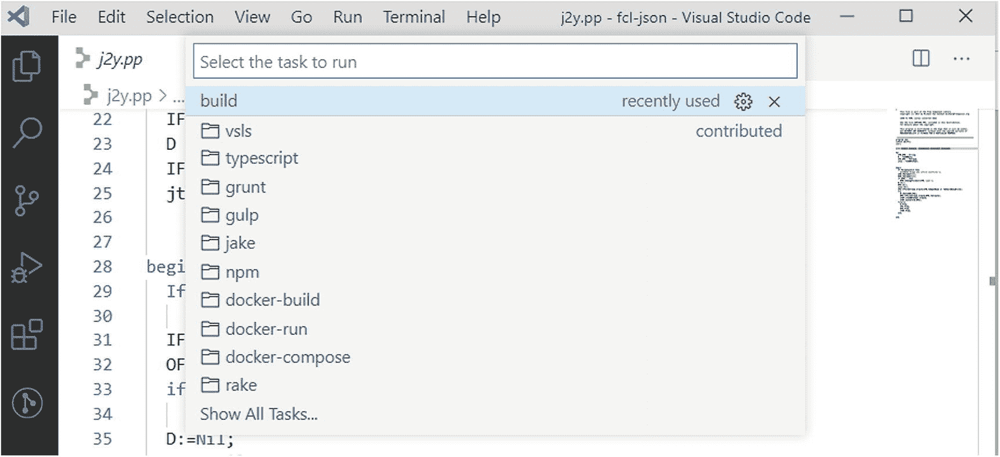

图 8-11

选择新任务

此时，VS Code 会询问您希望如何检测外部程序执行过程中遇到的任何问题，以便在 problems 面板中显示这些问题。检测程序输出中的问题是所谓的*问题匹配器*的工作。这是一个更复杂的主题，将在本章后面的“理解问题匹配器”一节中讨论。现在选择**继续，不扫描任务输出**(见图 [8-12](#Fig12) )。

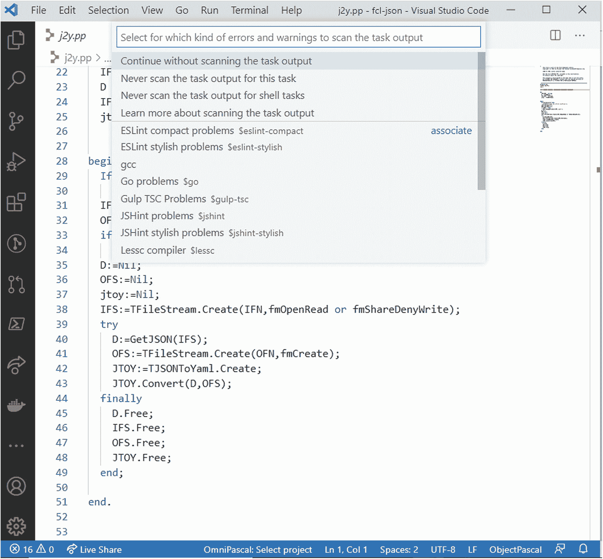

图 8-12

选择问题匹配器

免费的 Pascal 编译器在终端面板中执行，您也可以看到程序输出，如图 [8-13](#Fig13) 所示。

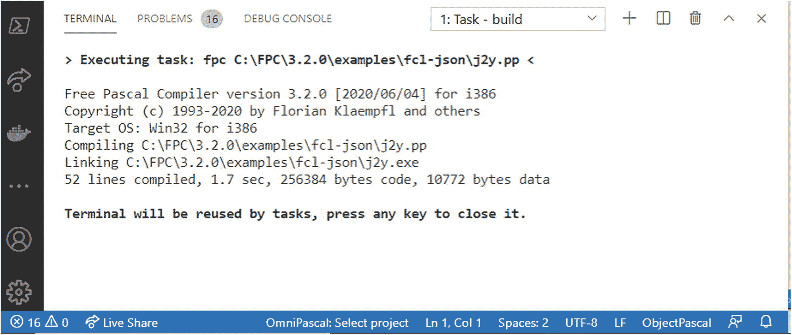

图 8-13

执行免费的 Pascal 编译器

如果执行成功，您将在源代码的文件夹中找到一个新的二进制文件。如果失败，终端面板中显示的编译器输出将帮助您了解问题所在。在开始第二个例子之前，我将解释更多关于默认任务、任务模板、tasks.json 中的 JSON 属性和变量的内容。

#### 多个任务和默认构建任务

tasks.json 文件可以定义多个任务。正如本章前面所介绍的，除了其他任务之外，常见的任务是构建和测试，但是您可能希望实现特定于您的场景的多个任务。例如，假设您想使用免费的 Pascal 编译器来构建 Delphi 源代码文件。

免费的 Pascal 命令行编译器提供了`-Mdelphi`选项，支持基于 Delphi 兼容模式的编译。因此，您可以按如下方式修改 tasks.json:

```sh
{
    // See https://go.microsoft.com/fwlink/?LinkId=733558
    // for the documentation about the tasks.json format
    "version": "2.0.0",
    "tasks": [
        {
            "label": "build",
            "type": "shell",
            "command": "fpc",
            "args": ["${file}"]

        },
        {
            "label": "Delphi build",
            "type": "shell",
            "command": "fpc",
            "args": [
                     "${file}",
                     "-Mdelphi"
                    ]
        }
    ]
}

```

如您所见，tasks 数组中有一个名为`Delphi build`的新定制任务，它仍然调用活动文件上的免费 Pascal 编译器，但是将`-Mdelphi`选项作为命令行参数传递。现在，如果您再次选择**终端** ➤ **运行任务**，您会在命令面板中看到这两个任务，如图 [8-14](#Fig14) 所示。

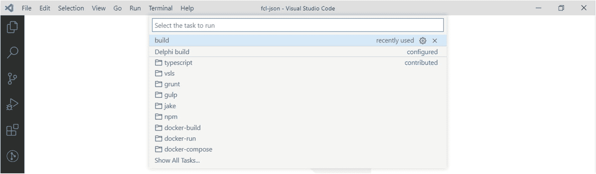

图 8-14

所有定义的任务都显示在命令选项板中

拥有多个构建任务，甚至多个相同类型的任务是很常见的，但是在大多数情况下，您通常会运行同一个任务，并为非常特殊的情况保留其他任务。与当前示例相关，您通常会构建 Pascal 源文件，有时会构建 Delphi 源文件，因此一个方便的选择是为 Pascal 文件配置一个默认的构建任务。正如您在前面的“默认构建任务”一节中所了解到的，您可以通过以下步骤轻松实现这一点:

1.  选择**终端** ➤ **配置默认构建任务**。

2.  在命令面板中，通过添加一个`isDefault`参数来选择前面定义的**构建**任务(您将很快在代码中看到)。

3.  在 Pascal 源文件激活的情况下，选择**终端** ➤ **运行构建任务**，或者按下系统的键盘快捷键。

该命令自动启动默认的构建任务，而不需要每次都手动选择任务。

#### 了解 tasks.json 属性

有许多属性可用于自定义任务。表 [8-2](#Tab2) 总结了可用于自定义任务的常见属性。

下一节将分别讨论`windows`、`osx`和`linux`属性。`group`属性允许按类别对任务进行分组。例如，如果您考虑前面创建的两个多重任务，它们都与构建代码相关，因此它们可能被分组到一个叫做**构建**的类别中。这是通过修改 tasks.json 实现的，如下所示:

```sh
{
    // See https://go.microsoft.com/fwlink/?LinkId=733558
    // for the documentation about the tasks.json format
    "version": "2.0.0",
    "tasks": [
        {
            "label": "build",
            "type": "shell",
            "command": "fpc",
            "args": ["${file}"],
            "group": "build",
        },
        {
            "label": "Delphi build",
            "type": "shell",
            "command": "fpc",
            "args": ["${file}", "-Mdelphi"],
            "group": "build"
        }
    ]
}

```

注意 IntelliSense 是如何显示`group`属性的内置支持值的(参见图 [8-15](#Fig15) )。

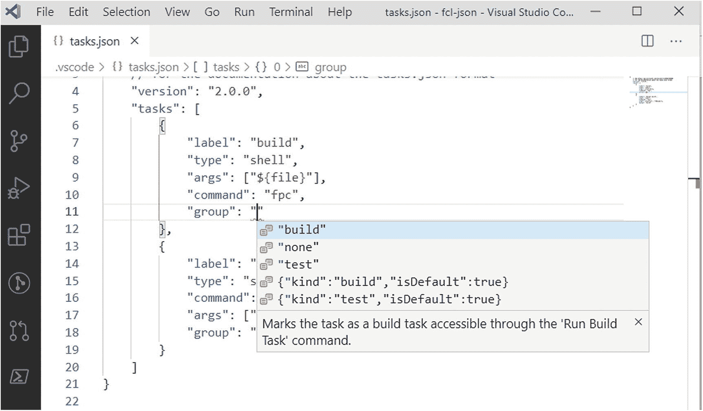

图 8-15

智能感知帮助组

您还可以为组中的单个任务指定其他值。例如，如果您想将一个任务设置为组中的默认任务，您可以按如下方式更改 JSON:

```sh
"group": {
     "kind": "build",
     "isDefault": true
  }
}

```

`kind`属性表示组名，而`isDefault`不言自明。您还可以通过`presentation`属性定制 VS 代码处理任务输出的方式。当您键入`presentation`然后按 Tab 键时，IntelliSense 会添加一些带有默认值的键/值对，如下所示:

```sh
"presentation": {
    "echo": true,
    "reveal": "always",
    "focus": false,
    "panel": "shared",
    "showReuseMessage": true
}

```

以下是每个键及其值的描述:

*   `echo`可以是`true`或`false`，指定任务输出是否实际写入终端面板。

*   `reveal`可以是`always`、`never`或`silent`并指定运行任务的终端面板是应该总是可见、从不可见，还是仅在未指定问题匹配器且出现一些错误时才可见。

*   `focus`可以是`true`或`false`，指定任务运行时终端面板是否应该获得焦点。

*   `panel`可以是`shared`、`dedicated`或`new`，并指定终端实例是否跨任务共享，或者实例是否必须专用于当前任务，或者是否应该在每次任务运行时创建一个新实例。

*   `showReuseMessage`可以是`true`或`false`,指定是否应显示一条消息，告知终端面板将被任务重新使用，因此可以将其关闭。

您在前面的代码片段中看到的值是默认值。在默认值的情况下，可以省略一个键。例如，以下标记演示了如何在每次运行时创建新的终端面板，而不显示重用消息:

```sh
"presentation": {
    "panel": "new",
    "showReuseMessage": false
}

```

其他值可以省略，因为我们可以接受前面文本中看到的默认值。

Note

受支持的属性列表要长得多，但是大多数都不常用。如果您想更深入地了解可用属性的完整列表，可以查看 tasks.json 模式，它提供了关于每个属性的详细注释；该模式在 [`https://code.visualstudio.com/docs/editor/tasks-appendix`](https://code.visualstudio.com/docs/editor/tasks-appendix) 可用。

#### 了解替代变量

Visual Studio 代码还提供了几个预定义变量，您可以使用这些变量来代替常规字符串，并且在将这些变量传递给命令时，这些变量对于表示文件和文件夹名称非常有用。表 [8-3](#Tab3) 总结了支持的变量。

当您运行在项目/文件夹级别工作的任务时，或者针对您无法预测或不想硬编码的文件名运行任务时，使用变量是非常常见的。您可以在 [`https://code.visualstudio.com/docs/editor/variables-reference`](https://code.visualstudio.com/docs/editor/variables-reference) 查看变量文档了解更多详情。

#### 操作系统特定的属性

有时，您可能需要根据操作系统提供不同的任务属性值。在 Visual Studio 代码中，可以根据目标使用`windows`、`osx`和`linux`属性来指定不同的属性值。

例如，以下 tasks.json 实现显示了如何为 Windows 和 Linux 显式指定外部工具的路径(在您的计算机上，目录名可能不同):

```sh
{
    // See https://go.microsoft.com/fwlink/?LinkId=733558
    // for the documentation about the tasks.json format
    "version": "2.0.0",
    "tasks": [
        {
            "label": "build",
            "type": "shell",
            "args": ["${file}"],
            "windows": {
                "command": "C:\\Program Files\\FPC\\fpc.exe"
            },
            "linux": {
                "command": "/usr/bin/fpc"
            }
        }
    ]
}

```

更具体地说，您需要将感兴趣的属性移动到操作系统属性下，并提供所需的值。在前面的代码中，`command`属性已经从较高的级别移到了`windows`和`linux`属性节点。

#### 重用现有的任务模板

在前面关于编译 Pascal 源代码的例子中，您看到了如何从头开始创建一个定制任务。但是，对于某些特定的场景，您可以利用现有的任务模板，这些模板由已经预先配置为使用特定命令和设置的 tasks.json 文件组成。

任务模板列表可能会因您安装的扩展而异，但假设您只安装了 C#扩展，您的列表应该如图 [8-9](#Fig9) 所示。第一个模板名为 MSBuild，生成以下 tasks.json 文件:

```sh
{
    // See https://go.microsoft.com/fwlink/?LinkId=733558
    // for the documentation about the tasks.json format
    "version": "2.0.0",
    "tasks": [
        {
            "label": "build",
            "type": "shell",
            "command": "msbuild",
            "args": [

// Ask msbuild to generate full paths for file names.
                "/property:GenerateFullPaths=true",
                "/t:build",
// Do not generate summary otherwise it leads to duplicate errors in Problems panel
                "/consoleloggerparameters:NoSummary"
            ],
            "group": "build",
            "presentation": {

// Reveal the output only if unrecognized errors occur.
                "reveal": "silent"
            },

// Use the standard MS compiler pattern to detect errors, warnings and infos
            "problemMatcher": "$msCompile"
        }
    ]
}

```

如果您想在 VS 代码中使用 Microsoft Visual Studio 解决方案，这个模板非常有用，下一小节将提供一个更具体的示例。值得一提的是，考虑到 C#解决方案(如基于。NET Framework)，但 MSBuild 可以构建任何类型的解决方案，因此它可以重用于不同的目的。

第二个模板名为 Maven，被定制为支持 Java 的同名构建自动化工具。这种模板会生成以下 tasks.json 文件:

```sh
{
    // See https://go.microsoft.com/fwlink/?LinkId=733558
    // for the documentation about the tasks.json format
    "version": "2.0.0",
    "tasks": [
        {
            "label": "verify",
            "type": "shell",
            "command": "mvn -B verify",
            "group": "build"
        },
        {
            "label": "test",
            "type": "shell",
            "command": "mvn -B test",
            "group": "test"
        }
    ]
}

```

显然，Maven 必须安装在你的机器上(你可以在 [`https://maven.apache.org`](https://maven.apache.org) 找到它)。第三个模板叫做。NET Core，顾名思义，它生成一个 tasks.json 文件，该文件是为自动构建。净核心项目。配置如下所示:

```sh
{
    // See https://go.microsoft.com/fwlink/?LinkId=733558
    // for the documentation about the tasks.json format
    "version": "2.0.0",
    "tasks": [
        {
            "label": "build",
            "command": "dotnet",
            "type": "shell",
            "args": [
                "build",
                // Ask dotnet build to generate full paths for file names.
                "/property:GenerateFullPaths=true",
                // Do not generate summary otherwise it leads to duplicate errors in Problems panel
                "/consoleloggerparameters:NoSummary"
            ],
            "group": "build",
            "presentation": {
                "reveal": "silent"
            },
            "problemMatcher": "$msCompile"
        }
    ]
}

```

这种情况下，命令不是`MSBuild`；反而是`dotnet`。这些模板之所以有用，至少有两个原因:

*   它们为目标类型的项目提供了现成的配置，您可能只需要做一些调整。

*   它们提供了一个完整的任务结构，您只需要替换命令和目标，以及可选的演示和问题匹配器。

现在，您将看到一个基于 MSBuild 任务模板的示例。

#### 第二个示例:生成 MSBuild 解决方案(仅限 Windows)

自第一次发布以来，MSBuild 一直是 Microsoft 的生成引擎。NET 框架早在 2002 年。它是一个非常强大的工具，因为它可以毫不费力地构建 Visual Studio 解决方案。因此，一个非常好的特性是可以在 Visual Studio 代码中编译您的解决方案和项目。

Note

从……开始。NET Core 3，有可能用 C#构建桌面应用，Visual Studio 代码将能够调试和运行它们，而无需任何额外的配置。然而，桌面应用已经建立了几十年，完全基于 Windows 演示基础和 Windows 窗体。NET 框架。因为 Visual Studio 代码不直接支持。NET Framework，您将需要按照本节中的说明自定义任务配置。

您可以配置一个任务来运行 Visual Studio 使用的生成引擎 MSBuild.exe。在下一个示例中，您将看到如何编译由基于 Windows Presentation Foundation(WPF)的 Visual Basic 项目构成的 MSBuild 解决方案，当然所有步骤都适用于任何。sln 文件和任何支持的语言。如果您没有，请在 Visual Studio 2019 中创建一个以 Visual Basic 为语言的空白 WPF 项目。不需要编写代码，因为重点在于项目类型。保存项目，然后在 VS 代码中打开项目文件夹。

在配置任务之前，值得一提的是，默认情况下，MSBuild 路径不在 Windows 环境变量中注册，因此您有两种可能的选择:

*   通过**控制面板** ➤ **系统** ➤ **高级系统设置** ➤ **环境变量**将 MSBuild 目录添加到`PATH`环境变量中。

*   在 tasks.json 中指定完整的 MSBuild 路径名。

选择**终端** ➤ **配置任务**。首先选择**Create template from task . JSON**选项，然后从模板列表中选择 MSBuild 模板。创建 tasks.json 后，按如下方式更改`command`属性的值，并将`Enterprise`(这是我计算机上的内容)替换为您计算机上的 Visual Studio 版本的名称，例如:

```sh
"command": "C:\\Program Files (x86)\\Microsoft Visual Studio\\2019\\Enterprise\\MSBuild\\Current\\Bin\\MSBuild"

```

此外，出于演示目的，将`reveal`属性的值从`silent`更改为`always`，以便您可以在终端面板中看到 MSBuild 的输出。现在选择**终端** ➤ **运行任务**并选择预配置的构建任务，MSBuild 将被启动，解决方案将被构建，如图 [8-16](#Fig16) 所示。

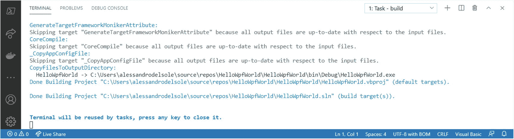

图 8-16

使用 MSBuild 任务编译用 Visual Basic 编写的 WPF 项目

预配置的 MSBuild 任务使用`$msCompile`问题匹配器来检测构建输出中与 C#和 Visual Basic 相关的问题，以便在用户界面中以方便的方式呈现这些问题。让我们更详细地研究一下问题匹配器。

#### 了解问题匹配器

问题匹配器扫描任务输出文本中已知的警告或错误字符串，并在编辑器和问题面板中报告这些内容。Visual Studio 代码附带了许多内置的问题匹配器，用于 TypeScript、JSHint、ESLint、Go、C#以及 Visual Basic、Lessc 和 Node Sass(参见 [`https://code.visualstudio.com/docs/editor/tasks#_processingtaskoutput-with-problem-matchers`](https://code.visualstudio.com/docs/editor/tasks%2523_processing%25C2%25ADtask%25C2%25ADoutput-with-problem-matchers) )。

内置的问题匹配器非常有用，因为对于前面提到的环境，VS 代码可以在 problems 面板中显示编译时发生的问题，但它也可以在代码编辑器中突出显示导致问题的代码行。

您还可以定义自定义问题匹配器来扫描外部程序的输出。例如，用于扫描免费 Pascal 编译器的问题匹配器可能如下所示:

```sh
            "problemMatcher": {
                "owner": "external",
                "fileLocation": ["relative", "${workspaceRoot}"],
                "pattern": {

"regexp": "((([A-Za-z]):\\\\(?:[^\\/:*?\\\"
<>|\\r\\n]+\\\\)*)?[^\\/\\s\\(:*?\\\"<>|\\r\\n]*)\\((\\d+)\\):
\\s.*(fatal|error|warning|hint)\\s(.*):\\s(.*)",

// The first match group matches the file name which is relative.
        "file": 1,

// The second match group matches the line on which the problem occurred.
        "line": 2,

// The third match group matches the column at which the problem occurred.
        "column": 3,

// The fourth match group matches the problem's severity. Can be ignored. Then all problems are captured as errors.
        "severity": 4,
        // The fifth match group matches the message.
        "message": 5
                }

```

`owner`属性表示语言服务，在这种情况下它的值是`external`，但是在 C++项目的情况下它可以是`cpp`。但是最重要的属性是`pattern`，在这里指定一个正则表达式(regexp)来匹配外部程序发送的错误字符串。还要注意，在注释的帮助下，匹配是如何按目标分组的。构建问题匹配器可能很棘手，这超出了本书的范围，所以我建议您阅读在 [`https://code.visualstudio.com/docs/editor/tasks#_defining-a-problem-matcher`](https://code.visualstudio.com/docs/editor/tasks%2523_defining-a-problem-matcher) 获得的官方文档。

### 用默认程序运行文件

如果您在 VS 代码中编辑一个类型与操作系统相关的文件，您不需要创建自定义任务来运行它。例如，您可以运行批处理程序(。bat)或一个 shell 脚本文件(。sh)，只需点击**终端** ➤ **运行活动文件**。

文件名被传递给系统上的当前终端程序(Windows 上的 PowerShell 或 Linux 和 macOS 上的 bash shell ),以便操作系统尝试使用注册了文件扩展名的程序(如果有)打开该文件。在批处理或 shell 脚本文件的情况下，操作系统执行该文件。输出显示在终端面板上。

Note

只有操作系统或命令行工具的输出会被重定向到终端面板。例如，如果您试图编辑一个. txt 文件，然后选择**终端** ➤ **运行活动文件**，这样一个文件将在您系统的默认文本编辑器中打开，并且不会有与终端面板的额外交互。

## 摘要

Visual Studio 代码中有许多功能使其不同于简单的代码编辑器。任务是这些功能中的一部分。通过任务，您可以将外部程序附加到应用生命周期中，并运行编译器之类的工具。对于某些环境，VS 代码附带了任务自动检测，但是当您需要将特定的工具与项目或文件夹相关联时，它允许创建定制的任务。

通过处理 tasks.json 文件并借助 IntelliSense，您可以在文件夹中包含任何外部程序的执行。像编译器这样的外部程序的执行当然是有用的，但是如果 VS 代码不能向前迈进一步的话就没那么重要了:调试代码，这将在接下来的两章中讨论，先用 C#再用 Python。