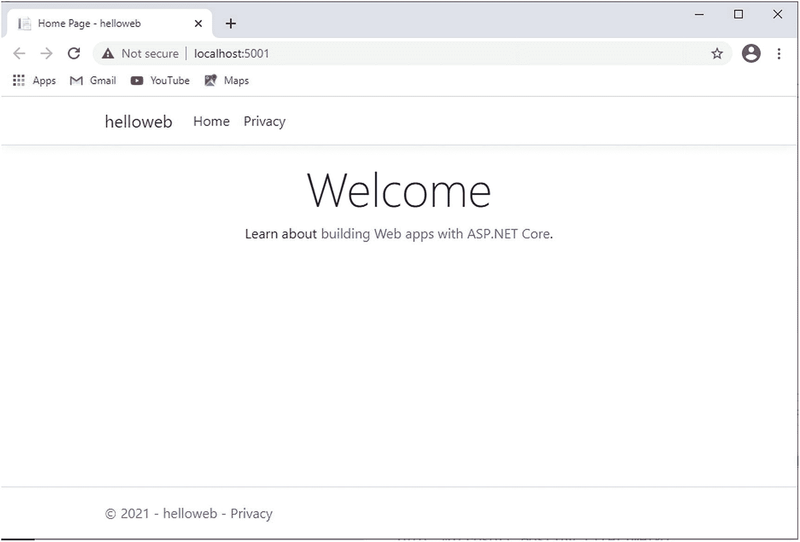
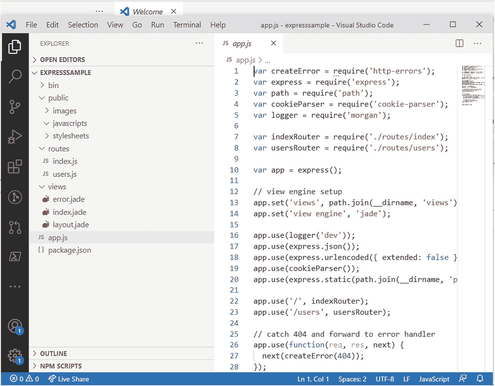
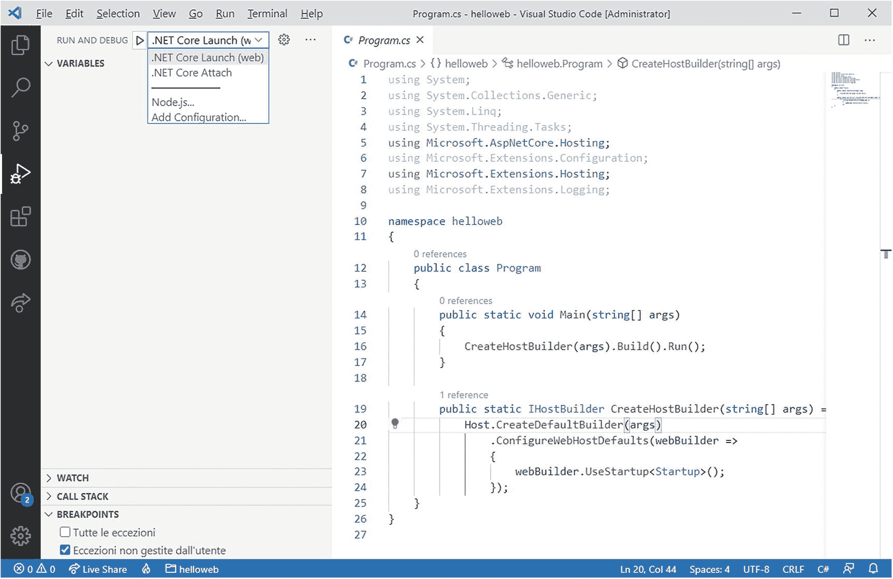
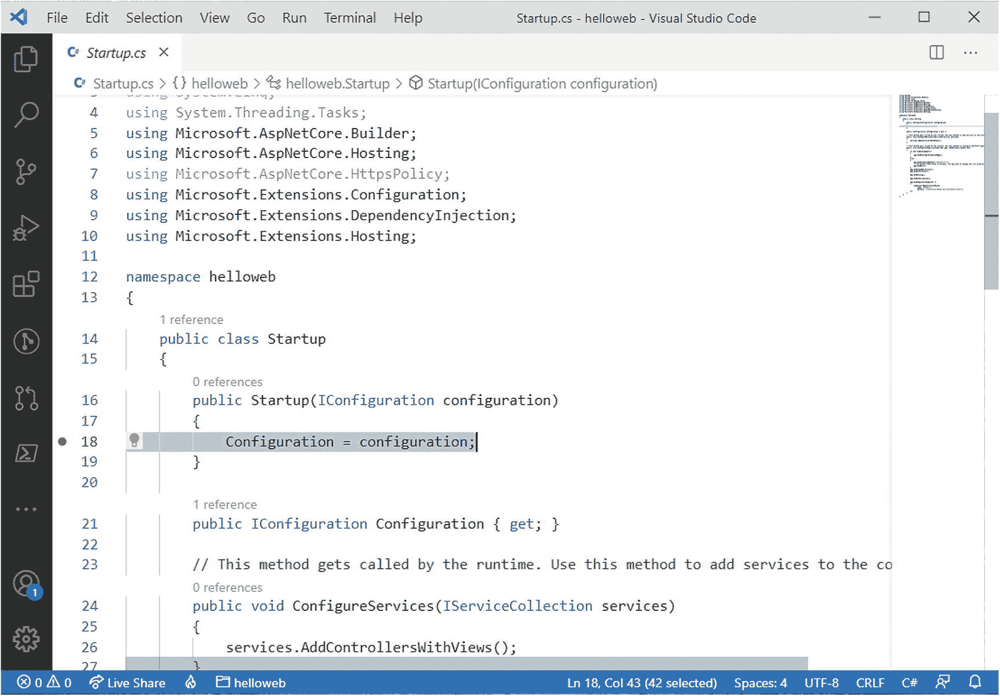
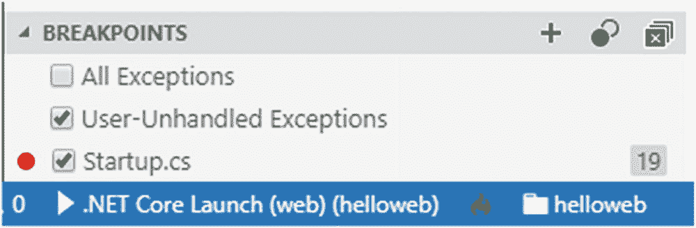
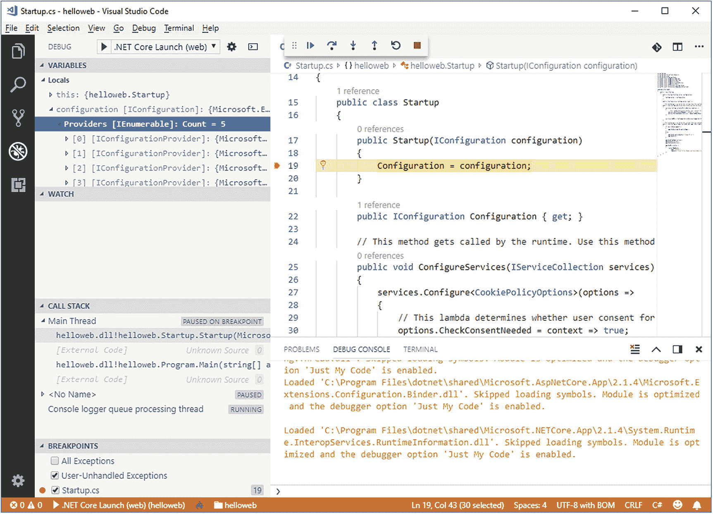
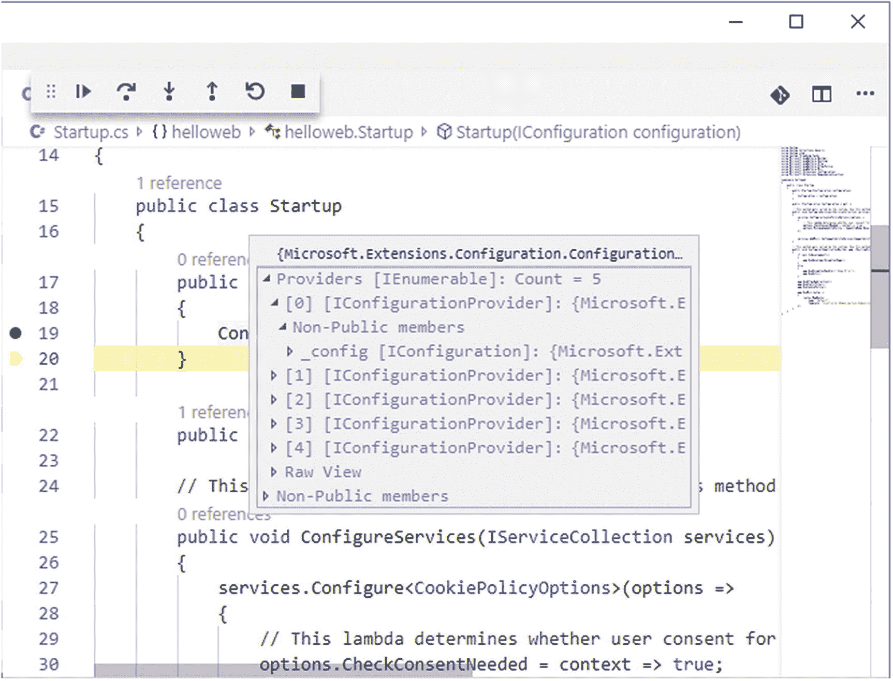
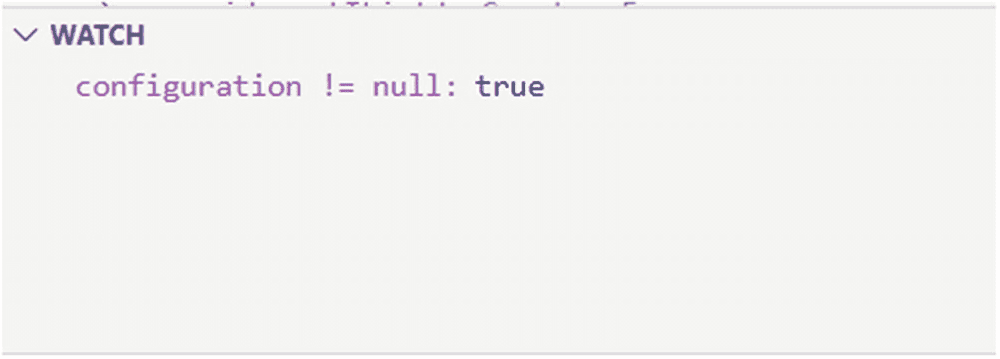
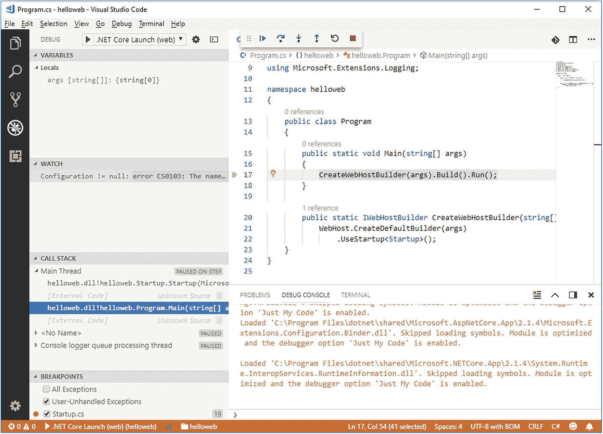
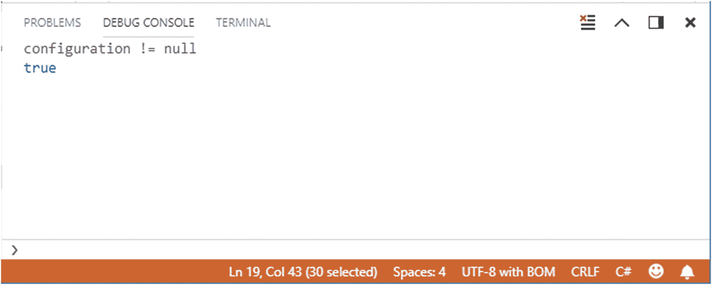

# 九、构建和调试应用：.NET 5 和其它平台

作为一个端到端的开发环境，VSCode 提供了您在其他代码编辑器中找不到的机会。事实上，在 VSCode 中，您可以使用许多项目类型，并用几种语言调试您的代码。本章首先概述了应用开发，然后解释了如何构建.NET 5 项目，以及如何使用所有内置的强大调试功能。即使您不打算将 C#用于 VSCode，我也建议您阅读本章，因为大多数概念也适用于其他语言，尤其是 TypeScript、JavaScript 和 Python。

## 创建应用

VSCode 独立于专有的项目系统和平台，因此，它不提供任何用于创建项目的内置选项。这意味着您需要依赖每个平台提供的工具。本节解释如何基于新的？NET 5，但是您也可以使用其他平台提供的命令行界面来创建项目。

我还建议您在磁盘上为以下示例创建一个专用文件夹。借助系统上的文件管理器工具(Windows 上的 Windows Explorer、macOS 上的 Finder 以及 Ubuntu 等 Linux 发行版上的 Nautilus)，在根文件夹下创建一个名为 VSCode 的文件夹，例如 C:\VSCode 或~/Library/VSCode。在这个文件夹中，您将很快创建新的应用。

Note

以下主题是在的上下文中讨论的.NET 5，但是 VSCode 支持所有.NET Core 版本高达 3.1。因此，所有解释和示例都适用于.NET Core 也是。

### 介绍.NET 5

.NET 5 是微软新的主要版本.NET 技术。释放后。几年前，微软就已经有了在两者之间实现完全统一的愿景.NET 框架和.NET 核心，致力于一个单一的，跨平台的 API，可以带来强大的.NET 提供给任何系统上的任何开发人员。

你可能知道.NET Core 是一个跨平台、开源、模块化的运行时，可以使用 C#、F#和 Visual Basic 构建在 Windows、macOS 和 Linux 发行版上运行的应用。与.NET Core，您可以创建不同种类的应用，如 web 应用、Web API REST 服务、控制台应用和类库。它的哥哥.NET Framework 还包括创建桌面应用的能力，如 Windows 窗体和 Windows Presentation Foundation.NET Framework 最大的限制是只能在 Windows 上运行。

所以.NET 5 可以认为是两者的更新。网芯和.NET 框架；有了它，微软将两种技术结合在一起，提供了一个统一的开发平台，具有.NET 核心，再加上.NET 框架。.NET 5 还包括 C# 9 和 F# 5，但它不支持用 C#和 F#进行移动开发，这是为.NET 6，包括 Xamarin。此外，在撰写本文时.NET 5 你只能在 Windows 上创建桌面应用。

有几种方法可以得到。净 5。作为一个使用 VSCode 的开发人员，最简单的方法就是从官方网站下载最新版本( [`https://dotnet.microsoft.com`](https://dotnet.microsoft.com) )。通过该网站，您可以选择与您的操作系统相匹配的安装包。对于下面的解释和例子，我假设您已经下载并安装了。你机器上的. NET 5。

### 创造。净 5 个项目

.NET 5 附带了丰富的命令行界面，提供了许多选项来创建不同种类的项目和单个文件。您可以通过使用`dotnet`工具，更具体地说是通过调用`dotnet new`命令，从命令行创建项目和文件。例如，如果您想用 C#创建一个控制台应用，您可以输入以下命令:

```sh
> dotnet new console

```

默认情况下，`dotnet`工具假设您想要使用 C#，除非您明确指定一种不同的语言。例如，以下命令使您能够使用 Visual Basic 创建控制台应用:

```sh
> dotnet new console -lang VB

```

表 [9-1](#Tab1) 提供了所有可用模板的综合列表和描述。

表 9-1

可用.NET 项目和文件模板

<colgroup><col class="tcol1 align-left"> <col class="tcol2 align-left"> <col class="tcol3 align-left"> <col class="tcol4 align-left"></colgroup> 
| 

模板名称

 | 

简称

 | 

语言

 |   |
| --- | --- | --- | --- |
| 控制台应用 | 安慰 | C#、F#、VB |   |
| 类库 | jclasslib(消歧义) | C#、F#、VB |   |
| WPF 应用 | 西皮尔巴拉粉 | C#、VB |   |
| WPF 类库 | 瓦普利卜 | C#、VB |   |
| WPF 海关控制图书馆 | wpfcustomcontrollib | C#、VB |   |
| WPF 用户控制库 | wpfusercontrollib | C#、VB |   |
| Windows 窗体(WinForms)应用 | 窗体 | C#、VB |   |
| 工人服务 | 工人 | C# |   |
| 单元测试项目 | mstsch est | C#、F#、VB |   |
| NUnit 3 测试项目 | 努尼特 | C#、F#、VB |   |
| NUnit 3 测试项目 | 努尼特试验 | C#、F#、VB |   |
| xUnit 测试项目 | 朱尼特 | C#、F#、VB |   |
| 剃刀组件 | 剃刀组件 | C# |   |
| 剃刀页 | 页，面，张，版 | C# |   |
| MVC 视图导入 | 视图导入 | C# |   |
| MVC ViewStart | view state-检视状态 | C# |   |
| Blazor 服务器应用 | blazorserver | C# |   |
| Blazor WebAssembly 应用 | blazorwasm | C# |   |
| ASP.NET 核心空了 | 网 | C#、F# |   |
| ASP.NET 核心 Web 应用(模型-视图-控制器) | 手动音量调节 | C#、F# |   |
| ASP.NET 核心网络应用 | webapp，razor | C# |   |
| 带棱角的 ASP.NET 芯 | 有角的 | C# |   |
| ASP.NET 核心与 React.js | 反应 | C# |   |
| 带有 React.js 和 Redux 的 ASP.NET 核心 | reactredux | C# |   |
| Razor 类库 | razorclasslib | C# |   |
| ASP.NET 核心 Web API | webapi | C#、F# |   |
| ASP？ASP？ASP？net core grpc 服务 | 断续器 | C# |   |
| dotnet gitignore 档案 | 吉蒂尔 |   |   |
| global.json 文件 | 全球 json |   |   |
| nuget 配置 | nugetconfig |   |   |
| 点网本地工具清单文件 | 工具清单 |   |   |
| Web 配置 | web config(web config) |   |   |
| 解决方案文件 | 豆状下核 |   |   |
| 协议缓冲文件 | 样机 |   |   |

Note

所有 Windows 窗体和 WPF 模板都只能通过。净 5。对于 C#和 F#来说，它们已经可以使用了。网芯 3.1。然而，表 [9-1](#Tab1) 中描述的大部分模板在之前的版本中就已经存在。

在这一节中，我将展示一个基于 C#的例子和一个基于模型-视图-控制器(MVC)模式的 ASP.NET 核心 web 应用。根据您的系统，在之前创建的 VSCode 文件夹中打开命令提示符或终端实例。

键入以下命令创建一个名为 HelloWeb 的新空文件夹:

```sh
> mkdir HelloWeb

```

然后，进入新目录。在 Windows 和 Linux 上，您可以键入

```sh
> chdir HelloWeb

```

在 macOS 上，该命令改为`cd`，这在 Windows 上也常用作`chdir`的快捷方式。

接下来，键入以下命令来构建一个新的。使用 C#的. NET 5 web 应用:

```sh
> dotnet new mvc

```

`mvc`命令行开关指定新的 web 应用基于 MVC 模式和.NET SDK 将为一些控制器和视图生成所有的管道代码。您也可以使用`web`开关创建一个空的 web 应用，但是拥有一些自动生成的页面将有助于描述调试特性。一旦创建了项目.NET 5 将自动恢复解决方案的 NuGet 包。您也可以通过键入以下命令来手动完成此操作:

```sh
> dotnet restore

```

如果您键入`dotnet run`，开发服务器将开始运行，然后您需要打开浏览器并手动启动应用。但是，目标是理解如何在 VSCode 中运行和调试应用。所以，用 VS 代码打开项目文件夹。您也可以从命令行键入`code .`来打开 VSCode。多亏了 C#扩展，VS 代码可以识别。csproj 项目文件，组织文件和文件夹，并启用您之前学习的所有强大的代码编辑功能。

下一步是运行应用。通常，在 VSCode 中有两种选择:

*   运行附加了调试器实例的应用，其中调试器可用于当前项目类型。在...的情况下.NET 5，它自带了与 VS 代码集成的调试器。

*   在没有附加调试器实例的情况下运行应用。

让我们从第二个选项开始，然后在下一节中详细描述调试特性。您可以选择**运行** ➤ **运行而不调试**。VSCode 首先要求您指定一个环境，因此选择.NET Core，然后它开始默认的构建任务。对于 Web 应用，VS 代码启动开发服务器的一个实例，但是为了运行应用，您需要手动打开浏览器并输入您在终端面板中看到的网址。

Note

第一次运行某些代码时，VS 代码可能会显示一条弹出消息，指出需要必需的资产来启用构建和调试。接受提议，VS 代码会完成剩下的工作。

图 [9-1](#Fig1) 显示了之前构建的 web 应用。



图 9-1

那个.NET web 应用运行

Note

您的浏览器可能会显示警告，指出该网站不安全。因为当前正在使用本地开发环境，所以您可以忽略该警告并继续显示网页。此外，一些浏览器可能会要求为当前站点添加一个安全例外，您可能希望接受它以避免每次都出现警告。

ASP.NET 网络应用使用一个名为 Kestrel ( [`https://github.com/aspnet/AspNetCore`](https://github.com/aspnet/AspNetCore) )的开源开发服务器，它允许独立于专有系统。默认情况下，Kestrel 监听端口 5001 上的应用，这意味着您的应用可以在`http://localhost:5001`到达。您可以在名为 launch.json 的文件中更改默认端口设置，这将在后面的“配置调试器”一节中详细讨论

通过前面的简单步骤，您已经能够用 VS 代码创建并运行一个. NET 5 项目，您当然可以根据需要使用强大的 C#代码编辑功能进行编辑。

### 在其他平台上创建项目

显然，.NET 5 并不是你使用 VS 代码的唯一平台。根据平台的不同，您将使用特定的命令行工具来构建新项目。在下一章中，你将学习如何使用 Python 项目，但是在这一章中提供一些上下文也是值得的。例如，使用 Node.js 可以快速创建基于 Express.js 框架的 JavaScript 项目( [`https://expressjs.com`](https://expressjs.com) )。

Express 是一个最小且灵活的 Node.js web 应用框架，它提供了一组健壮的特性来开发 web 和移动应用。它促进了基于节点的 web 应用的快速开发，并包括一些功能，如设置中间件来响应 HTTP 请求，定义用于根据 HTTP 方法和 URL 执行不同操作的路由表，以及根据向模板传递参数来动态呈现 HTML 页面。使用 Express 创建应用的一个简单方法是使用 Express 应用生成器( [`https://expressjs.com/en/starter/generator.html`](https://expressjs.com/en/starter/generator.html) )，使用以下命令安装:

```sh
> npm install -g express-generator

```

接下来，您可以使用以下命令生成一个 JavaScript 项目:

```sh
> express expressexample

```

请注意，npm 要求全部使用小写字母。然后，您可以键入`code .`在 VSCode 中打开新项目。图 9-2 显示了一个在 VSCode 中使用 Express JavaScript 框架创建的 JavaScript 项目。



图 9-2

用 VS 代码中的 Express JavaScript 框架创建的 JavaScript 项目

您可以使用其他命令行工具遵循类似的过程来生成项目，例如仍然可用于 Node.js 的 Yeoman generator ( [`https://yeoman.io/`](https://yeoman.io/) )，它还允许生成 ASP.NET 核心项目和 VS 代码扩展。例如，您可以使用 Apache Cordova 框架( [`https://cordova.apache.org`](https://cordova.apache.org) )创建移动应用。Cordova 是一个基于 JavaScript 的框架，它与 Node.js 配合得非常好。使用 Cordova 构建的应用基于 JavaScript、HTML 和级联样式表(CSS)。首先，您可以使用以下命令安装 Cordova:

```sh
> npm install -g cordova

```

然后，您可以使用以下命令轻松构建一个 Cordova 项目:

```sh
> cordova create mycordovaproject

```

其中`mycordovaproject`是新项目的名称。一旦您有了一个新的或现有的 Cordova 项目，您就可以安装 Cordova Tools extension for VSCode( [`https://marketplace.visualstudio.com/items?itemName=vsmobile.cordova-tools`](https://marketplace.visualstudio.com/items%253FitemName%253Dvsmobile.cordova-tools) )。该扩展为 Node.js 的集成调试器添加了对 Cordova 项目的支持，提供了针对 Android 和 iOS 设备以及模拟器的特定配置。

Note

您还需要一些额外的用于 Cordova 的特定工具，这取决于您打算以什么系统为目标。对于 iOS，需要从 Apache Cordova ( [`https://cordova.apache.org/docs/en/latest/guide/platforms/ios/index.html`](https://cordova.apache.org/docs/en/latest/guide/platforms/ios/index.html) )安装 iOS 平台指南中描述的工具。对于 Android，需要安装 Apache Cordova ( [`https://cordova.apache.org/docs/en/latest/guide/platforms/android/index.html`](https://cordova.apache.org/docs/en/latest/guide/platforms/android/index.html) )的 Android 平台指南中描述的工具。

## 调试您的代码

VSCode 的代码调试功能是其最强大的功能之一，也可能是使其比其他代码编辑器略胜一筹的功能。VSCode 附带了一个用于 Node.js 应用的集成调试器，并且可以使用第三方调试器进行扩展。例如，如果你有.NET 5 时，VSCode 的 C#扩展会检测兼容调试器的可用性，并负责将其附加到 VS 代码。

我们将考虑使用 C#和.NET Core 作为调试工作方式的示例，因此重新打开您之前创建的 HelloWeb 文件夹。

Note

本章中讨论的所有特性都适用于所有受支持的调试器(内置的和通过可扩展性的)，因此它们并不特定于 C#和。净 5。

运行视图提供了一种与调试器交互的方式。图 [9-3](#Fig3) 显示了此时它是如何出现的。

在视图的顶部，您可以看到**运行**工具栏，它提供以下项目:

*   **开始调试**按钮，用播放图标(白色和绿色箭头)表示。单击此按钮将启动附加了调试器实例的应用。

*   配置下拉框。在这里，您可以选择用于运行应用的调试器配置。

*   设置按钮，用齿轮图标表示，它的工具提示说**打开 launch.json** (细节稍后提供)。

*   由 **…** 按钮代表的子菜单，包含可用和选定视图的列表，以及**调试控制台**命令，该命令打开调试控制台面板，从中可以看到调试器的输出消息。

在这个快速概述之后，您已经准备好学习调试器配置，然后您将浏览 VS 代码中可用的调试工具。

### 配置调试器

在调试器可以检查应用之前，必须对其进行配置。对于 Node.js 和.NET 5 中，一个扩展负责所有的事情，提供了默认的配置。图 [9-3](#Fig3) 显示了两种预定义的配置**。网芯推出**和**。网芯附着**。



图 9-3

运行视图

第一种配置用于在适当的主机中运行应用，并附带一个调试器实例。对于当前示例中的 ASP.NET 核心 web 应用，主机是 web 浏览器。在控制台应用的情况下，主机将是 Windows 控制台或 macOS 和 Linux 中的终端。第二种配置可用于将调试器附加到另一个正在运行的.NET 5 应用。

Note

实际上，对于您使用创建的每种应用，都有一个不同的. NET 核心启动配置.NET 核心。例如，控制台应用的配置称为.NET 核心启动(控制台)。要记住的概念是，提供启动配置是为了将调试器的实例附加到当前项目。

调试器配置存储在一个名为 launch.json 的特殊文件中。vscode 子文件夹(以及 tasks.json)。这个特殊的 JSON 文件包含指示 VSCode 必须调试的输出二进制文件和应用宿主的标记。当前的 launch.json 的内容.NET Core 示例如下所示:

```sh
 {
    "version": "0.2.0",
    "configurations": [
        {
            // Use IntelliSense to find out which attributes
            // exist for C# debugging
            // Use hover for the description of the
            // existing attributes
            // For further information visit https://github.com/OmniSharp/omnisharp-vscode/blob/master/debugger-launchjson.md
            "name": ".NET Core Launch (web)",
            "type": "coreclr",
            "request": "launch",
            "preLaunchTask": "build",
            // If you have changed target frameworks, make sure to update the program path.
            "program": "${workspaceFolder}/bin/Debug/net5.0/HelloWeb.dll",
            "args": [],
            "cwd": "${workspaceFolder}",
            "stopAtEntry": false,
            // Enable launching a web browser when ASP.NET Core starts. For more information: https://aka.ms/VSCode-CS-LaunchJson-WebBrowser
            "serverReadyAction": {
                "action": "openExternally",
                "pattern": "\\\\bNow listening on:\\\\s+(https?://\\\\S+)"
            },
            "env": {
                "ASPNETCORE_ENVIRONMENT": "Development"
            },
            "sourceFileMap": {
                "/Views": "${workspaceFolder}/Views"
            }
        },
        {
            "name": ".NET Core Attach",
            "type": "coreclr",
            "request": "attach",
            "processId": "${command:pickProcess}"
        }
    ]
}

```

如您所见，该文件的语法类似于 tasks.json 的语法。对于阵列中的每种配置，最重要的属性是

*   `name`，表示配置友好的名称。

*   `type`，表示调试器运行的运行时类型。

*   `request` ( `launch`或`attach`)，决定调试器是附加到当前项目还是外部应用。

*   `preLaunchTask`，包含调试会话开始前要执行的任何任务。通常，此属性是与默认的生成任务一起分配的。

*   `program`，表示将成为调试会话主题的二进制文件。

*   `env`，代表环境。在...的情况下.NET 5 中，`Development`的值指示 VS 代码运行 Kestrel 开发服务器。

如果您想实现定制配置，launch.json 是添加它们的地方。因为这两种配置，以及更一般的默认配置，对于大多数常见需求来说已经足够了，所以本书不讨论定制配置。文档提供了关于这个主题的更多细节( [`https://code.visualstudio.com/docs/editor/debugging#_add-a-new-configuration`](https://code.visualstudio.com/docs/editor/debugging%2523_add-a-new-%25C2%25ADconfiguration) )。

Note

当 launch.json 是活动文件时，如果您单击位于代码编辑器右下角的**添加配置**按钮，您将能够从您可以添加到 launch.json 的内置配置列表中进行选择。

### 管理断点

在开始调试会话之前，放置一个或多个断点以发现 VS 代码中的全部调试功能是很有用的。通过在您感兴趣的行上按 F9 键，单击行号旁边的空白来放置断点。例如，在 Startup.cs 文件的第 18 行放置一个断点，如图 [9-4](#Fig4) 所示。



图 9-4

添加断点

您可以通过再次点击来删除断点，或者您可以在运行视图的**断点**区域管理断点(参见图 [9-5](#Fig5) )。



图 9-5

管理断点

在这里，您可以看到包含任何断点和行号的文件列表。您还可以使调试器在遇到用户未处理的异常(默认)和所有异常时中断。可以点击**添加函数断点** (+)按钮。调试器可以通过指定函数名来支持创建断点，而不是直接在源代码中放置断点。这在源代码不可用但函数名已知的情况下很有用。

### 调试应用

现在是启动调试会话的时候了，这样您就可以看到所有调试工具的运行情况，并在遇到断点时做出决定。在运行视图中，确保**.NET Core Launch (web)** 配置被选中，然后点击**开始**按钮或按 **F5** 。VSCode 启动调试器，它将在**调试控制台**面板中显示调试器的输出。当遇到异常或断点时，它也会中断，就像当前的例子一样。

图 [9-6](#Fig6) 显示了 VS 代码命中一个断点以及所有的调试工具。用黄色突出显示的代码行是将作为下一行执行的代码行。



图 9-6

命中断点时可用的调试工具

请注意，调试时状态栏变为橙色，并且**调试控制台**窗口显示关于调试过程的信息。在左侧，调试视图显示了许多工具:

*   **VARIABLES** ，它显示了当前受调试器控制的变量列表，您可以通过展开每个变量来调查这些变量。该面板包括一个名为“局部变量”的子列表，它显示当前范围内的变量列表。每个都可以进一步展开以查看其详细信息。

*   **看**，一个可以评价表情的地方。

*   **调用栈**，这里可以看到方法调用的栈。如果单击方法调用，代码编辑器会将您带到进行该调用的代码。

*   **断点**，在这里可以管理断点。

在窗口的顶部，还可以看到名为调试操作窗格的调试工具栏(见图 [9-6](#Fig6) )，它由以下命令组成(从左到右):

*   **Continue** ，允许在断点或异常中断后继续执行应用。

*   **单步执行**，它一次执行一条语句，但方法调用除外，方法调用是在不单步执行的情况下调用的。

*   **进入**，一次执行一条语句。方法体内的语句也是一次执行一条。

*   **步出**，从当前断点开始执行函数的剩余行。

*   **重启**，您选择它来重启应用的执行。

*   **Stop** ，您调用它来停止调试。

这些命令及其键盘快捷键也可以在**运行**菜单中找到。例如，如果点击**跨过**按钮，高亮显示的行运行，执行前进一行(见图 [9-7](#Fig7) )。如果您将光标悬停在代码编辑器中的变量名上，一个方便的弹出框使您能够轻松地调查值和属性值(取决于变量的类型)，如图 [9-7](#Fig7) 所示，其中显示了一个包括关于`configuration`变量的信息的弹出框。您可以展开属性并查看它们的值，还可以在运行和调试栏的**变量**区域中调查属性。



图 9-7

调试时调查属性值

#### 评估表达式

您可以选择使用**观察**工具来评估表达式。调试时，点击**观察**框中的**添加表达式** (+)按钮，然后输入要计算的表达式。例如，如果您键入`configuration != null`，观察工具将根据对象是否有实例返回`true`或`false`。图 [9-8](#Fig8) 显示了一个例子。



图 9-8

评估表达式

#### 调用堆栈

调试器还提供了**调用栈**特性，它允许单步执行方法调用的层次结构。当你点击堆栈中的一个方法调用时，代码编辑器打开包含该方法调用的文件，突出显示该方法调用(参见图 [9-9](#Fig9) )。



图 9-9

遍历方法调用

当您遍历方法调用时,“变量”面板的“局部变量”子视图也会更新，以显示当前范围内的变量。只有当方法是源代码的一部分时，代码编辑器才能突出显示方法调用，因此它不允许对调用堆栈中标记为[外部代码]的方法进行进一步的控制(参见图 [9-9](#Fig9) )，但是该功能非常有用，尤其是当您遇到错误并且需要回退代码时。

#### 调试控制台面板

调试控制台当然是 VS 代码显示调试器输出的地方，但是，顾名思义，它也是一个交互式面板，您可以在其中评估表达式。您可以在>符号附近键入表达式，然后按 Enter 键。

图 [9-10](#Fig10) 显示了一个评估`configuration`变量是否不为空的例子。



图 9-10

在调试控制台面板中计算表达式

## 摘要

当您使用真正的应用时，VSCode 作为开发环境的强大功能就会显现出来。在特定生成器的帮助下，您可以轻松生成。使用 C#或 Node.js 项目的. NET 5 项目。本章描述了如何利用强大的内置调试器，该调试器提供了编写优秀应用所需的所有必要工具，如断点、变量调查、调用堆栈和表达式求值器。

通过完成本章，您已经了解了使用 VSCode 编写优秀的跨平台应用所需的所有最重要和最强大的功能。