# 十一、将应用部署到 Azure

微软 Azure 是微软的首要云解决方案，它提供了许多服务，从托管 web 应用和 SQL 数据库到远程虚拟机、人工智能服务等等。

有了 Visual Studio Code，通过大量支持多种环境的扩展，比如 Node.js 和.NET，它提供了集成的体验，因此您可以直接在您的开发环境中工作。Azure 开发有许多扩展，每一个都针对不同的场景，但这需要一整本书来描述它们，所以在本章中我将介绍两个最流行的扩展:Azure App Services，它支持发布 web 应用，和 Azure Functions，它使你能够直接从 Visual Studio Code使用无服务器应用。

Note

本章需要有效的 Microsoft Azure 订阅才能完成示例。如果您没有，您可以在 [`https://azure.microsoft.com/en-us/free`](https://azure.microsoft.com/en-us/free) 获得免费试用。

## Azure 扩展简介

Visual Studio Code支持使用最流行和最强大的 Azure 服务进行开发。开发环境中集成了支持，Visual Studio 市场中提供了特定的扩展。表 [11-1](#Tab1) 列出并描述了 Azure 开发的常见扩展。

表 11-1

Azure 开发的通用扩展

<colgroup><col class="tcol1 align-left"> <col class="tcol2 align-left"></colgroup> 
| 

延长

 | 

描述

 |
| --- | --- |
| Azure 帐户 | 允许登录一个或多个 Azure 订阅。 |
| Azure 应用服务 | 提供将 web 应用部署到云的集成支持。 |
| Azure CLI 工具 | 安装使用所有 Azure 服务所需的所有命令行工具。 |
| Azure 数据库 | 允许通过集成的浏览器在 VS 代码中直接创建、浏览和管理 SQL Azure、MongoDB、Cosmos DB、PostgreSQL 和 DocumentDb 数据库。 |
| Azure 函数 | 为编写、测试和部署 Azure 函数提供集成支持。 |
| 天蓝色机器学习 | 以前称为 Visual Studio Code for AI Tools，允许基于您的 Azure 订阅创建、构建、培训和部署机器学习模型。 |
| Azure 资源管理器 | 允许在 VS 代码中管理 Azure 资源组。 |
| Azure 存储 | 允许连接到 Azure 订阅中的 blobs、表、文件和队列存储。它还允许直接从 VS 代码中上传文件夹。 |
| 部署到 Azure | 允许为 Azure DevOps 代码库设置持续集成和持续部署管道。 |
| 码头工人 | 允许从 Visual Studio Code中发布容器化的应用，并为 Docker 和 YAML 文件提供改进的代码编辑功能。 |
| 忽必烈忽必烈忽必烈忽必烈忽必烈忽必烈忽必烈忽必烈忽必烈忽必烈 | 提供将 Docker 容器部署到 Kubernetes 的集成支持，Kubernetes 是一个开源系统，用于自动化容器化应用的部署、伸缩和管理，由 Azure 支持。 |

我建议您收藏官方文档，可在 [`https://code.visualstudio.com/docs/azure/extensions`](https://code.visualstudio.com/docs/azure/extensions) 获得更多细节和示例。值得注意的是，Visual Studio Code可以支持容器化应用的 Docker 和 Kubernetes，这对许多开发人员来说是非常重要的。

## 部署 Web 应用

使用 Visual Studio Code将 web 应用部署到 Azure 非常容易。您可以重拍用 C#和.NET Core，但值得记住的是，发布到 Azure 并不局限于这些技术，对于 Node.js 也是可能的

Note

Visual Studio Code、Microsoft Azure 平台和针对 VS 代码的 Azure 扩展不断发展。新版本可能会对本章中描述的内容进行更改。

### 安装扩展

你需要做的第一件事是从 Marketplace 安装 Azure App 服务扩展。该扩展还需要 Azure 帐户和 Azure 资源扩展，但这些是与应用服务一起安装的，因此您不需要采取任何额外的步骤。

Azure Account extension 实际上是允许开发人员从 Visual Studio Code中登录他们的 Azure 帐户并选择使用哪个订阅所必需的。Azure Resources 扩展用于管理资源组，资源组是组织云服务的地方。图 [11-1](#Fig1) 显示了扩展面板中的 Azure App 服务扩展。

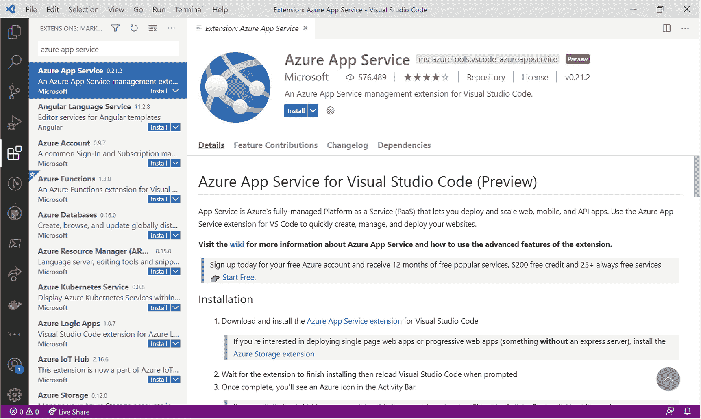

图 11-1

微软的 Azure 应用服务扩展

### 登录 Azure 订阅

安装 Azure 应用服务扩展以及 Azure 帐户和 Azure 资源组扩展后，您需要登录才能使用任何服务。

为此，你可以使用命令面板中的 **Azure: Sign In** 命令，或者 Azure 侧边栏的 App Service 节点中的**Sign to Azure**快捷方式。这两种操作都会打开指向 Microsoft 帐户登录服务的默认浏览器实例。登录后，只需输入您的凭据，登录并关闭浏览器窗口。现在，在 Visual Studio Code中，您可以打开 Azure 扩展并查看与您的订阅相关的服务列表。图 [11-2](#Fig2) 显示了一个基于我的订阅的例子。


图 11-2

Azure 服务视图

Note

微软 Azure 的产品非常广泛，跨越了过多的服务，所以我建议你看看官方网站( [`https://azure.microsoft.com/en-us/free`](https://azure.microsoft.com/en-us/free) `)`)了解详细信息。此外，请不要忘记进入管理门户( [`https://portal.azure.com`](https://portal.azure.com) )，它为您提供了创建和管理服务和资源的完整工具和选项。

分层视图显示资源组及其包含的服务，并且它还支持多个订阅。

您可以通过展开服务组并右键单击其名称来访问可用选项，从而快速与每个服务进行交互。

### 发布 Web 应用

Visual Studio Code使得将 web 应用发布到 Azure 的过程变得非常容易。本节的目标是演示将 web 应用发布到 Azure 是多么的快速和简单。假设您已经打开了 helloweb 示例项目，在 Azure 视图中，右键单击您的订阅名称并选择 **Create New Web App** 。

一个三步向导将引导您完成应用的创建。第一步要求您在命令面板中为新的 web 应用提供一个唯一的名称，如图 [11-3](#Fig3) 所示。

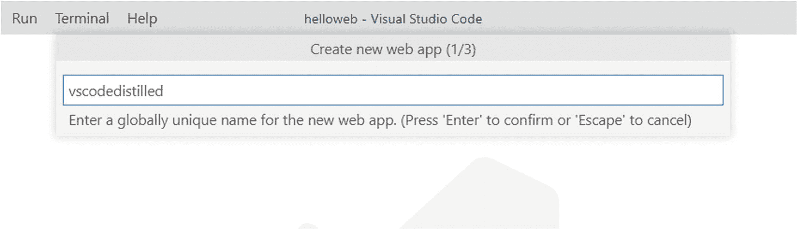

图 11-3

指定 web 应用的名称

因为您指定的名称将与 azurewebsites.net 域相结合，并代表您的应用的网址，所以如果该名称已被使用，则会出现一条验证消息，请您选择其他名称。你可能想要指定一个不同于`vscodedistilled`的名字，这是我在本章的例子中使用的名字。

下一步是为您的 web 应用指定目标环境；这是必要的，因为 Azure 扩展无法检测你的应用基于哪种技术。图 [11-4](#Fig4) 显示了可用选项的列表。

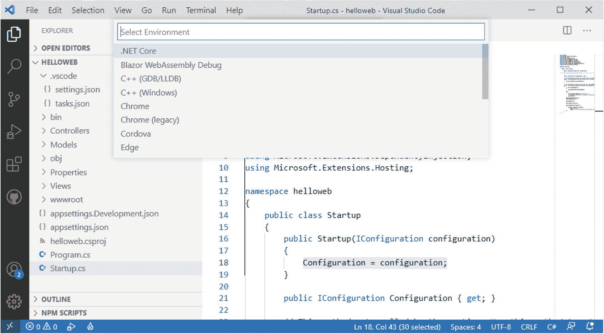

图 11-4

指定目标平台

因为示例应用是在.NET 5，选择这个作为目标平台。向导的最后一步要求您指定定价等级。我建议使用自由层，如图 [11-5](#Fig5) 所示。

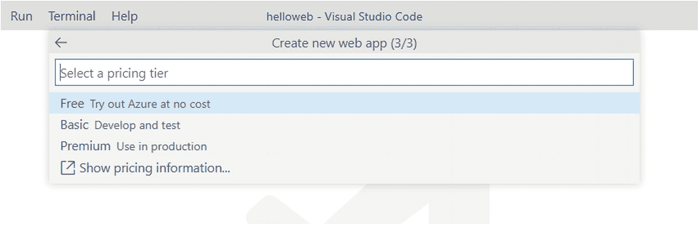

图 11-5

指定定价等级

完成这三个简单的步骤后，Visual Studio Code首先在发布模式下构建项目(结果将在终端中可见)，然后开始在 Azure 订阅中创建必要的资源，您将能够在出现在环境右下角的弹出框中看到进度。一切准备就绪后，会弹出一条消息，询问您是否要启用自动部署。点击**总是部署**以便应用被发布。

部署完成后，浏览器会自动启动新发布的应用(参见图 [11-6](#Fig6) )。如果没有发生这种情况，您可以在 Azure 侧栏的应用服务视图中右键单击应用名称，并选择**浏览网站**，然后在对话框中单击**打开**按钮，通知您外部程序正在启动。

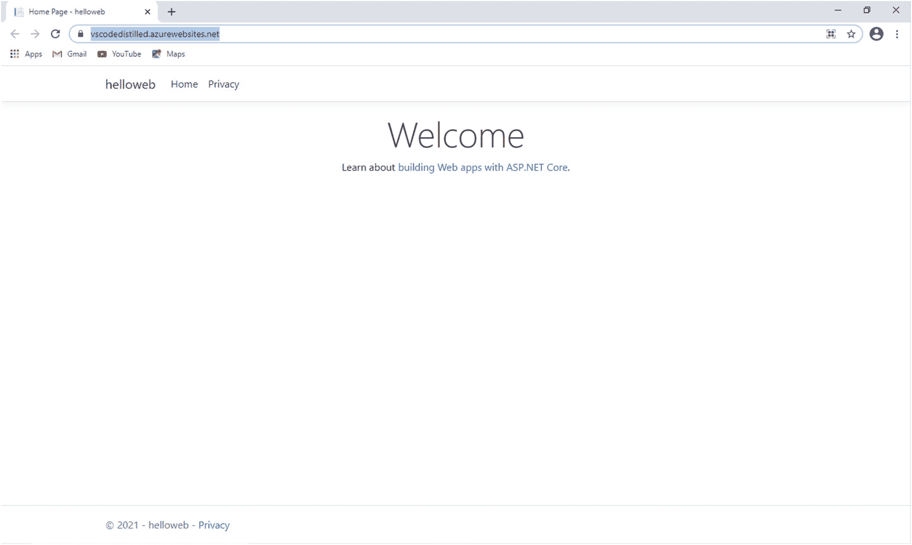

图 11-6

运行在云中的 web 应用

您不需要额外的步骤。您的应用已在浏览器中启动并运行，托管在您的 Azure 订阅中。您可以在 Visual Studio Code中和 Azure 门户( [`https://portal.azure.com`](https://portal.azure.com) )中进一步管理您的 Azure 服务和资源。虽然管理 Azure 门户中的资源是一个更大的主题，超出了本章的范围，图 [11-7](#Fig7) 显示了示例 web 应用的管理页面，在这里您可以在左侧看到可用设置的完整列表，以及主视图中关于部署、数据中心和统计的信息。

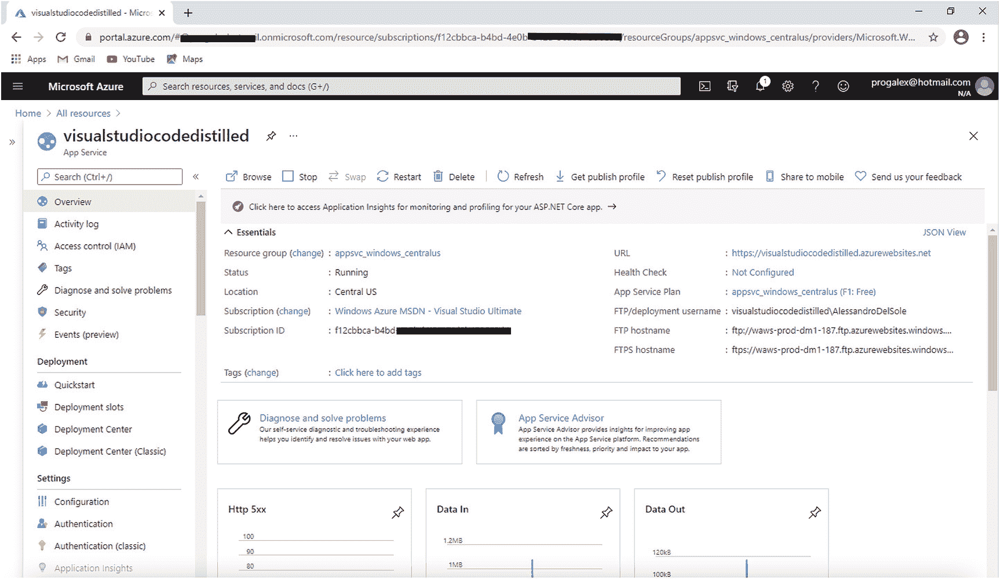

图 11-7

在 Azure 门户中管理应用服务

## 创建和部署 Azure 功能

简而言之，Azure Functions ( [`https://docs.microsoft.com/en-us/azure/azure-functions`](https://docs.microsoft.com/en-us/azure/azure-functions) )是一种允许在云中按需运行代码的服务，它被认为是*无服务器计算*增长趋势的一部分。使用 Azure 函数的最大好处是，函数只有在被调用时才会被触发，这不仅减少了云资源的使用，还减少了维护和基础设施需求，从而节省了更多成本。

### 配置 Visual Studio Code

Azure 支持用多种语言编写函数，比如 C#、Python、Java、JavaScript 和 Rust。通常不同的开发环境都有工具可以用来编写 Azure 函数，比如 Visual Studio 2019，Visual Studio Code也不例外。

用 VS 代码开发 Azure 函数首先需要的是 Azure Functions 核心工具。这组命令行工具是运行开发、调试和发布功能所必需的任务所必需的。在 Windows 上，您有两种方法来安装这些工具:从官方网站( [`https://bit.ly/3f1lHxR`](https://bit.ly/3f1lHxR) )下载 Windows 安装程序，或者使用以下命令，该命令利用 Node.js 上的 npm，并且您可以在 VS 代码中从终端窗口或从开发人员命令提示符运行:

```sh
> npm i -g azure-functions-core-tools@3 --unsafe-perm true

```

我建议使用后一种命令行方法来安装工具，因为 Visual Studio Code可能无法识别这些工具是通过安装程序包安装的。

在 macOS 上，您需要运行以下命令:

```sh
> brew tap azure/functions
> brew install azure-functions-core-tools@3

```

在最新版本的 Ubuntu 上，所需的命令如下:

```sh
> wget
-q https://packages.microsoft.com/config/ubuntu/20.04/packages-microsoft-prod.deb
> sudo dpkg -i packages-microsoft-prod.deb

```

安装命令因 Linux 发行版而异，所以您可以在 [`https://github.com/Azure/azure-functions-core-tools#linux`](https://github.com/Azure/azure-functions-core-tools%2523linux) 找到合适的命令。

一旦安装了 Azure Functions 核心工具，就需要安装 Visual Studio Code的 Azure Functions 扩展(见图 [11-8](#Fig8) )。

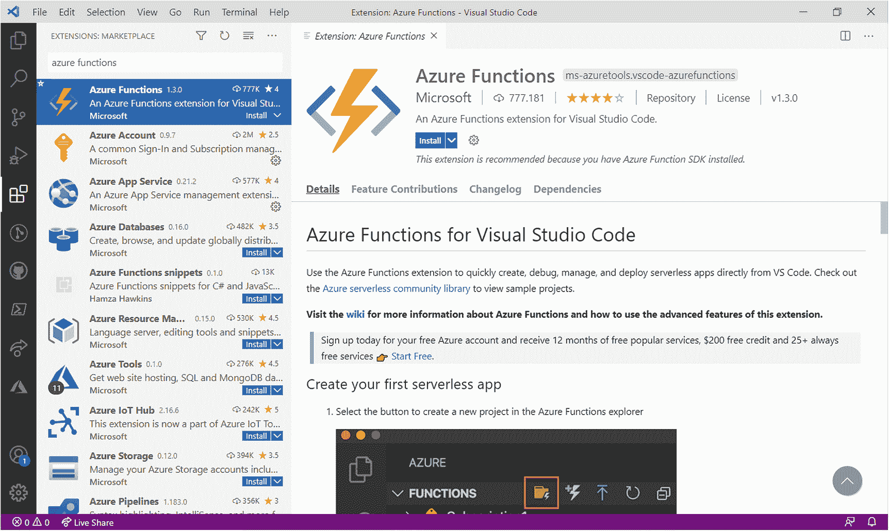

图 11-8

VS 代码的 Azure 函数扩展

Azure Functions 扩展还需要 Azure Account one，您之前已经安装了它。

### 创建 Azure 函数

安装了 Azure Functions 扩展后，VS 代码简化了创建 Azure Functions 项目的方式。对于当前关于部署 Azure 函数的示例，我将展示如何使用内置模板创建函数存根，但是您当然可以使用现有的 Azure 函数项目，这些项目是用其他环境或示例项目创建的。

如果您从新代码开始，您首先需要在磁盘上有(或创建)一个新文件夹，新项目将在其中创建。对于下一个示例，我在磁盘上创建了一个名为 C:\AzureFunctionsDistilled 的文件夹。

当你准备好文件夹后，在 Visual Studio Code中启用命令面板并搜索名为**Azure Functions:Create New Project**的命令(参见图 [11-9](#Fig9) )。

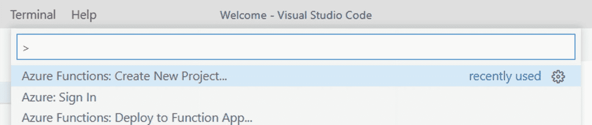

图 11-9

创建新的 Azure Functions 项目

Note

还有另外两个命令可以用来创建函数:**在 Azure 中创建函数 App**和**在 Azure 中创建函数 App(高级)**。这两个命令都允许创建一个在 Azure 订阅中自动提供的项目，以及一个用于开发和调试的本地项目。在本书中，我不使用这些命令是为了更好地突出开发和调试的不同阶段，然后是部署。

单击此命令时，将启动一个八步向导。首先，要求您在磁盘上选择一个目标文件夹，因此选择您之前创建的文件夹。然后要求您选择一种语言。为了与前面的例子保持一致，我选择了 C#，但是您可以随意使用不同的例子。第三步，要求您指定一个运行时平台。如果选择了 C#，向导将显示.NET 版本，您可以选择最新的。

Note

向导会识别.NET 5 as。网络 5(孤立的)。要理解这意味着什么，需要回顾一下之前版本的 Azure Functions。以前，Azure 函数只支持紧密集成的模式.NET 函数，这些函数作为类库在与宿主相同的进程中运行。尽管这种模式提供了宿主进程和函数之间的深度集成，但是这种集成也需要宿主进程和。网络功能。例如，。在进程内运行的. NET 函数需要在同一版本的上运行.NET 作为函数运行时。为了使您能够在这些约束之外运行，您现在可以选择在一个隔离的进程中运行。.NET 5(隔离)意味着现在允许在进程外运行函数。

如果您选择了另一种语言，目标平台列表将根据您选择的语言而变化。

在第四步中，您可以选择一个项目模板(参见图 [11-10](#Fig10) )。

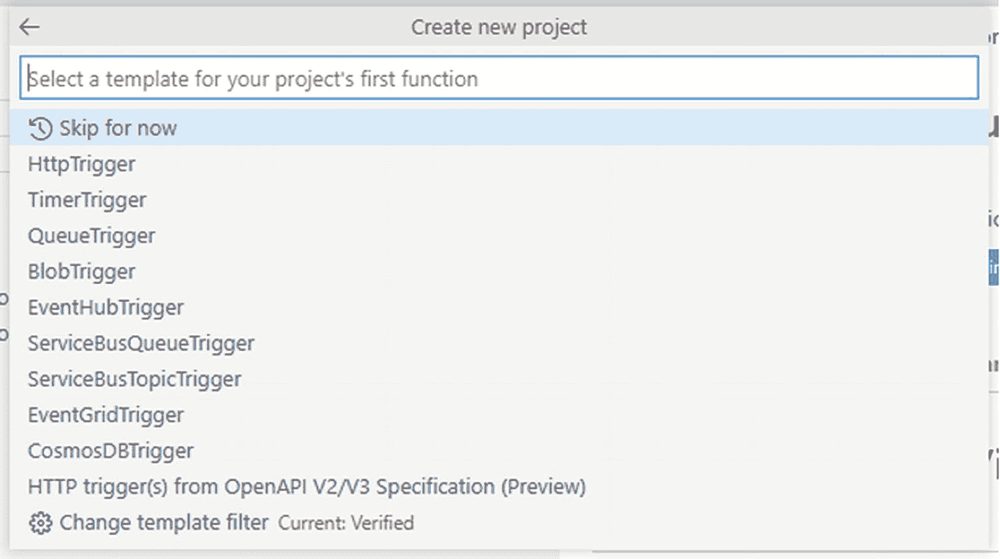

图 11-10

选择 Azure Functions 项目模板

您在这里选择的项目模板与当前示例并不相关，当前示例的目标不是深入 Azure Functions 开发的细节，而是展示构建和部署功能是多么快速和容易。我选择了 HttpTrigger 模板，它生成简单的代码来定义一个函数，当一个 HTTP/HTTPS 请求被拦截时，这个函数在 Azure 上被触发，并发回一个响应。

在第五步和第六步中，首先输入新项目的名称(或者保留默认项目名称，如当前示例中的 AzureFunctionsDistilled ),然后输入将在代码中使用的名称空间。名称空间的形式应该是`CompanyName.Function`；比如我的命名空间是`AlessandroDelSole.AzureFunctionsDistilled`。

在向导的第七步中，您指定一个安全访问级别:**匿名**、**功能**或**管理**。表 [11-2](#Tab2) 提供了每个授权级别的简短描述。

表 11-2

Azure 功能授权级别

<colgroup><col class="tcol1 align-left"> <col class="tcol2 align-left"></colgroup> 
| 

水平

 | 

描述

 |
| --- | --- |
| 匿名的 | 不需要授权；所有 HTTP 请求都通过。 |
| 功能 | 功能授权级别基于 Azure 门户中生成的安全密钥。主机密钥(在应用级别)和功能键(在功能级别)可以作为功能级别的安全密钥。 |
| 管理 | 类似于函数级，但仅适用于主机键(在应用级)。 |

对于当前示例，您可以只选择**匿名**级别。在向导的最后一步，您决定在哪里打开新项目:**当前窗口**(Visual Studio Code的当前实例)，**新窗口**(Visual Studio Code的新实例)，或者**添加到工作区**(新项目被添加到现有文件夹以创建工作区)。选择**当前窗口**，几秒钟后，新项目将可用，您可以根据需要编辑代码(参见图 [11-11](#Fig11) )。

Note

由`FunctionName`属性定义的函数名必须总是小写，否则运行时会抛出异常。在当前示例中，确保从`FunctionName("AzureFunctionsDistilled")`更改为`FunctionName("azurefunctionsdistilled")`。

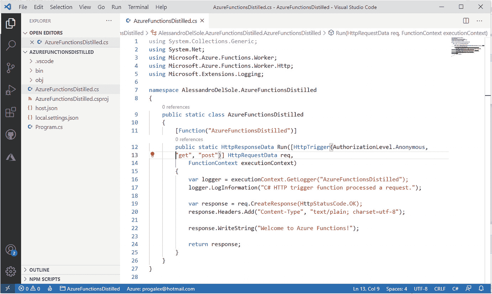

图 11-11

用 VS 代码编辑 Azure Functions 项目

您现在完全在本地工作，这是在将代码提升到 Azure 远程环境之前，在开发环境中调试代码的好机会。按 F5 开始调试，就像你对任何 C#项目所做的一样，几秒钟后，终端不仅会显示编译器输出，还会显示一个本地 URL，你可以用它来测试代码(见图 [11-12](#Fig12) )。

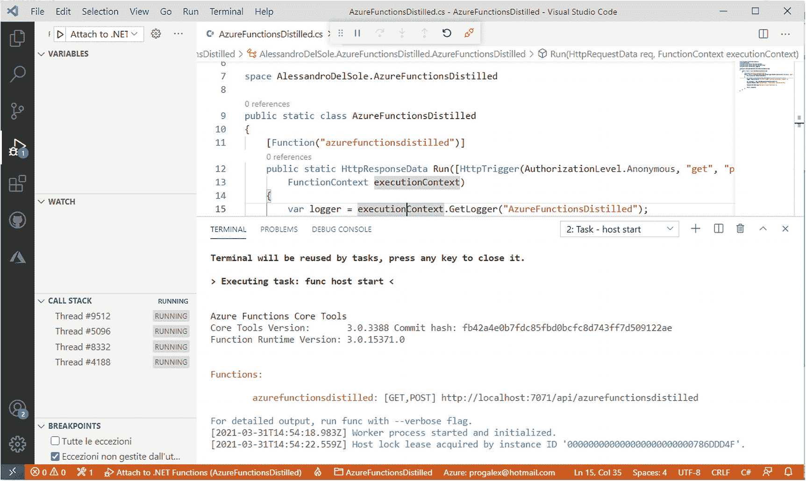

图 11-12

调试 Azure 函数

终端中显示的 URL 如下:`http://localhost:7071/api/azurefunctionsdistilled`。7071 是本地开发服务器的端口，而`azurefunctionsdistilled`是代码中定义的函数的名称(全部小写)，两者都会根据您创建的项目而有所不同。您可以将上述 URL 粘贴到浏览器的地址栏中，然后按 Enter 键。图 [11-13](#Fig13) 显示了在浏览器中运行并监听`HTTP GET`和`POST`呼叫的功能。

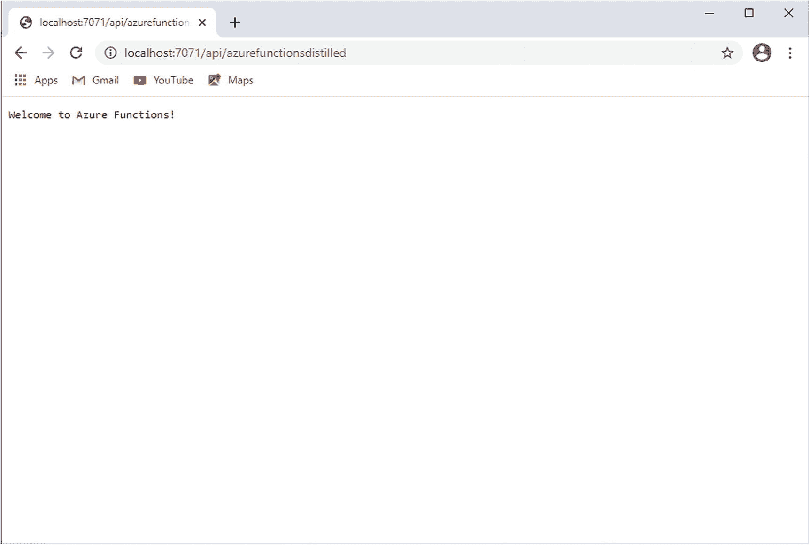

图 11-13

在本地运行 Azure 功能

假设您已经完成了所有的本地开发、调试和测试，您可以将 Azure 功能发布到云中，如下所述。

### 部署 Azure 功能

用 Visual Studio Code将 Azure 函数部署到您的订阅是一件容易的事情。在 Azure 面板的功能区，你可以点击**部署到功能应用**按钮，如图 [11-14](#Fig14) 中高亮显示，或者你可以在功能视图中右击订阅名称，然后选择相同的命令。

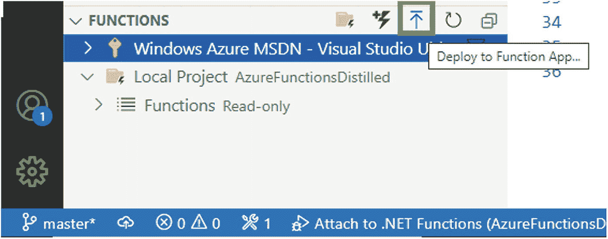

图 11-14

使用部署到功能应用按钮启动部署流程

单击此按钮后，命令面板会显示一个包含三个步骤的快速向导。第一步，指定你是想用默认设置还是用高级设置创建一个新的 Azure Function app(见图 [11-15](#Fig15) )。

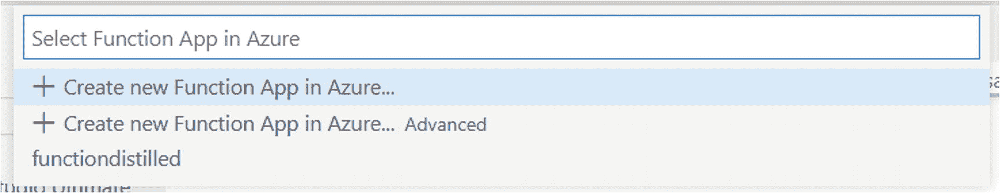

图 11-15

选择默认或高级设置来创建新的功能应用

选择第一个(默认)选项，然后按 Enter 键。系统会再次要求您指定一个唯一的名称(在当前示例中为`azurefunctionsdistilled`)，然后指定目标平台，可用选项取决于您用来构建应用的技术。选择创建项目时选择的同一平台。

Note

您可能会在命令面板中看到接近. NET 版本的(非 LTS)短语。在这篇文章中，是的。净 5(非 LTS)。这个短语的意思是.NET 不支持长期支持(LTS 代表长期支持)。原因是微软计划发布.NET 6，这将为这个新版本提供广泛的支持。

在向导的最后一步，您需要指定一个数据中心位置(参见图 [11-16](#Fig16) )。

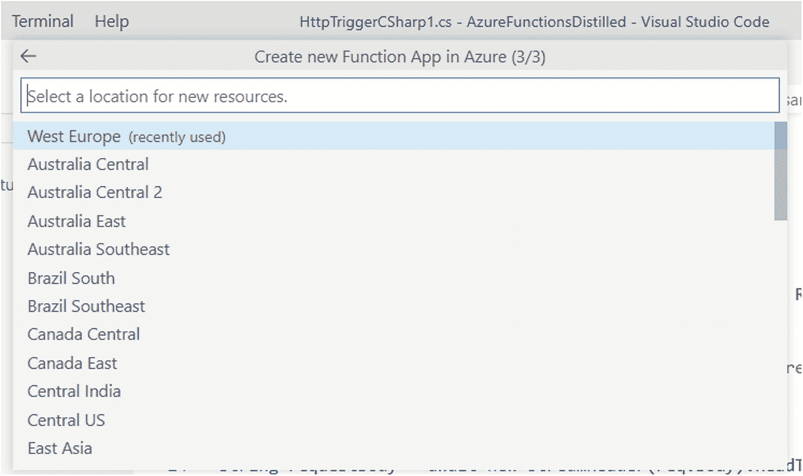

图 11-16

选择数据中心的位置

如果你有 Azure 开发经验，你会知道这是一个至关重要的选择，因为你选择的位置会影响到你的订阅费用。至少对于这个与开发目的相关的示例，请确保您选择了离您的位置最近的数据中心(在我的例子中是西欧)，这意味着更少的延迟和更少的带宽需求以及相应的成本节约，尤其是在您的订阅没有启用支出限制的情况下。

Note

并非所有的 Azure 区域和数据中心都提供相同的服务。对于真实世界的场景，您可能想要查看关于根据您的位置、需求和请求的服务( [`https://azure.microsoft.com/en-us/global-infrastructure/geographies`](https://azure.microsoft.com/en-us/global-infrastructure/geographies) )选择合适的 Azure 区域的官方文档。

此时，Visual Studio Code首先在发布模式下构建项目，然后开始将功能发布到 Azure。您可以在终端中跟踪进度，并通过弹出框显示当前运行任务的名称(参见图 [11-17](#Fig17) )。

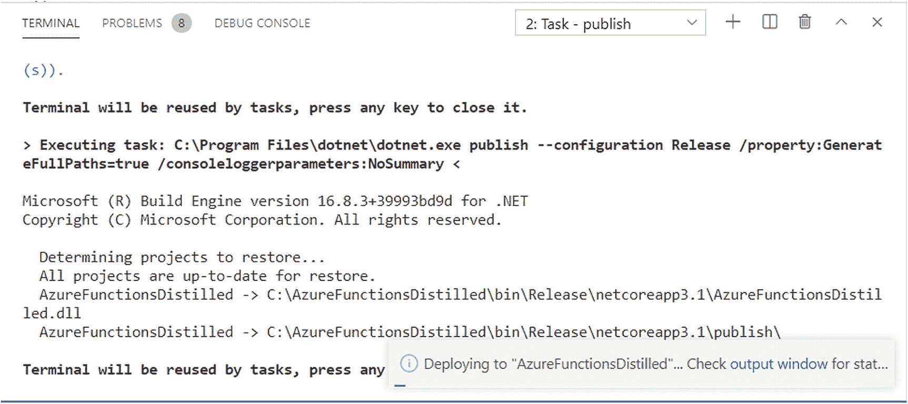

图 11-17

Azure 函数的发布正在进行中

在最后一步之后，该功能将在云中启动并运行，您可以通过在浏览器中打开该功能的 URL 来轻松验证，如图 [11-18](#Fig18) 所示。请记住，函数的 URL 由您在创建项目时提供的惟一名称组成，后面是 azurewebsites.net 域名和/api/ < functionname >部分。对于 Azure 函数，您可以添加触发函数本身所需的查询字符串。在图 [11-18](#Fig18) 中，你可以看到本地使用的相同查询字符串是如何被提供给远程 URL 的。

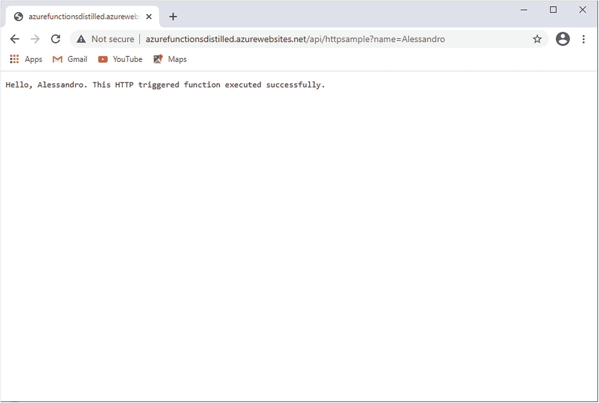

图 11-18

Azure 功能正在云中运行

正如您所看到的，Visual Studio Code不仅使部署 Azure 功能变得非常简单，还使创建项目和直接从环境中与 Azure 订阅进行交互变得非常简单，这提高了整体生产力。

Note

为了避免 Azure 信用的意外费用或消耗，我建议删除所有不再使用的资源，如本章中创建的示例应用。在 VS 代码中，你可以通过在 Azure 侧边栏的应用服务和功能面板(分别)中右键单击它们的名称，然后选择适当的删除命令来快速删除应用和功能。可以在 Azure 门户中删除其他资源。

## 摘要

再一次，Visual Studio Code展示了它的强大和多功能性，即使是基于 Microsoft Azure 的云开发。有了 Azure extensions，您可以直接从环境中访问您的订阅。

通过专门的扩展，如 Azure App Service 和 Azure Functions，您可以通过有限的努力和几次鼠标点击来创建、配置和部署您的 web 应用和功能，从而将管理 Azure 门户中的资源的需求减少到仅在您需要自定义配置的情况下。此外，还支持多种语言和环境，包括.NET Core、Java、Python 和 Node.js，将云开发的可能性扩展到更多的公司和开发者。