# 二、多启动

理解引导装载程序和固件是复杂的。不一定难，题目可以很复杂。为了让本书的读者容易理解，我将使用三个测试系统。

<colgroup><col class="tcol1 align-left"> <col class="tcol2 align-left"> <col class="tcol3 align-left"></colgroup> 
| 

系统编号

 | 

系统名称

 | 

目的

 |
| --- | --- | --- |
| one | 基本输入输出系统 | 演示 BIOS |
| Two | 断续器 | 展示 UEFI |
| three | 贾维斯（m.） | 对于 100 多个操作系统的多重引导项目 |

由于引导加载程序和固件紧密配合，我将从在每个系统上安装特定的操作系统列表开始，同时解释引导加载程序和固件之间的关系。这种方法会让复杂的话题变得更容易理解，更有趣，也更有乐趣。简而言之，我将一起解释引导程序和固件(BIOS/UEFI ),尽管它们是不同的概念。

Note

本章中基于 BIOS 的多重引导部分受到了 Vijay Gokhale 先生关于这个主题的研讨会的启发。我感谢他的启发。

## 操作系统列表

我们将在我们的第一个 BIOS 系统上安装以下操作系统，这意味着在安装了 BIOS 固件的系统上:

*   Sun OpenSolaris 2009

*   Fedora Linux 15

*   PC BSD 9.0

*   Windows 7

*   红帽企业版 Linux 6.0

*   Windows Server 2003 (2k3)

*   Windows XP

我知道这些操作系统很老了，但我选择它们是有原因的。

看，BIOS 本身是一个过时的固件，所以如果你想了解 BIOS，你只能使用旧的操作系统。记住，只有了解 BIOS，才能理解 UEFI(当前固件)。就好像你对 C 很了解，就会更懂 Java 一样。此外，使用这些旧的操作系统将让我有机会接触到 Windows 和 Unix 引导加载程序。此外，它将为我提供解释 Linux 的 GRUB 遗留引导装载程序的机会。

这个想法是用前面提到的所有操作系统多重引导我们的 BIOS 系统。为此，我们需要遵守每个操作系统的规则和规定。

<colgroup><col class="tcol1 align-left"> <col class="tcol2 align-left"></colgroup> 
| 

旧历法

 | 

规则

 |
| --- | --- |
| Unix 操作系统 | Unix 操作系统(OpenSolaris 和 BSD)只能安装在主分区上。 |
| Linux 操作系统 | Linux 没有任何安装规则。它可以安装在任何主分区或逻辑分区上。 |
| Windows 操作系统 | Windows 操作系统可以安装在任何分区(主分区或逻辑分区)上，但是 Windows 系列的前身必须位于第一个主分区上。这意味着您可以在逻辑分区上安装 Windows 7，但它的前身 XP 或 win2k3 必须存在于第一个主分区上。此外，您不能破坏 Windows 操作系统的安装顺序。例如，不能先安装 Windows 7，然后再安装较旧的 win2k3 或 XP。必须是这个顺序:98，然后 2000，然后 XP。 |

花一些时间，尝试准备您的操作系统安装顺序。现在验证您的引导顺序。

操作系统的最终顺序如下所示:

1.  Windows XP

2.  2008 年 Sun OpenSolaris

3.  PC BSD 9.0

4.  Windows 服务器 2003

5.  Windows 7

6.  红帽企业版 Linux 6

7.  Fedora 15

## 安装操作系统

现在我们将讨论安装操作系统。

### 主/逻辑分区

使用 BIOS，我们只能创建四个分区。当然，你可能见过比这更多的分区。所以，让我稍微改变一下我的陈述。在基于 BIOS 的系统上，您只能在磁盘上创建四个*主*分区。如果您想要更多，那么您需要将第四个主分区变成一个*次分区*(也称为*扩展*)分区。扩展分区将作为一个容器工作，在这个容器中，您可以创建任意多的逻辑分区。为什么这些分区被称为逻辑分区，因为它们对 BIOS 是不可见的？还有，为什么 BIOS 只能做四个主分区？这些问题将在我们讨论主引导记录时得到解答。

### 分割

让我们先对 BIOS 系统的硬盘进行分区。为此，我们将使用 GParted live CD。GParted 是来自 GNU 社区的工具。这是一个免费的、开源的、基于 Debian Linux 的实时 ISO 映像。图 [2-1](#Fig1) 显示了我们的 BIOS 系统的分区布局。


图 2-1

GParted 中 BIOS 的分区布局

对硬盘进行分区的操作非常简单。我们将在 75 GB 的磁盘空间上创建如图 [2-2](#Fig2) 所示的分区布局。


图 2-2

GParted-made 分区布局

有关如何使用 GParted 对硬盘进行分区的更多信息，请参考位于 [`https://gparted.org/articles.php`](https://gparted.org/articles.php) 的 GParted 文档。

在图 [2-3](#Fig3) 中，您可以看到磁盘名称、分区大小、使用的文件系统和相关标志(如果有的话)。

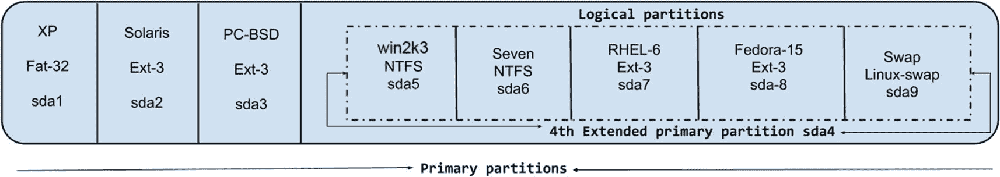

图 2-3

GParted-made 文件系统布局

让我们在第一个主分区上安装第一个操作系统。

### 首次操作系统安装:XP

在图 [2-4](#Fig4) 中，您可以看到 Windows XP 安装程序显示的分区布局。

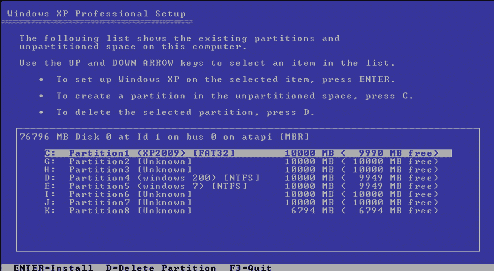

图 2-4

XP 安装程序显示的分区布局

我们正在第一个主分区上安装 XP。Windows 方面，是 C: drive，如图 [2-4](#Fig4) 。完成安装并重启系统后，我们在屏幕上看到了 Windows XP(图 [2-5](#Fig5) )。


图 2-5

成功安装后的 XP

是时候了解 Windows XP 是如何引导的了，但在此之前，我们需要了解引导扇区。*引导扇区*是每个硬盘的第一个扇区(512 字节)加上 31 KB 的空间；换句话说，它是引导介质上的前 63 个扇区(0 到 62)。或者，您可以考虑在引导扇区下，每个分区的一些空间(512 字节+ 31 KB)将被保留来存储与引导装载程序相关的信息。这个空间(还是 512 字节+ 31 KB)不会被操作系统显示给用户。在这个保留空间之后，分区中的实际数据存储开始。参见图 [2-6](#Fig6) 以更好地理解这一点。


图 2-6

基于 BIOS 的系统上的磁盘布局

### 引导扇区

梵语中有一句惊人的谚语是这样说的:。这意味着只有一个真理，但有各种方式达到它。如图 [2-7](#Fig7) 所示，引导扇区有不同的名称，但最终概念是相同的。人们用以下名称来指代这种结构:


图 2-7

引导扇区

*   主引导记录

*   引导记录

*   引导扇区

*   引导加载程序

在本书中，我们称之为*引导扇区*，因为硬盘驱动器(HDD)总是被分成扇区，每个扇区的大小要么是 512 字节，要么是 4 KB。大多数硬盘遵循 512 字节的扇区大小。

在基于 BIOS 的系统上，每个操作系统供应商(不管是 Windows、Unix 还是 Linux)都必须将引导装载程序分成三个部分。bootloader 的第 1 部分将保存在 bootstrap 中，它有 440 个字节。第 2 部分将保存在 bootloader 部分，大小为 31 KB，最后的第 3 部分将保存在安装了特定操作系统的实际分区中。因此，简单地说，每当安装一个操作系统(在我们的例子中是 Windows XP)时，它会将其新技术加载程序(NTLDR)引导程序分成三个部分。

<colgroup><col class="tcol1 align-left"> <col class="tcol2 align-left"> <col class="tcol3 align-left"> <col class="tcol4 align-left"></colgroup> 
| 

位置

 | 

大小

 | 

部分

 | 

信息

 |
| --- | --- | --- | --- |
| 引导程序 | 440 字节 | NTLDR 第 1 部分 | 最微小的部分 |
| 引导装载程序 | 31 KB | NTLDR 第 2 部分 | 与第 1 部分相比更大 |
| 在实际的操作系统分区中 | 没有大小限制 | NTLDR 第 3 部分 | 最大的部分 |

但是为什么 bootloader 要分成三个部分呢？

是因为历史原因。BIOS 有技术上的限制，因为它不能访问超过 512 字节，或者不能读取超过第一个扇区的内容。因此，很明显，当 BIOS 完成它的任务时，它跳到整个硬盘的前 512 个字节，无论是谁，只要运行那个程序。幸运的是，该程序将是我们的引导程序(440 字节)。由于 bootstrap 的大小很小，它只做一件事，那就是跳到一个更大的空间，这就是 part-2 bootloader。大小为 31 KB。这个 31 KB 也非常小，它必须找到一个更大的大小。这个引导装载程序将跳转到 part-3，它位于一个分区内。这个 part-3 文件将位于 C:驱动器，文件名为 NTLDR。XP 的 bootloader 的 part-3 文件在图 [2-8](#Fig8) 中可见。


图 2-8

XP 引导程序的第三部分文件

如您所见，该文件的大小要大得多(245 KB)。这个文件将完成引导加载程序的实际工作，即从内存中的`C:\windows`复制 Windows XP 的内核`winload.exe`(这个文件知道 XP 的内核在哪里)。一旦内核被复制到内存中，引导装载程序的工作就完成了，它就消失了。记住，`OS==kernel==OS`。一旦内核在内存中，它将负责引导序列的其余部分。你可以在图 [2-9](#Fig9) 中看到 XP 的启动顺序。


图 2-9

Windows XP 的引导顺序

我知道你心里可能有很多疑问。但是继续读下去，你所有的问题都会得到解答。让我们继续讨论我还没有解释的引导扇区的字段。这可以参考图 [2-10](#Fig10) 。


图 2-10

引导扇区

供应商签名字段适用于硬盘供应商。这里提到的数据告诉我们哪个供应商制造了这种硬盘，如希捷，西部数据，三星等。因此，基本上它保存了硬盘制造商的信息。

NULL 只有 2 个字节的空间。空就是空的意思。如果这不为空，则 BIOS 将认为该 HDD 在 POST 例程时有故障/损坏，并且引导将被停止。所以，它必须为空。每当操作系统突然重启，或者当操作系统或硬盘本身检测到坏扇区或某种严重损坏时，该字段将被标记为非空。

MBR 字段可能是所有这些字段中最受欢迎的部分。MBR 代表“主引导记录”，大小为 64 字节。MBR 进一步分为四个部分。每个部分的大小是 16 字节，每个部分保存一个分区的信息。

<colgroup><col class="tcol1 align-left"> <col class="tcol2 align-left"> <col class="tcol3 align-left"></colgroup> 
| 

大小

 | 

部件

 | 

商店

 |
| --- | --- | --- |
| 16 字节 | 第一部分 | 第一分区的信息 |
| 16 字节 | 第二部分 | 第二分区的信息 |
| 16 字节 | 第三部分 | 第三分区的信息 |
| 16 字节 | 第四部分 | 第四分区的信息 |

这意味着 64 字节的 MBR 只能容纳 4 个分区条目，这就是为什么在基于 BIOS 的系统上只能创建 4 个主分区的原因。

fdisk 签名也被称为*引导标志*；有些人简单地称它为`*`，或者在 Windows 风格中，它也被称为*活动/非活动标志*。fdisk 在多重引导不同操作系统的情况下很重要，我们现在不讨论这个问题。现在，我要你记住这两条规则:

*   逻辑分区不能是活动的。

*   操作系统无法从逻辑分区启动。

到目前为止，这两条规则对你来说没有任何意义，但是我们会在适当的时候讨论它们。图 [2-11](#Fig11) 显示了 Windows XP 的完整引导序列。


图 2-11

Windows XP 的引导顺序

我们现在将安装并引导一个新的操作系统，即 OpenSolaris 2008。

#### OpenSolaris 2008

图 [2-12](#Fig12) 显示了使用 OpenSolaris 2008 安装介质引导时的屏幕。

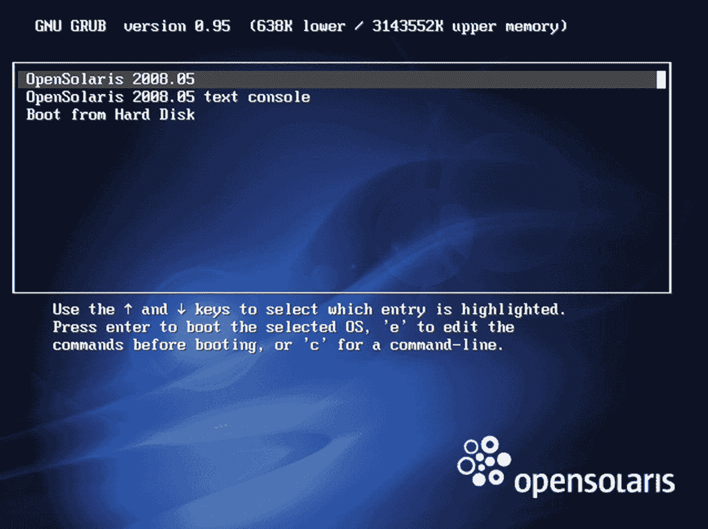

图 2-12

OpenSolaris 2008 安装介质的欢迎屏幕

我们需要在第二个分区上安装 OpenSolaris。您可以在图 [2-13](#Fig13) 中看到，我们已经为安装选择了第二个主分区。

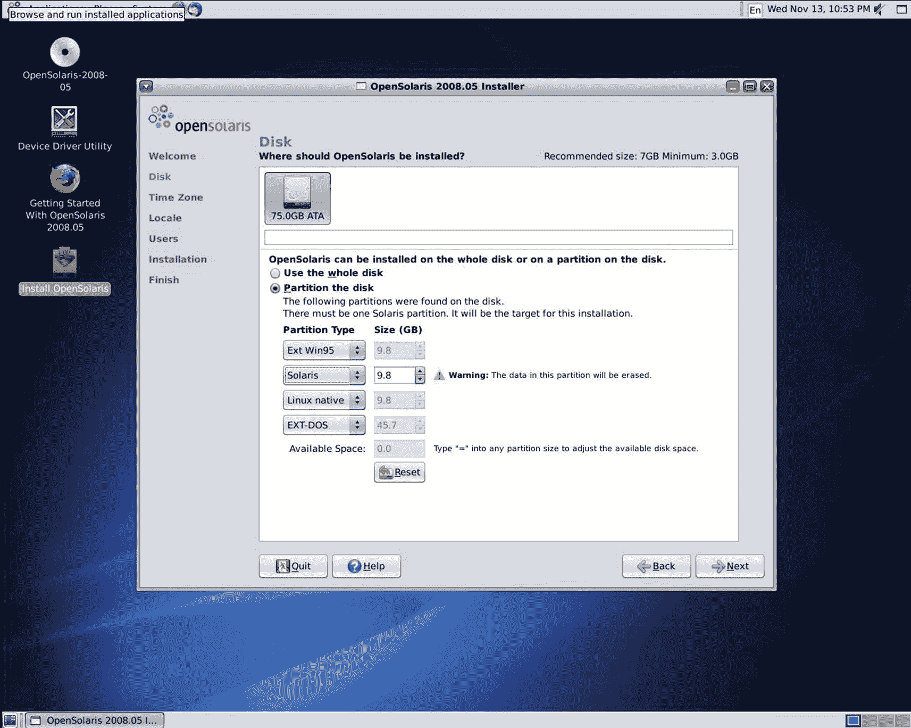

图 2-13

OpenSolaris 2008 安装程序显示的磁盘布局

但是正如您在图 [2-14](#Fig14) 中看到的，安装失败并显示一些错误信息。

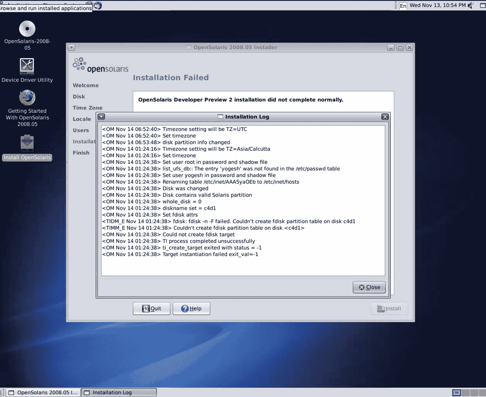

图 2-14

安装失败，并显示一些错误消息。

错误消息与文件系统相关。因此，我们将使用 fdisk 实用程序手动准备文件系统；但是，在此之前，您应该知道 OpenSolaris 已经分配了什么硬盘名称。`pfexec format`命令输出(如图 [2-15](#Fig15) 所示)将为我们提供硬盘名称。


图 2-15

OpenSolaris 分配的硬盘名称

所以，分配的硬盘的名字是 c4d1。我们需要将这个设备名传递给 fdisk 实用程序。参见图 [2-16](#Fig16) 中的完整命令。


图 2-16

fdisk 命令

磁盘名称表示控制器号 4、磁盘号 1 和分区号 0。通过 fdisk 实用程序，我们首先删除了第二个分区(它是 ext3/Linux 本地的)并创建了一个具有 Solaris2 文件系统的新分区。新分区成为分区号 4。此外，它会自动成为活动分区(参见图 [2-17](#Fig17) )。我们还没有谈到“活动或 fdisk 签名”部分，但我们很快就会谈到它。


图 2-17

通过 fdisk 命令所做的更改

回到我们的安装，让我们重新开始安装，如图 [2-18](#Fig18) 所示，这次我们选择了 OpenSolaris 文件系统格式的分区来安装我们的 OpenSolaris 2008。

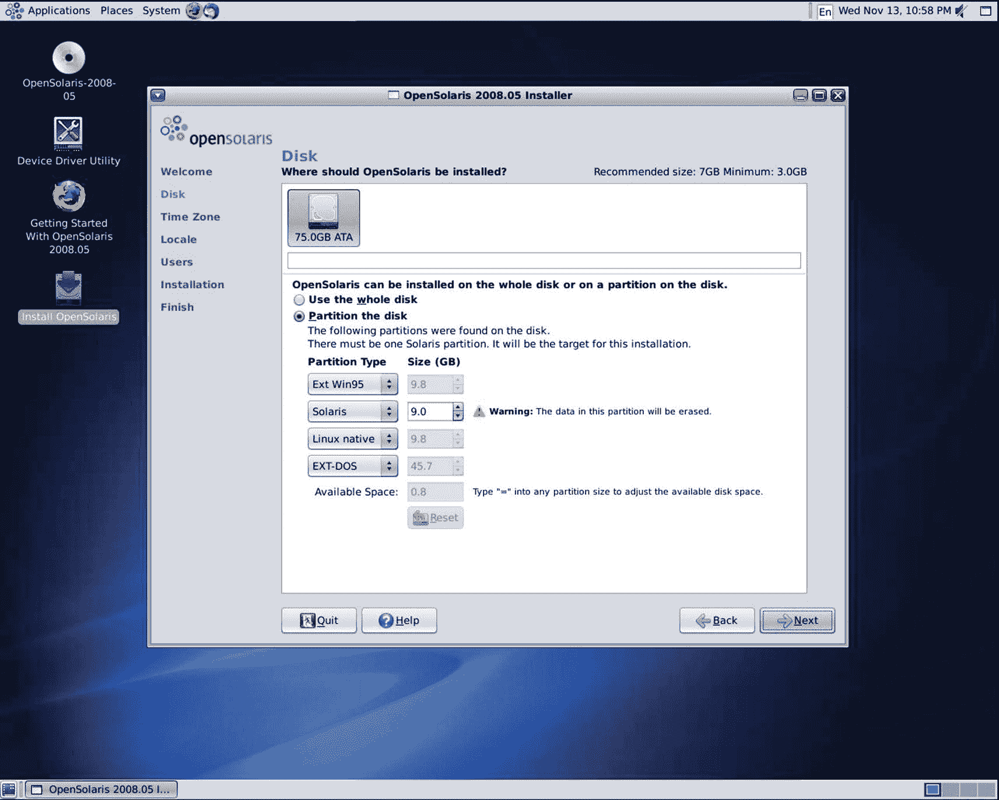

图 2-18

在 OpenSolaris 文件系统分区上安装 OpenSolaris

这一次，安装不会失败(参见图 [2-19](#Fig19) )，OpenSolaris 2008 将被安装。


图 2-19

安装程序不会失败

安装后，我们将重新启动我们的 BIOS 系统。你认为什么操作系统会启动？

*   Windows XP？

*   OpenSolaris？

*   XP 和 OpenSolaris 一起？

*   没有吗？

在继续之前，花点时间思考一下....

图 [2-20](#Fig20) 显示了重启后我们在屏幕上看到的内容。


图 2-20

重启后的欢迎屏幕

这里启动的操作系统是 OpenSolaris，它也为我们提供了启动 XP 的选项。让我们来解释一下背景中发生了什么。OpenSolaris 发现它被安装在自己的分区(第二个分区)中，但是在第一个分区中还有另一个可用的操作系统，即 Windows(或者至少是一个“非 Unix 操作系统”)。

但是 OpenSolaris 如何知道在第一个主分区上安装了另一个操作系统呢？

当 OpenSolaris 安装在它自己的分区中时，它看到 fdisk 签名设置在第一个主分区上。(同样，fdisk 签名也被称为*活动标志*或简称为`*`标志。)正如我们在前面的引导扇区规格图(图 [2-21](#Fig21) )中看到的，每个分区都有 512 字节+ 31 KB 的空间保留用于引导，这些空间对用户是隐藏的。


图 2-21

引导扇区

换句话说，当我们通过 GParted 创建一个分区布局时，该工具为每个分区创建了以下区间:

1.  引导程序

2.  供应商签名

3.  空

4.  主引导记录

5.  Fdisk 签名

6.  引导加载程序

但是它只在供应商签名和 MBR 字段中填充数据。供应商签名字段将包含 HDD 供应商的数据，而对于 MBR 字段，数据如下:

*   第一个主分区的开始和结束

*   第二主分区的开始和结束

*   第三个主分区的开始和结束

*   第四个主分区的开始和结束

基本上会有四个条目，每个条目会消耗 16 个字节。除了供应商签名和 MBR，其他字段将为空。另外，请注意 GParted 将准备所有的区间(512 字节+ 31 KB ),但是将只填充第一个主分区的供应商签名和 MBR 字段。

回到 fdisk 签名字段，当安装 Windows XP 时，它建立了以下内容:

*   引导中的 NTLDR 的第 1 部分

*   引导程序中 NTLDR 的第 2 部分

*   第一个主分区中 NTLDR 的第 3 部分

然后，它在自己的分区(2 字节)中设置 fdisk 签名。

因此，磁盘布局将如图 [2-22](#Fig22) 所示。


图 2-22

XP 安装后的磁盘布局

OpenSolaris 找到了这个磁盘布局。当 OpenSolaris 安装完成并希望安装其引导加载程序(GRUB)时，它在第一个主分区上看到一个星号(`*`)，这时它意识到已经安装了一个 Windows 操作系统。现在 GRUB(OpenSolaris 引导加载程序)有两个选项。


图 2-23

OpenSolaris 安装后 GParted 中的磁盘布局

*   将 Grand Unified Bootloader (GRUB)的 part-1 (bootstrap)和 part-2 (bootloader)安装在第一个主分区中，将 GRUB 的 part-3 安装在自己的分区中(已安装 OpenSolaris 的第二个分区)。

*   或者把 part-1 (bootloader)安装在自己分区的前 512 字节，part-2 安装在自己分区的 31 KB，part-3 也安装在自己分区；然后将`*`放到自己的第二个分区上(参见图 [2-23](#Fig23) )。

请注意，引导标志回到 OpenSolaris 分区。另外，GParted 不理解 Solaris2 分区；因此，它将 ext3 显示为文件系统名称。

如果 OpenSolaris 选择选项 1，则 OpenSolaris 必须清除 Windows XP 的引导加载程序的第 1 部分和第 2 部分。这也意味着只有 OpenSolaris 会启动，而 XP 将永远无法启动。因此，OpenSolaris 选择了选项-2，给予了引导 Windows XP 的同等机会。OpenSolaris 还在它自己的一个文件中创建了一个 Windows XP 条目(我们将在本章后面讨论这个文件)。每当 OpenSolaris 启动时，GRUB 将引用该文件，并在其中找到 Windows 条目，这将显示在屏幕上。图 [2-24](#Fig24) 显示了 OpenSolaris 欢迎屏幕。


图 2-24

OpenSolaris 欢迎屏幕

因此，OpenSolaris 的完整引导序列如下:


图 2-26

OpenSolaris 欢迎屏幕

1.  打开系统电源。

2.  CPU 跳转到 BIOS。

3.  BIOS 运行 POST 程序。

4.  我们回到 BIOS。

5.  BIOS 有点笨；它将检查用户设置的启动优先级。
    *   当我说*启动优先级*时，我指的是系统将通过哪个设备启动。

    *   它可以是光驱、USB、硬盘、PXE 等。

6.  BIOS 将跳转到整个硬盘的前 512 个字节或引导设备的第一个扇区。
    *   引导设备可以是任何东西，但现在我们正在考虑硬盘。

7.  BIOS 会将控制权移交给引导程序中存在的任何二进制文件。
    *   你认为那里有谁？Windows bootloader (NTLDR)还是 OpenSolaris (GRUB)？想一会儿再继续。

    *   前 512 字节存储的引导扇区是 Windows XP 的 NTLDR。

    *   你一定注意到了 440 字节的引导空间非常小，没有任何代码可以从中引导操作系统。因此，NTLDR (bootstrap)的 part-1 只是跳转到更大的空间，也就是 part-2(boot loader/31kb/虚拟引导记录)。第 2 部分检查 MBR (64 字节)并在其中找到四个条目。这意味着磁盘有四个主要分区。但是这里有一个问题:在四个主分区中，哪个分区有操作系统？你可能会说，当然，它是第一和第二分区，但是引导装载程序怎么知道操作系统在哪里呢？又该引导哪个呢？这是一个真正的问题，为了解决这个问题，创建了 fdisk 签名字段。无论哪个分区填充或设置了这两个字节，该分区都有一个操作系统。因此，当安装 Windows XP 或 OpenSolaris 时，该操作系统有责任填充 fdisk 签名字段的 2 个字节，或者在其自己的分区上设置`*`,以便引导加载程序知道哪个分区有该操作系统。在我们的例子中，`*`在它的第二个分区上(OpenSolaris 在安装它的时候保存了它)。这就是 NTLDR 的 part-2 如何知道它必须跳转到第二个分区。

8.  NTLDR 的 Part-2 跳转到第二个分区，这意味着它只是跳转到第二个分区(bootstrap)中 GRUB bootloader 的 part-1。

9.  GRUB 的第 1 部分(bootstrap/440 bytes)也很小，所以它将再次跳转到一个更大的空间，这是 GRUB 的第 2 部分(bootloader)。

10.  Part-2 knows where part-3 is. The location of part-3 will be hard-coded in part-2, so it will simply jump to part-3\. Part-3 will read the text file `/rpool/boot/grub/menu.lst` (see Figure [2-25](#Fig25)); this is the same file that was created by OpenSolaris when it detected XP on the first primary.

    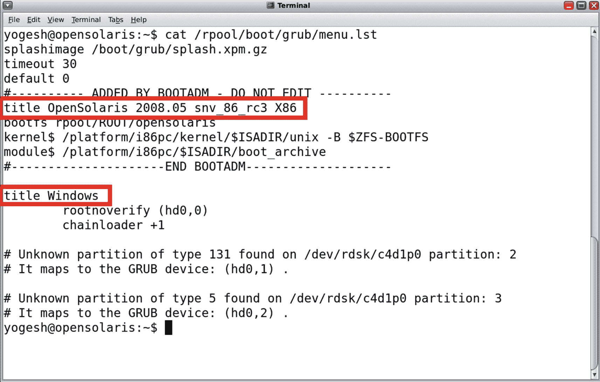

    图 2-25

    OpenSolaris menu.lst 文件

11.  GRUB 的第 3 部分将读取这个文本文件，并打印出在`'title`变量后写入的任何内容，这就是我们如何到达图 [2-26](#Fig26) 所示的屏幕。

图 [2-27](#Fig27) 显示了 OpenSolaris 的完整引导序列。


图 2-27

OpenSolaris 引导序列

如果用户选择 OpenSolaris 选项来引导，那么 OpenSolaris GRUB 的第 3 部分知道 OpenSolaris 的内核在哪里，它在`/boot`目录中。GRUB 会将内核从`/boot`复制到内存，并将控制权交给内核。这是 GRUB 引导装载程序的任务结束的地方，它就消失了。现在 OpenSolaris 的内核将负责引导序列的其余部分。我们将在第四章[中讨论内核。](04.html)

如果用户选择 Windows XP 选项来引导，那么 OpenSolaris GRUB 的第 3 部分将跳回到 NTLDR(引导)的第 1 部分。NTLDR 的第 1 部分将跳转到 NTLDR 的第 2 部分。第二部分将跳转到第三部分。NTLDR 的第 3 部分将在内存中加载`winload.exe`。`winload.exe`文件知道 XP 的内核在哪里。它最终会被 NTLDR 复制或加载到内存中。一旦内核在内存中，NTLDR 的工作就完成了(记住，kernel=OS=kernel)。由于 XP 的内核在内存中，它将负责引导序列的其余部分。

#### PC BSD 9.0

引导标志在 OpenSolaris 分区上，所以现在我们将安装 PC-BSD 9.0。在图 [2-28](#Fig28) 中，PC-BSD 的安装程序显示了可以安装 PC-BSD 9.0 的分区数量。

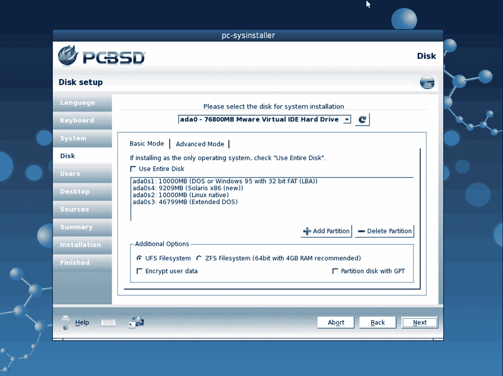

图 2-28

分区的数量

如您所见，BSD 中的硬盘命名约定与早期的操作系统不同。我们需要在第三个分区上安装 BSD，也就是 ada0s2。它代表“0 号适配器和 2 号片”切片可以被认为是一个分区。图 [2-29](#Fig29) 显示了磁盘布局和磁盘命名惯例。

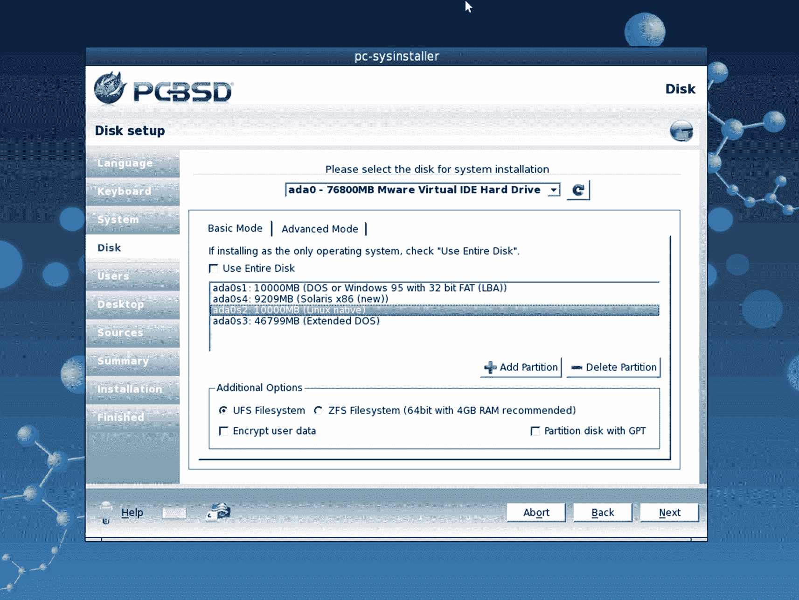

图 2-29

磁盘布局和磁盘命名约定

将`the ada0s2`空间分配给`/`(根文件系统)。图 [2-30](#Fig30) 显示了 PC-BSD 9.0 的分区布局。您还会注意到 BSD 的文件系统是`UFS`，这是 Unix 文件系统。

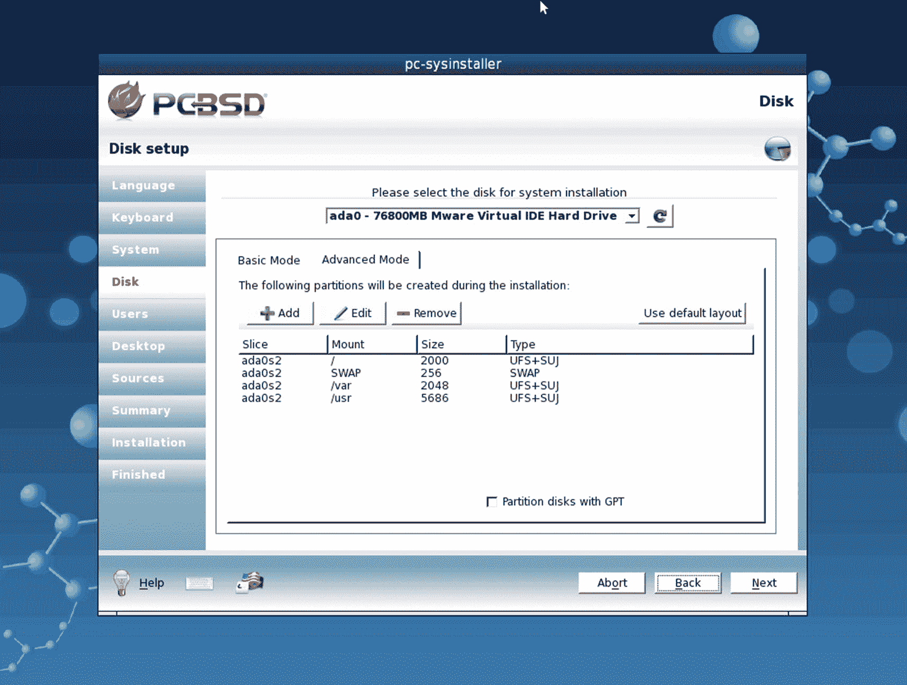

图 2-30

PC-BSD 9.0 的分区布局

安装完成后，系统将重新启动。现在花点时间想想哪个操作系统会启动。

会是以下哪一个？

*   OpenSolaris，这将给它一个引导 Windows 和 BSD 的机会

*   会不会是 PC-BSD，这样就有机会启动另外两个操作系统？

*   会是 PC-BSD 一个人吗？

*   会不会只有 Windows XP？

*   会是 OpenSolaris 一个人吗？

*   还是没有操作系统可以启动？

请访问早期操作系统的引导流程图，并尝试提出自己的引导顺序。

正如您在图 [2-31](#Fig31) 中看到的，将要引导的操作系统是 OpenSolaris，这将创造一个仅引导 Windows 的机会。

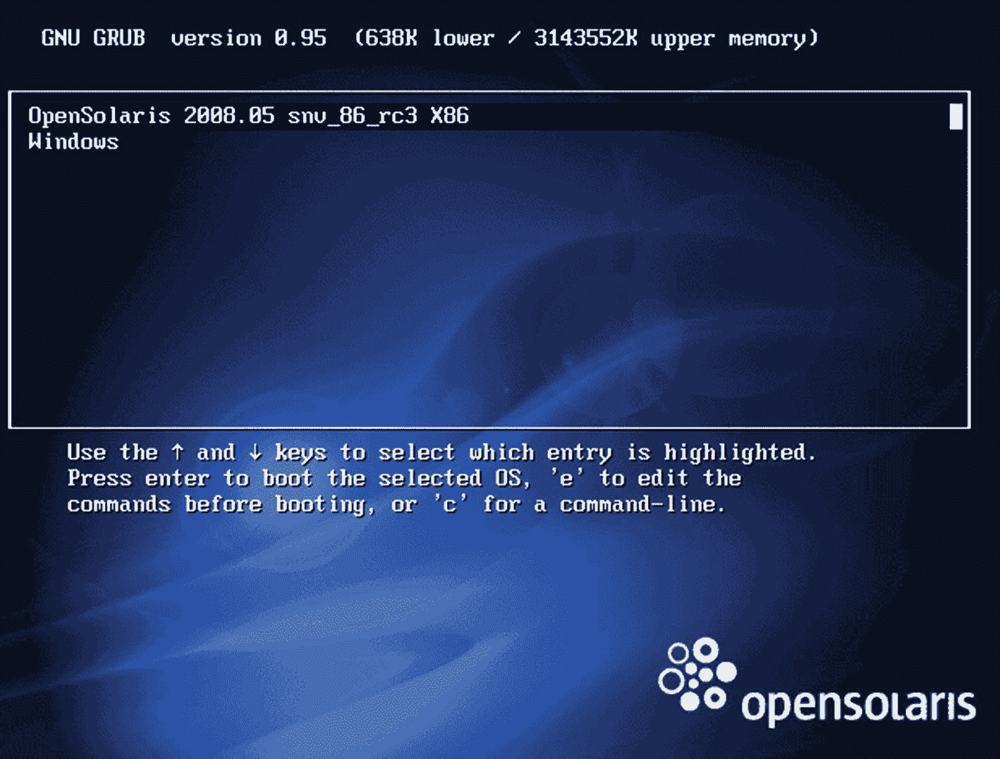

图 2-31

PC-BSD 无法启动。

PC-BSD 无法启动。在进入下一页之前，再次花些时间想想发生了什么

你是对的——PC-BSD 可能没有将`*` /boot flag/fdisk 签名保存在自己的分区上。我们来看看是不是这样。我们将使用 GParted 启动(图 [2-32](#Fig32) )并验证我们的理论。

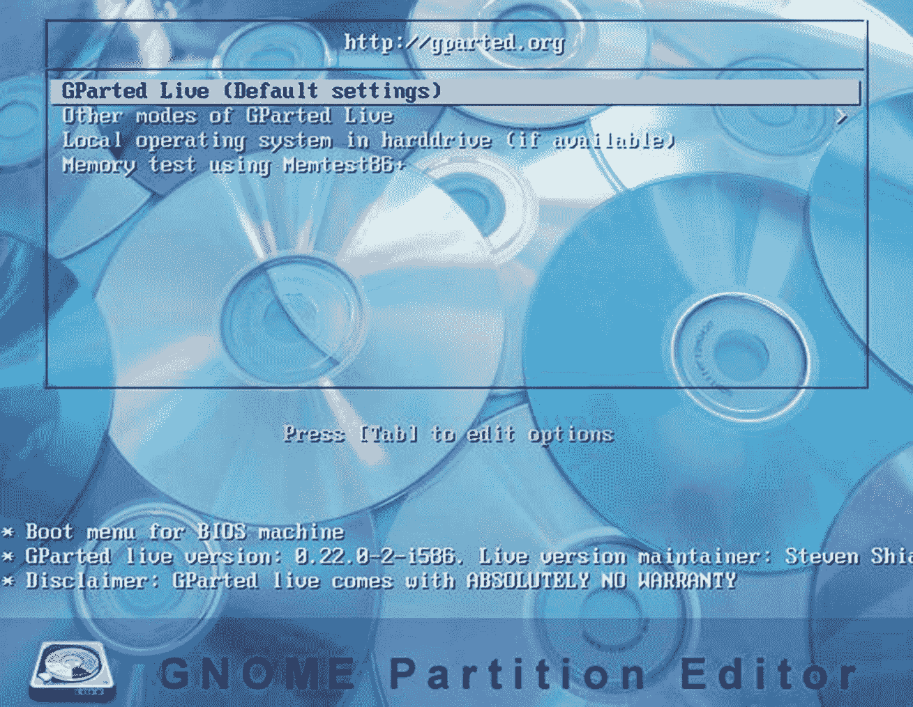

图 2-32

GParted 欢迎屏幕

如图 [2-33](#Fig33) 所示，PC-BSD 并没有在自己的分区上设置`*`。

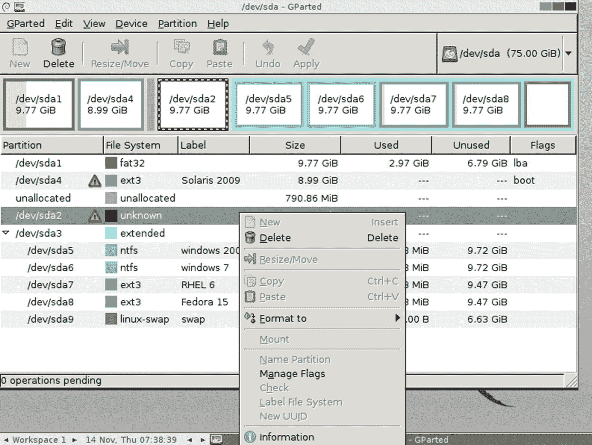

图 2-33

GParted 上的磁盘布局

因此，引导顺序如图 [2-34](#Fig34) 所示。

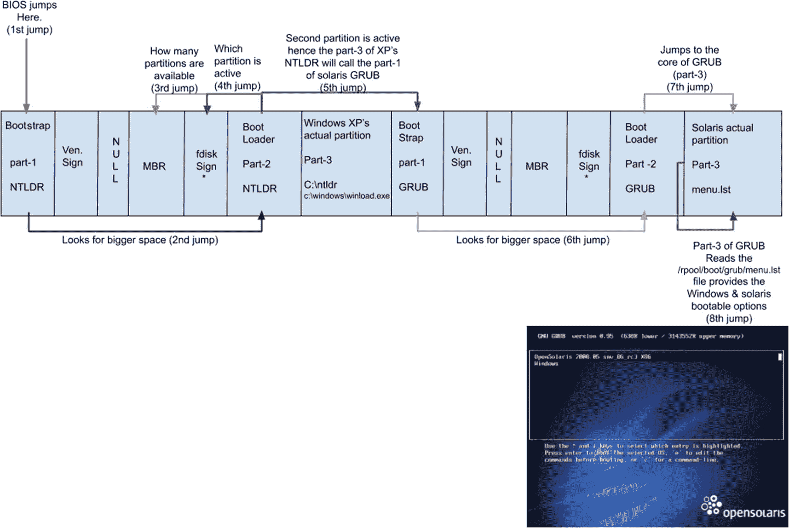

图 2-34

启动顺序以及 PC-BSD 无法启动的原因

这意味着 OpenSolaris 不知道 BSD 安装在第三个分区上。因此，PC-BSD 条目不在 OpenSolaris 中。如果我们在 BSD 的分区上保留引导标志会怎么样？它能启动吗？但是我们如何在第三个分区上保留引导标志呢？很简单——GParted 给了我们这个选择。右键单击第三个分区，选择引导标志，如图 [2-35](#Fig35) 所示。

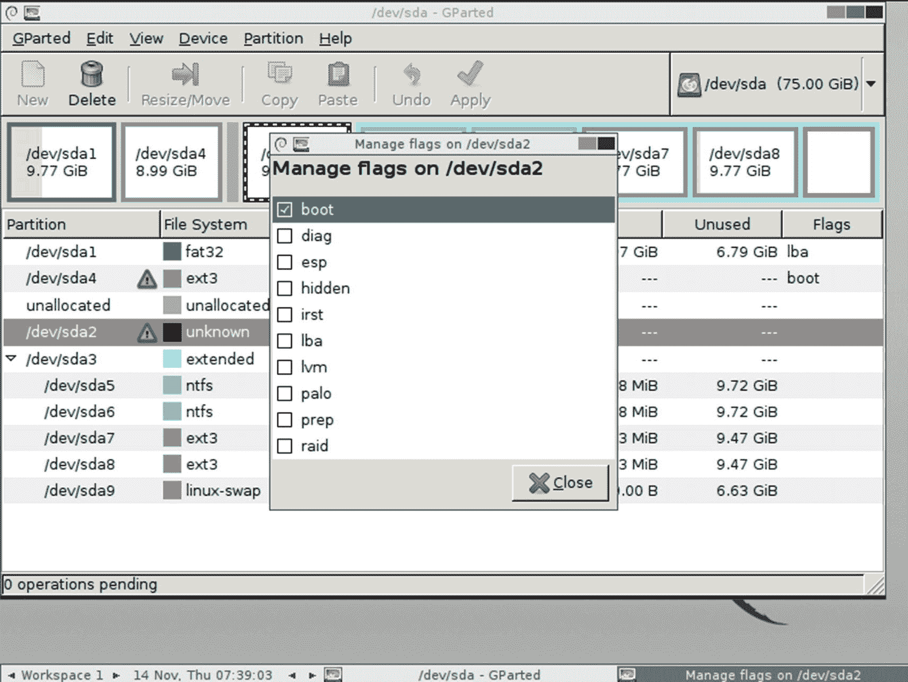

图 2-35

在 PC-BSD 上设置引导标志

图 [2-36](#Fig36) 显示了在 BSD 的第三个分区上设置引导标志后磁盘布局的样子。


图 2-36

磁盘布局

现在你认为哪个操作系统会启动？

*   单独 PC-BSD？

*   PC-BSD，这将有机会引导所有其他操作系统？

*   同样是 OpenSolaris，它会创建一个引导 Windows 的选项。

*   单单 OpenSolaris？

*   单单 Windows XP？

图 [2-37](#Fig37) 显示答案；重新启动后，只有 PC-BSD 会启动，它不会提供启动任何其他操作系统的选项。


图 2-37

PC-BSD 的欢迎屏幕

让我们试着理解一下 PC-BSD 是如何成功引导的。


图 2-38

PC-BSD 的引导序列

1.  打开系统电源。

2.  BIOS 执行 POST 程序。开机自检检查硬件运行状况，如果一切正常，会发出一声正常的蜂鸣声，然后返回 BIOS。

3.  BIOS 是哑的，它只是跳到整个硬盘的第一个扇区，这是 Windows XP 的引导程序。

4.  XP 的 part-1 (NTLDR)跳转到更大的空间，这是 NTLDR(boot loader)的 part-2。引导装载程序检查 MBR，发现有四个主分区，但是哪个是活动的呢？为了检查这一点，引导装载程序检查第一个主分区的 fdisk 签名，该签名没有设置，因此它检查第二个分区的引导标志，该标志也没有设置。因此，它跳转到第三个分区，在那里找到启动标志集。NTLDR 的 bootloader(第 2 部分)跳转到 BSD 的分区并运行 BSD 的 bootloader 的引导程序。BSD 的引导程序是 BTX，代表引导扩展。BTX 跳到第二部分，最后跳到第三部分。BTX 的第三部分知道 BSD 的内核在哪里。BTX 的第 3 部分复制内存中 BSD 的内核映像，这是 BTX 停止的地方，PC-BSD 开始引导并向我们显示一个欢迎屏幕。图 [2-38](#Fig38) 显示了 PC-BSD 启动顺序的流程图。

BSD 引导的有趣之处在于，当安装 PC-BSD 时，它在第二个分区(OpenSolaris 分区)上找到了引导标志。现在 BSD 有三个选择。

1.  将引导标志保留在它自己的第三个分区上。

2.  将引导标志保留在它自己的第三个分区上，并在它的一些文件中创建一个 OpenSolaris 条目。

3.  保留第二个分区上的引导标志。

如果 BSD 选择第一个选项(a)，那么只有 BSD 能够引导，这对其他安装的操作系统是不公平的。我们希望 BSD 选择第二个选项(b ),因为它公平地引导其他操作系统，但是 BTX 是一个旧的引导程序，它没有能力多重引导其他操作系统。因此，BSD 选择第三个选项(c)。因此，只有 OpenSolaris 在引导，它提供了引导 XP 的选项。记住，XP 没有启动。只有 OpenSolaris 在引导，通过读取`menu.lst`文件，它给出了引导 XP 的选项。这也意味着 BSD 自己选择不引导。

如果我们回到 Windows XP 的第一个分区上保留引导标志会怎么样？那会引导哪个 OS 呢？在图 [2-39](#Fig39) 中，我们做到了这一点。

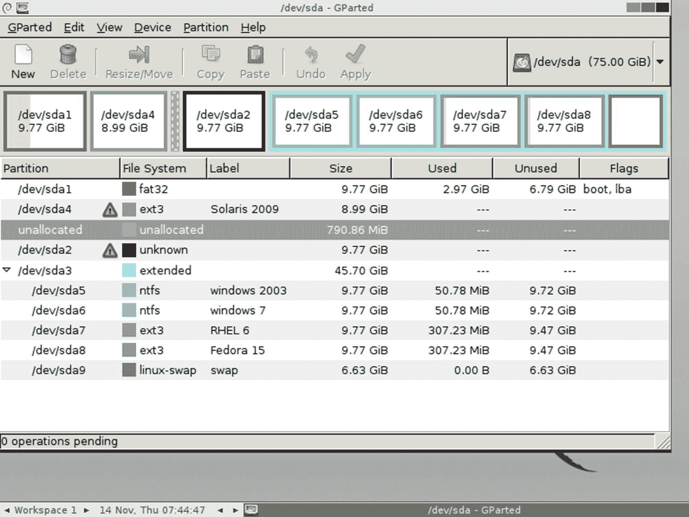

图 2-39

PC-BSD 的引导序列

只有 Windows XP 会启动，启动顺序很简单。图 [2-40](#Fig40) 解释了 Windows XP 是如何启动的。


图 2-40

Windows XP 的引导顺序

在安装新操作系统之前，我们需要将引导标志从 BSD 的第三个分区移动到 OpenSolaris 的第二个分区。图 [2-41](#Fig41) 显示了从 XP 分区到 OpenSolaris 分区的更改后的引导标志。


图 2-41

GParted 中的磁盘布局

通过这一更改，OpenSolaris 将开始引导，同时，Windows XP 也将引导，但 BSD 将无法引导。那么，这是否意味着每次我们引导 BSD 时，我们都必须将引导标志放回 BSD 的分区？到目前为止，是的，但是我们将在引导加载器的帮助下自动完成所有这些。

#### Windows 服务器 2003

如图 [2-42](#Fig42) 所示，我们将在第一个逻辑分区上安装 Windows Server 2003 (win2k3)。对于 win2k3，它是一个 D:驱动器。

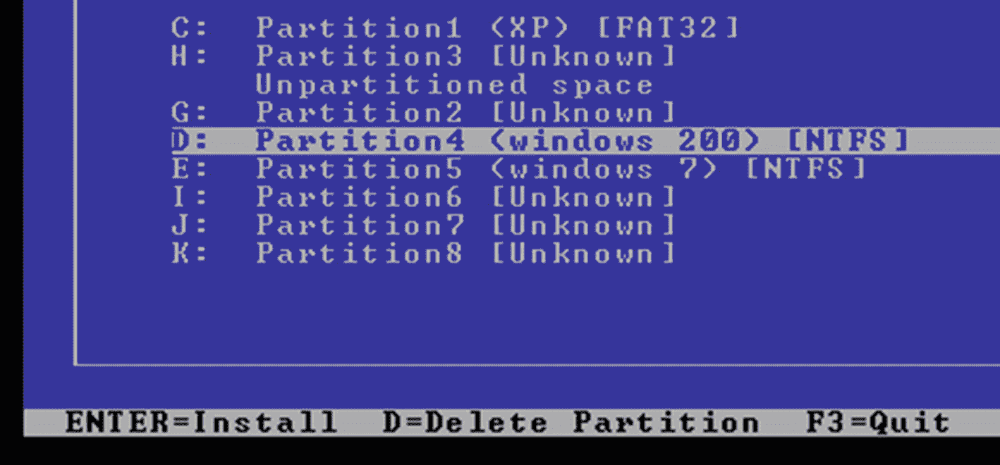

图 2-42

win2k3 安装程序显示的磁盘布局

安装完成后，你认为哪个操作系统会启动？

*   单独 win2k3？

*   win2k3 会提供每隔一个操作系统启动的选项吗？

*   win2k3 和 OpenSolaris 一起？

*   PC BSD？

*   单独 XP？

*   win2k3 和 XP？

在继续之前，想一想，想出自己的答案。

如图 [2-43](#Fig43) 所示，将要引导的 OS 是 win2k3。


图 2-43

重启后 win2k3 的欢迎屏幕

并且 win2k3 给出了启动 Windows XP 的选项。这意味着只有 Windows 系列操作系统正在启动。还有，这里有一些我们应该考虑的问题:

*   现在开机旗在哪里？

*   如果我们在第二个分区上保留引导标志，将引导哪个操作系统？

*   如果我们在第三个分区上保留引导标志，将引导哪个操作系统？

*   如果我们在逻辑分区(win2k3 的分区)上保留引导标志，会引导哪个 OS？

*   有没有办法只开机 Windows XP？

在接下来的讨论中，你会得到这些问题的所有答案。

这里有一点很清楚:win2k3 是唯一正在引导的操作系统。在讨论它如何引导之前，我们需要检查它在磁盘上创建了什么场景才能成功引导。

当 win2k3 被安装时，它看到它被安装在一个逻辑分区上，并且引导标志在 OpenSolaris 分区上(参见图 [2-44](#Fig44) )。


图 2-44

安装 win2k3 时的磁盘布局

为了引导，win2k3 必须将引导标志放在它自己的分区上，方法是在它自己的 512 字节+ 31 KB 中安装它的引导加载程序(同样是 NTLDR 的)part-1 和 part-2。但是这里有一个问题。你还记得我们在 Windows XP 安装时看到的规则吗？

*   逻辑分区不能是活动的。

*   操作系统无法从逻辑分区启动。

由于这两条规则，win2k3 无法在自己的分区上保留引导标志，最终无法从逻辑分区引导。图 [2-45](#Fig45) 显示了 win2k3 无法从逻辑分区引导的引导顺序。但是这样的规则是出于什么原因呢？


图 2-45

win2k3 的引导序列，如果它试图从逻辑分区引导

很简单:MBR 只有四个条目，如下:

*   第一主= sda1

*   第二主= sda2

*   第三原色= sda3

*   第四个主分区=扩展分区(非逻辑分区)= sda4

win2k3 分区是 sda5。换句话说，它是 SATA 磁盘 a(第一个)和分区号 5。由于 MBR 没有逻辑分区的条目，XP 的 NTLDR 的 part-2 不知道还有第五个分区可用。所以，即使 win2k3 把引导标志保存在自己的分区上，XP 的 NTLDR 也看不到。因此，win2k3 永远不会启动。现在，为什么 MBR 不能有超过五个条目？这是因为 64 字节只能存储四个条目。为什么不增加 MBR 的大小？实际上，即使开发者想增加 MBR 的大小，他们也不能。当我们在本章后面讨论 UEFI 固件时，你就会明白原因了。

现在这已经成为 win2k3 的鸡和蛋的问题。它想要引导，但是为此它必须在它自己的分区上保留引导标志，但是如果它这样做了，那么 BIOS 就看不到那个分区。我们如何解决这个问题？

一些了不起的开发人员已经解决了这个问题，无论是谁想出这个主意，都只是一个传说。win2k3 在第一个主服务器上传输其 NTLDR 引导加载程序，这意味着 part-1、part-2 和 part-3。这也意味着 win2k3 将删除所有的 XP NTLDR 的部分，因为空间(512 字节+ 31 KB)很小，两个引导加载程序都放不下。(这里有一个甜蜜点，叫做 VBR，不在本书讨论范围之内。)但是，在删除的同时，XP 的 bootloader win2k3 将 XP 的条目制作在它的一个文本文件中，并保存在第一个主分区。文件名为`boot.ini`，如图 [2-46](#Fig46) 所示。

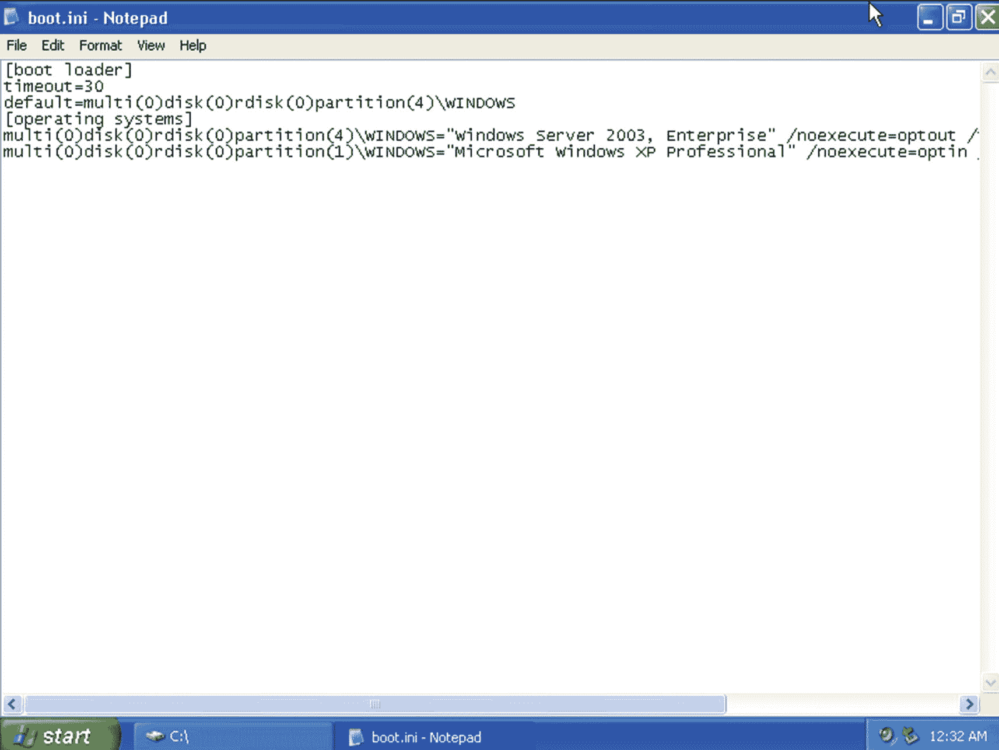

图 2-46

boot.ini 文件

这样做时，win2k3 只在第一个主分区上保留引导标志。这就是 win2k3 的启动方式:


图 2-48

win2k3 的 NTLDR 第三部分文件的大小

1.  打开系统电源。

2.  CPU 进入 BIOS。BIOS 运行开机自检。

3.  开机自检，硬件发出正常的蜂鸣声并返回 BIOS。

4.  BIOS 跳转到第一个主分区的第一个 512 字节。

5.  将启动引导程序，这是 win2k3 的 NTLDR 的第 1 部分。

6.  第 1 部分将寻找 NTLDR 的第 2 部分。

7.  第 2 部分将检查 MBR 并检查 fdisk 签名。

8.  fdisk 签名设置在第一个主分区上，这意味着 part-2 将跳转到 XP 的第一个主分区内，并将运行 win2k3 的 NTLDR 的 part-3。只是给你一个想法，第 3 部分是新的，而不是 XP 的旧 NTLDR。这里我提供两张图片。
    *   Note the size of NTLDR (part-3) in Figure [2-47](#Fig47). This is when we installed Windows XP.

        

        图 2-47

        Windows XP 的 NTLDR 第三部分文件的大小

    *   在图 [2-48](#Fig48) 中，注意安装 win2k3 后 NTLDR (part-3)的大小。

正如你所看到的，Windows XP 的 NTLDR 的第 3 部分是 245 KB，但现在有了 win2k3 它是 291 KB。


图 2-50

Windows XP 的引导顺序

1.  Part-3 of NTLDR (win2k3) will read the `boot.ini` file from the same partition (the first primary) and will print whatever is written in quotes. Figure [2-49](#Fig49) shows what will be printed on the screen.

    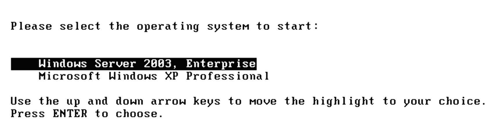

    图 2-49

    win2k3 显示的欢迎屏幕

2.  如果用户选择 Windows Server 2003 企业选项，那么 win2k3 的 NTLDR 的 part-3 就知道 win2k3 的内核在哪里。这是在安装了 win2k3 的第五个分区。它在内存中复制内核，win2k3 的 NTLDR 不了了之。

3.  如果用户选择了 Microsoft Windows XP Professional 选项，那么 NTLDR 的 part-3 也知道 Windows XP 的内核在哪里。这是在第一个主分区中。首先它开始`winload.exe`；最终`winload.exe`在内存中复制 XP 的内核，NTLDR 不了了之。图 [2-50](#Fig50) 显示了 Windows XP 的完整启动顺序。

所以，这就是 Windows XP 和 win2k3 能够启动的方式。让我们回到 fdisk 签名的讨论；由于只有 win2k3 在启动，其他操作系统都无法启动，我有一些问题要问:

*   只能启动 Windows XP 吗？

*   如果我们在 OpenSolaris 上保留引导标志会怎么样？

*   如果我们在 PC-BSD 上保留引导标志呢？

*   如果我们不把引导标志放在任何地方呢？

慢慢来，思考，重温流程图，然后得出你的答案。

准备好了吗？我们不能只启动 Windows XP。这是不可能的，因为在 Windows XP 引导加载程序中，所有的部分都被 win2k 的 NTLDR 所取代。还有，现在只有 win2k3 知道 XP 在哪里，只有 win2k3 可以引导 Windows XP。这也意味着如果 win2k3 的 bootloader 的 part-1 被破坏或删除，我们将永远失去 XP。但是如果我们在 PC-BSD 上保留引导标志，那么它将照常引导。图 [2-51](#Fig51) 显示了 PC-BSD 的启动顺序。


图 2-51

PC-BSD 的引导序列

如果我们不在任何分区上保留引导标志，那么它就不能引导。这类似于我们在讨论如果在逻辑分区上设置了引导标志会发生什么时所讨论的情况。图 [2-52](#Fig52) 显示了引导顺序，以解释为什么没有操作系统能够引导。

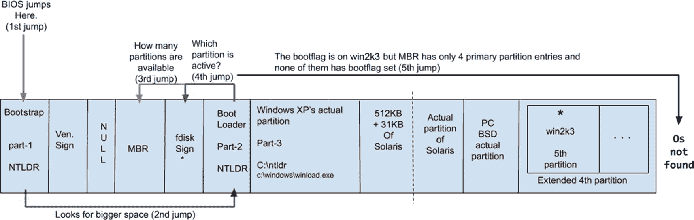

图 2-52

显示操作系统无法启动的原因的启动顺序

在逻辑分区上设置引导标志与在任何地方都不设置引导标志一样好。

现在，主要问题是，如果我们在 OpenSolaris 分区上保留引导标志会怎么样？OpenSolaris 将无法引导。OpenSolaris 引导加载程序(GRUB)将抛出如图 [2-53](#Fig53) 所示的错误消息。

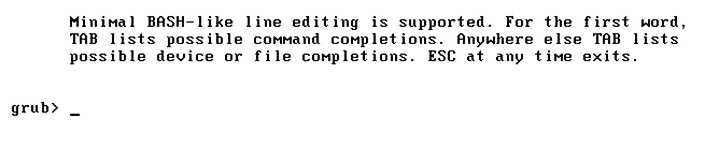

图 2-53

GRUB 根据提示丢弃

但是为什么呢？它应该能启动，对吗？OpenSolaris 中没有任何变化(512 字节+ 31 KB)。只是 win2k3 把引导标志从 OpenSolaris 分区移到了第一主。所以，理想情况下应该能开机，但不会，原因是 win2k3 的行为。当 win2k3 被安装时，它面临着 OpenSolaris 和 PC-BSD 面临的类似情况。换句话说，引导标志在不同的分区上，并且该分区有另一个操作系统。OpenSolaris 在这种情况下所做的是将引导标志从 XP 的分区移动到它自己的第二个分区，但由于这将使 XP 无法引导，它慷慨地在自己的文件(`menu.lst`)中为 XP 创建了一个条目。OpenSolaris 每次都会读取该文件，并给 XP 同等的引导机会。

在 PC-BSD 的情况下，它检测到 OpenSolaris 上的引导标志，如果它被移动到自己的分区，它将使 OpenSolaris 无法引导。因此，BSD 慷慨地选择不把引导标志放在它自己的分区上，这样另一个 OS 就不会变得不可引导。但是 win2k3 没有那种大度。当安装 win2k3 时，它发现引导标志在非基于 Windows 的操作系统上。因此，它移动了 OpenSolaris 的引导标志，但由于这是非基于 Windows 的操作系统，它没有在`boot.ini`中创建条目。更进一步，win2k3 甚至破坏/删除了 OpenSolaris GRUB 的 part-1。因此，OpenSolaris 现在无法引导。

后来，win2k3 清除了 XP 的引导装载程序，但它在`boot.ini`中为 XP 做了条目，因为它是 Windows 操作系统。这就是为什么我说 win2k3 不像 OpenSolaris 和 PC-BSD 那样慷慨。但是我们将在本章的“调整 GRUB”一节中修复 OpenSolaris。

#### Windows 7

如图 [2-54](#Fig54) 所示，我们正在第五个分区安装 Windows 7。


图 2-54

Windows 7 安装程序显示的磁盘布局

Windows 没有显示扩展分区，以免简单的桌面用户混淆。

```sh
1st  = XP     2nd = Solaris    3rd  = PC-BSD      4th  = win2k3      5th  = 7

```

安装完成后，你认为哪个操作系统会启动？像往常一样，慢慢来，想出你的答案再继续算 [2-55](#Fig55) 。


图 2-55

Windows 7 显示的欢迎屏幕

你猜对了:Windows 7 会启动。以下是 Windows 7 的完整引导顺序:


图 2-56

bcdedit.exe 的产量

1.  打开系统电源。

2.  CPU 会跳转到 BIOS。

3.  在 POST 程序之后，BIOS 将跳转到整个硬盘的第一个扇区。

4.  安装 Windows 7 时，`*`位于第一个主服务器上，Windows 7 安装在一个逻辑分区中。所以，Windows 7 面临着和 win2k3 同样的问题。

5.  为了使自己可启动，Windows 7 将遵循相同的路径，其次是 win2k3。Windows 7 将在第一个主分区上安装其 part-1、part-2 和 part-3。第 3 部分不需要安装在第一个主服务器上，因为第 2 部分有第 3 部分的硬编码位置，但这就是 Windows 系列的工作方式。

6.  当 Windows 7 的 part-1 和 part-2 安装在第一个主服务器上时，显然 Windows 7 必须删除 win2k3 NTLDR (part-1 和 part-2)，但在删除文件时，Windows 7 会识别出 win2k3 是 Windows 系列操作系统；因此，Windows 7 的 bootloader 称为 Boot Configuration Data (BCD ),在自己的文件中为 win2k3 创建了一个条目，这可以在`bcdedit.exe.`检查图 [2-56](#Fig56) 中看到`bcdedit.exe`的输出。

图 [2-56](#Fig56) 中的“Windows Legacy OS Loader”是指 win2k3。


图 2-58

Windows 7 在引导过程中显示的动画

1.  所以，回到引导序列，它看起来像这样:BIOS ➤邮政➤ BIOS ➤硬盘的第一个扇区。

2.  引导程序的第一个 440 字节是 Window 7 的 BCD 引导程序的第一部分。它会寻找一个更大的空间，也就是 BCD 的第二部分。

3.  BCD 的第 2 部分将读取 MBR，并且将知道在这个 HDD 上有四个主分区，但是为了检查哪个是活动的，它将开始检查每个分区的 fdisk 签名，但是它将发现第一个主分区本身是活动的。

4.  Part-2 will jump inside the first primary where part-3 of Window 7’s BCD bootloader is stored. Part-3 will read its bootloader configuration file through `bcdedit.exe` and will list the entries that are mentioned in front of the `description` variable. Figure [2-57](#Fig57) shows what will appear on-screen.

    

    图 2-57

    Windows 7 显示的欢迎屏幕

5.  如果用户选择 Windows 7，那么正如你在`bcdedit.exe`中看到的，BCD 的第 3 部分将从`C:\windows\systemd32`调用`winload.exe`。记住，这里 C:是指 Windows 7 的分区，也就是第六个逻辑分区。

6.  `winload.exe`文件知道 Windows 7 内核的位置。它将开始在内存中加载内核，一旦完成，Windows 7 的内核将负责引导序列的其余部分。在图 [2-58](#Fig58) 中，您可以看到 Windows 7 启动后显示的动画。

图 [2-59](#Fig59) 显示了 Windows 7 启动序列的完整流程图。

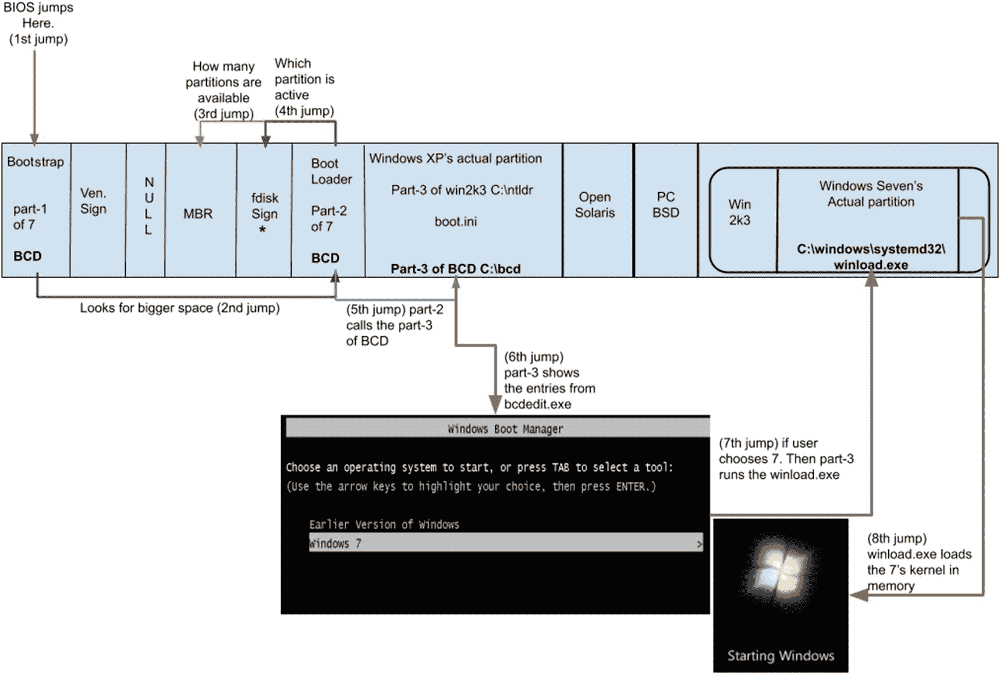

图 2-59

Windows 7 的启动顺序

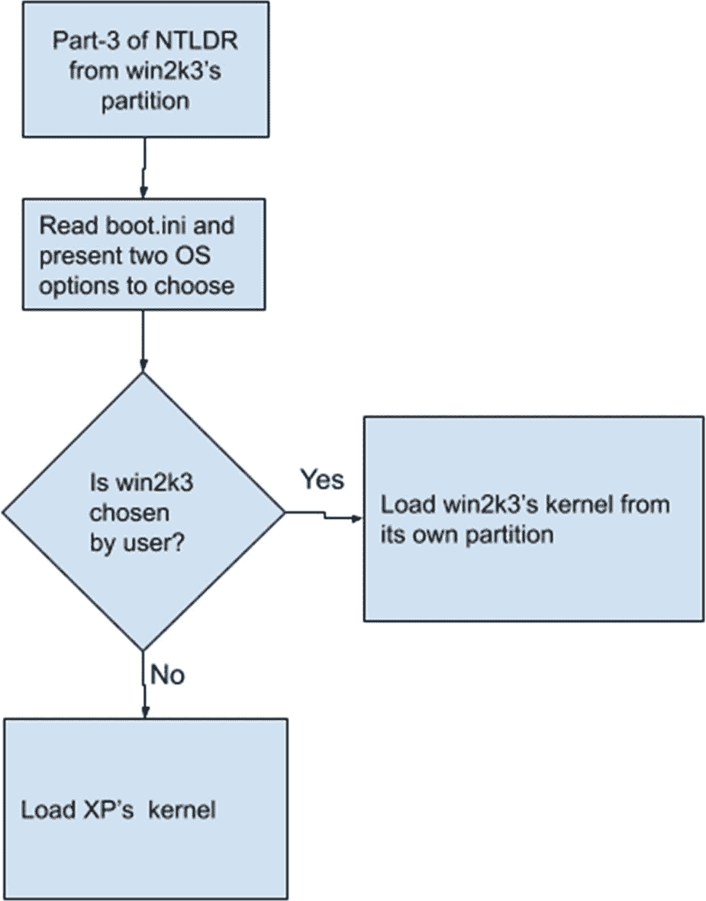

图 2-60

win2k3 和 XP 的启动顺序

1.  如果用户选择早期版本的 Windows，那么 BCD 的 part-3 将调用 NTLDR 的 part-3，它只在第一个主分区上，引导序列将继续，这是我们在 win2k3 中看到的。图 [2-60](#Fig60) 说明 win2k3 和 XP 的启动顺序。

#### 红帽企业版 Linux 6 (RHEL 6)

RHEL 安装工的名字叫阿纳康达。所有基于 Fedora 的发行版都使用 Anaconda 安装程序。在图 [2-61](#Fig61) 中，我们已经开始安装 RHEL 6。


图 2-61

RHEL 6 的引导介质的欢迎屏幕

图 [2-62](#Fig62) 显示了我们当前的分区布局。


图 2-62

Anaconda 安装程序显示的分区布局

如图 [2-63](#Fig63) 所示，我们需要将 root ( `/`)分配给 sda7 分区，并用 ext4 重新格式化，ext 4 是 RHEL 6 的默认文件系统选择。


图 2-63

Anaconda 将实现的分区方案

如图 [2-64](#Fig64) 所示，RHEL 6(或 Anaconda)已经检测到一些操作系统，它正试图给其他操作系统同等的引导机会(指定为其他)。有两个操作系统条目，RHEL 6 的引导程序(GRUB)会在引导时显示。

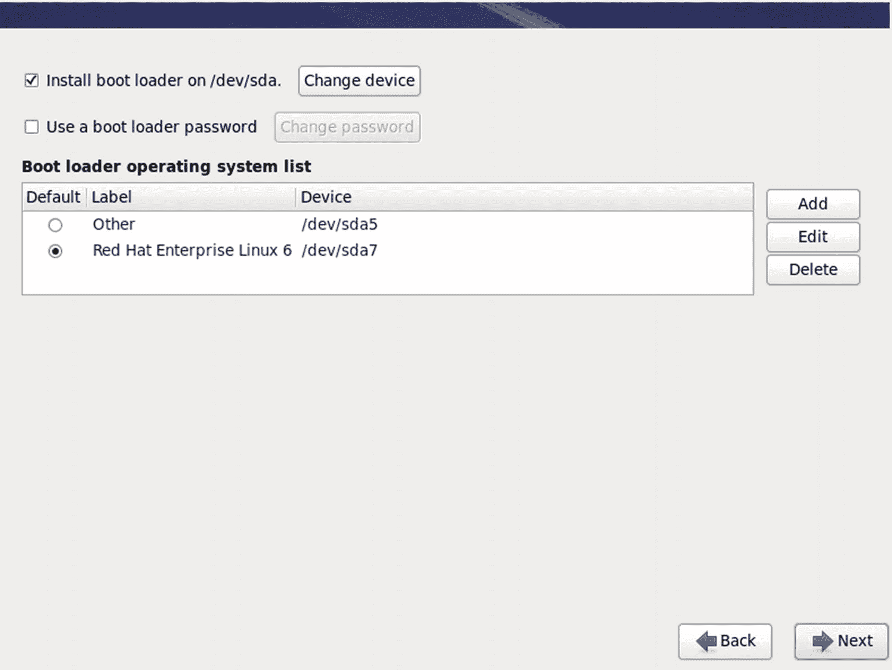

图 2-64

Anaconda 正在检测另一个操作系统

根据 RHEL 6，另一个操作系统将从 sda5 启动。这意味着:

```sh
sda1 = XP
sda2 = Solaris
sda3 = PC BSD
sda4 = Extended partition
sda5 = Win win2k3    <<<-----------

```

在启动时，如果用户选择了其他选项，win2k3 应该会启动。选择另一个选项后，将启动哪个操作系统？慢慢来，想出自己的引导顺序。

让我们重新启动系统，看看哪个操作系统正在启动。正如你在图 [2-65](#Fig65) 中看到的，是 RHEL 6 在引导，给你一个引导其他操作系统的机会。


图 2-65

RHEL 6 欢迎屏幕

RHEL 6 号的靴子是这样的:

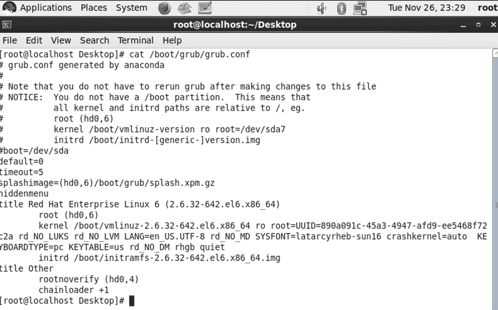

图 2-66

grub.conf 文件

1.  当系统开机时，它进入 BIOS，然后从 BIOS 进入 POST，再从 POST 返回 BIOS。

2.  BIOS 最终会进入整个硬盘的第一个扇区并运行引导程序。

3.  当 RHEL 6 被安装时，`*`在第一个主分区上。

4.  win2k3 和 Windows 7 面临的问题，RHEL 6 也面临着。RHEL 6 被安装在 BIOS 无法到达或看到的逻辑分区中。因此，为了解决这个问题，RHEL 6 必须将其引导程序(GRUB)的第一部分和第二部分转移到第一个主分区。请记住，Windows 也将 part-3 转移到了第一主分区，但是 RHEL(以及一般的任何 Linux 操作系统)只会将前两部分转移到第一主分区，而 GRUB 的 part-3 将保存在自己的分区中；在我们的例子中，这是 sda-7。

5.  在替换第一个主分区的 part-1 和 part-2 时，RHEL 注意到已经安装了一些其他操作系统，为了给它一个平等的引导机会，它在自己分区的`/boot/grub/grub.conf`命名配置文件中为它创建了一个条目。图 [2-66](#Fig66) 为`grub.conf`档。

正如你所看到的，在`title`变量之后写的任何东西都将被打印在屏幕上。

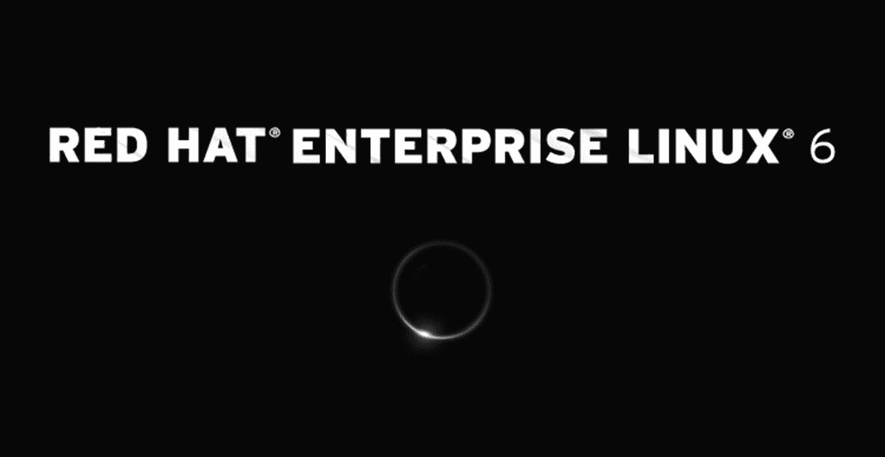

图 2-69

隐藏复杂日志消息的动画

1.  回到引导序列，第一个主分区中的引导来自 RHEL。

2.  RHEL 食物的第一部分将跳到第二部分。

3.  GRUB 的第 2 部分有一个 GRUB 的第 3 部分的硬编码位置。GRUB 的第 3 部分位于 RHEL 的分区 sda7 上。

4.  Part-3 of GRUB will read the `grub.conf` file from the `/boot/grub` directory, and whatever is written after `title` will be printed on the screen. Figure [2-67](#Fig67) shows this.

    

    图 2-67

    RHEL 6 的 GRUB 显示的欢迎屏幕

5.  If a user chooses the first entry, which is Red Hat Enterprise Linux 6, then part-3 of GRUB knows where the kernel of RHEL is. Figure [2-68](#Fig68) shows the `grub.conf` file.

    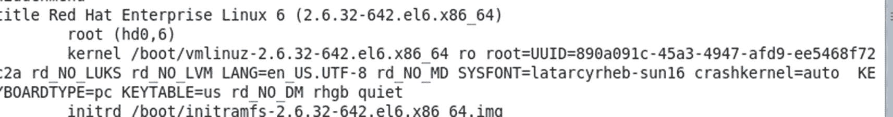

    图 2-68

    RHEL 6 的 grub.conf 文件

6.  内核二进制文件将位于`/boot/vmlinuz`。(注意图 [2-68](#Fig68) 中的`kernel`变量。)基本上，同一个`grub.conf`文件会告诉 GRUB 的第 3 部分内核的位置。它将在内存中复制内核(`vmlinuz`)，GRUB 引导程序的工作就完成了。RHEL 的内核将负责引导序列的其余部分。同时，当系统启动时，屏幕上会出现如图 [2-69](#Fig69) 所示的精美动画。

图 [2-70](#Fig70) 显示了 RHEL 6 的完整启动序列的流程图。

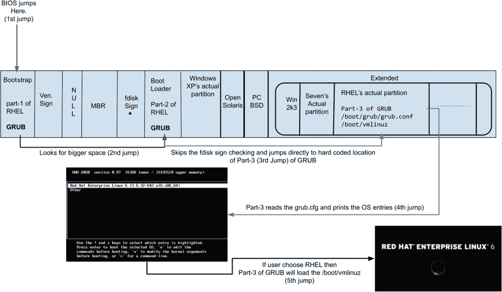

图 2-70

RHEL 6 的启动顺序


图 2-72

错误消息

1.  If a user chooses Other instead, then it will call whatever is present on the sda5 partition. As you can see in Figure [2-71](#Fig71), sda5 is on win2k3’s partition.

    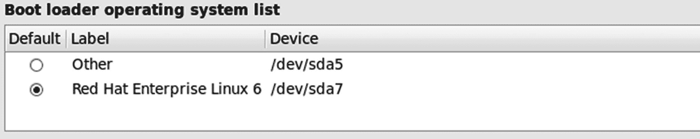

    图 2-71

    另一个操作系统在分区 5 上

2.  当安装 win2k3 时，它将其所有的引导程序部分转移到第一个主服务器。这意味着 win2k3 的分区没有引导加载程序，所以当然不会有操作系统启动。图 [2-72](#Fig72) 显示了当您尝试启动另一个操作系统时，屏幕上显示的错误信息。

现在，我有几个问题要问:

*   `*`现在在哪里？

*   如果我把`*`放在第二个分区，哪个操作系统会启动？

*   如果我把`*`放在第三个分区，哪个操作系统会启动？

*   如果我把`*`放在第五个(逻辑)分区，哪个操作系统会启动？

*   如果我没有在任何分区上保存`*`，哪个操作系统将会启动？

在所有这些场景中，只有一个操作系统会启动，那就是 RHEL 6(图 [2-73](#Fig73) )。

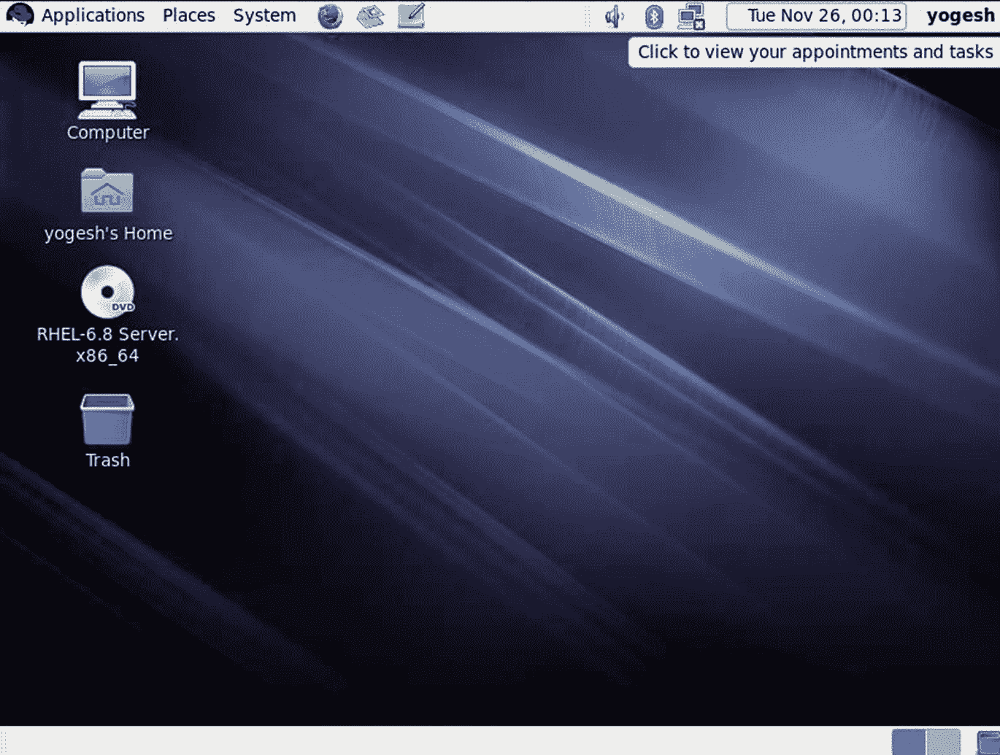

图 2-73

RHEL 6 桌面屏幕

不管你把`*`放在哪里，或者即使你不把`*`放在任何分区上，只有 RHEL 会一直引导。原因很简单，但是它完全改变了引导顺序。Red Hat Enterprise Linux bootloader，也就是 GRUB，不遵循`*`，在调用其 boot loader 的 part-3 之前不检查哪个分区是活动的。事实上，没有一个 Linux 操作系统会费心去检查活动分区。他们只是跳过这一步。因此，引导顺序如下:

1.  首先，系统进入 BIOS，然后是 POST，然后返回 BIOS，最后是第一个主分区的引导。

2.  RHEL 的 GRUB 的第 1 部分跳转到 GRUB 的第 2 部分，第 2 部分(跳过 fdisk 签名部分后)跳转到 GRUB 的第 3 部分。

3.  GRUB 的第 3 部分转到`/boot/grub.conf`，它打印 OS 条目。

4.  如果用户选择 RHEL，那么内核从内存中的`/boot/vmlinuz`开始加载。

5.  内核将负责操作系统引导的其余部分，这将在本书的其余部分详细解释。

这也意味着目前只有一个操作系统正在启动，那就是 RHEL 6。那就糟了！因此，我们需要调整 GRUB 来引导其余的操作系统。

#### 调整食物

GRUB 最好的特性是它可以引导任何其他操作系统，不管它是否基于 Linux。引导 GRUB 使用的另一个操作系统的技巧很简单，但是很神奇。对于任何引导操作系统的引导加载程序，您只需要在内存中加载相应操作系统的内核。GRUB 知道 Linux 操作系统的内核在哪里(`/boot/vmlinuz`)。但是 GRUB 不知道 Windows 或者 PC-BSD 的内核在哪里。诀窍在于这些操作系统各自的引导加载程序知道它们各自内核的位置。所以，GRUB 只是调用它们各自的 bootloaders 例如，如果 GRUB 想要引导 BSD，它位于第三个主分区。参见图 [2-74](#Fig74) ，其显示了分区布局，以更好地理解这一点。


图 2-74

BIOS 的分区布局

BSD 在它自己的分区的保留的 512 字节+ 31 KB 上安装了它的引导装载程序。因此，GRUB 将调用 BTX 的第一部分。这叫做*链装*。GRUB 引导程序的第三部分将链接加载 BTX 的第一部分。BTX 的第一部分知道下一步该做什么，那就是寻找第二部分。第 2 部分将跳转到第 3 部分，它将在内存中加载 BSD 的内核，这样 BSD 将开始启动。为了实现这种链加载，我们需要通过`grub.conf`文件告诉 GRUB BTX 第一部分的位置。位置将是硬盘号 1 和分区号 3，但是 GRUB 从 0 开始计数，所以位置将是硬盘号 0 和分区号 2。`/boot/grub.conf`中的条目如下:

```sh
              title pc-bsd               <<<---- the os entry title
              rootnoverify (hd0,2)       <<<---- location of BTX
              chainloader +1             <<<---- grub will chainload the BTX

```

如图 [2-75](#Fig75) 所示，其他操作系统条目与 BSD 类似；只有分区号会改变。


图 2-75

调整了 RHEL 6 的 grub.conf 文件

重启后，GRUB 会显示上面提到的`title`条目。见图 [2-76](#Fig76) 。


图 2-76

RHEL 6 显示的 GRUB 欢迎屏幕

如果用户选择 Windows，它将调用 BCD 的 part-2，它位于第一个主节点的 31 KB 空间中。这个 31 KB 的空间也被称为*卷引导记录* (VBR)。我故意跳过了 VBR 的解释，因为它会造成不必要的混乱。因此，在 Windows 链加载的情况下，请记住，将调用 part-2 而不是 part-1。对于那些想了解更多关于 VBR 的信息的人来说，MBR 是硬盘的主引导记录，位于硬盘的第一个扇区。每个卷(认为是分区)都有自己的引导记录，称为 VBR，作为分区的第一个扇区。两个相似事物的两个名称。

因此，BCD 的 part-2 将调用 BCD 的 part-3，它在第一个主分区中。它将读取 BCD OS 条目(`bcdedit.exe`)，如图 [2-77](#Fig77) 所示，并将它们打印在屏幕上。


图 2-77

BCD 引导程序显示的操作系统条目

如果用户选择早期版本的 Windows，正如我们前面看到的(在 Windows 7 的引导序列期间)，它将运行 NTLDR 的第 3 部分，这也是在第一个主分区上。如图 [2-78](#Fig78) 所示，NTLDR 将从 c 盘读取`boot.ini`文件并打印 OS 条目。

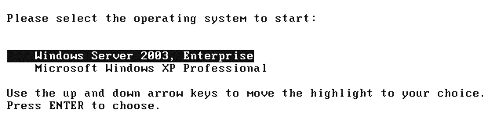

图 2-78

win2k3 的 NTLDR 显示的操作系统条目

如果用户选择 XP，NTLDR 的 part-3 知道 XP 的内核在哪里。而是用户选择 win2k3，然后同样的 NTLDR 会在内存中加载 win2k3 的内核。

如果用户选择 OpenSolaris，请参见图 [2-79](#Fig79) ，这是 RHEL 提供的主引导屏幕。


图 2-79

RHEL 显示的操作系统条目

以下是 GRUB 将遵循的指令:

```sh
title Solaris
      rootnoverify (hd0,1)
      chainloader  +1

```

所以，RHEL GRUB 的 part-3 会将控制权移交给第二个主分区的引导程序，但是请记住，win2k3 已经清除了 OpenSolaris GRUB 的 part-1。因此，如图 [2-80](#Fig80) 所示，它将无法启动。


图 2-80

OpenSolaris 无法引导

这意味着我们需要首先修复 OpenSolaris 引导程序。要解决这个问题，我们需要从 OpenSolaris live CD 映像启动，我们用它来安装 OpenSolaris，启动后，将 GRUB 的 part-1 和 part-2 (part-2 不是必需的，但有利于重新安装)从 live CD 安装到 OpenSolaris 分区的保留的 512 字节+ 31 KB。我们将使用的命令是`installgrub`。顾名思义，该命令将从实时映像中复制 GRUB 的 part-1 ( `stage1`)和 part-2 ( `stage2`)并将它们放在 OpenSolaris 分区的 512 字节+ 31 KB 空间中。图 [2-81](#Fig81) 显示了操作中的命令。


图 2-81

installgrub 命令

```sh
#installgrub  /boot/grub/stage1  /boot/grub/stage2  /dev/rdsk/c4d1s0

```

重启后，RHEL 将再次显示相同的操作系统条目(图 [2-82](#Fig82) ),因为对 RHEL 来说没有任何变化。


图 2-82

RHEL 显示的操作系统条目

如果这次我们选择 OpenSolaris，那么 RHEL GRUB 的 part-3 将从第二个分区链接加载 OpenSolaris GRUB 的 part-1。Part-1 将调用 part-2，最终它将从实际的 OpenSolaris 分区调用 part-3。OpenSolaris GRUB 的第 3 部分将读取`/rpool/boot/grub/menu.lst`，如图 [2-83](#Fig83) 所示，它将在屏幕上打印标题。


图 2-83

OpenSolaris 显示的操作系统条目

如果用户选择 OpenSolaris，那么 OpenSolaris GRUB 的第 3 部分将从`/boot`加载内核。如果用户选择 Windows，那么 OpenSolaris GRUB 的第 3 部分将遵循来自`/rpool/boot/grub/menu.lst`的这些指令:

```sh
title Solaris
      rootnoverify (hd0,1)
      chainloader  +1

```

我们现在知道屏幕上会出现什么(参见图 [2-84](#Fig84) )。


图 2-84

BCD 显示的 OS 项目

如果用户选择我们已经讨论过的早期版本的 Windows，故事将会继续。回到最初的操作系统列表，图 [2-85](#Fig85) 显示了 RHEL 的 GRUB 所呈现的内容。


图 2-85

RHEL 显示的操作系统条目

如果用户选择启动 BSD，您就知道会发生什么。RHEL GRUB 的第三部分将从第三个主要分区链接 BTX 的第一部分。BTX 的第一部分将呼叫第二部分，第二部分将呼叫 BTX 的第三部分。BTX 的第三部分将显示欢迎界面，如图 [2-86](#Fig86) 所示。


图 2-86

PC-BSD 的欢迎屏幕

一旦选择启动，BTX 的第 3 部分将在内存中加载 BSD Unix 的内核。因此，所有的操作系统，无论我们目前安装的是哪一个，现在都能够引导，并且哪个分区是活动的并不重要。但是我们能黑掉 Windows bootloaders 并强迫他们从我们的列表中引导 Linux 和 Unix 操作系统吗？我们可以，这就是我们现在要做的。

#### 入侵 Windows 引导程序

欺骗 Windows 引导程序其实很容易。正如我们前面看到的，靴带装载者做链式装载；例如，part-1 调用它的 bootloader 的 part-2 等等。为了理解这个窍门，我们以 BSD 为例。BCD 的 Part-1 正在调用它的 part-2，但是如果我们告诉 BCD 的 part-1 链接加载 RHEL 的 part-1，那么 RHEL 的 part-1 将运行，并且它最终将遵循它自己的引导序列。GRUB (RHEL)的 Part-1 将调用 GRUB 的 part-2，并且它最终将链接加载 GRUB 的 part-3，因为 part-3 的块地址是硬编码在 part-2 中的。这意味着一旦任何引导装载程序的第一部分运行，它将开始遵循自己的引导序列，我们将利用这一行为。

为了实现这一点，我们需要获得每个非基于 Windows 的引导装载程序的第 1 部分，并将其放入 Windows 文件系统。因此，文件系统可以是 FAT32 或 NTFS。显然，将每个非基于 Windows 的引导加载程序的第一部分放在第一主分区上具有最大的优势，因为每个 Windows 操作系统都在第一主分区上安装了它们各自的引导加载程序。于是，通过`dd`命令，我们将复制每一个非基于 Windows 的 OS 的前 512 个字节(甚至前 440 个字节就足够了)，并把它们放在 XP 的分区中。让我们挂载第一个主分区，如图 [2-87](#Fig87) 所示。


图 2-87

mount 命令

让我们复制前 512 个字节，并将它们放在 sda1 分区上。参见图 [2-88](#Fig88) 。


图 2-88

将前 512 个字节传输到第一主节点

现在我们将在 XP 中启动，如图 [2-89](#Fig89) 所示，我们将在`boot.ini`文件中添加 part-1 文件条目。`boot.ini`文件由两个 Windows bootloaders 读取，分别是 BCD 和 win2k3 的 NTLDR。

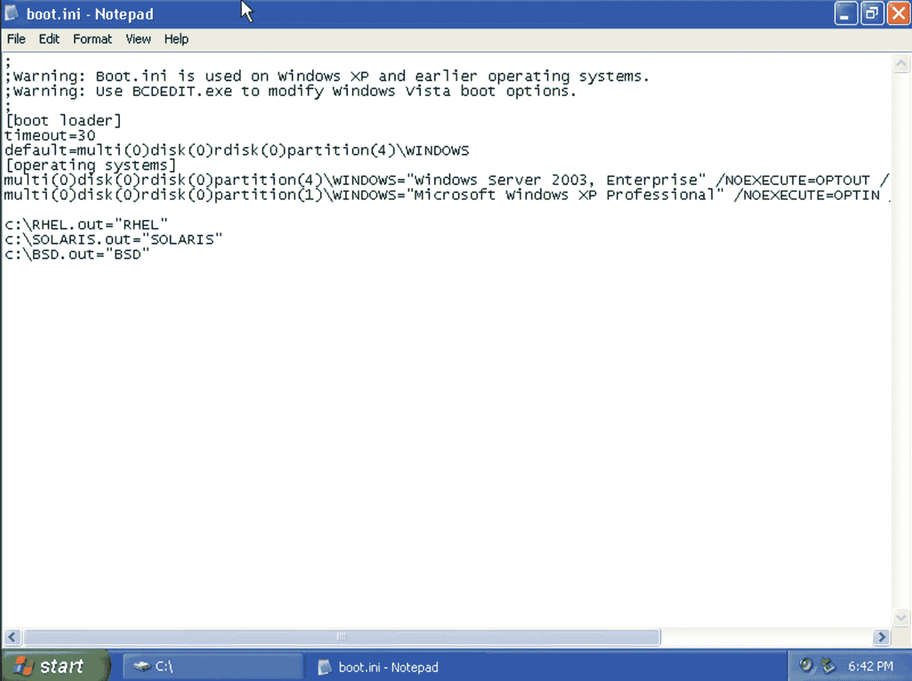

图 2-89

在 boot.ini 文件中添加条目

以下是我们添加的条目:

```sh
c:\RHEL.out="RHEL"
c:\SOLARIS.out = "SOLARIS"
c:\BSD.out="BSD"

```

就像`grub.conf`文件一样，`boot.ini`中写在双引号中的任何内容都将被视为 OS 条目的标题。现在让我们重新启动系统，从 RHEL 操作系统列表中选择 Windows 操作系统条目(参见图 [2-90](#Fig90) )。


图 2-90

RHEL 展示的操作系统列表

我们如何到达这个屏幕很容易理解。

1.  系统首先进入 BIOS，然后是 POST，然后是 BIOS，然后是前 512 个字节，然后是 RHEL (GRUB)的引导程序(第一部分)。

2.  然后是 GRUB 的 part-1，它跳转到 GRUB 的 part-2，后者跳转到 GRUB 的 part-3，后者转到`/boot/grub.conf`，后者打印操作系统标题。

3.  用户选择了 Windows，因此接下来是来自第一个主分区的 BCD 的第 1 部分，然后是 BCD 的第 2 部分。

4.  最后，它转到第 3 部分，然后是`bcd.exe`，它将读取`boot.ini`文件，写在双引号中的内容将被打印在屏幕上。

操作系统列表如图 [2-91](#Fig91) 所示。


图 2-91

Windows 7 显示的操作系统条目(BCD)

如果用户选择早期版本的 Windows，那么 BCD 的 part-3 将调用 win2k3 的 NTLDR 的 part-3。NTLDR 将再次读取`boot.ini`文件并打印 OS 列表，如图 [2-92](#Fig92) 所示。


图 2-92

win2k3 的 NTLDR 显示的操作系统条目

如果用户选择 OpenSolaris，那么 NTLDR 的第 3 部分将从 C:(第一个主分区)运行`Solaris.out`文件。`Solaris.out`文件只不过是来自第二个分区的 OpenSolaris 引导程序的第一部分。OpenSolaris 引导加载程序的第 1 部分将调用 GRUB 的第 2 部分，并最终调用第 3 部分。它将读取`menu.lst`文件并打印操作系统列表(图 [2-93](#Fig93) )。


图 2-93

OpenSolaris GRUB 显示的操作系统条目

如果用户再次选择 Windows，那么 OpenSolaris 的 part-3 将从第一个主分区(`rootnoverify (hd0,0)`)调用 BCD 的 part-2。(BCD 的第 2 部分将位于第一个主分区的 VBR 部分。我们不会在本书中涉及 VBR。)BCD 的 part-2 会调用 BCD 的 part-3。它将通过`bcdedit.exe`和从`boot.ini`读取操作系统条目，并打印操作系统条目。在图 [2-94](#Fig94) 中可以看到屏幕上打印的操作系统条目。


图 2-94

Windows 7 显示的操作系统条目(BCD)

这就是我们如何创建一个引导程序的循环(参见图 [2-95](#Fig95) 和图 [2-96](#Fig96) )。

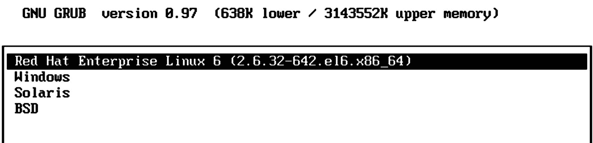

图 2-96

RHEL 的 GRUB 显示的操作系统条目


图 2-95

RHEL 条目已被选中启动

大家可以看到，Linux 在引导 Windows，Linux 在引导 Unix，Unix 在引导 Windows，Windows 在引导 Windows，Windows 在引导 Linux，但是还缺少一点，那就是 Linux 在引导 Linux。为此，我们将安装列表中的最后一个操作系统，那就是 Fedora 15。

#### Fedora 15

如图 [2-97](#Fig97) 所示，我们正在 sda8 上安装 Fedora 15。


图 2-97

Fedora 安装程序

默认情况下，Fedora 会尝试在第一个主服务器上安装它的引导程序，但是如果我们允许的话，那么我们需要在它的`grub.conf`中添加所有其他操作系统的条目。相反，我们将遵循不同的方法。我们将把 Fedora (GRUB)的 bootloader 安装在它自己的分区(sda8)上，而不是 sda1。见图 [2-98](#Fig98) 。


图 2-98

引导加载程序设备选择

这意味着重启后 Fedora 将永远无法启动，因为 RHEL 的 GRUB 不知道这个新操作系统，所以我们需要将 Fedora 的条目添加到 RHEL 的`grub.conf`中。为此，让我们安装 sda8，如图 [2-99](#Fig99) 所示。

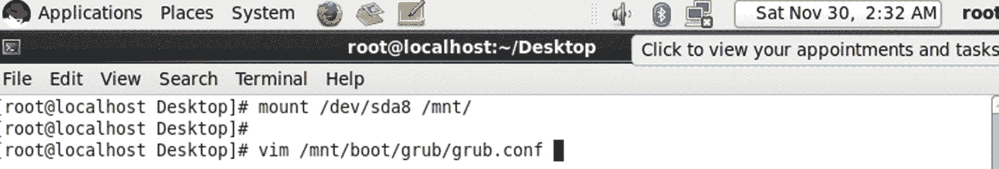

图 2-99

软呢帽隔断的安装

从 Fedora GRUB 的`grub.conf`文件:`/mnt/boot/grub.conf`中复制 Fedora 的条目(见图 [2-100](#Fig100) )。


图 2-100

Fedora 15 的 grub.conf 文件

条目很简单。每当调用 Fedora 的 part-3 时，它都会将 Fedora 的内核从`/boot/vmlinuz-2.6.38.6-26.rc1.fc15.x86_64`加载到内存中。之后，它会将 initramfs 从`/boot/initramfs-2.6.38.6-26.rc1.fc15.x86_64.img`加载到内存中。

图 [2-101](#Fig101) 显示了从`/mnt/etc/grub.conf`复制 Fedora 的条目后 RHEL 的`/etc/grub.conf`文件。

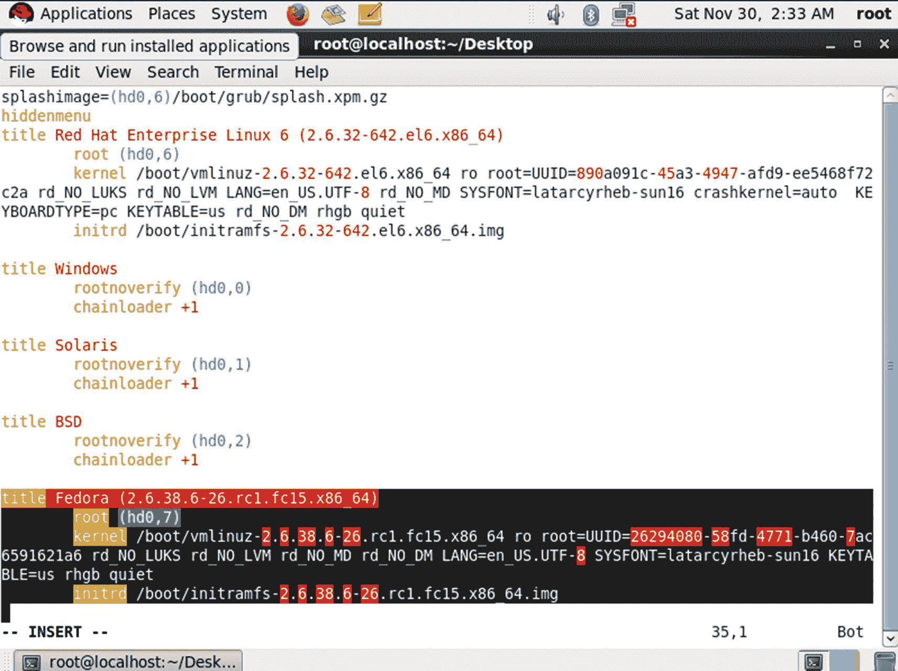

图 2-101

RHEL 的 grub.conf 文件

重启后，我们会得到 Fedora 条目(图 [2-102](#Fig102) )。


图 2-102

RHEL 显示的操作系统条目

当用户选择 Fedora 进行引导时，按照 RHEL`grub.conf`文件中的条目，RHEL GRUB 的第 3 部分将从第八个分区(Fedora 的 sda8)加载内核，还将从同一位置加载 initramfs(我们将在第 [5 章](05.html)中讨论 initramfs)，引导加载程序将离开。

#### 完整的流程图

图 [2-103](#Fig103) 显示了到目前为止我们已经安装的每个操作系统的完整流程图。

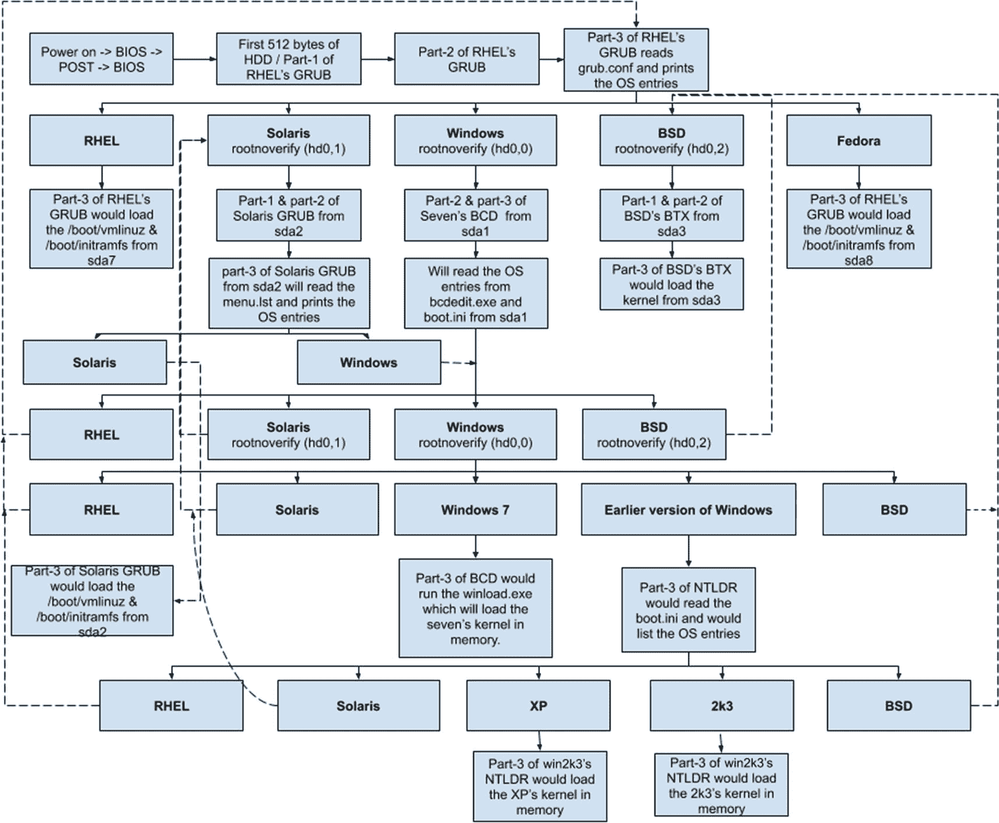

图 2-103

所有操作系统的完整流程图

我希望你现在理解了引导程序在基于 BIOS 的系统上引导操作系统的方式。现在是时候了解一下新的固件了，它就是统一可扩展固件接口(UEFI)。

### 统一可扩展固件接口

以下是迄今为止您观察到的 BIOS 限制:

*   您只能有四个主分区。

*   BIOS 无法读取逻辑分区。

*   BIOS 有点笨；它会跳到你硬盘的第一个扇区。

*   基于 BIOS 的系统的最大分区大小为 2.2 TB。

为什么会有这样的局限性？BIOS 固件是在 1982 年为 IBM PC-5150(图 [2-104](#Fig104) )设计的，它曾经有这样的配置:


图 2-104

IBM PC-5150

```sh
CPU       = 8088 - 16bit x86 processor
Memory    = upto 256KB max
OS        = MS-DOS

```

如你所见，BIOS 是 38 年前为这台 PC 设计的。在这三十年里，操作系统从软盘发展到 NVME 磁盘，从文本模式发展到闪亮的图形用户界面。硬件设备从驱动程序到即插即用，但 BIOS 保持不变，最初是 16 位指令集，后来开始使用 32 位指令集。现在我们有 64 位 CPU，但 BIOS 仍然是由 32 位指令组成的。我们没有将 BIOS 升级到 64 位的原因是因为历史原因。当一切都正常工作时，为什么要重写一些东西呢？无论如何，这是计算机行业采用的哲学。当 CPU 从 16 位(8088)变为 64 位(i9)时，BIOS 保持在 16 位或 32 位，因为在引导的早期阶段，没有必要拥有 64 位 CPU，这就是我们拥有 CPU 模式(实模式、受保护模式和长模式)的原因。

在实模式下，CPU 将被限制为 16 位。在这种模式下，具有 16 位指令的旧 BIOS 等程序将运行。这些程序不能在任何其他模式下运行。稍后，CPU 将从实模式切换到保护模式。保护模式是 32 位，现在的程序，如 BIOS，具有 32 位指令集，将在这种模式下运行，后来 CPU 将被置于长模式，即 64 位。记住，这些模式不是由 CPU 实现的；相反，它们是由 BIOS 之类的固件实现的。这意味着，如果我们将同一个 CPU 从启用实模式的系统中移除，并将其放在没有实模式的系统上，则同一个 CPU 将直接以保护模式启动。我们将在第 [4](04.html) 章再次谈到这些模式。

由于 BIOS 在保护模式下运行，BIOS 可用的地址空间只有 4 GB。如果系统有 20 GB 内存，BIOS 最多只能寻址 4 GB。尽管系统有一个 64 位的 I9 处理器，BIOS 仍然只能使用其中的 32 位。由于这些硬件挑战，BIOS 受到了限制。

#### BIOS 限制

以下是 BIOS 的一些限制:

*   BIOS 将只能跳到第一个扇区，即 512 字节。
    *   大小为 64 字节的 MBR 是第一个引导扇区的一部分。如果我们增加 MBR 的大小，它将超过 512 字节；因此，我们不能增加 MBR 的大小，这就是 BIOS 只能提供四个主分区的原因。

*   BIOS 不能生成好的图形/图形用户界面。
    *   现在，这是一个通用的说法，用于与 UEFI 进行比较。有一些 BIOS 供应商已经在操作系统之外实现了 web 浏览器，但是这种实现在普通的桌面硬件上很少见。

    *   此外，在 Phoenix，一些 BIOS 实现中有一个 FAT32 驱动程序，通过它可以在设置中显示图标。

*   在 BIOS 中不能使用鼠标。
    *   有许多 BIOS 供应商都有鼠标支持，但是在普通的桌面系统中很少见到。

*   最大分区大小为 2.2 TB。
    *   BIOS 使用并支持 MS-DOS 分区表，这是一个非常老的表，它有自己的缺点，比如最大分区大小为 2.2 TB。

*   BIOS 是哑的，因为它不理解引导装载程序或操作系统。

*   由于硬件的限制，速度很慢。
    *   就启动速度而言，BIOS 很慢，因为它需要时间来初始化硬件。

    *   BIOS 需要将近 30 秒的时间来启动实际的操作系统引导。

*   它努力初始化新一代硬件设备。

*   BIOS 的预启动工具有限。
    *   与 UEFI 固件相比，BIOS 具有非常少的预启动工具，如远程硬件诊断等。

因此，为了克服所有这些 BIOS 限制，英特尔于 1998 年启动了一项名为英特尔启动计划(IBI)的计划；后来，它成为可扩展固件接口(EFI)。其他所有可能的操作系统和硬件供应商(惠普/苹果/戴尔/微软/IBM/华硕/AMD/美国大趋势/凤凰科技)都加入了英特尔。他们为这个项目做了一个开源论坛，最后变成了统一可扩展接口(UEFI)。

开源代码是在 BSD 许可下签署的，但是英特尔的基础代码仍然是专有的。UEFI 基本上是一个开源框架，厂商基于 [UEFI 提供的规范在其上构建他们的应用。org](http://uefi.org) 。比如美国大趋势打造 APTIO，凤凰科技打造 SecureCore UEFI 固件。苹果是第一个敢于推出内置 UEFI 固件的系统的公司。BIOS 的所有缺点都是因为它的 16 位指令集。由于这个 16 位指令集将 BIOS 硬件的使用限制在 1 MB 的地址空间，UEFI 瞄准并解决了这一限制。

#### UEFI 优势

UEFI 支持 64 位处理器；因此，它不会面临 BIOS 所面临的任何硬件限制。

*   UEFI 是个小 OS。
    1.  您将可以完全访问音频和视频设备。

    2.  您将能够连接到 WiFi。

    3.  您将能够使用鼠标。

    4.  在 GUI 方面，UEFI 将提供丰富的图形界面。

    5.  UEFI 将拥有自己的应用商店，就像我们为 Android 和苹果手机所做的那样。

    6.  你可以从 UEFI 应用商店下载并使用这些应用，就像在安卓和苹果手机上一样。数百个应用程序可用，如日历、电子邮件客户端、浏览器、游戏、Shell等。

    7.  UEFI 能够运行任何具有 EFI 可执行格式的二进制文件。

    8.  它借助安全引导功能安全地引导操作系统。我们将在本书后面深入讨论安全引导特性。

    9.  UEFI 是向后兼容的，这意味着它将支持“BIOS 方式”的引导。换句话说，不支持 UEFI 的操作系统也可以使用 UEFI 启动。

*   UEFI 可以使用全部 CPU。不像 BIOS(被 16 位处理器卡住)，UEFI 最多可以访问 64 位。

*   UEFI 可以使用全 RAM 模块。与 BIOS 的 1 MB 地址空间不同，UEFI 可以支持和使用太字节的 RAM。

*   UEFI 使用 GPT (GUID)分区表，而不是 64 字节的微型 MBR，这将提供无限数量的分区，并且所有分区都将是主分区。事实上，没有主分区和逻辑分区的概念。

*   最大分区大小为 8z 字节。

*   UEFI 有企业管理工具。
    1.  要更改 BIOS 的设置，我们必须重新启动系统，因为操作系统在长模式下运行，而 BIOS 在实模式下运行，而实模式只能在启动时运行。

    1.  你将能够远程修理计算机。

    2.  您将能够在 UEFI 固件中浏览互联网。

    3.  您将能够从操作系统中更改 UEFI 固件行为/设置。

#### UEFI 的图形用户界面

图 [2-105](#Fig105) 显示了华硕的 GUI 实现。

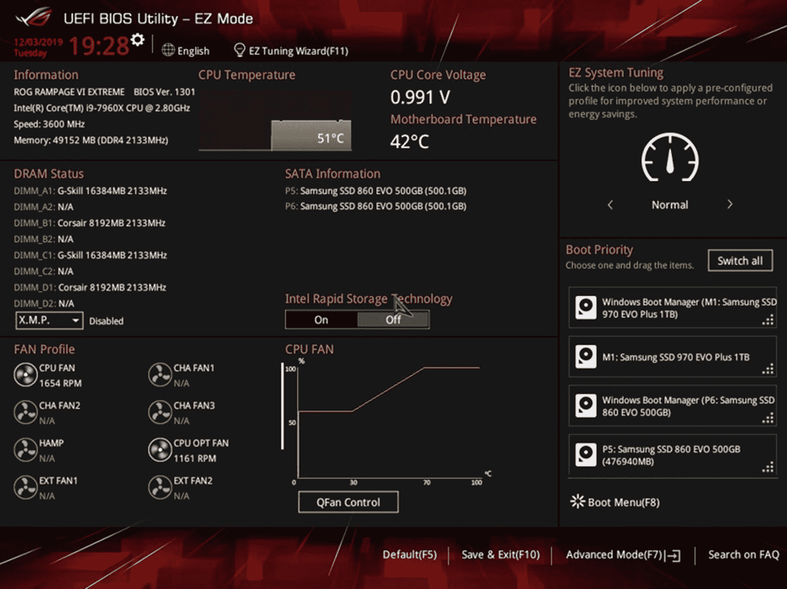

图 2-105

华硕 UEFI 实施

以下是一些需要注意的事项:

*   丰富的 GUI

*   鼠标指针

*   图标、按钮、滚动选项、动画、图形、下拉选项等。

当然，你需要一个昂贵的主板来获得如此丰富的 UEFI 实现，但即使是基本的 UEFI 实现也比 BIOS 实现好得多。

#### UEFI 实施

UEFI 论坛发布了 UEFI 规范。写这本书时，当前的 UEFI 规范是 2.8，可以从 [`https://uefi.org/specifications`](https://uefi.org/specifications) 下载。目前的规范长达 2551 页，每个厂商(主板、OS、UEFI 开发者等。)也只好同意了。该规范强制每个供应商都必须遵守的法规。以下是 UEFI 的一些主要规定。

##### EFI 系统分区(ESP)

每个操作系统供应商都必须创建一个 EPS 分区，并且引导加载程序只能安装在这个分区中。没有必要将 ESP 创建为第一个分区；它可以在任何地方创建，但是 ESP 应该有 FAT16/32(最好是 FAT32)文件系统。建议的 ESP 大小至少为 256 MB。操作系统供应商必须在 ESP 中创建以下目录结构:

```sh
EFI System Partition
      ├── EFI
      │     ├── <OS_vendor_name>
      │     │         ├── <boot_loader_files>

```

一旦创建了这个结构，操作系统只需要在`/EFI/<os_vendor_name>/`位置安装引导装载程序。图 [2-106](#Fig106) 显示了 UEFI 的结构。

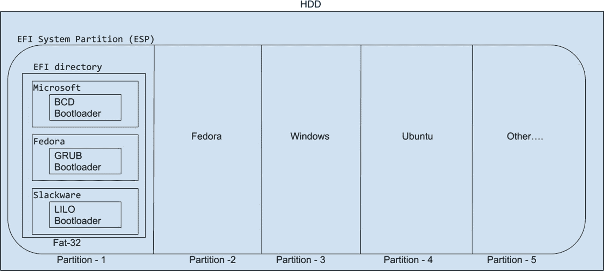

图 2-106

UEFI 结构

这意味着，就像为引导加载程序保留的 512 字节+ 31 KB 空间一样，我们在 UEFI 中为引导加载程序保留了 256 MB 的最小专用空间。ESP 分区将被挂载到 Linux 中的挂载点`/boot/efi`下。

##### =electronicfuelinjection 电子燃料的注入

每个操作系统供应商都必须以 EFI 可执行格式编写引导程序文件。此外，文件应该有`.efi`扩展名。

##### 安全启动

UEFI 提供的最佳特性之一是安全引导。该特性由微软提出，后来被添加到 UEFI 规范中。微软首次在 Windows 8 中使用安全引导功能。一旦我们熟悉了 UEFI 的工作原理，我们将详细讨论安全引导。

##### 分区表

推荐的分区表是 GPT，它是一个 GUID 分区表，而 BIOS 使用的是 MS-DOS 分区表。

为了更好地理解 UEFI，我们将使用与 BIOS 相同的方法。我们将使用一个名为 UEFI 的新系统，它上面有 UEFI 固件，我们将在其中安装一些操作系统。

#### 操作系统列表

如你所知，UEFI 使用 GPT 分区表；因此，没有主要或次要/逻辑分区的概念。这也意味着操作系统的安装没有特别的优先权。你可以用任何你想要的方式安装操作系统。我们将按以下顺序安装操作系统:

1.  Ubuntu 18

2.  Windows 10

3.  Fedora 31

#### Ubuntu 18.04 lt

我们有将近 64.4 GB 的硬盘。没有必要像我们使用 BIOS 那样使用类似 GParted 的工具来创建分区布局。我们将使用 Ubuntu 提供的默认磁盘工具。参见图 [2-107](#Fig107) 。


图 2-107

Ubuntu 提供的磁盘布局

如图 [2-108](#Fig108) 所示，我们先创建一个 3 GB 的 ESP 分区。


图 2-108

创建 ESP 分区

一旦创建了 ESP，我们将为 Ubuntu 的根文件系统再创建一个分区(10 GB)。图 [2-109](#Fig109) 显示了 Ubuntu 最终的分区布局。


图 2-109

Ubuntu 的分区布局

安装完成后，在图 [2-110](#Fig110) 中可以看到，ESP 挂载在`/boot/efi`上，根文件系统挂载在 sda2 上。

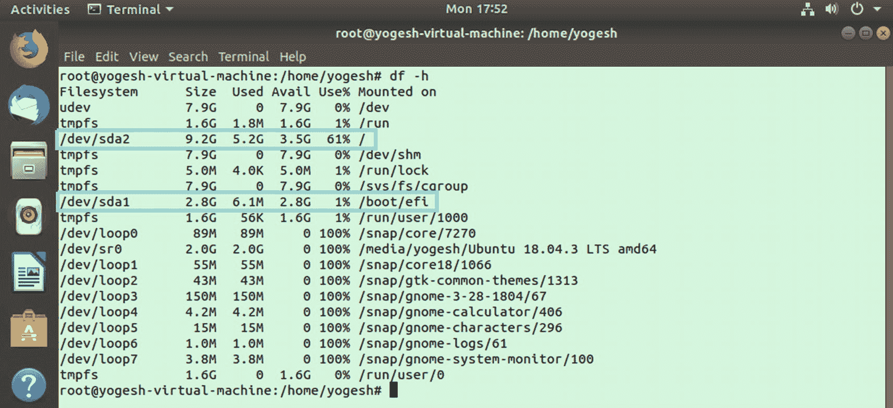

图 2-110

挂载点

此外，根据 UEFI 规范，Ubuntu 在`/boot/efi` (sda1)挂载点创建了一个目录结构`/EFI/ubuntu`，并在其中安装了 GRUB bootloader。参见图 [2-111](#Fig111) 。

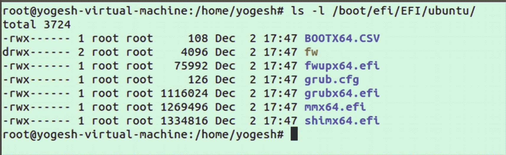

图 2-111

Ubuntu 的 EFI 目录

还要注意引导程序文件的`.efi`扩展名。以下是 UEFI 系统上的 Ubuntu 引导序列:

1.  打开系统电源。

2.  它进入 UEFI 固件。UEFI 发布帖子。

3.  开机自检检查硬件，如果一切正常，会发出正常的蜂鸣声。

4.  帖子回到 UEFI。

5.  UEFI 很聪明；UEFI 不是跳到前 512 个字节，而是找到 ESP 分区。

6.  It jumps inside ESP. Again, UEFI is smart, and it understands the bootloader. It lists the bootloader’s name on the screen. In Ubuntu’s case, it sees the `grubx64.efi` file; hence, it lists the Ubuntu name in the boot priority of UEFI. Please refer to Figure [2-112](#Fig112), where you can see the `ubuntu` entry inside UEFI’s boot priority menu.

    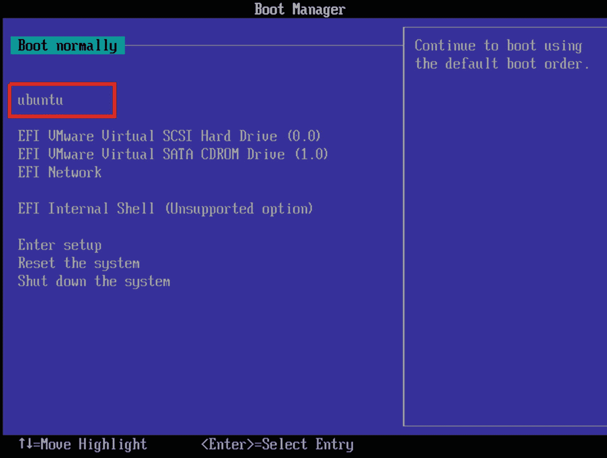

    图 2-112

    UEFI 的引导优先级窗口

7.  记住，引导装载程序还没有被 UEFI 调用或启动。BIOS 过去只向您显示可用的引导设备名称，如 CD-ROM、HDD 和 PXE，但 UEFI 会进入设备内部检查 ESP 分区，并直接显示操作系统名称。

8.  The moment the user chooses the Ubuntu option, UEFI will run `grubx64.efi` from the ESP partition. The absolute path will be `/boot/efi/EFI/ubuntu/grubx64.efi` Next, `grubx64.efi` will read `grub.cfg`, which is present in the same directory, and as shown in Figure [2-113](#Fig113), it will print the title entries.

    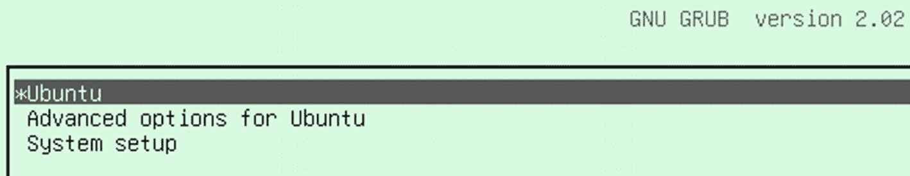

    图 2-113

    Ubuntu 的欢迎界面

    With the BIOS, there used to be jumps like this:
    1.  转到 fdisk 签名，转到引导程序的第 1 部分，然后转到引导程序的第 2 部分。

    2.  转到引导程序的第 3 部分，然后转到引导程序配置文件，如`menu.lst`或`grub.cfg`。

    3.  打印标题。

使用 UEFI，跳过(a)跳。UEFI 直接跳到(b)。BIOS 曾经因为空间限制把 bootloader 分成三个部分，但是 UEFI 没有任何空间限制。因此，整个引导装载程序只包含在一个二进制文件中。例如，在 Ubuntu 的情况下，`grubx64.efi`有一个、两个和三个部分都添加在一个二进制文件中，这个二进制文件就是`grubx64.efi`。

`grubx64.efi`文件最终会将内核(`vmlinuz`)和 initramfs 从`/boot`加载到内存中，然后 Ubuntu 的 GRUB bootloaders 工作就完成了。图 [2-114](#Fig114) 显示了 Ubuntu 的引导顺序流程图。

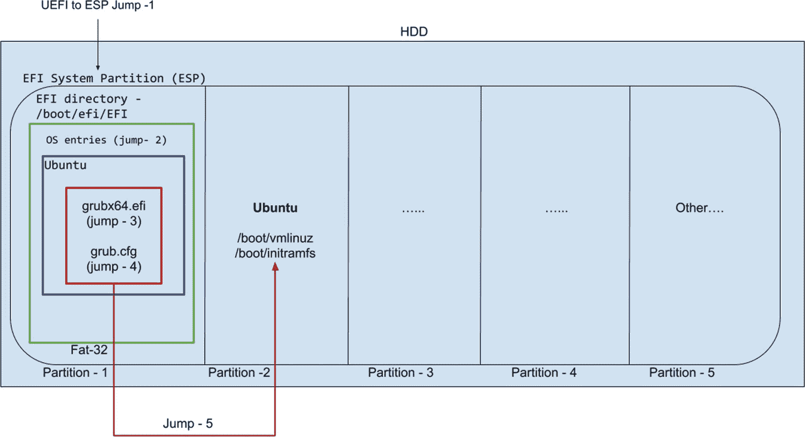

图 2-114

Ubuntu 的引导顺序

#### Windows 10

如图 [2-115](#Fig115) 所示，分区 1 是 ESP，分区 2 是 Ubuntu 的根(/)。

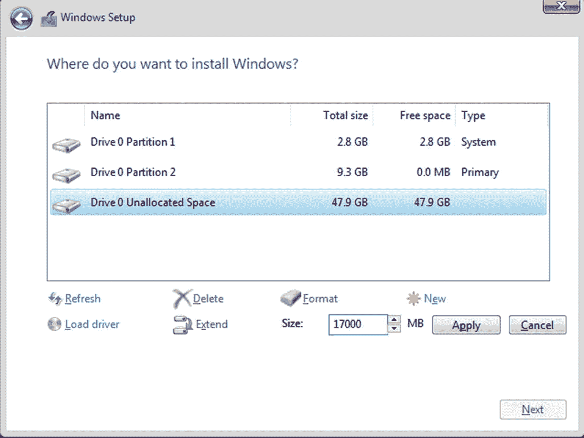

图 2-115

Windows 10 显示的分区布局

现在我们将为 Windows 创建一个新的分区。创建新分区时，Windows 将为名为 MSR (Microsoft Recovery，partition 3)的 Windows 恢复工具保留一些空间。参见图 [2-116](#Fig116) 。


图 2-116

MSR 空间保留区

如图 [2-117](#Fig117) 所示，在新创建的分区 4 上，我们将安装 Windows 10。

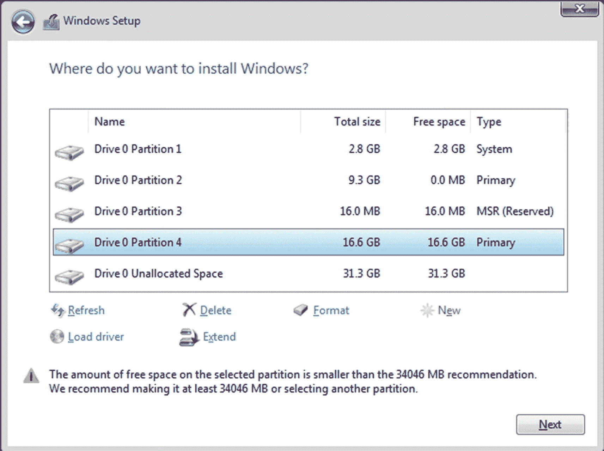

图 2-117

在分区 4 上安装 Windows 10

默认情况下，Windows 会检测 ESP 分区，并遵循 UEFI 规范，在其中创建一个名为`Microsoft`的目录，并在其中安装引导程序(BCD)。如果 Windows 找不到 ESP，它会为我们创建一个。由于 Windows 主要面向桌面用户，所以它不会像 Ubuntu 那样向我们展示 ESP 分区(参见图 [2-118](#Fig118) )。

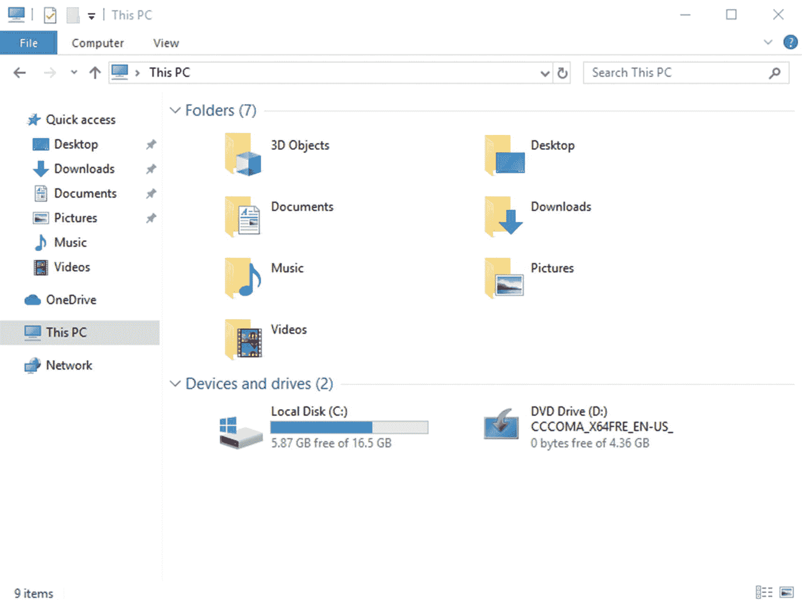

图 2-118

ESP 是隐藏的

这是 Windows 10 在基于 UEFI 的系统上的启动方式:


图 2-121

Windows 10 的启动顺序

1.  打开系统电源:首先是 UEFI，然后是 POST，然后是 UEFI，然后是 ESP。

2.  As visible in Figure [2-119](#Fig119), print the OS entries as per the directories found in ESP (`/boot/efi/EFI`).

    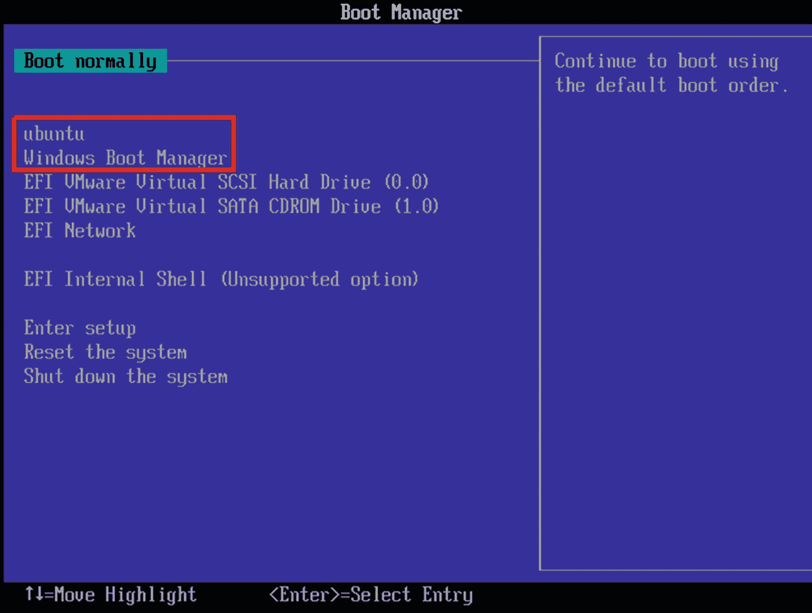

    图 2-119

    UEFI 中的操作系统条目

3.  当用户选择 Windows 启动管理器时，UEFI 将从`EFI/Microsoft`目录启动`bootmgfw.efi`文件。在基于 Linux 的系统上，相同文件的绝对路径将是`/boot/efi/EFI/Microsoft/bootmgfw.efi.`

4.  `bootmgfw.efi`最终会从`C:\windows\system32\`开始加载 Windows 的内核。

5.  The Windows kernel will take care of the rest of the booting, and while doing that, a famous animation, shown in Figure [2-120](#Fig120), will be shown to users.

    

    图 2-120

    著名的 Windows 加载屏幕

6.  从图 [2-121](#Fig121) 可以看出，截至目前，只有一个 OS 在启动，那就是 Windows 10。不过不用担心，因为 Windows 10 是绑定遵循 UEFI 规范的，所以并没有触及 Ubuntu 的目录，当然也没有在自己的 bootloader 文件中添加 Ubuntu 的条目。

#### Fedora 31

我们将安装的最后一个操作系统是 Fedora 31。如图 [2-122](#Fig122) 所示，我们将再次创建一个标准分区，即 sda5，我们将在`/boot/efi`上挂载`/dev/sda1` (ESP)。

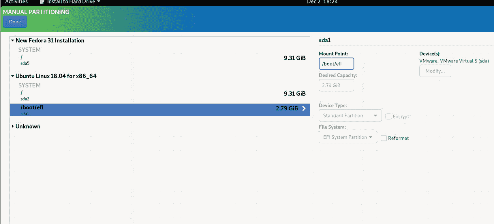

图 2-122

Fedora 装置

记住，不要格式化 sda1，它是 ESP。失去 ESP 就意味着失去 Windows 和 Ubuntu 的 bootloaders。安装完成后，Fedora 的 GRUB 会给我们呈现 OS 列表(图 [2-123](#Fig123) )。

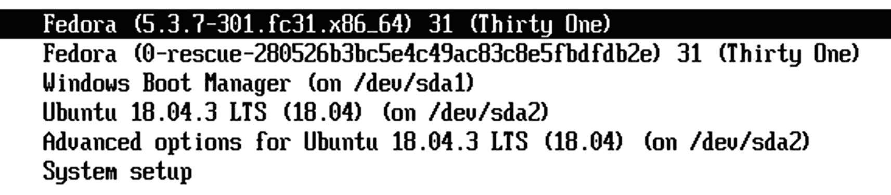

图 2-123

Fedora 显示的操作系统条目

在安装 GRUB 时，Fedora 安装程序 Anaconda 从 ESP 中检测到其他操作系统。为了给他们一个平等的启动机会，Fedora 在`grub.cfg`中添加了 Ubuntu 和 Windows 条目。以下是 Fedora 的引导顺序:


图 2-124

UEFI 中的 Fedora 条目

1.  打开系统电源:首先是 UEFI，然后是 POST，然后是 UEFI。

2.  UEFI 会跳到 ESP 里面。

3.  它将进入 ESP 目录，并通过检查引导优先级来选择要引导的操作系统。到目前为止，引导优先级设置为 Fedora。检查图 [2-124](#Fig124) 。

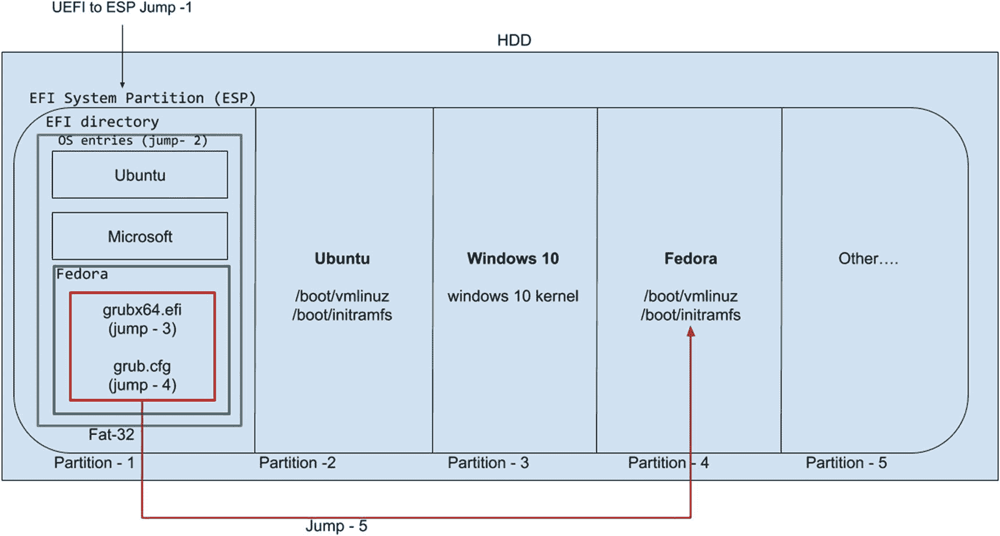

图 2-127

Fedora 的引导序列

1.  Since the boot priority is set to Fedora, UEFI will go inside the `/boot/efi/EFI/fedora` directory (refer Figure [2-125](#Fig125)) and will launch the file `grubx64.efi`.

    

    图 2-125

    Fedora EFI 目录

2.  `grubx64.efi` will read the file `grub.cfg` and print the OS entries on-screen. Figure [2-126](#Fig126) shows this.

    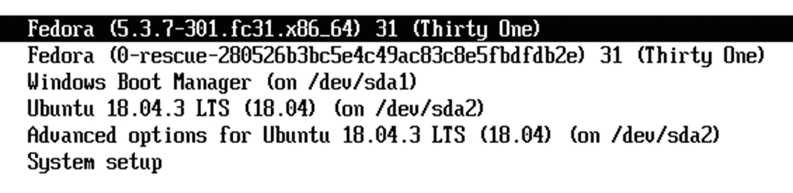

    图 2-126

    Fedora 显示的操作系统条目

3.  当用户选择 Fedora 时，同样的`grubx64.efi`会从`/boot` (sda4)加载`vmlinuz`和 Fedora 的 initramfs 到内存中。Fedora 内核将负责引导序列的其余部分。流程图见图 [2-127](#Fig127) 。内核采取的步骤将在第 [4](04.html) 章详细讨论。

#### UEFI Shell

UEFI 是一个小的操作系统。与普通操作系统一样，UEFI 提供了运行应用程序所需的环境。当然，UEFI 不能运行每一个二进制文件，但是以 EFI 可执行格式构建的二进制文件将很容易运行。UEFI 提供的最好的 app(应用/二进制)之一就是 shell。如图 [2-128](#Fig128) 所示，大多可以在 UEFI 的开机优先级设置中找到。

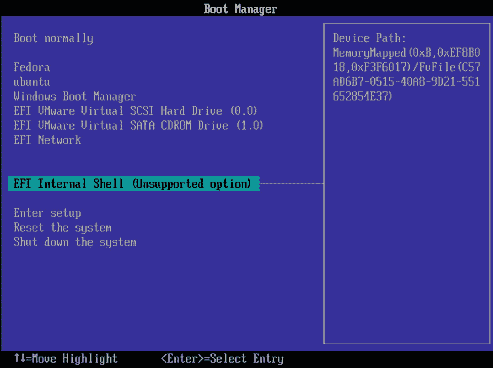

图 2-128

内置的 UEFI Shell

如果您的系统的 UEFI 实现不提供 shell，那么您可以从 TianoCore 项目网站或其 EDK-II GitHub 页面下载 shell 应用程序。

[T2`https://www.tianocore.org/`](https://www.tianocore.org/)

[T2`https://github.com/tianocore/edk2/blob/UDK2018/ShellBinPkg/UefiShell/X64/Shell.efi`](https://github.com/tianocore/edk2/blob/UDK2018/ShellBinPkg/UefiShell/X64/Shell.efi)

用 FAT32 文件系统格式化 USB 设备，并将下载的`Shell.efi`文件放入其中。使用相同的 USB 设备启动，UEFI 将通过其启动优先级窗口向您呈现一个 UEFI shell。参见图 [2-129](#Fig129) 。

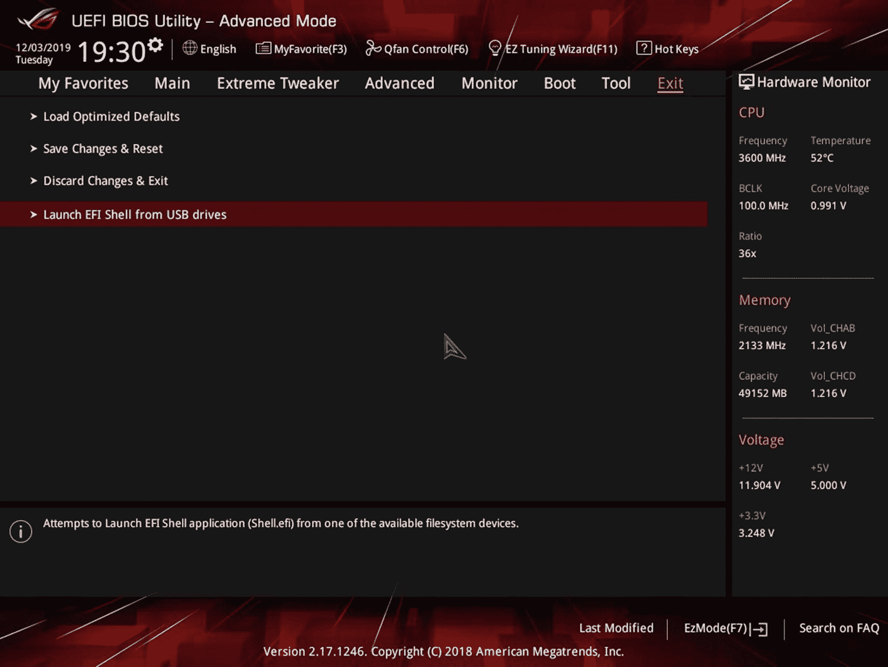

图 2-129

从 USB 加载的 UEFI Shell

令人惊讶的是，UEFI 没有显示系统连接了 USB 设备。相反，UEFI 进入了 USB 设备，看到了 FAT32 文件系统。它看到了`shell.efi`文件，并意识到这不是一个普通的 EFI 应用程序；相反，它将向用户提供Shell。如果它是一个 BIOS，它只会显示该系统连接了 USB 磁盘，但这里 UEFI 显示您在 USB 连接的磁盘中有一个Shell。

当您选择从 USB 驱动器启动 EFI Shell 选项时，它将执行`shell.efi`文件，并在操作系统不存在时向您显示一个 Shell(图 [2-130](#Fig130) )。这是了不起的。


图 2-130

UEFI Shell

`blk*`条目是设备名称，而`fs*`是文件系统命名约定。由于 UEFI shell 能够读取 FAT32 文件系统(ESP 分区)，我们可以浏览 ESP 目录，如图 [2-131](#Fig131) 所示。


图 2-131

浏览 EFI 目录

`fs0`代表文件系统号 0。我们可以使用 shell 的内部命令来更改分区。从图 [2-132](#Fig132) 和图 [2-133](#Fig133) 中可以看出，`fs2`就是我们的 ESP。


图 2-133

Ubuntu 的引导程序目录

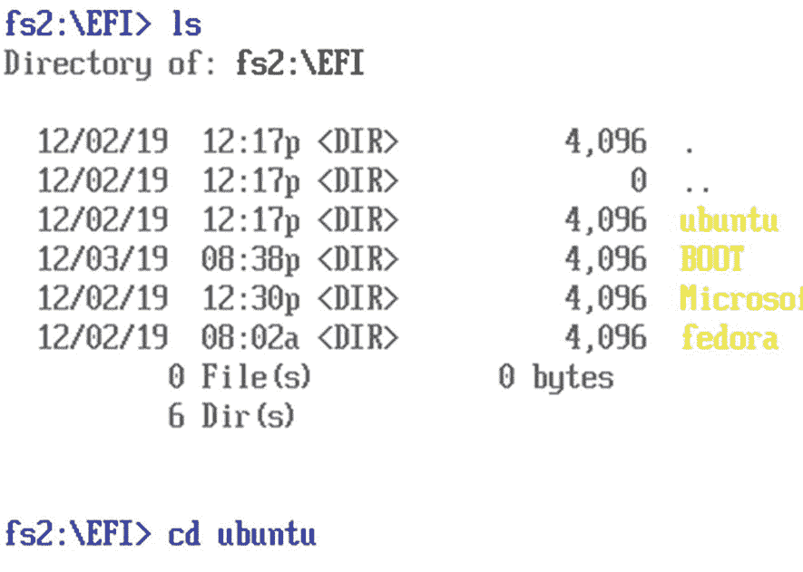

图 2-132

EFI 目录

我们可以简单地通过 shell 运行`grubx64.efi`文件，GRUB 就会出现在屏幕上。参见图 [2-134](#Fig134) 。

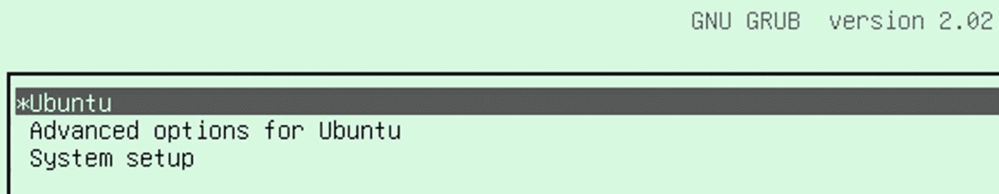

图 2-134

乌班图的食物

对于一个 UEFI shell 来说，`grubx64.efi`就是一个简单的 app。以类似的方式，如图 [2-135](#Fig135) 所示，我们也可以启动 Windows 引导程序。参见图 [2-136](#Fig136) 。


图 2-136

著名的 Windows 动画


图 2-135

从 UEFI shell 启动 Windows 引导加载程序

shell 在解决“无法启动”的情况时非常有用。考虑图 [2-137](#Fig137) 所示的场景，其中系统在 GRUB 提示符下抛出一个错误。

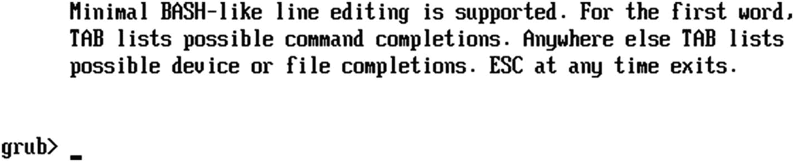

图 2-137

系统无法启动

通过使用 UEFI shell，我们能够检查 GRUB 相关的文件是否存在。

#### 对 UEFI 的误解

以下是对 UEFI 的一些误解。

##### 误解 1: UEFI 是新 BIOS 或者 UEFI 是 BIOS

人们一直说 UEFI 是一个新的 BIOS。事实上，当你进入 UEFI 固件时，固件本身会说它是 UEFI BIOS。检查图 [2-138](#Fig138) 。

不，UEFI 不是 BIOS，也不是新的 BIOS。UEFI 是来代替 BIOS 的。UEFI 是一个全新的固件，你不能在同一个系统上有 BIOS 和 UEFI。你有 UEFI 或者 BIOS。

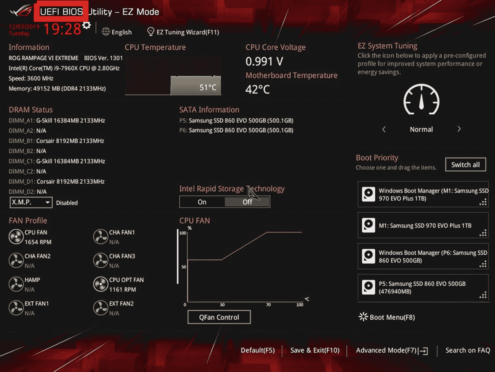

图 2-138

UEFI 不是 BIOS

识别你是否有 BIOS 或者 UEFI 是非常简单的。如果你可以在固件中使用鼠标，那么你就有 UEFI，如果你看到一个丰富的 GUI，那么你就有 UEFI。正确的检查方法是使用类似于`efibootmgr`的命令。

```sh
# efibootmgr -v
Fatal: Couldn't open either sysfs or procfs directories for accessing EFI variables.
Try 'modprobe efivars' as root.

```

如果您在 Linux 系统上从`efibootmgr`命令得到这样的输出，那么您就有了一个 BIOS。如果你得到这样的东西，那么你就有 UEFI:

```sh
# efibootmgr -v

BootCurrent: 0005
Timeout: 2 seconds
BootOrder: 0005,0004,0003,0000,0001,0002,0006,0007,000A
Boot0000* EFI VMware Virtual SCSI Hard Drive (0.0)
      PciRoot(0x0)/Pci(0x15,0x0)/Pci(0x0,0x0)/SCSI(0,0)
Boot0001* EFI VMware Virtual SATA CDROM Drive (1.0)
      PciRoot(0x0)/Pci(0x11,0x0)/Pci(0x4,0x0)/Sata(1,0,0)

```

这是识别系统固件的正确方法。回到我们的 UEFI BIOS 讨论，供应商们一起使用 UEFI 和 BIOS 术语，因为大多数用户不理解术语 UEFI。例如，一篇文章说“更改您的 UEFI 中的参数”可能会让大多数用户感到困惑，但说“更改您的 BIOS 中的参数”会被每个人很好地理解。因此，供应商使用术语 UEFI/BIOS 只是为了便于理解，但是记住你一次只能有一个固件，不能两个都有。

##### 误解二:微软是邪恶的

正如我们所见，UEFI 是一个论坛，操作系统厂商是其中的一部分，包括微软。为了使引导更加安全，微软在 UEFI 中提出了安全引导功能。安全引导将在引导时停止未授权或受损二进制文件的执行。这解决了这三个问题:

*   它保证即将运行的`grubx64.efi`来自一个真实的来源。

*   它保证 BCD 没有任何后门。

*   如果某个东西未经授权，它会阻止它执行。

安全启动是这样工作的:

1.  Microsoft 将生成一个密钥对(公钥和私钥)。

2.  微软将用私钥对其引导程序或文件进行数字签名。

3.  微软的公钥将保存在 UEFI 固件中。

4.  步骤 2 中生成的数字签名将由 UEFI 中的微软公钥重新生成。

5.  如果数字签名匹配，那么只有 UEFI 将允许执行`*.efi`文件。

6.  如果数字签名不匹配，那么 UEFI 将认为这是一个有害的程序，或者至少它不是微软提供的，UEFI 将停止执行。

微软的实现相当不错，对吧？是的，它是。但是当安全引导特性被启用并且您选择 Linux 来引导时，问题就出现了。UEFI 将取出微软的公钥，并将生成`grubx64.efi`的数字签名。生成的数字签名当然不会和微软的 bootloader 文件匹配，所以会被认为是未授权程序，UEFI 会停止执行。换句话说，Linux 或任何非 Windows 操作系统将永远无法启动。那么，这个问题的解决方案是什么？简单:UEFI 应该提供一个选项来禁用安全引导特性，它确实做到了。参见图 [2-139](#Fig139) 。事实上，禁用安全引导功能的选项必须存在于 UEFI 固件中。这是 UEFI 规范中规定的。

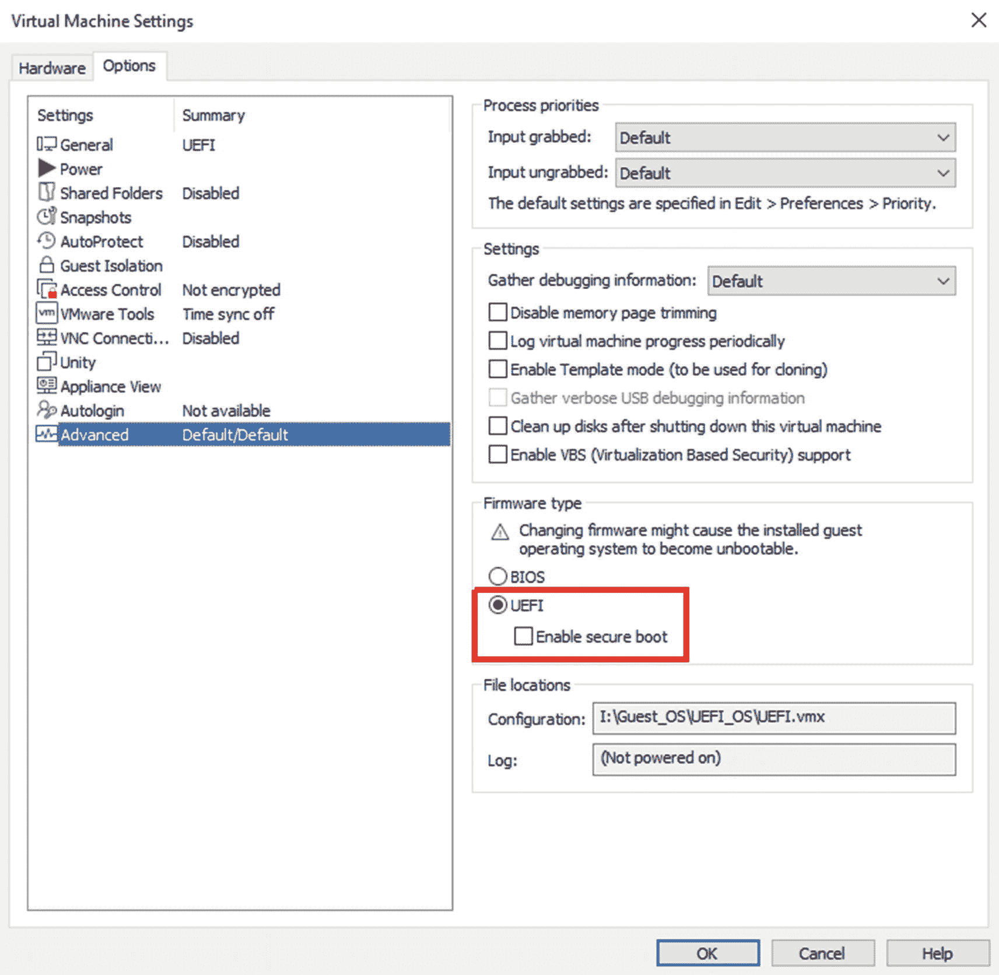

图 2-139

禁用安全引导功能

但是微软已经明确表示，只有启用了安全引导的系统才能通过认证。这意味着，如果您是硬件供应商，并希望您的系统获得 Windows 认证，那么它必须启用安全引导。这一举动被一些行业领导者认为是“邪恶的”,因为非基于 Windows 的操作系统将不能在相同的硬件上启动。我们后面还会回到微软到底是不是邪恶的讨论，但是先来看看非 Windows OSs 有哪些选项。

###### Linux 供应商应该制作他们自己的密钥对

是的，每个 Linux 操作系统供应商都应该制作他们自己的密钥对，然后用他们的私钥签署他们的引导加载程序，并将公钥保存在 UEFI 固件中。每当用户选择 Windows 引导时，UEFI 将使用 Windows 公钥，每当用户选择 Linux 引导时，UEFI 将使用 Linux 公钥重新生成 Linux 引导加载程序文件的数字签名。这似乎是一个简单的解决办法，但这是行不通的。市场上几乎有 200 多个活跃的 Linux 发行版，它们通常每六个月发布一个新版本。这意味着几乎每六个月你就会有一个新版本的 Linux 发行版上市。这大致意味着 Linux 供应商每年将有近 400 个密钥，所以很明显你不能在 UEFI 中容纳这么多的密钥。即使你可以，这也会妨碍 UEFI 设计的主要格言之一，即快速启动。因此，简而言之，这不可能是一项决议。

###### 所有 Linux 供应商应该只制作一个密钥对

这也不能成为一项决议。有 200 多个活跃的 Linux 发行版，它们的办公室遍布世界各地。如果所有的 Linux 供应商走到一起，只制作一个密钥对，那么这个密钥对将不得不通过互联网发送给全世界的开发者。这将是一场安全噩梦。所以简而言之，这将很难维持；因此，这不是一项决议。

###### 禁用 UEFI 的安全引导功能

这似乎是唯一可行的方法。UEFI 确实提供了禁用安全引导功能的工具，微软不反对提供这样的工具。例如，假设你有一个双启动系统，安装了 Windows 10 和 Fedora 31。如果您想引导 Windows，则必须在 UEFI 中启用安全引导，如果下次您想引导 Linux，则必须进入 UEFI，将启用的安全引导更改为禁用状态。您可以认为这是一种变通方法，但这并不实际；因此，它不能被视为一项决议。

那么，Linux 如何利用安全引导呢？解决方法只有一个，那就是使用微软的私钥对 Linux 引导程序文件进行数字签名，你猜怎么着，微软已经同意了这一点。因此，在这个阶段，Linux 能够通过使用微软的密钥对来安全引导，因此微软肯定不是邪恶的。它只是想让它的启动序列安全。

但是这种安排有一个问题；GRUB 开发将依赖于微软的密钥对。如果 GRUB 有任何新的变更，我们需要使用微软的密钥重新签名。Ubuntu 首先通过引入一个叫做 shim 的更小的引导程序解决了这个问题。这个引导装载程序应该用微软的密钥签名，然后这个引导装载程序的工作是调用实际的引导装载程序，也就是 GRUB。通过这种方法，Linux 世界打破了微软的签名依赖。因为 shim 永远不会改变(至少很少改变)，所以 GRUB 开发将会继续它的方式。

因此，如果启用了安全引导，那么 Linux 的引导顺序如下:

1.  打开系统电源:首先是 UEFI，然后是 POST，然后是 UEFI。

2.  ESP 列出了操作系统和可用的可引导设备。

3.  如果用户选择 Linux，引导过程将使用微软的公钥重新生成`shim.efi`文件的数字签名。

4.  如果数字签名匹配，则允许执行`shim.efi`。

5.  `shim.efi`会调用原来的 bootloader，也就是`grubx64.efi`。

6.  `grubx64.efi`将从 ESP 中读取`grub.cfg`文件，并显示可用操作系统列表。

7.  如果用户再次选择 Linux，那么同一个`grubx64.efi`文件将开始在内存中加载内核和 initramfs。

参见图 [2-140](#Fig140) 查看该启动序列中涉及的文件列表。

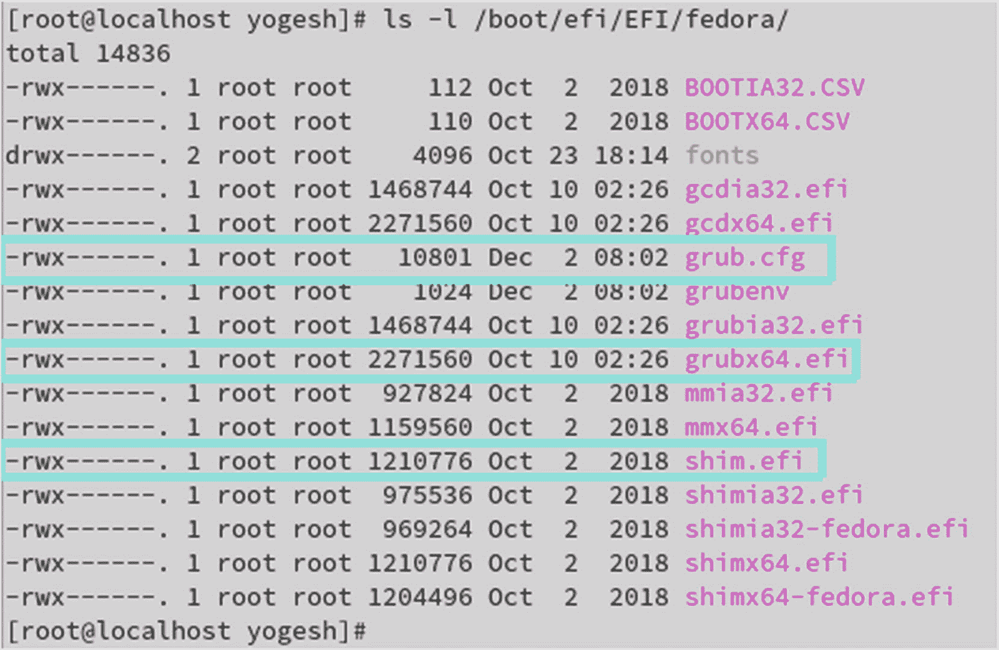

图 2-140

所述引导序列中涉及的文件

##### 误解 3:禁用 UEFI

最大的误解之一是你可以禁用 UEFI 并启动 BIOS。不，您不能禁用您系统的固件；此外，一个系统上不能有两个固件。你有 UEFI 或者 BIOS。当人们说“禁用 UEFI”时，这意味着他们想说，让 UEFI 用 BIOS 或传统方式启动。UEFI 的最大特点之一是它是向后兼容的，这意味着它理解 BIOS 的引导方式，即 512 字节+ 31KB 的方式。因此，当您将 UEFI 设置从 UEFI 方式更改为传统方式时，这仅意味着 UEFI 不会遵循 ESP 引导方式。相反，固件将遵循 BIOS 引导方式，但这并不意味着您禁用了 UEFI 固件。当你以 BIOS 方式启动 UEFI 系统时，你会失去 UEFI 提供的所有功能。

既然您现在对固件和引导加载程序的工作方式有了更好的理解，那么现在是深入研究 GRUB 引导加载程序的时候了。