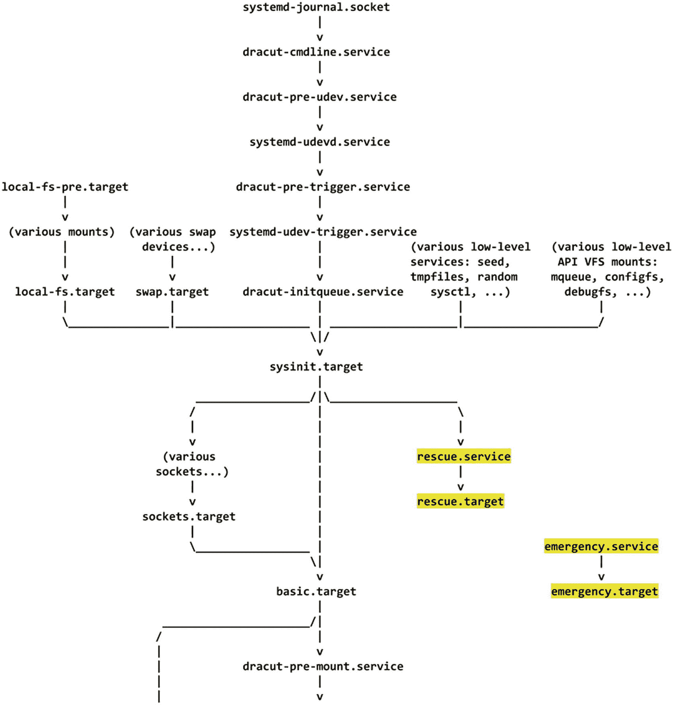
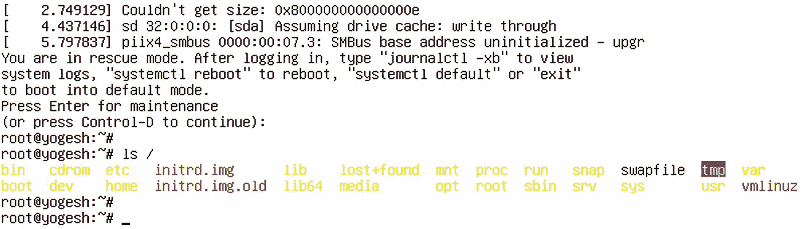

# 8.调试外壳

到目前为止，我们知道 initramfs 内置了 bash，并且我们不时地通过`rd.break`钩子来使用它。本章的目的是理解 systemd 如何在 initramfs 中为我们提供一个 shell。必须遵循的步骤是什么，如何更有效地使用它？但是在此之前，让我们回顾一下到目前为止我们所学到的关于 initramfs 的调试和紧急 shells 的知识。

## 贝壳

```sh
rd.break
           drop to a shell at the end

```

`rd.break`将我们放入 initramfs 中，我们可以通过它探索 initramfs 环境。这个 initramfs 环境也被称为*紧急模式*。在正常情况下，当 initramfs 无法挂载用户的根文件系统时，我们会在紧急模式下掉线。请记住，在将用户的根文件系统挂载到`/sysroot`下之后，但在对其执行`switch_root`之前，不带任何参数地传递`rd.break`会将我们放到 initramfs。你总能在`/run/initramfs/rdsosreport.txt`文件中找到详细的日志。图 [8-1](#Fig1) 显示了来自`rdsosreport.txt`的日志。


图 8-1

rdsosreport.txt 运行时日志

在日志消息中，您可以清楚地看到它就在执行`pivot_root`之前被丢弃。`pivot_root`和`switch_root`将在第 [9](09.html) 章讨论，而`chroot`将在第 [10](10.html) 章讨论。一旦退出紧急 shell，systemd 将继续暂停的引导序列，并最终提供登录屏幕。

然后我们讨论了如何使用紧急 shells 来修复一些“无法启动”的问题。例如，initramfs 与用户的根文件系统一样好。因此，它确实有`lvm`、`raid`和与文件系统相关的二进制文件，我们可以用它们来查找、组装、诊断和修复丢失的用户根文件系统。然后我们讨论了如何将它安装在`/sysroot`下，并探索它的内容，例如修复`grub.cfg`的错误条目。

同样，`rd.break`也为我们提供了不同的选项来打破不同阶段的引导顺序。

*   `cmdline`:这个钩子获取内核命令行参数。

*   `pre-udev`:这打破了`udev`处理程序之前的引导顺序。

*   `pre-trigger`:可以用`udevadm`控件设置`udev`环境变量，也可以用`udevadm`控件设置`--property=KEY=value`类参数或控制`udev`的进一步执行。

*   `pre-mount`:这在`/sysroot`挂载用户的根文件系统之前中断了引导序列。

*   `mount`:这打破了在`/sysroot`挂载根文件系统后的引导顺序。

*   `pre-pivot`:这在切换到实际的根文件系统之前中断了引导序列。

现在让我们看看 systemd 是如何在这些不同的阶段为我们提供 shells 的。

## systemd 如何让我们进入紧急状态？

让我们考虑一个`pre-mount`钩子的例子。来自 initramfs 的 systemd 从`dracut-cmdline.service`收集`rd.break=pre-mount`命令行参数，并从 initramfs 位置`/usr/lib/systemd/system.`运行 systemd 服务`dracut-pre-mount.service`，该服务将在运行`initrd-root-fs.target`、`sysroot.mount`和`systemd-fsck-root.service`之前运行。

```sh
# cat usr/lib/systemd/system/dracut-pre-mount.service | grep -v #'

[Unit]
Description=dracut pre-mount hook
Documentation=man:dracut-pre-mount.service(8)
DefaultDependencies=no
Before=initrd-root-fs.target sysroot.mount systemd-fsck-root.service
After=dracut-initqueue.service cryptsetup.target
ConditionPathExists=/usr/lib/initrd-release
ConditionDirectoryNotEmpty=|/lib/dracut/hooks/pre-mount
ConditionKernelCommandLine=|rd.break=pre-mount
Conflicts=shutdown.target emergency.target

[Service]
Environment=DRACUT_SYSTEMD=1
Environment=NEWROOT=/sysroot
Type=oneshot
ExecStart=-/bin/dracut-pre-mount
StandardInput=null
StandardOutput=syslog
StandardError=syslog+console
KillMode=process
RemainAfterExit=yes

KillSignal=SIGHUP

```

如您所见，它只是从 initramfs 执行了`/bin/dracut-pre-mount`脚本。

```sh
# vim bin/dracut-pre-mount
  1 #!/usr/bin/sh
  2
  3 export DRACUT_SYSTEMD=1
  4 if [ -f /dracut-state.sh ]; then
  5     . /dracut-state.sh 2>/dev/null
  6 fi
  7 type getarg >/dev/null 2>&1 || . /lib/dracut-lib.sh
  8
  9 source_conf /etc/conf.d
 10
 11 make_trace_mem "hook pre-mount" '1:shortmem' '2+:mem' '3+:slab' '4+:komem'
 12 # pre pivot scripts are sourced just before we doing cleanup and switch over
 13 # to the new root.
 14 getarg 'rd.break=pre-mount' 'rdbreak=pre-mount' && emergency_shell -n pre-mount "Break pre-mount"
 15 source_hook pre-mount
 16
 17 export -p > /dracut-state.sh
 18
 19 exit 0

```

在`/bin/dracut-pre-mount`脚本中，最重要的一行如下:

```sh
getarg rd.break=pre-mount' rdbreak=pre-mount
     && emergency_shell -n pre-mount "Break pre-mount"

```

我们已经讨论过了`getarg`函数，它用于检查什么参数被传递给了`rd.break=`。如果已经通过了`rd.break=pre-mount`，那么只调用`emergency-shell()`函数。该函数在`/usr/lib/dracut-lib.sh`中定义，并将`pre-mount`作为字符串参数传递给它。`-n`代表以下内容:

*   `[ -n STRING ] or [ STRING ]`:如果`STRING`的长度不为零，则为真

`emergency_shell`函数接受`_rdshell_name`变量的值作为`pre-mount.`

```sh
if [ "$1" = "-n" ]; then
      _rdshell_name=$2

```

这里，`-n`被认为是第一个自变量(`$1`)，而`pre-mount`是第二个自变量(`$2`)。所以，`_rdshell_name`的值变成了`pre-mount`。

```sh
#vim /usr/lib/dracut-lib.sh
1123 emergency_shell()
1124 {
1125     local _ctty
1126     set +e
1127     local _rdshell_name="dracut" action="Boot" hook="emergency"
1128     local _emergency_action
1129
1130     if [ "$1" = "-n" ]; then
1131         _rdshell_name=$2
1132         shift 2
1133     elif [ "$1" = "--shutdown" ]; then
1134         _rdshell_name=$2; action="Shutdown"; hook="shutdown-emergency"
1135         if type plymouth >/dev/null 2>&1; then
1136             plymouth --hide-splash
1137         elif [ -x /oldroot/bin/plymouth ]; then
1138             /oldroot/bin/plymouth --hide-splash
1139         fi
1140         shift 2
1141     fi
1142
1143     echo ; echo
1144     warn "$*"
1145     echo
1146
1147     _emergency_action=$(getarg rd.emergency)
1148     [ -z "$_emergency_action" ] \
1149         && [ -e /run/initramfs/.die ] \
1150         && _emergency_action=halt
1151
1152     if getargbool 1 rd.shell -d -y rdshell || getarg rd.break -d rdbreak; then
1153         _emergency_shell $_rdshell_name
1154     else
1155         source_hook "$hook"
1156         warn "$action has failed. To debug this issue add \"rd.shell rd.debug\" to the kernel command line."
1157         [ -z "$_emergency_action" ] && _emergency_action=halt
1158     fi
1159
1160     case "$_emergency_action" in
1161         reboot)
1162             reboot || exit 1;;
1163         poweroff)
1164             poweroff || exit 1;;
1165         halt)
1166             halt || exit 1;;
1167     esac
1168 }

```

然后，在最后，它从同一个文件中调用另一个`_emergency_shell`函数(注意函数名前的下划线)。如您所见，`_rdshell_name`是`_emergency_shell`函数的参数。

```sh
_emergency_shell $_rdshell_name

```

在`_emergency_shell()`函数内部，我们可以看到`_name`得到参数，也就是`pre-mount`。

```sh
local _name="$1"

#vim usr/lib/dracut-lib.sh
1081 _emergency_shell()
1082 {
1083     local _name="$1"
1084     if [ -n "$DRACUT_SYSTEMD" ]; then
1085         > /.console_lock
1086         echo "PS1=\"$_name:\\\${PWD}# \"" >/etc/profile
1087         systemctl start dracut-emergency.service
1088         rm -f -- /etc/profile
1089         rm -f -- /.console_lock
1090     else
1091         debug_off
1092         source_hook "$hook"
1093         echo
1094         /sbin/rdsosreport
1095         echo 'You might want to save "/run/initramfs/rdsosreport.txt" to a USB stick or /boot'
1096         echo 'after mounting them and attach it to a bug report.'
1097         if ! RD_DEBUG= getargbool 0 rd.debug -d -y rdinitdebug -d -y rdnetdebug; then
1098             echo
1099             echo 'To get more debug information in the report,'
1100             echo 'reboot with "rd.debug" added to the kernel command line.'
1101         fi
1102         echo
1103         echo 'Dropping to debug shell.'
1104         echo
1105         export PS1="$_name:\${PWD}# "
1106         [ -e /.profile ] || >/.profile
1107
1108         _ctty="$(RD_DEBUG= getarg rd.ctty=)" && _ctty="/dev/${_ctty##*/}"
1109         if [ -z "$_ctty" ]; then
1110             _ctty=console
1111             while [ -f /sys/class/tty/$_ctty/active ]; do
1112                 _ctty=$(cat /sys/class/tty/$_ctty/active)
1113                 _ctty=${_ctty##* } # last one in the list
1114             done
1115             _ctty=/dev/$_ctty
1116         fi
1117         [ -c "$_ctty" ] || _ctty=/dev/tty1
1118         case "$(/usr/bin/setsid --help 2>&1)" in *--ctty*) CTTY="--ctty";; esac
1119         setsid $CTTY /bin/sh -i -l 0<>$_ctty 1<>$_ctty 2<>$_ctty
1120     fi

```

相同的`pre-mount`字符串已被传递给`PS1`。让我们先看看`PS1`到底是什么。

`PS1`称为一个*伪*变量。当用户成功登录时，bash 会显示出来。这里有一个例子:

```sh
[root@fedora home]#
  |  |   |    |
[username]@[host][CWD][# since it is a root user]

```

bash 接受的理想条目是`PS1='\u:\w\$'`。

*   这是用户名。

*   这是工作目录。

*   **$** =如果 UID 为 0，则`#`；否则`$'`。

所以，在我们的例子中，当我们得到一个紧急 shell 时，`PS1`将被 shell 打印如下:

```sh
'pre-mount#'

```

接下来在源代码中，您可以看到`PS1`变量的新值也被添加到了`/etc/profile.`中，原因是 bash 每次在将 shell 呈现给用户之前都会读取这个文件。最后，我们简单地启动了`dracut-emergency`服务。

```sh
systemctl start dracut-emergency.service

```

以下是 initramfs 的`usr/lib/systemd/system/`中的`dracut-emergency.service`文件:

```sh
# cat usr/lib/systemd/system/dracut-emergency.service | grep -v #'

[Unit]
Description=Dracut Emergency Shell
DefaultDependencies=no
After=systemd-vconsole-setup.service
Wants=systemd-vconsole-setup.service
Conflicts=shutdown.target emergency.target

[Service]
Environment=HOME=/
Environment=DRACUT_SYSTEMD=1
Environment=NEWROOT=/sysroot
WorkingDirectory=/
ExecStart=-/bin/dracut-emergency
ExecStopPost=-/bin/rm -f -- /.console_lock
Type=oneshot
StandardInput=tty-force
StandardOutput=inherit
StandardError=inherit
KillMode=process
IgnoreSIGPIPE=no
TasksMax=infinity

KillSignal=SIGHUP

```

服务只是简单地执行`/bin/dracut-emergency`。这个脚本首先停止`plymouth`服务。

```sh
type plymouth >/dev/null 2>&1 && plymouth quit

```

这会将`hook`变量的值存储为`emergency`，并使用`emergency`参数调用`source_hook`函数。

```sh
export _rdshell_name="dracut" action="Boot" hook="emergency"
source_hook "$hook"

# vim bin/dracut-emergency
     1 #!/usr/bin/sh
  2
  3 export DRACUT_SYSTEMD=1
  4 if [ -f /dracut-state.sh ]; then
  5     . /dracut-state.sh 2>/dev/null
  6 fi
  7 type getarg >/dev/null 2>&1 || . /lib/dracut-lib.sh
  8
  9 source_conf /etc/conf.d
 10
 11 type plymouth >/dev/null 2>&1 && plymouth quit
 12
 13 export _rdshell_name="dracut" action="Boot" hook="emergency"
 14 _emergency_action=$(getarg rd.emergency)
 15
 16 if getargbool 1 rd.shell -d -y rdshell || getarg rd.break -d rdbreak; then
 17     FSTXT="/run/dracut/fsck/fsck_help_$fstype.txt"
 18     source_hook "$hook"
 19     echo
 20     rdsosreport
 21     echo
 22     echo
 23     echo Entering emergency mode. Exit the shell to continue.'
 24     echo Type "journalctl" to view system logs.'
 25     echo You might want to save "/run/initramfs/rdsosreport.txt" to a USB stick or /boot'
 26     echo after mounting them and attach it to a bug report.'
 27     echo
 28     echo
 29     [ -f "$FSTXT" ] && cat "$FSTXT"
 30     [ -f /etc/profile ] && . /etc/profile
 31     [ -z "$PS1" ] && export PS1="$_name:\${PWD}# "
 32     exec sh -i -l
 33 else
 34     export hook="shutdown-emergency"
 35     warn "$action has failed. To debug this issue add \"rd.shell rd.debug\" to the kernel command line."
 36     source_hook "$hook"
 37     [ -z "$_emergency_action" ] && _emergency_action=halt
 38 fi
 39
 40 /bin/rm -f -- /.console_lock
 41
 42 case "$_emergency_action" in
 43     reboot)
 44         reboot || exit 1;;
 45     poweroff)
 46         poweroff || exit 1;;
 47     halt)
 48         halt || exit 1;;
 49 esac
 50
 51 exit 0

```

在`usr/lib/dracut-lib.sh`中再次定义了`source_hook`功能。

```sh
source_hook() {
    local _dir
    _dir=$1; shift
    source_all "/lib/dracut/hooks/$_dir" "$@"
}

```

`_dir`变量已经捕获了钩子名称，即`emergency`。所有的钩子都只是一堆脚本，从 initramfs 的`/lib/dracut/hooks/`目录中存储和执行。

```sh
# tree usr/lib/dracut/hooks/
usr/lib/dracut/hooks/
├── cleanup
├── cmdline
│   ├── 30-parse-lvm.sh
│   ├── 91-dhcp-root.sh
│   └── 99-nm-config.sh
├── emergency
│   └── 50-plymouth-emergency.sh
├── initqueue
│   ├── finished
│   ├── online
│   ├── settled
│   │   └── 99-nm-run.sh
│   └── timeout
│       └── 99-rootfallback.sh
├── mount
├── netroot
├── pre-mount
├── pre-pivot
│   └── 85-write-ifcfg.sh
├── pre-shutdown
├── pre-trigger
├── pre-udev
│   └── 50-ifname-genrules.sh
├── shutdown
│   └── 25-dm-shutdown.sh
└── shutdown-emergency

```

对于紧急钩子，它正在执行`usr/lib/dracut/hooks/emergency/50-plymouth-emergency.sh`，这正在停止`plymouth`服务。

```sh
#!/usr/bin/sh
plymouth --hide-splash 2>/dev/null || :

```

一旦`emergency`挂钩被执行并且`plymouth`被停止，它将返回到`bin/dracut-emergency`并打印以下横幅:

```sh
echo Entering emergency mode. Exit the shell to continue.'
echo Type "journalctl" to view system logs.'
echo You might want to save "/run/initramfs/rdsosreport.txt" to a USB stick or /boot'
echo after mounting them and attach it to a bug report.'

```

因此，`rd.break=hook_name`用户通过了什么并不重要。systemd 将执行`emergency`钩子，一旦横幅被打印出来，它将获取我们已经添加了`PS1=_rdshell_name` / `PS1=hook_name`的`/etc/profile`目录，然后我们就可以简单地运行 bash shell 了。

```sh
exec sh -i –l

```

当 shell 开始运行时，它会读取`/etc/profile`，并找到`PS1=hook_name`变量。在这里，`hook_name`就是`pre-mount`。这就是为什么`pre-mount`作为 bash 的提示名被印了出来。请参考图 [8-2](#Fig2) 所示的流程图，以便更好地理解这一点。


图 8-2

流程图

如果用户向`rd.break`传递任何其他参数，例如`initqueue`，那么它将被馈入`PS1`、`_rdshell_name`和钩子变量。稍后，bash 将通过紧急服务被调用。Bash 将从`/etc/profile`文件中读取`PS1`值，并在提示中显示`initqueue`名称。

结论是，相同的 bash shell 会以不同的提示名称(`cmdline`、`pre-mount`、`switch_root`、`pre-udev`、`emergency`等)提供给用户。)但是在 initramfs 的不同引导阶段。

```sh
cmdline:/# pre-udev:/#
pre-trigger:/# initqueue:/#
pre-mount:/# pre-pivot:/#
switch_root:/#

```

与此类似，`rescue.target`将由 systemd 执行。

## 救援服务和紧急服务

救援服务在 systemd 世界中也被称为*单用户模式*。因此，如果用户请求以单用户模式引导，那么 systemd 实际上会在`rescue.service`阶段将用户放在紧急 shell 中。图 [8-3](#Fig3) 显示了到目前为止的引导顺序。



图 8-3

引导序列的流程图

你可以通过`rescue.target`或者通过`runlevel1.target`或者`emergency.service`到`systemd.unit`以单用户模式引导。如图 [8-4](#Fig4) 所示，这次我们将使用 Ubuntu 来探索引导阶段。


图 8-4

内核命令行参数

这会让我们陷入紧急状态。单用户模式、救援服务和紧急服务都启动`dracut-emergency`二进制。这是我们在 dracut 的紧急挂钩中发布的相同二进制文件。

```sh
# cat usr/lib/systemd/system/emergency.service | grep -v ' #'

[Unit]
Description=Emergency Shell
DefaultDependencies=no
After=systemd-vconsole-setup.service
Wants=systemd-vconsole-setup.service
Conflicts=shutdown.target
Before=shutdown.target

[Service]
Environment=HOME=/
Environment=DRACUT_SYSTEMD=1
Environment=NEWROOT=/sysroot
WorkingDirectory=/
ExecStart=/bin/dracut-emergency
ExecStopPost=-/usr/bin/systemctl --fail --no-block default
Type=idle
StandardInput=tty-force
StandardOutput=inherit
StandardError=inherit
KillMode=process
IgnoreSIGPIPE=no
TasksMax=infinity

KillSignal=SIGHUP

# cat usr/lib/systemd/system/rescue.service | grep -v ' #'

[Unit]
Description=Emergency Shell
DefaultDependencies=no
After=systemd-vconsole-setup.service
Wants=systemd-vconsole-setup.service
Conflicts=shutdown.target
Before=shutdown.target

[Service]
Environment=HOME=/
Environment=DRACUT_SYSTEMD=1

Environment=NEWROOT=/sysroot
WorkingDirectory=/
ExecStart=/bin/dracut-emergency
ExecStopPost=-/usr/bin/systemctl --fail --no-block default
Type=idle
StandardInput=tty-force
StandardOutput=inherit
StandardError=inherit
KillMode=process
IgnoreSIGPIPE=no
TasksMax=infinity

KillSignal=SIGHUP

```

众所周知，`dracut-emergency`脚本执行一个 bash shell。

```sh
# vim bin/dracut-emergency
  1 #!/usr/bin/sh
  2
  3 export DRACUT_SYSTEMD=1
  4 if [ -f /dracut-state.sh ]; then
  5     . /dracut-state.sh 2>/dev/null
  6 fi
  7 type getarg >/dev/null 2>&1 || . /lib/dracut-lib.sh
  8
  9 source_conf /etc/conf.d
 10
 11 type plymouth >/dev/null 2>&1 && plymouth quit
 12
 13 export _rdshell_name="dracut" action="Boot" hook="emergency"
 14 _emergency_action=$(getarg rd.emergency)
 15
 16 if getargbool 1 rd.shell -d -y rdshell || getarg rd.break -d rdbreak; then
 17     FSTXT="/run/dracut/fsck/fsck_help_$fstype.txt"
 18     source_hook "$hook"
 19     echo
 20     rdsosreport
 21     echo
 22     echo
 23     echo 'Entering emergency mode. Exit the shell to continue.'
 24     echo 'Type "journalctl" to view system logs.'
 25     echo 'You might want to save "/run/initramfs/rdsosreport.txt" to a USB stick or /boot'
 26     echo 'after mounting them and attach it to a bug report.'
 27     echo
 28     echo
 29     [ -f "$FSTXT" ] && cat "$FSTXT"
 30     [ -f /etc/profile ] && . /etc/profile
 31     [ -z "$PS1" ] && export PS1="$_name:\${PWD}# "
 32     exec sh -i -l
 33 else
 34     export hook="shutdown-emergency"

 35     warn "$action has failed. To debug this issue add \"rd.shell rd.debug\" to the kernel command line."
 36     source_hook "$hook"
 37     [ -z "$_emergency_action" ] && _emergency_action=halt
 38 fi
 39
 40 /bin/rm -f -- /.console_lock
 41
 42 case "$_emergency_action" in
 43     reboot)
 44         reboot || exit 1;;
 45     poweroff)
 46         poweroff || exit 1;;
 47     halt)
 48         halt || exit 1;;
 49 esac
 50
 51 exit 0

```

如图 [8-5](#Fig5) 所示，`sysroot`还没有挂载，因为我们还没有到达启动的挂载阶段。



图 8-5

应急外壳

我希望您现在理解了 systemd 如何在不同的引导阶段向用户呈现紧急 shell。在下一章中，我们将继续暂停的 systemd 的引导序列。