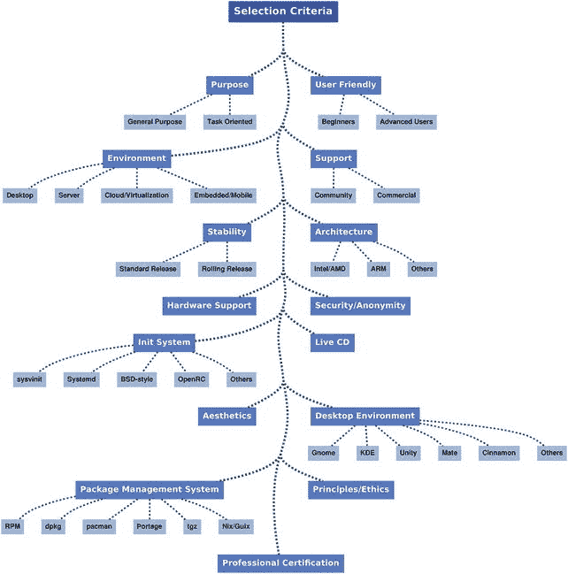

# 二、Linux 发行版选择标准

既然您已经知道了什么是 Linux 发行版以及为什么会有这么多发行版，下一步就是找到一种方法来比较和筛选它们。最好的方法是选择一系列可以用来客观地测量和分类各种 Linux 发行版的因素，在你的推理中不要有偏见。听取同事或 Linux 专家的意见，或者阅读一篇文章或评论等等都是可以的，但是很少能找到完全不带偏见或与您的特定情况相匹配的资料来源。我强烈建议你考虑这些因素，并根据你的需要权衡最重要的因素。然后，您可以根据这些需求选择最强的发行版。这本书将帮助你做出明智的决定。

在这一章中，我在每一个类别中列出了一些发行版，但是不要把这作为一种容易选择正确发行版的方式(同样，我没有列出所有适合某一特定点的发行版)。你应该根据许多因素来选择你的 Linux 发行版，而不仅仅是一个因素(除非是非常特殊的情况，比如面向任务的情况)。本章的目的是帮助你评估每一个发行版，知道你在评估时应该考虑哪些因素。

在接下来的章节中，我将向你详细介绍许多发行版。我选择了一个最流行、最可靠、最安全的示例，但也选择了几个示例来说明一些要点，比如当前最先进的 Linux 发行版或适合特定需求的发行版。在某些章节中，我会引用我在这里提到的因素来查看每个发行版的评分。虽然不可能涵盖所有可供您选择的方案，但我会尽可能涵盖更多方面。

另外，请注意，从技术上讲，我并没有深入研究。我认为那超出了本书的范围。为了给你准确的信息，我必须介绍一些技术细节和概念，但是如果你是 Linux 新手，我不希望你因为我太专业而分心或被我吓倒。当我分析不同的发行版时，我会尽可能从技术角度来解释它们的性能。

Note

我提到了选择 Linux 发行版时要考虑的许多因素。到本章结束时，你可能已经提出了一些我没有提到的因素。请注意，我涵盖了做出正确决定的最关键的问题，我丢弃了一些，因为我认为它们与提到的问题或不太具体的问题重叠。

## 选择 Linux 发行版时要考虑的因素

图 2-1 显示了选择 Linux 发行版时需要考虑的重要因素。选择一个系统的第一步，不管它是什么，是问你自己你将如何使用它。使用你的新操作系统来撰写信件和追踪你的财务状况与使用一个新操作系统来服务互联网上的市场是不一样的。您可以使用同一个发行版来实现这两个目的，有些人就是这样做的，但是在大多数情况下这将是一个非常糟糕的决定。即使你是计算机新手，你也可能知道，在家庭和专业工作中使用相同的工具通常不是一个好主意。

Figure 2-1 . The Linux distribution selection criteria graph

让我们将基本工作流的类别分为两大类:通用和面向任务。

### 通用

我们可以将大多数 Linux 发行版归入这一类，我们可以将它们视为 Linux 的其他大竞争对手:MS Windows 和 Apple OS X 的等价物。相反，他们试图完成从写文档到编辑视频等普通而多样的工作。这些任务是每个人想到操作系统时都会想到的。大多数想要一个自己使用的 Linux 发行版的人也想执行这样的任务。

你希望一个发行版能够使用你在家里或工作中日常工作所需的任何种类的软件。在这一类中有最流行的发行版:Ubuntu、Fedora、Debian 和 Mint。

### 面向任务

为什么你需要一个专门的 Linux 发行版？这是一个有趣的问题，没有简单的答案。最常见的情况如下:

*   你想用发行版做一些特定的事情，而一般的 Linux 发行版缺少一个必要的特性。它可以是简单的大量定制和添加特定软件库的能力。教育和面向儿童的发行版就是很好的例子。
*   您希望只专注于一项任务，并删除所有不需要的功能和软件。这有几个原因，如下所示:
    *   硬件限制:它可能是磁盘或内存中的空间，或者是架构，比如面向网络设备的发行版，比如路由器或其他嵌入式设备。您可能需要将发行版中的软件减少到最低要求；通常内核也是定制的。另一个例子是适合移动设备的发行版，比如 Android。
    *   安全性:如果您想在防火墙或类似的设备上运行 Linux 发行版，那么出于无漏洞和性能的原因，您希望尽可能减少软件开销。并且您只想使用您可以信任的软件和库。阿尔卑斯山就是一个很好的例子，尾巴也是。
    *   易于使用:管理家庭影院电脑的发行版不需要文字处理器或电子表格，但易于使用的面向遥控器的界面是一个理想的特性。同样，Chrome OS 笔记本发行版专注于云中的应用和存储。

这个类别中有大量的任务和发行版；如此之多，以至于我用了整个第 17 章来讨论这个话题。事先，为了完整起见，我将在这里列举一些任务和分布。

*   多媒体/艺术:Ubuntu 工作室，ArtistX
*   媒体电脑/家庭影院:Kodi(原名 XBMC)、Mythbuntu
*   安全/取证/匿名:Kali，Tails，DEFT
*   存储:免费 NAS
*   手机:安卓、Tizen、Ubuntu 手机
*   云应用:Chrome
*   路由器:开放资源
*   游戏:steamos
*   云/数据中心:CoreOS

我想你明白了。如果你正在寻找这种类型的发行版，你可以跳到第 17 章，但是更好的办法是继续阅读，看看在选择一个适合你的发行版时你还应该考虑哪些因素。

### 环境

另一个你在寻找 Linux 发行版时应该考虑的问题是你将要运行它的环境。我将它分成了四个主要的环境，您可以在其中运行 Linux 发行版(我试图保持它的简单性):桌面、服务器、云/虚拟化和嵌入式。

#### 桌面

桌面环境是大多数人想到一个 Linux 发行版时想到的；具有讽刺意味的是，正是在这一点上，Linux 最不成功。虽然有人估计桌面上安装了数千万个 Linux 操作系统(有人估计高达一亿多个)，但事实是 Linux 与该领域的领导者 Windows 和苹果(按此顺序)之间存在巨大差距。一些人认为，Linux 桌面用户数量与苹果全球用户数量非常相似。大多数 Linux 发行版都是面向这种环境的(大的发行版针对每种环境都有专门的版本)，具有讽刺意味的是，许多人认为这是 Linux 在这一领域缺乏成功的原因。无论如何，Linux 最初是一个桌面操作系统，它仍然是大多数用户的第一个 Linux 体验。

这里我们可以谈论 SoHo 用户(小型办公室、家庭)以及公司和工作站用户。通常面向这种环境的 Linux 发行版是一个通用的发行版，它注重易用性并提供一个熟悉的图形界面。这些发行版还包含更适合服务器用途的管理工具和服务，但它们不像服务器那样适合这项任务，当人们在桌面以外的环境中使用它们时，通常需要大量的定制和知识才能使它们正常工作。Debian 就是一个典型的例子。

在这一类别中几乎所有最流行的发行版:Ubuntu、Fedora、Mint、Debian、OpenSUSE 等。

#### 计算机网络服务器

当您需要为数据库或网站提供服务时，您可以使用面向服务器环境的 Linux 发行版。这些发行版特别适合这个任务，包含了工具、服务、安全性、定制和专门的内核。他们通常缺乏一个图形化的环境。安全性、性能和稳定性是这一类别的主要特征，通常这些发行版与桌面发行版相比有点过时。这些 Linux 发行版应该在 365/24 的基础上运行，并且通常几年都不会重新启动。考虑到这个类别的关键方面，依赖一个不是专门为这个任务设计的 Linux 发行版可能在短时间内有效(通常需要很大的努力和很多麻烦),但从长远来看，这可能是一个噩梦。我宁愿在我的桌面上使用服务器发行版(这也是一种不愉快的体验),而不是在服务器上使用桌面发行版。(Debian 是一个明显的例外)。

在这一类别中有流行的和公认的发行版，如 Red Hat Enterprise Linux、SUSE Linux Enterprise Server、CentOS 和 Oracle(后两个是 Red Hat 的分支),以及最流行的桌面发行版的相应服务器版本，如 Ubuntu Server 或 Debian。

#### 云/虚拟化

这是服务器类别的一个子类或超级专门化，但是它的重要性以及如何塑造 Linux 的未来足以证明它的地位。您将在这里找到适合在云中工作的发行版，它们需要可靠、安全、可伸缩、易于自动化和部署等。

大多数大而流行的发行版都在这个环境中使用，比如 Red Hat、CentOS、Ubuntu 和 Debian。有些提供专门的版本来适应新的需求，如 Ubuntu Cloud 和 Amazon AMI(Red Hat 的一个分支，适合与 AWS 一起工作)，有些甚至提供自己的云服务，如 Red Hat OpenStack 或 OpenShift。也有特别为这种环境创建的极轻和极小的 Linux 发行版，如 CoreOS，它利用了容器(Docker、rocket 和 Kubernetes)等新技术。其他类似的新举措，连同 systemd，最终开始指向 Linux 和整个服务器的未来。

虽然现在内核默认支持虚拟化，但有一些发行版只关注虚拟化，如 Oracle VM Server 或 Proxmox VE(基于 Debian ),它们像裸机虚拟机管理程序一样工作。

#### 嵌入式/移动

嵌入式/移动类别的发行版非常专业，旨在适应移动设备、消费电子、网络设备(路由器、防火墙)、机器控制、工业自动化、道路车辆、医疗器械等。最著名的应用在移动设备上，比如 Android、Ubuntu mobile 和 Tizen。其他如 OpenWrt 和 Alpine 则专注于网络设备。当然，还有一个面向嵌入式设备的 Debian 发行版。

### 支持

对于一些用户来说，比如专业人士，支持的级别可以作为一个门槛来筛选哪些 Linux 发行版适合他们，哪些不适合。良好的文档或用户社区的支持(维基、irc、论坛、邮件列表等)。)对于有经验的用户或家庭用户来说已经足够了，但是对于企业来说，您可能需要商业支持来保持系统的正常运行。所以，正如你可能已经想到的，这个群体分为两类:社区和商业支持。

#### 社区

传统上，由于 Linux 本身的起源，安装和排除操作系统故障所需的帮助文档是由用户和开发人员社区创建和维护的。如果发行版有一个大的社区，文档和支持的数量和质量都会更好。当支持更好时，它为社区吸引新用户。一个传统的例子是 Debian。然而，即使是一些面向高级用户并且难以安装和管理的发行版，也有很好的文档和非常支持的社区，比如 Arch Linux 或 Gentoo。

在大多数发行版中，您可以从社区中获得一些文档(在网页、wiki 或 CD 中),以及用户可以相互交流以回答问题的几种方式。几乎每个 Linux 发行版都有邮件列表，大部分也有 irc 频道和论坛；较大的也有一些系统，让用户向开发者提交错误。通常有相同类型的独立资源来驱动开发者和普通用户进入有时在某些主题上重叠的子社区。

#### 商业

当公司和机构开始用 Linux 替换他们的 UNIX 系统时，一些人看到了不仅仅是销售和分发软件的机会；他们还可以提供来自专家的商业支持，以协助 Linux 的移植和维护过程。因此，第一个由公司支持的 Linux 商业发行版诞生了。今天，它们中的两个仍然代表了大部分的企业 Linux 安装:Red Hat 和 SUSE。

提供商业支持有不同的方法。像 Red Hat 这样的公司完全是商业发行。Red Hat 也有一个独立的发行版 Fedora，受社区支持；一些 Red Hat 程序员对它的开发做出了贡献，他们在这里引入了最新的技术，并测试了许多后来被合并到商业发行版中的变化。Canonical 公司有一个主发行版 Ubuntu，它对所有用户来说基本上都是一样的，部分由社区支持和开发，但它也为 SoHo 和企业用户提供商业支持，以及一些特别适合企业的工具，如 Ubuntu 服务器版本。

这种商业支持可以通过不同的渠道提供，例如 community one，从专家直接在网站上提供的个人支持(由直接雇主或作为官方合作伙伴的咨询公司提供)到提供帮助的电话热线或网站。

通常，这种商业支持与每年支付的维护合同相关联。一些公司，如 Red Hat 和 SUSE，也提供认证程序和考试，为外部专业人员提供维护这些发行版安装的知识和能力。我将在本章后面详细解释这一点。

### 方便用户的

我将把用户友好部分分成两组:初学者和高级用户。是的，这有点不公平:使用一个“简单”的 Linux 发行版并不意味着用户没有关于 Linux 的深刻和先进的知识。以苹果为例；他们的 OS X 因其易用性而闻名，即使对初学者来说也是如此，但它也是许多 it 专业人士选择的操作系统，甚至是 Linux 内核开发人员。有些人不希望他们的操作系统妨碍他们的工作；他们想要一个简单易用的操作系统，所以他们选择了一个非常容易安装和维护的发行版，并且只需要很少的时间就可以保持最新。其他人正好相反；他们希望调整操作系统的每一个微小细节，并感觉他们完全控制了自己的机器。因此，根据易用性选择发行版并不总是知识或能力的问题；大多数时候是个人喜好问题。

所以，当谈到 Linux 发行版的友好性时，有两个问题需要考虑:你对 Linux 的经验水平，以及你想花多少时间来维护、定制和学习你的操作系统。

#### 初学者

这是你第一次使用 Linux 吗，或者你对它有一点经验吗？你想花很少的时间调整你的发行版吗？你想尽可能避免使用终端吗？你对学习 Linux 兴趣不大吗？如果你只是想安装操作系统，然后花很少的时间保持更新，你应该考虑一个“初学者”的 Linux 发行版。请记住，易用性并不意味着低劣的质量、稳定性或功能。事实上，更大的发行版试图使操作系统的体验尽可能愉快，对用户隐藏所有的细节，以此吸引尽可能多的用户。

说什么容易使用并不总是像你想的那样清楚。这里有大量的主观性。然而，有一些共同点允许我们在哪些 Linux 发行版比其他发行版更友好的问题上达成某种共识，比如安装发行版有多容易，更新和安装新程序和硬件有多容易。

这种发行版的一些例子有 Ubuntu(事实上，它在这方面有很大的影响)，Mint 和 elementary OS。

#### 高级用户

和前面的类别一样，体验和这种发行版之间没有直接的关系；一些不熟悉 Linux 的用户从一个“高级”发行版开始，因为他们想尽可能多地了解这个操作系统，并想拥有一个适合他们需要的操作系统。我强烈反对这种方法，因为愿望和意愿并不总是一起出现，这种方法通常以失败告终。如果你来自 Windows 或 OS X，并且你决定从一个面向高级用户的发行版开始你的 Linux 体验，你必须准备好学习很多，我的意思是大量的，涵盖大跨度的概念，从你的机器内部到你的操作系统内部。Linux 不像 Windows，因为你没有一个 GUI 来调整你的操作系统的任何方面(事实上，对于 Windows 中的一些东西来说是这样的)；相对于编辑简单的文本文件，您必须使用终端来编写一些复杂、晦涩且通常很长的命令。这不是在公园散步。但是如果你愿意的话，这将会是一次非常有趣和愉快的经历。所以，这取决于你，但是如果你对 Linux 没有什么经验，我强烈建议你先从一个“初学者”发行版开始，了解一下操作系统是如何工作的，并学习一些基本概念。

另一方面，所有的发行版(嗯，大部分桌面版)都允许你通过终端在很深的层次上调整它们。这在许多“初学者”发行版中是适得其反的；它们安装后运行良好。如果在关键点上对他们定制太多，最终可能会后悔。这是高级用户发行版存在的主要原因之一。如果你想深度定制你的 Linux 操作系统，你必须使用一个发行版，这个发行版可以让你在不破坏东西的情况下做到这一点。无论如何，像 Debian 这样的发行版有一种友好的方式来按照你的意愿定制发行版(有时也会破坏它)。

这个类别中的一些发行版是 Arch Linux、Gentoo、NixOS 和 Slackware。

### 稳定性

对于需要操作系统的平均无故障时间(MTBF)最小的专业用户来说，稳定性是另一个关键因素。对于专业用户来说，时间就是金钱。他们的 Linux 安装失败可能会导致其他严重问题，如数据丢失/损坏或安全漏洞。当我在这里谈论稳定性时，我指的是发行版更新软件包和内核的频率。

传统上，这一因素被分为两类:标准发行版和滚动发行版，但在一些发行版中，这种划分更像是一条模糊的线，没有明确的模型存在，两者可以同时使用。

#### 标准版本

当您需要一个用于专业环境的 Linux 发行版时，标准发布模型是理想的模型。这个发行周期是基于版本的(有或没有固定的周期),发行版的核心基础保持稳定，直到下一个发行版，它只包含错误修复或安全补丁。一个新版本上线，内核和包都不是新鲜的；它们是稳定的版本，经过良好的测试，可以说是安全的。例如，这是红帽的模型。版本通常与重要功能的开发或升级相关联，并且在发布之间没有特定的时间间隔；他们准备好了就被释放。Linux 内核本身在其版本发布中遵循类似的模型。

其他发行版如 Ubuntu 有一个基于时间的发布，目前是一年两次(六个月)。每第四个版本(两年期)是一个特殊的版本，名为 LTS(长期支持)，旨在成为一个长期保持的稳定版本(五年，而普通版本为九个月)。LTS 是面向专业环境的。

Debian 更进一步。它有三种不同的模型:稳定、测试和不稳定。稳定模型遵循标准模式，不稳定模型是一个滚动发布的发行版，测试模型涵盖了中间的一些内容。Debian Stable 是一个非常常见的 Linux 发行版，用于许多 web 服务器和其他可靠的服务。

在这种模式下，一旦新版本发布，您通常有两种选择:

*   将您的发行版升级到新版本。当一切顺利时，这是最舒适的选择。然而，即使一些发行版特别注意使这个过程尽可能顺利，它也不总是完美的。有时这是由于过程中的错误，但大多数时候是由于用户的大量定制。请记住，在任何发行版升级之前，请务必备份您的数据(您应该定期备份)。
*   备份您的数据，进行全新安装，并恢复您的备份。与升级选项相比，这需要更多的工作和时间(显然，如果一切顺利的话)，但它确实将您可能发现的问题减到最少。一些用户最终这样做是因为在各种不成功的发行版升级后获得了经验。

#### 滚动释放

滚动发行版试图跟上 Linux 内核和不同软件包的发展步伐，因此它们总是有最新的可用版本。为了做到这一点，一些发行版也倾向于最小化那些包和内核的定制，所以它们几乎是普通的包。它们面向高级用户和渴望拥有尖端技术的人。一旦你安装了这些发行版中的一个，如果一切顺利，你通常只需要做定期更新。

这些发行版被认为不稳定，更难维护，但事实并不像听起来那么严重。您可以在日常工作中使用这些发行版中的一个，不会有任何问题；有些人甚至在服务器中使用它们。这些发行版中的许多都提供了保持一定稳定性的解决方案，比如不同的存储库将最新的软件版本与稍微过时(通常是几天或几周)但更可靠的版本分开。

有一种有争议的观点认为，滚动发布的发行版在安全方面总是更可靠，因为最新版本修复了更多的漏洞，并且不太容易出现零日漏洞，因为没有时间去发现它们。我认为你应该对这个理论有所保留:一些漏洞在一个又一个版本中存在，因为没有人注意到它们。

有许多发行版遵循这种模式；最流行的是 Debian Unstable、Arch Linux 和 Gentoo。

Tip

在这本书里，我尽量做到客观。如果你对我的软件选择感到好奇，我每天在我的笔记本电脑和工作站上使用滚动发行版，但我总是在我的服务器和关键机器上使用标准发行版。

### 硬件支持

硬件支持的问题通常就像负责维护和开发 Linux 发行版的团队有多少资源可用一样简单。内核直接支持很多硬件，但是发行版控制着自动检测和启用这些硬件的能力。此外，有些发行版出于道德或许可的原因没有将二进制驱动程序添加到发行版中，这使得支持某些硬件变得非常困难。打印机、显卡、网卡和无线设备通常都是有问题的设备，甚至一些笔记本电脑对 Linux 的支持也很差。

令人高兴的是，在过去的几年里，这个领域已经有了巨大的进步，通常普通的硬件根本没有问题。但是专用设备通常需要背后的公司为 Linux 开发驱动程序。尽管这在今天很常见，但还有另一个问题:通常公司只在。转速和。deb 包，迫使用户进行转换或者从其他发行版的源代码进行编译。有时这并不能很好地工作，因为它们是为某个发行版定制的，通常是 Red Hat/Fedora 和 Debian/Ubuntu。

因此，在你购买任何硬件之前，你必须知道它是否与 Linux 完全兼容；这对于笔记本电脑尤其重要。有一些网站专门报道这个问题。确保你在 Linux 中遇到的硬件问题最少的最好方法是做你的研究，选择一个大的发行版(Ubuntu，Fedora，Debian，Mageia，OpenSUSE ),这些发行版通常有很多资源或者背后有一家公司。你可能认为这些大的衍生发行版会提供同样的支持，但事实并非总是如此；如果支持的话，这并不总是像在他们的母发行版中添加相同的硬件那么简单。

### 美学

美学是一个非常主观的话题，但是从一个完全客观的角度来看，有一件事是你可以接受的:发行版是否照顾到了它的设计。通常，与前一个因素一样，这与背后团队可用的资源水平直接相关。让一些社区开发者试图让一个发行版看起来令人愉快与让一组设计师专注于它是不一样的。有一个明显的例外:elementary OS，这是一个社区驱动的发行版，旨在提供尽可能最好的设计体验，背后只有一个小团队，但有大量的好品味(这是一个基于 Ubuntu 的发行版；他们主要关注可用性和设计)。它与 OS X 有着相同的目标:易于使用，给人以感官享受(事实上，它被批评从 OS X 那里获得了大量灵感)。有一个名为 Ozon OS 的新项目，它看起来遵循初级 OS 的步骤，但有自己的设计感；它仍处于早期阶段，但似乎很有前途。其他设计非常好的发行版(我不必喜欢它们，但我承认他们的努力)有 Ubuntu、OpenSUSE、Mint、Mageia 和 Fedora。

但是说实话，一旦你选择了一个主要的桌面环境，KDE 或者 Gnome，你就没有太多的改进空间了。即使你定制了它和默认安装的主程序，在软件仓库里有那么多软件有它自己的设计和美学，这个软件不使用那些普通桌面的 API。所以很难在操作系统中保持一致的审美。这个问题在 Windows 中也很常见，在 OS X 中也很少，但是在 Linux 中更明显。如果你安装了一个糟糕的自带设计的软件，那么即使初级操作系统在所有(少数)原生应用中是漂亮和同质的也没有关系。如果设计对你来说非常重要，请记住，如果你愿意安装更多的软件，而不是初级操作系统提供的少数开发应用程序，像 Mint 这样的 Linux 发行版具有非常好的美学效果，但稍加定制，其设计总是更加同质。

对我来说，即使我热爱并支持 Linux，如果不认识到一个好的设计和同质的外观对大多数 Linux 发行版来说还远远不是理想的，那将是愚蠢的。

### 桌面环境

桌面环境也是口味问题。有些人非常喜欢桌面环境，甚至不喜欢其他环境。最常用和已知的是 Gnome 和 KDE，但也有一些替代的，如 Unity、Mate、Cinnamon、Xfce、LXDE 和 Enlightenment。

通常你可以在你的发行版中安装几个不同的桌面管理器，甚至是同时安装(选择你想在登录时使用的一个)，但是每个发行版默认都有一个预定义的桌面管理器是正常的。例如，有些人选择 OpenSUSE 而不是 Fedora，因为他们更喜欢使用 KDE 而不是 Gnome。但是一些大的发行版让你在安装的时候选择你想用的 DE。

要衡量桌面管理器在发行版中的影响，可以考虑 Linux Mint。当 Gnome 项目发布其桌面环境的版本 3 时，发生了巨大的变化；因此，许多批评者希望继续开发第 2 版。Mint 决定开发两个桌面环境来取悦那些用户:Mate 基于 Gnome 2，Cinnamon 是 Gnome 3 的一个分支。由于这个决定，发行版获得了很多用户。后来，Ubuntu 开发了自己的桌面环境 Unity，这也引起了很多争议和很多不喜欢它的人，所以他们主要迁移到 Mint。这两次大规模的用户迁移和在两种环境下的出色工作意味着 Linux Mint 现在是 distrowatch 上最受欢迎的发行版。因此，显然 DE 对大量用户来说非常重要。

我将在专门讨论发行版的章节中更详细地介绍这一点，展示每个发行版可用的 DE(和预定义的选项)。

Tip

我不使用任何桌面环境。我使用了一个窗口管理器，更准确地说是一个平铺窗口管理器(特别是 Awesome WM)。对于许多高级用户来说，这是一个非常时髦的选择，有很多可能性，最著名的是 OpenBox、FluxBox、xmonad、i3、Awesome WM 和 dwm。

### 初始化系统

直到最近，我还没有把 init 系统作为一个决策的考虑因素，因为几乎所有的发行版都在使用同一个 init 系统，init (SysV)。但是在 2006 年，Ubuntu 发行版(及其所有衍生版本)实现了一个新的 init 系统 Upstart，它也被 Red Hat 和 Fedora 采用为默认系统。五年前，一个新的 init 系统诞生了，成为 Linux 生态系统中的一场革命，也是一场非常有争议的革命。这个新的 init 系统，systemd，由 Red Hat 的 Lennart Poettering 创建，不仅是一个革命性的 init 系统，它很快就变得不仅仅是一个 init 系统，事实上远不止如此。这让很多人感到愤怒，在这个问题上产生了很多对立的观点。

systemd init 系统打破了一些传统的 UNIX 原则，这对于一些人来说是不可接受的，无论是发行版开发者还是系统管理员。当前的现实是，几乎所有的大型 Linux 发行版都采用了 systemd，而其他发行版完全反对采取这一步骤。有两个案例变得很有名也很有争议:Ubuntu 放弃了自己的 init 系统，转而支持 systemd，Debian 在 Debian 技术委员会成员之间进行了一场非常有争议的辩论后采用了 systemd。这在 Debian 社区中引发了一场爆发，并导致一些成员辞职。这种情况仍然很热，最近从 Debian 派生出一个名为 Devuan 的新发行版，允许那些讨厌 systemd 的人继续使用 Debian(只是作为 Devuan)。2014 年，一些用户发起了抵制 systemd 的运动，但没有产生巨大影响。

因此，如前所述，一些发行版不愿意放弃 sysvinit 或采用 systemd，因此您现在可以在不同的选择之间进行选择。既然这个话题如此有争议，init 系统的类型显然已经成为许多人选择 Linux 发行版的一个考虑因素。

#### sysvinit(传统初始化)

一些发行版仍然使用传统的 init 系统，也称为 SystemV init，其他发行版提供它作为一个选项。Devuan 就是其中之一，还有 PCLinuxOS 和 LFS。还有一些，但基本上都不是很流行的发行版。我们正处于 sysvinit 时代的末期。

#### 系统

如今，几乎所有流行的发行版和衍生版本都支持 systemd init 系统作为默认选项。它默认包含在 Red Hat、Fedora、Ubuntu、Debian、Arch Linux 和 OpenSUSE 中。

#### BSD 风格

Arch Linux 使用 BSD 风格的 init 系统已经很多年了，但是它被抛弃了，取而代之的是 systemd。然而，正如 Slackware 一样，CRUX 仍然在使用它。

#### OpenRC

OpenRC 是由前 Gentoo 开发人员 Roy Marples 创建的，它仍然是 Linux 发行版使用的 init 系统。Gentoo 还允许将 systemd 作为一个选项，同样，如果您愿意，您仍然可以继续使用 sysvinit。这就是发行版本身的本质:做你想做的事情。除了基于 Gentoo 和 Alpine 的版本之外，我不知道任何其他使用 OpenRC init 系统的 Linux 发行版。

#### 其他人

还有一些其他的 init 系统，但它们仅仅是证明，比如 Guix 的 GNU dmd，Pardus 的 Mudur，GloboLinux 的 BootScripts，或者适用于嵌入式系统的 busybox-init。

正如你所看到的，如果你是一个 systemd 的贬低者，没有太多的选择，但它是 Linux，所以你总是有一些选择。

### 包装管理系统

在 Linux 中，你使用一个包管理器来安装/更新软件，通常是从互联网上的官方仓库或者直接从一个包。如今，很少需要手工编译一个包(但这种情况时有发生)。软件包管理器是管理操作系统软件的一种极好的、集中的、安全的方式。但是，像往常一样，在 Linux 中有许多不同的包管理器。

我不打算就一个比另一个更好发表我的看法；它们都有优点和缺点。事实是很难，如果不是不可能的话，用一个来完全替代发行版中默认的那个。所以我们可以根据它们的包管理系统来划分 Linux 发行版。同样，共享同一个包管理系统的发行版通常有不同的工具来管理它们；Mageia 使用 urpmi 来管理它的 rpm 包，而 Fedora 使用 DNF(以前的 YUM)。

#### 每分钟转数

RPM 是 Red Hat Package Manager 的首字母缩写，显然是该发行版及其衍生版本所使用的。它也被 SUSE 和 Mandriva 以及它们的衍生物所采用。这是事实上的官方打包系统，也是公司开发者最经常支持的系统。这些包有。rpm 后缀。

一些支持这个系统的 Linux 发行版有 Red Hat、CentOS、Oracle Linux、Fedora、SUSE、OpenSUSE、Mageia 和 PCLinuxOS。

#### dpkg

Debian 创建的包管理系统叫做 dpkg，它是仅次于 rpm 的第二大使用系统。这些软件包的后缀是. deb。当公司开发人员为 Linux 发布他们的软件版本时，他们通常会提供。转速和。deb 包，有时也是源码。

使用这个系统的发行版有 Debian、Ubuntu、Mint 以及所有的 Debian/Ubuntu 衍生版本。

#### pacman/AUR、Portage/emerge 和 tgz

pacman/AUR、Portage/emerge 和 tgz 分别是 Arch Linux、Gentoo 和 Slackware 的包管理系统。前两个是复杂和高级的系统，因为它们支持高级和滚动发布的发行版。最后一个几乎完全由 Slackware 使用。

Pacman/AUR 用于 Arch Linux、Manjaro、Parabola、Antergos、Chackra 和 ArchBang。Portage 用于 Gentoo、Sabayon、Chrome Os 和 Funtoo。

#### NixOS/粉笔

Nix/Guix 是一种新型的包管理系统。它基于一个纯粹的功能模型，允许一系列不寻常的特性，如同一个包的多个版本、原子升级和回滚、垃圾收集等。Nix 是最初的概念；Guix 有类似的方法，来自 GNU 项目。

目前，按照这个领域的技术水平，只有两个发行版支持这些系统:NixOS 和 Nix，GuixSD 和 Guix。

### 体系结构

由于 RISC 处理器(除了 ARM)的衰落，现代机器中没有太多不同的架构。英特尔处理器显然是市场的主导者，其次是 AMD。得益于移动系统，ARM 处理器越来越受欢迎。但是还有许多其他的架构，比如那些仍然带着装有 PowerPC 处理器的旧 Apple PowerBooks 的人，带有 Intel Itanium 内核的服务器，诸如 SUN UltraSPARC、IBM 大型机等工作站。

默认情况下，Linux 内核支持许多不同的硬件架构，但并不是所有的发行版都支持它们。事实上，大多数发行版只支持主流版本:英特尔，也许还有 ARM。

#### 美国英特尔公司(财富 500 强公司之一ˌ以生产 CPU 芯片著称)

在 Linux 内核中，i686(也称为 586)是 386 之后的 32 位处理器(在内核中不推荐使用)，x86-64(也称为 amd64 或 intel64)是 intel 和 amd 的 64 位处理器。几乎所有的发行版目前都支持 x86-64 架构和 i686，但是其中一些正在放弃 i686 架构，比如 Sabayon Linux。

Ubuntu、Debian、Fedora、openSUSE、Mint、Mageia……如前所述，几乎所有这些都支持这两种架构。

#### 手臂ˌ武器ˌ袖子ˌ装备

ARM 处理器是消费电子和移动设备之王；它的无所不在令人震惊。然而，ARM 不像 Intel/AMD 处理器那样受支持，目前只有少数发行版有它的端口。其中一些发行版是 Ubuntu、Debian、Fedora、Arch Linux、Gentoo、Slackware、Kali，当然还有 Android 和 Chrome OS。也许 ARM 正在成为低消费服务器世界中一个有趣的参与者这一事实将改变这一领域中的大参与者的采用(Red Hat 和 SUSE 是第一个在这一方向做出一些动作的)。

#### 其他人

不出所料，其他架构仍然不太受支持。商用的对大型机和 PowerPC 都有很好的支持。如果你正在寻找其他的架构，甚至是奇异的架构，你的决定是明确的:Debian。Debian 支持很多不同的架构，大约有 10 个官方的，更多的是非官方的。您甚至可以找到旧体系结构的映像，并像 20 世纪 80 年代一样安装它们。

### 安全性/匿名性

如果你关心安全性(你应该关心)，你必须知道一些 Linux 发行版比其他发行版更关心这个话题。通常拥有更多资源的大公司，尤其是商业公司，是最专注于此事的。像 Red Hat、CentOS、SUSE 和 Fedora 这样的发行版在默认情况下是最安全的。默认情况下，Linux 是一个相当安全的系统，但是通常 Linux 发行版没有默认的强化安全性；如果你有这方面的知识，你可以这样做，但是你仍然必须依赖发行版的安全性，比如软件仓库。例如，你可以使 Arch Linux 成为一个非常安全的系统，但是直到最近软件包还没有被签名，如果你不知道你在做什么，AUR 软件包可能是一个安全问题。

有几个发行版从不同的角度完全专注于安全性。其中一些是

*   Tails(健忘症匿名直播系统):它基于 Debian，其观点是通过匿名提供安全，保护你的隐私。
*   Pentoo:默认情况下，它是一个基于 Gentoo 的 Live CD 发行版。
*   Kali(以前的 BackTrack):它也是基于 Debian 的，专注于数字取证和渗透测试。
*   Alpine:一个轻量级发行版，关注默认情况下的安全性。一个非常安全的小发行版，它主要是为 x86 路由器、防火墙等设计的。
*   Qubes:它的方法通过虚拟化提供了一个基于组件隔离的安全系统。它是基于 Fedora 的。

### 原则/道德

在前一章中，你学习了 GNU 项目如何在原则上采取重要的观点，以及 FSF 如何基于一系列坚实的原则和道德创造了一种新的软件许可方式。FSF 有一系列的指导方针(你可以在 [`www.gnu.org/distros/free-system-distribution-guidelines.en.html`](http://www.gnu.org/distros/free-system-distribution-guidelines.en.html) `)`阅读)来确定什么时候 Linux 发行版是自由系统。

> This means that these distributions will contain and propose to contain only free software. They will reject non-free applications, non-free programming platforms, non-free drivers, non-free firmware "blobs", non-free games and any other non-free software, as well as non-free manuals or documents.

#### 自由软件基金会:关于自由 Linux 发行版

有几个发行版包含了这些指南，因此得到了 FSF 的认可。如果您想要支持这些指南，您可能想要选择其中一个发行版。但我必须建议你，在这种情况下(当不是？)自由是有代价的，你可能会在你能使用的硬件方面受到很大的限制。这里的主要问题是显卡、网卡和打印机。

一些被 FSF 认可为免费的发行版有 Trisquel、gNewSense、Dynebolic 和 Parabola。您可以在 [`www.gnu.org/distros/free-distros.en.html`](http://www.gnu.org/distros/free-distros.en.html) 获得完整列表。

### 现场 CD

Linux Live CD 是包含在 CD-ROM(或 DVD)上的 Linux 发行版，可以像安装在系统上一样引导和运行，但不需要向硬盘写入任何内容。您想在 Live CD 中使用 Linux 发行版有三个主要原因:

*   在不安装的情况下测试 Linux 发行版。
*   像救援工具一样使用它来恢复系统。有专门研究这种方法的 Live CD 发行版。
*   出于匿名/安全原因。一张 Live CD 不会在系统中留下任何痕迹，你可以确信发行版没有被修改(例如特洛伊木马),因为它是只读介质。像 Tails 这样的发行版是这个用例的完美例子。

并非所有发行版都有 Live CD 版本，但 Ubuntu、Fedora、Mageia、Debian、OpenSUSE 和 Mint 都有。如今，笔记本电脑和工作站通常没有 DVD 阅读器，因此这些 Live CDs 通常也可以作为映像安装在 USB 闪存驱动器上并从其启动。

### 专业认证

一些商业发行版有一个程序来认证专业人员在他们的操作系统上执行管理和工程任务的必要技能。还有一些由第三方提供的认证与任何特定的 Linux 发行版都没有联系。Linux professional 认证通常是在拥有 Linux 基础设施的公司工作的强制性要求，因此对于任何希望使用 Linux 安装的系统管理员来说，这都是一项不错的投资。

目前有五个主要的 Linux 认证，三个与特定的发行版相关，其他的则没有(Ubuntu 过去提供了一个，但在 2010 年停止了):

*   Linux 专业协会的 LPIC 是一个非常好的认证，不与任何发行版相关，但是他们的考试和问题都基于 Red Hat 和 Debian。他们目前提供三种级别的认证:
    *   LPIC 1: Linux 服务器专业-初级水平。它要求你通过两门考试:101 和 102。
    *   LPIC 2: Linux 服务器专业-高级水平。它也有两个考试(201 和 202)，并要求你有 LPIC 1 认证。
    *   LPIC 3: Linux 服务器专业-高级水平。它包括三个专业之一的一次考试:
        *   300:混合环境(Linux 和 Windows)
        *   303:安全性
        *   304:虚拟化和高可用性
*   Linux 基金会的 Linux 认证。Linux 基金会最近开始提供两种不同的认证(这些认证基于 CentOS(红帽)、Ubuntu 和 openSUSE):
    *   Linux 基金会认证系统管理员(LFCS) -高级水平
    *   Linux 基金会认证工程师(LFCE) -高级
*   Novell 提供使用 SUSE Linux 管理系统的认证。当前的 Novell 认证如下(每项认证都需要一次考试):
    *   SUSE 认证 Linux 管理员(CLA) -初级水平
    *   SUSE 认证 Linux 专业版(CLP) -高级水平
    *   SUSE 认证 Linux 工程师 11 (CLE) -高级水平
*   Red Hat 有三个等级的认证来获得发行版专家系统管理员的资格。这是最受认可的 Linux 认证(也是所有 IT 界资格认证中最受认可的一个),其所有者非常受欢迎。
    *   红帽认证系统管理员(RHCSA) -高级水平。它需要一次考试。
    *   红帽认证工程师(RHCE) -高级水平。它需要一次考试。
    *   红帽认证建筑师(RHCA) -大师级。它需要九个不同专业的五次考试。
*   Oracle 有一个 Linux 发行版，最初是 Red Hat 的分支，它在两个级别上提供自己的认证程序:OCA 和 OCP。

作为一名 IT 专业人员，您应该追求这些认证中的任何一个，因此选择这些认证中的任何一个发行版。作为一个公司的 IT 经理，你可能想找一个具有这些资格之一的 Linux 专家来确定她的能力。获得这些认证可能会很贵(RHCA 考试大约需要 4000 美元)，并且需要很高的经验水平。最有价值的认证是红帽和 LFC 认证，因为它们是基于实际经验的动手考试，而不仅仅是理论。

## Linux 标准库

现在你应该意识到不是所有的 Linux 发行版都是一样的。显然他们有许多共同点，但同时他们也有许多特殊性，使他们彼此不同。为了让软件开发人员(最终是用户)能够忍受和管理这种“混乱”，LSB [1](#Fn1) 被创造出来。

Linux 标准库是一个由几个 Linux 发行版支持的项目，旨在提供不同发行版之间的一些共同点。它为文件系统层次结构、库、打印系统、运行级别等提供了标准。LSB 的目标是开发和推广一套开放标准，这将增加 Linux 发行版之间的兼容性，并使软件应用程序能够在任何兼容的系统上运行，即使是二进制形式。此外，LSB 将帮助协调招募软件供应商的工作，为 Linux 操作系统移植和编写产品。

该项目始于 2001 年，其标准的当前版本是 5.0。但是它的影响很小；只有少数 Linux 发行版遵循它，像商业版:Red Hat，SUSE 和 Ubuntu。因此，目前只有一小部分 Linux 发行版接受了这个美丽的想法。此外，由于一些有争议的决定，它受到了 Debian 等发行版的批评。一如既往，Linux 以其巨大的多样性为代价给了你自由。

## 摘要

在这一章中，我向你展示了在选择任何 Linux 发行版之前你应该考虑的几个因素。使用你最关心的因素来比较发行版。同时，一个残酷的现实在这一章向你揭示了:不仅有大量的发行版，而且它们是非常不同的。尽管有些人致力于“统一”Linux，但还有很长很长的路要走。也许没必要统一 Linux 也许像 containers、Nix 和 systemd 这样的东西在未来会让它变得没有必要。

在下一章，我将向你介绍当前发行版“家族”的谱系。

Footnotes [1](#Fn1_source)

[T2`www.linuxfoundation.org/collaborate/workgroups/lsb`](http://www.linuxfoundation.org/collaborate/workgroups/lsb)