# 7.大蜥蜴

openSUSE，顾名思义，是一个开放的发行版，是 SUSE Linux Enterprise 商业版的基础。至少在 Ubuntu 出现之前，SUSE 是欧洲顶级发行版，是红帽的替代品。SUSE 采纳了 Red Hat 的商业发行版社区版本的想法，openSUSE 得到了社区的好评，以至于它最终取代 SUSE 成为普通用户选择的发行版。SUSE 系列发行版一直都是维护、设计和完成得非常好的产品。多年来，openSUSE 是为数不多的盒装发行版之一，并附有一份大型印刷手册；在德国，您仍然可以通过这种方式购买 openSUSE(不过，仅限德语版)。

## 历史

虽然 SUSE 在 1992 年作为一家德国公司开始，但 openSUSE 项目直到 2004 年才开始。SUSE 被美国 Novell 公司收购，openSUSE 于 2005 年 10 月发布。2011 年，Novell 被 Attachmate 集团收购(2014 年与英国事务所 Micro Focus 合并)；它决定让 SUSE 成为一家独立的公司，总部设在德国，特别是纽伦堡。因此，德国和美国是 openSUSE 非常流行的主要地区；这些位置几乎占安装基数的一半。

## 哲学

openSUSE 是 SUSE 商业发行版的社区版，类似于 Fedora/Red Hat。openSUSE 和 Fedora 一样，也是一种新思想和新技术的实验室。此外，两家公司都有一个严格的政策，只在官方的存储库/安装镜像中使用开放和自由软件。至于区别，openSUSE 使用 KDE 作为默认桌面环境，而 Fedora 使用 Gnome。Fedora 提供了更好的安全性和创新性，而 openSUSE 为其社区提供了 OBS、openQA 和 SUSE Studio 等高级工具和服务。换句话说，两个发行版的最初目的是一样的，但它们的结果不同主要是因为它们的母发行版和社区的影响(在大小上，Fedora 社区比 openSUSE 社区大)。你可以在 [`https://en.opensuse.org/openSUSE:Guiding_principles`](https://en.opensuse.org/openSUSE:Guiding_principles) 了解 openSUSE 的指导原则。

## 发行版选择标准

现在你已经了解了一点 openSUSE 的历史，让我们来看看这个特殊的发行版在第 2 章的选择标准上表现如何。

### 目的和环境

openSUSE 是一个通用的发行版，但是有一些社区开发的非官方版本是面向任务的 [1](#Fn1) 。和 Debian 一样，没有用于服务器目的的特殊版本(SUSE 有一个)。它只提供了发行版的两个官方版本:

*   Leap:发行版的常规发布版本，也是主要版本。Leap 是稳定版。
*   Tumbleweed:该发行版的滚动发布版本，经常更新最新的软件包，这是一个前沿版本。

此外，openSUSE(更具体地说，SUSE)提供了一种独特的服务，SUSE studio，它允许您创建自己的 openSUSE 衍生或定制图像。这是一个非常强大的工具，具有先进的功能，可以让您为 DVD、虚拟机、云等创建映像。您甚至可以将您的映像直接部署到云中，或者在线测试结果。你可以在 [`https://susestudio.com/`](https://susestudio.com/) 找到素色工作室。

### 支持

与 Fedora 类似，openSUSE 只提供社区支持，尽管 SUSE 是这个发行版的赞助商。这个社区远没有 Ubuntu 或 Debian 那么大，但是和 Fedora 一样，它足够大，可以提供很好的支持。与大多数发行版一样，您可以通过多种渠道获得此帮助:

*   文档: [`https://en.opensuse.org/Portal:Documentation`](https://en.opensuse.org/Portal:Documentation)
*   Wiki: [`https://en.opensuse.org/Main_Page`](https://en.opensuse.org/Main_Page)
*   论坛:[`https://forums.opensuse.org/forum.php`T2】](https://forums.opensuse.org/forum.php)
*   邮件列表: [`http://lists.opensuse.org/`](http://lists.opensuse.org/)
*   IRC:[`https://en.opensuse.org/openSUSE:IRC_list`T2】](https://en.opensuse.org/openSUSE:IRC_list)

### 用户友好性

在 openSUSE 中，你可以通过图形界面(以及在安装过程中)在你的操作系统中配置多少高级设置，从而看到它的母发行版的定位(对公司世界)的影响。尽管如此，它还是相当容易使用。

它声称其独特的配置和安装工具 YaST(另一个安装工具)是 Linux 生态系统中最好和最容易使用的。操作系统的其余可用性取决于默认的桌面管理器实用程序。我个人认为 YaST 是一个非常好的工具，但是当你想要管理你的操作系统时，没有什么可以代替命令行。相比较而言，堪比 Fedora(可能稍微容易一点)；不如 Ubuntu 容易，但比 Debian 容易。此外，YaST 是一个非常强大的工具，但正因为如此，它对于初学者来说可能不是最容易的。因此，我不建议初学者使用这个发行版；他们可能会被如此多的高级选项弄得不知所措。

### 稳定性

openSUSE 是一个非常稳定的发行版。它还有一个独特的(至少作为一个公共服务)特征:一个自动化测试工具，用于测试软件包的构建、安装过程和操作系统的几个特性，如 GUI 操作或程序是否按预期工作。有了这个工具 openQA ( [`https://openqa.opensuse.org/`](https://openqa.opensuse.org/) )，他们可以在每次新的构建准备就绪时自动测试硬件和安装选项的几种组合(构建是通过另一个自动化的开放工具 openSUSE Build Service 完成的)。当然，测试不可能覆盖所有可能的错误和失败，但是它对构建一个非常稳定的版本非常有帮助。这个工具用于发行版的两个版本，常规版本(Leap)和滚动版本(Tumbleweed)。

Leap 版本的发布周期遵循标准发布模型，每个次要版本的发布周期为一年，主要版本的发布周期为三年。每个版本的支持生命周期大约是每个次要版本发布后的 18 个月，主要版本的支持生命周期是 3 年。另外，在当前版本中，openSUSE 是基于 SUSE Linux Enterprise (SLES)的。

此外，社区通过 Evergreen 计划选择几个 openSUSE 版本进行长期支持(由社区提供)。如果你想了解更多关于 openSUSE 版本的信息，请访问 [`https://en.opensuse.org/Lifetime`](https://en.opensuse.org/Lifetime) 。

### 硬件支持

在硬件支持方面，openSUSE 和 Fedora 处于相似的位置。由于严格的不包含私有驱动的政策，硬件支持默认不如 Ubuntu。由于几个社区库和 rpm 包系统的使用(许多驱动程序都是这种格式)，这个问题可以得到部分解决。

### 美学

像 Fedora 一样，openSUSE 的美学是所选桌面环境的默认美学，除了桌面背景、颜色和安装程序(YaST)。

### 桌面环境

传统上，SUSE(和 openSUSE)总是提供两个主要的桌面环境(Gnome 和 KDE)作为安装过程中的一个选项，但 KDE 是默认/官方的。openSUSE 还提供了在安装过程中选择 XFCE 或 LXDE 的选项。

### 初始化系统

openSUSE 的 init 系统是目前所有发行版中最常见的:systemd。openSUSE 是继 Fedora(它的创造者)和 Mageia 之后第三个采用 systemd 的大发行版。

### 包装管理系统

包管理系统与 Fedora: rpm 相同。因此，它受益于来自第三方开发者的这个包系统的广泛分发。为了管理这些包，它包括图形和命令行工具:YaST 和 zipper。

### 体系结构

直到最近，openSUSE 还支持两种硬件架构，32 位和 64 位，但从当前版本 Leap 42 开始，只支持 Intel/AMD 64 位架构。这是许多发行版期待很快做出的决定；Fedora 和 Ubuntu 在不久的将来做出了这一改变。

### 安全性/匿名性

openSUSE 是一个安全的发行版。像 Ubuntu 一样，它默认启用 AppArmor 和防火墙。它没有 Fedora 安全，但是通过 YaST 你可以定制 AppArmor，防火墙，并配置其他选项来加固操作系统。此外，您可以加密您的分区或您的个人文件夹。

### 原则和道德

和 Fedora 一样，openSUSE 默认只提供免费开源软件，甚至驱动。但是有一些非官方的社区存储库，你可以在那里找到软件，这些软件可以很容易地通过 YaST 添加。你可以在 [`https://en.opensuse.org/Restricted_formats`](https://en.opensuse.org/Restricted_formats) 了解更多关于 openSUSE 的政策。

### 现场 CD

openSUSE 提供了两个实时的 DVD ISO 镜像，每个桌面管理器(KDE 和 Gnome)一个。

### 专业认证

像 Fedora 一样，openSUSE 不提供任何专业认证程序，但其母发行版 SUSE 提供(详见第 [2](02.html) 章)。

## 装置

在安装 openSUSE 之前，您必须做的第一件事是在常规发布版本和滚动发布版本之间进行选择。在这里，我将向您展示如何使用 Leap 版本(标准版本)安装发行版，因为它是主要版本，也是大多数用户最有可能选择的版本。

和以前的发行版一样，您必须到项目页面下载 ISO 映像来安装操作系统。如果你去 [`www.opensuse.org/`](http://www.opensuse.org/) `,`你会看到一个类似图 [7-1](#Fig1) 的屏幕。

图 7-1。

The OpenSUSE project web page

单击 Leap 版本的安装 Leap 按钮。您将进入类似图 [7-2](#Fig2) 的屏幕，在这里您可以通过按下直接链接按钮直接访问您需要的 ISO 映像。您也可以选择其他下载方式，如 Bit Torrent。

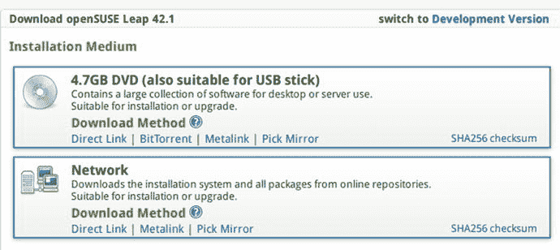

图 7-2。

The downloaded ISO image dialog

该屏幕显示了两个有趣的选项:

*   切换到开发版本允许您下载发行版的当前测试版或开发版。
*   网络版本是最低安装基础，它依赖于互联网连接来下载所有的软件包。

下载 Leap 版本的当前 ISO 映像并启动系统后，您将看到一个屏幕，从中可以看到 openSUSE 如何处理设计等某些事情(图 [7-3](#Fig3) )。

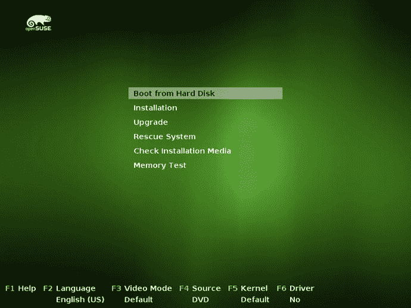

图 7-3。

The text installation menu screen of openSUSE

在这个经典的屏幕上，你可以看到(除了漂亮的 openSUSE 标志)你的选择。默认情况下，选择“从硬盘引导”菜单项是因为 YaST 结束安装的方式，在结束时不请求或弹出 DVD。因此，在第一次安装后的第一次重启中，openSUSE 将直接引导到您的新操作系统。下一个菜单项是我们感兴趣的一个:“Installation”将在您选择它时开始安装过程。“升级”旨在对当前 openSUSE 安装进行离线升级。其余的菜单项和你在其他发行版中看到的一样。

注意屏幕底部的线条。一行列出了常用的高级选项；它下面的一行显示了当前选择的值(在这种情况下，它们是默认值)。值得一提的是，如果您在此屏幕中按 Esc，然后按 OK，您将被发送到此屏幕的文本版本(安装程序仍然是图形版本)。

因此，按下安装选项，然后在 YaST 的第一个屏幕上开始安装(图 [7-4](#Fig4) )。

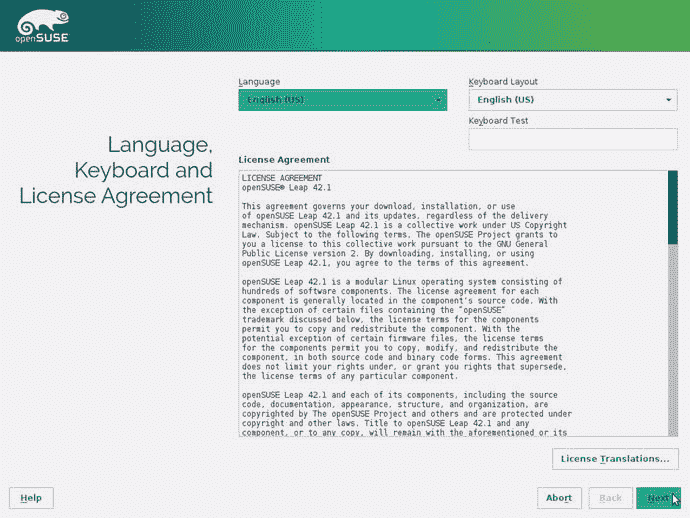

图 7-4。

The first screen of YaST is where you select the language, keyboard layout, and agree to the license

在第一个屏幕上，您可以看到选择语言和键盘布局的传统选项，一个帮助按钮，以及首次出现的许可协议。这是 openSUSE 的一个特点；在 Linux 发行版中很少看到这种情况，因为这是 GNU 许可下的自由软件，大多数发行版都希望避免这一步，以区别于其他操作系统及其 EULAs。

选择您的语言和键盘布局，按下 Next 按钮跳转到下一步，如图 [7-5](#Fig5) 所示(在一个简短的硬件系统自动检测过程之后)。

图 7-5。

Source installation options

这个屏幕提供了为安装选择额外的软件包源的选项，比如默认的存储库或其他媒体(在线或离线)。如果您有一个良好的互联网连接，添加在线仓库，以获得最新版本的软件包。下一步如图 [7-6](#Fig6) 所示。

图 7-6。

The suggested partitioning by YaST

这是驱动器分区步骤。openSUSE 建议的分区比你在本书中看到的要复杂得多。这是因为默认情况下，它在根分区中使用 btrfs 文件系统。openSUSE 使用一个名为 Snapper 的工具来拍摄该分区的快照(手动或自动)。该工具适用于 btrfs、ext4 和精简配置的 LVM 卷。xfs 用于`/home`目录的原因是因为 SUSE 采用了这个文件系统，因为它提供了错误处理和支持更适合企业环境的大量数据等优势。另外，它创建了许多子卷，利用了 btrfs 的优势。

有三种方法可以编辑向您建议的设置；前两个是半自动的，第三个是完全手动的。

*   编辑提议设置:这允许您对已经提议的方案进行一些更改，比如选择使用 LVM 和加密以及`/`和`/home`分区的文件系统。
*   创建分区设置:这与前面的选项非常相似，但是在这里您可以选择要安装操作系统的磁盘和分区/空闲空间(这在已经安装了其他操作系统的情况下很有用)。
*   Expert Partitioner: This is the completely customized manual procedure. Here you can see one of the best things about YaST; the partitioner program is one of the best and most powerful in all Linux distros. You can take a glance at it in Figures [7-7](#Fig7) and [7-8](#Fig8).

    

    图 7-8。

    Another view of the Expert Partitioner

    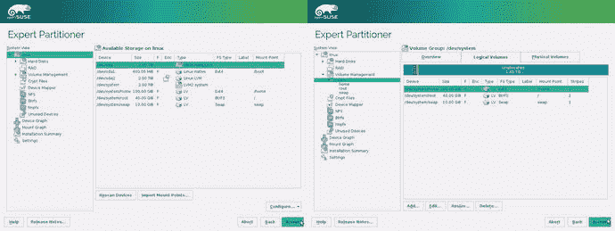

    图 7-7。

    The Expert Partitioner from YaST

如果您是专家或者想要完全定制您的分区，那么最后一个选项适合您；其他两个都没问题。我认为专家分区器是一个很棒的工具，与其使用它，不如选择第一个按钮来定制默认方案。如果您按下编辑建议设置按钮，您将看到如图 [7-9](#Fig9) 左侧所示的对话框。这是默认设置，但您将对其稍加更改，看看小小的更改如何创建完美的设置。

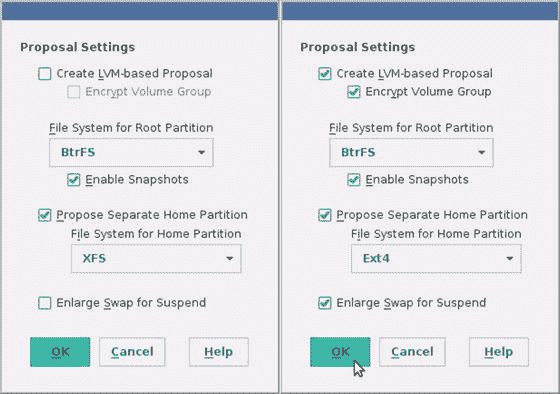

图 7-9。

Changing the partitioning proposal settings

首先，您希望为挂起扩大交换分区，这样当磁盘挂起时，您可以将 RAM 内存的内容存储在磁盘上。接下来，将`/home`分区文件系统改为 ext4，而不是 XFS；我认为这是家庭用户的最佳选择。最后，您将使用一个 LVM 分区(用于`/home`挂载点)并加密它。当你选择加密时，它会要求你输入密码，这是很严重的。如果你忘记了这个密码，也就忘记了你的数据:它已经不在了(没有那个密码你就无法访问它)。所以，选择一个好的，并使用一种帮助你记忆的方法(你可以使用我在第 [4](04.html) 章展示给你的方法)。最后，您会看到一个类似于图 [7-9](#Fig9) 右侧所示的设置。

按下 OK 按钮，您将看到摘要中反映的更改(图 [7-10](#Fig10) )。按“下一步”按钮进入下一步。

图 7-10。

The summary of partition actions before and after change the proposal settings

这是配置时钟和时区的常用步骤(图 [7-11](#Fig11) )。与 Fedora 一样，您也可以通过其他设置按钮自定义高级选项，如与 NTP 服务器同步。你应该已经知道如何完成这一步。完成后，再次按下“下一步”按钮。

图 7-11。

The clock and time zone settings

如果在第一步中您按照建议添加了在线存储库，那么现在您必须在这里选择您想要使用的存储库来进行安装(图 [7-12](#Fig12) )。建议你选择前四个，默认选中。如果你不打算编译任何包，你不需要源代码(或者阅读源代码)，调试版是为 openSUSE 的开发者准备的。选择它们并进入下一步。

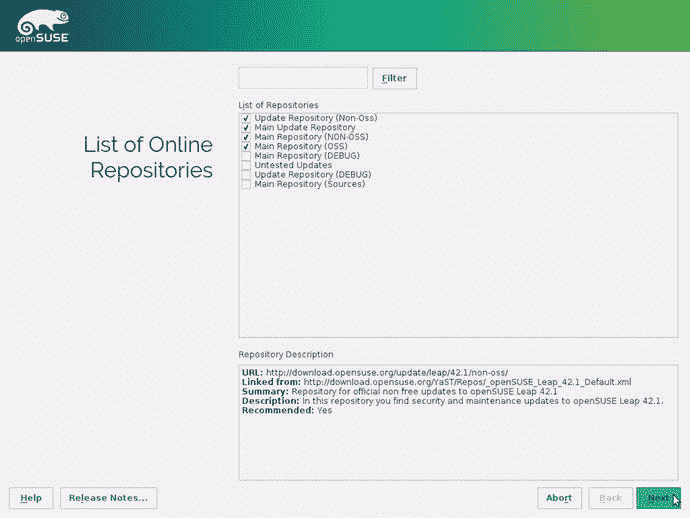

图 7-12。

Selection of online repositories

几分钟后，在读取在线存储库的内容期间，它将跳转到另一个 EULA 许可协议，如图 [7-13](#Fig13) 所示。我知道出现这种情况是因为主存储库的内容可能与 DVD 上的内容有所不同，但我怀疑您会和我一样对此感到恼火。无论如何，这是由于发行版的哲学，所以按下同意按钮，继续这个过程。

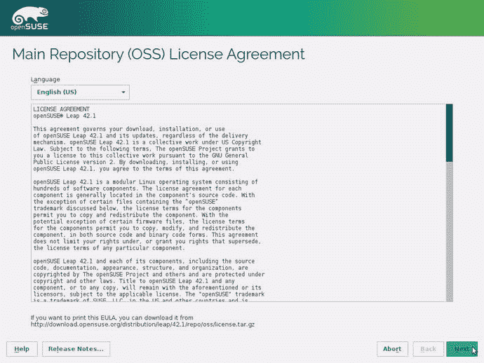

图 7-13。

Another license agreement screen

添加完存储库后，您可以选择想要用于安装的桌面环境(图 [7-14](#Fig14) )。默认的是 KDE(openSUSE 工具就是为这个环境编写的；如果你使用另一个，它将安装 KDE 的最小组件，Qt，以便能够使用它)，但你可以选择 Gnome 或其他。让我们在这里选择 KDE。现在是最后一步了！

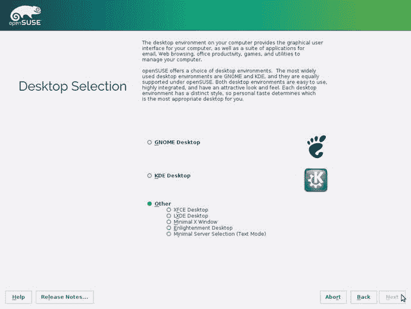

图 7-14。

The desktop environment selection screen

正如您在图 [7-15](#Fig15) 中看到的，现在您必须像往常一样创建您将在操作系统中使用的用户。和 Fedora 一样，有一系列高级选项。第一个是“接收系统邮件”，能够接收发送给这个帐户的根用户的邮件。此外，您可以使用“更改”按钮来更改身份验证方法。在这种情况下，默认选项是最安全的，所以我建议您不要更改它们。选项“为 systemd 管理员使用这个密码”正是它所说的；不要将这与 sudo 命令混淆。因此，在字段中填入您的姓名和密码(请使用强有力的密码)，然后您可以继续。

图 7-15。

The user creation screen Note

我使用虚拟机管理器 VirtualBox 来安装我在本书中展示的发行版，主要有两个原因。第一个是方便；我可以在几秒钟内创建或删除一台新机器(这样我就可以在不同的场景下为同一个发行版拥有多台机器)。如果我必须用一台真正的机器来做这件事，那将是极其乏味的。第二个原因是因为在这种情况下截图要容易得多。

为了以合理的方式管理几台机器和发行版，我在所有的机器和发行版中使用了相同的密码。从一开始，我就打算使用一个短而简单的密码，因为它有助于使这个任务不那么烦人。此外，通过使用一个弱密码，我可以测试不同的发行版如何处理这种情况。直到现在，只有 Fedora 认为我的密码很弱。但是 openSUSE 是第一个建议我不要使用弱密码的(图 [7-16](#Fig16) )。它也是第一个提醒我它非常弱的，因为它是基于一个字典单词(这是真的)。好奇的话，密码是`pas$w0r.d`。所以永远不要使用这样的密码，否则你很快就会被别人拥有。感谢 openSUSE 对这类事情的关注。

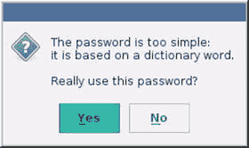

图 7-16。

The weak password alert dialog

如果您之前没有选中对 root 用户使用相同密码的选项(我希望没有；是一个以后可以咬你一口的安全漏洞)，那么它现在会要求你输入 root 密码，如图 [7-17](#Fig17) 所示。

图 7-17。

The administrator password form

在开始安装之前，您将获得安装设置的摘要(图 [7-18](#Fig18) )。请注意这里重要的一点—这是一个交互式摘要，因此您可以单击链接(带绿色下划线)来访问一些选项并进行更改。例如，您可以更改将要安装的软件(图 [7-19](#Fig19) )，这是您以前没有的选项。此外，您可以导出此配置，以便能够使用 AutoYaST 以完全无人值守和自动化的方式进行与此完全相同的其他安装。值得一提的是，你可以看到你要从网上下载的软件包的大小。如果您没有快速连接，并且文件太大，您可以随时返回并取消选择存储库。

图 7-19。

The software selection of the openSUSE installation

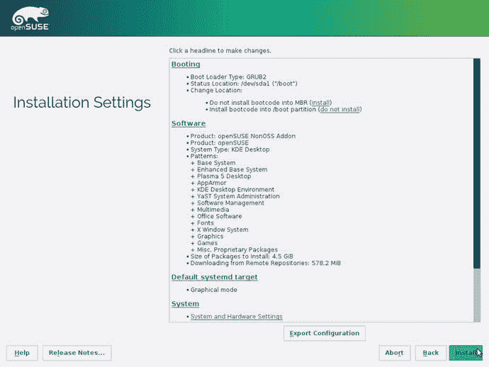

图 7-18。

Summary of the installation settings

因为开始安装过程需要确认，所以接受它。在磁盘上安装操作系统时，您可以看到一个屏幕，屏幕底部有一个进度条，上面显示了一系列关于发行版的消息(图 [7-20](#Fig20) )。还有另外两个选项卡，您可以在其中查看当时正在执行的操作的详细信息以及关于此特定版本的注释。

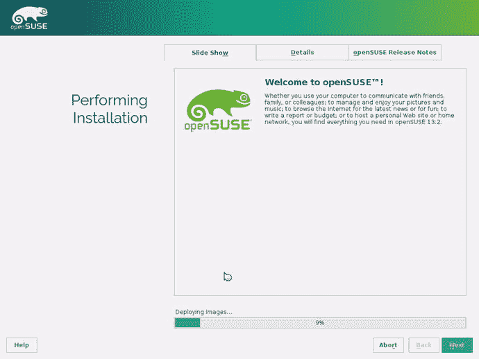

图 7-20。

openSUSE is installing

当在磁盘上安装所有软件包的过程完成后，它会告诉你它将重新启动。重启后，你将再次回到第一屏。如果你什么都不做，它将从硬盘启动，从而启动你的 openSUSE 的新安装。当从磁盘引导时，你将看到的第一个屏幕是你已经熟悉的 Grub 引导管理器，如图 [7-21](#Fig21) 所示。

图 7-21。

The Grub boot loader of openSUSE

下一个屏幕是最关键的:解密硬盘内容的加密密码。如果你忘记了密码，那就太倒霉了！不能继续(图 [7-22](#Fig22) )。

图 7-22。

The decrypt password for your files. I hope you remember it!

如果您成功输入了密码，引导过程将继续。如果您没有选择自动登录(我希望没有)，那么您将会看到图 [7-23](#Fig23) 中的屏幕。一旦你介绍了你的名字和密码，你就可以开始你的第一次 KDE 会议。

图 7-23。

The openSUSE login screen

瞧啊。你可以享受你的新操作系统(图 [7-24](#Fig24) )。

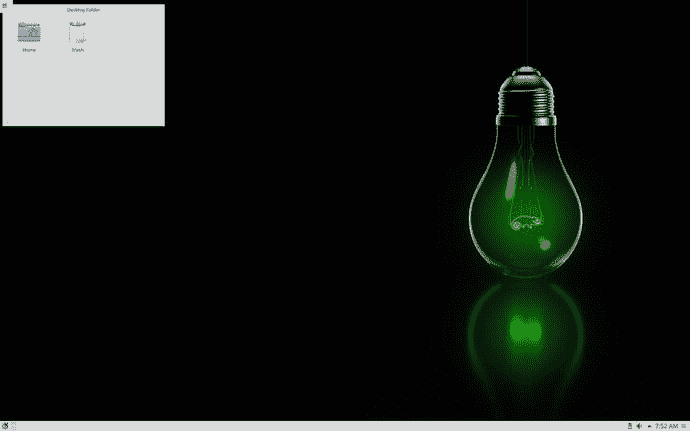

图 7-24。

The openSUSE KDE desktop

## 保持

嗯，在某种程度上介于 Ubuntu one 和 Fedora one 之间，openSUSE 旨在以一种简单的方式进行维护，集中在 YaST 工具中。所以，让我们看看这些任务是如何在 openSUSE 中执行的。

### 更新和管理应用程序

虽然您可以使用命令行和 zypper 工具来更新和安装/删除您的应用程序，但默认目标是使用 YaST 来完成所有这些工作。YaST 有一个完整的管理软件部分，如图 [7-25](#Fig25) 所示。

图 7-25。

The software section of YaST

与 Ubuntu 一样，openSUSE 会在有新的更新时提醒您(图 [7-26](#Fig26) )，因此您可以使用该对话框直接进行更新。

图 7-26。

New updates available notification

但是您可以通过使用 YaST 的在线更新选项(图 [7-27](#Fig27) )执行更新来手动检查更新。它是 YaST 中的常规软件管理器，但默认情况下只选择修补程序选项卡。这是您必须用来删除或安装软件的同一工具。这确实是一个非常强大的工具，但我认为它不够直观，所以初学者可能会发现一开始很难使用。我个人觉得这个工具和 Synaptic(一个你可以在 Debian 或者 Ubuntu 中使用的工具)在可用性方面非常差；我更喜欢使用命令行工具来完成这些任务，因为一旦您知道如何操作，它们就更容易控制和使用。然而，openSUSE 专注于企业世界和高级用户，所以这些工具是他们的用户期望找到的。

图 7-27。

The YaST software updater

### 升级

在 openSUSE 中有两种方式来执行版本升级:在线方式和离线方式。要执行在线方法，请使用命令行、zypper 命令和在线存储库。离线方法只需要新版本的 ISO 映像，然后在第一个屏幕上选择升级选项，而不是安装选项。执行 online 方法的命令乍看起来非常容易使用，`# zypper dup`，但是你需要先执行一系列的操作来改变库，更新你的包，等等 [2](#Fn2) 。所以，如果你是发行版的新用户，我建议你选择离线方式并按照说明进行操作。

## 利弊

以下是我个人认为的 openSUSE 发行版的利与弊。当然，在这件事上总有讨论的余地，但我已经尽了最大努力做到尽可能客观。

### 赞成的意见

*   YaST 是配置和安装 Linux 操作系统的最好和最强大的工具之一。
*   openSUSE 是一个安全的发行版，可以直接从 YaST 进行加固。
*   它会处理很多小事。
*   如果您希望获得最新的更新，您可以选择滚动发布版本，也可以选择非常稳定的版本。
*   openSUSE 只支持自由和开源软件，但是如果你想的话，你可以很容易地访问专有软件。
*   开发人员贡献并与软件包的上游版本合作，并且是内核的重要贡献者。
*   这是一个原始的分配，而不是一个衍生物。
*   它使用最广泛的包格式之一，rpm。
*   SUSE 的背后是 openSUSE，openSUSE 是 SUSE 基础的一部分。
*   这是有据可查的，如果你懂德语，你甚至可以买盒装的，并得到一本印刷手册。

### 骗局

*   openSUSE 专注于企业界和高级用户。对新手来说不太用户友好。
*   YaST 功能强大但不够直观，对一些东西的配置也不是最好的方式。
*   默认的硬件支持不如其他发行版；您可能需要手动使用专有驱动程序。
*   主发行版的常规发布方案没有 Ubuntu 或 Fedora 的常规，但也没有 Debian 的差。
*   它没有商业支持。
*   它只支持一种架构。
*   安装基数没有 Fedora，Debian，或者 Ubuntu 那么大。

## 摘要

另一个发行版 openSUSE 被放到了显微镜下。它对许多普通的事情采取了不同的方法。在前几章中看到的任何发行版中都没有与 YaST 等同的版本，我保证这不会是你在本书中看到的最后一个新事物。

因此，在下一章中，你将看到 Linux Mint 是如何处理各种主题的。

Footnotes [1](#Fn1_source)

[T2`https://en.opensuse.org/Derivatives`](https://en.opensuse.org/Derivatives)

  [2](#Fn2_source)

[T2`https://en.opensuse.org/SDB:System_upgrade`](https://en.opensuse.org/SDB:System_upgrade)