# 八、Linux Mint

Linux Mint 是新的感觉。它是过去四年中最受欢迎的发行版，甚至比它所基于的 Ubuntu 发行版还要受欢迎。这很讽刺，因为 Ubuntu 是六年前最流行的发行版，它是基于另一个版本 Debian [1](#Fn1) 。然而，有受欢迎程度，也有安装基础，在后者中，Ubuntu 仍然有更大的数量。那么，是什么让 Linux Mint 如此成功呢？主要原因是 Linux Mint 在使发行版更容易使用方面比 Ubuntu 走得更远，并且它听取了用户群关于其发展方向的意见。

## 历史

Linux Mint 是由法国开发者 Clement Lefebvre 于 2006 年创建的。它是基于 Kubuntu(只针对最初的版本；在那之后，Ubuntu 是基础发行版)。列斐伏尔的目标是创造一个更优雅的发行版。发布后，它慢慢地但不断地被越来越多的社区采用，主要是在欧洲。然而，有两个事件会在短时间内对扩大 Mint 的受欢迎程度和采用产生很大的影响。

大约在 2011 年，Gnome 桌面环境在其版本 3 中进行了彻底的改变。大量的 Gnome 用户不喜欢这种变化，并开始寻找替代方案。当时，KDE 也在从版本 3 过渡到版本 4，由于新版本的不成熟，频繁出现错误。在少数没有升级到 Gnome 3 版的发行版中，Mint 是最友好、最稳定、最完美的。另一个事件是当 Ubuntu 从 Gnome 切换到 Unity 时，一个比 Gnome 3 更加讨厌和不受欢迎的桌面环境；这引发了用户从 Ubuntu 到 Mint 的大迁移。

Mint 能够利用大量用户涌入其社区的优势，开发自己的桌面环境 Cinnamon，作为 Gnome 3 的替代品；它还采用并帮助开发了 MATE 作为 Gnome 2 的替代品。Mint 再次听取了用户的意见:它创建了一个基于 Debian Stable 的替代版本，作为 Mint 的半滚动发布版本。

多年来，Linux Mint 从古老的 openSUSE 发行版中篡夺了欧洲顶级发行版的宝座。

## 哲学

当 Clement Lefebvre 将 Linux Mint 的目标定义为一个优雅的发行版时，他的意思是一个专注于易用性、吸引人的设计、稳定性和用户反馈的发行版。对可用性的关注反映在诸如开箱即用的完整多媒体支持上，这在其他发行版中是不容易实现的。听取其用户的反馈是 Cinnamon 开发以及采用 MATE 和其他软件贡献背后的原因。此外，Linux Mint 被认为是一个非常完美的发行版，所有的东西都可以工作，小细节都得到了处理。

因此，在易用性方面，Linux Mint 可能是前三名之一。另一件值得一提的事情是，Linux Mint 只专注于桌面用户，这显然有助于它最终得到一个更加完美的产品。

## 发行版选择标准

现在你已经了解了 Mint 的一点历史，让我们看看这个特别的发行版在第 2 章的章节标准上的表现。

### 目的和环境

Linux Mint 是一个只面向桌面用户的通用发行版。它有两个版本:

*   Linux Mint:主发行版，它是一个常规发布版本，基于 Ubuntu。支持的每个桌面环境都有不同的映像(Cinnamon、MATE、KDE、Xfce)。此外，两个主要的 DEs 提供没有编解码器的版本，用于多媒体编解码器获得专利的国家。
*   LMDE:基于 Debian 的版本(LMDE 指 Linux Mint Debian 版)，它有一个半滚动的发布周期。

### 支持

显然，在没有公司支持的情况下，Linux Mint 只提供社区支持，并且由于它拥有本书迄今为止所见的所有发行版中最小的社区，所以支持没有那么好。获得这种支持的可用渠道如下:

*   文档: [`www.linuxmint.com/documentation.php`](http://www.linuxmint.com/documentation.php)
*   论坛:[`http://forums.linuxmint.com/`T2】](http://forums.linuxmint.com/)
*   邮件列表: [`http://librelist.com/browser/linuxmint/`](http://librelist.com/browser/linuxmint/) `linuxmint@librelist.com`
*   IRC: `#linuxmint-help at irc.spotchat.org`

因为 Linux Mint 是基于 Ubuntu 的，有些事情可以通过 Ubuntu 的支持渠道来解决，所以如果你在 Mint 中没有找到帮助，你可以随时尝试这些渠道。

从社区网站 [`http://community.linuxmint.com/idea`](http://community.linuxmint.com/idea) 的创意部分收集、讨论并经常实施来自用户的反馈。

### 用户友好性

如前所述，Linux Mint 是最容易使用的 Linux 发行版之一，你可以从一开始就看到这一点。它吸取了 Ubuntu 最好的部分，并添加了自己的功能，使总体体验非常愉快。有许多小细节旨在最大限度地减少与操作系统的摩擦，如域拦截器(不必与防火墙打交道来设置家长控制)或上传管理器(用于管理 FTP 和 SCP 服务)。在“维护”一节中，您将看到 Linux Mint 在使某些事情变得更容易方面走了多远。这是我推荐给初学者的发行版之一。

### 稳定性

Linux Mint 是一个非常稳定的发行版。我认为它比它的母亲 Ubuntu 更稳定，因为 Mint 使用 Ubuntu 的长期支持版本，并且它默认只提供“安全”的更新。Linux Mint 开发者所说的“安全”是指这些更新不会破坏你的操作系统。因此，这个发行版没有最新的包(事实上，它通常比 Ubuntu 更过时)，但它在稳定性和新鲜度之间提供了更好的平衡，例如，比 Debian Stable。

Mint 遵循一个标准的发布模型(至少是基于 Ubuntu 的模型)，它基于 Ubuntu 的 LTS 版本。因此，在 Ubuntu LTS 发行版(每两年一次)发布后，Mint 的主要版本也会发布，而在每次 Ubuntu 常规发行版(每 3 个月一次)发布后，Mint 的次要版本(没有太多变化)也会发布。每个版本都有一个代号，通常是以“a”结尾的女性名称。它们按照字母顺序排列，代号的第一个字母位于与版本号相对应的字母位置。

显然，因为它依赖于 Ubuntu 版本，所以 Linux Mint 不能像 Ubuntu 一样有规律，因为它的开发人员需要一些时间来准备他们自己的版本，而这个时间量在每个版本中是不同的。

### 硬件支持

作为 Ubuntu 的衍生产品，硬件支持几乎和 Ubuntu 一样好，但 Mint 总是优先考虑开源驱动，而不是私有驱动。(你可以通过驱动管理器安装私有的。)

### 美学

良好的全球审美是 Linux Mint 的主要目标之一。Mint 开发了自己的桌面环境，它是以设计为出发点的。你可以在发行版的每个角落看到这一点，从颜色、桌面、徽标、主题、图标到壁纸。整个桌面有一个普遍的一致性，很容易看。Linux Mint 经常被认为是所有发行版中最有吸引力的(当然这是一个非常主观的问题，但这是一个全球共识)。

### 桌面环境

Linux Mint 主要有两个官方桌面环境:Cinnamon 和 MATE。第一个是 Gnome Shell (Gnome 3)的分支，第二个是 Gnome 2 的分支。如前所述，肉桂是由薄荷社区开发的；它是最受欢迎的，也是事实上的官方造币厂。其他桌面环境，如 KDE 和 Xfce，在单独的 ISO 映像中提供。

### 初始化系统

目前 Linux Mint 仍然使用 Upstart(和 LMDE 的 SysV)作为它的 init 系统，但是这将在下一个版本中改变(这将在下一个 Ubuntu LTS 版本之后不久发生),届时它将采用 systemd，大多数发行版已经这样做了。

### 包装管理系统

既然是基于 Ubuntu，显然包管理系统是 dpkg，所以用。deb 套餐。尽管 Linux Mint 有自己的软件包库，但它也使用 Ubuntu 的库，所以它获得了 Ubuntu 可用的软件包的好处。你可以为 Ubuntu 包配置其他流行的源码，比如 PPAs 或者 Getdeb 库。Linux Mint 提供了一个很好的图形化工具来管理这些包，软件管理器(mintinstall)但是你也可以使用 Synaptic 来完成同样的任务。

### 体系结构

Mint 只支持两大架构:32 位和 64 位版本的 Intel 和 AMD。

### 安全性/匿名性

Mint 是基于 Ubuntu 的，所以默认情况下是安全的。但是，它不像 Ubuntu 那样安全，因为它不实现开箱即用的 AppArmor。此外，级别更新策略可能会使操作系统有点不安全，因为内核更新(其中一些带有安全补丁)不是默认进行的。一如既往，在易用性和安全性之间有一个平衡；通常你需要更多的知识来维护一个更安全的发行版。

### 原则和道德

Linux Mint 优先选择自由软件而不是专有软件，但它也提供专有软件，如 Adobe Flash 支持和多媒体编解码器。尽管图形驱动默认设置为开源驱动，但它有像驱动管理器这样的工具来处理专有驱动，你总是可以在资源库中找到一些。

### 现场 CD

和 Ubuntu 一样，Linux Mint 的 ISO 镜像也是直播 DVD 镜像。

### 专业认证

Linux Mint 不提供任何专业认证。

## 装置

因为 Linux Mint 是基于 Ubuntu 的，所以 Mint 的安装过程与 Ubuntu 的安装过程非常相似(事实上，它是同一个，只有很少的美学上的变化)，所以我将在这里介绍另一个场景，向您展示与 Ubuntu 章节中的安装不同的东西。

首先像往常一样，进入分发版的下载页面， [`www.linuxmint.com/download.php`](http://www.linuxmint.com/download.php) ，在这里你会看到类似图 [8-1](#Fig1) 的东西。

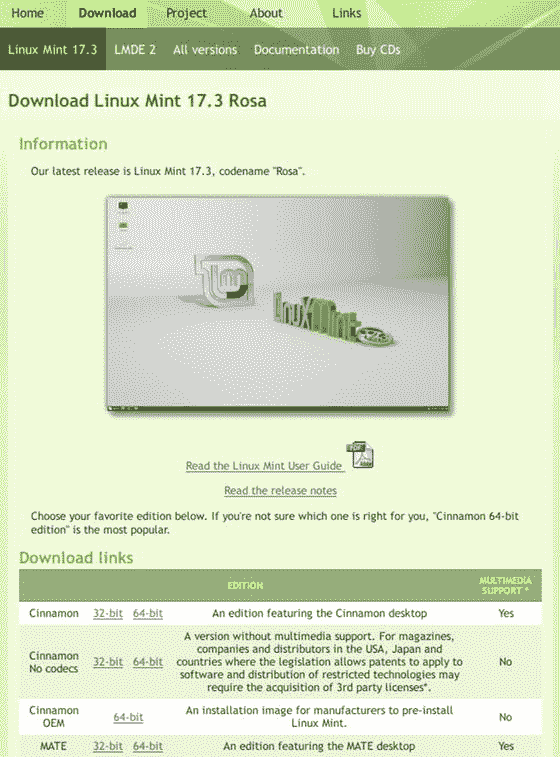

图 8-1。

The Linux Mint downloads page

选择当前的主版本(基于 Ubuntu 的版本);在写这篇文章的时候，是 17.3 版本。您可以根据要使用的桌面环境选择不同的图像；肉桂是默认的。此外，每个主要的 DEs (Cinnamon 和 MATE)都有不同的版本，因此您可以选择是否想要没有多媒体编解码器或 OEM 图像的版本。让我们选择最流行的，肉桂 64 位版本。点击该链接后，您将看到图 [8-2](#Fig2) 中的屏幕。

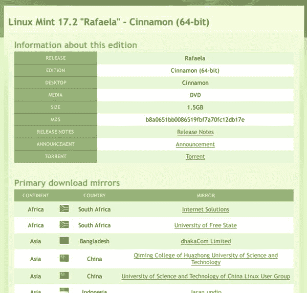

图 8-2。

The download options for the ISO image of Linux Mint

您在这里看到的第一个选项是通过 Bit Torrent 下载 ISO 映像，这是最适合像这样的 Linux 发行版的选项，经济资源很少。下面是一个很长的镜像列表，你可以通过 HTTP 下载 ISO 镜像。这取决于你，但我选择下载图像的种子文件。

下载完映像后，您就可以开始安装了。在我的例子中，我将在一台有 2TB 硬盘的机器上安装 Linux Mint，默认的 Windows 8 安装会占用整个硬盘。目标是在机器上同时安装两个操作系统，并且能够在启动时选择您想要使用的操作系统。

从 Linux Mint ISO 启动时出现的第一个屏幕与其他发行版略有不同(十秒倒计时)。如果你不等待那十秒钟，一个 Linux Mint 的现场会议开始；否则，如果您按任意键，您将看到如图 [8-3](#Fig3) 所示的屏幕。这是你在其他发行版中看到的常见菜单，但 Mint 在这里隐藏了它，以使安装过程更容易，不那么吓人。

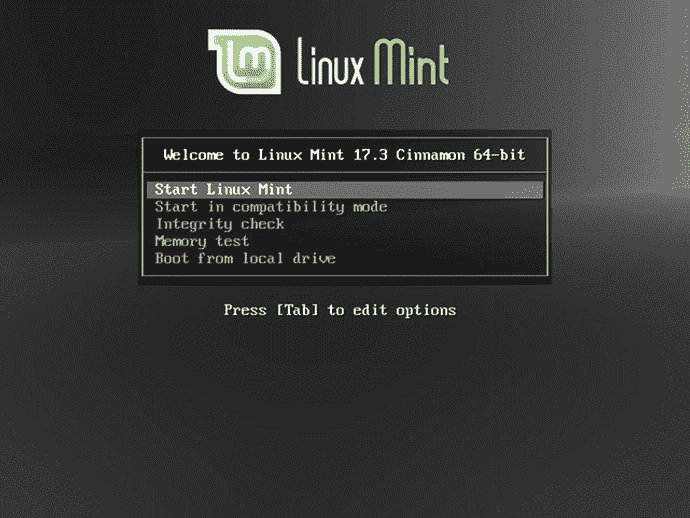

图 8-3。

The boot-up menu of Linux Mint

一旦进入 Linux Mint 的直播环节(图 [8-4](#Fig4) )，就可以稍微玩一玩；最后，点击“安装 Linux Mint”图标开始实际安装(见图 [8-5](#Fig5) )。

图 8-5。

The first step of the Mint installation

图 8-4。

The Linux Mint Live session

第一步是您必须选择在流程和操作系统中使用的语言。您也可以阅读版本说明或更新安装软件本身(此选项仅在必要时，在您检查升级后出现)。接下来是容易的部分(图 [8-6](#Fig6) )。

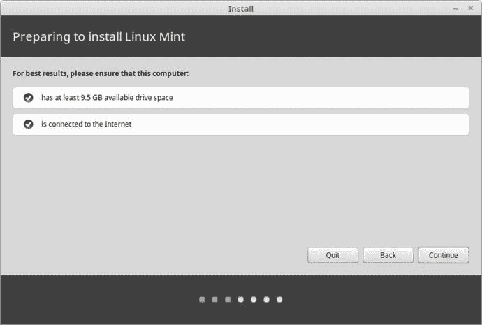

图 8-6。

Checking for prerequisites

这里不需要你做什么。这只是测试系统，以确保它有安装所需的硬件。继续下一步。

在图 [8-7](#Fig7) 中可以看到检测到了 Windows OS 你可以选择安装 Mint，或者删除硬盘上的所有数据，然后安装 Mint。正如我在开始时所说的，目的是让两个操作系统同时可用。默认情况下该选项被选中，所以按继续进入下一步(图 [8-8](#Fig8) )。

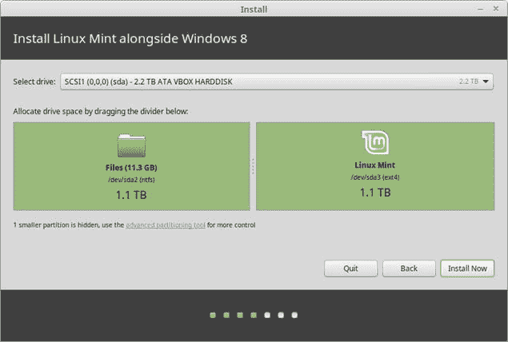

图 8-8。

Size of the disk distribution for both operating systems

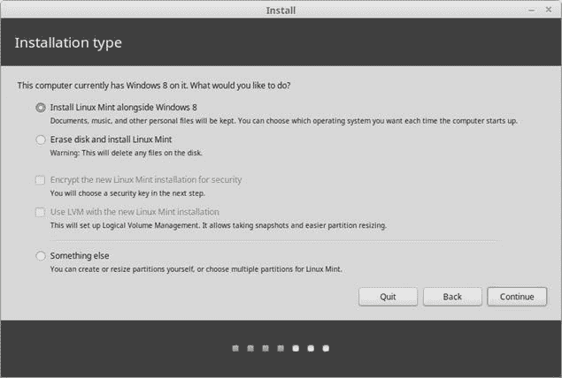

图 8-7。

Installation type screen

现在，您必须决定为每个操作系统分配多少磁盘空间。默认情况下，安装程序使用 50/50 分割，但是您可以通过简单地移动出现在两个绿色方块之间的条来修改它。您还可以通过链接访问高级分区工具。

您可以在图 [8-9](#Fig9) 中看到我的磁盘的当前状态。目前有两个分区，一个非常小的用于 Windows 8 加载程序，一个大的用于操作系统和数据。

图 8-9。

The current partitions of the disk with Windows 8

返回上一屏幕(图 [8-8](#Fig8) )。如果您按下 Install Now 按钮，将弹出如图 [8-10](#Fig10) 所示的对话框，通知您将要执行一些磁盘操作，特别是调整 Windows 的大 ntfs 分区的大小。当然，此时您应该已经备份了您的数据，因为这个操作很微妙，可能会出错(这种情况很少见，但您知道，事情总是会发生)。如果您准备好了，请按继续按钮。

图 8-10。

The warning dialog about the resize operation

一旦调整了分区的大小，在它创建新分区来分配您的 Linux Mint 安装之前，会出现一个弹出对话框，向您显示将要进行的更改，并要求您确认(图 [8-11](#Fig11) )。此时，您应该知道，从长远来看，默认的建议分区(一个根分区和一个交换分区)并不是最好的计划。所以，与其从这里继续，不如让我们回去建立一个更好的分区方案。

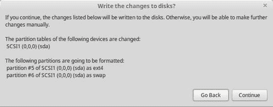

图 8-11。

Are you sure you want to write the changes to the disk?

如果您返回，您将再次进入图 [8-7](#Fig7) 屏幕。这一次，选择“其他东西”选项来创建您自己的分区方案。高级分区现在显示类似图 [8-12](#Fig12) 的东西，其中 Windows 分区已经变小了。所以现在你有一半的可用空间。在那个空间中，让我们创建类似于图 [8-13](#Fig13) 的新分区。是的，它们可能不同，但这已经足够好了，不会太复杂。

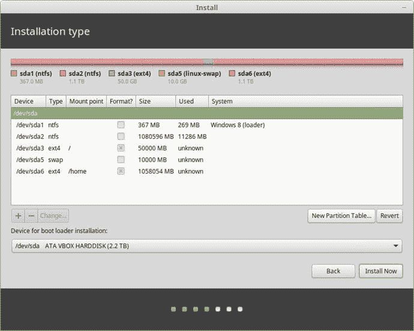

图 8-13。

The new partition scheme to install Linux Mint

图 8-12。

The Windows partition already resized

如果您按下“立即安装”按钮，您将看到如图 [8-14](#Fig14) 所示的摘要。

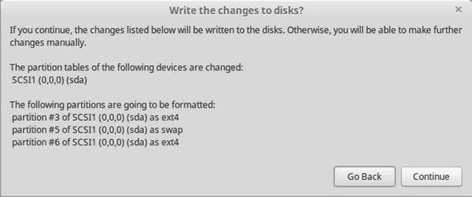

图 8-14。

The summary of t he new partition scheme

如果继续，更改将被写入磁盘，安装过程将继续。接下来的步骤是设置您所在的当前时区(图 [8-15](#Fig15) )和键盘布局(图 [8-16](#Fig16) )。

图 8-16。

The keyboard layout settings

图 8-15。

Time zone settings

在图 [8-17](#Fig17) 中，可以观察用户设置；这些都是我一直用的。然而，Fedora 尤其是 openSUSE 认为很弱的密码在这里被认为是合理的。不管怎样，按下继续键。

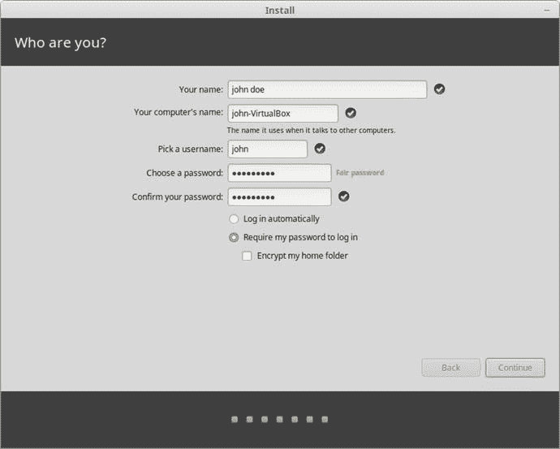

图 8-17。

The user settings

安装过程中令人厌烦的部分，也就是将操作系统的文件复制到磁盘，将会开始。最后，您会看到如图 [8-18](#Fig18) 所示的对话框。当您按下“立即重启”按钮时，实时会话将关闭并要求您从系统中移除 ISO 镜像文件(图 [8-19](#Fig19) )。

图 8-19。

Remove the image from the DVD/USB to restart the system

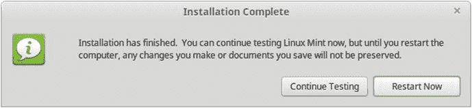

图 8-18。

The installation is complete

操作系统现在已经安装好了，这是您第一次用它来启动机器。像往常一样，第一个屏幕是 Grub 屏幕，如图 [8-20](#Fig20) 所示。

图 8-20。

The Linux Mint Grub screen

你可以在这里观察各种事物。首先，在顶部的第一行，你可以看到这里使用的 Grub 版本是一个原始的 Ubuntu 包，这是 Linux Mint 的人留下的一个小细节。此外，您可以看到，您可以选择引导至 Linux Mint(默认选项)，也可以引导至 Windows 8 操作系统。如果您选择 Windows 8，它将照常启动，就像您没有对磁盘进行任何更改一样。最后，您应该注意到有两个选项来启动 Mint 第二个显示为“高级选项……”(见图 [8-21](#Fig21) )。事实上，在几乎所有发行版中常见的两个条目是正常条目和恢复条目。我认为 Mint 开发者采用这种方法是为了让新手更容易使用。

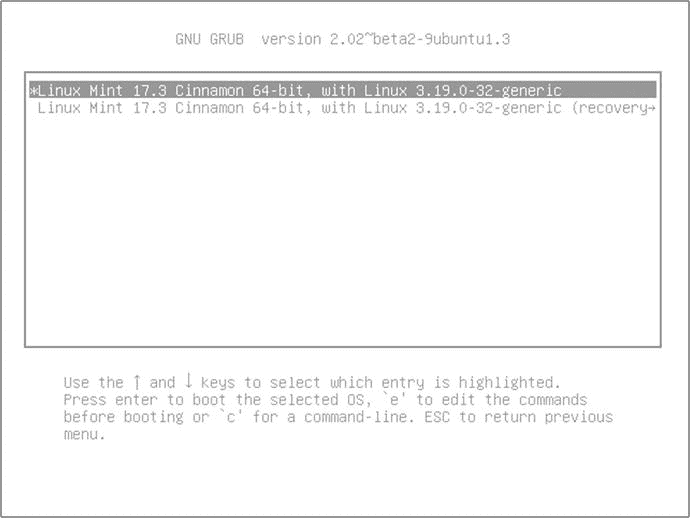

图 8-21。

The advanced options for Linux Mint

选择第一个选项，开始第一次引导您的新操作系统。登录界面如图 [8-22](#Fig22) 所示。然后你会看到 Linux Mint 的肉桂色桌面(图 [8-23](#Fig23) )。与其他发行版一样，它向您显示了一个欢迎屏幕，提供了一些开始使用系统的可能性。恭喜你！您已经安装了新的 Linux 操作系统。

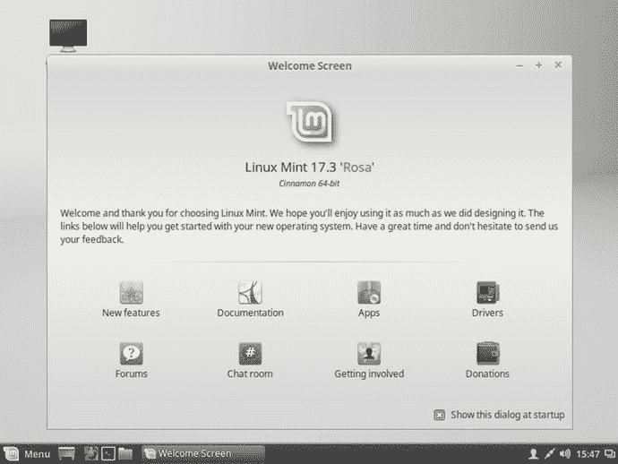

图 8-23。

The Linux Mint 17.3 Cinnamon screen

图 8-22。

Mint’s login screen

## 保持

根据其创建理念，Linux Mint 是易于维护的发行版之一。您可以从图形界面完成所有这些，这使得 Linux Mint 非常适合初学者。

### 管理应用程序

如果你想在 Linux Mint 中安装或删除应用程序，你有和 Ubuntu 一样的选择:你可以通过一个专用的图形应用程序，通过 Synaptic 工具，或者在终端中使用。deb 包(apt-get，aptitude，dpkg)。这里唯一的区别就是专用的图形 app 和 Ubuntu 的不一样。

软件管理器应用程序(图 [8-24](#Fig24) )是一个简单、易用、直观的应用程序，与 Ubuntu 的同类应用程序一样，将应用程序按类别分组。但是一旦你开始使用它，你首先会注意到的是它的搜索和导航比它的 Ubuntu 版本快得多；其实它的 bug 更少，效果更好一点。Mint 的开发者用这个应用做了一件好事。

图 8-24。

The Software Manager application

这个应用程序将帮助初学者以一种简单的方式管理他们的应用程序，而不必处理终端。

### 更新和升级

在 Mint 中，包更新和发行版升级是用同一个工具管理的:更新管理器(mintupdate)，如图 [8-25](#Fig25) 所示。Linux Mint 有一种特殊的管理更新的方式；它并不遵循与 Ubuntu 相同的方式，尽管它基于 Ubuntu 发行版并使用相同的包和库。Mint 根据功能、稳定性或安全性将更新分为不同的级别。这不是一个受很多人欢迎的分类系统，因为他们认为内核更新默认更新是不安全的(因为他们可以破坏一些配置，如硬件驱动程序)。我个人认为这对 Linux 新手来说是件好事，可以让操作系统更加稳定，但这可能会带来安全风险。如果你不喜欢这个策略，你可以随时配置它来显示那些更新；这取决于你(你可以在图 [8-26](#Fig26) 中看到这一点)。此外，你甚至可以看到一个内核版本是否解决了一个特定的安全问题或者有一些倒退(图 [8-27](#Fig27) )，以及一个特定的内核版本是否被推荐。我觉得对于新手来说这是一个比较好的管理事情的方法。

图 8-27。

The kernels section of the Update Manager

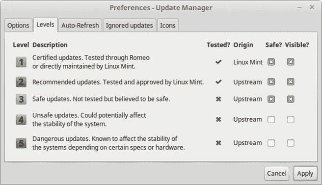

图 8-26。

The update levels of the Update Manager

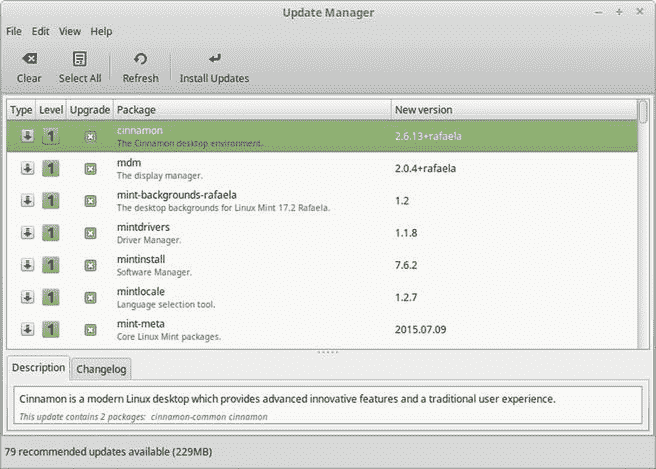

图 8-25。

The Update Manager application

更新管理器也可以处理发行版升级；当一个新的发行版可用时，你会在编辑菜单中看到一个升级发行版的新选项。如果一个初学者遵循 Linux Mint 的方式，不更新任何不安全的更新，这将是一个比 Ubuntu 常规升级更安全的升级(但永远记得先做好备份！).

## 利弊

下面的列表包含了一些我个人认为的 Linux Mint 发行版的利与弊。当然在这件事上总有讨论的余地，但是我已经尽可能的客观了。

### 赞成的意见

*   Linux Mint 是一个非常容易使用的发行版，推荐给初学者。
*   它有自己的桌面环境 Cinnamon，比 Unity 和 Gnome Shell 本身更受欢迎。
*   它基于一个可靠且受欢迎的发行版 Ubuntu。
*   它提供社区驱动的开发，并遵循其社区建议的思想。
*   它提供现成的多媒体支持。
*   它关心设计和美学，让事情变得简单。
*   这是一个非常稳定的发行版，基于 Ubuntu LTS 版本和“安全”更新。

### 骗局

*   有些人不喜欢它的更新水平，这意味着一定的安全风险。
*   Linux Min 只专注于桌面(但有些人认为这是优势)。
*   包装有点过时了。
*   如果你只想要自由软件，这不是你的发行版。
*   Cinnamon 和 Mate 的桌面仍然不够完美，缺少一些功能。

## 摘要

有了 Linux Mint，你可以看到一个完全基于社区的发行版如何用很少的资源变得比它的基础发行版更受欢迎。使用不同的桌面环境或不同的更新/升级方法足以吸引用户从另一个发行版转移。在所有的操作系统中，总是有改进的空间，即使是最好的操作系统，感谢自由软件，你可以在 Linux 中做到这一点。如果你能在 Windows 10 或 OS X 上做同样的事情，你能想象会发生什么吗？

在下一章，你会看到另一种不同的方法:Mageia。

Footnotes [1](#Fn1_source)

`Popularity ranks based on DistroWatch (`T2`http://distrowatch.com`T3)