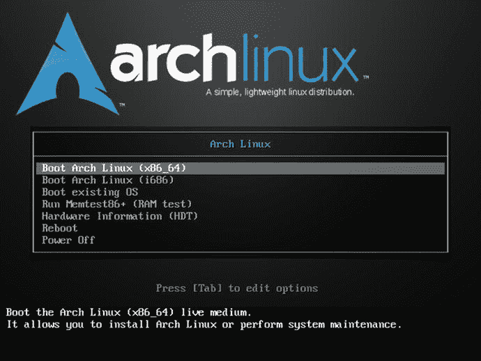
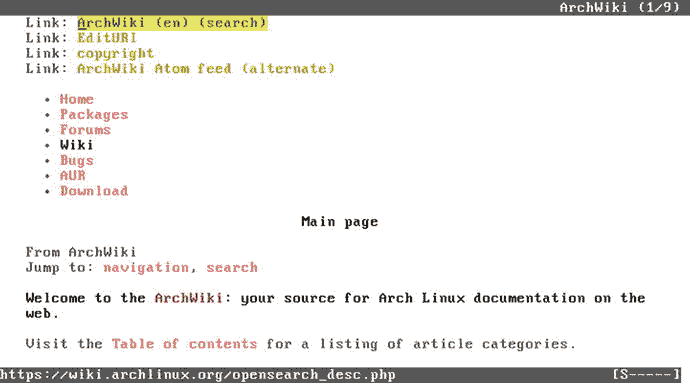
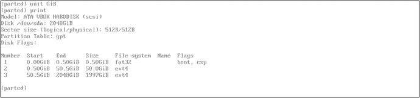

# 11.Arch Linux

Arch Linux 是这里介绍的第一个面向高级用户的发行版，也是第一个纯滚动发行版。它也不是用户友好的，但这并没有阻止它变得非常受欢迎。也许它的成功在于它的简单性，因为 Arch 只给了你一个非常基本的基础，你可以在这个基础上构建你需要或想要的 Linux。它出名的另一个关键是它吸引了那些总是想拥有任何软件最新版本的用户。但是，如果没有令人印象深刻的文档及其背后的巨大社区的支持，这一切都是不可能的。

## 历史

2001 年，一位名叫 Judd Vinet 的加拿大程序员受 CRUX 和 BSD Unix 等其他软件的简单性的启发，开始开发一个新的 Linux 发行版。他喜欢这种简单性带来的内在优雅，但他非常不喜欢这些选项中缺乏包管理，所以他也基于相同的原则开发了一个新的包管理器 pacman。他在 2002 年 3 月 11 日发布了这个新发行版的第一个版本，Arch Linux 0.1 (Homer)。 [<sup>1</sup>](#Fn1)

Judd Vinet 在 2007 年末将发行版的主要开发者和领导者的角色移交给了美国程序员 Aaron Griffin，他至今仍在掌舵。

多年来，社区对 Arch Linux 的接受是逐渐的，稳步增长的。即使在今天，与 Ubuntu 或 Debian 等发行版相比，它的安装规模仍然适中。

## 哲学

极简主义、简单性和代码优雅(KISS 原则)是 Arch Linux 开发的核心指导方针。拱门哲学，通常称为拱门方式，定义如下:

*   简单:对软件没有不必要的添加或修改。这些包几乎和他们最初的开发者发布的一样；只有在运行发行版时，才进行必要的(和最小的)修改。
*   现代性:提供软件的最新稳定版本和 Linux 中可用的最新特性。成为最前沿的发行版。
*   实用主义:Arch 是一个基于事实和需求的发行版，而不是意识形态的发行版。这种方法跨越了软件许可的开发决策；你可以自由选择自由软件和专有软件。
*   用户中心性:Arch Linux 并不试图成为每个人的一切；它试图满足其贡献者和社区的需求。它提倡一种 DIY(自己动手)的态度。
*   多功能性:Arch 提供了一个非常基本的命令行系统。您可以安装和设置您想要的任何任务和需求。

Note

KISS(保持简单愚蠢)原则指出，如果简单是其设计的关键目标，任何系统都是最好的。要避免不必要的复杂性。这是一个在工程和计算机科学中广泛使用的原则，它是 UNIX 操作系统设计等伟大成就的背后，因此也是 Linux 的背后。

## 发行版选择标准

现在你已经了解了一些历史，让我们看看 Arch Linux 在第 [2](02.html) 章中概述的选择标准上是如何排名的。

### 目的和环境

Arch Linux 是一个通用发行版。其实很难有比这个发行版更通用的了。因为没有什么是预定义的，所以您可以构建您想要的系统，甚至是面向任务的系统(这证明了 Arch Linux 是一个通用的系统)。它提供一个版本作为一个 ISO 映像。

### 支持

作为一个社区发行版，它的支持显然没有公司支持的那么专业和广泛。此外，它的哲学是期望用户解决他们自己的问题。所以你可能会认为社区支持会很少而且质量很差。但矛盾的是，Arch Linux 拥有所有发行版中最开放、最友好、最有帮助的社区之一，而且它可能拥有最好的文档(由社区自己维护)。众所周知，许多其他发行版的用户使用 Arch Wiki 来回答关于他们发行版的问题。也许文档质量的原因是因为在 wiki 上写下一个主题比在其他渠道多次回答相同的问题要好。每个人都希望你在问任何问题之前先查阅文件。

您可以通过以下渠道获得 Arch 社区的支持:

*   ArchWiki(文档): [`https://wiki.archlinux.org`](https://wiki.archlinux.org/)
*   论坛: [`https://bbs.archlinux.org/`](https://bbs.archlinux.org/)
*   邮件列表: [`https://lists.archlinux.org//listinfo/`](https://lists.archlinux.org//listinfo/)
*   IRC: `#archlinux` at [`irc.freenode.net`](https://irc.freenode.net) 更 at [`https://wiki.archlinux.org/index.php/IRC_channels`](https://wiki.archlinux.org/index.php/IRC_channels)

### 用户友好性

如前所述，Arch Linux 哲学并不强调用户友好性。典型的 Linux Arch 用户是那些拥有高级知识或者愿意自己先阅读文档来完成所有工作的人(修补者)。

我不建议初学者使用这个发行版。然而，许多人被滚动发布方案所吸引，厌倦了升级他们的用户友好的发行版。由于文档的非凡质量，他们很想测试这个发行版，而且他们中的大部分仍然是 Linux 的忠实用户。还有一类用户是想多了解 Linux 本身，用一个像这样的低级发行版可以教会你很多东西。当然，如果你讨厌命令行，就避开这个发行版。

### 稳定性

Arch Linux 是最不稳定的。它遵循一个滚动发布方案，所以从内核到其余的包，你总是拥有软件的最新版本。这样你永远不需要升级你的发行版；你只需安装一次 Arch Linux，你只需要定期更新以保持最新。Arch Linux 每月更新它的 ISO 映像，但是如果出现严重问题，你只需要重新安装。

你可以将你的压力和不稳定性调整到一个更合理的水平，或者只是停留在出血的边缘。您可以通过选择要启用的存储库来实现这一点。如果您启用了测试库，您将总是拥有最新和最不稳定的版本；如果你不这样做，你会有一个合理稳定的系统，给定的背景。例如，如果您不使用测试库，您可能会经历几个月的延迟才能获得最新版本的内核。此外，滚动发布方案的一个优点是，如果一个版本有一个 bug，而这个 bug 在下一个版本中被解决了，那么几乎在它的作者发布的时候，您的系统中就有了可用的解决方案。在标准的发布方案中，可能需要数年时间来修复。如果想要更稳定，也可以安装`linux-lts`内核，这是一个更稳定的内核，不会频繁升级。

那么一个 Arch Linux 系统能有多可靠呢？嗯，看情况。首先，除非您真的知道自己在做什么，否则不应该在生产服务器中使用 Arch Linux。否则，有很多程序员、系统管理员和其他 IT 专业人员在他们的主计算机上使用 Arch Linux 多年来都没有问题。这完全取决于你如何管理它和你的知识水平。我们举个例子:我。我已经在几台机器上使用 Arch Linux 好几年了。最老的是一台使用了四年的台式机，和它安装 Linux 的时间一样长。我不需要重新安装任何一个。但是我用了最简单的设置。我不用桌面环境，只用窗口管理器(牛逼的 WM)。我没有专用显卡；我使用集成在处理器中的那个。我还禁用了测试库。我总是每天更新软件包。结果，我在这些机器上只遇到过一两个恼人的问题，而且在几个小时或更短的时间内就很容易解决了。部分秘密是桌面管理器和硬件驱动程序(尤其是图形驱动程序)是几乎所有 Linux 发行版中最麻烦的包。如果你去掉等式中的这些部分，你在统计上的问题会更少。

### 硬件支持

这个发行版中的硬件支持依赖于存储库中可用的内核和驱动程序。此外，您可以使用 ABS 系统和 AUR 库来查找或构建额外的驱动程序。和这个发行版的其他方面一样，这个主题很大程度上依赖于用户和他的学习能力或意愿。

### 美学

很明显，在这样一个非常小的发行版中，你要对你构建的东西负责，没有关注美学。

### 桌面环境

在这个发行版中没有预定义的东西，这包括桌面环境。你想要一个只有命令行的发行版吗？就是这里。您想安装传统的桌面环境吗？你可以这样做，从八个官方支持的(Gnome、KDE 等离子、Cinnamon、MATE、LXDE、LXQt、Enlightenment 和 Xfce)或大约十五个非官方的(包括 Unity、Pantheon、Deepin 等)中选择。).您想安装窗口管理器吗？你可以这样做，从大约六十种不同的选择。你甚至可以选择 windows 服务器，要么 Xorg，要么 Wayland。基本上有很多可能性，所以你只需要选择一个(或者多个，如果你想的话)并使用它。

### 初始化系统

Arch Linux 在 2012 年 10 月采用 systemd 作为默认的 init 系统。

### 包装管理系统

Arch Linux 使用它自己的包管理系统 pacman，这个名字由用于管理包的命令行工具共享。它不像 dpkg 或 rpm 那样受欢迎(它主要被它的衍生产品使用)，但是它作为一个简单而可靠的包管理器享有很高的声誉。pacman 包的扩展名为`.pkg.tar.xz`。

它还拥有 Arch Build 系统(ABS ),允许任何用户定制任何官方软件包，甚至从第三方来源创建自己的软件包。这些包以包描述的形式配置，称为 PKGBUILD(一个 shell 脚本)，可以从源代码编译并构建到一个包中，然后可以通过 pacman 安装。这个特性被用来创建 Arch 用户库(AUR ),这是一个由用户创建和维护的 PKGBUILDs 库。默认情况下，这些软件包不受官方支持，也不安全，但是这个系统被广泛使用，并且随着时间的推移，它被证明是为用户提供大量软件包的好方法。多亏了 AUR，许多软件包在作者发布后几个小时就可以使用了，这使得 Arch Linux 比其他发行版有很大的优势，因为其他发行版在安装相同的软件包之前需要等待一段时间。也可以选择制作自己的 PKGBUILD 并提交给 AUR；这也是 Arch Linux 如此受一些开发者欢迎的原因之一。

### 体系结构

Arch Linux 仅支持 Intel 和 AMD 32/64 位架构。ARM 架构还有一个非官方的独立端口，Arch Linux ARM。

### 安全性/匿名性

和这个发行版的其他方面一样，保证 Arch Linux 的安全主要是用户的责任。如果您愿意，您可以将 Arch 强化到偏执的级别(通过使用 grsecurity 内核或沙盒化您的浏览器)，但这取决于您。你可以参考维基上的指南来帮助你；前往 [`https://wiki.archlinux.org/index.php/security`](https://wiki.archlinux.org/index.php/security) 。

### 原则和道德

正如 Arch Way 所说，这个发行版过于实用，意识形态或道德动机是最终用户的责任。你可以只使用自由软件来构建发行版，也可以不使用；这取决于你。

### 现场 CD

在这样一个由每个用户量身定制的发行版中，Live CD 毫无意义。

### 专业认证

这种分配没有特定的专业认证。

## 装置

安装 Arch Linux 是一个与本书之前介绍的其他发行版完全不同的过程。区别不在于所有的安装都是在命令行上完成的；如果你愿意，你可以在 Debian 和大多数其他发行版中这样做。主要的区别是没有程序在工作流程中帮助你。安装过程完全是手动的，不需要任何帮助。在过去，有一个基于文本的应用程序来帮助你，但现在只有少数衍生发行版有一个程序来做这件事(其中一些是图形化的)。请记住，这是一个受 KISS 原则和 DIY 文化启发的发行版；然而，你并不孤单。有很好的文档可以帮助你。所以，如果你是这种安装 Linux 发行版的新手，我强烈建议你去 [`https://wiki.archlinux.org/index.php/Beginners'_guide`](https://wiki.archlinux.org/index.php/Beginners'_guide) 的初学者指南。

好吧，首先。在 [`www.archlinux.org/download/`](http://www.archlinux.org/download/) 进入 Arch Linux 下载页面。正如你在图 [11-1](#Fig1) 中看到的，它列出了本月发布的发布信息和几种下载方式。在这种情况下，通过点击`rackspace.` `com`链接获得全球 HTTP 直接下载。


图 11-1。

The Arch Linux Downloads page

如果您使用 HTTP 服务器下载图像，您将看到不同的可用文件(图 [11-2](#Fig2) )。单击 ISO 映像文件链接并继续下载。


图 11-2。

The Arch Linux files available to download

一旦你下载了 ISO 镜像并从它启动你的系统，如果你启动一个经典的 BIOS 系统，你会看到的第一个屏幕(如图 [11-3](#Fig3) 所示)与你在其他发行版中看到的非常相似。这里的主要区别是，它是一个双架构 ISO 映像，所以它允许您选择在相应的一个启动。它甚至不会尝试自己检测它。



图 11-3。

The first Arch Linux boot screen

想象一个现代 UEFI 系统。在这种情况下，系统会自动引导，您会进入一个简单的`zsh` shell 提示符，以 root 用户身份登录(如果您在 BIOS 系统中引导，您会得到相同的最终结果)。你可以在图 [11-4](#Fig4) 中看到这一点。对于初学者来说，这是人间地狱，因为他们完全迷失了，但曾经有一段时间，几乎所有的发行版都是这样安装的。


图 11-4。

The root zsh shell where you boot for the first time

我将指导你完成一个简单的安装，并让你决定它是否像谣言所说的那样可怕。

注意，内核版本是最近的版本；它通常是构建 ISO 映像时核心存储库中可用的最新版本。第一步是配置您的键盘布局。如果您使用的是 ANSI 布局键盘(美国)，请不要执行任何操作。否则，您应该使用以下命令进行配置:

```sh
# loadkeys es

```

在本例中，如果您使用的是西班牙 ISO 布局，那么现在您已经加载了键盘的正确布局。通常布局是两个字母的国家代码，但也有一些变体。我来自西班牙，但我经常使用 ANSI 键盘，因为它更适合管理服务器和编程，所以我在这里什么也没做。但是不要轻易迈出这一步；当您必须配置密码时，这可能会影响登录与否。(当您输入或创建密码时，您看不到正在键入的字符。如果布局不是你在键盘上使用的布局，那么，你可以想象会出什么问题。)

下一步是配置您的网络。如果您使用的是有线网络，像我这样，并且您有一个带 DHCP 服务器的路由器，那么您可能已经连接到了互联网，因为 systemd `dhcpd`守护进程已经启动。最好的检查方法是 ping 一个已知的地址，比如 [`google.com`](http://google.com) 或者它的一个 DNS 服务器，比如 8.8.8.8。如果您的路由器或防火墙没有阻止 ICMP 响应，您应该会看到服务器回答您。

```sh
# ping 8.8.8.8
PING 8.8.8.8 (8.8.8.8) 56(84) bytes of data.
64 bytes from 8.8.8.8: icmp_seq=1 ttl=63 time=46.6.ms
64 bytes from 8.8.8.8: icmp_seq=2 ttl=63 time=14.5.ms
^C
--- 8.8.8.8 ping statistics ---
2 packets transmitted, 2 received, 0% packet loss, time 1002ms
rtt min/avg/max/mdev/ = 14.505/30.585/46.666/16.081 ms

```

另一种方法是使用已经安装的`elinks` text web 浏览器打开一个已知的 URL(您可以稍后通过按“q”然后按“yes”退出)。这是一个非常有用的资源，可以帮助你安装发行版:你可以切换到另一个终端(通过 CTRL+ALT+F2)，用 root 登录(不需要密码)，然后打开 ArchWiki 并导航到安装部分，当你有问题时检查它(图 [11-5](#Fig5) 显示了它实际的样子)。



图 11-5。

The ArchWiki in a elinks browser in a terminal

```sh
# elinks wiki.archlinux.org

```

我在这里假设一切正常，您确实连接到了互联网。如果没有，请咨询 ArchWiki 来帮助您设置网络(这里有几种情况，我无法在本书中一一介绍)。

现在，您必须同步您的系统时钟，以确保时间准确。这似乎是一个多余的步骤，但是如果您的系统时间不正确，您可能会在以后安装软件包时遇到问题，因为可能很难导入所需的 pgp 密钥。为此，请使用以下命令:

```sh
# timedatectl set-ntp true

```

接下来，使用以下命令检查状态

```sh
# timedatectl status

```

所有发行版安装的关键步骤是磁盘分区，这是您的下一步。首先，您需要确定您当前的磁盘和分区，以便对它们进行操作。在这个例子中，我使用了一个 2TB 的空硬盘。因此，执行下面的工具`lsblk`，列出系统中的块设备，如硬盘驱动器、CD-ROM 阅读器、DVD 阅读器等等:

```sh
# lsblk --paths
NAME            MAJ:MIN RM   SIZE RO TYPE MOUNTPOINT
/dev/sda          8:0    0     2T  0 disk
/dev/sr0         11:0    1   701M  0 rom  /run/archiso/bootmnt
/dev/loop0        7:0    0 307.8M  1 loop /run/archiso/sfs/airports

```

我们这里有一个 2TB 的硬盘，名为路径`/dev/sda`中的`sda`。Arch Linux ISO 镜像挂载为`sr0`，还有另一个辅助虚拟设备只在安装中使用。在`sda`设备上没有显示任何分区。

现在你必须做分区。在本例中，我将在 UEFI 系统中安装 Arch Linux，因此我将在这个磁盘上使用 GPT 分区表。如果您使用的是 BIOS，您将使用 MBR 分区表。要进行分区，使用`parted`工具，它支持两种分区表。这两种情况下的过程非常相似(您可以使用其他工具)。

首先，启动程序，指定要使用的正确设备:

```sh
# parted /dev/sda
GNU Parted 3.2
Using /dev/sda
Welcome to GNU Parted! Type 'help' to view a list of commands.
(parted)

```

接下来，创建您的分区表:

```sh
(parted) mklabel gpt

```

在这种情况下，让我们创建一个非常简单的分区方案，只有三个分区，一个用于 EFI，另一个用于`/`挂载点，另一个用于`/home`挂载点。我将展示所有的步骤，但它们足够简单易懂。我为`/`目录选择了一个 50GB 的分区；它可以更小，但对于 2TB 的磁盘来说，最好不要吝啬。毕竟，有了 Arch Linux，你不必在很长一段时间内再次执行全新的安装，而且你也不知道将来会安装什么。(当然，对于 lvm 或 btrfs，您可以有一个更复杂的方案，现在不必担心大小，但让我们继续使用一个简单的方案。)

```sh
(parted) mkpart ESP fat32 1MiB 513MiB
(parted) set 1 boot on

(parted) mkpart primary ext4 513MiB 50.5GiB
(parted) mkpart primary ext4 50.5GiB 100%

```

在 parted 内部执行以下命令后，最终方案如图 [11-6](#Fig6) 所示:



图 11-6。

The partition scheme

```sh
(parted) unit GiB
(parted) print

```

最后，用`quit`命令退出 parted 工具，并获得您的块设备的状态:

```sh
(parted) quit
# lsblk --paths
NAME            MAJ:MIN RM   SIZE RO TYPE MOUNTPOINT
/dev/sda          8:0    0     2T  0 disk
 ├─/dev/sda1        8:1    0   512M  0 part
 ├─/dev/sda2        8:2    0    50G  0 part
 └─/dev/sda3        8:3    0     2T  0 part
/dev/sr0         11:0    1   701M  0 rom  /run/archiso/bootmnt
/dev/loop0        7:0    0 307.8M  1 loop /run/archiso/sfs/airports

```

现在是格式化分区并挂载它们的时候了。EFI ( `sda1`)分区需要是 FAT32 分区，对于其他分区，选择一个安全的选项，比如 ext4。让我们格式化它们:

```sh
# mkfs.fat -F32 /dev/sda1
# mkfs.ext4 /dev/sda2
# mkfs.ext4 /dev/sda3

```

您必须在实时系统中安装它们才能执行安装；这些不是最终的挂载点:

```sh
# mount /dev/sda2 /mnt
# mkdir -p /mnt/boot
# mount /dev/sda1 /mnt/boot
# mkdir -p /mnt/home
# mount /dev/sda3 /mnt/home

```

您可以在图 [11-7](#Fig7) 中看到分区的当前状态。


图 11-7。

The disk is ready to perform the installation and the partitions have been made

准备好磁盘后，继续安装，首先安装基本系统。你可以用`pacstrap`脚本来完成这个任务(T1 是用 ABS 或 AUR 来构建包)。将这个包安装在`/mnt`目录中，这个目录将成为您未来的`/`根目录:

```sh
# pacstrap -i /mnt base base-devel

```

该脚本将向您显示将要安装的软件包，并要求您确认，如图 [11-8](#Fig8) 所示。在这个版本中有大约 150 个包，虽然它们将占用 750 MiB 的磁盘空间，但 pacman 使用了一种非常好的压缩算法(lzma2 ),因此您将只下载大约 230 MiB 的数据。


图 11-8。

The base system installation script

在安装完所有的基础包之后，您将创建一个`fstab`文件，该文件管理如何使用正确的挂载点(与没有前面的`/mnt`目录的当前挂载点相同)和参数在您的系统上挂载分区。

```sh
# genfstab -U /mnt >> /mnt/etc/fstab

```

接下来，创建一个 chroot jail，它将根目录从当前目录(在从 ISO 映像引导的虚拟系统中)更改为您磁盘上的真实目录。因此，其余的命令会将您的磁盘视为当前引导的系统，并应用更改。请注意，命令提示符略有变化，以反映这一变化:

```sh
# arch-chroot /mnt /bin/bash

```

在接下来的步骤中，您需要使用文本编辑器。如果你知道怎么用`vi`，我强烈推荐你用；如果没有，用`nano`代替，这是一个更传统的文本编辑器。当然你可以用`pacman`安装另一个你喜欢的终端文本编辑器，比如`emacs`或者`joe`。

若要继续，您需要选择您将在系统中使用的语言(和区域设置)。为此，您需要编辑`/etc/locale.gen`文件并取消注释(删除行首的`#`字符)您想要安装的语言代码行(例如`enUS.UTF-8 UTF-8`)。然后执行命令`locale-gen:`

```sh
# vi /etc/locale.gen
# locale-gen

```

现在，您需要创建一个`/etc/locale.conf`文件，在其中指定您将使用的默认语言，比如`LANG=enUS.UTF-8`。如果你也设置了不同于 ANSI US 的键盘布局，你也需要编辑`/etc/vconsole.conf`文件；如果你需要帮助，检查拱门。

```sh
# vi /etc/locale.conf
# cat /etc/locale.conf
LANG=en_US.UTF-8

```

时区是下一步。首先，使用工具`tzselect`获取时区代码，这将您从在`/usr/share/zoneinfo`目录中查找时区的繁琐工作中解放出来。当您调用这个工具时，它会显示几个选项供您选择，并缩小搜索范围，直到找到您所在的时区。最后，它会显示相应文件的路径。因此，运行`tzselect`，在遵循指令之后，使用那个时区代码(例如，America/New_York)通过一个到它在全局`/etc/localtime`配置文件中的路径的符号链接来使更改永久化。最后，调整时间并将时间标准设置为 UTC(强烈建议这样做)。

```sh
# tzselect
# ln -s /usr/share/zoneinfo/America/New_York /etc/localtime
# hwclock --systohc --utc

```

接下来，您需要安装一个引导加载程序。有几个选项(我使用 rEFInd)，但是让我们使用 systemd 自带的那个。接下来，在`/boot/loader/loader.conf`文件上配置一个默认的引导条目。最后，将该条目添加到引导加载程序中，使用 helper 命令获取根分区的 PARTUUID。

```sh
# bootctl install
# vi /boot/loader/loader.conf
# cat /boot/loader/loader.conf
default  arch
timeout  3
editor   0
# blkid -s PARTUUID -o value /dev/sda2
58507240-c577-41c0-b228-e5fee0dfaee3
# vi /boot/loader/entries/arch.conf
# cat /boot/loader/entries/arch.conf
title          Arch Linux
linux          /vmlinuz-linux
initrd         /initramfs-linux.img
options        root=PARTUUID=58507240-c577-41c0-b228-e5fee0dfaee3 rw

```

接下来，配置网络。在我的例子中，这非常简单，只需要两步:设置系统名称和启用`systemd-dhcpcd`服务。

```sh
# echo myarch /etc/hostname
# cat /etc/hostname
Myarch
# ip link
1: lo: <LOOPBACK,UP,LOWER_UP> mtu 65536 qdisc noqueue state UNKNOWN mode DEFAULT group default
    link/loopback 00:00:00:00:00:00 brd 00:00:00:00:00:00
2: enp0s3: <BROADCAST,MULTICAST,UP,LOWER_UP> mtu 1500 qdisc fq_codel state UP mode DEFAULT group default qlen 1000
    link/ether 08:00:2a:3b:64:15 brd ff:ff:ff:ff:ff:ff
# systemctl enable dhcpcd@enp0s3.service

```

最后一步是安装一个基本的 Arch Linux 系统。首先，设置 root 密码，然后卸载分区并重启。记住为你的根用户设置一个非常强的密码。

```sh
# passwd
# exit
# umount -R /mnt
# reboot

```

就这样！现在您的系统上已经安装了一个非常基本的 Arch Linux 发行版。当你第一次启动新的 Linux 发行版时，如果你在 Arch Linux 条目上按 Enter 键或者等待 4 秒钟，你将再次进入 Linux 终端会话(见图 [11-9](#Fig9) )。那是因为你安装的只是发行版，仅此而已；是基本核心。如前所述，现在您在安装中构建了您真正想要的东西；没有什么是预先定义的。因此，与其他 Linux 发行版相反，当你第一次启动系统时，你真正的工作就开始了；友好的发行版可以立即使用。此时，您只有一个根用户，没有任何种类的图形环境。但这是一个 DIY 发行版，所以这是你得到的。


图 11-9。

An Arch Linux base system before any customization

从这里开始，很难说什么是“标准”路径。我将向你展示几个非常基本的步骤，帮助你知道该去哪里。不要把它们作为指南，因为我不涉及安全性、多媒体、存储库等等。完全定制一个 Arch Linux 安装可能需要几个小时，这取决于您想做什么和您的知识。但是请记住，您只需安装一次，然后几年内都不必重新安装，并且您始终拥有最新的系统。

首先要做的是添加一个用户，让 root 用户只执行管理任务。此外，让我们安装`sudo`来提升你的用户的权限，以完成管理任务，如更新发行版。

```sh
# useradd -m -G users,wheel johndoe
# passwd johndoe
# pacman -S sudo

```

现在让我们授权您的用户使用`sudo`，方法是将这些权限授予您之前为 user 添加的 wheel users 组。只有当你不想使用`vi`编辑器而使用`nano`时，第一个命令才是必要的。使用命令`visudo`您必须编辑`/etc/sudoers`文件并取消注释行`# %wheel ALL=(ALL) ALL`。最后一个命令安装包`bash-completion`,以便更容易在终端中编写自动完成的命令。

```sh
# EDITOR=nano visudo
# visudo

# sudo -lU johndoe
User johndoe may run the following commands on myarch:
    (ALL) ALL
# pacman -S bash-completion

```

我将向您展示的最后一步是安装一个图形环境和一个非常简单的窗口管理器(而不是安装一个经典的桌面环境，如果您愿意，您可以这样做)。首先安装 Xorg 服务器和视频驱动程序。它将提供一些选择；如果你没有 Nvidia 显卡，默认就可以了。第二个命令是识别您的视频卡，第三个命令列出所有可用的视频驱动程序。我会选择英特尔驱动程序。

```sh
# pacman -S xorg-server xorg-server-utils xorg-apps
# lspci | grep -e VGA -e 3D
00:02.0 VGA compatible controller: Intel Corporation Xeon E3-1200 v2/3rd Gen Core processor Graphics Controller
# pacman -Ss xf86-video
# pacman -S xf86-video-intel

```

现在是时候安装窗口管理器了。首先，您需要安装一个显示管理器，以便能够登录并选择您想要使用的窗口管理器/桌面环境。你可以直接启动窗口管理器，或者在终端启动，然后手动启动窗口管理器，但是我认为这样做更友好(相当于你在其他发行版中看到的那样)。我以前用 Slim 也是这样做的，但是现在已经停产了。现在我更喜欢用 LightDM，它可以和多个 DM 和 WM 配合使用，非常轻便。有许多选择，你可以用你喜欢的那个。

```sh
# pacman -S lightdm lightdm-gtk-greeter
# systemctl enable lightdm.service

```

窗口管理器也有几种选择。让我们选择一个平铺窗口管理器。(我个人用的是牛逼的 WM，也喜欢 i3 或者 dwm。)选择 i3，因为它是最容易学的一个。还有，让我们安装一些辅助程序；当系统询问您在执行该命令后要安装什么时，请选择“默认全部”。最后，让我们安装一个图形 web 浏览器和一个终端工具，向您展示它们在 i3 中的样子。然后，您需要重新启动系统，看看它是如何直接引导到显示管理器的。

```sh
# pacman -S i3 dmenu termite
# pacman -S chromium htop ttf-dejavu

# systemctl reboot

```

系统重启后，你可以看到你进入了 LightDM 而不是终端(图 [11-10](#Fig10) )。输入您的密码，然后进入 i3 窗口管理器。如果它询问您有关配置的问题，只需按 ESC 键使用默认配置。你会看到一个黑屏，下面有一个最小的文本状态栏；这是你能得到的最低限度了。如果你用`htop`和 Chromium 浏览器打开一对类似终端的程序，你会看到类似图 [11-11](#Fig11) 的东西。像这样的最小系统的一个优点是，正如您在`htop`输出中看到的，只有几个程序启动，资源使用最少。为了便于理解，我在 Ubuntu 15.10 中测试了一个类似的场景，我得到了 715MB 的内存和 120 个任务，而你在这里看到的是 212MB 和 34 个任务(我只向你展示了由当前用户发起的任务)。在一个像我这样配置的系统中，这个例子与 Ubuntu 例子的差别并不大，甚至相差很远(可能是 Fedora、openSUSE……)。


图 11-11。

The window manage r i3 with a pair of windows opened


图 11-10。

The LightDM screen to log into your i3 session

公平地说，像这样的发行版，安装工作比传统发行版复杂得多，你必须考虑你能达到的定制化和轻量级。例如，在像我这样的情况下，我更喜欢使用窗口管理器而不是桌面环境，如果我安装了 Ubuntu 发行版，在安装和设置窗口管理器后，我会有两个选择:

*   使用窗口管理器并保持缺省的 DE(在本例中是 Unity ),伴随而来的是空间和资源的浪费。此外，我需要更新通常带有 DE 的大量软件包。
*   使用窗口管理器并卸载默认的 DE。这不是一项容易的任务。在像 Ubuntu 这样的发行版中，由于依赖性，不可能执行干净的卸载；如果你不小心，它甚至可能会破坏系统。

所以，在像我这样的情况下，从一个最小的基础上构建一个系统通常是一个更好的选择，而不是试图让一个传统的发行版变得更轻或者使用不足。当然，你要接受几次妥协，放弃一些便利。

## 保持

在 Arch Linux 中，你只需要管理应用程序和执行更新；这是一个滚动发行版，所以没有必要升级。

### 管理应用和更新

管理应用程序和升级应用程序的任务是在 Arch Linux 中从命令行执行的。有一些工具可以作为图形前端，但是没有人使用它们，它们也没有得到官方支持。您使用同一个应用程序完成两项任务，`pacman`。若要安装应用程序，请使用以下命令:

```sh
# pacman -S firefox

```

要删除它，请使用以下命令:

```sh
# pacman -R firefox

```

为了进行定期更新，命令应该是这样的:

```sh
# pacman -Syu

```

有了这些简单的命令，大多数人可以生存很长一段时间，没有大问题。当然，有一些必要的长期任务，像刷新钥匙圈，但这个发行版期望你在 DIY 文化中感到舒适，并能照顾好自己。在这样的发行版中，强烈建议您经常更新，甚至每天更新，因为如果有需要手动干预的更改，或者在发行版的设置或工作方式中引入更改，如果这些更新推迟太久，它可能会停止正常工作。当前的软件包版本期望立即执行这些任务。简而言之，定期更新可以让你避免一些不必要的麻烦。

至于从 AUR 安装的软件包，有几个工具可以帮你自动完成，比如`pacaur`或`yaourt`，或者半自动完成，比如`cower.`，它们都是非官方应用。有些人喜欢手工操作，以便在这个过程中有更多的控制。

Note

为了保持一致，我在本书的所有章节中都使用了“升级”这个术语，但是 Arch Linux 的人更喜欢使用“升级”,因为他们说你真正做的是定期升级整个系统，而不是简单的升级。这是事实，因为它不支持部分升级；您必须更新所有可用的软件包。(您仍然可以阻止软件包更新，并进行部分升级，但不建议这样做。)所以技术上你可以说你每次都在全面升级系统。但是，要比较发行版，我觉得更容易理解为“更新”

## 利弊

以下几点是我个人认为的 Arch Linux 发行版的利与弊。我尽量做到客观。

### 赞成的意见

*   它是一个滚动发布的发行版，所以它总是处于最前沿。
*   它提供了很好的文档。
*   它有一个非常友好的社区。
*   它配备了一个伟大的包经理，和 ABS 和 AUR。
*   Arch Linux 是你自己创造的；它是完全可定制的。
*   你可以使用免费的和专有的软件，如果官方没有，你可以自己制作软件包。
*   这是一个原始发行版，而不是一个衍生物。

### 骗局

*   它面向愿意自己做所有事情的用户，所以它不是一个友好的发行版。
*   它具有滚动发行版固有的不稳定性。
*   你必须熟悉命令行来安装它。
*   完全没有审美；外观由你决定。
*   它没有商业支持。

## 摘要

Arch Linux 是我介绍的第一个适合高级用户的 Linux 发行版；这也是我报道的第一个真正的滚动发行版。你可以看到这种发行版和传统发行版之间的巨大差异。这种发行版不仅要求你自己完成所有的工作，还要求你知道你想要构建什么，因为没有为你预先定义的设置。

在下一章，你会看到另一个类似的发行版，但是 Gentoo 更进一步。

Footnotes [1](#Fn1_source)

[T2`www.archlinux.org/news/arch-linux-01-homer-released/`](http://www.archlinux.org/news/arch-linux-01-homer-released/)