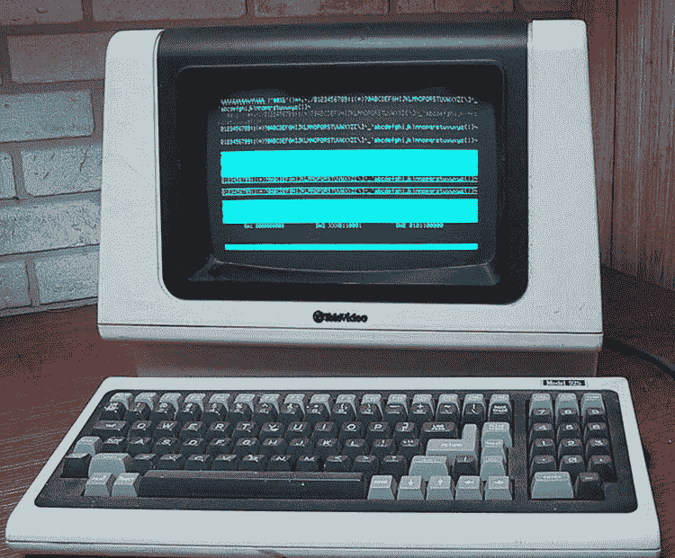
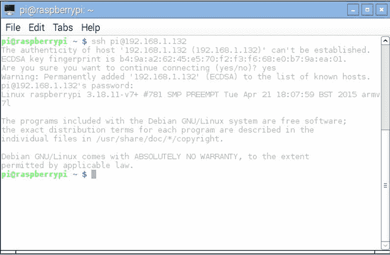
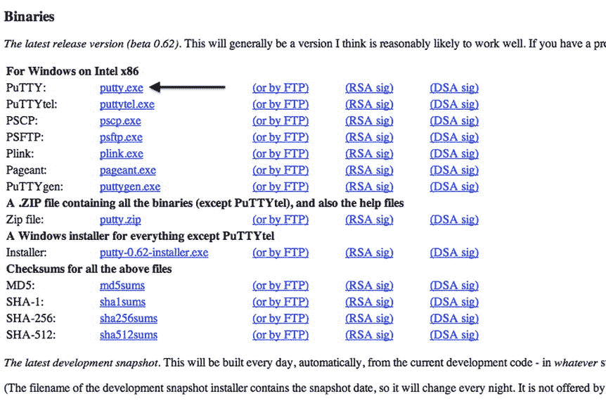
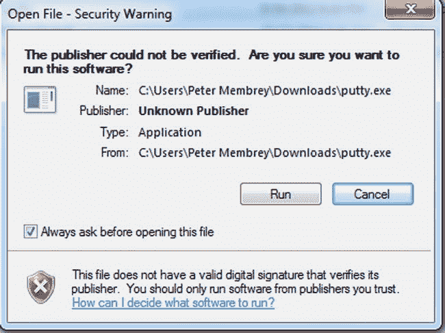
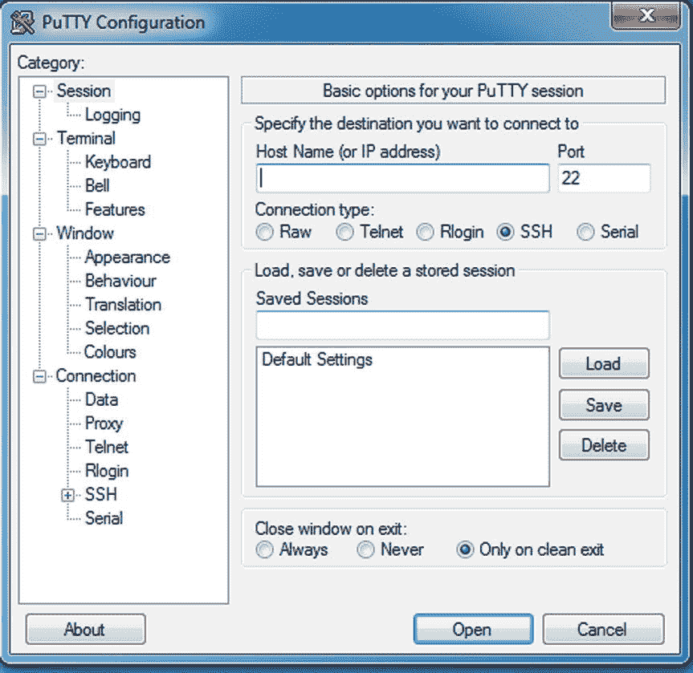
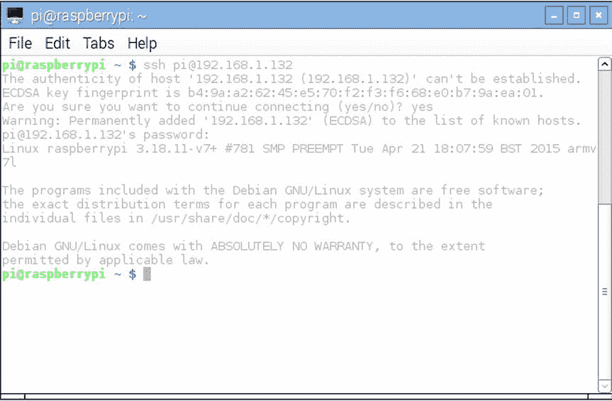

# 3.变得舒适

通常我们不会以一个数字开始一章(从技术上来说，我们认为这次也没有)，但我们会寻求一些老式的震撼和敬畏。看一下图 [3-1](#Fig1) (维基百科提供)。

图 3-1。

TeleVideo 925 computer terminal

你可能想知道为什么我们认为有必要向你展示一些 80 年代早期的技术(在这个特殊的例子中是 1982 年末)。这本书第二部分的大部分内容都是关于命令行以及如何让你舒适地使用它。尽管在这几十年间情况有所改善，但技术基本上是一样的。

在这一章中，我们将快速回顾一下计算机界面的历史，以及为什么终端能够幸存下来。然后，我们将看看可供您使用的各种终端，以及您如何到达它们。然后，我们将快速解释命令提示符，并让您了解一个鲜为人知的关于可用的不同 shells 的秘密。

## 叶老电脑

虽然你现在可以花 25 美元买一台电脑，但在 70 年代，你可能会花至少 100，000 倍的钱来买一台具有强大处理能力的电脑。这种机器会占据整个房间(如果不是整个楼层的话)，需要难以置信的大量电力，并且通常给路人留下非常深刻的印象。这些东西的所有者必须处理的一个关键问题是规模问题。

当你的电脑比它所在的建筑更值钱的时候，你要确保你能最大限度地利用它。解决这一挑战的一种方法是分时度假。这个想法是，与人类和电脑互动相比，电脑的速度快得令人难以置信。事实上，即使以今天的标准来看，它们微不足道，但它们仍能让真正想使用它们的人望尘莫及。所以这就引出了一个问题，如果计算机大部分时间都在等待操作员输入命令和数据，那么它在等待的同时会做其他事情吗？

没过多久，有人发现，如果计算机一直在等待输入，那么如果有多人输入数据，它可以得到更好的利用。这样，我们可以让多个人同时输入数据，这样我们就不再受限于一个人的速度。

好主意，但我们如何实施呢？为了让它工作，我们真的想在每个需要与计算机交谈的人面前放一个屏幕，而以现有的计算机技术，即使是一台非常基本的计算机也是不切实际的。话说回来，我们并不真的需要在他们的桌子上放一台电脑，我们只是需要一种方式让他们与楼下的大型电脑进行交流。实际上，我们只是想要一个键盘和一个有很长电缆的屏幕。

### 向愚蠢的终端问好

这就是哑终端出现的原因。它被称为哑终端，因为它实际上只是一个屏幕和键盘。使用从计算机本身传来的指令，它会把文本画到屏幕上。每当一个键被按下，这将被发送到服务器，然后服务器将回复更多的屏幕更新。哑终端没有任何真正的处理能力，它只是作为一个接口，这使得它们相对便宜，易于安装和维护。

随着时间的推移，技术确实得到了改善，哑终端变得更好，不那么哑了。增加了对不同颜色和亮度的支持，以及更好的重绘和管理屏幕的功能。然而，基本的概念，即哑终端只是一个远程机器的接口，从来没有真正改变太多。事实上，尽管当更现代的网络变得可用时，哑终端开始被取代(更不用说计算能力变得更便宜了)，但这种方法本身继续在较新的系统中使用。这不仅仅是因为人们不得不继续使用大量的遗留系统(你在一些大型百货商店的黑屏上看到过旧的绿色吗？)但它实际上有一些非常有用的属性，甚至在今天仍然有用。

GUIS AND TUIS

你会经常听到人们提到 GUI(读作 gooeys)和 TUIs(读作 tooeys ),我们也会在整本书中提到它们。幸运的是，这对首字母缩写词非常简单，你很快就会自己使用它们(当然，假设你真的想使用它们)。

GUI 是图形用户界面的缩写。几乎所有的现代计算机系统都以某种形式使用一个。过去很容易发现 GUI，因为它几乎是任何使用鼠标的设备。近年来，由于 iPad 和 Android 智能手机等设备的出现，这些界限变得有些模糊，你可以拥有一个只用手指就能操作的 GUI。现在更容易知道 TUI 是什么，因为一般来说，任何不是 TUI 的东西都被认为是 GUI。

TUI 是基于文本的用户界面的缩写，通常与 CLI 或命令行界面互换使用。TUI 可以呈现基本的菜单系统，但是这些系统是通过键盘控制而不是鼠标来导航的。

简而言之，如果你从键盘上驱动它，并且没有鼠标指针，它就是一个 TUI。如果你可以点击，用手指指着它或者看到漂亮的图片，这就是一个图形用户界面。

### 现代码头

在我们刚刚谈到的哑终端和我们今天在现代 Linux 系统上使用的终端之间有相当多的进化史。为了保持你的理智(更不用说跨过无聊的门槛)，我们将跳到现代，在你的 Pi 上展示远程终端是什么样子的(图 [3-2](#Fig2) ):

图 3-2。

SSH connection to a Raspberry Pi

如你所见，我们仍然有一个基于文本的界面，我们运行的程序都将在远程服务器上运行。我们确实有一些更好的功能(首先是彩色的)，我们可以把终端做得尽可能大(传统的终端往往是固定大小的)。在这个特殊的例子中，我们通过 TCP/IP 上的 SSH(Secure Shell——稍后将详细介绍)连接到 Pi。

### 那么为什么我们还会在意这些东西呢？

问得好！在 iPads、iPhones 和 Androids 的现代时代，我们为什么要使用基于文本的界面呢？对于大多数人来说，尤其是如果他们以前从未使用过，基于文本的界面听起来真的像是一种倒退，而不是他们特别想获得的技能。不用说，我们最喜欢古老的命令行，以下是我们认为您应该投入时间和精力掌握它的一些原因。

#### 简单的

其中一个关键原因是简单。说到简单，基于文本的界面是很难超越的。实际上它所做的只是发送和接收文本。你不会使用终端来查看你的假日快照，但它确实给了你一个清晰的界面来给你的 Pi 发布命令。

#### 快的

当我们这么说的时候，你可能现在不会相信我们，但是使用命令行界面将允许你更快地完成你的许多任务。这样做的原因是，你可以非常精确地在一行文本中表达大量的工作，这种事情需要多次点击或一个奇怪的复杂过程才能用鼠标表达。

#### 轻量级选手

任何不幸试图通过慢速互联网连接远程控制台式电脑的人都会明白我们在这里的意思。通过互联网发送屏幕更新(特别是对于有很多颜色的高分辨率屏幕)本质上就是占用大量带宽。数据到达目的地也需要一段时间，这就是为什么远程会话给人无响应和阻塞的感觉。

基于文本的会话不会遇到这个问题，因为它们只发送文本。它们是为最大速度只有我们今天可用速度的一小部分的系统而设计的。因此，即使在非常慢的拨号链路上，远程终端会话也往往表现得非常好。

这也减轻了服务器的压力。维护图形界面意味着计算机必须做相当多的工作。有一个鼠标指针意味着计算机必须跟踪这个指针，并确保当它接触到一个应用程序窗口或当用户点击一个按钮时做出正确的反应。令人惊讶的大量工作在幕后进行，这就是为什么 Linux 服务器很少安装图形界面，更不用说运行了。

#### 强大的

命令行给了你很大的权力。你可以表达复杂的思想，你可以用一种图形界面无法实现的方式发布命令。例如，您可以将命令串在一起，形成更复杂的链。您可以将一个命令的输出用作另一个命令的输入。这种技术使用了一种叫做管道的东西，我们将在下一章更全面地讨论这一点。

#### 它总是可用的

尽管近年来情况有所好转，但 Linux 平台上最易变的软件之一往往是图形界面。它似乎总是第一件要做的事情，当你的服务器停止启动，你需要一个救援环境时，你就不太可能有图形界面可用了。

然而，终端是与 Linux(基本上是大多数其他 Unix 操作系统)对话的本地方式，因此，它是一种以某种形式随时可供您使用的工具。知道如何使用终端会让你摆脱困境，并处理那些如果你不习惯命令行就会完全难倒你的情况。

#### 相信了吗？

希望这些亮点至少让您相信命令行还是有一些作用的。如果你不完全相信，那也没关系，除非你花时间亲自体验，否则很难真正感受到它的好处。在下一节中，我们将介绍如何真正使用命令行，解释您正在查看的内容的含义，并介绍一些基本的命令来帮助您开始您的旅程。

TERMINAL OR VIRTUAL TERMINAL?

在很大程度上，你不必担心两者之间的差异。您几乎总是会使用虚拟终端，也就是说，或者是 Linux GUI 本身内部的终端窗口，或者是通过 SSH 连接。终端和虚拟终端之间唯一真正的区别是，终端是一个单独的物理设备，如串行端口或直接连接到计算机的屏幕上(没有 GUI)。虚拟终端有一个分配给它的设备，但没有相应的物理设备。事实上，在 Linux 下，一个新的设备被创建并分配给每个新的虚拟终端。

我们之所以在这里提出这种区别，是因为一些文档(一般来说是旧的文档)可能会特别提到其中的一个。这些天来，虽然你的大部分时间将花在虚拟终端上，你不需要担心差异。

## 三个终端

有三种主要方法可以到达命令行。第一种是坐在机器前面，使用通常所说的控制台，第二种是在 GUI 中打开一个虚拟终端，第三种是使用 SSH 通过网络连接。

### 控制台

虽然控制台仅仅是另一个终端，但这个术语多年来已经获得了某种神秘的地位。当你在控制台上工作时，你是直接在机器上工作，因为它实际上是一个直接插入其中的键盘和显示器。

过去，管理员通常会限制某些用户(如 root 用户)只能坐在机器前面登录。由于计算机可能位于上锁的服务器机房，这提供了额外的安全级别。

大多数发行版都没有启用这种安全性，现在通过网络进行远程访问已经成为一种规范(有时管理员甚至没有物理访问权，或者机器在地球的另一边)，这个特性就没那么有用了。

不过，如果你坐在你的 Pi 前面，你可以通过按住 control (ctrl)和 alt 键，然后按 F1 到 F6 来访问控制台。默认情况下，F7 是 GUI 所在的地方，所以一旦你使用完控制台，你就可以返回到你的 GUI。

你什么时候需要这样做？好吧，如果你不能通过网络连接到你的 Pi，并且你在使用 GUI 时遇到了麻烦，控制台将会是你新的最好的朋友。但是总的来说？你不会经常使用控制台，如果有的话。通过其他两种方法获得命令行更加容易和灵活，因为通常至少有一种方法可供您使用。

### 在 GUI 中打开虚拟终端

Raspbian 使用 LXDE，即“轻量级桌面环境”。顾名思义，它专注于轻量级，这正是你想要的，当你的电脑正好处于轻量级的时候！

LXDE 的本机终端称为 LXTerminal，幸运的是，它不仅是预装的，而且还出现在任务栏上，如下图所示(图 [3-3](#Fig3) ):

图 3-3。

Finding LXTermianl

我们冒昧地双击了图标，您可以看到我们有一个只能被描述为工作终端的东西。当然，在这种情况下并没有太多东西要展示，因为根据定义，终端非常简单。如果你打算坐在 Pi 前，把它当作一台更传统的计算机，你可能会发现自己经常使用终端。如果您更多地考虑远程工作，那么您需要下一个部分，老实说，这要有趣得多…

### 通过 SSH 连接

SSH 是一种通过网络安全连接到您的 Pi 的好方法(参见“SSH 有什么特别之处？”).它给你虚拟终端的所有好处，但你可以从网络上的任何机器访问它。潜在地，这意味着你可以在家里从你的工作电脑连接到你的个人电脑，并在完全安全的情况下摆弄它。我们发现 SSH 是迄今为止我们与服务器交互的最常见的方式，并且由于大多数人将 Pi 用作无头设备(即，没有键盘或鼠标连接到它——甚至可能没有显示器),我们认为 SSH 也将是您的首选。

SSH 等式有两个部分。您需要一个 SSH 服务器和一个 SSH 客户机。幸运的是，这两者都是免费的，而且很容易安装。

#### 在 Pi 上设置 SSH 服务器

这一点实际上非常简单，因为除非您在安装 Raspbian 时特别禁用了它，否则 SSH 服务器已经在运行了(Raspbian 默认启用它)。事实上，在这个阶段，你真正需要的是找出你的 Pi 的 IP 地址。

首先覆盖 Pi 的虚拟终端的好处之一是，我们现在可以使用它来计算我们的 IP 地址。Pi 利用 DHCP(动态主机配置协议)的优势，这意味着在绝大多数网络上，它将能够为自己挑选出一个 IP 地址。这不仅节省了我们的时间，也意味着您不需要想出如何选择一个合适的地址，然后配置它。现代技术的奇迹！

为了找到地址，我们将使用“sudo ifconfig”命令。这个命令(是“接口配置”的缩写)将(可能并不奇怪)显示您的网络接口的配置。这是它在我们的 Pi 上的样子(图 [3-4](#Fig4) ):

图 3-4。

Running ifconfig on our pi

在这里，您可以看到我们有两个网络接口。本地环回设备(或其朋友的“lo ”)是一个虚拟接口，网络应用程序可以使用它在同一台机器上相互通信。由于不涉及硬件，使用 lo 接口更有效，因为它总是可用，并且以相同的方式配置。在 Linux 下，大多数系统服务(如打印甚至 GUI)都作为客户机/服务器应用程序运行，并大量使用这个接口。

现在，虽然我们对 lo 设备不太感兴趣，但我们对连接 Pi 和物理网络的网络接口更感兴趣。eth 0(0 号以太网设备的缩写——记住计算机往往从零开始计数)代表着我们与现实世界的联系。在这个阶段，我们不会用所有信息的含义来烦你，这也不是你经常会看到的东西。运行 ifconfig 最常见的原因是找出 IP 地址，这当然是我们在这里的原因。从上面的截图中，您可以看到:

`inet addr: 192.168.1.132 Bcast: 192.168.1.255 Mask: 255.255.255.0`

我们实际上只对 IP 或 inet 地址感兴趣，在本例中是 192.168.1.132。有了这些信息，我们应该能够从网络上的任何地方连接到 Pi。

#### 整理 SSH 客户端

我们假设您从 Windows PC 或 Mac 进行连接。如果你用的是不同的操作系统，那么不要慌，大概有适合你下载的客户端。您仍然可以继续学习其他两个教程，因为无论您使用哪个客户端(或在哪个平台上)，一般过程都是相同的。

##### 窗户油灰

Putty 几乎是所有其他 SSH 客户机比较的标准，这是有充分理由的。它不仅功能丰富，而且碰巧是免费的。您可以从以下地址下载 Putty:

`http://www.chiark.greenend.org.uk/∼sgtatham/putty/download.html`

由于它对于输入来说有点长，所以您可以通过在谷歌上搜索“下载 Putty”来获得类似的结果。一旦你进入下载页面，你会想要得到页面上的第一个链接，putty.exe(图 [3-5](#Fig5) ):

图 3-5。

Downloading Putty

Putty 是一个独立的工具，所以只要你下载了它就可以运行它，你不需要在你的机器上安装任何东西。这通常非常有用，因为这意味着您可以将它放在 u 盘上，随身携带，并且您通常可以在其他机器上运行它，而不需要管理员权限(即无需安装任何东西)。然而，如果你一直找不到 Putty(它是如此简单，令人惊讶)，你可能需要下载“安装程序”版本，它会将它安装在你的机器上，并为你设置开始菜单和桌面快捷图标。

现在我们有了油灰，是时候点火了。双击图标，您可能会看到与此非常相似的内容(图 [3-6](#Fig6) ):

图 3-6。

Windows getting excited

Windows 只是警告您该程序尚未经过数字签名。你可能以前遇到过这种情况，但是当你安装一些所谓的安全增强软件时，你最不想做的事情就是安装一些令人不快的东西。在这种情况下，Putty 的正式版本没有签名，您可以忽略此错误。如果你打算经常使用 Putty，你应该取消勾选“打开文件前总是询问”。相信我们，如果你现在不做，十次或十一次后你会做的。

在你说服 Windows 退出后，你会得到一个类似这样的连接框(图 [3-7](#Fig7) ):

图 3-7。

Starting up Putty

默认设置可以连接到您的 Pi，您只需要提供我们之前发现的 IP 地址。将此输入“主机名(或 IP 地址)”框，然后单击打开。由于这将是这台特殊的机器第一次连接到您的 Pi，您将会得到一个类似于下面的警告(图 [3-8](#Fig8) ):

图 3-8。

Security warning when connecting for the first time

别担心，这是宋承宪安全系统的一部分。它让你知道它以前没有见过这个特定的服务器(它不会见过，不是吗？)并向您展示密钥以供确认。我们不知道有谁记住了他们的 SSH 指纹(尽管记住前四位和后四位数字对确保你有正确的指纹有很大帮助)，而且在任何情况下我们都希望看到这个警告。一旦 Putty 记住了密钥，它将在您以后每次连接时对照 IP 地址和主机名进行检查。如果远程服务器发回不同的指纹，Putty 会警告您可能有问题。通常情况下，当您重建或购买新服务器时会发生这种情况，因此您知道为什么密钥会发生变化。如果你看到一个警告，却想不出一个好的理由，那么在登录到那台机器之前要非常仔细地思考。在我们的特殊情况下，我们知道密钥将是新的，所以我们可以简单地选择“是，保存密钥”。

现在，您将回到一个有些熟悉的黑色屏幕，上面有一些文本。到目前为止只会是:

用户名:

由于我们还没有设置不同的用户帐户，我们将作为“pi”用户登录，所以只需输入 pi 并按 enter 键。目前为止一切顺利。现在我们只需要提供您在初始安装时设置的密码。现在我们知道你按照我们的建议更改了密码(你做得对吗？)但是以防万一你没有，默认密码是 raspberry。输入密码，按回车键，最后我们应该得到我们想要的命令提示符:

`pi@raspberrypi ∼ $`

如果您没有 Mac(或者对使用 SSH 不感兴趣)，请跳到下一部分——命令提示符。

LOOK BEFORE YOU LEAP

这属于“显而易见，除非证明不是这样”的范畴，但是当你使用远程终端时，很容易迷失方向，并在错误的机器上运行命令。如果你试图重启你桌子上的 Pi，你不希望意外重启其他东西，比如公司服务器(你永远不知道你的新 Linux 技能会把你带到哪里！).

### Mac 上的 SSH

如果你使用的是 Mac 而不是 PC，你将无法使用 Putty。这不成问题，因为由于它的 Unix 根，Mac 内置了一个很好的 SSH 客户端。我们需要做的就是打开一个终端窗口并运行 SSH 命令。

首先，让我们启动并运行终端。您可以在“应用程序”内的“实用程序”目录中找到它。也可以使用 Spotlight(菜单栏右上角的放大镜，输入“终端”来查找。

您会发现它与您在 Pi 上使用的终端没有太大的不同，这是有原因的。正如我们前面提到的，Mac 实际上是基于 Unix 的，就像 Linux(以及 Raspbian)一样。尽管 Mac 很好地隐藏了它的 Unix 部分(你可以使用 Mac 很多年，但永远不会碰到它)，如果你喜欢 Linux 和命令行，你可能想更深入地了解它。

现在我们已经打开了终端，让我们将它连接到您的 Pi。我们将使用 ssh 命令，因为没有 GUI，所以我们必须在命令行上指定相关选项。基于我们之前的例子，你的终端应该是这样的(图 [3-9](#Fig9) ):

图 3-9。

Connecting to your Pi over ssh

为了节省空间，上面的截图显示了整个过程，而不仅仅是一个空的终端窗口。我们现在最感兴趣的是:

`$ ssh pi@192.168.1.132`

命令本身是 ssh，但是我们提供了一些附加信息；我们要连接的用户和 IP 地址。可以将选项读作“服务器 192.168.1.132 上的用户 pi”。有点像电子邮件地址，这是一个很好的简洁的方式来显示我们想连接谁以及我们想连接到哪里。你当然应该用你的 Pi 地址替换我们的 IP 地址。

每当您连接到新机器时，都会看到第一个文本块:

主机' 192.168.1.132 '的真实性无法建立。

ECDSA 密钥指纹为 B4:9a:a2:62:45:E5:70:F2:F3:F6:68:E0:B7:9a:ea:01。

您确定要继续连接吗(是/否)？是

警告:将“192.168.1.132”永久添加到已知主机列表中

pi@192.168.1.132 的密码

这只是 ssh 警告您它不能确定您是否正在连接到您认为正在连接的服务器的方式，并向您显示服务器用来识别自身的密钥。在这种情况下，你可以忽略警告，说是。如果您想了解更多关于它的含义，我们在 Windows 上的 SSH 一节中简要介绍了它。在您输入密码(raspberry 是默认的)之后，您应该会看到以下提示:

`pi@raspberrypi ∼ $`

现在您已经有了命令提示符，我们将看看它的实际含义。

WHAT’S SO SPECIAL ABOUT SSH?

SSH 或 Secure Shell 实际上是远程访问任何 Unix 类机器的标准。它甚至受到许多网络设备的支持，如打印机和高端交换机。它之所以如此受欢迎，是因为它加密了你的计算机和服务器之间的所有数据。如果有人在监听你的连接，他们得到的只会是垃圾。它还允许您验证服务器是否是您认为的服务器。

在我们有 SSH 之前，每个人都使用 telnet。这是一个非常简单的协议，没有任何加密。这意味着，如果任何人都可以看到你的流量(想想公共机器或 WIFI 接入点)，就有可能以明文形式从网络上读取你的密码。Telnet 也无法确认您所连接的机器的身份，这意味着您永远无法确定您是否无意中向他人提供了您的用户名和密码。

仍然可以在 Linux 上安装 telnet 服务器，但是不鼓励这样做。没有什么好的理由比 SSH 更喜欢 telnet，所以当您在远程服务器上工作时，应该总是使用 SSH。

## 欢迎使用命令行

无论您选择哪条路线到达终端，最终结果都是一样的，也就是说，您最终会看到一个类似如下的命令提示符(或简单的提示符):

`pi@raspberrypi ∼ $`

这里实际上有相当多的信息，但它都意味着什么呢？你也许可以从我们到目前为止在书中所做的事情中猜出大部分，但是为了完整起见，这里是它是如何分解的。

第一部分(例子中的 pi)是用户名。当您只有一个 Pi 和一个用户时，这不是特别有用(或者令人敬畏)。然而，当您最终不得不管理许多用户或者当您有不同机器的各种帐户时，它是非常有用的。这就是第二部分的用武之地(示例中的 raspberrypi ),因为它告诉我们所连接的机器的主机名。总之，这让我们知道我们是谁，我们在哪里。同样，对于一个圆周率来说不是很有用，但是这些信息总有一天会派上用场。

Caution

我们已经在其他地方强调了这一点，但它非常重要，我们要再说一遍。当您打开多个终端时，很容易在错误的服务器上运行命令。有时，在您意识到自己的错误之前，您会运行多个命令。通常不会造成伤害，但是如果您在工作中意外地重启了一个关键服务器，而您实际上是想重启您的 Pi，那么您将成为 IT 部门的头号报复对象。

提示符的下一项(或波浪符号)实际上告诉我们当前在哪个目录中。波浪号是一个特例，因为它指的是当前用户的家庭区域。你可以把它想成简写，因为它就是简写。每当您引用您的主目录(在本例中是/home/pi)时，我们可以简单地用波浪号替换它。下面是一个简单的例子:

`pi@raspberrypi ∼ $ pwd`

`/home/pi`

`pi@raspberrypi ∼ $ cd ∼`

`pi@raspberrypi ∼ $ pwd`

`/home/pi`

`pi@raspberrypi ∼ $`

这里我们使用了“pwd”(打印工作目录的缩写)，它打印出了我们当前所在目录的完整路径。在我们的例子中，它输出/home/pi，因为这是 pi 用户的主目录。然后，我们使用“cd”命令(change directory 的缩写)转到目录。我们再次使用“pwd ”,并能够验证在更改目录后，我们又回到了开始的地方。我们将在下一章更彻底地解释这些命令，但是这些命令行的东西难道不是至少有点意思吗？

当在一般讲话中提到'∾'时，你称它为“主目录”。因此，如果您在我们的示例中坐在提示符下，有人问您在哪个目录中，您会说您在自己的主目录中，或者如果您想明确一点，您会说您在 pi 用户的主目录中。如果你想得到真正具体的，你甚至可以提到主机名。你不会说你是在波浪号或“摆动线”目录。

然而，当你给某人一条进入的路径时，你会说颚化符。例如，如果您希望用户转到“∨/test/”，您可以说“键入 cd 空格符斜杠测试斜杠，然后按 Enter”。这是因为在这种情况下，代字号指的是您为了方便到达某个位置而使用的特定内容，而不是实际告诉某人该位置是什么。这也有助于防止相对路径的混淆，但同样，这是下一章的内容。

Note

我们听过 tilde 发音为“tilled”和“till-duh ”,所以你应该会在野外听到这两种发音。不过有趣的是，你可能会发现无论你使用哪一个，人们都很难理解你，这甚至适用于有经验的管理员。这不是因为你读错了，只是他们不知道“1 键左边的波浪线”实际上叫做波浪线。如果你发现自己处于这种情况，称之为“摇摆不定的线”似乎是一个相当安全的赌注。

命令提示符的最后一部分显示了您的访问级别。谈到系统特权，Linux 系统是非常基本的。这通常可以归结为你要么是根用户，要么不是。如果您是 root 用户，那么您可以不受限制地做任何事情。如果你是任何其他用户，预计会发现你的能力大幅削减。如今，这种情况已不像以前那样真实，因为有一些工具，如“sudo ”,允许管理员授予以 root 权限运行某些命令的能力，而无需该用户访问 root 帐户。当然，最终，sudo 以 root 用户身份运行，它只是决定是否运行您要求它运行的命令，所以实际上它仍然遵守全有或全无规则。

从提示的角度来看，如果您是普通用户，您会得到一个美元符号作为提示。我们以 pi 用户(显然不是根用户)的身份登录，因此我们也有$号。如果我们以 root 用户身份登录，我们将是特权用户，因此我们将获得散列符号(如果您不是来自英国，则为井号)。根提示符如下所示:

`root@raspberrypi ∼ #`

散列符号是一个标志(也是一个警告),表示您正在以提升的权限运行，因此您应该对键入的内容非常小心。提示符还显示用户名为 root，这提供了一个额外的指示。然而，这些微妙的提示很容易被忽略(人们不倾向于研究每个命令前的提示)，所以再次强调，在按回车键之前，总是检查你是谁和你在哪里。

这就是提示的全部内容。大多数 shells 允许您定制它来显示不同的信息，偶尔一些管理员会更改这一点。根据我们的经验，大多数人都不会在意，我们也很少觉得有必要自己去改变它。我们在这里提出这个问题的原因是，如果你登录到另一台 Linux 机器上，而提示完全不同，那就不必担心了。终端的工作方式完全相同，只是提示符被定制了。

## 不同的外壳

好吧，当我们说所有的终端都一样工作时，也许我们把事情简单化了。事实上，有一些细微的差别，特别是在它们支持的特性上，但是通常你不会注意到。事实上，当远程机器使用不同的 shell 时，很可能会发现这一点。shell 是一个和其他程序一样的程序，但它不是一个浏览网页或阅读电子邮件的工具，它提供了一个命令行让你和操作系统进行交互。它就像一个包裹着内核的包裹物，这就是它的名字——就像花生米一样包裹着内核。

到目前为止，我们一直在使用 BASH 或 Bourne Again Shell。它是目前最流行的 shell，在每个 Linux 发行版中都有。它通常也是默认的，这就是为什么你永远不用太担心你的系统运行的是哪一个 shell。

我们之所以在这里提出这个问题，是因为就像开源世界中的其他事情一样，对于什么是最好的 shell，人们有不同的看法。有些采用了一种简单的方法，只支持最基本的特性，而 BASH 这样的 shells 自带电池，拥有的特性比你摇一摇棍子能想到的还要多。尽管 BASH 很受欢迎，但可以想象，在您杰出的 Linux 职业生涯中的某个时刻，您可能会遇到其他事情，预先警告是有备无患的。

我们不打算花更多的时间来看不同的外壳，因为老实说，你可能永远不需要担心它。即使一台机器使用不同的 shell，您也可以启动 BASH 来替换它(大多数系统都安装了 BASH，即使您登录时使用了不同的 shell)。因为无论您使用哪种 shell，系统命令都是相同的，所以即使您无法使用 BASH，您也可能会发现您可以做任何您通常会做的事情。事实上，大多数 shell 在很大程度上是可以互换的，即使您在使用另一个 shell，您也可能不知道！

## 摘要

这一章向你介绍了这个码头和它丰富的(如果不是非常迷人的)历史。然后，我们讨论了终端今天是如何使用的，以及它是如何适应我们的现代需求的。然后我们看了在 Pi 上访问终端的三种主要方式，主要是控制台、虚拟终端和通过 SSH 访问网络。接下来，我们快速描述了命令提示符，并提到了一些有趣的命令来强调一点(我们绝对保证在翻页时会解释这一点)，最后，我们总结了这一章，向您介绍了不同的 shells，以及它们可能(但可能不会)如何让您出错。

在下一章中，你需要知道如何愉快地浏览你的 Pi，创建文件，修改文件，删除文件等等。这是我们开始真正认真对待命令行的地方，也是您开始获得一些实际技能的地方。