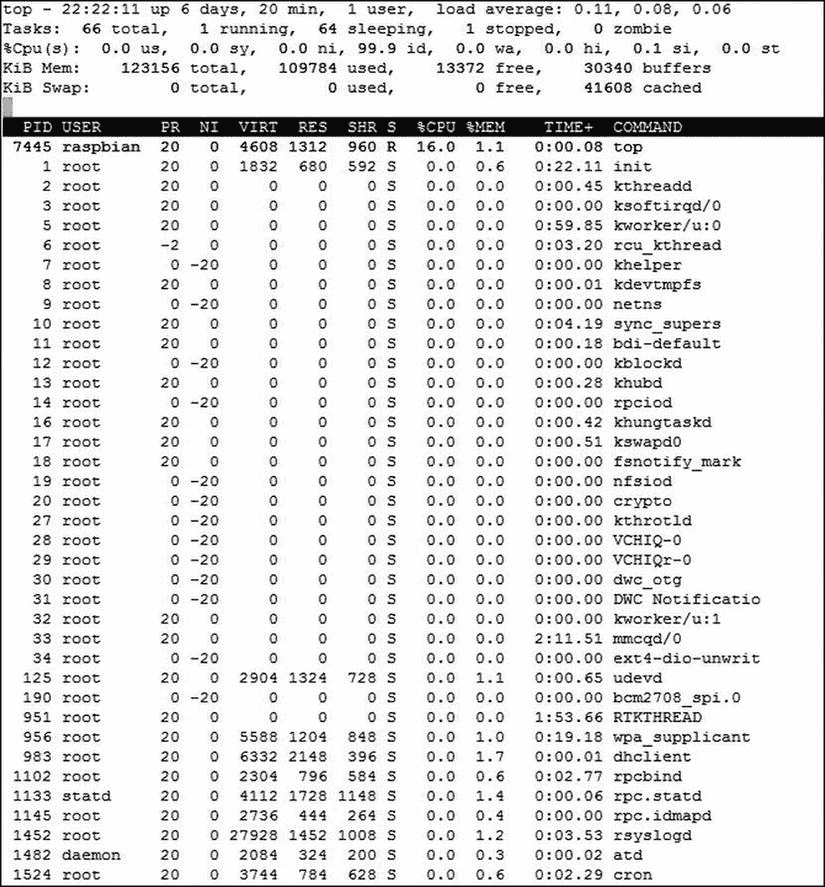
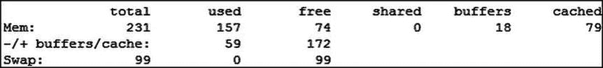
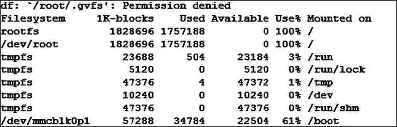
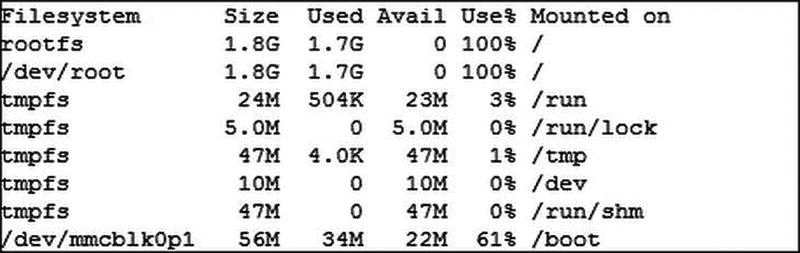
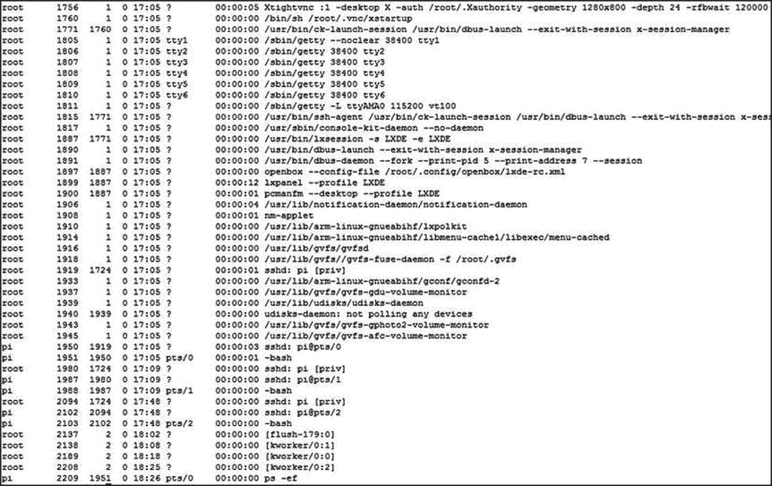

# 5.基本命令

现在您已经有了这个不可思议的新的 Raspberry Pi，您已经安装并配置它来接受和运行一个版本的 Raspbian Linux。您已经登录，可以在系统中自由移动。你可以在你的 Pi 上做基础，但是现在觉得你已经准备好承担更多了。

这就是本章的目的:教你一整套命令，这样你就可以成为一个 Linux 用户。这些命令将涵盖一系列功能，从成为超级用户、检查磁盘空间、终止进程，到配置用户空间和监控环境变量。所有这些任务对于系统管理员来说都是常见的，并且会对系统的运行方式产生很大的影响。所以事不宜迟，我们开始吧。

## 成为老板

“根”是一个描述树的基部的词，其余的都是从基部生长出来的。在 Linux 和 UNIX 中，这个术语用来表示文件系统的起始点(正如我们在第 4 章中看到的那样)和表示系统上的主管理用户(在第 3 章的[中有简要介绍)。要执行任何系统或管理功能，您需要被识别为 root 用户，以便拥有更改核心功能的权限。因此，root 是一把双刃剑:改变系统的无限权力和破坏系统功能的无限权力。关于在 Linux 环境中工作，我能说的最真实的事情之一就是，最终你会以 root 用户的身份发出一个命令，这个命令会破坏某些东西(如果不是所有东西的话)，这会给你带来无穷无尽的麻烦，甚至可能需要你重新安装操作系统。由于这个原因(以及相关的安全原因)，建议用户永远不要以 root 用户的身份登录到 shell。](03.html)

为了解决这个问题，我们使用了`sudo`，我们在[第 3 章](03.html)和[第 4 章](04.html)中已经看到了一点。如您所知，这个工具是您能想到的任何 shell 命令的包装器。这意味着，如果您在命令前面加上`sudo (`，例如`sudo ls)`，您将不再作为自己的用户执行该命令，而是作为超级用户。这确实使超级用户的工作稍微复杂了一些，但是风险也小了很多。事实上，许多 Linux 发行版不再设置 root 密码，而是在创建时赋予新用户`sudo`的权力。这意味着所有的管理必须通过一个拥有`sudo`命令的授权用户来完成，以发布所有必需的管理功能。

为了让您能够以 root 用户身份执行，`sudo`会要求您输入用户密码，以验证您是否就是您所说的那个人，而不仅仅是一个拥有访问权限却忘了拿键盘的人。除了要求所有用户输入密码，`sudo`还有一个控制文件，控制哪些用户和组可以访问`sudo`命令，甚至可以限制他们可以通过`sudo`执行哪些程序。有一个特殊的命令`visudo`，用于编辑这个导向文件(称为 sudoers 文件)，该文件必须以 root 身份运行(所以前缀为`sudo`):

`$ sudo visudo`

这段代码启动了一个系统文本编辑器(通常是`vi`或`nano`)的特殊实例，其中已经加载了 sudoers 文件进行编辑。要快速浏览如何使用`vi`和`nano`，请查看[第 6 章](06.html)。

在 sudoers 文件中有许多控制`sudo`环境如何工作的东西，包括一个`PATH`变量(我们将在后面介绍)。然而，重要的是`userauth`部分下面的一行，如下所示:

`root    ALL=(ALL:ALL) ALL`

这一行表示所有主机上的 root 用户可以访问所有其他主机上的所有命令(主机是网络上的服务器)。这有点令人困惑，但它基本上向任何可以将自己标识为 root 的用户授予完全访问权限。还有另一句台词:

`%sudo   ALL=(ALL:ALL) ALL`

这一行表示`sudo`组的成员也可以做与根用户相同的事情:从网络上的所有主机访问可以在网络上的所有主机上执行的所有命令。您会注意到前导的`%`用于表示这是一个组名。其中一行的基本格式如下:

`<user>  <From which hosts>=(<On which hosts>:<which commands>) < command options and commands >`

这个语法一开始有点混乱，所以让我们看一下为您的`pi`用户创建一组特定的权限作为例子。首先，我们需要创建一个新的基本用户权限集，它看起来就像根用户一样，但是它指的是我们的`pi`用户。这一行看起来像:

`pi    ALL=ALL   ALL`

我已经删除了`<on which hosts: which commands>`部分，用一个通用的`ALL`代替它，使事情更容易理解。现在让我们假设我们不希望`pi`用户被要求输入密码。为此，我们在代表命令的最后一个`ALL`前添加了一个`NOPASSWD:`。这给了我们一条新的线索:

`pi    ALL=ALL   NOPASSWD: ALL`

如果您现在添加这个，您可以作为`pi`用户运行所有命令，甚至不需要提供密码。这是一个非常危险的命令，所以让我们稍微修改一下，使它成为唯一可以执行的`visudo`命令。为此，我们将命令的最后一个`ALL`替换为我们希望使用的命令，在本例中是`visudo`。但是我们不能只写`visudo`，我们需要提供应用的完整路径，也就是`/usr/sbin/visudo`。因此我们得到以下结果:

`pi    ALL=ALL   NOPASSWD: /usr/sbin/visudo`

现在您应该知道在 sudoers 文件中可以做些什么来控制如何访问`sudo`命令了。您可以有多个条目来控制这些命令如何运行、由谁运行以及在什么条件下运行。还有大量添加别名的功能，可以是命令、主机或用户的大量组合。这些命令的大部分语法可以从 sudoers 手册中获得。

最后，您需要注意的最后一个命令是`su`命令，它是 switch user 的缩写。这个命令完全按照它的意思来切换您是哪个用户，如果您不是 root 用户，它会提示您输入希望切换到的用户的密码。获得根用户权限的最有效的欺骗手段之一是结合`sudo`和`su`来切换到根用户，只使用当前用户的密码而不是根用户的密码。这个命令是许多人绕过许多 Linux 发行版设置的“不知道根密码”限制的方法:

`$ sudo su –`

减号表示您希望获得对环境的登录，因为没有提供其他参数，所以它将尝试以超级用户的身份登录。您还可以通过在减号前添加给定用户的用户名来切换用户。您还可以使用带有`–i`选项的`sudo`命令来获得一个交互式 shell，它将实现同样的功能:

`$ sudo –i`

## 阅读各类手册

我最喜欢的来自技术世界的一句话是 RTFM，它是阅读燃烧手册的缩写。虽然我发现向别人寻求帮助是好的，但知道有一本手册可以阅读总是令人欣慰的，Linux 也不例外。大多数应用程序都有一个手动文档，可以通过使用`man`命令来访问！这个命令将您希望获得的手册页作为它的第一个参数。因此，如果您想查看`sudoers`命令的手册页，以便更好地了解如何编写 sudoers 文件，您可以键入:

`$ man sudoers`

然后手册页就会出现。导航手册页的方式与导航用`less`打开的文档的方式相同(这是一个我们将在本章中进一步介绍的命令)，所以导航是用箭头和 page up 和 page down 键来完成的。您也可以通过按下`/`来搜索字符串，然后输入您想要搜索的内容。`n`键将帮助你浏览文件。因此，如果您发现自己需要更多关于命令的信息，请记得阅读 Flaming Man 页面！

## 系统资源监控

系统管理员需要做的一件重要事情是监控系统上的资源使用情况。虽然这些命令中的一些对您的普通 Pi 用户来说用处不大，但是有些时候能够看到您的系统正在做什么将会派上用场。

需要注意的第一个系统命令是`top`，这是一个用于显示系统中资源的当前使用情况以及显示哪些进程正在消耗什么级别的资源的命令。`top`命令非常强大，可以显示关于系统资源使用情况的大量信息。`top`的输出通常如图 [5-1](#Fig1) 所示。

图 5-1。

Top in action!

`top`命令的输出是巨大的，如果你仔细观察，所有的值都会定期更新。让我们一行一行地检查一下`top`的输出，这样你就能明白你在看什么了。

### 正常运行时间和平均负载

第一行给出了当前时间和系统正常运行时间的信息。然后显示系统上的用户数量，最后显示平均负载。负载平均是最难理解的事情之一；它是一个“元”变量，因为它指的是相对于系统的执行能力，系统内部正在发生什么。它包含 3 个值，给出当前分钟、过去 5 分钟和过去 15 分钟的平均值。平均负载代表实际计算使用和系统计算资源需求的平均值。

我所听到的认为平均负载的最好方式可能是高速公路。通常，CPU 使用率的百分比值表示当前可用计算资源的使用量。这类似于测量高速公路上目前的交通流量。平均负载比较正在使用的计算量和对 CPU 使用量的需求。这就像同时检查高速公路和它的匝道。当从“繁忙的午餐时间”的角度来看时，这两者之间的区别就来了，这意味着高速公路上有很多车，但正因为“这是一个繁忙的午餐时间”，每个人都可以上高速公路并使用它，没有人被困在匝道上等着，交通顺畅。

这就是为什么平均负载是如此强大的指标；它允许您实时查看对系统计算能力的需求，以便您可以看到需求何时开始激增，从而采取措施降低需求。

哇，一行就这么多！

### 任务

`top`输出的第二行列出了系统当前正在执行的任务:

*   进程的总数
*   正在运行的进程的数量
*   在后台休眠的进程的数量
*   停止的进程数
*   僵尸进程的数量

这些过程中的大部分都是为了了解系统中正在发生的事情。但是僵尸进程可能是一个真正的问题。这些进程是已经完成执行，但仍然驻留在系统内存中的进程——通常是因为它们需要向产生它们的进程发送返回值，但还没有这样做，因此必须像活死人一样在那里等待，然后才能发送最后的消息并前往来世。

有一个长时间运行的僵尸进程可能表明用于产生它的应用程序(称为它的父进程)有问题。如果您在系统中看到僵尸进程，请查看是哪个进程产生了它们，并检查其运行状态和日志文件(日志文件是从写入磁盘的应用程序中输出的，因此您作为系统管理员可以看到它们在做什么)，因为这可能表明存在更大的问题。

### CPU 利用率百分比

`top`命令的第三行是 CPU 利用率百分比值。这以百分比的形式显示了当前有多少计算资源分配给了系统的哪个域。这些值如下:

*   `us`(用于用户应用)
*   `sy`(用于系统应用)
*   `ni`(对于已经被“改善”以便给予它们或多或少的 CPU 优先级的进程)
*   `id`(代表空闲)
*   `wa`(对于等待 I/O 完成的进程)
*   `hi`(用于等待硬件中断的进程)
*   `si`(用于等待软件中断的进程)
*   `st`(表示被虚拟机管理程序窃取的时间——虚拟机管理程序是运行 Xen 或 VMWare ESX 等虚拟化平台的软件)

在这些值中，通常分配给它的计算资源最多的是`id`，它表示可以在其他地方使用的空闲可用计算。看到`wa`、`hi`、`si`或`st`的高值绝不是好迹象，因为它们表明您的系统正在等待某个特定的硬件或另一个函数完成处理。如果这些数字居高不下，您应该调查是哪些进程导致了它们，并查看是否有任何硬件问题。

### 内存使用

第 4 行和第 5 行代表系统的内存使用情况。第 4 行是实际的内存使用情况，第 5 行是交换空间使用情况。这两行将显示给定空间中的总内存、已用内存和空闲内存。这个最终值表示缓冲区和缓存的值。这两者是相互关联的，也是不熟悉 Linux 的用户非常担心的原因。这与 RAM 的分配方式有关。Linux 有时会占用所有可用的 RAM，并将其放入一个缓冲区，这意味着它被缓冲区占用，但以后仍可用于您的应用程序。Linux 会将这个 RAM 视为正在使用，但它只是坐在缓冲区中等待。buffers 值可能有点难以理解；这将导致另一个命令显示这些资源是如何使用的(我将在接下来介绍)。

### 过程表

在第五行之后是一个包含进程表的大部分，该表列出了所有正在运行的进程，并且在近乎实时的更新中，列出了哪些进程消耗了多少资源。下面显示了许多不同的列以及它们所代表的信息:

*   PID:进程的 ID 号
*   用户:拥有流程的用户
*   PR:流程的优先级
*   倪:这个过程值了
*   VIRT:进程消耗的虚拟内存量
*   RES:实际驻留虚拟内存的大小
*   SHR:进程正在使用的共享内存量
*   s:进程状态(例如，睡眠、运行、僵停)
*   %CPU:消耗的 CPU 的百分比
*   %MEM:消耗的内存百分比
*   TIME+:任务自启动以来使用的总 CPU 时间
*   命令:命令的实际名称

`top`也有许多按键动作，可以控制这些进程的显示顺序；您可以在`top`的手册页中查看它们。

因此,`top`是一个显示系统资源使用情况的极好的命令，也是深入了解系统本身正在做什么的最佳工具之一。

### 使用 free 查看内存分配

如前所述，有一种比使用`top`更简单的方法来查看您的内存分配情况。执行此操作的命令是`free`命令，您可以使用希望显示的单位调用该命令(`–k`表示千字节，`-m`表示兆字节，`-g`表示千兆字节，等等)。为了我们的目的。兆字节是最好的，所以调用它如下:

`$ free –m`

您的输出应该如图 [5-2](#Fig2) 所示。

图 5-2。

Free as in free

由此，您可以看到改变`used`和`free`值的`+/- buffers and cache`线。这是一个很好的方式来询问任何时候你的系统显示高达 100%的内存峰值，因为它可能只是大量的缓冲区和缓存在运行。从这两个实用程序中，您应该能够准确地了解系统中正在发生什么，以及它的资源是如何被使用的。

### 磁盘使用情况

既然我们已经了解了 CPU 和 RAM 的使用情况，它们是相当动态的，那么是时候了解一些更静态的东西了，即磁盘利用率。在大多数操作系统中，您可以快速方便地查看有多少可用存储空间正在使用，Linux 也不例外。显示整个系统磁盘当前使用情况的命令是`df`，它是 disk free 的缩写，可以在命令行上使用，不带参数，以显示您需要的所有内容。如果这样做，您的输出将类似于图 [5-3](#Fig3) 。

图 5-3。

Disk free, ouch!

图 [5-3](#Fig3) 显示磁盘空闲，并显示安装在`/`上的主`rootfs`基本上 100%满——哎哟。您可以看到系统正在使用的 1 k 数据块的数量，但是这些值并不是很明显。您还会注意到在顶部有一个权限被拒绝的错误。

幸运的是，这两个问题都有解决方案。首先是用`sudo`运行这个命令，这样它就可以以 root 用户身份访问整个系统。第二个是添加了`–h`参数。这个论点是相当普遍的:要么是`–h`求助，要么是`–h`人类，也就是说人类可读的单元。所以我们运行这个命令:

`$ sudo df -h`

输出应该更容易被普通人理解(见图 [5-4](#Fig4) )。

图 5-4。

df for humans

正如您所看到的，人类可读标志已经将那些`Size`和`Used`值改为人类可读的数字，在表示单元的末尾有一个漂亮的小标志。试验显示标志是帮助您理解来自 Linux 命令的一些复杂数据的好方法。通常情况下，您会在手册页中找到一个很大的部分，详细介绍了一个命令的所有标志。

我们已经看到了系统的全部磁盘利用率，但是假设我们想要找到一个文件夹中所有文件的详细利用率。我们可以使用另一个命令来做到这一点:`du`，它是 disk usage 的缩写，用于总结每个文件的磁盘使用情况，递归地表示目录。如果您运行`du`，它会告诉您这个文件夹中每个文件的估计使用量，以及每个子文件夹和其中每个项目及其子文件夹的估计使用量，等等。`du`也将利用`–h`获得曾经在`df`的人类旗帜。因此，如果我们运行它，我们会得到如下输出:

`$ du –h`

`4.0K    ./.cache/dconf`

`12K     ./.cache/menus`

`576K    ./.cache/midori/web`

`4.0K    ./.cache/midori/thumbnails`

`24K     ./.cache/midori/icons`

`608K    ./.cache/midori`

`4.0K    ./.cache/openbox/sessions`

`12K     ./.cache/openbox`

`640K    ./.cache`

`12K     ./.dbus/session-bus`

`16K     ./.dbus`

`5.0M    ./.tor`

`12K     ./.ssh`

`1.8M    ./python_games`

`8.0K    ./.dillo`

`20K     ./.vnc`

`4.0K    ./.gvfs`

`124K    ./.gnupg`

`8.0K    ./.fltk/fltk.org`

`12K     ./.fltk`

`48K     ./Desktop`

`8.0K    ./.config/lxpanel/LXDE/panels`

`16K     ./.config/lxpanel/LXDE`

`20K     ./.config/lxpanel`

`8.0K    ./.config/pcmanfm/LXDE`

`12K     ./.config/pcmanfm`

`8.0K    ./.config/lxterminal`

`28K     ./.config/midori`

`4.0K    ./.config/enchant`

`28K     ./.config/openbox`

`104K    ./.config`

`76K     ./.fontconfig`

`16K     ./.netsurf`

`40K     ./.local/share/gvfs-metadata`

`36K     ./.local/share/webkit/icondatabase`

`40K     ./.local/share/webkit`

`88K     ./.local/share`

`92K     ./.local`

`9.0M    .`

哇，对于这样一个简单的命令来说，这是一个很大的输出。它显示当前文件夹中每个文件夹的使用情况，并在底部显示总使用情况。这里我们可以利用另一个标志来缩短输出:代表 summary 的`–s`标志。这样做只会打印该目录及其所有内容的总分配，而不是我们刚刚看到的所有内容。所以继续执行命令；您的输出应该看起来更加整洁:

`$ du -sh`

`9.0M    .`

那好多了。您会注意到输出使用了`.`值来表示当前目录，因为如果没有被告知去其他地方看的话,`du`将在当前工作目录上工作。您可以通过在末尾添加一个目录来指定要使用的目录。下一个示例将查看保存所有系统日志的`/var/log`，因此我们需要使用`sudo`作为 root 运行该命令，因为其中一些日志文件受到保护:

`$ sudo du -sh /var/log`

`9.8M    /var/log`

这就是了！使用这两个实用程序，您可以找出系统当前的磁盘使用情况，甚至可以计算出系统的哪些部分占用了最多的空间。

### 管理流程

在 Linux 环境中工作时，最重要的任务之一可能是知道如何管理正在运行的进程。毕竟，计算机只是一个处理系统，如果你不能管理它正在处理的东西，你怎么能真正好地利用你的机器呢？您应该知道的第一个命令是`ps`命令。`ps`命令是进程快照的缩写，可用于列出您的用户正在运行的所有当前进程；当被调用时，您应该得到如图 [5-5](#Fig5) 所示的输出。

图 5-5。

Current processes

是的，现在有点暗淡，因为我只运行两个进程:运行我的用户 shell 的`bash`应用程序和`ps`的副本。由于这是快照，应用程序将始终捕获自身。如果我想控制当前用户运行的那些进程，这是很有用的，但是如果我想做更多，我需要给我的`ps`命令添加一些参数。在标准语法中显示系统中每个进程的参数是`–ef`，所以继续运行它，看看你的输出如何变化(见图 [5-6](#Fig6) )。

图 5-6。

ps –ef

哇，这是一个很大的输出，以至于它离开了屏幕的顶部！当您运行`ps –ef`时，总是有大量的进程在您的系统上运行，因为它列出了所有的系统后台进程以及所有的用户进程。如果你想在列表中看到它们，你可以简单地在你的命令后面添加一个`| less`，这将允许你上下移动和操作列表(我将在本章稍后解释`less`命令实际上做什么):

`$ ps -ef | less`

`ps`和`top`很像，但是需要更少的资源，并且有一些其他的优势，我们将在本章后面介绍。现在，您只需要知道`ps`中每一列的含义:

*   UID:代表拥有该进程的用户
*   PID:表示进程的 PID 号
*   PPID:代表创建这个进程的 PID 号
*   c:表示该进程的 CPU 利用率
*   STIME:表示该流程的开始时间
*   TTY:代表控制这个过程的终端
*   时间:该进程消耗的累计 CPU 时间
*   CMD:该进程的命令行参数

所以你可能会说，“好吧。你已经展示了系统中的所有进程，但我现在可以用它们做什么？”这就是`ps`的魔力所在；这使得我们很容易挑选出一个特定进程的 PID。PID 编号非常重要，因为它是每个流程的唯一编号，也是系统引用流程的方式。这将在我们的下一个命令中用到:`kill`。

#### 终止一个进程

顾名思义,`kill`是用来杀死进程的。但是它也通过杀死进程的机制提供了许多其他有用的功能。在 Linux 和 UNIX 中，信号是从操作系统传递到应用程序的低级系统消息。信号除了是一个信号之外没有任何实际功能，应用程序需要以正确的方式响应它。并非所有信号都是如此，因为有些信号无法在应用程序中处理，但大多数信号都是如此。`kill`命令的功能是向应用程序发送信号。Raspbian 上的`kill`版本可以向应用程序发送 64 个信号。要列出它们，发出以下命令:

`$ kill –l`

我现在不会列出所有信号的功能，但您需要了解这些最常见的信号:

*   信号 1 (SIGHUP):挂机的简称。告诉应用程序挂起当前连接。通常用于使应用程序重新初始化自身。
*   信号 3 (SIGQUIT):表示该应用程序应该正常关闭并退出。
*   信号 6 (SIGABRT):表示程序正在中止；它将立即关闭。
*   信号 9 (SIGKILL):强制“拔掉”应用程序的信号。

这些信号是最常见的，因为它们用于执行应用程序关闭，其中九个是最常见的。`kill`命令的格式如下:

`kill –<signal> <PID>`

因此，要用最大的力量终止一个进程，请执行以下命令:

`$ kill -9 <PID>`

这就是那些来自`ps`命令的 PID 发挥作用的地方。这些 PID 数字是你将输入到`kill`中的数字，以便指示来自`kill`的信号。

#### 正在读取/proc 中的信息

既然我们在玩 PID，那么重温一下`/proc`文件系统可能会很好，这在[第 4 章](04.html)中首次讨论。这是操作系统的一部分，所有的进程信息都在其中。如果您使用`ls /proc`，您将看到许多文件和一组编号目录。这些目录对应于每个进程 PID。如果您查看其中一个目录，您应该会看到与给定进程相关的一大堆文件。虽然您不应该随意编辑这些文件，但是这些目录中的一些文件非常有用。

可能最常用的是包含所有系统处理器信息的系统级文件。这是`/proc/cpuinfo`文件。您可以使用`cat`命令将文件的内容输出到屏幕，这是 concatenate 的缩写，通常用于将文件的内容放入缓冲区(在我们的例子中，是控制台屏幕)。继续发出这个:

`$ cat /proc/cpuinfo`

您的输出应该如下所示:

`Processor       : ARMv6-compatible processor rev 7 (v6l)`

`BogoMIPS        : 697.95`

`Features        : swp half thumb fastmult vfp edsp java tls`

`CPU implementer : 0x41`

`CPU architecture: 7`

`CPU variant     : 0x0`

`CPU part        : 0xb76`

`CPU revision    : 7`

`Hardware        : BCM2708`

`Revision        : 0003`

`Serial          : 000000007a8a46ba`

这是树莓 Pi 的处理器上的 Linux 内部信息。如果您对您的处理器的某些细节有疑问，这是值得考虑的地方。

除了`cpuinfo`，在`/proc`中还有另一个文件，您可以在诊断系统配置信息时加以利用。这是`/proc/<pid>/cmdline`的文件。该文件列出了用于调用进程的完整命令行参数。如果您需要使用这里使用的命令，对这个文件执行`cat`是最好的方法。

## 文件命令

如前所述，您可以使用`cat`命令输出文件的内容。您可以使用许多其他工具来处理系统中的文件内容。第一个是前面提到的命令:`less`命令。这是一个在屏幕上显示文件内容的命令，可以像文本编辑器一样移动和搜索。这是一个很棒的命令，用于处理日志文件或长命令的输出，如`ps. less`允许你用箭头键或 page up 和 page down 键上下移动文件。您也可以通过键入`/`然后输入您的搜索字符串，使用简单的单词搜索进行搜索。`less`会高亮显示找到的表达式实例，你可以用`n`键向下移动，用`N`键向上移动。

除了能够在文件中搜索内容之外，`less`还能够查看文件，并不断地在`last`行显示任何新内容。这对于观察不断增长的日志文件非常有用，因为你可以在不需要重新打开文件的情况下获取新行，要让`less`执行这个功能，只需按下`F`键。除此之外，你还可以通过按下`G`键自动导航到文件的结尾。这个过程还将获取任何已经添加到文件中的新行并显示它们。您也可以使用小写 g 来导航到特定的行号，因此如果您希望转到第一行，请按`1g`。最后，`less`能够在自身内部响应所有的命令行参数。这对于启用行号很有用，因为你可以简单地给`less`命令`–N<enter>`，它会在每行旁边显示数字。

在`less`之后，提供惊人灵活性的命令之一是`find`命令，用于查找文件。它通过检查给定目录及其所有子目录中的每个文件来做到这一点。`find`本身是有用的，但是当与其他命令配合使用时，你将会看到它的非凡之处。它还有一个健康的选项缓存，可以互换，也可以组合。我将在这里介绍几个我认为非常有用的例子:

*   第一个是`–L`，它表示遵循符号链接，默认情况下`find`不这么做。
*   第二个是`–maxdepth <number>`，它表示这个命令将搜索多少个目录深度。只有一个？就这个及其所有子目录？
*   第三个是`–newer <file>`，它显示了比给定文件更新的任何内容。
*   第四个是`–empty`，顾名思义，它查找空文件。
*   第五个是`–atime <number>`，其中的数字表示自文件被访问以来已经过去的天数。
*   第六个是`–name <filename>`，它搜索与传入的名称完全相同的文件。
*   最后是`exec <command>`，它告诉`find`在每个文件上执行给定的命令，这也是`find`的真正威力所在。您可以使用此命令查找指定的文件，然后对它们执行命令。以这种方式，使用`find`是执行清理旧的不需要的文件的一种奇妙的方式。我还建议，当你以这种方式使用`find`时，你应该先测试并彻底测试，因为一次不正确的击键可能意味着你的系统或数据的毁灭。

将这些命令组合起来，您可以实现如下所示的效果:

`$ find /mnt/Volume1 –empty –name fooBar –exec rm`

该命令将找到`/mnt/Volume1`中所有名为`fooBar`的空文件，然后删除它们！在管理您的 Pi 时，您可以利用`find`命令中的强大功能。

另一个具有重要但有限用途的命令是`file`命令。`file`命令用于遍历给定文件的内容，并确定文件的“种类”。种类在这里是一个有点松散的术语，因为`file`只知道适度数量的不同文件类型。然而，当您想知道这个问题的答案时，它非常有用:“我可以在文本编辑器中安全地打开那个文件吗，或者它是一个二进制应用程序？”这个特殊的命令可以为您省去很多麻烦。您还可以使用`file`来确定应用程序是以哪种归档格式编写的，这在您需要从归档文件中提取但不知道是哪种时非常有用！举例来说，如果您对一个二进制可执行文件如`/bin/bash`运行`file`，您应该会看到以下内容:

`$ file /bin/bash`

`/bin/bash: ELF 32-bit LSB executable, ARM, version 1 (SYSV), dynamically linked (uses shared libs), for GNU/Linux 2.6.26, BuildID[sha1]=0xe370a0be978f49569f115c9f41bc54688be9fe32, stripped`

代码显示该文件是为 ARM 系统编译的 ELF 32 位 LSB 可执行文件，因此该文件应该与您的 Pi 兼容。这是诊断从互联网下载的应用程序可能存在的任何问题的好方法，因为它们可能是为 x86 编译的！

在这一节中，我为您准备的最后一个文件命令是那些许多人讨厌但更多人喜欢的命令之一:`grep`。`grep`是通用正则表达式解析器的缩写，最广为人知的是它是一个模式匹配器。像`less`和`find`，`grep`既可以单独使用，也可以与其他命令结合使用。您可以使用`grep`在给定文件中搜索包含给定文本字符串的任何行。`grep`的基本格式是这样:

`grep <pattern> <file>`

这两个值都采用通配符格式，所以您可以使用`grep`在整个目录中的每个文件中搜索一个字符串。例如，让我们在`/etc/init.d`文件夹中查找单词 find:

`$ grep find /etc/init.d/*`

输出将是这样的:

`/etc/init.d/checkfs.sh:# Include /usr/bin in path to find on_ac_power if /usr/ is on the root`

`/etc/init.d/checkroot.sh:# Include /usr/bin in path to find on_ac_power if /usr/ is on the root`

`/etc/init.d/kbd:            LIST_CONSOLES=’cd /etc/init; find -name ’tty*.conf’ -printf ’%f ’ | sed -e ’s/[^0-9 ]//g’’`

`/etc/init.d/kbd:            # eventually find an associated SFM`

`/etc/init.d/nfs-common:# particularily heavy daemon, so we auto-enable it if we find an /etc/exports`

`/etc/init.d/rc:# Now find out what the current and what the previous runlevel are.`

`/etc/init.d/sudo:                find /var/lib/sudo -exec touch -t 198501010000 ’{}’ \;`

`grep`也有一些很棒的命令行选项，包括`–i`，它使得搜索不区分大小写。`grep`也有`–v`选项。它颠倒了搜索方向，返回所有与给定搜索字符串不匹配的内容！这应该让您了解当您希望找到一条给定的信息时,`grep`是多么强大的一个工具，因此它是系统管理员的命令库中一个令人敬畏的部分。

### 组合命令

现在我们到了有趣的部分！组合命令的能力，以便您可以使用一个命令的输出，并将其交给另一个命令来处理。还有一些命令，我将在这里详细介绍，因为它们与其他命令结合使用时非常棒。但是首先你需要理解如何组合命令，谢天谢地，这是一件相当容易完成的事情。为了组合命令，我们使用管道符号(`|`)。

是的，就这么简单。假设我们想要 grep 一些东西，但是想要以一种更易管理的方式输出。我们将简单地编写`grep`，添加一个管道，然后添加一个`less`。通过这样做，你会发现自己在`less`中查看`grep`的输出！这是乐趣真正开始的地方。想要搜索给定目录中的所有文件名吗？使用`ls`列出文件，并将输出通过管道传输到`grep`进行搜索。在这种情况下，您甚至不需要在文件名中包含`grep`，因为管道将为`grep`提供一个所谓的缓冲区，而`grep`将把这个缓冲区视为文件内容！所以命令是这样的:

`$ ls <directory> | grep <search string>`

#### 结合 ps 和 grep

现在，如果你想玩更多的东西，你可以把`grep`和`ps –ef`结合起来！这样，你可以搜索一个特定的应用程序；例如，为了搜索 SSH 应用程序`sshd`，我们将运行:

`$ ps –ef | grep sshd`

这将生成以下输出:

`root      1722     1  0 19:24 ?        00:00:00 /usr/sbin/sshd`

`root      1956  1722  0 19:43 ?        00:00:00 sshd: pi [priv]`

`pi        1963  1956  0 19:43 ?        00:00:01 sshd: pi@pts/0`

`pi        2030  1964  0 20:33 pts/0    00:00:00 grep ˗˗color=auto sshd`

#### 添加反向 grep

啊！有问题！我们似乎已经掌握了自己的指挥权。但这没问题，我们可以简单地再次连接到`grep`并为`grep`做一个`–v`，这将返回给我们没有`grep`的每一行。这给了我们命令:

`$ ps –ef | grep sshd | grep –v grep`

这给出了如下输出:

`root      1722     1  0 19:24 ?        00:00:00 /usr/sbin/sshd`

`root      1956  1722  0 19:43 ?        00:00:00 sshd: pi [priv]`

`pi        1963  1956  0 19:43 ?        00:00:01 sshd: pi@pts/0`

#### 削减结果

好多了！现在你可以开始看到我们可以用管道完成什么，但是我还远远没有完成你可以用它来做的事情！下面介绍下一个命令:`awk`。`awk`是从一行文本中提取数据的工具。这样，您可以从正在运行的任何命令中提取各种信息。默认情况下，`awk`将通过分割空白来提取每个元素，空白是字符之间的任何制表符或空格。您可以使用`–F <delimiter>`参数设置要分割的角色。一旦你告诉`awk`如何拆分你的文本，你将需要输出它。有一个完整的输出命令的语法，这是一种非常复杂的艺术形式。

然而，对于您的大多数需求，只需打印正确的字段就可以了。所有的`awk`输出都用花括号`{`和`}`括起来，通常需要用单引号括起来，这样命令行就会忽略任何空格。这意味着基本语法如下所示:

`$ awk ’{ <command> }’`

对任何使用`awk`的人来说，最有用的命令应该是`print`命令，因为它用于显示分隔变量。这些变量中的每一个都被视为序列中的数字，因此第一个是`$1`，第二个是`$2`，依此类推。使用它，我们可以将前面的`awk`和`ps –ef`结合起来，打印出第二个空格分隔的字段，PID！这为我们提供了以下命令:

`$ ps –ef | grep ssh | grep –v grep | awk ’{print $2}’`

哇，这些命令越来越长了！但是请检查该命令的输出:

`1722`

`1956`

`1963`

啊哈！你们中最敏捷的人会意识到接下来会发生什么！我们可以用管道把这个传给`kill`！以这种方式，我们可以使用一个`ps`、`grep`和`awk`来只获取与给定模式匹配的进程的 PID，然后将它们传递出去进行终止！

#### xargs 处理每个结果

这是那些永不过时的魔术之一；然而，我们不能将 PID 列表直接传递给`kill`，因为我们希望一次传递一个。为此，我们需要利用另一个命令`xargs`，它的工作方式与`find`中的`–exec`相同。它允许您将之前命令的每一行输出视为另一个命令的单独参数。要使用 xargs，我们只需让它们以与`sudo`相同的方式包装命令。因此，如果我们想通过`kill`将这些 PID 中的每一个传递给`xargs`，我们只需运行以下代码，就可以了:

`$ ps –ef | grep ssh | grep –v grep | awk ’{print $2}’ | xargs kill –1`

在这种情况下，我不会终止我的`sshd`进程，因为我不想重启我的 Pi。但是您应该知道如何从一个命令获取输出，并将其传递给另一个命令，以便对这些命令进一步执行。

实际上，在进行这种“shell-fu”时，还有许多其他命令非常方便第一个是`wc`，是字数的简称。默认情况下，`wc`会给出给定文本块或文件的换行、字数和字节数，但它也有一些很好的参数，比如`–l`，它会给出行数；`–w`，会给你字符数；或者`–m`，它会给你字数。

接下来是`sort`，它对输出的每一行进行排序。你经常看到`sort`和`uniq`成对出现，后者是 unique 的简称。有了这两个，您可以通过管道将输出发送到`sort`，然后发送到`uniq`，在您给定的输出中，您将只有唯一的值！

使用大量命令时，最后需要注意的是输出操作符`>`。这个操作符与 pipe 属于同一个系列，但是它不是用于将命令输出定向到另一个命令，而是用于将输出定向到一个文件。这是一种将命令输出保存到文件的好方法，这样您就可以在以后重新访问它，或者将它用作另一个命令的参数。到目前为止，您应该已经感受到了 shell 的强大，您可以通过将命令和管道结合起来进行各种复杂的操作！

### 用户环境

我们将暂时停止检查命令，看看构成您工作环境的一些东西。您的环境是在每次登录时启动的，每次都一样。这是因为许多文件和命令提供了关于如何构建简单 shell 环境以及如何运行的指令。执行这些任务所涉及的关键文件之一是您的系统主控制环境脚本`/etc/profile`。该文件提供了作为每个用户会话基础的 shell 和环境变量的基础。

配置文件设置了许多变量，包括`PATH`变量。这个变量是设置 shell 环境工作方式的关键变量之一。所以我们将深入研究一下。

`PATH`是你整个环境中最重要的变量之一(如果不是最重要的话)。它代表系统搜索路径，基本上意味着它将在哪里寻找应用程序。举例来说，我相信您现在已经意识到，我们运行的所有命令都只是输入到 shell 中的文字，但实际上它们是位于操作系统中的全功能应用程序的名称。`PATH`包含一个文件夹列表，您的 shell 将自动搜索并执行其中的任何命令。这意味着您并不总是在搜索命令的确切路径；您可以根据需要通过它的名称来运行它。这里的问题是你不能确定程序是从哪里运行的，或者如果你有多个版本，哪一个正在运行。有一个命令可以解决这个问题:`which`命令。它输出您的 shell 用来执行给定命令的应用程序的路径。例如，让我们找到`ssh`应用程序的路径，我们键入`which ssh`，我们得到这样的结果:

`$ which ssh`

`/usr/bin/ssh`

是的，就这么简单。许多程序使用`PATH`来查找它们需要的信息。您的 path 变量最初设置在`/etc/profile`中，但是可以修改。但是在我们开始使用 path 变量之前，我们也应该了解一下它当前的设置。有两种方法可以做到这一点，首先是使用`echo`命令打印变量。`echo`将解释你给它的任何东西，然后打印到命令行，所以如果我们执行`echo $PATH`，则`echo`命令将输出`PATH`变量的内容，如下所示:

`$ echo $PATH`

`/usr/local/sbin:/usr/local/bin:/usr/sbin:/usr/bin:/sbin:/bin:/usr/local/games:/usr/games`

好了，这就是`PATH`变量。路径是由冒号分隔的文件夹列表。这将我们带到查看`PATH`变量的第二种方式:`env`命令显示所有当前设置的环境变量。这是一个非常有用的命令，可以用来检查整个系统环境的当前状态。运行`env`应该会得到如下输出:

`$ env`

`TERM=xterm`

`SHELL=/bin/bash`

`XDG_SESSION_COOKIE=eb95d80869be1ad62af36ec5502c41a1-1349772229.897557-1575821964`

`SSH_CLIENT=10.0.0.104 3643 22`

`SSH_TTY=/dev/pts/0`

`USER=pi`

`LS_COLORS=rs=0:di=01;34:ln=01;36:mh=00:pi=40;33:so=01;35:do=01;35:bd=40;33;01:cd=40;33;01:or=40;31;01:su=37;41:sg=30;43:ca=30;41:tw=30;42:ow=34;42:st=37;44:ex=01;32:*.tar=01;31:*.tgz=01;31:*.arj=01;31:*.taz=01;31:*.lzh=01;31:*.lzma=01;31:*.tlz=01;31:*.txz=01;31:*.zip=01;31:*.z=01;31:*.Z=01;31:*.dz=01;31:*.gz=01;31:*.lz=01;31:*.xz=01;31:*.bz2=01;31:*.bz=01;31:*.tbz=01;31:*.tbz2=01;31:*.tz=01;31:*.deb=01;31:*.rpm=01;31:*.jar=01;31:*.war=01;31:*.ear=01;31:*.sar=01;31:*.rar=01;31:*.ace=01;31:*.zoo=01;31:*.cpio=01;31:*.7z=01;31:*.rz=01;31:*.jpg=01;35:*.jpeg=01;35:*.gif=01;35:*.bmp=01;35:*.pbm=01;35:*.pgm=01;35:*.ppm=01;35:*.tga=01;35:*.xbm=01;35:*.xpm=01;35:*.tif=01;35:*.tiff=01;35:*.png=01;35:*.svg=01;35:*.svgz=01;35:*.mng=01;35:*.pcx=01;35:*.mov=01;35:*.mpg=01;35:*.mpeg=01;35:*.m2v=01;35:*.mkv=01;35:*.webm=01;35:*.ogm=01;35:*.mp4=01;35:*.m4v=01;35:*.mp4v=01;35:*.vob=01;35:*.qt=01;35:*.nuv=01;35:*.wmv=01;35:*.asf=01;35:*.rm=01;35:*.rmvb=01;35:*.flc=01;35:*.avi=01;35:*.fli=01;35:*.flv=01;35:*.gl=01;35:*.dl=01;35:*.xcf=01;35:*.xwd=01;35:*.yuv=01;35:*.cgm=01;35:*.emf=01;35:*.axv=01;35:*.anx=01;35:*.ogv=01;35:*.ogx=01;35:*.aac=00;36:*.au=00;36:*.flac=00;36:*.mid=00;36:*.midi=00;36:*.mka=00;36:*.mp3=00;36:*.mpc=00;36:*.ogg=00;36:*.ra=00;36:*.wav=00;36:*.axa=00;36:*.oga=00;36:*.spx=00;36:*.xspf=00;36:`

`ALL_PROXY=SOCKS://localhost:9050`

`MAIL=/var/mail/pi`

`PATH=/usr/local/sbin:/usr/local/bin:/usr/sbin:/usr/bin:/sbin:/bin:/usr/local/games:/usr/games`

`PWD=/home/pi`

`LANG=en_US.UTF-8`

`SHLVL=1`

`HOME=/home/pi`

`LOGNAME=pi`

`SSH_CONNECTION=10.0.0.104 3643 10.0.0.56 22`

`_=/usr/bin/env`

这里有许多变量，涵盖了一系列内容，包括我们正在使用的 shell(`SHELL`)、管理我们执行`ls` ( `LS_COLORS`)时显示的颜色的变量、路径、我的当前位置(`PWD`)、我的主目录(`HOME`)以及除了`PATH`之外的用户名(`USER`)。当试图诊断运行命令的问题时，所有这些信息都非常有用。

既然我们已经能够查看`PATH`变量，我们应该考虑修改它。要修改一个变量，我们需要使用`export`命令将它分配到我们的环境中。设置简单变量的语法如下:

`$ export VARIABLE="SOMETHING"`

如果您运行这个并再次运行`env`，您应该会看到这个新变量出现在它的输出中，如下所示:

`VARIABLE=SOMETHING`

如果我们要对我们的`PATH`变量这样做，我们会将它重置为我们设置的值，这不是我们想要的。我们也可以简单地重写整个路径，但这对于一个简单的改变来说是相当困难的。向`PATH`变量添加内容的最简单方法是在赋值中包含`PATH`变量。让我们来看一个例子:假设我们想要将`/opt`目录包含到我们的路径中。我们将从`export PATH=`开始，然后我们将使用当前的`PATH`变量(因为我们将使用`echo)`来显示它，所以我们编写`"$PATH"`)。对于`$PATH`，我们将添加一个冒号作为分隔符，并添加一个新目录`/opt`，它给出了这个命令:

`$ export PATH="$PATH:/opt"`

运行时，这会将您的`PATH`变量改为:

`/usr/local/sbin:/usr/local/bin:/usr/sbin:/usr/bin:/sbin:/bin:/usr/local/games:/usr/games:/opt`

牛逼；`/opt`被追加到末尾。这给我们带来了一个关键点；`PATH`有顺序，从左到右。在`PATH`变量左边的将在右边的之前使用。在我们的示例中，`/opt`将是我们搜索任何给定文件的最后一个位置。

现在您已经了解了您的用户环境和`PATH`是如何工作的，您应该了解您的主目录中的一个特殊文件。这是您的本地 shell 配置文件覆盖文件。在您的主目录中有许多以`rc`结尾的隐藏文件。这些文件通常由您的 shell 或任何应用程序执行，以加载您的个人偏好。标准 Linux BASH shell 的文件是`.bashrc`文件。这个文件负责我们之前看到的许多环境变量；这也是你的一些命令有颜色的原因。比如`ls`指令，一般位于`/bin/ls`(可以用`which ls`检查)。如果你执行这个而不是正常的`ls`，你将看不到颜色！这些颜色是由`.bashrc`文件使用`alias`命令特别添加的。

`alias`顾名思义，用来给一个 shell 命令下的一个命令或者一组命令起别名，就像程序一样。在您的`.bashrc`文件中，它使用了`ls`命令来执行:

`$ ls –-color=auto`

这意味着每次你发出一个`ls`命令，你就自动把颜色参数添加到`ls`中。`.bashrc`实现这一点的方法是添加下面这行代码:

`alias ls=’ls ˗˗color=auto’`

像`.bashrc`这样的文件的伟大之处在于它们被设计成用户可修改的——毕竟，它们是你的本地系统变量。这样，您的本地环境由`/etc/profile`给出的基本系统值和`.bashrc`给出的附加值组成。

### cron 命令

最后一个命令可能是系统管理员工具包中最强大和最有用的工具之一:`cron`命令。`cron`是一个计时应用程序，它根据导向文件传递给它的规则在给定的时间执行命令。`cron`为每个用户提供了一个名为`crontab`的导向文件，它会每分钟检查一次，看看是否需要执行另一个命令。要查看您当前的`crontab`，您只需执行以下命令:

`$ crontab –l`

不幸的是，您一开始就没有，所以您将从这个命令中得到的是:

`no crontab for pi`

不要害怕，因为我们现在将回顾创建一个`crontab`定时文件的基础知识。进入特殊 crontab 编辑器的命令如下:

`$ crontab –e`

这将打开系统标准编辑器的一个副本，并创建一个初始文件，其中包含一个漂亮的注释块，概述了一个`crontab`条目是如何布局的。它提供了以下示例:

`0 5 * * 1 tar -zcf /var/backups/home.tgz /home/`

该命令将在每周一早上 5 点对所有用户的主目录执行一次`tar and zip`。回想一下，`tar`为所有文档创建一个归档文件，z `i` p 将压缩该文件——结果是一个包含所有文件的压缩文件。行首的五个数字控制时间；这些数字按以下顺序代表以下内容:

*   一小时中的分钟
*   一天中的小时(24 小时格式)
*   一月中的某一天
*   一年中的月份
*   星期几(星期日，0 到星期六，6)

从示例中可以看出，该命令在一年中的任何一个月中的任何一天的第五个小时的第零分钟运行，只要该天是星期一。通过这种组合，您可以设置任意数量的定时作业来执行系统管理功能。最棒的是，您可以使用我们之前讨论过的所有命令来为您执行这些任务！想在某个时间杀死一个进程？写下`cron`计时结束的时间，然后使用`ps`、`grep`、`awk`、`xargs`和我们之前编写的`kill`命令！有了`cron`和我们之前提到的所有命令的组合，您可以完成的任务是无限的！

## 摘要

祝贺您，您现在应该已经走上了成为一名成熟的系统管理员的道路。你有超过 24 个单独的命令供你使用，并且有能力以新的方式组合它们来执行几乎任何你想要的任务。此外，您现在应该有了通过编辑您的`crontab`文件来使用`cron`自动执行这些命令的工具。所有这些工具构成了系统管理员管理 Linux 系统的基础，因为它们提供了编写健壮命令并自动执行它们的灵活性。