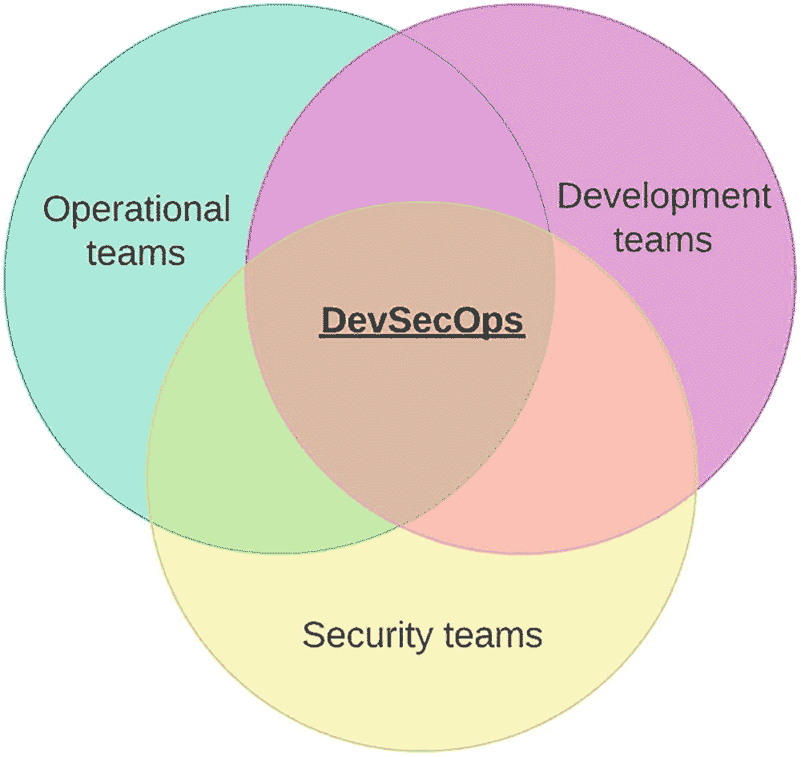

# 九、安全

安全性是作为 Linux 系统管理员可以讨论的最重要的主题之一。所有组织都至少需要最低限度的安全性，以避免被寻找简单目标的随机黑客暴露或破坏。

像银行这样的大型组织需要高度重视安全性，并且需要不惜一切代价确保它们受到保护。这将包括确保系统被强化到第 n 级。

本章将重点介绍如何加强安全性，以及如何检查系统以确保它们不仅符合良好的安全实践，还符合合规性法规。在本章中，我们将探索开源社区中可以用来构建安全平台的不同工具，以及如何验证系统是否尽可能安全。

最后，我们将讨论 DevSecOps 以及文化的改变如何提高安全性。我们将看看今天的 DevSecOps 实践如何改进保护 Linux 系统的过程。

## Linux 安全性

构建和配置安全 Linux 环境的传统方法是利用防火墙、SELinux，在某些情况下还会使用防病毒软件。

然而，今天我们在我们的资产中部署的不仅仅是标准的 Linux 系统。有容器映像、虚拟机映像和云实例映像等等。如何检查这些映像上的漏洞，以及如何检查用于运行您组织的应用程序的第三方软件？

作为一名 Linux 系统管理员，您如何在不妨碍日常工作的情况下管理这些风险呢？有什么工具可以简化这一流程，并确保发放到您遗产中的所有东西都是安全的？

让我们先来看看标准的 Linux 安全性，它可以在您的 Linux 发行版上轻松配置。然后看看文化的改变和新的工具如何为新的构建和部署简化这个过程。

### 标准 Linux 安全工具

开箱即用，大多数 Linux 发行版都已经安装了工具，或者可以安装工具，这将允许您在基本级别上保护平台。常见的工具有防火墙、SELinux 和一些入侵检测。

#### 防火墙

对 Linux 防火墙的基本描述是，Netfilter 工具集允许在 Linux 内核模块级别访问网络堆栈。

要为 Netfilter 配置规则集，您需要一个规则集创建工具。默认情况下，所有企业 Linux 系统都安装了防火墙规则集工具，某些云映像版本除外。这些图像往往更加精简，并不总是包括防火墙工具。这是因为保护应该在云协调层处理。

大多数 Linux 发行版安装了 iptables 或 firewalld 作为它们的规则集工具。这两个选项都有高度的配置，可以用来保护您的 Linux 系统。

#### Iptables

以前的 Linux 发行版和一些决定不继续使用 systemd 的发行版仍然使用防火墙规则集配置工具 iptables。Iptables 可能会变得很复杂，但是如果你有一个基本的理解，并且知道如何检查一个规则是否已经被启用，那么你就已经做得很好了(表 [9-1](#Tab1) )。

表 9-1

基本 iptables 命令

<colgroup><col class="tcol1 align-left"> <col class="tcol2 align-left"></colgroup> 
| 

LVM 司令部

 | 

描述

 |
| --- | --- |
| `iptables -L -n` | 以数字格式列出所有链中的所有规则 |
| `iptables --help` | 关于可用参数的帮助 |
| `iptables -A INPUT -p tcp --dport 22 -j ACCEPT` | 添加 tcp 端口 22 的示例 |
| `iptables -F` | 刷新 iptables 配置中的所有规则 |
| `iptables-save > /etc/iptables/rules.v4` | 在 Debian/Ubuntu 上保存 iptables 配置 |
| `iptables-save > /etc/sysconfig/iptables` | 在 RHEL 上保存 iptables 配置 |

#### 防火墙！防火墙

如果您使用的是企业版的 Linux，那么您很可能会使用 systemd。使用 systemd，您将使用 firewalld 作为 Netfilter 的规则集配置工具。

Firewalld 的设计比 iptables 更简单易用。像 iptables 一样，Firewalld 有一些所有 Linux 系统管理员都应该知道的命令。表 [9-2](#Tab2) 列出了一些需要记住的基本命令。

表 9-2

基本防火墙命令

<colgroup><col class="tcol1 align-left"> <col class="tcol2 align-left"></colgroup> 
| 

LVM 司令部

 | 

描述

 |
| --- | --- |
| `firewall-cmd --list-all` | 列出当前配置的所有规则 |
| `firewall-cmd --add-port=80/tcp --permanent` | 打开 tcp 端口 80 |
| `firewall-cmd --add-service=ssh --permanent` | 通过引用服务名打开端口 22 |
| `firewall-cmd --help` | 帮助 |
| `firewall-cmd --reload` | 重新加载防火墙以启用新规则 |

Tip

如果可能，请使用 firewall-cmd，并且永远不要禁用防火墙服务。相反，了解需要哪些端口并打开这些端口，而不是让整个系统都打开。

#### 防火墙

另一种在大多数 Linux 发行版上使用的安全措施是 SELinux，它最初是由美国国家安全局概念化和开发的。

总之，SELinux 是一个 Linux 内核安全模块，它允许访问 Linux 操作系统的某些部分。

如果你把你的 Linux 系统想象成一个安全的建筑，那么外面的栅栏和墙、大门、主门和窗户就是你的防火墙。安全建筑的内部及其房间和设施由值班保安人员管理。安全人员的工作是检查谁有权使用什么房间和什么设施。在这种情况下，安全团队将充当 SELinux。

正如你需要理解你的 Linux 防火墙的基础一样，你也需要理解 SELinux 的基础(表 [9-3](#Tab3) )。现在，您需要知道的是如何启用、禁用和恢复基本配置。更复杂的配置会随着经验而来。

表 9-3

基本 SELinux 命令

<colgroup><col class="tcol1 align-left"> <col class="tcol2 align-left"></colgroup> 
| 

LVM 司令部

 | 

描述

 |
| --- | --- |
| `getenforce` | 显示当前 SELinux 状态 |
| `setenforce 0` | 暂时禁用 SELinux |
| `setenforce 1` | 临时启用 SELinux |
| `/etc/selinux/config` | 配置 SELinux 的永久状态 |
| `restorecon -Rvv /path/to/file` | 通过目录上的当前标签恢复 SELinux 配置集 |

有两种入侵检测可用于任何服务器资产:基于主机的入侵检测和基于网络的入侵检测。出于本书的目的，我们将只讨论我们可以在我们的 Linux 平台上部署什么。

#### 基于主机的入侵检测

大多数 Linux 系统管理员经常忽略并且没有配置某种形式的基于主机的入侵检测。在大多数 Linux 企业发行版上，至少应该安装以下选项之一。如果没有，你可能需要从社区库安装，如 EPEL。

表 [9-4](#Tab4) 列出了一些可用于基于主机的入侵检测的选项。

表 9-4

入侵检测选项

<colgroup><col class="tcol1 align-left"> <col class="tcol2 align-left"></colgroup> 
| 

工具名称

 | 

描述

 |
| --- | --- |
| `Aide` | 标准存储库提供了高级入侵检测环境 |
| `Fail2ban` | 另一个流行的入侵检测解决方案，但是需要从某些发行版上的 EPEL 库安装 |
| `Samhain` | 完整性检查器和主机入侵检测系统 |

Warning

当从社区存储库安装时，如果您安装第三方工具，请务必咨询您的 Linux 供应商是否支持该平台。

### 推荐的 Linux 安全配置

如果您需要快速构建一个 Linux 系统，并希望确保它尽可能安全，那么您至少应该配置以下内容。

#### 禁用 Root 登录

通过编辑 sshd_config，禁用通过 ssh 登录到 root 的功能。您仍然可以通过控制台登录，或者如果您需要通过单用户模式来拯救您的系统。

#### 最小安装

用选择的最小软件包安装您的 Linux 服务器。最好从一个基本的构建开始，然后添加您需要的包。在构建安全的 Linux 服务器时，少即是多。

#### 磁盘分区

表 [9-5](#Tab5) 列出了所有应该配置相应挂载选项的独立磁盘分区。

表 9-5

磁盘布局和装载选项

<colgroup><col class="tcol1 align-left"> <col class="tcol2 align-left"></colgroup> 
| 

唱片

 | 

装载选项

 |
| --- | --- |
| `/var` |   |
| `/var/log` |   |
| `/var/log/audit` |   |
| `/var/tmp` | 挂载到与/tmp 相同的磁盘上 |
| `/tmp` | nodev， nosuid， noexec |
| `/home` | 转移 |
| `/dev/shm` | nodev， nosuid， noexec |
| `removable media` | nodev， nosuid， noexec |

#### 磁盘加密

仅当服务器可以轻松带出数据中心或服务器机房时，才考虑使用磁盘加密。这将适用于笔记本电脑或任何便携式系统。一个常用的磁盘加密工具是 LUKS。

#### 没有桌面

不要安装 Linux 桌面或“X Windows 系统”如果已安装，请删除桌面和“X Windows 系统”软件包。

Remember

在尝试删除包之前，请将运行级别设置为 3。

#### 加密网络通信

尽可能使用加密通信。打开 ssh 连接时使用证书或密钥。使用安全的方法挂载网络文件系统，无需传输明文密码。

#### 删除和禁用不安全或未使用的服务

删除潜在的不安全软件包，如 telnet 或 ftp，并使用安全版本，如 sftp。还建议删除或禁用未使用的服务。

#### 应用更新和修补内核

听起来显而易见，但是请确保您的 Linux 系统已经被修补到最新的版本。一旦你确认你的系统可以很好的使用新的内核，升级内核并移除旧的内核。

#### SELinux 和防火墙

确保 SELinux 和 Linux 防火墙都已启用，并且有必要的配置。

#### 改进的身份验证配置

如果强制使用本地用户，请为 Linux 用户帐户配置密码时效，确保不能使用以前使用过的密码，并在登录失败后锁定帐户。最后，确保没有帐户的密码为空。

如果可能的话，使用中央用户认证服务，比如使用 Kerberos 认证的 LDAP 服务器。

#### 检查打开的端口

检查当前打开了哪些端口，并验证是否有任何端口不应该打开。检查本地主机上打开了哪些端口的一个非常有用的命令如下:

```sh
# nmap -sT -O localhost

```

#### 全局可写文件

检查是否有任何可写的文件或目录。检查这一点的有用命令如下:

```sh
# find /dir -xdev -type d \( -perm -0002 -a ! -perm -1000 \) -print

```

#### 不属于任何人的文件

Linux 系统上不属于任何人的任何文件都可能带来潜在的安全风险。使用以下命令检查任何文件:

```sh
# find /dir -xdev \( -nouser -o -nogroup \) -print

```

#### 美国学术团体委员会

使用 ACL 为需要访问系统的用户配置对磁盘和文件的特定权限。不要为非管理员用户打开系统范围的权限。

#### 将日志发送到中央日志记录服务

配置所有的 Linux 系统，将日志发送到中央日志服务。这将确保您在清除日志之前跟踪所有登录尝试。

#### 入侵检测

安装和配置入侵检测工具，如 Aide 或 Fail2ban。如果使用 Aide，请确保将数据库复制到被监控的服务器之外的安全位置。这可以在以后用于比较目的。

#### 应用服务器安全性

如果将 Linux 系统用作 web 服务器或应用程序服务器，请确保为安全通信配置了证书。

## 发展合作

所有这些安全措施都取决于应用它们的人。如果一个组织没有接受安全不仅仅是安全团队的责任这一事实，那么当出现安全漏洞时，那些令人讨厌的人就会有机可乘。这就是为什么文化安全观必须有所发展。

过去几年中，组织文化上最大的变化之一就是这样。每个人都对安全负责。

### 这是什么？

同样，DevOps 是一套实践和工具，旨在通过采用开发实践将开发和运营团队聚集在一起，DevSecOps 旨在使组织内的每个人都使用安全实践和工具(图 [9-1](#Fig1) )。基本上，它代表着每个人都对安全负责。



图 9-1

维恩图，不同的团队聚集在一起创建开发团队

### 每个人都对安全负责

正如每个人都需要通过社会工程和了解物理安全的简单安全实践来警惕潜在的攻击者一样，DevSecOps 努力让每个人在技术工作的各个方面都考虑安全问题。

从部署新代码或构建新系统，所有东西在发布之前都需要通过安全门。从互联网上拉第三方内容需要在发布前进行扫描和测试。

安全需要被视为一个不断发展的实体。需要检测威胁，发现问题需要做平台补救。安全管理流程应遵循类似于图 [9-2](#Fig2) 所示的流程。


图 9-2

安全的循环

扫描环境，检查扫描结果，补救问题，观察所需的更改，最后应用更改以避免重复出现问题。

### 工具

Linux 系统管理员、开发人员和用户需要意识到，添加到 Linux 资产中的任何新东西都必须满足安全需求。手动运行扫描和测试不会支持这种文化转变，并且会将您置于安全被忽视的境地。

所有这些安全检查都需要以自动化的方式完成。当检测到安全问题时，应该停止该过程并进行补救。例如，如果构建一个新的容器映像，构建一个不安全的容器映像和浪费存储空间是没有意义的。最好停止，修复问题，然后重新运行构建。

#### 安全门

整合 DevSecOps 实践的一个好方法是将安全门构建到管道工具中，如 Jenkins 或 Tekton(图 [9-3](#Fig3) )。


图 9-3

代码被推送、检查，并与提取的映像一起烘焙

将用于部署新容器的结果映像在部署之前进行检查。如果安全门发现一个漏洞，该过程就会停止，部署就会失败，从而防止安全漏洞被部署到实际环境中。

任何自动化工具都可以用来包括安全门。例如，Ansible Tower 能够利用工作流。Red Hat Satellite 或 Uyuni 有一个自动化的构建过程，也可以使用。

#### 第三方工具

强烈建议您的安全门使用第三方工具来扫描和检查代码。使用 SonarQube 这样的产品能够扫描漏洞和检查代码的语法问题。

## 系统合规性

系统符合标准有许多原因。能够存储一个人的信用卡详细信息的能力决定了应该如何在金融组织内保护系统。不这样做将意味着经济处罚或更糟。

要使系统兼容，需要遵循一些强化要求。这些要求需要应用于所有系统，并在审计时间到来时提供证据。

### 系统硬化

强化 Linux 系统是一个消除系统中任何潜在攻击面的过程。

潜在的攻击者可以暴露系统的许多方面。例如，最近发现的一个漏洞使得非 root 用户能够利用 sudoedit 命令中的漏洞。该漏洞允许用户在未经授权的情况下运行特权命令。

作为 Linux 系统管理员，我们能做的最重要的事情就是找到这些类型的漏洞，并在暴露之前修复它们。当构建数百个甚至数千个系统时，减少问题发生的几率甚至更为重要。这就是为什么系统加固和系统漏洞扫描对于确保您的系统在上线前尽可能安全至关重要。

#### 硬化标准

现在有许多标准可以用来强化您的 Linux 资产。使用的两种主要方法是 CIS 和 STIGs。两者非常相似，很大程度上是因为一个人能做的安全调整是有限的。然而，这两者都是确保您的平台达到良好标准的良好起点。

对于不同的组织，还必须遵循一些其他标准，例如针对美国联邦机构的 NIST 800-53 和针对金融组织或任何希望存储信用卡/借记卡详细信息的组织的 PCI DSS。这些标准通常应用于 STIGs 或 CIS 指南之上。

#### 互联网安全中心

如果您过去曾经做过系统加固，那么您可能已经熟悉了 CIS 标准。CIS 是一个非营利组织，旨在尽可能确保互联世界的安全。CIS 向任何需要的人免费提供他们的安全指南，并且还提供付费服务，CIS 可以提供已经加固的资源，如系统映像。

作为 Linux 系统管理员，下载强化指南并按照步骤保护您的平台就足够了。指南写得很好；它们解释了安全配置的用途，以及如何在发现平台存在漏洞时进行补救。指南甚至给你运行的命令。

过去，我通过复制和粘贴这些指南中的命令来编写 shell 脚本。今天，有更好的方法可以做到这一点，我将在本章中简要介绍。

#### 安全技术实施指南

与 CIS 非常相似，你也可以遵循 STIG 指南来强化你的平台。这些指南也是免费的，但是更符合美国政府的要求。

STIG 指南也不像独联体指南那样多种多样。与 CIS 相比，STIG 指南可能没有针对基于社区的平台或应用的指南。如果 CIS 有可以使用的专用指南，则必须使用通用指南。

#### 强化 Linux

有几种方法可以强化您的 Linux 系统。

#### 手动配置

我加固 Linux 系统的最后一种方法是手动操作。光是需要遵循的硬化步骤的数量就会让你忙得不可开交。大多数硬化指南都超过了 100 页，远非引人入胜的读物。

如果需要手工强化一个系统，那么你可以遵循的最好的工具就是因特网上的强化指南，比如 CIS。

每种不同的可用强化指南都附带了用于确定系统是否存在漏洞的命令，如果漏洞确实存在，还会提供补救命令。在这种情况下，你的朋友会复制并粘贴，直到你看完这本内容丰富的指南。

我的建议是尽可能地推迟手动操作。它所花费的时间将远远超过建立下一个强化系统的方法所花费的时间。

#### 自动化

自动化是你的朋友。互联网上充斥着像您这样需要强化系统的 Linux 系统管理员编写的内容。很有可能你会找到一些能完全按照你的意愿行事的天使或木偶。你还将获得过程可重复的额外好处，当你的老板告诉你强化另外五个系统时，这将非常方便。

Tip

记得搜索那些互联网资源星系，如 Ansible Galaxy 或 Puppet Forge 的内容。

#### OpenSCAP

如果您需要从一个不同的已经加固的系统中复制配置，那么从互联网下载的自动化可能会让您稍感失望。可能有一个特定的系统具有特定的强化，但由于某种原因并没有应用所有的强化。

那么，您将如何运行标准强化来适应相同的设置呢？

对于这个用例，您可以使用 OpenSCAP。OpenSCAP 能够扫描一个或多个系统，并生成系统配置报告。可以将此配置与另一个系统进行比较，并运行后续报告来列出差异。

OpenSCAP 的惊人之处在于，它还可以生成 Ansible 或 Puppet 代码来弥补这些差异，使您不必编写自己的自动化代码。

OpenSCAP 可以使用现成的 CIS 配置文件运行，也可以使用其他配置文件。大多数(如果不是全部)将通过 Ansible 或 Puppet 为您提供漏洞补救。

OpenSCAP 将要求您在 Linux 桌面上安装 OpenSCAP workbench 工具，以允许您配置配置文件。

Tip

在开始编写自动化代码之前，检查 OpenSCAP 是否能为您做到这一点。

## 漏洞扫描

密切关注您的财产，确保没有漏洞，这对于确保您不会有任何令人讨厌的惊喜等着您是至关重要的。

### Linux 扫描工具

#### open vas！open vas！open vas

Nessus 是许多系统管理员在职业生涯中可能听说过的工具。在 Nessus 成为 Tenable 的 close sourced 之前，OpenVAS 是 Nessus 的一个分支。OpenVAS(开放漏洞评估系统)是名为 Greenbone Vulnerability Manager 的大型工具集的扫描器组件。

OpenVAS 还从具有良好历史记录并每天更新的实时提要中获取检测漏洞所需的测试。

#### OpenSCAP

OpenSCAP 是另一个非常好的漏洞扫描工具，它不仅仅是前面讨论过的扫描工具。OpenSCAP 能够使用多种配置文件，并且可以根据您组织的要求进行完全定制以进行扫描。

#### 我在呼唤

如果你需要一个开源的反病毒软件，ClamAV 可以帮助你检测病毒、木马和许多其他类型的恶意软件。ClamAV 可用于扫描个人电子邮件或文件中的任何恶意内容。ClamAV 也可以作为服务器端的扫描器。

“付费”ClamAV 产品会自动定期更新其数据库，以便能够检测最近的威胁。社区产品需要进一步配置 cron 作业。

### 集装箱图像扫描工具

今天运行 Linux 资产需要管理的不仅仅是标准的 Linux 系统。与标准 Linux 系统一样，需要对容器和构建它们的映像进行漏洞扫描。

#### 海港

从技术上讲，是一个容器映像库。Harbor 是一个开源项目，它提供了对其容器注册表的基于角色的访问，并具有扫描图像寻找漏洞的能力。VMware 采用 Harbor 作为其 Tanzu Kubernetes 平台的容器注册中心。

#### 基于角色的访问

Harbor 通过策略和基于角色的访问控制来保护工件，确保图像经过扫描并且没有漏洞。

#### 特里维

Harbor 在 2.2 版本之前使用 Clair 作为其漏洞扫描器，但此后开始使用 Trivy。Harbor 还可以连接到多个漏洞扫描器。通过将 Harbor 连接到多台扫描仪，您可以扩大防御漏洞的范围。

#### 单个或多个图像

可以启动 Harbor 来扫描港口环境中的特定图像或所有图像。还可以将策略设置为以特定的时间间隔自动扫描所有图像。

#### jfrog 射线

JFrog Xray 是 JFrog 提供的漏洞扫描工具。Xray 与 Artifactory 本机集成，用于扫描漏洞和软件许可证问题。x 射线能够扫描所有支持的包类型，从二进制文件到容器映像。

#### 深度扫描

深度扫描允许 Xray 在发布用于实时部署之前，通过 Artifactory 中的包或工件的依赖性递归扫描任何威胁。

#### 克莱尔

Clair(来自法语术语，意思是 clear)是一个开源项目，它为容器映像和应用程序容器提供静态安全性和漏洞扫描。

#### 支持的图像

Clair 目前支持的可以扫描漏洞的映像包括本书中讨论的所有主要企业发行版。它们如下:

*   人的本质

*   一种自由操作系统

*   红帽企业版

*   注意

*   神谕

Clair 还支持目前在不同环境中使用的以下图像:

*   阿尔卑斯山的

*   linux

*   VMware 光子

*   计算机编程语言

#### 企业版

Clair 目前是 Red Hat Quay(读作“kway”而不是“key”)产品中使用的漏洞扫描工具。Clair 为 Red Hat 支持的容器注册表提供了一个企业级漏洞扫描工具。

##### 连续扫描

Clair 扫描推送到 Quay 的每张图像，并持续扫描图像，以提供您的集装箱中已知漏洞的实时视图。

##### 仪表盘

Clair 也有一个详细的仪表板，显示码头内存储的集装箱图像的状态。

##### 管道

在 DevSecOps 方法中，Clair API 可以在 Jenkins 或 Tekton 等管道工具中使用，以扫描烘焙阶段创建的图像。

### 集装箱平台扫描工具

#### Kubernetes 的 Red Hat 高级集群安全性(StackRox)

红帽最近的一次收购是将 StackRox 纳入红帽的投资组合。StackRox 目前是 Red Hat ACS 产品的上游项目，但仍有一个社区版本可用于不受支持的平台。

Red Hat 的企业版 StackRox 提供了以下特性。

#### 漏洞扫描

在 Kubernetes 或 OpenShift 平台内运行的容器中发现并修复漏洞的能力。

#### 合规扫描

在信息仪表板的支持下，Red Hat ACS 可以扫描集装箱和图像，以确保它们符合 CIS、PCI 或 NIST 等标准的合规性要求。

#### 网络分段

能够执行网络策略，并对进出 Kubernetes 或 OpenShift 环境的允许网络流量进行更严格的分段。

#### 风险预测

从 Kubernetes 或 OpenShift 内的部署中检测到的所有风险都可以在优先列表中查看，以便进行补救。

#### 结构管理

不仅用于管理 Kubernetes 或 OpenShift 中容器工作负载的安全性和漏洞。Red Hat ACS 还可以通过配置管理强化集群组件。

#### 检测和响应

通过结合使用规则、允许列表和基线，Red Hat ACS 能够识别可疑活动并采取措施防止攻击。

#### 法尔科

由 Sysdig 创建的 Falco 是另一个针对 Kubernetes 和 OpenShift 类型环境的开源威胁检测解决方案。Falco 可以检测应用程序中的任何意外行为，并在运行时向您发出威胁警报。

法尔科有以下特点。

#### 灵活的规则引擎

通过使用类似于 tcpdump 的语法，Falco 可以使用 libscap 和 libsinsp 库构建规则，从 Kubernetes/OpenShift API 服务器或容器运行时环境中提取数据。然后，可以从特定名称空间或容器映像上的元数据创建规则。

#### 即时警报

通过即时警报降低财产风险，从而更快地修复漏洞。

#### 当前检测规则

基于最新 CVE 或已知漏洞的最新检测规则。一旦安全平台发现漏洞，您也会发现。

#### 水上安全

Aqua Security 旨在保护使用云原生容器构建并部署到 Kubernetes 或 OpenShift 等混合云基础架构中的应用程序。

Aqua Security 具有以下特性。

#### 开发者指南

Aqua Security 通过确保容器映像中没有任何已知的漏洞，指导开发人员构建安全、干净的容器映像。Aqua Security 甚至检查正在开发的容器图像没有任何已知的密码或秘密，也没有任何可能使这些图像易受攻击的安全威胁。

#### 信息仪表板

Aqua Security 有一个清晰而有用的控制面板，提供关于所管理平台的实时信息，以及发现的所有问题。如果发现任何漏洞，Aqua Security 会将问题报告给开发人员，并提供修复易受攻击的映像所需的建议。

## 摘要

在本章中，向您介绍了以下内容:

*   应该使用并且永远不要禁用的标准 Linux 安全工具

*   保护新系统时应至少使用的 Linux 配置

*   理解什么是 DevSecOps，以及这种新的实践需要如何被组织中的每个人所接受

*   系统合规性和 Linux 强化

*   可用于强化 Linux 系统以满足合规性要求的指南

*   漏洞扫描工具