# 1.树莓派简介

我希望你已经看完了目录和简介。如果没有，我强烈建议你浏览一下。这是这本书的第一章，我欢迎你们来到用 Raspberry Pi 操作系统学习 Linux 的激动人心的旅程。

在这一章中，我们将详细了解当今最流行的平台和单板计算机家族 Raspberry Pi。然后我们将学习一些关于 Linux 的知识，以及广泛用于 Raspberry Pi 家族的 Linux 发行版(以下，我将使用缩写 RPi)，Raspberry Pi 操作系统。我们将学习如何在 RPi 板上安装它。以下是我们将在本章学习的主题列表:

*   单板计算机

*   树莓皮

*   Linux 和发行版

*   Raspberry Pi 操作系统设置

*   配置 RPi 板

*   将各种 RPi 板模型连接到互联网

学完本章后，我们将会对 RPi 板和 RPi 操作系统的安装和基本用法很熟悉。

## 单板计算机

单板计算机(也称为 SBC)在一块印刷电路板上集成了一台全功能计算机的所有组件，如处理器、GPU、RAM 和 I/O。这与台式机或笔记本电脑不同，台式机或笔记本电脑的主板上有各种插槽，分别用于 RAM、处理器和显卡。台式机或笔记本电脑可以通过更换处理器和显卡来升级。我们还可以在内存插槽中添加更多的内存芯片。但是，SBC 不能这样升级。这是完全模块化的传统台式机/笔记本电脑与单板机的主要区别之一。单板机缺乏模块化的主要好处是整个计算机的尺寸非常小。大多数 SBC 比普通的信用卡/借记卡稍大一点，而且非常紧凑。

SBC 被用作技术演示器(原型)、教育计算机和嵌入式系统。由于制造工艺和制造技术的进步，最近 SBC 的流行程度激增。我们生活在一个几乎每月都有新的 SBC 或现有 SBC 的新版本发布的时代。市场上充斥着各种 SBC 和 SBC 系列。一些著名的 SBC 家族有 Raspberry Pi、Banana Pro、BeagleBoards 和 Orange Pi。Raspberry Pi 是市场上最受欢迎的单板计算机系列，也是世界上最畅销的计算机之一。在下一节中，我们将概述 Raspberry Pi 系列电脑。

## 树莓皮

树莓 Pi 是树莓 Pi 基金会( [`www.raspberrypi.org/`](http://www.raspberrypi.org/) )开发的 SBC 家族。它由多个板卡模型组成，在基金会的产品页面( [`www.raspberrypi.org/products/`](http://www.raspberrypi.org/products/) )上列出了当前正在生产的所有模型。在整本书中，我将使用带有 4 GB RAM 的 Raspberry Pi 4 Model B(该系列中最新的主板型号)。

表 [1-1](#Tab1) 列出了树莓 Pi 4 Model B 的规格。

表 1-1

树莓皮 4 B 的技术规格

<colgroup><col class="tcol1 align-left"> <col class="tcol2 align-left"></colgroup> 
| 

成分

 | 

规格

 |
| --- | --- |
| 处理器 | Broadcom BCM2711，四核 Cortex-A72 (ARM v8) 64 位 SoC，1.5 GHz |
| 随机存取存储 | LPDDR4-3200 SDRAM (2 GB 或 4 GB 或 8 GB) |
| 建立关系网 | 2.4 GHz 和 5.0 GHz IEEE 802.11ac 无线，蓝牙 5.0，BLE千兆以太网 |
| 通用串行总线 | 2 个 USB 3.0 端口、2 个 USB 2.0 端口 |
| 通用输入/输出 | Raspberry Pi 标准 40 引脚 GPIO 接头 |
| 显示 | 2 个微型 HDMI 端口(最高支持 4kp60)双通道 MIPI 显示串口( [`www.mipi.org/specifications/dsi`](http://www.mipi.org/specifications/dsi) ) |
| 相机连接器 | 双通道 MIPI 相机串行接口端口 |
| 声音的 | 四极立体声音频和复合视频端口 |
| 辅助存储器 | 用于操作系统和数据存储的 MicroSD 卡插槽 |
| 力量 | 通过 USB-C 连接器的 5 V DC 或通过 GPIO 接头的 5 V DC(最小 3A) |

该系列中有许多型号的主板目前正在生产中，如果您去您家附近的 hobby 电子商店，您可能会发现一些已经停产的旧型号主板，价格很便宜。为了保持简短，我将只在需要时讨论其他模型的技术细节和规格。我们可以在授权零售商处(可以在产品页面找到列表)或亚马逊等热门电子商务网站上购买 Raspberry Pi 板。

图 [1-1](#Fig1) 显示了一个 RPi 4 B 板。

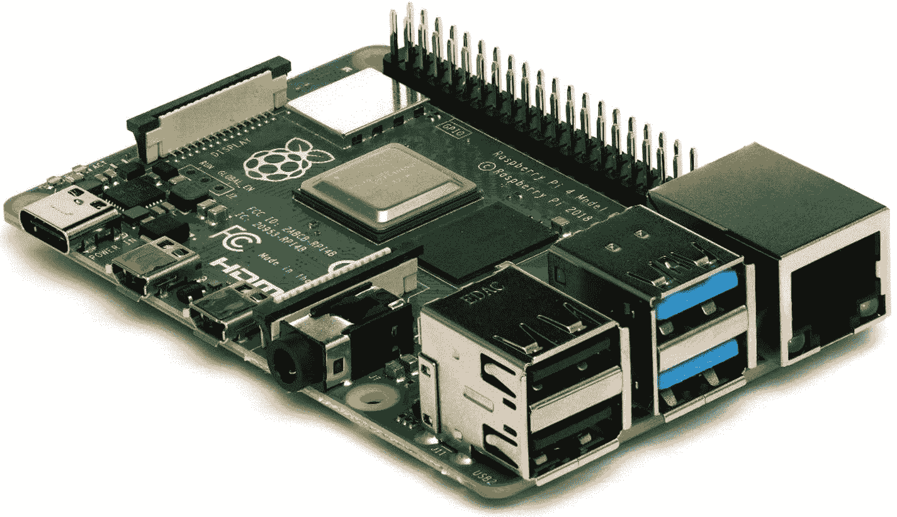

图 1-1

RPi 4 B 板的照片

图 [1-2](#Fig2) 显示了 RPi 4 B 的部件示意图。

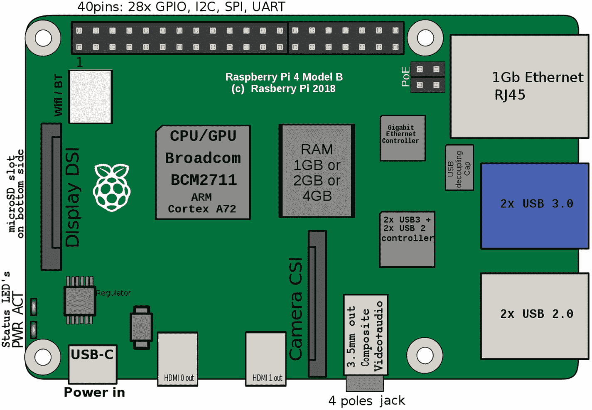

图 1-2

RPi 4 B 板上的元件

在本书中，我将使用 4 GB RAM 型号的主板解释所有演示。

## Linux 和发行版

Linux 是一系列开源的类似 Unix 的免费操作系统。它基于 Linux 内核，这是一个由 Linus Torvalds 开发的免费开源操作系统内核。Linux 操作系统打包在一个 Linux 发行版中。Linux 发行版包括为程序员开发的 Linux 内核和支持系统软件、库和 API。这些组件中的许多都是 GNU 项目的一部分( [`www.gnu.org/home.en.html`](http://www.gnu.org/home.en.html) )，这也是为什么许多人将 Linux 称为 GNU/Linux 的原因。由于 Linux 是免费和开源的，任何人都可以创建 Linux 的定制发行版。

下面的 URL 有更多关于 GNU 和 Linux 项目的信息:

[T2`www.linux.org/`](http://www.linux.org/)

[T2`www.gnu.org/`](http://www.gnu.org/)

[T2`www.fsf.org/`](http://www.fsf.org/)

Linux 的前 25 个发行版可以在这里找到:

[T2`www.linux.org/pages/download/`](http://www.linux.org/pages/download/)

### 树莓派 OS

Raspberry Pi 操作系统是流行的 Linux 发行版 Debian 的衍生物。它由 Raspberry Pi 基金会官方提供，是 SBCs 的 RPi 家族最值得推荐的操作系统。它针对 RPi 主板型号进行了全面优化，并且支持所有主板型号。以前，它被称为 Raspbian 操作系统，是由彼得·格林和迈克·汤普森创建的。在本章中，我们将详细了解如何在 microSD 卡上安装 RPi 操作系统，以及如何使用 microSD 卡启动 Pi 板。关于 OS 的 DistroWatch 页面可以在这里找到: [`https://distrowatch.com/table.php?distribution=raspios`](https://distrowatch.com/table.php?distribution=raspios) 。

## Raspberry Pi 操作系统设置

正如我们已经看到的，Raspberry Pi 操作系统是 Pi 板的首选操作系统。在本节中，我们将学习如何在 RPi 板上设置 RPi 操作系统。虽然我将在所有演示中使用 RPi 4 B 4 GB 型号，但为了方便读者，我们将讨论基金会生产的所有主板型号的设置过程，计算模块除外。让我们逐一查看设置所需的所有组件:

1.  我们需要任何型号的 RPi 板。

2.  We need an appropriate power supply. For Raspberry Pi 4 B, we need a USB-C power supply. Figure [1-3](#Fig3) is an image of a USB-C male pin.

    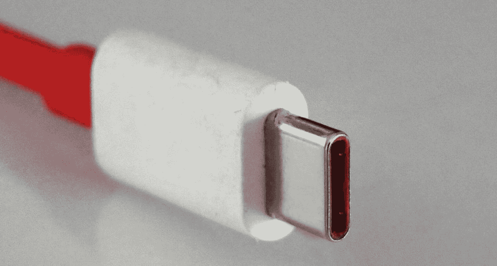

    图 1-3

    USB-C 公接头

    树莓派基金会官方有 RPi 4 B 的 15.3 W 电源，我们可以在 [`www.raspberrypi.org/products/type-c-power-supply/`](http://www.raspberrypi.org/products/type-c-power-supply/) 了解更多信息。

    All other models of RPi boards need to be supplied by a micro-USB power supply. Figure [1-4](#Fig4) is an image of a micro-USB male pin.

    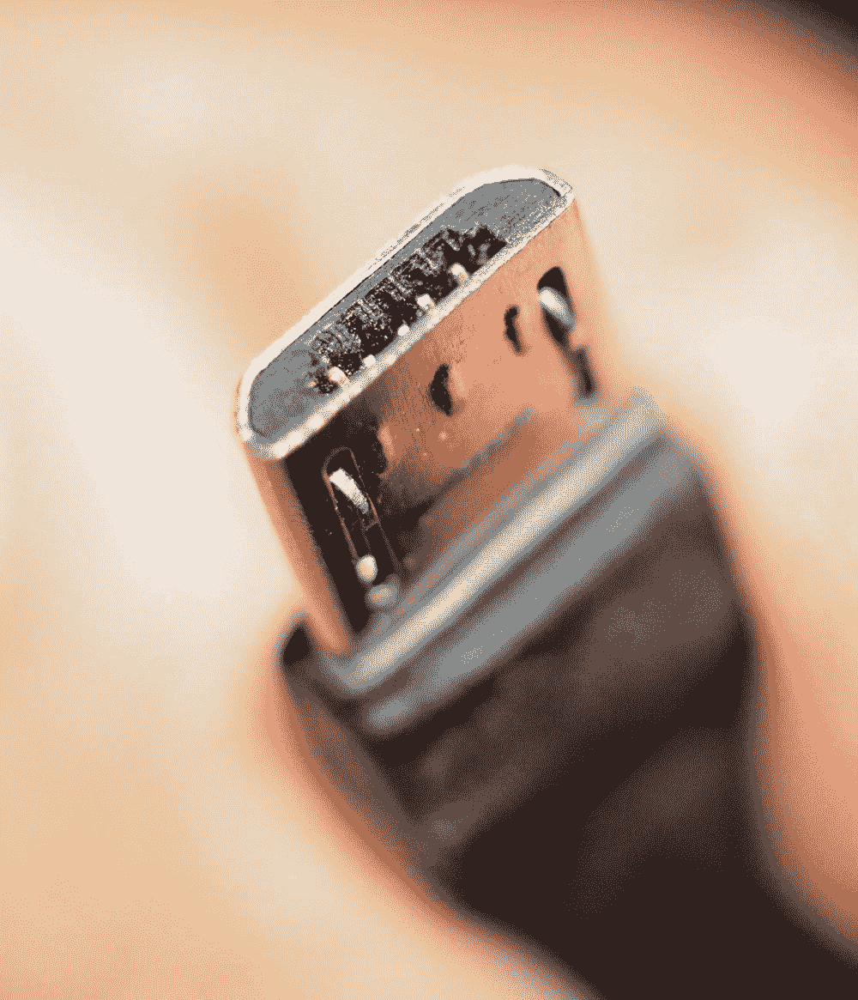

    图 1-4

    微型 USB 插头

    树莓派基金会有官方通用电源。我们可以在 [`www.raspberrypi.org/products/raspberry-pi-universal-power-supply/`](http://www.raspberrypi.org/products/raspberry-pi-universal-power-supply/) 找到更多信息。

3.  We also need a pair of a USB mouse and a USB keyboard. A USB keyboard and mouse combo that uses a sing USB port is preferred. It is available in the form of a keyboard with a built-in mousepad as shown in Figure [1-5](#Fig5).

    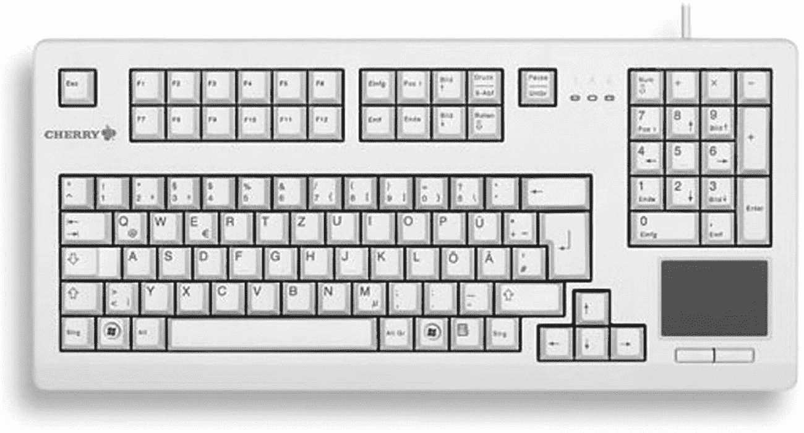

    图 1-5

    带有内置鼠标垫的 USB 键盘

    The board models RPi Zero and RPi Zero W have only a single micro-USB port, so this is mandatory for such models if we want to use them with a keyboard and a mouse. Also, for RPi Zero and RPi Zero W, we need a USB to micro-USB OTG converter as shown in Figure [1-6](#Fig6).

    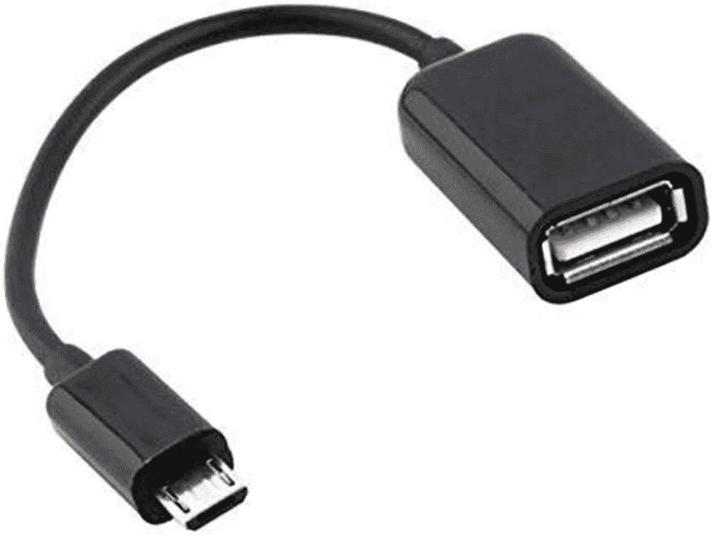

    图 1-6

    一个 USB OTG 转换器

4.  The RPi board models use a microSD card to store OS and data. RPi 1 Model A and RPi 1 Model B use a SD card, and the rest of the models use a microSD card. We can get more information about the SD cards and compatibility at [`www.raspberrypi.org/documentation/installation/sd-cards.md`](http://www.raspberrypi.org/documentation/installation/sd-cards.md) and [`https://elinux.org/RPi_SD_cards`](https://elinux.org/RPi_SD_cards). I recommend to purchase a class 10 card of 16 GB size. Also purchase a microSD to SD card converter if you are using RPi 1 Model A and RPi 1 Model B. Figure [1-7](#Fig7) is an image of a microSD card with a microSD to SD card converter.

    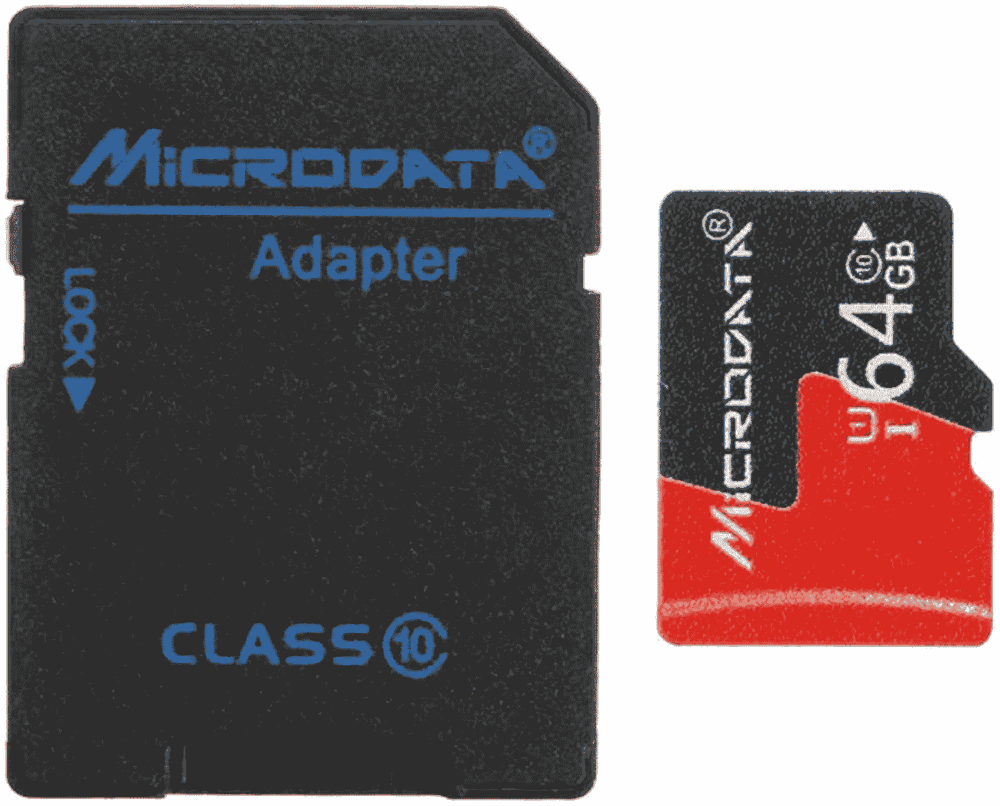

    图 1-7

    一个 microSD 卡和一个 microSD 到 SD 卡转换器

5.  我们需要一个 HDMI 或 VGA 显示器来显示。

6.  All the models of RPi boards except the models RPi 4 B, RPi Zero, and RPi Zero W have HDMI output and can be directly connected to a HDMI monitor with a HDMI male-to-male cable. A HDMI male pin is shown in Figure [1-8](#Fig8).

    

    图 1-8

    HDMI 男性头

    RPi 4 B has micro-HDMI output. So we need a micro-HDMI to HDMI converter. RPi Zero and RPi Zero W have got mini-HDMI output. So, for them, we need a mini-HDMI to HDMI converter. Figure [1-9](#Fig9) shows us the HDMI, mini-HDMI, and micro-HDMI male pins, respectively.

    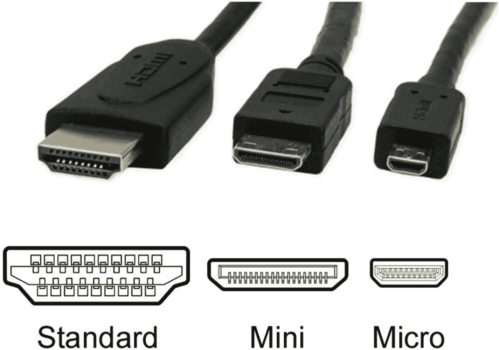

    图 1-9

    各种类型的 HDMI 插头

    Figure [1-10](#Fig10) is an image of a HDMI to VGA converter, a mini-HDMI to HDMI converter, and a micro-HDMI to HDMI converter.

    

    图 1-10

    各种类型的 HDMI 转换器

    如果我们使用 VGA 显示器，那么我们需要使用上图所示的 HDMI 到 VGA 转换器。

7.  We need a SD card reader. Many laptops have a built-in SD card reader. If your laptop does not have one, you need a separate card reader. Figure [1-11](#Fig11) is a representational image of a SD card reader.

    

    图 1-11

    SD 读卡器

8.  最后，我们需要一台装有 Windows、Linux 或 macOS 操作系统的电脑。

### 手动准备 SD 卡

建议手动准备 SD 卡，因为它给了我们完全的控制权，我们可以在主板第一次启动之前更改设置。为此，树莓基金会为我们提供了一个名为**树莓 Pi 成像仪**的工具。可以从 [`www.raspberrypi.org/downloads/`](http://www.raspberrypi.org/downloads/) 下载。它适用于 Windows、Linux 和 macOS。下载并安装在您的操作系统上。一旦你打开它，它显示图 [1-12](#Fig12) 中的窗口。


图 1-12

Raspberry Pi 成像仪窗口

如图 [1-12](#Fig12) 所示，我们有一个选择 SD 卡的选项。将 microSD 卡插入读卡器设备或笔记本电脑的读卡器插槽。成像仪会检测到它。然后点击**选择 OS** 按钮。将打开图 [1-13](#Fig13) 中的窗口。


图 1-13

选择操作系统的选项

我们可以看到各种操作系统的选项。我们需要选择第二个选项，**树莓 Pi OS(其他)**。然后显示如图 [1-14](#Fig14) 所示的选项。

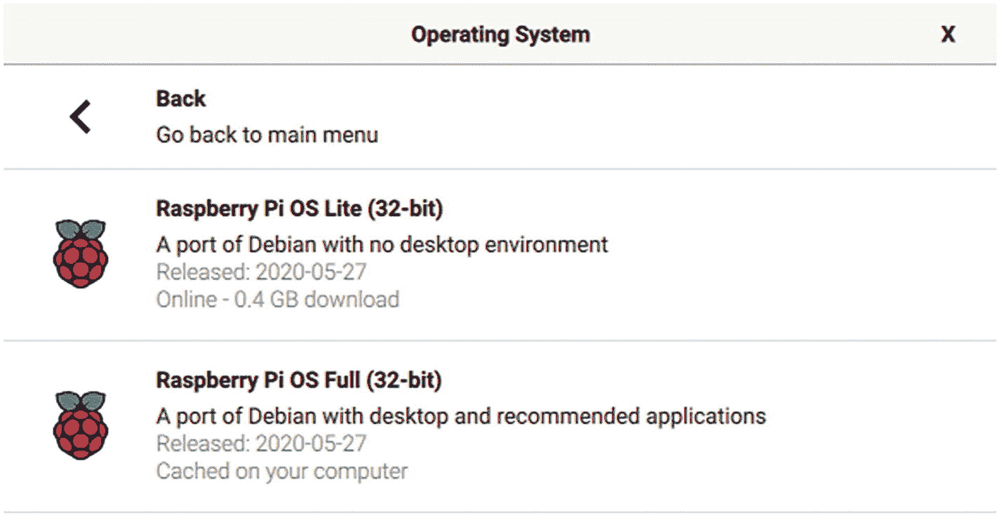

图 1-14

树莓 Pi 操作系统下的更多选择(其他)

选择**树莓 Pi OS Full (32 位)**。然后点击标有**的按钮写**。它将开始向 microSD 卡写入操作系统，如图 [1-15](#Fig15) 所示。

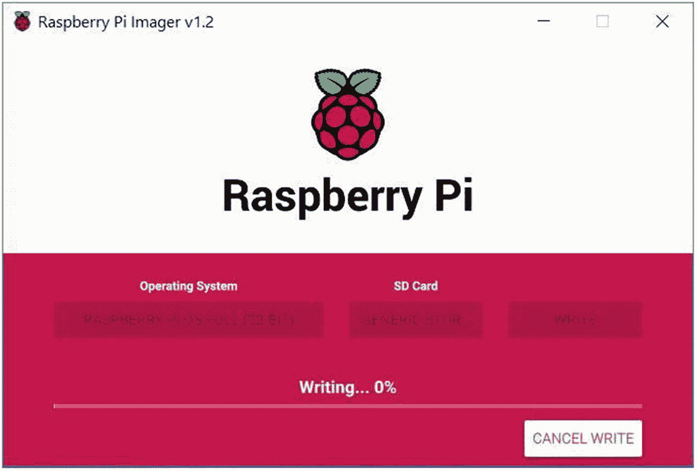

图 1-15

将操作系统写入 microSD 卡

将操作系统写入 microSD 卡后，从 SD 读卡器中安全地取出卡，然后重新插入。在 Windows 操作系统中，它将显示为带有标签 **boot** 的驱动器。在这个驱动器中，有一个标签为 **config.txt** 的文件。该文件存储了所有与引导相关的选项，其作用与 BIOS(基本输入/输出系统)初始化引导的方式相同。如果我们使用 HDMI 显示器，我们不必修改设置。但是如果我们使用的是 VGA 显示器，我们需要对几行进行如下修改:

*   将`#disable_overscan=1`改为`disable_overscan=1`。

*   将`#hdmi_force_hotplug=1`改为`hdmi_force_hotplug=1`。

*   将`#hdmi_group=1`改为`hdmi_group=2`。

*   将`#hdmi_mode=1`改为`hdmi_mode=16`。

*   将`#hdmi_drive=2`改为`hdmi_drive=2`。

*   将`#config_hdmi_boost=4`改为`config_hdmi_boost=4`。

*   保存文件。

默认情况下，注释选项(开头有符号`#`的选项)是禁用的。我们必须通过移除这些注释行开头的符号`#`来取消注释它们各自的行，从而启用这些选项。

### 第一次启动 Pi 板

让我们用准备好的 microSD 卡第一次启动我们的 RPi 板。以下是步骤:

*   将 microSD 卡插入 RPi 板的 microSD 卡插槽。RPi 1 型号 A 和 RPi 1 型号 B 有 SD 卡插槽。因此，对于这些主板型号，我们必须使用 microSD 至 SD 卡转换器。将 microSD 卡插入 microSD 至 SD 卡转换器，然后将转换器插入 RPi 1 A 型和 RPi 1 B 型 SD 卡插槽。

*   将 Pi 连接到 HDMI 监视器。如前所述，如果你有一个 VGA 显示器，连接它使用 HDMI 到 VGA 转换器。

*   连接 USB 鼠标和 USB 键盘。建议带鼠标垫的单键盘。对于 RPi Zero 或 RPi Zero W，您需要首先将其连接到 USB OTG 电缆，然后将 USB OTG 电缆连接到 RPi Zero 或 RPi Zero W 板。

*   将 RPi 板连接到适当的电源(我们之前已经讨论过)。将显示器也连接到电源。确保此时 RPi 板和监视器的电源已关闭。

*   检查所有连接一次，然后打开 RPi 和监视器的电源。

在这个阶段，我们的 RPi 板将开始启动。我们会在 Pi 板上看到一个绿灯在闪烁。这意味着它正在启动。祝贺我们第一次成功！

Note

如果 HDMI 监视器显示消息**无信号**并且没有显示任何视觉输出，则关闭 RPi 板，并将 microSD 卡上文件`/boot/config.txt`中的行`#hdmi_force_hotplug=1`更改为`hdmi_force_hotplug=1`。使用更改后的设置再次启动 RPi，HDMI 监视器肯定会显示输出。

## 配置 RPi 板

一旦 RPi 第一次启动，它将显示如图 [1-16](#Fig16) 所示的配置向导窗口。


图 1-16

欢迎窗口

点击 Next 按钮，将出现图 [1-17](#Fig17) 中的窗口。


图 1-17

国家和语言

在上图中，设置**国家**和**语言**；它会根据选择的**国家**自动选择**时区**。如果我们愿意，我们也可以改变。点击下一步按钮，将出现图 [1-18](#Fig18) 中的窗口。


图 1-18

更改密码

在这里，我们可以根据需要更改用户 **pi** 的默认密码。如果我们将其留空，它将保留默认密码。点击**下一个**按钮，将显示图 [1-19](#Fig19) 窗口。


图 1-19

设置屏幕窗口

如果黑色边框在桌面视图的边缘可见，请选中该复选框。Raspberry Pi 操作系统会在下次启动时纠正它。只有 RPi 板卡模型有 WiFi，我们点击**下一步**按钮后，才会出现图 [1-20](#Fig20) 中的窗口。

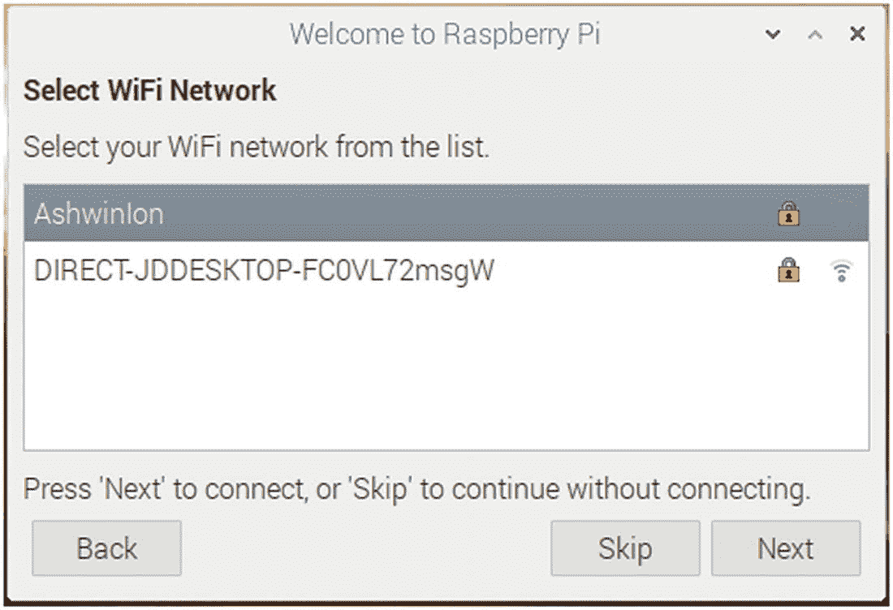

图 1-20

WiFi 网络选择窗口

选择你知道凭证的 WiFi 网络，点击**下一步**按钮，出现图 [1-21](#Fig21) 窗口。

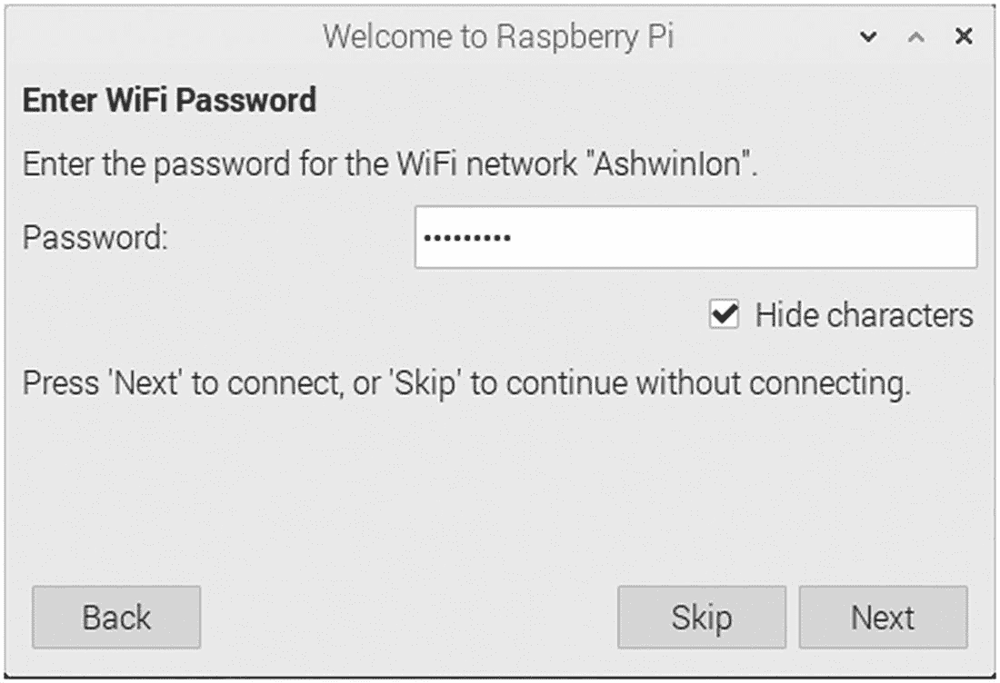

图 1-21

WiFi 网络密码

输入所选 WiFi 网络的密码，点击**下一步**按钮。将显示如图 [1-22](#Fig22) 所示的更新软件窗口。

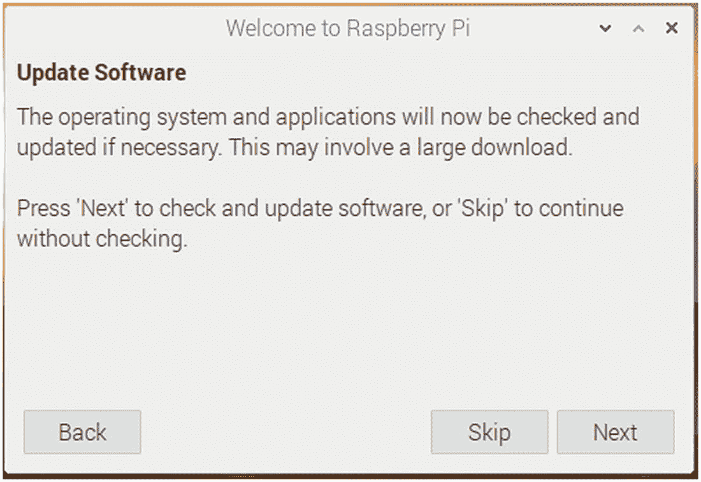

图 1-22

更新软件窗口

如果我们单击下一个按钮的**，那么它将更新 RPi OS。我们将在下一章学习如何手动操作。现在，我们将通过点击**跳过**按钮跳过这一步。然后将显示图 [1-23](#Fig23) 中的窗口。**

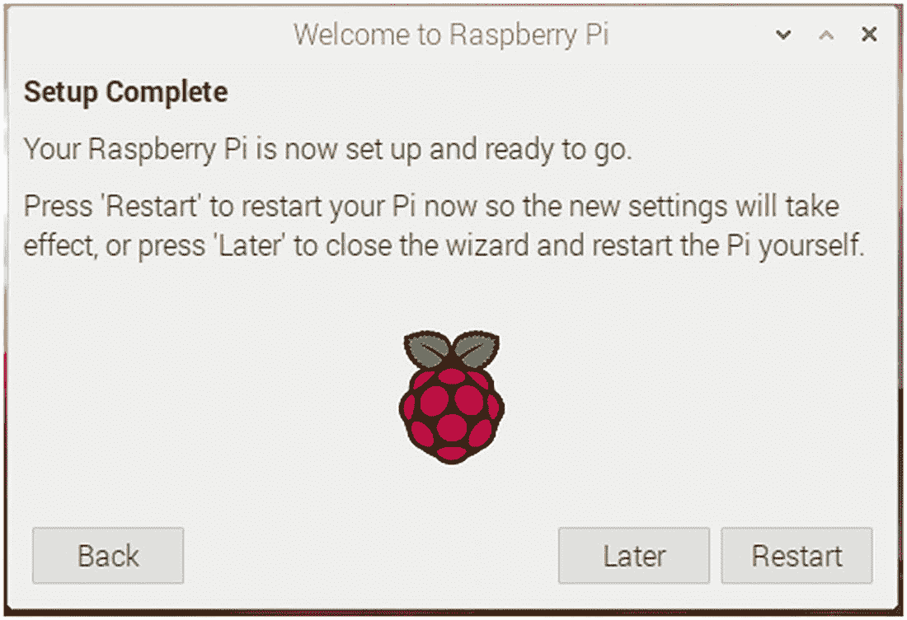

图 1-23

安装完成

这意味着配置是成功的。我们需要在重启前手动配置一些设置，所以稍后点击**按钮。**

在桌面的左上角，我们看到一个树莓图标。这是 Raspberry Pi 操作系统的菜单，其功能与 Microsoft Windows 操作系统中的 Windows 徽标相同。点击树莓图标，导航到**偏好** ➤ **树莓 Pi 配置**，如图 [1-24](#Fig24) 所示。


图 1-24

RPi OS 菜单中的 Raspberry Pi 配置

点击上图所示的选项将打开如图 [1-25](#Fig25) 所示的配置窗口。

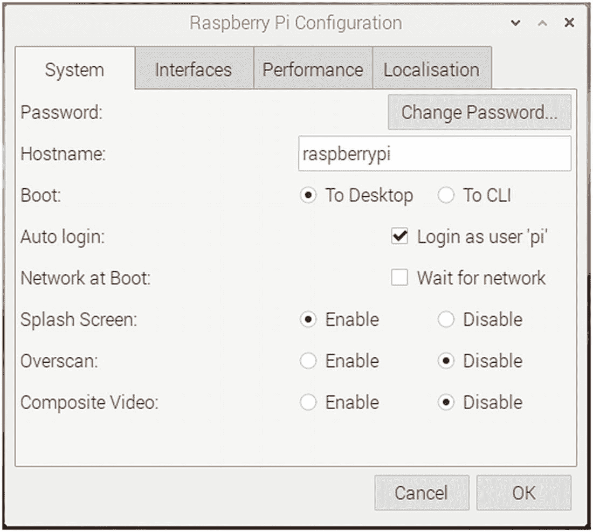

图 1-25

Raspberry Pi 配置窗口

点击“接口”选项卡，将显示如图 [1-26](#Fig26) 所示的接口选项。


图 1-26

Raspberry Pi 界面窗口

在该窗口中，点击选项**摄像头**、 **SSH** 和 **VNC** 的**启用**单选按钮。然后点击**性能**选项卡，将显示如图 [1-27](#Fig27) 所示的性能选项。


图 1-27

树莓 Pi 性能

许多主板型号都禁用了通过该实用程序超频的选项。在这里，我们可以设置 GPU 的内存。我建议设置为 128 MB。GPU 使用这么多的 RAM 作为视频内存(RPi 没有专用的 GPU 内存)。最后点击**定位**选项卡，将显示定位选项，如图 [1-28](#Fig28) 所示。

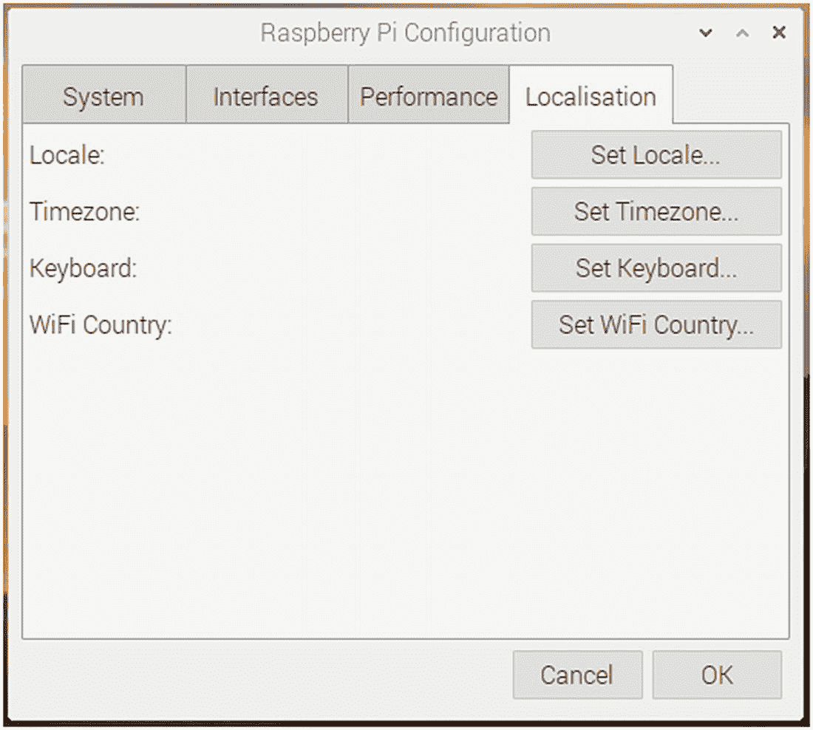

图 1-28

Raspberry Pi 位置

在这里，我们可以根据我们的本地化需求设置选项。

一旦所有这些设置都按照我们的选择进行了更改，我们就可以通过单击 RPi 操作系统中标有 Shutdown 的最后一个按钮来重新启动 RPi 板。打开图 [1-29](#Fig29) 中的窗口。

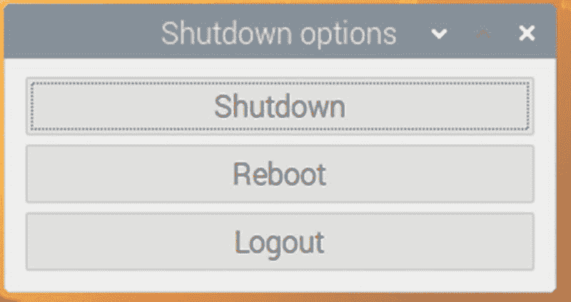

图 1-29

Raspberry Pi 关闭选项

只需点击**重启**按钮，RPi 就会重启。我们所有的更改将在重启完成后生效。如果我们没有更改用户 **pi** 的默认密码，那么在启动时，会显示图 [1-30](#Fig30) 中的信息。


图 1-30

引导至桌面后出现 Raspberry Pi 警告消息

## 将各种 RPi 板模型连接到互联网

我们可以直接将以太网电缆插入 RPi 板上的 RJ45 以太网端口。它会自动检测连接并连接到互联网。只需确保在 WiFi 路由器、受控交换机或互联网网关上启用了 DHCP(动态主机配置协议)。RPi 1 A、RPi 1 A+、RPi Zero、RPi Zero W 和 RPi 3 A+型号没有以太网端口。不过 RPi Zero W 和 RPi 3 A+都内置了连接广域网的 WiFi。我们可以为其余型号使用简单的 USB WiFi 加密狗。图 [1-31](#Fig31) 是一个 USB WiFi 加密狗的图像。


图 1-31

USB WiFi 转换器

将此 USB WiFi 适配器插入其中一个 USB 端口。如果 USB 端口不够，那么使用一个有电源的 USB 集线器。对于 Raspberry Pi Zero，我们需要将这个加密狗插入 USB OTG 电缆，然后将其插入 RPi Zero 的微型 USB 端口。

插上 USB WiFi 适配器后，我们需要打开 **lxterminal** 实用程序。它是 RPi OS 的终端命令行实用程序。我们可以在 RPi OS 的任务栏中找到它的黑色小图标，也可以在 RPi OS 菜单的**附件**中找到它。调用它的另一种方法是按 Ctrl+F2。将出现图 [1-32](#Fig32) 中的**运行**窗口。在这里，您可以键入 **lxterminal** ，然后按键盘上的 Enter 键或单击 **OK** 按钮。

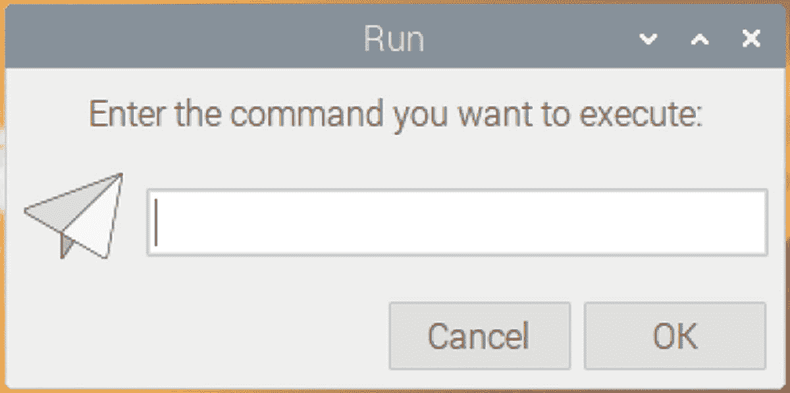

图 1-32

运行窗口

lxterminal 是 Raspberry Pi 操作系统的终端仿真器，图 [1-33](#Fig33) 是它的一个实例的屏幕截图。

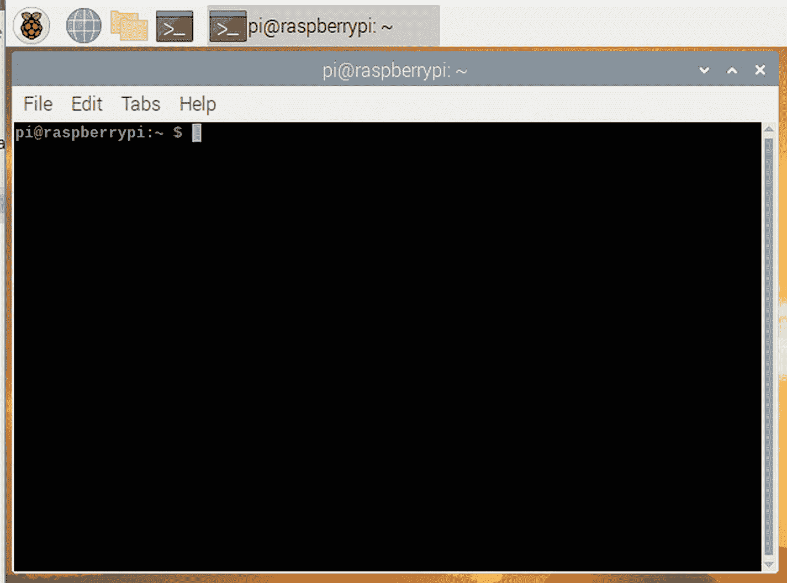

图 1-33

lxterminal 的屏幕截图

在这里，我们可以输入 Linux 命令；在输入之后，我们必须按回车键来执行当前命令。让我们使用它来手动配置网络。这也将为您提供使用 lxterminal 的良好实践，我们将在本书中主要使用 LX terminal。

所有与网络相关的信息在`/etc/network/interfaces`存储在一个文件中。在这个阶段不要太麻烦自己。从下一章开始，我们将详细了解所有这些事情。要在插入 USB WiFi 加密狗后连接到 WiFi，我们需要向我提到的这个文件添加几个条目。首先，通过在 lxterminal 中执行以下命令来备份原始文件:

```sh
mv /etc/network/interfaces /etc/network/interfaces.bkp

```

然后，我们可以通过运行以下命令从头开始创建网络接口文件:

```sh
sudo nano /etc/network/interfaces

```

前面的命令将使用名为 nano 编辑器的纯文本编辑器打开网络接口文件。它是一个简单的**所见即所得** ( **所见即所得**)明文编辑器。在那里输入以下几行:

```sh
source-directory /etc/network/interfaces.d
auto lo
iface lo inet loopback
auto wlan0
allow-hotplug wlan0
iface wlan0 inet dhcp
wpa-ssid "AshwinIon"
wpa-psk "internet1"

```

输入线条后，按下 **Ctrl+X** ，然后输入 **Y** 。在前面的设置中，将 **AshwinIon** 替换为您自己的 SSID，将 **internet1** 替换为同一 WiFi 网络的密码。然后在命令提示符下运行以下命令:

```sh
sudo service networking restart

```

它将重新启动网络服务并连接到 WiFi。在任何情况下(以太网或 WiFi)，RPi 都分配有唯一的 IP 地址。我们可以通过在 **lxterminal** 运行 Linux 网络命令`ifconfig`找到它。该命令的输出将包含 RPi 板的 IPV4 和 MAC 地址。

了解 RPi is 地址的另一种方法是检查与 RPi 板连接的 WiFi 路由器或受控交换机中的活动客户端列表。图 [1-34](#Fig34) 是我的 WiFi 路由器的活动客户端列表的屏幕截图，在这里我们可以看到与之连接的 RPi 的条目。

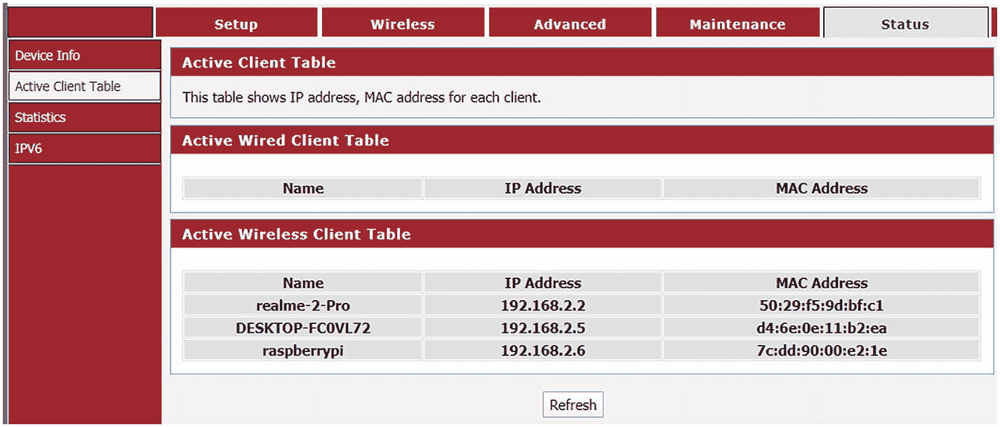

图 1-34

活动客户端列表的屏幕截图

最后一个条目对应于与之相连的 RPi 板。

## 摘要

在这一章中，我们从 Linux 和 Raspberry Pi 操作系统的基础开始。然后我们在 microSD 卡上安装了 Raspberry Pi OS，并学习了如何启动各种型号的 Raspberry Pi。我们还对终端模拟器 **lxterminal，**进行了一些实际操作，我们将在下一章详细探讨这一点。

在下一章，我们将学习 Linux 文件系统和 GUI(图形用户界面)的基础知识。我们将学习什么是操作系统Shell，以及如何使用终端模拟器与它通信。我们还将学习如何使用命令更新 RPi OS，以及如何远程连接到它。