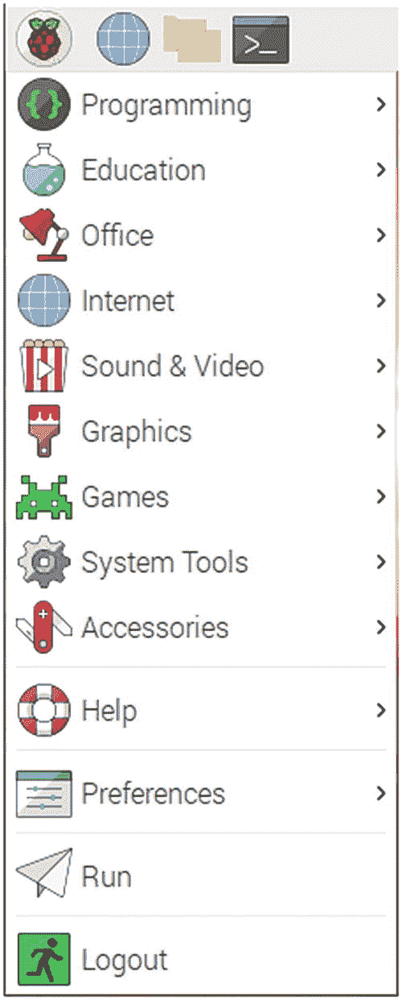
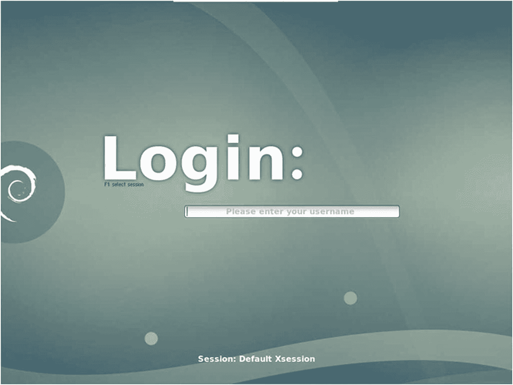
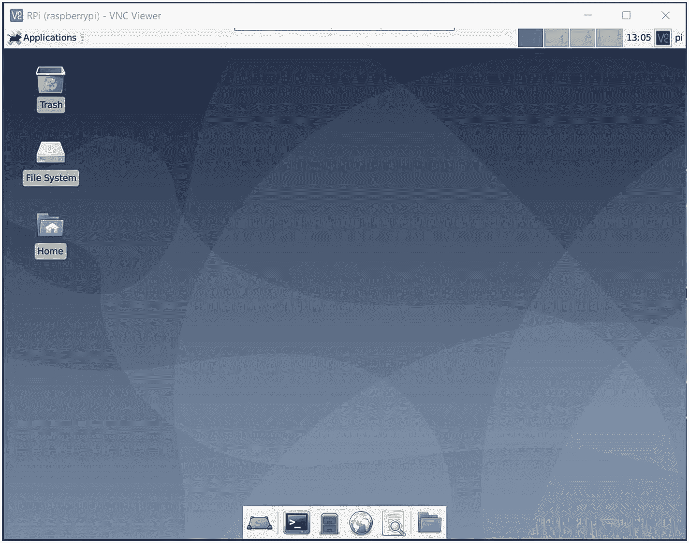
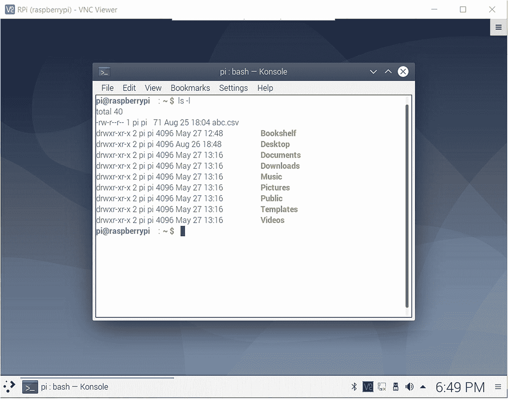

# 十、探索 RPi 操作系统 GUI

在上一章中，我们详细探讨了 Raspberry Pi GPIO。我们用 Python 编写了程序来演示 RPi 的 GPIO 功能。我们还简要介绍了 RPi 中其他类型的公共汽车。

这一章将把我们的焦点转移回 RPi OS 的软件部分。在本章中，我们将探索 RPi OS 上的各种桌面环境和 GUI 实用程序。以下是本章涵盖的主题列表:

*   RPi 操作系统上的 GUI 实用程序

*   其他桌面环境

在本章之后，我们将会非常熟悉 RPi OS 上的各种 GUI 环境和实用程序。

## RPi 操作系统上的 GUI 实用程序

RPi OS 上有许多 GUI 实用程序。它们是按照用途分组的。图 [10-1](#Fig1) 显示了 RPi OS 菜单。



图 10-1

RPi 菜单

让我们对菜单项有一个概述。在**编程**部分，可以找到所有用于编程的实用程序。RPi OS 附带了用于 Java (BlueJ 和 Greenfoot)、Python (Thonny、Geany、Mu)、Scratch、Wolfram 和 Mathematica 的 ide。我们前面也看到了如何为 Python 3 安装 IDLE。你可以在这里找到。有一些有趣的工具，如 Node-RED、Sense HAT Emulator 和 Sonic Pi。值得去探索它们。

**教育**部分有 SmartSim，这是一个学习数字电子的软件。

对于想要使用文字处理器和电子表格等办公应用程序的人来说, **Office** 部分非常方便。

互联网部分有一个网络浏览器、VNC 和一个电子邮件客户端。

**声音&视频**部分有 VLC 媒体播放器。**图形**部分有一个图像浏览器。您可能还想在**游戏**区玩几个游戏。

接下来的四个部分有各种管理 RPi 的工具和一些有用的程序。我建议你自己去探索它们。点击**运行**部分，会弹出一个窗口，通过输入程序名称来启动程序。我们已经在第一章[中看到了演示。如果你知道这些程序的名字，你可以在这里输入它们的名字。我们也已经看到了最后一个选项**注销**。](01.html)

这都是关于修改后的 LXDE 桌面环境。在下一节中，我们将探索 RPi OS 的其他桌面环境。

## 其他桌面环境

让我们逐一安装其他桌面环境。

### XFCE 你好

安装这个很容易。只需按顺序一个接一个地运行以下命令:

```sh
sudo apt-get update --fix-missing
sudo apt-get install xfce4 -y
sudo apt-get install slim -y

```

现在，当我们重新启动时，我们会看到如图 [10-2](#Fig2) 所示的屏幕。



图 10-2

登录屏幕

我们需要按键盘上的 F1 键来选择桌面环境。按一次 F1，显示**会话:默认 x 会话**，如图 [10-2](#Fig2) 所示。这是 RPi 操作系统附带的默认修改 LXDE。我们已经看到了这一点。

当我们再次按 F1 时，下一个选项出现在这里。它显示 **Xfce 会话**。如果我们再按 F1，我们看到**Session:open box**；再按一次 F1 后，显示 **LXDE** 。现在，如果我们再次按 F1，它会让我们回到第一个选项。所以选择 **Xfce 会话**，键入用户名和密码(我没有更改默认的用户名/密码组合 **pi** / **raspberry** )。

登录后，它显示一个漂亮的 XFCE 桌面，如图 [10-3](#Fig3) 所示。



图 10-3

XFCE 桌上型电脑

可以去探索一下。它非常方便用户。

让我们重新启动，这次选择选项 **Session: Openbox** 。登录进去，你会发现一个空白的桌面环境。这是因为 Openbox 是 X Window 系统的免费堆栈窗口管理器。我们可以右键单击并查看菜单选项。您可以进一步探索这种风格的桌面。右键单击后，您可以在显示的菜单中看到退出选项。选择该选项以返回登录屏幕。现在选择**会话:LXDE** 。它也将展示一个非常好的、令人愉快的、视觉上吸引人的桌面环境，如图 [10-4](#Fig4) 所示。


图 10-4

lxd 台式机

这是未经修改的 LXDE 桌面环境。菜单没有标签，一开始可能很难找到。在左下角，如图 [10-4](#Fig4) 所示。

### KDE 等离子体

KDE 是一个为类 Unix 操作系统开发自由软件的国际社区。KDE 开发的软件之一是 KDE 等离子桌面环境。让我们把它安装在我们的码头上。打开当前桌面环境的终端程序，并运行以下命令:

```sh
sudo apt-get update --fix-missing
sudo apt-get dist-upgrade -y
sudo apt-get install kde-full -y

```

我们可以在 [`https://wiki.debian.org/KDE`](https://wiki.debian.org/KDE) 看到其他安装选项。在安装过程中，系统会提示您选择桌面环境。选择**苗条的**。安装完成后，重新启动系统。我们会发现 **KDE 等离子**作为登录屏幕中的一个选项(图 [10-5](#Fig5) )。



图 10-5

KDE 等离子桌面

KDE 等离子、XFCE 和 LXDE 环境将自带一套实用程序。如果您选择任何桌面环境，您会发现所有实用程序都列在菜单下。请随意探索自己的实用工具。

## 摘要

在本章中，我们学习了各种重要的实用程序。我们还学习了在 RPi OS 上为 RPi 安装其他桌面环境。实际上，正如前面所建议的，使用所有的桌面环境并自己探索实用程序。

接下来，我们将看到这本书的附录，其中包含了与 Raspberry Pi 操作系统相关的提示和技巧。