# 二、安装 Linux

在本章中，我们将带您完成安装 CentOS 主机和 Ubuntu Server 主机的过程。我们将使用图形化安装工具展示每个发行版的安装过程，并详细说明安装过程中可用的选项。我们将执行基本安装，并安装运行基本 web、邮件和 DNS(域名系统)服务器所需的软件包。如果你目前不知道这些功能是什么，不要担心——我们在第 [10](10.html) 章解释 DNS，在第 [11](11.html) 章解释 web 服务器，在第 [12](12.html) 章解释邮件服务器。

Tip

我们建议您阅读整个章节，包括涉及 CentOS 和 Ubuntu 安装过程的部分，以获得对安装 Linux 主机的最佳理解。

在“CentOS 服务器安装”一节中，我们将从安装基于 Red Hat 的发行版开始。虽然本节中的屏幕截图是特定于 CentOS 的，但 Red Hat Enterprise Linux (RHEL)和 Fedora 的安装过程以非常相似的方式运行(CentOS 和 RHEL 源自 Fedora)。因此，如果您选择了这些发行版中的任何一个，您应该能够从我们的解释中很容易地识别出这些发行版的安装过程。你会发现大多数 Red Hat 衍生发行版的配置和管理都是如此。

如果你选择了 Ubuntu，你会在“Ubuntu 安装”一节中找到关于 Ubuntu 安装过程的完整解释。Ubuntu 源自 Debian，但安装过程不同。不过，配置和选项非常一致，通过遵循 Ubuntu 安装过程，您应该能够识别 Debian 和其他 Debian 衍生发行版的安装过程。

Note

如果您希望使用基于 CD /DVD /USB 的安装过程和所提供的图形安装程序，那么您需要在一台配有显示器、键盘(最好是鼠标)的主机上安装。这些外围设备将允许您有效地与安装工具进行交互。我们将在第 [19](19.html) 章描述如何进行无人值守或无头(无监控器)安装。

我们还将在第 8 章中扩展潜在的安装选项，当我们考虑在 Linux 上安装软件时，以及在第 19 章[中，当我们检查自动化安装和构建的方法时。](19.html)

Caution

发行版会改变，安装屏幕和选项也会随之改变。如果本章提供的屏幕截图与您在安装过程中看到的不完全一致，请不要惊慌。通常，不同版本之间的大多数安装选项和步骤都是相似的。

## LiveCDs 和虚拟机

在我们开始第一次安装之前，我们将介绍在主机上了解 Linux 的另外两个选项，在提交构建物理服务器之前尝试这两个选项可能是有用的:LiveCDs 和 virtual machines。这些方法允许您探索 Linux 发行版，以及如何以最少的时间和基础设施投资来使用它。

### livecds

LiveCDs 是可以从 CD 或 DVD 在计算机上运行的发行版本。它们无需在你的电脑上安装任何软件就能把自己载入内存。这意味着您可以在您的计算机上尝试一个发行版，然后移除 CD 并重新启动以返回到您现有的操作系统，这使得探索和测试 Linux 发行版和软件变得非常容易，而无需更改您计算机上的任何内容。你可以在 [`http://en.wikipedia.org/wiki/Live_CD`](http://en.wikipedia.org/wiki/Live_CD) 找到更多关于 LiveCDs 的信息。

您可以在 LiveCD 格式中找到如下流行的发行版:

*   Ubuntu: [`https://help.ubuntu.com/community/LiveCD`](https://help.ubuntu.com/community/LiveCD)
*   Fedora: [`http://fedoraproject.org/wiki/FedoraLiveCD`](http://fedoraproject.org/wiki/FedoraLiveCD)
*   Debian: [`http://debian-live.alioth.debian.org/`](http://debian-live.alioth.debian.org/)

您还可以在 [`www.livecdlist.com/`](http://www.livecdlist.com/) 找到众多 LiveCDs 的完整列表。

### 虚拟计算机

您还可以在虚拟机上运行您的 Linux 发行版。虚拟机是主机的软件实现，就像物理主机一样运行。您可以在单个物理主机上运行多个虚拟主机。虚拟化应用程序和服务器的示例包括 VMware ( [`www.vmware.com/`](http://www.vmware.com/) )、VirtualBox ( [`www.virtualbox.org/`](http://www.virtualbox.org/) )以及像 Xen ( [`www.xen.org/`](http://www.xen.org/) )等开源替代产品。你也可以从主机公司购买虚拟主机。

Note

在第 [3](03.html) 章，我们演示如何安装 VirtualBox。以下说明适用于“裸机”或虚拟主机。裸机安装和虚拟安装之间的差异相对较小。虚拟主机的一个不同之处是，您可以直接从 ISO 映像安装主机，而不必先将 ISO 映像刻录到 CD /DVD /USB，然后将其加载到 CD /DVD 驱动器或 USB 驱动器中。虚拟主机安装还使构建和重建主机变得更加容易，并且您可以执行诸如创建不同类型主机的时间点备份之类的功能。当第一次探索 Linux 时，虚拟主机是学习的最佳方式。

您可能还希望利用预制的虚拟设备，这些虚拟设备是您随虚拟化软件一起加载的 Linux 发行版的虚拟映像。它们已经安装和配置好了，而且这些设备通常是为特定目的而创建的，比如 VoIP 服务器、文件服务器或邮件服务器。您可以在以下站点查看可用设备列表:

*   [`https://solutionexchange.vmware.com/store/category_groups/virtual-appliances/`](https://solutionexchange.vmware.com/store/category_groups/virtual-appliances/):VMware 虚拟设备
*   [`http://stacklet.com/`](http://stacklet.com/):Xen 的虚拟设备

## CentOS 服务器安装

让我们从安装 CentOS 主机开始。我们将在这里做一些假设:

*   您正在使用 CentOS 网站( [`www.centos.org/download/`](http://www.centos.org/download/) )上的 CentOS ISO，并将其刻录到 CD/DVD/USB 上。
*   您只是在构建一个基本的邮件、DNS(域名系统)和 web 服务器。
*   您正在没有任何先前操作系统的全新服务器上安装。

首先，将您的安装介质(通常是 CD、DVD 或 USB)放入主机并打开电源。

Note

如果您正在构建一个虚拟机，您应该从原始 ISO 开始构建。虚拟机通常包括一个“虚拟 DVD”，您可以在其中挂载安装 ISO 以进行引导。我们将在下一章向您展示这一点。

加载安装介质并启动主机后，您将看到 CentOS 安装闪屏，如图 [2-1](#Fig1) 所示。

图 2-1。

The CentOS 7 installation splash screen

从闪屏中，您可以通过图形界面启动安装。如果我们不选择任何东西，自动引导将开始安装过程。只需在此处按 Enter 键即可开始安装。

按 Tab 键将允许您访问引导命令行。在这里，您可以添加其他您认为适合传递给将要引导的内核的引导选项，如网络 kickstart 文件或其他选项。在本书的后面，我们将展示这些选项的实际应用。

最后，进入“故障排除”部分将提供更多选项，如救援 CentOS 系统、内存测试和从本地驱动器启动。救援模式假设您已经加载了 Linux，它允许您引导并可能修复或救援损坏的 Linux 安装。您将引导进入一个救援提示符，允许您挂载磁盘、编辑配置文件和访问其他有用的实用程序。但是现在，只需按 Enter 键就可以进入安装的下一个阶段。

在图 [2-2](#Fig2) 中，将安装主机的“anaconda”安装程序进程已经启动。anaconda 应用程序是安装 CentOS 的软件，它运行在 X Window 系统中，也称为 X。X 是 Linux 上常用的图形用户界面；我们将在第四章[中对此进行更多的讨论。有一个基于文本的安装模式，允许您进行以下选择。内存非常少的系统可能必须在此模式下运行才能安装 CentOS。这也可以通过称为 Kickstart 的过程来实现，这是一种自动选择安装的方式。我们在第 19 章](04.html)[中讨论 Kickstart。](19.html)

图 2-2。

The CentOS graphical installer

在图 [2-2](#Fig2) 中，我们选择想要使用的语言。我们正在把英语本地化为澳大利亚版本，伙计。选择继续进入下一个屏幕。

Tip

发行说明告诉您这个版本和上一个版本之间有什么变化。如果您要升级主机，最好阅读并理解发行说明中记录的任何更改的含义。CentOS 7 的发布说明可以在这里找到: [`https://wiki.centos.org/Manuals/ReleaseNotes/CentOS7`](https://wiki.centos.org/Manuals/ReleaseNotes/CentOS7)

接下来，在图 [2-3](#Fig3) 中，我们看到了主安装摘要屏幕。

图 2-3。

Main Installation Summary screen

在这里，我们可以访问主要的配置项目。它们分为几个部分:本地化、安全性、软件和系统。将鼠标悬停在其中一个项目上，会显示相关屏幕的链接。

Note

有些高级配置设置有时需要先配置网络设置(如日期和时间设置中的 NTP 服务器设置)，这一点并不明显。要配置网络设置，您必须首先完成安装目标。因此，我们将从安装目的地开始，而不是从图 [2-3](#Fig3) 的顶部开始，然后在继续其他步骤之前配置网络。

如上所述，我们不是从列表的顶部开始，然后逐步向下，而是从底部开始，然后向上！让我们首先从选择安装目的地开始，来设置我们将要安装操作系统的位置。

Caution

接下来的几步可能会很危险。如果您在具有现有操作系统或重要数据的主机上安装，您可能会丢失所有现有数据，并且操作系统可能会变得不可用。请谨慎行事，必要时采取必要的后备措施。对于那些刚刚开始使用 Linux 的人，在第 [3](03.html) 章中，我们将向您介绍 VirtualBox，它是一个虚拟化应用程序，允许您在当前的操作系统中安装 Linux 服务器。执行以下步骤时，使用 VirtualBox 等虚拟化软件不会破坏您当前的操作系统。

在选择如图 [2-3](#Fig3) 所示的安装目标屏幕后，我们将看到当前的磁盘布局。现在我们需要对我们的磁盘进行分区。

对磁盘进行分区就像切蛋糕一样:你可以根据吃蛋糕的人的胃口来选择每块蛋糕应该有多大。例如，如果您的系统有一个网站，并且该网站有大量的日志记录，您可以选择划分磁盘，以便在保存 web 数据和日志文件的分区中有更多的空间。如果您运行的是文件服务器，您将为用户数据而不是 web 数据或日志保留更多的磁盘空间。我们使用分区而不是将所有数据集中到一个分区中的原因是，您可以完全填充该分区，而不会破坏它周围的其他分区。在前面的场景中，如果我们用数据将日志分区填充到 100%，我们的系统分区和 web 数据分区将不会被日志数据占用。

在图 [2-4](#Fig4) 中，我们有一个来自 VirtualBox 安装的简单磁盘布局。根据您的系统，您可能有更多的磁盘。

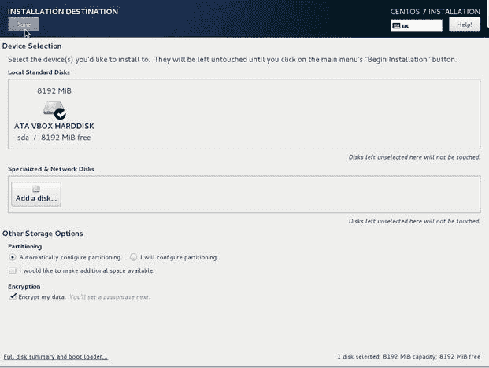

图 2-4。

Automatically configuring and encrypting disks

在图 [2-4](#Fig4) 中，我们选择了 ATA VBOX 硬盘并加密了我的数据。我们还选择了自动配置分区。安装程序将为您配置一个合理的默认磁盘分区布局。如果您选择我将配置分区，您将必须手动创建磁盘布局。

Note

我们将在第 [9](09.html) 章解释更多关于分区以及如何定制和改变你的磁盘和存储器。

在有意义的时候加密数据是明智的，但是它有一些你应该知道的缺点。每当系统启动时，您都需要在系统启动时在控制台上输入密码。这意味着无人值守重启是不可能的，您需要控制台访问(物理或虚拟)才能进入。另一个问题是安装的自动化更加困难，因为密码必须在安装时传递，并且该密码可能会被拦截。此外，这只是静态加密，在系统未开机或未输入密码时有效。假设您只有一个磁盘，我们无法将该磁盘安装到另一个系统上并读取其内容。但是，如果我们可以访问已输入加密密码的开机主机，我们就可以读取并可能复制硬盘的内容。它也只和你的密码一样安全。简单的密码可以通过基于字典的攻击来破解您的加密。因此，强烈建议使用长而强的密码。

Note

什么时候加密你的磁盘“有意义”？那得看情况。您可能有法规要求加密您的数据。您的系统可能不经常重启，并且包含敏感数据。你可以在办公室之间运送磁盘。

如果它妨碍了你的工作流程，降低了工作效率，那就没有意义了。最后，安全性是风险和可用性之间的平衡，很难判断界限在哪里。

熟悉我们在这里使用的加密技术也是一个好主意。以下链接将提供更多背景信息。

*   红帽安全指南: [`https://access.redhat.com/documentation/en-US/Red_Hat_Enterprise_Linux/7/html/Security_Guide/sec-Encryption.html`](https://access.redhat.com/documentation/en-US/Red_Hat_Enterprise_Linux/7/html/Security_Guide/sec-Encryption.html)
*   加密设置常见问题解答:

Tip

对于任何移动设备(如笔记本电脑、USB 闪存盘和运送到其他地方的硬盘)或未经授权的人可以实际访问的系统(如不安全的数据中心、贸易展览或其他活动)，加密硬盘几乎是强制性的。

记住所有这些，在图 [2-4](#Fig4) 中选择完成后，图 [2-5](#Fig5) 要求我们输入加密磁盘的密码。

图 2-5。

Entering a strong passphrase

输入强密码，并将其安全地存储在加密的密码管理器中。

Tip

您可以使用基于浏览器的著名加密密码管理器，如 1Password、LastPass 或 DashLane。其中一些具有组或团队支持，允许您以授权的方式在团队成员之间共享密码。相信我，这其实是一个很难的问题。在某些时候，您需要在团队中共享密码，共享的帐户和长期密码可能会成为您的一个大问题。但是，可能有一些密码需要更严格的访问和非常有限的共享。像 [`http://keepass.info`](http://keepass.info) 或 GPG 这样的软件安全地存储加密的密码文件可能是你的最佳解决方案。

在图 [2-6](#Fig6) 中，如果您的磁盘上有将要更改的数据，您将看到以下屏幕:

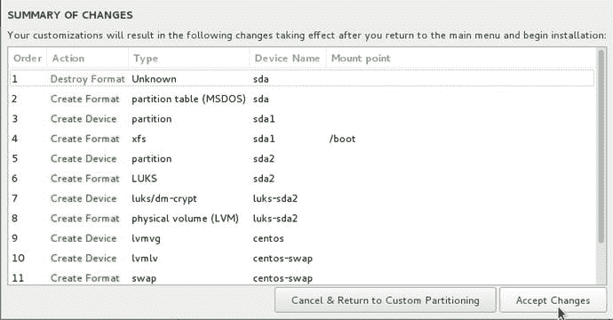

图 2-6。

Destroying and recreating disk layout

此时，根据您看到的内容，您可以选择继续。但是请记住，这是一个不可逆的操作，数据可能会丢失。如果您有疑问，请取消并返回自定义分区。

如果现有数据没有变化，您将会看到图 [2-8](#Fig8) 。然而，我们想在图 [2-7](#Fig7) 中向你展示幕后的一点。为此，我们选择了“我将配置分区”,然后选择“单击此处自动创建分区”。现在它向我们展示了它是如何自动分割我们的磁盘的。

图 2-8。

Selecting Network & Host Name

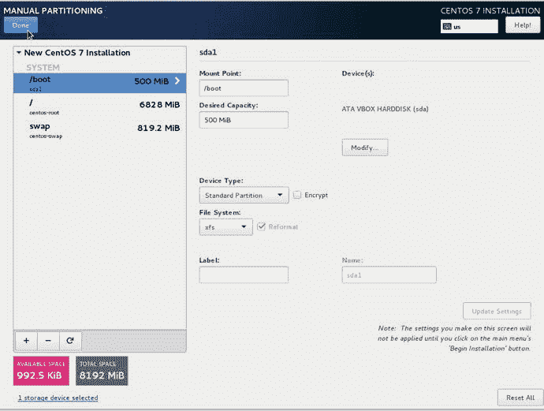

图 2-7。

How automatic partitioning divides the disks

在图 [2-7](#Fig7) 中，我们将磁盘分成三个部分。一个`/boot`分区，一个`/`或根卷，以及一个`swap`卷。`/` `boot`分区是我们的内核映像和引导配置文件所在的位置，因此被设置为“标准分区”和一个`xfs`文件系统。根卷`/`是一个 LVM(逻辑卷管理)卷，分配给它的空间占 LVM 磁盘大小的百分比最大。主要操作系统程序在`/`中。最后，`swap`是一片磁盘，用于写出内存页面以释放系统 RAM。

Note

LVM 允许您管理磁盘卷，并动态扩展、收缩和更改磁盘分区的大小。LVM 软件允许管理员更改磁盘布局、添加新的磁盘存储，或者移除磁盘存储并将其重新用于系统的另一部分，而不必重建系统和重新格式化底层磁盘。Btrfs 也是可用的，它是一个新的 CoW(写时复制)文件系统。像 LVM 一样，它允许你以灵活的方式对你的储物进行分组。但是 Btrfs“子卷”不同于 LVM 中的逻辑卷，它具有 LVM 没有的特性和限制。我们将在第 [9](09.html) 章更详细地讨论 LVM 和 Btrfs。

如果您有任何特殊需求，您可以改变这个默认结构并创建新的分区，或者您可以删除所有内容并使用安装程序的分区管理器重新开始。我们将在第 [9](09.html) 章更详细地讨论如何将一个或几个驱动器分割成不同的用途。

同样，在以前版本的安装过程中，您可以通过在安装时提供密码来保护 GRUB2 引导加载程序。这仍可通过 Kickstart 获得，但在此过程中不可用。这显然可以在安装后按照下面的说明进行补救: [`https://access.redhat.com/documentation/en-US/Red_Hat_Enterprise_Linux/7/html/System_Administrators_Guide/sec-GRUB_2_Password_Protection.html`](https://access.redhat.com/documentation/en-US/Red_Hat_Enterprise_Linux/7/html/System_Administrators_Guide/sec-GRUB_2_Password_Protection.html) 。

Caution

重申一下，Linux 主机的物理安全非常重要——您不希望任何人窃取您昂贵的物理资产(以及您的数据！).您应该将主机存放在上锁的机柜或机架中，或者存放在您可以控制进入的房间中。如果您将服务器托管在 co-lo 或数据中心，那么您应该确保该位置有适当的物理安全控制来保护您的主机。

在图 [2-8](#Fig8) 中，我们可以看到，一旦我们的安装目标任务完成，网络&主机名就会出现。

这里最重要的配置项是您的 IP(互联网协议)地址，它是您的主机的网络地址，允许其他主机找到它并与之通信。

Tip

您可以在 [`http://en.wikipedia.org/wiki/IP_address`](http://en.wikipedia.org/wiki/IP_address) 和 [`http://computer.howstuffworks.com/internet/basics/question549.htm`](http://computer.howstuffworks.com/internet/basics/question549.htm) 查看 IP 地址和寻址。

根据您的网络设置，接下来的步骤有两种方式。您的网络中可能已经有了 DHCP(动态主机配置协议)服务器。DHCP 服务器是一种将 IP 地址分配给 MAC 地址(网卡上特殊且唯一的地址)的服务。现在，大多数办公室和家庭都在防火墙中安装了 DHCP 服务器，或者在网络中安装了路由器。如果您跟随 VirtualBox，VirtualBox 有自己的 DHCP 服务器，它为自己的内部网络分配地址。在图 [2-9](#Fig9) 中，我们依靠 DHCP 为我们提供 IP 地址，并手动为我们的主机分配一个名称。

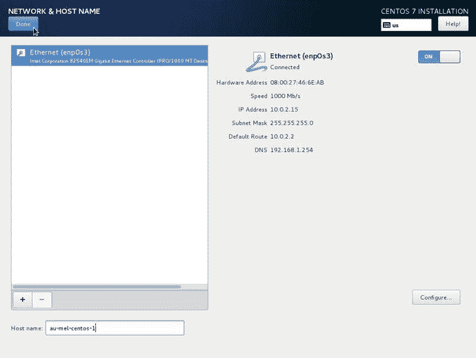

图 2-9。

DHCP and manually assigning a hostname

在图 [2-9](#Fig9) 中，我们允许 DHCP 通过将右上角的 OFF 按钮切换到 on 来分配 IP 地址 10.0.2.15。

在左下方的主机名部分，我们输入了主机名 au-mel-centos-1。在小型创业公司和家庭网络中，以最喜爱的电视角色、乐队或神话生物命名主机是很常见的。虽然这很有趣，但当您在多个地理位置有多台主机在做特定的工作时，这很快就会变得很烦人。另外，你已经使用了所有你最喜欢的角色，当你不得不杀死你的宠物服务器时，这变得非常困难。我们的主机名是 au-mel-centos-1，因为我们更喜欢描述性命名标准 region-city-OS type-number。作为描述性命名格式的另一个示例，如果您在美国有一个 IP 地址以 155 结尾的文件服务器，您可以选择 us-ny-fileserver-155。最重要的是描述性的，而不是将你的主人命名为“凯蒂”或“索尔”

Note

您可以选择任何适合您的环境的命名标准。我们更喜欢描述性的命名约定。

如果我们将自己的 IP 地址分配给这台服务器，我们将采取以下额外的步骤。通常有两种方法在您的网络上分配 IP 地址。第一种是在配置过程中直接指定每台主机的 IP 地址。这些被称为静态地址。第二种方法使用 DHCP 网络服务。当主机请求 IP 地址时，DHCP 使用网络上的服务器为主机分配 IP 地址。

Note

我们将在第 [10](10.html) 章告诉你如何配置你自己的 DHCP 服务器。

DHCP 服务器跟踪这些地址，并确保没有冲突。您的网络上可能已经有一个支持 DHCP 的路由器(大多数 ADSL 调制解调器/路由器都是如此)。在下一个屏幕中，您可以选择 DHCP 选项并自动获得一个 IP 地址。

Caution

将您自己的 IP 地址添加到您的网络中可能会导致“冲突”也就是说，网络中出现了两台地址相同的主机，导致无法确定向何处发送流量。

在网络屏幕上，我们点击配置，我们会看到一个类似于图 [2-10](#Fig10) 的屏幕。我们选择了 IPv4(互联网协议版本 4)设置和方法下拉列表。

图 2-10。

Setting IPv4 settings

连接名称是我们正在配置的设备，它是在系统启动时自动创建的。根据您的设备，您的可能会有所不同。下拉菜单允许我们为网络界面选择不同的选项。DHCP 我们已经讨论过，仅链路本地仅用于与本地网段(通常不使用)中的主机通信，因为它与其他计算机共享。为您的网络接口选择这两个选项将意味着您将不会被分配一个可以路由到 Internet 的 IP 地址。我们希望选择手动，并通过单击右侧的添加来分配我们自己的 IP 地址。

图 2-11。

Default gateway

在确保 IP 地址未被我们的网络占用后，我们输入了 IPv4 地址 192.168.1.150。我们已经添加了网络掩码/24 (192.168.1.0/24 ),我们的网关正在侦听 192.168.1.254。

Note

如果您在本地网络上发出命令 ping 192.168.1.150 并得到响应，则该地址已经被占用，您应该在这里选择一个不同的地址。此外，地址空间 192.168.1.0/24 可能不适合您的网络。我们将在第 7 章中详细讨论网络。如有疑问，请尝试 DHCP。

接下来，我们添加我们的 DNS 详细信息，如图 [2-12](#Fig12) 所示。

图 2-12。

DNS details

在我们的例子中，我们的 DNS 服务器也是我们的网关地址。您的网络上可能有一个或多个 DNS 服务器，您可以在此添加它们，用逗号分隔。搜索域也是 DNS 设置，允许您将域名附加到 DNS 搜索查询中。例如，当您查询 au-mel-centos-2 的 IP 地址时，您的网络层会知道为您将域 au-mel-centos-2.example.com 添加到查询中。同样，您可以在这里用逗号分隔多个域，也可以留空。我们将把我们的设置为 example.com，以匹配我们的虚拟网络。

默认网关是所有流量离开网络之前经过的路由。它可以是调制解调器/ADSL 网关，也可以是将您的网络连接到互联网或其他专用网络的物理路由器。主要和辅助 DNS 名称服务器是将 IP 地址解析为完全合格的域名的特殊服务器。例如，完全合格的域名是 au-mel-centos-1.example.com。

Tip

指定主 DNS 服务器和辅助 DNS 服务器会增加网络的冗余。如果一台服务器没有响应，您的主机将尝试另一台服务器。

每当您的主机访问某个网站时，它都会使用默认网关和 DNS 服务器来查找如何到达该网站。例如，如果您在浏览器的地址栏中键入 [`www.google.com`](http://www.google.com) ，您的主机将首先找到 DNS 服务器，它可能在您的网络上，也可能不在您的网络上。如果它不在您的网络上，您的主机将使用默认网关到达它。然后你的主机会向 DNS 服务器询问 [`www.google.com`](http://www.google.com) 的 IP 地址，DNS 服务器会用类似 74.125.19.104 的东西来回答。然后，您的主机将再次使用您的默认网关离开您的网络，并获取由 [`www.google.com`](http://www.google.com) 提供的网页。一般来说，您的 DNS 服务器是 IP 地址到主机名的映射，您的默认网关是您在网络之间穿越的第一个链接。

现在点击保存，弹出如下确认画面，如图 [2-13](#Fig13) 。如果您满意，可以选择完成。

图 2-13。

Network confirmation screen Note

我们已经向您展示了如何配置 IPv4 IP 地址。还有另一种可以配置的地址，即 IPv6 地址。如果您有 IPv6，您的地址可以使用 IPv6 设置选项卡进行配置。您可以像配置 IPv4 一样配置 IPv6。您设置的 DNS 服务器也需要是 IPv6 地址。

IPV4 AND IPV6

互联网的工作原理是计算机能够相互发送信息。为了能够做到这一点，需要沿着路径在彼此之间有一组唯一的地址。IPv4 是该协议的第一个版本，使这成为可能。

IPv4 中的唯一地址基于 32 位地址空间。这意味着可能有 4，294，967，296 个唯一地址。这个地址空间对于今天的互联网来说太小了，因此 IPv6 的发布解决了这个问题。

IPv6 基于 128 位地址空间，有 2 个 128 唯一地址，比 IPv4 多 7.9×10 28 个地址。一些网络已经迁移到这个新的地址空间。

但是，如果您没有 IPv6 地址，没有必要惊慌。许多 ISP 提供“双栈”，向客户提供 IPv4 和 IPv6，同时他们自己通过 IPv6 连接到其他网络。您的本地网络很可能也是 IPv4 网络，并且您的 DHCP 服务器很可能会为您分配一个动态 IPv4 地址。我们将在第 7 章中详细讨论网络。

关于 IPv4 和 IPv6 的区别，请看这里: [`www.networkworld.com/article/2692482/ipv6/infographic-ipv4-vs-ipv6.html`](http://www.networkworld.com/article/2692482/ipv6/infographic-ipv4-vs-ipv6.html) 。

这里也可以参考这个词条: [`http://en.wikipedia.org/wiki/IPv6`](http://en.wikipedia.org/wiki/IPv6) 。

配置好网络后，我们可以继续进行其他一些设置，如日期和时间。通过选择如图 [2-14](#Fig14) 所示，我们将本地化我们的数据&时间。

图 2-14。

Setting Date & Time

设置正确的时区对于服务器非常重要，因为它会影响日志中的时间戳以及数据库中的创建和更新记录。Linux 内核使用协调世界时(UTC)作为它的时钟源，但是您可以在这里设置您合适的时区。您还可以考虑将所有服务器设置为 UTC，而不是本地时区。

Why Set All Your Servers to UTC?

假设您正在为一个全新的应用程序构建基础架构。大多数人在开始设计他们的服务时没有考虑到全球化的世界。您的系统开始时可能处于您当地的时区，但是随着您的发展，您可能会发现您的系统处于完全不同的时区。这可能会导致问题，当你读一个时间戳，想知道，“是啊，但凌晨 4 点是他们的时间，我们的时间还是 UTC？”

您仍然可以获得本地化的时间信息。您可以在应用程序级别使用标准 UTC 时区偏移量来帮助本地化不同时区的时间。

当然，你可能只是建立了一个本地的文件共享网络，它永远不会覆盖全球。在这种情况下，使用当地时区以外的任何东西都没有意义。将您的时区设置为您的本地时区的另一个非常重要的原因是，您的数据已经设置了该时区，将您的服务器设置为 UTC 将导致您已经拥有的日期字段出现灾难性问题。

Note

不，你不是第一个说“呃？UTC？为什么不剪？”好吧，下面是你的答案: [`www.timeanddate.com/time/utc-abbreviation.html`](http://www.timeanddate.com/time/utc-abbreviation.html) 。

在图 [2-15](#Fig15) 中，我们将向你展示我们将如何设定墨尔本的时间。请记住，如果我们尚未建立网络，您仍可以完成这一部分，但下一部分将会失败。这在屏幕底部突出显示，但可能会让您感到困惑。

图 2-15。

Setting time zone and localizing to Melbourne

但是我们真的应该设置为 UTC，不是吗？所以在图 [2-16](#Fig16) 中，这就是我们将要做的。

图 2-16。

Setting to UTC

完成后，我们可以进入下一步，即设置我们的网络时间服务器。

Note

网络时间是一项帮助您的计算机系统时间与世界上其他时间服务器保持同步的服务。随着时间的推移，计算机的系统时钟将“漂移”失去同步。因此，为了解决这个问题，网络时间服务或 NTP 服务(网络时间协议)将查询时间服务器，并找出它们的时钟。然后，它根据最佳的三个响应调整自己的时钟。我们将在第 [10](10.html) 章中详细介绍 NTP。

当您的网络设置好后，您将能够打开网络时间，它看起来将如图 [2-17](#Fig17) 所示。

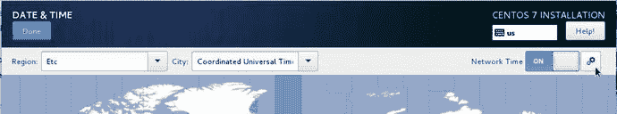

图 2-17。

Network Time settings

单击右上角的设置选项，您可以看到弹出了一个新窗口，允许我们添加自己的 NTP 服务器。

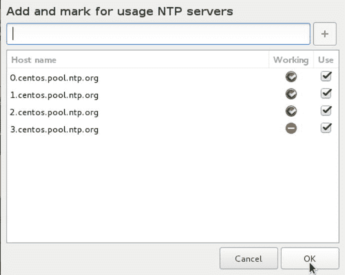

图 2-18。

Network Time Servers

在这里你可以添加一个本地时间服务器或者选择你喜欢的。你离时间服务器越近越好，因为距离和延迟会影响你的时钟结果。带有绿色勾号的 NTP 服务器可以访问并且正在工作。红色时间服务器不可达。最好至少有三台工作时间服务器。您可以添加自己的 NTP 服务器，方法是单击+并将您的服务器添加到列表中。要返回主屏幕，选择确定和完成。

在摘要屏幕中，我们可以看到安全策略设置。如果选择安全策略，您可以向主机添加安全策略。实施安全策略并不是强制性的，但政府法规或个人安全要求可能会要求您这样做。本节的任务是安装工具，根据预定义的安全策略对您的系统执行安全内容自动化协议(SCAP)扫描和完整性检查。

你应该选择哪个？它们本身并不能让您的系统更加安全，但是它们可以帮助您识别、报告和修复任何漏洞。例如，当您管理数千台服务器时，您希望确保所有主机都符合相同的安全配置文件，并能够向外部审计员证明这一点。

例如，考虑一个非常简单的例子，如果法律要求您的所有主机符合特定的安全标准，该标准规定您的密码长度必须至少为 8 个字符(2 个大写字母，2 个符号)，通过运行这些扫描，您可以确定您的网络上没有不符合该要求的主机。然后，您将需要一些方法来补救那些不符合您的需求的离群值。

如果法规遵从性对您的组织很重要，那么您至少应该阅读以下内容:

*   [T2`https://access.redhat.com/documentation/en-US/Red_Hat_Enterprise_Linux/7/html/Security_Guide/chap-Compliance_and_Vulnerability_Scanning.html`](https://access.redhat.com/documentation/en-US/Red_Hat_Enterprise_Linux/7/html/Security_Guide/chap-Compliance_and_Vulnerability_Scanning.html)
*   [T2`https://securityblog.redhat.com/2013/11/13/automated-auditing-the-system-using-scap-2/`](https://securityblog.redhat.com/2013/11/13/automated-auditing-the-system-using-scap-2/)

当然，您还应该阅读您的组织的任何相关标准遵从性文档，并采取适当的措施。

出于本次安装的目的，我们将安装“标准系统安全配置文件”，如图 [2-19](#Fig19) 所示。这为我们提供了以下最低规则，并安装了 oscap 工具和软件:

图 2-19。

Selecting Security Profile

[T2`http://static.open-scap.org/ssg-guides/ssg-rhel7-guide-standard.html`](http://static.open-scap.org/ssg-guides/ssg-rhel7-guide-standard.html)

一旦我们完成了系统安装，我们将能够运行一个符合性测试，并了解我们的系统与 DISA STIG 公司的 Red Hat Enterprise Linux 7 基线相比看起来如何。

Note

DISA 代表国防信息系统局，它是美国国防部的一部分，为美国机构运行信息系统。STIG 是标准的技术实施指南。open-oscap 的作用是运行和收集这些合规性报告。你可以在这里查看源代码: [`https://github.com/OpenSCAP`](https://github.com/OpenSCAP) 。

选择完成后，我们将返回安装摘要屏幕。接下来，我们将选择要安装的软件。从安装摘要中选择软件选择屏幕。

我们将选择安装一个 DNS 服务器，并使它更容易，Gnome 桌面。如果您熟悉 Linux 命令行，这是可选的。随意安装你感兴趣的其他软件。

首先，我们选择基础架构服务器，并选择 DNS 名称服务器，如图 [2-20](#Fig20) 所示

图 2-20。

Selecting DNS Name server

我们之前已经讨论过 DNS 域名服务器及其功能。它们帮助计算机将 IP 地址映射到主机名。我们将从基础架构服务器列表中选择它。如您所见，该列表中还有其他服务器，如电子邮件服务器、FTP 服务器以及文件和存储服务器。这将只安装 DNS 名称服务器所需的最低要求，而不会安装 GUI(图形用户界面)。根据您的习惯，这可能会让您感觉有点不舒服，好像我们继续这样做，您将只能使用命令行，而不是一个漂亮的 GUI。

Tip

随着您对 Linux 越来越熟悉，您可能会发现您很少使用 GUI 来配置和使用 Linux。几乎所有东西都可以从命令行运行。只有当你使用像图形编辑器或集成开发环境(ide)这样的桌面应用程序时，你才真正需要使用桌面 GUI。

在图 [2-21](#Fig21) 中，我们将安装桌面。CentOS 提供了两个标准的 Linux 桌面供你选择，一个是 Gnome，另一个是 KDE。两者都有他们的粉丝，这取决于你个人的喜好。您可以安装这两个软件，并在登录前进行切换，以便选择最适合您的软件。

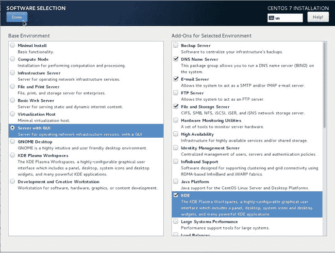

图 2-21。

Selecting to install a server with a GUI

选择 Done，现在我们将有一个要在新服务器上安装的包的列表。

Note

包是软件应用程序所需的文件包。它们可以是二进制文件或配置文件。在第 [8](08.html) 章中，我们将解释更多关于软件包以及如何使用它们的内容。

我们现在将快速检查最后一项，安装源。如果我们想为当前媒体(CD/DVD/USB)选择不同的安装源，那么我们可以在这里添加它。您可以从网络 httpd 服务器安装 Linux，或者通过代理服务器运行您的安装。同样，您需要设置安装目的地和网络，然后才能配置任何需要网络的内容。

在图 [2-22](#Fig22) 中，你可以看到我们已经从`builder.example.com`主机添加了另一个安装源，它位于我们的网络上。该主机将通过`http://`提供 ISO 映像的副本。这意味着您不需要将所有物理介质都物理连接到您的主机。您可以选择使用最小安装盘来访问该屏幕，然后通过网络访问更大的媒体——当您使用多台服务器时，这非常有益。

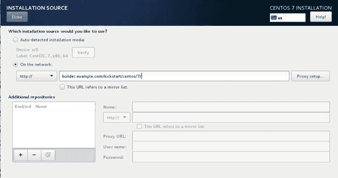

图 2-22。

Adding a network installation source

您还可以配置访问远程存储库所需的任何代理服务器设置。此外，您可以添加其他存储库。存储库是包的集合，通常通过本地或互联网上的`http://`服务器提供服务。

我们不会在此屏幕上添加任何内容，我们只是通过 Done 退出，现在我们可以开始安装了。

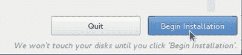

图 2-23。

Selecting Begin Installation

选择 Begin Installation 后，您会看到一个屏幕，显示您的安装进度，并让您有机会创建一个“root”密码和一个“user”密码。在 Linux 中，root 用户是可以访问整个系统的超级用户，很像 Windows 操作系统中的 Windows 管理员。在图 [2-24](#Fig24) 中，您可以再次看到我们使用鼠标点击 ROOT 密码。

图 2-24。

Selecting to create the root user Tip

我们将在章节 [5](05.html) 和 [6](06.html) 中更详细地讨论根用户。

正如我们前面所讨论的，密码应该是复杂的，由大小写字母、数字和特殊标点符号组合而成，如下所示:@！%#*.它们也应该至少有八个字符长。记住要像保存磁盘加密密码一样安全地保存它。

在图 [2-25](#Fig25) 中，当您输入密码时，会再次显示密码的强度。它也不会接受你的密码，除非你的确认匹配。完成后，选择完成。

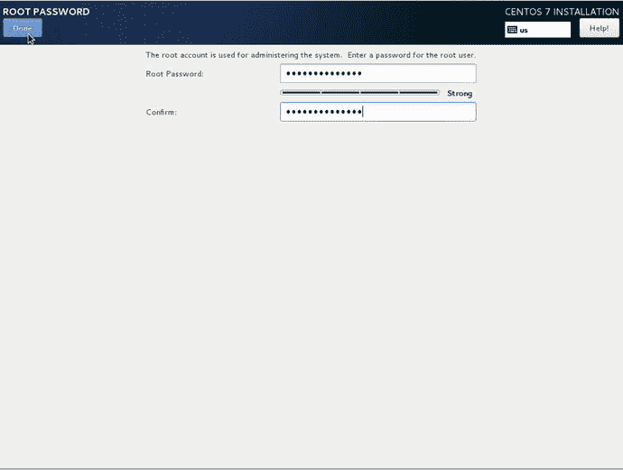

图 2-25。

Entering the root password Tip

你可以在 [`http://en.wikipedia.org/wiki/Password_strength`](http://en.wikipedia.org/wiki/Password_strength) 了解一个好密码的特征。

在您的主机上设置用户帐户是可选的，但建议您设置一个。在 Ubuntu 中，我们将在后面看到，你不能直接访问 root 帐户。root 帐户是一个非常强大的帐户，你不能轻易使用它。我们将在系统上创建一个用户进行初始访问。

在图 [2-26](#Fig26) 中，我们将通过首先选择用户创建来创建一个名为 JSmith 的用户。

图 2-26。

Selecting User Creation

你会注意到，在图 [2-27](#Fig27) 中，当我们输入全名时，建议的用户名被创建。您可以将它更改为您希望的任何内容，但是要注意，您可能需要在以后记住这个用户是谁。在本例中，我们将让此人成为管理员。这意味着该用户将拥有与根用户相似的能力，但在执行任何根级命令之前需要确认他或她的密码。

图 2-27。

Creating new user JSmith

在图 [2-27](#Fig27) 中也选择该用户需要密码的选项；有些帐户是在您不希望用户访问主机或运行需要密码的命令的情况下创建的，例如运行 web 服务器的用户。您还会注意到，在创建这个用户之前，我们需要有正确匹配的密码。您的主机上也可以有系统或服务用户。这些系统或服务用户不需要密码(因为他们永远不会登录到主机，但可能会执行类似数据库服务器的程序)。我们将在第四章[和第五章](04.html)[中讨论更多关于用户的内容。](05.html)

修复密码后，我们将单击高级，然后继续图 [2-28](#Fig28) 。

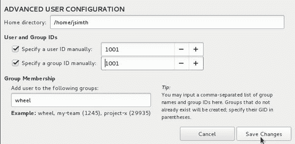

图 2-28。

Advanced settings for the user JSmith

在高级设置中，我们可以配置用户的主目录、他们的用户和组 id，以及他们是什么组的成员。在本例中，他们有权访问“车轮”组。这是给予他们同等“根”访问权限的组。我们在第 [5](05.html) 章中会详细讨论这些高级设置。

这是最后一个安装步骤。选择保存更改，然后在用户屏幕中选择完成。当您执行此操作时，您的服务器已经在后台继续安装过程，安装可能已经完成或即将完成。

在图 [2-29](#Fig29) 中，我们看到了完成的安装。选择重新启动，您的系统将重新启动并准备好供您使用。

图 2-29。

Completed installation ready for Reboot

您的系统将开始重新启动，并向您呈现 GRUB2 (GRand Unified Bootloader)引导加载程序。引导加载程序是实际加载操作系统的一小段代码。这允许您选择要引导到的操作系统，或者引导到您可能已经安装的其他操作系统。如果您在此倒计时过程中按下任何键，加载将会中断。

按照图 [2-30](#Fig30) 中屏幕上的指示，您可以选择您希望启动的内核映像或改变它的加载方式(按 e 键)。你可以通过按 c 键访问 GRUB2 Shell。我们在第 [6](06.html) 章中讨论了更多关于引导加载程序的过程。如果您在上面突出显示的 CentOS Linux 上按 Enter 键，您将被引导到该内核。

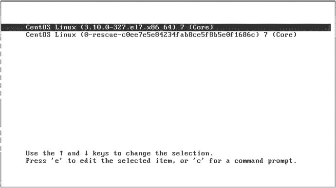

图 2-30。

Booting your new host Note

我们在这里互换使用“内核”和“操作系统”这两个词。在这方面它意味着同样的事情，内核是 Linux 操作系统。CentOS 是 Linux 的发行版或版本。

当系统通过引导加载程序时，我们需要输入磁盘加密密码，如图 [2-31](#Fig31) 所示。

图 2-31。

Disk encryption password

如果我们不知道密码，我们就只能走到这里，如果您忘记了密码，您将不得不重新开始。成功输入密码后，我们的系统现在开始从我们的磁盘加载信息，我们的系统继续启动。

现在，根据你在安装过程中是否选择了 Gnome 包，你会看到一个 EULA(最终用户许可协议)出现。老实说，这有点令人困惑，它是 gnome-initial-setup 包的一部分。这是你应该尝试通过它的顺序。

图 2-32。

Gnome Desktop EULA

这是" 1 "，" 2，"和" c "的记录。如果你没有安装桌面系统，你就不用安装了，你可以继续。假设您安装了桌面，您现在将看到桌面登录屏幕。

在图 [2-33](#Fig33) 中，输入我们的 JSmith 用户密码。输入密码后，您将看到以下桌面设置屏幕。

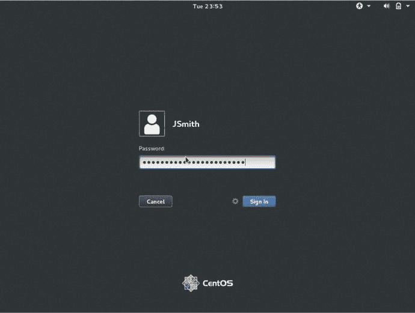

图 2-33。

Installation is complete and the system is ready to use

在图 [2-34](#Fig34) 中，我们选择本地化的桌面语言，并在右上角选择下一步。

图 2-34。

Selecting localized desktop language

现在我们选择图 [2-35](#Fig35) 中的键盘布局。我们用的是美式键盘。

图 2-35。

Selecting keyboard layout

在图 [2-36](#Fig36) 中，我们可以登录谷歌，访问谷歌应用程序和存储、ownCloud 甚至 Windows Live。这只有在你运行桌面或者允许通过这个服务器访问这些云存储服务的情况下才真正有用。除非你打算使用这些服务，否则你应该跳过。

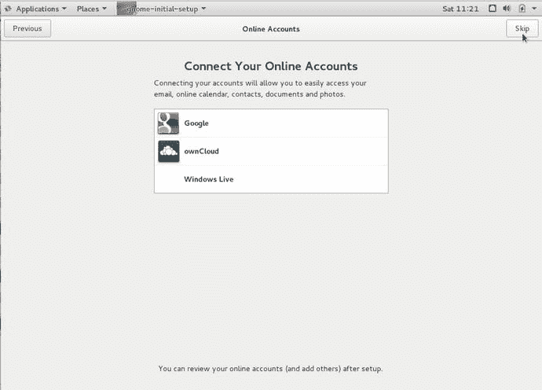

图 2-36。

You can sign into your favorite cloud provider or you can skip

在图 [2-37](#Fig37) 中，你可以看到一个谷歌登录的例子，但是如果你不愿意，你可以不注册任何一个。

图 2-37。

An example of Google sign in

图 [2-38](#Fig38) 将我们带到桌面配置部分的最后。接下来，我们将快速向您展示如何访问终端控制台。

图 2-38。

The end of the desktop configuration !

如图 [2-39](#Fig39) 所示，很容易找到应用程序和我们要找的终端应用程序。单击应用程序、实用程序，然后向下滚动到终端。

图 2-40。

Your first terminal session

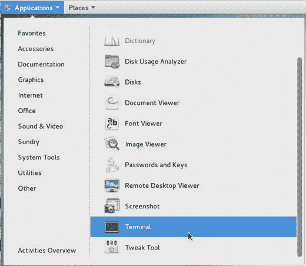

图 2-39。

To find the applications, click Applications

我们已经学完了 CentOS 安装部分。你可以进入下一章，我们将向你介绍 Linux 以及如何开始使用你的新主机。或者，你可以继续阅读本章来学习如何安装 Ubuntu。

## Ubuntu 安装

Ubuntu 有两种版本:桌面版和服务器版。在本节中，我们将演示如何安装服务器版本。安装 Ubuntu Server 的过程与安装 CentOS 服务器非常相似。主要概念是相同的:选择语言和键盘布局，选择您想要的磁盘分区方式，然后选择您想要安装的软件包。

为了安装 Ubuntu，我们将从 Ubuntu 网站下载一个 ISO 文件，其中包含了我们完成安装所需的大部分数据。在本练习中，我们将使用来自 [`www.ubuntu.com/download/server`](http://www.ubuntu.com/download/server) 的全尺寸 ISO。

Note

Ubuntu 和 Debian 很好地利用了网络安装程序，提供了安装的灵活性。网络安装程序是操作系统的一个小版本，通常以 ISO 文件的形式提供，您可以将其刻录到 CD/USB 驱动器上并从中启动。它包含一个简单的内核和发行版的安装程序。net installer 为您的主机提供了引导和启动安装过程所需的基础知识，然后可以从在线存储库中下载任何其他软件或应用程序。这意味着您需要连接到互联网来安装新的主机。这也意味着在慢速互联网连接上安装一个完整的 4GB 操作系统可能需要很长时间，但是使用网络安装程序是加载较小系统的一个好方法。我们将在第 [19](19.html) 章中进一步探讨网络安装，届时我们将探讨供应多个系统的方法。

我们将在这里做一些假设:

*   您正在使用来自 Ubuntu 网站( [`www.ubuntu.com/download/server`](http://www.ubuntu.com/download/server) )的 Ubuntu 16.04 LTS 服务器版 ISO，并且您已经将其刻录到 CD/DVD 或 USB。点击 [`https://help.ubuntu.com/community/BurningIsoHowto`](https://help.ubuntu.com/community/BurningIsoHowto) 和 [`https://help.ubuntu.com/community/Installation/FromUSBStick`](https://help.ubuntu.com/community/Installation/FromUSBStick) 可以了解更多关于将 ISO 文件刻录到 CD/DVD 的信息
*   您只是在构建一个基本的邮件、DNS 和 web 服务器
*   您正在没有任何先前操作系统的全新服务器上安装。

将 CD 放入 CD 驱动器或插入 USB 并打开主机电源后，您将看到的第一个屏幕允许您选择安装过程的语言(图 [2-41](#Fig41) )。

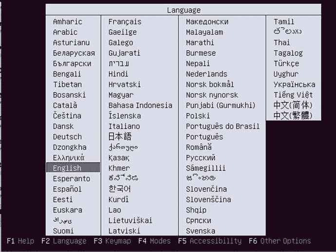

图 2-41。

Choose the installer language

然后你会看到一个闪屏(见图 [2-42](#Fig42) ),给出几个选项。我们将选择安装 Ubuntu 服务器，但你也会看到一些其他新的选项。Ubuntu 有一个产品叫做 MAAS——或者金属即服务。这是一项针对数据中心规模安装的“零接触”部署服务。只要接通电源，MAAS 就可以安装数千台服务器，而不是只安装一台。我们将在第 19 章[中讨论这种供应。您还可以看到，我们可以运行一些系统检查或启动进入救援模式。在第 9 章](19.html)[中，我们将详细讨论系统恢复。](09.html)

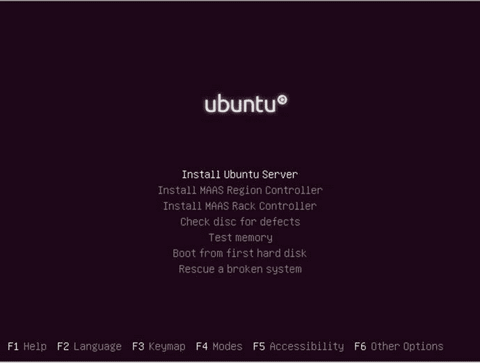

图 2-42。

First installation splash screen

选择安装 Ubuntu 服务器后，我们会看到图 [2-43](#Fig43) ，为您的安装选择语言。你应该选择适合你的语言。

图 2-43。

Choosing the language for installation

如图 [2-43](#Fig43) 所示，我们选择了英语。这也将是最终系统的默认语言。

然后会要求您选择您所在的地区。这是您要安装的服务器所在的地理位置。在图 [2-44](#Fig44) 中，我们选择了澳大利亚。这有助于安装程序选择最近的 Ubuntu 档案库，以便以后获取额外的包。

图 2-44。

Selecting your region

接下来，选择键盘和键盘布局首选项。如前所述，键盘布局是您正在使用的键盘映射。不同的地区会有不同的映射，因此请选择最适合您所在地区和语言的映射。在这里选择是，如图 [2-45](#Fig45) 所示，会引出一系列的问题和答案，通过这些问题和答案，Ubuntu 试图通过让你按下不同的键来判断出你使用的是什么类型的键盘。

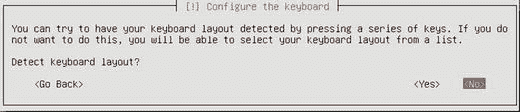

图 2-45。

Ubuntu attempts to detect your keyboard

选择“否”以节省时间，并直接告诉安装程序您正在使用哪种键盘。这里的默认设置适用于大多数安装，但是您可以自由选择最适合您所在地区的设置。图 [2-45](#Fig45) 开始显示键盘选择的一系列截图。

选择“否”后，出现图 [2-46](#Fig46) 中的屏幕，在此选择键盘的原点。我们会选择自己，继续前进。

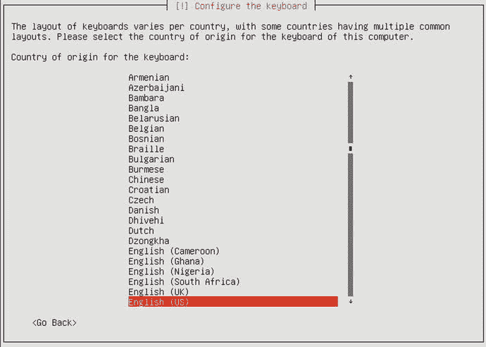

图 2-46。

Selecting the origin of your keyboard

在图 [2-47](#Fig47) 中，我们为自己选择了键盘布局，这将为我们提供澳大利亚计算机的标准按键映射。

图 2-47。

Selecting keyboard layout Tip

安装完成后，您可以随时更改键盘设置。

Ubuntu 安装现在需要休息一下来探索你的硬件并发现更多关于目标主机的信息。完成此过程后，系统会提示您输入新主机的主机名。如图 [2-48](#Fig48) 所示，我们在这里输入 au-mel-ubuntu-1，因为它符合 CentOS 安装一节中讨论的命名标准。

图 2-48。

Setting the hostname

接下来，要求您为此主机创建一个用户。在第 [5](05.html) 章中，我们将更详细地讨论用户管理，但重要的是要知道 Ubuntu 发行版通过禁用密码来禁用 root 用户帐户。root 用户类似于 Windows 管理员，可以访问主机上的所有内容。在 Ubuntu 中，用户不用像在 CentOS 安装中那样设置 root 用户的密码，而是使用一个名为 sudo 的特殊命令来访问所有与 root 用户相同的权限。我们将在第五章[中详细讨论 sudo 命令。](05.html)

在图 [2-49](#Fig49) 中，输入新用户的全名。

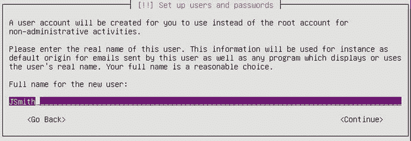

图 2-49。

Entering the full name of a new user

在下一个屏幕(图 [2-50](#Fig50) )中，您为新用户设置用户名。

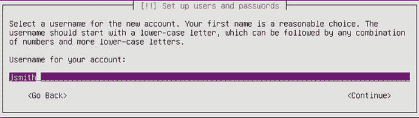

图 2-50。

Entering the username

最后，你为你的用户设置密码，如图 [2-51](#Fig51) 所示。同样，正如我们在 CentOS 安装一节中所讨论的，我们建议实施一个强而复杂的密码。您将被要求验证该密码。

图 2-51。

Entering the password for the new user

接下来会询问我们是否希望加密该用户的主目录。这与 CentOS 中的磁盘加密具有相同的含义。我们将在图 [2-52](#Fig52) 中选择“否”,以便在几个步骤的时间内完成完整的磁盘加密。

图 2-52。

Choosing not to encrypt the home directory

我们现在被要求确认我们的时区。这里我们使用当地时区。

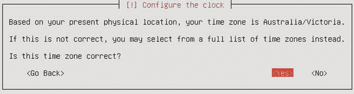

图 2-53。

Confirming time zone

接下来，您需要对您的主机进行分区。这种分区方式与 CentOS 安装示例中描述的方式非常相似。您可以根据主机的要求将磁盘划分为不同大小的分区。同样，在 CentOS 安装中，系统会提示您选择几个默认分区选项之一，或者使用分区工具定制您自己的分区选项。

*   引导式—使用整个磁盘:此选项要求您选择一个硬盘，该硬盘将被完全擦除。然后，系统创建一个根分区和一个交换分区。
*   引导式—使用整个磁盘并设置 LVM:此选项还会擦除所有数据。然后，它创建一个小的引导分区，并将剩余的磁盘空间用于 LVM 的根和交换卷。
*   guided—使用整个磁盘并设置加密的 LVM:此选项与前一选项相同，只是 LVM 数据全部加密。系统会要求您提供密码。请注意，您需要在引导时输入该密码，因此该选项不适用于远程或无头服务器。如果您丢失了加密密码，您将无法检索您的数据。
*   手动:该选项打开分区编辑器，并允许您手动配置分区、软件 raid、加密和 LVM。如果您想要调整预先安装的 Windows 的大小，应该选择这个选项。

对于我们的示例主机，我们有兴趣使用“引导—使用整个磁盘并设置加密 LVM”选项。这使用了我们可用的整个硬盘，并利用了 LVM。如“CentOS 服务器安装”一节所述，

LVM 是一种管理分区和磁盘的强大方法，并为您以后更改分区布局提供了更大的灵活性。

Note

我们将在第 9 章更详细地讨论 LVM。

图 2-54 显示了我们默认的分区选择。

图 2-54。

Choosing encrypted LVM to partition disks

接下来，选择要执行分区的驱动器。我们只能选择一个磁盘，如图 [2-55](#Fig55) 所示。

图 2-55。

Choosing the disk to partition Caution

如果磁盘已经包含分区，系统会提示您覆盖它们。如果您确信要这样做，请指定 Yes 并继续。如果您在以前的系统上安装，在此选择“是”将会销毁您可能拥有的任何现有数据。如果您不确定，请指定否。替代方法包括使用类似 GParted 的工具从某个 LiveCD 安装中对主机进行重新分区，安装在没有数据的硬盘上，或者安装在虚拟机上。

下一个屏幕(见图 [2-56](#Fig56) )让您确认是否要将分区信息写入所选磁盘。在配置 LVM 之前，需要将分区信息写入磁盘。选择是并转到下一个屏幕。

图 2-56。

Writing partition information to disk

我们现在需要添加一个密码来保护加密的数据。同样，请确保密码很长、很复杂，并且存储安全。

在图 [2-57](#Fig57) 之后，您还会被要求进行密码验证。

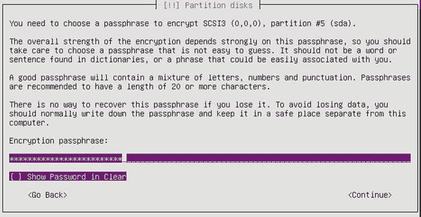

图 2-57。

Providing the disk encryption password

接下来，系统会询问我们希望在 LVM 分区中使用多少卷组。在图 [2-58](#Fig58) 中，默认是所有可用的 LVM 分区，或 8.1G

图 2-58。

LV group partitioning

我们将在第 9 章更好地解释 LVM，但是正如磁盘分区是将磁盘分割成多个部分一样，LVM 组是这个概念的进一步扩展。LVM 卷来自一个称为组的共享存储桶。我们可以将这个组分割成我们的卷，还可以在创建卷后使用奇妙的磁盘魔术来扩展和收缩卷。

在图 [2-58](#Fig58) 中，我们被问及希望将多少卷组用于此分区，我们将选择默认使用全部，即 8.1 GB。

现在您将看到 LVM 分区布局，它将显示少量的交换空间，其余的用于`root`或/分区。当我们选择“是”确认该布局时，图 [2-59](#Fig59) 所示的 LVM 分区被创建并格式化。

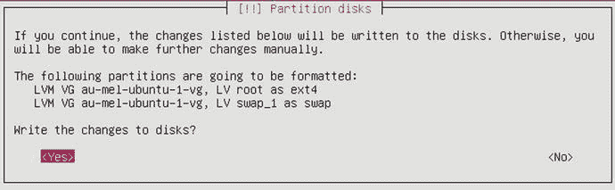

图 2-59。

. Writing LVM partition changes to disk Note

交换空间是硬盘驱动器上的额外存储空间，用于从 RAM 中“溢出”数据。如果您发现您的主机频繁地使用所有的交换空间或频繁地交换，那么您可能需要调整您的主机，并且通常添加更多的 RAM。我们将在第 9 章[和第 17 章](09.html)[中更详细地讨论交换空间。](17.html)

在安装的这个阶段，Ubuntu 将开始安装安装操作系统其余部分所需的基础软件包。如果您使用网络安装，这可能需要一些时间，取决于您的互联网连接。您将看到一个类似于图 [2-60](#Fig60) 所示的进度条。

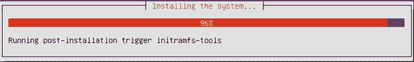

图 2-60。

Installing base system requirements

完成后，系统会询问我们是否需要使用代理服务器来下载完整安装所需的软件包。您可以提供包含用户名和密码的 URL(如果有的话)。我们将保留空白，如图 [2-61](#Fig61) 所示。

图 2-61。

Proxy server settings

之后，我们现在被问及我们希望如何处理我们系统上的软件更新。

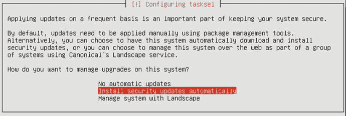

图 2-62。

Automatically install system updates

这可能是一个有争议的问题。有些人不喜欢在他们不知情的情况下更新他们的系统，因为这会导致意想不到的结果。理想情况下，您应该随时了解您的系统的状态，并在您选择的时间部署安全或其他方面的更新。然而，由于我们是刚开始，自动安装这些是首选。

Note

有了 LTS(长期支持)系统，您可以更加确定更新只会对您的系统做出最小的更改。此外，这些变化将在一个大的部署范围内得到很好的测试。对于前沿系统，你并不总是得到同样的确定性。

然后会询问您希望通过选择应用程序组在您的主机上安装哪些应用程序。我们选择了 DNS、LAMP server (Linux、Apache、MySQL 和 PHP)、mail (Postfix)和 OpenSSH，如图 [2-63](#Fig63) 所示。准备就绪后，选择继续。

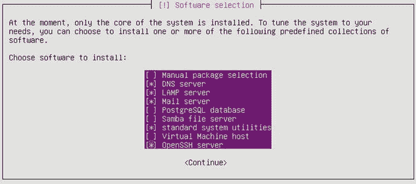

图 2-63。

Selecting applications for your host

在这个特殊的安装中，由于你选择安装的应用程序，你会被问一系列的问题来帮助 Ubuntu 配置或保护你选择的应用程序。每次在 Ubuntu 上安装需要配置输入的新应用，都会提示你回答类似的问题。

正如您在图 [2-64](#Fig64) 中看到的，您首先被要求提供 MySQL 数据库 root 用户的密码。这是您的 MySQL 安装的主密码，您应该输入一个安全且复杂的密码。您将被要求再次输入该密码进行确认。

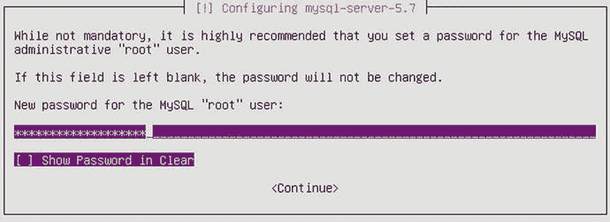

图 2-64。

Setting the MySQL root password

一旦您提供了该密码，系统会要求您描述您的邮件服务器配置。图 [2-65](#Fig65) 中的屏幕显示了配置选项，并简要描述了每个选项。我们将只选择默认的 Internet 站点。

图 2-65。

Configuring the mail server

我们将在第 12 章中解释如何配置和保护邮件服务。选择此处的默认值将为您的域提供发送和接收邮件的基本安全配置。

接下来，您为您的邮件服务器提供域名(参见图 [2-66](#Fig66) )。你现在应该输入主机的域名，我们将在第 12 章[中解释其他可能的选项。](12.html)

图 2-66。

Setting the mail server domain name

接下来，我们在 CentOS 安装指南中讨论了 GRUB，并讨论了它是如何加载操作系统的。在这个屏幕中，我们被要求将其安装到主引导记录中。MBR 是硬盘上的一小块空间，用于向系统描述分区布局。它还有一个安装 GRUB 引导加载程序的小空间。

Note

您可能看不到 GRUB 安装屏幕(图 [2-67](#Fig67) )。运行 UEFI(统一可扩展固件接口)的系统不会显示下一个屏幕。我们将在第 6 章[中讨论 BIOS(基本输入/输出系统)和 UEFI 的区别。](06.html)

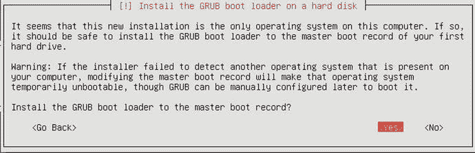

图 2-67。

Installing the GRUB into the boot loader

在图 [2-67](#Fig67) 中，我们选择 Yes 将引导加载程序安装到 MBR 中。现在你的安装完成了，Ubuntu 会通知你，如图 [2-68](#Fig68) 所示。

图 2-68。

Installation complete

如果您使用的是 CD 或 DVD，它应该会自动弹出。如果您使用的是 USB 拇指驱动器，请取出并选择继续。您的系统现在将重新启动，您将看到一个密码提示(参见图 [2-69](#Fig69) )来解密您的硬盘。

图 2-69。

Decrypting hard drives before boot

现在我们已经完成了安装。系统现在正在启动。很快你会看到如图 [2-70](#Fig70) 所示的登录控制台。

图 2-70。

Booting to the console screen

你会注意到 Ubuntu 不是引导到 GUI，而是引导到控制台屏幕。这是因为默认的 Ubuntu 服务器安装不安装 GUI。我们将在第 [4](04.html) 章中更多地讨论命令行和 GUI 的使用。

现在，您已经有了一个运行 Ubuntu 发行版的可用的邮件、DNS 和 web 服务器，可以为您的环境做进一步的定制了。

## 解决纷争

有时安装会因为某些原因而失败。最常见的原因是安装介质有缺陷；由于不支持或有缺陷的硬件，这种情况很少发生。

如果安装介质有问题，您可能会看到记录的读取错误，或者安装程序可能会显示一个错误，说明它无法读取文件。您应该检查安装 CD 或 DVD 是否有划痕。如果您是从 ISO 文件创建的 CD 或 DVD，那么以较低的速度刻录新盘可能是值得的。介质问题通常在安装过程的同一个步骤中重复出现。

如果连接中断，网络安装也可能会失败，因此请检查电缆是否插好，互联网连接是否正常。

不太常见的故障类型是由不受支持的硬件引起的。例如，如果安装内核不支持磁盘控制器，安装程序将无法访问硬盘。如果发生这种情况，请检查安装盘上包含的内核版本，并验证它确实支持您的硬件。您的发行版可能会有更新的版本，支持更多更新的硬件。现在这已经不太常见了，因为主要的制造商已经开始越来越多地支持 Linux，并积极地为内核贡献驱动程序。

在安装过程中随机出现的不可再现的崩溃通常表示硬件问题，最常见的问题是坏 RAM 或过热。你可以运行一个类似 memtest86 ( [`www.memtest.org/`](http://www.memtest.org/) `),`的 RAM 测试器，你应该验证 CPU 和机箱风扇工作正常。

### 诊断信息

如果在安装时需要额外的诊断信息，可以从安装过程中访问有限的 shell 和一些日志记录信息。您可以使用这些来进一步诊断您可能遇到的任何问题。这些被称为虚拟控制台(也称为 tty ),我们将在第 [4](04.html) 章再次讨论它们。

在 Ubuntu 上，Alt+F2 和 Alt+F3 分别提供对有限 shell 的访问。Alt+F4 为安装程序提供详细的安装进度和日志。Alt+F1 组合键切换回安装程序界面。

OnCentOS，图形化安装在 Ctrl-Alt-F1 上运行。在 Ctrl-Alt-F2 上有一个 shell 提示符，安装消息转到 Ctrl-Alt-F3，系统消息转到 Ctrl-Alt-F4，其他消息出现在 Ctrl-Alt-F5 上。

如果安装没有按计划进行，您可以使用这些终端来收集有关您的安装的信息或查看任何可能有帮助的错误信息。

### 重新启动您的安装

出现问题后，通常应该从头开始重新安装。因为先前安装尝试的文件可能仍然存在于磁盘上，所以最好让安装程序重新初始化分区并从头开始。

### 疑难解答资源

如果遇到麻烦，不要害怕利用大多数 Linux 发行版周围的社区。很可能其他人也经历过和你一样的问题，并记录了解决方案。以下是一些可供尝试的资源:

*   Red Hat: [`www.redhat.com/en/services/support/`](http://www.redhat.com/en/services/support/)
*   Fedora: [`http://forums.fedoraforum.org/forumdisplay.php?f=6`](http://forums.fedoraforum.org/forumdisplay.php?f=6)
*   Ubuntu: [`http://ubuntuforums.org/forumdisplay.php?f=333`](http://ubuntuforums.org/forumdisplay.php?f=333)

## 摘要

在本章中，我们逐步完成了安装两个流行的 Linux 发行版的过程:

*   CentOS 服务器
*   Ubuntu 服务器

我们还解释了如果在安装过程中出现问题，您可以做些什么。在下一章中，我们将向您介绍一些我们用来帮助快速建立安装原型的工具。我们将在本书的其余部分更多地使用这些工具。