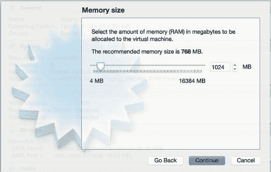
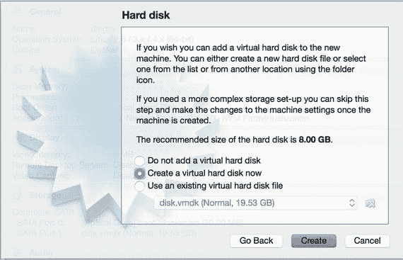
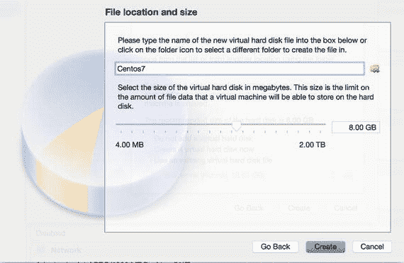
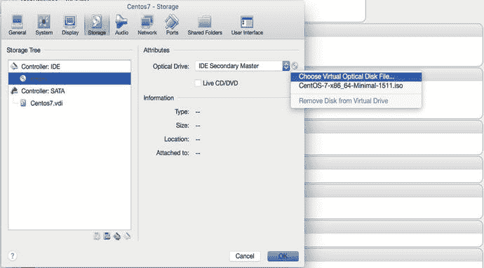
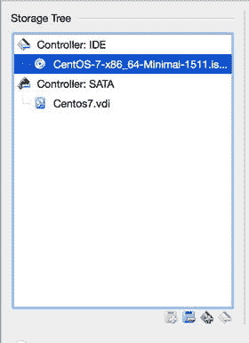
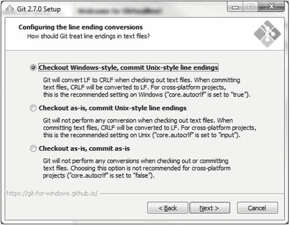
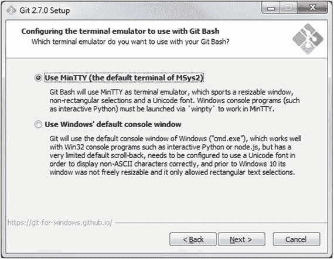
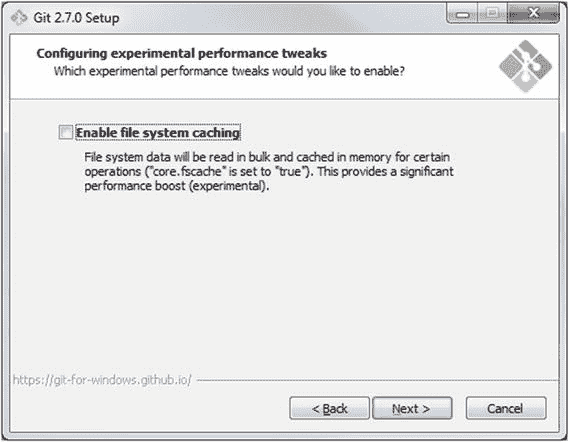

# 三、VirtualBox、Git 和 Vagrant 简介

在第 [2](02.html) 章中，我们向您展示了如何从 ISO 映像在物理服务器上安装 Linux。然而，部署 Linux 服务器还有许多其他选择——包括网络供应、部署虚拟机映像或在“云中”启动 Linux 实例现在，与本地或世界各地的其他人共享虚拟机的能力也更强了。我们将向你展示一种可能有助于你理解这本书的方法。

有些人发现刚开始使用 Linux 很难，因为有许多安装选项和选择——拥有所有这些选项我们认为是一件很棒的事情！幸运的是，有一些工具可以让研究和探索 Linux 变得更加容易。我们想借此机会向您介绍一些我们将在本书稍后使用的工具，或者您现在就可以使用它们来跟随我们，因为我们将在接下来的章节中带您了解不同的示例。对你来说，这意味着你可以在你的桌面上跟随，不管发生了什么，如果你犯了一个可怕的错误，你可以快速安全地恢复。另外，在这个过程中，您将熟悉我们使用的一些工具。

我们在原型和测试中每天使用的工具组合是 VirtualBox、vagger 和 Git(在我们试验和测试时跟踪我们配置的变化)。能够在不污染本地主机或其他服务器的情况下构建完整系统的原型是一个真正的好处。能够试用不同类型的操作系统并能够运行快速有效的测试来验证您的工作应该是所有管理员的目标。

一种既便宜又快速地构建服务器的方法是使用虚拟化。虚拟化有许多不同的形式，首先是 KVM、Xen 和 LXC 容器。在这一章中，我们将向您展示我们日常在桌面上进行原型设计和测试的工具——无论是 Linux 服务器、Mac 还是 Windows 主机。可以在 Windows 机器、Mac 和 Linux 上使用的一种虚拟化技术是 VirtualBox。出于这个原因，VirtualBox 是一个很好的入门级虚拟化平台，但它不是一个用于提高性能的平台。但是，如果您来自 Windows 和 Mac 世界，它允许您进一步探索像 Docker 这样的 LXC 容器软件，这需要运行 Linux 内核。

VirtualBox 还允许你在桌面上运行许多不同的操作系统。这样就省去了双启动不同操作系统的时间和麻烦(也就是说你必须关闭一个操作系统才能启动另一个)。它还允许您共享资源，比如客户操作系统和桌面之间的文件系统。

Git 是计算机软件的版本源控制技术。它非常擅长跟踪对基于文本的文件(如配置文件)的更改。与 GitLab、GitHub 或 BitBucket 等资源相结合，这是一种以开放和协作的方式管理组织变革的有效方式。使用 Git，您的配置更改可以与当前配置进行比较，并且您可以让其他管理员能够同意这些更改。您还可以使用 Git 构建测试管道，在部署到生产环境之前测试系统的变更。

虽然您可以使用 VirtualBox GUI 或 VirtualBox CLI 来创建、安装和管理您的 VirtualBox 计算机，但我们将向您介绍一款名为 vagger 的工具。vagger 是 VirtualBox CLI 命令的“包装器”,但它的功能远不止于此。它有基于文本的配置文件，适合跟踪 Git 中的变化。这有助于您原型化和开发主机构建或应用程序。它允许集成许多配置管理工具，如 Puppet、Ansible 或 SaltStack。但是一个主要的好处是你可以和其他开发者共享图片，或者“盒子”和构建指令。这有助于您的团队在一组一致的映像上进行开发，这些映像可以在桌面商用硬件上运行，并且易于创建、重新创建、开发和制作。

系统管理员发现这种快速原型非常有用。在过去，要查看一个新的软件包做了什么，或者操作系统的新更新会做什么，您可能需要找到一些备用服务器并运行新软件。有了 VirtualBox 和 vagger，你可以更快地完成这项工作，而且不会损害你的本地桌面。在本书的后面，我们将使用配置管理工具 Puppet 和 Ansible 来部署我们的服务器配置，我们将使用 VirtualBox、Later 和 Git 的组合来实现和跟踪这一点。

共享和下载 Vagrant 盒子或共享 VirtualBox 机器的能力意味着你可以快速集成或试用不同的技术。例如，您的应用程序中可能需要 memcached 服务。就您的应用程序而言，要用您的应用程序测试 memcached，您只需要 IP(互联网协议)地址和一个到达它的端口。与其为此构建另一个服务器，您可以下载一个由您团队中的其他人创建的带有完全配置的 memcached 服务的 travel box，或者从在线 travel box 存储库中下载一个公共可用的 box。从开发的角度来看，这有助于更快的原型和构建。如果您的应用程序与 memcached 配合得很好，那么您可以在以后的阶段为您的应用程序开发、测试和部署一个合适的 memcached 服务。

有关虚拟化技术的一般信息，请参见以下内容:

*   [T2`https://gendersec.tacticaltech.org/wiki/index.php/Linux_virtualisation`](https://gendersec.tacticaltech.org/wiki/index.php/Linux_virtualisation)
*   [T2`https://en.wikipedia.org/wiki/Comparison_of_platform_virtualization_software`](https://en.wikipedia.org/wiki/Comparison_of_platform_virtualization_software)

## VirtualBox 安装

VirtualBox 非常容易安装。有 Windows、Mac、Linux 甚至 Solaris(对于不了解的人来说是 Unix 操作系统)的自安装包。只需进入 [`www.virtualbox.org/wiki/Downloads`](http://www.virtualbox.org/wiki/Downloads) ，为您的操作系统选择合适的下载。您应该可以轻松安装 VirtualBox。如果你遇到麻烦，你可能会发现以下 PDF 文件的第 [2](02.html) 章很有帮助: [`http://download.virtualbox.org/virtualbox/5.0.14/UserManual.pdf`](http://download.virtualbox.org/virtualbox/5.0.14/UserManual.pdf) 。

### 批准

VirtualBox 是 Oracle 拥有的一个开源虚拟化平台。它是在 GNU 通用公共许可证(GPL)版本 2 许可下发布的。该许可证的全部细节可在 [`www.gnu.org/licenses/old-licenses/gpl-2.0.html`](http://www.gnu.org/licenses/old-licenses/gpl-2.0.html) 找到。

如果您还希望使用 VirtualBox Oracle VM VirtualBox 扩展包，您需要同意 VirtualBox 个人使用和评估许可证的条款(参见 [`www.virtualbox.org/wiki/VirtualBox_PUEL`](http://www.virtualbox.org/wiki/VirtualBox_PUEL) )。本许可证仅允许用于个人或产品评估或学术用途。如果您打算将本产品用于商业用途，请遵守这些许可。

### 创建新的 VirtualBox 计算机

在我们启动新的 VirtualBox 机器之前，首先确保您已经下载了适用于 CentOS 7 的 ISO 映像文件。可以去 [`www.CentOS.org/download`](http://www.centos.org/download) 取。有三个选项供您下载。DVD ISO 和完整的 ISO 将需要更长的时间来下载，但将包含一切你将需要一个桌面环境。如果你选择最小的 ISO，你的下载会更快，但是当你需要的时候，你必须从网上下载额外的软件包。

在本例中，我们从以下下载链接安装 CentOS:[`http://isoredirect.CentOS.org/CentOS/7/isos/x86_64/CentOS-7-x86_64-Minimal-1511.iso`](http://isoredirect.centos.org/CentOS/7/isos/x86_64/CentOS-7-x86_64-Minimal-1511.iso)。

VirtualBox 应用程序像桌面上的任何其他应用程序一样运行。找到应用程序并启动它。您将看到一个与此类似的屏幕。


图 3-1。

VirtualBox console

全新安装不会安装任何虚拟机。要创建我们自己的 CentOS 安装，我们选择 New 按钮。在出现的窗口中，我们将为机器命名为 Centos7，并选择 Linux 和 Red Hat (64 位)的类型和版本。


图 3-2。

Naming and setting VirtualBox type

接下来，我们可以配置内存大小。这可以是系统允许的最大值。一般来说，1024Mb 是合适的，或者 512Mb 用于没有图形桌面之类东西的较小系统。您也可以在安装后根据需要进行调整。使用滑块或键入系统所需的内存量。

Note

值得注意的是，您可以“过量使用”内存(即，将超过主机系统可用的内存分配给多个虚拟机)，这意味着如果我的主机系统有 8GB RAM，我们可以有一个 2GB、一个 4GB 和一个 6GB 的虚拟机，它们都可以同时正常运行。如果三个虚拟机都使用全部分配的内存，我们就无法同时运行所有这三个虚拟机，或者至少会让主机爬行。在这种情况下，我们也许可以同时运行 2GB 和 4GB 的主机。



图 3-3。

Memory allocation

我们现在被询问是否希望创建一个硬盘。在这里，您可以选择使用现有磁盘，也可以选择不使用磁盘。我们将单击“立即创建虚拟硬盘”,然后单击“继续”。



图 3-4。

Choosing disk

我们可以选择下一步要选择的虚拟磁盘格式。VirtualBox 给了我们六种选择。我们将选择默认值 VDI (VirtualBox 磁盘映像) ,然后继续。


图 3-5。

Selecting Virtual Disk format Note

有许多不同类型的虚拟磁盘格式。VirtualBox 拥有自己的 VDI 格式，并支持 VMWare 的 VMDK(虚拟机磁盘)、微软的 VHD(虚拟硬盘)、Mac OSX 的 HDD (Parallels 硬盘)、QEMU QED (QEMU 增强型磁盘)和 QCOW (QEMU 写入时复制)。这些文件系统都在磁盘文件上(意味着“磁盘”实际上只是文件系统上的文件，可以像任何其他文件一样被复制和移动)。这意味着，您可以创建一个具有特定格式的磁盘，如 VHD，然后将该映像文件移动到另一台主机并将其安装在那里。

我们现在可以选择磁盘是固定大小还是动态分配。简而言之，我们可以创建一个磁盘来分配我们所请求的全部磁盘大小，或者我们现在可以只分配其中的一小部分，当我们需要它时，VirtualBox 会分配更多的空间。动态分配的好处是，您可以过度分配磁盘(这意味着您可以向虚拟主机分配比主机上实际更多的磁盘空间)。缺点是会影响性能，因为 VirtualBox 会在需要时分配空间。一旦分配了磁盘，就不能将其释放回虚拟主机中的可用空间。但是，因为这些虚拟磁盘只是您主机上的文件，所以我们可以将它们移动到其他存储设备上，或者在我们的主机空间开始耗尽时清理它们。

我们将选择动态分配并继续。


图 3-6。

Dynamically allocating disk

默认磁盘大小为 8GB。我们将选择此项，您可以使用滑块或键入您希望虚拟主机使用的磁盘数量。如果您愿意，您也可以在这里通过选择小文件夹图标来更改磁盘的名称和位置。



图 3-7。

Disk amount

这就创建了虚拟主机 Centos7。


图 3-8。

Centos7 VM is almost ready

我们可以更改新虚拟主机的设置或添加更多存储设备。我们需要添加一个存储设备来启动我们的操作系统。因此，我们将选择“Settings”并转到“storage”选项卡。你可以看到我们有一个空的 IDE 控制器。我们可以点击小 DVD 符号并选择选择光学虚拟磁盘文件。导航到之前下载 ISO 映像的目录。选择 CentOS-7 ISO。



图 3-9。

Selecting image

磁盘现在应该显示为连接到 IDE 控制器。



图 3-10。

Selected CentOS ISO is ready

我们现在准备安装我们的操作系统。只需遵循第 [2](02.html) 章中的步骤。然而，让机器快速启动并运行的另一种方法是使用另一个工具，vagger。我们稍后将向您展示这一点，但首先我们想向您展示 Git(我们实际上只是想要终端模拟器，但让 Git 在您的系统上工作并无大碍)。

### 安装 Git

在整个开发和系统管理任务中，您会发现一个非常方便的工具是 Git。Git 是一个分布式版本控制系统，它非常擅长将您对配置文件的更改存储在不同的工作块或提交中。您可以为这些提交添加描述，以便关注您的人(并且总是有人关注您)可以查看您所做的更改，并看到描述该更改的注释。您还可以使用 Git 快速查看不同提交之间发生了什么变化。

Note

Git 来自于版本控制系统的悠久传统。过去的主要版本控制系统(VCS)是集中的，这意味着你在一个 VCS 上做所有的修改。Git 将它改为分布式的，这样您就不必再依赖“一个”服务器来为您的所有团队提供服务。这极大地帮助了分布式团队能够在非常复杂的系统(如 Linux 内核)上进行更改，并成为协作、共享代码和项目的一种很好的方式。

下载 Git 是非常无痛的。您可以在大多数(如果不是全部的话)Linux 发行版中以标准包的形式获得它，也可以访问

[`http://git-scm.com/download`](http://git-scm.com/download) 。

我们将演示在 Windows 机器上的安装，因为这比在 Mac 或 Linux 上安装 Git 更不常见，并且有一些可能难以理解的选项。

Tip

这里的 Git 站点也有 Mac、Linux、Windows 的安装说明: [`https://git-scm.com/book/en/v1/Getting-Started-Installing-Git`](https://git-scm.com/book/en/v1/Getting-Started-Installing-Git) 。

开始，下载并打开安装程序后，我们会被问一些问题。这些对一些人来说可能是新的。其中之一就是在 Windows 中设置`%PATH%`变量。虽然这些设置由您决定，但我们建议您采取以下措施:

在图 [3-11](#Fig11) 中，我们选择允许我们在 Windows 命令提示符和 Git Bash 提示符下使用 Git 的设置。这给了我们在处理文件时一点灵活性。


图 3-11。

Allow Git commands from the windows command line

下一步可能也需要一些思考。令人困惑的是，Windows 和 Linux 系统(甚至 MAC)有不同的方式来告诉计算机一行的结尾在文件的什么地方。在 Linux 中，文件中一行的结尾被称为 LF(换行),在 Windows 中被称为 CRLF(回车换行)。因此，当您对文件进行更改时，操作系统会将适当的行尾添加到文件中每一行的末尾。当您在另一个操作系统上打开这个文件时，您会在编辑器中看到奇怪的格式。我们在这里所做的是在您提交这个更改时控制 Git 做什么。Git 可以控制这些不可见的行尾应该是什么。

在图 [3-12](#Fig12) 中，我们允许 Git 将 LF 转换为 CRLF 以进行窗口编辑，但是当我们提交文件时，我们再次将 CRLF 转换为 LF。有了这个选项，您应该能够毫不费力地与 Git 控制的文件进行交互。



图 3-12。

Allow Git to change LF to CRLF on checkout and CRLF to LF on commits

接下来，我们配置哪个终端模拟器用于 Git。Git Bash 是学习和与 Git 交互的好方法。它有许多可用的 Linux 命令和 Git 命令。当然，如果你觉得用 Windows 控制台更舒服，请随意选择。



图 3-13。

Selecting the terminal

下一个屏幕现在不是很重要。通过选择图 [3-14](#Fig14) 中的复选框，您可以添加一些实验性的性能调整。我们不会选择它，但是如果你喜欢冒险，你可以选择。



图 3-14。

Experimental performance options

### 去吧，普西

让我们快速浏览一下您需要知道的通用 Git 命令。Git 不同于集中式版本控制软件的地方在于它是去中心化的！这意味着 Git 存储库的每个克隆都相当于存储库的一个“主”副本——包括历史。这相当于每个开发人员的本地副本也是存储库的分布式备份。然而，大多数人使用集中托管的 Git 存储库服务，如 GitLab、GitHub 或 BitBucket，首先要做的事情之一是克隆存储库:

```sh
$ git clone git@<githost.com>:<username>/git-repository.git

```

上述命令将使用 SSH 协议登录到 githost.com 服务器(您也可以使用 HTTPS、Git 或本地协议)。您可以使用 SSH 公钥在 githost.com 服务器上进行身份验证，从而获得对存储库的访问权。然后，Git 将在本地文件系统的同名目录中创建 git-repository.git 存储库的副本。

一旦您有了存储库的副本，您就可以开始进行更改了。第一步是创建一个分支。分支是一组离散的提交，它们都与特定的变更相关。有一个主要分支被认为是主线或主分支(通常称为主)。分支中的更改通常会合并到主分支中。要从主分支创建新分支，请执行以下命令:

```sh
$ git branch my_change

```

您这样做是为了在一个命名的分支中创建包含的和离散的工作分支——而 Git 的分支很便宜(这是卖点之一！).

现在，您已经克隆、创建了一个分支，并且编辑了一些文件。您可以使用以下命令查看您对这些文件所做的更改:

```sh
$ git diff

```

该命令将显示存储库中的所有更改，如果您希望缩小比较的范围，可以在命令行中添加目录或文件名。但是，假设您对您的差异感到满意，并且您现在准备提交这些更改。

```sh
$ git commit –v path/to/file/or/directory

```

您将再次看到您的更改的差异，并且您将能够向提交添加提交消息，以便人们知道更改是什么。好的提交消息让你知道你做了什么——最好是做了什么和为什么做。错误的提交消息是“更新的文件”现在，您的分支中有一个提交，您可能希望将它合并回主分支中(如果您正在处理一个共享项目，您可能不希望直接这样做——您可能希望将您的分支“推”到您克隆的远程存储库中，并让其他人先检查它)。要合并回主服务器，请发出以下命令:

```sh
$ git checkout master
$ git pull origin master
$ git merge my_change

```

我们在上面所做的是，我们首先离开 my_change 分支，并检查主分支——主分支通常是从中提取生产代码的分支。我们首先在源(或者 githost.com 主存储库)上做一个“拉”来拉进任何其他已经被签入的变更。然后，将您的更改合并到主存储库中，并处理由此引起的任何冲突。一旦您对存储库的状态感到满意，您就可以“推”回原点(githost.com 存储库)。

```sh
$ git push origin master

```

您的更改现在可以被任何使用该存储库的 githost.com 副本的人共享。当然，这是一个非常简单而且可能很糟糕的例子。像上面这样的工作流毫无疑问会导致破坏，你应该有一种在合并到 master 之前测试代码的方法。GitHub 在这里提供了一个很好的关于 git 工作流的文档: [`https://guides.github.com/introduction/flow/`](https://guides.github.com/introduction/flow/)

Note

有关 Git 的更多信息，请参见 [`https://git-scm.com/book/en/v2`](https://git-scm.com/book/en/v2) 。

对于 Windows 用户，现在已经安装了 Git，可以使用 Git Bash 访问有用的 Linux 实用程序，如 less、vi、grep 和 tail。我们将在下一节向您展示如何使用 Git Bash。

### 介绍 Vagrant

vagger 是一种在开发人员之间快速方便地共享和分发开发环境的方式。从这个意义上说，“开发环境”是一组虚拟机和运行这些虚拟机的配置。最初，它被设计为通过配置文件和命令行工具的组合来管理 VirtualBox 机器，但后来它扩展到更多方面，并支持其他虚拟化技术。它是由 Mitchell Hashimoto 开发的，他随后凭借该产品的受欢迎程度创建了 HashiCorp。它是用 Ruby 编写的，可以在任何支持 Ruby 的操作系统上运行。目前你可以下载并在 Linux、Mac OSX 和 Windows 上运行它。

### 安装 Vagrant

您首先可以在此下载适用于您的操作系统的软件:

[`www.vagrantup.com/downloads.html`](http://www.vagrantup.com/downloads.html) 。

Vagrant 的意思是由命令行驱动；它不提供图形用户界面(GUI)。在苹果电脑上，你可以从终端窗口操控一切。在 Windows 机器上，你可以从`cmd.exe`程序、PowerShell 或者我们刚刚安装的 Git Bash 运行命令。

Tip

有些事情您无法在 Windows 命令或 PowerShell 控制台中直接完成。其中一个是宋承宪。SSH 是一种通过网络访问控制台的安全方式。通过安装 Git Bash，我们可以访问 SSH 客户端。如果您不能让 SSH 工作，您应该检查 SSH 可执行文件的路径是否在您的控制台环境的路径中。Windows 中常见的地方是`C:\Program Files\Git\usr\bin`。使用`$env:path =+'; C:\Program Files\Git\usr\bin'`将其添加到您当前的 PowerShell 环境中。对于 Windows 命令提示符，`set PATH=%PATH%;C:\Program Files\Git\usr\bin`。您需要永久地设置它，因为它只持续您当前的控制台会话。我们会让你自己调查如何做到这一点。

#### 批准

Vagrant 是在麻省理工学院的许可下分发的。这意味着你可以用任何你想要的方式使用这个软件。您可以在以下位置查看许可证

[T2`https://raw.githubusercontent.com/mitchellh/vagrant/master/LICENSE`](https://raw.githubusercontent.com/mitchellh/vagrant/master/LICENSE)

### 流浪的概念

最初开发的时候，vagger 试图解决的问题空间是虚拟机及其配置在 VirtualBox 下运行的共享。从那时起，它扩展了对虚拟化技术的支持，但其核心租户保持不变。它通过两种方式做到这一点。它提供了分发和下载其他 VirtualBox 虚拟机的机制，以及管理它们的配置和运行的工具。

主要是 Vagrant 用盒子工作。盒子只是预建的 VirtualBox 虚拟机的压缩文件，这些虚拟机配置了一些特殊的东西。他们有一个“流浪”用户，可以访问 root 权限，OpenSSH 已经安装并正在运行。vacant 使用 VirtualBox 命令(或 VBoxManage 命令)来创建、配置、启动和停止这些机器，它通过 vacant 用户结合使用 VirtualBox CLI 和 SSH 访问来完成这些操作。你可以从 HashiCorp 的另一项名为 Atlas 的服务下载盒子，也可以自己制作。你也可以通过 Atlas 存储、分发和发布盒子。Atlas 提供私人和企业服务，并与 HashiCorp 的其他服务整合。

Note

构建你自己的 Vagrant 盒子有点复杂，但是当你更加熟悉 Linux 的时候，你应该尝试一下。当你准备好了，请点击这里查看详情 [`www.vagrantup.com/docs/boxes/base.html`](http://www.vagrantup.com/docs/boxes/base.html) 。

您也不仅限于使用 VirtualBox 机器。你可以运行亚马逊 AWS 或者 Openstack 实例，LXC 容器，当然还有 Docker 容器。在本练习中，我们将向您展示如何使用 VirtualBox 虚拟机。你可以在闲暇时自由探索他人。

How Vagrant Integrates with Virtualbox

在本练习中，我们将初始化一个浮动配置文件，对该文件进行一些编辑，然后使用浮动 CLI 启动该 VirtualBox 虚拟机。但是这一切是如何运作的呢？

嗯，当你下载一个流浪盒，它基本上是一个压缩的 tarball(类似于压缩文件)的 VirtualBox 虚拟机，包括虚拟磁盘映像。Vagrant 命令将把这些盒子存储在你的主目录的适当的`.vagrant.d/boxes`目录中。

```sh
virtualbox/
total 1029016
drwxr-xr-x  6   dennismatotek  staff             204 12 Dec 16:44 .
drwxr-xr-x  3   dennismatotek  staff             102 12 Dec 16:44 ..
-rw-r--r--  1   dennismatotek  staff             505 12 Dec 16:44 Vagrantfile
-rw-------  1   dennismatotek  staff       526833152 12 Dec 16:44 box-disk1.vmdk
-rw-------  1   dennismatotek  staff           10589 12 Dec 16:44 box.ovf
-rw-r--r--  1   dennismatotek  staff              25 12 Dec 16:44 metadata.json

```

当您第一次发出 vagrant up 命令时，正如我们马上要做的，variant 将下载指定的 box，存储在一个类似命名的目录中，然后使用 VBoxManage import 命令将下载的 VirtualBox 机器(box.ovf)导入到 VirtualBox 本身。

然后，VirtualBox 将为该虚拟机分配一个 UUID(通用唯一标识符)，然后，vagger 可以使用该标识符发出 VBoxManage startvm <uuid>—headless 命令。类似地，当调用一个 vagrant halt 时，vacant 将使用 vbox manage control VM<uuid>power off 命令来停止虚拟机。</uuid></uuid>

vagger 还会做一些事情，比如设置网络端口转发(用于 SSH 访问和其他网络服务，如果配置的话)和在 virtualbox 虚拟机中挂载文件系统(除非您配置为不这样做)。

这些例子是特定于 VirtualBox 虚拟机的——但是，通过发出所需的命令或 API(应用程序编程接口)调用来管理它们，vagger 支持其他虚拟化和基于云的实例。这意味着我们可以使用同一个 lavour up 命令来启动 VirtualBox 虚拟机或 AWS 实例——但是当然要对配置文件(lavour file)进行适当的更改。

### 流浪汉入门

安装后，您需要做的第一件事是打开一个终端，或者通过`cmd.exe`、PowerShell 提示符或 Git Bash 提示符进入命令提示符。转到您最喜欢的工作区，创建一个名为 first 的新目录或文件夹。使用`cd`命令进入新目录。

无论您使用哪种操作系统，命令的输出都是相同的。发出以下命令:

```sh
> vagrant
Usage: vagrant [options] <command> [<args>]

   -v, --version                    Print the version and exit.
   -h, --help                       Print this help.

Common commands:
    box             manages boxes: installation, removal, etc.
    connect         connect to a remotely shared Vagrant environment
    destroy         stops and deletes all traces of the vagrant machine
    global-status   outputs status Vagrant environments for this user
    halt            stops the vagrant machine
    help            shows the help for a subcommand
    init            initializes a new Vagrant environment by creating a Vagrantfile
    login           log in to HashiCorp's Atlas
    package         packages a running vagrant environment into a box
    plugin          manages plugins: install, uninstall, update, etc.
    port            displays information about guest port mappings
    powershell      connects to machine via powershell remoting
    provision       provisions the vagrant machine
    push            deploys code in this environment to a configured destination
    rdp             connects to machine via RDP
    reload          restarts vagrant machine, loads new Vagrantfile configuration
    resume          resume a suspended vagrant machine
    share           share your Vagrant environment with anyone in the world
    snapshot        manages snapshots: saving, restoring, etc.
    ssh             connects to machine via SSH
    ssh-config      outputs OpenSSH valid configuration to connect to the machine
    status          outputs status of the vagrant machine
    suspend         suspends the machine
    up              starts and provisions the vagrant environment
    vbguest
    version         prints current and latest Vagrant version

For help on any individual command run `vagrant COMMAND -h`

Additional subcommands

are available, but are either more advanced
or not commonly used. To see all subcommands, run the command
`vagrant list-commands`.

Listing 3-1.Vagrant Options

```

这将向您显示可用的子命令的完整列表。我们将只向您展示四个，以帮助您入门。我们计划向您展示的任务是

*   初始化第一个目录
*   更新 Vagrant 的配置文件
*   启动我们的流浪盒子
*   检查状态
*   最后，SSH 进入控制台

我们需要做的第一项任务是初始化我们的第一个目录。发出如下命令，`vagrant init`如清单 [3-2](#Par89) 所示。

```sh
> vagrant init
A `Vagrantfile` has been placed in this directory. You are now
ready to `vagrant up` your first virtual environment! Please read
the comments in the Vagrantfile as well as documentation on
`vagrantup.com` for more information on using Vagrant.
Listing 3-2.Vagrant init

```

Vagrant 初始化命令只是把一个文件放在你的目录中。这是我们用来配置第一个 Vagrant 图像的文件。如果我们使用`ls`命令列出我们目录的内容，我们将会看到如下内容(对于 Windows `cmd.exe`，您可能需要发出`dir`)。

```sh
> ls
Vagrantfile
Listing 3-3.Showing the Vagrantfile

```

在图 [3-3](#Fig3) 中，我们有一个名为 Vagrant 文件的文件，这个文件包含了`vagrant`命令用来创建 Vagrant 主机的配置信息。如果我们查看该文件的内容，它看起来非常像 Ruby 代码。那是因为它是。这个文件使用了 Ruby 代码，在执行 vagger 命令时，vagger 解析并加载这个文件。这意味着您可以在文件中使用 Ruby 语言来创建列表、数组、散列等等。这在以后处理你的 Vagrant 文件中的多个图像时会很有用。现在用你的编辑器打开 Vagrant 文件。如果你使用 Git Bash，你可以使用 vi 程序。我们将在第 4 章中详细解释 vi。

流浪汉文件的内容看起来类似于清单 [3-4](#Par94) 中所示的缩短版本。

```sh
Vagrant.configure(2) do |config|
 config.vm.box = "base"

 # config.vm.network "forwarded_port", guest: 80, host: 8080

 # config.vm.network "private_network", ip: "192.168.33.10"

 # config.vm.synced_folder "../data", "/vagrant_data"

 # config.vm.provider "virtualbox" do |vb|
 #   # Display the VirtualBox GUI when booting the machine
 #   vb.gui = true
 #
 #   # Customize the amount of memory on the VM:
 #   vb.memory = "1024"
 # end
end

Listing 3-4.
Vagrantfile

```

在清单 [3-4](#Par94) 中，我们删除了很多注释和建议设置。不用深入 Ruby 语言，你就可以看到我们可以在 do 和 end 语句之间编写代码块。我们将`Vagrant.configure(2)`的结果传递给配置变量对象。然后我们可以用它来分配我们的 Vagrant 配置。在图 [3-4](#Fig4) 中，我们将`config.vm.box`设置为等于“基数”

Tip

Ruby 是一种非常灵活的编程语言。它类似于 Python 语言，另一种非常流行的强大语言。我鼓励你去 [`http://tryruby.org/`](http://tryruby.org/) 看看。

因此，让我们为我们的第一个 Vagrant 形象创建一个基本配置。首先，我们可以转到以下链接，查看所有可用的框:

[T2`https://atlas.hashicorp.com/boxes/search`](https://atlas.hashicorp.com/boxes/search)

Note

记住一个流浪的“盒子”是一个自包含的 Linux 虚拟机，它可以在你的 VirtualBox 虚拟化软件内部运行。HashiCorp 在 Atlas 上托管的盒子是由社区成员或组织创建的，在设计和用途上千差万别。

Ubuntu 团队定期推送一个官方的 Vagrant 盒子供公众下载。我们将把它作为我们的流浪箱。这些 Vagrant 盒子是“基础”图像。你下载它们，并把它们作为你自己的盒子的基础。有很多可供你探索。

在清单 [3-5](#Par102) 中，我们添加了`ubuntu/xenial64`框。当我们启动流浪主机时，流浪会自动从 Atlas 下载这个。

```sh
Vagrant.configure(2) do |config|
 config.vm.box = "ubuntu/xenial64"
end
Listing 3-5.Vagrantfile—Adding aBox

```

在清单 [3-5](#Par102) 中，我们将`config.vm.box`设置为`ubuntu/xenial64`。

Note

此处列出的是 64 位操作系统版本(`ubuntu/xenial64`)。根据您使用的系统，您可能只有 32 位操作系统。如果是这种情况，可以用`ubuntu/xenial32`替换上面的框来使用 32 位版本。如果您的系统不支持 64 位操作系统，将弹出一条消息:Vt-x/AMD-V 硬件加速在您的系统上不可用。这表示您的处理器没有启用适当的硬件虚拟化扩展，或者您的处理器不支持虚拟化。你可以启用这些扩展，你可以查看下面的 FAQ 帖子， [`https://forums.virtualbox.org/viewtopic.php?f=1&t=62339`](https://forums.virtualbox.org/viewtopic.php%3Ff=1%26t=62339) ，寻找可能的解决方案。

接下来，我们将向您展示如何配置转发端口。转发端口允许从您的主机到 VirtualBox 内部运行的漫游主机的端口连接。在本例中，我们将主机 localhost 地址上的端口 8080 连接到来宾漫游主机的端口 80。这意味着如果我们在我们的漫游客户机上运行一个 web 服务器，我们可以打开我们的浏览器并指向`http://localhost:8080`,让一个 web 服务器监听我们的漫游主机上的端口 80 进行响应。

```sh
Vagrant.configure(2) do |config|
 config.vm.box = "ubuntu/xenial64"
 config.vm.network "forwarded_port", guest: 80, host: 8080
end
Listing 3-6.Vagrantfile—Adding Forwarded Ports

```

在清单 [3-6](#Par106) 中，您可以看到我们通过设置`config.vm.network`来添加转发端口。我们还可以将文件夹从我们的主机同步到我们的来宾主机。这在开发时是非常宝贵的。默认情况下，vacator 会将当前目录挂载到 guest 的`/vagrant`目录中。出于本练习的兴趣，让我们将`./temp`目录挂载到 guest 虚拟机上的 Vagrant 用户的主目录中。

```sh
Vagrant.configure(2) do |config|
  config.vm.box = "ubuntu/xenial64"
  config.vm.network "forwarded_port", guest: 80, host: 8080
  config.vm.synced_folder "./temp", "/home/vagrant/temp"
end
Listing 3-7.Vagrantfile—Adding Synced Folder

```

最后，我们可以配置以下内容。在这个代码组中，我们作用于 virtualbox 提供程序。也就是运行我们机器的底层虚拟化平台。有时，启动您的主机并在启动时查看控制台上发生了什么是有用的，尤其是在学习和调试时。下面将启用 VirtualBox GUI，并将 guest 虚拟机的内存设置为 1024Mb。

```sh
Vagrant.configure(2) do |config|
  config.vm.box = "ubuntu/xenial64"
  config.vm.network "forwarded_port", guest: 80, host: 8080
  config.vm.synced_folder "./temp", "/home/vagrant/temp"
  config.vm.provider "virtualbox" do |vb|
    vb.gui = true
    vb.memory = "1024"
  end
end
Listing 3-8.Vagrantfile—Adding Synced Folder

```

让我们把这些都保存到我们的流浪档案中，并选出我们的第一位流浪主持人。发出清单 [3-9](#Par112) 中所示的命令。

```sh
> vagrant up
vagrant up
Bringing machine 'default' up with 'virtualbox' provider...
There are errors in the configuration of this machine. Please fix
the following errors and try again:

vm:
* The host path of the shared folder is missing: ./temp

Listing 3-9.Issuing vagrant up

```

哦看。在清单 [3-9](#Par112) 中，我们有一个错误。Vagrant 在这里告诉我们，出了问题的“虚拟机:*共享文件夹的主机路径丢失:。/temp "。当然，我们没有创建临时文件夹。在我们启动机器之前，travel 将解析 travel file 并确保所有的东西都在适当的位置。继续在第一个目录中创建`temp`目录，然后再次尝试该命令(mkdir temp)。

```sh
> vagrant up
Listing 3-10.Issuing Vagrant up

```

在第一次“启动”时，您将看到清单 [3-11](#Par116) 中所示的内容:

```sh
==> default: Importing base box 'ubuntu/xenial64'...
==> default: Setting the name of the VM: first_default_1455714694375_15606
==> default: Clearing any previously set forwarded ports...
==> default: Fixed port collision for 22 => 2222\. Now on port 2203.
==> default: Clearing any previously set network interfaces...
==> default: Preparing network interfaces based on configuration...
    default: Adapter 1: nat
==> default: Forwarding ports...
    default: 80 (guest) => 8080 (host) (adapter 1)
    default: 22 (guest) => 2203 (host) (adapter 1)
==> default: Running 'pre-boot' VM customizations...
==> default: Booting VM...
==> default: Waiting for machine to boot. This may take a few minutes...
    default: SSH address: 127.0.0.1:2203
    default: SSH username: vagrant
    default: SSH auth method: private key
    default:
    default: Vagrant insecure key detected. Vagrant will automatically replace
    default: this with a newly generated keypair for better security.
    default:
    default: Inserting generated public key within guest...
    default: Removing insecure key from the guest if it's present...
    default: Key inserted! Disconnecting and reconnecting using new SSH key...
==> default: Machine booted and ready!
Listing 3-11.
Vagrant up Output

```

在清单 [3-11](#Par116) 中，我们可以看到我们正在导入一个基础盒子(这个已经被下载了，你也可以看到下载步骤)。虚拟机的名称将采用目录 _ 框名 _ 随机数的形式。您将能够在您的 VirtualBox 控制台中查看它(并像任何其他 VirtualBox 一样更改设置)。我们可以看到网络正在建立，包括我们将用于 SSH 的端口(22 = > 2222)。有自动端口冲突检测，所以不使用端口 2222，Vagrant 选择端口 2203。接下来是 80 = > 8080 的端口转发，然后我们等待机器启动。当它启动时，我们创建一组 SSH 密钥，用于登录主机。这个密钥对的公钥被注入到机器中。最后，我们让机器启动并准备好。

```sh
==> default: Checking for guest additions in VM...
==> default: Mounting shared folders...
    default: /vagrant => /Users/dennismatotek/workspace/source/book/first
    default: /home/vagrant/temp => /Users/dennismatotek/workspace/source/book/first/temp
Listing 3-12.Final Steps of the vagrant up

```

一旦机器启动，我们就可以挂载我们的目录。我们有一个默认挂载，它将我们的第一个目录挂载到`/vagrant`中，我们有我们的临时目录，我们已经将它挂载到`/home/vagrant/temp.`中

好了，现在我们的主机已经启动并准备好了，让我们用清单 [3-13](#Par121) 中所示的命令检查它的状态。

```sh
> vagrant status
Current machine states:

default                   running (virtualbox)

Listing 3-13.
Vagrant Status

```

默认情况下，我们的主机名是 default。你可以在你的流浪文件中给我们的机器起不同的名字。在清单 [3-13](#Par121) 中，我们可以看到我们的处于运行状态。

接下来，让我们看看我们是否可以登录到我们的流浪机器。为此，我们发出清单 [3-14](#Par124) 中所示的命令。

```sh
> vagrant ssh
Welcome to Ubuntu 14.04.1 LTS (GNU/Linux 3.13.0-35-generic x86_64)

 * Documentation:  https://help.ubuntu.com/

  System information as of Wed Feb 17 13:11:35 UTC 2016

  System load:  0.77              Processes:           80
  Usage of /:   2.7% of 39.34GB   Users logged in:     0
  Memory usage: 12%               IP address for eth0: 10.0.2.15
  Swap usage:   0%

  Graph this data and manage this system at:
    https://landscape.canonical.com/

  Get cloud support with Ubuntu Advantage Cloud Guest:
    http://www.ubuntu.com/business/services/cloud

0 packages can be updated.
0 updates are security updates.

vagrant@vagrant-ubuntu-xenial-64:∼$

Listing 3-14.SSH to the Vagrant

Host

```

在`vagrant@vagrant-ubuntu-xenial-64:∼$`我们有我们的 Linux Ubuntu 主机的命令提示符。如您所见，这是构建和运行 Linux 服务器的一种非常简单的方法。当您想要停止您的漫游主机时，只需键入 exit 退出终端会话，然后发出 flower halt。

在图 3-15 中，我们展示了运行在 Windows 主机上的 Git Bash 终端的步骤和输出。


图 3-15。

Summary of actions

## 摘要

本章向您介绍了一些方便的虚拟化软件，它们将帮助您快速、安全地试验和使用 Linux。我们还向您展示了一些用于开发和测试服务器配置代码的工具。这也使得与他人共享您的开发环境变得更加容易。

在概述中，我们展示了以下内容:

*   如何安装 VirtualBox
*   如何创建虚拟主机
*   如何安装 Git(在 Windows 上)
*   如何安装 Vagrant
*   如何使用 vagger 和 VirtualBox 调出虚拟主机

在下一章，我们将带你参观一台 Linux 主机。在那一章中，我们将介绍一些基本概念，比如登录、导航和一些基本的 Linux 命令。