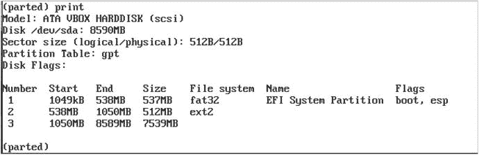
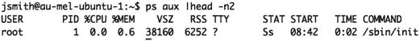
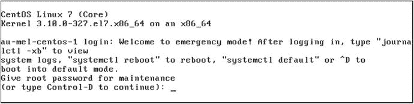
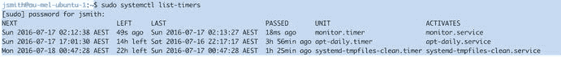

# 6.启动和服务

By Dennis Matotek

在前几章中，您已经学习了如何安装 Linux 主机，探索了一些基本的 Linux 概念，并了解了用户和组的概念。这一章将更深入地探究你的 Linux 主机的工作方式，并检查它在“引擎盖下”的运行方式

在这一章中，我们将看看当你的主机启动时会发生什么。我们将逐步完成该过程，并向您展示如何在各种模式下启动您的主机，以及如何配置和修改启动过程。为了演示所有这些，我们将带您了解从您打开主机电源到登录提示符的整个启动过程。

我们还将带您超越引导过程，看看您的主机如何启动和停止应用程序、系统服务和其他进程。CentOS 和 Ubuntu 这两个发行版对这些服务的添加、删除、启动和停止的管理略有不同。我们将向您展示如何在每个发行版上管理这些服务，以及其中的细微差别。您将了解什么是服务，如何启动和停止服务，以及如何查看它们的状态。最后，我们将讨论如何让服务在您的主机启动或关闭时自动启动和停止。

## 当你的主机启动时会发生什么？

引导过程(boot 是 bootstrap 的缩写)通常涉及三个独立但相互联系的过程:BIOS(基本输入/输出系统)或 UEFI 统一可扩展固件接口)、引导加载程序和操作系统的加载。

1.  BIOS 或 UEFI 启动并检查您的硬件。
2.  引导加载程序允许您选择要加载的操作系统。
3.  最后，您的操作系统被加载和初始化。

这些步骤不是特定于 Linux 的；你会发现大多数操作系统执行相似的功能和步骤。

你会发现现代硬件将支持 UEFI。它是 BIOS 的替代品，旧系统将使用 BIOS。它们都执行类似的任务，我们将从 BIOS 开始向您解释它们。

### 打开电源

让我们更详细地看看当您引导您的主机时会发生什么。您可能已经注意到，当您打开主机时，通常会听到几声哔哔声和呼呼声，并看到前面板上和键盘上有一些闪烁的灯。这是主机启动的第一步，在运行 BIOS 的主机上，这个过程由主板上一个叫做 BIOS 的小芯片控制。

#### BIOS

BIOS 对连接到系统的不同硬件(如内存、硬盘、键盘和显卡)的可用性执行基本的系统检查或开机自检(POST)操作。根据您的 BIOS，您可以更改不同的设置，但我们会让您在闲暇时进行调查。

BIOS 还将轮询其他硬件，如硬盘控制器，并启动它们的板载芯片。根据您的硬件，您可能会看到 BIOS 屏幕，后面是控制器找到的设备的信息。您可以选择通过按下某个键序列(通常在硬件启动时显示在屏幕上)来配置控制器或其他硬件。此菜单使您能够操作主机的配置；例如，它允许您在硬盘控制器上设置 RAID(廉价磁盘冗余阵列)或解决现有硬件配置的问题。

Caution

更改某些配置可能会有危险；例如，错误地更改 RAID 配置可能会破坏您的数据，因此请谨慎使用这些菜单。

BIOS 还允许您更改主机的引导源。引导源是主机查找操作系统的介质(如硬盘)。启动顺序设置允许您从多个来源之一启动:硬盘驱动器、CD/DVD，甚至 USB 闪存盘。默认情况下，您的主机通常会尝试从连接的硬盘启动，如果配置了硬盘，还会寻找 CD/DVD 驱动器或 USB 闪存盘等替代设备。

每个主板制造商都有不同的方式进入启动源菜单，例如，按 Esc、Del 或功能键，如 F1、F2 或 F10。通常屏幕上会显示一条消息，指示要按的键。从这里通常会显示一个菜单，您可以选择您想要的引导顺序。

#### 统一可扩展固件接口

更多最新的主板将支持 UEFI。当你用 UEFI 启动你的主机时，你会发现和 BIOS 相比差别很小；灯光会闪烁，东西会旋转。预计会比 BIOS 快一点。然而，幕后的事情却完全不同。

创建 UEFI 是为了克服 BIOS 的一些实际限制。BIOS 运行在 16 位处理器上；UEFI 可以在现代处理器上运行。BIOS 被限制在 RAM 中；UEFI 可以在任意多的 RAM 中运行。BIOS 从硬盘的一小部分(主引导记录，或 MBR)中读取数据来加载操作系统。UEFI 改为从安装时创建的特殊 FAT32 分区读取，并且不限于 512 字节。此外，UEFI 要求磁盘上的分区表是 GPT (GUID 分区表)，这意味着我们可以启动超过 2tb 大小的磁盘。都说 UEFI 比老 BIOS 更像现代操作系统；在鼠标和键盘的支持下，它甚至可以运行更好的图形界面。

恶意软件可以加载到系统上的方式之一是通过引导加载程序。UEFI 提供了“安全引导”,旨在通过在加载之前使用公钥/私钥验证签名的引导加载程序和硬件来防止这种情况。大多数现代 64 位发行版应该支持安全引导，但这仍然是相对较新的，在安全引导下，您可能会遇到一些硬件问题。在这种情况下，您可以向发行版提交错误报告，并通过 UEFI 配置屏幕禁用安全引导。

最后，目前并不强制要求您使用 UEFI。BIOS 在大多数主板上仍然是“传统”的，并且已经过广泛的测试和支持。但是，在下列情况下，这是强制性的；您在已经运行 UEFI 的系统上运行双引导，并且想要访问大于 2TiB 的磁盘。BIOS 和 UEFI 的目的都是准备好您的硬件，并找到引导加载程序来加载您的操作系统。

More on Disks

在前面的章节中，我们已经讨论了磁盘分区，并且说磁盘就像一个蛋糕，你可以把它分成小块，但是这是怎么做到的呢？当你分割你的磁盘时，你在磁盘上创建了一个叫做分区表的表。分区表通常位于磁盘的开头，它告诉计算机磁盘是如何布局的。也就是说，有多少磁盘已经分配给了`'/boot'`分区，预计有多少是逻辑卷管理(LVM)等等。

上面我们谈到了 MBR 和 GPT，这是两种类型的分区表。分区表保存有关块地址的信息(以 512 字节或 4KB 磁盘为单位)。MBR 只能容纳 2tb 的地址，而 GPT 可以容纳 8-9ZiB。


图 6-1。

Your hard disk

磁盘要么在开头有一个 MBR(前 512 个字节),要么有 GPT。如果它有 MBR，分区表会在磁盘的前 446 个字节之后写入。分区表的大小是 64 字节，后面是 MBR 引导签名(2 字节)。直到第一个分区的剩余空间通常称为 MBR 间隙，其大小会有所不同，因为大多数分区器会将分区的开头与第一个 1MB 对齐。

另一方面，GPT 的地址空间为 16，384 字节，最多可以容纳 128 个分区。GPT 会在磁盘末端制作一份自身副本，以备损坏时恢复。除了分区表之外，其余的磁盘可以按照您认为合适的方式进行划分。有关更多详细信息，请参见以下内容:

*   [T2`https://en.wikipedia.org/wiki/Master_boot_record`](https://en.wikipedia.org/wiki/Master_boot_record)
*   [T2`https://en.wikipedia.org/wiki/GUID_Partition_Table`](https://en.wikipedia.org/wiki/GUID_Partition_Table)

### 引导装载程序

#### 带 BIOS 的引导加载程序

一旦您的主机加载了所有检查过的连接到主板的所有东西，并设置了低级系统设置，它就可以启动您的操作系统了。BIOS 和 UEFI 都不知道你正在引导的操作系统，但是它知道如何运行你的发行版提供的代码。这个代码被称为引导加载程序，它需要在您引导的磁盘上的正确位置。

Note

严格来说，UEFI“对你的操作系统一无所知”是不正确的。它实际上确实知道一些，但主要的一点是它不是你的操作系统，而是硬件的底层接口。

运行 BIOS 的主机使用引导源设置来指定在哪里寻找引导过程的下一阶段:引导加载程序。BIOS 使用硬盘上的特殊部分，即主引导记录。

当我们安装操作系统时，我们安装了一个名为 GRUB2 的引导加载程序。它代表 GRand Unified Bootloader (2 ),它的工作是启动自己，然后找到、加载并移交给你的操作系统。它分两个阶段完成，第一阶段的目的是加载第二阶段。我们之前讨论过 MBR，并且说过在分区表之前，磁盘的起始处有 446 个字节。这是您的操作系统的引导加载程序代码的第一阶段将被存储的地方，BIOS 将尝试执行它在那里找到的代码。对于 Linux，这是一个名为`boot.img`的文件。

当 BIOS 执行`boot.img`时，它会找到并运行一个名为`core.img`的文件。该文件通常安装在 MBR 间隙中，即 MBR 和磁盘上第一个分区之间的空间。`core.img`的工作是访问`/boot/grub`并加载它在那里找到的模块。`core.img`将加载菜单，并有能力加载目标操作系统。

#### 使用 UEFI 的引导加载程序

如果您使用 UEFI 系统，引导过程会有所不同。UEFI 可以读取 GPT 分区表，并且可以在 EFI 系统分区的`/EFI/`目录中找到并执行引导加载程序代码。与 BIOS 不同，UEFI 有自己的分区，引导加载程序和模块可以安装到其中。

在图 [6-2](#Fig2) 中，我们可以看到在安装之后，我们在驱动器`/dev/sda`上创建了三个分区。第一个是我们的 EFI 系统分区，它是一个 FAT32 文件系统，大小为 537MB。它有 boot 和 esp 标志(都意味着它是一个引导分区)。另外要注意的是，分区表是 GPT。



图 6-2。

EFI partition on Ubuntu

因此，当 UEFI 准备运行引导加载程序时，它会读取这个分区，寻找引导加载程序。在这种情况下，我们的 Ubuntu 主机会找到`/EFI/ubuntu/grubx64.efi`。引导加载程序的初始部分将找到包含 GRUB2 软件的`'/boot'`分区，并从 GRUB2 中加载`core.efi`并调出 grub 2 菜单。

有关 UEFI 和 UEFI Shell(可用于管理 UEFI 的交互式 Shell)的更多信息，请参见以下内容:

*   [T2`https://help.ubuntu.com/community/UEFI`](https://help.ubuntu.com/community/UEFI)
*   [T2`https://fedoraproject.org/wiki/Unified_Extensible_Firmware_Interface`](https://fedoraproject.org/wiki/Unified_Extensible_Firmware_Interface)
*   [T2`https://www.happyassassin.net/2014/01/25/uefi-boot-how-does-that-actually-work-then/`](https://www.happyassassin.net/2014/01/25/uefi-boot-how-does-that-actually-work-then/)
*   [T2`https://software.intel.com/en-us/articles/uefi-shell`](https://software.intel.com/en-us/articles/uefi-shell)

在没有任何干预的情况下，GRUB2 将在短暂的倒计时后启动默认内核。按任意键将停止倒计时，向您显示更详细的可用选项菜单，并让您有机会编辑您的引导配置。在“使用 GRUB2 菜单”一节的后面，我们将解释这些选项以及如何操作它们。

在选择了您希望引导到的内核之后(或者在超时之后等待默认内核被加载)，GRUB2 现在将找到内核二进制文件(`vmlinuz-<release-number>`)，然后将一个名为`initrd.img`的特殊文件加载到内存中。这个文件包含您的内核需要加载的驱动程序，以利用您的主机的硬件。

### 启动操作系统

加载`initrd.img`后，GRUB2 完成并将控制权移交给内核，内核通过初始化硬件(包括硬盘)继续引导过程。你的操作系统被启动，一个叫做`systemd, upstart`或`init`的特殊程序被调用，它启动你的服务并使你的主机活跃起来。我们将在本章的后面看一下`all three of these system initializers`以及如何管理服务，但是首先，更多关于引导加载程序。

## 了解 GRUB2 引导加载程序

因此，现在让我们深入研究什么是引导加载程序，它做什么。我们还将了解一下如何配置它。我们不打算涵盖引导加载程序的每一个细节，因为你很少需要改变它，并且对它的大多数改变是自动发生的，例如，当你安装一个新的内核包时。但是您应该了解它的作用以及它在主机引导过程中的位置。

一些历史；在 Linux 世界中，有两种主要的引导加载程序:LILO 和 GRUB。几年前，GRUB 引导加载程序成为 Red Hat 和 Ubuntu 的默认设置。在这里，我们将专注于 GRUB 的最新版本 GRUB2。GRUB2 是一个强大的多重引导加载程序。多重引导加载程序可以使您的主机引导到许多不同的操作系统。与 Microsoft Windows 或 Mac OS X(以及它们的引导加载器工具—分别为 NTLDR 和 Boot Camp)不同，GRUB2 允许您在一个硬件上引导多个版本的 Linux、Microsoft Windows 和 Mac OS X。这并不意味着您可以像使用虚拟机技术一样同时运行它们，但是您可以在启动时通过从 GRUB2 菜单中选择它们来单独启动它们。

Note

LILO 是一个遗留的引导加载程序，在许多旧版本的 Linux 发行版中用作默认的引导加载程序。今天很少看到它，2015 年它的开发停止了。关于 LILO 引导加载程序的信息，请参见 [`http://tldp.org/`](http://tldp.org/) `HOWTO/LILO.html`。

那么 GRUB2 是如何工作的呢？GRUB2 的核心使用四项来引导系统:内核文件、驱动器名、内核文件所在的分区号，以及可选的初始 RAM 磁盘。

GRUB2 能够以两种方式引导。一种是直接找到并加载所需的内核，这是大多数 Linux 发行版的引导方式。GRUB2 还支持一种引导的方法，叫做链式加载；使用这种方法，GRUB2 加载另一个引导加载程序，例如用于 Microsoft Windows 的加载程序，然后加载所需的操作系统内核。这允许 GRUB2 使用自己的引导加载程序来引导其他操作系统。

### 使用 GRUB2 菜单

当您的主机启动时，它将启动到默认内核(或操作系统)，或者您可以覆盖它并显示 GRUB2 菜单。一旦菜单显示出来，您将看到一个引导选项列表，您可以使用键盘上的上下箭头来选择您希望引导的内核。您还可以编辑 GRUB 菜单，并在引导到您选择的内核之前更改参数、命令和自变量。

例如，我们可以选择引导到所谓的单用户模式或维护模式。这种特殊的模式在您的主机出现问题时使用，它将对主机的访问限制为根用户:通常在系统控制台。这种模式的功能与 Microsoft Windows 恢复控制台非常相似，允许您使用磁盘和文件等资源，而不必担心冲突或其他用户操纵主机。现在让我们来看看如何引导到单用户模式。

首先，这在 CentOS 和 Ubuntu 之间略有不同。两者都显示了类似的 GRUB2 引导菜单，允许你用箭头键选择你想运行的内核。CentOS 提供了我们之前讨论过的两个菜单项，一个是内核，另一个被描述为救援内核。在 Ubuntu 上，你会看到一个名为高级选项的子菜单项。您可以使用箭头键浏览以查看恢复模式内核。

在这个练习中，我们将使用 Ubuntu 主机的普通内核。按 e 键编辑突出显示的内核。您将看到该内核的配置，比如它的位置和参数，如图 [6-3](#Fig3) 所示。


图 6-3。

Booting to single-user mode , or maintenance mode , using the GRUB2 menu

您将在这里看到您在`grub.cfg`菜单中看到的详细信息。在这个特定的例子中，我们感兴趣的线是`linux /vmlinuz-4.4.0-15-generic.efi.signed…`线。使用箭头键导航到该行的末尾。要引导进入单用户模式，请在该行末尾添加单词'`single’`(不带引号)。在图 [6-3](#Fig3) 中，你可以看到我们已经在线尾添加了`single`字样。在图 [6-3](#Fig3) 的底部，你可以看到我们现在可以输入 Ctrl-x 或 F10 以此设置启动，或者输入 Ctrl-c 以获得命令行或 ESC 以放弃这些更改并返回主菜单。

我们可以选择 Ctrl-x，引导进入单用户模式。我们首先被要求输入密码来解密我们的硬盘。然后，根据您的发行版，您将得到一个要求 root 用户(仅 CentOS)的维护密码提示，或者您可以点击 enter 并得到一个 shell 提示(参见图 [6-4](#Fig4) )。


图 6-4。

Maintenance mode

现在我们有了 shell 提示符，我们可以着手修复我们系统中可能存在的任何问题。不过，对内核行的这些更改不是永久的，下次主机启动时，它将正常启动。使用 GRUB2 菜单，您可以操作几乎所有可用的引导运行时配置设置。

需要注意的是，我们提供上面的内容作为示例，它显然有一些相关的安全问题——如果您在引导时可以访问控制台，这将为您的主机提供非常强大的访问权限。我们接下来会帮助解决这个问题。还有其他的恢复方法，我们将在第 [9](09.html) 章中进一步讨论。同时，以下是很好的信息来源:

*   [T2`https://access.redhat.com/documentation/en-US/Red_Hat_Enterprise_Linux/7/html/System_Administrators_Guide/sec-Terminal_Menu_Editing_During_Boot.html`](https://access.redhat.com/documentation/en-US/Red_Hat_Enterprise_Linux/7/html/System_Administrators_Guide/sec-Terminal_Menu_Editing_During_Boot.html)
*   [T2`https://wiki.ubuntu.com/RecoveryMode`](https://wiki.ubuntu.com/RecoveryMode)

### 配置 GRUB2

GRUB2 引导加载程序是高度可配置的，它的配置包含在`grub.conf`配置文件中。GRUB2 使`grub.cfg`比它更简单的前身更加模块化。您需要对 GRUB2 配置进行许多更改的机会很小，但却是可能的。

GRUB2 文件位于不同发行版的不同位置。在 CentOS 等基于 Red Hat 的主机上，可以在`/boot/grub2/grub.cfg`找到它们(文件通常象征性地链接到`/etc/grub.conf`)。在 Ubuntu 和 Debian 主机上，这些文件可以在`/boot/grub/grub.cfg`找到。

GRUB2 中的`grub.cfg`文件由一系列配置文件组成。在 Ubuntu 和 CentOS 主机上，您都可以在目录`/etc/grub.d`中找到配置文件。在该目录中，您会看到一个按编号排序的文件列表。在清单 [6-1](#Par60) 中，您可以看到 CentOS 7 主机上的文件。

```sh
total 72
-rwxr-xr-x. 1 root root  8702  Nov 25 02:49  00_header
-rwxr-xr-x. 1 root root   992   May   4  2015  00_tuned
-rwxr-xr-x. 1 root root   230   Nov 25 02:49  01_users
-rwxr-xr-x. 1 root root 10232 Nov 25 02:49  10_linux
-rwxr-xr-x. 1 root root 10275 Nov 25 02:49  20_linux_xen
-rwxr-xr-x. 1 root root  2559  Nov 25 02:49  20_ppc_terminfo
-rwxr-xr-x. 1 root root 11169 Nov 25 02:49  30_os-prober
-rwxr-xr-x. 1 root root   214   Nov 25 02:49  40_custom
-rwxr-xr-x. 1 root root   216   Nov 25 02:49  41_custom
-rw-r--r--.   1 root root   483   Nov 25 02:49  README
Listing 6-1.
ls –la /etc/grub.d

```

清单 [6-1](#Par60) 显示了组成一个`grub.cf` g 文件的文件。在这种情况下，这些文件通过`grub2-mkconfig`命令从`00_header`读入`41_custom`。您通常不需要了解这些文件，因为您很少需要定期接触它们。您可能感兴趣的文件是`01_users`和`40_custom`文件。如果设置了引导加载程序密码，则`01_users`文件会加载该密码。`40_custom`文件是您可能希望添加定制 GRUB2 配置的地方。

Tip

在 Linux 配置文件中，以#符号为前缀的行通常表示注释，在处理配置文件时会跳过这些行。

GRUB2 配置文件通过`grub2-mkconfig`命令生成。它有一个参数，即您希望在哪里创建文件的`–o`或`--output`选项。您现在可以创建自己的`grub.cfg`文件了。它将探测您的系统，运行您的配置文件，并输出一个您可以查看的文件。当然，您不必用这个文件覆盖您当前的`grub.cfg`，所以我们将把输出更改为本地目录中的一个文件。

```sh
$ sudo grub2-mkconfig --output mygrub.cfg
Generating grub configuration file ...
Found linux image: /boot/vmlinuz-3.10.0-327.el7.x86_64
Found initrd image: /boot/initramfs-3.10.0-327.el7.x86_64.img
Found linux image: /boot/vmlinuz-0-rescue-65e567f18fe84907a6f1d8519e921c97
Found initrd image: /boot/initramfs-0-rescue-65e567f18fe84907a6f1d8519e921c97.img
done
Listing 6-2.Creating a grub.cfg

```

在清单 [6-2](#Par64) 中，您可以看到我们使用了`sudo`命令来提升我们执行`grub2-mkconfig`命令的权限。该命令遍历`/etc/grub.d`目录中的文件，并按编号顺序执行。控制台的命令输出显示，is 已经找到了两个内核(vmlinuz ),其中一个是“救援”内核。`grub2-mkconfig`命令已经探测了我们的系统，并通过`/etc/grub.d/30_os-prober`脚本找到了它们。

查看已经生成的`mygrub.cfg`文件(使用`$ less mygrub.cfg`)，您将在`/etc/grub.d`中看到所有这些文件的输出。我们将集中讨论启动操作系统的部分，从下面一行开始:

```sh
### BEGIN /etc/grub.d/10_linux ###

```

在开始行下面是配置我们菜单项的 menuentry。

```sh
menuentry 'CentOS Linux (3.10.0-327.el7.x86_64) 7 (Core)' --class centos --class gnu-linux --class gnu --class os --unrestricted $menuentry_id_option 'gnulinux-3.10.0-327.el7.x86_64-advanced-f60589f6-4d39-4c5b-8ac6-b1252f28f323' {
  ....
}
Listing 6-3.menuentry in the grub.cfg

```

这看起来已经很难消化了，我们已经把清单 [6-3](#Par69) 减少到了第一行。以`menuentry, this`开头，告诉 grub 我们有一个新的菜单项要列出来。`CentOS Linux (...) 7 (Core)`给出了菜单列表中显示的名称。其他信息由`--class`参数提供，用于显示某些主题(如闪屏等)。

`--unrestricted`选项用于允许任何用户在引导时通过控制台菜单运行该条目。这可以通过`--users`选项进行更改，在这里您可以列出能够运行该条目的用户(注意，任何被列为`superuser`的用户仍然可以访问)。当然，这意味着任何移除了`--unrestricted`的条目都不会自动引导，需要干预。GRUB2 文档指出，这并不是真正的最佳安全形式，因为它需要在重启时访问控制台，但在 kiosk 类型的安装中可以考虑。我们将在“保护您的引导加载程序”一节中详细讨论这个问题和超级用户

在清单 [6-3](#Par69) 中，我们省略了花括号{ }之间的代码。现在让我们看看清单 [6-4](#Par73) 中的代码。

```sh
menuentry ... {
        load_video
        set gfxpayload=keep
        insmod gzio
        insmod part_msdos
        insmod xfs
        set root='hd0,msdos1'
        if [ x$feature_platform_search_hint = xy ]; then
          search --no-floppy --fs-uuid --set=root --hint-bios=hd0,msdos1 --hint-efi=hd0,msdos1 --hint-baremetal=ahci0,msdos1 --hint='hd0,msdos1'  85932bb0-c5fe-431f-b129-93c567e4f76f
        else
          search --no-floppy --fs-uuid --set=root 85932bb0-c5fe-431f-b129-93c567e4f76f
        fi
        linux16 /vmlinuz-3.10.0-327.el7.x86_64 root=/dev/mapper/centos-root ro crashkernel=auto rd.lvm.lv=centos/root rd.lvm.lv=centos/swap rhgb quiet
        initrd16 /initramfs-3.10.0-327.el7.x86_64.img
}
Listing 6-4.Grub Boot Menu Code

```

在 menuentry 代码的花括号内，前几行代码安装了各种模块。例如，第一行，`load_video`调用`grub.cfg`脚本中的一个函数，为闪屏插入各种视频模块。CentOS 7 主机上的模块可以在`/boot/grub/i386-pc/`中找到，并通过您在后续行中看到的`insmod`命令加载。您在这里看到的三行 insmod 正在加载压缩和文件系统模块。

`set root='hd0,msdos1'`是我们如何为 GRUB2 设置根设备。GRUB2 使用此设置来帮助查找 GRUB2 需要的文件。这意味着根设备在硬盘驱动器`(hd)`上，并且是第一个硬盘驱动器`(hd0)`。`'msdos'`是根设备的文件系统，最后的“1”是`hd0`上的分区号。如果你从一个 USB 驱动器启动，你可能希望它看起来像`'usb0,msdos1'`。

Note

Linux 操作系统中的编号一般从 0 开始计数，而不是从 1 开始计数。然而，就 GRUB2 而言，磁盘上的第一个分区是分区 1。第一个磁盘/设备从 0 开始编号。

接下来在清单 [6-4](#Par73) 中，我们看到一个 if…fi 条件语句，里面有一个搜索命令。根据`‘$feature_platform_search_hint’`是否设置为 y，搜索命令会有所不同。此处发生的情况是，搜索命令通过 UUID(通用唯一标识符)查找设备。这用于再次设置 GRUB2 的根设备，以便它可以找到我们将要加载的 Linux 内核。

在清单 [6-4](#Par73) 中，我们终于加载了我们的 Linux 内核。linux16 行的第一部分说我们将使用 16 位模式加载内核(16 位模式用于解决视频模式的某些问题)。下一部分是 Linux 内核本身，`/vmlinuz-3.10.0-327.el7.x86_64`。您将在`/boot`目录中找到这个文件。接下来，我们将选项传递给内核。我们通过`root=/dev/mapper/centos-root`来提供到'/'分区的路径。最初，我们将内核加载为‘T3’或只读。`crashkernel=auto`选项是 kdump 内核的一个设置，表示为它保留的内存量。接下来的两个选项告诉内核它需要加载两个 LVM 逻辑卷:`centos/root`和`centos/swap`。最后，我们可以看到我们加载了 Red Hat Graphical Boot (rhgb)，这是一个比文本更好的引导体验，并且我们设置了`quiet`选项来抑制引导期间的噪声输出。

最后，清单 [6-4](#Par73) 中我们关心的最后一行是加载内核 initrd。initrd 是一个临时根文件系统，引导过程使用它首先加载所需的可执行文件和驱动程序，然后挂载系统的“真正的”根('/')文件系统。它仅在启动时使用，并且一旦装载了真正的文件系统，它就会被卸载。

我们只向您展示了一个 GRUB2 菜单，并且只来自 CentOS 主机。对于 Ubuntu 主机来说，菜单项会稍有不同。通常情况下，您会看到每个已安装的内核至少有两个菜单项，其中一个是用于系统恢复的“救援”内核。它是内核的一个副本，以防在 CentOS 上被破坏，没有特殊的内核选项。Ubuntu 是不同的，因为它通过了`recovery`和`nomodeset`内核选项。我们稍后会详细讨论这些。

Note

你可以在 [`http://www.gnu.org/software/grub/manual/grub.html`](http://www.gnu.org/software/grub/manual/grub.html) 和 [`https://wiki.archlinux.org/index.php/kernel_parameters`](https://wiki.archlinux.org/index.php/kernel_parameters) 找到更多关于定义内核和内核选项的信息。你也可以通过`info grub`命令查找信息。

Managing Your Kernel

不是所有的内核都需要一个`initrd`文件。例如，您自己编译的包含系统所需的所有模块的内核不应该需要一个`initrd`文件。

例如，如果内核的后续版本支持您需要的一些新硬件或功能，您可能希望编译自己的内核。编译你自己的内核是一个很好的练习，只是为了看看选项是什么以及如何工作。

我们通常建议您坚持使用您的发行版提供的普通内核，并且只编译您自己的内核以获得乐趣，或者如果您确实需要某些特定的功能。管理“手工制作”的内核对于修补和更新来说可能是一个负担，有时会留给您一个无法更新的系统。

当你更新你的内核时，你需要重启以获得关键补丁。在 Linux 内核的版本 4 中，自 2015 年以来，一直在致力于一种修补内核的方法，使其不再需要重新启动，即使是关键的补丁。它是 SUSE 和 Red Hat 的工作成果，灵感来自 Oracle 的原创作品。在撰写本文时，它仍然是新的，支持代码仍然需要一些工作。

要获得最新内核的副本和其他信息，您可以到这里:

*   [T2`www.kernel.org/`](http://www.kernel.org/)
*   [T2`http://kernelnewbies.org/KernelBuild`](http://kernelnewbies.org/KernelBuild)

推荐的更新内核的方法是通过发行库。然而，这也是支持诸如 RHEL (Red Hat Enterprise Linux)、Oracle Linux、Canonical Enterprise Support 等发行版的巨大优势所在。如果你需要紧急的内核补丁，他们会经常为你报告的问题更新和发布内核补丁。等待非商业发行版发布您感兴趣的补丁可能会失败。

### 保护您的引导加载程序

拥有这样一个通用且可配置的引导加载程序有其缺点。我们提到的其中之一是安全。任何怀有恶意的人都可以在引导时修改不安全的引导加载程序。许多小型办公室会将服务器放在两张桌子上或下面，而不是锁在计算机房里，因此这些服务器很容易受到这种攻击。我们强烈建议您考虑在您的引导加载程序上设置一个密码，并将它与您的其他密码一起存储在一个非常安全的地方。

Caution

同样，你应该把你的密码放在一个安全的地方，比如一个保险箱或者其他安全的上锁的地方。有时，将它保存在异地的某个地方也是很好的(就像对异地备份一样)，这样，如果您的站点发生问题，您不仅能够恢复您的数据，还可以随时使用正确的密码来访问您的主机。您还应该备份所有密码，并告诉您公司中信任的人在紧急情况下可以在哪里找到这些密码。

幸运的是，GRUB2 提供了为引导加载程序设置密码的能力，因此对预先配置的引导过程的任何更改都需要用户输入密码。CentOS 主机提供了一些工具来简化这一过程，我们将在本练习中探索这种分布。首先，我们发出以下命令:

```sh
$ sudo grub2-setpassword

```

这将要求您输入密码并进行确认，并且只会为 root 用户创建一个密码。这个命令实际上是创建一个文件`/boot/grub2/user.cfg`。该文件的内容如下所示:

```sh
GRUB2_PASSWORD=grub.pbkdf2.sha512.10000.00E574C[...]DDF512CC090A9B[...]CCEA3B

```

既然文件已经创建，当您的主机重新启动时，现在将执行`/boot/grub2/grub.cfg`文件中的代码:

```sh
### BEGIN /etc/grub.d/01_users ###
if [ -f ${prefix}/user.cfg ]; then
  source ${prefix}/user.cfg
  if [ -n ${GRUB2_PASSWORD} ]; then
    set superusers="root"
    export superusers
    password_pbkdf2 root ${GRUB2_PASSWORD}
  fi
fi
### END /etc/grub.d/01_users ###
Listing 6-5.Adding Root User to grub.cfg

```

清单 [6-5](#Par97) 中代码的意思是，如果`user.cfg`文件存在，那么我们将“获取”内容。如果声明了一个`$GRUB2_PASSWORD`变量，那么我们将把`root`添加到超级用户列表中，这将其他用户锁定在`GRUB2`命令行之外。最后，`password_pbkdf2`是一个 GRUB2 命令，它将用户与密码相关联。我们现在需要运行`grub2-mkconfig –o /boot/grub2/grub.cfg`来设置超级用户 root 密码。

当您的主机下次启动时，您会注意到，如果您在 GRUB2 阶段中断启动过程，您将能够使用`--unrestricted` menuentry 选项选择一个内核。但是，如果您想要编辑任何 GRUB2 配置详细信息，您需要按 e 键输入密码。然后，您将能够正常编辑 GRUB2 配置。

要删除密码，请删除`user.cfg`文件。请记住，GRUB2 文档建议不要这样做，除非您的主机是公开的。我们建议你根据自己的情况做出最好的判断。

请记住，Ubuntu 并没有提供这些现成的工具，但是您可以遵循该发行版的类似过程。有关 Ubuntu 的具体指南，请参见 [`https://help.ubuntu.com/community/Grub2/Passwords`](https://help.ubuntu.com/community/Grub2/Passwords) 。

## 开机后会发生什么？

所以你的主机找到了你的内核并启动了它。您的操作系统现在开始加载，您的硬件初始化，磁盘准备就绪，IP(互联网协议)地址分配，以及各种其他任务的执行。为此，Linux 运行一个程序，其任务是启动操作系统及其服务。这个程序是第一个在您的系统上启动的程序，并且一直运行到系统关闭；不出所料，这个进程的进程 id (PID)将为 1。初始化程序，或称“init”，将通过找出需要启动的服务以及它们所依赖的东西，使系统达到一个已知的“状态”。它通过遍历文件系统上的一系列文件并读取它们的指令来实现这一点。

目前 Linux 正处于一个过渡阶段。直到最近，至少有三种不同的程序处理系统初始化。这些是旧的 SysV Init 程序，Ubuntu 的 Upstart 程序，或者更新的 systd。

Upstart 是 Ubuntu 试图替换旧的 SysV Init 初始化器。因为它与 SysV 兼容，所以它也被其他发行版用作初始值设定项；然而，没有多少完全实现暴发户。它只是被用作一个更好的“初始化”基于 Red Hat 的主机已经完全实现了 Systemd，基于 Debian 的系统，比如 Ubuntu，正在从 Upstart 和 SysV Init 过渡到 Systemd。

Systemd 是一种较新的系统初始化方法，可以在 CentOS 上默认使用(或者说是本地运行 systemd ),您可以在图 [6-5](#Fig5) 中看到 systemd 是 PID 1。另一方面，据说 Ubuntu“模仿”SysV Init。它通过使用 SysV initd 脚本来初始化许多使用 systd 包提供的兼容性脚本的服务来做到这一点。



图 6-6。

PID 1 onUbuntu


图 6-5。

PID 1 on CentOS

在 Ubuntu 上，`/sbin/init`程序是 PID 1。PID 为 1 的 init 程序来自 systemd-sysv 包，实际上链接到 systemd 二进制文件或程序。Ubuntu 目前支持所有三种 init 类型，同时正在过渡到原生运行 Systemd。

这两个发行版都安装了 systd-sysv 包，其中包含用于运行 SysVInit 风格的 initd 脚本的兼容性实用程序。它旨在替代 SysVInit，但并不是 100%兼容。

让我们看看如何管理 Systemd 本机实现。我们还将简要讨论 Upstart 和较老的 SysV init。

Note

init 程序有很长的历史，解决如何启动系统的问题的流行和不受欢迎的尝试都有。为了更好地观察它们，请参见 [`http://blog.darknedgy.net/technology/2015/09/05/0/`](http://blog.darknedgy.net/technology/2015/09/05/0/) 。

### 理解系统

正如我们已经提到的，Systemd 是最新的系统初始化器，在许多现代发行版中都有使用。systd 是 SysV Init 和 Upstart 的替代品。有人批评它违背了 Unix 的哲学(做一件事，把它做好)，但是它在以下几个方面(或多或少)比它的前辈提供了许多优势:

*   它是事件驱动的。这意味着它可以响应系统事件(例如插入新硬件、网络端口上开始的流量)
*   并发和并行引导处理
*   它可以重生过程
*   事件记录
*   通过内核的 CGroups 跟踪进程

对于那些已经熟悉 SysV 的人来说，systd 没有像 SysV 那样的运行级别，而是有“目标”。目标用于将服务依赖项组合在一起。systemd 中有一些常见的目标，如多用户、重启和救援。就像在运行级别中一样，我们可以有不同的目标，将我们带到特定的和离散的状态。例如，如果我们希望系统处于每个人都可以登录并使用服务的状态，我们将使用目标多用户。在这种情况下，我们希望 sshd、日志和网络可用。这些被认为是多用户目标的“需求”。

还记得图 [6-3](#Fig3) 中我们向您展示了如何从 GRUB2 菜单进入“维护”模式吗？我们在启动 Linux 内核的那一行的末尾键入单词“single”。嗯，使用 Systemd，我们也可以通过声明我们希望启动的目标来做同样的事情。

```sh
linux16 /vmlinuz-3.10.0-327.el7.x86_64 root=/dev/mapper/centos-root ro crashkernel=auto rd.lvm.lv=centos/root rd.lvm.lv=centos/swap rhgb quiet systemd.unit=rescue.target
Listing 6-6.Using Systemd Targets to Boot to Rescue Mode

```

从清单 [6-6](#Par118) 中，您可能会意识到我们是在 CentOS 服务器上；我们可以在 Ubuntu 服务器上做同样的事情。您可以看到，我们已经在该行末尾发出了`systemd.unit=rescue.target`。我们告诉内核，当它运行 systemd 时，我们应该到达救援目标。

Systemd 使用一组“单元”文件来管理系统上的服务。当 systemd 启动时，它通过遍历以下加载路径来查找所需的单元文件:

表 6-1。

Systemd Load Path

<colgroup><col> <col></colgroup> 
| 小路 | 目的 |
| --- | --- |
| /etc/systemd/system | 本地化的配置文件 |
| /run/systemd/system | 运行时单元文件 |
| /usr/lib/systemd/system | 已安装软件包的单元文件 |

因为我们使用了`system.unit=rescue.target`参数，当系统进程启动时，它将按照优先顺序在这些目录中查找`rescue.target`文件，然后是`/etc/systemd/system, then the /run/systemd/system`目录，最后是`/usr/lib/systemd/system`目录。`/etc/systemd/system`和`/run/systemd/system`目录被称为“插入”目录，systemd 将在那里搜索单元和`*.conf`文件。目标文件将类似于下面的`rescue.target`。

```sh
[Unit]
Description=Rescue Mode
Documentation=man:systemd.special(7)
Requires=sysinit.target rescue.service
After=sysinit.target rescue.service
AllowIsolate=yes

[Install]
Alias=kbrequest.target

Listing 6-7.The rescue.target File

```

在清单 [6-7](#Par122) 中，我们删除了系统进程忽略的以“#”开头的注释。选项区分大小写。在分解这个文件时，您可以看到它有两个部分，用方括号([…])表示。Systemd 单元文件至少需要[Unit]和[Install]部分。您可以选择包含一个[服务]部分，我们将很快对此进行讨论。

[Unit]部分有一个描述和文档设置，它们是不言自明的。在清单 [6-7](#Par122) 中，我们可以看到 rescue 目标需要 sysinit.target 和 rescue . service。Requires 不提供排序，但告诉 systemd 这些服务也应该执行。如果所需的目标或服务之一失败，该单元也将被停用。

通过添加像 After 这样的选项来提供对目标或服务的订购支持。`rescue.unit`现在应该在`sysinit.target`和`rescue.service`之后开始。常见的模式是在所需选项中看到相同的服务和目标，在之后选项中也列出了这些服务和目标。

AllowIsolate 选项是一个由`systemctl isolate`命令读取的布尔值。systemctl 命令的 isolate 参数本质上类似于 SysV 运行级别。您可以使用它将您的系统置于特定的“状态”，因此要启动您的图形环境，您可以选择运行`systemctl isolate graphical.target`。因此，AllowIsolate 默认设置为“false/no ”,因为不是每个目标文件都提供稳定的系统状态。

当装置启用或禁用时，systemctl 工具使用[Install]部分。systemctl 工具是用于管理 systemd 的实用工具。这里的 Alias 选项指向`kbrequest.target`，它是一个特殊的 systemd 单元，每当在控制台上按下 Alt+ArrowUp 时就会启动。看一下图 [6-7](#Fig7) 来看看它是如何工作的。


图 6-7。

Using systemctl to enable the Alt-ArrowUp alias

在图 [6-7](#Fig7) 中你可以看到，当我们发出`$ sudo systemctl enable rescue.target`时，安装部分的别名选项意味着我们创建了一个从`kbrequest.target`到`rescue.target`的符号链接。现在，在控制台上，如果我们点击 Alt+向上箭头键，我们会得到如图 [6-8](#Fig8) 所示的结果。



图 6-8。

Entering rescue console from pressing the Alt+ArrowUp keys

让我们快速地看一下一个服务文件，它配置了我们如何管理 rsyslog 守护进程。Rsyslog 是 Linux 上的日志服务，我们将在第 [18 章](18.html)中深入探讨它。在清单 [6-8](#Par130) 中，我们显示了`rsyslog.service`文件的内容。

```sh
[Unit]
Description=System Logging Service
;Requires=syslog.socket

[Service]
Type=notify
EnvironmentFile=-/etc/sysconfig/rsyslog
ExecStart=/usr/sbin/rsyslogd -n $SYSLOGD_OPTIONS
Restart=on-failure
UMask=0066
StandardOutput=null

[Install]
WantedBy=multi-user.target
;Alias=syslog.service

Listing 6-8.The rsyslog.service systemd File

```

在这个文件中，我们有[Unit]和[Install]部分，就像我们以前看到的一样。值得注意的是，在这些部分中，您可以看到 Requires 和 Alias 选项上的分号。如果行以`#`或`;`开头，那么它们被认为是注释并被忽略。在清单 [6-8](#Par130) 中，我们看到有一个【服务】部分，我们用它来描述我们正在配置在我们系统上运行的服务。

所有[服务]部分都需要类型选项。它可以设置为“简单”、“分叉”、“一次性”、“dbus”、“通知”或“空闲”默认设置是“简单”对于 simple 类型，您期望由 ExecStart 选项运行的进程是主进程(即，它不派生子进程)。Notify 类似于 simple，但它会在完成启动后发送一条通知消息。一旦 Systemd 读取到此消息，它将启动其他单元。因为这是一个日志服务，所以在启动依赖于记录日志事件的其他单元之前，确保该服务启动并运行是有意义的。

环境文件是我们可以加载环境参数的地方。可以为 rsyslogd 设置许多可选参数，您可以将它们添加到`/etc/sysconfig/rsyslog`文件中。可以将`man rsyslogd`中的选项添加到文件中。

接下来我们有 ExecStart 选项。这是与任何参数一起执行的命令。这应该是守护进程的主进程，除非你要分叉这个进程(用 Type=fork)。

Restart 选项控制 systemd 如何监控服务并对任何问题做出反应。选项包括“否”、“成功时”、“失败时”、“异常时”、“监控时”、“中止时”或“总是”rsyslog 服务被设置为失败时重新启动，如果未设置，默认值为“否”。设置 on-failure 意味着当进程以非零退出代码退出、被信号终止、操作超时或触发监控超时时，systemd 将尝试重新启动服务。

UMask 设置由此进程创建的任何文件的权限。如果我们还记得在第 4 章中学到的内容，umask 是一个八位字节，用于设置文件和目录的权限。当应用它时，意味着我们给予由该进程创建的文件 0711 或 rwx-x-x 权限。这意味着该进程的所有者被给予对文件的读、写和执行权限，该组和其他每个人将只有执行权限。

[Service]部分的最后一个选项是 StandardOutput，它定义了文件描述符 1 或进程的标准输出应该连接到哪里。这些值是" inherit "、" null "、" tty "、" journal "、" syslog "、" kmsg "、" journal+console "、" syslog+console "、" kmsg+console "或" socket "。rsyslogd 服务被设置为 null，这是 Linux 上一个名为`/dev/null`的特殊文件。如果你向`/dev/null`写，你希望你的数据被黑掉或丢失。这意味着我们不关心这个服务在标准输出上的输出。

最后，如果您查看[Install]部分，您将看到 WantedBy=multi-user.target。该行指示 systemctl 命令在服务启用时在`/etc/systemd/system/multi-user.target.wants`目录中创建一个到`/lib/systemd/system/rsyslog.service`的符号链接，或者在服务禁用时删除该链接。稍后会有更多内容。

Systemd 单元文件很复杂，并且依赖于许多其他的依赖单元。systemd 单元还有数不清的选项和设置。如需进一步阅读，请参阅以下有用的链接:

*   [T2`https://access.redhat.com/videos/403833`](https://access.redhat.com/videos/403833)
*   [T2`www.freedesktop.org/wiki/Software/systemd/`](http://www.freedesktop.org/wiki/Software/systemd/)
*   [T2`www.freedesktop.org/software/systemd/man/systemd.html`](http://www.freedesktop.org/software/systemd/man/systemd.html)
*   [T2`https://access.redhat.com/documentation/en-US/Red_Hat_Enterprise_Linux/7/html/System_Administrators_Guide/chap-Managing_Services_with_systemd.html`](https://access.redhat.com/documentation/en-US/Red_Hat_Enterprise_Linux/7/html/System_Administrators_Guide/chap-Managing_Services_with_systemd.html)

一旦您的内核被转移到 systemd 进程，并使您的机器达到目标状态，您将需要知道如何与系统上运行的服务进行交互。我们将在查看 systemctl 命令时对此进行探讨。

### 新贵:Ubuntu 的 Init

Upstart 背后的想法是创建一个全面的`init`进程，可以用来代表 Linux 主机上的服务启动、停止、监控和响应事件。这是对 SysV Init 范式的改造和扩展；设计师没有直接替换 SysV Init，而是创建了 Upstart 来模拟 SysV Init，直到所有人都转换过来。

Upstart 下的`init`进程是一个基于事件的守护进程，它使用事件触发器来启动或停止进程。事件是可以通知`init`的状态变化。事件可以是添加外围设备，如插入 USB 记忆棒。然后内核可以通过发送事件通知来通知 init 这个动作。根据`init`控制下的作业定义，该事件反过来可以触发其他作业的启动或停止。

Upstart 在其命令作业下统一调用进程，您可以使用`initctl`命令与这些作业进行交互。作业可以是服务或任务，也可以是抽象的。服务是持久的，就像邮件服务器，任务执行一个功能，然后退出到等待状态，就像备份程序。抽象作业永远运行，但没有子进程。作业的定义文件(或 Upstart 脚本)可以在`/etc/init`目录下找到。

清单 [6-9](#Par150) 展示了 rsyslogd 守护进程的系统作业定义。在这种情况下，rsyslogd 是一个需要写入到`/var/log/syslog`文件的日志守护进程。作为日志守护进程，如果它由于某种原因停止了，最好让它尝试重新启动。让我们在这里过一遍要点。

```sh
# rsyslog - system logging daemon
#
# rsyslog is an enhanced multi-threaded replacement for the traditional
# syslog daemon, logging messages from applications

Description      "system logging daemon"

start on filesystem
stop on runlevel [06]

expect fork
respawn

pre-start script
    /lib/init/apparmor-profile-load usr.sbin.rsyslogd
end script

script
    . /etc/default/rsyslog
    exec rsyslogd $RSYSLOGD_OPTIONS
end script

Listing 6-9.
/etc/init/rsyslog.conf

```

Upstart 是“事件化的”，这意味着它可以对系统上的事件做出反应。在文件系统上启动意味着当文件系统“事件”发生时，我们也将自动启动 rsyslog。停止配置选项是一个事件定义信号 Upstart，用于在检测到运行级别 0 或 6 事件时停止 rsys `logd`。如您所知，运行级别 0、1、6 是特殊的运行级别，它们可以关闭、重启或使您的主机进入维护模式。我们希望服务派生另一个进程，如果任务意外停止，那么`respawn`选项会指示 Upstart 重新启动任务。我们可以编写在执行主脚本部分之前运行的预启动脚本。

虽然 Upstart 不同于 SysV，没有运行级别的自然概念，但它已经与 SysV Init 脚本向后兼容。这些通过执行`/etc/init.d/rc`脚本来模拟旧式 SysV 脚本。这将依次运行旧的`/etc/rcN.d`目录，并启动和停止特定运行级别的服务。

您可以使用`initclt`命令管理 Upstart，它允许您启动、停止服务。

```sh
$ sudo initctl start rsyslog
$ sudo initctl stop rsyslog

```

Upstart 没有启用或禁用服务的工具，但是您可以使用 pre-start script section 在包含已启用变量集的文件中进行编译。暴发户 Ubuntu Cookbook 提出了这样一种被接受的方式:

```sh
pre-start script

  # stop job from continuing if no config file found for daemon
  [ ! -f /etc/default/myapp ] && { stop; exit 0; }

  # source the config file
  . /etc/default/myapp

  # stop job from continuing if admin has not enabled service in
  # config file.
  [ -z "$ENABLED" ] && { stop; exit 0; }

end script

```

你可以在 [`http://upstart.ubuntu.com/cookbook/`](http://upstart.ubuntu.com/cookbook/) 阅读更多关于新贵的内容。

### 记忆系统

让我们回到过去。很长一段时间以来，Linux 系统都是由一个名为 systvinit、SysV Init、SysV 或简称为 Init 的程序初始化的。在大多数主流发行版中，包括 CentOS 和 Ubuntu，Init 已经被另一个名为 Systemd 的程序所取代。然而，这两个发行版仍然支持 SysVInit 启动脚本。我们将向您介绍 Init 的一些背景知识以及它是如何工作的。

SysVInit 有一个运行级别的概念。运行级别定义了主机在特定时刻应该处于什么状态。每个运行级别都包含一组应用程序和服务，以及一个指示每个应用程序和服务是应该启动还是应该停止的指示器。例如，在您的主机正常启动期间，每个运行级别的`init`工具将启动该运行级别中所有需要的应用程序和服务集。另一个例子发生在您关闭主机时。当您告诉您的主机关闭时，`init`工具将 runlevel 更改为 0。在此运行级别，所有应用程序和服务都将停止，系统也将暂停。

SysV 有 7 个运行级别，范围从 0 到 6，每个发行版使用不同的运行级别用于不同的目的。但是有些运行级别在所有发行版中都相当通用。常见的运行级别是 0、1 和 6。您已经看到了运行级别 0，它用于关闭主机。运行级别 1 是单用户模式，或维护模式，我们在本章前面已经描述过。当您的主机重新启动时，使用运行级别 6。

Ubuntu 和 CentOS 主机上的运行级别略有不同。在 Ubuntu 上，运行级别 2 到 5 都运行所谓的多用户模式。多用户模式是指多个用户可以登录的模式，而不仅仅是一个控制台用户。所有必需的服务通常都被设置为在这个运行级别启动。

相比之下，如果您安装了 GUI 控制台，CentOS 通常在运行级别 5 启动，或者只在命令行运行级别 3 启动。CentOS 具有以下运行级别:

*   运行级别 0:关闭主机并使系统停止运行
*   运行级别 1:在单用户(维护)模式下运行，命令控制台，无网络
*   运行级别 2:未分配
*   运行级别 3:在多用户模式下运行，使用网络，并启动级别 3 程序
*   运行级别 4:未分配
*   运行级别 5:在多用户模式下运行，使用网络，X Windows (KDE，GNOME)，启动级别 5 的程序。
*   运行级别 6:重启主机

#### 管理 SysV 初始化文件

传统上，在大多数发行版中，`/sbin/init`工具是使用`/etc/inittab`文件配置的。`inittab`文件指定了系统应该使用的默认运行级别。它还详细说明了其他运行级别，以及在每个运行级别中哪里可以找到要启动或停止的应用程序列表。在运行 Systemd 的系统上，你可以忘记基本上忽略运行级别，因为它们在新的世界中并不严格适用，你也不会在你的系统上找到`inittab`文件。

Note

如果您正在寻找比 inittab 手册页中更详细的信息，您可以在 [`www.cyberciti.biz/howto/question/man/inittab-man-page.php`](http://www.cyberciti.biz/howto/question/man/inittab-man-page.php) 中阅读信息。

传统的 init 程序会读取 inittab 来确定默认的运行级别，然后为该运行级别执行一系列脚本(文件在`/etc/rcX.d`目录中，其中 X 是运行级别)。那些以 S 或 K '开头的目录中的文件将被执行，这取决于系统是正在启动(S)还是正在关闭(K)(或者在服务应该运行或停止的运行级别之间移动)。

对于安装了 systemd-sysv 包的主机，如果我们找不到 systemd 服务文件，系统将在`/etc/init.d`目录中查找文件；比如`/etc/init.d/postfix`。这个文件将被提取并生成到一个 systemd 服务文件中(稍后将详细介绍)。

在运行 systd 的现代发行版上，不再需要配置 SysV。

#### 在运行级别之间移动

在旧系统上，您可以使用`telinit`或`init`命令在运行级别之间切换。在今天的系统上，您仍然可以使用这些命令，但是真正的运行级别概念不再适用。这些现在映射到不同的 systemd“目标”

但是，如果您碰巧在旧的 SysV 主机上，您可以使用如下的`telinit`命令:

```sh
$ sudo telint 3

```

这将把你从当前的运行级别移动到运行级别 3。更多信息见`man`页。

#### 了解 SysV Init 中的 Initd 脚本

Initd 脚本是停止和启动进程的脚本，有时还提供进程的当前状态和可能的其他操作。今天的 initd 脚本据说是 LSB 兼容的，因为它们有特定的结构。让我们从看一个`init`脚本开始:看一看位于我们 Ubuntu 服务器上`/etc/init.d`的`postfix`脚本。

LSB 是什么？Linux Standard Base 的缩写，它是各种 Linux 发行版同意的一组标准，使每个使用它的人，尤其是使用它进行开发的人的生活更加轻松。它寻求为 Linux 配置、文件位置、包名和其他约定制定通用标准。近年来，LSB 一直在努力保持相关性，根据它认证的发行版越来越少。你可以在 [`www.linuxfoundation.org/en/LSB`](http://www.linuxfoundation.org/en/LSB) 了解更多信息。

```sh
#!/bin/sh –e

### BEGIN INIT INFO
# Provides:          postfix mail-transport-agent
# Required-Start:    $local_fs $remote_fs $syslog $named $network $time
# Required-Stop:     $local_fs $remote_fs $syslog $named $network
# Should-Start:      postgresql mysql clamav-daemon postgrey spamassassin saslauthd dovecot
# Should-Stop:       postgresql mysql clamav-daemon postgrey spamassassin saslauthd dovecot
# Default-Start:     2 3 4 5
# Default-Stop:      0 1 6
# Short-Description: Postfix Mail Transport Agent
# Description:       postfix is a Mail Transport agent
### END INIT INFO

Listing 6-10.Ubuntu Postfix Script Header

```

我们在这里省略了一些细节，但是我们讨论的重要信息在`###BEGIN`和`###END`注释之间。符合 LSB 的 init 脚本需要一个标准头。该标准要求你必须有以下关键字，后跟一个参数列表，有些用一个`$`前缀表示。这些`$`参数是保留的虚拟设备，在 LSB 规范中有描述。它们旨在为您的 init 脚本提供更多的顺序。例如，`$local_fs`意味着“所有本地文件系统都被挂载了”因此，当您看到“`Required-Start’,`”时，这意味着在执行该脚本之前必须启动列出的服务。清单 [6-10](#Par181) 中的例子会阻止 Postfix 启动，除非所有的文件系统都已挂载，日志服务正在运行，指定的服务器正在运行，网络已经建立，并且时间已经同步。

列表 [6-10](#Par181) 中的关键字的含义如下:

*   简要说明本服务提供的内容。此信息由其他服务使用。
*   `Required-Start`:列出该脚本启动时必须可用的服务。
*   `Required-Stop`:表示在停止此处列出的服务之前，必须停止该服务。
*   `Should-Start`:定义在服务启动前可以启动的服务列表，尽管不是强制性的。
*   `Should-Stop`:表示此服务应该在此处列出的服务之前停止，尽管不是强制性的。
*   `Default-Start`:定义服务应该运行的默认运行级别。
*   `Default-Stop`:定义该服务不应该运行的默认运行级别。
*   `Description`:给出服务的描述。

有关 LSB init 脚本的更多信息，请访问

*   [T2`http://refspecs.linux-foundation.org/LSB_5.0.0/LSB-Core-generic/LSB-Core-generic/iniscrptact.html`](http://refspecs.linux-foundation.org/LSB_5.0.0/LSB-Core-generic/LSB-Core-generic/iniscrptact.html)
*   `https://wiki` `.debian.org/LSBInitScripts`

进一步剖析清单 [6-10](#Par181) 示例，注意默认开始和默认停止关键字。这些映射到我们之前讨论过的运行级别。在这个脚本中，我们被告知后缀应该从运行级别 2、3、4 和 5 开始。我们不应该在运行级别 0、1 和 6 下运行。

Note

CentOS 5 等较老的操作系统使用前 LSB 标准来编写`init.d`脚本。这些标准被 LSB 标准所取代。Ubuntu 已经在很多版本中使用了符合 LSB 的`init.d`脚本。

`postfix init`脚本的其余内容(我们在清单 [6-10](#Par181) 中省略了)是用于启动、停止、有时查询由脚本管理的应用程序或服务的状态的指令。

How Systemd Emulates Sysv Init

systd 的实现支持与 SysV Init(以及 Upstart，正如它发生的那样)的向后兼容。它通过以下方式实现这一点:

*   检查 systemd 目录路径中的服务单元文件
*   如果找不到，它会在`/etc/init.d/`中查找没有`.service`后缀的服务文件
*   如果找到一个，它使用`systemd-sysv-generator`将其转换成 systemd 单元文件
*   它使用 LSB 运行级别来决定它需要在哪个目标中执行。

当我们在`/etc/init.d/`中有 SysV Init (LSB 兼容)文件，并使用 systemctl 命令启动服务时，systd 将找到这些文件，然后通过一个生成器(systd-SysV-generator)运行它们。其输出然后被转换成 Systemd 单位。

SysV 运行级别也映射到 systd 目标。Systemd 将把每个运行级映射到一个适当的目标，就像运行级 3 将链接到多用户目标一样通过使用符号链接。

```sh
$ ls -la /usr/lib/systemd/system/runlevel3.target
lrwxrwxrwx. 1 root root 17 Feb  3 22:55 /usr/lib/systemd/system/runlevel3.target -> multi-user.target

```

因此，当您发出 telinit 3 命令时，Systemd 将运行以下目标。

```sh
[Unit]
Description=Multi-User System
Documentation=man:systemd.special(7)
Requires=basic.target
Conflicts=rescue.service rescue.target
After=basic.target rescue.service rescue.target
AllowIsolate=yes

```

对于不是“Systemd 就绪”的应用程序和包，只要它们具有符合 LSB 的 init.d 脚本，就没有区别。

最初的 SysV Init 实际上已经很久没有在操作系统上使用了，Upstart 被用来管理基于 Red Hat 和 Debian 的系统中的 SysV。

## 管理服务

在第 4 章中，我们向您介绍了流程和服务的概念。您运行的每个应用程序和命令都会创建一个进程。某些过程在命令完成时结束，例如，列出目录的内容。其他进程的运行时间更长，除非您请求它们停止或者您重新启动主机，否则它们不会停止。这些长时间运行的进程中的一些运行应用程序和服务，如邮件和 web 服务器或打印或文件服务。这些类型的长时间运行的进程通常被称为守护进程。守护进程是在后台运行的进程；也就是说，它们不需要连接到控制台。正如我们在第 4 章[中解释的，这些过程中的每一个都有一个名字；例如，sshd daemon 或 httpd，或者 apache web 服务器的 Apache。](04.html)

Note

Linux 上的所有进程都源于一个父进程。派生一个进程包括一个父进程制作它自己的副本，称为子进程。对于 systemd，Systemd 进程将是父进程。这意味着进程可以持续存在，而不需要附加到控制台或用户会话。当父进程停止时，它的所有子进程也会停止。例如，如果您终止主机上的`systemd`进程，您将停止主机上的所有进程。这不是一个很好的主意，可能会对宿主产生不良影响。如果您需要启动和停止所有服务，您应该使用我们在本章中介绍的命令。

### 用系统管理服务

正如我们之前所解释的，在 Systemd 中，目标用于对单元进行分组，以便当您将主机引导到特定目标时，您可以预期某些服务是可用的，而其他可能冲突的服务将被停止。如果您更改目标，您的服务也可以从运行状态更改为停止状态。您还可以随时手动停止和启动单个服务。

Systemd 有一个命令工具叫做 systemctl。Systemctl 用于管理本地、远程或虚拟容器上的 systemd 资源。通过发出`--help`参数，我们可以看到参数列表、单元文件命令、机器命令、作业命令等等。首先，让我们看看如何管理单个服务，然后我们可以看看更广泛的系统。

Note

是的，您可以使用 systemctl 来管理远程或虚拟机。当用`--host <hostname>`指定时，systemctl 使用 SSH 登录到远程系统并执行 systemctl 命令。当用`--machine <machinename>`指定时，它将在指定的本地容器上执行命令。

#### 系统服务—状态、停止和启动

首先，让我们看看如何获得一个名为 postfix 的服务的状态，它是一个用于发送电子邮件的 SMTP 服务器。

```sh
$ sudo systemctl status postfix.service
• postfix.service - Postfix Mail Transport Agent
   Loaded: loaded (/usr/lib/systemd/system/postfix.service; enabled; vendor preset: disabled)
   Active: active (running) since Wed 2016-04-27 20:35:10 AEST; 3h 0min ago
  Process: 642 ExecStart=/usr/sbin/postfix start (code=exited, status=0/SUCCESS)
  Process: 636 ExecStartPre=/usr/libexec/postfix/chroot-update (code=exited, status=0/SUCCESS)
  Process: 621 ExecStartPre=/usr/libexec/postfix/aliasesdb (code=exited, status=0/SUCCESS)
Main PID: 993 (master)
   CGroup: /system.slice/postfix.service
           ├─ 993 /usr/libexec/postfix/master -w
           ├─1003 qmgr -l -t unix -u
           └─1926 pickup -l -t unix -u

Apr 27 20:35:09 au-mel-centos-1 systemd[1]: Starting Postfix Mail Transport Agent...
Apr 27 20:35:10 au-mel-centos-1 postfix/master[993]: daemon started -- version 2.10.1, configuration /etc/postfix
Apr 27 20:35:10 au-mel-centos-1 systemd[1]: Started Postfix Mail Transport Agent.

Listing 6-11.Getting the Status of the postfix
Service

```

我们在这里可以看到很多细节。我想引起你注意的主要事情是加载的和活动的。Loaded 向您显示启动此服务所使用的单元文件。Active 为您提供服务的当前状态，“active”，以及它已经运行了多长时间。从这个输出中，我们还可以看到这个服务是通过运行`/usr/sbin/postfix start`启动的，并且那个进程(642)以退出代码 0 或成功结束。我们还执行了另外两个`ExecStartPre`命令，都很成功。这些很好地映射到 CentOS 上的 systemd `postfix.service`单元文件。

```sh
[Service]
Type=forking
PIDFile=/var/spool/postfix/pid/master.pid
EnvironmentFile=-/etc/sysconfig/network
ExecStartPre=-/usr/libexec/postfix/aliasesdb
ExecStartPre=-/usr/libexec/postfix/chroot-update
ExecStart=/usr/sbin/postfix start

```

清单 [6-11](#Par216) 中需要注意的另一件事是 CGroup 信息。这表明`postfix.service`在 CGroup `system.slice`下。CGroups 在内核中实现，用于对系统资源进行分组，以达到隔离和提高性能的目的。

清单 [6-11](#Par216) 中的输出非常详细，有助于系统管理员查看详细信息，但是如果我们以编程的方式来做，要查看我们服务的状态需要“搜索”大量数据。因此，systemctl 提供了一种压缩相同信息的方法，使程序很容易检测到状态。

```sh
$ sudo systemctl is-active postfix.service ; echo $?
active
0

```

上述命令提供了标准输出的状态(“活动”、“非活动”)和退出代码(0 表示活动，非零表示其他状态)，这两种状态都可以在可能管理服务的脚本或程序中进行测试。在上面的代码行中，我们使用了 bash shell 中的特殊变量`$?`,它保存了最后一次命令运行的退出代码。

现在我们知道了如何查看我们的服务的状态，我们可以看到它已经在运行，让我们停止服务。

```sh
$ sudo systemctl stop postfix.service

```

该命令没有明显的输出，因此如果我们查询状态，可以看到它已经停止。

```sh
● postfix.service - Postfix Mail Transport Agent
   Loaded: loaded (/usr/lib/systemd/system/postfix.service; enabled; vendor preset: disabled)
   Active: inactive (dead) since Thu 2016-04-28 11:28:04 AEST; 1s ago
  Process: 5304 ExecStop=/usr/sbin/postfix stop (code=exited, status=0/SUCCESS)
.....
Main PID: 5267 (code=killed, signal=TERM)

```

很明显，我们可以看到服务是“不活动的”,主 PID 被 TERM 信号终止。

Note

进程可以接受来自 kill 命令的“信号”。一个 TERM 或 SIGTERM 信号告诉一个进程结束它正在做的事情并退出。你也可以发送更严厉的信号，比如 SIGKILL，它会立即退出进程，可能是在重要的事情进行中。SIGHUP 有时可以用来重新加载正在运行的进程的配置。更多信息见 [`http://linux.die.net/man/7/signal`](http://linux.die.net/man/7/signal) 。

现在 postfix 服务停止了，我们将再次启动它。

```sh
$ sudo systemctl start postfix.service

```

同样，控制台没有输出；我们运行状态以确认它正在运行。

```sh
● postfix.service - Postfix Mail Transport Agent
   Loaded: loaded (/usr/lib/systemd/system/postfix.service; enabled; vendor preset: disabled)
   Active: active (running) since Thu 2016-04-28 11:51:45 AEST; 2s ago

```

我们在本节中看到的是如何使用`systemctl`命令启动、停止和查看服务的状态。但是这些服务最初是如何开始的呢？这些服务是如何在引导时启动的？让我们现在调查一下。

#### 孤立的目标

我们已经说过，systemd 是管理我们主机上所有服务的进程，systemctl 是我们用来管理 systemd 进程的命令。我们已经讨论了 systemd 目标，它们使系统达到某一状态，在该状态下正确的进程正在运行。在 SysV 中，我们称之为运行级，它们由一系列从`/etc/rcX.d`目录符号链接的文件控制。对于 systemd 来说，单一运行级别的概念并不十分准确，因为许多目标可以同时处于活动状态。但是，在 systemd 中，有些目标有特殊的用途。

在 systemd 中，像多用户这样的目标，如果在它们的单元文件中设置了布尔值 AllowIsolate=yes。这意味着这些目标将响应`systemctl isolate`命令。这个命令允许我们启动离散的系统“状态”,其中我们启动一个单元(及其所有依赖项)并停止所有其他单元。

让我们发现我们当前的系统状态。我们将再次使用 systemctl 命令，这一次我们将列出系统上运行的当前目标。

```sh
$ sudo systemctl list-units --type target
UNIT                     LOAD   ACTIVE      SUB   DESCRIPTION
basic.target           loaded   active   active   Basic System
cryptsetup.target      loaded   active   active   Encrypted Volumes
getty.target           loaded   active   active   Login Prompts
local-fs-pre.target    loaded   active   active   Local File Systems (Pre)
local-fs.target        loaded   active   active   Local File Systems
multi-user.target      loaded   active   active   Multi-User System
network.target         loaded   active   active   Network
paths.target           loaded   active   active   Paths
remote-fs.target       loaded   active   active   Remote File Systems
slices.target          loaded   active   active   Slices
sockets.target         loaded   active   active   Sockets
swap.target            loaded   active   active   Swap
sysinit.target         loaded   active   active   System Initialization
timers.target          loaded   active   active   Timers

```

下面是我们系统上运行的当前目标的列表。其中一些目标是“特殊”目标，如 swap.target，用于管理交换分区和交换文件及片。target，用于设置所有的 CGroup 片单元。多用户目标由所有这些其他目标组成。如果您查看 multiuser.target 的单元文件，您会看到它需要= basic . target。basic . target 具有 Requires = sysinit . target。sysinit . target 具有 Wants = local-fs . target swap . target。我在这里省略了一些其他细节，如冲突和 After 指令，但是您应该能够看到多用户目标由所有这些其他目标组成，这就是 systemd 如何知道要拉入哪个目标的原因。

我们已经说过，这些目标中的一些定义了机器的“状态”。这些状态类似于救援、多用户、图形化和关机。当您的系统启动后，您可以通过发出以下命令在这些目标之间移动:

```sh
$ sudo systemctl isolate graphical.target

```

这个命令将做什么查看 graphical.target 单元文件，确定它是否具有 AllowIsolate=yes，然后执行 Requires、Conflicts、After、Wants 和其他指令，使系统进入那个“状态”当您查看 graphical.target 单元文件(在`/lib/systemd/system`目录中找到)时，您会注意到它需要多用户目标，并且在完成之前不应该启动。那么 systemd 如何知道如何在启动时启动我们的 postfix 服务呢？

#### 禁用服务

让我们通过查看禁用后缀服务时会发生什么来探究这一点。如果我们不想让服务在系统重启时启动，我们需要禁用它。要禁用它，让我们执行以下命令:

```sh
$ sudo systemctl disable postfix.service
Removed symlink /etc/systemd/system/multi-user.target.wants/postfix.service.

```

这个命令的输出告诉我们它做了什么。它从`/etc/systemd/system/multi-user.target.wants`目录中删除了一个符号链接(symlink)。如果我们在`/lib/systemd/system`目录中查看我们的 postfix.service 文件，我们会看到[Install]部分有一个选项，WantedBy=multi-user.target。如果我们记得[Install]部分包含的指令告诉 systemctl 在我们启用或禁用服务时创建符号链接或删除符号链接，就是这个选项告诉 systemctl 在我们禁用服务时删除符号链接。

#### 支持服务

现在我们已经完成了，我们希望启用该服务，以便它在系统启动时自动启动。让我们再次启用该服务，看看输出是什么:

```sh
$ sudo systemctl enable postfix.service
Created symlink from /etc/systemd/system/multi-user.target.wants/postfix.service to /usr/lib/systemd/system/postfix.service.

```

输出告诉我们，它已经在`/etc/systemd/system/multi-user.target.wants`目录中创建了指向 postfix.service 文件的符号链接。现在，当 systemd 启动 multiuser.target 时，它将查看`multi-user.target.wants`目录并启动这些服务。

现在让我们尝试获得 systemd 正在控制的所有当前正在运行的服务的列表(参见清单 [6-12](#Par249) )。

```sh
$ sudo systemctl --type=service --state=running
UNIT                       LOAD      ACTIVE    SUB        DESCRIPTION
atd.service                loaded    active    running    Job spooling tools
crond.service              loaded    active    running    Command Scheduler
getty@tty1.service         loaded    active    running    Getty on tty1
NetworkManager.service     loaded    active    running    Network Manager
postfix.service            loaded    active    running    Postfix Mail Transport Agent
systemd-journald.service   loaded    active    running    Journal Service
systemd-logind.service     loaded    active    running    Login Service
systemd-udevd.service      loaded    active    running    udev Kernel Device Manager
wpa_supplicant.service     loaded    active    running    WPA Supplicant daemon
Listing 6-12.Listing the Running Services

```

在清单 [6-12](#Par249) 中，我们可以看到使用- type=service 和- state=running 选项运行的`systemctl`命令的(修剪后)输出。如果您运行不带任何选项或参数的 systemctl 命令，您将获得 systemd 已经加载的每个已加载单元定义(单元文件)的完整列表。我们通过添加我们感兴趣的单元的类型和该单元的状态来减少这个列表。您可以在列表中看到，我们的 postfix.service 已经加载、激活并正在运行。您也可以通过在命令中添加- all 来查看所有不活动的单元。

#### 管理 SysV 样式文件

到目前为止，我们已经看到了如何处理控制服务的 systemd 单元文件。记住，我们也可以使用旧的 SysV `init.d`文件。我们还说过，systemd 将首先在它自己的目录路径中寻找一个`name.service`文件，或者在我们的例子中是`postfix.service`。如果找不到，它将在`/etc/init.d/`中寻找一个可执行的后缀文件(没有`.service`后缀)。如果有一个并且它是 LSB 兼容的，它将运行`systemd-generate-sysv`命令来创建一个 systemd 包装文件。

Ubuntu 服务器仍然使用一些 SysV init.d 系统文件(而 CentOS 原生使用 systd ),所以我们将看看该发行版如何管理 postfix 服务。当系统启动时或触发`systemctl daemon-reload`后，如果 systemd 找到一个 postfix `init.d`服务文件，它会将其传递给 systemd-generate-sysv，后者会创建一个 postfix.service 并将其放在`/run/systemd/generator.late/postfix.service`中。它还将在`/run/systemd/generator.late`目录中创建到`multi-user.target.wants`目录的适当符号链接。

生成的机组文件具有与其他机组文件相同的选项([机组]和[服务])。启动、停止和重新加载选项引用如下`init.d`文件:

```sh
[Service]
...
ExecStart=/etc/init.d/postfix start
ExecStop=/etc/init.d/postfix stop
ExecReload=/etc/init.d/postfix reload

```

我们可以使用同一个 system CTL start | stop postfix . service 来管理服务。同样，我们可以使用 systemctl enable|disable 来管理我们是否希望它在引导时启动。

```sh
$ sudo systemctl disable postfix
postfix.service is not a native service, redirecting to systemd-sysv-install
Executing /lib/systemd/systemd-sysv-install disable postfix

```

当处理 SysV init.d 脚本时，systd 做两件事。一种是将相同的符号链接应用于后缀服务的`multi-user.target.wants`目录(在`/run/systemd/generator.late/`目录中)。但是在这里您也可以看到，由于我们没有使用本地 systemd 服务，我们将把它重定向到另一个兼容性脚本，以处理 SysV land 中的启用和禁用。这个脚本在后台执行旧的 SysV init.d 管理器，在这里是在 Ubuntu，`update-rc.d`上。在 CentOS 上，这将是`chkconfig`命令。

让我们快速浏览一下这些命令，以便您也熟悉在这些情况下会发生什么。

##### update-RC . d—管理 Ubuntu SysV init.d

通过`update-rc.d`命令管理 SysV init.d 服务 onUbuntu。如果得到指示，`update-rc.d command`将创建进入`/etc/rc?.d`目录的符号链接或者删除它们。`update-rc.d`命令采用表 [6-2](#Tab2) 中列出的选项。

表 6-2。

`update-rc.d` Options

<colgroup><col> <col></colgroup> 
| [计]选项 | 描述 |
| --- | --- |
| `Start` | 允许您显式声明运行级别和启动顺序。 |
| `Stop` | 允许您明确说明希望停止服务的顺序和运行级别。 |
| `Defaults` | `update-rc.d`脚本将用默认的开始序列(S20)创建进入运行级 2、3、4 和 5 的开始符号链接，并用停止序列(K80)创建进入运行级 0、1、6 的停止符号链接。 |
| `Remove` | 只要文件`/etc/init.d/` `script-name`已经被删除，就从每个运行级别删除符号链接。(更多信息见`-f`。) |
| `-n` | 给你一个在不改变任何东西的情况下会发生什么的预演。 |
| `-f` | 当与 remove 选项一起使用时，强制从`/etc/rcn.d`目录中删除符号链接，即使`/etc/init.d/` `script-name`仍然存在。 |

`update-rc.d`命令将简单地将`init.d`脚本链接到`/etc/rcN.d`目录(其中 N 是运行级别)，通常默认运行级别为 2、3、4、5，启动优先级为 S20，运行级别为 0、1、6，停止优先级为`K80`。

从命令行，您可以发出`update-rc.d`来操作在特定运行级别运行的服务。例如，要使用 Ubuntu 默认值打开服务，您可以发出以下命令:

```sh
$ sudo update-rc.d postfix start defaults

```

如前所述，默认情况下，`init.d`脚本象征性地链接到`/etc/rcN.d`目录，并被赋予 20 和 80 的标准启动和停止优先级。

您可以使用以下命令指定希望服务启动的运行级别和优先级:

```sh
$ sudo update-rc.d postfix start 23 40

```

这里，我们将服务设置为在运行级别 2 和 3 启动，优先级为 40。

要在运行级别 2 中关闭该服务，请发出以下命令:

```sh
$ sudo update-rc.d postfix stop 2

```

前面的命令会将一个`K80postfix`符号链接添加到`/etc/rc2.d`目录中。

要从所有运行级别删除服务，可以发出以下命令:

```sh
$ sudo update-rc.d postfix remove

```

如果您试图删除的服务的`init.d`脚本仍然存在于`/etc/init.d`目录中，如果您没有卸载 Postfix，就会出现这种情况，除非您使用`-f`选项，否则会出现错误。在这种情况下，您发出以下命令:

```sh
$ sudo update-rc.d -f postfix remove

```

这就是管理 Ubuntu SysV init.d 的方法。接下来让我们看看如何关闭系统。

## 关闭并重新启动您的 Linux 主机

有几种方法可以从 GUI 和命令行关闭和重启 Linux 主机。在命令行中，我们可以使用`systemctl`命令来管理主机的电源状态。

要关闭系统，我们将发出以下命令:

```sh
$ sudo systemctl poweroff

```

这将立即关闭系统电源。您还可以发出重启、暂停、休眠、睡眠等命令。更多信息见`systemctl --help`。

我们仍然可以发出旧的命令来关闭主机——您可以发出适当命名的`shutdown`命令:

```sh
$ sudo shutdown –h now

```

systemctl `poweroff`和`shutdown`命令都链接到`/lib/systemd/system/poweroff.target`的同一个 systemd 目标。

从 GUI 中，关闭主机很容易。找到电源符号，通常在屏幕的右上角，然后选择`Shutdown`选项。

## 计划服务和命令

您可以使用 Linux 调度重复的作业，使其在指定的事件、指定的时间或指定的间隔运行。有两种方法可以做到这一点。一个是使用 systemd 计时器，另一个是使用名为 Cron 的工具。

### 系统计时器

Systemd 定时器是以后缀`*.timer`结尾的单元文件。它们控制服务何时运行。预计这些将取代 Cron 来管理定期调度的作业管理。

它比 Cron 更有优势，因为它不仅可以根据挂钟(系统时间)触发事件，还可以根据上次事件运行后的时间、引导、启动或这些事情的组合触发事件。定时器单元文件也可以用来触发另一个没有定时器的服务单元。

该配置要求单元文件中有一个[Timer]部分。让我们以管理 apt 缓存日常检查的每日 apt 时间表为例(参见清单 [6-13](#Par287) )。

```sh
[Unit]
Description=Daily apt activities

[Timer]
OnCalendar=*-*-* 6,18:00
RandomizedDelaySec=12h
AccuracySec=1h
Persistent=true

[Install]
WantedBy=timers.target

Listing 6-13.Systemd timer /lib/systemd/system/apt-daily.timer

```

在这里，您可以看到我们有常用的[单元]和[安装]部分。OnCalendar 选项指定我们应该在什么时候运行服务，这可以通过星期几、年、月、日，然后 HH:MM:SS 或任何方式来指定！man 7 systemd.timer 中有一个完整的选项列表。星号(`*`)表示任何值，这是每日(`*-*-*`)的简写。触发时间为 06:00 或 18:00，随机窗口为 12 小时(RandomizedDelaySec)，误差为 1 小时(AccuracySec)。Persistence=true 表示如果错过了最后一次启动就运行(比如系统被关闭)。

假设我们有一个 monitor.service 文件，它向一个网站发出一个 cURL POST 请求，告诉我们系统已经启动，并在此后每 20 分钟检入一次。

```sh
[Unit]
Description=Tell the monitoring service we are up

[Timer]
OnBootSec=2min
OnUnitActiveSec=20min

[Install]
WantedBy=timers.target

```

我们将把这个配置放到一个名为`/etc/systemd/system/monitor.timer`的文件中，紧挨着我们的`monitor.service`文件。在这里，我们可以看到一个定时器的单元文件需要这三个部分，[单元]、[定时器]和[安装]。

[定时器]部分是我们放置定时器选项的地方。我们在这里选择在引导事件(OnBootSec)后 2 分钟触发 cURL 作业，然后在最后一个事件(OnUnitActiveSec)后每 20 分钟触发一次。这里的时间可以表示为 1h (1 小时)、2w (2 周)或各种其他方式。这些被称为单调定时器，而不是我们在清单 [6-13](#Par287) 中看到的实时定时器。

[Install]部分中的 WantedBy=timers.target 创建指向 timers 目标的符号链接，该目标启用 systemd 中的计时器。我们可以通过以下方式启用计时器:

```sh
$ sudo systemctl enable monitor.timer
Created symlink from /etc/systemd/system/timers.target.wants/monitor.timer to /etc/systemd/system/monitor.timer.

```

现在，我们可以列出如下计时器:

你可以在图 [6-9](#Fig9) 中看到我们的计时器。您可以看到它激活了我们的 monitor.service，并且在 18 分钟前成功完成。你也可以看到`apt-daily.timer`。



图 6-9。

Listing timers

它不能简单地在失败时触发一封电子邮件。有些人依赖这个特性，这也是他们选择 Cron 的原因。

有关计时器的更多信息，请参见

*   [T2`https://wiki.archlinux.org/index.php/Systemd/Timers`](https://wiki.archlinux.org/index.php/Systemd/Timers)
*   [T2`www.freedesktop.org/software/systemd/man/systemd.time.html`](http://www.freedesktop.org/software/systemd/man/systemd.time.html)
*   [T2`www.freedesktop.org/software/systemd/man/systemd.timer.html`](http://www.freedesktop.org/software/systemd/man/systemd.timer.html)

### Cron 简介

我们需要向您展示最后一种类型的服务管理:调度。您可能已经熟悉了 Microsoft 任务计划程序，可以使用它来计划在给定的分钟、小时、天、周或月运行一次或定期重复的任务。Linux 中的对等物称为 crontab(计时表的缩写)。它的目的是根据主机的时钟在设定的时间提交任务。任务可以是您想要的任何脚本或应用程序。通常，您会在 crontabs 中找到维护类型的任务。这些可以被安排为每晚、每周或每月运行，并执行某种脚本，比如删除`/var/ log/httpd`目录中超过两个月的所有文件。

Cron 作业(crontab 执行的任务)是在`/etc/crontab`文件中定义的目录下的一系列脚本中定义的。这些被称为系统 cron 作业。`/etc/crontab`文件中的目录列表如下所示:

```sh
$ less /etc/crontab
SHELL=/bin/bash
PATH=/sbin:/bin:/usr/sbin:/usr/bin
MAILTO=root
HOME=/

# run-parts
01  *  *  *  *  root  run-parts  /etc/cron.hourly
02  4  *  *  *  root  run-parts  /etc/cron.daily
22  4  *  *  0  root  run-parts  /etc/cron.weekly
42  4  1  *  *  root  run-parts  /etc/cron.monthly

```

您不应该编辑这个文件，因为它是系统 crontab 文件，每次更新 crontab 时，它都可能被替换为新版本。这意味着任何更改都将丢失。此外，如果你犯了一个错误，你可能会导致其他问题。但是，它确实提供了一个很好的 crontab 文件语法示例。

Tip

当一台主机用于运行许多虚拟化服务器时，您应该更改 cron 作业在每台虚拟服务器上的启动时间，以确保它们不会同时启动。让多个虚拟服务器同时启动它们的日常 cron 任务会影响系统性能。

文件顶部列出的是 SHELL、PATH、MAILTO 和 HOME 环境变量，我们在第 4 章[中已经描述过了。以`#`开头的行是注释，可以忽略。在文件的下面，您可以看到五列，一列是数字或`*`，一列是`root`，一列是`run-parts`，最后是一个目录列表。](04.html)

前五列表示分钟、小时、月中的日、月和星期几。让我们看看最后一行:

```sh
42 4 1 * * root run-parts /etc/cron.monthly

```

这里，42 是一小时的第 42 分钟，小时是 4(小时基于 24 小时制)，1 表示一个月的第一天。所以 crontab 会在每个月的第一天凌晨 04:42 运行最后一行。

Note

您还可以为月份、月份中的日期和星期几列指定标准的三个字母缩写，例如，`sun`分别代表星期日和`aug`代表八月。

任何带有星号(*)的列都意味着所有值都有效，并且不受运行时间的限制。让我们再看一下最后一行:

```sh
42 4 1 * 3 root run-parts /etc/cron.monthly

```

这里，我们将“星期几”列中的值更改为 3。我们的作业现在将在每月第一天以及每周三的凌晨 4:42 运行。

Note

一周中的每一天从星期日的 0 点开始，到星期六的 6 点结束。当在“一月中的第几天”列中指定值时，天数是累积的。因此，作业将在“一月中的某一天”列中列出的所有日期以及“一周中的某一天”列中列出的每个工作日执行。

您还可以指定自动重复的作业，如下所示:

```sh
*/2 4 1 * 3 root run-parts /etc/cron.monthly

```

这里，我们没有指定运行的确切时间，而是使用了符号`*/2`。这种表示法告诉 cron 每当分钟数被 2 整除时运行作业。这允许你做一些强有力的事情。例如，您可以在 hour 列中使用`*/4`,作业将每隔四小时运行一次，如下所示:

```sh
*/2 */4 1 * * root run-parts /etc/cron.monthly

```

使用逗号表示一系列值，例如

```sh
2 0,1,2,3,4 1 * * root run-parts /etc/cron.monthly

```

这将在凌晨 12:02、1:00、2:00、3:00 和 4:00 运行作业

您也可以指定数字范围，如下所示:

```sh
2 0-4,12-16 1 * * root run-parts /etc/cron.monthly

```

在这里，该命令将在凌晨 12 点和 4 点之间以及中午 12 点和下午 4 点之间的整点后 2 分钟运行

下一列`root`代表运行该程序的用户。当您添加自己的 cron 作业(或脚本)时，可以将其设置为任何有效用户。

`run-parts`选项是正在运行的命令。`run-parts`是一个特殊的命令，它将运行指定目录下的任何可执行脚本。在这种情况下，`run-parts`将切换到`/etc/cron.hourly`目录、`/etc/cron.daily`目录等等，并运行它在那里找到的可执行脚本。

让我们检查一个系统 cron 目录，例如,`/etc/cron.daily`目录，并检查 Red Hat 主机上已经存在的一个脚本。除非另有定义，否则这些是每天运行一次的系统 crons。

Note

如果需要，您可以编辑这些 crontab 目录中的脚本；但是，当您的软件包更新时，任何更改都可能被覆盖。您还可以在这些目录中添加自己的脚本，每小时、每天、每周或每月运行一次。

```sh
$ ls -l /etc/cron.daily/
-rwxr-xr-x 1 root root  379 Dec 19  2016 0anacron
-rwxr-xr-x 1 root root  118 Oct  1 00:06 cups
-rwxr-xr-x 1 root root  180 Oct 22  2017 logrotate
-rwxr-xr-x 1 root root  114 Jan 16  2018 rpm
-rwxr-xr-x 1 root root  290 Nov 26  2016 tmpwatch

```

让我们查看其中一个文件`/etc/cron.daily/rpm`，看看里面有什么。

```sh
$ less /etc/cron.daily/rpm
#!/bin/sh

/bin/rpm -qa --qf '%{name}-%{version}-%{release}.%{arch}.rpm\n' 2>&1 \
           | /bin/sort > /var/log/rpmpkgs

```

这个每天执行的脚本用主机上所有 RPM 包的排序列表填充了`/var/log/rpmpkgs`文件。

Note

我们将在第 [8](08.html) 章中进一步讨论 RPM 包。

个人用户也可以创建 crontab。您可以使用`crontab –e`命令创建和编辑现有的 crontabs。如果用户的 crontab 不存在，这个命令会在`/var/spool/cron/` `username`中创建一个 crontab 文件。

用户的 cron 作业中使用的语法与您之前看到的系统 crontab 文件中的语法相同，只有一处不同。您只能在系统 crontab 文件中指定用户字段。让我们看一个由用户 jsmith 使用 crontab 的`–l`或 list 选项创建的例子。

```sh
$ crontab -l
*/2 * * * * [ -e /tmp/log ] && rm -f /tmp/log

```

您将看到该用户安排的所有 cron 作业的列表。这是一系列简单的命令，首先检查名为`/tmp/log`的文件是否存在，如果存在，就删除它。设置为每 2 分钟运行一次(`*/2`)。

作为特权用户，您可以通过发出带有`–u` `username`选项的`crontab`命令来查看另一个人的 cron。

```sh
$ sudo crontab –u ataylor –l
1 2 * * * /usr/local/bin/changeLog.sh

```

您还可以通过发出相同的 crontab 命令和`–u` `username` -e 选项来编辑另一个人的 cron。

```sh
$ sudo crontab –u ataylor –e

```

这允许您为用户编辑 crontab。

您还可以通过发出带有`–r`选项的`crontab`命令来删除您的 crontab 或另一个用户的 crontab。

```sh
$ sudo crontab –u ataylor –r

```

这将删除 ataylor 的 crontab 文件:`/var/spool/cron/ataylor`。

您的主机有一个监控 cron 作业及其任何更改的服务。它还会在调度时执行单个作业。这个服务被称为 crond，可以通过我们前面谈到的 systemctl 命令来启动和停止。

```sh
$ sudo systemctl start|stop|reload cron(d if CentOS)

```

## 摘要

本章探讨了主机如何引导以及它背后的进程，如`init`守护进程。您已经学习了如何管理您的服务，如何启动和停止它们，以及如何从不同的运行级别添加和删除它们。您还了解了 LSB 项目，并对新贵`init`守护进程有了一个大致的了解。

现在，您应该能够执行以下操作:

*   描述 Linux 的引导过程。
*   使用、配置和保护 GRUB2。
*   描述 init 脚本，包括使用 LSB 标准的脚本。
*   描述 SysV、Upstart 和 Systemd
*   启动和停止 Red Hat 和 Ubuntu 上的服务。
*   了解目标和运行级别。
*   用 crontab 和 Systemd 定时器调度任务。

在下一章，我们将向您展示如何配置您的网络，讨论防火墙，并向您介绍 Linux 安全性。