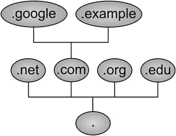
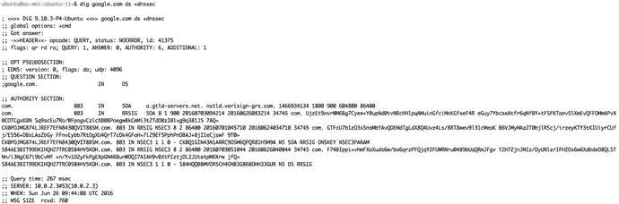

# 十、基础设施服务：NTP、DNS、DHCP 和 SSH

在前面的章节中，您安装了您的主机，并了解了它的使用方法。然后，您学习了如何添加和配置存储硬件。现在是时候看看如何让软件为你工作了。在本章中，我们将介绍帮助您管理网络基础的基础设施服务。

我们将首先描述如何保持系统时间同步，这很重要，因为许多应用程序都依赖于您的主机拥有正确的时间。在此过程中，我们将向您介绍网络时间协议(NTP)。

我们还将介绍域名系统(DNS ),它是一种粘合剂，通过允许主机找到另一个主机，使像互联网这样的网络发挥作用。我们将详细介绍 DNS 的组件以及如何设置和管理 DNS 服务器。

然后我们将讨论动态主机配置协议(DHCP)，它用于为您的主机分配地址和网络配置。使用 DHCP 意味着您不必为网络中的客户端配置单独的网络设置；相反，这可以自动提供。您将了解如何使用 DHCP 以及如何设置地址分配并将网络配置信息传递给主机。

Note

我们将在第 [19](19.html) 章中探讨自动配置主机的其他方法。

最后，我们将扩展安全Shell(SSH)服务，并向您展示如何轻松访问主机以及如何使用 SSH 在主机之间传输文件。

## 保存期

当然，让系统保持时间是非常重要的。想象一下，让你的 Linux 主机驱动你的固体火箭助推器与你的主推进器不同步？当你定时两者都燃烧时，你可能会有几秒到几分钟的不同步。在更平凡的世界中，想象一下数据库事务具有不正确时间戳的恐怖！我都不愿意去想。

让我们看看保持时间，或者至少我们的服务器具有相同的相对时间。保持时间的通用工具是 NTP，您可以在许多系统上找到它。在 Red Hat 衍生的系统上，您会发现 Chrony。

### 带有 timedatectl 的时间

我们将向您展示如何使用`timedatactl`命令在您的 Linux 服务器上管理时间。这是 systemd 系统的一部分。有了它，我们可以做以下事情:

*   设置当前时间
*   设定日期
*   设置时区

首先让我们来看看目前的状况:

```sh
$ sudo timedatectl status
      Local time: Fri 2016-09-30 21:22:26 EDT
  Universal time: Sat 2016-10-01 01:22:26 UTC
        RTC time: Fri 2016-09-30 18:06:27
       Time zone: America/New_York (EDT, -0400)
     NTP enabled: yes
NTP synchronized: yes
 RTC in local TZ: no
      DST active: yes
 Last DST change: DST began at
                  Sun 2016-03-13 01:59:59 EST
                  Sun 2016-03-13 03:00:00 EDT
 Next DST change: DST ends (the clock jumps one hour backwards) at
                  Sun 2016-11-06 01:59:59 EDT
                  Sun 2016-11-06 01:00:00 EST

```

这是我们当前的时间和日期状态。您可以看到当地时间、UTC(协调世界时)、时区和夏令时信息。

您可以从该信息中看到，我们的时区设置为纽约。让我们演示一下如何将它更改为我们当地的时区。

首先我们将列出时区，但是因为结果是一个很长的列表，我们将使用 grep 只返回墨尔本的结果。

```sh
$ timedatectl list-timezones |grep Melb
Australia/Melbourne

```

现在，为了设置时区，我们发出以下命令:

```sh
$ sudo timedatectl set-timezone Australia/Melbourne

```

现在，当我们检查状态时，我们已经设置了正确的时区。

```sh
$ timedatectl status
      Local time: Sat 2016-10-01 11:29:01 AEST
  Universal time: Sat 2016-10-01 01:29:01 UTC
        RTC time: Fri 2016-09-30 18:13:03
       Time zone: Australia/Melbourne (AEST, +1000)
     NTP enabled: yes

```

您可以使用 timedatectl - help 选项列出更多选项。例如，要设置系统时间，可以发出 timedatectl set-time。用`timedatectl`管理你的时间非常简单。让我们继续来看我们如何设法让您的主机时间与世界时钟自动同步。

### 网络时间协议

首先，我们将向您展示如何保持主机上所有系统时钟的同步。虽然这可能看起来是个小问题，但是让系统时钟匹配意味着您的日志条目都将带有一致的时间戳。这反过来意味着，如果需要，您可以轻松地关联来自不同主机的日志条目。同步的系统时钟也是我们稍后将启用的功能的先决条件。你不能简单地依赖你的主机主板的板载时钟，因为它们的质量变化很大，有些可能每天不同步几分钟。

我们已经在第 [2](02.html) 章中对 NTP 做了一些解释。时间服务由网络时间协议提供。NTP 服务器为连接到它们的客户端提供同步服务，并且它们也与上游时间服务器同步。该模型中的层被称为 strata，最高级别为 strata 0，由专用时间硬件(如原子钟或卫星接收器)组成。连接到这些层 0 时间源的服务器称为层 1 服务器。与层 1 服务器同步的服务器是层 2 服务器，依此类推。

Note

你可以在 [`http://www.akadia.com/services/ntp_synchronize.html`](http://www.akadia.com/services/ntp_synchronize.html) 了解更多 NTP 地层。

您可以通过两种方式利用 NTP 服务器。一种方法是运行一个名为 ntpdate 的客户端实用程序，它会在每次运行时同步系统时钟。另一种方法是运行 NTP 服务，每当系统时钟与实际时间不同步时，该服务就会自动同步。很多系统实际上都使用了这两种方法。如果系统时钟和原子时相差太大，系统可能需要一段时间才能与上游时间服务器同步。为了解决这个问题，在启动 NTP 服务之前，会调用 ntpdate 实用程序并同步时钟。

让我们先来看看 ntpdate 实用程序。在 CentOS 和 Ubuntu 上都是由`ntpdate`包提供的。要更新系统时间，请使用上游服务器地址作为唯一的命令行参数来运行该实用程序。它需要作为`root`运行，以便能够更新系统时钟。

```sh
$ sudo ntpdate pool.ntp.org
24 Jun 21:25:35 ntpdate[1565]: step time server 220.233.156.30 offset 1.810551 sec

```

Note

如果您已经运行了 ntpd 守护程序，ntpdate 命令将会失败，并显示如下消息:“24 Jun 23:53:05 ntpdate[22609]:NTP 套接字正在使用中，正在退出。”您可以使用`systemctl ntpd stop`再试一次。

`ntpdate`实用程序连接到一个 pool.ntp.org 服务器，并将我们的系统时间调整了 1.810551 秒。有两种有效的方法来确保系统时钟保持同步，您可以在/ `etc/crontab`中添加一个条目，该条目运行`ntpdate`一次，比如说，每两个小时运行一次。或者，您可以使用更有效、更准确的 ntp 守护程序。

如果您打算使用 cron 方法，您应该将标准输入和标准输出重定向到/ `dev/null`，这样您就不会收到每小时两次的电子邮件。

```sh
0 */2 * * *    root    /usr/sbin/ntpdate pool.ntp.org > /dev/null 2>&1

```

然而，您需要在您的每台主机上安装和维护这样一个 crontab 条目，即使这样，根据硬件的质量，系统时钟在两个小时的过程中也会有很大偏差。通过在您的主机上安装并运行 NTP 守护程序，您可以确保每当系统时钟试图失去同步时都会进行调整。这将使您的主机保持同步，也允许您使用它来同步网络上的其他主机。

NTP 守护程序和一些相关的实用程序由`ntp`包提供。你需要通过 CentOS 上的 yum `install ntp`或者 Ubuntu 上的`sudo aptitude install ntp`来安装它。然而每个发行版都有一个稍微不同的`ntp.conf`文件，我们将向你展示 Ubuntu 版本。当它启动时，`ntpd`服务将从/ `etc/ntp.conf`文件中读取它的选项，并监听 UDP 端口 123。当您查看这个配置文件时，可以看到它由两个主要部分组成:第一部分是实际时间源配置，第二部分是授权配置。我们将从清单 [10-1](#Par36) 中所示的报告和时间源配置开始。

```sh
# /etc/ntp.conf, configuration for ntpd; see ntp.conf(5) for help

driftfile /var/lib/ntp/ntp.drift

# Enable this if you want statistics to be logged.
#statsdir /var/log/ntpstats/

statistics loopstats peerstats clockstats
filegen loopstats file loopstats type day enable
filegen peerstats file peerstats type day enable
filegen clockstats file clockstats type day enable

# Specify one or more NTP servers.

# Use servers from the NTP Pool Project. Approved by Ubuntu Technical Board
# on 2011-02-08 (LP: #104525). See http://www.pool.ntp.org/join.html for
# more information.
pool 0.ubuntu.pool.ntp.org iburst
pool 1.ubuntu.pool.ntp.org iburst
pool 2.ubuntu.pool.ntp.org iburst
pool 3.ubuntu.pool.ntp.org iburst

# Use Ubuntu's ntp server as a fallback.
pool ntp.ubuntu.com

Listing 10-1.
ntp.conf

```

`driftfile`指令给服务器一个地方来存储关于本地系统时钟特性的信息。根据漂移容差，它每小时存储一次时钟频率偏移，并在守护程序启动时使用该信息。如果文件不存在，它将频率偏移设置为零。随着时间的推移，它将使用这些信息更精确地报告同步尝试之间的时间，因为守护程序知道本地时钟的行为。

默认情况下不启用统计报告，因为没有启用`statsdir`选项。但是，如果您取消注释该行，下一个指令`statistics`将启用`loopstats, peerstats`和`clockstats`向/ `var/log/ntpstats`中的文件报告。

`loopstats`收集由`ntpd`服务器对本地时钟进行更新的信息。`peerstats`记录所有对等方的信息——上游服务器以及使用您的服务器进行同步的客户端。最后，`clockstats`将关于本地时钟的统计信息写入日志文件。

`filegen`指令告诉守护程序您希望将这些统计信息写入哪个文件，以及文件需要更改的频率。在我们的例子中，由于使用了`type day`指令，每天都会创建这些文件的一个新版本。

最后，`pool`选项告诉`ntpd`使用哪个上游服务器进行同步。为了确保您的主机保持同步，通常为多个不同的服务器添加多个服务器指令是一个好主意。您可以使用`server`选项或服务器的`pool`来指定单独的时间服务器，就像我们在这里所做的那样。`iburst`选项告诉 ntp 如果没有得到初始响应，就额外发送 8 个包，最初是为像调制解调器和 ISDN 这样建立连接很慢的设备准备的。我们稍后将解释更多关于 pool.ntp.org 服务器的内容。

首先让我们快速看一下`/etc/ntp.conf`文件中的下一部分，它定义了哪些主机可以访问您的 NTP 服务器。在 CentOS 上，这一部分列在文件的顶部，如清单 [10-2](#Par43) 所示。

```sh
# By default, exchange time with everybody, but don't allow configuration.
restrict -4 default kod notrap nomodify nopeer noquery limited
restrict -6 default kod notrap nomodify nopeer noquery limited

# Local users may interrogate the ntp server more closely.
restrict 127.0.0.1
restrict ::1

# Needed for adding pool entries
restrict source notrap nomodify noquery

Listing 10-2.Access Control in ntp.conf

```

`restrict`关键字用于定义访问类别。这里使用-4 和-6 参数为 IPv4 和 IPv6 客户端定义了相同的访问级别。

`default`是一个通配符关键字，匹配所有可能的地址。`Kod`“死亡之吻”通过发送一个特殊的响应包来减慢超过规定速率限制的客户端。这些限制是用`discard`选项定义的，因为我们没有定义这样的限制，所以这里不使用它。`notrap`拒绝任何发送的控制数据包，而`nomodify`不允许修改服务器上的时间。`nopeer`确保您的服务器不会将连接客户端用作上游 NTP 服务器。`noquery`防止您的服务器被查询对等和其他统计数据。最后，`limited`用于在数据包违反`discard`选项中设置的限制时拒绝时间服务。

第二组`restrict`指令确保来自本地机器 127.0.0.1 (IPv4)和::1(IPv6)的连接可以询问和重新配置 NTP 服务器。不过，这些都不会阻止客户机与 NTP 服务器同步。

最后一组 restrict 指令允许池服务器成为对等服务器，这意味着我们可以向它们查询时间信息。

```sh
restrict source notrap nomodify noquery

```

这里的`source`指的是池服务器，您会注意到`nopeer`没有设置，但是其他限制仍然存在。

您可以使用加密密钥进一步限制 ntp 服务器，以确保只有参与交换公钥加密数据包的服务器才能使用您的 ntp 服务。这在大多数情况下并不常见，在使用 pool.ntp.org 服务器时也是不可能的。如需更多信息，请参见 [`www.ntp.org/ntpfaq/NTP-s-algo-crypt.htm`](http://www.ntp.org/ntpfaq/NTP-s-algo-crypt.htm) 。

Note

你可以在这里找到更多关于 NTP 配置和访问控制的信息: [`http://doc.ntp.org/4.1.1/confopt.htm`](http://doc.ntp.org/4.1.1/confopt.htm) 。

### 全球 NTP 服务器池

许多组织运行自己的时间服务器，并让第三方访问它们。微软和苹果的运行时服务器被各自的操作系统默认使用，许多 Linux 供应商也是这样做的。

然而，当您想要添加额外的服务器(使用`server`配置)到您自己的`ntp.conf`文件中时，您将需要知道它们的地址。幸运的是，有一个开源项目旨在为各大洲提供一个本地 NTP 服务器池。这个项目被称为 pool.ntp.org，参与者是允许第三方使用他们的服务器进行同步的个人用户和组织。

该项目为各种服务器层和地理位置提供基于 DNS 的组，例如，1.pool.ntp.org 由层 1 服务器提供，au.pool.ntp.org 仅包含位于澳大利亚的服务器，us.pool.ntp.org 由位于美国的服务器提供。通过添加选择的 pool.ntp.org 服务器，您可以确保始终有最新的和邻近的服务器可用于同步。

Note

您可以在 [`www.pool.ntp.org/`](http://www.pool.ntp.org/) 阅读更多关于该项目的信息并加入人才库。

使用`host`命令，我们将看到`0.ubuntu.pool.ntp.org`将返回什么，如清单 [10-3](#Par57) 所示。清单 [10-3](#Par57) 显示了我们的 ntpd 守护进程将尝试同步的服务器。

```sh
$ host 0.ubuntu.pool.ntp.org
0.ubuntu.pool.ntp.org has address 129.250.35.250
0.ubuntu.pool.ntp.org has address 129.250.35.251
0.ubuntu.pool.ntp.org has address 27.124.125.252
0.ubuntu.pool.ntp.org has address 121.0.0.41
Listing 10-3.Ubuntu ntp Pool Servers

```

将此与 CentOS 的`0.centos.pool.ntp.org`返回的数据进行比较。

```sh
$ host 0.centos.pool.ntp.org
0.centos.pool.ntp.org has address 27.124.125.252
0.centos.pool.ntp.org has address 121.0.0.41
0.centos.pool.ntp.org has address 129.250.35.250
0.centos.pool.ntp.org has address 129.250.35.251

```

嘿，看，它们包含相同的服务器。如果我们看一下`0.au.pool.ntp.org`

```sh
$ host 0.au.pool.ntp.org
0.au.pool.ntp.org has address 129.250.35.251
0.au.pool.ntp.org has address 27.124.125.252
0.au.pool.ntp.org has address 121.0.0.41
0.au.pool.ntp.org has address 129.250.35.250

```

很有趣吧。你应该测试来自`0.us.pool.ntp.org`的结果，看看你会得到什么。通常的做法是将本地网络主机设置为两个或三个本地 ntp 服务器，然后这些服务器与 ntp 池中的服务器同步。

如果您选择更改这些设置，您的 ntp.conf 可以使用 Ubuntu 上的 sudo `service ntp restart`或 CentOS 上的`sudo systemctl restart ntpd`重新启动 ntp 服务器。服务器将任何状态更新写入系统记录器；你可以在 Ubuntu 的`/var/log/syslog`或者 CentOS 的`/var/log/messages`中找到它们。清单 [10-4](#Par64) 向您展示了一个启动后与上游服务器同步的服务器的输出。

```sh
Jun 25 09:07:00 ubuntu ntp[13644]:  * Starting NTP server ntpd
Jun 25 09:07:00 ubuntu ntpd[13653]: ntpd 4.2.8p4@1.3265-o Fri Apr  8 20:58:07 UTC 2016 (1): Starting
Jun 25 09:07:00 ubuntu ntpd[13653]: Command line: /usr/sbin/ntpd -p /var/run/ntpd.pid -g -u 112:116
Jun 25 09:07:00 ubuntu ntp[13644]:    ...done.
Jun 25 09:07:00 ubuntu systemd[1]: Started LSB: Start NTP daemon.
Jun 25 09:07:00 ubuntu ntpd[13655]: proto: precision = 0.059 usec (-24)
Jun 25 09:07:00 ubuntu ntpd[13655]: Listen and drop on 0 v6wildcard [::]:123
Jun 25 09:07:00 ubuntu ntpd[13655]: Listen and drop on 1 v4wildcard 0.0.0.0:123
Jun 25 09:07:00 ubuntu ntpd[13655]: Listen normally on 2 lo 127.0.0.1:123
Jun 25 09:07:00 ubuntu ntpd[13655]: Listen normally on 3 enp0s3 10.0.2.15:123
Jun 25 09:07:00 ubuntu ntpd[13655]: Listen normally on 4 lo [::1]:123
Jun 25 09:07:00 ubuntu ntpd[13655]: Listen normally on 5 enp0s3 [fe80::ff:86ff:fe2d:ca23%2]:123
Jun 25 09:07:00 ubuntu ntpd[13655]: Listening on routing socket on fd #22 for interface updates
Jun 25 09:07:01 ubuntu ntpd[13655]: Soliciting pool server 203.122.222.45
Jun 25 09:07:02 ubuntu ntpd[13655]: Soliciting pool server 27.124.125.251
Jun 25 09:07:02 ubuntu ntpd[13655]: Soliciting pool server 103.51.68.133
Jun 25 09:07:03 ubuntu ntpd[13655]: Soliciting pool server 130.102.128.23
Jun 25 09:07:03 ubuntu ntpd[13655]: Soliciting pool server 150.101.217.196
Jun 25 09:07:03 ubuntu ntpd[13655]: Soliciting pool server 121.0.0.41
Jun 25 09:07:04 ubuntu ntpd[13655]: Soliciting pool server 121.0.0.42
Jun 25 09:07:04 ubuntu ntpd[13655]: Soliciting pool server 202.127.210.36
Jun 25 09:07:04 ubuntu ntpd[13655]: Soliciting pool server 202.127.210.37
Jun 25 09:07:04 ubuntu ntpd[13655]: Soliciting pool server 200.160.7.186
Listing 10-4.ntpd Status in the Ubuntu System Log

```

我们还可以通过使用`ntpq`命令从本地主机查询 NTP 服务器来验证我们的主机是否同步，如清单 [10-4](#Par64) 所示。我们使用`-p`选项列出我们连接到的任何对等体，使用`-4`选项将主机名解析为 IPv4 地址。

在图 [10-1](#Fig1) 中，您可以看到我们的对等列表的输出。以“`*`”开头的远程主机是当前时间源，而带有“`+`”的主机是已被选择用于加权平均计算的最终集合的主机(您还记得第 [2 章](02.html)中的内容吗？);那些带有`-`的已经被丢弃。`st`列是服务器层，我们通过 Ubuntu stratum 16 服务器对等到层 1 和层 2 服务器(您不需要直接对等到任何层 1 服务器)。您还可以看到关于`delay`、`offset`和`jitter`的其他详细信息。


图 10-1。

Listing connected peers

现在，您可以配置网络上的主机，将 bastion 主机用作它们的上游 NTP 服务器，并且可以通过`ntpq`命令验证它们是否工作。

### 克罗妮

Chrony 是 NTP 服务守护程序的替代方案，它使主机与世界时钟保持同步。Chrony 和 NTP 在实现上有一些不同，但它们都使用相同的上行时间源。这两种实现的主要区别如下:

*   Chrony 不支持多播和多点传送。
*   在网络时断时续的情况下，Chrony 非常有用。
*   Chrony 在拥塞的网络和虚拟主机中工作得更好。

#### 安装和配置时间

Chrony 安装快捷方便，CentOS 和 Ubuntu 上都有。让我们快速演示一下如何安装和设置它。

通过两个发行版上的包管理，安装很简单。

```sh
$ sudo yum install –y chrony
$ sudo aptitude install –y chrony

```

CentOS 上的`/etc/chrony.conf`和 Ubuntu 上的`/etc/chrony/chrony.conf`中有一个配置文件。在该文件中，您将找到公共时间服务器和其他设置。

```sh
# Use public servers from the pool.ntp.org project.
# Please consider joining the pool (http://www.pool.ntp.org/join.html).
server 0.centos.pool.ntp.org iburst
server 1.centos.pool.ntp.org iburst
server 2.centos.pool.ntp.org iburst
server 3.centos.pool.ntp.org iburst

# Ignore stratum in source selection.
stratumweight 0

# Record the rate at which the system clock gains/losses time.
driftfile /var/lib/chrony/drift

# Enable kernel RTC synchronization.
rtcsync

# In first three updates step the system clock instead of slew
# if the adjustment is larger than 10 seconds.
makestep 10 3

# Allow NTP client access from local network.
#allow 192.168/16

# Listen for commands only on localhost.
bindcmdaddress 127.0.0.1
bindcmdaddress ::1

# Serve time even if not synchronized to any NTP server.
#local stratum 10

keyfile /etc/chrony.keys

# Specify the key used as password for chronyc.
commandkey 1

# Generate command key if missing.
generatecommandkey

# Disable logging of client accesses.
noclientlog

# Send a message to syslog if a clock adjustment is larger than 0.5 seconds.
logchange 0.5

logdir /var/log/chrony
#log measurements statistics tracking

Listing 10-5./etc/chrony.conf from CentOS

```

清单 [10-5](#Par76) 中列出的设置类似于我们之前展示的`ntp.conf`文件。默认情况下，在 Ubuntu 和 CentOS 上，我们不允许客户端从这个时间服务同步。为此，我们需要如下设置允许设置:

```sh
allow 192.168/16

```

只有当您打算将网络中的这些主机用作本地网络时钟时，才需要设置此项。否则，您可以将其注释掉。

您可能还需要在 CentOS 上添加`cmdallow`设置，以使`chronyc`命令能够访问服务。我们很快就会看到`chronyc`。

现在我们使用`systemctl`命令来启用和启动我们的服务。在 Ubuntu 上把`chrony`换成`chronyd`。

```sh
$ sudo systemctl enable chronyd && sudo systemctl start chronyd

```

然后检查服务正在运行

```sh
$ sudo systemctl status chronyd

```

#### 管理慢性与慢性

Chrony 提供了一个命令行界面工具来查询和管理名为`chronyc`的 Chrony。同样，这类似于如何使用`ntp`工具。

您可以通过键入`chronyc`进入命令行界面，也可以直接从 Linux 命令 shell 访问子命令。您可以获得以下帮助:

```sh
$ chronyc help

```

Chrony 从命令行提供跟踪信息，即关于时间服务的不同指标:

```sh
$ chronyc tracking
Reference ID    : 192.189.54.33 (warrane.connect.com.au)
Stratum         : 3
Ref time (UTC)  : Sat Oct  1 00:51:03 2016
System time     : 0.000043108 seconds slow of NTP time
Last offset     : -0.000094345 seconds
RMS offset      : 0.027604111 seconds
Frequency       : 459.036 ppm slow
Residual freq   : -0.012 ppm
Skew            : 0.430 ppm
Root delay      : 0.075154 seconds
Root dispersion : 0.012796 seconds
Update interval : 260.5 seconds
Leap status     : Normal

```

从上面我们可以看到，我们有各种各样的指标来描述我们的系统时间和时钟精度。我们可以看到我们正在同步的地层、系统时间和偏移。

接下来，我们可以使用以下内容查看时钟源:

```sh
$ chronyc sources
210 Number of sources = 4
MS Name/IP address             Stratum   Poll   Reach   LastRx  Last sample
===========================================================================================
^+ 0.time.itoc.com.au                2      9     377      446   +798us[ +798us] +/-   73ms
^+ dns02.ntl01.nsw.privatecl         2      9     377      249  +1507us[+1507us] +/-   52ms
^* warrane.connect.com.au            2      9     377      504  -1782us[-1876us] +/-   50ms
^+ 203.122.222.45                    2      9     377      183   -200us[ -200us] +/-   85ms

```

您可以使用`chronyc`命令添加和拒绝对 chrony 的访问，还可以添加和删除对等体。

有关更多信息，请参见以下内容:

*   [T2`https://chrony.tuxfamily.org/faq.html`](https://chrony.tuxfamily.org/faq.html)
*   [T2`https://chrony.tuxfamily.org/comparison.html`](https://chrony.tuxfamily.org/comparison.html)

## 域名系统

在第 [2](02.html) 章中，我们建议对主机使用描述性名称。我们还为主机提供了一个 IP(互联网协议)地址。当然，我们可以使用 IP 地址来访问我们的主机；然而，比起“奇怪”的数字，人类更喜欢用名字。但是我们如何将主机名映射到 IP 地址呢？我们可以使用本地主机的文件来进行地址到名称的映射，就像我们在第 [4](04.html) 章中展示的那样。但是，一旦您的网络超过了几台主机，确保该文件的所有副本保持同步就成了一项工作。

因此设计了一种将这些名称转换成主机 IP 地址的方法。这就是所谓的域名系统或 DNS。DNS 服务器维护地址到主机名(反之亦然)映射的列表，并且可以被其他主机查询，或者被用户使用各种实用程序直接查询。DNS 可用于查找本地网络中主机的 IP 地址或世界上任何网络中主机的 IP 地址。让我们看看它是如何做到这一点的，从根服务器开始。

Note

在 DNS 存在之前，使用单一的`hosts.txt`文件。该文件由网络信息中心(NIC)维护，并通过 FTP(文件传输协议)分发给所有与 ARPANET 连接的机器。

### 根服务器

不知何故，DNS 服务器需要知道向哪个或哪些主机查询正确的地址。apple.com 的 DNS 服务器不知道 google.com 的主机，那么我们自己的 DNS 服务器怎么知道去哪里找呢？

整个 DNS 结构就像一棵倒挂的大树。域名中的每个句点就像是这棵树中的一个分支。当你从左向右读一个域名时，每一个句点表示一个到树中更低一级的分裂，这更接近于根。这些级别称为区域，对于域所属的每个区域，都会执行一个查询来找出该区域的名称服务器。然后依次查询这些服务器中的一个，以获得下一个区域的 DNS 服务器。最低级别的区域(所有其他区域都是其成员)称为根区域。我们用一个周期来表示这个区域。下一级由顶级域名(TLD)组成，包括 net、com、org 和 edu 等通用域名，以及 au、nz、uk 和 us 等国家代码。图 [10-2](#Fig2) 显示了该树形结构的一小部分。



图 10-2。

DNS tree structure

当书写主机名或域名时，您通常会省去根区域的尾随句点，但是当您处理 DNS 服务器时，您应该明确地包括它，因为省去它可能会导致意想不到的结果。这些顶级域名的 DNS 信息存储在所谓的根服务器中。

目前世界上有 13 个全球分布的根域名服务器返回顶级域名的权威域名服务器列表。实际上，并不是只有 13 台服务器在不停地工作，而是多个数据中心中高度分布式的专用服务器集群。在接下来的“摘要”部分，我们将看到这些服务器在委托路径中扮演的角色。

Note

由于根服务器是互联网绝对关键的核心，它们一直是网络攻击的目标。以下是汇总列表: [`https://en.wikipedia.org/wiki/Distributed_denial-of-service_attacks_on_root_nameservers`](https://en.wikipedia.org/wiki/Distributed_denial-of-service_attacks_on_root_nameservers) 。

#### 名目项

当一个组织或个人购买一个域时，根 DNS 服务器需要知道树中更下面的哪些 DNS 服务器已经被委托来响应对该域的查询。负责的组织。com domain 是互联网名称与数字地址分配机构(ICANN)，负责管理注册商。

当您从注册商处购买域名时，您可以指定域名服务器。然后，注册商会确保您的 DNS 服务器被添加到正确的 TLD 区域，这样第三方就可以使用您的 DNS 服务器来查找您的域中的主机名。这称为委托路径。

您可以通过直接查询注册商的数据库来获得给定域的 DNS 服务器列表。用于此目的的工具`whois`可以方便地确保 DNS 授权是正确的。在 CentOS 和 Ubuntu 上，它由`whois`包提供。安装包之后，我们可以查看 google.com 域的委托的详细信息，如清单 [10-6](#Par108) 所示。

```sh
$ whois 'domain google.com'
Whois Server Version 2.0

Domain names in the .com and .net domains can now be registered
with many different competing registrars. Go to http://www.internic.net
for detailed information.

   Domain Name: GOOGLE.COM
   Registrar: MARKMONITOR INC.
   Sponsoring Registrar IANA ID: 292
   Whois Server: whois.markmonitor.com
   Referral URL: http://www.markmonitor.com
   Name Server: NS1.GOOGLE.COM
   Name Server: NS2.GOOGLE.COM
   Name Server: NS3.GOOGLE.COM
   Name Server: NS4.GOOGLE.COM
   Status: clientDeleteProhibited https://icann.org/epp#clientDeleteProhibited
   Status: clientTransferProhibited https://icann.org/epp#clientTransferProhibited
   Status: clientUpdateProhibited https://icann.org/epp#clientUpdateProhibited
   Status: serverDeleteProhibited https://icann.org/epp#serverDeleteProhibited
   Status: serverTransferProhibited https://icann.org/epp#serverTransferProhibited
   Status: serverUpdateProhibited https://icann.org/epp#serverUpdateProhibited
   Updated Date: 20-jul-2011
   Creation Date: 15-sep-1997
   Expiration Date: 14-sep-2020

>>> Last update of whois database: Sat, 25 Jun 2016 12:34:50 GMT <<<

Listing 10-6.Using whois to Check Delegation Details

```

我们发出`whois`命令，并指定我们只寻找`domain google.com`。如果我们搜索时没有指定要搜索的域，那么将会返回域名中包含 google.com 的所有域。你可以看到我们已经检索了一些关于谷歌域名的信息，包括注册商的名字；它被委派到的名称服务器；以及创建、修改和到期日期。

一些注册服务商还通过`whois`提供域名所有者的联系方式。这是在选择注册商购买你的域名时要记住的，因为这是垃圾邮件发送者收集电子邮件地址的一种相对方便的方式。

Note

大多数注册服务商只允许每天从特定地址对其数据库进行有限次数的查找，以阻止地址收集。

### 查询名称服务器

您将已经在使用由您的互联网服务提供商运行的 DNS 服务器来查找互联网上的主机地址。当你想进行网络搜索时，输入 [`www.google.com`](http://www.google.com) 比记住 74.125.19.147 要方便得多。这些 DNS 服务器的地址存储在`/etc/resolv.conf file`中。我们已将我们的产品列入清单[10-7](#Par113)；当然，你的会有所不同。

```sh
$ cat /etc/resolv.conf
search example.com
nameserver 192.168.1.1
nameserver 192.168.1.254
Listing 10-7.
/etc/resolv.conf

```

当您访问网站或通过 SSH 连接到主机时，相关的应用程序会使用这些 DNS 服务器执行主机查找。这些应用程序使用系统库，它首先检查您的`/etc/hosts`文件，然后仅在需要时查询名称服务器。

在下图 [10-3](#Fig3) 中，我们可以看到一个浏览器如何从本地 dns 请求一个 IP 地址，然后它将查询一个根服务器列表来找到它需要请求的域名服务器`google.com`域。


图 10-3。

Simple recursive DNS query

本地 dns 服务器将首先需要向“`.`”根服务器请求一个可以响应“. com .”区域的服务器。然后，本地 dns 服务器将询问其中一个“. com .”服务器，哪个服务器可以回答对“. google.com”的查询。然后我们查询其中一个 nsX.google.com。“www”记录的服务器。浏览器现在知道在寻找 [www 时使用哪个 IP 地址。谷歌。com](http://www.google.com) 。

#### 主机命令

您也可以手动查询 DNS 服务器。与 DNS 相关的工具由 CentOS 上的`bind-utils`包和 Ubuntu 上的`dnsutils`包提供，所以安装它们。可以通过`host`工具直接查找主机或地址。

Note

您可能习惯于使用不推荐使用的`nslookup`实用程序。`host`命令是它的替代品。

您传递您想要查找的主机名或地址，以及您想要查询的可选 DNS 服务器，如清单 [10-8](#Par120) 所示。如果您关闭 DNS 服务器，实用程序将使用在`/etc/resolv.conf`中定义的服务器。

```sh
$ host www.google.com 192.168.1.1
Using domain server:
Name: 192.168.1.1
Address: 192.168.1.1#53
Aliases:

www.google.com has address 150.101.161.167
www.google.com has address 150.101.161.173
www.google.com has address 150.101.161.174
www.google.com has address 150.101.161.180
www.google.com has address 150.101.161.181
www.google.com has address 150.101.161.187
www.google.com has address 150.101.161.146
www.google.com has address 150.101.161.152
www.google.com has address 150.101.161.153
www.google.com has address 150.101.161.159
www.google.com has address 150.101.161.160
www.google.com has address 150.101.161.166
www.google.com has IPv6 address 2404:6800:4006:800::2004

Listing 10-8.Querying a DNS Server with host

```

在清单 [10-8](#Par120) 中，我们要求运行在 192.168.1.1 上的 DNS 服务器查找 [`www.google.com`](http://www.google.com) 的地址，它返回几个不同的 IP 地址，包括一个 IPv6 地址。Google web 站点将对这些地址中的任何一个做出响应，并在循环中使用，返回列表的顺序会经常改变(就像我们前面看到的 ntp 池服务器一样)。

相反，我们也可以对 IP 地址的主机名进行 dns 查找。

```sh
$ host 205.251.193.236
236.193.251.205.in-addr.arpa domain name pointer ns-492.awsdns-61.com.

```

所做的是查询 DNS 服务器，询问它是否知道地址`205.251.193.236`的任何记录以及它所指的主机。它被称为反向名称查找，可能并不总是返回任何结果，因为你不必在你的 DNS 记录中记录这些信息，只是有时有这样的记录会更好。

#### 挖掘命令

尽管 host 很有用，但它通常不能提供足够的信息来帮助解决您可能遇到的任何 DNS 问题，尤其是当您运行自己的 DNS 服务器时。更灵活的实用程序是`dig`，它也由`bind-utils`或`dnsutils`包提供。

在最基本的层面上，dig 也进行基于名称或地址的查找，但是它为每次查找提供了额外的信息。让我们进行与清单 [10-8](#Par120) 中相同的查找，但是使用 dig(参见清单 [10-9](#Par127) )。

```sh
$ dig www.google.com

; <<>> DiG 9.10.3-P4-Ubuntu <<>> www.google.com
;; global options: +cmd
;; Got answer:
;; ->>HEADER<<- opcode: QUERY, status: NOERROR, id: 33352
;; flags: qr rd ra; QUERY: 1, ANSWER: 12, AUTHORITY: 4, ADDITIONAL: 5

;; OPT PSEUDOSECTION:
; EDNS: version: 0, flags:; udp: 4096
;; QUESTION SECTION:
;www.google.com.                     IN       A

;; ANSWER SECTION:
www.google.com.        41     IN      A       150.101.161.153
www.google.com.        41     IN      A       150.101.161.159
www.google.com.        41     IN      A       150.101.161.160
www.google.com.        41     IN      A       150.101.161.166
www.google.com.        41     IN      A       150.101.161.167
www.google.com.        41     IN      A       150.101.161.173
www.google.com.        41     IN      A       150.101.161.174
www.google.com.        41     IN      A       150.101.161.180
www.google.com.        41     IN      A       150.101.161.181
www.google.com.        41     IN      A       150.101.161.187
www.google.com.        41     IN      A       150.101.161.146
www.google.com.        41     IN      A       150.101.161.152

;; AUTHORITY SECTION:
google.com.            2071   IN      NS      ns4.google.com.
google.com.            2071   IN      NS      ns1.google.com.
google.com.            2071   IN      NS      ns3.google.com.
google.com.            2071   IN      NS      ns2.google.com.

;; ADDITIONAL SECTION:
ns1.google.com.        179    IN      A       216.239.32.10
ns2.google.com.        4851   IN      A       216.239.34.10
ns3.google.com.        186    IN      A       216.239.36.10
ns4.google.com.        8300   IN      A       216.239.38.10

;; Query time: 11 msec
;; SERVER: 192.168.1.1#53(192.168.1.1)
;; WHEN: Sun Jun 26 00:11:48 UTC 2016
;; MSG SIZE rcvd: 371

Listing 10-9.Querying a DNS Server with dig

```

在清单 [10-9](#Par127) 中，您可以看到 dig 在不同的部分输出查询结果。首先是关于您正在运行的命令的一些信息，包括查询是否成功(`opcode: QUERY, status: NOERROR, id: 33352`)。接下来是查询部分，它显示了实际发送到 DNS 服务器的内容。在本例中，我们为主持人 [`www.google.com`](http://www.google.com) 寻找一个 A 记录。

```sh
;; QUESTION SECTION:
;www.google.com.                  IN      A

```

A 记录是将姓名映射到地址的记录。我们稍后将更详细地介绍记录类型。

Note

如果记录不存在，您将获得状态响应“`NXDOMAIN`”所有可能的响应列表见 [`www.iana.org/assignments/dns-parameters/dns-parameters.xhtml#dns-parameters-6`](http://www.iana.org/assignments/dns-parameters/dns-parameters.xhtml#dns-parameters-6) 。

答案部分包含对您的查询的响应。在这种情况下，它表示 [`www.google.com`](http://www.google.com) 有多个 A 记录分配给它。

```sh
;; ANSWER SECTION:
www.google.com.        41      IN      A      150.101.161.153
www.google.com.        41      IN      A      150.101.161.159
...

```

在 authority 部分，dig 列出了该查询的权威名称服务器。在这里，您可以看到可以从四台 DNS 服务器获得对`google.com.`区域的权威响应。

```sh
;; AUTHORITY SECTION:
google.com.            2071    IN     NS      ns4.google.com.
google.com.            2071    IN     NS      ns1.google.com.
google.com.            2071    IN     NS      ns3.google.com.
google.com.            2071    IN     NS      ns2.google.com.

```

`dig`在附加部分为我们提供了这四台服务器的 IP 地址。

```sh
;; ADDITIONAL SECTION:
ns1.google.com.        179     IN     A       216.239.32.10
...

```

最后，dig 告诉我们查询用了多长时间，查询了哪个服务器，查询是何时运行的，以及它接收了多少数据。

```sh
;; Query time: 11 msec
;; SERVER: 192.168.1.1#53(192.168.1.1)
;; WHEN: Sun Jun 26 00:11:48 UTC 2016
;; MSG SIZE rcvd: 371

```

实际响应数据显示在五列中。这种格式与 Berkeley Internet Name Domain(BIND)内部定义域的方式相同，其中记录使用五个字段定义，分号用于注释。这五个字段是记录名称、数据到期前的时间(更好的说法是生存时间或 TTL)、记录类(对于互联网来说实际上总是`IN`)、记录类型，最后是该记录的数据。

```sh
<record name>          <ttl>            <class>         <type>          <data>
www.google.com.          41               IN              A             150.101.161.153

```

您也可以使用`dig`向任何 DNS 服务器查询特定的记录类型。表 [10-1](#Tab1) 列出了最常用的记录类型。我们稍后也会设置其中的一些。

表 10-1。

DNS Record Types

<colgroup><col> <col></colgroup> 
| 类型 | 用于 |
| --- | --- |
| `SOA` | 定义域的序列号和到期信息 |
| `A` | IPv4 主机名到地址的映射 |
| `AAAA` | IPv6 主机名到地址的映射 |
| `CNAME` | 为现有的 A 或 AAAA 记录添加别名 |
| `MX` | 为域指定的邮件服务器 |
| `TXT` | 文本记录，通常与 SPF 或 DKIM (MX 记录验证)以及其他机器可读数据一起使用 |
| `SRV` | 与服务相关联的指定服务记录 |
| `NS` | 为域指定的 dns 服务器 |
| `PTR` | 将地址映射到主机名 |
| `DS` | 委托签名人-在 DNSSEC 使用 |
| `DNSKEY` | DNSSEC 使用的 DNSKEY 记录 |
| `RRSIG` | DNSSEC 使用的资源记录签名 |

有了这些知识，您现在可以利用`dig`更高级的特性。我们之前只使用主机名作为参数来调用它，但是完整的命令通常看起来像`dig @server name type`。在我们的第一个例子中，完整的显式命令应该是`dig @192.168.1.1` [`www.google.com`](http://www.google.com) `A`。

Note

要使用`host`实用程序进行同类查找，请输入`host -v -t <type> <name> <server>`。

我们之前通过`whois`找到了`google.com`域的主要 DNS 服务器。为了检查这些 DNS 服务器是否配置正确，我们可以查询它们在`google.com`域中的 NS `type`的所有记录，如清单 [10-10](#Par146) 所示。

```sh
$ dig @ns1.google.com google.com NS

; <<>> DiG 9.10.3-P4-Ubuntu <<>> google.com NS
;; global options: +cmd
;; Got answer:
;; ->>HEADER<<- opcode: QUERY, status: NOERROR, id: 44887
;; flags: qr rd ra; QUERY: 1, ANSWER: 4, AUTHORITY: 0, ADDITIONAL: 5

;; OPT PSEUDOSECTION:
; EDNS: version: 0, flags:; udp: 4096
;; QUESTION SECTION:
;google.com.                  IN      NS

;; ANSWER SECTION:
google.com.            10158  IN      NS      ns2.google.com.
google.com.            10158  IN      NS      ns3.google.com.
google.com.            10158  IN      NS      ns1.google.com.
google.com.            10158  IN      NS      ns4.google.com.

;; ADDITIONAL SECTION:
ns1.google.com.        8267   IN      A       216.239.32.10
ns2.google.com.        12939  IN      A       216.239.34.10
ns3.google.com.        8274   IN      A       216.239.36.10
ns4.google.com.        1987   IN      A       216.239.38.10

;; Query time: 9 msec
;; SERVER: 10.0.2.3#53(10.0.2.3)
;; WHEN: Sun Jun 26 01:57:01 UTC 2016
;; MSG SIZE  rcvd: 175

Listing 10-10.Querying a DNS Server for a Specific Record Type

```

清单 [10-10](#Par146) 向我们展示了`ns1.google.com` DNS 服务器确实有关于`google.com`域名的四个域名服务器的信息，所以它看起来配置正确。

有时你需要知道你的域名服务器的授权路径(列表 [10-11](#Par149) )。为了找出这些信息，我们可以使用带有+ `trace`选项 dig。

```sh
$ dig +trace www.google.com

; <<>> DiG 9.10.3-P4-Ubuntu <<>> +trace www.google.com
;; global options: +cmd
.                      9903    IN     NS      a.root-servers.net.
.                      9903    IN     NS      d.root-servers.net.
.                      9903    IN     NS      j.root-servers.net.
.                      9903    IN     NS      e.root-servers.net.
.                      9903    IN     NS      k.root-servers.net.
...<snip>...
.                      9903    IN     NS      h.root-servers.net.
...<snip>...
;; Received 913 bytes from 10.0.2.3#53(10.0.2.3) in 12 ms

com.                   172800  IN     NS      a.gtld-servers.net.
com.                   172800  IN     NS      b.gtld-servers.net.
com.                   172800  IN     NS      c.gtld-servers.net.
com.                   172800  IN     NS      d.gtld-servers.net.
com.                   172800  IN     NS      e.gtld-servers.net.
...<snip>...
com.                   172800  IN     NS      m.gtld-servers.net.
...<snip>...
;; Received 738 bytes from 192.58.128.30#53(j.root-servers.net) in 25 ms

google.com.            172800  IN     NS      ns2.google.com.
google.com.            172800  IN     NS      ns1.google.com.
google.com.            172800  IN     NS      ns3.google.com.
google.com.            172800  IN     NS      ns4.google.com.
...<snip>...
;; Received 664 bytes from 192.52.178.30#53(k.gtld-servers.net) in 176 ms

www.google.com.        300     IN     A      150.101.213.166
www.google.com.        300     IN     A      150.101.213.159
...<snip>...
www.google.com.        300     IN     A      150.101.213.174
;; Received 224 bytes from 216.239.34.10#53(ns2.google.com) in 177 ms

Listing 10-11.Seeing the Delegation Path

```

我们已经删除了输出中列出的一些身份验证记录，以使其更加清晰。使用`+trace`选项，我们可以看到“.”根区域委托给“`com.`”区域中的服务器，然后再委托给“`google.com.`”的名称服务器。如果您将 DNS 服务器设置为您的域的授权机构，您可以使用`+trace`选项验证您的授权路径是否正确。

Tip

通常会有一个“传播延迟”,因为 DNS 世界会根据更新进行自我重组。这种延迟取决于记录 TTL 和域名服务器更新其记录的频率。使用 dig 有助于展示 DNS 世界。

#### 区域元数据

我们前面提到，dig 结果中列出的列之一是 TTL。此字段定义 DNS 记录的有效期，这允许您的本地应用程序将 DNS 查找的结果缓存一段时间。这样，就不需要为您建立的每个连接执行多次 DNS 查找(记住，首先要执行一次或多次查找来查找权威的 DNS 服务器)，这大大加快了建立网络连接的过程。

另一种重要的类型叫做`SOA`，代表权威的开始。该记录包含关于该区域的元信息。例如，它包括一个序列号，这样服务器可以检查区域是否被更改，它还为服务器管理员定义了一个联系电子邮件。

让我们向其中一个 Google 服务器请求`google.com`域的`SOA`记录(列出 [10-12](#Par155) )。我们已经把权威和额外的部分从输出中去掉了。

```sh
$ dig google.com @ns1.google.com SOA
; <<>> DiG 9.10.3-P4-Ubuntu <<>> google.com @ns1.google.com SOA
;; global options: +cmd
;; Got answer:
;; ->>HEADER<<- opcode: QUERY, status: NOERROR, id: 43145
;; flags: qr aa rd; QUERY: 1, ANSWER: 1, AUTHORITY: 4, ADDITIONAL: 4
;; WARNING: recursion requested but not available

;; QUESTION SECTION:
;google.com.        IN   SOA

;; ANSWER SECTION:
google.com.    60   IN    SOA    ns2.google.com. dns-admin.google.com. 125880391 900 900 1800 60

Listing 10-12.Querying a DNS Server for an SOA Record

```

清单 [10-12](#Par155) 显示 SOA 记录由七个字段组成，它们定义了其他 DNS 服务器如何与该区域交互。在 DNS 类型(SOA)之后，您将看到七个字段。

```sh
<name server>    <admin email address>      serial #     refresh   retry  expiry   nx ttl
ns2.google.com.   dns-admin.google.com.    125880391         900    900     1800       60

```

我们稍后会更详细地讨论它们，但我们想提一下列表中的最后一项，即负缓存 TTL，或 nx ttl。这告诉其他 dns 服务器缓存否定结果(“NXDOMAIN”)，以防止权威名称服务器连续查找不存在的主机。在这种情况下，远程服务器应该在初始查询后的 60 秒内继续响应“没有这样的主机”,然后再查询权威名称服务器。这段时间可能超过 60 秒，有些可能长达一周。

### 运行缓存 DNS

并非所有 ISP 的域名服务器都同样可靠，有些可能会很慢，所以我们为什么不自己运行呢？有一些 DNS 服务器软件包可用，但最常用和最著名的是伯克利互联网域名(BIND)。

Note

BIND 是以它的开发地命名的，加州大学伯克利分校。

软件由 CentOS 上的`bind`包提供。你通过`yum install bind`安装这些。在 Ubuntu 上，这些是通过`sudo aptitude install bind9`添加的`bind9`包提供的。DNS 服务器二进制文件本身被称为`named`，因为它是名称(服务器)守护进程。

Ubuntu 上的主配置文件是`/etc/bind/named.conf`，而 CentOS 上使用的是`/etc/named.conf`文件。清单 [10-13](#Par163) 向您展示了 Ubuntu 附带的基本文件。

```sh
// This is the primary configuration file for the BIND DNS server named.
//
// Please read /usr/share/doc/bind9/README.Debian.gz for information on the
// structure of BIND configuration files in Debian, *BEFORE* you customize
// this configuration file.
//
// If you are just adding zones, please do that in /etc/bind/named.conf.local

include "/etc/bind/named.conf.options";
include "/etc/bind/named.conf.local";
include "/etc/bind/named.conf.default-zones";

Listing 10-13.The Top of /etc/bind/named.conf in Ubuntu

```

该文件包含对其他文件的引用，这些文件包含实际的配置设置和(可选)关于本地托管的域的信息。这些配置文件中的注释以双斜杠(`//`)为前缀，所有指令和块以分号(`;`)结束。

`include`指令告诉`named`读取指定的文件并处理它包含的任何指令，包括嵌套的`include`命令。在这种情况下，`named.conf.options`文件包含选项部分，这影响了`named`的操作方式。这是您可以编辑的文件，以便对您在 Ubuntu 上的配置进行更改(参见清单 [10-14](#Par166) )。

```sh
options {
        directory "/var/cache/bind";

        // If there is a firewall between you and nameservers you want
        // to talk to, you may need to fix the firewall to allow multiple
        // ports to talk.  See http://www.kb.cert.org/vuls/id/800113

        // If your ISP provided one or more IP addresses for stable
        // nameservers, you probably want to use them as forwarders.
        // Uncomment the following block, and insert the addresses replacing
        // the all-0's placeholder.

        // forwarders {
        //     0.0.0.0;
        // };

        //========================================================================
        // If BIND logs error messages about the root key being expired,
        // you will need to update your keys.  See https://www.isc.org/bind-keys
        //========================================================================
        dnssec-validation auto;

        auth-nxdomain no;    # conform to RFC1035
        listen-on-v6 { any; };
};

Listing 10-14.Default named Options in Ubuntu

```

指令`directory`决定了位置`named`将被用来寻找文件和写任何文件，如果它被配置这样做的话。您可以通过指定一个以/开头的完整系统路径来覆盖单个文件。

转发器是命名调用上游 DNS 服务器。如果您希望您的高速缓存名称服务器只使用您的 ISP 的名称服务器或一组其他名称服务器，您可以在`forwarders`块中列出它们的 IP 地址，每个地址单独占一行，以分号结束。

下一个选项`dnssec-validation`默认为自动。这意味着，如果它收到委派签名人记录，它将尝试验证来自启用了 dnsSEC 的 DNS 服务器的回复。dnsSEC 旨在防止响应篡改或 dns 缓存中毒，恶意行为者可以将虚假记录注入 DNS 缓存服务器，并将互联网流量路由到他们选择的主机。

在图 [10-4](#Fig4) 中，我们使用 dig 工具找到更多关于`google.com` dnssec 记录的信息。



图 10-4。

Google’s DNSSEC records

如果您不得不斜视，我们很抱歉，但是我们使用了`dig google.com ds +dnssec`命令来查询 dnssec 的委托签名记录。看看下面的边栏，了解更多关于它们的意思。

DNSSEC

DNSSEC 使用交换加密签名的过程，并致力于“信任链”模型。这意味着您可以根据签署记录的密钥来验证记录的真实性，然后由您信任的人来验证这些记录。

众所周知，DNS 树的顶端被称为根。区域。它们下面是顶级域名(如“. com .”、“. org .”、“. net .”、“. io .”等)。在它们下面是许多不同的领域。DNSSEC 提供了一种方法，根区域验证来自 TLD 的记录，然后 TLD 可以验证其下其他域的记录。

它通过签署资源记录集(例如，RRset 是区域文件中的所有 MX 资源记录，或所有 NS 资源记录，或所有 AAAA 资源记录)来实现这一点。这些 RRsets 由区域签名私钥签名。这些记录作为 RRSIG 记录存储在名称服务器中。

区域签名密钥对的公钥称为 DNSKEY，它也作为记录发布在名称服务器上。DNSKEY 用于验证 RRSIG 签名，以验证 RRset 的真实性。

然而，我们现在需要验证 DNSKEY 我们怎么知道它是真的？为此，我们有一个密钥签名密钥对。即公钥签名密钥(也称为 DNSKEY)和私钥签名密钥。我们创建 DNSKEYs 的 RRset，并使用私钥签名密钥对它们进行签名。这产生了另一个 RRSIG。这样，公钥签名密钥可以用于验证公共区域签名密钥。

在这个阶段，我们可以验证 RRset 和/或公共 DNSKEYS。但是我们还信任给我们这些文件的服务器吗？不，我们没有。这就是 TLD 的用武之地。我们给我们的 TLD 一份我们的公钥签名密钥，他们用它来创建一个委托歌手唱片(DS)。该记录是密钥签名密钥 DNSKEY 的散列。因此，每当一个解析器被称为 TLD 的“子”时，这个 DS 记录就被包括在内。

解析程序使用该 DS 记录来验证公钥签名密钥的真实性。它通过对公钥签名密钥执行哈希运算并将其与 DS 记录进行比较来实现这一点。如果它们匹配，那么我们可以信任其余的密钥。

作为 DNS 基础设施的守护者，ICANN 控制着根，并为我们在 DNSSEC 使用的整个互联网创建 RRSIG 和 DNSKEYs 记录。然后，它为所有 TLD 提供 DS 记录。反过来，它们可以为其下的任何内容提供 ds 记录，这些可以为其下的任何内容创建 DS 记录，以此类推。

在下图中你会看到，当我们请求 [`www.google.com`](http://www.google.com) 时，根服务器会给我们发送一个 RRSIG 和一个“. com .”TLD 的 DS。我们将使用公开可用的公钥签名 DNSKEY 和 RRSIG 来验证 RRset 此时，我们没有父记录或 DS 记录来验证 DNSKEY，因此我们“信任”顶级域。

然后，我们使用该 RRset 来查找地址，以查询“. com .”名称服务器。在这里，我们对 RRSIG 和 DNSKEY 进行散列，并将其与我们从根域的 DS 记录中收到的散列进行比较。如果它们匹配，它们就是有效的，然后我们将使用这些 RRsets 来查找`google.com`的名称服务器。在`google.com`名称服务器处，我们接收 RRSIG。我们散列 DNSKEY 和 RRSIG 并将其与。com DS 记录有；如果它们匹配，那么我们可以信任来自谷歌域名服务器的密钥。


对根域的明确信任有一个有趣的人类副作用。为了有趣地了解根密钥签署仪式，请阅读以下内容: [`www.cloudflare.com/dnssec/root-signing-ceremony/`](http://www.cloudflare.com/dnssec/root-signing-ceremony/)

有关 DNSSEC 的详细解释，请参见以下内容:

*   [T2`www.cloudflare.com/dnssec/how-dnssec-works/`](http://www.cloudflare.com/dnssec/how-dnssec-works/)
*   [T2`https://en.wikipedia.org/wiki/Domain_Name_System_Security_Extensions`](https://en.wikipedia.org/wiki/Domain_Name_System_Security_Extensions)
*   [T2`www.youtube.com/watch?v=yUPnI6JFTYI`](http://www.youtube.com/watch?v=yUPnI6JFTYI)

下一个选项`auth-nxdomain`设置为 no。这控制名称服务器如何响应它认为不存在的域的查找，这意味着如果您的本地 DNS 服务器找不到有关域的信息，它不会声称自己是权威的。这反过来意味着，如果客户端无法找到有关域的信息，它可以继续查询其他 DNS 服务器。

最后，`listen-on-v6`选项告诉 BIND 它应该监听所有网络接口上所有可用 IPv6 地址的查询。

为了避免先有鸡还是先有蛋的问题，缓存 DNS 服务器附带了根服务器的内置列表。你可以在 CentOS 的`/var/named/named.ca`和 Ubuntu 的`/etc/bind/db.root`中找到它们。您还可以使用 dig 来获取根服务器的当前列表，方法是在根服务器上查询“根服务器”中所有类型为`NS`的记录区域。

```sh
$ dig @a.root-servers.net . NS > db.root.

```

现在让我们看看在 CentOS 上安装 BIND 包时安装的`/etc/named.conf`文件(见清单 [10-15](#Par192) )。

```sh
//
// named.conf
//
// Provided by Red Hat bind package to configure the ISC BIND named(8) DNS
// server as a caching only nameserver (as a localhost DNS resolver only).
//
// See /usr/share/doc/bind*/sample/ for example named configuration files.
//

options {
        listen-on port 53 { 127.0.0.1; };
        listen-on-v6 port 53 { ::1; };
        directory      "/var/named";
        dump-file      "/var/named/data/cache_dump.db";
        statistics-file "/var/named/data/named_stats.txt";
        memstatistics-file "/var/named/data/named_mem_stats.txt";
        allow-query     { localhost; };

        /*
         - If you are building an AUTHORITATIVE DNS server, do NOT enable recursion.
         - If you are building a RECURSIVE

(caching) DNS server, you need to enable
           recursion.
         - If your recursive DNS server has a public IP address, you MUST enable access
           control to limit queries to your legitimate users. Failing to do so will
           cause your server to become part of large scale DNS amplification
           attacks. Implementing BCP38 within your network would greatly
           reduce such attack surface
        */
        recursion yes;

        dnssec-enable yes;
        dnssec-validation yes;

        /* Path to ISC DLV key */
        bindkeys-file "/etc/named.iscdlv.key";

        managed-keys-directory "/var/named/dynamic";

        pid-file "/run/named/named.pid";
        session-keyfile "/run/named/session.key";
};

logging {
        channel default_debug {
                file "data/named.run";
                severity dynamic;
        };
};

zone "." IN {
        type hint;
        file "named.ca";
};

include "/etc/named.rfc1912.zones";
include "/etc/named.root.key";

Listing 10-15.CentOS /etc/named.conf

```

CentOS 和 Ubuntu 文件的主要区别在于您用来存储`named`数据的位置。`dump-file`指令允许`named`在退出时将临时数据写入文件。当它再次启动时，可以重新读取这些数据。`statistics-file`定义了`named`将关于它收到的查询的类型和数量的统计信息写到哪里。

此绑定服务器设置为在本地主机上侦听 IPv4 和 IPv6。使用这种配置，网络上的其他主机将无法使用此服务。我们需要更改监听(-v6)来监听一个可到达的 IP 地址。

```sh
listen-on port 53 { 127.0.0.1; 192.168.1.1; };
listen-on-v6 port 53 { ::1; };

```

清单 [10-5](#Par76) 中的下一个设置是递归(应该是‘yes’)，因为我们没有使用这个 dns 服务器作为权威的名称服务器(这意味着它不会被查询任何区域本身，而是询问其他 dns 服务器)。我们通过将 dnssec 和 dnssec-validation 都设置为“yes”来启用它们。bindkeys-file 指向`iscdlv.key`路径。当没有 DS 记录时，在 dnssec 验证中使用这个键(现在这种情况不太常见，因为 DNSSEC 几乎在所有地方都推出了)。

然后我们有日志选项。您可以在 CentOS 上查看`/var/named/data/named.run`中的日志，并且可以动态调整严重性级别。

接下来是根区域文件。这是您从`dig @a.root-servers.net . NS`接收到的输出，您将把它放在名为`/var/named/named.ca`的文件中。Bind 使用它来查找递归查找的根服务器。

最后，就像我们在 Ubuntu `named.conf`文件中看到的，我们可以用`include`指令包含其他配置文件。

我们现在可以通过`sudo systemctl start named`命令启动名称服务器。在 Ubuntu 上，名称服务器在安装时会自动启动，但是如果它没有运行，我们可以通过`sudo service bind9 start`来启动它。

为了能够查询我们的新 DNS 服务器，我们需要确保防火墙没有阻止流量。DNS 默认在端口号 53 上使用 UDP 协议，但是如果响应包含大量数据，它将切换到 TCP。为您的网络布局向正确的 Netfilter 链添加适当的规则。

```sh
$ sudo /sbin/iptables –t filter –A INPUT -p udp --dport 53 -j ACCEPT
$ sudo /sbin/iptables –t filter –A INPUT -p tcp --dport 53 -j ACCEPT

```

Note

确保将 DNS 主机上的防火墙配置为也允许传出 DNS 响应。我们在第 7 章[中讲述了防火墙和`iptables`](07.html)。

我们现在有了自己的缓存 DNS 服务器，可以用来进行查找。我们称它为缓存 DNS 服务器，因为它保存了我们所做的任何查询的答案，所以下次我们执行相同的查询时，它可以立即用缓存的信息做出响应。

为了确保它能够工作，我们将直接查询它，如清单 [10-16](#Par206) 所示。

```sh
$ host www.google.com localhost
Using domain server:
Name: localhost
Address: 127.0.0.1#53
Aliases:

www.google.com has address 216.58.220.132
www.google.com has IPv6 address 2404:6800:4006:806::2004

Listing 10-16.Querying Our Local Caching DNS Server

```

我们要求运行在 localhost 上的 DNS 服务器查找 [`www.google.com`](http://www.google.com) 的地址，它响应了，所以它工作了！

有了有效的缓存 DNS，我们可以用`nameserver 192.168.0.1`替换`/etc/resolv.conf file`中的`nameserver`条目，以使用我们自己的服务器。我们还可以将这个 DNS 服务器添加到本地网络中任何其他主机上的`resolv.conf files`中。

### 权威 DNS

如果您需要将主机名映射到您自己网络中主机的 IP 地址，那么 DNS 缓存服务器就不行。你需要有一个权威的 DNS 服务器。权威 DNS 服务器是区域的权威信息源。一个权威的 DNS 将为我们的本地网络提供 DNS 解析，这将容纳我们的 example.com 域。为此，我们定义了两个区域:一个提供从名称到地址的映射，另一个提供从地址到名称的反向映射。

#### 再分区

域被描述为区域。区域是在区域文件中定义的，很像我们前面提到的根区域文件。区域文件总是包含一个标题，也称为 SOA 记录。这个头后面可选地跟着定义服务和主机的 DNS 记录。我们在清单 [10-17](#Par211) 中包含了一个示例区域文件头。

```sh
$ORIGIN example.com.
$TTL 86400
@   IN    SOA    example.com.    root.example.com. (
       2016070100  ; Serial
       604800          ; Refresh
       86400            ; Retry
       2419200        ; Expire
       3600 )            ; Negative Cache TTL
Listing 10-17.Zone File Header for the example.com Domain

```

这个头定义了一些关于我们的区域的元信息，缓存 DNS 服务器和我们可能定义的任何从属服务器都使用这些元信息。从属服务器是权威的 DNS 服务器，可以从主 DNS 服务器自动检索它们的区域信息。你可以用它们来提供冗余的 DNS 服务，就像你的 ISP 所做的那样。

Note

DNS 是一个读取量很大的数据库，写入量很少，因此它可以很容易地扩展到许多从服务器。

我们已经在表 [10-2](#Tab2) 中列出了区域标题中的字段及其用途。在我们的例子中，我们以秒为单位列出了所有的时间，但是你也可以用`1d`代替`86400`来表示一天，或者用`4w`代替`2419200`来表示四周。

表 10-2。

Zone Header Fields

<colgroup><col> <col></colgroup> 
| 田 | 使用 |
| --- | --- |
| $来源 | 定义区域的起点 |
| $TTL | 生存时间，这是该区域中没有设置自己的到期时间的记录的默认到期时间 |
| 前进速度 | 授权的开始，它包含区域元数据的七个记录 |
| 掌握 | 此域的主要权威 DNS 服务器 |
| 接触 | 此域的联系人的电子邮件地址，用句点替换 at 符号(@) |
| 连续的 | 定义从属名称服务器使用的该区域文件的版本 |
| 恢复精神 | 定义从属服务器更新其该区域副本的频率 |
| 重试 | 定义尝试刷新从属服务器的时间间隔 |
| 期满 | 定义允许从属服务器使用该区域文件任何版本的时间 |
| 负缓存 TTL | 定义失败的查找结果可以缓存多长时间 |

同样值得注意的是，我们使用的是基于当前日期的序列号。您可以使用 YYYYMMDD 表示当前的年、月和日，后跟一个两位数。这使人们可以很容易地看到该区域最后一次更改的时间，同时每天仍允许 99 次更改。您也可以选择使用基于 unix 纪元时间(自 1970 年 1 月 1 日以来的秒数)的日期。格式是一个十位数的字符串，可以用下面的命令生成:`$ date +%s`。另一种方法是，您可以使用一个简单的递增数字作为序列号。`SOA`前面的 at 符号(@)表示当前区域的名称。我们也可以输入 example.com。在它的位置上。

该区域的 TTL 可能会有很大差异。较小的值意味着记录将被其他 DNS 服务器缓存较短的时间。这意味着您的 DNS 服务器将被更频繁地查询，而更长的 TTLs 意味着对您的 DNS 服务器的查询更少。如果您的主机 IP 经常变化，您会希望该值较小。如果不是，那么更长的时间是合适的。

#### 正向查找区域

通过文本编辑器很容易创建区域文件，并将其定义添加到`/etc/named.conf.local`文件中。我们将把我们的正向查找区域存储在一个名为`example.com.db`的文件中。

在我们继续之前，需要注意 CentOS 和 Ubuntu 之间的一些区别。区域文件存储在`/var/named/`中，Ubuntu 存储在`/var/cache/bind`中。在 CentOS 上运行 DNS 服务的守护进程称为`named`，由`named`用户运行。另一方面，Ubuntu 使用`bind`用户运行`bind`守护进程。在下面的例子中，我们将使用 Ubuntu 服务器。因为只有根用户可以写入区域文件目录，所以我们使用 sudo 启动编辑器。

```sh
$ sudo vim /var/cache/bind/master/example.com.db

```

我们将这些权威区域文件放在主目录中。我们很快会向你展示奴隶是如何运作的。根据您的发行版，您需要确保目录`/var/cache/bind/master`或`/var/named/master`存在。现在，我们简单地将清单 [10-18](#Par222) 中的区域标题复制并粘贴到这个文件中，然后保存它。头文件完成后，我们可以开始将实际的主机和服务记录添加到这个文件中。

您的区域中需要有两种基本的服务记录类型。一个是 NS 记录，它定义了哪个主机充当这个域的 DNS 服务器，另一个是`MX`记录，它定义了这个域的邮件服务器。两条记录都以空白字段开始，因为它们没有定义主机名。

```sh
IN      NS           ns.example.com.
IN      MX      10   mail.example.com.
Listing 10-18.Our Service Records

```

MX 记录的数据包括一个优先级数字，然后是远程服务器应该尝试向其发送邮件的主机名。正确配置的远程邮件服务器将处理 MX 记录列表，从最低优先级数字开始，并尝试传递电子邮件。注意，我们已经指定了一个完全合格的域名(fully 即主机名加上完整的域名)，并在这些条目的后面加上一个句点。如果我们省略了尾随句点，DNS 服务器会认为我们只定义了主机名，并会自动将$ORIGIN 附加到这些记录的末尾。

我们已经在这些定义中使用了 ns 和邮件主机名，但是我们还没有在区域文件中定义这些主机，所以接下来让我们这样做(参见清单 [10-19](#Par225) )。主机到地址的记录称为 A 记录，记住 AAAA 记录是针对 IPv6 的。我们还将为当前主机名添加一个 A 记录。

```sh
@                   IN    A    192.168.0.1
ns                  IN    A    192.168.0.254
mail                IN    A    192.168.0.1
au-mel-ubuntu-1     IN    A    192.168.0.1
Listing 10-19.Creating A Records for Our Domain

```

我们没有在 host 列中为这些记录指定 FQDN，因此 DNS 服务器会将它们视为附加了$ORIGIN ( `example.com.`)的记录，这正是我们想要的。@符号也被替换为 origin，因此用户也可以通过访问域来访问主机。

您会注意到，这两个名称现在将解析为同一个地址。一个 IP 地址可以有任意多的相关记录。前向区域中的另一种类型的 ofd 记录被称为 CNAME，也称为别名。

当您希望将多个别名与一台主机相关联，并且仍然能够更改该主机的地址而无需更改一长串记录时，可以使用 CNAME。例如，我们的主机 au-mel-ubuntu-1 需要提供 web 和 SQL 服务，邮件服务器也将提供 POP 和 IMAP 访问。我们可以创建一些 CNAME 条目来提供别名，这些别名都指向邮件 A 条目(参见清单 [10-20](#Par229) )。将来，如果我们将邮件服务迁移到不同的主机，我们只需更改 A 记录，所有 CNAME 条目也会自动指向新地址。

```sh
gateway          IN    CNAME     ns.example.com.
headoffice       IN    CNAME     au-mel-ubuntu-1.example.com.
smtp             IN    CNAME     mail.example.com.
pop              IN    CNAME     mail.example.com.
imap             IN    CNAME     mail.example.com.
www              IN    CNAME     au-mel-ubuntu-1.example.com.
sql              IN    CNAME     au-mel-ubuntu-1.example.com.
Listing 10-20.Adding Some CNAME Entries

```

我们还创建了名为`gateway`和`headoffice`的 CNAMEs，我们将在第 15 章[的](15.html)中建立虚拟专用网络时使用它们。这就是我们目前所需要的。我们将保存该文件并创建一个附带的反向区域文件，该文件将提供地址到名称的映射。

#### 反向查找区域

为了设置一个反向区，你需要先搞清楚它叫什么。与转发区域不同，它没有域名，但有唯一的地址范围。为了提供地址查找，使用了一个名为 in-addr.arpa .的特殊域。这实际上是反向映射的根区域。

就像转发区域一样，您将网络地址的各个部分添加到这个区域，最重要的部分放在右边。对于我们的 192.168.0.x 网络，这导致 0.168.192.in-addr.arpa .反向区域名称。

Note

In-addr.arpa. zones 总是以多达四分之三的点号为前缀。对于少于 255 个地址的子网，没有建立反向区域的标准方法。

我们再次启动我们的编辑器(作为 root 用户)来创建一个新的区域文件。

```sh
$ sudo vim /var/cache/bind/192.168.0.db

```

这个文件中的标题需要与我们的转发区域稍有不同，因为区域名称不同。添加清单 [10-21](#Par237) 的内容。

```sh
$ORIGIN 0.168.192.in-addr.arpa.
$TTL  86400
@  IN  SOA    ns.example.com.    root.example.com. (
       2016070100 ; Serial
       604800     ; Refresh
       86400      ; Retry
       2419200    ; Expire
       3600 )     ; Negative Cache TTL
Listing 10-21.The Reverse Zone Header

```

创建了头之后，我们现在可以开始添加 PTR 记录，它将地址映射到姓名。让我们为我们的堡垒主机和 192.168.0.254 上的主机以及邮件 A 记录添加一个，如清单 [10-22](#Par239) 所示。

```sh
IN      NS     ns.example.com.
1       PTR    mail.example.com
1       PTR    au-mel-ubuntu-1.example.com.
254     PTR    ns.example.com.
Listing 10-22.Adding PTR Records for Our Hosts

```

我们保存反向区域文件并退出编辑器。现在剩下要做的就是将这两个区域的区域定义添加到`/etc/bind/named.conf.local`中。我们打开这个文件并添加定义，如清单 [10-23](#Par241) 所示。每个区域指令块都包含对定义区域的文件的引用。默认情况下，服务器希望这些文件位于主配置文件中指定的目录中。因为我们是提供这些区域的权威 DNS 服务器，所以我们需要将区域类型设置为主。

```sh
zone "example.com" {
    type master;
    file "master/example.com.db";
};

zone "0.168.192.in-addr.arpa" {
    type master;
    file "master/192.168.0.db";
};

Listing 10-23.Adding Zone Definitions

```

然后我们保存文件并退出编辑器。我们需要告诉服务器重新加载它的配置，要么通过 systemctl reload `or service`重新启动服务器，要么使用`rndc`实用程序。后者要快得多，而且不会中断服务，所以我们就这么做吧。

```sh
$ sudo rndc reload
server reload successful

```

rndc 实用程序用于控制命名(绑定)服务器。它不仅可以重新加载命名配置(在您编辑文件之后)，还可以重新加载特定区域、更改日志记录级别和刷新缓存。在本章中，我们将向您展示 rndc 的更多用途。

名称服务器应该知道我们的新区域，我们可以查询它来检查这一点。让我们从查找`ns.example.com`的地址开始，如清单 [10-24](#Par246) 所示。

```sh
$ host ns.example.com localhost
Using domain server:
Name: localhost
Address: 127.0.0.1#53
Aliases:

ns.example.com has address 192.168.0.254

Listing 10-24.Testing Forward Name Resolution

```

那很好。让我们通过查找与 192.168.0.1 地址相关联的名称来检查反向区域是否工作，如清单 [10-25](#Par248) 所示。

```sh
$ host 192.168.0.1 localhost
Using domain server:
Name: localhost
Address: 127.0.0.1#53
Aliases:

1.0.168.192.in-addr.arpa domain name pointer au-mel-ubuntu-1.example.com.
1.0.168.192.in-addr.arpa domain name pointer mail.example.com.0.168.192.in-addr.arpa.

Listing 10-25.Testing Reverse Name Resolution

```

那不太对！名称服务器已将反向区域名称附加到`mail.example.com`主机上。不过，我们知道通常是什么导致了这种情况，所以如果我们去检查反向区域文件，我们可以看到我们确实忘记了`mail.example.com`条目末尾的尾随句点。

但是让我们花点时间研究一下如何在我们的 bind 服务器上查看查询日志。再次使用 rndc 实用程序，我们可以发出以下命令:

```sh
$ sudo rndc querylog on

```

如果我们跟踪/var/log/syslog(在 Ubuntu 上),我们将看到以下内容:

```sh
Jun 28 12:23:26 localhost named[2548]: received control channel command 'querylog on'
Jun 28 12:23:26 localhost named[2548]: query logging is now on

```

我们现在可以在系统日志中看到 DNS 查询，如下所示:

```sh
Jun 28 12:25:31 localhost named[2548]: client 127.0.0.1#47616 (1.0.168.192.in-addr.arpa): query: 1.0.168.192.in-addr.arpa IN PTR + (127.0.0.1)

```

要关闭查询日志记录，我们只需发出以下命令:

```sh
$ sudo rndc querylog off

```

我们现在将添加句点并增加区域序列号，记录现在应该如下所示:

```sh
$ORIGIN 0.168.192.in-addr.arpa.
$TTL  86400
@  IN  SOA    ns.example.com.    root.example.com. (
       2016070100  ; Serial
       604800          ; Refresh
       86400            ; Retry
       2419200        ; Expire
       3600 )            ; Negative Cache TTL

       IN  NS      ns.example.com.

1      PTR    mail.example.com.
1      PTR    au-mel-ubuntu-1.example.com.
254    PTR    ns.example.com.

```

完成后，我们再次发出`sudo rndc reload`命令。如果我们再次测试反向分辨率，我们可以看到问题已经解决。

```sh
$ host 192.168.0.1 localhost
Using domain server:
Name: localhost
Address: 127.0.0.1#53
Aliases:

1.0.168.192.in-addr.arpa domain name pointer au-mel-ubuntu-1.example.com.
1.0.168.192.in-addr.arpa domain name

pointer mail.example.com.

```

#### 安全考虑

我们现在在 bastion 主机上运行 DNS 服务器，作为权威和缓存 DNS 服务器。尽管该软件可以很好地处理这个问题，但还是有一些安全考虑。其中最主要的一个是由于一种被称为 DNS 缓存中毒的攻击，它允许攻击者使您的缓存 DNS 服务器分发不正确的地址。这可能导致用户单击恶意 web 链接或打开带有嵌入链接的电子邮件。

Note

你可以在 [`http://en.wikipedia.org/wiki/`](http://en.wikipedia.org/wiki/) `DNS_cache_poisoning`了解更多关于 DNS 缓存中毒的信息。

幸运的是，BIND 为我们提供了一种方法，通过 DNSSEC(DNS 协议的安全扩展)来缓解这个问题。对于 bind 的最新版本(bind v9.7 及更高版本)，我们可以使用自动密钥签名，它会在定义的时间间隔自动签名和重新签名区域。从 9.9 版本开始，我们可以使用一种称为“内联”密钥签名的功能。

我们可以创造两种记录，NSEC 和 NSEC3。根据您的需求，您可以实现任何合适的。它们都提供“认证的否认存在”，这意味着如果没有记录，那么您可以信任服务器的响应。这两个记录之间的主要区别在于 NSEC3 防止了区域遍历，在区域遍历中，您可以根据哪些记录不在那里来构建域图。你可以在 [`www.internetsociety.org/deploy360/resources/dnssec-nsec-vs-nsec3/`](http://www.internetsociety.org/deploy360/resources/dnssec-nsec-vs-nsec3/) 了解更多差异。

Tip

接下来的几个步骤将需要大量的系统熵来创建高质量的加密密钥。你应该安装`haveged`，这是一个守护进程，将提供额外的熵源。详见 [`www.issihosts.com/haveged/`](http://www.issihosts.com/haveged/) 。

我们将在`/etc/bind/keys`目录中创建并存储我们的密钥。我们需要创建该目录，然后将本地区域的绑定配置文件更改为如下所示:

```sh
zone "example.com" {
    type master;
    file "master/example.com.db";
    key-directory "/etc/bind/keys";
    auto-dnssec maintain;
    inline-signing yes;
};

zone "0.168.192.in-addr.arpa" {
    type master;
    file "master/192.168.0.db";
    key-directory "/etc/bind/keys";
    auto-dnssec maintain;
    inline-signing yes;
};

```

我们使用`key-` `directory`指令告诉 bind 在哪里找到我们要创建的键。我们现在将创建这些密钥。为此，我们需要`dnssec-keygen`命令来创建一个区域签名密钥(ZSK)和一个密钥签名密钥(KSK)。转到`/etc/bind/keys`目录，我们将创建我们的 ZSK。

```sh
$ sudo dnssec-keygen -a RSASHA256 -b 2048 -3 example.com
Generating key pair...............................................+++ ...............+++
Kexample.net.+008+50331

```

现在我们需要一个 KSK 来验证我们的区域密钥。

```sh
$ sudo dnssec-keygen -a RSASHA256 -b 2048 -f KSK -3 example.com
Generating key pair........................................................................+++ ...........................+++
Kexample.net.+008+62695

```

查看目录内部，我们看到生成了四个密钥。两个私钥，以`.private`结尾，两个公钥，以`.key`结尾。

```sh
-rw-r--r-- 1 root bind  606 Jul  3 02:41  Kexample.net.+008+50331.key
-rw------- 1 root bind 1776 Jul  3 02:41  Kexample.net.+008+50331.private
-rw-r--r-- 1 root bind  605 Jul  3 02:44  Kexample.net.+008+62695.key
-rw------- 1 root bind 1776 Jul  3 02:44  Kexample.net.+008+62695.private

```

私钥的副本应该存储在安全的地方，就像我们存储所有高度敏感的信息一样。您会注意到这些密钥是由`root`用户拥有的。我们需要将文件的所有者改为`bind` (Ubuntu)。有了密钥，我们将使用`$ sudo systemctl start bind9`命令启动我们的绑定服务器，或者如果您的绑定服务器已经在运行，我们可以运行`$ sudo rndc reconfig`。我们可以在另一个终端窗口或 shell 中使用`$ sudo journalctl –x –u bind9`命令查看日志。

我们将发出以下命令来确保我们的区域被签名。

```sh
$ sudo rndc sign example.com
$ sudo rndc signing -list example.com
Done signing with key 814/RSASHA256
Done signing with key 62760/RSASHA256

```

在清单 [10-26](#Par279) 中，我们可以看到来自`journalctl`命令的日志。

```sh
Jul 06 13:01:59 ubuntu-xenial named[12461]: received control channel command 'sign example.com'
Jul 06 13:01:59 ubuntu-xenial named[12461]: zone example.com/IN (signed): reconfiguring zone keys
Jul 06 13:01:59 ubuntu-xenial named[12461]: zone example.com/IN (signed): next key event: 06-Jul-2016 14:01:59.665
Jul 06 13:02:09 ubuntu-xenial named[12461]: received control channel command 'signing -list example.com'
Jul 06 13:04:40 ubuntu-xenial named[12461]: received control channel command 'sign 0.168.192.in-addr.arpa'
Jul 06 13:04:40 ubuntu-xenial named[12461]: zone 0.168.192.in-addr.arpa/IN (signed): reconfiguring zone keys
Jul 06 13:04:40 ubuntu-xenial named[12461]: zone 0.168.192.in-addr.arpa/IN (signed): next key event: 06-Jul-2016 14:04:40.598
Listing 10-26.bind journalctl Log

```

您可以看到绑定服务器已经自动签署了我们的区域(`zone example.com/IN (signed): loaded serial 2016070100`)。您还可以看到我们有一个“`next key event`”，这是重新生成密钥的时间。现在看看我们的区域文件目录。

```sh
$ ll /var/cache/bind/master/
total 48
drwxr-xr-x 2 bind bind  4096 Jul  3 12:46 ./
drwxrwxr-x 3 root bind  4096 Jul  3 12:47 ../
-rw-r--r-- 1 bind bind   346 Jul  3 12:35 192.168.0.db
-rw-r--r-- 1 bind bind   512 Jul  3 12:35 192.168.0.db.jbk
-rw-r--r-- 1 bind bind   349 Jul  3 12:35 192.168.0.db.signed
-rw-r--r-- 1 bind bind   899 Jul  3 12:25 example.com.db
-rw-r--r-- 1 bind bind   512 Jul  3 12:35 example.com.db.jbk
-rw-r--r-- 1 bind bind   839 Jul  3 12:35 example.com.db.signed
-rw-r--r-- 1 bind bind 13384 Jul  3 12:46 example.com.db.signed.jnl

```

我们现在有已经签名的区域文件(`example.com.db.signed`)。我们现在可以验证我们的密钥是否如我们所期望的那样进行了签名。

```sh
$ dig +dnssec +multiline @127.0.0.1 mail.example.com
mail.example.com.      86400 IN A 192.168.0.1
mail.example.com.      86400 IN RRSIG A 8 3 86400 (
                              20160802120825 20160703120630 6513 example.com.
                              <snip>
                              TorDjrwEutOJnt1HLxoJ/+EVJ6K9l+sZfrfG4ZM4lB5i
                              eVxmZe3quQ3M+HHDHPVwZu1XwJkNz97Kuw== )

mail

.example.com. 86400 IN RRSIG A 8 3 86400 (
                              20160802124245 20160703120630 65028 example.com.
                              <snip>
                              qGxaP6lJ+WKbIhw3NoqSd++E6bVUU5L46qaxczIhact3
                              xZEOwrAnAQ2MSq9Qx1b41ghbwfVBUOMQZQ== )

```

#### 添加从属服务器

为了提供可靠的 DNS 服务，几乎所有的域名注册商都要求您为任何域名输入至少两台 DNS 服务器。当然，维护所有区域文件的多个副本是可能的，但是您可以利用 BIND 中的主/从功能来自动化这个过程。

在本节中，我们将使用 CentOS 服务器添加一个 DNS 从服务器。首先，我们将向您展示如何配置主服务器。

Note

我们注意到，有些人反对在描述领导/下属关系时使用“主/从”术语。BIND 仍然使用这个术语，我们选择使用这个术语是为了不让读者感到困惑，而不是出于对这个主题的漠不关心。

#### 人的本质

如果您想要设置主主机以允许从 Ubuntu 上的从主机传输，您需要更改`/etc/bind/named.conf.local`中的区域定义。您需要确保主服务器在区域更新时联系从服务器，您可以通过添加`notify yes`指令来实现这一点。这意味着您不需要等到从属服务器到达区域过期时间，因为主服务器上的任何区域更改都会立即复制到从属服务器。

接下来，添加一个`allow-transfer`指令，它应该包含从属服务器的 IP 地址。我们已经在清单 [10-27](#Par289) 中包含了`example.com`区域的新定义。

```sh
acl "transfer-hosts" {
        192.168.0.254 ;
        127.0.0.1 ;
};
zone "example.com" {
    type master;
    file "master/example.com.db";
    notify yes;
    allow-transfer {
      transfer-hosts ;
    };
    key-directory "/etc/bind/keys";
    auto-dnssec maintain;
    inline-signing yes;
};
Listing 10-27.Adding Zone Definitions

```

我们在图 10-26 中所做的是使用一个名为"`transfer-hosts`"的变量，它是我们在绑定区域配置文件中用`acl`选项创建的。然后我们在`allow-transfer`部分使用它来允许我们在`transfer-hosts`中定义的 IP 地址。创建`acl`变量是很好的实践，因为你可以在一个地方快速更新你的配置。这使得阅读和验证您的配置更加容易。如果我们添加更多的从设备，我们可以将它们添加到`transfer-hosts` acl 中。

当您添加了所有从机的地址后，保存文件，然后告诉 BIND 通过`sudo rndc reload`重新加载它的配置。

Tip

要测试主设备配置，您可以在从设备上使用 dig 来模拟区域传输。使用`AXFR`查询类型:`dig example.com @127.0.0.1 AXFR`。

默认情况下，绑定服务器监听本地主机地址(127.0.0.1)。您需要设置`listen-on named.conf`选项来让绑定服务器监听本地网络接口。对于主文件，您需要将以下内容添加到`/etc/bind/named.conf.options`文件中。

```sh
listen-on port 53 { 127.0.0.1; 192.168.0.1; };

```

在从机上，您需要将以下内容添加到`/etc/named.conf`文件中:

```sh
listen-on port 53 { 127.0.0.1; 192.168.0.254; };
...
allow-query     { localhost; 192.168.0.0/24; };

```

下一步是告诉从服务器在哪里可以找到主服务器。在`slave`服务器上打开`/etc/named/named.conf.local`文件，为 example.com 域添加一个区域定义。将区域类型设置为从属。为了确保服务器可以检索区域数据，您需要在`masters`配置块中指定主服务器的地址。我们已经在清单 [10-28](#Par298) 中包含了我们网络的配置。

```sh
zone "example.com" {
    type slave;
    masters {
       192.168.0.1;
    };
    file "slaves/example.com.db";
};
Listing 10-28.Slave Server Zone Configuration

```

完成后，保存配置文件，并告诉从属服务器通过 sudo rndc reload 重新加载它。您可以检查`/var/log/syslog`文件以验证区域正在被传输，或者您可以使用`host`或`dig`查询从服务器以确保区域数据存在。

在查看绑定日志(`sudo journalctl –xf –u bind9`)的同时，您发送一个`$ sudo rndc notify example.com`命令，告诉从机登记并转移区域。触发`notify`后，在从属日志(`sudo journalctl –xf –u named`)上，您会看到类似如下的内容:

```sh
Jul 05 09:35:47 au-mel-centos-1 named[4266]: client 192.168.0.1#47692: received notify for zone 'example.com'
Jul 05 09:35:47 au-mel-centos-1 named[4266]: master 192.168.0.1#53 (source 0.0.0.0#0) deleted from unreachable cache
Jul 05 09:35:47 au-mel-centos-1 named[4266]: zone example.com/IN: Transfer started.
Jul 05 09:35:47 au-mel-centos-1 named[4266]: transfer of 'example.com/IN' from 192.168.0.1#53: connected using 192.168.0.254#34645
Jul 05 09:35:47 au-mel-centos-1 named[4266]: zone example.com/IN: transferred serial 2016070107
Jul 05 09:35:47 au-mel-centos-1 named[4266]: transfer of 'example.com/IN' from 192.168.0.1#53: Transfer completed: 1 messages, 82 records, 17410 bytes, 0.001 secs (17410000 bytes/sec)

```

最后一行显示我们已经转移了 82 条记录。这表明主设备将向从设备传输区域文件。现在，您应该能够挖掘奴隶并解决以下问题:

```sh
$ dig @192.168.0.254 mail.example.com
...
;; ANSWER SECTION:
mail.example.com.      86400   IN    A      192.168.0.1
...
;; SERVER: 192.168.0.254#53(192.168.0.254)
...

```

### 动态域名系统

如果您的 ISP 在您每次连接到互联网时都为您的主机分配一个新的随机地址，那么运行您自己的权威 DNS 就没有什么意义了。您的服务器地址会不断变化，您需要不断改变 WHOIS 数据库中的授权信息。

另一种解决方案是动态 DNS，它可以从互联网上的各种提供商那里获得。使用此解决方案，动态 DNS 提供商托管 DNS 服务器。一个小型客户端应用程序运行在您的一个系统上，每当您的 IP 地址发生变化时，它就会远程更新 DNS 服务器上的主机记录。这些动态 DNS 服务的 TTL 足够低，不会中断邮件传递等服务。当然，即使您的外部 IP 地址从未更改，您也可以使用这样的服务。

有各种各样的动态 DNS 提供商，可在 [`www.dmoz.org/Computers/Internet/Protocols/DNS/DNS_Providers/Dynamic_DNS`](http://www.dmoz.org/Computers/Internet/Protocols/DNS/DNS_Providers/Dynamic_DNS) 获得这些提供商的非详尽列表。如果您选择以这种方式外包 DNS 托管，您选择的动态 DNS 提供商将向您提供 DNS 服务器的详细信息，供您在注册服务商的注册表中输入。

如果您需要动态更新，您应该选择一个提供在 Linux 下工作的客户机实用程序的提供商。Ubuntu 中有几个实用程序是打包提供的，比如`ddclient`:

*   [T2`https://help.ubuntu.com/community/DynamicDNS`](https://help.ubuntu.com/community/DynamicDNS)
*   DD client:[`http://sourceforge.net/projects/ddclient/`](http://sourceforge.net/projects/ddclient/)`and`[`http://dag.wieers.com/rpm/packages/ddclient/`](http://dag.wieers.com/rpm/packages/ddclient/)
*   nop(资料来源): [`www.noip.com/download?page=linux`](http://www.noip.com/download?page=linux)

对于 CentOS，您需要下载其中一个工具的 tarball 并手动安装，或者找到第三方创建的 RPM 包。这里对 Ubuntu 的说明对 CentOS 应该是一样的: [`www.noip.com/support/knowledgebase/installing-the-linux-dynamic-update-client-on-ubuntu/`](http://www.noip.com/support/knowledgebase/installing-the-linux-dynamic-update-client-on-ubuntu/) 。

当然，许多家用/商用防火墙路由器也支持动态 dns 更新，如果您有这样的路由器，这可能是一个更好的选择。

不要将动态 dns 与本地动态 DNS 更新相混淆，后者在原理上是相似的，但有所不同。我们将很快进行动态 dns 更新。

## 动态主机配置协议

既然我们已经对主机的命名进行了分类，那么将网络地址自动分配给一些主机可能会更好，比如工作站或笔记本电脑。用于此的服务是动态主机配置协议。它由一个服务器和一个客户端组成，服务器定义哪些地址可以分配给哪些客户端，客户端从服务器请求地址并使用响应来配置本地网络接口。

这对于您可能想要添加到您的网络中的随机机器来说是非常好的，因为您并不真正关心它们被分配了什么地址。然而，对于服务器来说，如果你在服务器上使用 DHCP，你通常会想要静态分配。如果服务器的地址发生意外变化，您可能无法使用它提供的服务。

幸运的是，DHCP 服务器允许您将可用的网络地址划分到不同的地址池中。然后，可以将每个池配置为分配给已知主机或未知主机。这样，就有可能从特定的地址池中为来访的笔记本电脑分配一个特定范围内的随机空闲地址。

### 安装和配置

DHCP 服务器由 Ubuntu 上的`isc-dhcp-server`包和 CentOS 上的`dhcp`包提供。在 Ubuntu 和 CentOS 上，一个示例配置文件被安装为`/etc/dhcp/dhcpd.conf`。在 CentOS 上，这个文件没有任何配置。它提供了在哪里可以找到示例文件的说明，您可以通过发出:

```sh
$ cat /usr/share/doc/dhcp*/dhcpd.conf.example

```

配置文件包含一组全局指令，后跟一个或多个子网定义。注释以井号(#)为前缀。我们在清单 [10-29](#Par320) 中包含了 Ubuntu 文件中的全局指令(去掉了注释)。

```sh
ddns-update-style none;
option domain-name "example.org";
option domain-name-servers ns1.example.org, ns2.example.org;
default-lease-time 600;
max-lease-time 7200;
log-facility local7;
Listing 10-29.
dhcpd.conf Global Settings

```

第一个指令指定我们的 DHCP 服务器不会对它分发的地址进行 DNS 更新。稍后您将看到如何改变这一点。`default-lease-time`指令指定如果连接客户端没有指定时间，DHCP 租约将有效多长时间。如果指定了时间，该时间不能长于`max-lease-time`。两种设置都以秒为单位指定时间。最后，`log-facility`指定了系统日志记录器应该如何处理 DHCP 服务器生成的日志条目。我们将在第 18 章[告诉你如何配置系统日志。这些选项被传递给 dhcp-client 并用于更新`resolv.conf`文件。这些当前的选项是示例，不是我们已经设置的。](18.html)

让我们稍微改变一下这个配置来适应我们自己的需要。因为我们不希望每分钟都有很多机器开关，所以我们也可以增加租赁时间。让我们将默认值设为 6 小时，最大值设为 24 小时。

```sh
default-lease-time 21600;
max-lease-time 86400;

```

完成后，我们可以添加一个子网，我们的 DHCP 服务器应该在其上分发租约。

```sh
subnet 192.168.0.0 netmask 255.255.255.0 {
}

```

DHCP 服务器将在启动时检查分配给本地网络接口的网络地址，并自动将每个子网声明分配给正确的网络接口。

我们现在可以在这个配置块中添加特定于子网的选项。我们将从定义哪个地址用作网络上的默认路由以及哪个主机用作名称服务器的选项开始。

```sh
subnet 192.168.0.0 netmask 255.255.255.0 {
    option routers 192.168.0.254;
    option domain-name "example.com";
    option domain-name-servers 192.168.0.1;
    option broadcast-address 192.168.0.255;
}

```

这里，我们定义了当客户端请求租用时，应该将哪些网络设置发送给客户端。路由器选项指定客户端使用的默认网关。`domain-name`选项不言自明。在`domain-name-servers`选项中，我们可以添加一个或多个 DNS 服务器地址，用空格分隔。广播地址是网络上的一个特殊地址，用于向同一网络范围内的所有主机发送请求，我们通过`broadcast-address`选项指定它。

然而，我们还没有指定任何允许 DHCP 服务器分发的地址。我们通过`range`指令做到这一点。

```sh
subnet 192.168.0.0 netmask 255.255.255.0 {
    option routers 192.168.0.254;
    option domain-name "example.com";
    option domain-name-servers 192.168.0.1;
    option broadcast-address 192.168.0.255;
    option subnet-mask 255.255.255.0;
    range 192.168.0.101 192.168.0.200;
}

```

这告诉服务器，如果客户端请求租用，它可以分配 192.168.0.101 到 192.168.0.200 之间的任何地址。我们在这里没有指定完整的网络范围，所以我们还有一些地址可以手动分配给服务器或其他主机。

我们现在要做的就是告诉 DHCP 服务器应该监听哪些网络接口。如果我们不这样做，它就不会启动。在 Ubuntu 上，我们可以通过编辑`/etc/default/isc-dhcp-server`文件并添加我们希望服务器监听 INTERFACES 变量的每个接口来指定这一点。

```sh
INTERFACES="enp0s3"

```

在 CentOS 上，我们不需要设置监听的接口。当 dhcpd 启动时，它将监听任何与子网声明相关联的接口。因此，如果接口 enp0s100 的 ip 地址为 192.168.100.1/24，并且我们在 dhcpd.conf 中声明了子网 192.168.100.0/24，则 enp0s100 接口将自动用于该子网。

我们保存文件，然后使用 Ubuntu 上的`sudo system start isc-dhcp-server`或 CentOS 上的`sudo systemclt start dhcpd`启动服务器。

当服务器将租约分配给特定客户端时，它会将客户端 MAC(媒体访问控制)地址和分配的租约记录到文件中。一般来说，当它重新连接时，它会尝试将相同的地址重新分配给客户端，即使已经过了比`max-lease-time`更长的时间。当然，如果该地址由于被分配给不同的客户机而不可用，服务器将需要发出一个不同的地址。

### 静态租赁转让

有时，您希望能够将同一个 IP 地址分配给一个主机或设备——例如，一台联网的打印机或一个托管开发网站的工作站。您可以在客户端上手动编辑配置，但这意味着您需要登录到客户端才能更改网络配置。如果 DHCP 将某人分配给另一台主机的相同地址分配给另一台主机，您也可能会遇到 IP 地址冲突。

DHCP 允许您将相同的 IP 地址与主机的 MAC 地址相匹配，从而分配给主机。如果您利用这一点，您可以通过简单地编辑`dhcpd.conf`，重新启动 DHCP 服务，并等待主机更新其租约，来更改对任何主机的地址分配。

回想一下，您可以通过运行`ip link show`命令来获取主机的 MAC 地址。您还可以运行`arp`命令来列出本地网络上的 IP 地址和相关的 MAC 地址，但是这可能很难将地址与正确的机器匹配起来。

这些配置指令都在`dhcpd.conf`文件的子网块中。你从定义一个组开始，你可以给它起任何你喜欢的名字；这里我们选择了“静态”

```sh
subnet ... {
    group "static" {
    }
}

```

接下来，添加主机定义。在您的组定义中，每个主机都在它自己的块中定义。`hardware` `ethernet`选项指定 MAC 地址，该地址将分配有由`fixed-address`选项指定的地址。

Note

您可以通过`ip link show`命令找到网络接口的 MAC 地址。

该选项可以包含 IP 地址或可解析的 FQDN。我们将使用 FQDN，因为 DNS 对我们来说很好。这也意味着，如果我们想要更改分配给主机的 IP 地址，但不想更改其主机名，我们只需更新 DNS 区域文件，而不需要更新 DHCP 服务器。

```sh
subnet ... {
    group "static" {
        host au-mel-ubuntu-2 {
            hardware ethernet 00:16:3E:15:3C:C2;
            fixed-address au-mel-ubuntu-2.example.com;
        }
    }
}

```

我们将 use- `host-decl-names`标志设置为 on。这确保了我们在主机块上设置的名称——在我们的例子中是 au-Mel-Ubuntu-2——将作为它应该使用的主机名发送到 DHCP 客户机。如果我们不这样设置，我们就必须为我们以这种方式定义的每个静态主机添加一个特定的主机名选项。因为我们在组内定义它，所以它不适用于组外的任何配置。

```sh
subnet ... {
    group "static" {
        use-host-decl-names on;
        host au-mel-ubuntu-2 {
            hardware ethernet 00:16:3E:15:3C:C2;
            fixed-address au-mel-ubuntu-2.example.com;
        }
    }
}

```

最后，我们要确保我们用于静态 DHCP 租借的地址永远不会被分配给 DHCP 服务器不知道的客户端。为此，我们可以通过定义地址池来保留 100 个地址中的一部分。我们将首先为 DHCP 服务器知道的主机定义一个池。同样，这些池定义位于子网块内。

```sh
subnet ... {
    ...
    pool {
        range 192.168.0.101 192.168.0.150;
        deny unknown clients
    }
}

```

这将保留 50 个地址供需要静态分配的主机使用。接下来，我们将为所有其他客户端定义一个池。在这个池中，我们还将覆盖租用时间，因为访问机器通常一整天都不需要地址。

```sh
subnet ... {
    ...
    pool {
        range 192.168.0.101 192.168.0.150;
        deny unknown clients
    }
    pool {
        range 192.168.0.151 192.168.0.200;
        allow unknown clients;
        default-lease-time 7200;
        max-lease-time 21600;
    }
}

```

我们已经将原来的 IP 地址范围一分为二。为了确保服务器认为不允许两次分配相同的范围，我们注释掉了文件顶部附近的原始语句。

```sh
subnet ... {
    ...
    // range 192.168.0.101 192.168.0.200;
...

```

我们现在可以重新启动 DHCP 服务器。剩下要做的就是确保 DHCP 请求通过防火墙到达我们的服务器。根据定义，DHCP 客户端还没有分配 IP 地址，因此它不能向特定的网络地址发送数据包。

它会将 UDP 数据包广播到地址为 255.255.255.255 的端口 67，这是 0.0.0.0 网络的广播地址。DHCP 服务器知道如何监听这些数据包，如果收到一个数据包，就会做出响应。因此，我们需要在 DHCP 服务器主机上配置防火墙，以接受发往任意地址的端口 67 的数据包。

```sh
$ sudo /sbin/iptables –t filter –A INPUT -p udp --dport 67 -j ACCEPT

```

我们现在有了一个 DHCP 服务器配置，它将特定的保留 IP 地址分配给已定义的主机，并为其他主机使用不同的地址范围。通过让这些主机使用一组预先确定的 IP 地址，我们还可以通过设置防火墙规则和更改服务器配置来管理它们的访问，以便根据主机连接的地址来授予或拒绝访问权限。

### 动态 DNS 更新

您可能还想为特定主机分配固定的 DNS 名称，而不管 DHCP 服务器为它们分配了哪个 IP 地址。这允许您通过名称来引用机器，即使它们的地址改变了。这是通过设置由 DNS 和 DHCP 服务器共享的加密密钥来实现的。如果需要，DHCP 服务器将在发布新租约时联系 DNS 服务器，并更新相关的 A 和`PTR`条目。

#### 配置 DNS

在 Ubuntu 上，我们从生成密钥开始，为此我们将使用`ddns-confgen`工具。我们将使用- `a`选项指定 hmac-sha512 算法，使用`–k`选项为密钥命名，并使用`–z`选项声明区域。

```sh
# ddns-confgen -a hmac-sha512 -k dynamic-update-key -z example.com
# To activate this key, place the following in named.conf, and
# in a separate keyfile on the system or systems from which nsupdate
# will be run:
key "dynamic-update-key" {
        algorithm hmac-sha512;
        secret "kHATLZ8hl4RbSoe7W71pqaGZ3oCIP3WIgZZI/UcXYzbOooCOTS3cN7lFdQ/+97VYVfFYEGmzRCqRKyj4AcLfdg==";
};

# Then, in the "zone" definition statement for "example.com",
# place an "update-policy" statement like this one, adjusted as
# needed for your preferred permissions:
update-policy {
         grant dynamic-update-key zonesub ANY;
};

# After the keyfile has been placed, the following command will
# execute nsupdate using this key:
nsupdate -k <keyfile>

```

我们看到了下一步需要做什么的有用输出。如果不想看到这个输出，可以使用`–q`选项。

我们将把密钥“动态更新密钥”添加到我们的`/etc/bind/named.conf.options`文件中。

```sh
key "dynamic-update-key" {
     algorithm hmac-sha512;
     secret "kHATLZ8hl4RbSoe7W71pqaGZ3oCIP3WIgZZI/UcXYzbOooCOTS3cN7lFdQ/+97VYVfFYEGmzRCqRKyj4AcLfdg==";
};

```

接下来，我们需要将更新策略添加到`example.com`区域文件的区域定义中。

```sh
zone "example.com" {
    type master;
    file "master/example.com.db";
    notify yes;
    allow-transfer {
      transfer-hosts ;
    };
    update-policy {
      grant dynamic-update-key zonesub ANY;
    };
    key-directory "/etc/bind/keys";
    auto-dnssec maintain;
    inline-signing yes;
};

```

然后，我们通过`sudo rndc reload`重新加载名称服务器配置。

Tip

您还可以在主 DNS 服务器和从 DNS 服务器之间使用基于密钥的身份验证。

#### 配置 DHCP

下一步是告诉 DHCP 服务器这个密钥，并对它进行配置，以便它在分发新租约时向 named 发送 DNS 更新请求。我们首先将`ddns-update-style`变量从 none 改为 interim。我们还希望这些动态 DNS 条目的 TTL 相当低，这样在主机从网络上消失后它们就不会保持活动状态。我们会指定一个小时。

```sh
ddns-update-style interim;
ddns-ttl 3600;

```

在那下面，仍然在全局配置部分，我们添加了键定义。使用与名称服务器上完全相同的密钥名称很重要，否则更新将不起作用。

```sh
key "dynamic-update-key" {
  algorithm hmac-sha512;
  secret "kHATLZ8hl4RbSoe7W71pqaGZ3oCIP3WIgZZI/UcXYzbOooCOTS3cN7lFdQ/+97VYVfFYEGmzRCqRKyj4AcLfdg==";
}

```

你会注意到我们去掉了“；”来自{}。最后，我们需要告诉 DHCP 服务器我们想要在正向和反向区域上执行动态更新。我们需要在配置文件的全局部分中为每个区域添加一个区域定义。我们还需要指定哪个密钥应该用于更新，以及更新需要发送到哪个 DNS 服务器，如清单 [10-30](#Par374) 所示。

```sh
zone 0.168.192.in-addr.arpa. {
    key dynamic-update-key;
    primary 192.168.0.1;
}
zone example.com. {
    key dynamic-update-key;
    primary 192.168.0.1;
}
Listing 10-30.Adding Zone Update Definitions in dhcpd.conf

```

我们也重新启动 DHCP 服务器，完成后，服务器端的配置就完成了。现在剩下要做的就是告诉 DHCP 客户机在请求租用时向服务器发送主机名字符串。该主机名字符串将用于创建 DNS 条目的 FQDN。

为了设置它，我们在客户机上编辑文件`/etc/dhclient.conf`并添加`send host-name`选项。在我们希望命名为 au-mel-centos-2.example.com 的主机上，我们添加以下内容:

```sh
send host-name "au-mel-centos-2";

```

Note

`/etc/dhclient.conf`中的配置适用于所有网络接口。相反，您可以使用`/etc/dhclient-enp0s3.conf`文件将其仅应用于第一个接口。

然后我们可以运行`dhclient`实用程序来更新我们的地址租约，如清单 [10-31](#Par380) 所示。如果我们将主机配置为使用 DHCP，这也会在启动时自动运行。如果是这种情况，并且您想要手动更新租约，那么您应该首先终止正在运行的`dhclient`进程。

```sh
$ sudo dhclient enp0s3
Internet Systems Consortium DHCP Client V3.0.5-RedHat
Copyright 2004-2006 Internet Systems Consortium. All rights reserved.
For info, please visit http://www.isc.org/sw/dhcp/

Listening on        LPF/eth1/00:0c:29:7b:b1:77
Sending on        LPF/eth1/00:0c:29:7b:b1:77
Sending on        Socket/fallback
DHCPREQUEST on enp0s3 to 255.255.255.255 port 67
DHCPACK from 192.168.0.1
bound to 192.168.0.200 -- renewal in 7181 seconds.

Listing 10-31.Obtaining a Lease with dhclient

```

我们可以检查服务器上的系统日志，看看发生了什么。我们在清单 [10-32](#Par382) 中包含了一个片段。在 CentOS 上，这个日志文件是`/var/log/messages`，在 Ubuntu 上是`/var/log/syslog`。我们将在第 18 章[中向你展示如何将特定的日志信息重定向到不同的文件。](18.html)

```sh
Jun 11 11:23:15 au-mel-ubuntu-1 dhcpd: DHCPDISCOVER from 00:0c:29:7b:b1:77 via enp0s3
Jun 11 11:23:16 au-mel-ubuntu-1 dhcpd: DHCPOFFER on 192.168.0.200 to
    00:0c:29:7b:b1:77 (au-mel-centos-2) via enp0s3
Jun 11 11:23:16 au-mel-ubuntu-1 named[5187]: client 192.168.0.1#46749: updating
    zone 'example.com/IN': adding an RR at 'au-mel-centos-2.example.com' A
Jun 11 11:23:16 au-mel-ubuntu-1 named[5187]: client 192.168.0.1#46749: updating
    zone 'example.com/IN': adding an RR at 'au-mel-centos-2.example.com' TXT
Jun 11 11:23:16 au-mel-ubuntu-1 named[5187]: journal file example.com.db.jnl does
    not exist, creating it
Jun 11 11:23:16 au-mel-ubuntu-1 dhcpd: Added new forward map from
    au-mel-centos-2.example.com to 192.168.0.200
Jun 11 11:23:16 au-mel-ubuntu-1 named[5187]: zone example.com/IN:sending
    notifies (serial 2009020102)
Jun 11 11:23:16 au-mel-ubuntu-1 named[5187]: client 192.168.0.1#58073: updating zone
    '0.168.192.in-addr.arpa/IN': deleting rrset at '200.0.168.192.in-addr.arpa' PTR
Jun 11 11:23:16 au-mel-ubuntu-1 named[5187]: client 192.168.0.1#58073: updating zone
    '0.168.192.in-addr.arpa/IN': adding an RR at '200.0.168.192.in-addr.arpa' PTR
Jun 11 11:23:16 au-mel-ubuntu-1 named[5187]: journal file 192.168.0.db.jnl does
    not exist, creating it
Jun 11 11:23:16 au-mel-ubuntu-1 dhcpd: added reverse map from
    200.0.168.192.in-addr.arpa. to au-mel-centos-2.example.com
Jun 11 11:23:16 au-mel-ubuntu-1 dhcpd: DHCPREQUEST for 192.168.0.200 (192.168.0.1)
    from 00:0c:29:7b:b1:77 (au-mel-centos-2) via enp0s3
Jun 11 11:23:16 au-mel-ubuntu-1 dhcpd: DHCPACK on 192.168.0.200 to
    00:0c:29:7b:b1:77 (au-mel-centos-2) via enp0s3
Listing 10-32.The DHCP Server Log

```

您可以看到服务器收到了来自 MAC 地址为 00:0c:29:7b:b1:77 的主机的 DHCP 请求。然后，它向该主机提供了地址 192.168.0.200，并被告知该主机的名称是 au-mel-centos-2。接下来，您可以看到名称服务器为 au-mel-centos-2.example.com FQDN 添加了一个 A 和一个`TXT`记录。TXT 条目包含用于跟踪 DNS 条目是否由 DHCP 服务器创建的校验和。如果它不存在，服务器将不会改变或删除相关的 A 条目。

然后，对区域的更改将被写入与之前创建的区域文件相关联的日志文件中。实际的区域文件本身不会被修改。更新转发区域后，它会向为该区域配置的所有从属服务器发送通知。如果我们有，这将触发从服务器从主服务器传输更新区域文件。

接下来，对反向区域重复相同的过程。完成后，DHCP 服务器允许客户端获得它提供的租约，并更新其内部租约文件。通过使用`host`命令执行查找，我们可以快速地再次检查这些新的 DNS 条目是否有效。

```sh
$ host 192.168.0.200
200.0.168.192.in-addr.arpa domain name pointer au-mel-centos-2.example.com.
$ host au-mel-centos-2.example.com.
au-mel-centos-2.example.com has address 192.168.0.200

```

两种查找都有效，所以我们现在可以配置网络上的任何其他主机，我们还希望在 DNS 服务器中动态更新这些主机。

### 手动更改 DNS 条目

因为这些动态更新使用日志文件，所以如果您想要手动更改任何 DNS 条目，则需要执行额外的步骤。如果您只是更改区域文件，这些更改将被忽略，因为日志文件中的数据将取代它。

您可以在开始编辑之前发出 sudo `rndc freeze`命令，告诉 DNS 服务器您想要锁定区域日志文件，并拒绝编辑区域时的任何动态更改。当您编辑完区域文件后，您可以通过`sudo rndc unfreeze`解锁区域，再次允许动态更新。

The Internet Superserver

并非所有网络服务都需要一直运行。对于他们中的一些人来说，有一种方法来监听特定端口号上的流量并仅在需要时启动服务将是非常方便的。一旦客户端断开连接，服务可以再次关闭。并非所有服务都支持这一点，但如果它们支持，这是节省系统资源的好方法。

这种“主管”功能是由互联网超级服务器提供的。该软件最新、功能最丰富的版本由`xinetd`包提供。

由`xinetd`管理的每个服务在`/etc/xinetd.d`目录中都有自己的配置文件片段，默认情况下它会为一些非常基本的服务安装配置文件，比如 echo，它只是重复你发送给它的任何字符。但是，这些服务直到您编辑它们的配置文件时才会启用。

我们将在第 [19 章](19.html)中向您展示如何向`xinetd`添加服务。

## 安全Shell

到目前为止，您实际上只使用 SSH 从工作站连接到服务器，以便进行配置更改或添加新软件。我们现在将向您展示如何充分利用 SSH。我们将建立基于密钥的认证，使用`ssh`在主机之间复制文件，并利用隧道通过防火墙访问远程服务。

当您通过 SSH 连接到主机时，系统会要求您输入密码。如果您需要一天输入一次，这没问题，但是如果您经常连接到远程主机，这可能会变得很耗时，尤其是如果您有一个安全的长密码。

SSH 允许您使用基于密钥的认证。为了利用这一点，您创建公钥和私钥，然后将公钥复制到您想要连接的远程服务器。当您连接时，远程主机将验证您是否拥有属于该主机上的公钥组件的私钥。如果是这样，您就通过了身份验证。

Note

公钥和私钥用于验证您的身份。连接加密由 SSH 主机密钥提供，这些密钥是在安装服务时生成的。

### 创建和分发密钥

我们将从使用`ssh` -keygen 实用程序创建一个公钥/私钥对开始。我们可以定义密钥类型(支持两种加密算法)和以位为单位的密钥大小，以及要使用的输出文件名。对于后者，我们将使用默认值，对于前者，我们将使用`-t`选项指定 RSA 算法，并使用`-b`选项指定 4096 位密钥，如清单 [10-33](#Par399) 所示。

```sh
$ ssh-keygen -t rsa -b 4096
Generating public/private rsa key pair.
Enter file in which to save the key (/home/jsmith/.ssh/id_rsa):
Enter passphrase (empty for no passphrase):
Enter same passphrase again:
Your identification has been saved in /home/jsmith/.ssh/id_rsa.
Your public key has been saved in /home/jsmith/.ssh/id_rsa.pub.
The key fingerprint is:
c9:62:dd:da:cd:71:33:78:3d:08:93:3e:8c:25:b0:f3 jsmith@au-ubuntu-1.example.com
Listing 10-33.Generating a New SSH Key Pair

```

为您的私钥添加一个密码短语非常重要，因为没有密码短语，任何获得您的私钥的人都可以使用它登录(不需要密码)任何包含您的公钥的主机。

现在我们有了一个密钥对，我们可以将公共部分复制到远程主机。我们需要将公钥存储在主目录中的`.ssh`目录下的一个名为`authorized_keys`的文件中，以便能够使用它登录。我们既可以手动将密钥添加到该文件中，也可以使用`ssh-copy-id`实用程序来完成这项工作，如清单 [10-34](#Par402) 所示。

```sh
$ ssh-copy-id au-mel-centos-1.example.com
The authenticity of host 'au-mel-centos-1.example.com (192.168.0.1)' can't be
    established.
RSA key fingerprint is 67:e3:50:bf:8c:2c:a0:d5:0c:e9:fc:26:3f:9f:ea:0e. Are you sure you want to continue connecting (yes/no)? yes
Warning: Permanently added 'au-mel-centos-1.example.com,192.168.0.1' (RSA) to the
    list of known hosts.
jsmith@au-mel-centos-1.example.com's password:
Listing 10-34.Copying a Public SSH Key to a Remote Host

```

现在，我们将尝试使用以下信息登录机器:

```sh
$ ssh au-mel-centos-1.example.com

```

因为我们还没有从我们登录的主机连接到 au-mel-centos-1，所以系统会提示我们接受远程 SSH 主机密钥。唯一标识该密钥的指纹被打印出来，因此您可以直观地验证它是否与远程主机上的密钥相匹配。

Note

要获取主机密钥指纹，您可以使用`ssh-keygen`工具。在这种情况下，使用`ssh-keygen -l -f /etc/ssh/ssh_host_rsa_key.pub`获取主机 RSA 密钥的指纹。

您会注意到 SSH 假设我们在远程主机上的用户名与我们在本地登录的用户名相同。如果不是这样，我们可以将密钥复制到`username@remotehost`中。

接下来，我们被提示输入登录密码，因为我们的密钥还没有在远程主机上的正确文件中列出。一旦我们通过了身份验证，`ssh-copy-id`会将公钥附加到正确的文件中，并要求我们对其进行测试。我们通过登录远程主机来做到这一点，如清单 [10-35](#Par409) 所示。

```sh
$ ssh au-mel-centos-1.example.com
Enter passphrase for key '/home/jsmith/.ssh/id_rsa':
Last login: Tue Feb 10 15:14:42 2009 from au-mel-ubuntu-1.example.com
[jsmith@au-mel-centos-1 ∼]$
Listing 10-35.Logging In Using an SSH Key

```

这一次，我们没有被要求输入 au-mel-centos-1 上的登录密码，这正是我们想要的。我们现在可以检查 au-mel-centos-1 上的`.ssh/authorized_keys`文件，以确保我们没有添加额外的、意外的键。

当然，在我们提供服务器时，公钥也可以安装到用户的主目录中。它们也可以由配置管理服务提供，如 Puppet、Ansible、Chef 或 SaltStack。我们将在第 [19 章](19.html)的后面讨论配置管理服务。

### 使用 SSH 代理

然而，我们仍然需要输入我们在私有 SSH 密钥上设置的密码。如果每次想要连接到远程主机时都必须这样做，这就违背了设置基于密钥的身份验证的目的。进入 SSH 代理，这是一个小的守护进程，它将未锁定的私有 SSH 密钥保存在内存中。一旦我们启动它，我们就可以解锁一个或多个私钥，并将它们添加到代理中。然后，SSH 可以使用代理来提供私钥，并向远程主机验证我们的身份。

告诉 SSH 关于代理的方法是设置两个环境变量，`SSH_AUTH_SOCK`和`SSH_AGENT_PID`。如果这些都设置好了，`ssh`就可以和代理人交流了。代理在启动时输出 shell 代码来设置这些变量，如清单 [10-36](#Par414) 所示。

```sh
$ ssh-agent
SSH_AUTH_SOCK=/tmp/ssh-SZGGF11534/agent.11534; export SSH_AUTH_SOCK; SSH_AGENT_PID=11535; export SSH_AGENT_PID;
echo Agent pid 11535;
Listing 10-36.Starting ssh-agent

```

如果我们将这些行粘贴到 shell 中，变量将被设置。

```sh
$ SSH_AUTH_SOCK=/tmp/ssh-SZGGF11534/agent.11534; export SSH_AUTH_SOCK;
$ SSH_AGENT_PID=11535; export SSH_AGENT_PID;
$ echo Agent pid 11535;
Agent pid 11535

```

不得不复制和粘贴这些行有点麻烦，所以我们可以使用 eval shell 函数来使事情变得简单一些。这个函数执行传递给它的任何参数，就像它们是命令一样。首先，我们将通过`ssh-agent -k`停止代理，然后我们将重新启动它并一次性设置环境变量。参数周围的反引号导致它作为命令被 shell 执行。该命令产生的输出由`eval`解释。

```sh
$ ssh-agent -k
unset SSH_AUTH_SOCK;
unset SSH_AGENT_PID;
echo Agent pid 11535 killed;
$ eval `ssh-agent`
Agent pid 11541

```

我们现在需要做的就是解锁私钥并将其添加到代理中。

```sh
$ ssh-add
Enter passphrase for /home/jsmith/.ssh/id_rsa:
Identity added: /home/jsmith/.ssh/id_rsa (/home/jsmith/.ssh/id_rsa)

```

我们能够连接到任何包含匹配公钥的主机，而无需输入密码。

```sh
$ ssh jsmith@au-mel-centos-1
Last login: Tue Feb 10 15:17:19 2009 from au-mel-ubuntu-1.example.com
[jsmith@au-mel-centos-1 ∼]$

```

Tip

只需在 shell 中将`SSH_AUTH_SOCK`和`SSH_AGENT_PID`变量设置为正确的值，就可以告诉同一主机上的多个 shell 您正在使用代理。

### 调整 SSH 配置

当您的所有 SSH 服务器监听同一个端口，并且您对所有主机使用一个密钥对时，默认的服务器配置将非常适合您。如果不是这样(例如，端口 22 的流量可能受到防火墙的保护，或者每个主机的远程用户名不同)，您可能需要对服务器或客户机的配置进行一些调整。

#### 基本服务器配置

SSH 的服务器端从`/etc/ssh/sshd_config`文件中读取它的配置。默认情况下，它监听所有可用网络接口的端口 22。您可以通过更改配置文件中的端口和`ListenAddress`选项来改变这一点。

`Port`选项接受一个参数，即您希望服务器监听的端口号。要让服务器监听多个端口，您可以添加额外的`Port`指令，每个端口号一个。

这也适用于`ListenAddress`指令。只要没有这样的指令，服务器就会监听所有接口。当您添加一个时，它将只在指定的地址上开始监听所有已定义的端口。您可以通过添加额外的`ListenAddress`指令让它监听多个地址。

例如，要让 bastion 主机上的 SSH 服务器只监听内部网络接口上的端口 22 和 2022，我们可以将这些指令添加到配置文件中:

```sh
Port 22
Port 2022
ListenAddress 192.168.0.1
ListenAddress 19.168.1.1

```

我们现在可以告诉服务器通过 CentOS 上的`sudo systemctl reload sshd`或 Ubuntu 上的`sudo systemctl reload ssh`重新加载它的配置文件。这不会影响当前的连接，因此您可以远程运行该命令。

Caution

确保不要将 SSH 服务器重新配置到无法再访问的地步！如果您担心，请不要在配置更改后注销。首先尝试创建一个新连接，以确保它仍然工作。

我们将讨论的另一个基本服务器选项旨在让您在远程主机上使用 GUI 应用程序时更加轻松。当`X11Forwarding`选项设置为 on 并且在连接到这样的主机时将`-X`参数传递给 SSH 客户端时，您可以运行任何图形应用程序，它们的窗口将显示在您的本地桌面上。这个特性利用了 X Window 系统的客户机/服务器模式，通过到本地主机上的 X 服务器的 SSH 连接，将任何连接尝试转发到远程主机上的 X 服务器。

要强制所有用户使用基于密钥的认证，可以在服务器配置文件中添加`PasswordAuthentication` no。这将防止每个人都能够使用密码登录。请注意，如果您丢失了私钥，您将无法再登录到设置了此选项的主机。

您可以在手册页上找到所有可用服务器配置选项的完整列表。

#### 客户端配置

SSH 客户端可以针对主机上的所有用户进行全局配置，也可以针对每个用户进行本地配置。全局配置文件是`/etc/ssh/ssh_config`，每个用户的文件是。`ssh/config`在用户的主目录中。

最基本的客户端配置指令允许您定义连接到给定主机或所有主机时使用的用户名和端口号。这些配置块中的每一个都以一个`Host`指令开始，如果该部分只适用于单个主机，则后面跟着一个主机名或简称，如果它适用于所有主机，则后面跟着一个星号。

例如，我们可以通过向我们的。`ssh/config`文件。

```sh
Host gateway
    Hostname au-mel-centos-1
    Port 2022
    User ataylor

```

每次我们使用`ssh gateway`命令时都会用到这个配置。它告诉客户端连接到端口号为 2022 的 au-mel-centos-1 主机，并以用户`ataylor`的身份登录。通过在客户机配置文件中添加这些选项，我们不需要在命令行中一直指定端口号和登录名。

类似地，我们可以告诉客户机在连接到远程主机时使用不同的私有密钥文件，方法是使用`IdentityFile`指令添加它。我们将通过`ssh-keygen -t rsa -s 2048 -f .ssh/gateway-ataylor`为网关主机上的`ataylor`生成一个密钥对。一旦完成，我们可以告诉客户端使用这个密钥连接到 bastion 主机。

```sh
Host gateway
    Hostname au-mel-centos-1
    Port 2022
    User ataylor
    IdentityFile ∼/.ssh/gateway-ataylor

```

我们将讨论的最后一个选项旨在让您在远程主机上工作时更加轻松。首先，`ForwardAgent` yes 选项允许您告诉服务器应该使用发起主机上的 SSH 代理进行身份验证。这允许您通过 SSH 从一台主机跳到另一台主机，而不需要输入密码来在每台主机上启动 SSH 代理。

因此，您不必为了启用 X 转发而一直向 ssh 添加-X 参数，您也可以在配置文件中基于每个主机启用它。对于您希望远程运行 GUI 应用程序的每台主机，添加一个`ForwardX11` yes 指令来自动启用该选项。

最后，您可能有一个跳转主机，或堡垒主机，您必须首先 ssh 到它，然后才能访问它之外的网络。从安全的角度来看，管理一个代理 SSH 连接到专用网络的跳转主机要比暴露该专用网络中的每台主机更容易。我们可以在 SSH 配置中使用 poxy 命令来配置一个跳转主机。

```sh
Host jumphost
  Hostname jumphost.foo.com

Host private.foo.com
  Hostname 10.0.1.1
  ForwardAgent yes
  ProxyCommand ssh -qxT jumphost nc %h %p

```

为了连接到`private.foo.com`，我们首先设置一个到 jumphost 的代理连接。它的工作方式是使用%p(默认为 22)设置一个 netcat 连接(nc)到主机名 10.0.1.1(%h)。我们使用`–q`不显示烦人的连接信息，`-x`禁用 X11 转发，`–T`禁用 jumphost 上的伪终端(我们不需要代理)。

在较新版本的 OpenSSH (7.3 和更高版本)中，您将使用 ProxyJump 配置选项来处理这个问题。人们使用 ProxyCommand ssh -W %h:%p jumphost 代替 nc 命令也是很常见的。

现在，我们可以发出一个`ssh private.foo.com`命令，ssh 将连接到 jumphost，然后直接建立到`private.foo.com`的连接。

#### 开挖隧道

您还可以使用 SSH 来访问远程主机和网络上受保护的服务，而无需先设置 VPN(虚拟专用网络)。如果两个站点共享相同的专用网络范围，VPN 将无法工作，因为 VPN 两端的地址范围将是相同的。在这种情况下，您可以使用 SSH 将连接从本地主机转发到远程地址，反之亦然。这种转发充当单端口隧道。

您可以通过命令行参数分别执行此操作，也可以在中为每个主机定义转发。`ssh/config`文件。例如，您可以创建一个 SSH 隧道，将本地主机上端口 8080 的连接转发到远程网络上机器上的端口 80。这样，您就可以通过浏览本地网络上的地址来访问远程网站。通过将`-L`选项传递给 SSH 客户机，指定一个可选的本地地址，后跟一个强制的本地端口作为隧道的起点，然后指定一个远程主机和一个远程端口作为隧道的终点，所有这些都用冒号分隔，从而创建一个本地转发。

```sh
$ ssh -L 8080:192.168.1.12:80 ataylor@192.168.1.1

```

该命令以用户`ataylor`的身份将我们连接到主机 192.168.1.1，并建立一个隧道，允许我们通过在 web 浏览器中访问`http://localhost:8080`来浏览主机 192.168.1.12 上的网站。该连接将通过我们的 SSH 连接转发，主机 192.168.1.12 上的 web 服务器将看到来自地址 192.168.1.1 的传入连接。

Note

由于托管方式的原因，通过隧道访问它们可能不适用于所有网站。我们将在第 [12](12.html) 章中讨论这种基于名称的虚拟主机。

相反，您可以通过使用`-R`选项创建远程转发，为远程主机上的用户提供对本地网络上的服务的访问。该选项采用与`-L`选项相同的参数，但是指定一个可选的远程地址和强制端口号来监听远程主机，后面是隧道端点的本地地址和端口号。

为了允许远程用户连接到本地网络上通常不可访问的 SSH 服务器，我们可以在端口 2022 上创建一个远程隧道，将连接转发到本地网络上主机的端口 22。

```sh
$ ssh -R 192.168.1.1:2022:192.168.0.15:22 ataylor@192.168.1.1

```

在我们以用户`ataylor`的身份登录到主机 192.168.1.1 之后，我们可以 SSH 到本地主机上的端口 2022，这样我们就可以登录到主机 192.168.0.15 上的 SSH。

出于安全原因，隧道的起点只会绑定到环回网络接口，因此网络中不同主机上的用户无法使用隧道。我们可以通过向 SSH 服务器配置文件添加`GatewayPorts`指令来改变这种行为。此选项仅适用于转发的起始点，因此对于本地隧道，我们将其添加到本地主机上，对于远程转发，我们将其添加到远程主机上。

为了允许我们指定其他主机上的用户是否应该能够使用转发，我们将`GatewayPorts`选项设置为`clientspecified`。如果我们不为转发起点指定 IP 地址，则只有本地用户可以访问它，而如果我们指定了可访问的地址，则与隧道起点位于同一网络的任何用户都可以访问它。

因为这需要大量的输入，所以在 SSH 客户机配置文件中定义常用的隧道更容易。我们通过`LocalForward`和`RemoteForward`指令来实现这一点。每个都有两个参数，转发起始地址和端口，用冒号分隔，端点地址和端口也用冒号分隔。

我们可以将之前使用的转发添加到客户端配置文件中:

```sh
Host gateway
    Hostname 192.168.1.1
    Port 22
    User ataylor
    IdentityFile ∼/.ssh/gateway-ataylor
    LocalForward 8080 192.168.1.12:80
    RemoteForward 192.168.1.1:2022 192.168.0.15:22

```

最后，`ForwardAgent` yes 选项让 SSH 配置远程 shell，使用本地主机上的 SSH 代理进行任何身份验证。如果您的公钥在所有远程主机上都可用，这允许您从一个主机跳到另一个主机，而无需重新输入密码或在每个中间主机上启动一个新的`ssh-agent`实例。这是一个非常有用的选项，所以您也可以通过将它添加到`/etc/ssh/ssh_config`文件的全局部分来为所有用户启用它。

### 执行快速安全的文件传输

SSH 协议不仅仅允许远程登录。您还可以使用它在主机之间安全地传输文件。一种方法是使用`scp`命令，它的工作方式和`cp`一样，只是源文件或目标文件可以以远程用户名和主机名为前缀，如清单 [10-37](#Par464) 所示。

```sh
$ scp data.txt jsmith@au-mel-centos-1:/tmp
data.txt                                        100% 3072KB    3.0MB/s    00:00
Listing 10-37.Using scp to Transfer a File to a Remote Host

```

因为我们之前已经向 au-mel-centos-1 发送了我们的公共 SSH 密钥，`scp`能够使用 SSH 代理进行身份验证，并且我们没有被要求输入密码。我们可以登录 au-mel-centos-1 主机，看到文件`data.txt`现在位于/ `tmp`目录中。

我们还可以通过将远程文件路径指定为第一个参数，将本地文件或目录指定为第二个参数，从远程主机复制回本地主机。

```sh
$ scp jsmith@au-mel-centos-1:/tmp/data.txt /tmp
data.txt                                      100% 3072KB    3.0MB/s    00:00

```

我们甚至可以将文件或目录从一台远程主机复制到另一台远程主机，而无需登录到其中任何一台。例如，在 au-mel-ubuntu-1 上，我们可以运行以下命令:

```sh
$ scp jsmith@au-mel-centos-1:/tmp/data.txt ataylor@au-mel-centos-2:/tmp
data.txt                                      100% 3072KB    3.0MB/s    00:01

```

SSH 也提供了 FTP 的替代品。如果您希望能够交互地移动文件或目录，您可以使用`sftp`命令，如清单 [10-38](#Par471) 所示。同样，这个命令将使用 SSH 代理(如果存在的话)。

```sh
$ sftp jsmith@au-mel-centos-1
Connecting to au-mel-centos-1...
jsmith@au-mel-centos-1's password:
sftp> cd /tmp
sftp> ls
data.txt        ssh-IWYooo5675 sftp>
get data.txt
Fetching /tmp/data.txt to data.txt
/tmp/data.txt                                100% 3072KB    3.0MB/s    00:00
sftp> quit
Listing 10-38.Using sftp

```

Tip

结合 SSH 端口转发，您还可以轻松地将文件复制到无法直接访问的主机上。注意，`scp`使用`-P`选项来指定端口号，而`ssh`使用`-p`。

## 摘要

在本章中，您学习了基本的基础设施服务，如 NTP、DNS 和 DHCP。我们还向您展示了如何连接到远程主机，以简化系统管理和维护。现在，您应该能够执行以下操作:

*   在所有主机上设置并保持正确的时间。
*   为所有主机创建正向和反向 DNS 记录，并将这些记录复制到多个 DNS 服务器。
*   设置 DHCP 以自动分配地址，并将其链接到 DNS 以自动更新相关的 DNS 记录。
*   使用 ssh、scp 和 sftp 轻松安全地在远程主机上工作和传输文件。

在下一章，我们将向你介绍邮件服务，并教你如何运行自己的邮件服务器。