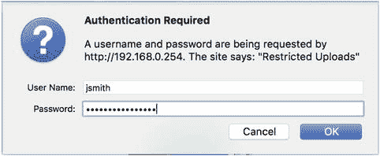
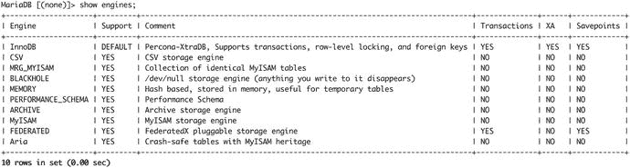
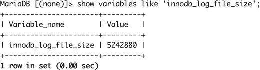
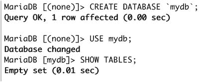
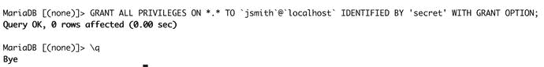
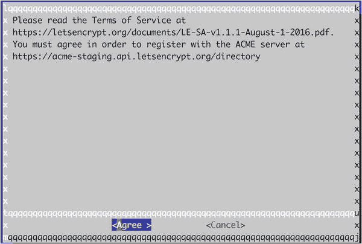
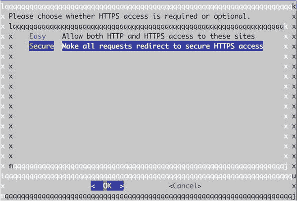
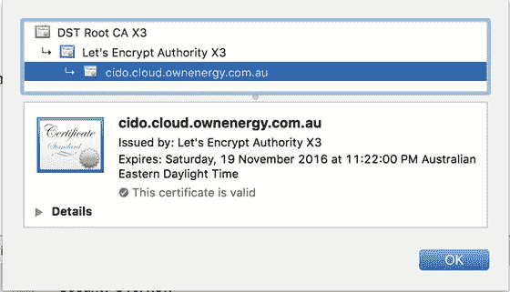
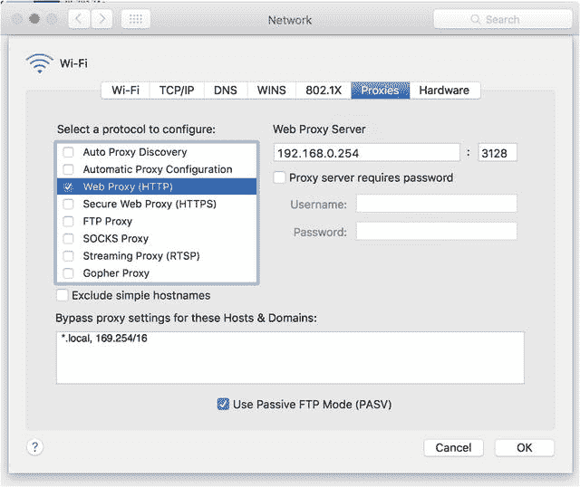

# 十一、Web 和 SQL 服务

您要做的最常见的事情之一是设置 web 服务。web 服务很可能需要一个结构化的英语查询语言(SEQUEL)数据库。在这一章中，我们将探索安全 web 服务的主要组成部分。

在本章中，您将学习如何安全地设置 Apache web 服务器和 MariaDB 数据库服务器。为了保护与新 web 服务器的通信，我们将使用 Let's Encrypt 来创建安全套接字层(SSL)/传输层安全性(TLS)证书。这也将为我们提供保护其他服务的证书。然后我们将展示如何安装一个内容管理系统和一个 webmail 应用程序。最后，我们将向您展示如何通过 web 代理保护您的员工，让他们的 web 浏览体验变得更快、更安全。

## Apache Web 服务器

Apache 是当今使用最广泛的开源软件之一。虽然它的受欢迎程度在过去几年中有所下降，但它仍然被用于托管超过 30%的现有网站 [<sup>1</sup>](#Fn1) ，并且通常因其成熟度、稳定性和应用程序的性质而被选中。它被设计成模块化的，因此可以通过启用或禁用模块来添加或删除额外的功能。几乎所有的 Linux 发行版都有软件包，所以您可以通过软件包管理系统在您的主机上安装它。

Apache 服务器可以作为单个站点的单个 web 服务器运行，或者更常见的是，可以作为虚拟主机服务于数百个站点。也就是说，许多网站共享底层资源，如单个 web 服务器的中央处理器(CPU)、磁盘资源和互联网协议(IP)地址。

Apache 目前有三个多处理模块(MPM)供您选择使用。它们是预工作、工作人员和事件。

*   prefork 模块是由单独的进程处理连接的地方。它适用于非线程安全的 web 应用程序。在 prefork 模块中，控制进程创建一个监听连接的子进程。
*   worker 模块混合了基于进程和基于线程的处理。它适用于线程安全应用程序。在 worker 模型中，父进程创建一个启动几个线程的子进程；为每个传入连接分配一个线程。一种是监听传入的连接，并将它们传递给等待的服务器线程。
*   事件模块较新，基于工作模块。它的线程模型类似于 worker，但是针对处理 keepalive 连接进行了优化。它用几个线程来处理 keepalivess，keepalive 将活动连接交给等待的线程。

Apache web 服务器的另一个流行替代品是 Nginx。Nginx 是一种快速的模块化 web 服务器，通常与 Apache 服务器一起用作缓存服务器，或者单独用作 web 服务器。我们将在第 [19](19.html) 章讨论 Ansible 时展示如何安装 Nginx 服务器。

### 安装和配置

CentOS 和 Ubuntu 都安装 Apache 版，但是包的命名不同。在 CentOS 上运行`sudo yum install httpd`，在 Ubuntu 上运行`sudo aptitude install apache2`。添加这些包将导致安装一些额外的库。

此外，CentOS 和 Ubuntu 都允许您通过加载您想要使用的特定模块来选择 MPM。我们将很快展示如何做到这一点。除了加载特定的 MPM，您还可以加载模块来加载运行不同 web 服务器应用程序所需的软件，比如 PHP 或 Django。我们很快也会向您展示这一点。

Note

如果您运行一个高容量、高流量的网站，您可能会考虑换一个不同的 Apache 引擎或者完全不同的 web 服务器，比如 Nginx。Nginx 不同于 Apache，因为它是真正的非阻塞、事件驱动的大规模 web 服务器。关于这些 web 服务器的差异和功能，请参见 [`https://www.digitalocean.com/community/tutorials/apache-vs-nginx-practical-considerations`](https://www.digitalocean.com/community/tutorials/apache-vs-nginx-practical-considerations) 。

您还可以在 [`http://en.wikipedia.org/wiki/Comparison_of_web_servers`](http://en.wikipedia.org/wiki/Comparison_of_web_servers) 找到 web 服务器列表。

我们将从展示如何为 Apache 进行基本配置开始。稍后，我们将展示如何添加一些模块来扩展功能。

#### CentOS

在这一节中，我们将展示如何配置我们的 Apache web 服务器。Apache web 服务器将其配置文件存储在`/etc/httpd`中，主配置文件是`/etc/httpd/conf/httpd.conf`。我们将首先编辑`/etc/httpd/conf/httpd.conf`文件，然后创建一个虚拟主机文件。

CentOS 的默认 MPM 模块是 prefork。您可以通过编辑`/etc/httpd/conf.modules.d/00-mpm.conf`来更改模块，并对适当的模块进行注释和取消注释。我们将使用 worker 模块，因为它提供了优于 prefork 模块的性能配置文件。

```sh
#LoadModule mpm_prefork_module modules/mod_mpm_prefork.so
LoadModule mpm_worker_module modules/mod_mpm_worker.so

```

主`httpd.conf`文件超过 350 行，所以我们不会显示每个选项。与许多其他 Linux 配置文件一样，`#`表示注释，选项以`<name> <directive>`的形式出现。让我们从基础开始:服务器名(`ServerName`)和网站管理员的电子邮件地址(`ServerAdmin`)。

```sh
ServerName au-mel-centos-1.example.com
ServerAdmin webmaster@example.com

```

Apache 在显示默认错误页面时会使用服务器名称和网站管理员电子邮件地址。我们已经为自己的主机输入了值，`au-mel-centos-1.example.com`和`webmaster@example.com`。默认情况下，Apache 将在所有可用的网络地址上监听和服务请求。如果你想选择一个特定的地址，你可以使用`Listen`指令来改变它。您也可以配置想要监听的端口。要更改默认值，您可以指定如下内容:

```sh
Listen 192.168.0.1:8080

```

前一行指定只监听特定的 IPv4 地址和端口 8080。要小心，因为当 Apache 试图启动时，具有相同 IP 和端口的多个`Listen`指令会给出一个错误(`(98)Address already in use`)。在我们的例子中，我们将设置`Listen`监听端口 80 上的所有地址。

```sh
Listen 80

```

通过设置`User`和`Group`字段，可以更改 web 服务器运行的用户和组。

```sh
User apache
Group apache

```

如果您更改了`User`和`Group`字段，重要的是不要将它们更改为系统中其他地方使用的用户和组，例如数据库用户。Apache 服务是由 root 用户启动的，因此它可以绑定到端口 80(一个特权端口),并按照这里定义的用户启动子进程。这个用户应该拥有尽可能少的特权，并且应该能够阅读它所提供的内容。

最后，我们将重点介绍这些配置项目:

```sh
Include conf.modules.d/*.conf
IncludeOptional conf.d/*.conf

```

第一个加载模块，比如前面描述的 MPM。模块提供不同的软件功能；有授权模块，像 PHP 这样的 web 语言模块，以及其他种类的特性。`IncludeOptional`指令可以用来存储配置文件，比如虚拟主机或者其他配置文件，比如`php.conf`。如果这些文件是有编号的，像`00-php.conf`，那么它们将按数字顺序加载。

##### 创建虚拟主机

我们现在准备创建我们的第一个虚拟主机。一台运行 Apache 的 Linux 主机可以服务数百或数千个网站，它们都有自己的主机名。我们称之为虚拟主机，因为这些网站都运行在一个单独的网络服务器上。有两种虚拟主机:基于 IP 和基于名称。Apache 可以同时提供这两者。

基于 IP 的虚拟主机使 Apache 根据接收请求的 IP 地址，从特定的目录提供 web 页面。对于每个基于 IP 的虚拟主机，Linux 主机需要有一个分配给网络接口的 IP 地址。正如我们在第 [7](07.html) 章中所讨论的，这是通过向接口添加额外的地址来实现的。现在服务器名称指示(SNI； [`www.ietf.org/rfc/rfc4366.txt`](http://www.ietf.org/rfc/rfc4366.txt) )可用，这是使用 SSL/TLS 证书时向 web 服务器提供服务器名称的一种方式。因为一些老的浏览器不支持 SNI，你仍然可以看到基于 IP 的虚拟主机，这样做是有意义的。

基于名称的虚拟主机使 Apache 根据远程用户连接的站点名称为特定目录提供网页。任意数量的基于名称的虚拟主机可以共享一个 IP 地址。站点的名称由一个特殊的头决定，这个头在请求中被发送到 web 服务器。

我们将创建一个命名的虚拟主机。为此，我们需要为我们的站点创建一个配置文件。我们在 Apache `conf.d`目录下`/etc/httpd/conf.d/` [`www.example.com.conf`](http://www.example.com.conf) 中创建这个文件。让我们从如何描述虚拟主机开始。

```sh
<VirtualHost *:80>
...
</VirtualHost>

```

Apache 有一个特殊的语法来描述虚拟主机。每个虚拟主机的所有配置都需要包含在`<VirtualHost *:80>` … `</VirtualHost>`指令中。opening 指令声明虚拟主机的开始，在这种情况下，指定您应该监听该主机端口 80 上的所有网络接口(`*:80`)。然后，我们用关闭指令`</VirutalHost>`关闭虚拟主机配置。

对于基本虚拟主机，我们可以使用以下配置:

```sh
<VirtualHost *:80>

  ServerName www.example.com
  ServerAdmin webmaster@example.com
  DocumentRoot  /var/www/html/www.example.com

</VirtualHost>

```

`ServerName`告诉 Apache 服务器应该将对 [`www.example.com`](http://www.example.com) 网站的请求发送到这个虚拟主机。`DocumentRoot`目录设置是 Apache 为网站提供文件的地方。您可以覆盖此虚拟主机的网站管理员电子邮件地址。

我们可以在文档根目录下创建一个`index.html`文件，并启动 Apache 服务器。

```sh
$ sudo mkdir –p /var/www/html/www.example.com
$ sudo bash –c "echo www.example.com > /var/www/html/www.example.com/index.html"

```

现在我们只需要重启我们的 Apache 服务器。不过，在此之前，我们应该验证我们的 Apache 配置。我们通过以下方式做到这一点:

```sh
$ sudo apachectl configtest
Syntax OK

```

这里我们使用`apachectl`命令来管理我们的 Apache 服务。`apachectl`程序可以用来启动、停止、重启、正常重启和检查配置，就像我们在这里所做的一样。更多信息参见`man apachectl`页面。要启动 Apache 服务，还可以在 CentOS 上使用`systemctl`命令。让我们继续做那件事。

```sh
$ systemctl start httpd.service

```

您将在`/var/log/httpd`目录中看到 Apache 服务的日志。您可以使用以下命令跟踪日志:

```sh
$ sudo tail –f /var/log/httpd/access_log /var/log/httpd/error_log

```

现在我们可以检查我们的主机是否如我们预期的那样响应。为此，我们将使用`curl`命令。`curl`命令将允许我们在 shell 中向 web 服务器发出请求。

```sh
$ curl –H 'Host: www.example.com' http://localhost
www.example.com

```

这表明我们的服务器已经正确地响应了我们的虚拟主机。使用`curl`命令，我们向监听本地主机的 web 服务器发出请求。我们还发送了一个`Host`头(`-H 'Host:`)，其中包含了我们希望向其发送请求的 web 服务器的名称。Apache 将读取这个头并将这个请求传递给相应的虚拟主机。如果它找不到具有相同`ServerName`字段的虚拟主机，它会将请求路由到“基本”虚拟主机，或者换句话说，它加载的第一个虚拟主机。因此，最好在配置文件中添加一个数字作为后缀，如`00-` [`www.example.com.conf`](http://www.example.com.conf) ，它将决定虚拟主机的加载顺序。

在我们向外界公开之前，我们应该确保我们的防火墙允许超文本传输协议(HTTP)流量到达我们的主机。首先，让我们看看当前防火墙允许的服务列表。

```sh
$ sudo firewall-cmd --list-services
dhcpv6-client ssh

```

我们需要添加`http`服务。我们用`firewall-cmd`再做一次。

```sh
$ sudo firewall-cmd --add-service http --permanent
$ sudo firewall-cmd --reload

```

默认情况下，这将服务添加到公共区域。现在我们应该能够从远程客户端访问我们的站点了。

在 Ubuntu 上，基本配置被分成多个文件。Ubuntu 上 Apache 加载的主文件是`/etc/apache2/apache2.conf`。我们已经在清单 [11-1](#Par59) 中包含了这个文件中的基本配置指令。虽然该文件包含常见的 Apache 指令，但它引用了其他文件来通过 include 语句配置虚拟主机、模块、端口和 IP 地址，就像我们在 CentOS `httpd.conf`文件中看到的那样。

```sh
ServerRoot "/etc/apache2"
Mutex file:${APACHE_LOCK_DIR} default
PidFile ${APACHE_PID_FILE}

Timeout 300

KeepAlive On
MaxKeepAliveRequests 100
KeepAliveTimeout 5

User ${APACHE_RUN_USER}
Group ${APACHE_RUN_GROUP}

AccessFileName .htaccess
<FilesMatch "^\.ht">
        Require all denied
</FilesMatch>

HostnameLookups Off
ErrorLog ${APACHE_LOG_DIR}/error.log
LogLevel warn
LogFormat "%v:%p %h %l %u %t \"%r\" %>s %O \"%{Referer}i\" \"%{User-Agent}i\"" vhost_combined
LogFormat "%h %l %u %t \"%r\" %>s %O \"%{Referer}i\" \"%{User-Agent}i\"" combined
LogFormat "%h %l %u %t \"%r\" %>s %O" common
LogFormat "%{Referer}i -> %U" referer
LogFormat "%{User-agent}i" agent

IncludeOptional mods-enabled/*.load
IncludeOptional mods-enabled/*.conf
Include ports.conf

# Include generic snippets of statements
IncludeOptional conf-enabled/*.conf

# Include the virtual host configurations:
IncludeOptional sites-enabled/*.conf

Listing 11-1.Defaults in Ubuntu’s apache2.conf File

```

Ubuntu 上的默认配置与 CentOS 上的基本相同。然而，Ubuntu 和 Debian 在管理虚拟主机或站点配置的方式上有所不同。最明显的是，您会看到在配置中声明了几个环境变量。这些解析的值可以在`/etc/apache2/envvars`文件中找到。

同样值得注意的是`AccessFileName`指令。它指定可能包含服务器配置指令的文件的名称。这个文件被命名为`.htaccess`，任何 web 目录都可能包含这样一个文件。服务器将检查文件是否存在，并在尝试向连接的客户端提供文件之前处理它包含的任何指令。

因为`.htaccess`文件可能包含敏感信息，我们应该限制对该文件的访问。以下指令实现了这一点:

```sh
<FilesMatch "^\.ht">
        Require all denied
</FilesMatch>

```

这是一个匹配指令的例子，我们可以匹配任何以`.ht` ( `<FilesMatch "^\.ht">`)开头的文件，并拒绝所有访问这些文件的请求(`Require all denied`)。

Note

不建议使用文件，因为使用它们会对性能产生负面影响。

日志指令描述了我们将如何记录我们的 Apache 信息。您可以通过使用`LogFormat`指令来决定在 Apache 日志中记录什么。

```sh
LogFormat "%v:%p %h %l %u %t \"%r\" %>s %O \"%{Referer}i\" \"%{User-Agent}i\"" vhost_combined

```

Apache 解释字符串中的每个`%<value>`,并允许您以对自己有用的方式格式化日志输出。在这个`LogFormat`指令中，我们让 Apache 包含接受请求的虚拟主机的虚拟主机(`%v`)和端口(`%p`)。接下来我们有远程主机名(`%h`)和远程用户名(`%l`)、认证用户(`%u`)。记录请求(`%r`)以及最终状态(`%>s`)和字节大小(`%O`)。最后，我们记录 referrer ( `%{Referer}i`)和 user agent ( `%{User-Agent}i`)，它们利用了 Apache VARNAMEs——可用于记录格式的变量名。这些是从浏览器发送的标头中派生出来的。然后我们将这种日志格式命名为`vhost_combined`。现在，我们可以在配置中使用这种格式，方法是像这样声明`CustomLog`:

```sh
<VirtualHost *:80>
...
  CustomLog ${APACHE_LOG_DIR}/access.log vhost_combined
...
</VirtualHost>

```

你可以在 [`https://httpd.apache.org/docs/2.4/mod/mod_log_config.html#formats`](https://httpd.apache.org/docs/2.4/mod/mod_log_config.html#formats) 找到更多关于`LogFormat`选项的信息。在 [`http://httpd.apache.org/docs/current/expr.html`](http://httpd.apache.org/docs/current/expr.html) 可以看到 VARNAMEs 中可以使用的变量。

在 CentOS `httpd.conf`文件中，我们有`Listen`指令；在 Ubuntu 上，Apache 从`ports.conf`文件中加载关于应该监听哪些 IP 地址和端口的信息；该文件的默认值如下:

```sh
Listen 80

<IfModule ssl_module>
    Listen 443
</IfModule>

<IfModule mod_gnutls.c>
    Listen 443
</IfModule>

```

在这个文件中，你将看到如何防御性地为模块添加指令。类似超文本标记语言(HTML)的语法`<IfModule ssl_module>…</IfModule>`表示只有当`ssl_module`被加载时`Listen 443`指令才应该被加载。这可以防止 Apache 在模块尚未启用时出错。

Ubuntu 与 CentOS 的不同之处还在于它包含了模块和配置文件，比如虚拟主机。你会看到有`IncludeOptional <resource>-enabled/*.conf`之类的指令。Ubuntu(当然还有 Debian)利用符号链接来启用模块或配置选项。

##### 管理模块

我们来看看`/etc/apache2/mod-available`目录。我们已经进入了`/etc/apache2`目录，并将执行一个`mod-available`目录的列表。在该目录中，您将找到当前可以在 Apache 启动时加载的模块。事实上，这就是我们选择想要为 Ubuntu 加载的 MPM 的方式。

```sh
$ ll mods-available/mpm*
-rw-r--r-- 1 root root 668 Mar 19 09:48 mods-available/mpm_event.conf
-rw-r--r-- 1 root root 106 Mar 19 09:48 mods-available/mpm_event.load
-rw-r--r-- 1 root root 571 Mar 19 09:48 mods-available/mpm_prefork.conf
-rw-r--r-- 1 root root 108 Mar 19 09:48 mods-available/mpm_prefork.load
-rw-r--r-- 1 root root 836 Mar 19 09:48 mods-available/mpm_worker.conf
-rw-r--r-- 1 root root 107 Mar 19 09:48 mods-available/mpm_worker.load

```

在前面的清单中，您可以看到我们已经讨论过的三种不同的 Apache MPM 引擎。如果我们现在查看`/etc/apache2/mod-enabled`目录，我们可以看到 Apache 启动时加载了这些模块中的哪一个。

```sh
$ ls -l mods-enabled/mpm*
lrwxrwxrwx 1 root root 32 Aug  5 12:18 mods-enabled/mpm_event.conf -> ../mods-available/mpm_event.conf
lrwxrwxrwx 1 root root 32 Aug  5 12:18 mods-enabled/mpm_event.load -> ../mods-available/mpm_event.load

```

现在你可以看到默认情况下 Ubuntu 将运行 MPM 事件。有一个`.conf`文件和一个加载文件，一个文件用于配置指令，另一个用于实际加载模块。虽然您可以自己添加符号链接来启用模块，但首选方法是使用 Ubuntu 为此提供的命令。这些命令是用于启用模块(创建符号链接)的`a2enmod`和用于禁用模块(删除符号链接)的`a2dismod`。

为了展示如何使用这些命令，我们将启用和禁用`status`模块，该模块允许我们查看 web 服务器的当前状态。首先，为了启用它，我们将发出以下命令:

```sh
$ sudo a2enmod status
Enabling module status.
To activate the new configuration, you need to run:
  service apache2 restart

```

这可以在任何目录下执行，并且需要重启`apache2`服务。该命令创建了以下符号链接:

```sh
$ ls -l mods-enabled/status*
lrwxrwxrwx 1 root root 29 Aug  6 05:08 mods-enabled/status.conf -> ../mods-available/status.conf
lrwxrwxrwx 1 root root 29 Aug  6 05:08 mods-enabled/status.load -> ../mods-available/status.load

```

现在，让我们使用以下命令禁用该模块:

```sh
$ sudo a2dismod status
Module status disabled.
To activate the new configuration, you need to run:
  service apache2 restart

```

Ubuntu 没有检查目录中的符号链接，而是提供了另一个命令来检查当前的 Apache 设置。`a2query`命令可用于查找模块的状态，如下所示:

```sh
$ a2query -m status
No module matches status (disabled by site administrator)

```

因为我们刚刚禁用了该模块，所以状态模块被列为禁用。如果模块不存在，您只会看到“没有模块匹配 fakemodule”。`a2query`也可用于查询其他配置选项，如表 [11-1](#Tab1) 所述。

表 11-1。

a2query Options

<colgroup><col> <col></colgroup> 
| `-q` | 安静输出，用于脚本 |
| `-m <module>` | 列出已启用的模块，如果没有指定模块，则列出所有模块 |
| `-M` | 列出当前的 MPM |
| `-s <site>` | 检查站点是否已启用，如果没有指定站点，则检查全部 |
| `-c <conf>` | 列出已启用的配置文件，如果没有指定配置，则列出全部 |
| `-d` | 返回`Apache2`模块目录 |

##### 在 Ubuntu 上管理网站

我们将向 Ubuntu web 服务器添加一个虚拟主机，就像我们对 CentOS 主机所做的那样。传统上，Debian(和 Ubuntu)系统管理员倾向于将服务相关的文件放在`/srv`目录中。在这个例子中，我们不打算遵循这个习惯用法，但是没有理由不能将 web 服务器文件放在`/srv/www`或`/var/local`目录中或者文件系统上任何其他有意义的地方。为了定义虚拟主机，我们将把清单 [11-2](#Par90) 中的指令添加到`/etc/apache2/sites-available/` [`www.example.com`](http://www.example.com) 中。

```sh
<VirtualHost *>
    ServerName www.example.com
    ServerAlias example.com
    ServerAdmin webmaster@localhost
    DocumentRoot /var/www/html/www.example.com
    <Directory /var/www/html/www.example.com>
        Options Indexes FollowSymLinks Includes IncludesNOEXEC SymLinksIfOwnerMatch
        AllowOverride None
    </Directory>
</VirtualHost>
Listing 11-2.Our New Virtual Host Definition

```

这类似于我们的 CentOS 虚拟主机声明。在这个例子中，我们添加了一些额外的指令。我们首先打开`VirtualHost`标签，并指定该定义将应用于所有地址。接下来，我们指定希望该虚拟主机回复的名称。只有一个`ServerName`可以应用于任何给定的虚拟主机，但是其他的可以通过`ServerAlias`添加。您可以通过使用更多的`ServerAlias`指令或者通过将额外的主机名添加到由空格分隔的单个`ServerAlias`来添加额外的别名。

正如我们已经说过的，`DocumentRoot`指令指定了这个虚拟主机将提供文件的目录。一旦定义了这个，就可以使用`Directory`指令来指定这个目录及其包含的所有文件和目录的选项。您指定的列表与 CentOS 机器上的列表相同。`Options`指令列出了在任何特定目录中启用的特性。在表 [11-2](#Tab2) 中，我们对此处包含的内容进行了解释。通过将`AllowOverride`设置为`None`，您拒绝服务器使用来自`.htaccess`文件的设置来修改这些选项。您可以通过将`AllowOverride`设置为`All`来实现这一点，或者使用类似`Options=Indexes,MultiViews`的东西来更详细地描述什么是允许的。最后，关闭`Directory`和`VirtualHost`指令并保存文件。

表 11-2。

Options

<colgroup><col> <col></colgroup> 
| [计]选项 | 功能 |
| --- | --- |
| `All` | 除`MultiViews`外的所有选项。 |
| `ExecCGI` | 脚本作为应用程序执行，其输出被发送到浏览器。 |
| `FollowSymLinks` | 服务器可以跟随符号链接并提供它所指向的文件或目录。 |
| `Includes` | 服务器将处理可以嵌入页面的服务器端包含指令。 |
| `IncludesNOEXEC` | 服务器端 include 指令可能不会在服务器上执行脚本。 |
| `Indexes` | 如果目录中不存在索引页，则在列表中直接显示目录。 |
| `SymLinksIfOwnerMatch` | 只有当链接的所有者与链接目标的所有者相同时，服务器才能跟踪符号链接。 |
| `MultiViews` | 使用`mod_negotiation`模块，您可以根据客户端的能力指定如何选择内容。 |

我们可以通过使用实用程序`a2ensite`来启用虚拟主机。像`a2enmod`一样，这将创建从`/etc/apache2/sites-available`到`/etc/apache2/sites-enabled`的符号链接。

```sh
$ sudo a2ensite www.example.com
Enabling site www.example.com.
To activate the new configuration, you need to run:
  service apache2 reload

```

您现在可以按照脚本建议的那样做，或者使用`sudo apache2ctl graceful`手动重新加载服务器配置。您还可以使用`a2query`来检查站点是否启用，如下所示:

```sh
$ sudo a2query -s www.example.com
www.example.com (enabled by site administrator)

```

我们还可以通过发出以下命令来确保防火墙允许 HTTP 流量通过我们的主机:

```sh
$ sudo ufw allow http

```

这允许 web 流量通过我们的 web 服务。

### httpd 性能

有几个旋钮和转盘可以针对 Apache 性能进行调整。一个 Apache web 服务器，在不改变默认设置的情况下，可以处理数百个并发用户。我们将在这里讨论其中的一些。性能是一个相对的主题，您应该使用从您的 web 服务和主机收集的指标来指导您完成这个过程。第 [17 章](17.html)将处理指标收集。

大多数文档会告诉你，随机存取存储器(RAM)是首先要考虑的。对于您的 web 应用程序和系统进程，您将需要足够的内存。写密集型应用程序将需要速度适当的磁盘。为此，从系统指标收集的数据将成为您的指南。

以下设置决定了 Apache 如何管理连接超时和保持活动状态:

```sh
Timeout 300

KeepAlive On
MaxKeepAliveRequests 100
KeepAliveTimeout 5

```

`Timeout`是连接超时设置，以秒为单位。这可以根据您的要求加长或缩短。`KeepAlive`设置决定了 Apache 如何处理长时间运行的会话。您可以指定 Apache 服务器应该使用相同的 TCP 连接，而不是为会话创建新的 TCP 连接。您可以使用`MaxKeepAliveRequests`和`KeepAliveTimeout`微调这些设置。

不同的 MPM 也有办法调整它们的性能。我们将在这里查看工人和事件 MPM。

对于工作人员和事件绩效，有两个主要的绩效选项可以调整。第一个是`ThreadsPerChild`，第二个是`MaxRequestWorkers. ThreadsPerChild`描述每个子进程创建了多少个服务器线程。`MaxRequestWorkers`确定总共启动的最大线程数。许多 web 浏览器与 web 服务器建立多个连接，因此它们可以同时下载样式表和图像。因此，来自用户的单个 web 连接可以启动多个线程。这意味着每个用户连接都会增加系统资源的数量，例如 RAM 和 CPU 时间。如果您遇到性能不佳的情况，应该调整、监控和优化这些设置。

Apache httpd 文档为一些合理的性能设置提供了一些指导。但是，以下是员工 MPM 的默认设置:

```sh
ServerLimit          16
StartServers          3
MaxRequestWorkers   400
MinSpareThreads      75
MaxSpareThreads     250
ThreadsPerChild      25

```

至于设置，`ServerLimit`定义了活动线程数量的硬限制。`MaxRequestWorkers`设置为 400，这是总线程数。该值来自于`ServerLimit`值乘以`ThreadsPerChild`值，后者被设置为 25。`StartServers`是启动的线程的初始数量。`MinSpareThreads`和`MaxSpareThreads`定义最小和最大空闲线程。Apache 将根据这些设置来减少或增加可用的空闲线程。

对于事件 MPM，除了对工人 MPM 进行调优之外，还有另外一个性能考虑因素。对于事件 MPM，由于没有线程来处理新请求，这种情况可能会导致线程饥饿。`AsyncRequestFactor`可以通过限制并发连接数来对空闲线程进行微调。

建议您在测量和调优 Apache 服务器时，将`mod_status`模块与任何可用的指标收集工具结合使用。

### 存取限制

在配置部分，我们讨论了使用`Require`指令来限制对目录的访问。在本节中，我们将向您展示更多关于该指令以及如何使用基本用户名和密码来保护您的站点的信息。

`Require`指令可以用来限制对目录(和位置)路径的访问。您已经看到它已经被用来保护对`.htacess`文件的访问。

```sh
<FilesMatch "^\.ht">
        Require all denied
</FilesMatch>

```

这里我们拒绝了对任何以`.ht`开头的文件的访问。该指令来自`mod_authz_core`模块。还有其他人扩展了这个模块，比如`mod_authz_host`，它允许我们基于 IP 授权访问。

举个例子，假设我们有一个名为`/var/www/html/` [`www.example.com/uploads`](http://www.example.com/uploads) 的目录。我们可以限制只能从内部 IP 地址访问。

```sh
<Directory /var/www/html/www.example.com/uploads>
    Options -Indexes -FollowSymLinks
    AllowOverride None
    Require ip 192.168.0
</Directory>

```

模块`mod_authz_host`为我们提供了根据 IP 地址限制访问部分站点的功能。在前面几行中，只有远程 IP 地址位于 192.168.0.0/24 子网中的主机才能访问此目录。在表 [11-3](#Tab3) 中，你可以看到`Require`指令可用的其他选项。

表 11-3。

Require Options

<colgroup><col> <col></colgroup> 
| `Require all granted` | 无条件允许访问。 |
| `Require all denied` | 无条件拒绝访问。 |
| `Require env <envvar>` | 如果设置了环境变量，则授予访问权限。 |
| `Require method <method>` | 对某些 HTTP 方法授予访问权限。 |
| `Require expr <expression>` | 如果表达式为真，则授予访问权限。 |
| `Require user <userid>` | 仅向这些用户授予访问权限(`mod_authz_user`)。 |
| `Require group <group-name>` | 将访问权授予指定组中的用户(`mod_authz_groupfile`)。 |
| `Require valid-user` | 将访问权授予授权用户。 |
| `Require ip <IPaddress>` | 授予 IP 地址范围内的客户端访问权限。 |

限制访问资源的另一种方法是要求用户输入用户名和密码。许多 web 应用程序在内部进行管理，但是您也可以让 Apache 管理用户名和密码的列表，从而允许您保护特定的目录，而不需要额外的软件。身份验证源可以是文件、数据库或轻量级目录访问协议(LDAP)。我们将向您展示如何执行由文件支持的身份验证。

首先，我们需要创建一个文件，其中包含我们希望通过`htpasswd`实用程序使用的用户名和密码。我们不想把这个文件放在 Apache 服务器服务的目录中，所以我们创建了一个名为`/opt/apache/` [`www.example.com`](http://www.example.com) 的目录，并把我们的密码文件放在那里。通常，我们传递要使用的文件名和要创建的用户作为参数，但是如果文件尚不存在，我们还需要传递`-c`选项。

```sh
$ sudo htpasswd -c /opt/apache/www.example.com/passwords jsmith
New password:
Re-type new password:
Adding password for user jsmith

```

我们现在可以添加额外的用户，而不需要`-c`选项。如果我们不想被要求输入密码，我们也可以通过`-b`选项在命令行上设置。

```sh
$ sudo htpasswd -b /opt/apache/www.example.com/passwords ataylor s3kr@t
Adding password for user ataylor

```

接下来，我们需要告诉 Apache 请求认证。如果您选择在`/var/www/` [`www.example.com`](http://www.example.com) 目录中的`.htaccess`文件中这样做，您将需要添加覆盖`AuthConfig`选项的能力。我们需要设置`AllowOverride AuthConfig`,这样才能正常工作。我们不打算添加`.htaccess`指令；我们将在虚拟主机配置中添加目录级别的身份认证。

```sh
    <Directory /var/www/html/www.example.com/uploads>
        Options -Indexes -FollowSymLinks
        AllowOverride None
        AuthType Basic
        AuthName "Restricted Uploads"
        AuthBasicProvider file
        AuthUserFile "/opt/apache/www.example.com/passwords"
        Require valid-user
</Directory>

```

首先，我们通过`AuthType`指令指定想要使用的认证类型，在我们的例子中是`basic`。然后我们需要告诉 Apache 哪个模块将使用`AuthBasicProvider`，也就是`file`，提供基本的认证。接下来，我们需要通过`AuthUserFile`指令告诉 Apache 哪个文件保存了我们的认证信息。

为了帮助用户确定他们试图访问什么，我们可以通过`AuthName`指令为受保护的资源指定一个名称。当用户被要求提供凭证时，该名称将会显示给用户，如图 [11-1](#Fig1) 所示，因此让该名称更具描述性会有所帮助。



图 11-1。

Apache authentication

最后，需要告诉 Apache，只有在用户成功通过身份验证的情况下，才能授予访问权限。我们通过指定`Require valid-user`来做到这一点。

如果我们现在浏览到 [`www.example.com/uploads`](http://www.example.com/uploads) ，浏览器会要求我们输入用户名和密码，如图 [11-1](#Fig1) 所示。

如果我们不提供有效的用户名和密码，我们将不会被授予访问权限，但是如果我们输入有效的凭证，Apache 将允许我们查看该站点。应该注意的是，我们通过未加密的 HTTP 会话传递凭证，这是一种危险的做法。我们将很快向您展示如何设置一个 HTTP 安全(HTTPS)服务器。

您可以在 Apache 文档站点上阅读更多关于基于主机和基于用户的访问控制的内容。

*   [T2`https://httpd.apache.org/docs/2.4/howto/auth.html`](https://httpd.apache.org/docs/2.4/howto/auth.html)
*   [T2`https://httpd.apache.org/docs/2.4/howto/access.html`](https://httpd.apache.org/docs/2.4/howto/access.html)

### 模块

我们已经讨论了模块，以及它们如何为 Apache 提供额外的功能，并使用`LoadModule`指令来启用。该指令指定应该加载的模块文件的路径。

在 CentOS 上，额外的模块通常由模块包安装的`/etc/httpd/conf.modules.d`中的配置片段启用。当服务器重新启动时，它会选取这些新文件并处理它们的指令。您可以通过在文件名前添加一个数字来对这些模块的加载方式进行排序，这是 CentOS 上的默认设置。为了防止包含这样的代码片段，从而禁用该模块，您可以重命名它，使其文件名不再以`.conf`结尾，或者从目录中移动或删除该文件。您也可以注释(#)文件中的任何指令。

在 Ubuntu 上，模块包将这些代码片段添加到`/etc/apache2/mods-available`目录中，然后在`/etc/apache2/modules-enabled`目录中创建指向它们的链接。这些链接也可以使用`a2enmod`和`a2dismod`命令手动管理，类似于`a2ensite`和`a2dissite`。

在 [`http://httpd.apache.org/docs/2.4/mod/`](http://httpd.apache.org/docs/2.4/mod/) 可以获得关于所有包含的 Apache 模块及其提供的功能的信息。

#### 安装 PHP 支持

许多 web 应用程序都是用 PHP 编写的，PHP 是一种由拉斯马斯·勒德尔夫开发的脚本语言，它为世界各地的许多网站提供支持，包括流行的 WordPress 内容管理系统(CMS)。当您的 web 浏览器从这样的应用程序请求页面时，web 服务器处理页面中的代码，并向您的浏览器显示输出。为了能够托管这些 web 应用程序，web 服务器需要能够理解和执行 PHP 代码。

执行 PHP 有两种方法。您可以通过安装一个模块并使用 prefork Apache MPM 来为 Apache 添加 PHP 支持。然而，我们将使用 worker MPM，由于 PHP 不是线程安全的，我们将使用 FastGGI 进程管理器将 Apache 链接到 PHP。

Note

你可以在 [`www.php.net/`](http://www.php.net/) 阅读所有关于 PHP 的内容。

PHP 本身是模块化的，所以你可以通过安装额外的包来增加 PHP 的功能。我们将很快建立一个 MariaDB 服务器，所以要让 web 应用程序使用它，我们需要在 PHP 中添加 MariaDB 支持。此外，我们将安装对常用的 GD 图形库(用于处理和操作图像文件)、mbstring 字符串转换库(提供对多字节字符串编码的支持)和 IMAP 邮件协议(提供处理 Internet Message Access Protocol[IMAP]和 Post Office Protocol [POP3]功能以处理邮件的能力)的支持。后者将允许我们安装和使用基于 PHP 的 webmail 应用程序。

在 CentOS 上，我们可以通过`sudo yum install php-fpm php-mysql php-gd php-imap php-mbstring`安装所有这些，在 Ubuntu 上通过`sudo aptitude install php-fpm php-mysql php-mbstring php-gd php-imap`安装。

在本章的后面，我们将建立一个使用 PHP 的网站。但是在这里，我们将向您展示如何在我们的 CentOS 主机上的虚拟主机中使用 PHP-FPM。

首先，我们需要确保加载了以下模块。如您所知，模块是通过`/etc/httpd/conf.modules.d/`目录加载的。我们正在寻找两个代理文件。

```sh
$ grep -E '(proxy.so|fcgi)' /etc/httpd/conf.modules.d/00-proxy.conf
LoadModule proxy_module modules/mod_proxy.so
LoadModule proxy_fcgi_module modules/mod_proxy_fcgi.so

```

这些模块分别由 CentOS 和 Ubuntu 的`httpd`包和`apache2`包提供。

接下来我们将移走我们的`/etc/httpd/conf.d/php.conf`文件，因为这是`php`模块的配置文件。

```sh
$ sudo mv /etc/httpd/conf.d/php.conf /etc/httpd/conf.d/php.conf_bak

```

PHP-FPM 是一个守护进程，它将翻译来自 HTTP 服务器的请求，并用来自 PHP 代码的适当响应进行响应。`php-fpm.conf`文件配置这个守护进程。PHP-FPM 可以将应用程序分成多个池。您在`/etc/php-fpm.d`目录中创建池。我们现在要编辑`/etc/php-fpm.d/` [`www.conf`](http://www.conf) 文件并添加下面一行:

```sh
; Start a new pool named 'www'.
[www]

; The address on which to accept FastCGI requests.
; Valid syntaxes are:
;   'ip.add.re.ss:port'    - to listen on a TCP socket to a specific address on
;                            a specific port;
;   'port'                 - to listen on a TCP socket to all addresses on a
;                            specific port;
;   '/path/to/unix/socket' - to listen on a unix socket.
; Note: This value is mandatory.
listen = 127.0.0.1:9000
listen = /run/php-fcgi.sock

```

编辑完该文件后，您需要重启`php-fpm`。你可以用`$ sudo systemctl restart php-fpm`在 CentOS 上做到这一点。您现在应该注意到在`/run`目录(这是一个特殊的内存目录)中创建了一个套接字文件。

```sh
$ ll /run/php-fcgi.sock
srw-rw-rw-. 1 root root 0 Aug 16 09:49 /run/php-fcgi.sock

```

一旦完成，我们就可以运行 PHP 网站了。剩下要做的就是在我们的 HTTP 配置中添加一个`ProxyPassMatch`指令来匹配任何`.php`文件，并将它们传递给 PHP-FPM 守护进程。

```sh
<VirtualHost *:80>

  ServerName www.example.com
  ServerAdmin webmaster@example.com
  DocumentRoot  /var/www/html/www.example.com
  DirectoryIndex index.php
  ProxyPassMatch ^/(.*\.php(/.*)?)$ unix:/run/php-fcgi.sock|fcgi://127.0.0.1:9000/var/www/html/www.example.com/
  <Directory /var/www/html/www.example.com>
     Require all granted
  </Directory>
</VirtualHost>

```

虚拟主机现在已经准备好处理我们的 PHP 应用程序，我们将在本章的后面安装它。`ProxyPassMatch`允许我们使用正则表达式来匹配统一资源定位符(URL ),并将请求传递给代理后端。我们提供代理监听的位置，并给它我们将安装 PHP 代码的目录的位置。

你可以在这里阅读更多关于`mod_proxy`的指令，包括`ProxyPassMatch`指令:

*   [T2`https://httpd.apache.org/docs/current/mod/mod_proxy.html`](https://httpd.apache.org/docs/current/mod/mod_proxy.html)

### 文件和目录权限

当您使用网站时，您需要对安装网站的文档根目录具有写权限。同时，Apache 用户需要不能写入相同的目录，因为这可能允许匿名 web 用户在发现网站中的漏洞时向您的系统写入文件。

如果多个用户将管理网站，为此创建一个组是个好主意。只要该组对文档根目录具有写权限，您添加到该组的任何用户都将能够写文件和创建目录。很多时候，web 应用程序是由部署用户自动部署的。

Tip

使用一个特定的系统组来管理网站也意味着你可以允许这个组的成员通过`sudo`使用`apachectl`或`apache2ctl`命令，而不需要给他们完全的根访问权限。

为了确保一个用户创建的文件可以被同一组中的另一个用户修改，您需要设置`umask`选项，以便任何新创建的文件和目录都可以被该组写入。您还需要设置`setgid`位，以便新的文件和目录将从拥有父目录的组继承所有权，而不是碰巧创建了有问题的文件或目录的用户的主要组。稍后，当我们安装一些 web 应用程序时，我们将向您展示一个这样的示例。

Tip

您可以在 [`http://httpd.apache.org/`](http://httpd.apache.org/) 找到更多信息和 Apache 文档。

## SQL 数据库

因为许多基于 web 的应用程序使用 SQL server 来存储数据，所以我们还将向您展示如何安装 SQL server。我们将向您展示如何安装 MySQL 数据库服务器的一个名为 MariaDB 的分支。数据库服务器提供数据存储和检索，而客户端可以是使用数据库服务器的任何应用程序，可以是命令行实用程序、LibreOffice 或网站使用的库。

因为 MariaDB 是 MySQL 的一个分支，所以它是 MySQL 数据库的直接替代。在 MariaDB 中，MySQL 的许多命令都是相同的，配置和环境变量也是相同的，因此很容易在这些数据库之间进行交换。MariaDB 之所以产生，是因为 MySQL 被甲骨文公司收购后，MySQL 的前开发者希望在 GNU 通用公共许可证(GNU GPL)许可下保持免费。

MariaDB 仍然将 MySQL 中的代码或移植代码合并到其代码库中，尽管它们不相同，但 MariaDB 的版本可以映射到 MySQL 的版本。直到 MariaDB 的 5.5 版本，MariaDB 一直保持着与 MySQL 相同的版本号。但是最近它把发布号改成了 10.x，这可能会让事情变得更加混乱。下表 [11-4](#Tab4) 说明了这些版本。

表 11-4。

MariaDB to MySQL Versions

<colgroup><col> <col></colgroup> 
| MariaDB 5.5 | MariaDB 5.3 和 MySQL 5.5 |
| MariaDB 10.0 | MariaDB 5.5 和后端口 MySQL 5.6 |
| MariaDB 10.1 | 包含 MySQL 5.6 和 5.7 的端口 |
| MariaDB 10.2 | Alpha 版本 |

Note

对于这些版本号变化背后的原因的解释，见 [`https://mariadb.org/explanation-on-mariadb-10-0/`](https://mariadb.org/explanation-on-mariadb-10-0/) 。

### 装置

在 CentOS 和 Ubuntu 上，您可以使用软件包管理器轻松安装 MariaDB。在 CentOS 上，MariaDB 通过`mariadb-server`包安装。

```sh
$ sudo yum install mariadb-server

```

在 Ubuntu 上，服务器组件由`mariadb-server-core-10.0`包提供(编写时)。你可以通过虚拟包安装它。

```sh
$ sudo aptitude install mariadb-server.

```

#### 初始配置

您需要进行一些基本的配置更改。默认情况下，在 CentOS 上，MariaDB 服务器监听所有已配置的网络接口和地址上的连接。因为我们将 web 服务器和数据库放在同一台主机上，所以我们将限制数据库只监听环回地址。这更安全，但是在理想情况下，我们应该将数据库服务器和 web 服务器放在不同的主机上。对于 Ubuntu，如果您检查`/etc/mysql/mariadb.conf.d/50-server.cnf`配置文件，您会看到下面的 bind-address 指令已经存在。

在 CentOS 上，我们在文本编辑器中打开`/etc/my.cnf`，并在`[mysqld]`部分下添加以下行:

```sh
bind-address = 127.0.0.1

```

这里我们指示数据库服务器只监听环回地址，这样可以防止其他主机访问我们的数据库。当我们希望其他主机访问我们的数据库时，我们需要更改它，在适当的接口上监听。我们的新配置文件将类似于清单 [11-3](#Par175) 。

```sh
[mysqld]
bind-address = 127.0.0.1

datadir=/var/lib/mysql
socket=/var/lib/mysql/mysql.sock
# Disabling symbolic-links is recommended to prevent assorted security risks
symbolic-links=0

[mysqld_safe]
log-error=/var/log/mariadb/mariadb.log
pid-file=/var/run/mariadb/mariadb.pid

!includedir /etc/my.cnf.d

Listing 11-3.Our /etc/my.conf on CentOS

```

可以为 MariaDB 服务器配置许多不同的设置。您可以在这里找到一些有用的文档:

*   [T2`https://mariadb.com/kb/en/mariadb/configuring-mariadb-with-mycnf/`](https://mariadb.com/kb/en/mariadb/configuring-mariadb-with-mycnf/)
*   [T2`https://mariadb.com/kb/en/mariadb/server-system-variables/`](https://mariadb.com/kb/en/mariadb/server-system-variables/)

我们现在可以通过`systemctl`命令启动 MariaDB 服务器，如清单 [11-4](#Par180) 所示。

```sh
$ sudo systemctl start mariadb
Listing 11-4.MariaDB First Run on CentOS

```

服务器现在正在运行，因此我们可以设置一个 root 密码并清理默认表。我们可以在 CentOS 和 Ubuntu 上这样做。有一个名为`mysql_secure_installation`的实用程序将为我们做这件事。

```sh
$ sudo mysql_secure_installation

NOTE: RUNNING ALL PARTS OF THIS SCRIPT IS RECOMMENDED FOR ALL MariaDB
      SERVERS IN PRODUCTION USE!  PLEASE READ EACH STEP CAREFULLY!

In order to log into MariaDB to secure it, we'll need the current
password for the root user.  If you've just installed MariaDB, and
you haven't set the root password yet, the password will be blank,
so you should just press enter here.

Enter current password for root (enter for none):
OK, successfully used password, moving on...

Setting the root password ensures that nobody can log into the MariaDB
root user without the proper authorisation.

Set root password? [Y/n] y
New password:
Re-enter new password:
Password updated successfully!
Reloading privilege tables..
 ... Success!

to log into MariaDB without having to have a user account created for
them.  This is intended only for testing, and to make the installation
go a bit smoother.  You should remove them before moving into a
production environment.

Remove anonymous users? [Y/n] y
 ... Success!

Normally, root should only be allowed to connect from 'localhost'.  This
ensures that someone cannot guess at the root password from the network.

Disallow root login remotely? [Y/n] y
 ... Success!

access.  This is also intended only for testing, and should be removed
before moving into a production environment.

Remove test database and access to it? [Y/n] y
 - Dropping test database...
 ... Success!
 - Removing privileges on test database...
 ... Success!

Reloading the privilege tables will ensure that all changes made so far
will take effect immediately.

Reload privilege tables now? [Y/n] y
 ... Success!

Cleaning up...

All done!  If you've completed all of the above steps, your MariaDB
installation should now be secure.

Thanks for using MariaDB!

```

我们的服务器现在是安全的。它不接受来自远程主机的连接，也不允许没有 MariaDB 帐户的用户进行连接。为了确保它在引导时启动，我们将使用`systemctl`命令在引导时启用`mariadb`。

```sh
$ sudo systemctl enable mariadb

```

让我们现在测试我们的服务器，以确保我们可以连接到它。

### 测试服务器

为了检查 MariaDB 服务器是否正在运行，我们可以通过命令行客户端连接到它。我们需要指定`-u`选项来指定要连接的用户(图 [11-2](#Fig2) )。`-p`选项将提示我们输入相关密码。


图 11-2。

Signing in to MariaDB

我们能够连接并运行查询；MariaDB 服务器工作正常。请注意，根据安装的 MariaDB 服务器版本，主机上返回的版本字符串可能会有所不同。在 Ubuntu 上，你可以通过`sudo`命令访问`mysql`命令行。

```sh
$ sudo mysql

```

### MariaDB 存储引擎

MariaDB 有几种不同的存储引擎，旨在更好地满足不同数据集的要求。默认引擎称为 XtraDB，是一个符合原子性、一致性、隔离性、持久性(ACID)属性和多版本并发控制(MVCC)的数据库；对于大多数应用程序类型来说，这通常是一个不错的选择。

还有其他几个可用的。表 [11-5](#Tab5) 中列出了您可能感兴趣的主要产品。

表 11-5。

MariaDB Storage Engines

<colgroup><col> <col></colgroup> 
| 档案馆 | 数据存档 |
| --- | --- |
| 咏叹调 | 增强的 MyISAM 数据库 |
| 卡桑德拉 | 访问 Cassandra 集群中数据的 NoSQL 存储引擎 |
| 连接 | 允许像访问数据库表一样访问文本文件 |
| ScaleDB | 商业大规模高可用性(HA)/耐用数据库存储引擎 |
| 蜘蛛；状似蜘蛛的物体；星形轮；十字叉；连接柄；十字头 | 允许通过分片无共享架构访问分布式数据库 |
| 德 DB(德 db) | 高性能写入密集型数据库 |
| XtraDB | MySQL InnoDB 的直接替代 |

通过发出图 [11-3](#Fig3) 中的命令，可以看到已经安装的引擎列表。



图 11-3。

Showing database engines

在图 [11-3](#Fig3) 中，您可以看到默认安装的数据库引擎。你可以看到 XtraDB 仍然被称为 InnoDB 引擎，你可以看到每一个都支持什么。

### XtraDB 的基本调谐

所有的性能调优通常涉及这三个方面:硬件、操作系统和数据库配置。硬件相当容易；对于数据库，一般规则是更快的磁盘、更快的 CPU 和更多更快的内存。操作系统有许多性能调整，包括磁盘挂载选项、`sysctl`设置、内核调度程序等等。通过数据库调优，我们有许多配置选项和数据库优化策略。我们将专注于 MariaDB 的 XtraDB 引擎的基本调校。

要显示 MariaDB 的当前设置，可以从命令行发出以下命令:

```sh
MariaDB [(none)]> show variables;

```

这个命令产生一个当前存储在 MariaDB 中的所有变量的长列表。要查看单个设置，我们可以使用图 [11-4](#Fig4) 所示的 SQL。


图 11-4。

Listing environment variables

在图 [11-4](#Fig4) 中，我们使用了 SQL `like`子句来搜索`show variables`列表中的`innodb_fast_shutdown`变量并显示其设置。

How Innodb Stores Data

InnoDB 和 XtraDB 有两层数据存储设计。存储在磁盘上的数据位于`/var/lib/mysql`目录中。在这个目录中有`ibdata1`、`ib_logfile0`和`ib_logfile1`文件。`ibdata1`文件包含系统和用户数据，`ib_logfile0`和`ib_logfile1`文件是重做或事务日志。数据库是在`/var/lib/mysql/<databasename>`目录下的目录中创建的。这些数据库中的表存储在`/var/lib/mysql/<databasename>/<tablename.frm>`中。

当表中的数据在内存中发生变化时(例如，因为您插入了一条记录)，InnoDB 会将其存储在重做日志中。当这些事务日志写满时，MariaDB 服务器将这些更改的数据记录刷新到表文件中。

其中一个原因是性能，就像日志文件系统一样。通过一次执行所有这些操作，磁盘写入效率更高。另一个原因是持久性，因为当系统从意外崩溃中恢复时，这些日志可以用来重放事务。

当 MariaDB 服务器关闭时，它不会处理这些事务日志，因此它们通常包含实时数据。这意味着不能简单地通过删除和重新创建来增加或减少它们的大小。

我们可以做的一个简单的性能调优是更改重做日志的默认大小。如果文件太小，它会很快填满，这意味着 SQL server 会不断清空该文件，从而降低性能。如果文件太大，则恢复时间可能会延长。

在图 [11-5](#Fig5) 中，我们可以看到 MariaDB 5.5 的日志文件大小，默认为 5MB。MariaDB 10.0 和更高版本的默认值为 48MB。对于较旧的 MariaDB 5.5 版本，在我们更改 InnoDB 事务日志文件大小之前，我们需要确保事务日志文件不再包含任何实时数据。



图 11-5。

Redo log file size

我们可以通过强制服务器处理事务日志中的所有条目，并在关闭服务器时将它们写入表文件来做到这一点。这个行为是由变量`innodb_fast_shutdown`控制的，我们可以在一个正在运行的服务器上更改这个变量，方法是以`root`用户的身份连接到它，然后运行查询`SET GLOBAL innodb_fast_shutdown=1`，如清单 [11-5](#Par205) 所示。

```sh
MariaDB [(none)]> SET GLOBAL innodb_fast_shutdown = 1;
Query OK, 0 rows affected (0.00 sec)
Listing 11-5.Forcing an InnoDB Transaction Log Flush at Shutdown

```

我们现在可以关闭 MariaDB 服务器，它将把所有挂起的更改从事务日志刷新到表文件中。这意味着我们可以安全地将现有文件移走，并更改事务日志文件的大小。在 CentOS 上，我们通过`sudo systemtctl stop mariadb`来实现。

日志文件被称为`ib_logfile0`和`ib_logfile1`，它们可以在`/var/ lib/mysql`目录中找到。我们将把这两个文件都移走，以便 MariaDB 服务器可以在下次启动时创建新的文件。

```sh
$ cd /var/lib/mysql
/var/lib/mysql$ sudo mv ib_logfile* /root

```

Caution

在验证 MariaDB 服务器可以使用其新配置之前，不要删除这些日志文件。

我们现在可以编辑配置文件了。在 CentOS 上，该文件是`/etc/my.cnf.d/server.cnf`。这个文件在 CentOS 上相对来说是空的，所以您可以简单地添加我们稍后会给您的配置指令。

在 Ubuntu 上，安装的是 MariaDB 10.0.25。默认情况下，日志文件大小为 48MB，因此通常不需要更改。但是，如果您确实需要更改它，您只需要编辑文件`/etc/mysql/mysql.conf.d/mysqld.cnf`并添加或更改`innodb_log_file_size`。然后，在 Ubuntu 上，你需要重启`mysql`服务(是的，Ubuntu 目前用`mysql`服务运行 MariaDB)。

我们在这里做的所有更改都在`[mysqld-5.5]`部分(CentOS)或`[mysqld]`部分(Ubuntu)下。

```sh
innodb_log_file_size = 48M
innodb_log_buffer_size = 16M
innodb_log_files_in_group = 2
innodb_buffer_pool_size = 128M
innodb_flush_method = O_DIRECT

```

我们将 InnoDB 事务日志文件大小设置为 48Mb，内存中的日志缓冲区设置为 16Mb。这些值意味着服务器将使用多一点的 RAM，但它需要访问磁盘的频率将会降低，从而获得更好的性能。我们通过`innodb_log_files_in_group`告诉服务器它有两个事务日志文件，这是默认的。

接下来，我们需要为服务器分配一些 RAM 来保存表数据和执行查询。这个数量由`innodb_buffer_pool_size`变量控制，我们将其设置为 128Mb。在运行 MariaDB 和其他服务的现代服务器上，这应该是一个合理的数量。在专用服务器上，它可以设置为 80%的可用内存。

我们可以通过设置`innodb_flush_method`告诉服务器不要在操作系统磁盘缓存中缓存任何数据。毕竟，数据存储在我们为 InnoDB 缓冲池保留的内存中。通过指定`O_DIRECT`，我们通过定期将数据刷新到磁盘来防止系统在 RAM 中保存数据的两个副本。默认情况下，它是未设置的，有几个选项可供选择。根据您的情况和版本，您可能会选择`ALL_O_DIRECT`(对于大型 InnoDB 数据库文件)。

当数据不在 RAM 中，需要从磁盘写入时，MariaDB 默认一次读取一个很小的 128KB 的数据块。这可以节省内存使用，但当需要读取大量数据时，速度会非常慢。我们将通过`read_buffer_size`和`read_rnd_buffer_size`变量增加这个块的大小。

```sh
read_buffer_size = 1M
read_rnd_buffer_size = 1M

```

我们还将允许服务器执行非常大的查询，因此可以存储更多的数据。默认值为 1Mb(在旧版本上)；我们将把它改为 16Mb。

```sh
max_allowed_packet = 16M

```

最后，我们将通过设置`log_bin`变量来启用二进制日志。这将有助于我们在撞车时恢复。

```sh
log_bin  = /var/log/mariadb/mariadb-bin.log
expire_logs_days = 14
max_binlog_size = 128M

```

bin 日志或二进制日志用于数据库上的复制事务。插入、更新和删除都记录在其中，并且可以在辅助服务器上重放以保持同步。管理员也可以使用它们来恢复数据库的备份。在前面的代码中，我们告诉服务器在 14 天后自动清除二进制日志。这意味着我们应该至少每两周备份一次 MariaDB 数据。(我们将在第 [14](14.html) 章介绍如何实现备份过程的自动化。)最后，我们告诉服务器，一旦当前的二进制日志文件达到 128Mb，就启动一个新的二进制日志文件。这使得 bin 日志更易于管理，并且可以更快地传输到任何二级或三级数据库。我们还在独立于主数据库文件的位置创建了它们，最好是在它们自己的磁盘或分区上。

我们现在已经完成了基本的 MariaDB 服务器调整，所以我们可以通过 CentOS 上的`sudo systemctl start mariadb`或 Ubuntu 上的`sudo systemctl start mysql`重新打开它。要验证 MariaDB 服务器是否运行良好并创建了新的 InnoDB 事务日志文件，您可以检查日志。在 CentOS 上，`mariadb`写入`/var/log/mariadb/mariadb.log`文件；在 Ubuntu 上，它使用的是`/var/log/syslog`文件。

请注意，我们没有针对高端性能调整 MariaDB 服务器；我们刚刚修改了基本配置，以提供更好的数据完整性，并比正常情况下执行得更好。如果您需要极高的性能或高级功能，如跨多个服务器的数据复制，我们建议您阅读 Baron Schwartz 等人的《高性能 MySQL，第三版》(O'Reilly Media，Inc .，2012)。

### 基本 MariaDB 管理

正如您已经看到的，MariaDB 有一个用户和密码的内部列表。这意味着您需要知道如何管理 MariaDB 用户，因为您不希望所有应用程序都以`root`的身份连接到 MariaDB 服务器。我们将演示如何通过命令行`mysql`客户机创建和删除数据库和用户。

#### 数据库

在 MariaDB 中创建数据库很容易。您通过命令行实用程序连接到服务器并发出`CREATE DATABASE`语句，将数据库名称作为参数给它，如图 [11-6](#Fig6) 所示。(注意，为了清楚起见，我们在 SQL 语句中使用了大写字母；如果你使用小写，他们仍然会工作得很好。)



图 11-6。

Creating a new database in MariaDB

在图 [11-6](#Fig6) 中，你可以看到我们创建了一个名为`mydb`的数据库，然后我们切换到那个数据库并检查它是否包含任何表。你会注意到，当我们切换到`mydb`数据库时，我们的提示也从`[(none)]`变成了`[mydb]`，表示我们正在处理的当前数据库。请注意，我们使用了反引号来引用数据库名称。在这种情况下，没有明确的必要这样做，但是数据库、表和列的名称有时可以包含一个保留字符，如连字符。例如，如果你想创建一个名为`my-db`的数据库，你需要使用反引号；否则，MariaDB 会将`my-db`解释为从`my`列的值中减去`db`列的值。由于这两列都不存在，将会产生一个错误，如图 [11-7](#Fig7) 所示。


图 11-7。

The importance of proper quoting

使用引号，数据库以指定的名称创建。

Tip

命名数据库和表时，通常最好只使用字母数字字符和下划线字符。即使这样，适当的引用也是一个好习惯。

但是我们不需要这个数据库，所以我们将再次删除它。我们通过`DROP DATABASE`语句做到这一点。

```sh
MariaDB [mydb]> DROP DATABASE `my-db`;
Query OK, 0 rows affected (0.00 sec)

```

Caution

您不能撤销一个`DROP DATABASE`命令，即使您在一个事务中运行它然后回滚也不行。在这样做之前，请仔细考虑，并确保在删除数据之前创建了备份。

#### 用户和权限

特权是通过`GRANT`语句管理的。该语句接受一组参数，这些参数定义了允许给定主机上的用户对特定对象执行的一组操作。

实际上，您通常只需创建一个用户，允许他在单个数据库上执行所有操作。

这意味着每个使用自己数据库的应用程序都有自己的 MariaDB 登录。如果某个应用程序包含允许访问数据库服务器的错误，那么只有该应用程序使用的数据会受到威胁。

我们以 root 身份连接到 MariaDB 服务器，然后创建一个名为`jsmith`的用户，就像我们的主机帐户一样，他可以访问所有数据库和表并创建新用户。这样我们就不需要继续使用 MariaDB `root`账户了。

图 [11-8](#Fig8) 中的代码创建了一个名为`jsmith`的用户，他只能用密码“secret”从本地主机连接`ALL`关键字指定用户拥有所有权限。我们使用简写`*.*`来表示所有数据库中的所有表格。



图 11-8。

Creating a GRANT for users

我们可以通过使用`mydb.*`来限制对名为`mydb`的单个数据库中的表的访问。最后，我们指定了`GRANT OPTION`，它允许这个用户使用`GRANT`语句。表 [11-6](#Tab6) 显示了可能的特权。

表 11-6。

GRANT Privileges

<colgroup><col> <col></colgroup> 
| `SELECT` | 提供执行`SELECT`语句的能力 |
| `INSERT` | 提供执行`INSERT`语句的能力 |
| `UPDATE` | 提供执行`UPDATE`语句的能力 |
| `DELETE` | 提供执行`DELETE`语句的能力 |
| `INDEX` | 提供在表上创建索引的能力 |
| `CREATE` | 提供创建数据库表的能力 |
| `ALTER` | 提供改变数据库表的能力 |
| `DROP` | 提供删除数据库表的能力 |
| `GRANT OPTION` | 能够向其他用户授予相同的权限 |
| `ALL` | 授予除`GRANT OPTION`之外的所有权限 |

让我们以刚刚创建的用户身份登录，并创建一个只能访问`mydb`数据库的用户。我们现在不需要指定一个 MariaDB 用户来连接，因为我们刚刚创建了一个与我们的主机帐户同名的 MariaDB 用户。

要做到这一点，就像我们在图 [11-9](#Fig9) 中看到的那样，将以下参数传递给`mysql`客户端。我们使用`–h`连接到本地主机，`-u`表示我们想要连接的用户，`–p`表示我们将提供一个密码。


图 11-9。

Creating user accounts

我们现在有一个名为`mydb`的用户，他只能访问`mydb`数据库中的表。由于我们目前不需要这个用户，我们将向您展示如何通过从系统中删除`mydb`来删除该用户。

```sh
MariaDB [(none)]> DROP USER `mydb`@`localhost`;
Query OK, 0 rows affected (0.00 sec)

```

由于我们也不需要`mydb`数据库，我们也将删除它。

```sh
MariaDB [(none)]> DROP DATABASE `mydb`;
Query OK, 0 rows affected (0.00 sec)

```

教授 SQL 和 MariaDB 管理技能超出了本书的范围，但是这些基本技能将允许您通过遵循安装说明来设置大多数基于 MariaDB 的 web 应用程序。许多网站致力于教授 MySQL 和 MariaDB 技能，以下资源也是很好的信息来源:

*   [T2`https://mariadb.com/kb/en/mariadb/getting-started/`](https://mariadb.com/kb/en/mariadb/getting-started/)
*   [T2`www.techonthenet.com/mariadb/index.php`](http://www.techonthenet.com/mariadb/index.php)
*   [T2`http://dev.mysql.com/doc/`](http://dev.mysql.com/doc/)
*   《学习 MySQL 和 MariaDB》，作者拉塞尔·JT·戴尔(O'Reilly Media，2015 年)

## 管理网站内容

有了可用的 web 和 SQL server，您现在可以安装一些 web 应用程序来增强您的在线状态。在本节中，我们将向您展示如何在自己的虚拟主机上安装一些 web 应用程序。我们不会向您展示如何使用这些 web 应用程序，因为大多数都附带了优秀的文档和支持社区。

我们将首先创建一个名为`www`的组，我们将向其中添加任何需要能够修改网站安装的用户，并且我们将自己添加到该组中。我们可以通过`-K`参数覆盖这个组的默认`umask`。

```sh
$ sudo groupadd -K UMASK=0002 www
$ sudo usermod -G www jsmith

```

一旦我们注销并重新登录，组成员资格更改将生效。

接下来，我们将更改 [`/var/www/html/www.example.com`](http://www.example.com) 目录及其包含的任何目录的所有权和权限，以便`www`组可以完全访问它。

```sh
$ sudo chgrp -R www /var/www/html/www.example.com
$ sudo chmod u+rwx,g+srwx,o+rx /var/www/html/www.example.com

```

除了完整的权限字符串，我们还可以指定八进制模式 2775。在 CentOS 上，web 服务器作为`apache`用户运行，在 Ubuntu 上，它作为`www-data`用户运行，您需要根据需要`chown`文件和目录。

```sh
$ sudo chown www-data -R /var/www/html/www.example.com

```

### 网络状态

当然，你会希望你的企业有一个网站，当然这从来没有这么容易实现。为此，我们将安装一个 CMS 作为我们的网站。

CMS 允许我们将精力集中在创建内容并使其看起来不错，同时为我们提供了一个框架，可以保存页面的多次修订，将 web 内容与图形设计分开，并管理用户和员工的访问权限。

PHP 是世界上最流行的网站框架之一，而用于开发网站的最流行的工具之一叫做 WordPress。我们将在 [`www.example.com`](http://www.example.com) 虚拟主机上安装 WordPress。当然有很多 CMSs 我们选择 WordPress 是因为在其他基于 PHP 的 CMSs 中，它是最简单和最广泛的。你还有其他选择；您可以考虑以下方法之一:

*   Joomla！( [`http://joomla.org`](http://joomla.org) )，PHP 基础
*   Drupal ( [`www.drupal.org`](http://www.drupal.org) )，基于 PHP
*   哲基尔( [`https://jekyllrb.com/`](https://jekyllrb.com/) )，红宝石基础
*   Django ( [`https://www.django-cms.org`](https://www.django-cms.org) )，基于 Python

该软件从 [`https://wordpress.org/download/`](http://www.drupal.org/) 开始以 tarball 的形式提供。在撰写本文时，最新的版本是 WordPress 4.5.3。我们将使用`curl`命令将其下载到我们的主目录。

```sh
$ curl https://wordpress.org/latest.tar.gz -o wordpress.tar.gz

```

接下来，我们打开 tarball。我们可以在这里将其解包，然后将所需的文件和目录移动到 web 根目录，或者我们可以直接将其解包到 web 根目录。我们将通过告诉`tar`从归档中去除第一个目录组件并使用`-C`选项指定一个目标目录来实现后者。

```sh
$ sudo tar -xz --strip-components=1 -C /var/www/html/www.example.com/ -f wordpress.tar.gz

```

Tip

要找出一个 tar 存档包含哪些目录，使用`-t`和`-v`选项显示一个文件列表，而不提取它们(例如`tar -tvzf wordpress.tar.gz`)。

我们现在需要创建一个新的数据库和一个新的数据库用户。我们就像之前展示给你的那样做。

```sh
MariaDB [(none)]> CREATE DATABASE example;
MariaDB [(none)]> GRANT CREATE, SELECT,  INSERT,  UPDATE,  DELETE  ON example.*
  TO  `wpexample`@`localhost` IDENTIFIED BY 'secret';

```

我们在那里做了什么？我们只授予了 WordPress 通常需要的数据库的必要权限。这符合最小特权访问原则，我们只提供用户需要的权限，不提供更多。我们还为该用户使用了一个不太好的密码示例。

WordPress 站点有一个需要编辑的配置文件，描述了数据库细节和一些密钥。我们可以复制这个文件，并将其重命名为所需的名称。我们将进入 [`www.example.com`](http://www.example.com) 目录来编辑这些文件。

```sh
$ sudo cp wp-config-sample.php wp-config.php

```

在我们编辑`wp-config.php`文件之前，请访问这个站点，它创建了配置文件中所需的随机密钥: [`https://api.wordpress.org/secret-key/1.1/salt/`](https://api.wordpress.org/secret-key/1.1/salt/) 。这些密钥用于对会话 cookies 进行签名，您可以随时更改它们(任何已登录的用户都必须重新登录)。我们只是复制了这些钥匙。

```sh
define('AUTH_KEY',         'yr-[fb[mc=0ef:L9 Px|6∼al0PwR<KrxOy!|%g??@hD&hPh(=1J-DWO9pSWGiuic');
define('SECURE_AUTH_KEY',  '24|Nn+<)pFE@6Ity9LwMrDT!|JYe*JQFQm+qb(#[2-J?|c!U|$5/$rr;_wln∼p-a');
define('LOGGED_IN_KEY',    'D_OYeZJLx∼,/bB^]l1-?dDIni1StB(z-/-2FQSd^:}2.l|]uJXlMW%,<h6Q!k9x^');
define('NONCE_KEY',        ' 7=5Z7c4%tO!b@HAD= [n0by2Unrp^Et@.h-&3S2SrxdLL6gKV>3<o+dVj;,BI^h');
define('AUTH_SALT',        'ZYV|3qST=QVlH^MsccnF;k,-yKa=oq&x8iA|ohNN,6j.Y:o_,9zp$XBPzO3UcI^i');
define('SECURE_AUTH_SALT', 'vvC.{}1RjuE2I!yRs?]D/iHmZ3rbf->bHzpAlz?tR]$Nt..#=5{WC52#ty#C93+]');
define('LOGGED_IN_SALT',   'JZ>-u/:oUbhdK4qgJ.n_ReUi%Lj∼J(t8{MI?kme#.U[qF:aZw*zpwIoc^:#4/[$O');
define('NONCE_SALT',       'T%|]FT^^!.:[sL}S4-DXz{o)R*TasHB.eh}<hknQjuK|R&yW^5ff9M-f{KlC-I@4');

```

现在，当您编辑`wp-config.php`文件时，您可以在删除带有`put your unique phrase here`字符串的行之后，将您的密钥粘贴到“认证唯一密钥和 Salts”部分。接下来，您还应该添加我们在上一节中创建的数据库细节。

有了正确位置的站点内容，我们现在可以将 web 浏览器指向 [`www.example.com/wp-admin/install.php`](http://www.example.com/wp-admin/install.php) 。这将允许我们开始基于网络的安装过程，如图 [11-10](#Fig10) 所示。


图 11-10。

WordPress installation

要继续，我们点击继续安装我们本地语言的 WordPress。下一页如图 [11-11](#Fig11) 所示，让我们有机会命名我们的网站并提供管理细节。


图 11-11。

Entering the web site details and admin credentials

记得把你的密码记在安全的地方；你很快就会需要它。完成后，我们会看到成功页面，并提供一个登录按钮(图 [11-12](#Fig12) )。


图 11-12。

Successfully installed WordPress

下面给大家快速展示一下登录流程。首先，我们通过刚刚创建的用户名和密码获得访问权限(图 [11-13](#Fig13) )。


图 11-13。

Logging in

登录后，我们就可以访问 WordPress 管理控制台(图 [11-14](#Fig14) )。


图 11-14。

WordPress admin console

### 使用 SSL/TLS 证书保护您的 Web 服务

拥有安全的 web 服务几乎被认为是强制性的。保护您的 web 服务有很多原因，而不保护它们的原因很少。适当保护的 web 服务器通信不仅可以防止对您的通信(如用户名和密码或信用卡信息)的任何窃听，还可以阻止对 cookies 或会话信息的窥探，并有助于防止跨站点脚本和恶意代码注入。谷歌现在使用 HTTPS 作为排名信号，这意味着如果你的网站完全加密，那么你的排名将高于相同内容的未加密网站。

我们将讨论 TLS，然后向您展示如何创建自己的证书颁发机构(CA ),最后我们将安装由 Let's Encrypt 提供的证书。

#### TLS 和证书

TLS 使用数字证书和一种称为公钥加密的加密技术。公钥加密使用两个密钥:公钥是公开的，私钥存储在服务器上并保密。使用公钥加密的任何内容只能用相应的私钥解密；这与第 [10](10.html) 章的“DNSSEC”边栏部分描述的概念相同。

Note

数字证书和公钥加密是复杂的话题。这只是给你使用 TLS 的基础知识的一个介绍。如果你真的对这背后的数学感兴趣，我们推荐这本优秀的书:《应用密码学:协议、算法和 C 语言源代码》，20 周年纪念版，作者 Bruce Schneier (John Wiley & Sons，2015)。

使用 TLS 时，数字证书是服务器的公钥，其作用类似于电子驾照。它标识您正在连接的服务器或网站。当你连接到一个 HTTPS 网站时，你的浏览器所做的是接受该网站的数字证书作为该网站是它所声称的那个网站的证据。像驾照一样，证书也有有效期，并且只在固定的时间内有效，通常是 12 个月。

每个数字证书还可以包含对证书颁发机构的引用。CA 是一种颁发证书的机制，它有一个称为根证书的特殊证书，用于验证服务器证书的真实性。用同样的许可证比喻，根证书就像您所在州的机动车部门。人们去那里检查你是否有有效的执照，以及你是否是你所说的那个人。这些根证书通常与用于连接服务器的客户端捆绑在一起；例如，您的 web 浏览器将拥有来自知名 ca 的根证书集合。

因此，基于证书的加密的基本流程(简单来说)如下:

1.  您的客户端连接到服务器并请求证书。
2.  服务器出示其证书。
3.  客户端检查对根证书的引用。
4.  客户端使用捆绑的根证书来验证您的证书是真实的。
5.  如果您的客户端信任该证书，则使用服务器的公共证书在客户端和服务器之间启动并加密连接。

Tip

在某些情况下，您的客户端会告诉您不确定是否信任该证书，并提示您决定是否信任该服务器。

您需要了解四种类型的证书，使用每种类型都有利弊。

*   由商业 CA 颁发的证书
*   由非商业性 CA 颁发的证书
*   由自我管理的 CA 颁发的证书
*   自签名证书

#### 商业证书颁发机构颁发的证书

来自商业 ca 的证书由流行的提供商(如 VeriSign、Thawte 或 Comodo)颁发。这些证书通常要求定期付款，例如一年或两年一次。价格取决于证书的类型和数量。大多数商业 ca 的根证书与客户端捆绑在一起，如浏览器、邮件客户端和其他使用 SSL/TLS 连接的工具。通常会定期对商业 ca 进行安全性审核，并且由它们颁发的证书通常被认为是安全的。

#### 来自非商业证书颁发机构的证书

除了商业证书提供商之外，还有少量非商业证书提供商。这些提供商不对他们的证书收费，但相应地，他们的根证书有时并不与许多浏览器捆绑在一起。这意味着如果您将这些证书用于网站或保护简单邮件传输协议(SMTP)之类的服务，您的客户端很可能会警告您无法确定证书的有效性和安全性。

如果浏览器中没有安装 CA 的根证书，唯一的解决方法是手动将非商业 CA 的根证书添加到浏览器中。如果您有很多客户端浏览器，这会给您的环境增加很多开销和维护。在许多情况下，例如在网站上，您无权访问客户端，这些错误可能会导致某人收到客户端无法验证证书的消息，从而不信任您的网站。例如，这使得在电子商务网站上使用非商业证书成为问题。

然而，最近情况发生了变化。为了使互联网更加安全，人们大力推动对互联网进行加密。不在网站上使用 HTTPS 的原因之一是证书太贵，而且非商业证书没有得到广泛支持，正如我们提到的。互联网安全研究小组(ISRG)决定创建“让我们加密”来解决这个问题。

Let's Encrypt 是一个非营利组织，致力于通过提供一种简单的自动机制来获取和安装 TLS 证书，从而帮助加密互联网。让我们加密根 CA 也捆绑在许多现代浏览器中，这解决了非商业 CA 面临的许多问题。你可以在 [`https://letsencrypt.org/`](https://letsencrypt.org/) 找到更多关于 Let's Encrypt 的信息。

获得非商业证书的另一种方法是使用 CAcert。它提供免费的临时证书(如 Let's Encrypt ),但也允许您拥有更长的证书，如果您传递一个验证域所有者的“信任密钥”。欲了解更多信息，请访问 CAcert 网站和 wiki: [`www.cacert.org/`](http://www.cacert.org/) 和 [`http://wiki.cacert.org/wiki/`](http://wiki.cacert.org/wiki/) 。

#### 来自自我管理的证书颁发机构的证书

您也可以创建和管理自己的证书。这些证书由您自己创建和管理的证书颁发机构颁发。因此，这些证书不需要花费任何钱，但是它们确实有其他问题。首先，既然是自己的 CA，就不能指望别人信任你的证书。这就引出了第二个问题:可用性。您的 CA 的根证书不与客户端捆绑在一起，将来也不会。所以如果你想安装我们的根证书，你需要通过软件管理来完成(比如 Ansible 或 Puppet，在第 [19](19.html) 章中讨论)。

Note

在非商业 ca 的情况下，至少有少量的客户端捆绑了它们的根证书。在您自己的自我管理 CA 的情况下，拥有您的根证书的客户端是您自己安装的。

因此，例如，当您的 web 客户端尝试验证您的 CA 提供的证书时，会生成一条错误消息，指示客户端不信任该 CA。其他服务可能会拒绝使用有效证书进行连接。为了克服这个错误，您需要在客户端上安装 CA 的根证书。这是您可以为您管理的客户端(例如，您的内部桌面)做的事情，但对其他人来说这是不可行的。

Tip

在这种模式下，您必须保护和管理自己的 CA。对于少量的证书来说，这并不太复杂，但是它确实会带来一些问题和风险，我们将会讨论这些问题和风险。

#### 自签名证书

自签名证书不使用 CA。它们是由你签名的，因此也不花任何钱。与自我管理的 CA 生成的证书一样，它们是不可信的，并且会在您的客户端上生成类似的错误消息。与自我管理的 CA 生成的错误不同，您不能通过添加根证书来消除此错误，因为您没有根证书可添加到客户端。自签名证书通常仅用于测试，很少在生产环境中使用。

#### 选择证书类型

如果您想长期购买证书，最好使用由商业 ca 颁发的证书。这里的关键问题是成本。来自商业 CA 的证书一年可能要花费数百美元。仅仅为了保护你的电子邮件或你的商业营销网站，这就是一笔相当大的费用。因此，如果您不想要购买证书的费用，我们推荐一个让我们加密证书。

如果我们选择商业证书，我们将需要创建私钥和证书签名请求(CSR)。我们接下来会展示这一点。

#### 为 TLS 创建证书

正如您已经发现的，为了让 TLS 工作，我们需要两个证书:一个服务器证书和一个 CA(商业 CA、非商业 CA 或您自己的 CA)的根证书。让我们从生成第一个服务器证书开始。第一步是生成服务器密钥和 CSR。无论我们是从商业或自我管理的 CA 生成证书，我们都会采取这些步骤。

该过程创建了我们的私钥和 CSR。该 CSR 然后被提交给 CA，在我们的例子中是我们自己的 CA，但也提交给商业 CA。正是这个签名过程允许客户端确认服务器证书的身份。

在清单 [11-6](#Par318) 中，我们使用作为 OpenSSL 应用程序一部分的`openssl`命令生成一个密钥和请求。OpenSSL 应用程序是一个开源的 SSL 实现，它允许 Linux 和其他操作系统使用 SSL 加密和保护应用程序。

```sh
$ openssl genpkey -algorithm RSA -out www.example.com.key -pkeyopt rsa_keygen_bits:2048
.........................................................................+++
.................+++
Listing 11-6.Generating a Server Key and Request

```

在清单 [11-6](#Par318) 中，我们使用了`openssl`命令来生成一个使用 RSA 密码的私钥。密钥长度为 2048 位，这是互联网的当前标准，但如果您愿意，也可以更长。问题是一些 ca 不支持更大的密钥长度。

Note

更长的密钥长度增加了加密的安全性，但是有一个(轻微的)处理代价，密钥加倍并不会导致加密安全性加倍。因此，网站使用的大多数密钥长度为 2048 位，预计在 2030 年左右仍能保持安全。如果您愿意，可以将密钥长度增加到 4，096。

我们通过`-algorithm`选项告诉`openssl`命令使用 RSA 密码，`-out`选项告诉`openssl`命令把密钥写到哪里，这里是写到 [`www.example.com.key`](http://www.example.com.key) 文件。我们通过`–pkeyopt rsa_keygen_bits:2048`将位大小传递给`openssl`。

Tip

输入`man genpkey`可以看到关于`openssl genpkey`选项的更多细节。

接下来，我们想要生成一个 CSR。这就是我们要交给 CA 签字的东西。这是从我们刚刚生成的私钥中生成的。这样，我们就不必为了得到证书而把我们的私钥给任何人。虽然私钥很珍贵，需要保护，但 CSR 是公开的，不需要这样的限制。我们创建一个 CSR，如清单 [11-7](#Par324) 所示。

```sh
$ openssl req -new -sha256 -key www.example.com.key -out www.example.com.csr
You are about to be asked to enter information that will be incorporated
into your certificate request.
What you are about to enter is what is called a Distinguished Name or a DN.
There are quite a few fields but you can leave some blank
For some fields there will be a default value,
If you enter '.', the field will be left blank.
-----
Country Name (2 letter code) [XX]:AU
State or Province Name (full name) []:Victoria
Locality Name (eg, city) [Default City]:Melbourne
Organization Name (eg, company) [Default Company Ltd]:Example Inc
Organizational Unit Name (eg, section) []:IT
Common Name (eg, your name or your server's hostname) []:www.example.com
Email Address []:admin@example.com

Please enter the following 'extra' attributes
to be sent with your certificate request
A challenge password []:
An optional company name []:

Listing 11-7.Generating the CSR

```

在请求创建过程中，系统会提示您输入一些有关新证书的信息。如果不想回答特定的查询，可以键入 Enter 跳过该字段。系统将提示您输入两个字母的国家代码，例如，US 代表美国，GB 代表英国，AU 代表澳大利亚。

Note

您可以在 [`www.nationsonline.org/oneworld/country_code_list.htm`](http://www.nationsonline.org/oneworld/country_code_list.htm) 找到国家代码的完整列表。

系统还会提示您输入您所在组织的州/省、直辖市和名称，以及组织中的组织单位(可选)。当客户端或用户查询时，这些数据将显示在您的证书中。这是一个好主意，在这里要具体和准确——特别是如果你提交你的 CSR 由商业 CA 签署。

接下来，也是最重要的，我们需要指定证书的通用名称。这必须是将要使用该证书的服务器的确切主机名。如果您指定了不正确的主机名，您将得到一个关于服务器和证书名称不匹配的错误。在这种情况下，我们指定`mail.example.com`，这是电子邮件服务器的完全限定主机名。

然后指定证书联系人的电子邮件地址，在本例中为`admin@example.com.`

最后，系统会提示您输入证书的一些额外属性。你不需要担心这些，你可以输入回车跳过这些字段。

这个过程会给你留下两个文件: [`www.example.com.key`](http://www.example.com.key) 和 [`www.example.com.csr`](http://www.example.com.csr) 。我们将保留这两个文件，因为我们在这个过程的后面会用到它们。

该过程的下一步是用 CA 签署 CSR。如果您要创建自己的 CA，请参阅下一节“创建自己的证书颁发机构”

否则，您需要提供您将提供给商业 CA 的 [`www.example.com.csr`](http://www.example.com.csr) 文件的内容，然后它将向您发送证书。您的商业 CA 将提供如何提供 CSR 文件的说明。通常，您会将 CSR 的内容剪切并粘贴到网页中，然后提交。CA 随后会对其进行签名，并在签名证书可供下载时通知您。

在下一章中，我们将向您展示如何创建另一个证书并在您的 Postfix 安装中使用它。

#### 创建自己的证书颁发机构

创建自己的 CA 是一件容易的事情。首先，您创建一个目录来保存您的 CA 和该目录中的一些子目录。CentOS 将所有 OpenSSL 文件存储在`/etc/pki`目录中。Ubuntu 用`/etc/ssl`。在本例中，我们将把我们的 CA 放在 CentOS 主机上的`/etc/pki`目录中。以下目录应该已经存在:

```sh
$ sudo mkdir /etc/pki/CA
$ sudo mkdir /etc/pki/CA/{private,newcerts,crl,certs}
$ sudo chown –R root:root /etc/pki/CA
$ sudo chmod 0700 /etc/pki/CA/private

```

私有目录将保存 CA 的私有密钥，`newcerts`目录将包含 CA 将签署的每个证书的副本。我们还确保 root 用户拥有所有目录，并且我们保护私有目录，以便只有 root 用户可以访问它。

接下来，您需要创建一个数据库来保存您的签名证书的详细信息。

```sh
$ echo '01' | sudo tee /etc/pki/CA/serial
$ sudo touch /etc/pki/CA/index.txt

```

Note

在第一行中，我们将数字`01`回显到了`/etc/pki/CA/serial`文件中。为此，我们使用了一个名为`tee`的命令，它可以从标准输出中读取数据，然后写入标准输出和文件。您可以在 tee 命令的`man`页面中找到更多信息。

串行文件跟踪通过此 CA 颁发的证书的最后一个序列号，从数字 01 开始。CA 颁发的每个证书都有一个唯一的序列号。

`index.txt`文件将包含当前由该 CA 管理的证书列表。每个证书旁边都有一个字母，表示该证书的状态。

*   `R`:撤销
*   `E`:过期
*   `V`:有效

OpenSSL 有一个控制缺省值和 CA 设置的配置文件。大多数发行版上都有一个模板文件。这个名为`openssl.cnf`的文件位于 CentOS 发行版的`/etc/pki/tls/`目录和 Ubuntu 的`/etc/ssl/`目录中。

如果您的 CA 使用非标准目录或者有一些其他设置，您可以复制这个文件并在您的`CA`目录中编辑它。为此，请在配置文件中找到以下列内容开头的部分:

```sh
[ CA_default ]

```

在下面的例子中，我们更改了名为`dir`的配置选项。如果我们想更改`openssl`命令来从当前目录中读取 CA 信息，我们应该执行以下操作:

```sh
dir = .

```

这告诉 OpenSSL 在当前目录中查找配置和签署证书所需的目录和文件。对于 CentOS，这已经设置为`/etc/pki/CA`。Ubuntu 将此设置为`./demoCA`。这意味着当您签署证书时，您必须将您的工作目录更改为`CA`目录，在我们的例子中是`/etc/pki/CA`。

Tip

查看一下您的 CA 在`openssl.cnf`文件中的默认设置。它应该显示您为 CA 创建的默认目录和文件；在我们的例子中，它们是`private`目录和`serial`文件。

现在您需要为您的 CA 创建一个自签名证书和一个私钥。

```sh
$ cd /etc/pki/CA
$ sudo openssl req -new -x509 -newkey rsa:4096 -keyout private/cakey.pem \
   -out certs/cacert.pem -days 3650 \
   -subj '/C=AU/ST=Victoria/L=Melbourne/O=Example Inc/OU=IT/CN=ca.example.com/emailAddress=admin@example.com/'
Generating a 4096 bit RSA private key
...................................++
..................................................................................................................................................++
writing new private key to 'private/cakey.pem'
Enter PEM pass phrase:
Verifying - Enter PEM pass phrase:
-----

```

首先，正如我们提到的，我们将工作目录改为`/etc/pki/CA`。接下来，我们创建一个密钥，这个也是 RSA，长度为 4096 位。我们将密钥存储在`/etc/pki/CA/private/cakey.pem`文件中。我们还将证书创建为自签名的，因为我们没有另一个 CA 来签名它。我们将证书的期限指定为 3，650 天(或 10 年)。我们已经指定了一些其他选项:`-x509`，这表明证书是自签名的，以及`-extensions v3_ca`，这表明我们正在创建一个 CA 证书。最后一个选项`-subj`，允许我们回答我们添加到证书主题的属性。

Tip

值得通读一下`openssl.cnf`配置文件，以了解您还有哪些其他选择。

系统将提示您输入 CA 私钥的密码短语或密码。选择一个好的密码并记住它。每次创建新证书时，您都需要此密码。

如您所见，CA 由一个私钥和一个公钥证书组成。您现在有了自己的 CA，可以用它来签署证书。

Securing Your Certificate Authority

如果您使用 CA 来保护生产或任何敏感数据的传输，您会希望 CA(私钥、CRL 等)非常安全。如果你只是为了好玩和试验而使用它，你可以对如何保护它不那么严格。

在本例中，我们在用于 web 服务器的同一台主机上创建了一个 CA。这在现实世界中并不理想，最好有一个专门的主机来进行这项活动。理想情况下，该主机在使用时应该受到限制或与网络断开连接，而将它放在 web 服务器上是很危险的。我们强烈建议使用专用主机。

保护 CA 的一个好方法是在有密码保护的加密磁盘上建立一个专用的虚拟映像。当您想要签署证书时，可以装载加密的磁盘，启动虚拟映像，签署证书，关闭虚拟主机，然后卸载磁盘。

我们可以在任何我们喜欢的主机上为 [`www.example.com`](http://www.example.com) 创建一个私钥。您不需要在具有相同主机名的主机上创建私钥。然后，您必须将私钥复制到 [`www.example.com`](http://www.example.com) 主机才能使用它。建议您不要将私钥放在不使用它们的主机上。如果不需要的话，应该安全地删除它们(比如使用`shred`程序)。

如果您的 CA 遭到破坏，根据谁在使用它，您可以重新创建它并重新签名您的所有证书。如果其他组织正在使用您的 CA，或者颁发的证书数量很大，那么重新创建 CA 的工作可能会很烦人，而且会造成干扰。

当然，与 CA 相关联的密码将被安全地存储在密码管理器中，并且 CA 的私有密钥的副本可以被存储在加密的拇指驱动器上并且存储在安全的保险库中。

#### 向您的证书颁发机构签署您的证书

现在，您已经创建了您的 CA，您可以使用它来签署您的证书请求。在我们的例子中，CA 位于我们创建 CSR 请求的同一个主机上。您通常需要将 CSR 文件复制到 CA 主机。这将获取您的 CSR 并用您的 CA 对其进行签名，并输出一个签名证书。在清单 [11-8](#Par366) 中，我们已经签署了我们的 CSR。

```sh
$ cd /etc/pki/CA
$ sudo openssl ca -out /root/www.example.com.cert -infiles /root/www.example.com.csr
Using configuration from /etc/pki/tls/openssl.cnf
Enter pass phrase for /etc/pki/CA/private/cakey.pem:
Check that the request matches the signature
Signature ok
Certificate Details:
        Serial Number: 1 (0x1)
        Validity
            Not Before: Aug 21 02:05:11 2016 GMT
            Not After : Aug 21 02:05:11 2017 GMT
        Subject:
            countryName               = AU
            stateOrProvinceName       = Victoria
            organizationName          = Example Inc
            organizationalUnitName    = IT
            commonName                = www.example.com
            emailAddress              = admin@example.com
        X509v3 extensions:
            X509v3 Basic Constraints:
                CA:FALSE
            Netscape Comment:
                OpenSSL Generated Certificate
            X509v3 Subject Key Identifier:
                3E:37:13:CB:D3:84:58:9D:47:73:89:A6:80:12:DD:90:FE:C7:06:4B
            X509v3 Authority Key Identifier:
                keyid:54:57:27:C4:82:CA:C2:97:CE:5E:C7:64:A8:99:D3:A8:D1:1E:EC:77

Certificate is to be certified until Aug 21 02:05:11 2017 GMT (365 days)
Sign the certificate? [y/n]:y

1 out of 1 certificate requests certified, commit? [y/n]y
Write out database with 1 new entries
Data Base Updated

Listing 11-8.Signing Our Certificate Request

```

在清单 [11-8](#Par366) 中，我们使用了`ca`选项来签署我们的请求。`-out`选项指定了我们将要输出的签名证书，而`-infiles`选项指定了我们想要签名的 CSR(我们假设我们的 CSR 文件在`/root`目录中)。

Tip

您可以通过输入`man ca`来查看`openssl ca`命令的其他可用选项。

系统将提示您输入为 CA 的私钥创建的密码，然后将显示您的证书的详细信息，最后将提示您签署证书并将其详细信息写入 CA 的数据库。对两个问题都回答`y`是。

在这个过程的最后，您将拥有一个签名的证书、一个私钥和一个证书请求，它们都位于`/root`目录中。您的证书有效期为一年(您可以使用`-days`选项指定不同的有效期来覆盖此期限)。

您可以使用`openssl`命令检查证书的详细信息。

```sh
$ openssl x509 -in /root/www.example.com.cert -noout -text -purpose | more

```

Tip

你可以把握你的企业社会责任。当您想要更新您的证书时，在我们的例子中是一年后，您可以使用清单 [11-8](#Par366) 中的命令重新签署这个请求。这意味着你不需要不断重新创造你的企业社会责任。

请记住，为了避免您的客户端指出您的证书不可信，您必须将您的根证书安装在相关的客户端中，例如，用户的浏览器！CAcert 网站有在 [`http://wiki.cacert.org/FAQ/BrowserClients`](http://wiki.cacert.org/FAQ/BrowserClients) 将其根证书安装到各种客户端的说明。若要安装您的证书，请在说明中用您的证书替换它的证书。

### 使用“让我们加密”创建 HTTPS 证书

Let's Encrypt ( [`https://letsencrypt.org`](https://letsencrypt.org) )有加密互联网的使命！它是一个免费的、自动化的、开放的认证机构，来自非营利的互联网安全研究组织(ISRG)。Let's Encrypt 是一个免费的 CA，它将自动创建、请求和签署证书，主要用于 web 服务器。我们将在我们的许多服务中使用 Let's Encrypt，因为这是加密所有流量的一种安全便捷的方式。

它是如何工作的？嗯，就像我们说的，它的核心就像一个普通的 CA。Let's Encrypt 提供了一个代理，它使用自动证书管理环境(ACME)协议首先验证 web 服务器域，然后创建私钥和 CSR 请求来创建有效的证书。续订和撤销也由 Let's Encrypt 完成。更详细的解释请参考这里的文档: [`https://letsencrypt.org/how-it-works/`](https://letsencrypt.org/how-it-works/) 。

我们将使用 Let's Encrypt 提供的 Certbot 代理来管理我们的证书。为此，您的 web 服务器需要一个有效的域名系统(DNS)公共记录，并且能够接受来自 Internet 的 HTTP 和 HTTPS 连接。我们还将使用 Let's Encrypt staging 环境，以便我们的测试不会影响他们的服务。

要安装 Certbot，我们可以在这里看到说明: [`https://certbot.eff.org`](https://certbot.eff.org) 。我们选择了 Apache 和 CentOS 7 的指令。我们需要发布以下内容:

```sh
$ sudo yum install epel-release

```

然后我们需要安装`python-certbot-apache`包。

```sh
$ sudo yum install python-certbot-apache

```

对于 CentOS 上的 Apache HTTPS，我们要求安装`mod_ssl`包。在 Ubuntu 上，SSL 模块是核心 Apache 包的一部分。对于 CentOS，模块通过`/etc/httpd/conf.modules.d/00-ssl.conf`加载，在安装软件包后应该会出现。

我们现在要做的是使用`certbot`命令来创建和安装我们的证书。Certbot 将处理证书的创建和安装，它将复制我们的虚拟主机并将`http://`流量重定向到`https://`。因为我们使用的是 Let's Encrypt 临时服务器，所以我们将制作无用的证书，但是在测试生产 Let's Encrypt 系统时，我们不会受到访问限制的约束。

Note

我们不能使用`example.com`域来创建加密证书，因为我们显然不拥有该域。相反，我们在这些例子中使用了另一个域。

`certbot`命令有几个选项可用。您可以通过键入`certbot --help`来查看它们，或者对于所有可用的选项，您可以发出`certbot --help all`。让我们使用`certbot`为 [`www.example.com`](http://www.example.com) 创建我们的证书。

```sh
$ sudo certbot --test-cert –d www.example.com

```

这里，我们发出了带有`--test-cert`参数的`certbot`，这意味着我们将使用分段应用程序编程接口(API)而不是真正的加密端点。这个 staging API 将完成我们需要的一切，除了创建一个有效的证书(证书是由假的 LE 发布的)。我们还将`–d`选项传递给 Certbot，以提供我们想要认证的主机名。我们可以通过添加额外的`–d <hostname>`参数来提供多个主机名，只要您有虚拟主机。

当我们第一次运行`certbot`时，我们提供了一个电子邮件地址来联系我们的证书(图 [11-15](#Fig15) )。


图 11-15。

Adding e-mail address to Certbot

这个过程在`/etc/letsencrypt/accounts`目录中为暂存 API 创建一系列文件。当我们第一次运行`certbot`时，我们提供了一个电子邮件地址来联系我们的证书(图 [11-16](#Fig16) )。



图 11-16。

Agreeing to the Let’s Encrypt terms of service

在图 [11-17](#Fig17) 中，我们有两个选项。



图 11-17。

Securing our web site

第一种选择很容易；这是我们保留`http://`和`https://`访问的地方。第二个选择(安全)是我们只允许`https://`访问我们的网站。在这个场景中，`http://`流量被重定向到`https://`。它通过将以下几行添加到我们的虚拟主机配置中来实现这一点:

```sh
<VirtualHost *:80>
...
RewriteEngine on
RewriteCond %{SERVER_NAME} =www.example.com
RewriteRule ^ https://%{SERVER_NAME}%{REQUEST_URI} [END,QSA,R=permanent]
</VirtualHost>

```

`certbot`命令还创建了一个新文件来包含我们的 SSL 配置。它与我们的`http://`虚拟主机具有相同的配置，但是添加了 SSL 密钥。`RewriteEngine`允许我们根据特定条件路由 HTTP 流量。在这里，我们已经将`http://`的所有流量重定向到网站的`https://`版本。

```sh
/etc/httpd/conf.d/www.example.com-le-ssl.conf
<IfModule mod_ssl.c>
<VirtualHost *:443>

  ServerName www.example.com

  ServerAdmin webmaster@example.com
  DocumentRoot  /var/www/html/www.example.com
  DirectoryIndex index.php
  ProxyPassMatch ^/(.*\.php(/.*)?)$ unix:/run/php-fcgi.sock|fcgi://127.0.0.1:9000/var/www/html/www.example.com/
  <Directory /var/www/html/www.example.com>
     Require all granted
  </Directory>

SSLCertificateFile /etc/letsencrypt/live/www.example.com/cert.pem
SSLCertificateKeyFile /etc/letsencrypt/live/www.example.com/privkey.pem
Include /etc/letsencrypt/options-ssl-apache.conf
SSLCertificateChainFile /etc/letsencrypt/live/www.example.com/chain.pem
</VirtualHost>

</IfModule>

```

这里我们有一个之前创建的虚拟主机的副本，但是让我们加密添加了刚刚创建的 SSL 证书细节。这样做，它将重启 Apache 服务器，我们可以访问`https://`版本(图 [11-18](#Fig18) )。


图 11-18。

We have our certificates.

前面说过，我们无法用 [`www.example.com`](http://www.example.com) 来测试真实，所以你可以看到假装的网址(图 [11-19](#Fig19) )。


图 11-19。

Our fake certificate

staging API 会给我们一些我们可以使用的证书，但是这些证书不会被任何人信任。为了使它成为一个真正可信的证书，我们只需从我们的`certbot`命令中删除`–test-cert`并再次添加我们的电子邮件地址，我们将拥有一个工作证书(图 [11-20](#Fig20) )。



图 11-20。

Our true certificate

```sh
$ sudo certbot -d cido.cloud.ownenergy.com.au

```

### 其他 Web 应用程序

我们已经向您展示了如何在自己的虚拟主机中安装两个 web 应用程序，这应该会让您对这个过程有一个基本的了解。我们不能在这里包含所有 web 应用程序的安装指南，但是我们可以推荐一些您可能会觉得有用的指南。

MediaWiki 是一个运行维基百科(以及其他站点)的协作工具。可以从 [`www.mediawiki.org/`](http://www.mediawiki.org/) 下载。

Moodle 是一个课程或学习管理系统。许多学校用它来向学生提供基于网络的学习。可以从 [`www.moodle.org/`](http://www.moodle.org/) 下载。

SugarCRM 是客户关系管理(CRM)软件，可以帮助您和您组织的销售人员管理客户和客户关系。可以从 [`www.sugarcrm.com/`](http://www.sugarcrm.com/) 下载。

## Web 缓存

Web 缓存用于通过将缓存的响应返回给多个客户端来加速网页的交付。这可以是内部用户或外部公共客户端，可以使您的 web 服务器不必处理进入您站点的每个请求，从而将它们解放出来，以便更好地处理动态内容生成。

有不同类型的缓存软件和服务。有 Akamai、Cloudflare、CloudFront 和 Fastly 等内容交付网络(CDNs)服务，也有 Varnish、Nginx、Apache 和 Squid-Cache 等软件。

Web 缓存通过使用 HTTP 头来工作。浏览器使用`Cache-Control`和`ETag`头来确定它所请求的资源何时已经改变并且应该被再次获取。对于图像、JavaScript 和 CSS 之类的文件，您可以设置一个类似于`max-age=120`的`Cache-Control`头，这意味着浏览器会将一个资源对象在其缓存中存储 120 秒，然后才会认为它过时。过了这段时间，它将再次获取资源。

但是，如果资源在这段时间内没有发生任何变化，那么再次下载它将是一种资源浪费。最好更新缓存版本。浏览器可以通过使用`ETag`值来确定资源是否已经改变。浏览器通过在请求中设置一个报头`IF-NONE-MATCH`和它所具有的`ETag`值，询问 web 服务器具有这个特定`ETag`的资源是否已经改变。如果已经改变，则再次下载该资源；如果没有，那么 web 服务器发回一个`304 Not Modified`响应，缓存中的对象被更新 120 秒。

一些组织将在其主 web 服务器前使用 web 缓存服务器。例如，您可能在 Apache 服务器前使用 Varnish 或 Nginx 服务器，或者您可能希望您的全球用户能够从 CDN 中受益，该 CDN 提供了离您的客户端更近的 web 呈现。这取决于您的基础设施和您的网站将如何被使用的性质。如果你一个月只有几千个用户，可能没什么好处。如果你正在向世界各地成千上万的人分发内容，你肯定会想看看一个 CDN。

在我们的示例中，我们将安装一个 web 缓存服务器来帮助减少本地带宽并加快浏览速度。

### 鱿鱼贮藏库

当您办公室的多个用户开始同时浏览网页时，他们可能会占用大量带宽。为了帮助最小化 web 浏览对其他网络用户的影响，您可以安装缓存或代理服务器。

Linux 上常用的 web 缓存服务器之一是 Squid-Cache。当您的浏览器配置为使用缓存时，Squid 会保存您从网站检索的任何文件的本地缓存副本，因此下次访问相同的文件时，可以从本地 Squid 缓存提供。

Squid 的另一种操作模式是作为反向代理，它位于连接的 web 服务器端的一个或多个 web 服务器的前面。当网站提供大量不经常改变的内容时，使用反向代理。通过允许反向代理缓存不变的数据，可以减少底层 web 服务器上的负载。这种代理也被称为 web 加速器。

#### 配置

鱿鱼由`squid`包提供。通过 CentOS 上的`sudo yum install squid`或 Ubuntu 上的`sudo aptitude install squid`安装。两个发行版对 Squid 使用相同的配置文件，即`/etc/squid/squid.conf`。因为该文件可能包含敏感信息(如密码)，如果不使用`sudo`，您甚至无法查看该文件。

Ubuntu 上的默认配置文件已经被很好地注释了，所以我们不会对大多数选项进行详细说明。CentOS 上的`squid.conf`文件已被分条为建议的最低设置。我们将向您展示如何配置 Squid 应该监听的地址和端口，以及如何配置它，以便您的用户实际上被允许通过缓存访问 Web。

默认情况下，Squid 监听所有网络接口上的端口 3128，尽管端口 8080 也很常用。配置文件中修改端口的指令是`http_port`。此指令允许您指定端口号或地址和端口号的组合。

如果希望 Squid 监听多个地址和端口，可以添加更多的`http_port`指令。

因为我们在网关主机上设置了 Squid，所以我们不希望它监听所有接口上的连接；不在我们本地网络上的用户应该不能访问它。因此，我们需要添加两行`http_port`:一行用于无线网络地址范围，一行用于有线网络地址范围。

```sh
http_port 192.168.0.254:3128
http_port 192.168.1.254:3128

```

接下来，我们需要告诉 Squid 允许哪些 IP 地址范围连接到它并访问网站。Squid 为此使用访问控制列表(ACL)。对于您想要控制的每个网络范围，您需要定义一个 ACL。然后创建控制每个 ACL 访问的规则。配置文件包含一些基本的 ACL，我们已经将它们包含在清单 [11-9](#Par419) 中。

```sh
acl all src 0.0.0.0/0.0.0.0
acl localhost src 127.0.0.1/255.255.255.255
acl to_localhost dst 127.0.0.0/8
Listing 11-9.ACL Definitions

```

`acl`指令告诉 Squid 该行的其余部分是 ACL 定义。接下来，我们给 ACL 一个标签，以便以后引用。然后，我们指定要创建的 ACL 类型。Squid 支持许多类型，但是我们将只使用`src`、`dst`和`port`，它们控制我们是处理源地址、目的地址还是端口号。最后，我们使用字符串定义源、目的地或端口。要获得 ACL 类型的完整列表，您可以阅读 Squid 网站上的 ACL 部分，网址为 [`www.squid-cache.org/Versions/v2/2.6/cfgman/acl.html`](http://www.squid-cache.org/Versions/v2/2.6/cfgman/acl.html) 。

在我们的例子中，我们定义了一个名为`all`的 ACL，它包含了所有的互联网地址。下一个 ACL 允许我们将源自本地网络接口的所有流量称为 localhost。第三个执行相同的操作，但用于本地网络接口的流量。

让我们为我们的网络地址添加一些 ACL。我们可以将这些直接添加到定义`to_localhost`的行下面。

```sh
acl wired src 192.168.0.0/255.255.255.0
acl wireless src 192.168.1.0/255.255.255.0

```

我们定义了两个新的 ACL，一个用于有线网络范围，一个用于无线范围。我们可以通过简单地为两个 ACL 指定相同的标签来合并它们。然而，给他们不同的名字意味着我们可以给他们不同级别的访问权限，如果我们想的话。

另一个可能有用的配置选项是设置允许来自任何特定网络或区域的访问的时间。

```sh
acl wireless_hours time M T W T F 8:30-17:30

```

Squid 包含一个名为`Safe_ports`的 ACL，其中包含 web 和 FTP 流量的常用端口。这样，您可以控制希望本地用户能够连接到远程服务器上的哪些端口。如果您需要访问的站点运行在非标准端口上，您可以将端口号添加到`Safe_ports` ACL，从而允许浏览器连接到它。

```sh
acl Safe_ports port 80  # http
acl Safe_ports port 21     # ftp
acl Safe_ports port 443 # https

```

既然我们已经定义了我们需要的所有 ACL，我们可以通过为这些 ACL 定义访问规则来完成我们的配置。Squid 使用`http_access`指令来确定是否允许给定的 ACL 使用缓存。这个指令有两个参数，一个动作和一个 ACL。这些指令按顺序处理，当规则匹配时，处理停止。

第一条规则防止浏览器连接到我们没有在`Safe_ports` ACL 中明确列出的端口。

```sh
http_access deny !Safe_ports

```

接下来，允许 localhost 连接，拒绝所有其他连接。

```sh
http_access allow localhost
http_access deny all

```

如果没有`http_access`规则匹配，则应用与最后看到的动作相反的动作。这就是为什么总是把`http_access deny all`留在原位作为最终规则是很重要的；这意味着 Squid 将拒绝访问，除非它遇到允许访问的规则。

我们应该在它们之间插入新的规则，如清单 [11-10](#Par436) 所示。

```sh
http_access allow localhost
http_access allow wired
http_access allow wireless wireless_hours
http_access deny all
Listing 11-10.Granting Access for Our Networks

```

我们将添加一些日志记录来帮助跟踪我们的配置中的任何问题。为此，我们添加了`access_log`指令。日志将被写入`/var/log/squid`。

```sh
access_log daemon:/var/log/squid/access.log squid

```

这将为我们的访问日志提供一些日志详细信息，如下例所示:

```sh
1471953526.429    934 192.168.0.1 TCP_MISS/200 10265 GET http://blahblah.com/ - HIER_DIRECT/64.207.180.61 text/html
1471953526.961    493 192.168.0.1 TCP_MISS/200 19834 GET http://blahblah.com/blah.jpg - HIER_DIRECT/64.207.180.61 image/jpeg
...
1471953633.942    389 192.168.0.1 TCP_REFRESH_UNMODIFIED/304 305 GET http://blahblah.com/ - HIER_DIRECT/64.207.180.61 –

```

在这个访问日志的例子中，您可以看到我们首先获得了我们所追求的资源，然后我们可以看到一个后续的请求返回一个 304 未修改状态。

最后，我们可以使用`cache_dir`指令更改磁盘上 Squid 用来存储其缓存对象的目录。这被注释掉了，这意味着它将使用内置的默认值，如下所示:

```sh
# cache_dir ufs /var/spool/squid 100 16 256

```

前面一行告诉 Squid 以`ufs`格式将缓存对象存储在`/var/spool/squid`目录下。它将存储最多 100Mb 的对象；之后，旧对象将从缓存中过期，并被新对象替换。最后两个数字控制 Squid 将在主缓存目录中创建多少个子目录。在这种情况下，它将创建 16 个主子目录，每个子目录包含另外 256 个子目录。

这个子目录模式的出现是因为大多数文件系统在访问包含大量文件的目录时非常慢。例如，如果每个 Squid 子目录包含大约 100 个缓存文件，缓存中的文件总数将超过 400，000。如果它们都存储在单个目录中，每次浏览器请求这些文件中的一个时，主机将需要在目录 inode 中搜索多达 400，000 个条目，以找出它需要的数据存储在哪里。通过细分缓存，对于任何给定的文件，需要搜索的索引节点的数量都要少得多，从而减少了缓存增长时的性能下降。

由于磁盘空间通常比带宽便宜，我们将允许我们的缓存变得更大。

```sh
cache_dir ufs /var/spool/squid 2000 16 256

```

我们保存配置文件并启动 Squid。在 CentOS 上，我们应该首先通过`systemctl`创建启动链接。

```sh
$ sudo systemctl enable squid

```

我们现在可以通过 CentOS 上的`sudo systemctl start squid`启动 Squid，或者通过`sudo service squid restart`在 Ubuntu 上重启它。在 CentOS 上，我们指定的缓存目录将在 Squid 首次启动时创建。当我们安装这个包的时候，这已经在 Ubuntu 上发生了。

#### 客户端配置

剩下我们要做的就是配置 web 浏览器来使用代理。在 Chrome 中，我们选择设置➤网络➤更改代理设置。在这台苹果 Mac 主机上，我们可以如图 [11-21](#Fig21) 所示为仅`http://`流量配置代理服务。



图 11-21。

Setting a proxy server in Chrome

如果我们愿意，我们也可以配置`https://`的流量。然后我们关闭网络和 Chrome 设置，访问我们最喜欢的网站。我们可以通过查看 Squid 访问日志来验证代理正在被使用。

#### 透明度

如果您不想让您的用户为了使用 Squid 缓存而更改他们的代理设置，您可以将 Squid 作为透明代理来运行。透明代理通过防火墙规则将所有出站 web 流量重定向到它。访问 web 的浏览器不知道他们正在使用缓存，并且您不需要显式配置任何 Web 浏览器来使用它。

Note

如果您希望对代理服务使用身份验证，您将无法使用透明代理。客户端认为它是在直接与原始服务器对话。

要将我们当前的配置转换成透明代理，我们必须对配置文件做两个小的修改。对于每个`http_port`指令，我们需要添加选项`transparent`。

```sh
http_port 192.168.0.254:3128 transparent
http_port 192.168.1.254:3128 transparent

```

重启 Squid 后，我们在网关主机上添加防火墙规则。这些规则应该拦截到远程网站的所有连接，并将它们重定向到我们的代理。我们希望在网关将数据包发送到互联网之前，更改数据包的目的地址和端口号。这是网络地址转换(NAT)的一种形式，由 Netfilter 在 NAT 表中完成。命令`firewall-cmd`可再次用于此目的。

Note

我们将在第 7 章中介绍防火墙。

要更改数据包的目的地地址，我们需要创建一个`DNAT`目标，并破坏 HTTP 出站流量。首先确保我们伪装我们的联系。然后，我们将进入防火墙端口 80 的流量转发到端口 3128，Squid 将在那里等待。

```sh
$ sudo firewall-cmd --permanent --zone=public --add-masquerade
$ sudo firewall-cmd --permanent --zone=public --add-forward-port=port=80:proto=tcp:toport=3128:to_addr=192.168.0.254
$ sudo firewall-cmd --reload

```

然后，我们重新加载防火墙，使这些更改永久生效。

Caution

如果您的透明代理主机不是网关主机，您应该确保它可以直接访问远程网站，而无需重定向到自身。

## 摘要

在本章中，我们向您展示了如何使用您的 Linux 主机作为具有 SQL 支持的灵活的 web 服务器，以及如何通过安装 web 服务来利用这一点。现在，您应该能够执行以下操作:

*   创建和管理虚拟网站
*   通过模块向 Apache 添加功能
*   基于主机名或用户名和密码控制对站点的访问
*   创建和管理 MariaDB 数据库和用户
*   安装和配置第三方 web 应用程序
*   配置 web 代理以节省带宽成本并提高速度

在下一章，我们将看看如何设置我们的邮件服务器。

Footnotes [1](#Fn1_source)

[`http://news.netcraft.com/archives/web_server_survey.html`见](http://news.netcraft.com/archives/web_server_survey.html)。