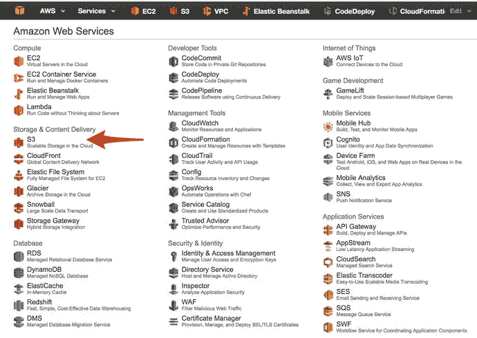
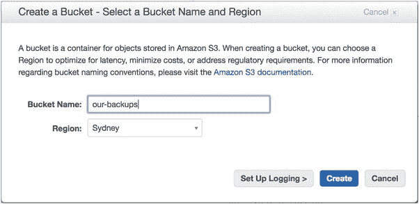
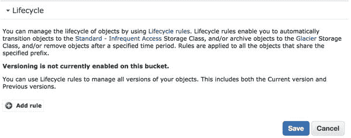
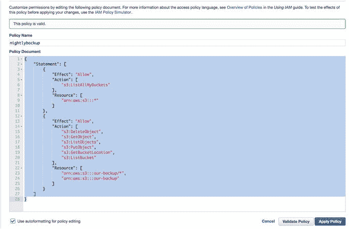
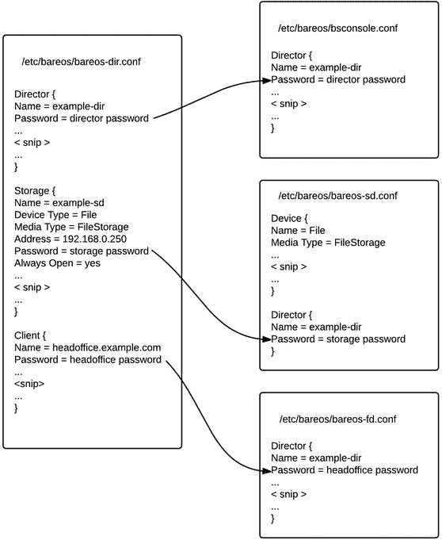
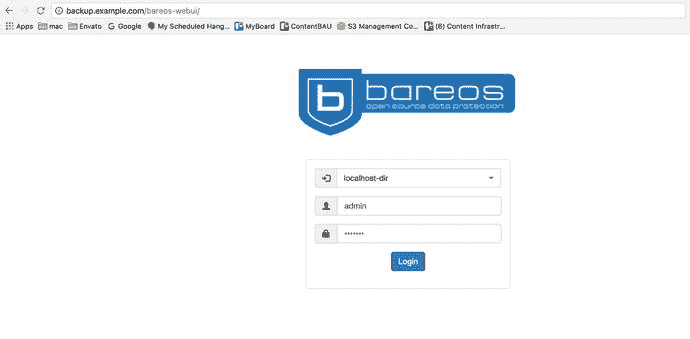

# 十四、备份和恢复

备份和恢复数据的能力在任何组织中都至关重要。您不仅需要高质量的备份来恢复删除或覆盖的数据，而且在许多情况下还需要满足您所在国家的法律要求(例如，与保留税务或客户记录相关的要求)。

本章一开始，我们将讨论灾难恢复规划(DRP)和业务连续性管理(BCM)，为您提供这些概念的基础。我们将向您展示如何安全地从远程主机复制数据，无论它是在您的网络上还是在世界的另一端。然后，我们将向您介绍备份服务器 Bareos，并向您展示如何使用它来保存和恢复您的文件。同样使用 Bareos，我们将演示如何备份和恢复数据库。最后，我们将讨论 Web-UI 控制台，这是一个用于 Bareos 的基于 Web 的 UI。

学完本章后，您应该能够做到以下几点:

*   了解 DRP 和 BCM 所需的要求
*   使用`rsync`命令将数据从一台主机安全地复制到另一台主机，并使用脚本来自动化该过程
*   安装和配置 Duply 以备份到亚马逊 S3
*   安装并配置名为 Bareos 的备份服务器
*   在 Bareos 中管理您的备份和创建作业
*   使用 Bareos 将文件恢复到主机
*   安装和配置 Web-UI 管理控制台

我们将从 DRP 的一般讨论开始。

## 灾难恢复规划

当然，我们都希望我们的业务不会发生灾难性的事情，但为各种情况做好准备也很重要，以防万一。灾害主要有两类:人为灾害和自然灾害。一台电子邮件服务器宕机一天，导致重要的、时间敏感的业务事项被错过，这是一场与人为错误或机械故障相关的人为灾难，可能会有一个与之相关的恢复过程。另一方面，摧毁办公室的地震是一种自然灾害，需要完全不同的恢复响应。这两种情况都可以根据发生的可能性进行规划。

灾难恢复规划就是要识别、管理和降低风险。这是一个被称为业务连续性管理的总体过程的一部分，或者确保一个企业在面对未知的逆境时能够至少在预定的最低水平上继续运营。BCM 涵盖了您组织的各个方面，应该详细列出您的企业同意的特定服务恢复的时间表。

以下是制定贵组织的 BCM 和 DRP 战略时需要考虑的问题:

*   我们能否预测我们的业务最有可能面临的中断？从它们中恢复需要哪些步骤？预期恢复的时间表是什么？
*   降低风险和从每个潜在事件中恢复的相关成本是多少？
*   我们是否需要一个可以转移业务的共同地点？
*   在任何潜在的危机情况下，我们是否需要租用额外的设备，如发电机？
*   在业务中断的情况下，需要联系/沟通哪些人和组织？中断应该如何传达给公众？
*   在大规模灾难性事件的情况下，决定业务能否实现延续的要点是什么？如果关键基础设施或业务资产遭到破坏，损失会迅速累积。

制定 BCM 和 DRP 计划可能是一个复杂的过程。在您的组织中，您应该有一个 BCM 计划，其中包含风险分析、业务影响分析和危机管理调查的结果，可以由主要业务部门签署。即使是小企业也能从半正式的安排中受益，尽管可能不需要开发完整的 BCM 所需的资源。有关 BCM 和 DRP 的更多信息，我们推荐以下资源:

*   就绪业务(美国国土安全部): [`www.ready.gov/business/index.html`](http://www.ready.gov/business/index.html)
*   澳大利亚国家安全，业务连续性规划: [`www.ag.gov.au/agd/www/nationalsecurity.nsf/Page/Information_For_BusinessBusiness_Continuity`](http://www.ag.gov.au/agd/www/nationalsecurity.nsf/Page/Information_For_BusinessBusiness_Continuity)
*   维基百科，业务连续性规划: [`http://en.wikipedia.org/wiki/Business_continuity_planning`](http://en.wikipedia.org/wiki/Business_continuity_planning)
*   维基百科， [`http://en.wikipedia.org/wiki/Disaster_recovery`](http://en.wikipedia.org/wiki/Disaster_recovery) 灾难恢复
*   面向小型企业主的业务连续性和灾难恢复清单: [`http://www.continuitycentral.com/feature0501.htm`](http://www.continuitycentral.com/feature0501.htm)
*   使用 Bareos 进行灾难恢复: [`https://www.bareos.org/en/HOWTO/articles/relax-and-recover-with-bareos.html`](https://www.bareos.org/en/HOWTO/articles/relax-and-recover-with-bareos.html)

在本章中，我们将重点介绍备份和恢复数据的过程，这应该是您组织的 BCM 和 DRP 计划的一部分。下一节将介绍备份策略。

## 备份过程

在选择备份方案时，您需要考虑许多不同的问题。回答这些问题将为您的公司提供备份策略。

*   我们要备份的是什么？
*   我们需要多久备份一次数据？
*   我们希望将数据备份多长时间？
*   我们应该将备份存储在哪里，存储在什么介质上？

这里重要的是了解你的数据。你需要知道它多久变化一次，变化量有多大。您还需要了解您的存储介质，以及它可以存储多少数据和存储多长时间。数据量可能是一件棘手的事情，如果没有计划，您可能有太多的数据需要备份，或者没有足够的时间来备份数据。在这些情况下，您可能会发现自己在备份不需要的数据，或者您可能需要获得不同的存储设备以获得更快的性能或更大的备份卷。

数据保留期，也称为数据生命周期，也是需要考虑的重要因素。出于法律或税务目的，您可能需要将您的数据保留一段特定的时间，通常是几年。您可能希望将客户端数据保留几年，并且可能希望将其他类型的数据保留较短的时间。根据您正在备份的内容，将数据保存在介质上以恢复几个月前的数据可能完全没有意义；在这种情况下，您可以考虑缩短备份周期来释放介质。

另一件要考虑的事情是日程安排。您可以在哪个时间段安排备份？您可能一周 7 天 24 小时都在运营，几乎没有时间进行离线备份。您可能必须执行热备份(即在某个时间点备份活动主机)，并且您可能没有太多时间来执行此操作。对于时间安排，您可能需要考虑每日、每周或每月备份方案。

最后，您需要确定要执行的备份类型。在大多数备份方案中，您可以将备份分为三种类型:完整备份、增量备份和差异备份。完整备份是数据的最终备份，也是执行的最大和最长的备份。增量备份是对自上次备份以来发生更改的文件和目录的备份(无论是完整备份、差异备份还是增量备份)。增量备份比完整备份和差异备份小，通常执行起来也快得多。差异备份是自上次完整备份以来所有已更改文件的备份。这些备份可能比增量备份大，但在执行恢复时非常有用，因为您只需要完整备份和最新的差异备份(如果您根本不运行增量备份)。在定时备份中，您可以每周进行一次完整备份，每夜进行增量或差异备份。

对于完全备份、增量备份和差异备份，还原操作按以下顺序进行:首先还原最后一次完全备份，然后还原最近的差异备份，最后还原任何后续的增量备份。如果您不使用差异备份，则它是最后一次完全备份，后面是每次后续的增量备份，从最旧到最新。

Caution

在备份操作中，您可能会还原不需要的、已删除的文件和目录以及有用的数据。在继续之前，您应该仔细检查已恢复的内容。

您的网络将有其特殊的备份要求，并且有大量的硬件设备甚至在线存储选项可供您选择。硬件设备可以与不同供应商的软件捆绑在一起，或者您可以购买硬件并运行开源软件来运行备份。以下是一些硬件存储选项:

*   磁带:不同的类型取决于您的备份量
*   硬盘:不同的速度和音量选项
*   光学:DVD/CD-ROM 低容量数据备份

在线存储选项也可以用于存储大量数据，只要你有一个快速、可靠的互联网连接和较低的数据收费率。对于大型数据集来说，将数据存储在自动气象站 S3(通过 S3 存储类对数据进行生命周期循环，然后在一段时间后转移到冰川存储)可能是经济的。谷歌云存储也有竞争对手的数据存储服务，但没有冰川的超便宜的长期存储。

以下是一些 AWS 存储产品:

*   S3 标准:最快的对象存储
*   S3 标准-IA:中等，不经常访问
*   冰川:长期，不经常进入

以下是一些谷歌存储产品:

*   标准:最快的对象存储
*   DRA:中等，不经常访问
*   近线:长期、不频繁的访问

默认情况下，带有选项的 AWS 和 Google 都提供静态数据的服务器端加密(SSE ),但是您也可以使用自己的加密密钥来保护您的数据。两者都符合 PCI DSS (3.x)和关于保护硬件和服务器、存储数据以及保护数据中心的各种 ISO 标准。将这种安全性与运行高度可靠和持久的服务相结合，使 AWS 或 Google 成为中长期存储的良好选择。

AWS 还提供 AWS 存储网关，这是一种虚拟设备(虚拟机)，安装在数据中心内，用作 S3 和冰川的网关。它还能够充当虚拟磁带库(VTL)，Bareos 等软件可以使用它进行备份。然后，AWS 存储网关将数据同步到 AWS 存储，同时维护本地缓存。它的价格很高，但这可能会被磁带机和存储磁带的成本抵消。

### 需要考虑的事情

我们已经讨论了灾难恢复和业务连续性以及保护您的数据的重要性，但是我们还想谈一件事。我们真正需要考虑的是从数据丢失或硬件故障中恢复的速度。你有主机，你有数据。在硬件丢失的情况下，您能否快速恢复您的主机和数据？

如果您有一个数据库，您的数据库可能是您拥有的最重要的数据和服务器。数据库服务器通常是精心构建的，创建了磁盘阵列，安装并调优了操作系统。在这种情况下，如果您有最新数据，重建该主机可能需要很长时间。

当然，有几种方法可以解决这个恢复时间问题。

*   最好是有主/辅助数据库。您的辅助数据库可以升级为主数据库，为您重建主机提供时间。
*   您可以利用虚拟化技术。您的主机可以从模板或映像快速重建，也可以在不中断的情况下从故障硬件上移除。结合配置管理，如 Puppet 或 Ansible，您将能够快速恢复您的系统。
*   如果您有裸机主机，那么您需要备份磁盘架构以及操作系统和数据。像 Relax-and-Recover 这样的东西可能是个好主意，或者像 Mass 或 Cobbler 这样的东西可以帮助您从已知的构建中快速重建服务器。

我们可能遇到的最糟糕的情况是依赖一个运行列表，列出我们在 6 个月前可能如何构建主机，而从那以后从未尝试过构建这样的主机。实际上，可能还有一种更糟糕的情况:没有运行列表。

对于其他类型的主机，如 web 服务器，您可能不需要备份它们。您应该仔细考虑日志之类的东西，但是如果您可以比恢复主机更快地重建主机，那将是您的最佳选择。如果重建过程是通过配置管理自动化的，那么作为管理员，您就处于一个很好的位置。这是将服务器视为牲畜而非宠物的概念，使您的备份机制更加简单。

## 网络备份

我们的网络很简单:我们有一台主机`headoffice.example.com`，以及位于远程分支机构的主机，这些主机可能有我们需要备份的数据。

图 [14-1](#Fig1) 显示了我们的网络。(这是第七章[中图表的变体。)](07.html)


图 14-1。

Our network

我们将向您展示两种备份网络的方法。我们将把数据从远程主机复制到`headoffice.example.com`中央服务器。复制完这些远程文件后，我们可以使用驻留在`backup.example.com`上的全功能备份应用程序对它们进行备份。

我们选择使用单独的主机来存放我们的备份服务器。理想情况下，您不希望您的主服务器也成为您的备份主机，因为如果您失去了主服务器，您也就失去了恢复备份的能力。但是，如果您买不起额外的主机，任何备份都比没有备份好，然后您应该备份到外部介质，如 DVD 或数据磁带。

Note

传统上，Linux 备份是手工编写的脚本中的`tar`、`gzip`、`rsync`、`dd`、`cpio`、`dump`、`restore`和`mt`命令的组合。对于一台或两台主机来说，这种方法可能是值得的，但是对于一些跨平台的主机来说，这种方法就变得不实用了。

## 使用 rsync

首先，我们将向您展示如何使用名为`rsync`的工具安全高效地从远程主机复制数据。该解决方案专为不需要全面备份计划的不太复杂的网络而设计。为此，我们将使用`rsync`在主机之间安全地复制数据。

Note

`rsync`工具是 Samba 产品套件的一部分(与我们在第 [13 章](13.html)中提到的 Samba 服务器项目直接相关)。桑巴社区已经将`rsync`收归旗下，它位于这里: [`http://rsync.samba.org/`](http://rsync.samba.org/) 。

`rsync`工具可以在客户机/服务器配置或远程 shell 中使用。当我们谈到“远程Shell”时，我们的意思是我们可以通过另一种传输机制(如`ssh`)在主机之间`rsync`，这将为`rsync`程序提供目标主机上的远程Shell(或命令行)。正是因为使用了`ssh`,我们才能够在诸如互联网这样的恶劣环境中从主机上安全、高效地复制数据。

`rsync`程序是一种快速有效的数据复制方式，因为它只复制与初始副本相比发生了变化的数据。在将远程数据的初始`rsync`拷贝到我们的主机后，任何后续拷贝都将与我们已经拥有的数据进行比较。`rsync`通过向接收主机发送它想要复制的数据的文件列表来实现这一点。文件列表包括我们要备份的数据的路径名，以及权限、所有权、大小、模式时间和文件的校验和(如果指定的话)。这使得`rsync`可以对正在复制的文件进行比较，然后只复制那些不同的文件，这使得`rsync`在主机之间发送数据时非常高效。它还将检查正在复制的文件，并仅复制文件中不同的数据部分。例如，如果一个 1MB 的文本文件包含 990KB 相同的数据，`rsync`将只复制不同的 10KB。不幸的是，这不能用二进制文件(如 JPEGs)来实现，因为对于二进制文件，很难区分对文件的任何更改。

如前所述，我们可以在客户机/服务器模型中使用`rsync`，在那里我们在目标主机上运行一个`rsync`守护进程，等待`rsync`连接。这些连接不在加密会话上运行，因此可能是一个安全问题，所以我们不打算进一步讨论这种使用`rsync`的方法。在这一章中，我们将描述使用带有安全Shell(SSH)的`rsync`来提供安全传输。这也意味着我们只需要在防火墙上启用 TCP 端口 22，而不是 TCP 端口 873，这是`rsync`守护进程所需要的。您可以在下面的教程中了解更多关于设置`rsync`守护进程的信息:

*   [T2`https://www.digitalocean.com/community/tutorials/how-to-use-rsync-to-sync-local-and-remote-directories-on-a-vps`](https://www.digitalocean.com/community/tutorials/how-to-use-rsync-to-sync-local-and-remote-directories-on-a-vps)
*   [T2`http://everythinglinux.org/rsync/`](http://everythinglinux.org/rsync/)

### 通过 SSH 使用 rsync

需要在您的直接网络之外备份远程主机的情况并不少见，例如在 Internet 这样的恶劣环境中。在这些情况下，您可以使用`rsync`通过 SSH 远程访问这些主机，从它们那里获取数据或进行备份。通过实现一个简单的 Bash 脚本，您可以通过连接到远程主机并将文件复制回备份主机来自动化备份。

在本节中，我们将执行以下操作:

*   创建用户来管理我们的备份
*   创建我们的无密码 SSH 密钥
*   将我们的密钥复制到我们的远程主机
*   创建一个只允许通过 SSH 使用某些命令的脚本
*   创建一个使用`rsync`从远程主机同步文件的脚本
*   将该脚本添加到`cron`

我们在第 [4](04.html) 和第 [10](10.html) 章中向您介绍了 SSH 通信。通常，您可以使用合适的密码创建您的 SSH 密钥，当您登录到远程主机时，您可以使用该密码来验证您的会话。我们需要一个不带密码短语的 SSH 密钥来建立连接的原因是，我们将通过`crontab`运行这个脚本，这是我们在第 [6](06.html) 章中介绍的，因此我们可以定期备份我们的远程主机，而无需任何用户交互。我们的密钥上没有密码是一个安全问题，所以我们将采取措施来减少它们稍后被滥用的可能性。

首先，我们将创建一个新用户`exbackup`，来控制这些备份，如果您还没有创建它们的话。然后我们将生成我们的 SSH 密钥。

```sh
$ sudo /usr/sbin/useradd -m -d /data/backups -u 903 -g adm exbackup

```

这里我们创建了一个名为`exbackup`的用户，UID 为 903，默认组为`adm`。我们为这个用户选择了一个小于 1000 的 UID，因为我们正在创建一个服务用户(任何小于 1000 的用户 UID 都可以)，我们希望服务用户的 UID 在 900 到 999 之间。我们已经将该用户添加到了`adm`或管理员组，因为该组传统上有权读取日志文件。`exbackup`主目录是`/data/backups`，那是我们存储所有备份的地方。接下来，我们将`sudo`进入用户帐户并创建我们的 SSH 密钥。

```sh
$ sudo su – exbackup
$ mkdir .ssh && chmod 0700 –R .ssh && cd .ssh
$ ssh-keygen -b 4096 -t rsa -f exbackup
Generating public/private rsa key pair.
Enter passphrase (empty for no passphrase):
Enter same passphrase again:
Your identification has been saved in exbackup.
Your public key has been saved in exbackup.pub.
The key fingerprint is:
c1:0c:1f:a5:e4:cf:b9:a5:30:c3:4b:45:23:4f:c9:96 exbackup@backup
$ ls –l total 16
-rw-------. 1 exbackup adm 3243 Oct 12 23:10 exbackup
-rw-r--r--. 1 exbackup adm  741 Oct 12 23:10 exbackup.pub

```

首先，我们发出`sudo su – exbackup`来改变到`exbackup`的Shell。然后，我们创建`.ssh`目录来存储我们的密钥，如果成功了(如`&&`所示)，我们更改该目录的权限并进入该目录。然后我们使用`ssh-keygen`命令来创建我们的密钥。我们选择使密钥长度为 4096 字节，`-b 4096`，类型为`rsa`，我们将密钥命名为`exbackup`，以便我们更容易识别它。在生成密钥时，我们被要求输入密码，我们只需按两次 Enter 键。你可以看到我们已经列出了我们的`.ssh`目录的内容，我们有两个密钥，一个私有的，一个公共的，如后缀`.pub`所示。我们在这个主机上保持私有密匙(`exbackup`)的安全，并为我们远程主机上的用户将公钥(`exbackup.pub`)的内容复制到`authorized_keys`文件中。

我们现在需要谈一谈安全性。让无密码的密钥在互联网上呼啸而过到达你的远程主机是一个潜在的安全风险。数据将被加密以防止随意窥探，但是一个有决心的攻击者可能会使用这些密钥作为访问点来攻击您的主机。我们还可以在我们的远程主机上创建一个名为 chroot jail 的安全机制，但是这将限制我们访问主机其余文件系统的能力。

Tip

有关如何建立 chroot 监狱的信息，请访问 [`https://www.debian.org/doc/manuals/securing-debian-howto/ap-chroot-ssh-env.en.html`](https://www.debian.org/doc/manuals/securing-debian-howto/ap-chroot-ssh-env.en.html) 。

我们可以将密码与我们的密钥一起使用，并使用一个名为`key-chain`的工具来缓存我们的连接密码，但我们必须在每次重启主机时输入密码，这并不理想。我们要做的是限制我们的 SSH 密钥可以使用的命令，让攻击者稍微困难一点。在我们的远程主机上，我们将创建一个名为`ssh_limiter.sh`的可执行文件。当我们用 SSH 密钥登录到我们的远程主机时，这个脚本将被调用，它只允许任何人用这个密钥执行一个命令。

您可以通过向`authorized_keys`文件添加一些选项来限制 SSH 可以做的事情。`authorized_keys`是远程主机上用户的`.ssh`目录中的一个文件，它保存了授权连接到我们主机的公钥的副本。我们在远程主机上的用户主目录中创建它们。我们可以使用这些选项来限制按键的功能，如表 [14-1](#Tab1) 所示。

表 14-1。

authorized_keys Options

<colgroup><col> <col></colgroup> 
| [计]选项 | 描述 |
| --- | --- |
| `From="hostname.example.com"` | 限制连接的来源。接受域、FQDN 和 IP 地址。 |
| `Command="/command/to/execute"` | 指定每当此密钥用于身份验证时要执行的命令。 |
| `Environment` | 如果`sshd`允许，设置用户环境。 |
| `no-agent-forwarding` | 阻止 SSH 身份验证代理转发，这意味着我们无法使用这些密钥通过`ssh`代理连接到其他主机。 |
| `no-port-forwarding` | 阻止 SSH 端口转发，这意味着我们无法使用`ssh`端口转发来打开与其他主机的连接。 |
| `no-X11-forwarding` | 阻止 X11 转发。这意味着我们不能使用 X 协议；因此，我们无法打开新的 X 窗口或终端。 |
| `no-` `pty` | 防止交互式Shell。这意味着拥有这个键的用户只能运行命令，而不能使用交互式 shell。 |

表 [14-1](#Tab1) 是全部可用选项的子集。有关更多信息，请阅读`sshd`的`man`页。

让我们使用这些信息来创建一个`authorized_keys`文件，我们将把它发送到我们的远程主机。首先，我们将把现有的`exbackup.pub`密钥复制到一个名为`remote_authorized_keys`的文件中。这将为`exbackup`用户创建一个包含公钥的文件。我们很快就会编辑这个文件副本，给它添加一些限制，并把它发送到远程主机上的`authorized_keys`文件中。

```sh
$ cp exbackup.pub remote_authorized_keys

```

如果我们想简单地将我们的公钥复制到任何远程主机，我们可以使用`ssh-copy-id`，它将在远程服务器上为用户创建`authorized_keys`文件，如下所示:

```sh
$ ssh-copy-id -i .ssh/exbackup jsmith@headoffice.example.com
/usr/bin/ssh-copy-id: INFO: Source of key(s) to be installed: ".ssh/exbackup.pub"
/usr/bin/ssh-copy-id: INFO: attempting to log in with the new key(s), to filter out any that are already installed
/usr/bin/ssh-copy-id: INFO: 1 key(s) remain to be installed -- if you are prompted now it is to install the new keys
jsmith@headoffice.example.com's password:

Number of key(s) added: 1

Now try logging into the machine, with:   "ssh 'jsmith@headoffice.example.com'"
and check to make sure that only the key(s) you wanted were added.

```

但是我们要做的不仅仅是复制`authorized_keys`文件。事实上，我们要做这些额外的事情:

*   创建一个包装脚本来拒绝未经授权的命令
*   在远程主机上，创建一个包含`.ssh`和`bin`目录的用户和主目录
*   将带有授权命令的 SSH 包装脚本移动到`bin`目录
*   将`authorized_keys`移动到`.ssh`目录
*   确保每个文件和目录的权限正确

#### 创建包装脚本

首先，我们将创建一个名为`ssh_limiter.sh`的文件，当我们使用`exbackup` SSH 键连接时，这个脚本将强制我们的连接运行。这个脚本将在我们的远程主机上运行。这为拥有这个 SSH 密钥的任何人都可以执行的命令范围提供了一些安全性。

当我们建立到主机的 SSH 连接时，变量`$SSH_ORIGINAL_COMMAND`保存我们想要在远程主机上执行的命令。因此，如果我们建立以下 SSH 连接:

```sh
$ ssh somehost@example.com ls –l /tmp

```

变量`$SSH_ORIGINAL_COMMAND`将保存值`ls –l /tmp`。当显示一个 SSH 键时，我们现在可以测试该变量，并决定它是否是我们将接受这个键使用的命令类型。当我们在远程主机上执行`rsync`时，变量将包含`rsync --server <some other arguments for rsync>`。我们希望允许这种情况，并排除任何其他情况。

我们用一个包装器脚本来做这件事，如清单 [14-1](#Par109) 所示。

```sh
$ vi ssh_limiter.sh
#!/bin/bash
# Command to be used by exbackup at example.com to limit what exbackup can
# do on a remote host.
# SSH2 stores the original command sent by the remote host in a variable
# $SSH_ORIGINAL_COMMAND. We will use case to test and limit the commands
# we are running.

case "$SSH_ORIGINAL_COMMAND" in
  *\&*)
  echo "UNAUTHORIZED COMMAND"
  ;;
  *\;*)
  echo "UNAUTHORIZED COMMAND"
  ;;
  *\|*)
  echo "UNAUTHORIZED COMMAND"
  ;;
  rsync\ --server*)
  $SSH_ORIGINAL_COMMAND
  ;;
  *)
  echo "UNAUTHORIZED COMMAND"
  ;;
esac

Listing 14-1.Limiting the Commands ssh Can Do Using Keys

```

在清单 [14-1](#Par109) 中，我们使用 Bash 脚本语言来测试由`ssh`用户呈现的命令。

`case`语句测试变量`$SSH_ORIGINAL_COMMAND`以确保它只包含命令`rsync --server`。首先，我们否认控制命令`&`，；、和|，它们可用于将其他命令添加到我们想要的命令的末尾。如果命令以`rsync --server`开始，那么我们接受它(`\ --server`确保 Bash 转义`<space>--`)。其他任何可能作为命令传递的内容都被`*.`拒绝。`case`语句以`esac`语句结束。

我们现在需要编辑我们的`remote_authorized_keys`文件来为我们的键添加选项。

```sh
$ vi remote_authorized_keys

command="∼/bin/ssh_limiter.sh",from="*.example.com", no-port-forwarding,no-X11-

forwarding,no-agent-forwarding,no-pty ssh-rsa
AAAAB3NzaC1yc2EAAAABIwAAAgEAp7jGL2il3QKREVTpNWkdPqiEbG4rKdCLt/nx57PHkZvz
SGI64Glscl0zIz92PBN/ZjNb4Z1ZaOGS7UYQOg4SHKXsw5/VHchIN1k3p9Vwm9rZUiDg3azKr9J+R
+r9TDhwReyYt0QhR/j1aZf1gYS3+xRLs+bQb6UXVRrccygCFtxvrA2B5Kkgw2QJhctSlNRyi8XobUK
7kOs2Bw4zIY8hEZMRBFEibqi/diXPngWsMeo2UQQGICo6yXmgUKqiuQq1azdDuTbEstLS97/LdT
qWd9MNAsYk= exbackup@backup.example.com

```

在这里，我们将选项添加到了最终将位于远程主机上的`remote_authorized_key`文件中。我们指定了在使用密钥和可以与之连接的主机时要运行的命令，并且我们限制了一般用户通常允许的功能。任何用这个键连接的人现在只能运行`ssh_limiter.sh`脚本，它只允许执行`rsync`命令，并且只允许来自`*.example.com`域的连接。如果我们想输入发起连接的主机的 IP 地址，我们可以在`from=`选项中更严格一些。

我们还指定不能向其他主机(`no-port-forwarding`)、x11 终端或 X 窗口(`no-X11-forwarding`)进行端口转发；我们不能使用`ssh`代理将我们的密钥转发给其他主机(`no-agent-forwarding`)；而且我们也将无法得到一个交互式的Shell(`no-pty`)。

#### 部署到远程主机

我们将使用用户名和目录设置我们的远程主机，镜像我们之前为`exbackup`所做的。我们需要确保远程主机上的`exbackup`主目录有一个`.ssh`目录，并且在其上设置了 0700 权限。我们现在将使用普通用户将`remote_authorized_keys`文件复制到我们的远程服务器。首先，我们将把`remote_authorized_keys`文件复制到用户`jsmith`可以访问的地方；`/tmp`应该可以吧。我们也将把`ssh_limiter.sh`文件复制到`/tmp`。

使用在远程主机上拥有管理`sudo`访问权限的账户`jsmith`，我们执行以下操作:

```sh
$ scp /tmp/remote_authorized_keys /tmp/ssh_limiter.sh
 jsmith@branch1.example.com:∼/

```

这将安全地将`remote_authorized_keys`文件复制到远程主机上`jsmith`的主目录中。现在我们发出以下一系列`ssh`命令:

```sh
$ ssh jsmith@branch1.example.com 'sudo useradd –u 903 –g adm –m
–d /data/backups exbackup && sudo –u exbackup mkdir –p /data/backups/.ssh &&
sudo chmod 0700 /data/backups/.ssh'

```

这将在我们的远程主机上设置我们的`exbackup`用户。它还在主目录中创建一个名为`.ssh`的目录，并在其上设置 0700 的权限，这是 SSH 安全性的要求。我们想指出的是，我们使用了`sudo –u exbackup`来创建目录，因此它拥有正确的所有权权限。双&符号(`&&`)表示如果第一组命令成功，我们希望执行下一组命令。

Caution

将任何用户添加到`adm`组都可以给他们提升的`sudo`权限。

我们在`jsmith`的主目录中有包装器脚本(`ssh_limiter.sh`)和`remote_authorized_keys`文件，并且我们已经创建了`exbackup`用户。接下来，我们将把`remote_authorized_keys`文件复制到远程主机上的适当位置，在途中重命名并设置所需的权限。我们还将创建`/data/backups/bin`目录并将`ssh_limiter.sh`移到那里。

```sh
$ ssh jsmith@branch1.example.com
'sudo mv remote_authorized_keys /data/backups/.ssh/authorized_keys \
&& sudo chown exbackup:adm /data/backups/.ssh/authorized_keys \
&& sudo chmod 0600 /data/backups/.ssh/authorized_keys \
&& sudo -u exbackup mkdir /data/backups/bin \
&& sudo mv ssh_limiter.sh /data/backups/bin \
&& sudo chown exbackup:adm /data/backups/bin/ssh_limiter.sh \
&& sudo chmod 0750 /data/backups/bin/ssh_limiter.sh'

```

在前面的代码中，我们使用反斜杠(`\`)来分隔行；反斜杠告诉 Bash，当我们按 Enter 键时，我们的命令在下一行继续，而不是执行代码行。就 Bash 而言，它可能只有一行，但这让我们更容易看到发生了什么。

除非与`–u <username>`选项一起使用，否则`sudo`命令将创建所有新文件和目录，而`root`是所有者。因此，我们需要更改正在创建的目录和文件的权限和所有权。我们还在`/data/backups`目录中创建了一个`bin`目录，这是`exbackup`的主目录。在`authorized_key`文件中，我们指定了`command=∼/bin/ssh_limiter.sh`，所以我们的`ssh_limiter.sh`脚本也需要复制到具有适当权限的`bin`目录中。

Tip

这个相当复杂的设置过程可以通过配置管理工具变得非常简单，就像在第 [19](19.html) 章中解释的那样。

#### 测试 rsync

我们将在我们的远程主机上创建一个文件来测试我们将要向您展示的`rsync`脚本。在我们的远程主机上，我们将在`/tmp`目录中创建一个名为`/tmp/test_sync.txt`的文本文件，并用垃圾文本填充它。

```sh
$ vi /tmp/test_sync.txt
fldjfsl
lfdsjfsla
fsdjfsl
fjsdl
fsjfs
fsl
fsa
23433

```

这里我们在`remotehost.example.com`上创建了一个文件，并将随机文本添加到一个名为`/tmp/test_sync.txt`的文件中。如果你在这个文件上使用`cat`命令(`cat /tmp/test_sync.txt`，你会看到它包含了所有的随机文本。

我们现在将使用`rsync`和我们的 SSH 密钥在远程主机上测试这个文件的备份。

```sh
$ sudo su - exbackup
[sudo] password for jsmith:
$ rsync -av -e 'ssh -i .ssh/exbackup' remotehost.example.com:/tmp/test_sync.txt /tmp
receiving file list ... done
test_sync.txt
sent 42 bytes received 194 bytes 472.00 bytes/sec
total size is 58 speedup is 0.25
$ cat /tmp/test_sync.txt
fldjfsl
lfdsjfsla
fsdjfsl
fjsdl
fsjfs
fsl
fsa
23433
LDJAS

```

我们使用`rsync`命令将文件`test_sync.txt`简单复制到我们的本地`/tmp`目录。通过使用`cat`显示文件内容，可以看到文件已经被复制。稍后我们将解释`rsync`命令的细节。

接下来，让我们在文件中添加更多的行，并再次同步它。

```sh
$ vi /tmp/test_sync.txt
fldjfsl
...
<snip>
...
fsa
23433
ldjas
dfald
asd
12344556

```

然后，我们将保存文件并再次执行`rsync`。

```sh
$ rsync -av -e 'ssh -i .ssh/exbackup' branch1.example.com:/tmp/test_sync.txt /tmp
receiving file list ... done
test_sync.txt

sent 48 bytes received 213 bytes 174.00 bytes/sec
total size is 77 speedup is 0.30

```

当我们对`/tmp/test_sync.txt`文件使用`cat`命令时，在我们的本地主机上，您会注意到它包含了对文件的新更改。

```sh
$ cat /tmp/test_sync.txt
fldjfsl
...
<snip>
...
fsa
23433
ldjas
dfald
asd
12344556

```

因此，我们可以从远程主机安全地同步文件，而无需使用密码。让我们快速测试一下我们的`ssh_limiter.sh`脚本，检查它是否如预期的那样工作。在这里，我们将测试是否可以使用我们的密钥`ssh`访问远程主机并运行`top`命令。

```sh
$ ssh -i .ssh/exbackup remotehost.example.com top
UNAUTHORIZED COMMAND

```

完美——发送禁止的或意外的命令会引发`UNAUTHORIZED COMMAND`响应。

#### 在 crontab 中设置 rsync 脚本

现在我们可以设置`crontab`脚本来定期将我们的远程主机文件同步到我们的备份目录。

表 [14-2](#Tab2) 列出了一些可与`rsync`一起使用的选项。

表 14-2。

rsync Options

<colgroup><col> <col></colgroup> 
| [计]选项 | 描述 |
| --- | --- |
| `-a` | 存档，使用这些选项递归复制的通用选项:`-rlptgoD`。 |
| `-r` | 递归复制目录。 |
| `-l` | 将符号链接复制为符号链接。 |
| `-p` | 复制权限。 |
| `-t` | 复制时间戳。 |
| `-g` | 复制组权限。 |
| `-o` | 复制所有权权限。 |
| `-D` | 保留设备(字符和块设备)和特殊文件(fifo 和命名套接字)。 |
| `--exclude` | 排除目录或文件；可以是模式。一个例子是`.svn/`排除`.svn`目录。 |
| `--include` | 包括目录或文件；微调您想要复制的文件。语法与`--exclude`相同。 |
| `-n, --dry-run` | 预演。显示会发生什么，但不实际执行同步。 |

一般来说，您将主要使用设置了归档选项的`rsync`命令，即`–a`。这是一个捆绑选项，代表以下选项:`-rlptgoD`。这些选项是`–r`，递归；`-l`，复制符号链接为符号链接；`-p`，复制权限；`-t`，复制文件和目录修改次数；`-g`，保存团体；`-o`，保全所有权；和`-D`，保存设备和特殊文件。这些选项通常足以归档您的系统，但是如果您需要，您可以添加更多选项，这些选项在`rsync man`页中有说明。

您可能会使用`--exclude`和`--include`选项，它们允许您微调想要同步的文件或目录。您也可以使用`--exclude-from=<file>`和`--include-from=<file>`来列出您想要定位的文件或目录的多个选择。

##### rsync 备份脚本

让我们来看一个典型的脚本，我们可以用它来同步我们的远程主机和本地主机。在我们的远程主机上，我们将有一个名为`/data/staff/sales`的目录，我们希望将该目录同步到我们的本地主机，然后我们将使用备份应用程序备份该目录。我们将有两个远程主机，`branch1.example.com`和`branch2.example.com`，我们将使用`rsync`来同步它们的`/data/staff/sales`目录的内容，除了我们想要排除的`/data/staff/sales/temp`目录。我们还希望这个脚本由使用我们创建的无密码密钥的用户运行。

首先，让我们设置`.ssh/config`文件，它将处理我们需要的所有 SSH 配置。在该文件中，我们将添加主机名、IP 地址或 FQDN 名称以及要连接的用户。我们还将定义我们将在连接中使用的 SSH 密钥。

```sh
$ cat .ssh/config
Host *.example.com
  User exbackup
  Identityfile ∼/.ssh/exbackup

```

前面的代码将用户名`exbackup`和身份文件`∼/.ssh/exbackup`添加到与`example.com`域空间中的主机建立的每个`ssh`连接中。这相当于指定了`$ ssh –I ∼/.ssh/exbackup exbackup@somehost.example.com`。

我们将用来在我们的主机之间运行`rsync`的脚本看起来如清单 [14-2](#Par152) 所示。

```sh
 1\. #!/usr/bin/env bash
 2.
 3\. # This uses rsync to sync down remote files to the /data/backups/<hostname>
 4\. # directories.
 5\. # The rsync command we will use.
 6\. RSYNC='which rsync'
 7\. RSYNC_OPTS="-av "
 8.
 9\. # Host list - Bash array
10\. HOSTLIST='
11\. branch1.example.com
12\. branch2.example.com
13\. '
14\. # Back up directory on local host and source directory on remote host
15\. BACKUP_DIR='/data/backups/'
16\. SALES_DIR='/data/staff/sales'
17.
18\. # excluded directory
19\. EXCLUDED="temp/"
20.
21\. # error function
22\. error_check() {
23\.     if [ $1 -eq 0 ] ; then
24\.     echo "backup successful"
25\.     else
26\.     echo "backup failed: see error number: $1"
27\.     fi
28\. }
29.
30\. # The rsync functions
31\. get_sales() {
32\.   ${RSYNC} ${RSYNC_OPTS} --exclude $EXCLUDED $HOST:$SALES_DIR $BACKUP_DIR/$HOST
      2>&1 > /dev/null
33\. }
34.
35\. # Bash for loop to go through each host and rsync the data.
36\. for HOST in $HOSTLIST ; do
37\.   get_sales
38\.   error_check $?
39\. done
40.
41\. exit 0
Listing 14-2.The nightly_remote_sync.sh Script

```

清单 [14-2](#Par152) 中的脚本的目的是将文件从一个或多个远程主机同步到运行脚本的主机的`/data/backups`目录。这可以是本地网络的备份主机`backup.example.com`，我们将在其中安装适当的备份软件。这只是实现这一结果的众多方法之一。

第 1 行包含将环境设置为 Bash 脚本的调用。我们还可以使用传统的 shebang ( `#!/bin/bash`)让 Linux 知道我们正在运行 Bash 脚本。

第 2–5 行是描述我们脚本的注释。第 6–7 行设置了`RSYNC`变量，第 10–13 行声明了我们想要同步的主机列表。第 15–19 行是更多的变量。我们将备份定向到的备份目录是`BACKUP_DIR='/data/backups'`。`sales`目录`SALES_DIR='/data/staff/sales'`是我们正在备份的目标目录。`temp/`目录是我们想要排除的目录。

Note

用户`exbackup`必须对所有要备份的文件和目录拥有读取权限，并对要备份到的目录拥有写入权限。你可以看看使用组来实现这一点。

第 22–28 行是一个 Bash 函数，处理我们的错误检查。如果脚本的结尾不是零，那么它会失败；如果以零结尾，则脚本成功。`error_check()`子例程或函数接受`$?`参数，即另一个函数调用的退出代码，并测试它是否为零。我们知道，如果一切顺利，`rsync`将以零退出；否则，它会以另一个错误代码退出。我们可以使用这个错误检查函数来测试任何其他以零成功退出的函数的成功或失败。

第 31–33 行声明的`get_sales`函数描述了调用`rsync`命令并将`/data/staff/sales`目录同步到`/data/backups/<hostname>`目录的`rsync`函数。在第 32 行，`2>&1 >/dev/null`将`stdout`和`stderr`(或标准输出和标准误差)导向`/dev/null`。注意`/dev/null`是 Linux 黑洞；如果你向它发送东西，比如`stdout`或`stderr`，它们就会消失在虚无中。

Note

当你在 Linux/Unix 主机上运行一个程序时，会用到三个标准的特殊文件描述符:`stdin`(标准输入)、`stdout`(标准输出)和`stderr`(标准错误)。当您的程序接收输入时，它可以通过附加到`stdin`文件描述符来接收输入。同样，当它产生输出时，它可以把它写到`stdout`。如果程序中有错误，它可以将其写入`stderr`。有关处理和重定向`stdin`、`stdout`和`stderr`的更多信息，请访问 [`www.tldp.org/LDP/abs/html/io-redirection.html`](http://www.tldp.org/LDP/abs/html/io-redirection.html) 。

最后，第 36–39 行使用`for`循环函数循环通过主机列表中的每个主机，并在每个主机上执行`rsync`。然后，脚本检查每个错误代码，看它是否为零，如果是，它打印成功消息。

Note

在 [`www.tldp.org/LDP/abs/html/index.html`](http://www.tldp.org/LDP/abs/html/index.html) 有一个学习更多 Bash 编程的好资源。另一个参考是 Sander Van Vugt 的书《Linux 命令行入门》(Apress，2015)。

当我们从命令行运行该脚本时，我们会得到以下结果:

```sh
exbackup@au-mel-ubuntu-1:∼$ ./bin/nightly_remote_rsync.sh
backup successful
backup successful

```

Note

当您第一次运行这个脚本时，您将看到 SSH，要求您确认远程主机的新密钥签名。键入 yes 确认签名，然后脚本将正常运行。

我们现在将这个脚本放到一个`crontab`文件中，这样我们就可以定期运行它。回想一下，我们在第 [5 章](05.html)中讨论过`crontab`文件。让我们创建文件`/etc/cron.d/example_nightly_sync`，并添加以下内容:

```sh
# run the nightly rsync script at 5 minutes past 12 every morning.
MAILTO=jsmith@example.com
5       0       *       *       *       exbackup
  /data/backups/bin/nightly_remote_rsync.sh

```

在这里，我们将脚本设置为以用户`exbackup`的身份在每晚午夜过后 5 分钟运行。如果有错误，将向`jsmith@example.com`发送一封电子邮件。这是一种将文件从一台主机同步到另一台主机的好方法，但它并不是一种很好的备份策略。例如，每天晚上我们同步所有更改过的文件，包括错误。如果没有及早发现，错误就会传播到我们的备份主机，我们就会丢失数据的良好拷贝。当我们使用适当的备份策略时，我们失去恢复良好数据能力的可能性被降至最低。

Tip

当从`crontab`运行命令时，考虑使用`flock`确实是个好主意。这使用文件锁定来防止在现有命令已经运行的情况下执行计划的命令。更多细节见`man flock`。

围绕`rsync`已经开发了一些备份工具。

*   BackupPC: [`http://backuppc.sourceforge.net/`](http://backuppc.sourceforge.net/)
*   RSnapshot: [`http://rsnapshot.org/`](http://rsnapshot.org/)
*   [`http://duplicity.nongnu.org/`](http://duplicity.nongnu.org/) 口是心非

接下来，我们将了解一个名为 Bareos 的开源备份服务器应用程序，它可以备份 Linux、Microsoft Windows 和 macOS 主机。

## 使用 Duply 备份

Duply 是一个备份程序，使得使用 Duply 程序非常简单。Duplicity 是一个使用`rsync`的程序，`rsync`可以同步大量数据。在全球范围内,`rsync`已经被许多公司成功地用作他们的远程备份策略。`rsync`它本身在同步方面非常出色，但不容易管理离散备份。Duplicity 可以有效地管理离散备份，但它可以有许多选项可供选择。Duply 提供了一种配置重复备份的简单方法。

表里不一可以备份到各种云存储提供商。在这个例子中，我们将使用 AWS，但你也可以轻松地使用 Dropbox、RackSpace Cloudfiles、Google Cloud Storage 或更多，就像在表里不一的`man`页面中列出的那样。

在本练习中，我们将做以下事情:

*   创建具有保留策略的 S3 存储桶
*   创建允许访问我们的存储桶的策略
*   双重配置
*   测试我们的备份
*   设置一个`cron`任务来触发夜间备份

我们将假设您已经拥有一个 AWS 帐户，并且您已经创建了一个用户来访问它。您将需要这个用户的凭证`SECRET_ACCESS_KEY_ID`和`SECRET_ACCESS_KEY`，因为我们需要将它们添加到我们的配置中。如果您需要创建 AWS 用户的帮助，应该从以下文档开始:

*   建立账户: [`https://aws.amazon.com/`](https://aws.amazon.com/)
*   创建用户: [`https://aws.amazon.com/iam/getting-started/`](https://aws.amazon.com/iam/getting-started/)

### 设置 S3 时段

为了备份我们的数据，我们将使用亚马逊的 S3 对象存储。为此，我们需要创建一个 S3 桶。一个 S3 桶是用来储存 S3 物体的。S3 对象由唯一键、数据和元数据组成，存储在平面结构中。虽然键可以有前缀(比如`nightly/backupfile.zip`，其中`nightly`是前缀，`nightly/backupfile.zip`是键)，但是它们不是分层嵌套的，而是都存在于一个桶中。

*   我们将建立一个 S3 桶。
*   我们将创建一个生命周期版本策略。
*   设置访问策略，允许我们的备份用户将文件放入 S3，列出它们并获取它们。

当你为你的帐户登录到 AWS web 控制台后，你需要进入 S3 服务选项卡，如图 [14-2](#Fig2) 所示。



图 14-2。

Going to S3

在那里，我们将创建一个名为`our-backups`的存储桶。你可以自由选择一个合适的名字。单击创建存储桶按钮继续。

如图 [14-3](#Fig3) 所示，我们创建了一个名为`our-backups`的 S3 桶。我们接下来要确保我们在这个存储桶上有一个生命周期版本化策略，这样我们就不必为任何旧数据付出太多。该策略将在 35 天后移动到成本较低的存储，并删除任何超过一年的对象。原因是，如果我们在一个月后没有使用这些数据，那么我们需要它的可能性就很小，因此我们会将其移动到成本较低的存储层。我们允许一个月后有 5 天(30+5)作为一个小缓冲，就像我们在 1 年期满时所做的那样。这确实意味着检索会更慢，但是仅仅几个星期后，我们真正需要它的机会就更低了。可能有些时候情况并非如此，我们应该边走边修改。



图 14-3。

Creating an S3 bucket

我们可以将这些生命周期策略应用于我们的存储桶中的不同路径或整个存储桶。我们将在夜间将这些应用到前缀，因为这些是我们主机的夜间备份。创建铲斗后，在控制台的右窗格中，您将看到一个生命周期选项。点击它，您将看到如图 [14-4](#Fig4) 所示的屏幕。



图 14-4。

Adding a life-cycle rule

单击“添加规则”开始添加我们的规则。

在图 [14-5](#Fig5) 中，我们正在创建一个生命周期策略，该策略只与关键字中带有“nightly”前缀的对象有关。现在，我们单击配置规则。


图 14-5。

Setting life-cycle policy target

在图 [14-6](#Fig6) 中，你可以看到我们可以调整三个按钮。还记得我们之前讨论过的 S3 层吗？我们最初备份到标准层。下一个是标准的不经常访问(标准-IA ),再下一个是冰川存储。标准层的成本最高，因此我们希望尽快过渡，我们选择了 35 天。这给了我们标准的一个月加上几天假期或人们下班作为缓冲。我们不会费心去移动到冰川储存库，因为如果我们需要它，我们需要它的速度会比冰川取回它的速度要快。Standard-IA 还规定了 128Kb 的最小对象大小，这意味着小于 128 kb 的对象将不会被转换，并将在一年后被删除。此外，一旦我们将文件转移到 Standard-IA，它们需要在那里保留 30 天，然后我们才能将它们转移到另一个层，如 Glacier。


图 14-6。

Configuring life-cycle rules

我们在一年后永久删除这些文件，并再次设置一个缓冲区，以防一年后我们发现需要检索它们。任何部分上传的文件将被清理，多部分上传将在 7 天后结束。多部分上传是指以较小的块上传文件。这将清理并结束所有这些作业。您可以在此了解更多有关该流程的信息:

*   [T2`https://docs.aws.amazon.com/AmazonS3/latest/dev/mpuoverview.html#mpu-abort-incomplete-mpu-lifecycle-config`](https://docs.aws.amazon.com/AmazonS3/latest/dev/mpuoverview.html#mpu-abort-incomplete-mpu-lifecycle-config)

完成后，我们可以单击“查看”按钮。

我们有机会在图 [14-7](#Fig7) 中给我们的政策命名，我们称之为`nightly-lifecycle`。一个存储桶可以有多个策略。您可以使用此页面查看设置；我们将单击“创建并激活规则”按钮。


图 14-7。

Reviewing the life cycle

### AWS 用户策略

我们希望保护我们创建的 S3 存储桶，只允许那些拥有正确凭证的 AWS 用户访问和上传。我们将向您之前创建的 AWS 用户添加一个内嵌策略。

现在，我们可以添加策略，允许我们的 AWS 用户正确访问 S3 存储桶。为此，我们需要使用 AWS 中的 IAM 服务。

Tip

一般来说，将策略附加到用户的首选方式是不使用内联策略，而是创建一个托管策略，并将其附加到用户甚至角色。这样，您就可以更轻松地集中和共享您的策略。

在图 [14-8](#Fig8) 中，我们可以看到我们将附加到 AWS 备份用户的策略。第 3–11 行允许我们列出所有的 s 3 存储桶。它由三部分组成:效果、动作和资源。效果可以是`Allow`或者`Deny`。动作是正在执行的 API 动作(在本例中是`ListAllMyBuckets`)。该资源是您要应用它的 AWS 资源(Amazon 资源名称);`arn:aws:s3:::*`是我们的 S3。



图 14-8。

Attaching an inline policy to our user

策略声明的第二部分显示了我们允许的其他 API 操作。它们管理我们的对象，并允许我们放置(`PutObject`)、获取(`GetObject`)和列表(`ListObject`)。在第 22–25 行中，我们看到我们将这些操作仅限于备份桶 ARN，`arn:aws:s3:::our-backup`。

有关这方面的更多信息，请阅读以下内容:

*   [T2`http://docs.aws.amazon.com/AmazonS3/latest/dev/using-iam-policies.html`](http://docs.aws.amazon.com/AmazonS3/latest/dev/using-iam-policies.html)

### 测试 S3 存储桶访问

我们将测试我们对备份 S3 存储桶的访问。为此，我们将下载并配置`awscli`程序，该程序允许我们从命令行与 AWS 资源进行交互。

我们要做的第一件事是下载`awscli`包。这可以使用您的本地包管理器或通过 PIP(Python 包管理器)下载来完成。

```sh
$ sudo aptitude install –y awscli

```

如果您使用 PIP，请尝试以下方法:

```sh
$ sudo pip install awscli

```

一旦安装完毕，我们就可以开始使用`aws`命令与 AWS 资源进行交互。作为将运行我们的备份的本地 Linux 用户，我们需要配置我们的 AWS 凭证来访问 AWS 资源。我们需要运行以下命令:

```sh
$ aws configure
AWS Access Key ID [None]: ALIAIJBASN4NOMJ4FLTR
AWS Secret Access Key [None]: +GDHpm+FLPj311tu6YJ29c9luMlQTHwntgy7vgs2
Default region name [None]: ap-southeast-2
Default output format [None]: json

```

这里我们使用了`aws configure`命令来添加我们的 AWS 访问密钥 ID 和我们的访问秘密。我们还指定了我们的默认区域，也就是离我们最近的区域，以及 JSON 的输出格式；这些可以在任何时候被覆盖，并不真正重要。

Note

`aws configure`命令为您的 AWS 凭证创建一个明文文件。这可能是一个安全风险，您可能喜欢使用其他加密方法来存储它们，比如`aws-vault`、`credstash`和`awscli-keyring`等等。

`aws`命令有几个处理不同资源的子命令。我们要求它列出一个 S3 资源。如果我们要处理 EC2 资源，我们将使用`aws ec2 <command>`。您可以通过发出以下命令获得 AWS 资源列表:

```sh
$ aws help

```

现在我们已经设置了 AWS 凭据，我们将测试是否可以列出我们的 S3 存储桶。

```sh
$ aws s3 ls our-backup/

```

如果没有错误，这表明我们可以列出我们的 S3 桶。我们可以尝试将本地文件复制或放入我们的 S3 存储桶中。为此，我们发布了以下内容:

```sh
$ aws s3 cp afile s3://our-backup/
upload: ./afile to s3://our-backup/afile
$ aws s3 ls our-backup/
2016-10-16 05:02:47      32768 afile

```

在这里，您可以看到我们已经上传了一个小文件到我们的 S3 桶。现在，让我们看看能否将该文件拷贝回我们的主机，然后从 S3 删除该文件。

```sh
$ aws s3 cp s3://our-backup/afile afile2
download: s3://our-backup/afile to ./afile2
$ aws s3 rm s3://our-backup/afile
delete: s3://our-backup/afile

```

这些是我们的备份程序将执行的所有操作，我们可以看到我们的凭据允许我们执行这些操作。现在让我们继续使用 Duply 创建我们的夜间备份。

### 双重安装和配置

正如我们已经说过的，Duply 是管理双重备份的便捷方式。Duplicity 可以运行多种方法来安全地将文件备份到远程系统。对于 AWS，它将以大约 25Mb 的文件块复制我们的备份。这样做是因为管理几个小文件比管理一个相当大的文件更容易。

有两种方法可以保护你的数据，一种是用 GPG 对称密钥，另一种是用 GPG 非对称密钥。我们将使用对称密钥，但是如果您有可用的 GPG 非对称密钥，请使用它们。我们还使用 S3 存储加密的静态数据，并且我们可以使用服务器端加密进一步加密我们的文件。

安装 Duply 将安装 Duplicity 作为一个要求。但是，它可能不会安装`python-boto`，您可能也必须安装它。但是，通过之前安装的`awscli`，我们应该已经安装了`python-boto`。

```sh
$ sudo aptitude install –y duply

```

对于 CentOS，您当然需要使用 YUM。

现在 Duply 已经安装好了，我们可以研究如何使用这个命令了。表 [14-3](#Tab3) 显示了获取帮助信息的命令用法(`--help`或`help`不起作用)。

表 14-3。

$ duply usage

<colgroup><col> <col></colgroup> 
| 创造 | 创建配置描述文件。 |
| 支持 | 创建备份(如果不存在则为完整备份，如果存在则为增量备份)并执行前脚本和后脚本。 |
| 前/后 | 执行`'<profile>/pre', '<profile>/post'`脚本。 |
| 消隐图像 | 备份时不执行前脚本和后脚本。 |
| 全部 | 强制进行完全备份。 |
| 增量 | 强制进行增量备份。 |
| 列表[ <age>]</age> | 列出备份中的所有文件(与在`<age>`时一样)。默认为`now`。 |
| 状态 | 打印存储库中当前的备份集和链。 |
| 验证[<age>][-比较-数据]</age> | 列出自`<age>`以来更改的文件(如果给定)。 |
| 验证路径 <rel_path_in_bkp><local_path>[ <age>] [ -比较数据]</age></local_path></rel_path_in_bkp> | 列出自`<age>`以来备份中文件或文件夹路径相对于本地路径的变化(如果给定)。 |
| 恢复 <target_path>[ <age>]</age></target_path> | 将完整备份恢复到`<target_path>`(如同在`<age>`)。 |
| 取 <src_path><target_path>[ <age>]</age></target_path></src_path> | 从备份中获取单个文件/文件夹(如在`<age>`时)。 |
| 清除[ <max_age>] [ -力]</max_age> | 列出过期的备份文件(早于`$MAX_AGE`)。使用`--force`实际删除这些文件。 |
| purgeFull [ <max_full_backups>] [ - force]</max_full_backups> | 列出要保留的完整备份和关联增量备份的数量，按时间倒序计数。使用`--force`实际删除这些文件。 |
| purgeIncr [ <max_fulls_with_incrs>] [ - force]</max_fulls_with_incrs> | 列出过期的增量备份(`$MAX_FULLS_WITH_INCRS`是将保留关联增量备份的完整备份数量，按时间倒序计数)。使用`--force`实际删除这些文件。 |
| 清理[ -强制] | 列出损坏的备份链文件归档(例如，在未完成运行后)。使用`--force`实际删除这些文件。 |
| `version` | 显示副本和所需程序的版本信息。 |

当我们与我们的备份交互时，我们需要像这样使用`duply`命令:

```sh
$ duply <profile> command

```

要通过 Duply 配置 Duply，我们需要创建一个备份配置文件。这将存储我们的配置细节，以供重复使用。

```sh
$ duply nightly create

# although called exclude, this file is actually a globbing file list

Congratulations. You just created the profile 'nightly'.
The initial config file has been created as
'/home/exbackup/.duply/nightly/conf'.
You should now adjust this config file to your needs.

IMPORTANT:
  Copy the _whole_ profile folder after the first backup to a safe place.
  It contains everything needed to restore your backups. You will need
  it if you have to restore the backup from another system (e.g. after a
  system crash). Keep access to these files restricted as they contain
  _all_ informations (gpg data, ftp data) to access and modify your backups.

  Repeat this step after _all_ configuration changes. Some configuration
  options are crucial for restoration.

```

该命令在发出命令的用户的主目录中创建一个目录(`∼/.duply`)。在那个目录中，创建一个概要文件(`∼/.duply/nightly`)目录，并且在那个目录中，创建一个`∼/.duply/nightly/conf`文件。创建了一个排除文件(`∼/.duply/nightly/exclude`)，它可以包含我们想要在备份配置文件中包含或排除的目录。

在这个每夜配置文件目录中，我们还可以包括可以在备份之前或之后运行的前脚本和后脚本。这些应该包含在`.duply/nightly/pre`或`.duply/nightly/post`文件中。

此外，`create`命令末尾的输出告诉我们在第一次备份后制作整个配置文件目录的安全副本，因为我们在恢复系统时可能需要它。

#### 配置双重备份

正如我们之前所说的，`create`命令将在概要文件目录中创建一个 conf 文件。现在，我们将对其进行编辑，以管理我们的备份。

Note

如果要为 root 用户配置 Duply，可以在`/etc/duply`目录下配置 Duply。

在配置文件中有许多选项可供我们使用，但是我们只需要设置几个来创建我们的备份。我们需要设置以下内容:

```sh
GPG_PW='mygeniusbigbikeisnice'

```

首先，我们提供了`GPG_PW`值。这是我们将用于加密和解密备份的密码。您可以使用比这个简单示例更随机的密码。您应该将其复制到您的密码保险箱或管理器中，以供将来参考。或者，您也可以使用非对称加密，我们使用私有和公共 GPG 密钥来加密我们的数据。

接下来，我们可以设置我们的目标和目标凭证。目标可以是任何可接受的双重后端类型；列表见`man duplicity`页。通常，类型应符合以下要求:

```sh
<scheme://><uid>:<password>@<other.host>/<some_dir>

```

我们将使用 S3 方案，在 URL 中不需要用户和密码信息。

```sh
TARGET='s3://s3-ap-southeast-2.amazonaws.com/our-backup/nightly'

```

这类似于我们用来通过`aws cli`命令复制测试文件的 URL。接下来，我们需要设置我们的 AWS 访问凭证。

```sh
TARGET_USER='ALIAIJBASN4NOMJ4FLTR'
TARGET_PASS='+GDHpm+FLPj311tu6YJ29c9luMlQTHwntgy7vgs2'

```

我们已经在这里设置了 AWS 凭证，但是我们可能不喜欢这样做，因为这意味着我们将 AWS 凭证分散在主目录中的许多文件中。或者，我们可以像下面这样做:

```sh
TARGET_USER=`awk '/aws_access_key_id/ {print $3}' ∼.aws/credentials`
TARGET_PASS=`awk '/aws_secret_access_key/ {print $3}' ∼.aws/credentials`

```

这里我们使用`awk`命令搜索`∼/.aws/credentials`文件中的访问和秘密 AWS 密钥，打印第三列(`print $3`)。另一种方法是使用类似这样的环境变量，这些变量是从一个安全的钥匙串中填充的:

```sh
TARGET_USER=`echo $AWS_ACCESS_KEY_ID`
TARGET_PASS=`echo $AWS_SECRET_ACCESS_KEY`

```

为 AWS 存储您的秘密的备选方案列表如下所示:

*   [T2`https://github.com/fugue/credstash`](https://github.com/fugue/credstash)
*   [T2`https://github.com/99designs/aws-vault`](https://github.com/99designs/aws-vault)
*   [T2`https://github.com/pda/aws-keychain`](https://github.com/pda/aws-keychain)

接下来，我们列出所有备份的基本根目录或源。

```sh
SOURCE='/'

```

如果你正在做主目录，你可能喜欢使用你的主目录作为来源。

```sh
SOURCE='/home/jsmith'

```

最后，我们将把`MAX_AGE`设置为 1 个月。当我们对备份文件运行清除时，实际文件不会被删除，直到我们用命令运行一个`--force`选项。我们仍然可以将我们的文件在 S3 保存 12 个月，但它们不会出现在`duply`的目录中。有几个月的备份会降低我们的`duply`命令的速度。

```sh
MAX_AGE=1M

```

这就是我们需要为 conf 文件配置的全部内容。接下来，我们将编辑`∼/.duply/nightly/exclude`文件，以便不备份某些文件。`exclude`文件采用以下语法:

```sh
- /path/to/exclude
+ /path/dir/of/directory/to/include
+ /path/*/**.py

```

我们可以使用各种条件来选择想要包含(`+`)或排除(`-`)的路径。除非明确排除，否则会包括文件列表。排序很重要，因为包含的文件优先于排除的文件。

在我们的示例中，我们将进行完整的系统备份。以下是我们要排除的文件:

```sh
- /data/
- /dev/
- /lost+found/
- /media/
- /mnt/
- /proc/
- /run/
- /srv/
- /sys/
- /tmp/
- /var/tmp

```

默认情况下，所有文件都包含在由我们的双重`conf`文件中的`SOURCE='/'`配置决定的`/`目录下。这个例子表明我们将排除所有正常的系统目录，如`/dev`、`/proc`和`/sys`。这些是短暂的，不需要备份。还有一些不需要备份，包括`/data`，它将保存远程网络文件系统，以及`/run`和`/tmp`目录，它们是易失的。

您可以在`duplicity man`页面中了解更多关于如何包含和排除目录和文件的信息。我们现在准备备份或系统。

#### 运行双重备份

现在是时候备份我们的系统了。第一次备份总是最长的，任何完整备份也是如此。然而，为了确保我们的`exbackup`用户可以在运行`duply`时访问系统的所有部分，我们必须首先在我们的`sudoers`文件中进行这个更改。

```sh
$ sudo visudo
# Cmnd alias specification
Cmnd_Alias BACKUPS = /usr/bin/duply

%backup ALL=(ALL) NOPASSWD:  BACKUPS

```

然后，我们需要将`exbackup`添加到`backup`组中。在 CentOS 上，您可能需要在此步骤之前创建组；在 Ubuntu 上，备份组应该已经存在。

```sh
$ sudo usermod -aG backup exbackup

```

为了确保我们备份了所有的系统文件，我们将使用`sudo`命令来提升我们的权限。

```sh
$ sudo duply nightly backup
Start duply v1.11, time is 2016-10-15 23:57:21.
Using profile '/home/exbackup/.duply/nightly'.
Using installed duplicity version 0.7.06, python 2.7.12, gpg: unsafe (Home: ∼/.gnupg), awk 'GNU Awk 4.1.3, API: 1.1 (GNU MPFR 3.1.4, GNU MP 6.1.0)', grep 'grep (GNU grep) 2.25', bash '4.3.46(1)-release (x86_64-pc-linux-gnu)'.
Signing disabled. Not GPG_KEY entries in config.
Checking TEMP_DIR '/tmp' is a folder and writable (OK)
Test - Encryption with passphrase (OK)
Test - Decryption with passphrase (OK)
Test - Compare (OK)
Cleanup - Delete '/tmp/duply.12989.1476575841_*'(OK)

--- Start running command PRE at 23:57:21.238 ---
Skipping n/a script '/home/exbackup/.duply/nightly/pre'.
--- Finished state OK at 23:57:21.252 - Runtime 00:00:00.013 ---

--- Start running command BKP at 23:57:21.262 ---
Reading globbing filelist /home/exbackup/.duply/nightly/exclude
Local and Remote metadata are synchronized, no sync needed.
Last full backup date: none
No signatures found, switching to full backup.
Error accessing possibly locked file /var/lib/lxcfs
--------------[ Backup Statistics ]--------------
StartTime 1476588974.26 (Sun Oct 16 03:36:14 2016)
EndTime 1476591675.63 (Sun Oct 16 04:21:15 2016)
ElapsedTime 2701.37 (45 minutes 1.37 seconds)
SourceFiles 140466
SourceFileSize 2375250457 (2.21 GB)
NewFiles 140466
NewFileSize 2375250457 (2.21 GB)
DeletedFiles 0
ChangedFiles 0
ChangedFileSize 0 (0 bytes)
ChangedDeltaSize 0 (0 bytes)
DeltaEntries 140466
RawDeltaSize 2281512996 (2.12 GB)
TotalDestinationSizeChange 198548201 (189 MB)
Errors 1
-------------------------------------------------

--- Finished state OK at 04:39:42.342 - Runtime 01:03:29.436 ---

--- Start running command POST at 04:39:42.354 ---
Skipping n/a script '/home/exbackup/.duply/nightly/post'.
--- Finished state OK at 04:39:42.375 - Runtime 00:00:00.020 ---

```

备份完成后，我们可以看到我们在备份中捕获了 2.21GB 的数据。备份从几次检查开始，然后我们读取排除文件，然后开始备份。有一个文件没有成功备份(`/var/lib/lxcfs`，它是`/proc`文件系统`cgroups`的 docker 视图，也可以被排除)。尽管如此，我们还是成功备份了。检查我们的 S3 存储区，我们可以看到现在有几个文件与我们的备份相关。

```sh
$ aws s3 ls our-backup/nightly/
2016-10-16 03:35:34          0
2016-10-16 04:25:55   36877167 duplicity-full-signatures.20161015T235721Z.sigtar.gpg
2016-10-16 04:39:28     634738 duplicity-full.20161015T235721Z.manifest.gpg
2016-10-16 03:35:37   26244347 duplicity-full.20161015T235721Z.vol1.difftar.gpg
2016-10-16 03:35:37   26194091 duplicity-full.20161015T235721Z.vol10.difftar.gpg
2016-10-16 03:35:37   26196749 duplicity-full.20161015T235721Z.vol11.difftar.gpg
2016-10-16 03:35:38   26227650 duplicity-full.20161015T235721Z.vol12.difftar.gpg
...

```

在 S3 列表中，我们可以看到构成备份的文件。文件本身的备份在`*.difftar.gpg`文件中。也有`*.manifest.gpg`和`*.sigtar.gpg`档。manifest 文件是文件的列表，sigtar 是文件的签名，用于查看它们在备份之间是否发生了变化。

我们现在还可以运行一个`list`命令来获取一些我们已经备份的文件。

```sh
$ sudo duply nightly list
Start duply v1.11, time is 2016-10-16 10:41:48.
Using profile '/home/exbackup/.duply/nightly'.
Using installed duplicity version 0.7.06, python 2.7.12, gpg: unsafe (Home: ∼/.gnupg), awk 'GNU Awk 4.1.3, API: 1.1 (GNU MPFR 3.1.4, GNU MP 6.1.0)', grep 'grep (GNU grep) 2.25', bash '4.3.46(1)-release (x86_64-pc-linux-gnu)'.
Signing disabled. Not GPG_KEY entries in config.
Checking TEMP_DIR '/tmp' is a folder and writable (OK)
Test - Encryption with passphrase (OK)
Test - Decryption with passphrase (OK)
Test - Compare (OK)
Cleanup - Delete '/tmp/duply.18655.1476614508_*'(OK)

--- Start running command LIST at 10:41:49.064 ---
Local and Remote metadata are synchronized, no sync needed.
Last full backup date: Sun Oct 16 10:01:58 2016
Thu Oct 13 07:21:56 2016 .
Thu Sep 29 23:57:15 2016 bin
Fri Jun 24 15:44:14 2016 bin/bash
Tue Jan 19 23:11:42 2016 bin/btrfs
Tue Jan 19 23:11:41 2016 bin/btrfs-calc-size
...<snip>...
Thu May 26 23:31:30 2016 sbin/wipefs
Tue Feb 16 13:19:00 2016 sbin/xfs_repair
Fri Feb 19 15:21:11 2016 sbin/xtables-multi
Thu May 26 23:31:30 2016 sbin/zramctl
Thu Sep  1 17:37:32 2016 snap
Tue Oct 11 14:07:06 2016 vmlinuz
Thu Sep 29 12:36:50 2016 vmlinuz.old
--- Finished state OK at 10:41:58.667 - Runtime 00:00:09.603 ---

```

这是我们已经备份的所有文件的一个长列表。我们可以使用一个时间参数来减少输出，使用`grep`来进一步缩小我们要寻找的范围(`duply nightly list 2016-10-15 | grep /usr/sbin`)。

从列表中，我们现在将从我们的备份中获取一个文件(`/bin/bash`)，并将其复制到本地`/tmp`目录。

```sh
$ sudo duply nightly fetch bin/bash /tmp/restores/bash
Start duply v1.11, time is 2016-10-16 11:41:15.
Using profile '/home/exbackup/.duply/nightly'.
Using installed duplicity version 0.7.06, python 2.7.12, gpg: unsafe (Home: ∼/.gnupg), awk 'GNU Awk 4.1.3, API: 1.1 (GNU MPFR 3.1.4, GNU MP 6.1.0)', grep 'grep (GNU grep) 2.25', bash '4.3.46(1)-release (x86_64-pc-linux-gnu)'.
Signing disabled. Not GPG_KEY entries in config.
Checking TEMP_DIR '/tmp' is a folder and writable (OK)
Test - Encryption with passphrase (OK)
Test - Decryption with passphrase (OK)
Test - Compare (OK)
Cleanup - Delete '/tmp/duply.20766.1476618075_*'(OK)

--- Start running command FETCH at 11:41:15.242 ---
Synchronizing remote metadata to local cache...
Copying duplicity-full-signatures.20161015T235721Z.sigtar.gpg to local cache.
Copying duplicity-full-signatures.20161016T100158Z.sigtar.gpg to local cache.
Copying duplicity-full.20161015T235721Z.manifest.gpg to local cache.
Copying duplicity-full.20161016T100158Z.manifest.gpg to local cache.
Last full backup date: Sun Oct 16 10:01:58 2016
--- Finished state OK at 12:04:32.407 - Runtime 00:23:17.164 ---

```

`duply fetch`进程将在本地下载签名文件和清单文件，以便对它们进行处理。这可能需要一些时间。一旦完成，Duply 将恢复文件。在这里，您可以看到我们已经成功恢复了`bin/bash`文件。要恢复整个备份，我们使用`duply restore <path_to_restore_to>`命令。

既然我们已经成功地备份和恢复了主机上的文件，我们将添加一个`cron`作业，在每晚为我们完成这项工作。我们将使用以下命令将其添加到`exbackup` crontab 中:

```sh
$ crontab –e
0 2 * * * env HOME=/home/exbackup sudo duply nightly backup

```

我们将在每天凌晨 2 点运行这个双重备份，并保证正确设置`HOME`环境变量，因为许多部分(`gpg`、`duply`)依赖于正确的主目录。

## 使用 Bareos

商业备份解决方案的成本可能非常高。Bareos 为 Linux、Unix 和 Windows 桌面和服务器提供了强大、可靠、可定制且高效的开源备份服务。它适用于大多数存储设备，DAT，LTO 和自动加载器，也可以备份到磁盘，包括 GlusterFS。Bareos 易于配置、保护和升级，并且是一个完整、免费和强大的备份服务器。

Bareos 是流行的 Bacula 备份服务器软件的一个分支。Bacula 仍然有一个开源社区版本，但它专门为其软件的商业版本开发。Bareos 和 Bacula 在功能上有了很大的不同，但在配置和安装上仍然相似。在大多数情况下，在本节中，您可以将 Bareos 替换为 Bacula，并且您可以配置任何一种。

Bareos 在客户端/服务器模式下工作，需要在要备份的目标主机上安装 Bareos 客户端。Bareos 的组成部分如下:

*   导演守护进程
*   存储守护程序
*   文件守护程序
*   备份到何处的目录
*   管理 Bareos 的控制台

Bareos 备份服务器本身至少需要运行这两个守护程序:控制器守护程序和存储守护程序。

控制器守护程序控制备份内容、备份时间以及备份位置。它还为可能需要进行的任何恢复作业提供类似的服务。它有一个配置文件，其中包含控制控制器守护程序本身运行的详细信息，以及在目标主机上运行的存储守护程序和文件守护程序。

存储守护程序与目标主机上运行的控制器守护程序和文件守护程序通信，并控制对存储数据的设备(磁盘或磁带)的访问。存储守护程序控制对备份介质、磁带驱动器和自动加载器的访问。它甚至可以被配置为写入 GlusterFS，我们将很快演示这一点。

文件守护程序位于目标主机上，等待来自 Bareos Director 守护程序的连接。当目标主机收到启动备份的指令时，它会获得要备份的文件列表。然后，它直接连接到存储守护程序，并将备份数据发送到存储守护程序，以写入备份介质。文件守护程序将哪些文件已备份到控制器守护程序，并将该信息写入 Bareos 目录。

目录记录了已备份的文件、备份位置、备份时间以及备份到的介质(或卷)上。该目录保存在 SQL 数据库中，以供将来参考。备份完成后，Bareos 程序可以通过比较写入目录的内容和写入磁带的内容来验证备份是否成功。

当请求恢复操作时，Bareos 将读取目录的内容，并请求加载适当的介质。然后，它将联系目标客户端和存储守护程序，它们将开始恢复过程。

在 Bareos 中，备份和恢复操作被称为作业。您可以在 Bareos Director 配置文件`/etc/bareos/bareos-dir.conf`中安排备份和恢复作业。每个作业都由一系列定义组成，这些定义可以继承一组通用定义，使您的配置更易于管理。每个作业作用于作为目标主机的客户机。作业在卷上备份或从卷中还原，卷是指您正在使用的存储介质(例如，磁带、DVD 或磁盘)。可以将这些卷分组到池中，并给出关于保留期、使用和循环的通用定义。当然，调度程序可以管理作业、客户机、卷和池的协调，以运行一次性操作或重复操作。

您可以通过`bconsole`控制 Bareos 操作，这是一个终端控制台程序，可用于运行作业和查看控制器、存储或文件守护程序的状态。您还可以使用它来管理卷、池和恢复操作。它很容易设置，你可以把它放在网络上的任何地方。

Note

我们将在“介绍 Bareos Web-UI”一节中介绍如何设置 Bareos 的控制台。

Bareos 服务器要求在服务器上打开以下 TCP 端口:

*   Bareos Director 守护程序需要端口 9101(仅在 Bareos 服务器上)。
*   Bareos 存储守护程序需要端口 9102(仅在 Bareos 服务器上)。
*   Bareos 文件守护程序需要端口 9103(在任何目标主机或客户端上)。

您可以在备份服务器上使用以下命令添加它们:

```sh
$ sudo firewall-cmd --zone public --permanent --add-service bacula
$ sudo firewall-cmd --reload

```

在客户端上，你只需要打开 TCP 端口 9103，在 CentOS 主机上你会发现`firewalld`中提供了一个`bacula-client`服务。

```sh
$ sudo firewall-cmd --zone public --permanent --add-service bacula-client
$ sudo firewall-cmd –reload

```

如果你在 Ubuntu 上运行这个，你可以使用`ufw`来添加应用文件(`/etc/ufw/applications.d/bareos`)，如下所示:

```sh
[Bareos]
title=Bareos Backup Server
description=The Bareos Backup Server.
ports=9101,9102,9103/tcp

```

您可以对客户端进行类似的操作，只允许端口 9103 访问。然后，我们将执行以下命令:

```sh
$ sudo ufw reload && sudo ufw allow bareos

```

### 获取软件

Bareos 下载页面( [`https://www.bareos.org/en/download.html`](https://www.bareos.org/en/download.html) )提供了最新版本的 RPM 和 DEB 包的链接供您下载。发行版可能比最新版本落后几个版本，目前只有 Ubuntu 与 Bareos 一起发布。CentOS 仍有 Bacula 可用，但没有 Bareos。你可以在这里得到包裹和 tarball:[`http://download.bareos.org/bareos/`](http://download.bareos.org/bareos/)。

对于 CentOS，我们将在文件`/etc/yum.repos.d/bareos.repo`中安装以下 YUM repo 内容，如下所示:

```sh
[bareos_bareos-15.2]
name=Backup Archiving Recovery Open Sourced 15.2 (CentOS_7)
type=rpm-md
baseurl=http://download.bareos.org/bareos/release/15.2/CentOS_7/
gpgcheck=1
gpgkey=http://download.bareos.org/bareos/release/15.2/CentOS_7/repodata/repomd.xml.key
enabled=1

```

然后，我们可以安装以下软件包:

```sh
$ sudo yum install bareos-client bareos-director bareos-storage bareos-storage-glusterfs bareos-bconsole

```

在 Ubuntu 上，您必须使用以下内容:

```sh
$ sudo aptitude install bareos-filedaemon bareos-bconsole bareos-director bareos-storage

```

在 Ubuntu 上，你会被要求通过`dbconfig-common`助手为你的 MariaDB 服务提供一个用户名和密码。在这个阶段，我们还没有准备好提供这些信息，所以我们将选择`<No>`。如果您有自己的详细信息，或者正在本地主机上进行设置，您可以选择 yes 并完成设置数据库的步骤。我们将很快浏览数据库配置。

安装过程安装所有必需的包和所有依赖项，并在配置目录`/etc/bareos`中创建默认配置文件。此时也创建了`bareos`用户。要启动并运行 Bareos，您必须编辑配置目录中的以下文件，以访问 Bareos 管理控制台:`/etc/bareos/bareos-dir.conf`、`/etc/bareos/bareos-sd.conf`、`/etc/bareos/bareos-fd.conf`和`/etc/bareos/bconsole.conf`。

### 配置数据库

我们在第 11 章中讨论了 MariaDB 服务器。我们现在将在该主机上创建一个数据库来存放我们的目录。在此过程中，我们将配置要备份的 MariaDB 主机。首先，我们需要在 MariaDB 主机上创建正确的帐户和数据库。

我们将假设`headoffice.example.com`主机安装了 MariaDB 数据库服务器，并且我们从`backup.example.com`开始运行备份。当然，如果我们没有额外的主机作为单独的备份主机，我们可以将这个数据库放在一台主机`headoffice.example.com`上。在这种情况下，您应该在下面我们使用了`backup.example.com`的例子中使用 localhost。其他替代方法是在备份主机上存储单独的 MariaDB 数据库服务器(或者 PostgreSQL，如果您愿意的话),或者在备份主机上使用 SQLite 数据库。

在`headoffice.example.com` MariaDB 主机上，我们将为 Bareos 创建一个新的数据库，并授予用户`bareos`从我们的`backup.example.com`主机进行访问的权限。然后，我们将通过更改防火墙来确保我们的`backup.example.com`主机可以连接到`headoffice.example.com`上的端口 3306。在这样做的同时，我们还将确保我们的 Bareos 文件守护程序安装在`headoffice.example.com`上，并且我们从`backup.example.com`开始对该主机上的 TCP 端口 9103 进行防火墙访问。

我们需要在将存放 Bareos 数据库的主机上安装以下软件包；它们包含帮助管理数据库的助手脚本:

```sh
$ sudo aptitude install –y bareo-database-common bareos-database-mysql

```

当然，在 CentOS 上，您可以使用`yum`命令。

在`headoffice.example.com`日，我们将执行以下操作:

```sh
$ sudo mysql –u root –p
Enter Password:
...
mysql> CREATE DATABASE 'bareos';
Query OK, 1 row affected (0.00 sec)
mysql> GRANT ALL PRIVILEGES ON bareos.* to bareos@backup.example.com
IDENTIFIED BY 'somepassword';
Query OK, 0 rows affected (0.00 sec)
mysql> FLUSH PRIVILEGES;
Query OK, 0 rows affected (0.00 sec)
mysql> \q;
```

在前面的代码中，我们创建了一个名为`bareos`的数据库。在那个数据库上，如果用户`bareos`使用`somepassword`密码，我们已经授予他从`backup.example.com`登录的所有权限。如果你是为本地主机设置的，你应该把`bareos@backup.example.com`改成`bareos@localhost`。最后，我们使用`FLUSH PRIVILEGES`，它用所有最近的更改重新加载 grants 表。

在 CentOS 和 Ubuntu 主机上，有创建、删除、更新和备份 Bareos 数据库的脚本。你会在`/usr/lib/bareos/scripts/`中找到它们。

为了为 Bareos 数据库创建数据库表，我们将在`backup.example.com`主机上运行以下命令:

```sh
$ sudo /usr/lib/bareos/scripts/create_bareos_database
Creating mysql database
Creating of bareos database succeeded.
$ sudo /usr/lib/bareos/scripts/grant_bareos_privileges
Granting mysql tables
Privileges for user bareos granted ON database bareos.

```

运行 Bareos 提供的这些脚本将为我们的目录创建必要的表，并为 Bareos 用户创建适当的授权。

我们确认数据库是通过从`backup.example.com`运行以下命令创建的:

```sh
$ sudo –u bareos mysql –h headoffice.example.com –u bareos –p –D bareos
–e 'show tables;'

```

该命令使用 Bareos 用户名和密码连接到运行在`headoffice.example.com`主机上的 MariaDB 数据库。`-p`提示输入密码，`-psomepassword`是您在命令行上提交密码的方式(在`–p`和密码之间没有空格)。获得输出将做两件事:确认我们的用户名和密码工作正常，并且脚本确实创建了一些表。

Note

您可以在 [`http://doc.bareos.org/master/html/bareos-manual-main-reference.html#x1-41100032.1.2`](http://doc.bareos.org/master/html/bareos-manual-main-reference.html#x1-41100032.1.2) 找到关于结合 MySQL 和 MariaDB 使用 Bareos 的更多信息。

需要注意的其他事情是,`/data/backups/bareos/FileStorage`目录必须存在，并且它必须对 Bareos 用户是可写的，就像`/var/log/bareos.log`文件一样。

### 配置 Bareos

我们现在将检查需要为您的 Bareos 服务器定义的配置文件。如前所述，有三个文件用于处理 Bareos 服务器本身，一个用于管理控制台。

在这些练习中，我们要做的是:

*   在`bareos-dir.conf`文件中:
    *   使用正确的名称配置控制器
    *   配置默认的 Linux 备份作业定义
    *   为`headoffice`服务器配置备份作业
    *   配置要备份的文件集
    *   配置备份的时间表
    *   配置客户端进行备份
    *   为控制器添加存储守护程序配置
    *   配置池
    *   配置控制台
    *   配置消息
*   在`bareos-sd.conf`文件中:
    *   配置存储守护程序
*   在`bareos-fd.conf`文件中:
    *   配置客户端守护程序

在我们在 Bareos 中配置任何东西之前，我们应该解释一下这些文件之间的关系。对于相互通信的 Bareos 守护程序，它们需要交换一组密码。每个存储守护程序(您可以有多个)和每个文件守护程序(您通常会有多个)都必须包含 Bareos 控制器的名称和用于验证自身的密码。对于希望与 Bareos 控制器通信的每个守护程序，密码设置在两个位置。

图 [14-9](#Fig9) 显示了配置文件及其公共定义之间的关系。



图 14-9。

Bareos common configuration file definitions

如图 [14-9](#Fig9) 所示，控制器的 Bareos `/etc/bareos/bareos-dir.conf`文件将包含存储守护程序、客户端守护程序和`bconsole`程序的信息。您还可以看到配置对象的定义，比如`Storage`、`Pools`、`FileSets`等等，需要被配置的对象的名称，并且定义要用花括号括起来:`{<definition = value>}`。每行必须有一个定义。

在图 [14-9](#Fig9) 中还可以看到，在存储文件中，`Name`和`Media Type`条目必须与 Director 文件中`Device`对象定义中的`Device Type`和`Media Type`条目相匹配。存储文件中的 Director 对象定义中的`Director Name`和`Password`必须与 Director 文件的`Storage`部分中的存储密码相匹配。

当我们在 Director 文件中定义客户端时，分配给该客户端的密码必须存在于该 Director 名称的文件守护程序配置中。同样在图 [13-2](13.html#Fig2) 中，您可以看到`bconsole`程序配置文件在建立连接之前需要控制器的名称和密码。

让我们从主文件开始，导演，在`/etc/bareos/bareos-dir.conf`。

#### 巴勒斯-迪尔. conf

控制器配置文件是 Bareos 使用的主要文件。在这里，您定义了 Bareos 服务的每个方面:作业、文件集、客户机、时间表、池等等。借用 Bareos 文档的说法，文件集是要备份的内容，客户端是要备份的对象，时间表定义了备份时间，池定义了备份位置(即备份什么卷)。这个配置文件有很多部分，很容易弄不清它与其他文件的关系，但是我们会尽力指导您完成它。

`Director {}`部分定义了目录本身。

```sh
Director {                            # define myself
  Name = backup-dir
  QueryFile = "/usr/lib/bareos/scripts/query.sql"
  Maximum Concurrent Jobs = 10
  Password = "uogx2tNL9dRUwGfNvY/b+uQrU8osZn+JOM7t8iIrpszN"     # Console password
  Messages = Daemon
  Auditing = yes

  # Enable the Heartbeat if you experience connection losses
  # (eg. because of your router or firewall configuration).
  # Additionally the Heartbeat can be enabled in bareos-sd and bareos-fd.
  #
  # Heartbeat Interval = 1m

  # remove comment in next line to load dynamic backends from specified directory
  # Backend Directory = /usr/lib64/bareos/backends

  # remove comment from "Plugin Directory" to load plugins from specified directory.
  # if "Plugin Names" is defined, only the specified plugins will be loaded,
  # otherwise all director plugins (*-dir.so) from the "Plugin Directory".
  #
  # Plugin Directory = /usr/lib64/bareos/plugins
  # Plugin Names = ""
}

```

当我们安装 Bareos 时，我们的许多基本配置都已准备就绪。安装应该自动配置密码。这里我们改变了`Name`的定义；密码是自动生成的。其余条目都是默认值，没有问题。控制器端口位于 9101 上。`QueryFile`指令指向`/usr/lib/bareos/scripts/query.sql`，它是一个 SQL 文件，包含各种“预扫描的”SQL 语句，可用于从控制台查询数据库。如果您认为 Bareos 控制台没有您正在寻找的信息，您可以向该脚本添加您自己的 SQL 查询。

##### 作业描述

一个`JobDefs`部分将相似的备份作业要求组合在一起。然后在其中一个`Job`部分中引用它们。例如，为了对定义了`FileSet`、`Schedule`和`Storage`媒体的 web 服务器的需求进行分组，我们可以为它们创建一个`JobDefs`部分，而邮件服务器可以在另一个部分中定义。你用来定义一个`Job`的所有选项都可以放入`JobDefs`部分。下面创建一个通用的`DefaultLinux`作业定义:

```sh
JobDefs {
  Name = "DefaultLinux"
  Type = Backup
  Level = Incremental
  Client = bareos-fd
  FileSet = "Linux”
  Schedule = "WeeklyCycle"
  Storage = File
  Messages = Standard
  Pool = Incremental
  Priority = 10
  Write Bootstrap = "/var/lib/bareos/%c.bsr"
  Full Backup Pool = Full
  Incremental Backup Pool = Incremental
}

```

前面的代码取自提供的`/etc/bareos/bareos-dir.conf`。这里的所有定义也可以在`Job`资源中定义。首先，我们声明花括号之间的`JobDefs`部分，`{}`。接下来，我们将`JobDefs`命名为`DefaultLinux`。

作业的`Type`可以是`Backup`、`Restore`、`Verify`或`Admin`。`Backup`作业类型执行备份，`Restore`类型执行恢复，`Verify`类型将目录的内容与您刚刚备份的文件系统进行比较，`Admin`类型可用于执行目录维护(如果需要)。

所需备份的`Level`不是真正必需的，但是必须在`JobDefs`或`Schedule`部分指定。`Schedule`内的任何设置都会覆盖此处的设置。

`Level`的值可以是`Full`、`Incremental`或`Differential`。完整备份会备份指定的`FileSet`中的所有文件，而不考虑它们的备份历史。增量备份将备份自上次完全备份、差异备份或增量备份以来更改过的文件。差异备份的工作与增量备份非常相似，但它将备份自上次完全保存以来更改过的所有文件。让我们再多讨论一下。

每当执行差异备份或增量备份时，Bareos 文件守护程序客户端将检查文件列表中已修改的文件时间戳和已更改的文件时间戳，并将它们与之前的完整备份进行比较。如果时间戳不同，则文件将通过增量或差异备份过程进行备份。但是，差异备份与增量备份的区别在于，差异备份将自上次完全备份以来所有更改过的文件合并为一个备份。这意味着，尽管备份可能会占用卷(存储媒体)上更多的空间，但当您从备份中恢复时，您将只需要最后一次完全备份和最近一次差异备份。如果您一直在使用增量备份，您将需要上一次完整备份加上自上一次完整备份以来的每次增量备份。这里我们要说明的另一点是，如果在保留期内此客户端上没有此`FileSet`的完整备份，Bareos 会自动将您的备份升级到完整备份。我们将把`Level = Incremental`留在这个`JobDefs`。

Always Incremental

Bareos 还为更传统的完整、差异、增量备份机制提供了另一种选择，称为“始终增量”。顾名思义，这是您只对文件数据进行增量备份的地方(它只适用于基于文件的备份)。

它有助于减少备份过程中的网络流量，当然也能加快备份速度，因为它不需要完整备份。增量备份可以设置为根据天数或作业号进行存储。

该备份期限到期后，整合作业会将增量备份合并到新的备份中。该备份本身可以在特定时间点复制到长期存储中，或者通过虚拟完整作业将所有备份复制到新的长期备份中。

当然，备份从完整备份开始，但随后会执行后续的增量备份(可能在夜间执行)，然后每天或在适当的时候在备份服务器上运行整合作业。这将客户端从长时间运行的备份作业中解放出来，并将大量普通的完整备份处理转移到备份服务器。

这里的`Client`指令设置为`bareos-fd`。这被`Client {}`定义所覆盖，但是配置文件需要它。客户端`bareos-fd`资源必须存在于配置文件中；否则，将会出现错误。我们将让它保持原样。

`FileSet = "Linux"`指令定义了描述我们希望为主机备份的文件的资源。稍后将在我们的控制器配置文件中定义`FileSet`。在`FileSet`中，您可以包含和排除目录和文件名或类型。您还可以定义要备份或排除的 Linux、Microsoft Windows 或 Mac 文件。这里包含的默认`FileSet`指的是一个典型的 Linux 文件集，很快就会看到。

接下来是我们分配给`JobDefs`的`Schedule`资源，它定义了我们应该何时运行这种类型的作业。Bareos 中包含的`WeeklyCycle`的默认定义是简单的每月完整备份，每周一次差异备份。它还从星期一到星期六运行每夜增量备份。我们将对此进行修改，使其每三周运行一次完整备份；我们将很快介绍如何做到这一点。

在默认的`JobDefs`中，我们还可以看到`Storage`资源已经被定义为`File`。这指向由`Name = File`定义的存储设备的名称。我们刚才解释说，这指向我们的存储配置文件，我们的备份将进入硬盘的一部分，我们已经留出备份，`/data/backups/FileStorage`。

`Messages = Standard`指的是`Messages`资源。在这里，您可以设置邮件的处理方式。它们可以写入日志或发送到电子邮件地址。

`Pool = Full`定义将作业指向备份它们的特定卷池。如前所述，卷是一组存储介质。您可能有一个每日备份组、一个每周备份组和一个每月备份组。在本例中，我们为备份定义了一个默认组`Full`。但是，我们已经定义了`Full Backup Pool = Full`和`Incremental Backup Pool = Incremental`，以确保完整备份和增量备份进入正确的介质。

最后，在我们的`JobDefs`中，我们有`Priority = 10`。此设置有助于确定作业的优先级；数字越小，Bareos 给予该工作的优先级越高。`JobDefs`中的一些设置可以被其他区域的定义覆盖，如`Job`、`Schedule`和`Client`定义。

##### 乔布斯

作业定义了可能发生的实际备份。最基本的作业必须有一个名称、一个客户端、一个`JobDefs`名称，并且如果启用的话。如果作业已启用，它将在时间表中列出。

```sh
Job {
  Name = "BackupCatalog"
  JobDefs = "DefaultJob"
  Level = Full
  FileSet="Catalog"
  Schedule = "WeeklyCycleAfterBackup"

  # This creates an ASCII copy of the catalog
  # Arguments to make_catalog_backup.pl are:
  #  make_catalog_backup.pl <catalog-name>
  RunBeforeJob = "/usr/lib/bareos/scripts/make_catalog_backup.pl MyCatalog"

  # This deletes the copy of the catalog
  RunAfterJob  = "/usr/lib/bareos/scripts/delete_catalog_backup"

  # This sends the bootstrap via mail for disaster recovery.
  # Should be sent to another system, please change recipient accordingly
  Write Bootstrap = "|/usr/bin/bsmtp -h localhost -f \"\(Bareos\) \" -s \"Bootstrap for Job %j\" root@localhost" # (#01)
  Priority = 11                   # run after main backup
}

Job {
  Name = "RestoreFiles"
  Type = Restore
  Client=au-mel-centos-1-fd
  FileSet = "Linux All"
  Storage = File
  Pool = Incremental
  Messages = Standard
  Where = /tmp/bareos-restores
}

Job {
  Name = headoffice.example.com
  Client = headoffice-fd
  Enabled = yes
  JobDefs = "DefaultLinux"
}

```

前两个作业定义在 Bareos 中是标准的。我们需要名为`BackupCatalog`的第一个作业来备份保存目录的 MariaDB 数据库。第二个作业定义由还原作业使用。这些都是当前 Bareos 安装中的默认设置。

您还可以看到，我们现在已经描述了一项新工作。在`headoffice.example.com`作业中，我们已经声明了作业的`Name`和`Client`(我们将很快对其进行定义)`Enabled`，并给它一个`JobDef`。我们使用了`JobDefs = "DefaultLinux"`来定义我们在工作中可以使用的其他选项。

我们需要处理的剩余项目是`FileSet`、`Pool`和`Schedule`，我们需要设置一个`Client`。让我们先来看看`FileSet`的定义。

##### 文件获取

A `FileSet`描述了您希望在主机上备份的内容。您可以声明任意多的文件集，并且可以为 Windows、Linux 和 Mac 主机声明这些文件集。我们将创建一个名为`Linux`的新`FileSet`。

```sh
FileSet {
  Name = "Linux"
  Include {
    Options {
      Compression = GZIP
      Signature = SHA1
     }
     File = "/etc"
     File = "/var/lib" File = "/data" File = "/home"
     }
  Exclude {
    File = "/proc"
    File = "/sys"
    File = "/dev"
    File = “/run”
    File = “/tmp”
    File = "/data/backups/FileStorage"
  }
}

```

在这个`FileSet`中，我们首先定义`Name`。这可以在`JobDefs`或`Job`资源定义中使用。如你所见，我们可以将`FileSet`分成两部分:T5 段和 T6 段。在`Include`部分，我们指定了几个选项:`Compression`和`Signature`。这些设置允许我们用 gzip 程序压缩备份数据，并定义`SHA1`或`MD5`的签名。如果我们使用的磁带机在数据写入磁带时对数据进行硬件压缩，我们就不会在这里使用软件压缩。它还支持其他压缩格式，如 LZO、LZ4 和 LZ4HC。LZ 格式倾向于提供更快的压缩/解压缩速度，但压缩比较小。您还可以在 GZIP1 到 GZIP9 之间选择您的 GZIP 压缩比(GZIP9 是最好的，也是最慢的压缩)。

使用签名，您可以使用 SHA1 或 MD5，但是 MD5 会在数据大小和 CPU 时间方面为每个文件节省额外的开销。签名存储在目录中，用于验证文件的内容以及它们是否已被更改。建议使用 SHA1，因为与 MD5 相比，它冲突的可能性更小，完整性更高。

接下来，我们定义要包括在备份中的文件。这些是`/etc`、`/var/lib`、`/data`和`/home`目录。我们选择`/etc`是因为它包含我们系统的主要配置文件，选择`/var/lib/`目录是因为我们的一些 Samba 和 MariaDB 数据将存储在那里，选择`/data`和`/home`目录是因为我们的用户数据将存储在那里。

我们也排除了一些目录(或者至少确保它们不会被错误地备份):`/proc`、`/sys`、`/dev`和`others`。这些目录是非永久性的，并且在主机每次启动时都会改变，因此没有必要保存它们。`/data/backups/FileStorage`目录被排除在外，因为那是我们要备份到的地方。在这种情况下，对备份进行备份是没有意义的—如果我们这样做了，我们的备份大小会随着每次备份而翻倍。

有趣的是，我们并没有在这里备份整个系统；例如，我们不备份`/usr`或`/lib`或`/boot`，这些在完整系统恢复中很重要。这背后的原因是，我们有信心重建该主机的速度会快于恢复速度。这样，我们可以减少备份的大小，而不会增加无法在需要时恢复数据的风险。如果你想备份整个 Linux 系统，可以看看`Linux All`文件集。

我们的文件列表也可以保存在一个单独的文件中，我们将其包含在带有`@`符号的`FileSet`中。例如，假设我们有一个如下所示的窗口列表，我们将它保存到一个名为`/etc/bareos/windows.list`的文件中:

```sh
File = "C:/"
File = "D:/"

```

在我们的`FileSet`中，我们将包括这样的文件列表:

```sh
FileSet {
  Name = "Windows All Drives"
  Enable VSS = yes
  Include {
    Options {
      Signature = MD5
      Drive Type = fixed
      IgnoreCase = yes
      WildFile = "[A-Z]:/pagefile.sys"
      WildDir = "[A-Z]:/RECYCLER"
      WildDir = "[A-Z]:/$RECYCLE.BIN"
      WildDir = "[A-Z]:/System Volume Information"
      WildDir = "*/Cache/*"
      WildDir = "*/cache/*"
      Exclude = yes
      }
  @/etc/bareos/windows.list
  }
}

```

在这里，我们通过`@/etc/bareos/windows.list`文件在 Windows 主机上包含了`C:`和`D:`驱动器。我们在产品目录中使用了 SHA1 签名。我们还排除了一些不需要的目录，使用`[A-Z]`正则表达式来处理 A 和 z 之间的任何驱动器号。我们不需要任何临时或缓存目录，因为这些目录往往包含大量不需要备份的数据，并且可能非常大。

```sh
FileSet {
  Name = "Catalog"
  Include {
    Options {
      signature = MD5
    }
    File = "/var/lib/bareos/bareos.sql" # database dump
    File = "/etc/bareos"                # configuration
  }
}

```

这个最后的`FileSet`已经在`BackupCatalog`资源作业中定义。

##### 时间表

接下来，我们有`Schedule`资源。一个`Schedule`定义了一个任务应该何时运行。我们还可以描述我们的备份级别(如果它在时间表中声明，它将覆盖`Job`或`JobDefs`资源中的设置)。对于我们正在使用的`WeeklyCycle`,我们需要对它的缺省值稍作修改。我们希望每两个月对我们的数据进行一次完整备份，因此我们将`Schedule`更改为如下所示:

```sh
Schedule {
  Name = "WeeklyCycle"
  Run = Full 1st 3rd sun at 23:05
  Run = Differential 2nd 4th 5th sun at 23:05
  Run = Incremental mon-sat at 23:05
}
Schedule {
  Name = "WeeklyCycleAfterBackup"
  Run = Full sun-sat at 23:10
}

```

如名为`WeeklyCycle`的`Schedule`中所述，我们在每个月的第一个和第三个周日运行完整备份。我们每隔第二、第四和第五个星期日运行一次差异，在星期一和星期六之间每晚运行一次增量。这些日期-时间规范由几个定义明确的关键字组成，如果需要，可以很容易地创建复杂的时间表。

Note

你可以在 [`http://doc.bareos.org/master/html/bareos-manual-main-reference.html#x1-1300009.4`](http://doc.bareos.org/master/html/bareos-manual-main-reference.html#x1-1300009.4) 阅读更多关于你可以在`Schedule`资源文档中使用的术语。

##### 客户

在运行任何备份之前，我们需要创建`Client`资源。我们通过提供一个`Address`、一个`Name`和一个`Password`来做到这一点。在`Client`定义中的`Name`将匹配在`Job`资源中定义的`Client`。`Password`必须与文件守护程序配置文件(`bareos-fd.conf` ) `Director`资源中定义的密码相匹配。`Address`可以是完全合格的域名或 IP 地址。我们的`Client`资源将如下所示:

```sh
Client {
  Name = headoffice-fd
  Address = headoffice.example.com
  Password = "6rZQQqVsOJeeTPefrG2AslT5ODxtPWO1hNsd7Re1u6J/"
}

```

##### 仓库

现在让我们配置`Storage`定义。同样，这将在`bareos-dir.conf`文件的`Storage {}`部分中。我们将很快在`bareos-sd.conf`文件中使用这些信息。

```sh
Storage {
  Name = File
# Do not use "localhost" here
  Address = backup.example.com
  Password = "4ncvx7V+Mw4NOMDMyuYjCHsNg1nKgcdh8nl0szWpi6t4"
  Device = FileStorage
  Media Type = File
}

```

这是`Storage`部分的默认配置。我们只修改了安装过程中创建的密码`Address`细节。在图 [14-9](#Fig9) 中，你看到`Name`、`Password`、`Device`和`Media Type`细节也应该在`/etc/bareos/bareos-sd.conf`文件中。

##### 目录

接下来，我们应该将这些详细信息添加到 Bareos Director 配置文件中。目录的配置将从`Catalog`定义开始。

```sh
Catalog {
  Name = MyCatalog
  # Uncomment the following lines if you want the dbi driver
  # dbdriver = "dbi:postgresql"; dbaddress = 127.0.0.1; dbport =
  #dbdriver = "postgresql"
  dbdriver = "mysql"
  dbname = "bareos"
  dbuser = "bareos"
  dbpassword = "somepassword"
  dbaddress = headoffice.example.com
}

```

`Name`可以是任何东西，我们将坚持使用默认的`MyCatalog`。默认情况下，Bareos 将使用 PostgreSQL 驱动程序和数据库。在这里，我们为正在使用的 MariaDB 数据库指定了`dbdriver mysql`。`dbname`应该是`bareos`，也应该是`user`。`dbpassword`是我们之前创建的密码。`dbaddress`应该是`Catalog`所在主机的地址。

##### 泳池

如前所述，池是组合在一起以反映其用途的媒体卷。您可以按组(如每月、每周、每天或存档)或甚至按 web 服务器、数据库服务器等设置媒体池。在`Pool`定义中，您可以指定诸如保留策略、标签格式等内容。我们使用硬盘作为存储设备，因此我们不会像使用磁带介质那样加载或转出任何物理上不同的介质。我们在这里的主要兴趣是保留，即在我们擦除数据之前，我们将数据保留多长时间。

在我们的`Pool`定义中，我们对默认值做了以下更改:

```sh
Pool {
  Name = Full
  Pool Type = Backup
  Recycle = yes
  Recycle Oldest Volume = Yes
  AutoPrune = yes
  Volume Retention = 365 days
  Maximum Volume Bytes = 50G
  Maximum Volumes = 100
  Label Format = "Full-${Year}-${Month:p/2/0/r}-${Day:p/2/0/r}"
}

Pool {
  Name = Differential
  Pool Type = Backup
  Recycle = yes
  Recycle Oldest Volume = Yes
  AutoPrune = yes
  Volume Retention = 90 days
  Maximum Volume Bytes = 10G
  Maximum Volumes = 100
  Label Format = "Differential-${Year}-${Month:p/2/0/r}-${Day:p/2/0/r}"
}

Pool {
  Name = Incremental
  Pool Type = Backup
  Recycle = yes
  Recycle Oldest Volume = Yes
  AutoPrune = yes
  Volume Retention = 30 days
  Maximum Volume Bytes = 1G
  Maximum Volumes = 100
  Label Format = "Incremental-${Year}-${Month:p/2/0/r}-${Day:p/2/0/r}"
}

```

`Pool`的`Name`将用于引用其他资源定义中的`Pool`。每种都有`Backup`的`Pool Type`，根据 Bareos 文档，这是目前唯一可用的类型。我们设置了两个不同的`Maximum Volume Bytes`，一个 50GB，一个 10GB，一个 1GB。当卷达到这些大小限制时，这会将卷转到下一个可用卷(或者 Bareos 会为我们创建一个新卷)。这意味着我们将需要处理小文件，而不是一个包含所有备份数据的大文件。

Note

对于磁带介质，您可能不会设置`Maximum Volume Bytes`限制，因为一般来说，您会希望磁带能容纳尽可能多的容量。如果创建一个具有此限制的卷，无论`Pool`资源中的设置如何，它都将保持该限制。您必须使用 Bareos 控制台更新卷本身才能更改此限制。

在我们的`Pool`定义中，我们还设置了`AutoPrune = Yes`，这使得 Bareos 能够在`Volume Retention`期到期后从目录中删除备份详细信息。有时候你不希望这种情况发生。例如，对于归档备份，也就是说，当您希望尽可能长时间地保留数据时，您不会希望从目录中删除这些备份的记录。在这种情况下，为了安全起见，您应该将`AutoPrune`设置为`No`。

Caution

即使您已经将`Pool`设置为`AutoPrune = No`和`Volume Retention = 10 years`，您的备份数据也只会持续磁带或磁盘上的数据。覆盖数据或数据损坏将导致无法恢复数据，无论 Bareos 目录如何规定。

`Volume Retention`告诉 Bareos 它应该在多长时间内将卷上的数据视为最新数据。我们将池设置为不同的值:我们希望将完整卷中的数据保留 12 个月 90 天，将差异卷中的数据保留 30 天。您可能需要考虑更长的保留期。在此保留期到期后，Bareos 认为卷数据已到期，可以覆盖该数据。

在我们的`Pool`定义中设置`Recycle = Yes`意味着一旦卷上的数据被认为过期，该卷将再次对通用池可用，用于再次写入。设置`Recycle Oldest Volume = Yes`意味着当有多个卷可用时，最早的卷将在任何其他卷之前被使用。这有一个明显的优势，即在最近可能的时间销毁那些卷上的任何现有数据，因此您仍然能够从那些卷恢复到那个时间。

我们的`Pool`资源中的最后一项是`Label`定义。Bareos 根据这种格式为卷指定名称或标签。自动加载机中带有条形码标签的磁带不会自动读入 Bareos，需要在添加新磁带时手动添加标签。在磁带介质的情况下，一小部分数据被写入磁带的开头，为其提供该卷的标签名称。标记磁带后，Bareos 将始终知道哪盘磁带插入了磁带单元。我们使用`"Full-"`和`"Incremental-"`并添加后缀`"${Year}-${Month:p/2/0/ r}-${Day:p/2/0/r}"`来产生类似`Full-2016-01-01`的标签卷。有关 Bareos 可用变量扩展的完整信息，请访问 [`http://doc.bareos.org/master/html/bareos-manual-main-reference.html#x1-1190008.3.3`](http://doc.bareos.org/master/html/bareos-manual-main-reference.html#x1-1190008.3.3) 。

Note

有关使用 Bareos 管理磁带和循环的备份策略的讨论，请访问 [`http://doc.bareos.org/master/html/bareos-manual-main-reference.html#x1-23200019`](http://doc.bareos.org/master/html/bareos-manual-main-reference.html#x1-23200019) 。

##### 安慰

`Console`服务使控制器能够轮询文件或存储守护程序并报告它们的状态。这种能力通过提供的密码来验证，并且需要允许监控它的 Bareos 服务的名称。在控制器配置文件中，我们有以下内容:

```sh
Console {
  Name = example-mon
  Password = "tcqT4bG9NLl11YoZ5GXFLrcb8o9mSuM2U4rxl7mgH8eD"
  CommandACL = status, .status
  JobACL = *all*
}

```

##### 信息发送

消息服务在控制器配置中定义，是所有来自 Bareos 的通信通过控制器发送的一种方式，而不是来自单个客户端。当事件发生或作业完成时，消息会发送到控制器中配置的标准消息服务。名为`Standard`的资源在`Messages`部分中定义，如下所示:

```sh
Messages {
  Name = Standard
  mailcommand = "/usr/bin/bsmtp -h localhost -f \"\(Bareos\) \<%r\>\" -s \"Bareos: %t %e of %c %l\" %r"
  operatorcommand = "/usr/bin/bsmtp -h localhost -f \"\(Bareos\) \<%r\>\" -s \"Bareos: Intervention needed for %j\" %r"
  mail = admin@example.com = all, !skipped, !audit # (#02)
  operator = admin@example.com = mount     # (#03)
  console = all, !skipped, !saved, !audit
  append = "/var/log/bareos/bareos.log" = all, !skipped, !audit
  catalog = all, !audit
}

#
# Message delivery for daemon messages (no job).
#
Messages {
  Name = Daemon
  mailcommand = "/usr/bin/bsmtp -h localhost -f \"\(Bareos\) \<%r\>\" -s \"Bareos daemon message\" %r"
  mail = admin@example.com = all, !skipped, !audit # (#02)
  console = all, !skipped, !saved, !audit
  append = "/var/log/bareos/bareos.log" = all, !skipped, !audit
  append = "/var/log/bareos/bareos-audit.log" = audit
}

```

Bareos 使用`mailcommand`和`operatorcommand`命令发送指示 Bareos 状态的电子邮件消息，可以是警报或完成消息。它使用自己的邮件二进制程序`bsmtp`，向适当的地址发送消息。`–f`设置发件人标题，`-s`设置电子邮件的主题标题。您需要更改`mail`和`operator`设置来适应您的环境，方法是将电子邮件地址设置为负责管理 Bareos 服务器的人(在我们的例子中是`admin@example.com`)。与邮件定义中定义的成功/失败消息相比，您可以将`operator`类型的消息(如“请安装磁带”)设置到不同的电子邮件地址。我们还添加了`–h mail.example.com`设置，它为`mailcommand`和`operatorcommand`命令指向我们的邮件服务器。更多信息，请参见以下文档: [`http://doc.bareos.org/master/html/bareos-manual-main-reference.html#x1-16500012`](http://doc.bareos.org/master/html/bareos-manual-main-reference.html#x1-16500012) 。

在下一节中，我们将查看将要配置的文件，以描述我们的存储守护程序。

#### 巴伦西亚-sd.conf

Bareos 将存储守护程序的配置详细信息存储在`/etc/bareos/bareos-sd. conf`文件中。Bareos 提供的存储配置文件中有许多不同设备配置方式的示例。您应该使用该文件作为设置不同类型存储设备的指南。在我们的存储文件中，我们有以下内容:

```sh
Storage {                             # definition of myself
  Name = example-sd
  Maximum Concurrent Jobs = 20

  # remove comment from "Plugin Directory" to load plugins from specified directory.
  # if "Plugin Names" is defined, only the specified plugins will be loaded,
  # otherwise all storage plugins (*-sd.so) from the "Plugin Directory".
  #
  # Plugin Directory = /usr/lib64/bareos/plugins
  # Plugin Names = ""
}

#
# List Directors who are permitted to contact Storage daemon
#
Director {
  Name = example-dir
  Password = "4ncvx7V+Mw4NOMDMyuYjCHsNg1nKgcdh8nl0szWpi6t4"
}

```

在文件`/etc/bareos/bareos-sd.conf`中，我们定义了存储守护进程`example-sd`的`Name`。我们的网络上可能有其他存储守护程序，因此该名称必须是唯一的。`Director`部分定义了我们的 Bareos 控制器的名称和存储密码，该密码是在`/etc/bareos/bareos-dir.conf`中定义的，也是在安装过程中自动创建的。

```sh
Director {
  Name = example-mon
  Password = "/H9QQD9YJOcd9jTnX1w/aFMMghxFuHmPYuJv882Sk54F"
  Monitor = yes
}
Messages {
  Name = Standard
  director = example-dir = all
}

```

`bareos-dir.conf`中的`Monitor`或`Console`部分定义了资源`Director { ... Name = example-mon ... }`。这用于监控资源，并允许控制器获取存储守护程序的状态。它要求在控制器配置中和此处声明密码。同样，该密码是在安装过程中生成的。

消息资源允许存储守护程序通过 Bareos Director 守护程序发送信息性消息。

在`Device`部分中，`Name`与控制器配置文件的`Storage`部分中的`Device`相匹配。`Media Type = FileStorage`在控制器和存储配置文件中匹配。

```sh
Device {
  Name = FileStorage
  Media Type = File
  Archive Device = /data/backups/FileStorage
  LabelMedia = yes;
  Random Access = Yes;
  AutomaticMount = yes;
  RemovableMedia = no;
  AlwaysOpen = no;
}

```

在这里，我们定义了存储备份的设备。我们没有任何磁带机或自动加载器，因此这将是一个简单的基于磁盘的存储设置。我们定义备份文件在主机上的存储位置。在本例中，我们将它们存储在`/data/backups/FileStorage`目录中。当谈到备份到文件系统时，大多数其他选项实际上并不相关，我们保留了其他选项的默认值。

另外，值得注意的是，`Plugin Names = ""`指令是您可以加载任何您可能想要使用的特定插件的地方。有文件守护程序插件和存储守护程序插件。文件守护程序插件主要关心如何从备份数据，而存储处理如何将数据备份到。

Note

您可以在 [`http://doc.bareos.org/master/html/bareos-manual-main-reference.html#x1-15000010`](http://doc.bareos.org/master/html/bareos-manual-main-reference.html#x1-15000010) 了解有关存储守护程序配置的更多信息。

#### bareos-fd.conf 文件

在进行备份之前，我们必须做的最后一件事是在我们的`headoffice.example.com`主机上安装`bareos-fd`软件。CentOS 和 Ubuntu 主机需要`bareos-common`和`bareos-client`，它们将下载我们可能也需要的任何依赖项。一旦这些被安装，我们将编辑`/etc/bareos/bareos-fd.conf`文件并添加以下信息:

```sh
Director {
FileDaemon {                          # definition of myself
  Name = headoffice-fd
  WorkingDirectory = /var/lib/bareos
  Maximum Concurrent Jobs = 20

  # remove comment from "Plugin Directory" to load plugins from specified directory.
  # if "Plugin Names" is defined, only the specified plugins will be loaded,
  # otherwise all storage plugins (*-fd.so) from the "Plugin Directory".
  #
  # Plugin Directory = /usr/lib64/bareos/plugins
  # Plugin Names = ""

  # if compatible is set to yes, we are compatible with bacula
  # if set to no, new bareos features are enabled which is the default
  # compatible = yes
}

#
# List Directors who are permitted to contact this File daemon
#
Director {
  Name = example-dir
  Password = "6rZQQqVsOJeeTPefrG2AslT5ODxtPWO1hNsd7Re1u6J/"
}

#
# Restricted Director, used by tray-monitor to get the
#   status of the file daemon
#
Director {
  Name = example-mon
  Password = "WOhEm9JC+uBvpNBJta1RuA7NJSmUgQrz3QPRgPYhRzyZ"
  Monitor = yes
}

# Send all messages except skipped files back to Director
Messages {
  Name = Standard
  director = example-dir = all, !skipped, !restored
}

```

在文件守护程序配置脚本中，我们声明了用于连接到 Bareos Director 守护程序的`Director {}`节。这需要我们正在连接的控制器的`Name`和我们在`headoffice-fd`的`Client`资源中定义的`Password`。`FileDaemon`主要定义`Name`和`Maximum Concurrent Jobs`设置。`Name`设置必须与`bareos-dir.conf`文件中`Client`资源中的`Name`相匹配。`Maximum Concurrent Jobs`定义一次可以连接到该主机的作业数量。

`Director`和`Messages`部分与存储文件中描述的相同。它们用于允许 Director 获取文件守护程序的状态，并定义在出现错误时向何处发送消息。

#### 测试语法

我们现在可以通过发出以下命令来测试我们的`bareos-dir.conf`配置文件的语法:

```sh
$ sudo /usr/sbin/bareos-dir -t -c /etc/bareos/bareos-dir.conf

```

对于文件和存储守护程序，我们将发出以下命令:

```sh
$ sudo /usr/sbin/bareos-fd -t -c /etc/bareos/bareos-fd.conf

```

或者这个:

```sh
$ sudo /usr/sbin/bareos-sd -t -c /etc/bareos/bareos-sd.conf

```

如果两个命令都没有返回错误，那么每个命令都有语法上正确的配置，我们可以使用`systemctl`来启用和启动我们的服务。太好了。他们在跑，是吗？你说得对——我们怎么知道呢？我们可以使用 status 参数来查看它们是否正在运行。

```sh
$ sudo systemctl enable bareos-dir bareos-sd bareos-fd
$ sudo systemctl start bareos-dir bareos-sd bareos-fd
$ sudo systemctl status bareos-dir bareos-sd bareos-fd

```

#### bconsole.conf

我们现在必须设置控制台，以便管理和监控备份服务。保存我们的`bconsole`的配置的文件叫做`/etc/bareos/bconsole.conf`。

有几个控制台可用，根据您自己的偏好，您可以设置 GUI 或基于屏幕的控制台。我们将首先设置基于屏幕的控制台，然后我们将在本章的后面设置 Web-UI 控制台。在`/etc/bareos/bconsole.conf`文件中，我们定义了以下内容:

```sh
Director {
  Name = example-dir
  DIRport = 9101
  Address = backup.example.com
  Password = "uogx2tNL9dRUwGfNvY/b+uQrU8osZn+JOM7t8iIrpszN"
}

```

这与`bareos-dir.conf`配置文件中的`Directory`资源具有相同的细节(`Name`、`port`、`Address`和`Password`)。同样，密码是在安装过程中创建和安装的。

### 使用 bconsole 管理 Bareos

在配置了 Bareos 之后，您可以使用`systemctl`命令启动服务，就像我们之前做的那样。我们现在可以使用`bconsole`命令启动 Bareos 控制台程序，如下所示:

```sh
$ sudo /usr/sbin/bconsole

```

首先，我们可以通过发出`status all`命令来列出控制器的当前状态。发出此命令将提供 Bareos 控制器上发生的情况的详细列表，包括连接的存储守护程序和文件守护程序。

为了了解控制器本身在做什么，我们使用了`stat dir`命令。此命令概述了挂起的作业、当前正在运行的作业以及已完成的作业。我们通过发出以下命令来访问控制台:

```sh
$ sudo /usr/sbin/bconsole
Connecting to Director backup.example.com:9101
1000 OK: example-dir Version: 15.2.2 (16 November 2015)
Enter a period to cancel a command.
* stat dir
example-dir Version: 15.2.2 (16 November 2015) x86_64-redhat-linux-gnu redhat CentOS Linux release 7.0.1406 (Core)
Daemon started 10-Oct-16 00:56\. Jobs: run=0, running=0 mode=0 db=mysql
 Heap: heap=274,432 smbytes=86,156 max_bytes=86,156 bufs=321 max_bufs=322

Scheduled Jobs:
Level          Type     Pri  Scheduled          Name                      Volume
=================================================================================
Incremental    Backup    10  10-Oct-16 23:05    headoffice.example.com     *unknown*
Full                 Backup    11  10-Oct-16 23:10    BackupCatalog                   *unknown*

Running Jobs:
Console connected at 10-Oct-16 00:57
No Jobs running.
====
No Terminated Jobs.
====
*

```

如您所见，我们没有已完成的作业，也没有正在运行的作业。我们计划在 10 月 11 日 23:05 运行两个作业，一个备份`headoffice.example.com`，另一个备份目录(`BackupCatalog`)。多花点时间探索一下`bconsole`。例如，键入`help`，然后按 Enter 键查看命令行上可用的命令列表。表 [14-4](#Tab4) 列出了最有用的命令。

表 14-4。

Useful Bareos bconsole Commands

<colgroup><col> <col></colgroup> 
| 命令 | 描述 |
| --- | --- |
| `run` | 启动作业(备份) |
| `cancel` | 取消当前作业 |
| `mess` | 显示任何当前消息 |
| `restore` | 管理器还原作业 |
| `label` | 标记磁带或媒体卷 |
| `update volume` | 允许您更新任何特定卷的属性 |
| `stat dir` | 获取控制器守护程序的当前状态 |
| `stat client` | 获取文件守护程序的当前状态 |
| `stat storage` | 获取存储守护程序的当前状态 |
| `mount` | 装入卷(例如，将媒体卷装入磁带驱动器) |
| `unmount` | 卸载媒体卷(例如，从驱动器中卸载磁带) |

Note

有用命令的另一个资源在位于 [`http://doc.bareos.org/master/html/bareos-manual-main-reference.html#x1-18400015`](http://doc.bareos.org/master/html/bareos-manual-main-reference.html#x1-18400015) 的 Bareos 文档中。

您可以通过两种方式运行作业或备份。一种是使用`run`命令并按回车键。然后，您将看到一个易于理解的菜单驱动方式来提交您的备份。另一种方法是将命令直接放在命令行上，如下所示:

```sh
* run job=headoffice.example.com level=full priority=7 yes

```

当我们运行`* stat dir`命令时，我们可以看到我们的作业正在运行。

```sh
Running Jobs:
Console connected at 10-Oct-16 01:21
 JobId Level   Name                       Status
============================================================
     1 Full    headoffice.example.com.2016-10-10_01.21.34_04 is running
====

```

从该状态中，您可以看到我们的作业 ID 为 1，并且我们正在运行完整备份，因为我们还没有完整备份。如果不存在完整备份，Bareos 将自动启动完整备份。新卷已创建，备份正在恢复到该卷。如果您在命令行中键入 mess，您将会收到有关您的作业的任何可用消息。

现在，如果我们想要停止这个作业，我们可以使用带有参数`JobId 1`的`cancel`命令。你可以在前面的`Running Jobs`输出中看到`JobId`的使用。

```sh
*cancel jobid=1

```

`cancel`命令可以不带参数运行，并且会自动为您选择`JobId`(如果只有一个作业正在运行；否则，它会显示一个列表以供选择)。我们再次运行了该作业，这次没有取消它，它已经完成。当我们在`Terminated Jobs`部分执行`stat dir`时，我们会发现以下内容:

```sh
Terminated Jobs:
 JobId  Level    Files      Bytes   Status   Finished        Name
==================================================================
 2      Full     8,908      140.1 M  OK      10-Oct-16 01:21 headoffice.example.com

```

前面的输出显示，我们对主机`headoffice.example.com`的`Linux FileSet`进行了完整保存。您可以看到它保存的文件数量和数据量。让我们尝试使用`restore`命令恢复`/etc/hosts`文件。

```sh
* restore
To select the JobIds, you have the following choices:
     1: List last 20 Jobs run
     2: List Jobs where a given File is saved
     3: Enter list of comma separated JobIds to select

```

这里使用的选项列表实际上有 12 个，但是我们将使用选项 2 来找出`JobId`(从`Terminated Jobs`输出中我们已经知道它是 4)。

```sh
Select item: (1-12): 2
Automatically selected Client: headoffice-fd
Enter Filename (no path):hosts
+-------+------------+---------------------+---------+-----------+----------+-------------+
| JobId | Name       | StartTime           | JobType | JobStatus | JobFiles | JobBytes    |
+-------+------------+---------------------+---------+-----------+----------+-------------+
| 2     | /etc/hosts | 2016-10-10 01:21:36 | B       | T         | 8908     | 140144767   |
+-------+------------+---------------------+---------+-----------+----------+-------------+

```

现在我们知道了我们的`JobId`，我们将使用选项 3 来恢复我们的 hosts 文件，如下所示:

```sh
Select item: (1-12): 3
Enter JobId(s), comma separated, to restore: 4
You have selected the following JobId: 4

Building directory tree for JobId 4 ... ++++++++++++++++++++++++++++++++++++
1 Job, 1,174 files inserted into the tree. cwd is: /
$ cd /etc
cwd is: /etc/
$ mark hosts
1 file marked.
$ done
Bootstrap records written to /var/lib/bareos/example-dir.restore.1.bsr

The job will require the following
   Volume(s)                 Storage(s)                SD Device(s)
===========================================================================

    Full-0001                 File                      FileStorage

Volumes marked with "*" are online.

1 file selected to be restored.

Run Restore job
JobName:         RestoreFiles
Bootstrap:       /var/lib/bareos/example-dir.restore.1.bsr
Where:           /tmp/bareos-restores
Replace:         Always
FileSet:         Linux All
Backup Client:   headoffice-fd
Restore Client:  headoffice-fd
Format:          Native
Storage:         File
When:            2016-10-10 01:32:35
Catalog:         MyCatalog
Priority:        10
Plugin Options:  *None*
OK to run? (yes/mod/no): yes
Job queued. JobId=4

```

选择要恢复的文件时，您可以使用`ls`和`cd`命令在搜索文件时列出并更改目录。

```sh
cwd is: /
$ cd /etc
cwd is: /etc/
$ mark hosts
1 file marked.
$ done

```

这里，在使用`cd`命令浏览备份的文件系统之后，我们使用`mark`命令选择我们想要恢复的文件。要递归地选择目录中的所有内容，可以使用`mark *`命令。当您选择完想要恢复的文件后，使用`done`命令。

您将获得执行该还原所需的介质卷列表。如果备份主机还没有它们，您必须加载它们。然后，您会看到将要运行的还原作业的概要。记下`Where: /tmp/bareos-restores`，因为这是您恢复的文件所在的位置。

查看`stat dir`和`Terminated Jobs`部分，完整的恢复将如下所示:

```sh
JobId  Level    Files      Bytes    Status    Finished          Name
==========================================================================
    4      1      403        OK     10-Oct-16 01:32          RestoreFiles

```

现在我们可以检查文件是否已经恢复到了`/tmp/bareos-restores`目录。

```sh
$ $ sudo ls -l /tmp/bareos-restores/etc/
total 4
-rw-r--r--. 1 root root 403 Oct 10 00:53 hosts

```

在我们确认要运行恢复作业之前，我们可以通过更改`Client`和`Where`选项，始终使用`restore`命令来恢复到不同的主机和不同的目标。

### 使用 GlusterFS 进行备份存储

我们将快速介绍如何设置您的 Bareos 服务器，以使用 GlusterFS 存储作为我们的备份设备。正如您所记得的，GlusterFS 在商用硬件上为我们提供了可靠且可扩展的存储选项，并且是在磁盘上安全保存备份的绝佳选择。在本节中，我们将执行以下操作:

*   在 GlusterFS 中创建新的备份卷，并更新我们的 GlusterFS 配置
*   向我们的 DNS 服务器添加新记录
*   挂载卷和安装目录
*   配置 Bareos 存储

Bareos 可以通过`bareos-storage-glusterfs`包提供的`libgfapi`直接与 Gluster 守护进程对话。这意味着我们不会 FUSE mount g luster 卷，而是允许 Bareos 直接访问守护进程。

#### 正在创建备份 Gluster 卷

像第 [13](13.html) 章一样，要在 GlusterFS 集群上创建一个新卷，我们首先需要添加新设备(磁盘)并格式化和挂载它们。完成后，我们需要用这些新的砖块创建新的卷。

我们将假设我们已经向 Gluster 服务器添加了新磁盘。我们可以执行以下命令:

```sh
$ sudo mkfs.xfs -f -L brick3_r1 /dev/sdf && \
   sudo mkdir -p /data/brick3_r1 && \
   sudo bash -c 'echo LABEL=brick3_r1 /data/brick3_r1 xfs defaults 1 2 >> /etc/fstab' && \
   sudo mount –a && \
   sudo mkdir /data/brick3_r1/backups

```

我们之前已经看到了这个命令，我们正在格式化磁盘，创建将要挂载设备的目录，将磁盘添加到我们的`fstab`中的自动挂载，挂载设备，最后在挂载的磁盘上创建一个`backup`目录。我们已经在所有三台服务器上完成了这项工作，现在我们准备创建 GlusterFS 卷。

```sh
$ sudo gluster volume create backups replica 3 \
  au-mel-dfs-1:/data/brick3_r1/backups \
  au-mel-dfs-2:/data/brick3_r1/backups \
  au-mel-dfs-3:/data/brick3_r1/backups

```

我们现在开始放量。

```sh
$ sudo gluster volume start backups

```

我们的卷现在可以挂载了，但是首先我们需要对 Gluster 配置进行一些更改，以允许 Bareos 服务器直接联系我们的`glusterd`守护进程。为此，我们需要做以下工作。

首先，我们需要编辑`/etc/glusterfs/glusterd.vol`文件，并在每台 Gluster 服务器上添加以下内容:

```sh
volume management
    type mgmt/glusterd
    option working-directory /var/lib/glusterd
...<snip>...
    option rpc-auth-allow-insecure on
end-volume

```

在做出这一更改后，我们需要重新启动`glusterd`服务。此更改允许从我们的备份服务器进行非特权连接。我们还将仅对 Gluster `backup`的音量进行更改。

```sh
$ gluster volume set backups server.allow-insecure on

```

这只需要在一个 Gluster 对等体上执行。我们现在准备进入下一步。

#### 更新 DNS 记录

我们将使用一个主机名来联系我们的 GlusterFS 服务。我们要把这个叫做`storage.example.com`，需要创建一系列 A 记录来响应。

我们需要在我们的 DNS 服务器上，我们将发出以下命令:

```sh
$ sudo nsupdate -k /etc/bind/ddns_update.key
> server localhost
> update add storage.example.com 360 A 192.168.0.240
> update add storage.example.com 360 A 192.168.0.241
> update add storage.example.com 360 A 192.168.0.242
> send
> quit

```

使用`dig`，我们可以看到我们的 DNS 返回了正确的记录:

```sh
$ dig @localhost storage.example.com
....
;; ANSWER SECTION:
storage.example.com.    360    IN    A    192.168.0.242
storage.example.com.    360    IN    A    192.168.0.240
storage.example.com.    360    IN    A    192.168.0.241

```

现在，当我们查询`storage.example.com`时，我们将以循环方式接收这些 IP 地址中的一个。

#### 准备 Bareos 服务器

现在是准备 Bareos 服务器的时候了。在`backup.example.com`我们将挂载 Gluster 卷，创建存储目录，并设置该目录的所有权。

我们需要通过熔丝包安装 Gluster 卷。我们将确保软件包`glusterfs-fuse`安装在我们的 CentOS 备份服务器上。一旦完成，我们将装载我们的卷。

```sh
$ sudo mount –t glusterfs storage.example.com:/backups /mnt

```

现在我们已经挂载了 Gluster 卷，我们将创建一个目录并更改所有权。我们首先获取用户的 UID 和 GID。我们可以通过发出以下命令来做到这一点:

```sh
$ id bareos
uid=899(bareos) gid=986(bareos) groups=986(bareos),6(disk),30(tape)

```

现在我们将创建目录，然后更改目录的所有权和模式。

```sh
$ sudo mkdir /mnt/FileStore && \
  sudo chown 899:986 /mnt/FileStore && \
  sudo chmod 2770 /mnt/FileStore

```

我们现在可以卸载该目录。

```sh
$ sudo umount /mnt

```

现在我们需要更改`/etc/bareos/bareos-dir.conf`和`/etc/bareos/bareos-sd.d/device-gluster.conf`文件。先说后者。

```sh
/etc/bareos/bareos-sd.d/device-gluster.conf
Device {
  Name = GlusterStorage
  Archive Device = "Gluster Device"
  Device Options = "uri=gluster://storage.example.com/backups/FileStore"
  Device Type = gfapi
  Media Type = GlusterFile
  Label Media = yes
  Random Access = yes
  Automatic Mount = yes
  Removable Media = no
  Always Open = no
}

```

一旦这样做了，我们就可以改变`bareos-dir.conf`。让我们现在做那件事。

```sh
/etc/bareos/bareos-dir.conf
Storage {
  Name = Gluster
  Address = backup.example.com                # N.B. Use a fully qualified name here
  Password = "4ncvx7V+Mw4NOMDMyuYjCHsNg1nKgcdh8nl0szWpi6t4"
  Device = GlusterStorage
  Media Type = GlusterFile
  Maximum Concurrent Jobs = 10
}

```

这将目录存储映射到设备存储文件。我们现在将为存储选项更改名为`DefaultLinux`的`JobDefs`。

```sh
JobDefs {
  Name = "DefaultLinux"
  Type = Backup
...<snip> ...
  Storage = Gluster
...<snip>...
}

```

最后，我们需要告诉存储守护进程加载我们的 Gluster 设备。我们需要删除下面一行中的`#`:

```sh
/etc/bareos/bareos-sd.conf
...<snip>...
@/etc/bareos/bareos-sd.d/device-gluster.conf
...<snip>...

```

我们现在需要重新加载我们的配置，以便 Bareos 存储守护程序将添加到`device-gluster.conf`文件中。使用`bconsole`，我们可以发出`reload`命令，或者我们可以使用普通的`systemctl`命令重启。我们现在准备备份到我们的 GlusterFS 服务器。

从`bconsole`开始，我们将发出以下命令，查看我们是否已经为备份到 Gluster 做好了一切准备:

```sh
*status Storage=Gluster
... <snip>...
====

Device status:

Device "GlusterStorage" (Gluster Device) is not open.
==
...<snip>...

```

我们现在准备好进行备份了。让我们在下一节测试我们的数据库备份。

### 使用 Bareos 插件备份数据库

我们现在想向您展示一个更高级的场景。我们的主机上运行着一个 MariaDB 数据库。目前它保存着我们的 Bareos 目录数据库，但它也可能包含我们在第 [11 章](11.html)中创建的 WordPress 数据库或我们使用的任何其他数据库。

正如我们提到的，您可以在存储和文件守护进程上安装 Bareos 插件来执行特殊任务。我们将在数据库服务器上安装一个 Python 插件，以便文件守护程序可以为我们备份 MariaDB 数据库。这个插件将利用`mysqldump`和`mysql`命令来创建一个数据库备份，为每个找到的数据库创建一个文件。

我们将要使用的插件可以在下面找到:

*   [T2`https://github.com/bareos/bareos-contrib/tree/master/fd-plugins/mysql-python`](https://github.com/bareos/bareos-contrib/tree/master/fd-plugins/mysql-python)

我们将把它安装在`/usr/lib64/bareos/plugins`中，然后做一个配置更改来更新我们的`bareos-fd.conf`文件。为此，我们将使用`curl`命令从 GitHub 库中复制两个文件。

```sh
# curl -s https://raw.githubusercontent.com/bareos/bareos-contrib/master/fd-plugins/mysql-python/BareosFdMySQLclass.py \
  -o /usr/lib64/bareos/plugins/BareosFdMySQLclass.py
# curl -s https://raw.githubusercontent.com/bareos/bareos-contrib/master/fd-plugins/mysql-python/bareos-fd-mysql.py \
  -o /usr/lib64/bareos/plugins/bareos-fd-mysql.py

```

这两个文件已经作为根用户通过`curl`复制到`plugins`目录中。现在我们必须在数据库所在的`headoffice.example.com`服务器上配置`/etc/bareos/bareos-fd.conf`文件。

```sh
FileDaemon {                          # definition of myself
  Name = headoffice-fd
  Maximum Concurrent Jobs = 20

  # remove comment from "Plugin Directory" to load plugins from specified directory.
  # if "Plugin Names" is defined, only the specified plugins will be loaded,
  # otherwise all storage plugins (*-fd.so) from the "Plugin Directory".
  #
  Plugin Directory = /usr/lib64/bareos/plugins
  Plugin Names = "bareos-fd-mysql.py"
...
}

```

您需要重启`headoffice.example.com`服务器上的文件守护程序。现在，我们将更改控制器配置，并为数据库服务器创建一个新的`FileSet`。

```sh
FileSet {
  Name = "DBLinux"
  Include {
    Options {
      Compression = GZIP
      Signature = SHA1
     }
     File = "/etc"
     File = "/var/lib" File = "/data" File = "/home"
     Plugin = "python:module_path=/usr/lib64/bareos/plugins:module_name=bareos-fd-mysql"
     }
  Exclude {
    File = "/proc"
    File = "/sys"
    File = "/dev"
    File = "/run"
    File = "/tmp"
    File = "/data/backups"
  }
}

```

我们还将为`headoffice.example.com`创建一个新的`JobDefs`。

```sh
JobDefs {
  Name = "DBLinux"
  Type = Backup
  Level = Incremental
  Client = headoffice-fd
  FileSet = "DBLinux"
  Schedule = "WeeklyCycle"
  Storage = Gluster
  Messages = Standard
  Pool = Incremental
  Priority = 10
  Write Bootstrap = "/var/lib/bareos/%c.bsr"
  Full Backup Pool = Full
  Incremental Backup Pool = Incremental
}

```

我们为数据库服务器创建了一个新的`JobDefs`并添加了 DBLinux `FileSet`。我们可以根据需要更改作业的其他默认值，如时间表或存储。最后，我们需要更改数据库服务器的作业。

```sh
Job {
  Name = headoffice.example.com
  Client = headoffice-fd
  Enabled = yes
  JobDefs = "DBLinux"
}

```

我们需要重新加载或重新启动 Director 服务，它才会变为活动状态。让我们尝试为`headoffice.example.com`运行我们的备份。

```sh
*  run job=headoffice.example.com client=headoffice-fd
Automatically selected Catalog: MyCatalog
Using Catalog "MyCatalog"
Run Backup job
JobName:  headoffice.example.com
Level:    Incremental
Client:   headoffice-fd
Format:   Native
FileSet:  DBLinux
Pool:     Incremental (From Job IncPool override)
Storage:  Gluster (From Job resource)
When:     2016-10-11 22:29:37
Priority: 10
OK to run? (yes/mod/no): yes
Job queued. JobId=15

```

在这里，您可以看到我们的任务正在被调度，并使用`DBLinux FileSet`运行。随着该作业的运行，我们可以在`/var/log/bareos/bareos.log`中跟踪它，我们可以在这里看到正在备份的数据库:

```sh
11-Oct 22:29 example-sd JobId 15: Ready to append to end of Volume "Full-0004" size=145926917
11-Oct 22:29 headoffice-fd JobId 15:      /var/lib/nfs/rpc_pipefs is a different filesystem. Will not descend from /var/lib into it.
11-Oct 22:29 headoffice-fd JobId 15: Starting backup of /_mysqlbackups_/test.sql
11-Oct 22:29 headoffice-fd JobId 15: Starting backup of /_mysqlbackups_/mysql.sql
11-Oct 22:29 headoffice-fd JobId 15: Starting backup of /_mysqlbackups_/bareos.sql
11-Oct 22:29 example-sd JobId 15: Elapsed time=00:00:08, Transfer rate=18.22 M Bytes/second

```

当我们在`bconsole`中发出`restore`命令并选择`jobid`进行最后一次恢复时，我们可以看到数据库文件的备份。

```sh
cwd is: /
$ cd _mysqlbackups_/
cwd is: /_mysqlbackups_/
$ ls
bareos.sql
mysql.sql
test.sql
$ mark bareos.sql
1 file marked.
$ done

```

恢复时，`bareos.sql`文件的内容包含我们的`bareos`数据库的完整备份。

Caution

确保您的主机上有足够的空间来处理您的数据库转储的大小——如果您用完了空间，您可能会遇到麻烦。将该文件转储到一个单独的分区是一个好主意，这样，如果空间不足，就不会影响主机上的其他进程。

Bareos 还在`Job`资源中提供了两个指令，我们可以在运行复杂的任务时加以利用:`Client Run Before Job`和`Client Run After Job`。顾名思义，这些指令可用于在目标主机上运行脚本。`Client Run Before Job`将在目标主机上执行命令或脚本，并要求成功完成后才能继续。如果不成功，作业将终止并产生一条错误消息。`Client Run After Job`还要求在目标主机上成功完成脚本或命令；否则，它将停止对该作业的进一步处理，并提交一条错误消息。如果我们不想使用 Python 插件，我们可以编写自己的脚本。为了使用这些，我们可以改变我们之前定义的`headoffice.example.com Job`资源。我们将对其进行如下更改:

```sh
Job {
  Name = headoffice.example.com
  Client = headoffice-fd
  Enabled = yes
  JobDefs = "DefaultLinux"
  Client Run Before Job = "/usr/local/bin/mysql_backup start"
  Client Run After Job = "/usr/local/bin/mysql_backup stop"
}

```

脚本`mysql_backup`必须存在于我们的目标主机的`/usr/local/bin`目录中。

现在，您可以看到如何在 Bareos 备份服务器上管理复杂的备份。您可以使用 Bareos 备份整个文件系统，也可以只备份数据目录。如果您打算只以数据目录为目标，请确保考虑在主机出现问题时如何重建主机。

接下来，我们将了解如何使用 Web-UI 控制台来管理我们的 Bareos 配置。

### 介绍 Bareos Web-UI

使用基于文本的控制台是设置和管理 Bareos 服务的快捷方式。然而，有些人更喜欢 GUI，所以 Bareos 为管理 Bareos Director 创建了一个漂亮、干净的 web 界面，称为 Web-UI。

我们在第 11 章中建立了一个 PHP 网络服务，如果你已经忘记了，现在是时候回顾一下了。Web-UI 可以安装在任何 Web 主机上；它不需要安装 Bareos 控制器。您可以通过在线资源库中的`bareos-webui`包安装 Web-UI。它将为您安装所需的依赖项。

`bareos-webui`包将把 web 文件安装到`/usr/share/bareos-webui`中，并在`/etc/httpd/conf.d/bareos-webui.conf`中安装一个 Apache 配置文件。

我们可以重启 Apache 服务，然后我们将创建一个用户来访问 web 界面。如果您的安装过程中尚未创建文件`/etc/bareos/bareos-dir.d/admin.conf`，我们将创建该文件。

```sh
Console {
  Name = "admin"
  Password = "secret"
  Profile = "webui"
}

```

接下来，我们需要创建文件`/etc/bareos/bareos-dir.d/webui-consoles.conf`，并为该文件输入以下内容:

```sh
Profile {
  Name = webui
  CommandACL = status, messages, show, version, run, rerun, cancel, .api, .bvfs_*, list, llist, use, restore, .jobs, .filesets, .clients
  Job ACL = *all*
  Schedule ACL = *all*
  Catalog ACL = *all*
  Pool ACL = *all*
  Storage ACL = *all*
  Client ACL = *all*
  FileSet ACL = *all*
  Where ACL = *all*
}

```

该配置文件与管理员用户可以使用`webui`配置文件访问的命令相关。如果你想限制对某些概要文件的访问，你可以通过列出概要文件可以访问的资源来编辑这个文件(更多细节见 [`http://doc.bareos.org/master/html/bareos-manual-main-reference.html#x1-1510009.12`](http://doc.bareos.org/master/html/bareos-manual-main-reference.html#x1-1510009.12) )。

我们现在需要 Bareos Director 在启动时读入这些文件。为此，我们需要将以下内容添加到我们的`bareos-dir.conf`文件的底部:

```sh
@/etc/bareos/bareos-dir.d/webui-consoles.conf
@/etc/bareos/bareos-dir.d/webui-profiles.conf

```

同样，我们使用`@`符号告诉 Bareos 控制器读取这些文件。我们现在必须重新启动或重新加载控制器。

一旦所有这些都完成了，我们应该能够重启 Apache 服务器并登录到 Bareos Web-UI。让我们登录，如图 [14-10](#Fig10) 所示。



图 14-10。

Log Web-UI page

我们使用密码秘密和用户名 admin，这是我们在前面的`webui-consoles.conf`中指定的。在图 [14-11](#Fig11) 中，我们看到了主仪表板。


图 14-11。

Dashboard page of Web-UI

我们不会浏览每一页；如您所见，有许多部分需要探索，这些部分映射到 Bareos 配置的各个部分。我们确实想向您展示恢复页面，因为您可以使用它来查找和恢复您的备份，如图 [14-12](#Fig12) 所示。


图 14-12。

Restore page on Web-UI

在这里，您可以看到您可以通过 Web-UI 浏览和选择您的恢复选项，如果您需要恢复任何文件，这将非常有用。

## 摘要

在本章中，我们探讨了在混合环境中备份单个 Linux 主机或数百台服务器和工作站时可用的备份选项。我们向您介绍了可用于管理备份、`rsync`和 Bareos 的软件。您可以将它们结合起来，以安全地备份远程主机。

在第 [19](19.html) 章中，我们将介绍自动配置系统，该系统与备份方案相结合，可让您快速高效地恢复主机。

在本章中，我们讨论了以下主题:

*   制定灾难恢复规划和业务连续性管理战略时要考虑的问题
*   如何使用`rsync`和 SSH 将远程主机备份到中央主机
*   如何编写一个简单的 Bash 脚本来定期`rsync`你的远程主机
*   如何安装和配置 Duply 和 Duplicity
*   如何安装和配置 Bareos
*   如何使用 Bareos 运行备份作业
*   如何使用 Bareos 恢复文件
*   如何使用 MariaDB 数据库的 Bareos 进行高级备份
*   Bareos Web-UI 控制台，这是一个用于 Bareos 的基于 Web 的高级管理 GUI

在下一章，我们将向你展示如何管理你自己的 VPN 链接和网络安全。