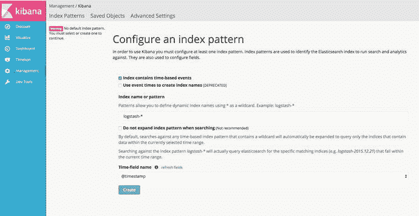
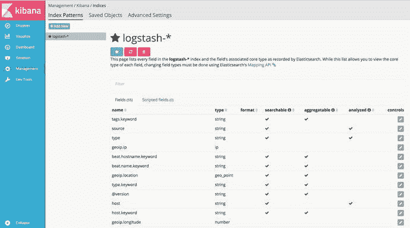
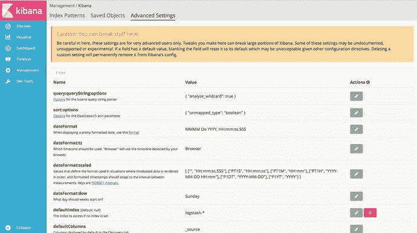
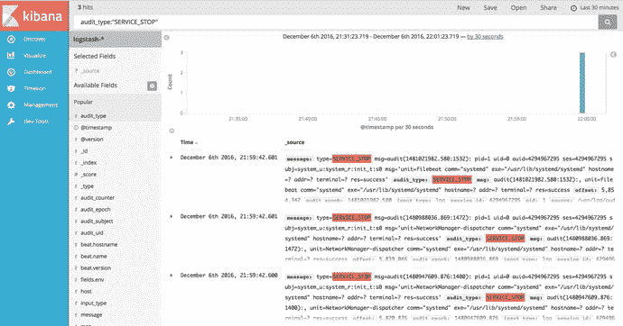
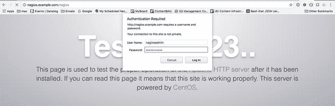
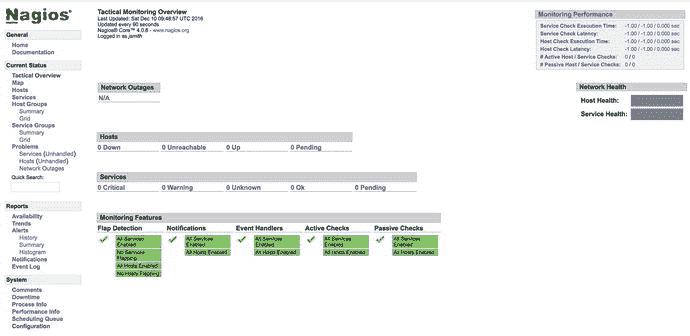
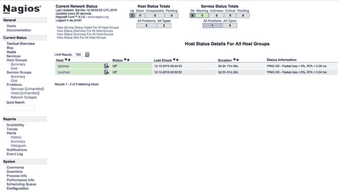
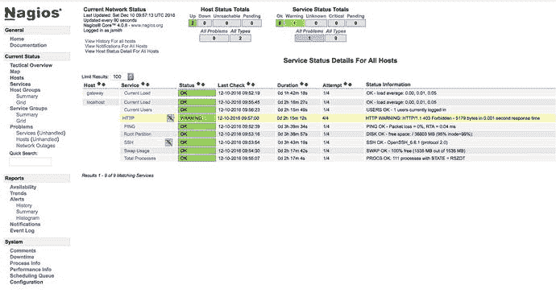

# 18.记录和监控

By James Turnbull and Dennis Matotek

在本书中，我们讨论了日志记录和监控，以及它们在应用程序和服务故障诊断中的价值。在本章的第一节，我们将会看到日志在 Linux 操作系统上是如何工作的，以及如何利用这些数据。我们将了解如何存储、聚合、分析、发送警报以及循环日志条目和日志。我们还将看看一些工具，使它更容易与您的日志进行交互。

在本章的第二部分，我们将展示如何使用一个名为 Nagios 的开源工具来监控我们介绍的应用程序和服务。Nagios 允许您定义您的主机和在其上运行的服务。然后，您可以确保这些主机已启动，并且您的服务正常运行。如果它们不起作用，您的监控系统可以通知您出现了什么问题。这一过程可以大大加快发现和解决问题的速度。

## 记录

你已经在整本书中看到，许多应用程序和工具记录关于它们的动作和状态的数据。您已经看到我们可以使用`journalctl`命令来查看日志，并且日志可以在各种文件中的`/var/log`目录中结束。日志记录通常由两个守护进程完成:T2 守护进程和 T3 守护进程。现在，我们将逐一看一下。

### -报纸

作为`systemd`的一部分，引入了新的日志功能。Journald 创建二进制结构的日志文件，可以用来代替传统的(`r` ) `syslog`日志记录。以下是日记日志文件的一些功能:

*   日志篡改可以被检测到，并且不容易被手动编辑。
*   日志是索引，可以加快搜索速度。
*   日志采用结构化格式，具有明确定义的字段。
*   `journald`为每个日志消息收集额外的日志元数据。
*   Journald 支持导出格式(比如 JSON)。

默认情况下，日志存储在系统内存或环形缓冲区中，不会永久存储。由于额外的元数据，日志事件比普通日志更大，占用更多的空间。您可以将它们持久化到磁盘上，我们将在本章稍后向您展示如何做到这一点。

我们使用已经多次使用的`journalctl`命令来访问日志文件。如果您在没有任何参数或过滤器的情况下执行`journalctl`命令，您将看到类似清单 [18-1](#Par12) 的内容。

```sh
$ sudo journalctl
-- Logs begin at Fri 2016-11-25 22:16:00 AEDT, end at Mon 2016-11-28 21:07:54 AEDT. --
Nov 25 22:16:00 au-mel-centos-1 systemd-journal[89]: Runtime journal is using 8.0M...current limit 92.0M).
Nov 25 22:16:00 au-mel-centos-1 systemd-journal[89]: Runtime journal is using 8.0M...current limit 92.0M).
Nov 25 22:16:00 au-mel-centos-1 kernel: Initializing cgroup subsys cpuset
Nov 25 22:16:00 au-mel-centos-1 kernel: Initializing cgroup subsys cpu
Nov 25 22:16:00 au-mel-centos-1 kernel: Initializing cgroup subsys cpuacct
Nov 25 22:16:00 au-mel-centos-1 kernel: Linux version 3.10.0-327.4.5.el7.x86_64 ...CentOS 4.8.3-9) (GCC)...
Nov 25 22:16:00 au-mel-centos-1 kernel: Command line: BOOT_IMAGE=/vmlinuz-3.10.0-327.4.5.el7.x86_64...
Nov 25 22:16:00 au-mel-centos-1 kernel: e820: BIOS-provided physical RAM map:
Listing 18-1.The journalctl Command

```

`journalctl`的输出将显示我们启动主机时的日志，为了清楚起见，我们已经截断了一些长行。您首先看到日志开始，然后看到`cgroups`的初始化，接着是 Linux 内核版本和它是如何构建的。然后我们看到内核加载命令，接着是低级内存初始化。

清单 [18-1](#Par12) 的第一行显示了第一个条目的日期和最后一个条目的日期。您可以看到这里的每个日志都由四个部分组成。

*   时间戳
*   主机名
*   发出日志的服务
*   日志消息

进一步看一下`journalctl`命令，我们将探索它的一些可用选项。例如，要查看日志的最后十行，我们将发出以下命令:

```sh
$ sudo journalctl –n 10
-- Logs begin at Fri 2016-11-25 22:16:00 AEDT, end at Mon 2016-11-28 21:24:54 AEDT. --
Nov 28 21:01:01 backup run-parts(/etc/cron.hourly)[9627]: starting 0yum-hourly.cron
...
Nov 28 21:24:54 backup sudo[9647]:   bsingh : TTY=pts/0 ; PWD=/home/bsingh ; USER=root ; COMMAND=/bin/journalctl -n 10

```

这里我们看到最后十行(省略了八行)，最后一个日志条目是我们刚刚输入的`sudo`命令。我们在这里看到的是由我们刚刚谈到的四个字段组成的日志的简化视图。有很多关于日志的数据我们看不到。让我们更仔细地看看最后一个条目的详细输出(参见清单 [18-2](#Par22) )。

```sh
$ sudo journalctl -n 1 -o verbose
-- Logs begin at Fri 2016-11-25 22:16:00 AEDT, end at Mon 2016-11-28 21:29:46 AEDT. --
Mon 2016-11-28 21:29:46.407435 AEDT [s=1798dd89d9ff412b8edcc9e7b5cb8484;i=1c0b;b=11ffa7916baa42a89cbbc756af6d26bc;m=2486cb476a;t=54259f362b5ab;x=68026ef74697a39]
    _BOOT_ID=11ffa7916baa42a89cbbc756af6d26bc
    _MACHINE_ID=e3c7fd86ed8b4ef69e569a93e30db6ab
    PRIORITY=5
    _CAP_EFFECTIVE=1fffffffff
    _HOSTNAME=backup
    _TRANSPORT=rsyslog
    SYSLOG_FACILITY=10
    _AUDIT_LOGINUID=1000
    _SYSTEMD_OWNER_UID=1000
    _SYSTEMD_SLICE=user-1000.slice
    SYSLOG_IDENTIFIER=sudo
    _COMM=sudo
    _EXE=/usr/bin/sudo
    _SELINUX_CONTEXT=unconfined_u:unconfined_r:unconfined_t:s0-s0:c0.c1023
    _AUDIT_SESSION=40
    _SYSTEMD_CGROUP=/user.slice/user-1000.slice/session-40.scope
    _SYSTEMD_SESSION=40
    _SYSTEMD_UNIT=session-40.scope
    _UID=1005
    _GID=1006
    MESSAGE=  bsingh : TTY=pts/0 ; PWD=/home/bsingh ; USER=root ; COMMAND=/bin/journalctl -n 1 -o verbose
    _PID=9653
    _CMDLINE=sudo journalctl -n 1 -o verbose
    _SOURCE_REALTIME_TIMESTAMP=1480328986407435
Listing 18-2.Journal Metadata

```

您可以看到每个日志都包含大量相关的元数据。日志日期范围信息后的第一行是光标位置信息，或日志中条目的位置。其余的是带有大量可过滤数据的键/值对。现在让我们来看看一些常见的过滤器。

#### Journalctl Filters

日志记录工具的伟大之处在于它是结构化的，这意味着我们可以轻松地过滤我们感兴趣的信息。任何有 Linux 经验的人都会告诉你他们最喜欢的调查日志的咒语。有了过滤器，我们不再需要如此依赖通过命令`grep`和`awk`来传输日志。

我们将从使用`–k`选项过滤内核消息的`journalctl`输出开始。

```sh
$ sudo journalctl –k
-- Logs begin at Fri 2016-11-25 22:16:00 AEDT, end at Mon 2016-11-28 22:06:08 AEDT. --
Nov 25 22:16:00 au-mel-centos-1 kernel: Initializing cgroup subsys cpuset
Nov 25 22:16:00 au-mel-centos-1 kernel: Initializing cgroup subsys cpu
...
Nov 28 21:01:01 backup kernel: SELinux: initialized (dev tmpfs, type tmpfs), uses transition SIDs
Nov 28 22:01:01 backup kernel: SELinux: initialized (dev tmpfs, type tmpfs), uses transition SIDs

```

现在让我们将这个长长的列表缩减为只有那些具有`ERROR`优先级(`-p`)的内核日志消息。

```sh
$ sudo journalctl -p err -k
-- Logs begin at Fri 2016-11-25 22:16:00 AEDT, end at Mon 2016-11-28 22:10:14 AEDT. --
Nov 25 22:16:13 backup kernel: CIFS VFS: Send error in SessSetup = -127
Nov 25 22:16:13 backup kernel: CIFS VFS: cifs_mount failed w/return code = -127
Nov 25 22:17:13 backup kernel: CIFS VFS: Send error in SessSetup = -13

```

这里我们列出了所有出错的内核日志。有七个优先级可供使用；单词或数字都可以。

*   `emerg(0)` —紧急情况
*   `alert(1)`
*   `crit(2)` —关键
*   `err(3)` —错误
*   `warning(4)`
*   `notice(5)`
*   `info(6)`—信息
*   `debug(7)`

`–k`选项与使用`dmesg`命令查看日志是一样的，但是正如您所见，`journalctl`更容易阅读和过滤。

我们可以组合过滤器。我们可以使用`–b`选项查看自上次系统启动以来的消息。

```sh
$ sudo journalctl –p info –b

```

这通常仍然是大量的消息，因此我们可以使用更具体的时间过滤器来进一步细化。

```sh
$ sudo journalctl -p info --since "2016-11-28 22:44:00" --until "2016-11-28 22:54:00"

```

这里我们以优先级`info`显示过去十分钟的日志。时间是当地时间。如果您想查看 UTC 时间，您可以发出以下命令:

```sh
$ sudo journalctl --utc

```

在清单 [18-2](#Par22) 中，我们看到了日志中包含的字段的完整列表。我们也可以使用这些元数据作为过滤器。清单 [18-2](#Par22) 中的一个字段是`_COMM`，它记录了用于生成日志的命令。我们可以列出该字段的所有不同值，如下所示:

```sh
$ sudo journalctl –F _COMM
unix_chkpwd
request-key
freshclam-sleep
run-parts
pickup
usermod
...

```

假设我们想要搜索自上次引导以来发生的任何`usermod`变化。

```sh
$ sudo journalctl _COMM=usermod -b
-- Logs begin at Fri 2016-11-25 22:16:00 AEDT, end at Mon 2016-11-28 23:09:04 AEDT. --
Nov 25 22:48:41 backup usermod[4844]: add 'jsmith' to group 'sales'
Nov 25 22:48:41 backup usermod[4844]: add 'jsmith' to shadow group 'sales'

```

我们还可以将这些字段中的任何一个与`--since`和`--until`时间过滤器结合起来，以获得更窄的视图。列出两个字段(用空格分隔)提供了一个逻辑 AND 列表(`_COMM=usermod  _COMM=useradd`)。使用一个`+`将给出一个逻辑 OR 列表(`_COMM=usermod + _HOSTNAME=backup`，它将提供一个带有`usermod`的列表和任何带有主机名备份的列表。

Tip

键入`journalctl`并按下 Tab 键两次将给出可用字段的列表。

我们也可以通过它们的`systemd`单元名称来列出日志。在这里，我们将使用下面的代码来跟踪(类似于`tail`命令)`httpd`日志:

```sh
$ sudo journalctl -f -u httpd.service
-- Logs begin at Fri 2016-11-25 22:16:00 AEDT. --
Nov 28 23:27:11 backup systemd[1]: Starting The Apache HTTP Server...
Nov 28 23:27:11 backup systemd[1]: Started The Apache HTTP Server.

```

这里您可以看到 Apache 服务启动时的输出。

#### 使用 fss 保护日志

我们前面说过，我们可以检测日志是否被篡改。这是通过一个名为前向安全密封(FSS)的特性实现的，该特性使用生成的密钥对之一对日志进行签名。密封密钥将在指定的时间间隔密封日志，验证密钥可用于检测篡改。日志以可配置的定期间隔被签名或密封。这为您的日志提供了一定程度的安全性。

但是，它不能阻止攻击您系统的人掩盖他们的踪迹，他们可以通过删除日志或在密封时间间隔之间进行编辑来绕过这一点。如果有人篡改您的日志，它不会提供任何额外的信息，但会给你一个时间范围，在这种情况下发生。它可以被视为整个系统安全的一小部分。

要使用 FSS，首先需要启用日记日志文件的持久性存储。这可以通过发出以下命令轻松实现:

```sh
$ sudo mkdir /var/log/journal
$ sudo systemctl restart systemd-journald

```

然后，为了生成密钥对，我们将发出图 [18-1](#Fig1) 中的命令。


图 18-1。

FSS key generation and QR code

正如图 [18-1](#Fig1) 中的文字所说，我们应该将秘密验证密钥存储在一个安全的地方，它让我们能够方便地使用二维码将其存储在我们的手机上。签名密钥已经放在了`/var/log/journal/ e3c7f…db6ab/`目录下的`fss`文件中。每 15 分钟轮换一次。

让我们用我们的密钥来验证日志，以确保它们没有被篡改。

```sh
$ sudo journalctl --verify-key 4f5f8f-9eb38b-eff95a-bc0bc8/191914-35a4e900
PASS: /var/log/journal/e3c7fd86ed8b4ef69e569a93e30db6ab/system.journal
PASS: /var/log/journal/e3c7fd86ed8b4ef69e569a93e30db6ab/user-1005.journal

```

#### 日志-远程

另一种防止日志丢失或被篡改的方法是尽快将它们发送到一个集中的日志主机。`Systemd` Journal 提供了一个`systemd-journal-remote`服务，可以从其他主机接收日志消息，并提供一个集中的日志服务。这是一个相当新的概念，目前有一些批评者，因为 TLS 服务并不真正安全(不强制客户端证书验证)，但随着它的成熟，它显示出巨大的前景。

该服务可以被动地(等待日志消息)或主动地(从远程主机拉取消息)。它可以配置为通过 HTTP 或 HTTPS 进行监听。我们将设置一台主机`gateway.example.com`，它将把日志上传到我们的主`backup.example.com`服务器。

我们将为我们的日志使用`https://` transport，我们将假设我们已经创建了 CA 所需的 TLS 密钥。在本例中，我们还使用了两台 CentOS 主机，但是 CentOS 和 Ubuntu 的配置应该是相同的。

首先，使用 CentOS，您需要安装`systemd-journal-gateway`包。在 Ubuntu 上是`systemd-journal-remote`包。两种套餐都提供`systemd-journal-gateway`、`systemd-journal-upload`和`systemd-journal-remote`服务。

网关服务是一个 HTTP 服务器，可用于查询日志。远程服务用于从其他服务器接收日志。当然，upload 用于将日志上传到远程服务器。这里我们只展示上传和远程服务。

我们将首先设置监听日志消息的远程服务。为此，我们需要编辑以下内容:

```sh
$ sudo vi /etc/systemd/journal-remote.conf
[Remote]
ServerKeyFile=/etc/pki/tls/private/backup.example.com.key
ServerCertificateFile=/etc/pki/tls/certs/backup.example.com.cert
TrustedCertificateFile=/etc/pki/tls/certs/cacert.pem

```

这提供了我们需要的 TLS 密钥和证书的详细信息。`systemd-journal-remote`用户需要能够读取私有密钥文件。接下来，我们需要做一些额外的文件系统更改。

```sh
$ sudo mkdir –p /var/log/journal/remote && sudo chown systemd-journal-remote /var/log/journal/remote

```

默认情况下，远程日志服务将监听端口`19532`。我们需要将此添加到防火墙的允许规则中。

```sh
$ sudo firewall-cmd --permanent --zone public --add-port=19532/tcp
$ sudo firewall-cmd --reload

```

默认情况下，服务被配置为使用`https://`进行监听。这可在`/usr/lib/systemd/system/systemd-journal-remote.service`文件中配置。现在，我们可以使用以下命令启动远程日志服务:

```sh
$ sudo systemctl enable systemd-journal-remote
$ sudo systemctl start systemd-journal-remote
$ sudo systemctl status systemd-journal-remote

```

我们在继续之前检查状态，以确保我们的服务已成功启动。我们需要配置的下一个服务是在网关主机上。我们需要编辑以下文件:

```sh
$ sudo vi /etc/systemd/journal-upload.conf
[Upload]
URL=https://backup.example.com:19532
ServerKeyFile=/etc/pki/tls/private/gateway.example.com.key
ServerCertificateFile=/etc/pki/tls/certs/gateway.example.com.cert
TrustedCertificateFile=/etc/pki/tls/certs/cacert.pem

```

这类似于远程服务文件，只有一个显著的不同，这一点您无疑可以看到。`URL`选项指向端口 19532 上的`backup.example.com`主机。同样，私钥必须对`systemd-journal-upload`用户可读。我们现在需要做一些类似的文件系统更改，就像我们对远程服务所做的那样。

首先，我们需要访问记录我们发送了哪些日志的状态文件，并访问存储在`/run/log/journal`中的日志。

```sh
$ sudo chown systemd-journal-upload /var/lib/systemd/journal-upload
$ sudo usermod –aG systemd-journal systemd-journal-upload

```

我们现在准备开始我们的日志上传。

```sh
$ sudo systemctl enable systemd-journal-upload
$ sudo systemctl start systemd-journal-upload

```

我们应该很快就会开始看到日志进入`backup.example.com`主机上的`/var/log/journal/remote`目录。

```sh
[jsmith@backup ∼]$ sudo ls -l /var/log/journal/remote/
total 16388
-rw-r-----. 1 systemd-journal-remote systemd-journal 8388608 Nov 29 22:58 remote-
gateway@3a016bda55334bcd88d8a6fa52b1dc61-0000000000000001-0005426ea713ed3c.journal

```

现在，我们让远程主机向备份服务器发送日志。在下一节中，我们将进一步探讨如何将日志记录放入`rsyslog`作为替代。

### rsyslogd(rsyslogd)

应用程序将数据输出到`rsyslog`守护进程，其中包含守护进程可以解析的特殊格式的日志条目。然后，守护程序获取日志条目，并可以对它们执行各种操作，包括将它们写到文件中。

你已经在本书的前面看到了一些条目。现在来看几条`rsyslog`线:

```sh
Nov 30 00:54:25 backup systemd: Stopping System Logging Service...
Nov 30 00:54:25 backup systemd: Starting System Logging Service...
Nov 30 00:54:28 backup systemd: Started System Logging Service.

```

一个`rsyslog`条目由日期、记录该条目的主机名称(通常是发出该条目的服务)和日志数据本身组成。这里我们展示了一个`rsyslog`服务的重启，它首先被停止和启动，然后确认它被启动。

`rsyslog`的前身`syslog`，是无处不在的 Unix 日志格式。它已经出现在所有版本的 Linux 上，实际上几乎出现在所有版本的 Unix 上。您可以使用第三方工具将它添加到 Windows 系统中，大多数网络设备，如防火墙、路由器和交换机都能够生成`syslog`消息。这导致了`syslog`格式成为现存的最接近通用日志标准的东西。`rsyslog`是对`syslog`的改进，它提供了 TCP (SSL/TLS)、额外的模块和可靠的事件日志协议(RELP)。

Tip

RFC 5424 记录了核心的`rsyslog`功能，你可以在 [`https://tools.ietf.org/html/rfc5424`](https://tools.ietf.org/html/rfc5424) 阅读。

各种工具都使用`syslog`格式，这些工具的功能和复杂性各不相同，通常统称为`syslog`守护进程。这些守护进程包括基本的`syslog`工具以及更高级的变体，如`syslog-NG`(NG 的意思是“下一代”)和`rsyslog. rsyslog`已经从`syslog`和`syslog-NG`的工作中受益匪浅。

我们将介绍基本的`rsyslog`工具，因为它在 CentOS 和 Ubuntu 上都是默认的。它还为理解日志如何在 Linux 系统上工作打下了基础。

`rsyslog`实用程序旨在生成、处理和存储有意义的事件通知消息，为管理员提供管理其系统所需的信息。`syslog`既是一系列程序和库，包括`rsyslogd`、`rsyslog`守护进程，也是一个通信协议。

`rsyslog`最常用的组件是`rsyslogd`守护进程。这个守护进程从启动开始就在您的系统上运行，并监听来自您的操作系统和应用程序的消息。需要注意的是`rsyslogd`守护进程是一个被动的工具。它只是等待来自设备或程序的输入。它不出去主动收集信息。

工具的下一个主要特性是 RELP 通信协议。有了这个协议，可以通过网络将您的日志数据发送到远程系统，在那里另一个`rsyslog`守护进程可以收集和集中您的日志。

Tip

流量通常通过 TCP 在端口 514 上传输。

### 配置 rsyslog

`rsyslog`守护进程由位于`/etc`中名为`rsyslog.conf`的配置文件控制。该文件包含关于`rsyslogd`正在监听什么设备和程序、该信息将被存储在哪里以及当该信息被接收时将采取什么动作的信息。

你可以在这里看到 Ubuntu 的默认配置文件:

```sh
#################
#### MODULES ####
#################

module(load="imuxsock") # provides support for local system logging
module(load="imklog")   # provides kernel logging support
#module(load="immark")  # provides --MARK-- message capability

# provides UDP syslog reception
#module(load="imudp")
#input(type="imudp" port="514")

# provides TCP syslog reception
#module(load="imtcp")
#input(type="imtcp" port="514")

# Enable non-kernel facility klog messages
$KLogPermitNonKernelFacility on

###########################
#### GLOBAL DIRECTIVES ####
###########################

#
# Use traditional timestamp format.
# To enable high precision timestamps

, comment out the following line.
#
$ActionFileDefaultTemplate RSYSLOG_TraditionalFileFormat

# Filter duplicated messages
$RepeatedMsgReduction on

#
# Set the default permissions for all log files.
#
$FileOwner syslog
$FileGroup adm
$FileCreateMode 0640
$DirCreateMode 0755
$Umask 0022
$PrivDropToUser syslog
$PrivDropToGroup syslog

#
# Where to place spool and state files
#
$WorkDirectory /var/spool/rsyslog

#
# Include all config files in /etc/rsyslog.d/
#
$IncludeConfig /etc/rsyslog.d/*.conf

```

如您所见，第一部分加载基本模块。我们加载`imuxsock`模块(`module(load="imuxsock")`，它需要将`syslog`系统调用传递给`rsyslog`，以及`imklog` ( `module(load="imklog")`，它允许内核日志记录。可以加载的模块有很多，你可以在`man rsyslog.conf`页面找到与`rsyslog`捆绑在一起的模块列表。也可以安装其他模块；这些将由相关的包提供，比如为 MySQL 提供日志支持的`rsyslog-mysql`。

模块部分之后是全局指令部分。这定义了用户、文件和目录模式以及其他内务管理。这些很少被编辑。在文件的底部，你会发现`IncludeConfig`语句告诉`rsyslog`加载它在`rsyslog.d`目录中找到的以`*.conf`结尾的任何文件。

在 Ubuntu 上的`rsyslog.d`目录中有一个包含一些默认值的文件，名为`50-default.conf`；该文件包含额外的指令。CentOS `rsyslog.conf`文件是这两个文件的组合，并且非常相似。

```sh
#
# First some standard log files.  Log by facility.
#
auth,authpriv.*            /var/log/auth.log
*.*;auth,authpriv.none        -/var/log/syslog
#cron.*                /var/log/cron.log
#daemon.*            -/var/log/daemon.log
kern.*                -/var/log/kern.log
#lpr.*                -/var/log/lpr.log
mail.*                -/var/log/mail.log
#user.*                -/var/log/user.log

#
# Logging for the mail system.  Split it up so that
# it is easy to write scripts to parse these files.
#
#mail.info            -/var/log/mail.info
#mail.warn            -/var/log/mail.warn
mail.err            /var/log/mail.err

#
# Logging for INN news system.
#
news.crit            /var/log/news/news.crit
news.err            /var/log/news/news.err
news.notice            -/var/log/news/news.notice

#
# Some "catch-all" log files.
#
#*.=debug;\
#    auth,authpriv.none;\
#    news.none;mail.none    -/var/log/debug
#*.=info;*.=notice;*.=warn;\
#    auth,authpriv.none;\
#    cron,daemon.none;\
#    mail,news.none        -/var/log/messages

#
# Emergencies are sent to everybody logged in.
#
*.emerg                                :omusrmsg:*

#
# I like to have messages displayed on the console, but only on a virtual
# console I usually leave idle.
#
#daemon,mail.*;\
#    news.=crit;news.=err;news.=notice;\
#    *.=debug;*.=info;\
#    *.=notice;*.=warn    /dev/tty8

# The named pipe /dev/xconsole is for the `xconsole' utility.  To use it,
# you must invoke `xconsole' with the `-file' option:
#
#    $ xconsole -file /dev/xconsole [...]
#
# NOTE: adjust the list below, or you'll go crazy if you have a reasonably
#      busy site..
#
daemon.*;mail.*;\
    news.err;\
    *.=debug;*.=info;\
    *.=notice;*.=warn    |/dev/xconsole

```

正如您已经发现的，CentOS 和 Ubuntu 都将其日志文件存储在`/var/log`目录中，但是使用不同的文件名来存储不同类型的日志条目；例如，您在第 [12 章](12.html)中看到(并且您可以在前面的`50-default.conf`配置文件中看到)Ubuntu 在`mail.log`文件中存储了与邮件相关的`rsyslog`条目。然而，在 CentOS 上，与邮件相关的`rsyslog`条目被写入`maillog`文件。您可以检查您的主机的`rsyslog.conf`配置文件，以确定您想要的信息将被写入何处。

`rsyslog.conf`文件中的每一行都由两个字段组成:一个选择器字段和一个动作字段。这些字段由空格或制表符分隔。你可以在清单 [18-3](#Par106) 中看到一行的例子。

```sh
mail.*        -/var/log/mail.log
Listing 18-3.rsyslog.conf Syntax

```

这个例子展示了一个选择器`mail.*`，以及动作`/var/log/mail.log`。选择器指定一个工具和一个优先级，用句点分隔。工具告诉您日志消息的来源；例如，`mail`工具用于记录与邮件服务(如 Postfix)相关的消息。有许多可用的工具，我们将在下一节中逐一介绍。每个应用程序指定它将用于其日志条目的工具。

优先级(`.*`)告诉`rsyslog`正在发送的消息的重要性。有一系列的优先级，我们将很快解释每一个。同样，当应用程序将消息发送到`rsyslog`时，它们会选择每条消息的优先级。

动作告诉`rsyslog`如何处理消息；通常这意味着将其写入文件。在清单 [18-3](#Par106) 中，来自`mail`设施的具有`any`优先级的所有消息都将被写入文件`/var/log/mail.log`。

#### 工具

该工具识别`rsyslog`消息的来源。一些操作系统守护程序和其他常见的应用程序守护程序都附带有标准的工具。`mail`和`kern`设施是两个很好的例子，分别是邮件相关的事件通知消息和所有内核相关的消息。

没有指定工具的其他进程和守护进程可以使用`local`工具，范围从`local0`到`local7`。表 [18-1](#Tab1) 列出了所有`rsyslog`设施。

表 18-1。

syslog Facilities on Linux

<colgroup><col> <col></colgroup> 
| 设施 | 目的 |
| --- | --- |
| `auth` | 与安全相关的消息 |
| `auth-priv` | 访问控制消息 |
| `cron` | `cron`-相关消息 |
| `daemon` | 守护进程和进程消息 |
| `kern` | 内核消息 |
| `local0–local7` | 为本地定义的消息保留 |
| `lpr` | 假脱机(打印)子系统消息 |
| `mail` | 与邮件相关的消息 |
| `mark` | 由`rsyslogd` ( `internal use only`)生成的带时间戳的消息 |
| `news` | 网络新闻相关消息(例如，新闻组) |
| `syslog` | `syslog`-相关消息 |
| `user` | 未指定设施时的默认设施 |
| `uucp` | 与 UUCP 相关的消息 |

Tip

在 CentOS 系统上，默认情况下，`local7`用于引导消息，这些消息被定向到`/var/log/boot.log`。

Note

`mark`设施是一个特例。当您使用`-m`(分钟)标志时，`rsyslogd`生成的带时间戳的消息使用它。

还有两个特殊的工具:`*`(一个通配符，表示所有工具)和`none`(否定一个工具选择)。

您可以在清单 [18-4](#Par117) 中看到通配符选择器。

```sh
*.emerg                                :omusrmsg:*
Listing 18-4.rsyslog.conf * Wildcard Selector

```

这将把所有优先级为`emerg`的消息发送给所有登录的人，而不考虑设备。

Tip

`omusrmsg`中的 om 代表输出模块。这些用于处理消息并将它们传送到不同的目标；你可以在这里看到更多: [`www.rsyslog.com/doc/v8-stable/configuration/modules/idx_output.html`](http://www.rsyslog.com/doc/v8-stable/configuration/modules/idx_output.html) 。

您可以使用`none`通配符选择器来不选择来自特定设施的消息。清单 [18-5](#Par121) 中所示的例子将告诉`rsyslog`不要将任何内核消息记录到文件`/var/log/messages`中。

```sh
kern.none                      /var/log/messages
Listing 18-5.rsyslog.conf none Wildcard Selector

```

#### 优先

优先级是按照重要性的递增顺序来组织的。分别是`debug`、`info`、`notice`、`warning`、`err`、`crit`、`alert`、`emerg`。每个优先级选择器适用于规定的优先级和所有更高的优先级，因此`mail.err`表示`err`、`crit`、`alert`和`emerg`优先级的所有`mail`设备信息。

与工具一样，您可以使用通配符选择器`*`和`none`。此外，您可以使用另外两个修饰符:`=`和`!`。`=`修饰符表示只选择了一个优先级；例如，`cron.=crit`表示只选择优先级为`crit`的`cron`设备消息。`!`修改器有负面效果；例如，`cron.!crit`选择除了优先级为`crit`或更高的`cron`设施信息之外的所有`cron`设施信息。您还可以组合这两个修饰符来创建与`=`修饰符相反的效果，以便`cron.!=crit`选择所有`cron`工具消息，除了那些关键优先级的消息。每个选择器只能列出一个优先级和一个优先级通配符。

#### 行动

动作告诉`rsyslogd`如何处理它收到的事件通知消息。根据加载的输出模块，`rsyslog`可以执行几个潜在的动作。

*   记录到文件
*   登录到设备
*   记录到命名管道
*   登录到特定用户或控制台
*   将日志发送到另一台主机
*   记录到数据库表
*   执行命令
*   丢弃

清单 [18-6](#Par134) 展示了`rsyslogd`可以采取的前四个动作的例子，包括记录到文件、设备文件、命名管道和控制台或用户屏幕。

```sh
cron.err          /var/log/cron
auth.!=emerg    /dev/lpr1
news.=notice     |/tmp/pipe
auth-priv         root,jsmith
Listing 18-6.File, Device, and Named Pipe Actions

```

在第一行中，`err`优先级及更高优先级的所有`cron`消息被记录到文件`/var/log/cron`中。

Note

当登录到文件时，`rsyslogd`允许您在文件名前添加一个连字符(`-`)，如下所示:`-/var/log/auth`。这告诉`rsyslog`在写入文件后不要同步文件。这是为了加快写入日志的过程。但这也意味着，如果您的系统在两次写入尝试之间崩溃，您将会丢失数据。

第二行包含除了发送到本地打印机`lpr1`的`emerg`优先级消息之外的所有`auth`消息。

第三个将所有优先级为`notice`或更高的`news`消息发送到一个名为`/tmp/pipe`的命名管道。

Note

发送到命名管道允许您将`rsyslog`数据发送到其他应用程序；例如，使用命名管道收集日志消息，并将它们传递给日志关联引擎或数据库。

第四行也是最后一行将所有的`auth-priv`消息发送给用户`root`和`jsmith`，如果他们已经登录的话。

您还可以执行最后一个操作，将日志发送到另一个主机，如清单 [18-7](#Par142) 所示。

```sh
mail     @backup.example.com
Listing 18-7.Logging to a Remote System

```

在这个例子中，所有的`mail`消息都被发送到主机`backup.example.com`。

要发送所有日志，我们将使用以下语法:

```sh
*.*     @backup.example.com

```

`rsyslog`使用 UDP 端口 514 传输日志消息。这里假设远程主机上的`rsyslog`守护进程已经被配置为接收日志，并且您有合适的防火墙规则来接收日志条目。这里有一个例子:

```sh
$ sudo firewall-cmd --permanent --zone public --add-port=514/udp

```

这里我们创建了一个防火墙规则，允许主机在 UDP 端口 514 上接收来自主机 192.168.0.254 的`rsyslog`数据。但是，由于这是 UDP，记住 UDP 是一个“一劳永逸”的协议，不能保证另一端的服务器会收到它。

为了避免这种情况并防止可能的消息丢失，我们将使用 RELP，这是一种可靠的事件记录协议(参见 [`www.rsyslog.com/doc/v8-stable/configuration/modules/omrelp.html`](http://www.rsyslog.com/doc/v8-stable/configuration/modules/omrelp.html) )。

```sh
*.*    :omrelp:backup.example.com:2514

```

当然，我们需要加载我们的`rsyslog.conf`文件的模块部分中的模块，我们将很快展示如何配置 RELP。

#### 组合多个选择器

您也可以在您的`rsyslog.conf`文件中组合多个选择器，允许更复杂的选择和过滤。例如，您可以在一个选择器中列出多个用逗号分隔的设施(参见清单 [18-8](#Par153) )。

```sh
auth,auth-priv.crit              /var/log/auth
Listing 18-8.Multiple Facilities

```

这会将优先级为`crit`或更高的所有`auth`消息和所有`auth-priv`消息发送到文件`/var/log/auth`。

但是，你不能通过优先级来做到这一点。如果要列出多个优先级，需要列出多个选择器，用分号隔开，如清单 [18-9](#Par156) 所示。

```sh
auth;auth-priv.debug;auth-priv.!=emerg        /var/log/auth
Listing 18-9.Multiple Priorities

```

该示例向您展示了如何将优先级为`debug`或更高的所有`auth`消息和所有`auth-priv`消息(不包括优先级为`emerg`的`auth-priv`消息)发送到文件`/var/log/auth`。

Tip

请记住，对于多个选择器，过滤是从左到右进行的；`rsyslogd`将从左边的选择器开始处理该行，并移动到每个后续选择器的右边。记住这一点，将较宽的过滤器放在左边，向右移动时缩小过滤标准。

您还可以使用多条线路将消息发送到多个位置，如清单 [18-10](#Par160) 所示。

```sh
auth                               /var/log/auth
auth.crit                         jsmith
auth.emerg                    /dev/console
Listing 18-10.Logging to Multiple Places

```

在这里，所有的`auth`消息如前所述被记录到`/var/log/auth`中，但是如果用户`jsmith`登录，优先级为`crit`或更高的`auth`消息也被发送给用户【】。那些`emerg`优先级的也被发送到控制台。

使用`omfwd`输出模块也很常见，它允许您通过 TCP 或 UDP 将日志发送到远程服务器。如果我们想将日志消息发送到本地文件和远程服务器，我们可以使用如下方式:

```sh
mail.*    action(type="omfile" sync="no" file="/var/log/maillog”)
                   action(type="omfwd" Target="monitor.example.com" Port="10514" Protocol="tcp")

```

你可以在 [`www.rsyslog.com/doc/v8-stable/configuration/modules/omfwd.html`](http://www.rsyslog.com/doc/v8-stable/configuration/modules/omfwd.html) 了解更多关于这个模块的内容。

### 配置 RELP

RELP 允许我们设置中央日志服务器，可以从任意数量的客户端服务器收集和存储日志。RELP 比 Journald 的远程日志记录更成熟，并且经过了数千次安装的考验。它的配置也相当简单，模块可以通过包管理安装。

```sh
$ sudo yum install –y rsyslog-relp rsyslog-gnutls
$ sudo aptitude install –y rsyslog-relp rsyslog-gnutls

```

我们需要配置客户端和服务器。RELP 允许您将日志从客户端转发到服务器，服务器可以将日志推送到其他服务器上。我们将使用 TLS 来加密我们的日志流量，并避免 rouge 客户端连接并潜在地发送虚假的日志流量或发起 DoS 攻击，这在普通的 UDP/TCP 模块中是可能的。

在 Ubuntu 上，`syslog`用户运行`rsyslogd`服务。因此，您需要确保`syslog`用户能够读取 TLS 私有密钥。为此，您可以使用`setfacl`命令:

```sh
$ sudo setfacl -m u:syslog:rx /etc/ssl/private
$ sudo setfacl -m u:syslog:r /etc/ssl/private/nfs.example.com.key

```

`root`用户在 CentOS 上运行`rsyslogd`服务，不需要更改。

#### 配置 RELP 客户端

我们将从 RELP 客户端配置开始。我们将假设主机已经有一个 TLS 密钥和由我们的私有 CA 签名的公共证书。我们将再次使用网关主机，它将连接并将其日志发送到`backup.example.com`主机。

```sh
$ sudo vi /etc/rsyslog.d/relp.conf
# make gtls driver the default
$DefaultNetstreamDriver gtls

# certificate files
$DefaultNetstreamDriverCAFile /etc/pki/tls/certs/cacert.pem
$DefaultNetstreamDriverCertFile /etc/pki/tls/certs/gateway.example.com.cert
$DefaultNetstreamDriverKeyFile /etc/pki/tls/private/gateway.example.com.key

$ActionSendStreamDriverAuthMode x509/name
$ActionSendStreamDriverPermittedPeer backup.example.com
$ActionSendStreamDriverMode 1
*.* @@backup.example.com:6514

```

我们创建了一个名为`relp.conf`的文件，并将其配置为在客户端和`backup.example.com`主机之间使用加密传输。我们通过一个名为`gtls`的 NetStreamDriver 来实现这一点，它实现了我们的 TLS 传输(GnuTLS)。NetStreamDriver 可以提供顺序传递、身份验证和安全传输。

我们需要提供我们的 TLS 证书文件，它们的描述如前所示。记住在 Ubuntu 上 TLS 文件会有不同的路径。

我们通过我们的证书名称(`x509/name`)来处理认证。这意味着，我们通过测试对等方 TLS 证书中的通用名称来验证我们与对等方的连接。如果它匹配对等体`backup.example.com`，那么我们将允许连接；否则，我们将失败。模式`1`表示我们将使用 TLS。

最后一行说我们将把所有设施和优先权(`*.*`)运到`6514`港的`backup.example.com`。您现在将重启`rsyslog`守护进程。

```sh
$ sudo systemctl restart rsyslog

```

#### 配置 RELP 服务器

现在我们可以配置我们的 RELP 服务器了。这将从我们的网络中收集日志并存储它们。配置类似于客户端，我们的备份主机如下所示:

```sh
$ sudo vi /etc/rsyslog.d/relp.conf
$ModLoad imtcp

$DefaultNetstreamDriver gtls

$DefaultNetstreamDriverCAFile /etc/pki/tls/certs/cacert.pem
$DefaultNetstreamDriverCertFile /etc/pki/tls/certs/backup.example.com.cert
$DefaultNetstreamDriverKeyFile /etc/pki/tls/private/backup.example.com.key

$InputTCPServerStreamDriverAuthMode x509/name
$InputTCPServerStreamDriverPermittedPeer *.example.com
$InputTCPServerStreamDriverMode 1
$InputTCPServerRun 6514

```

首先，我们需要加载我们的`imtcp`模块，它将提供 TCP 连接。然后，除了更改名称之外，我们拥有与客户端相同的 TLS 密钥配置选项。我们接受所有由我们的 CA 签名的、名字中带有`example.com`的对等体。最后一行告诉`rsyslogd`在端口 6514 上运行一个 TCP 服务器。

现在，我们需要确保我们的备份服务器(CentOS 服务器)上的端口 6514 是打开的，因此我们使用`firewall-cmd`命令。

```sh
$ sudo firewall-cmd --permanent --zone public --add-port=6514/tcp
$ sudo firewall-cmd --reload

```

然后，我们也在备份服务器上重启`rsyslog`守护进程。

```sh
$ sudo systemctl restart rsyslog

```

在备份服务器上，我们现在可以检查我们的`/var/log/messages`文件，我们应该会看到类似如下的日志:

```sh
Dec  1 12:01:17 gateway chronyd[608]: Selected source 27.124.125.250
Dec  1 12:01:19 gateway chronyd[608]: Selected source 27.124.125.250
Dec  1 12:01:21 backup systemd: Starting user-0.slice.
Dec  1 12:01:01 backup systemd: Started Session 143 of user root.
Dec  1 12:05:51 gateway chronyd[608]: Selected source 202.127.210.37
Dec  1 12:08:22 dc1 systemd[1]: Started CUPS Scheduler.

```

日志中包含时间戳、主机名、服务和正在写入的消息。在这里，我们可以看到主机网关、主机`dc1`和`backup`服务器现在都登录到我们的备份服务器。

### 启动和停止 rsyslog

`rsyslogd`守护进程通常在系统启动时启动。您可以使用`systemctl`命令手动启动和停止`rsyslog`守护进程。

```sh
$ sudo systemctl start rsyslog
$ sudo systemctl stop rsyslog
$ sudo systemctl status rsyslog

```

在 CentOS 和 Ubuntu 上，你可以分别使用`/etc/sysconfig/rsyslog`和`/etc/default/rsyslogd`文件定制`rsyslogd`的选项。

设置主机时，注意以下几点很重要。如果您的日志位于根分区，您的系统可能会崩溃。为了降低这种潜在崩溃的风险，我们建议您将日志存储在非根(非`/`)分区上。这意味着即使你磁盘上的所有空间都用完了，系统也不会崩溃。

### 使用记录器测试日志记录

在 CentOS 和 Ubuntu 上都有，`logger`是测试日志配置的有用命令行工具。

```sh
$ logger -p mail.info "This is a test message for facility mail and priority info"

```

这将向您的`rsyslog`守护进程写入消息“这是工具邮件和优先级信息的测试消息”,并写入您为工具为`mail`、优先级为`info`的消息配置的任何目的地。

如您所见，`-p`参数允许您指定一个工具和优先级组合，然后测试消息包含在引号中。

出于测试目的，我们经常在 bash 脚本中使用`logger`来生成多条消息。清单 [18-11](#Par197) 中的脚本为每个设施和优先级组合生成一个`rsyslog`消息。

```sh
#!/bin/bash

for f in
{auth,authpriv,cron,daemon,kern,lpr,mail,mark,news,rsyslog,user,uucp,local0,local1,
local2,local3,local4,local5,local6,local7}

   do
    for p in {debug,info,notice,warning,err,crit,alert,emerg}
   do
     logger -p $f.$p "Test rsyslog messages from facility $f with priority $p"
   done
   done
exit 0

Listing 18-11.Log Testing bash Script

```

您还可以使用`logger`将一个不断增长的文件传输到`rsyslog`。

```sh
$ tail -f /tmp/logfile | logger -p daemon.info

```

这里我们将文件`/tmp/logfile`添加到了`logger`命令中。文件中的每一行都将被写入优先级为`info`的`daemon`设施。

### 日志管理和轮换

管理日志环境的一个重要部分是控制日志文件的数量，并将日志文件保持在可管理的大小。为此，您可以轮换日志。

日志轮换是定期复制日志文件的过程，通常会添加一个后缀，如日期或递增的数字。然后`rsyslog`守护进程记录到一个新文件中。您通常会将循环日志文件保留一段固定的时间，例如一周或一个月。

让我们看一个例子。我们已经拿到了`/var/log/mail.log`文件。我们可以每天轮换这个文件，并将轮换后的文件保留七天。日志轮转过程将在我们指定的时间开始，例如，将现有的`mail.log`文件复制到`mail.log.1`，然后创建一个空的`mail.log`文件。原木旋转过程也将递增；如果一个`mail.log.1`文件存在，这个文件将被重命名为`mail.log.2`，以此类推。如果有一个`mail.log.7`文件，这个文件将被删除，并且`mail.log.6`文件增加到`mail.log.7`。

手动管理日志循环可能相当复杂，因此我们建议您使用`logrotate`工具。CentOS 和 Ubuntu 都附带了`logrotate`工具，并且通常已经为您安装和配置好了。默认配置处理来自主机上安装的应用程序的大多数典型日志文件。

`logrotate`命令配置简单，并且依赖于`crontab`按计划运行。基本`logrotate`配置位于`/etc/logrotate.conf`，你可以在清单 [18-12](#Par206) 中看到一个典型文件。

```sh
weekly
rotate 4
create
dateext
include /etc/logrotate.d
/var/log/wtmp {
    monthly
    create 0664 root utmp
    minsize 1M
    rotate 1
}
/var/log/btmp {
    missingok
    monthly
    create 0600 root utmp
    rotate 1
}
Listing 18-12.logrotate.conf

```

这个简单的文件包含了`logrotate`用来处理日志文件的全局选项。在本例中，我们删除了空行和注释。所有日志文件每周轮换一次，日志在被删除之前会轮换四次，新的日志文件会被创建，轮换后的文件会添加一个日期扩展名，并且`logrotate`工具会检查`logrotate.d`目录中是否有任何新的`logrotate`文件。您可以使用其他选项，其中一些选项如表 [18-2](#Tab2) 所示。你可以钻研一下`logrotate`的个人档案来寻找其他的选择。

表 18-2。

logrotate.conf Options

<colgroup><col> <col></colgroup> 
| [计]选项 | 描述 |
| --- | --- |
| `daily` | 日志每天轮换一次。 |
| `weekly` | 日志每周轮换一次。 |
| `monthly` | 日志每月轮换一次。 |
| `compress` | 旧的日志文件用 gzip 压缩。 |
| `create mode owner group` | 创建新的日志文件，模式为八进制 0700，所有者和组(相反的是`nocreate`)。 |
| `ifempty` | 即使日志文件为空，它也会被循环。 |
| `include directory or filename` | 由`logrotate`处理的列出的文件和目录的内容。 |
| `are included.` |   |
| `mail address` | 当日志被淘汰时，它会被邮寄到地址。 |
| `nomail` | 最后的日志没有邮寄到任何地址。 |
| `missingok` | 如果日志文件丢失，它将被跳过，而`logrotate`将进入下一个日志文件，而不会发出错误消息。 |
| `nomissingok` | 如果日志文件丢失，将发出一条错误消息(默认行为)。 |
| `rotate count` | 日志文件在被删除之前会旋转`count`次。如果`count`为 0，则删除旧的日志文件，而不是旋转。 |
| `size size[M,k]` | 当日志文件超过最大值时，将被循环；`M`表示以兆字节为单位的大小，`k`表示以千字节为单位的大小。 |
| `sharedscripts` | 可以为每个被循环的日志文件运行前脚本和后脚本。如果日志文件定义由一组日志文件组成(例如，`/var/ log/samba/*`)并且设置了`sharedscripts`，那么前脚本/后脚本只运行一次。对面是`nosharedscripts`。 |

清单 [18-12](#Par206) 显示了最后一个命令`include`，它主要驱动`logrotate`。清单 [18-12](#Par206) 中的`logrotate.d`目录包含一个文件集合，告诉`logrotate`如何处理你的各种日志文件。

您还可以定义额外的目录和文件，并将它们包含在`logrotate.conf`文件中，以适应您的环境。然而，大多数发行版使用`logrotate.d`目录，并在该目录中附带了许多预定义的文件来处理常见的日志循环，如`mail`、`cron`和`rsyslog`消息。我们建议您在此添加任何新的日志轮换文件。

Note

许多软件包在安装时也会将日志循环文件添加到该目录中。

清单 [18-13](#Par212) 向您展示了其中一个文件。

```sh
/var/log/messages /var/log/secure /var/log/maillog /var/log/spooler
/var/log/boot.log /var/log/cron
{
daily
rotate 7
sharedscripts
postrotate
     /bin/kill -HUP 'cat /var/run/rsyslogd.pid 2> /dev/null' 2> /dev/null || true
endscript
}
Listing 18-13.CentOS rsyslog logrotate File

```

在这些文件中，您可以覆盖`logrotate.conf`中的大多数全局选项，为单个文件或目录定制日志轮换。清单 [18-13](#Par212) 首先列出所有要旋转的文件。这也可以包括使用语法`/path/to/log/files/*`的目录。

然后，包含在`{ }`中的是这组特定文件的任何选项。在本例中，我们覆盖了全局日志记录选项，每天轮换这些文件，并保留日志文件的七次轮换。

接下来，我们运行一个脚本。您可以使用`prerotate`命令运行脚本，该命令在旋转任何日志之前运行脚本，或者使用`postrotate`，该命令在旋转日志文件(或多个日志文件)之后运行脚本。

清单 [18-13](#Par212) 显示了一个脚本，它在日志文件(或多个日志文件)被轮转之后重启`rsyslog`守护进程。由于选项`sharedscripts`被启用，无论循环多少个日志文件，脚本都将只运行一次。脚本语句以`endscript`选项结束。

那么，`logrotate`是如何运行的呢？默认情况下，在 CentOS 和 Ubuntu 上，`cron`在预定的时间运行`logrotate`(通过脚本`/etc/cron.daily`；它由 Anacron 执行)。您也可以在命令行上手动运行它。

如果在命令行上运行，`logrotate`默认为`/etc/logrotate.conf`的配置文件。您可以覆盖该配置文件，如下行所示:

```sh
$ sudo logrotate /etc/logrotate2.conf

```

`logrotate`命令也有几个命令行选项可以使用，如表 [18-3](#Tab3) 所示。

表 18-3。

logrotate Command-Line Options

<colgroup><col> <col></colgroup> 
| [计]选项 | 描述 |
| --- | --- |
| `-d` | 调试模式，在该模式下不会对日志文件进行任何更改；它将输出它可能已经旋转的结果。也意味着详细模式。 |
| `-v` | 详细模式。 |
| `-f` | 即使不需要，也强制进行日志轮换。 |

在大多数系统上，默认情况下，`cron`每天运行`logrotate`，这是我们推荐您使用的模型。

## 测井分析和对比

现在您有了所有这些日志文件，您可以用它们做什么呢？嗯，日志有两个用途。

*   发现什么时候出了问题
*   当出现问题时，帮助诊断问题

为了实现第一个目标，您需要一个工具来识别特定的日志消息并提醒您它们的存在。这个过程被称为日志分析和关联，它通常被认为是一门黑色艺术。好消息是，我们将向您介绍一个名为 Logstash 的工具。

Logstash 将把我们所有的日志输入到一个叫做 Elasticsearch 的分布式搜索和分析工具中。在那里，我们可以通过一个名为 Kibana 的界面查看我们收集的日志数据。这将有助于使日志分析和关联成为日常监控工作的一部分。

首先要记住的是，分析和关联是两回事。分析是对组成整体的组成部分及其相互关系的研究。作为一个系统管理员，最好的分析工具就是你。系统管理员了解其主机的操作模式，通常可以比自动监控或警报系统更快地检测到问题。

然而，这个模型有两个问题。首先，你不可能同时出现在所有地方。第二，系统收集的数据量越来越大，可能会变得不堪重负。

这就是相关性发挥作用的地方。相关性最好定义为检测数据之间关系的行为。您设置工具来收集您的数据，从谷壳中过滤“小麦”，然后关联剩余的数据，将正确的信息放在您的面前，以便您可以提供准确的分析。

正确设置和管理的工具可以整理来自主机日常操作的持续数据流。他们可以检测这些数据之间的关系，或者将这些数据整合成一个连贯的整体，或者为您提供合适的数据，让您自己进行分析。

但是，您必须确保这些工具是正确的工具，并且被配置为寻找正确的东西，这样您就可以依靠它们来告诉您出现了问题，您需要进行干预。

构建这样一个自动化日志监控系统的第一步是确保您收集了正确的东西并将它们放在正确的位置。列出您所有的应用程序、设备和主机以及它们的记录位置。第二阶段是把所有的信息汇集在一起，找出你真正想知道的。列出对你和你的主人很重要的关键信息。

将这些列表分组为优先列表；有些消息您可能希望收到，有些可以通过电子邮件发送，有些可能会触发自动化流程或尝试自我恢复，如重新启动流程。

第三阶段是实现日志关联和分析，包括配置关联工具和设计所需的响应。请确保仔细记录每条消息、对消息的响应以及与此消息相关的任何特殊信息。

### 介绍 Beats 和 Logstash

我们看了系统如何写日志和管理日志；现在我们想看一下日志记录的下一个层次，也就是将这些日志传送并转换成有用的信息。Logstash 和 Beats 帮助我们将日志信息从主机上移走，并对它们进行处理以备存储，这样我们就可以使用发现工具来查看对系统上发生的事情的分析。存储和发现由 Elasticsearch 和 Kibana 处理，我们将在下一节中讨论这些内容。

Beats 是日志、度量、网络数据包数据和 Windows 事件的轻量级转发器。轻量级意味着他们除了将数据发送到远程位置，跟踪他们发送了什么之外什么也不做。我们将查看 Filebeat，它将我们的日志传送到 Logstash。

Logstash 是一个工具，可以将日志(或其他数据，如指标等)转换为可以索引和标记的数据，然后存储(或再次发布)以使数据的发现更容易。Logstash 可以接收各种各样的输入，并有各种各样的输出，其中之一就是能够写入 Elasticsearch。

Logstash 提供了一系列插件，可以帮助解析、过滤和转换数据，或者您也可以编写自己的插件。插件是用 Ruby 编写的，如果您找不到任何现有的插件，您可以创建输入、编解码器、过滤器和输出插件来满足您的需求。

顾名思义，输入插件负责将数据接收到 Logstash 中。编解码器插件用于更改事件或流过滤器的数据表示。过滤器允许在将事件发送到输出之前对其进行处理(在特定条件下丢弃事件、匿名化数据等)。Outputs 将 Logstash 处理的输出写到一个 stash 或类似 Elasticsearch 的某种存储中。其他输出可以是 S3 或石墨。输入、编解码器、过滤器和输出的组合创建了一个管道。

关于 Logstash 如何工作的更深入的讨论，请参见这里:

*   [T2`https://www.elastic.co/guide/en/logstash/current/pipeline.html`](https://www.elastic.co/guide/en/logstash/current/pipeline.html)

#### 安装和配置 Beats

现在让我们来看看我们的日志路径的第一步。使用 Beats，尤其是 Filebeat，我们将从我们的主机收集数据，并将其发送到 Logstash 服务器。在这个场景中，Filebeat 将在我们的网关主机上运行，并将其数据发送到我们的监控服务器。我们在第 [17](17.html) 章中谈到的监控服务器设置了我们的 Graphite 服务，并用于存储我们通过 Collectd 从主机收集的指标。

为了简单起见，我们将在我们的监控主机上运行 Logstash 服务和 Elasticsearch。在现实场景中，根据转换和数据收集的数量，一个集群中至少有三个 Elasticsearch 节点，并且可能有几层 Logtash 服务运行在一两个单独的节点上。

在网关节点上，我们将安装 Filebeat。我们可以从 [`https://www.elastic.co/downloads/beats/filebeat`](https://www.elastic.co/downloads/beats/filebeat) 下载 Filebeat，我们可以选择最合适的包格式(RPM，DEB，`tar.gz`)。网关主机恰好是 CentOS 主机，所以我们将安装一个 RPM 版本。

```sh
$ sudo yum install -y https://artifacts.elastic.co/downloads/beats/filebeat/filebeat-5.0.2-x86_64.rpm

```

Tip

你也可以在你的机器上设置 APT 或者 YUM 库；详情见此: [`https://www.elastic.co/guide/en/beats/libbeat/current/setup-repositories.html`](https://www.elastic.co/guide/en/beats/libbeat/current/setup-repositories.html) 。

对于 Ubuntu 和 CentOS，Filebeat 的配置文件存储在`/etc/filebeat/filebeat.yml`中。我们将把所有来自`/var/log`的日志发送到位于监控服务器上的 Logstash 服务器。我们用清单 [18-14](#Par248) 中所示的配置来实现。

```sh
filebeat.prospectors:
- input_type: log
  paths:
    - /var/log/messages
    - /var/log/*.log
    - /var/log/audit/audit.log
tags: ["security", "network"]
fields:
  env: production
output.logstash:
  hosts: ["monitor.example.com:5044"]
  ssl.certificate_authorities: ["/etc/pki/tls/certs/cacert.pem"]
  ssl.certificate: "/etc/pki/tls/certs/gateway.example.com.cert"
  ssl.key: "/etc/pki/tls/private/gateway.example.com.key"
Listing 18-14.Filebeat.yml

```

通常将数据发送到本地 Logstash 服务，而不是像我们在这里所做的那样发送到远程服务。这样，在通过网络发送之前，您可以在本地转换数据。如果您只需要匿名数据在网络中传输，或者您可能希望使用主机的分布式处理能力，而不是依赖集中式 Logstash 服务来转换数据，那么您可能希望这样做。

Filebeat 配置文件的格式是 YAML(更多信息参见“YAML 格式”侧栏)。在清单 [18-14](#Par248) 中，第一行声明了我们的`filebeat.prospectors`。您可以有不同类型的输入，prospectors 文件是您声明它们的地方。在清单 [18-14](#Par248) 中，你可以看到我们声明了一个`log`的`input_type`值。另一种选择是`stdin`的输入类型。然后，我们可以列出希望从中接收日志的路径。当然，我们希望从`/var/log/messages`收集日志。您可以使用 globs 来捕获所有日志(`/var/log/*.log`)，或者您可以针对特定的日志(`/var/log/audit/audit.log`)。这里我们捕获的是`/var/log`目录中的任何内容(不包括任何`.gz`或-20161131 旋转日志)，除了我们指定的内容(`audit.log`)，我们不捕获`/var/log/*/*.log`中的任何内容。

YAML Format

YAML 不是标记语言，或者只是 YAML，是一种人类可读的数据序列化语言。YAML 是 JSON 数据序列化格式的超集，通常用于配置文件。

它是结构化数据，可以包含字符串、列表、关联数组和块标量。

```sh
---
key: value
- lista
- listb
keya:
  - valuea
  - valueb

```

你可以在 [`www.yaml.org/start.html`](http://www.yaml.org/start.html) 了解更多关于 YAML 的信息。

如果我们想要一个不同的来捕获我们的 Apache 日志，我们可以像这样单独完成:

```sh
- input_type: log
  paths:
    - /var/log/*.log
- input_type: log
  paths:
    - /var/log/apache/httpd-*.log
  document_type: apache

```

我们没有在网关上运行 Apache 服务器，但是在这里您可以看到我们将 Apache 日志作为不同的输入类型，并且我们将应用`apache`的`document_type`。这将事件类型字段(我们应用于日志的元数据标签之一)更改为`apache`，而不是`log`。这有助于我们在处理链的下游进行转换。

在清单 [18-14](#Par248) 中，您还会看到我们对所有数据都应用了全局指令。我们用`security`和`network`标记我们的数据，并给它一个环境标记`production`。这又增加了数据的丰富性，我们以后可以用它来提取、转换和过滤我们的数据。

我们的输出将被发送到主机上的 Logstash 服务器。我们将使用 TLS 加密传输来发送数据。我们在这里没有匿名化我们的日志，所以发送到监控主机的任何内容都可以以明文形式读取，这使我们容易受到窥探。加密数据可以防止这种情况。

您可以在 Filebeat prospectors 上使用更多配置选项。您可以包括或排除特定行、排除文件、添加特定标记、添加特定字段以及添加多行模式匹配。你可以在这里了解更多信息:

*   [T2`https://www.elastic.co/guide/en/beats/filebeat/current/configuration-filebeat-options.html`](https://www.elastic.co/guide/en/beats/filebeat/current/configuration-filebeat-options.html)

我们不会立即启动我们的 Filebeat 服务，但是您可以像平常一样使用`systemctl`来启动和停止它。

```sh
$ sudo systemctl enable filebeat
$ sudo systemctl start filebeat

```

在启动 Filebeat 服务之前，我们将配置 Logstash 服务来接受日志。

#### 安装和配置 Logstash

Logstash 是一个 Java 进程，用于在将输出“存储”在某种存储中以供进一步分析或查看之前转换数据。它非常强大，你可以用它做很多事情。这一章不会公正地对待它，因为我们只能展示它的力量的最基本要素。在本节中，我们将向您展示如何安装，然后进行基本配置，以便我们可以将日志数据输出到 Elasticsearch。

Logstash 的当前版本需要 Java 8。我们将通过 [`https://www.elastic.co`](https://www.elastic.co) 提供的 APT 库在我们的 Ubuntu 监控主机上安装这项服务，该公司帮助设计和支持 Kibana、Elasticsearch、Logstash 和 Beats 的开源项目。

让我们首先添加 APT 存储库，首先添加公共 GPG 密钥，然后添加包`apt-transport-https`(如果还没有安装的话)，最后将实际的存储库添加到 APT。

```sh
wget -qO - https://artifacts.elastic.co/GPG-KEY-elasticsearch | sudo apt-key add -
sudo aptitude install –y apt-transport-https
echo "deb https://artifacts.elastic.co/packages/5.x/apt stable main" | sudo tee -a /etc/apt/sources.list.d/elastic-5.x.list
sudo aptitude update

```

这里我们使用了我们已经安装的`aptitude`包管理器，而不是您也可以使用的`apt-get`。现在我们可以安装 Logstash 了。

```sh
$ sudo aptitude install –y logstash

```

对于 CentOS 和最新的安装说明，您可以在此处查看说明:

*   [T2`https://www.elastic.co/guide/en/logstash/current/installing-logstash.html`](https://www.elastic.co/guide/en/logstash/current/installing-logstash.html)

Logstash 的配置文件保存在`/etc/logstash`中。大多数情况下，您不需要更改服务启动的任何配置，但是如果您愿意，您可以使用`/etc/logstash/startup.options`文件来这样做。该文件包含运行服务的用户、您可能希望包含的`JAVA_OPTS`，等等。

我们现在将创建一个管道来处理我们的日志。我们可以用两种方法做到这一点。我们可以编辑并添加到`/etc/logstash/logstash.yml`文件，这是主要的管道配置文件，或者我们可以在`/etc/logstash/conf.d/`中创建一个文件，该文件将由 Logstash 服务读取。让我们看看如何从网关主机和任何其他 Beats 服务收集日志文件。

```sh
$ sudo vi /etc/logstash/conf.d/general.conf
input {
  beats {
    port => 5044
    ssl  => true
    ssl_certificate => “/etc/ssl/certs/monitor.example.com.cert”
    ssl_key => “/etc/ssl/private/monitor.example.com.key”
    ssl_certificate_authorities [ “/etc/ssl/certs/cacert.pem” ]
    ssl_verify_mode => force_peer
  }
}
output {
  stdout { codec => rubydebug }
}

```

看一下这个文件，您可以看到它由两部分组成:输入和输出。通常，您会看到三个部分，包括一个过滤器部分。

```sh
Input {
  ...
}
filter {
  ...
}
output {
  ...
}

```

熟悉 Ruby 的人会认为这是 Ruby 散列语法。JRuby，for Java Ruby，与 Logstash 一起使用，配置文件采用原生 Ruby 语法。

在我们的`input`部分，我们已经包含了我们的`beats`插件，并且`beats`插件像前面一样接受端口和 SSL 配置选项。这对您来说应该已经很熟悉了，但是需要注意的是，这里我们指定了一个`force_peer`的`ssl_verify_mode`值。这意味着如果客户端不向服务器提供证书，我们将立即断开连接。这将使我们的系统更加安全，并尽早丢弃未授权的连接。

输出部分描述了我们处理完数据后将把数据发送到哪里。我们可以看到，我们将数据输出到`stdout`，为了帮助我们调试该输出，我们将使用一个名为`rubydebug`的编解码器。这对于我们开始旅程时查看 Logstash 正在做什么很有好处。我们还将指定`elasticsearch`作为输出，但是我们在这个阶段不想这么做。

我们已经准备好启动我们的 Logstash 服务，并开始了解它是如何工作的。我们通过以下命令来实现:

```sh
$ sudo -u logstash /usr/share/logstash/bin/logstash -f /etc/logstash/conf.d/general.conf
WARNING: Could not find logstash.yml which is typically located in $LS_HOME/config or /etc/logstash. You can specify the path using --path.settings. Continuing using the defaults
Could not find log4j2 configuration at path /usr/share/logstash/config/log4j2.properties. Using default config which logs to console
04:20:40.036 [[main]-pipeline-manager] INFO  logstash.inputs.beats - Beats inputs: Starting input listener {:address=>"0.0.0.0:5044"}
04:20:40.072 [[main]-pipeline-manager] INFO  logstash.pipeline - Starting pipeline {"id"=>"main", "pipeline.workers"=>2, "pipeline.batch.size"=>125, "pipeline.batch.delay"=>5, "pipeline.max_inflight"=>250}
04:20:40.075 [[main]-pipeline-manager] INFO  logstash.pipeline - Pipeline main started
04:20:40.087 [[main]<beats] INFO  org.logstash.beats.Server - Starting server on port: 5044
04:20:40.134 [Api Webserver] INFO  logstash.agent - Successfully started Logstash API endpoint {:port=>9600}

```

在第一部分中，我们将看到启动输出，它给出了使用什么参数启动什么的详细信息。您将会看到，我们正在主管道端口 5044 上启动 Beats 输入，并在端口 9600 上启动一个 web API。

现在，在网关主机上，我们可以启动我们的`filebeat`服务。我们用像这样的`systemctl`命令来做这件事，然后我们可以跟踪服务产生的日志。

```sh
$ sudo systemctl start filebeat && tail –f /var/log/filebeat/filebeat

```

现在，在`monitor`主机上，我们可以启动`logstash`服务，我们应该会看到大量数据从网关服务器上的 Filebeat 传入。

在清单 [18-15](#Par287) 中，我们看到了从网关主机捕获的日志消息之一。每个节拍都被赋予了自己的时间戳，我们还被赋予了一系列其他相关的元数据，比如`input_type`、它可以来自的主机、我们与节拍相关联的标签等等。每个节拍都有一个宿主、一个来源和一个信息。该消息将具有我们已经看到的`rsyslog`格式。

```sh
{
    "@timestamp" => 2016-12-04T06:33:33.868Z,
    "offset" => 11979,
    "@version" => "1",
    "input_type" => "log",
    "beat" => {
        "hostname" => "gateway.example.com",
            "name" => "gateway.example.com",
         "version" => "5.0.2"
     },
     "host" => "gateway.example.com",
     "source" => "/var/log/messages",
      "message" => "Dec  4 06:33:24 gateway jsmith: tesing this is a test",
      "fields" => {
           "env" => "production"
       },
       "type" => "log",
       "tags" => [
          [0] "security",
          [1] "network",
          [2] "beats_input_codec_plain_applied"
       ]
}
Listing 18-15.Beat from Gateway Server Logs

```

让我们简单地看一下我们正在收集的审计日志:

```sh
         "host" => "gateway.example.com",
         "source" => "/var/log/audit/audit.log",
         "message" => "type=SERVICE_STOP msg=audit(1480834167.796:997): pid=1 uid=0 auid=4294967295 ses=4294967295 subj=system_u:system_r:init_t:s0 msg='unit=NetworkManager-dispatcher comm=\"systemd\" exe=\"/usr/lib/systemd/systemd\" hostname=? addr=? terminal=? res=success'",
         "type" => "log",

```

你会立即注意到`audit.log`与你正常的`rsyslog`格式不同。`auditd`文件是一组键/值对(`key=value`)。它们看起来可能与我们在这里看到的非常不同，但基本上它们由一个类型和一条消息组成(包括一个时间戳和唯一的 ID)。然后，根据类型，它们可以有任意数量的其他键和值。在本例中，我们已经停止了`openvpn`服务，这是生成的日志通知。

这不是我们想要的格式，也不像是一条`rsyslog`消息。让我们更改一下，以便将此记录为不同类型的事件。为此，我们将编辑网关主机上的 Filebeat 配置，并更改以下内容:

```sh
filebeat.prospectors:
- input_type: log
  paths:
    - /var/log/messages
    - /var/log/*.log
- input_type: log
  paths:
    - /var/log/audit/audit.log
  document_type: auditd

```

我们已经将`audit.log`移到了它自己的`input_type`部分。在该部分中，我们添加了`document_type`选项，并将其设置为`auditd`。现在让我们向你展示它的作用；继续并重新加载 Filebeat 服务。

```sh
    "host" => "gateway.example.com",
    "source" => "/var/log/audit/audit.log",
    "message" => "type=SERVICE_STOP msg=...terminal=? res=success'",
    "fields" => {
        "env" => "production"
    },
    "type" => "auditd",

```

现在，当我们从停止网关主机上的`openvpn`服务得到相同的消息时，`type`被设置为`auditd`。现在，我们可以在过滤器部分使用它，使审计日志更容易进一步处理。

#### 日志隐藏过滤器

Logstash 过滤器是一种解析和转换数据的方式，可以更容易地发现日志中的内容。我们将获取我们的`auditd`日志，提取信息并将其添加到我们的事件数据中。

当我们查看原始的`audit.log`文件时，我们会看到这样的信息:

```sh
type=SERVICE_STOP msg=audit(1480844911.323:1080): pid=1 uid=0 auid=4294967295 ses=4294967295 subj=system_u:system_r:init_t:s0 msg='unit=openvpn@gateway comm="systemd" exe="/usr/lib/systemd/systemd" hostname=? addr=? terminal=? res=success'

```

这些是`key=value`日志。您可以看到`type=SERVICE_STOP`、`uid=0`和`msg='...'`都是键/值对。Logstash 能理解如何对付`key=values`。我们通过告诉过滤器获取每个键和值并对其赋值来实现这一点。您还可以看到，我们有一个`audit(1480844911.323:1080)`，它是时间戳(`1480844911.323`，在 Unix 纪元时间中)加上一个唯一的 ID ( `1080`，用于标记事件。

那么，我们如何让 Logstash 处理这些事件呢？在我们的节拍配置中，我们用`auditd`的`document_type`标记`audit.logs`。我们看到，从 Filebeat 进入 Logstash 的事件现在已经附加了类型`auditd`。我们现在可以匹配这个值，并处理具体包含该数据的日志。我们在过滤器部分使用了一个条件`if`语句。

```sh
filter {
  if [type] == "auditd" {
    # audit.log get matched and worked on here
  }
}

```

这里我们使用了一个条件语句`if { ... }`,如果标签`[type]`等于字符串`"auditd"`,它就匹配标签`[type]`。既然我们正在处理正确的日志，我们现在可以告诉 Logstash 根据它所看到的创建键/值对。我们使用以下代码行来实现这一点:

```sh
filter {
  if [type] =∼ "auditd" {
    kv { }
  }
}

```

这只会在我们的元数据中创建更多的标签，我们可以在这些标签上进一步工作并用于发现。让我们看看这对我们的 Logstash 数据有什么影响:

```sh
{
    "msg" => [
        [0] "audit(1480844911.323:1080):",
        [1] "unit=openvpn@gateway comm=\"systemd\" exe=\"/usr/lib/systemd/systemd\" hostname=? addr=? terminal=? res=success"
    ],
    "uid" => "0",
    "ses" => "4294967295",
    "auid" => "4294967295",
    "pid" => "1",
    "source" => "/var/log/audit/audit.log",
    "message" => "type=SERVICE_STOP msg=audit(1480844911.323:1080): pid=1 uid=0 auid=4294967295 ses=4294967295 subj=system_u:system_r:init_t:s0 msg='unit=openvpn@gateway comm=\"systemd\" exe=\"/usr/lib/systemd/systemd\" hostname=? addr=? terminal=? res=success'",
    "type" => "SERVICE_STOP",
    "subj" => "system_u:system_r:init_t:s0"
    "tags" => [
        [0] "security",
        [1] "network",
        [2] "beats_input_codec_plain_applied"
    ],
    "offset" => 5738705,
    "input_type" => "log",
    "@timestamp" => 2016-12-04T09:48:31.650Z,
    "@version" => "1",
    "beat" => {
        "hostname" => "gateway.example.com",
        "name" => "gateway.example.com",
        "version" => "5.0.2"
    },
    "host" => "gateway.example.com",
    "fields" => {
        "env" => "production"
    },
}

```

现在你可以看到，我们通过用更多可用的数据来标记数据，从而给数据添加了更多的纹理。我们要求输出更易于阅读，但是您可以看到输出的前几行是来自消息内容的键/值对。如果我们给其中一些标签更多的细节，我们也可以使它更具可读性。我们用`mutate`和`rename`函数来做这件事。

```sh
filter {
  if [type] =∼ "auditd" {
    kv { }
    mutate {
      rename => {
        "type"        => "audit_type"
        "auid"        => "audit_uid"
        "fsuid"       => "audit_fs_uid"
        "suid"        => "audit_set_uid"
        “subj”        => “audit_subject”
        "ses"         => "session_id"
        “hostname => “audit_hostname”
      }
    }
  }
}

```

现在，当我们查看我们的 Logstash 数据时，它看起来类似于这样:

```sh
{
...
    "audit_uid"       => "4294967295",
    "audit_subject" => "system_u:system_r:init_t:s0",
    "audit_type"     => "SERVICE_STOP"
    "session_id"     => "4294967295",
...
}

```

`mutate`功能改变了日志信息的状态。它允许我们将日志消息中的某些字段重命名为更清晰的标签。

最后，如果我们查看日志消息中的时间戳，它不会被提取。我们将确保数据最终也成为一个标签。为此，我们使用了一个名为`grok`的函数。一个`grok`函数由两部分组成，语法和语义，编写如下:

```sh
%{SYNTAX:SEMANTIC}

```

`SYNTAX`是与您的文本匹配的模式的名称。Logstash 附带了很多，您可以在这里查看它们:

*   [T2`https://github.com/logstash-plugins/logstash-patterns-core/blob/master/patterns/grok-patterns`](https://github.com/logstash-plugins/logstash-patterns-core/blob/master/patterns/grok-patterns)

模式是映射到名称的正则表达式。我们正在处理的时间戳是 epoch 或 Unix epoch，是自 1970 年以来的秒数。既然它是一个数字，我们可以使用本地 Logstash `NUMBER`模式来匹配它。

`SEMANTIC`只是我们将赋予它的标识符，以便我们为元数据标签增加更大的价值。我们给它`audit_epoch`。

正如我们已经说过的，时间戳`audit(1480844911.323:1080)`有两个部分:时间和唯一标识符。我们将使用`grok`来搜索包含纪元和唯一 ID 的字符串，并提取它们作为我们的标签。

```sh
    grok {
      match => { "msg" => "audit\(%{NUMBER:audit_epoch}:%{NUMBER:audit_counter}\):" }
    }

```

这里我们告诉`grok`匹配`msg`键并找到`audit(<somenumber>:<somenumber)`:字符串。对于第一场比赛，我们将其命名为`audit_epoch`，对于第二场比赛，我们将其命名为`audit_counter`。现在，当我们再次运行我们的 Logstash 服务时，我们将看到以下内容:

```sh
{
...
    "offset" => 5745528,
    "audit_epoch" => "1480846476.689",
   "audit_counter" => "1106",
...
}

```

我们现在已经成功地转换了审计日志，并向我们的 Logstash 数据添加了额外的标签。我们现在可以开始把它加入到弹性搜索中。

### 日志存储的弹性搜索

我们有从 Filebeat 上传的日志，我们有进入 Logstash 服务的日志，我们正在转换我们的一些日志，使它们在存储后更容易被发现。现在让我们看看我们将在哪里存储我们的日志数据，即 Elasticsearch。

Elasticsearch 是一个基于 Apache Lucene 的全文搜索和分析引擎。(Lucene 是一个代码库和 API: [`http://lucene.apache.org/core/`](http://lucene.apache.org/core/) )。)Elasticsearch 非常擅长搜索和理解基于文本的数据。它有一个 RESTful API，允许您查询和存储数据。它基于分布式架构，可以存储数 Pb 的可搜索数据。

Elasticsearch 会将我们的日志数据存储在一个索引中。索引是数据的逻辑名称空间。使用 Logstash，默认情况下，我们为每天的日志数据创建一个索引。索引由文档组成，文档相当于关系数据库的行。每个索引都有一个映射，该映射定义了索引中的类型和其他索引设置，并描述了如何搜索索引。类型是文档的类型，就像用户或日志一样，被 API 用作过滤器。文档是一个 JSON 对象，每个对象都有一个类型和一个 ID。文档由一个或多个键/值对组成。

每个文档存储在一个主碎片中，可以有零个或多个副本碎片，这是为了冗余和性能。碎片分布在 Elasticsearch 集群的节点中。当一个节点关闭时，副本碎片可以提升为主碎片，并且碎片可以在整个集群中重新分布。

我们将在我们的监控主机上安装和配置它，这是一个单一节点。根据您想要的数据量，您显然需要对您的部署做出一些决定。对于分布式系统，以奇数部署总是好的，比如 1、3、5、7 等等。这有助于降低大脑分裂事件的风险，就像我们在第 [13](13.html) 章中谈到的 GlusterFS。

#### 弹性搜索安装和配置

Elasticsearch 安装需要至少 4GB 内存来运行服务，没有它将无法启动。一旦我们配置了由 Elastic Co .提供的 APT 存储库(我们在安装 Logstash 时配置的存储库)，安装就很简单了。

毫不奇怪，安装只是使用 aptitude 包管理器:

```sh
$ sudo aptitude install –y elasticsearch

```

在我们的单服务器场景中，我们不需要太多额外的配置。我们现在可以启动 Elasticsearch 服务，并开始在其中存储我们的日志。然而，如果我们想要创建一个 Elasticsearch 集群，我们将需要编辑`/etc/elasticsearch/elasticsearch.yml`文件。

要创建 Elasticsearch 集群，您需要提供集群名和节点名。让我们像这样编辑文件:

```sh
cluster.name: monitor
node.name: monitor-node-1

```

同样在`elasticsearch.yml`文件中，我们可以设置存储数据的数据路径、日志目录、网络选项等等。

对于服务发现，或者说 Elasticsearch 如何发现集群中的其他节点，Elasticsearch 有一个 Zen 发现模块。Zen Discovery 模块用于发现其他集群节点、执行主节点选举、检测故障以及通知集群更新。它通过向节点发送网络 pings 或单播数据包来实现这一点，参与的主机可以对这些数据包做出反应。

因为我们没有设置集群，所以我们现在可以启动服务，而无需更改配置。

```sh
$ sudo systemctl start elasticsearch

```

当然，我们总是可以使用`systemctl`的`status`子命令来检查我们的 Elasticsearch 服务的状态，但是我们也可以从命令行发出以下命令:

```sh
$ curl http://localhost:9200
{
  "name" : "7mf_JBi",
  "cluster_name" : "elasticsearch",
  "cluster_uuid" : "69nMGfoYRYiwatKO6Nj1BA",
  "version" : {
    "number" : "5.0.2",
    "build_hash" : "f6b4951",
    "build_date" : "2016-11-24T10:07:18.101Z",
    "build_snapshot" : false,
    "lucene_version" : "6.2.1"
  },
  "tagline" : "You Know, for Search"
}

```

这个到端口 9200 的`curl`命令显示我们的 Elasticsearch 服务器正在响应。响应是 JSON 格式的。我们可以用类似这样的内容进一步查询 Elasticsearch:

```sh
curl -H "Content-Type: application/json" "http://localhost:9200/logstash-*/_search" -d '{
   "query": {
     "match": {
       "event_type": "SERVICE_STOP"
     }
   },
   "sort": [ "_doc" ]
 }'

```

这个`curl`命令现在在 Elasticsearch 上查询`_search` URI，以检查我们是否有与`audit_type "SERVICE_STOP"`匹配的内容。`curl`的`–d`选项允许我们发送一个数据 POST，我们将其作为 JSON 格式的查询发送。

该查询的结果可能如下所示:

```sh
{
  "took":2,
  "timed_out":false,
  "_shards": {
     "total":5,
     "successful":5,
     "failed":0
   },
  "hits":  {
    "total":74,
    "max_score":null,
    "hits":[...the events...]
  }
}

```

第一部分告诉我们运行查询花了多长时间，我们成功地查询了五个碎片。在点击量部分，我们总共有 74 次点击`SERVICE_STOP audit_type`。还会有匹配打印的事件列表。因此，现在我们可以看到，我们的 Logstash 服务正在按照我们的预期从网关服务器发送数据。

除了使用`curl`命令搜索日志，还有另一个开源工具 Kibana 可以帮助我们可视化日志。我们现在将向您展示如何安装和配置它。

### Kibana 安装和配置

Kibana 也被 Elastic 公司打包，可以从他们的 APT(和 YUM)存储库中获得。这使得安装对我们来说又变得容易了。您可以猜到，安装如下:

```sh
$ sudo aptitude install –y kibana

```

默认情况下，Kibana 的配置会查看弹性搜索服务的`localhost:9200`。配置文件位于此处:`/etc/kibana/kibana.yml`。

```sh
server.port: 5601
server.host: "192.168.0.250"
elasticsearch.url: "http://localhost:9200"

```

在这里，我们用以下设置来设置我们的 Kibana 服务器。我们指定监听的端口、监听的 IP 地址以及在哪里可以找到 Elasticsearch 服务。现在我们可以开始 Kibana 服务了。

```sh
$ sudo systemctl start kibana

```

我们现在可以打开一个浏览器到 [`http://192.168.0.250`](http://192.168.0.250) ，就会呈现给我们基巴纳的首页。

在图 [18-2](#Fig2) 中，我们看到了基巴纳的第一页。这允许我们配置我们的索引模式。缺省值`Logstash-*`在这个实例中是有意义的，因为我们处理的索引的命名格式是`Logstash-<date>`。我们还可以设置时间戳字段，告诉 Kibana 哪个字段代表时间，但是我们将保留它的默认值。单击创建继续。



图 18-2。

Configuring index pattern

图 [18-3](#Fig3) 显示了`Logstash-*`索引中的所有字段及其相关类型。要改变这些，您需要使用 mappings API。我们不会改变这里的任何东西。



图 18-3。

Index patterns

图 [18-4](#Fig4) 显示了高级设置选项卡。我们可以更改默认索引、日期格式和默认列。我们不需要在这里做任何改变。



图 18-4。

Advanced Settings tab

图 [18-5](#Fig5) 中保存的对象选项卡目前没有显示任何内容。当您创建仪表板和可视化时，您将能够在此选项卡上管理它们。


图 18-5。

Saved Objects tab

图 [18-6](#Fig6) 显示了基巴纳的搜索界面。这里的默认视图是我们日志事件的最后 15 分钟。在左上角，我们可以看到我们可以搜索多少个事件(14，094 次点击)。下面是搜索栏，我们可以在这里输入我们的搜索查询。目前，`*`意味着我们正在搜索(并显示)所有 14，094 个事件。有一个直观的显示，显示我们在特定时间段有多少事件。我们可以通过从右上方的下拉菜单中选择一个时间段来更改时间段。


图 18-6。

All logs for the last 15 minutes

中间是按事件创建时间的日期顺序显示的结果。左侧是我们可以进一步细化查询和结果列表的所有字段。让我们看看现在该怎么做。

同样，我们将发现与`SERVICE_` `STOP`审计事件相关的所有日志。在图 [18-7](#Fig7) 中，我们可以看到使用了`audit_type`字段，这就是我们在 Logstash 过滤器中标记它的方式。然后我们在`SERVICE_STOP`中指定我们正在寻找的字段的值。在过去的 30 分钟里，我们有 3 次点击，它们出现在中央面板。



图 18-7。

Searching for SERVICE_STOP

### 进一步的信息

有关 Beats、Logstash、Elasticsearch 和 Kibana 的更多信息，您可以查看以下内容:

*   [T2`https://logstashbook.com/`](https://logstashbook.com/)
*   [T2`https://www.elastic.co/products`](https://www.elastic.co/products)

## 监控

一旦所有的应用程序和服务都在运行，就需要有某种机制来监控它们。这可确保您的主机在发生重要事件时通知您，例如当主机上的磁盘空间耗尽或服务意外停止时。

在 IT 界，这种监控机制被称为企业监控。就像我们在本书中向您介绍的其他应用程序和工具一样，有许多开源工具可以执行这种监控。

*   金丝桃( [`www.hyperic.com/`](http://www.hyperic.com/) )
*   m/提示( [`http://mmonit.com/`](http://mmonit.com/)
*   Nagios ( [`www.nagios.org`](http://www.nagios.org)
*   OpenNMS ( [`www.opennms.org/`](http://www.opennms.org/)
*   Zenoss ( [`http://zenoss.com/`](http://zenoss.com/)
*   zabix([`www.zabbix.com/`](http://www.zabbix.com/)

其中最著名的可能是 Nagios，接下来我们将对其进行更深入的研究。

### Nagios-Core 简介

Nagios-Core 是一个流行的 GPL 许可的监控工具，它允许您监控基础设施、应用程序，甚至是环境特征，比如电力和空调。它附带了一个简单的 web 控制台，为您提供了主机和服务状态的可视化视图。您可以在图 [18-8](#Fig8) 中看到一个示例控制台屏幕。


图 18-8。

An example console

我们将向您介绍 Nagios-Core，以及如何使用它来监控您的主机和服务。Nagios-Core 是 Nagios 的开源版本，已经存在很多年了。如果您需要额外的特性或支持，现在可以使用 Nagios 的商业版本。我们将向您展示如何为您的主机和本书前面介绍的一些服务设置一些基本的监控。

对于这本书，我们将研究 Nagios 的最新版本，即版本 4——它包含了所有的特性和功能。然而，Nagios 太复杂了，无法在这一章中完全解释清楚。幸运的是，Nagios 有很好的文档，你可以在 [`https://assets.nagios.com/downloads/nagioscore/docs/nagioscore/4/en/`](https://assets.nagios.com/downloads/nagioscore/docs/nagioscore/4/en/) 找到版本 4 的文档。CentOS 的第 4 版可从 EPEL 资料库获得。Ubuntu 仍然是第 3 版，但是你可以从 Nagios 网站下载第 4 版的源代码并编译它。

Nagios 能够监控许多平台上的各种主机和服务，包括 Linux、BSD、Solaris，甚至 Windows(参见 [`https://assets.nagios.com/downloads/nagioscore/docs/nagioscore/4/en/monitoring-windows.html`](https://assets.nagios.com/downloads/nagioscore/docs/nagioscore/4/en/monitoring-windows.html) 了解关于在 Windows 上监控的说明)。

Nagios 作为守护进程运行，监控主机上的服务及其状态。它可以通过监控来确认服务是否正在运行以及是否正常运行。例如，如果我们要使用 ICMP ping(我们在第 [7](07.html) 章中讨论过)来监控主机是否处于活动状态，我们可以将其配置为在无法联系主机或响应返回时间超过指定时间时发出警报。

要进行这种监控，您需要通过在 Nagios 配置中将主机和服务定义为对象来告诉 Nagios。每个主机都被定义给 Nagios，然后运行在该主机上的服务也被定义。

您还可以告诉 Nagios 如何通过定义命令来监控每个主机和服务。每个服务使用特定的命令来检查其状态，每个命令指定用于检查服务状态的二进制文件或脚本。

Note

您还将定义在服务检查失败时发送通知的命令(例如，生成电子邮件或发送页面)。

为了使创建命令更容易，Nagios 附带了一组插件，这些插件是为检查特定服务而设计的二进制文件；例如，Nagios 有一个名为`check_icmp`的插件，它使用 IMCP ping 请求来确认主机是活动的。

Nagios 可以查询本地主机和远程主机上的服务。这种查询可以直接对主机进行(例如，在端口 25 上连接到 SMTP 服务器并测试您是否可以接收电子邮件)，也可以通过安装在主机上的代理进行，代理将结果返回给监控主机。

除了监控主机和服务，Nagios 还有许多其他有用的功能，包括:

*   升级模型允许在主机或服务未恢复或未修复时升级警报(参见 [`https://assets.nagios.com/downloads/nagioscore/docs/nagioscore/4/en/escalations.html`](https://assets.nagios.com/downloads/nagioscore/docs/nagioscore/4/en/escalations.html) )。
*   您可以指定当主机或服务失败时可以触发的事件处理程序。事件处理程序可以执行重新启动服务或删除临时文件等任务，以自动恢复主机或服务(参见 [`https://assets.nagios.com/downloads/nagioscore/docs/nagioscore/4/en/eventhandlers.html`](https://assets.nagios.com/downloads/nagioscore/docs/nagioscore/4/en/eventhandlers.html) )。
*   您可以指定主机和服务之间的父子关系和依赖关系；例如，如果一个路由器关闭了，你可以指示你不希望 Nagios 费心检查路由器后面的主机，因为它们是不可联系的(见 [`https://assets.nagios.com/downloads/nagioscore/docs/nagioscore/4/en/dependencies.html`](https://assets.nagios.com/downloads/nagioscore/docs/nagioscore/4/en/dependencies.html) )。
*   您可以设计一个分布式监控环境，其中有冗余的监控服务器，或者检查分布在多个站点或位置(参见 [`https://assets.nagios.com/downloads/nagioscore/docs/nagioscore/4/en/distributed.html`](https://assets.nagios.com/downloads/nagioscore/docs/nagioscore/4/en/distributed.html) 和 [`https://assets.nagios.com/downloads/nagioscore/docs/nagioscore/4/en/redundancy.html`](https://assets.nagios.com/downloads/nagioscore/docs/nagioscore/4/en/redundancy.html) )。

### 安装 Nagios

Nagios 易于安装，CentOS 和 Ubuntu 都有软件包。

#### 在 CentOS 上安装 Nagios

在 CentOS 上，我们可以安装包含以下内容的 Nagios 包:

```sh
$ sudo yum install nagios nagios-plugins nagios-plugins-ssh nagios-plugins-smtp nagios-plugins-bacula
nagios-plugins-disk nagios-plugins-fping nagios-plugins-http nagios-plugins-ldap nagios-plugins-mysql

```

我们还选择了一些要安装的插件。虽然我们不会向您展示如何使用每个插件，但是您可以看到，对于我们在本书中展示的大多数服务，都有可用的插件。

#### 在 Ubuntu 上安装 Nagios

在 Ubuntu 上，Ubuntu 的默认版本是版本 3。如果我们想安装版本 4，我们将不得不从源安装。

```sh
$ sudo apt-get install nagios3 nagios-plugins

```

这将安装 Nagios 版本 3 和所有需要的支持包，包括 Nagios 插件。

如果您想从源代码安装(对于 CentOS 或 Ubuntu，但这是针对 Ubuntu 的)，您需要执行以下操作。

首先，我们需要创建用户和组来运行和管理 Nagios 服务。

```sh
$ sudo useradd nagios  && \
sudo groupadd nagcmd && \
sudo usermod -aG nagcmd www-data && \
sudo usermod –aG nagcmd nagios

```

我们已经将`nagcmd`组添加到了`www-data`和`nagios`用户中，这样 web 服务就可以读取 Nagios 结果。现在我们需要下载源码，解包，然后进入目录。

```sh
$ wget https://assets.nagios.com/downloads/nagioscore/releases/nagios-4.2.3.tar.gz && \
tar zxf nagios-4.2.3.tar.gz && \
cd nagios-4.2.3/

```

如果你记得我们在第 8 章编译 Nginx 的时候，我们现在会做一些类似 Nagios 的事情。我们首先必须为我们的安装配置任何特殊需求，然后编译任何二进制文件，最后在我们的系统上安装 Nagios。

```sh
$ ./configure --with-httpd-conf=/etc/apache2/conf-available \
  --with-nagios-user=nagios \
  --with-nagios-group=nagcmd \
  --sysconfdir=/etc/nagios

```

在这里，我们已经配置了 Nagios 服务，将 Apache 配置放到适当的位置(您可能希望在这里选择`/etc/apache2/sites-available`)。我们已经声明了用户和组，并将我们的`--sysconfdir`(系统配置目录)放在`/etc/nagios`中，这在 CentOS 中很常见(在 Ubuntu 中通常是`/etc/nagios<version  number>`，但我们在这里不选择它)。

现在我们需要编译源代码，然后安装各种组件。

```sh
$ sudo make all
$ sudo bash -c 'make install
make install-init
make install-config
make install-commandmode
make install-webconf'

```

配置文件安装在`/etc/nagios`中，Nagios 二进制文件安装在`/usr/local/nagios/bin/nagios`中。如果您想安装最新的插件，您可以这样做:

```sh
$ wget https://nagios-plugins.org/download/nagios-plugins-2.1.4.tar.gz && \
tar zxf nagios-plugins-2.1.4.tar.gz && \
cd nagios-plugins-2.1.4/ && \
./configure --with-nagios-user=nagios --with-nagios-group=nagcmd && \
make && sudo make install

```

这将把插件安装到`/usr/local/nagios/libexec/`目录中。我们需要做的最后一件事是确保我们有一个`systemd`服务文件来启动服务。

```sh
$ sudo vi /etc/systemd/system/nagios.service
[Unit]
Documentation=man:systemd-sysv-generator(8)
SourcePath=/etc/init.d/nagios
Description=LSB: nagios host/service/network monitoring and management system
Before=multi-user.target
Before=multi-user.target
Before=multi-user.target
Before=graphical.target
Before=shutdown.target
After=local-fs.target
After=remote-fs.target
After=systemd-journald-dev-log.socket
After=nss-lookup.target
After=network-online.target
After=time-sync.target
Wants=network-online.target
Conflicts=shutdown.target

[Service]
Type=forking
Restart=no
TimeoutSec=5min
IgnoreSIGPIPE=no
KillMode=process
GuessMainPID=no
RemainAfterExit=yes
ExecStart=/etc/init.d/nagios start
ExecStop=/etc/init.d/nagios stop
ExecReload=/etc/init.d/nagios reload

```

因为还没有适用于 Ubuntu 的原生`systemd`服务文件，Nagios 安装将部署`/etc/init.d/nagios`文件，我们只需将这个服务文件指向它(我们在第 [6](06.html) 章谈到了 Ubuntu 对`systemd`的采用，以及它如何仍然使用一些 LSB `init`文件来启动服务)。

### 启动 Nagios

在 CentOS 和 Ubuntu 上，我们用`systemctl`命令启动和停止 Nagios。

```sh
$ sudo systemctl start nagios

```

`nagios`守护进程记录到`/var/log/nagios/nagios.log`日志文件中。您可以确认守护程序已成功启动。如果没有，您将在该文件中看到错误。当然，你也可以使用`journalctl`和`systemctl status`命令。

### Nagios 配置

我们将快速向您介绍如何配置 Nagios。简单地说，配置 Nagios 的步骤如下:

1.  为要监控的主机创建定义。
2.  为要在主机上监控的服务创建定义。
3.  创建命令来监控您的服务。
4.  当你想监控他们的时候告诉纳吉奥斯。
5.  告诉 Nagios 如果检查失败应该告诉谁。
6.  告诉 Nagios 如果检查失败应该如何通知人们——电子邮件、即时消息、短信、寻呼机、聊天机器人等等。

Nagios 配置由对象组成。您将要监控的主机定义为主机对象，将要监控的每个服务定义为服务对象。还存在各种其他对象类型，比如用于监控时间段的时间段对象和用于告诉 Nagios 在发生事情时应该通知谁的联系对象。

我们将向您展示如何在 Nagios 中配置您的主机，然后如何配置各种类型的服务。在这个过程中，我们将向您展示 Nagios 配置中的各种其他元素。

Nagios 配置存储在 CentOS 上的`/etc/nagios`中，根据您如何配置 Ubuntu 安装，也存储在`/etc/nagios`中。Nagios 配置文件的后缀是`.cfg`，Nagios 的主配置文件叫做`nagios.cfg`。

CentOS 和 Ubuntu 都提供了一些示例配置来帮助您开始使用 Nagios。在这两个发行版中，`/etc/nagios/objects/localhost.cfg`配置文件包含本地主机的一些基本配置和一些服务。此外，在同一个目录中，您将看到打印机、Windows 主机、时间段、模板和交换机的一些其他配置示例。

Nagios 还有一种模式，使您能够在运行守护进程之前检查配置中的错误。这有助于确认您没有任何错误。

在 CentOS 上，我们将运行以下内容:

```sh
$ sudo nagios -v /etc/nagios/nagios.cfg

```

在 Ubuntu 上，根据您是选择 Nagios 版本 3 还是像我们之前一样构建版本 4，您可以在下面找到它:

```sh
$ sudo nagios3 -v /etc/nagios3/nagios.cfg

```

或者这里:

```sh
$ sudo /usr/local/nagios/bin/nagios -v /etc/nagios/nagios.cfg

```

`-v`选项检查所有配置是否正确，如果正确，输出一个统计报告，显示定义的配置对象的数量。

Note

更改 Nagios 配置后，您需要重新启动守护进程，以便解析新的配置。

#### nagios.cfg 文件

`nagios.cfg`配置文件包含 Nagios 安装的基本配置。这个文件中的每个选项都是一个`option-value`对的形式。例如，使用`log_file`选项指定 Nagios 日志文件的位置；在 CentOS 上，这将按如下方式完成:

```sh
log_file=/var/log/nagios/nagios.log

```

这通常是你的`nagios.cfg`文件中的第一个选项，接着是指定你的对象配置文件位置的`cfg_file`和`cfg_dir`选项。`cfg_file`选项允许您指定包含 Nagios 对象配置的单个文件。这里有一个例子:

```sh
# Definitions for monitoring the local (Linux) host
cfg_file=/etc/nagios/objects/localhost.cfg

```

您可以指定多个文件；事实上，许多人在单独的文件中指定每个对象类型来组织它们。

```sh
cfg_file=/etc/nagios/objects/commands.cfg
cfg_file=/etc/nagios/objects/contacts.cfg
cfg_file=/etc/nagios/objects/timeperiods.cfg
cfg_file=/etc/nagios/objects/templates.cfg
...

```

Note

将文件放入版本控制系统(VCS)是个好主意，比如 Subversion 或 Git。这种系统跟踪你的文件和文件的变化。程序员通常使用它们来跟踪源代码，系统管理员也越来越多地使用它们来跟踪配置文件。在第 3 章中，我们向你展示了如何安装 Git。

在配置文件中，您可以找到`cfg_dir`选项，它指定了一个目录。Nagios 将加载这个目录中后缀为`.cfg`的任何文件。这里有一个例子:

```sh
cfg_dir=/etc/nagios/conf.d

```

`nagios.cfg`文件包含许多其他有用的选项，其中一些你可以在表 [18-4](#Tab4) 中看到。

表 18-4。

nagios.cfg Configuration File Options

<colgroup><col> <col></colgroup> 
| [计]选项 | 描述 |
| --- | --- |
| `resource_file` | 一个单独的配置文件，用于保存路径和密码等系统变量。 |
| `nagios_user` | 运行 Nagios 的用户。这默认为`nagios`。 |
| `nagios_group` | 运行 Nagios 的组。这默认为`nagios`。 |
| `log_rotation_method` | 何时轮换日志。值为`n`表示不轮换，`h`表示每小时，`d`表示每天，`w`表示每周，`m`表示每月。 |
| `log_archive_path` | 存储存档的循环日志文件的目录。 |
| `use_syslog` | 是否将 Nagios 输出记录到`syslog` ( `rsyslog`)。对于`syslog`记录，默认为`1`。设置为 0 表示没有`syslog`记录。 |

您还可以在`nagios.cfg`配置文件中打开和关闭对主机和服务的检查，以及在全局级别发送警报。有关可用选项的完整列表，请参见 [`https://assets.nagios.com/downloads/nagioscore/docs/nagioscore/4/en/configmain.html`](https://assets.nagios.com/downloads/nagioscore/docs/nagioscore/4/en/configmain.html) 。

#### 主机配置

让我们通过打开 CentOS 的`/etc/nagios/objects/localhost.cfg`配置文件并查看其内容来开始检查 Nagios 的配置，从主机对象定义开始。

Note

我们在本章的源代码中包含了 CentOS 和 Ubuntu 示例配置文件。

我们将从您在清单 [18-16](#Par447) 中看到的文件中的主机对象定义开始。

```sh
define host {
        use                   linux-server    ; Name of host template to use
                                                       ; This host definition will inherit all variables that are defined
                                                       ; in (or inherited by) the linux-server host template definition.
        host_name       localhost
        alias                 localhost
        address            127.0.0.1
        }
Listing 18-16.A Host Object

```

您可以看到一个对象定义以`define`、要定义的对象类型(在我们的例子中是一个主机对象)和定义开始，定义包含在`{ }`花括号中。在定义中，对象的属性由一系列键/值语句定义，用空格分隔。我们的主机对象定义有四个属性:`use`、`host_name`、`alias`和`address`。

Tip

某些属性对于某些对象定义是强制性的，这意味着您必须为它们指定属性和值。在 Nagios 文档中，这些值在 [`https://assets.nagios.com/downloads/nagioscore/docs/nagioscore/4/en/objectdefinitions.html`](https://assets.nagios.com/downloads/nagioscore/docs/nagioscore/4/en/objectdefinitions.html) 处用红色表示。

属性告诉我们的主机对象引用一个模板。模板是 Nagios 用来在对象定义中填充值的技术，这些值在许多对象中可能是相同的。例如，宿主对象将共享许多相同的属性和特征。您可以引用模板，而不是在每个宿主对象定义中指定每个属性。Nagios 然后用主机定义中的所有属性加上模板中的那些属性创建主机对象。一会儿我们将看看清单 [18-17](#Par457) 中的`linux-server`模板中定义的附加属性。

在这种情况下，我们的主机对象的其余属性定义了它的身份。`host_name`属性定义了主机对象的名称。该名称必须唯一。您只能有一个名为`localhost`或`headoffice.example.com`的主机对象。Nagios 还将`host_name`属性作为名为`$HOSTNAME$`的宏提供。

Note

宏允许 Nagios 在其他对象定义中嵌入关于主机和服务的信息，特别是 Nagios 用来检查服务和发送通知的命令。在本章后面你会看到更多的宏；同时，你可以在 [`https://assets.nagios.com/downloads/nagioscore/docs/nagioscore/4/en/macros.html`](https://assets.nagios.com/downloads/nagioscore/docs/nagioscore/4/en/macros.html) 看到这些宏的完整列表。

`alias`属性是对象的另一个名称；在本例中，我们使用了别名`localhost`。该别名通常用作主机的更长描述，也可用作名为`$HOSTALIAS$`的宏。

最后一个属性`address`，提供主机的 IP 地址；在本例中，我们正在监控本地主机 127.0.0.1。Nagios 必须能够联系到这个 IP 地址，以便进行监控。它也可以作为宏`$HOSTADDRESS$`使用。

Note

您也可以指定主机的完全限定域名，但这要求您的 DNS 正在工作并且可以解析主机名。如果 DNS 失败，Nagios 检查也可能失败。我们建议在适当的情况下使用 IP 地址作为该属性的值，尤其是在核心服务上，如交换机和 DNS 服务器。

##### 主机模板

现在让我们看看我们的`linux-server`模板提供了哪些附加属性。在清单 [18-17](#Par457) 中，您可以看到`linux-server`主机对象模板。

```sh
define host {
        name                           linux-server
        use                              generic-host
        check_period               24x7
        check_interval             5
        retry_interval               1
        max_check_attempts  10
        check_command         check-host-alive
        notification_period       workhours
        notification_interval     120
        notification_options     d,u,r
        contact_groups           admins
        register                       0
        }
Listing 18-17.A Host Object Template

```

你可以看到我们在模板中定义了更多的属性。首先，我们定义这是哪种类型的对象的模板，在我们的例子中是宿主对象。接下来，使用`name`属性，我们给模板一个名称，这个名称必须是唯一的。不能有两个名为`linux-server`的模板。

下一个属性是您以前见过的一个属性，`use`，它允许我们指定一个模板，这个模板从这个模板继承而来。迷茫？简单地说，Nagios 允许您将模板链接在一起。这使您能够构建非常复杂的模板模型，从而最大限度地减少定义监控环境所需的输入量。我们一会儿还会看看`generic-host`模板。

```sh
dns-servers <- critical-servers <- linux-servers <- generic-host

```

您可以在`generic-host`模板中定义您想要的默认值，覆盖或添加到`linux-servers`中的默认值，覆盖或添加到`critical-servers`中的默认值，最后覆盖或添加到`dns-servers`模板中的那些定义。`host`定义也可以覆盖或添加到模板中定义的那些定义中。

Tip

如果在多个模板中定义同一个属性—使用哪个属性值呢？Nagios 向下继承:对属性的最后一个引用是被使用的那个。例如，如果属性`check_period`是在模板`generic-host`和`linux-server`以及本地主机的主机对象定义中定义的，那么它在`localhost`对象中的值就是所使用的值。

清单 [18-17 中接下来的五个属性](#Par457)、`check_period`、`check_interval`、`retry_interval`、`max_check_attempts`和`check_command`，都是相关的。

##### 时间段

第一个属性`check_period`告诉 Nagios 何时检查主机。在我们的例子中，我们指定了一个称为`24x7`的时间段。我们还需要在 Nagios 配置中定义这个时间段。

```sh
define timeperiod{
          timeperiod_name       24x7
          alias                 24 Hours A Day, 7 Days A Week
          Sunday                00:00-24:00
          monday                00:00-24:00
          tuesday               00:00-24:00
          wednesday             00:00-24:00
          Thursday              00:00-24:00
          friday                00:00-24:00
          saturday              00:00-24:00
          }

```

这是一个简单的时间段定义，它有一个`timeperiod_name`，在我们的例子中是`24x7`，和一个`alias`描述。然后，我们定义了一周中的每一天，以及我们希望时间段覆盖的那些天中的时间。在这个时间段定义中，我们定义了一周中的每一天和一天 24 小时。

为了不覆盖某一天，你只需不指定它。时间以 24 小时制指定，您可以指定多个范围。这里有一个例子:

```sh
Sunday    00:00-02:00,17:00-19:00

```

这里我们的时间段是周日午夜到凌晨 2 点，下午 5 点到 7 点

Nagios 中很多地方都使用时间段，但最常见的是，它们指定何时应该检查主机和服务，以及何时应该发送通知(当主机和服务失败或偏离其所需状态时生成的消息)。

下一个属性`max_check_attempts`，指定 Nagios 在确定有问题之前检查主机或服务的次数。

`check_interval`指定了检查之间的时间间隔，如果出现故障，我们可以使用`retry_interval`来增加或减少检查频率。

##### 命令

最后一个属性`check_` `command`告诉 Nagios 使用什么命令来检查主机的状态，在本例中是`check-host-alive`。

这是我们之前讨论过的命令之一。现在就来看看吧。

```sh
define command{
          command_name    check-host-alive
          command_line    $USER1$/check_ping -H $HOSTADDRESS$ -w 3000.0,80% -c 5000.0,100% -p 1
          }

```

命令的定义与其他对象一样。它们用`command_name`属性命名，要执行的实际命令通过`command_line`属性指定。在本例中，我们指定了以下行:

```sh
$USER1$/check_ping -H $HOSTADDRESS$ -w 3000.0,80% -c 5000.0,100% -p 1

```

命令的第一部分`$USER1$`是另一个 Nagios 宏。`$USERx$`宏是配置变量，通常在一个名为`resource.cfg`的文件中配置(或在`nagios.cfg`配置文件中使用`resource_file`配置选项指定的另一个文件)。在这个例子中，`$USER1$`宏的值是包含 Nagios 插件的目录。

```sh
$USER1$=/usr/lib64/nagios/plugins

```

该命令的下一部分是该命令将使用的 Nagios 插件`check_ping`，它使用 ICMP pings 来检查主机的状态。

Note

正如我们在第 [7](07.html) 章中所讨论的，这假设您的主机的防火墙被配置为接受 ICMP pings。

在这个命令中，您可以看到 Nagios 的一个宏`$HOSTADDRESS$`的使用，您之前了解到它包含主机的 IP 地址。每当主机执行 check 命令时，它的地址就会替换宏。这允许多个主机对象使用同一个命令。该宏被指定为`-H`选项的值，该选项指定要 ping 的主机。

Note

通过运行带有`--help`选项的命令，您可以从大多数 Nagios 插件中获得帮助文本。您还可以在命令行上运行大多数 Nagios 插件，看看它们是如何工作的，它们的命令行选项，以及它们返回什么结果。

接下来的两个选项`-w`和`-c`指定了该检查的阈值。如果超过了这些阈值，Nagios 将更新主机或服务的状态。

主机和服务具有不同的状态。主机可以处于`UP`、`DOWN`或`UNREACHABLE`状态，服务可以处于`UP`、`WARNING`、`CRITICAL`或`UNKNOWN`状态。

Note

`UNREACHABLE`状态用于依赖关系和父子关系已配置，且主机因其依赖的父主机或主机不可用而不可用的情况。

但是，插件本身只返回`WARNING`、`CRITICAL`和`UNKNOWN`状态(通常在插件运行失败或返回错误而不是有效状态时设置`UNKNOWN`状态)。当这些插件为主机运行时，Nagios 解释这些状态并将其转换成适当的`UP`和`DOWN`状态，如表 [18-5](#Tab5) 所示。

表 18-5。

Nagios Plug-in Status Conversions

<colgroup><col> <col> <col></colgroup> 
| 插件状态 | 主机状态 | 状态描述 |
| --- | --- | --- |
| `OK` | `UP` | 主持人起来了。 |
| `WARNING` | `UP`或`DOWN` | 主机可以启动或关闭，但默认情况下是启动的。 |
| `UNKNOWN` | `DOWN` | 主机停机了。 |
| `CRITICAL` | `DOWN` | 主机停机了。 |

Note

Nagios 也可以使用这个主机状态作为一个名为`$HOSTSTATE$`的宏。另外，请在此处查看有关主机检查选项的更多信息: [`https://assets.nagios.com/downloads/nagioscore/docs/nagioscore/4/en/configmain.html`](https://assets.nagios.com/downloads/nagioscore/docs/nagioscore/4/en/configmain.html) 。

`-w`和`-c`选项有两个值:以毫秒为单位的往返时间和不超过阈值所需的成功 pings 的百分比。因此，如果突破了`-w`阈值，就会生成`WARNING`状态，Nagios 会将主机标记为`UP`。但是，如果突破了`-c`阈值，就会生成`CRITICAL`状态，Nagios 会将主机标记为`DOWN`。然后通常会生成一个通知。我们命令行的最后一个选项`-p`，指定要发送的 pings 的数量。

Note

除了插件返回的状态之外，例如，`WARNING`或`CRITICAL`，您还将获得一些描述该状态的输出，您可以在通知中使用这些输出，或者在控制台中显示这些输出。例如，`check_ping`插件返回`PING OK - Packet loss = 0%, RTA = 3.98 ms`。这个输出也可以作为一个宏使用，对于主机叫做`$HOSTOUTPUT$`，对于服务检查叫做`$SERVICEOUTPUT$`。

##### 通知期

清单 [18-17](#Par457) 中的下一个属性是`notification_period`属性。这与检查期间略有不同。虽然检查发生在`check_period`时间段，在我们的例子中是`24x7`时间段，但是通知(状态改变时生成的警报)将只在`workhours`时间段内发送。

```sh
define timeperiod{
          timeperiod_name      workhours
          alias                "Normal" Working Hours
          monday               09:00-17:00
          tuesday              09:00-17:00
          wednesday            09:00-17:00
          thursday             09:00-17:00
          Friday               09:00-17:00
          }

```

您可以看到工作时间周期是上午 9 点到下午 5 点，而不是我们的`24x7`检查周期指定的一周每天 24 小时。

清单 [18-17](#Par457) ，`notification_interval`中的下一个属性配置如果主机状态不变，Nagios 将多长时间重发一次通知；这里是每 120 分钟或 2 小时一次。

`notification_options`属性指定 Nagios 应该何时发送通知。这里它被设置为`d`、`u`和`r`，这意味着当主机是`DOWN (d)`或`UNREACHABLE (u)`时，Nagios 将发送通知。最后一个选项`r`，如果主机已经恢复(即从`DOWN`或`UNREACHABLE`状态变为`UP`状态)，则发送通知。

##### 联系人和联系人组

下一个属性`contact_groups`，告诉 Nagios 在生成通知时通知谁。在我们的例子中，这个值是`admins`，它指向一个`contactgroup`对象。联系人组是联系人的集合，是您希望在生成通知时通知的人，例如您自己或其他系统管理员。一个`contactgroup`物体看起来像这样:

```sh
define contactgroup{
          contactgroup_name       admins
          alias                   Nagios Administrators
          members                 nagios-admin
          }

```

一个联系人组有一个通过`contactgroup_name`属性定义的名称，一个由`alias`属性提供的描述，以及一个使用`members`属性指定的该组中的联系人列表。在这种情况下，联系人组的唯一成员是`nagios-admin`，您可以在这里看到:

```sh
define contact{
         contact_name                             nagios-admin
         alias                                            Nagios Admin
         service_notification_period         24x7
         host_notification_period            24x7
         service_notification_options       w,u,c,r
         host_notification_options            d,r
         service_notification_commands  notify-by-email
         host_notification_commands       host-notify-by-email
         email                                           nagios-admin@localhost
         }

```

联系人很容易定义。每个都有一个通过`contact_name`属性和一个`alias`提供的名称。

对于每个联系人，我们指定他们应该何时接收通知以及应该接收什么通知。

为了指定何时接收通知，我们使用`service_notification_period`和`host_notification_period`。在我们的例子中，`nagios-admin`联系人将在您之前看到的`24x7`时间段内收到通知，实际上是一周的 24 小时，包括主机和服务。

为了指定哪些通知，我们使用了`service_notification_options`和`host_notification_options`属性。对于服务，`nagios-admin`联系人将收到`WARNING`、`UNKNOWN`或`CRITICAL`，分别由`w`、`u`和`c`选项指示；`r`选项意味着它也将接收恢复通知。对于主机，联系人将仅接收`DOWN (d)`和`recovery (r)`通知。

`service_notification_commands`和`host_notification_commands`属性指定 Nagios 用来发送通知的命令。您可以通过用逗号分隔来指定多个命令。这些命令的定义就像用于检查主机和服务的命令一样。让我们来看看其中的一个命令，`notify-by-email`。

```sh
define command{
          command_name      host-notify-by-email
           command_line    /usr/bin/printf "%b" "***** Nagios *****\n\nNotification Type: $NOTIFICATIONTYPE$\nHost: $HOSTNAME$\nState: $HOSTSTATE$\nAddress: $HOSTADDRESS$\nInfo: $HOSTOUTPUT$\n\nDate/Time: $LONGDATETIME$\n" | /usr/bin/mail -s "** $NOTIFICATIONTYPE$ Host Alert: $HOSTNAME$ is $HOSTSTATE$ **" $CONTACTEMAIL$
   }

```

与您看到的前一个命令一样，名称由`command_name`属性提供，实际命令由`command_line`属性执行。在本例中，我们打印一些文本，包括一些宏到`/bin/mail`二进制文件中。

这将向任何所需的联系人发送电子邮件，通知他们状态的变化。例如，如果 Nagios 正在监控我们的`gateway.example.com`主机，并且对该主机的检查失败了，那么将会生成一个类似于下面的通知:

```sh
***** Nagios *****

Notification Type: PROBLEM
Host: gateway.example.com
State: DOWN

Address: 192.168.0.254
Info: PING CRITICAL - Packet loss = 100%

Date/Time: Fri Feb 13 00:30:28 EST 2009

```

Tip

Nagios 不仅可以通过电子邮件发布警报。事实上，Nagios 可以向您可以为之构建警报命令的任何东西发出警报，例如，通过 API webhooks、聊天机器人(Hubot、HipChat、Slack)、Jabber 之类的即时消息、PagerDuty 之类的寻呼机，甚至是通过它们的 API 的票务系统。

表 [18-6](#Tab6) 提供了我们的通知命令中使用的宏列表。

表 18-6。

Macros in the Notification Command

<colgroup><col> <col></colgroup> 
| 巨 | 描述 |
| --- | --- |
| `$NOTIFICATIONTYPE$` | 通知的类型，例如，对于问题为`PROBLEM`,如果主机已恢复则为`RECOVERY` |
| `$HOSTNAME$` | 通知您的主机的名称 |
| `$HOSTSTATE$` | 当前主机状态，例如，`UP`或`DOWN` |
| `$HOSTADDRESS$` | 主机的 IP 地址 |
| `$HOSTOUTPUT$` | 用于检查主机状态的命令的文本输出 |
| `$LONGDATETIME$$` | 长格式的日期和时间(如`Fri Feb 13 00:30:28 EST 2009`) |
| `$CONTACTEMAIL$` | 要发送电子邮件的联系人的电子邮件地址 |

Note

你可以在 [`https://assets.nagios.com/downloads/nagioscore/docs/nagioscore/4/en/macrolist.html`](https://assets.nagios.com/downloads/nagioscore/docs/nagioscore/4/en/macrolist.html) 看到宏的完整列表和使用位置。

让我们回到我们的接触定义；您可以看到最后一个属性`email`，它指定了通知要发送到的电子邮件地址，您已经看到它是作为`$CONTACTEMAIL$`宏提供的。

在我们的模板中，你可以看到清单 [18-17](#Par457) 模板中的最后一个属性是`register`。这个属性告诉 Nagios 这是一个模板，而不是真正的主机定义；当`register`设置为 0 时，Nagios 不会尝试创建主机对象。反而忽略了。`register`的默认设置是 1，这意味着任何没有显式指定`register` 0 的对象定义都将被认为是一个真正的主机对象，并由 Nagios 进行监控。

现在让我们快速看一下父模板`generic-host`，如清单 [18-18](#Par515) 所示。

```sh
define host{
          name                                   generic-host
          notifications_enabled              1
          event_handler_enabled         1
          flap_detection_enabled           1
          failure_prediction_enabled    1
          process_perf_data                  1
          retain_status_information        1
          retain_nonstatus_information  1
          notification_period                   24x7
          register                              0
          }
Listing 18-18.The generic-host Template

```

Note

我们不打算在这里详细解释这些选项；你可以在 [`https://assets.nagios.com/downloads/nagioscore/docs/nagioscore/4/en/objectdefinitions.html`](https://assets.nagios.com/downloads/nagioscore/docs/nagioscore/4/en/objectdefinitions.html) `- host`看到关于他们的阅读。

##### 定义我们的主机

我们将定义自己的主机。我们从`linux-server`模板继承了我们的一些定义，反过来，它将从`generic-host`模板继承，就像我们在这里展示的一样。例如，我们的`gateway.example.com`主机可以这样定义:

```sh
define host{
          use                      linux-server
          host_name          gateway.example.com
          alias                    gateway.example.com
          address               192.168.0.254
          }

```

Tip

不要忘记，在添加任何新的配置之后，都需要重启 Nagios。

这里我们已经为`gateway.example.com`定义了一个主机对象，并指定我们将使用我们刚刚探索过的主机模板。我们已经指定了它的内部 IP 地址 192.168.0.254，Nagios 将使用这个地址尝试通过 ICMP 监控主机。我们的`gateway.example.com`主机上的防火墙必须允许 ICMP 数据包，以确保监控是可能的。

Note

还有几个与主机监控相关的对象定义，我们还没有看到，它们允许您将主机分组在一起，支持主机之间的依赖关系，并提供类似的功能。您可以在 [`https://assets.nagios.com/downloads/nagioscore/docs/nagioscore/4/en/objectinheritance.htmlxodtemplate.html`](https://assets.nagios.com/downloads/nagioscore/docs/nagioscore/4/en/objectinheritance.htmlxodtemplate.html) 查看对象类型及其属性的完整列表。

#### 服务配置

现在您已经了解了一些关于主机对象的知识，我们将研究一个服务对象。服务是使用`service-type`对象定义的，并链接到它们的底层主机。例如，基于我们现有的配置示例，清单 [18-19](#Par523) 显示了一个检查我们根分区的磁盘空间的服务。

```sh
define service{
          use                                local-service
          host_name                    localhost
          service_description       Root Partition
          check_command           check_local_disk!20%!10%!/
          }
Listing 18-19.A Service Definition

```

我们的服务定义很简单。属性指定了我们的服务将要使用的模板。`host_name`属性指定服务在哪个主机上运行，在我们的例子中是`localhost`。`service_description`描述了服务。最后，`check_` `command`属性指定了服务用来检查被监控对象状态的命令。这个`check_command`略有不同；在我们要使用的命令之后，您可以看到一个字符串。

```sh
!20%!10%!/

```

这个字符串由我们传递给命令定义的变量组成，每个变量值前面都有一个感叹号(`!`)。所以这里我们将值`20%`、`10%`和`/`传递给命令。这允许我们为多个服务重用一个命令，您马上就会看到这一点。

让我们快速看一下`check_local_disk`命令:

```sh
define command{
          command_name    check_local_disk
          command_line       $USER1$/check_disk -w $ARG1$ -c $ARG2$ -p $ARG3$
          }

```

就像我们之前的命令一样，用`command_line`我们指定了`$USER1$`宏来给我们提供正在执行的插件的路径。这个插件是`check_disk`，它检查本地磁盘的状态。

您还可以看到`-w`和`-c`选项——我们之前告诉过您，它们设置了`WARNING`和`CRITICAL`状态的阈值。最后，我们有`-p`选项，它指定我们正在监控的磁盘分区。然而，在这个命令中，每个选项的值分别是`$ARGx$: $ARG1$`、`$ARG2$`和`$ARG3$`。这些参数中的每一个都代表我们在清单 [18-19](#Par523) 中的`check_command`属性中传递的一个参数，所以我们的`command_line`命令实际上看起来如下:

```sh
command_line    $USER1$/check_disk -w 20% -c 10% -p /

```

这导致当只有 20%的磁盘空间可用时生成`WARNING`状态，当 10%的磁盘空间可用时生成`CRITICAL`状态，这两种状态都应用于根文件系统，即`/`。

要创建一个服务来监控另一个分区上的磁盘，例如，`/var`，我们将创建如下所示的服务:

```sh
define service{
          use                            local-service
          host_name                localhost
          service_description   Var Partition
          check_command       check_local_disk!20%!10%!/var
          }

```

在我们讨论其他服务之前，让我们快速看一下我们的服务正在使用的`local-` `service`模板:

```sh
define service{
        name                                     local-service
        use                                        generic-service
        max_check_attempts            4
        normal_check_interval         5
        retry_check_interval              1
        register                                  0
        }

```

服务模板`local-` `service`类似于您之前看到的模板，但是具有一些附加属性。这些新属性中的第一个属性是`normal_check_interval`，它指定 Nagios 检查服务是否正常的频率，在本例中是每 5 分钟一次。第二个新属性`retry_check_interval`是相关的。如果在检查服务时，Nagios 发现服务不正常，它会按照在`max_check_attempts`属性中指定的次数重试检查。这是在将服务标记为不正常之前完成的。在此重试期间，不是按照`normal_check_interval`中的规定每 5 分钟检查一次，而是按照`retry_check_interval`中的规定每 1 分钟检查一次。

Note

Nagios 有软状态和硬状态的概念。当检查失败时，我们发现 Nagios 会检查它由`max_check_attempts`指定的次数。在 Nagios 用尽所有检查尝试之前，主机或服务会被标记为软故障状态。当检查尝试用尽并生成通知时，主机或服务现在处于硬失败状态。这种软故障模式意味着，如果主机或服务暂时出现故障并随后恢复，您不会收到通知，从而减少了来自监控系统的潜在误报警报数量。你可以在 [`https://assets.nagios.com/downloads/nagioscore/docs/nagioscore/4/en/statetypes.html`](https://assets.nagios.com/downloads/nagioscore/docs/nagioscore/4/en/statetypes.html) 了解更多。

注意，这个模板还有一个父模板`generic-service`，我们不打算详细讨论。可以说，像`notification_options`、`notification_period`、`contact_groups`和`check_period`这样的选项是在那里定义的，并且可以在下游模板中被覆盖。在 [`https://assets.nagios.com/downloads/nagioscore/docs/nagioscore/4/en/objectdefinitions.html`](https://assets.nagios.com/downloads/nagioscore/docs/nagioscore/4/en/objectdefinitions.html) `- service`中解释了该模板中使用的选项。

Note

Nagios 试图智能地进行监控，通常不检查主机的状态，除非运行在该主机上的服务出现问题。如果主机上的服务失败，Nagios 通常也会安排对底层主机的检查。你可以在 [`https://assets.nagios.com/downloads/nagioscore/docs/nagioscore/4/en/hostchecks.html`](https://assets.nagios.com/downloads/nagioscore/docs/nagioscore/4/en/hostchecks.html) 了解更多信息。

让我们来看看另一个服务定义，这个定义用于监控基于网络的服务，如清单 [18-20](#Par542) 所示。

```sh
define service{
          use                               local-service   ; Name of service template to use
          host_name                    gateway.example.com
          service_description       Check SMTP
          check_command           check_smtp!25
          }
Listing 18-20.A Network-Based Service Definition

```

在清单 [18-20](#Par542) 中，我们有一个名为`Check SMTP`的新服务，它使用我们的`local-service`模板和`check_smtp!25`的`check_command`。这将值 25 传递给一个名为`check_smtp`的命令。现在让我们来看看这个命令:

```sh
define command{
         command_name    check_smtp
         command_line    $USER1$/check_smtp -H $HOSTADDRESS$ -p $ARG1$
         }

```

这里我们有一个运行名为`check_` `smtp`的插件的命令。它接受`$HOSTADDRESS$`宏，这是我们想要检查的 SMTP 服务器的 IP 地址。`-p`选项指定了端口(插件默认为端口 25)，我们将这个值作为`$ARG1$`宏传入。

您可以在此处的`nagios.log`日志文件中看到该服务生成的服务警报:

```sh
[1481325559] SERVICE ALERT: gateway.example.com;Check SMTP;CRITICAL;HARD;4;
CRITICAL - Socket timeout after 10 seconds

```

`nagios.log`条目指定 Unix 纪元时间(`1481325559`或`Fri Dec 9 23:19:19 UTC 2016`)、警报类型、主机和服务以及警报的性质，包括插件的输出。

Note

您可以从命令行转换纪元时间:`date --date='@1235270465'`。

Remote Monitoring

到目前为止，您只看到了如何监控本地主机上的服务，比如我们的本地磁盘，或者可以通过网络访问的服务，比如 SMTP、IMAP 或 SSH。Nagios 还可以监控未暴露在网络中的远程主机上的服务。Nagios 附带了关于如何监控各种远程主机的各种说明，但是两种主要的流行机制是 NRPE 和 NSCA 插件。这里还可以找到其他几个: [`https://www.nagios.org/downloads/nagios-core-addons/`](https://www.nagios.org/downloads/nagios-core-addons/) 。

对于不适合安装任何一个插件的操作系统，您也可以使用`check_by_ssh`插件通过 SSH 进行检查。

NRPE 是一个允许您在远程主机上执行 Nagios 插件并将结果返回给`nagios`守护进程的工具。Nagios 服务器将安排和执行每个检查。在大型分布式环境中，这可能会很麻烦，因为延迟和检查次数确实会影响性能。你可以在 [`https://github.com/NagiosEnterprises/nrpe`](https://github.com/NagiosEnterprises/nrpe) 找到 NRPE 文档。

NSCA 是一种允许被动检查的服务。被动检查是指，被监控客户机上的 NSCA 服务将运行检查，然后将结果发送给 Nagios 服务器，而不是 Nagios 服务器联系被监控客户机并执行命令。这在分布式环境中很有用。详情在此: [`https://exchange.nagios.org/directory/Addons/Passive-Checks/NSCA--2D-Nagios-Service-Check-Acceptor/details`](https://exchange.nagios.org/directory/Addons/Passive-Checks/NSCA--2D-Nagios-Service-Check-Acceptor/details) 。

NCPA 被设计成既主动又被动。它支持多种操作系统(包括 MAC 和 Windows ),并包括一个本地监控界面。看这里: [`https://exchange.nagios.org/directory/Addons/Monitoring-Agents/NCPA/details`](https://exchange.nagios.org/directory/Addons/Monitoring-Agents/NCPA/details) 。

`check_by_ssh`插件允许您通过 SSH 登录到远程主机，执行命令并返回结果。当操作系统只支持 SSH 访问时，这很有用。

您可以在以下文档中找到有关监控方法的更多信息:

*   使用 SNMP 监控: [`https://assets.nagios.com/downloads/nagioscore/docs/nagioscore/4/en/monitoring-routers.htmlhtml`](https://assets.nagios.com/downloads/nagioscore/docs/nagioscore/4/en/monitoring-routers.htmlhtml)
*   监控 Linux/Unix: [`https://assets.nagios.com/downloads/nagioscore/docs/nagioscore/4/en/monitoring-linux.html`](https://assets.nagios.com/downloads/nagioscore/docs/nagioscore/4/en/monitoring-linux.html)
*   监控窗口: [`https://assets.nagios.com/downloads/nagioscore/docs/nagioscore/4/en/monitoring-windows.html`](https://assets.nagios.com/downloads/nagioscore/docs/nagioscore/4/en/monitoring-windows.html)

#### 简单的远程监控

您可以使用 Nagios 插件创建各种基于网络的服务，但是如果您想监控不面向网络或者不在本地主机上的服务呢？实现这一点的方法之一是一个名为`check_by_ssh`的特殊插件(关于其他方法，请参见“远程监控”侧栏)。

`check_by_ssh`插件使用 SSH 连接到远程主机并执行命令。因此，要使用这个插件，您需要在远程主机上运行一个 SSH 守护进程，任何介入的防火墙都必须允许 SSH 访问主机。

您还需要在主机之间使用基于密钥的认证，因为 Nagios 在检查服务时不能输入密码。因此，我们将从创建一个在 Nagios 服务器和远程主机之间使用的密钥开始。

Note

我们在第 10 章中介绍了基于密钥的 SSH 认证。

要创建这个键，我们应该是运行 Nagios 的用户，通常是`nagios`。我们可以使用`sudo`命令来执行来自 Nagios 主目录`/var/spool/nagios`的`ssh-keygen`命令。

```sh
# sudo -u nagios ssh-keygen -t rsa -b 4096
Generating public/private rsa key pair.
Enter file in which to save the key (/var/spool/nagios/.ssh/id_rsa):
Created directory '/var/spool/nagios/.ssh'.
Enter passphrase (empty for no passphrase):
Enter same passphrase again:
Your identification has been saved in /var/spool/nagios/.ssh/id_rsa.
Your public key has been saved in /var/spool/nagios/.ssh/id_rsa.pub.
The key fingerprint is:
df:fc:d6:d2:50:66:65:51:79:d1:f8:56:a1:78:a4:df nagios@nagios.example.com

```

我们使用`-t rsa`选项来创建一个 RSA 密钥。我们被提示输入密钥的位置，通常是在`nagios`用户主目录下的`.ssh`目录中——在本例中是`/var/spool/nagios/.ssh`。私钥在`id_rsa`文件中，公钥在`id_rsa.pub`文件中。我们没有输入密钥的密码，而是按 Enter 键指定一个空的密码，因为我们需要在没有密码或密码提示的情况下建立连接。

然后，我们需要将公钥`id_rsa.pub`复制到远程主机，并将其存储在我们要连接的用户的`authorized_keys`文件中。如果您遵循这个示例，您应该在远程主机上创建一个用户，并为其指定一个密码。在我们的例子中，我们在远程`gateway.example.com`主机上这样做，如下所示:

```sh
gateway$ sudo useradd nagios

```

我们还需要在远程主机上创建`.ssh`目录并保护它。

```sh
gateway$ sudo mkdir /home/nagios/.ssh
gateway$ sudo chmod 0700 /home/nagios/.ssh

```

然后，我们可以复制文件，假设`jsmith`拥有对网关服务器的适当访问权。

```sh
nagios$ scp .ssh/id_rsa.pub jsmith@gateway.example.com:/tmp/authorized_keys
nagios$ ssh jsmith@gateway.example.com
gateway$ sudo mv /tmp/authorized_keys /home/nagios/.ssh/authorized_keys && \
sudo chown nagios /home/nagios/.ssh/authorized_keys && \
sudo chmod 0644 /home/nagios/.ssh/authorized_keys

```

如果成功了，我们现在应该能够从 Nagios 服务器 SSH 到`gateway`主机，而不需要密码。作为`root`，发出以下命令(因为 Nagios 用户帐户无法访问 shell，因为其帐户被设置为`/sbin/nologin`；参见`/etc/passwd`文件):

```sh
nagios# sudo –u nagios –E ssh nagios@gateway
The authenticity of host 'gateway (192.168.0.254)' can't be established.
ECDSA key fingerprint is 2d:94:d5:bd:3e:40:93:fe:d4:9b:eb:6f:93:4d:f3:a1.
Are you sure you want to continue connecting (yes/no)? yes
Warning: Permanently added 'gateway,192.168.0.254' (ECDSA) to the list of known hosts.

```

这里我们使用`sudo`作为`nagios`用户执行`ssh`命令。`–E`表示使用 Nagios 用户的环境。这很重要，因为这个命令会将主机密钥写入 Nagios 用户的`∼/.ssh/known_hosts`文件。我们现在配置 Nagios 使用这个连接来检查服务。`check_by_ssh`插件还依赖于在远程主机上安装要执行的命令。这个命令通常是 Nagios 插件，因此最简单的方法是在远程主机上安装 Nagios 插件包。在 CentOS 上，我们发布以下内容:

```sh
gateway$ sudo yum install nagios-plugins nagios-plugins-load

```

在 Ubuntu 上，您可以像我们在 Nagios 服务器上一样安装插件，或者您应该能够从 APT 存储库中安装它们。

```sh
gateway$ sudo apt-get install nagios-plugins

```

然后我们可以定义一个命令，使用`check_by_ssh`插件来监控远程主机上的服务。例如，要监控远程主机上的负载，我们可以使用以下命令:

```sh
$ sudo vi /etc/nagios/objects/commands.cfg
# ssh_check_commands
define command{
         command_name       check_load_ssh
         command_line       $USER1$/check_by_ssh -H $HOSTADDRESS$ -l nagios  
-C "/usr/lib64/nagios/plugins/check_load -w $ARG1$ -c $ARG2$"
        }

```

我们已经将之前的命令定义添加到了`/etc/nagios/objects/commands.cfg`文件中。我们称我们的命令为`check_load_ssh`。`command_line`部分指定我们正在执行`check_by_ssh`插件并连接到由`-H`选项指定的主机。

`-l`选项指定我们想要在远程主机上连接的用户的名称；这里我们使用刚刚创建的`nagios`用户。

`-C`指定了我们想要在远程主机上运行的命令。在本例中，我们运行另一个本地安装的 Nagios 插件`check_load`，并向它传递两个参数作为`-w`和`-c` ( `WARNING`和`CRITICAL`)阈值的值。

Tip

命令可以做更多的事情。使用`--help`选项运行它，查看它的所有功能。

我们将在`/etc/nagios/objects`目录中创建一个名为`linux-servers-base.cfg`的文件。这将用于定义我们的网关主机，并定义我们将用于检查网关服务器负载的服务检查。该文件将类似于清单 [18-21](#Par586) 。

```sh
define host{
        name            basic-ssh-checks
        use               linux-server
        hostgroups   linux-group
        register        0
        }

define host{
        host_name       gateway
        alias                 gateway.example.com
        use                  basic-ssh-checks
        }

define service{
         use                              local-service
         hostgroup_name         linux-group
         service_description     Current Load
         check_command         check_load_ssh!5.0,4.0,3.0!10.0,6.0,4.0
        }

define hostgroup{
        hostgroup_name  linux-group
        }

Listing 18-21.linux-servers-base.cfg

```

在清单 [18-21](#Par586) 中，我们定义了一个主机模板、一个主机、一个服务和一个主机组。主机模板主要用于将使用该模板的任何主机附加到`linux-group`主机组。我们在这里使用 hostgroup 将主机模板和服务链接在一起。每个使用模板`basic-ssh-checks`的主机都将获得当前的负载服务，因为它们共享同一个主机组。

仔细看看我们的服务定义，我们可以看到我们是这样声明的:

```sh
define service{
         use                              local-service
         hostgroup_name         linux-group
         service_description     Current Load
         check_command         check_load_ssh!5.0,4.0,3.0!10.0,6.0,4.0
        }

```

我们的服务名为`Current Load`，它执行`check_load_ssh`命令并传递两个参数，这两个参数指定了触发`WARNING`或`CRITICAL`状态所需的 1 分钟、5 分钟和 15 分钟间隔内的平均负载。

Note

我们在第 [17](17.html) 章讨论了负载。

最后，在清单 [18-21](#Par586) 中，我们有了网关服务器的主机定义。这使用了模板`basic-ssh-checks`，它通过 hostgroup 调用当前的负载服务检查。它还将包含由`linux-server`模板和`generic-host`模板提供的所有通知和检查周期定义，因为我们不会覆盖这里或模板中的任何内容。

这是一个如何执行远程监控的简单示例；这并不理想(基于密钥的 SSH 连接可能是一个安全漏洞)，但这是最简单的方法。对于更复杂的环境，使用 NRPE 服务器和相应的命令通常是更好的方法。NCAP 和 NRDP 也是可用的，它们需要不同语言的不同插件的组合(这使得它们难以安装和配置)。

Note

与主机一样，我们还没有涵盖服务的所有可用功能。您还可以将服务组合在一起，使它们相互依赖，并使用它们执行各种其他有用的技巧。我们建议您阅读可用的 Nagios 文档和许多其他有用的资源，以获得更多信息。

#### 日志记录和调试

您可以在`/var/log/nagios/nagios.log`文件中查看 Nagios 的日志。您也可以将这些通知复制到`syslog` ( `rsyslog`)守护进程。

如果您不想要这个功能，您可以将您的`use_syslog`指令设置为如下:

```sh
use_syslog=0

```

当您需要调试 Nagios 时，您将需要编辑`/etc/nagios/nagios.cfg`文件并编辑以下内容:

```sh
debug_level=0

```

您还记得在 LDAP 日志记录中，我们有通过将二进制数相加来给出不同日志级别的附加日志记录指令吗？纳吉奥斯也是一样。以下是可能的日志记录级别列表:

```sh
#          -1 = Everything
#          0 = Nothing
#          1 = Functions
#          2 = Configuration
#          4 = Process information
#          8 = Scheduled events
#          16 = Host/service checks
#          32 = Notifications
#          64 = Event broker
#          128 = External commands
#          256 = Commands
#          512 = Scheduled downtime
#          1024 = Comments
#          2048 = Macros

```

因此，如果我们希望在日志和外部命令中看到主机和服务检查，我们可以将`debug=0`更改为`debug=144`，即 16(主机/服务检查)+ 128(外部命令)。

您将需要重新启动 Nagios 以使其生效，并且调试日志将出现在一个`/var/log/nagios/debug.log`文件中。

#### Nagios 插件

您可以从大量插件中选择创建服务和命令来检查它们。您可以在表 [18-7](#Tab7) 中看到可用插件的部分列表。

表 18-7。

Nagios Plug-Ins

<colgroup><col> <col></colgroup> 
| 插件 | 描述 |
| --- | --- |
| `check_ntp` | 检查 NTP 服务的状态 |
| `check_swap` | 检查您的互换 |
| `check_ifstatus` | 检查网络接口的状态 |
| `check_tcp` | 检查基于 TCP 的网络服务的状态 |
| `check_by_ssh` | 通过 SSH 检查服务的状态 |
| `check_imap` | 检查 IMAP 服务的状态 |
| `check_clamd` | 检查 ClamAV 守护程序的状态 |
| `check_udp` | 检查基于 UDP 的网络服务的状态 |
| `check_dig` | 通过`dig`检查 DNS 状态 |
| `check_ping` | 通过 ICMP 检查主机的状态 |
| `check_simap` | 检查 IMAP 服务的状态 |
| `check_nagios` | 检查 Nagios 进程的状态 |
| `check_snmp` | 通过 SNMP 进行检查 |
| `check_http` | 检查 web 服务器的状态 |
| `check_ssh` | 检查`sshd`服务的状态 |

这是可用插件的一小部分选择，但是它应该为您为您的环境创建适当的检查提供一个良好的基础。大多数 Nagios 插件都很简单，不言自明。几乎所有的都提供了`--help`选项来显示它们的功能和选项。

Nagios 插件包以外的其他插件也是可用的。例如，你可以在 [`https://exchange.nagios.org/directory/Plugins`](https://exchange.nagios.org/directory/Plugins) 找到大量这样的插件。

Note

你也可以在 [`https://www.nagios.org/downloads/nagios-core-addons/`](https://www.nagios.org/downloads/nagios-core-addons/) 找到一些有用的附加组件。

如果需要，您可以开发自己的插件。在 [`https://assets.nagios.com/downloads/nagioscore/docs/nagioscore/4/en/pluginapi.html`](https://assets.nagios.com/downloads/nagioscore/docs/nagioscore/4/en/pluginapi.html) 中提供了一些简单的开发指南和示例。

### 设置 Nagios 控制台

现在您已经了解了如何定义主机和服务，您可以创建自己的主机和服务来补充这两个发行版中提供的示例。一旦创建了这些主机和服务，拥有一个控制台来查看它们是非常有用的。Nagios 附带了一个全功能的基于 web 的控制台，我们将向您展示如何设置它。

Tip

Nagios 控制台的替代产品也是可用的。你可以在 [`https://exchange.nagios.org/directory/Addons/Frontends-(GUIs-and-CLIs)/Web-Interfaces`](https://exchange.nagios.org/directory/Addons/Frontends-(GUIs-and-CLIs)/Web-Interfaces) 看到一个很好的列表。

Nagios 控制台可以在我们在第 11 章[中演示的 Apache web 服务器内部运行。CentOS 和 Ubuntu 都包含 web 控制台的默认安装。在 CentOS 上，您可以在`/etc/httpd/conf.d/nagios.conf`找到 Nagios 的 Apache 配置；在 Ubuntu 上，是在`/etc/apache2/conf-available/nagios.conf`。](11.html)

控制台可以在`/nagios`的 web 服务目录中找到。如果您的 web 服务器正在运行，浏览到 [`http://nagios.example.com/nagios/`](http://nagios.example.com/nagios/) (用您的 Nagios 主机名替换主机名)应该会显示您的控制台。

Note

您可以使用在第 [11](11.html) 章中学到的知识将 Nagios 控制台移动到虚拟主机或其他位置。

#### 控制台身份验证

为了防止有人恶意使用您的 Nagios 控制台，web 服务器有一些基本的认证。Nagios 使用 Apache 的基本 HTTP 认证来保护控制台。当你打开控制台时，会提示你输入用户名和密码，如图 [18-9](#Fig9) 所示。



图 18-9。

Nagios authentication

Apache 基本身份验证是通过指定一个保存 web 服务器用户名和密码的文件来配置的。然后，受基本身份验证保护的网站会查询该文件。默认用户名和密码是 nagiosadmin。

Caution

然而，这是强调基本的基本认证。Apache 基本身份验证使用简单的加密密码，易于拦截和解密。为了确保更好地保护 Nagios 控制台，您应该考虑为它启用 SSL。

让我们在 Nagios Apache 配置中查找密码文件的位置。在 CentOS 的`/etc/httpd/conf.d/nagios.conf`文件中，我们发现了以下内容:

```sh
AuthName "Nagios Access"
AuthType Basic
AuthUserFile /etc/nagios/passwd
<IfModule mod_authz_core.c>
      # Apache 2.4
     <RequireAll>
        Require all granted
        Require valid-user
    </RequireAll>
</IfModule>

```

在 Ubuntu 上的`/etc/apache2/conf-available/nagios.conf`文件中，我们有这样的内容:

```sh
AuthName "Nagios Access"
AuthType Basic
AuthUserFile /etc/nagios/htpasswd.users
Require valid-user

```

`AuthName`和`AuthType`指令支持基本认证。`AuthUserFile`指定密码文件的位置，`/etc/nagios/passwd`在 CentOS 上，`/etc/nagios/htpasswd.users`在 Ubuntu 上。这是我们需要添加用户的文件。`Require valid-user`指令表示只有该文件中指定的用户才能登录控制台。

一旦您找到了身份验证文件的位置，您需要创建文件来保存您的用户和密码。您可以使用一个名为`htpasswd`的命令来完成这项工作。

清单 [18-22](#Par624) 展示了这个命令的运行。

```sh
$ sudo htpasswd -c /etc/nagios/passwd jsmith
New password:
Re-type new password:
Adding password for user jsmith
Listing 18-22.Using the htpasswd Command

```

`htpasswd`命令有两个变量:保存用户名和密码的文件的位置以及用户的用户名。我们还使用一个命令行开关，`-c`。第一次创建密码文件时使用`-c`开关。之后，您可以删除这个开关，只需指定要添加的文件和用户。

在清单 [18-22](#Par624) 中，我们用名为`/etc/nagios/passwd`的`-c`选项给文件添加了一个新密码。我们指定要添加的用户`jsmith`，系统会提示输入密码，然后验证输入的密码。两个密码必须匹配。如果是，该命令将会成功，用户将被添加到指定的密码文件中。

然后，我们可以使用这个用户名和密码登录 Nagios 控制台并显示控制台屏幕，如图 [18-10](#Fig10) 所示。


图 18-10。

The Nagios console

一旦创建了用户和密码，我们就可以登录到控制台，但是我们还需要配置每个用户的访问权限。这是通过编辑位于`/etc/nagios`目录中的名为`cgi.cfg`的配置文件来完成的。

Nagios 在控制台上有两种类型的用户:经过身份验证的用户和经过身份验证的联系人。这两种类型的用户都需要用户名和密码来登录控制台。认证用户的访问权限在`cgi.cfg`配置文件中指定。经过身份验证的联系人是经过身份验证的用户，每个人的用户名都与 Nagios 联系人的名称相匹配。

因此，例如，如果用户名`jsmith`与联系人的姓名匹配，这是指令`contact_name`的值，那么这个经过身份验证的用户就成为经过身份验证的联系人。

那么，有什么区别呢？经过身份验证的用户被授予一些查看 web 控制台的一般权限。经过身份验证的联系人被授予查看和操作他们作为联系人的主机和服务的更多权限。

我们来看一下`cgi.cfg`文件。文件`cgi.cfg`中的第一个指令叫做`use_authentication`。它控制是否为 Nagios web 控制台启用身份验证，以及 Nagios 是否使用 web 服务器提供的身份验证凭证。该指令如下所示:

```sh
use_authentication=1

```

默认设置 1 启用身份验证，设置 0 禁用身份验证。控制台上特定功能的授权由`cgi.cfg`文件中的一系列指令提供，这些指令将逗号分隔的用户列表作为选项。这里有一个例子:

```sh
authorized_for_all_services=jsmith,nagiosadmin

```

`authorized_for_all_services`指令控制谁可以在控制台上查看服务，我们已经指定用户`jsmith`和`nagiosadmin`拥有这种访问权限。

表 [18-8](#Tab8) 包含了可能的授权指令的完整列表，并对每个指令进行了描述。

表 18-8。

Authorization Directives

<colgroup><col> <col></colgroup> 
| 管理的 | 描述 |
| --- | --- |
| `authorized_for_system_information` | 可以访问 Nagios 进程信息的用户 |
| `authorized_for_configuration_information` | 可以查看所有配置信息的用户 |
| `authorized_for_system_commands` | 可以通过 web 控制台发出命令的用户 |
| `authorized_for_all_services` | 被授权使用所有服务的用户 |
| `authorized_for_all_hosts` | 被授权访问所有主机的用户 |
| `authorized_for_all_service_commands` | 可以发出与服务相关的外部命令的用户 |
| `authorized_for_all_host_commands` | 可以发出与主机相关的外部命令的用户 |

表 [18-8](#Tab8) 、`authorized_for_system_information`中的第一个指令提供了对 Nagios 进程和服务器的查看信息的访问，例如进程何时启动以及服务器上设置了什么设置。

第二个指令`authorized_for_configuration_information`提供了查看监控环境的所有配置信息和对象定义的授权。这包括主机、服务、联系人和命令以及所有其他对象类型的配置。

第三个指令`authorized_for_system_commands`控制谁有权从 web 控制台启动、停止或重启 Nagios 进程。

接下来的两个指令`authorized_for_all_services`和`authorized_for_all_hosts`控制哪些用户可以在 web 控制台上查看所有服务和主机信息。请记住，经过身份验证的联系人可以查看他们所联系的主机和服务的相关信息。

表 [18-8](#Tab8) 、`authorized_for_all_service_commands`和`authorized_for_all_host_commands`中的最后两条指令允许您指定被授权分别向服务和主机发出外部命令的用户。这允许您执行一些操作，例如禁用主机或服务的主动检查，或者启用或禁用主机或服务的通知。

Note

默认情况下，所有授权指令都在`cgi.cfg`文件中被注释掉。您需要取消对它们的注释，并将任何必需的用户添加到指令中。

如果您想要指定所有用户都可以访问特定功能，请使用`*`符号。

```sh
authorized_for_all_services=*

```

这个指令设置将为所有经过身份验证的用户提供访问权限，以查看 Nagios 服务器上定义的所有服务的信息。`*`符号适用于所有授权指令。

正如我们前面提到的，除了授予他们的任何授权之外，作为联系人的用户还可以访问他们作为联系人的主机和服务。对于服务，这种访问包括

*   查看服务状态
*   查看服务配置
*   能够查看服务历史和通知
*   向服务发出命令的能力(例如，开始和停止检查)

对于主机，这种访问包括

*   查看主机状态
*   查看主机配置
*   能够查看主机历史记录和通知
*   能够向主机发出命令(例如，开始和停止检查)

因为是特定主机的联系人而有权访问该主机的经过身份验证的联系人也可以访问该主机上的所有服务，就像他们是这些服务的联系人一样。例如，如果您是 server1 主机的经过身份验证的联系人，则可以查看状态、配置、服务历史记录和通知，并向该主机上定义的所有服务发出命令。

#### 控制台功能

Nagios 控制台不仅提供了查看主机和服务的界面，还提供了控制如何监控它们的能力。我们将带您浏览控制台中可用的几个屏幕，但我们建议您查看控制台上可用的视图、图形、列表和控件。

对于您环境的状态摘要，最佳视图是战术监控概览屏幕，您可以在图 [18-11](#Fig11) 中看到。



图 18-11。

The Tactical Monitoring Overview screen

该屏幕显示 Nagios 服务器的当前状态以及您的主机和服务状态的摘要。点击左侧菜单中的战术监控概览链接即可到达。

要更详细地查看您的主机和服务，左侧菜单中的“主机详细信息”和“服务详细信息”链接会显示受监控的主机和服务的完整列表。您可以在图 [18-12](#Fig12) 中看到服务详细信息屏幕。



图 18-12。

The Hosts Detail screen

您可以看到这里列出了两台主机:localhost 或 Nagios 服务器和我们之前配置的网关服务器。您可以看到，我们可以 ping 通两台主机，它们都处于`UP`状态。在右侧，您可以看到关于 ping 响应的信息；此外，您还可以看到它们上次被检查的时间以及它们处于当前状态的时间。

在图 [18-13](#Fig13) 中，我们显示了服务详情屏幕。



图 18-13。

The Service Detail screen

在图 [18-13](#Fig13) 中，我们可以看到我们正在主机上检查的服务的状态。您可以看到对当前负载的检查正在我们的网关服务器上进行。HTTP 检查处于`WARNING`状态，因为`httpd`服务正在响应，但是结果不是 200 OK 而是 403。在我们得到 200 OK 并让它变绿之前，我们必须修改检查以处理 Nagios web 服务所需的认证。

在这两个屏幕上，您可以单击主机和服务，深入查看它们的状态和配置。

我们将在图 [18-14](#Fig14) 中展示的最后一个控制台屏幕是进程信息屏幕，它显示 Nagios 进程的状态及其配置。您还可以通过这个屏幕配置各种 Nagios 选项，比如启用和禁用检查和通知。


图 18-14。

The Nagios Process Information screen

您可以通过此控制台执行其他操作，如主机和服务报告、检查事件日志以及查看和安排主机和服务的停机时间。

### Nagios 故障排除

有很多资源可以帮助您使用 Nagios，包括网站、论坛和书籍，比如本书的作者之一 James Turnbull 的 Pro Nagios 2.0(a press，2006)。你也可能会发现同一作者的《监控的艺术》很有用； [`https://www.artofmonitoring.com/`见](https://www.artofmonitoring.com/)。

您可以找到许多支持选项，包括位于 [`https://www.nagios.org/support/`](https://www.nagios.org/support/) 的商业支持、 [`https://www.nagios.org/documentation/`](https://www.nagios.org/documentation/) 的综合文档，以及位于 [`https://support.nagios.com/knowledge-base/`](https://support.nagios.com/knowledge-base/) 的 Nagios 常见问题解答。您还可以通过位于 [`https://support.nagios.com/forum/index.php`](https://support.nagios.com/forum/index.php) 的 Nagios 论坛订阅位于 [`http://lists.nagios.com/mailman/listinfo`](http://lists.nagios.com/mailman/listinfo) 的活跃且有用的邮件列表，这是获得用户帮助的首选方式。

## 摘要

在本章中，您学习了日志记录和监控，以及如何让它们为您服务。您发现了`rsyslog`是如何工作的，以及如何充分利用您的`rsyslog`守护进程。您还学习了如何使用 Kibana 搜索您的日志数据，以及如何通过 Logstash 和 Filebeats 将您的日志数据放入 Elasticsearch。

此外，本章还探讨了 Nagios，一个企业监控工具。您看到了如何安装和配置 Nagios。您还了解了如何配置您的主机和服务，以及监控您的环境所需的支持配置。

在下一章中，我们将讨论配置主机，并向您展示如何使用自动化配置工具管理您的配置。