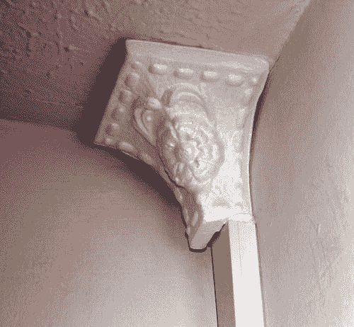
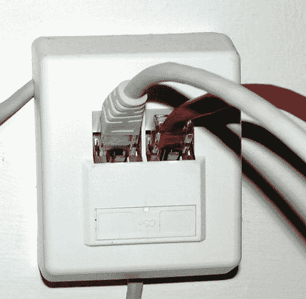
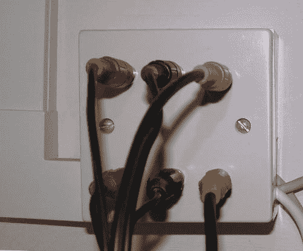

# 4.家就是家:物理实用性

Abstract

经营自己的家是一种很棒的感觉。让它在您自己的 Linux 服务器上运行就更好了。仅仅是能够告诉人们你的主页就是你的主页，就能让你的极客证书更上一层楼。但是让一台机器 24/7 全天候运行会带来来自风扇和硬盘驱动器的永久噪音、闪烁的灯和额外的热量。能够从一台机器控制另一台机器需要布线。在这一章中，我将讲述家庭自动化设置的一些基础知识。

经营自己的家是一种很棒的感觉。让它在您自己的 Linux 服务器上运行就更好了。仅仅是能够告诉人们你的主页就是你的主页，就能让你的极客证书更上一层楼。但是让一台机器 24/7 全天候运行会带来来自风扇和硬盘驱动器的永久噪音、闪烁的灯和额外的热量。能够从一台机器控制另一台机器需要布线。在这一章中，我将讲述家庭自动化设置的一些基础知识。

## 节点 0

节点 0 是房子中所有电缆的终点，或者说是“本垒打”这意味着 Cat5 以太网、AV 电缆、IR 继电器，甚至 X10 无线收发器都可能位于同一个位置。也是外界的入口，所以调制解调器和路由器也会住在这里。

### 功能和目的

使用单一节点 0 的想法是让一切都远离日常生活。这意味着，无论服务器有多大、多吵，都可以将其放置在对试图睡觉或学习的人影响最小的地方。它还允许将大量电缆和昂贵的硬件放在某个地方，也许用一把钥匙锁起来，以最大限度地减少涉及洒出饮料和年幼儿童的不小心事故。

尽管这引入了单点故障(一般系统管理中的大忌)，但在家中涉及的风险要小得多，并且不会影响已经存在的单点故障，即进出房屋的唯一调制解调器电缆。

服务器本身还提供所有与房屋相关的数据和信息的中央存储库，包括主网站和电子邮件服务，以及可能存在于其他机器上的各种媒体存储库的抽象。通过这种方式，每个非技术人员都可以连接到`//server/media`,并透明地连接到任何硬盘(在任何机器上)。这样就可以在磁盘变满时进行升级和移动，而无需您的家人打来支持电话！

拥有一台主服务器通常要求它保持全天候开启。将任务集中到一个位置，并将所有服务统一到一台机器上，这意味着只有 Node0 机器需要断电保护(通过 UPS)或防盗保护(通过强锁)。事实上，风险最大的数据通常在独立的笔记本电脑上，所以我稍后也会介绍它们的备份计划。

### 确定最佳房间

即使是最简陋的住所也有几个适合作为节点 0 的位置。大多数人选择楼梯下的壁橱(因为它在中央，因此需要较少的布线)，但不止于此！事实上，在阅读下一部分时，当每个问题或解决方案出现时，您应该在心里将服务器从一个房间移到另一个房间。此外，在某些情况下，实际上不可能找到一个房间来解决所有特定问题，在这种情况下，您可能必须放弃令人不快的功能或在单独的位置使用第二台服务器。

#### 合法的考虑

法律因国家而异，并随着时间的推移而变化，因此在开始工作之前听取必要的建议并获得任何许可是很重要的。实际上，这只会影响极少数人，比如那些在自己的土地上建造新建筑(如阳光房)或改造已获得“评级”或“上市”资格的建筑的人。

#### 必要的考虑

本节中的必要考虑涵盖了特定硬件及其互连的限制。因为主服务器需要完全不受限制地访问您的所有设备，所以这些考虑是最重要的。

X10 信号可能会消散，并被放置在房子周围的各种设备完全吞噬，如第 1 章中提到的[。将 Computer-X10 网关(CM11)移动到另一个插座会大大改变其覆盖范围，因此需要进行大量测试。唉，也许不可能把这种装置放在任何一个地方，让信息在房子里双向传递。这将随后需要两台服务器或两台网关。](http://dx.doi.org/978-1-4302-5888-9_1)

电力以太网(EoP 不要与以太网供电混淆)是使用现有电力线增加双向网络功能的一种方式，与 X10 引入电器控制的方式相同。像 X10 一样，它也受电力线上其他设备的支配，所以如果你家里的部分地方无法接入 WiFi，这种方法也应该进行测试。

宽带和电缆调制解调器通常只能在一些预先确定的点进入室内，从而限制了可用的房间。然而，除非你的 Linux 机器是你家其他地方的网关，否则很少需要把你的服务器本地连接到调制解调器。在大多数情况下，一个好的路由器可以有效地隔离内部和外部网络流量，并具有足够的控制能力，从而不必使用成熟的 PC。

WiFi 信号和 X10 一样，会消散。此外，由于所使用的频带是许多其他协议所共有的，这可能会导致连接质量显著下降或完全消失。这些设备包括一些无线接入点(如英国的 BT Homehub)、无线电话、电视发送器和微波炉。此外，因为它们通过空气传播，它们更容易受到你控制之外的外部影响，比如邻居。您可以通过执行以下操作来限制这些其他设备的影响:

*   切换 WiFi 频道。根据国家的不同，WiFi 被分为 14 个(日本)或 13 个(其他地方)不同的频段，每个频道占用其中的 4 或 5 个频段。这将频道置于频道 1、6 和 11(美国)的中点，而在大多数其他地方则置于频道 1、5、9 和 13 的中点。
*   添加更多的 WiFi 基站，以最大限度地缩短每个信号传输所需的距离。设置时，将所有单元设置为相同的 SSID，并连接到有线以太网的相同部分。
*   切换到违规设备的有线版本。要确定违规设备，只需按顺序关闭它们，和/或在每个方向指向一个频谱分析仪，以确定传输源。
*   干扰违规设备的信号(特别是如果它来自其他人)。
*   使用定向发射器。

当使用 AV 分配引入全屋音频时，从主服务器为扬声器或放大器供电的电缆会影响服务器的位置，因为每米电缆都会增加外部噪声影响音频质量的机会。此外，由于这是一个模拟信号，如果它必须传播更远，它的功率会变得更小。高质量的电缆可以最大限度地减少这种情况。

Cat5 电缆是在整个房子中实现快速以太网的最佳方法，因为它不受 WiFi 或 EoP 等外部因素的影响。但是，您需要确保您可以从 Node0 位置有效地到达房子的大部分地方。必须考虑混凝土和结构墙，因为电缆可能无法穿过它们。您还希望服务器和客户端之间的网络交换机尽可能少，因此阁楼可能不是最佳解决方案，尤其是如果您计划将大量视频传输到楼下的电视室。

电力是系统中不可或缺的一部分，因此任何房间都必须有足够的电力(并连接到合适的保险丝)，以允许台式电脑、笔记本电脑、电灯和电视消耗数百瓦的电力。对于老房子来说，这更是一个问题。

#### 消极效果

电脑，即使是基于 Linux 的电脑，也不能对一切免疫，有些房间自然比其他房间对电子设备更不友好。

厨房、温室、地窖和杂物间比其他地方更容易受潮。湿气会对机器造成不可估量的损害。)它进入电脑机箱并与电子设备发生反应。应该注意的是，虽然湿度对机器本身来说不是一个特别的问题，但它会使它变得很粘，导致它成为灰尘颗粒的磁铁，这些灰尘颗粒反过来会堵塞 PC 的一个风扇(大多数台式机通常有三个风扇:CPU、PSU 和显卡)。灰尘还会沉积在电路板之间的各种间隙中，如 PCI/AGP 卡，使它们无法工作。

此外，灰尘会携带水分，与水蒸气中存在的水分结合，会导致各种部件生锈和退化，从而导致短路和一般损坏。45%到 60%的相对湿度通常被认为是一个合适的范围，可以用湿度计测量。

Note

当温度突然变化时，也会出现湿度问题，例如当机器从寒冷的地方搬来时。在这种情况下，让它自然达到室温后再打开。

温度对电脑的影响和湿气一样严重，但方式不同。虽然大多数机器可以在低温下生存(当然比大多数人类乐于生活的温度还要冷！)，他们不喜欢炎热的温度——在场的风扇数量将证明这一点——如果板载温度传感器超过限制，计算机通常会自动关闭。这通常可以消除杂物间，有时阁楼或阁楼，作为一个合适的位置。

因为电脑中唯一的活动部件(除了风扇)是硬盘，所以有必要考虑它们的工作温度。这可能因驱动器而异，但大约在 5 到 55 摄氏度的范围内。

#### 人的考虑

计算机正在进入你的生活空间，而不是相反，所以一旦你知道你选择的位置的物理限制，你就可以考虑生活在那里的机器对生活方式的影响。电脑行为的反社会因素包括噪音、光线和热量。

标准台式电脑的噪音来自各种风扇以及硬盘的咔哒声和呼呼声。虽然风扇产生持续的嗡嗡声，很快就消失在你家周围的背景噪音中，但磁盘偶尔会发出噪音，可能会更烦人。如果你习惯了和电脑睡在同一个房间，那么你会发现风扇经常成为一个舒适的床伴，没有它的陪伴你很难入睡。

硬盘发出的噪音虽然轻微，但却有着有趣的双重属性。虽然你(或你的伴侣)可能会被房子里某个地方的硬盘发出的噪音干扰，但如果你突然听到(通常)安静的硬盘在半夜突然着火，它可以提供一个非常好的声音警报系统。

正如您稍后在查看服务器类型时将看到的那样，一些机器是无风扇的(从而消除了大部分噪音)，一些机器可以通过固态设备而不是硬盘工作(消除了所有噪音)。自然，Node0 的定位和/或隔音可能会使噪音的概念变得没有实际意义(静音？)点！

大多数电脑上的灯是最简单的输出接口。标准的前面板包含用于电源和硬盘活动的灯，而背面具有用于网络活动的等效灯，以及主板上通过后部冷却孔发光的其他可见光源。外置硬盘、调制解调器和路由器上也有类似的指示灯。以前的灯给 Node0 一种独特的网络酷的光芒(通常是因为现在更多的技术采用蓝色 led！)，而后者产生令人讨厌的闪烁，在夜深人静时，在隔壁房间也能看到。虽然所有这些灯都可以用黑色胶带隐藏起来，但通常最好将这些设备藏在盒子、橱柜或抽屉中，以便在需要时可以查看诊断灯。

除了受到热量的影响，计算机(尤其是台式计算机)也会产生热量。一周 7 天 24 小时开一次空调可以让室温提高 1 到 2 度。因此，你将不得不考虑其他的家庭取暖设备，并考虑将节点 0 放在你房子的底层，让热量上升 [1](#Fn1) 是否能为你的账单提供合理的节省。这种多余热量的负面影响是，如果在一个每秒钟都在升温的封闭空间中，在 Node0 中的机器上工作可能会非常不舒服。因此，在这里只安装低能灯或荧光灯，以防止它在你工作时进一步升温。

#### 确定最佳房间

鉴于前面的可能性，大多数人会考虑以下房间之一:

*   客厅:由于靠近电视和主立体声系统，客厅为 HA 安装的所有媒体元素提供了良好的通道。这消除了对红外发射器和大量额外电缆的需要。如果您计划使用实体 DVD，它很容易访问，如果服务器直接连接到电视和立体声系统，您可以获得最高质量的 AV。然而，不利的一面是，将您的服务器放在这里会干扰家庭生活(尤其是当您调整物理连接器时)，并且您不能使用任何需要风扇的服务器，因为噪音通常会掩盖电影和电视剧中较安静的音乐和对话。
*   卧室:这是你每天呆的第一个也是最后一个地方，所以把机器放在手边，显示新闻、视频、电子邮件等等，可能是非常理想的，尽管有时会有点令人不安。它也有客厅的许多好处，因为(主)卧室通常是家中第二重要的电视。因此，除了那些与夜间随机闪烁的灯光和增加的热量相关的问题之外，它还会遭受同样的噪音问题。 [2](#Fn2)
*   楼梯下:这是很好的隐藏视线和封闭，这意味着大多数噪音和光污染是隐藏的，因此可以接受。它也是房子的中心，这意味着有线协议(Cat5、X10、音频等)的电缆更短，无线协议受到干扰的可能性更小。然而，在大多数情况下，在不明显的情况下，很难看出如何以及在哪里将电缆(尤其是电源)进出楼梯下的橱柜。此外，它通常是一个非常小的空间，这使得它容易温度上升，并且很难在其中工作——对于机器和进行节点 0 维护时的您来说都是如此。
*   阁楼:这是一个很好的、隐蔽的、安全的地方，不太可能被盗。将线缆引入上层的所有房间也非常容易。(但反过来，对于一楼的房间来说就不那么容易了，除非你决定在一楼的天花板上铺设一条大型线槽。)如前所述，为阁楼提供适量的电力可能很棘手，温度控制也是如此。

### 构建机架

家庭自动化机架中的设备种类繁多，因此通常不具备适合机架的正确外形(披萨盒大小的单元)。尽管您可能不会使用传统意义上的机架，但您应该为您的设备考虑某种堆叠机制。毕竟，您应该能够单独访问每一个套件，因为您不会想要拔下并滑出路由器、调制解调器和交换机，只是为了将一些新玩具插入 PC 背面的 USB 插座中！

Note

您可以通过不使用技术填充整个 Node0 空间来确保良好的访问。这也确保了在你获得新装备时有足够的空间来放置它们。

如果你有机会去附近的厨房 DIY 商店，你有时会发现抽屉和橱柜可以在门打开时旋转 90 度，这可以被挪用为一个很好的机架安装。或者，如果 Node0 房间和下一个房间之间有一堵隔墙，您可以在这两个房间之间安装一个出入舱口(类似于厨房服务舱口)。对于戏剧读者来说，你可以用一个秘密铰链把它藏在一幅画后面！

节点 0 机架中常见的设备可能包括:

*   调制解调器
*   路由器
*   无线路由器
*   家庭报警系统
*   iphone 交换
*   网络交换机
*   主服务器 PC 或 Raspberry Pi(低功耗 24/7)
*   媒体服务器 PC(装有电视采集卡)
*   显示器、键盘和鼠标(通过 KVM 交换机连接到服务器)
*   外置硬盘(比内置硬盘更容易更换/升级，不太可能发生磁头崩溃)
*   音频功率放大器
*   电视天线放大器

它通过 Cat5 以太网电缆、电力线通信、WiFi 和 AV 电缆的组合连接到房屋的其他部分，其中数据由以下设备拾取:

*   媒体播放头盒
*   附加扬声器
*   辅助音频放大器
*   个人笔记本电脑和台式电脑
*   辅助电视，使用天线输入

## 服务器

要成为一个真正有效的智能自动化家庭，你需要一台全天候的服务器。虽然你见过的许多设备(如第一章第一章中的 CM11U)可以被编程为离线工作，但只有当有东西准备好、愿意并且能够在白天或晚上的任何时间做出决定时，你才会感受到权力。定时灯开关不算。

在家庭环境中有如此多的酷和有趣的技术，很容易让想法脱离自己，让你开始订购你负担不起的最大和最强大的服务器！实际上，如果总费用只有一台服务器，就没有必要只有一台服务器。

### 服务器容量

服务器的容量分为三个部分:

*   CPU 处理能力
*   磁盘空间
*   带宽能力

我将按顺序介绍这些。

#### CPU 能力

除了少数例外，家庭自动化软件耗电很少。所有的标准任务，如网络服务器、电子邮件、闹钟、短信处理、信息例行程序和音乐播放几乎不需要任何处理，最低的迷你 ITX 能够处理一切，而不需要一点硅汗。

将媒体从一种格式(如储存在服务器上的高清晰度 DVD rip)转码为另一种格式(适用于低端硬件(如 MVP)或在便携式设备上回放的较小版本)会大大增加处理器的负担。因此，拥有两个主服务器并不罕见，每个主服务器都专用于这两个主要任务。

#### 磁盘空间

同样，大多数 HA 任务不需要大量的硬盘空间，所以如果您的操作系统合适的话(最近它们的大小接近 1 GB)，那么控制软件所需的额外 25 MB 不会倾家荡产。只有媒体服务器需要额外的空间，为此，您需要尽可能多的空间。外置 USB 驱动器是一种廉价(方便)增加磁盘空间的好方法，而且它们足够快，可以将电影传输到服务器，然后通过网络传输。

你可以考虑一个单独的文件服务器，它唯一的工作就是为房子的其他部分提供文件。通过这种方式，它可以存储在物理上安全的位置(隐藏在看不见的地方，可能在阁楼或阁楼)，以防止珍贵的数据被意外破坏或窃取。将服务器固定在坚固的机架中也有助于防止被盗，因为没有人可以轻易拿走 Backblaze Pod ( [`http://blog.backblaze.com/2009/09/01/petabytes-on-a-budget-how-to-build-cheap-cloud-storage/`](http://blog.backblaze.com/2009/09/01/petabytes-on-a-budget-how-to-build-cheap-cloud-storage/) )！

#### 带宽能力

这通常是毫无疑问的，因为目前的网卡都支持至少 100 Mbs(大多数都支持 1000 Mbps，毫不费力)，这足以在家里分发几个电影流。调制解调器速度通常会限制您的外部流能力，但许多其他因素也会限制您的能力，例如您所在区域的宽带争用、当前的网络流量以及目标计算机及其局域网。

与公司服务器不同，大多数家庭服务器只需要一个网络端口就足够了，因为一个像样的独立路由器可以执行大多数必要的过滤和配置任务，这些任务通常需要两个以太网插槽。但是，将来对您的机器进行任何升级(例如将防火墙软件移到服务器上)或家庭变化(为孩子引入单独的受限内部网)都需要第二个端口。

还要注意，购买集线器而不是网络交换机不再有任何成本优势，因此交换机应该是唯一的选择，因为它允许网络上的每个端口、每台机器都有 100 Mb 的带宽。您应该将所有网络电缆布线回位于 Node0 服务器旁边的单个交换机，以最大限度地减少维护。在一个标准的三居室或四居室的房子里，这种交换机应该至少有 16 个端口。

### 服务器扩展性

在企业界，改善服务器的设施通常意味着更多的内存或更多的磁盘空间。对我们来说，它还包括新的硬件。虽然不是所有的 HA 应用程序或服务器都需要新的硬件，但是最好考虑一下服务器还能处理什么。

电视卡是显而易见的，因为一个高性能的服务器可以同时录制几个电视台的节目，或者将一个频道转换成适合流媒体播放的格式。PromiseTV ( [`www.promise.tv`](http://www.promise.tv/) )等项目将这一点发挥到了极致，但这是一个可行的选择。

同样，额外的声卡可以提供额外的功能。虽然在 Linux 中的设置可能有点痛苦，但有两个声卡可以让你直接控制其他房间的音频。这可以消除本地控制面板的必要性，因为您可以使用任何连接到计算机的设备，如网络浏览器、电话或通过 Cosmic 连接的 HR10U。此外，记住每个声卡都有输入和输出。这允许你为房子里的每个房间建立一个大规模的婴儿监视器。如果你有一个语音识别系统(在第 5 章中有所介绍)，那么你就可以在每个房间进行即时控制。过去曾有项目将支持 6.1 的声卡引入三个独立的立体声声卡，但最近它们并没有得到很好的维护。

### 服务器的类型

很自然，根据这本书的标题，服务器将运行 Linux。Linux 能够在几乎任何设备上运行并非偶然，因此这不再是硬件兼容性的问题，而是物理大小、功耗和 CPU 能力之间的折衷问题。硬件没有什么特别的。现成的机器很好。您将熟悉这里列出的大多数(如果不是全部)设备。我们需要考虑它们在 HA 领域的具体相对优势。在大多数情况下，服务器总是连接有鼠标、键盘和显示器(不像商务中心中的那些),以允许更简单的软件维护，并且如果服务器位于可访问的地方，显示器可以显示网页，呈现当前的“房屋报告状态”,几乎实现零处理周期。当这些外围设备不是永久连接时，您可能需要调整 BIOS 以允许机器在没有它们的情况下启动。对于台式机来说尤其如此，当没有显示器时，它们会发出三声哔哔声，并经常发出臭名昭著的“没有连接键盘-按 F1 继续”错误。

#### 机架固定件

这些产品有多种型号，包括配备冗余或双电源以及标准四核处理器的产品。因此，这些强大的处理能力可以同时处理几个用户的代码转换需求，并有足够的周期来处理所有其他服务(web、电子邮件等)，而不会影响任何其他用户。它们是商业应用程序的行业标准是有原因的，因为它们可以处理任何负载，任何时间长度，并且可以愉快地运行许多年而没有变化。

不幸的是，只有当你能把它们放在远离生活区的地方，它们才适合家庭使用，因为它们通常有很大的噪音风扇，并散发大量热量。虽然可以通过将机器放在橱柜中来降低噪音，但通常情况下，用低噪音的等效部件替换组件无法达到相同的效果，因为它们通常不是标准的 PC 设计。

热量也是你需要有效处理的东西。空调是办公室的标准配置，但在家里却不是，在家里通常打开窗户就能达到同样的效果。在家里运行机架式服务器通常至少需要某种排风扇。

当考虑其升级状态时，非 PC-ness 也将击中要害。您将无法将 PCI TV 卡安装到许多机架式机器上，因为连接形式和尺寸会受到限制。您还需要购买一个物理机架或半机架来安装设备。这些都是为商业安装而设计和定价的，尽管你总是需要为前面提到的所有设备安装一些支架，但有更便宜的 DIY 搁架方式。

#### 桌上型电脑

这是最受欢迎的选择，因为所有显而易见的原因:它们是可以理解的，常见的，便宜的，并且是为家庭使用而建造的。它们也可以通过额外的卡轻松升级，磨损(或噪音过大)部件的替代品可以在当地的实体店买到。目前的机器速度足够快，可以为家里的几个媒体主机执行代码转换，以及处理所有其他标准任务。

遗憾的是，家用机是打算当家用机用的，也就是晚上几个小时查邮件，玩游戏。将它用作服务器，24/7 全天候运行，会使机器的物理组件(主要是风扇和磁盘)紧张，并增加破坏机器完整性的风险。与机架不同，这些机器是根据价格而不是质量因素制造的，因此将使用允许价格达到神奇的 299 数字或其他数字的组件。因此，这些组件可能对温度变化的容忍度较低(如果机器全天工作，就会出现这种情况)，或者平均无故障时间(MTBF)较短。当机器不断访问数据时，无论是从内存还是从硬盘，发生这种情况的几率自然会增加。

我的个人设置使用台式 PC 作为媒体转码服务器，大部分时间都在运行。我买了比传统台式机更高的价格，比标准的风扇更安静，部件更好。我还同时为风扇买了备件，这样如果我需要更换机器的运动部件，我就有一些可用的。RAM 芯片(诚然，随着时间的推移，也可能变坏)通常在机器发布后的许多年内都可用，而特定尺寸的 CPU 风扇则不可用。这是因为任何持续几年的服务器都将比当前设计的处理器和主板寿命长，因此很难获得这些组件的备件。我也承认，当(而不是如果)这些组件最终报废时，我可能无法购买替代品，因此将不得不忍受安装全新机器的痛苦。

#### 迷你 ITX

迷你 ITX 是基于 170×170 毫米 ITX 主板的一系列机器。在该规格中，有许多不同的选项，包括不同的处理器、图形芯片和冷却方法。这包括许多没有风扇的机器，仅依靠散热器进行冷却。这使得它们比台式机更加节能，并且适合放置在更多的公共区域，例如它们经常被用作媒体播放器的客厅。

像台式机一样，ITX 机器有许多可配置的选项，包括电视(S-Video)和 DVI 输出、用于无盘操作的紧凑型闪存(CF)适配器、无线网络等等。它们还有用于其他卡的标准 PCI 端口。这种可配置性既是他们的桎梏，也是恶魔的魅力，因为当你购买机器时，并不一定知道任何特定设备的可使用性。尽管任何 ITX 都足够强大，可以运行 HA 设置的所有基本服务，但大多数机器都不能足够快地转码媒体，并且旧的机器不能播放现代格式(如 DivX，它对 CPU 的要求相当高)。此外，除了 SVGA 之外，Linux 驱动程序支持的输出也有一些问题，这使得将它们用作投影仪之外的任何设备的头箱都有问题。ITX 的新组合会定期发布，同时还会更新驱动程序，因此请随时向您的经销商寻求支持，以及最新的网络论坛。

ITX 机器的另一个配置考虑是这样的，因为它不是机器附带的，你必须单独购买。此外，由于空间是如此珍贵，你应该购买任何和所有的外围设备，你打算保持在这个时候的情况下。您不应该期望能够更新或添加组件，并且仍然让它适合同一个案例。即使组件之间有 3 毫米的间隙，也可能是一个良好的工作系统和一个过热的系统之间的差异。所以，考虑一下你是想要一个硬盘还是 CF 卡，以及一开始是否需要一个(超薄的)DVD 播放器。

Note

请始终从机器的同一经销商处购买机箱，这样您就可以确保它们能够装配在一起。这些机箱比台式机机箱贵得多，因此是一个代价高昂的错误。

当然，有这么多的箱子可供选择，你完全有机会得到你想要的尺寸。它们有四种基本类型，大多数高可用性服务器是立方体或机架，而媒体设备中使用的 ITX 主板通常选择 book。

*   Book，70 × 270 × 320mm 左右，最多两个驱动器托架；并非所有都支持 PCI 卡
*   立方体，大约 180×220×280 毫米，最多有四个驱动器托架，通常有一个 PCI 卡
*   机架，1U (482.6 × 44.45 × 381)，最多四个驱动器托架和最多两个 PCI 卡
*   车辆，大小在 210×254×56 毫米左右，有一个或两个驱动器托架，偶尔有一个 PCI 卡

车辆安装箱用于安装在诸如汽车或车库的恶劣环境中，在那里它可以用作儿童娱乐中心或网络终端。所有四种型号都有不同的尺寸，驱动器托架有 2.5 英寸和 3.5 英寸两种。应该注意，不是所有 ITX 外壳都与所有类型的主板兼容。在 ITX 世界，一种尺寸肯定不能适合所有人。所以，检查和再检查你的规格。

ITX 已经生了两个弟弟，一个是配有 100×72 毫米主板的微型 ITX，另一个是配有 120×120 毫米主板的纳米 ITX。虽然如果你仍然必须购买一个更大的外壳来安装 DVD 驱动器，那么尺寸的减小不值得价格的增加，但这种尺寸的机器几乎可以藏在任何地方，这使得它非常适合媒体主机或厨房中的控制面板。

#### 迷你电脑

迷你电脑是一种高功率、预构建的电脑，外形非常小(通常约为 80×50×30 毫米)，通常功耗也很低。这导致它们有时被称为绿色 PC，但尽管迷你 PC 通常具有低功耗，绿色 PC 必须具有低功耗，其制造过程也是如此。这种类型的典型机器包括 Zonbu、Intense PC 和 Fit-PC3。

在功能上，它们是笔记本电脑(因为它们是预建的，因此不能升级，并且操作系统确实需要预装以确保一套完整的驱动程序)、台式机(具有高机器规格和单个网络端口)和迷你 ITX 机(当放在电视下时，作为主机使用时看起来很好)的混合体。因此，许多人将把它们作为更加以客户为中心的机器，用于网页浏览和媒体播放。但是，正如我前面提到的，大多数 HA 任务所需的 CPU 非常少，非常适合它。在建筑物本身不允许 Node0 中的单台机器到达整个房子的情况下，它们也是很好的辅助服务器，例如 X10 消息和无线通信。此外，因为这些设备的功率使用通常为 10 瓦或更少，所以它们是高效的，并且对现有设置增加非常少的开销。

这些机器的规格大相径庭，因为许多都包括定制的硬件来改善表面上的功能。例如，Fit-PC2 只包含一个低功耗的 Atom 处理器，但能够通过集成硬件加速来播放 HD 1080p H.264 视频。 [3](#Fn3)

然而，这些机器最大的缺点是在向朋友演示您的 HA 设置时缺乏勇气。在展示了如何给你的电灯开关发电子邮件、给你的视频发短信、拥有自己的家庭网络服务器之后，打开橱柜展示一个可以放在你手里的小盒子通常会让男性自我失望！

#### 定制嵌入式

这一组既有片上系统(SoC)机器，也有单板计算机(SBC)，其中有很多，包括你之前看到的迷你 ITX 机器和第二章中的 NSLU2。设备的组合和机器的用途一样多，所以每种组合都需要根据其自身的优点来考虑，因为人们通常认为是 PC 标准的各种组件，如键盘、鼠标和显示器，并不是所有的 SBC 都有，如 Gumstick。 [4](#Fn4)

此外，一些机器，如 NSLU2，看似正常的外围设备，如 USB 集线器，可能会出现问题，并拒绝使用它们。因此，这些类型的设备通常更适合室内有限区域的客户机，而不是服务器，因为服务器将运行各种软件，硬件不兼容的烦恼通常会超过尺寸的好处。

#### 树莓皮

尽管 Raspberry Pi 在概念上与您可能从上一节中发现的任何定制嵌入式设备没有什么不同，但它并不完全相同。首先，Pi 的知名度和市场接受度确保了其他平台无法管理的坚实用户基础。现在已经在市场上达到临界质量，这意味着你可能发现的任何问题都将由不止一个人来解决，并且将有(至少)一个网页或论坛线程专门用于解决问题。

如此大规模的用户也意味着使用 Pi 作为服务器的主要物理问题已经解决了——就是这样！这是可能的购买几种不同类型和风格的情况下从不同的网站在互联网上。这包括在 [`http://elinux.org/RPi_Cases`](http://elinux.org/RPi_Cases) 的列表，也详细列出了一些你可以用乐高、木头和 3D 打印机建造的东西。

### 功率消耗

对于许多人来说，家庭自动化可能是你第一次需要考虑机器的总拥有成本(TCO ),将它的功耗考虑在内。这可以通过使用一个用电量监控器来进行经验计算，比如 Kill-A-Watt ( [`www.p3international.com/products/special/P4400/P4400-CE.html`](http://www.p3international.com/products/special/P4400/P4400-CE.html) )。这种设备可以一端插入墙上，另一端插入电脑，以确定它在任何特定时间使用的电量。这将取决于它是否处于以下状态:

*   闲置的
*   播放光学媒体
*   处理媒体(回放、录制和转码都不同)
*   被用作台式机

了解这些信息可以帮助您计算其运行成本，方法是将显示的瓦特数乘以 8.76(一年中的小时数除以 1，000)，得出千瓦时数。然后乘以每千瓦时的成本(通常显示在您的电费账单上)，得出总拥有成本。

Note

你甚至可以通过一个简单的名为 Tweet-a-Watt 的软件，从 [`www.ladyada.net/make/tweetawatt`](http://www.ladyada.net/make/tweetawatt) 发布你家的电力使用情况。也有替代解决方案，如 Owl、AlertMe、Wattson 和 Enistic。

除非服务器制造商向您提供完整的功耗数据(请记住，这因任务而异)，否则您只能猜测其 TCO。表 [4-1](#Tab1) 显示了一些大概的数字。它们是从各种经验测试中挑选出来的，尽管只有它们的相对值应该被考虑，并且只有在那时才作为指导。

表 4-1。

Approximate Power Consumption

<colgroup><col> <col></colgroup> 
| 设备 | 使用的大致瓦特数 |
| --- | --- |
| 台式机器 | 60–250 |
| 台式计算机(睡眠) | 1–5 |
| 笔记本电脑 | 15–50 |
| 迷你电脑 | 6–10 |
| 迷你 ITX[5T3】](#Fn5) | 8–20 |
| 树莓派(B 型) | One point six five |
| 树莓派(A 型) | Zero point seven one five |
| 带 HDMI 和 USB 驱动器的 RPi (B) | 2.0–2.45 |
| 带 HDMI 和 WiFi 的 RPi (B) | 2.175–2.4 |
| 阴极射线管监视器 | Eighty |
| 液晶监视器 | Thirty-five |
| DVD/CD-ROM(台式机) | Twenty |
| DVD/CD-ROM(笔记本电脑) | five |
| 硬盘(桌面) | Fourteen |
| 硬盘(笔记本电脑) | four |
| USB 供电设备 | 2 个(每个) |

要计算每台设备的成本，您需要知道您的公用事业公司向您收取的每千瓦时的成本，并将其代入公式:

`Total_cost = (Wattage_of_device × hours_used × kilowatt_hour_charge) ÷ 1000`

为了降低消费成本，您可以为电脑和其他连接到电脑的家庭硬件做几件小事。

首先，关掉它。这主要适用于显示器和电视等消费电子产品，它们在待机模式下的功耗几乎与正常模式下一样高，有时据说你每年 16%的能源账单都花在待机模式下的电器上。市场上的各种产品通过监控用电量的下降或通过捕捉红外信号来关闭电视并因此隔离设备的所有电源来检测待机模式。然而，在这种模式下，不可能自动将其重新打开。您可以使用 X10 或 C-Bus 自动管理这一点。请记住，重新打开设备时，如果设备返回待机模式，而不是完全打开，您可能还需要发送红外信号。

第二，停止硬盘旋转。这将它们的功耗从 7W 降低到 1W 左右，具体取决于设备。您可以通过如下配置使用`hdparm`工具来实现这一点:

`# /etc/hdparm.conf`

`/dev/sda {`

`spindown_time = 60 # this means 5 minutes, since each spindown unit is 5 seconds`

`}`

Note

据报道，这只有在 BIOS 支持 AHCI 时才有效。在所有其他情况下，应使用`sg3-utils`包控制 SATA 驱动器。

然而，从寿命的角度来看，硬盘不应该不停地旋转，因为滚珠轴承会磨损更多，最终会磨损。此外，让它们重新旋转起来的成本非常高，所以你真的需要让它们旋转 20 分钟左右，这样节省的成本才是值得的。

切换到待机、挂起到 RAM 或休眠到磁盘模式，每种模式都比前一种模式更省电。高级电源管理(APM)守护程序和工具处理进程本身，而`sleepd`守护程序可用于在特定条件下自动触发 APM 工具，例如缺少活动或输入。

使用替代部件。随着绿色游说团体影响大多数公司，你可以买到比以往任何时候都更节能的设备。更好的电源 [6](#Fn6) 可以在中等负载(90W)下提供超过 80%的效率，一般来说，功能较弱的显卡耗电较少(通常不需要风扇)，LCD 显示器比 CRT 显示器更高效，CPU 的功耗差异很大，因此可以考虑更换它们。

拔下任何未使用的设备，例如安装时使用过一次(但不会再次使用)的光驱、USB 设备等。这可以通过在整个系统中使用外部硬盘来扩展(引导设备除外)，在卸载后可以通过 X10 断电。

尽可能使用更多固态硬盘和/或笔记本电脑硬件。两者都打算用电池工作，因此内部有更合适的 CPU 和硬件。对于主控制服务器，这些已经足够了。

使用虚拟机(例如，运行在 VMware 上)而不是使用完全独立的机器。当特定设备需要特定版本或操作系统时，这可以提供真正的好处。用于处理虚拟机的额外功率远远低于物理机。

在尽可能多的情况下，都应该考虑减少负载，因为虽然你可能只节省了一瓦特，但一年下来，这可以累积起来，达到合理的节省。

### 服务器协调

有多台服务器来控制你的房子没问题。但是，如果它们一直都开着，你的电费将会与所获得的收益不成比例地增加。这还没有考虑各种机器因为主服务器离线而无法通信的情况。

协调如何打开和关闭特定的机器以节省电力是一个简单的问题....对于一个人类来说。但是对于一台机器来说，要实现自动化是非常困难的！您需要知道哪些服务在哪些机器上运行，在其他硬件上存在哪些依赖关系，等等。这些信息需要在所有机器之间同步，以防其中一台离线(因为断电或网络连接中断)。

因此，最好不要尝试或执行以下操作之一:

*   每台机器都有人工指定的时间周期
*   预计电费会比平时多

例如，当运行一个单独的媒体服务器将流代码转换到 MVPMC 时，您会知道机器需要从每个工作日的下午 6 点开始工作，例如整个周末。如果机器还负责录制电视节目，您将需要编写自定义代码来防止它在录制过程中关闭。

相反的时间表对一台打算作为下载服务器的机器来说是正确的，当你只希望它在你不太可能上网或在家工作的早晨几个小时里消耗你的带宽。

虽然机器有可能自我终止(通过 Linux 命令`shutdown -h now`)，但是你一般不能强迫它在特定的时间醒来。因此，您将始终需要一台 24/7 全天候工作的机器(如您拥有的最低功耗设备)来协调所有其他机器。

让机器自动开机需要一种叫做局域网唤醒(WOL)的技术。WOL 在许多机器上是启用的(尽管有时在 BIOS 中默认为关闭),由此主板监视包含直接发送到有问题的机器的“神奇数据包”的特殊格式化的网络消息。由于关机的机器没有 IP 地址，因此必须始终使用 MAC 地址。(它被标记为来自`ifconfig`命令的`HWaddr`。)

启动这个魔术的命令和程序包如下:

`etherwake 00:1d:33:a5:63:16`

请注意，这仅在“软”断电时有效，并且需要它以及发送机器和目标之间的任何路由器可用的电源。这是停电时要记住的重要一点！此外，请注意，Raspberry Pi 没有软掉电选项，它没有开/关开关，所以它要么开，要么关。然而，它的电流消耗很低，不值得担心。

Note

有时，接受 WOL 命令需要密码。这在特定机器的 BIOS 中设置，并作为参数传递给`etherwake`。

关闭特定的机器更容易，因为这是大多数桌面用户每天都要做的事情，所以我在这里只花一点时间。在传统的调用中，您可以用一个命令启动关机，从发出命令到使用您选择的任何控制台警告消息执行操作有一个给定的延迟。您也可以用`-c`标志取消任何未执行的关机命令。

所有关机命令必须由机器的 root 用户执行，因为默认情况下 root 用户不允许通过`ssh`连接到机器，所以如何关闭远程机器并不总是显而易见的。

标准方法是使用`sudo`，让一个非特权用户连接到机器，然后将他们自己临时升级到 root，用以下命令关闭机器:

`sudo shutdown -h now`

虽然`sudo`通常需要一个密码，但可以通过修改`/etc/sudoers`文件来取消，如下所示:

`steev localhost=NOPASSWD: /sbin/shutdown`

这可以通过从一个脚本发出命令来进一步自动化，该脚本依赖于`ssh`的一个很少使用的特性，即登录、执行命令然后退出的能力:

`ssh steev@myhomemachine.homelinux.net 'sudo shutdown -h now'`

因为 shutdown 命令是在所有用户都在控制台上工作时创建的，所以大多数家庭用户通常看不到警报消息，所以您可能希望创建一个 shutdown 脚本，使用语音合成或音乐来指示服务器正在关闭。然而，由于在 Linux 中重启和关机很少发生，而且您可能就在“用户”的隔壁，所以这就不那么重要了。

关闭网络上的任何 Windows 机器可能会更加困难，因为关闭的方法还不太明确。如下所示的命令:

`net rpc shutdown -I 192.168.1.100 -U windows_username%their_password`

可以在许多情况下工作，但依赖于防火墙、文件共享选项，甚至 Windows 版本。

给定这些命令来启动和关闭您家中的大多数机器，您可以在您的主服务器上使用一个简单的 crontab 来有效地协调它们，以确保最佳的用电场景来满足您的需求。

### 不间断电源

不间断电源(UPS)对于任何依赖中高成本技术的人来说都是必不可少的工具。因为您的房子现在是高成本技术的高成本外围设备，所以它成为您的高可用性设置的重要组成部分，不仅可以消除短期断电和停电的影响，还可以防止电涌造成的损害。

大多数不间断电源装置的工作原理相同；也就是说，一个看起来像超大的多联电源板的设备将电源和电池连接在一起，为四个或更多的插座提供稳定的电源。在更便宜和最常见的设备中，该设备监控主电源，如果它出现故障或低于指定阈值，则切换到电池。第二种类型的 UPS 始终提供来自电池的输出，并使用主电源为电池充电。输出波形的形状也各不相同，通常由设备成本决定。廉价设备的输出通常是方波，而昂贵设备的输出是正弦波。这对于电脑来说没什么大不了的，但是当给一个音乐发烧友的唱机提供动力时，就像在第三章中提到的那样。每当注意到电源下降时，警报就会响起，并周期性地重复声音警告。当电池电量极低时，将通过 USB(或串行)电缆启动关机程序，以便连接到 UPS 的机器可以安全关机。每个单元都有不同的 VAs 值，表明当它从电源上断开时，你可以从中提取多少。你通常需要比瓦数更高的伏安。所需的 VA 是瓦特数除以所连接设备的功率因数。保护的持续时间从几分钟到一刻钟不等，具体取决于连接到它的机器以及这些机器上运行的任务。您可以参考表 [4-1](#Tab1) 获得粗略的指导。对于购买，总是得到尽可能高的额定功率。

Note

对于大多数 UPS 装置，电源插座将被分为断电时供电的插座和断电的插座。所有插座通常都有防浪涌保护。

假设有四个电源插座，你必须决定哪些设备将使用它。自然，你的服务器应该是已知的。接下来是家庭内部路由器或交换机，这样 UPS 上的其他机器就可以发送和处理“关机”消息。(这只是为了计算机的利益，因为任何人都会注意到灯灭了，并且会立即惊慌失措，因为他们知道他们没有点击应用程序上的保存按钮。)您可能还想在 UPS 上保留宽带路由器，以便发送警告信息(例如通过电子邮件)。这通常是一个次要的考虑因素，但是如果您远程操作机器，这将促使您减轻任何处理器繁重的任务，以便 UPS 可以持续更长时间。

Note

首次安装 UPS 时，使用断路器进行测试，但不要拔出插头，因为拔出插头会引入对电子设备有危险的浮动接地。

这里再次出现了关于多服务器的讨论，因为在 UPS 上安装一个低功耗的主服务器是有益的，媒体代码转换机安装在它自己的 UPS 上，可以延长主服务器的寿命，甚至可以完成在断电期间可能会错过的《神秘博士》的重要一集的录制！

如果两台服务器的功率都相当高，而您只有一台 UPS，那么通常值得将两台服务器合并到一个机箱中，以限制设备的功耗。

您也可以考虑为显示器保留一个电源插座，也许连接到第二个媒体服务器 UPS 装置。如果您保持关闭，它将从 UPS 汲取非常少的电力，但在出现问题时，您可以看到机器运行其关闭程序，并且您可以确保其关闭程序有效工作。否则，您将不得不相信 UPS 软件守护程序正在工作，或者在手边准备一台充满电的笔记本电脑。

Tip

每天晚上使用 crontab 打开 X10 模块至少一个小时，可以确保您的笔记本电脑充满电。

一旦硬件 UPS 就位，您就需要一种方法来检测电源是否已断开，并开始关机过程。

大多数 UPS 都带有 USB 电缆(有时一端带有专用连接器，所以不要弄丢了！)允许 PC 查询单元的状态。那些没有的一般不值得买。当然，它们更便宜，并且您的数据可能在您已经安装的日志文件系统中是安全的，但是额外的成本和放心地知道您将获得干净的关机是值得的。

Note

可以通过使用`heyu`监控电源线来模拟 UPS 的关机功能，如果发现两个(或更多)灯同时熄灭，则触发关机。但是这种方法容易产生假阳性，而且在白天也不起作用。

有三种主要包装可用于处理 UPS，如果一起使用，所有这些包装都会发生冲突。他们是`apcupsd`、`nut-hal-drivers`和`nut`。我将讨论后者，因为它是最新的、灵活的、积极开发的。

首先，执行传统安装:

`apt-get install nut`

设置过程包括在您的`/etc/nut`目录中创建四个配置文件:

`# /etc/nut/ups.conf`

`[apc]`

`driver = usbhid-ups`

`port = auto`

这引用了适合您的 UPS 单元的驱动程序， [7](#Fn7) ，我在这里称之为`apc`:

`# /etc/nut/upsd.conf`

`ACL all 0.0.0.0/0`

`ACL localhost 127.0.0.1/32`

`ACCEPT localhost`

`REJECT all`

这表明只有本地机器应该对 UPS 消息作出反应，这消除了黑客假冒 UPS 故障并导致您的机器关机的可能性。然后通过以下操作设置一个可以访问守护程序的基本用户:

`# /etc/nut/upsd.users`

`[local_mon]`

`password = mypasswordhere`

`allowfrom = localhost`

`upsmon master`

然后，您可以通过指定进程命令来配置守护程序:

`# /etc/nut/upsmon.conf`

`MONITOR apc@localhost 1 local_mon mypasswordhere master`

`POWERDOWNFLAG /etc/killpower`

`SHUTDOWNCMD "/sbin/shutdown -h now"`

如果您将从备用机器监控 UPS，您可以设置多个用户，但这不是必需的，因为您可能会创建一个保存此信息的网页。

然后，您可以修改文件的权限(因为其中有一个密码，您可能不希望外界看到):

`sudo chown root:nut /etc/nut/*`

`sudo chmod 640 /etc/nut/*`

并启动守护程序运行，如下所示:

`upsdrvctl start`

`/etc/init.d/nut start`

这可以通过编辑`/etc/default/nut`文件在每次启动时启动。然后，您可以通过发出以下命令来查询给定 UPS 的状态并检查它是否在工作，其中`apc`是前面给出的名称:

`upsc apc`

输出是这样的:

`battery.charge: 100`

`battery.charge.low: 10`

`battery.charge.warning: 50`

`battery.date: not set`

`battery.mfr.date: 2009/01/21`

`battery.runtime: 705`

`battery.runtime.low: 120`

`battery.type: PbAc`

`battery.voltage: 13.5`

`battery.voltage.nominal: 12.0`

`driver.name: usbhid-ups`

`driver.parameter.pollfreq: 30`

`driver.parameter.pollinterval: 2`

`driver.parameter.port: auto`

`driver.version: 2.2.2`

`driver.version.data: APC HID 0.92`

`driver.version.internal: 0.33`

`input.transfer.high: 266`

`input.transfer.low: 180`

`input.voltage: 242.0`

`input.voltage.nominal: 230`

`ups.beeper.status: enabled`

`ups.delay.shutdown: 20`

`ups.delay.start: 30`

`ups.firmware: 829.D2 .I`

`ups.firmware.aux: D2`

`ups.load: 49`

`ups.mfr: APC`

`ups.mfr.date: 2009/01/21`

`ups.model: Back-UPS ES 700`

`ups.productid: 0002`

`ups.serial: 5B0904T46000`

`ups.status: OL`

`ups.timer.reboot: 0`

`ups.timer.shutdown: -1`

`ups.vendorid: 051d`

一台服务器可以控制多个 UPS 装置。这通常是有益的，因为它允许您的主服务器处理所有的系统管理任务，为家庭网络提供了一个单一的入口点，可以根据需要进行强化。

让机器关机后，你需要一种方法让它在电力恢复时再次启动。这变成了一个硬件问题，成功与否取决于 BIOS 中是否有一个通电启动的选项或类似选项。在 NSLU2 的情况下，你可以物理地破解电路板来执行相同的任务。理论上也有可能以类似的方式黑掉标准 PC 中的交换机，但不建议这样做。

前面提到的 WOL 技巧通常不适用于互联网，因为它是一种局域网唤醒功能。即使你的机器不在过滤这种数据包的路由器或调制解调器后面，其他东西通常也会在后面。如果你的家用机器需要尽可能长时间通电，而你的机器在通电时无法启动，那么你可以使用一个 NSLU(如第二章第一节所示)作为引导程序，向你的各种服务器发出 WOL 命令。

### 备份

关于备份，只有两点很重要:

*   做吧。
*   测试他们。

其他一切都只是细节。

第一个细节是，这些数据是应该保存在现场，即家中，还是保存在异地的远程位置，如托管服务器或租用的虚拟机。在一个理想的世界里，你会两者都采用。将它们保存在异地有助于最大限度地减少本地问题造成的损失，而现场备份对于无法存储在其他地方的数据非常有用，例如在出现重大故障时重建 HA 系统所需的配置脚本和网络计划。

下一个细节是什么数据实际上需要备份。同样，在理想情况下，这将包括家中每台机器上的所有内容。实际上，您必须考虑替换数据的成本和执行备份所需的时间。这通常可以归结为您个人创造的任何东西，例如:

*   照片
*   信
*   程序代码
*   艺术品
*   数字视频
*   音乐

每个家庭成员都有自己负责的清单。作为 HA 管理员，您还需要备份服务器配置。

从这里你可以决定执行这项任务所需的技术。程序员将已经知道源代码控制工具，如 Subversion ( [`http://subversion.tigris.org/`](http://subversion.tigris.org/) )或 Git ( [`http://www.git-scm.org`](http://www.git-scm.org/) )，并将提倡使用它们。对于门外汉来说，这些工具不只是保存最新版本的副本；他们保存数据来重新创建你曾经创建过的所有版本的副本，让你及时回到过去，看看你上周写了什么，以及为什么这样做(或不)有效！在很大程度上，对于代码和系统配置来说，这是一个很好的选择，因为作为一名开发人员，您有必要的心态来在每个接合点执行必要的更新-合并-提交循环。然而，通过一些哄骗，大多数家庭成员会变得熟悉它。访问这些文件需要一个 Subversion 客户端，有几个也有 Windows 版本的客户端可供选择(比如 TortoiseSVN 或 SmartSVN ),消除了令人头疼的支持问题。这也使家庭成员能够从家外访问他们的文件，而无需额外的努力或软件。然而，不利的一面是，你必须教育家人，文字处理文档通常以二进制格式存储，因此，如果他们在家里和学校改变同一个文件，几乎不可能合并在一起。对经常更改的大文件(如原始 Adobe Photoshop 图像)使用源代码管理也不是特别有效。

Note

Subversion 将自己的工作文件存储在当前目录中，这意味着它们将被分散在`.svn`文件夹中。这对最终用户来说只是一个轻微的麻烦，但是当它们出现在系统配置文件夹中，比如`/etc`时，可能会引起更大的问题。

要将一组文件从一个目录直接复制到另一个目录，您可以在每天结束时使用`cp`。但是，这样会浪费地复制没有改变的文件，于是`rsync`诞生了。`rsync`是一个非常老的拷贝和备份程序，但仍然是一个受人尊敬的老黄牛。例如，我用下面这行代码备份了我的代码目录:

`rsync -a code steev@remote-backup-host.com:∼/backup/daily`

我用这个恢复它们(为了测试 [8](#Fn8) ):

`rsync -a steev@remote-backup-host.com:∼/backup/daily code`

这里的选项执行递归更新，同时保持所有的符号链接、权限和用户设置，这是最典型的家庭情况。手册页详细介绍了其他可能性。

然而，确实有两个问题。首先，它主要适用于面向 Unix 的平台。Windows 版本是可用的(比如 DeltaCopy 和 Cygwin 版本)，但是它们需要一点时间来设置，并且可能很复杂。

第二个问题是，为了登录到远程站点，需要交互地给出密码。这是一件令人讨厌的事情，它阻止了任何类型的自动备份。对于允许用户在没有密码的情况下连接的远程站点，他们必须首先建立另一种形式的信任——在本例中是公钥交换。要从机器 A 复制到机器 B，B 必须有 A 的公钥的副本。要从机器 B 复制到机器 A，A 必须有 B 的公钥的副本。在我们的例子中，机器 A 在家保存我们的文件，而 B 是一台远程机器进行备份。

因此，我们的家用机器必须为将要进行复制的用户生成一个密钥。

`ssh-keygen -t rsa`

默认情况下可以在`∼/.ssh/id_rsa.pub`中找到。然后将其复制到远程机器(可能使用密码控制的`rsync`)并附加到远程用户将接受的授权密钥列表中:

`cat id_rsa.pub >> ∼/.ssh/authorized_keys`

完成后，您应该能够`rsync`无需密码:

`rsync -a --bwlimit=100 steev@remote-backup-host.com:∼/backup/daily code`

请注意，这将带宽(使用`bwlimit`参数)限制为每秒 100 千字节，以便其他应用程序可以使用互联网，因为`rsync`和`ssh`在合作时相当贪婪。

这里可能存在的一个潜在管理问题是家庭用户被拒绝连接，因为他们连接的地址与密钥中使用的地址不匹配。当主机名简单地类似于`linuxbox1`但在远程机器上显示为 [`netpc-london-isproute-isp.com`](http://netpc-london-isproute-isp.com/) 或类似的无用名称时，就会发生这种情况。相比之下，目标机器通常有一个固定的名称，因为它必须可以从外部世界进行寻址。因为家用机器的名称可能会改变(由于 ISP 的突发奇想)，最简单的解决方案是颠倒这里给出的所有说明！也就是说，使用远程服务器连接到家庭服务器，只为远程服务器生成一个密钥，并反转`rsync`命令的参数，以便远程服务器从家庭机器中提取数据来执行备份。奇怪的是，需要身份验证的是连接的方向，而不是复制过程的方向。

Note

默认情况下，root 用户不能通过`ssh`连接。尽管有可能覆盖它，但不建议这样做，因此创建一个新用户，为他们创建`ssh`键，并使用他们的 crontab 启动每日备份。

虽然这解决了 Linux 和 MacOS 用户的问题，但仍然需要一个针对 Windows 的解决方案。如果你有时间，在 Windows 上准备`rsync`是值得的。或者，您可能希望通过引入手动备份解决方案向家庭灌输最佳实践，该解决方案要求他们做一些事情来备份他们的工作。这是 Subversion 得分较高的一个领域，因为工作流自动鼓励这样做。相反，可以做的是在网络上创建一个可写的 SMB 共享区域，每个人都可以访问，并且他们有责任在每晚睡觉前将他们的文件添加到其中。然后，您可以使用 rsync 远程备份该网络文件夹。有几个用于 Windows 的免费共享软件工具，它们提供了第一步所需的基于拷贝的备份。

当然，我所说的一切都是假设你将数据存储在家中。在大多数情况下，这是正确的，但现在购买远程服务器上的空间比以往任何时候都容易(例如，通过亚马逊的 S3，用虚拟机)，这意味着你永远不需要备份。当然，备份仍在进行中(由服务器提供商的自动化工具和支持人员完成)，但它们对您是透明的。 [9](#Fn9)

在外部存储的情况下，您可能只希望存储相当小的数据，因为从远程服务器上流式传输完整的电影是不可观看的，并且必须等到它下载完毕也同样令人烦恼，并且违背了目的。这些情况在某些情况下是有益的，因为它们意味着家里不会存储任何个人数据。因此，如果窃贼偷走了你的笔记本电脑，你还没有丢失你正在写的小说。

一些人喜欢在公共场合保护他们的私人数据，通过使用像 [Dropbox 这样的服务。com](http://dropbox.com/) 、Flickr、Google Docs、Google Drive(可能通过 Grive 客户端)和 YouTube。除了免费服务之外，情况和以前一样，对数据丢失的担保更少。事实上，谷歌邮件的个人存储空间限制刚刚超过 10GB，这允许你通过将数据作为附件保存在你的邮件帐户中来备份数据！或者通过使用`gmailfs`。

也有可能备份您家中的物理项目，即您的媒体。虽然 CD 和 DVD 的重要性在于包装，但是通过将它们(正如我们在第 3 章中所介绍的)翻录到外部硬盘上，并将驱动器本身存放在存储器中，或者由朋友、家人保管，或者存放在专业的保险箱中，也可以保存内容。你或许可以安排一个配对计划，让有合适技术的朋友来保管你的光盘收藏，作为回报，你可以保管他们的光盘。例如，如果你在网络流量安静的时候，比如在晚上，两个人都向对方发送你的媒体，同样的配对思想也是有效的。

### 隐藏你的家

拥有一个连接到互联网的家庭提供了一种在外出时使用您的媒体、远程配置您的机器以及检查您是否确实关灯的方式。它还提供了很大的吹牛的权利！然而，将它连接到这里自然会引起一些人的关注。即使有我将在第 5 章中讨论的技术安全问题，也有一些额外的空间来隐藏你的自动化家庭，就像你停车时在车里的贵重物品上盖一张毯子一样。

一种方法是为你的家用机器设置两个域名。第一个应该被认为是公共网站，它提供了一个障眼法，可能包含一个以你的猫为特色的网站和博客！作为默认网站，只要单独使用 IP 地址，就会使用它。(我将在第五章讨论虚拟主机时介绍该方法。)然后，您可以另外设置第二个域来访问您的家庭自动化网页。当然，您仍将保护这些页面，但这是一个良好的开端。

虽然注册域名很容易，但在处理家用机器时，它不一定是最佳选择，因为当 DHCP 租约不是由 ISP 随意更新时，您的 IP 可能会改变，并且您必须再等 24 小时，DNS 信息才能通过各种 DNS 服务器重新传播。尽管这不太可能，但即使您决定每天晚上关闭服务器，使用动态 DNS 也是更好的解决方案。该方法将已知主域中的任意子域分配给给定的 IP。因为子域名在使用之前不需要通过 DNS 进行传播，所以它们具有更直接的效果，并且只需很少的钱就可以注册——在大多数情况下是零。

从`dyndns.org`开始就有一项这样的服务。注册后(也免费！)，可以创建自己的子域，指向自己的家庭服务器。这个子域可以从几个主域中的一个扩展而来，如`homelinux.net`、`mine.nu`或[、`dnsalias.com`、](http://dnsalias.com/)。T & C 要求你定期更新这个记录，以确保它仍然有效，但这可以通过适当的路由器或通过一个包如`ddclient`自动完成。这应该定期运行，要么以守护模式运行，要么从 crontab 运行，以保持记录最新。该配置只需要您的 DynDNS 登录凭证和您想要更新的子域名。

`# /etc/ddclient.conf`

`daemon=600`

`use=web, web=checkip.dyndns.com/, web-skip='IP Address'`

`login=your-username`

`password=your-password`

`protocol=dyndns2`

`server=members.dyndns.org`

`my.homelinux.net`

因为这是 DNS 记录，所以只注册名称。支持这些服务仍然取决于您。但这是您想要的，因为它允许您为电子邮件、Web、SSH 等运行自己的服务器。

您可以通过只提供外部代理的访问来隐藏在更多的窗帘后面，该代理的存在和登录只有您知道。第一步是用以下内容准备`hosts.allow`文件:

`sshd: LOCAL myhidden.privateserver.com`

并将偏执逆加到`hosts.deny`:

`sshd: ALL`

正如您所猜测的，当结合使用时，这会将所有 SSH 连接限制在来自本地(192.168.x.x)网络的连接和来自外部服务器的连接，外部服务器可能是位于同一位置的服务器、工作机器或 shell 帐户。

Note

通过将前面例子中的`sshd`改为`ALL`，这些规则可以应用于所有协议，而不仅仅是 SSH。

然而，这种方法并非没有风险，因为如果您的服务器由于任何原因变得不可访问，您将只能从指定的机器连接到它(从而解决问题),如果您正在度假，这可能会很困难。

Note

如果您的私有服务器支持多个域，这里指定给`sshd`的名称必须是规范名称。

您可以扩展这一思想，通过一个替代协议(如简单对象访问协议(SOAP ))从远程服务器控制您的房子，尽管这确实会带来两个潜在的攻击点。

## 为您的家添彩

将自动化融入家庭的最简单方式是通过无线——或者至少是不使用新线路的自动化。第二种方法覆盖的范围大得惊人，包括通过 WiFi 和以太网供电的网络、电器控制(利用现有电源线上的 X10)和媒体分发(利用电视发送器)。)

但即便如此，由于如此多的设备占据了 2.4GHz 的范围，这一范围的可能性和扩展程度将会受到限制。因此，自然地，有线方式将开始赢得青睐，这将需要一些钻孔和电缆运行。

在接下来的所有建议中，记住你必须总是提前计划，考虑每个房间会有什么，明年会有什么，以及如何使用。敷设电缆是一个耗时的过程，不希望重复进行，所以当你试图插入一个新的小工具并发现你首先需要购买一个扩展单元时，最好铺设太多并有未使用的插座，而不是用完。毕竟，与安装或维护成本相比，电缆相对便宜。在以下所有示例中，如果有足够的空间容纳两根电缆，那么这也是一种有用的冗余措施。

### 总则

除了在非常深奥的情况下，Node0 将始终处于 HA 安装的中心。即使它实际上并不靠近房子的中心，所有的电缆都应该穿过它。这被称为星形配置。

将电缆从一个位置铺设到另一个位置的过程称为拉电缆，因为它涉及将电缆从一组孔拉到另一组孔的动作。如图 [4-1](#Fig1) 所示，当您在现有房屋上进行扩建时，通常需要在天花板上钻孔，并通过壁挂式线槽拉下电缆。通过自建，您可能有机会将电缆放置在墙壁内部，使其除了踢脚板旁边的墙板之外不可见。当然，如果你正在做一些重大的重新装修，那么你可能会决定值得拆除墙壁，重新铺设，使电缆看不见。

图 4-1。

Trunking to hide the cables and a volute to (try to) hide the join

无论你采取哪种方法，最好同时拉所有的电缆:音频、5 类和同轴电缆。如果有必要，买四卷网线，这样你就可以同时拉多根 5 类电缆了。这样会省很多力气。

Note

如果您计划在任何房间安装投影仪，那么您通常需要在天花板内部布线，这涉及到抬起上面房间的地板。当这种情况可能发生时，早点做，因为你以后不想再做了，可能没有投影仪也活不下去；此外，你可以利用这个机会在相同的空间里铺设比平时多得多的电缆。

请记住，所有电缆都有不同的柔韧性，所以在拉电缆时，最好尽可能小心，好像它们都很脆弱。作为指导，Cat5 电缆通常比立体声 AV 更硬，因此在拉动电缆时，尽量不要弯曲或扭结电缆，并以缓慢有序的方式进行。不要猛拉电缆，因为这会在护套上产生摩擦。你可能会发现使用一段排水管或暴露的线槽来提供电缆可以移动和放置的通道是有益的。排水管的使用也确保了尽可能少的拐角，而尖角是最严重的问题。

拉电缆并没有什么诀窍，尽管和同伴一起拉可以节省一半以上的时间。你应该把它们捆在一起，用两倍于电缆长度的绳子把两端绑在一起。将线缆末端系在细绳中间，这样你就可以一起拉动它们。然后你会剩下一半的绳子沿着电缆运行，绳子的两端都是可见的。(跑的一端会有半串，另一端会有少量，不过也可以。)使用这种方法，您可以将绳子留在原位，并将其系在新的电缆上，以便在需要添加新电缆时拉动。

Note

您总是需要添加新的电缆。

接下来我有两个关于文档的词——做一些！最好给所有东西贴上标签:电缆、导管、插头、插座，所有东西。这也适用于你的客厅和电视机，因为你的录像机、PVR、DVD 和电视机通常都配有相同的黑色插头！在两端各用几条彩色带子区分，如红-红-绿-蓝。(使用最接近电缆末端的颜色开始标记。)您应该记录这些颜色代码，并通过拍摄描述每个盒子内的电缆、连接和布线的设置照片来参考它们。尽管它们看起来并不十分有趣，但如果你需要改变或修理任何东西，它们将变得必不可少。

### 有线网络

房子里的每个房间都应该至少有两条 Cat5 电缆，直接从 Node0 连接到房间。客厅至少要有四个，主卧也是。如果你足够幸运有一个独立的电视室，那么这个也应该有。如果可能的话，你还应该在阁楼上放两个 Cat5，因为这为你的个人存储设备提供了一个非常安全的位置。如果你有足够的空间和耐心，在每个电灯开关上安装两根 Cat5 电缆也是一个很好的未来规划。确定必要插座的数量通常是通过将您认为需要的数量翻倍来计算的。然后再翻一倍！简而言之，端口越多越好。

Note

购买(或借用)一个 IDC 工具，将 Cat5 电缆固定到它们的插座中。它将简化这个过程，并且有这么多套接字要做，及时收回成本。

如前所述，拥有双插座不仅仅是为了冗余，也是为了调试等许多其他实际用途，因为任何插入 Cat5 的单元都可能(会吗？！)在未来的某个时刻出问题。解决这个问题的最简单的方法是拿着笔记本电脑坐在有问题的设备旁边来诊断问题。拥有第二个 Cat5 插座使这变得更容易，因为你不依赖于无线网络，而且它让你同时双重检查网络插座。

Cat5 也应该大量布线，因为它可以有效地应用于非网络问题。也就是说，该电缆可以重复使用，以通过以太网供电系统供电，提供 HDMI 信号、[1010](#Fn10)或向平板电脑等低功率墙壁单元供电。这就是为什么我之前建议灯开关使用 Cat5，因为你可以用配置可能性更大的高科技触摸面板取代旧开关。如果您想使用 Cat5 电缆，也可以将 X10 模块升级到 C-Bus。

除了电源，Cat5 插座还可以安装廉价的适配器，使其与 ISDN 或标准座机电话兼容，如果你想以这种方式扩展你的标准电话。

如果您可以看到大量 Cat5 重新分配的可能性，那么将每个房间的两个端口升级到四个端口是值得的。通过这种方式，您可以保留其中两个作为传统的网络插座，通过为其中一个添加网络开关，您可以随时进一步扩展这些插座，并为另外两个插座提供电话或电源等备用用途。

Cat5 插座的位置通常由安装它们的墙壁决定。这通常是在角落附近，如果你使用外墙线槽，从美学角度来说是很好的。这也很实用，因为你会想把它们放在每个房间的电源插座附近，这样使用两个插座的设备就可以使用更短(因此更整洁)的电缆。这些设备通常包括媒体主机、打印机、笔记本电脑和触摸屏。

Note

保持网络电缆和电源电缆之间的合理距离，以最大限度地降低电气噪音。这自然适用于任何类型的数据电缆。

如果您阅读硬件目录，您会看到列出了两种类型的 5 类电缆:实芯电缆和绞合电缆，其中实芯电缆用于墙内安装，绞合电缆用于跳线，因为它更灵活。然而，实际上，自己制作跳线很少有人做，因为它们太便宜了，而且比它们的价值更麻烦。

Note

首先从电缆盘上拉出最长的电缆。剩下的将足够机器和路由器之间的短距离运行。

一旦电缆铺设完毕，你应该用一个插座在每一端进行端接，如图 [4-2](#Fig2) 所示。

图 4-2。

A typical network point. I needed to make a separate hole in this one to eliminate a sharp cable bend

然后，您可以使用跳线从插座连接到设备。(将墙内电缆直接连接到插头上是自找麻烦，因为它可能会移动并经常被拉动，这可能会破坏另一端的插头连接。)

在我的安装中，从每个插座引出的电缆颜色编码如下:

*   蓝色:从墙上插座连接到交换机或路由器的任何电缆
*   灰色:用于连接本地设备，如电脑、媒体设备等
*   红色:临时设备，如笔记本电脑

您可能会决定采用不同的配色方案，但这个想法仍然有效，因为它让您知道，如果您需要重新布线或借用电缆，是否可以安全地移除电缆。

### 无线点

无线是有线网络的补充，而不是替代，因此 WiFi 路由器和中继器应该主要在有线网络不可用的地方提供接入。这通常包括厨房、门廊和棚屋。此外，当公共区域过于繁忙或嘈杂而无法工作时，在主要生活空间使用无线接入可以更方便地四处走动。因此，最好将接入点放在房子后面的房间里。它不需要位于 Node0，因为它是无线的；因此，只要它在某个点连接到有线网络，您就不会有事。如前所述，在某些情况下，Node0 无法为房屋的必要区域提供物理 WiFi 覆盖。

然而，接入点的位置并不是一个明显的选择，因为它的范围会受到干扰和障碍物以及距离的影响。这些只能凭经验确定。首先将接入点放在房屋中央部分的天花板附近，因为这样可以提供与大部分建筑的最佳“视线”连接，然后测试信号强度。你可以为此购买特定的设备，但除非你能借一台，否则带着笔记本电脑在房子里走来走去更便宜，也不会更困难。

WiFi 信号通过两种方法丢失，吸收和反射，尽管在一个家庭中墙是不可避免的，但隔墙的吸收效果不如砖制成的结构墙。还应避免玻璃、镜子和金属等光亮表面，因为信号反射会导致更多的内部协议冲突，从而降低带宽，增加掉线率。

我已经提到了一些工作在 WiFi 2.4GHz 范围内的设备，如电视发送器、无绳电话、微波炉和婴儿监视器，它们也会产生干扰，但你不应该忘记其他电气设备，如电机、风扇加热器和荧光灯，也会产生负面影响。

代替 WiFi，您可以通过使用以太网供电来限制这些问题，从而实现伪无线连接。市场上有几种 EoP 设备(如 MicroLink dLAN ),其中每个单元都可以插入墙壁插座和联网设备。由于这与 X10 使用相同的概念，信号隐藏在电源上，因此容易受到相同的噪声和干扰。

### 音频电缆

第 3 章讲述了远程处理的概念，音乐在电脑上解码，产生的信号通过标准音频电缆传输到其他扬声器或放大器。添加这种布线的过程相当简单，因为与 Cat5 相比，电缆数量更少、更细、更灵活，cat 5 需要的孔更小，每端的安装也更少。一个标准的立体声对只有四根线，左右两端各有两个连接器。你可以使用任何你喜欢的连接器，但是唱机插座质量很好，容易安装，而且便宜。

AV 面板比你想象的要贵，尤其是与(更复杂的)Cat5 插座的成本相比，但它们通常带有额外的 SVGA 监视器和复合视频插座。然而，使用钻孔机，你可以使用标准的空白面板来建造你自己的，如图 [4-3](#Fig3) 所示。

图 4-3。

An AV connection for stereo and composite video. The top row sends the local AV signal upstairs, and the bottom row receives an AV signal to downstairs. Note the trunking on the left and the exit for network cables on the right, which is simply passed through from the trunking

音频电缆的类型和质量是一个重要的决定，尽管没有音响发烧友让你相信的那么重要！这些电缆可能有几米长，并与一些相当标准的连接器一起使用，因此任何超过 42 股的电缆通常都会被浪费掉。事实上，对于一些单元，例如放置在厨房中的单元，环境中的额外环境噪声将使得任何关键的收听都是不可能的。在这些情况下，你可以用简单的铃线。在任何情况下，都值得购买屏蔽立体声电缆，因为它是成对捆绑的，其中一根电缆上有标记，这样就可以清楚地看到哪根电缆的两端需要接地。

音频电缆的另一面是无源扬声器分配系统的连接，其中一组扬声器的输出被路由到其他几个扬声器，无需额外的放大器。如前所述，同样的规则也适用。您也可以重复使用网络电缆的颜色编码概念，将一种颜色用于电源线(进入和离开放大器),另一种颜色用于将信号分配给其他扬声器。您可以在图 [4-4](#Fig4) 中看到这一点，您还可以注意到白色电缆上的黑线，表示接地。

图 4-4。

The speaker distribution bay. This model also support push-button switches to turn each speaker pair on or off (not shown)

如果你能确保线缆不会移动太多，你可以将线缆直接从扬声器开关盒接入墙壁，沿着扬声器，而不需要像我对唱机那样使用单独的连接器。这样做是为了获得更好的保真度，可以通过将线缆直接焊接到扬声器端子本身来提高保真度。

### 其他接入点？

随着 Cat5 成为如此普遍的布线方法，对布线范围的要求也比以前少了。但它们仍然值得考虑。

例如，电话可以通过廉价的适配器使用 Cat5 插座，所以没有必要明确地为它们布线，特别是随着移动电话和 VoIP 的增加，所以只有在你认为你会需要它们的时候才添加电话专用插座。

红外信号可以通过无线传输(但这增加了已经过度拥挤的频谱)，也可以通过带有红外分配放大器的电缆传输(这是阻止已经很弱的信号进一步扩散所必需的)。但是一般来说，从第一章开始，使用网关设备，如 Keene IR Anywhere，通过 Cat5 发送会更好。

根据 CCTV 安装的规模，您可能还需要为每个摄像机将单独的电缆连接到摄像机开关设备。你可以在第一章中找到关于这些的信息。

在 HA 安装中，电源始终是一个问题，因为在您需要的地方永远不会有足够的电源。除非你能够自建，否则你没有选择插座的位置或数量。你总是可以通过将任何现有的插座转换成多联单元或者从楼上的灯增加一个支线来在阁楼上提供几个插座来解决这个问题。这不仅让您有机会在阁楼中添加一个小型安全文件系统，还意味着您可以使用该空间来存储 X10 DIN 导轨设备，它们不会碍事，并且不会增加 Node0 本身的热量。

Note

不要将 DIN 导轨彼此靠得太近，因为热量会导致操作问题。建议最小间距为 20 毫米。

额外的电力导管也可用于车道照明和电动车库门供电。在前一种情况下，您只需要一个低功率(约 12v)电源，它也可以用于喷泉，泛光灯，户外圣诞树，相机和 PIR。它们还可以帮助传感器供电，如 VAL-1 车辆警报，它可以指示汽车何时接近车库或车道。你甚至可以安装两个来正确确定行进方向，就像我们在第 2 章中为 Arduino 门垫建议的那样。

Note

例如，如果你的电动车库门需要 10 秒钟才能打开，但你的传感器只有在你离门 5 秒钟的时候才在范围内，你就需要采用定制的 RF 网关电路来提前触发门。

还有大功率设备，如车库门，以及车棚或车库中电动工具的电源插座。这些通常涂有橡胶，以隔离自然环境。在任何情况下，在室外安装电气设备之前，请咨询电工和您所在国家的法律！

Note

你也可以使用车道传感器打开门廊灯，为你的到来做好准备。

## 结论

家庭网络安装显然不仅仅是几根电缆和一块网卡。通过提前仔细考虑家里所有可能的功能，你可以确保你在房子的每个房间都铺设了足够的正确类型的电缆。即使那样，你可能还是会用完。此外，通过将尽可能多的技术聚集在一个地方，可以创建一个名为 Node0 的中心枢纽。这种物理上的接近使您可以在设备之间放置红外发射器和控制电缆，并确保可以从一个区域控制一切。同样，规划该区域的用途和功能，以便所有东西都适合，并且(重要的是)有一个接近机器面板、插头、插座和电源的方法。

Footnotes [1](#Fn1_source)

从技术上讲，热空气密度较小，导致其上升。

  [2](#Fn2_source)

人们通常建议卧室温度比其他房间低 2 度左右，以帮助你的身体更容易入睡。

  [3](#Fn3_source)

这个驱动程序是闭源的，但是可以在 Linux 上使用。

  [4](#Fn4_source)

这些不可思议的小机器的体积还不到一片口香糖。 [`www.gumstix.com`见](http://www.gumstix.com/)。

  [5](#Fn5_source)

你可以在 [`www.mini-box.com/site/mb/Power_MB.htm`](http://www.mini-box.com/site/mb/Power_MB.htm) 找到更完整的迷你 ITX 机功耗计算器。

  [6](#Fn6_source)

这个名为 [`www.80plus.org`](http://www.80plus.org/) 的 80 Plus 项目旨在促进电源效率超过 80%的制造商。PSU 的平均值大约是 60%。

  [7](#Fn7_source)

兼容性列表可在 [`www.networkupstools.org/compat/stable.html`](http://www.networkupstools.org/compat/stable.html) 获得。

  [8](#Fn8_source)

记住，除非经过测试，否则所有备份都是无用的！

  [9](#Fn9_source)

作为一个偏执的极客，除了别人做的备份之外，我会自己定期做备份。

  [10](#Fn10_source)

为此，您需要两根电缆，建议使用 6 类电缆，而不是 5 类电缆，因为 HDMI 对信号的时序非常挑剔。