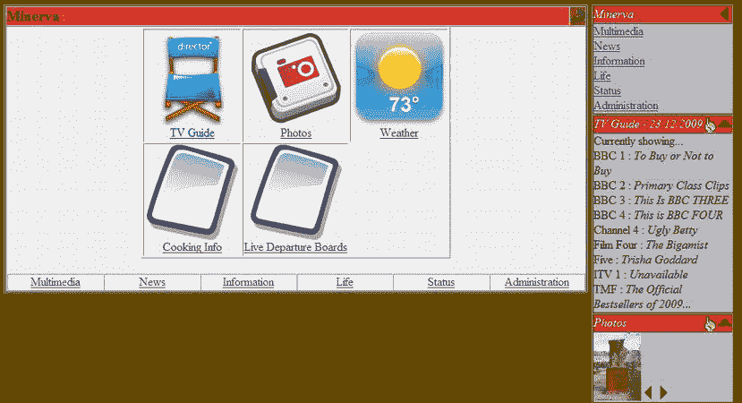
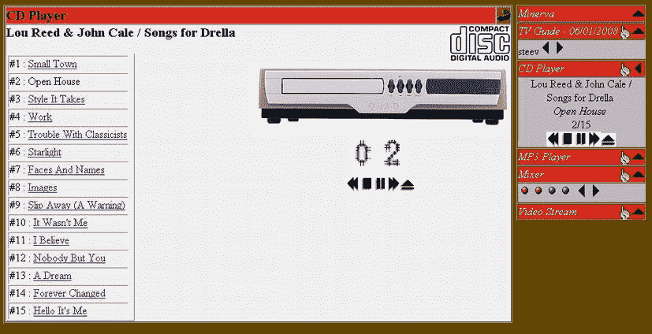
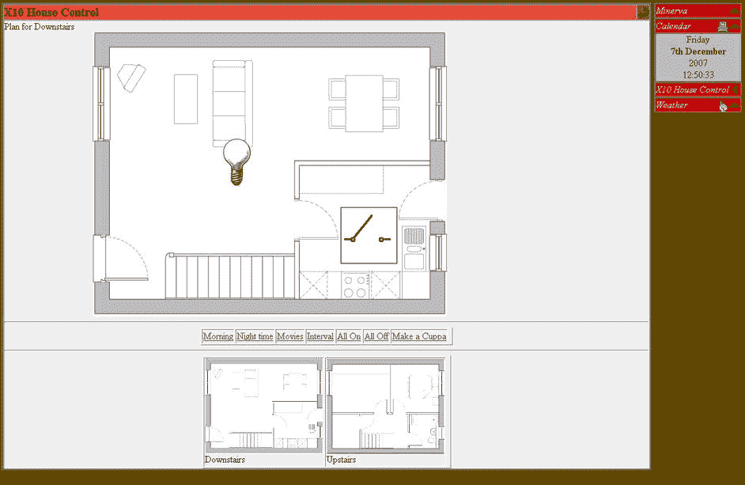
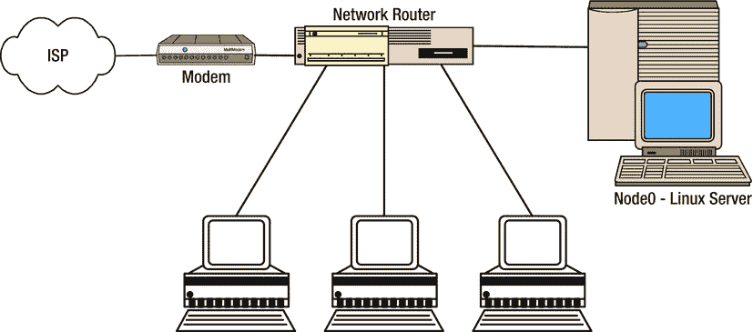
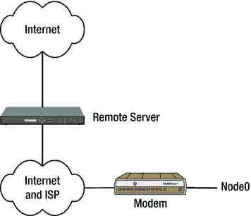
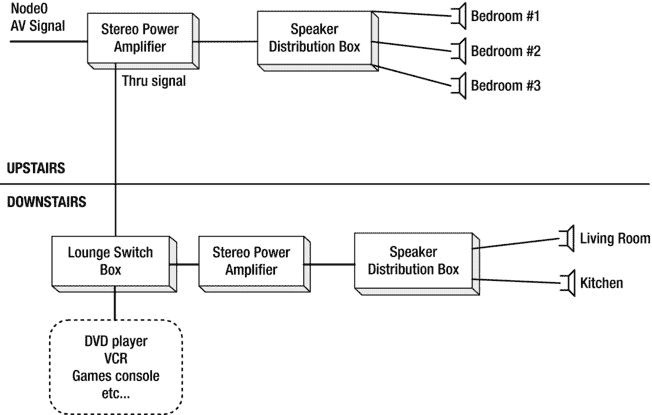

# 七、控制中心：将一切整合在一起

Abstract

大多数人感兴趣的是特性和好处，而不是代码的细节。不幸的是，进入家庭自动化的门槛相当高，因为基本功能需要大量的基础工作。能够在`video@myhome.com`通过电子邮件发送视频的相对简单的过程需要准备 DNS 记录、电子邮件服务器、消息解析器、网络功能和 IR 传输。然而，现在你有了这些单独的组件，可以将它们组合成流程和功能，并对它们进行抽象，这样它们就可以在不破坏住宅功能的情况下进行升级或更改。

大多数人感兴趣的是特性和好处，而不是代码的细节。不幸的是，进入家庭自动化的门槛相当高，因为基本功能需要大量的基础工作。能够在`video@myhome.com`通过电子邮件发送视频的相对简单的过程需要准备 DNS 记录、电子邮件服务器、消息解析器、网络功能和 IR 传输。然而，现在你有了这些单独的组件，可以将它们组合成流程和功能，并对它们进行抽象，这样它们就可以在不破坏住宅功能的情况下进行升级或更改。

## 技术集成

正如我之前提到的，您的家庭技术是基于 Node0 的——或者更具体地说，是基于一个中心位置的 Linux 机器或 Raspberry Pi，它执行所有的处理和思考任务。从几个方面来看，这是您的单点故障。最明显的是，这意味着当机器离线或损坏时，你缺乏媒体控制或播放。幸运的是，作为 Linux，这种情况很少发生。但是正是 Linux 本身的标准安全模型使它最容易受到攻击。讽刺吧。

Linux 通过一组三级权限:`user`、`group`和`other`提供对每个文件和设备[1](#Fn1)的访问。此外，每个文件可以由一个用户和组指定所有权。对于标准文件和文档来说，这通常已经足够了，但是在 HA 中，您要控制由几个不同系统使用的设备。例如，`/dev/dsp`中的音频用于 MP3 播放、语音合成和电影播放的音轨。从这里很容易看出，应该允许几个程序和用户使用音频设备通过语音报告错误，但不允许控制整个房子的音频系统。类似地，当同一端口用于对 Arduino 重新编程或发送 IR 信号时，使用串行端口通过蓝牙备份移动电话 SIM 需要不同的权限。不幸的是，没有足够精细的控制粒度，因为唯一真正的保护是由操作系统提供的。正因为如此，你只能从整体上限制对设备的访问。您甚至不能限制对软件的访问，因为您可以简单地编写 MP3 播放脚本(或在本地目录中从源代码重新构建软件包)并以任何用户身份运行它，以避免对软件的任何限制。同样，您对设备文件的访问权限是有限的。

Note

有些发行版，比如 SELinux，为每个程序提供了明确的访问权限，允许这种级别的精细控制。然而，设置起来很费时间。

我们的解决方案，就像整本书一样，是忽略这个问题！这有两个组成部分。在第一种情况下，通过在 Linux 机器上只创建最少的本地用户(最好是一个),并只将主要用户添加到一个名为`homecontrol`的组中，可以简化这种情况。然后，您可以将该组的权限应用到您的每台设备。当您允许通过 web 或 SMS 界面控制该设备时，自然也必须将这些守护程序添加到组中，以便它们能够访问该设备。

Note

请记住，大多数守护进程，比如 Apache，在应用了对组成员的任何更改之后，都需要重新启动。

解决方案的第二个部分，一如既往地，涉及到这样的知识:房子里的任何人都有一定程度的物理访问和一定程度的社会强制，以防止用户像其他人一样滥用系统。

在给定的场景中，这两者都是安全性和易用性之间可接受的折衷。毕竟，大多数其他家庭成员不太可能直接使用服务器，而是通过可以应用安全性的接口(如电话或网络)使用。

## 茶壶:一个例子

当人们讨论我的家庭自动化系统时，一个经常出现的话题就是我的在线电茶壶。它的功能包括从网页或命令行启动煮沸的能力，并在我下班回家的第二天准备好一杯新的。从硬件层面来看，这只需要一对基本的 X10 模块——一个 CM11，计算机通过它发送信息，一个 AM12 这样的电器模块来控制茶壶的电源——但微妙之处在于软件和对细节的关注。

Note

在任何情况下，茶壶必须始终打开并插入 AM12。此外，茶壶里一定要有水，以防烧干。

从网络上制作一个 cuppa 和从命令行或其他地方触发一个是一样的。也就是说，有三个基本的命令:

*   "打开"
*   "等等"
*   “关闭”

传统上，您可以像这样实现一个脚本:

`heyu turn kettle on`

`sleep 215`

`heyu turn kettle off`

而且很管用！这个脚本可以在任何地方、任何时间被触发，以提供必要的功能。当然，如果直接从网页上的脚本执行，页面将需要 215 秒才能返回，并且通常会超时，因此应该在后台运行:

`shell_exec("/usr/local/minerva/bin/kettle &");`

下一个微妙之处来自茶壶本身的可配置性。每个茶壶在煮沸时间方面都有自己的特点，所以您为您的家庭创建一个配置文件，指示每个茶壶的 X10 地址及其各自的煮沸时间。 [2](#Fn2) 然后由主`kettle`脚本处理。我使用这样的配置脚本:

`#!/bin/bash`

`DEVICE=$1`

`CMD=$2`

`# DEVICE here refers to a particular kettle, for those that need`

`# to differentiate between one in the bedroom, and kitchen.`

`if [ "$CMD" == "time" ]; then`

`# report the number of seconds the kettle takes to boil`

`echo 215`

`fi`

`if [ "$CMD" == "device" ]; then`

`# the x10 device`

`echo e3`

`fi`

这允许我根据需要添加其他 kettles，这使得配置脚本看起来像这样:

`DEVICE=$1`

`homedevice default on `kettle.conf $DEVICE device``

`sleep `kettle.conf $DEVICE time``

`homedevice default off `kettle.conf $DEVICE device``

注意抽象的脚本`homedevice`，而不是`heyu`，我将在后面讨论。

接下来还有一个细节需要补充——一旦茶壶自动关闭，你就可以使用语音合成模块来宣布这个事实。您也可以在终端上弹出一个窗口，如下所示:

`kdialog --msgbox "The kettle has boiled!"`

当你下班回来时，提供一个新的煮沸是简单脚本的类似组合。在这种情况下，你需要知道茶壶烧开的时间(如前所示)和从工作到家的旅行时间。然后执行一个基本的减法，并在调用`kettle`脚本之前发出 sleep。所谓的剧本是一个品味的问题(没有双关语的意思)。如果您习惯于在命令行上工作，那么一个简单的脚本可以启动一个序列来唤醒茶壶、开灯等等。

当然，同样的代码可以从网页上运行，也可以在收到电子邮件时触发。

这在旅程持续时间一致的特定情况下有效，因为它适用于步行者、骑自行车者以及任何不依赖公共交通或受交通支配的人。

更复杂的解决方案也是可能的，例如，通过查看实时的列车发车板(如第 6 章所述)，让计算机计算出你最有可能赶上哪趟列车，并在开始沸腾之前检查它的到达时间。这是留给你的一个练习！

自然地，如果你有一个快速沸腾的茶壶，可能有足够的时间从前门垫子下的压力垫传感器触发脚本，或者当蓝牙加密狗检测到你的手机当天第一次进入范围时。在这种情况下，当你走近房子，打开门，脱掉鞋子和外套的时候，茶壶已经准备好了。

## 密涅瓦

Minerva 是一个完整的、易于使用的家庭自动化套件。使用 Minerva，你可以让你的家变得更容易、更便宜，也更安全。有了 Minerva，您可以在任何地方使用手机或 PC 打开灯，通过电子邮件发送视频，查看安全闭路电视录像，控制中央供暖系统，等等。它是简介中概述的模块化设计目标的缩影，并且它是一个示例，说明了如何将您到目前为止学到的所有技术整合到一个统一的整体中。

Minerva 运行在 GNU/Linux(包括 Raspberry Pi)上，但存在于自己的小型生态系统中，有自己的用户列表、脚本集和功能。它依靠本机命令行工具来执行其许多任务，因此可以在几乎任何平台(智能手机、PDA、笔记本电脑或远程 PC)上运行，具有相同的功能。它还依赖于前面概述的安全模型，在该模型中，只有少数用户可以直接访问机器，希望他们通过备用界面，以便可以根据具体情况控制他们的用户凭据。

图 [7-1](#Fig1) 中有基本结构的指南。

图 7-1。

Minerva Block Diagram

### 概观

Minerva 系统并不是真正的软件集合。它更类似于一个协议包，每个协议为系统中的其他程序和脚本提供一个统一的接口。这允许每个脚本抽象它下面的工具，这样，例如，如果`heyu`变得不能支持必要的特性或者需要被替换，那么只需要替换 X10 控制脚本——而不需要替换使用它的代码。类似地，因为可以用第 1 章中概述的其他系统替换或补充 X10，所以有一个进一步的抽象层，以便在需要时可以使用替代方法。

系统的每个部分都有抽象和接口。Minerva 富有远见的宏伟设计旨在提供一种方式，通过这种方式，每一项家用技术都可以通过一种通用技术连接在一起。这个架构由三部分组成:输入、处理和输出。每个部分都是完全不同的，这意味着您可以从任何支持的输入管道(如 web 浏览器、遥控器或 SMS 文本消息)控制任何内务流程。

类似地，任何报告或通知可以被发送到任何可用的输出管道，其可以(或可以不)与输入相同。一个常见的例子是使用红外输入管道触发一个过程(例如打开茶壶)，但通过计算机对你说话的语音输出管道接收确认。

由此可以看出，web 页面输入管道是建立在现有命令抽象之上的。此外，web 页面有自己的抽象(称为 Zinc ),因此如果您想构建一个更小的精简 web 页面(它不依赖于 WARP 系统),您可以在不替换任何代码的情况下这样做。

像最好的 Linux 软件一样，Minerva 采用了许多开放标准，并通过 GPL 发布代码，这提供了一个平台，可以包含每个用户和系统，而不会受到供应商的限制。您可以从 [`http://www.MinervaHome.net`](http://www.minervahome.net/) 到达其主页并下载页面。

Note

这里的大多数例子使用设置为 Minerva 安装目录的变量`$MINBASE`，默认情况下是`/usr/local/minerva`。为了简洁起见，省略了它。

在`$MINBASE`下面是一个目录结构，它与大多数符合 Linux 文件系统层次标准的发行版所使用的目录结构没有什么不同。它有以下内容:

*   在管道和设备本身的抽象之间发送和接收消息的脚本。
*   `conf`:个人配置数据，如外部账户、通讯录联系人等。这已经从传统的`etc`目录中分离出来，以允许共享和更新，而不会意外暴露这些私人信息。
*   `etc`:关于 Minerva 系统本身、其用户、设置及其设备的配置数据，如茶壶煮沸时间。
*   `house`:关于本机和室内其他机器设备的全局配置。它规定了每个特定命令应该使用哪些特定设备(如`/dev/dsp`或`/dev/dvd`)。这也与 Marple(稍后介绍)一起使用，它允许从一个位置控制房子中的其他设备。
*   `media`:基层系统使用的任何声音、图像或文本文件，如开始语音通知的钟声或闹钟中使用的录制语音。这些通常由 sfx 实用程序调用，例如，它将`ok`、`error`或`end`的参数翻译成`minerva/media/wav`目录中的相应 wave 文件。
*   使用 Minerva 后，用户生成的所有数据都存储在这里。这包括由 Arduino 听写单元等项目生成的消息样本，在第 2 章的[中介绍。为了与 Linux 兼容，它将来自命令本身的日志信息存储在`/var/log/minerva`中，以便像`logrotate`这样的工具可以正常使用。](http://dx.doi.org/978-1-4302-5888-9_2)

安装 Minerva 需要调用基本的`install.sh`脚本。这会将文件复制到适当的目录，更改文件权限，并为系统生成默认用户。它还可以下载当天的天气预报和电视时间表。该脚本相当全面，因此您可以访问 CD 播放器的基于 web 的 applet，而无需明确授予 web 服务器对`/dev/dsp`的读/写权限。这种许可过程的缺点是潜在的漏洞被打开了。此外，英国以外的任何人都需要重新运行描述他们所在地区的更新脚本，以便 Minerva 报告准确的天气预报和电视时间表。

### Linux 用户不是 HA 用户

Minerva 渴望拥有自己的生态系统，拥有独特的用户名和密码，这并不是为了它而自私；这仅仅是一个实用性的例子，因为不是每个使用该系统的人都会有(或者应该能够得到)一个基于 Linux 的账户。毕竟，您消除了大多数用户的 Linux 帐户，因为您希望用户通过更容易在细粒度级别上进行身份验证的方式来控制系统。这为您提供了一种多阶段方法:

*   住在房子里的每个人或家庭亲戚都有一个 Minerva 账户。这为您提供了允许他们查看家庭照片、查看您正在收听的内容等选项。这也意味着他们可以使用您的服务从电视指南中检索节目或查看天气预报。
*   住在房子里的每个人通常也会有一个 web 用户名，该用户名应该与他们的 Minerva 用户相匹配，以便为他们提供对这个输入管道的访问。他们将是 Minerva 用户总数的一部分。这使他们能够控制自己的音乐选择，并查看某些房屋统计数据。每个 web 用户都可以对各种设施进行可控制的读写认证。
*   住在房子里的大多数人将可以访问其他输入管道，如 SMS 或电子邮件。
*   很少用户，通常只有一个，会有一个 Linux 帐户，允许他们直接控制文件系统和用户。通常会有一个 guest 帐户允许对 Samba 文件服务器进行只读访问，这样就可以在本地播放音乐。例如，为了给电灯开关发送电子邮件，将创建其他用户，但是通过将 shell 设置为`/bin/false`，其他用户将无法访问这些用户。

因此，您将在 Minerva 文件系统中引入自己的只读层次结构(都与`$MINBASE`相关),覆盖每个用户、应用程序及其适当的权限。这里不包括每个输入管道的密码，因为这些文件必须是公共可读的，各种命令才能工作。相反，您依赖输入管道(如 web 浏览器)来存储自己的密码并验证用户。毕竟，比起您自己，您更有可能相信 Apache 在提供健壮的用户名安全性方面的经验。

首先，您可以使用如下代码行将用户添加到系统中:

`addminervauser steev "Steven Goodwin"`

这将为他们创建一个目录，从这里开始:

`$MINBASE/etc/users/steev`

保存所有用户特定的设置和数据，包括以下内容:

*   全名
*   个人通讯录
*   默认 Minerva 偏好设置(如合成语音的首选风格)
*   对各种设备的访问权限
*   电视搜索词
*   外部账户参考(如谷歌日历的链接)

系统中的每个应用程序都有一个特定的代码(`homedevice`、`cdplayer`等)和一个保存文件的相关目录，用于确定访问权限，如`r`(用于读写)或`rw`(用于读写)。我使用`r`和`rw`作为标准术语，尽管它们的意思并不直接类似，因为在 CD 播放器的情况下，读访问意味着“你能看看当前播放的曲目吗”，而读写意味着“能改变当前的曲目”您有一个简单的命令来查询该状态，通过将 1 或 0 设置为退出代码来返回 true 或 false 响应，如果指定的用户可以查询 CD 播放器的状态，则可以使用`$?`来检索该响应:

`minuser auth steev cdplayer get r`

当前支持的代码如下:

*   `cdplayer`
*   `Bluetooth`
*   `system`
*   `mixer`
*   `mp3jukebox`
*   `photos`
*   `videostream`
*   `vlc`
*   `x10`
*   `sms`

这些可以根据需要添加，无需配置，因为缺少访问文件被视为“不允许访问”

#### Minerva 用户

就像 Linux 有一个全能的根用户一样，在 Minerva 领域也是如此。那个用户叫做，呃，密涅瓦！尽管它不具备 root 所拥有的相同级别的操作系统控制，但它确实有责任处理任何内部(即用户不可知的)数据收集和处理。这包括每晚收集天气预报和搜索电视指南，这些都由它的`update`目录中的脚本处理。

#### 公共用户

您还有一个公共用户，用于存储家庭信息，如家庭地址簿。因为除了通过管道之外，你不能与 Minerva 通信——每个管道都将你认证为用户——这主要用于存储默认数据。

### 设备抽象

在本书的代码示例中，我使用了标准的 Linux 工具，比如`heyu`和`cdcd`。然而，正如我之前概述的那样，这些工具可能(并且很可能会)在未来被其他工具取代，并且您不希望承担重写每个脚本和程序的任务。因此，您应该保证只对这些命令使用抽象。

Bearskin 是一系列命令包装器，它创建了一个公共接口来控制 Minerva 控制下的所有设备。它还在底层软件不支持的情况下维护该设备的状态。

选择的格式简单如下:

`bearskin_command <device> <command> [command arguments]`

设备的概念与正在讨论的协议有关，它允许您将命令传递给另一台机器进行处理。这在服务器无法物理定位在最佳位置的情况下很有用，包括第 4 章中给出的示例，其中计算机到 X10 网关(如 CM11)无法与其余设备通信，因为其他电器抑制了信号。它还可以包括您想要从非本地`/dev/dsp`设备的机器上播放音乐或者在不同的机器上控制 CD 播放器的情况。它是马普尔的一部分。因此，大多数命令都以下列内容开头:

`DEVICE=`$MINBIN/finddev x10 $*``

`if [ $? == 0 ]; then`

`echo $DEVICE`

`exit 0;`

`fi`

在幕后，`finddev`脚本通过查看`$MINBASE/house/marple/x10/devlist`文件来发现如何在当前机器上寻址 X10 模块，即 localhost。`devlist`文件可能如下所示，表示该模块已连接到`/dev/ttyS0`:

`localhost dev /dev/ttyS0 - -`

在本章后面的“Marple”一节中，您将看到它是如何与其他机器通信的。

此外，所有 Bearskin 命令都支持将`init`作为命令参数，这样它就可以准备临时日志文件、调整所有权权限，并在必要时启动任何守护进程。

#### 典型的应用程序抽象

当前支持的抽象保存在`$MINBASE/bin`中，包括所有必要的功能。我将简要介绍这些，必要时指出其中的微妙之处:

*   `homedevice`:这是一个简单的抽象，它调用`heyu`(用于 X10 控制)来开关灯和电器以及调暗灯光。因为所有 Bearskin 命令之间的参数是统一的，所以这个调用看起来与`heyu`相反，使得典型的`heyu turn bedroom_light on`调用看起来像`homedevice default on bedroom_light`。
*   对于那些仍然喜欢那些闪亮的塑料光盘的人来说，这可以控制 CD 播放器(用`cdcd`)并使用`cddb-tool`包检索它的曲目列表。因为这些数据的检索可能相当慢，所以轨迹数据被临时存储在`/var/log/minerva`中，这样就可以用`cdplayer default currentname`等命令立即查询。
*   `mp3player`:这是一个通用的媒体播放器，它还处理 MP3 内部的 ID3 标签，例如用`mp3player default artist`报告当前的艺术家和专辑。它使用`/var/log/minerva`来存储这个信息，以及当前的进程 ID，这允许您使用`mp3player default next`在轨道间移动。它抽象了`mplayer`，同时利用`mp3info`来解析 ID3 标签。
*   `wavplayer`:这是一个简单的，主要是同步的音频播放器，用于使用`play`的一般房屋警报。
*   `mixer`:调节混音器中每个声道的相对音量，混音器的名称也已抽象化，因此可以使用用户友好的词语，如 master、cd 和 recording。它允许您将音量设置为 0 到 100%之间的相对值或绝对值，即使底层混音器应用程序不这样做。当前的实现使用`aumix`。
*   `say`:这是最有趣的抽象，尽管是最简单的，因为它查询默认的声音(如果存在的话，作为名字存储在`$MINBASE/etc/defaults/festvox`中)并调用`festival`。当代表特定用户呼叫时，它使用他们自定义的语音设置。还有一个更长短语的`sayfile`变体，使用 Festival 更有效的`--tss`论点。
*   这是一个重要的扩展，因为它的上下文是不同的。也就是说，它是用来通知房子有重要的事情发生。它通过播放提示音结束对`say`的呼叫，并降低可能正在播放的任何音乐的音量，然后发出通知并将音量恢复正常。由于此类消息的重要性，设备通常应不同于`mp3player`的设备，以防止某些系统中的音频设备冲突。 [3](#Fn3) 在最糟糕的情况下，这可能需要使用第二个声卡，或者在通常不使用音频的外部机器(如墙板)中使用声卡。`wavplayer`通常被配置为使用相同的设备。
*   `report`:产生关于列车时刻、时间、日期和日历的预格式化信息。这是一种有用的方法，可以创建一种呈现这些数据的同构方式，并消除注入攻击。
*   这是一种通过微博网站 Twitter 发布公告的方式。这可以由家中的多个用户使用，因为它在`$MINBASE/etc/users/[username]/external/twitter`中为每个用户查询一组存储的凭证。
*   `irsend`:这是向连接的红外发射器发送预定红外遥控代码的一种方式。然后它会被范围内的任何传感器检测到。由于这个原因，大多数 IR 使能设备位于 Node0，在 node 0 中，单个发射机可以服务于所有这些设备。它接受两个参数，设备名称和需要发送的消息，并从保存在`$MINBASE/etc/ir/[equipment]/codes/[command]`中的文件中检索代码。该文件中的数据格式由`$MINBASE/etc/ir/[equipment]/method`中的名称控制。

每种情况下的`<device>`通常是`default`来表示默认输出流，这是前面提到的连接到服务器的一组设备。

Note

大多数 Bearskin 命令都是通过杀死并重启 Linux 进程来控制的。这意味着在很多情况下，你不能从一个没有发起的用户那里修改`mp3player`过程。也就是说，如果您使用 web 界面开始 MP3 播放，您不能使用 Cosmic 或命令行来停止音乐，除非管理用户拥有这样做的用户权限。

#### Monexec

Monexec 是一个脚本，由前面提到的各种 Bearskin 命令手动调用，以记录每个操作。例如，当 CD 播放器启动时，`cdplayer`脚本调用以下内容:

`$MINBASE/bin/monexec cdplayer play`

这又会调用一个脚本:

`$MINBASE/conf/exec/cdplayer/play`

然后这个`play`脚本可以执行任何可以想象的任务，比如当卧室的灯熄灭时，用 tweet 发送当前播放的曲目或使用另一个命令(比如`say`)来宣布“晚安”。正是由于这些原因，简单的日志文件是不够的。当然，`monexec`也可以记录命令。

#### TODO:一个成功的例子

为了巩固这些想法，你将成为一个全新模块的全新作者！它将是 TODO 应用程序，并且将是一个完整的工作示例，由 Bearskin 命令、输出管道、消息传递系统和 web applet 组成。设计是这样的，当某人执行以下操作时:

`todo add steev "Take out the rubbish"`

该消息将被添加到 steev 所在区域的任务列表中，并可在网页或命令行上查看，具体如下:

`todo list steev`

这种输出甚至可以作为早晨闹钟的一部分通过节日管道传送！

因此，首先，您需要创建一个像`$MINBASE/bin/todo`这样的文件，并处理基本参数:

`#!/bin/bash`

`MINBASE=/usr/local/minerva`

`CMD=$1; shift`

`USER=$1; shift`

`MSG=$*`

`TODOFILE=$MINBASE/etc/users/$USER/todolist`

`if [ "$CMD" == "add" ]; then`

`date +"%Y-%m-%d $MSG" >> $TODOFILE`

`fi`

`if [ -f $TODOFILE ]; then`

`if [ "$CMD" == "list" ]; then`

`cat $TODOFILE`

`elif [ "$CMD" == "clear" ]; then`

`rm $TODOFILE`

`fi`

`fi`

然后，您需要确保这个脚本是可执行的，并测试一会儿:

`chmod ugo+x todo`

(没关系，我已经为您完成了测试步骤！)

这是你完成的第一步；一旦你理解了管道，你将看到如何从其他地方添加条目到你的待办事项列表中。

### 水管

所有的通信都是双向的，因此自然会有输入和输出消息管道。哪个部分是输入，哪个部分是输出的概念取决于通信的方向，所以您从 Linux 服务器的角度来考虑它们，这意味着输出管道是向设备发送消息的管道，主要用于报告和错误消息，而输入管道是服务器从人那里接收的消息，以诱使它采取行动。

当前版本支持以下导管，可从命令`msgconduit list`中检索:

*   `echo`(仅输出)
*   `email`(进/出)
*   `ir`(仅输出)
*   `log`(仅输出)
*   `sms`(进/出)
*   `twitter`(仅输出)
*   `vox`(进/出)
*   `weblog`(仅输出)
*   `winalert`(仅输出)

每个管道都有一个目录层次结构，位于`$MINBASE/etc/msg`之下。每个目录在结构上都是相同的，并且可能不包含或包含以下目录:

*   `addr`:包含两个格式相同的平面文件。第一个是`alias`，这是一个面向 Minerva 的用户名和特定于管道的地址的列表。例如，在 SMS 管道的情况下，这将是移动电话号码。第二个是`contacts`，这是一个你可能想联系但不是 Minerva 用户的人的地址列表。后一个文件仅在向输出端发送消息时可用，从而允许您向您的朋友发送文本消息，但不允许他们以任何方式查询或更改您的家用电器的状态。
*   `auth`:这是为将来的扩展而保留的，尽管它很少被使用，因为目前大多数认证都是通过`$MINBASE/etc/user/[username]`层级完成的。
*   `cmd`:该目录包含与输入管道一起使用的命令别名列表。通过这种方式，您可以向管道发送短消息，例如“wakeup”，它反过来运行一个`cmd/wakeup`脚本，允许它一次执行几个命令，而无需您显式地指定它们。此外，该脚本可以执行智能上下文操作，因此像`lightson`这样的命令将确定您的位置并控制最合适的灯光。我将在本章后面讨论位置推断。
*   `xmit`:这包含一个名为`cmd`的文件，它通常是一个抽象 Bearksin 命令的符号链接，每当这个管道被用作输出时，这个命令处理参数列表。

现在，我将介绍每个函数的使用方法，这样您就知道如何在将来添加新的函数，并最大限度地利用它们。

#### 回声

仅输出。

这是最容易理解的，因为它仅仅反映了当前控制台的所有输入参数。它主要用于调试管道和地址簿。

#### 电子邮件

输入/输出。

像大多数支持输入和输出方法的管道一样，两者被大量的代码分开。对于管道的输入端，在解析传入邮件以确定它是否来自能够发送消息的人之后，邮件服务器会自动触发`procmail`。这将在第 5 章中详细介绍。

输出管道直接使用标准的`mail`程序。

#### 红外遥控

仅输出。

这将调用`irsend`代码来确定所需的设备和协议。

#### 记录

仅输出。

这将所有消息写入`/var/log/minerva/msglog`，也主要用于调试。

#### 短信

输入/输出。

输出管道通过`mxsms`工作，它被符号链接到三个可能的驱动脚本之一，`mxsms-gnokii`、`mxsms-intelli`或`mxsms-txtlocal`，这取决于谁提供当前的输出服务。如果采用[第 5 章](http://dx.doi.org/978-1-4302-5888-9_5)的思想，你可以让`mxsms`成为一个独立的脚本来考虑传输用户的优先级，并决定使用哪个服务。

对于输入，当从远程 SMS-PC 网关或通过 Gnokii(由 crontab 提供)从自定义脚本检查消息下载特定的 web 页面时，Apache 将触发代码。

#### 推特

仅输出。

它使用`tweet`命令更新他们的 Twitter 状态，从而使用来自给定用户的配置信息，他们的凭证存储在`$MINBASE/etc/users/[user]/external/twitter`中。

#### 声音管道

输入/输出。

在当前状态下，所有语音识别输入都来自一个单独页面上的 HTTP 请求，该请求用给定的命令触发`msgrcv`脚本。输出管道直接连接到 Festival 语音合成套件，该套件已经通过 Bearskin 与`say`和`announce`进行了抽象。Vocal 输出也是一个非常好的调试管道，因为输出是可以立即访问的。

#### 网络日志

仅输出。

这与标准记录器相同，但将其输出写入不同的文件`/var/log/minerva/weblog`。

#### 窗口警报

仅输出。

这将使用基本的`kdialog`程序在 X 窗口终端上显示消息。现有脚本导出`DISPLAY`变量以在当前系统上显示框，但是可以设置为网络上任何适当配置的 X Window 安装。

如果您需要它来支持 Windows 用户，那么您必须在那些机器上安装一些软件(比如 Apache)来监听传入的消息，然后一旦接收到适当的消息，就用它来触发一个小脚本。以下名为`message.js`的代码将使用 Windows 脚本宿主(WSH)来显示一个合适的框:

`message = "";`

`for (i = 0; i < WScript.Arguments.length; i++) {`

`message += WScript.Arguments.Item(i) + " ";`

`}`

`Wscript.Echo(message);`

请注意，文件扩展名很重要，因为它用于确定特定的脚本引擎。

#### 管理管道

管道的管理很简单，因为主要工作由命令本身来处理。向系统添加导管的任务由`msgconduit`命令处理。该命令可以列出前面显示的现有导管，也可以添加一个新导管，如下所示:

`msgconduit create newconduitname`

或将新命令添加到现有管道中:

`msgconduit add conduitname conduitcommand original command with arguments`

Note

还有一个`msginstall`命令，在安装过程中自动执行。其唯一目的是创建前面列出的现有管道。你应该永远不需要调用这个。

### 消息传递渠道

现在已经有了一些发送和处理消息的管道，您需要进一步抽象它们，以便可以从单个脚本控制它们。这是因为每个管道都有很多共同的功能，比如地址簿查找，这些功能可以统一到一个地方。因此，您创建了两个命令:`msgxmit`，它将消息发送到输出管道，以及`msgrcv`，当输入管道接收到消息时，它由各种守护进程调用。

#### 输出导管:传输

这些仅基于`msgxmit`脚本，这是一种通过一个或多个(也是逗号分隔的)管道协议将消息发送给一个或多个(逗号分隔的)用户的方法。这允许您使用这个主脚本来分隔目标地址，以及执行地址簿查找，以便每个管道驱动程序脚本只需要接受一个目标地址。

像所有命令一样，您需要一种标准化的格式。这一个将以管道、地址和消息的形式:

`msgxmit sms myphonenumber "An SMS from the command line, but could be anywhere"`

这避免了主题行、优先级、附件和嵌入链接的复杂性。它们可以被添加，但是只在特定的传输管道中有逻辑意义。因此，您不必尝试处理它们(或通过预处理删除它们)，而是将消息直接传递给适当的驱动程序脚本。如果需要，管道可以自行决定选择基于消息的主题行。

例如，前面示例中的 SMS 传输将确定要使用 SMS 管道，并像这样调用特定的驱动程序函数:

`mxsms sms 012345678 "An SMS from the command line, but could be anywhere"`

命名惯例是，传输脚本总是被称为`mx`，后跟管道名称。

在某些情况下，涉及到两个抽象概念。例如，语音输出通过`vox`管道进行:

`msgxmit vox default "I am talking to everyone in the house"`

这将渗透到`mxvox`脚本中，该脚本将依次调用`say`:

`mxvox vox default "I am talking to everyone in the house"`

管道类型作为一个参数包含在每个阶段，作为健全性检查，并允许一个底层命令由多个管道使用。

为了在不改变`msgxmit`脚本的情况下添加新的管道，您创建了一个目录结构来详细描述它们。例如，该文件夹将详细描述 SMS 帐户凭证、地址簿别名以及我前面提到的传输消息的所有重要命令:

`/usr/local/minerva/etc/msg/sms`

因此，给定参数`$1`中的一个管道类型(或几个管道的逗号分隔列表)和一个以$2 类似分隔的地址列表，您可以用下面的代码处理它们:

`SAVEIFS=$IFS`

`IFS=","`

`declare -a CONDUIT_ARRAY=($1)`

`shift`

`declare -a TO_ARRAY=($1)`

`shift`

`IFS=$SAVEIFS`

`MSG=$*`

然后用以下代码枚举每个管道:

`for CONDUIT in ${CONDUIT_ARRAY[@]}`

`do`

`CMD=$MINBASE/etc/msg/$CONDUIT/xmit/cmd`

`if [ -f $CMD ]; then`

`# existing conduit – send the message to each user`

`fi`

`done`

了解管道后，您可以查阅`$MINBASE/etc/msg/[conduit_name]`中特定于管道的地址簿，将用户名替换为数字。使用空格分隔的列表，如下所示:

`steev 012345678`

`teddy 012347890`

如前所述，这导致特定于 SMS 的脚本只处理电话号码的规范形式，并限制了每个协议脚本的复杂性。显然，如果地址已经是它的规范形式，那么它不会出现在列表的左侧，您可以恢复到最初的输入。发送信息时，您还要检查第二个地址列表，该列表由非 Minerva 用户组成，可用于存储您的工作号码。该代码如下所示:

`ADDRBOOK=$MINBASE/etc/msg/$CONDUIT/addr/alias`

`if [ -f $ADDRBOOK ]; then`

`ALIAS=`grep -m 1 "^$TOADDR " $ADDRBOOK | sed "s/^[^ ]* //"``

`if [ "$ALIAS" != "" ]; then`

`TOADDR=$ALIAS`

`fi`

`fi`

这是一个调用驱动程序脚本并选择性地将消息细节记录到文件中的简单例子:

`$CMD $CONDUIT $TOADDR $MSG`

#### 输入管道:接收消息

这使用了与传输相同的抽象原则，但方向相反。Minerva 有一个名为`msgrcv`的基本脚本，它处理在消息中找到的任何命令，不管消息来自哪里。然后，该脚本检查发送者是否被允许发出该命令，如果不被允许，则拒绝该命令。

Note

这个过程是系统存在不安全性的最明显的例子，因为任何 Linux 用户都能够用有效的参数调用脚本，绕过您的安全性。即使你把所有的文件都设置成只读的，对某些人来说，在本地复制或重新输入这些文件并执行命令也是轻而易举的。这也是为什么面向 Linux 的本地用户应该被禁止访问服务器的另一个原因。

接收和处理消息有各种各样的复杂性，因为每种类型的通信都是不同的，包括文本格式的使用方式和系统接收消息的方式。在第 5 章中，你看到了电子邮件和短信需要明显不同的代码来处理收到的信息的例子。

我的方法是让接收通信的软件在第一时间(例如 web 或电子邮件服务器)对用户进行身份验证。这些守护进程中的大多数将作为某种特权用户运行，因此不容易被滥用。除了推断发送者的面向 Minerva 的用户帐户之外，接收代码还将负责在向您的`msgrcv`脚本发送精简的命令之前，剥离所有不相关的消息信息(以页眉、页脚、签名等形式)。这将工作负载推到了它应该在的地方，并为所有输入管道提供了一个统一的脚本外观。

以 SMS 为例，您已经有了一个网页，只要有人向您家发送消息，就会调用该网页。该页面可能会处理输入，并使用以下代码调用接收方脚本:

`$command = "/usr/local/minerva/bin/msgrcv sms ";`

`$command.= $_POST['from'];`

`$command.= " ";`

`$command.= $_POST['text'];`

`system($command);`

该命令的计算结果如下所示:

`msgrcv sms 012345678 bedroom on`

然后，命令代码可以在`$MINBASE/etc/msg/sms/addr/alias`中查找电话号码，并推断出是谁发出的命令，以及他们是否被允许使用它。

从这里，您可以确定如何以统一的方式处理命令及其参数。然而，允许对整个 Linux 命令集的任意访问是非常危险的，尤其是在给定运行 web 服务器等软件的特权的情况下。正如您刚才看到的，即使是看似不起眼的 SMS 控件也需要 Apache，因此很容易受到攻击。因此，每个用户都有一个允许使用的应用程序列表，由`minuser`命令控制。

此外，你可以通过准备自己的别名集来一石二鸟。有些命令，像`kettle`，简短简单，对短信有效。其他的，例如下面的，则不是:

`homedevice default on bedroom_light`

因此，您将创建一个目录`/usr/local/minerva/etc/msg/sms/cmd`,其中包含许多带有短名称的命令脚本。例如，`bedroom`将执行前面给出的全部命令。您还可以创建一个名为`sleepover`的别名命令，该命令运行以下内容:

`homedevice default off bedroom_light`

`homedevice default off studio_light`

`homedevice default off lounge_light`

这将消除大量的输入，并限制命令注入攻击的范围。这也允许您添加新的 SMS 可控命令，而无需更改 web 目录中的 SMS 输入处理程序代码。

注意，在这个例子和所有其他类似的例子中，您总是像使用`msgxmit`一样将管道类型和地址传递给底层脚本。这样做不会影响性能，而且可以确保使用相同的管道将错误报告发送回正确的用户。

语音控制就是一个很好的例子。在[第 5 章](http://dx.doi.org/978-1-4302-5888-9_5)中，你使用 Apache 在特定网页被访问时触发单独的脚本。有了这个输入管道抽象，您可以非常简单地扩展语音输入的范围。像 SMS 一样，您创建一个简单的网页来接收每个请求并调用`msgrcv`。您已经创建了内容如下的`voxcontrol.php`:

`<?php`

`$cmd = $HTTP_GET_VARS['cmd'];`

`$auth = $HTTP_GET_VARS['auth'];`

`if ($auth == "") {`

`$auth = "public";`

`}`

`system("/usr/local/minerva/bin/msgrcv vox $auth $cmd &");`

`?>`

这导致任何存在于`/usr/local/minerva/etc/msg/vox/cmd`中的名为`$cmd`的现有命令脚本被执行，包括控制灯光(`lightson`、`lightsoff`)、混音器(`mute`、`quiet`、`next`)和状态报告(如`time`和`status`)的典型命令。

此外，您知道写入输出的任何文本都是通过相同的管道返回的。因为这使用了`vox`语音输入管道，所以输出将通过语音输出管道(节日通过`say`)。因此，你可以通过创建像`hello`这样的脚本来说服计算机进行简单的对话:

`# /usr/local/minerva/etc/msg/vox/cmd/hello`

`echo Hello`

和`time`:

`# /usr/local/minerva/etc/msg/vox/cmd/time`

`$MINBASE=/usr/local/minerva`

`$MINBASE/bin/hdate`

`$MINBASE/bin/htime`

#### TODO:建立管道

尽管在创建管道的过程中有许多必要的小文件和目录，但是通过一个自动生成它们的简短脚本，该过程变得更加简单，因此您只需要调用以下代码:

`msgconduit create todo`

您应该会看到创建的额外目录:

`$MINBASE/etc/msg/todo/addr`

`$MINBASE/etc/msg/todo/auth`

`$MINBASE/etc/msg/todo/cmd`

`$MINBASE/etc/msg/todo/xmit`

默认情况下，输出命令(`$MINBASE/etc/msg/todo/xmit/cmd`)被符号链接到`$MINBASE/bin/mxtodo`。这目前是空的，没有理由为了它而改变标准，所以您可以编辑该文件来创建代码，该代码将在消息发送到 TODO 管道时运行。因为您有一个 Bearskin 命令来完成所有的处理，所以只需取出参数并将其传递给`$MINBASE/bin/todo`即可:

`#!/bin/bash`

`$MINBASE=/usr/local/minerva`

`CONDUIT=$1; shift`

`USER=$1; shift`

`MSG=$*`

`$MINBASE/bin/todo add $USER $MSG`

同样，您需要确保这个脚本可以执行:

`chmod ugo+x /usr/local/minerva/bin/mxtodo`

就这样！已经可以测试了:

`msgxmit todo steev "Write the web applet for TODO"`

### 消息中继

Minerva 还包括一个消息中继系统，每当收到新消息时，它就在不同的管道之间传递信息。这与`monexec`的工作方式类似，除了`rlyexec`总是并且仅仅是从`msgrcv`调用。典型的调用如下所示:

`rlyexec email steev command arguments`

这将触发`$MINBASE/etc/users/steev/relay/email`目录中的每个可执行脚本，为处理命令或消息提供充足的机会，例如，这可能包括作为 SMS 重新传输。每个脚本按字母顺序执行，并在第一个退出代码非零的脚本上停止。因此，你可以通过给目录中的每个脚本一个序列号来采用这个惯例，就像你在第五章中给你的虚拟主机排序一样。

### 基于时间的消息传递

一些系统的目标是智能化。毕竟，这是家庭自动化的下一个阶段。因此，能够根据某些参数(如`time`)来确定消息的目标，为用户带来了新的便利。

不幸的是，要做到真正准确，你需要让你所有的个人和工作日历都可以被系统访问。然后你需要理解如何解析它。这两个目标在短期内都不现实。然而，你可以对你的日常事务做一个大概的描述，因为它在大多数情况下都是例行公事。

Minerva 定时系统(MTS)位于消息传递管道之上的一层中，以确定在白天或夜晚的任何给定时间应该使用哪个管道。因此，计算机可能会发出以下警告，并确保以我可能最快收到的方式发送:

`mtsxmit steev warn "Disc space is getting low on /dev/sdc1"`

它通过一个两阶段的过程做到这一点，首先确定我可能在哪里，然后知道我在那里时希望如何联系。

第一部分是一系列个性化的时间表，在`$MINBASE/etc/users/steev/mts`中可以找到，这些时间表描述了用户在特定类型消息的给定时间可能在哪里。这一行设计文档已经为我们创建了四组变量:

*   用户
*   消息的类型或优先级
*   天
*   一天中的时间

通过将它们按顺序排列，您可能已经猜出了目录结构，因为每个类别都位于另一个类别下面的目录中！优先级是`mesg`(标准信息性消息)`warn`(关于房屋硬件或软件的警告)和`error`(严重问题、安全问题和可能的入侵者)中的一个。

你会很高兴地知道，这一天可以确定少于 365 个单独的文件。事实上，您只需要与您拥有的日期类型一样多的文件。大多数员工会有三个工作日:工作日、周六和周日。因此，一年 240 个工作日的配置将是“起床、上班、工作、回家、睡觉”这相当于一个名为`weekday`的文件，可能如下所示:

`! hourly`

`# 00 01 02 03 04 05 06 07 08 09 10 11 12 13 14 15 16 17 18 19 20 21 22 23`

`* -- -- -- -- -- -- -- hp tr wk wk wk wk wk wk wk wk wk wk tr hp hp hp hq`

MTS 使用的格式很简单，但是非常严格。第一行指示文件的格式，在本例中，是一个每小时一次的报告。第二个是评论，提醒我们(我！)的格式，而最后一行表示数据本身。

除了为每个相同的工作日创建一个文件之外，您还可以为星期六(称为星期六)和星期日(称为星期日)创建一个文件。此外，如果在某个特定的日期有特定的事情，你可以通过创建一个名为`Dec25`的文件来覆盖它，例如，它表明你根本不想被打扰！MTS 代码将首先寻找最具限制性的日期，并通过较低的优先级完成默认日期。完整的顺序如下:

*   节日(圣诞节、开斋节等)
*   具体日期(2014 年 2 月 30 日)
*   一周中的每一天(周一、周二、…)
*   一天的类型(周末或工作日)
*   默认(每日调用；这个应该一直存在)

每个两个字母的代码恰好对应于一天中的一个小时，并指示您在那个时间应该在哪里。这些代码对每个用户来说都是任意的，所以让我们考虑一组相当典型的代码，以及您可能使用的协议:

*   `hp` =家庭，公共。使用语音合成器。
*   `tr` =旅行。仅限短信。
*   `wk` =工作。如果重要的话，发邮件或工作邮件。
*   回家，但不要声张！使用电子邮件和短信。

可以使用如下发出的`mtspick`程序确定位置，其中返回一个双字符代码:

`mtspick steev error`

然后，您可以在一个键中查找该值，以确定消息应该如何发送(以及发送给谁)。为了允许多个接收者和协议，您为每个两个字母的代码创建一个脚本，该脚本将用户名作为输入，并输出管道协议和用户名。这也允许您考虑邮件的重要性，并改变电子邮件地址，就像我前面讨论的那样。

然后，这与原始消息组合在一起，并传递给我已经介绍过的`msgxmit`代码。

我们稍后将介绍一种叫做 mashmodes 的技术，它允许您在大粒度的基础上改变整个房子。例如，这允许 mts 配置文件在工作和假日时间表之间改变。

#### MTS 的其他用途

过程的`mtspick`部分接受两个参数，一个用户和一个优先级。这通常通过`mtsxmit`对用户隐藏。然而，它可以被重新分配以创建一些附加的自制功能。

你可以创建一个名为`mixer`的用户，并准备一个 crontab，这样房子的主音量会随着时间的推移而变化，在夜晚的最后几个小时自动降低，这样你就能自然入睡。同样的效果可以用来逐渐调暗卧室的灯光。

它还可以用来触发预先准备好的电子邮件，询问您是否顺利进入工作状态，如果没有收到回复，就会发出警报。

您也可以通过将代码用作节目时间表来创建自己的广播电台。这些可以控制哪个特定的 MP3 文件夹用于在白天或晚上的给定时间随机选择音乐。一些代码可能会启动 Festival 来阅读新闻和报告天气。

### 基于位置的消息传递

能够推断出你的位置也有它的用处，作为一种更准确地指导输出的方式。正如我们刚刚看到的，MTS 可以提供很大一部分功能。但是总有改进的空间。

我们可以获得硬件的支持，如 PIRs 或门垫压力传感器，以获得您所在房间的大致信息。如果你在楼梯上使用两个压力传感器(一个在顶部，一个在底部)，那么你可以计算出行进的方向，以启用当前的音频织机，将你的音乐淹没在你能听到的地方。

如果你采用了语音识别系统，并且每个房间都有一台独立的机器，那么你可以创建一个简单的语音命令，比如`here`来通知服务器你的位置。

通过使用蓝牙监控软件，你可以确定信号的强度，通过实验，你有时可以用它来推断你在房子里的位置。当你有一所大房子和/或信号中有很多障碍物时，它会工作得更好，这两者都会在近和远之间产生明显的区别。

对于细粒度的基于位置的确定，RFID 标签可以用于提供更准确的细节，尽管您需要一个相当强大的标签，以便在您在房子里走动时可以自然地检测到它。一种可能的解决方案是将它们安装在鞋底或拖鞋上，这样当你走进任何一个房间时，它们都能被检测到。

最后，确定位置的最佳方法是利用您对问题的本地知识。如果请求来自 192.168.1.132 的网页，那么您可以确定它的 MAC 地址(从 DHCPD 日志中),从而确定它是哪台机器以及它的位置。此外，如果您总是在休息室使用笔记本电脑发送个人电子邮件，则将该信息构建到系统中，以便从该电子邮件帐户发送的任何消息都可以控制休息室中的设备。有时，您可以查看电子邮件标题的最后一行“Received: from ”,以确定发件人的 IP 地址，但这并不是绝对可靠的。

### 宇宙的

Cosmic 是一个 RF 到 PC 的网关，它使用何裕来拦截 X10 RF 发射机(如 HR10 或 SS13E)放在电力线上的 X10 信号，并触发任意一段代码。这可以是控制当前播放音乐的音量，跳过曲目，或启动定时器来帮助烹饪。这可能是将独立无线控制面板引入家中的最便宜的方法。

这种方法有两个主要问题。首先是这些设备没有反馈机制。因此，你需要设计你的界面，使得每个按钮在每次按键时都会产生噪音、语音输出或视觉提示。您有责任确保处理这些命令的服务器了解交换机的位置，以便它可以在可以听到这些反馈噪声的位置发出这些反馈噪声提示。

第二个问题与 X10 有关。因为控制信息是 X10 信号，它们也将控制相同地址上的任何灯。根据房子的大小，你可能不得不把你的 X10 地址一分为二，或者使用两个房屋代码。在前一种情况下，您可以将地址分为两组，1-8 用于正常控制灯光、茶壶和标准设备，9-16 作为第二组，不在任何设备上使用，仅由 Cosmic 使用。大多数遥控器上都有一个开关来切换这些特定的地址集，所以它们被选在这里并不是巧合。因此，该按钮被重新指定为家庭控制/宇宙控制任务切换器。

#### 配置

假设您有八个可用的地址，这就给了您 16 个可用的按钮——这八个按钮中的每一个都有开和关。万一这些后来改变了，您可以在`/etc/heyu/x10.conf`文件中给它们起别名，如下所示:

`ALIAS cosmic1 E9`

`ALIAS cosmic2 E10`

`ALIAS cosmic3 E11`

`ALIAS cosmic4 E12`

`ALIAS cosmic5 E13`

`ALIAS cosmic6 E14`

`ALIAS cosmic7 E15`

`ALIAS cosmic8 E16`

您可以配置始终监控电力线的`heyu`守护进程，以便每当出现这些地址的消息时调用特定的命令。在默认配置中，Cosmic 将命令分为三组:

*   媒体控制
*   基于状态的操作
*   状态控制

媒体控制始终是全球性的和起作用的。这是因为它们的相对重要性。它们允许您增加和减少音量，以及静音/取消静音音乐，并且它们提供了一种暂停所有当前播放媒体的方法。它们占据了标准 HR10 的顶部四个按钮(两行)。他们运行的命令都使用抽象的 Bearskin 命令，并像这样添加到`x10.conf`:

`SCRIPT cosmic1 on :: /usr/local/minerva/bin/mixer default dec master 10`

`SCRIPT cosmic1 off :: /usr/local/minerva/bin/mixer default inc master 10`

`SCRIPT cosmic2 on :: /usr/local/minerva/bin/mixer default toggle`

`SCRIPT cosmic2 off :: /usr/local/minerva/bin/pmedia default`

记住这些命令将由最初调用`heyu engine`的用户执行。因此，他们必须对音频输出和混音器设备拥有适当的访问权限，这样才能正常工作。

Note

您总是影响主宗卷，而不是单个设备宗卷。这是因为收音机、CD 或 MP3 的相对音量不会改变，唯一不准确的地方出现在单个范围的顶部和底部，即主音量。

基于状态的控制器稍微复杂一些。它由四个用于查询和更改状态的预定义按钮和八个特定于模式的按钮组成。其配置如下:

`SCRIPT cosmic7 on :: /usr/local/minerva/bin/cosmic default modestatus`

`SCRIPT cosmic7 off :: /usr/local/minerva/bin/cosmic default nextmode`

`SCRIPT cosmic8 on :: /usr/local/minerva/bin/vstatus`

`SCRIPT cosmic8 off :: /usr/local/minerva/bin/cosmic default clear`

请注意，您只能在一个方向上循环模式，因为这个顺序更容易记忆。此外，你已经使用了什么本来是一个先前的按钮重置宇宙到它的初始状态。这个`modestatus`报告提醒你处于周期的哪个阶段，以免你忘记，还有一个通用的状态报告来平衡各行。

这种分配是专门针对像 HR10 这样布置成两列的设备的，HR10 在左侧有“开”按钮。这允许您在左侧排列两个状态报告，并将两组全局按钮分为顶部的媒体和底部的宇宙状态。请注意，Linux 中的软件永远不会改变，只有配置会改变。

为了控制宇宙系统，你将剩余的按钮分配给任意的`c1`、`c2`等命令。

`SCRIPT cosmic3 on :: /usr/local/minerva/bin/cosmic default c1`

`SCRIPT cosmic3 off :: /usr/local/minerva/bin/cosmic default c2`

`SCRIPT cosmic4 on :: /usr/local/minerva/bin/cosmic default c3`

`SCRIPT cosmic4 off :: /usr/local/minerva/bin/cosmic default c4`

`SCRIPT cosmic5 on :: /usr/local/minerva/bin/cosmic default c5`

`SCRIPT cosmic5 off :: /usr/local/minerva/bin/cosmic default c6`

`SCRIPT cosmic6 on :: /usr/local/minerva/bin/cosmic default c7`

`SCRIPT cosmic6 off :: /usr/local/minerva/bin/cosmic default c8`

如您所见，`cosmic`脚本在技术上是无状态的，因此您必须使用`/var/log/minerva/cosmic`目录来保存当前模式。

Note

因为`heyu`守护进程在对`x10.conf`进行任何更改后都需要重新启动，所以您可以通过调用像`/usr/local/minerva/bin/cosmic default base1`这样的脚本，将所有的宇宙脚本重定向到一个间接的形式，从而改进这个脚本的维护。

#### 创建模式

然后你就有乐趣了(！？)设计状态及其接口的一部分。宇宙系统对可能的模式数量没有限制，也没有限制其中的指令必须如何运作。但是，建议每次按下按钮都会产生某种反馈，要么直接是因为命令的结果发生了一些事情(如开灯或播放音乐)，要么间接通过听觉反馈来指示命令发生了，尽管您看不见。

每种模式都存在于自己的目录中，从`$MINBASE/etc/cosmic/0`开始按顺序编号。这包含了控制该模式所需的所有文件。它包括以下文件:

*   `name`:带有模式名称的文本文件。当您循环到模式时，会大声朗读此内容。
*   `status`:将该模式的状态报告写入 STDOUT 的脚本。例如，在多媒体模式的情况下，它将是当前播放的歌曲。这是在每个模式状态报告的末尾读出的。如果不存在文件，则只需重新读取模式名。
*   `c1`、`c2`、`c3`、`c4`、`c5`、`c6`、`c7`、`c8`:这八个文件是当八个相应的命令按钮中的任何一个被按下时执行的脚本。通过以这种方式运行脚本，您可以在不重新编程`x10.conf`文件或重启何裕守护进程的情况下更改系统。

所有的主要工作都在这八个`c1`–`c8`脚本中完成。Minerva 中有三个示例子系统:CD 播放器的媒体控制、一组状态报告和一组计时器。后一种模式使用无线控制器开始计时一个设定的时间段，例如五分钟。一旦时间到了，语音会宣布结束，几个计时器可以同时运行。

Tip

所有`c1`–`c8`脚本的输出都应该写入标准输出。这样，通过将 Cosmic 中的代码改为读作`REPORT=/bin/echo`，可以更快(也更容易)地调试 Cosmic 配置。

### 敬牦牛

尽管 Cosmic 有很多好处，但它并不像一些人希望的那样广阔。于是牦牛诞生了。作为首字母缩略词，它代表“又一个 Kontrol 系统”，是一种将任意消息(来自 X10 设备)处理成 Linux 绑定命令的方法。有一系列保存在`/usr/local/minerva/etc/x10/scripts/`中的脚本，当按下指定控制器上的按钮时会调用这些脚本。每个控制器都位于自己的子目录中，每个按钮都有一个子目录。因此，例如，淋浴单元的控制面板上的按钮 8 将在目录中，

`/usr/local/minerva/etc/x10/scripts/Shower/8`

因为 X10 寻址协议不像这样用户友好，所以您还必须配置 Yaks 来将 X10 消息(比如 D9)映射到它们在这里的对等物。该信息存储在位于`/usr/local/minerva/etc/x10/controls`的基于代码的配置脚本中，如下所示:

`$c = $config->addController(new YaksController("Keyfob", "c", 1, 8));`

`$c = $config->addController(new YaksController("Shower", "d", 8, 8));`

Note

这种配置看起来像代码，因为它是！这个文件作为`yaks`程序的一部分被加载，该程序创建了`$config`对象，并声明了`YaksController`类。使用代码作为数据是一种欺骗，但是允许在配置中有更多的灵活性。

从这里，您可以看到智能钥匙占用了房屋代码“C”和从 1 到 8 的 8 个单元 id，而淋浴器正在处理房屋代码“D”，有 8 个单元编号为 8 到 16。接下来需要做的就是确保每个房屋代码和单元都在`/etc/x10.conf`中设置好，以触发`yaks`程序。

`SCRIPT b1 on :: /usr/local/minerva/bin/yaks control b1 on`

`SCRIPT b1 off :: /usr/local/minerva/bin/yaks control b1 off`

`# etc`

Note

如果您使用 mashmodes 向系统上传新的`/etc/x10.conf`文件，请记住在每个配置中包含这些行，或者在上传到 CM11 之前向每个版本添加一个`cat`模板。

### 生活方式

Mineva 里的模式系统叫 Mash，是“Minerva 自动化智能家居”的简称(不，真的！)是将整个房子置于特定状态的一种方式。你的房子一次只能存在于一个州，所以每种模式都是互斥的。mashmode 的一些示例如下:

*   正在度假
*   正在工作
*   在家，正常
*   在家，工作
*   生病在家

因此，发出以下命令很简单:

`mashmode set holiday`

此外，无论是通过脚本、文本消息、电子邮件、MTS(基于时间的消息)还是网络界面触发，都可以让您的房子为您的假期做好准备。可以把它想象成家庭自动化的电子邮件自动回复器。这可能包括:

*   更改自动照明计划
*   在 18:00-23:00 期间随机播放音乐和电视频道
*   给你的送奶员发短信取消牛奶
*   通过电子邮件向家人发送节日提醒

Note

不管你的安全措施如何，公开宣布你正在度假是没有好处的。尽管关于窃贼通过监控 twitter 信息来判断其入室盗窃时间的报道基本上是杜撰的(有更简单的方法来确定某人是否在家)，但没有必要感到无聊。

设置 mashmode 非常简单，因为它们由两个包含脚本的目录组成，一个在模式开始时，另一个在另一个模式取代它时。请注意，如果将假日模式替换为“工作”或“在家工作”，则没有区别。首先创建一个新的配置文件:

`mashmode create holiday`

这将创建前面提到的目录:

`./etc/mode/holiday/onenter`

`./etc/mode/holiday/onexit`

每个目录的处理方式完全相同，因此无论您是进入还是退出模式，都会扫描目录中的文件，并且:

*   如果有一个`x10.sched`文件，它将作为一个新的时间表上传到您的 x10 设备
*   如果有一个名为`process`的脚本，它将使用脚本中包含的任意命令运行该脚本
*   如果有一个`xmit`目录，它会向指定方发送一条消息

第三个案例很有趣。文件名指示使用哪个管道发送消息(电子邮件、sms 等)，而文件内容指示消息发送给谁以及消息。

`$ cat etc/mode/holiday/onenter/xmit/sms`

`#mum,sis`

`#!/bin/bash`

`date +"We're off on holiday, beginning on the %dth %B"`

正如您所看到的，第一行是一个注释，其中包含消息要发送到的逗号分隔的用户名。文件的其余部分是一个脚本，用于确定要发送的消息。

为了提醒您支持哪些导管，您可以使用:

`msgconduit list`

### 例行公事

例程是一系列定时事件，从特定时刻开始，与传统脚本没有什么不同。准备早晨淋浴的“唤醒”脚本示例可能是:

`MINBIN=/usr/local/minerva/bin`

`sleep 0`

`$MINBIN/alarm 1`

`sleep 300`

`$MINBIN/homedevice default on bedroom`

`sleep 600`

`$MINBIN/homedevice default on shower`

`sleep 60`

`$MINBIN/homedevice default on shower_speaker`

`sleep 10`

`$MINBIN/report say shower calendar`

`sleep 1200`

`$MINBIN/say shower Hurry up`

`$MINBIN/homedevice default on shower_speaker`

`$MINBIN/homedevice default on shower`

`$MINBIN/homedevice default on bedroom`

这是由 cron 通过几个内部计时间接触发的，以应对卧室和浴室之间的步行。不要直接写 crontab 行，如:

`10 7 * * 1-5 /usr/local/minerva/bin/routine start 1`

相反，最好这样写:

`* * * * 1-7 /usr/local/minerva/bin/routine process`

因为虽然每分钟都有更多的处理发生，但它将控制从 cron 中的(固定)脚本转移到 Minerva 的配置目录中的更动态的脚本。这允许您在例程脚本中使用可变时间，因为 cron 不支持这些。例如，你可以在日落时自动开灯，这由实用程序脚本`sunset`决定。

在结构上，描述例程进程的每个目录包括三个文件:

`$ ls /usr/local/minerva/conf/routine/1`

`name normal script`

`name`是一个单行文本描述，它是人类可读的，并在`routine list`上呈现

`normal`是触发该事件的正常时间，例如 7:00

列出偶数可以运行的日期，例如星期六、星期日。因此，您需要创建两个不同的例程来处理您的周末起床时间表和工作日起床时间表。

`script`是当时要运行的可执行文件

还有一个可选文件`override`，它(如果存在的话)在第二天使用其中的时间——并且只在第二天。第二天时间恢复“正常”。这是引入“我需要在明天 6:00 起床，而不是 7:00，参加会议”这一概念的简单方式，并且消除了大量临时的配置更改。

通过将脚本和时间从 cron 中分离出来，您还可以:

*   从随机的`sleep`延迟开始，将事件延迟几分钟，让房子更有人情味。
*   用基于时间的处理器 MTS 查看您的当前位置，并禁用/启用各种事件。
*   查看天气，如果下雨，并且它知道你会开车，而不是走路，那就推迟你的闹钟。
*   查看天气，如果下雪，早点叫醒你，知道你需要更多时间给窗户除霜。
*   查看火车时刻表，如果火车晚点，就把闹钟延迟。或者如果取消了，自动给你的老板发邮件。
*   如果检测到您已经洗过澡，则阻止该事件(例如，开始淋浴)发生。

用例可能涉及比正常情况更早或更晚地开始一些事情。因为时间不可能倒流，所以脚本应该总是在事件最早适用的时间触发，也就是最糟糕的情况，并且将事件延迟到最好的情况。这自然解决了“双重现实”的问题，6 点钟的闹钟可能会决定在 7 点钟叫醒你是可以接受的...而 7 点钟闹钟可能决定，由于环境的变化，它应该依靠 6 点钟事件来触发。

规则的已知例外(比如早期会议的例子)仍然最好使用`override`文件。

作为一个非常以开发人员为中心的实现，这可以很容易地从 iOS 远程应用程序重新编程，或者绑定到日历。

最后，我从我自己的洗澡程序中展示一个真实的例子！这个例程由我的“夜间”事件触发，为我准备淋浴。除了基本的照明，它还能为我读出第二天的日程安排。有趣的是，最后一点需要额外的逻辑，因为如果我在午夜后回家，那么“第二天”实际上是同一天，我们需要相应地修改流程:

`# For early morning/late nights`

`if [ `date +"%H"` -le 4 ]; then`

`REQUEST_DAY=today`

`MESSAGE="Back late - I hope it was a good night. Let's talk about the morning"`

`else`

`REQUEST_DAY=tomorrow`

`MESSAGE="Let us talk about tomorrow"`

`fi`

`CONDUIT=vox`

`$MINBIN/report $CONDUIT shower echo $MESSAGE`

`# ... other messages here ...`

`$MINBIN/report $CONDUIT shower echo Let me look at the calendar`

`$MINBIN/report $CONDUIT shower calendar $REQUEST_DAY`

`$MINBIN/report $CONDUIT shower echo Checking house events`

`$MINBIN/report $CONDUIT shower lstatus $REQUEST_DAY`

`$MINBIN/report $CONDUIT shower weather $REQUEST_DAY`

### 有薄荷味的

薄荷有两个用途。首先，它是一个超时系统，如果设备在最后一次使用后的三分钟内没有使用，它将自动关闭。其次，它是一个引用计数实用程序，以确保第一个组件智能地运行。因此，如果两个人一起开灯，那么灯会在最后一个人关灯三分钟后关闭。这在自动化的房子里是必不可少的，因为一个人可以在本地打开它，另一个人可以远程打开它，计算机可以自动打开它...这三个人在与设备互动时都希望设备是开着的。

为了方便起见，每个设备都有一个 Minty `on`事件和一个相应的`off`事件，用两个脚本描述，例如:

`/usr/local/minerva/conf/minty/shower_speaker/on`

`/usr/local/minerva/conf/minty/shower_speaker/off`

因此，当设备第一次被要求打开时，脚本`minty start shower_speaker`被调用，时间被记录。如果这是第一次打开淋浴扬声器，那么运行上面的脚本。如果没有，它的计数增加。一旦您使用完设备，并将其关闭(可预测地命名为`minty end shower_speaker`)，计数就会递减，如果计数达到零，三分钟的超时开始。

因为`on`脚本只在第一次调用时被调用，所以您可以从许多不同的地方触发相同的事件。因此，举例来说，如果出现以下情况，淋浴器扬声器会保持开启:

*   你在洗澡的时候放音乐
*   听着电脑的声音阅读你的日历
*   淋浴灯亮着

这些事件触发器中的每一个都对`minty start shower_speaker`进行相同的调用，所以只有当你停止在淋浴时听音乐，有人给你读你的日程表，你关掉灯，它才准备好关掉灯。

当然，如果你在三分钟内回到淋浴间，并播放更多的音乐，那么三分钟的暂停将重新开始。

### 通用遥控器

这是一个 iOS 应用程序 [4](#Fn4) ，让你控制家庭自动化设置的任何部分，无论是否由 Minerva 运行。它之所以能够做到这一点，是因为远程只向 web 服务器发送 HTTP 请求，然后所有的配置都在服务器上进行。这与[第 3 章](http://dx.doi.org/978-1-4302-5888-9_3)中提到的各种通信桥接解决方案有相似之处。虽然在链中引入了额外的链接，但这并不意味着您只需要在控制客户端设备上设置该服务器的端点，包括:

*   URL(默认为 [`www.minervahome.net`](http://www.minervahome.net/) 的 Minerva 主页)
*   端口(通常为 80)
*   脚本(urc/echo.php)

这些被组合到 HTTP 请求中:

`GET`[`http://www.minervahome.com:80/urc/echo.php?command=menu.1.region.6.index.23&code=nocode`T3】](http://www.minervahome.com/urc/echo.php?command=menu.1.region.6.index.23code=nocode)

`command`参数详细说明了按下的具体按钮，其格式如下:

`command=menu.[index].region.[icon_reference].index.[position_on_screen]`

`code`参数也可以通过应用程序进行配置，并作为密码发送，以提供基本的安全级别。您的服务器端脚本可以根据需要选择处理(或忽略)该参数。

现在，我们将了解如何确定索引、图标参考和屏幕位置参考。

#### 配置

因为我们已经说过应用程序是由服务器配置的，所以使用这样的配置文件是有意义的。

`<homeremote>`

`<menu>`

`<button text="TV"/>`

`<button icon="20"/>`

`<button icon="19"/>`

`<button icon="35"/>`

`<button icon="36"/>`

`<button menu="1"/>`

`<button icon="0" text="Film"/>`

`<button icon="38"/>`

`<button icon="37"/>`

`<button icon="40"/>`

`<button icon="39"/>`

`<button menu="2"/>`

`... cut for brevity ...`

`</menu>`

`</homeremote>`

该应用程序发出的第一个 GET 请求是对服务器 URL 根目录中一个名为“config.xml”的文件的请求。显示屏分为 6 x 6 个区域(在命令参数中，索引首先指的是屏幕上的位置)，从左到右阅读，然后从上到下阅读，每个区域要么是一段文本，要么是带有图标的功能按钮，要么是到另一个菜单的链接。在这种情况下，我们的第一个菜单(称为 zero)以一行电视控制键开始，这些控制键有各种图标参考，后面是一个到菜单 1(即第二个)的链接。菜单的图标是预先确定的。

The available icons are:

<colgroup><col> <col> <col> <col></colgroup> 
| `0\. Blank` 1。省略号—保留给菜单更改 2。关闭电源 3。关闭电源 4。书标 5。混音器级别 6。电视输出 7。音乐 8。照片 9。内务管理 10。新闻或信息 | `11\. Film` `12.`照片 13。邮件 14。天气 15。CD 16。服务器(或云)上的文档 17。朋友 18。上升 19。下降 20。左侧/前一个 | `21\. Right/next` `22.`加/更 23。减去/少于 24。交叉/删除/移除 25。放大/显示/状态/信息 26。长 27。电池或电源。聊天信息或对话 29。30 号文件。播放/开始 | 31.暂停 32。停止 33。音量调低 34。静音 35。音量调高 36。倒带 37。前 38 页。下一个 39。快进 40。收藏夹 41。标签 |

Note

由于配置文件涉及到大量的打字工作，可以在 [`http://www.minervahome.net/homeremote.htm`](http://www.minervahome.net/homeremote.htm) 下载示例文件

一旦按钮被按下，完整的 URL 就像前面提到的那样被调用。然后，您可以将命令拆分成点，并根据应用程序的具体情况解析每个点。一个示例处理脚本是这样工作的:

`<?php`

`$cmd = $_GET['command'];`

`$code = $_GET['code'];`

`if ($code != "nocode") {`

`echo "Invalid code";`

`return;`

`}`

`preg_match('/menu\.(\d+)\.icon\.(\d+)\.index\.(\d+)/', $cmd, $match);`

`$menu = $match[1];`

`$icon = $match[2];`

`$index = $match[3];`

`$minbin = "/usr/local/minerva/bin/";`

`$menuActions = array();`

`// Main menu screen`

`$menuActions[0] = array(`

`10=>'media default next music 5',`

`16=>'media default next music 5',`

`19=>'mixer default toggle', 20=>'mixer default quiet', 21=>'mixer default loud',`

`25=>'weatherstatus',26=>'ldbquery get lut stp',27=>'todo list steev',28=>'getcalendar steev 1',`

`29=>'media default status',`

`30=>'media default stop', 31=>'media default toggle', 32=>'manifest default next music',`

`33=>'housenight', 34=>'homedevice default on bedroom',`

`);`

`// ... other menu actions here ...`

`$result = "Unknown command";`

`if (array_key_exists($menu, $menuActions)) {`

`if (array_key_exists($index, $menuActions[$menu])) {`

`$command = $menuActions[$menu][$index];`

`$command = $minbin.$command;`

`$command .= " >&1";`

`$output = array();`

`exec($command, $output);`

`$result = join("\n", $output);`

`}`

`}`

`print $result;`

`?>`

该脚本输出的任何内容都将传递回应用程序，并显示在状态窗口中。默认的`echo.php`脚本将简单地重复传入的每个参数，并返回给应用程序。这有助于验证您对哪个菜单、屏幕位置和图标被按下的假设。很简单:

`<?php`

`print_r($_GET);`

`?>`

并且值得在开发过程中保留您自己的脚本。

### 网络小程序

对于大多数人来说，通过网络浏览器控制房子是次要目标(在语音识别之后，也就是！).正如我在[第 5 章](http://dx.doi.org/978-1-4302-5888-9_5)中提到的，这是 20 世纪和 21 世纪无处不在的通信手段，所以你有义务通过这样的接口提供对所有 Bearskin 命令的访问，隐藏在 SSL 和用户名和密码提供的安全性后面。

在最简单的层面上，您可以构建自己的站点来提供在服务器上执行 Bearskin 命令的链接列表。但是 web 提供了一个更丰富的画布，可以用来呈现现有命令没有提供的家庭友好特性。

除了从台式电脑或笔记本电脑控制您的家庭之外，您可能还想考虑购买新机器作为信息亭或家庭终端。这些可以是平板电脑、手机，或者带有触摸屏显示器和微型电脑的家庭酿酒机(如第八章第一节提到的树莓派，或者第四章第三节提到的 Fit-PC2 和迷你 ITX 机器)。这台机器可以根据你醒着的时间进行电源循环，并设置一个小型快速版本的 Linux，如[第三章](http://dx.doi.org/978-1-4302-5888-9_3)中提到的 Webconverger。例如，在厨房里有一个可以让你从网上阅读食谱，而使用触摸屏(相对于键盘和鼠标)可以更容易地控制你的手何时沾满面团。

在设计触摸屏界面时，有一些细微但重要的差异。首先，当你的指针在按钮区域上移动时，没有任何悬停控制。因此，您应该避免使用工具提示来呈现附加信息或解释按钮。此外，按钮区域本身通常需要更大，在它们之间有一些概念性的空间。例如，当你用手指控制一个面板时，你通常只能精确到 20 个像素左右，所以每个按钮的最小尺寸应该是 32 个像素。最后，使用触摸屏通常意味着没有键盘。在这种情况下，您在文本框中键入内容的能力会大大降低。有几个屏幕键盘可以解决这个问题，但由于前面给出的原因，它们需要足够大，并且具有将输入指向多个输入控件的机制。避免必须向一个或多个方向滚动的屏幕也是明智的——理想情况下，根本没有。

#### 锌:在网络和本土之间

在你进入网页之前，还有最后一层要打开，锌。这是一个小型的服务器端代码库，它抽象了各种类型的设备，并允许通过 WARP 来控制它们。在 Minerva 的说法中，这也被称为 web 网关管道。

它由几个非常薄的包装类组成，允许 PHP 小程序代码以安全和结构化的方式进行系统调用。例如，如果你使用`mp3player`脚本，网页将不会完成加载，直到整个片段被播放完。如果您在后台启动它，那么任何输出(比如错误)都会出现在您的 web 页面的任意位置。这层可以防止这种情况。它还允许您通过`zinc/conf/mp3player.conf`中的配置文件使用备用设备名称，例如，它允许您替换 Bearskin 命令或 web 站点，而不会影响其他命令。如果没有 Zinc，从网页上正确运行`mp3player`所需的代码如下:

`$cmd = MP3PlayerDevice::$binary." ".MP3PlayerDevice::$device;`

`$cmd.= " play $track";`

`$out = system("($cmd 2>&1 >/dev/null) >/dev/null 2>&1 &");`

#### 网页和小程序

Minerva 提供的 web 界面基于 WARP，因此允许您在一个网页上显示多个小程序。图 [7-2](#Fig2) 显示了一个典型的屏幕。

图 7-2。

Various Minerva applets all running on a single page

每个小程序都呈现为一个小的“面板”视图(如烹饪信息所示)，最大化的小程序(天气)显示在整个窗口中。所有这些小程序都可以从一个页面中获得，比如由如下代码组成的`wnews.php`:

`<?`

`require_once 'warp/warplib/appletmanager.inc';`

`require_once 'warp/applets/main/main.inc';`

`require_once 'warp/applets/weather/weather.inc';`

`require_once 'warp/applets/tvguide/tvguide.inc';`

`require_once 'warp/applets/photoframe/photoframe.inc';`

`require_once 'warp/applets/cookery/cookery.inc';`

`require_once 'warp/applets/ldb/ldb.inc';`

`include_once 'system/master_standard.conf';`

`$appman = new Warp_Applet_Manager();`

`$appman->init();`

`$appman->AddApplet(new Warp_Main_Applet());`

`$appman->AddApplet(new Warp_TVGuide_Applet());`

`$appman->AddApplet(new Warp_PhotoFrame_Applet());`

`$appman->AddApplet(new Warp_Weather_Applet());`

`$appman->AddApplet(new Warp_Cookery_Info_Applet("Cooking Info"));`

`$appman->AddApplet(new Warp_LiveDepartureBoards_Applet());`

`echo $appman->renderPage();`

`?>`

您可以使用任何想要的小程序组合来构建自己的页面。这种灵活性允许您忽略某些来自本地网络之外的 IP 地址范围的小程序，甚至为机器专门创建一个页面。例如，知道您的 DHCP 服务器总是为您的厨房 PC 提供 192.168.1.140 的 IP，您可以构建一个只包含食谱和烹饪信息列表的页面。

Note

如果您通过任何形式的代理(包括路由器)访问网页，您可能无法获得正确的地址，因为服务器只能看到代理的 IP，除非代理配置了“X-Forwarded-For”标头。

在 Minerva 的 3.0 版本中，这个过程是通过浏览器工厂来实现的。如果您家里有多个类似 kiosk 的设备，您现在可以写:

`$appman = getBrowser()->createManager();`

`$appman->init();`

这段代码创建了一个特定于客户机的应用程序管理器。`getBrowser`方法保存在 system/browserlist.conf 中，用于将客户端 IP 转换为详细描述其功能和近似大小的特定浏览器对象。这是一个两步过程。第一个将 IP 映射到浏览器类型(例如触摸屏、PC)，如下所示:

`$ipaddr = getIPAddress();`

`$style = $_GET['WRP000X0_style'];`

`$dostyle = array_key_exists('WRP000X0_dostyle', $_GET) ? $_GET['WRP000X0_dostyle'] : "";`

`switch($ipaddr) {`

`case "192.168.1.132": // kitchen tablet PC (height accounts for border)`

`$style = STYLE_TABLET_LARGE;`

`break;`

`case "192.168.1.131": // hall-mounted iPod Touch`

`$style = STYLE_TABLET_SMALL;`

`break;`

`default:`

`$browser = $_SERVER['HTTP_USER_AGENT'];`

`if (strstr($browser, "iPhone")) {`

`$style = STYLE_TABLET_SMALL;`

`} else if (strstr($browser, "iPad")) {`

`$style = STYLE_TABLET_LARGE;`

`}`

`break;`

`}`

第二步使用$style 参数构造对象，大小为:

`switch($style) {`

`case STYLE_TABLET_LARGE:`

`return new WebBrowser(new WAM_FactoryTouch($style), 1024, 740);`

`case STYLE_TABLET_SMALL:`

`return new WebBrowser(new WAM_FactoryTouch($style), 480, 320);`

`case STYLE_FULL:`

`default:`

`return new WebBrowser(new WAM_Factory(STYLE_FULL));`

`}`

在每种情况下，`WAM_Factor*`类指示当前要创建的 applet 管理器是`Warp_Applet_Manager`还是`Warp_Applet_ManagerTouch`，后者在界面上使用大的可点击图标而不是小图标和文本。

您可以生成几个页面，并使用主 applet 在它们之间切换，而不是使用包含所有 applet 的单个页面。这显示在图 [7-3](#Fig3) 的最大化视图中。

图 7-3。

The main applet

主 applet 有两个功能。第一个是枚举添加到该页面的 applet manager 中的每个 applet，从而提供与右边最小化的框相似的功能，但是具有更大的图形(也就是说，更适合触摸屏用户)。其二是提供一种在不同页面之间移动的方式。这些由配置文件`system/master_standard.conf`决定，如下所示:

`<?php`

`class MasterBar`

`{`

`public static $automaticInclude = false;`

`public static function getPages()`

`{`

`return array("Multimedia"=>"wmm.php", "News"=>"wfeeds.php",`

`"Information"=>"wnews.php", "Life"=>"wlife.php",`

`"Status"=>"wstatus.php", "Administration"=>"wsystem.php");`

`}`

`public static function generate(&$appman)`

`{`

`if (self::$automaticInclude) {`

`return $appman->getMasterBar(getPages());`

`} else {`

`return "";`

`}`

`}`

`}`

`?>`

这个细节应该很明显吧！因为您现在可以使用现有的小程序构建自己的定制页面，并使用上面的`getBrowser`方法根据浏览器对它们进行调整。现在，我们来看看有哪些小程序可用。

#### 现有小程序

提供的小程序分为几大类—媒体、生活方式、信息和管理。大多数小程序使用 Bearskin 抽象，因为使用松散耦合的基于组件的开发模型的许多好处之一是许多小工具可以组合成更大的工具。这些网络小程序就是这样一个例子。这里介绍的每个 applet 都依赖于来自更简单前端的底层代码和数据。考虑到这一点，将完整地给出每个小程序的配置，从基本数据到面向 web 的页面，以便给出对整个数据流的即时理解，而不分散 Bearskin 命令、抽象、配置等子类之间的信息。

##### 媒体

这些小程序允许您控制各种形式的媒体播放，包括 CD 播放器、音量混合器、MP3 自动点唱机、VLC 服务器和客户端，以及用于显示电视指南的前端。

CD 播放器是 Bearskin `cdplayer`命令的一个非常简单的抽象，它允许控制光盘，如图 [7-4](#Fig4) 所示，同时显示专辑和曲目名称。PHP applet 代码和 Bearskin 系统命令之间的桥梁由`zinc/system/cdplayer.inc`处理，其中`zinc/conf/cdplayer.conf`用于指示可执行文件的位置和要使用的设备。

图 7-4。

The server’s CD player being controlled through the web

混音器遵循与 CD 播放器相同的想法，只是调用底层 Bearskin 命令，尽管其设置和参数分别由`zinc/system/mixer.inc`和`zinc/conf/mixer.conf`配置。

有一个 MP3 自动点唱机，允许您浏览给定根目录下的各种目录，在初始化时设置如下:

`$appman->AddApplet(new Warp_MP3Play_Applet("MP3 Player", "media/mp3"));`

如果文件夹名称(第二个参数)以`/`开头，那么路径是文件系统的绝对路径，而相对路径(如此处所示)意味着它是相对于 web 服务器本身的(但不是相对于 Minerva 目录的)。MP3 自动点唱机既可以在服务器上播放音乐，也可以通过互联网传输到浏览器。(按照[第 5 章](http://dx.doi.org/978-1-4302-5888-9_5)中关于媒体访问的提示进行准备。)如果您想要支持流，根文件夹的考虑在这里很重要，因为它只有在 web 服务器可以访问音乐目录的情况下才能工作，也就是说，它在 Apache 根服务器目录下，比如`/var/www/sites/homecontrol`。为此，您可能需要为您的音乐收藏创建一个符号链接，并在配置中启用`FollowSymLinks`。

电视指南使用 Minerva 用户每晚下载的数据。它生成一大块 PHP 代码，在`$MINBASE/etc/users/public/tvresults.inc`中存储未来三天内每个节目的节目信息。这可以由 Bearskin 命令解析出来，比如`tvonnow default`和`tvreport default public`，或者由 applet 直接处理。

除了公共用户持有的所有节目列表之外，daily `crontab`还能够搜索用户特定的标准并生成定制的时间表。这是通过一个搜索字符串来实现的，这个搜索字符串以逗号分隔的术语列表的形式出现在一个文件中，比如`$MINBASE/etc/users/[username]/tvsearch/list`。`tvsearch`目录也可能包含两个额外的文件。一个名为`e-mail`，是这个列表也要发送到的电子邮件地址；另一个是`sms`，这是一个短信电话号码的缩写。如果有问题的文件不存在，则不会发送任何消息。

添加新的电视频道需要添加不同的设置，因为指南和控制的电视配置统一到保存在`$MINBASE/conf/tvconf.conf`中的一组数组中。

`#!/bin/bash`

`tuner=( a1 a1 d1 d1 a1 d1 a1 a1 d1 )`

`channel=( 55 0 0 0 65 0 0 59 0 )`

`names=( BBC1 BBC2 BBC3 BBC4 "Channel 4" "Film Four" Five ITV TMF )`

`stations=( bbc1 bbc2 bbc3 bbc4 ch4 film_four five itv1 tmf )`

如您所见，它保存了电视卡的调谐信息(频道号以及它是使用模拟还是数字调谐器 [5](#Fn5) )，以及电视台 ID 及其完整的可打印名称。对电台 ID 的唯一限制是它必须与用于检索电视指南数据的电台 ID 相匹配。在这种情况下，这可以从 [`http://bleb.org/services/tv/data/listings/0`](http://bleb.org/services/tv/data/listings/0) 处的列表中看出。

这些数据阵列由保存在`$MINBASE/medimg/tvguide`中的站点图标的网络专用数据补充。文件名存根必须与之前给定的 id 匹配，并以`.png`结尾，以便 applet 正确读取。此外，由于这些图标必须对网络服务器可用，因此有必要确保从网络友好目录(如`warp/conf/tvguide/images`)到原始文件夹的符号链接存在。默认情况下，这是由 Minerva 安装程序创建的，所以您不必担心。

这里讨论的最后一个媒体小程序支持视频流，并且是成对出现的。第一个是 VLC 流媒体小程序，允许你浏览一系列预定的文件夹(如`/net/media/videos`)并选择一个进行播放。这将在`$MINBASE/conf/videostream.conf`中指定的服务器和端口上创建一个媒体流，然后它可以被任何连接的计算机上的 VLC 客户端读取。另一半是一个客户端小程序，通过使用一个插件(当你安装了 VLC 的时候可以在火狐上使用)，它可以将视频片段流式传输到浏览器窗口中。

Note

流式传输通常仅发生在本地网络上。要从外部访问它，您需要在防火墙或路由器上打开一个端口，将 VLC 端口(默认为 8080)上的流量重定向到给定的机器。

##### 生活方式

这些小程序通常在室内和室内使用，包括一个 X10 控制面板，用于以可视方式开关电器，如图 [7-5](#Fig5) 所示。

图 7-5。

Using the web to switch your lights on or make a cuppa

由于它的复杂性，它有许多配置文件，我现在将介绍这些文件。(所有路径都相对于 Minerva 的 web 主目录。)

*   `warp/conf/x10/x10.conf`:控制出现在主 X10 控制图下方的情绪或场景栏。这通常包括像“所有灯关闭”和“电影心情”这样的引用您需要编写一个场景列表，以及选择相应场景时将运行的代码。
*   `zinc/conf/x10floorplan.conf`:包含房屋中 X10 设备的列表，以及它们各自在平面图上的楼层索引、X 和 Y 位置。这些名称必须以 Hu 格式(如 E3)或别名与设备匹配，如`heyu`配置文件(`/etc/heyu/x10.conf`中所提供的。这个文件还包含了房子里每一层的名字。
*   `warp/applets/x10/img`:除了灯泡和电器开关的标准 X10 图形，这个目录还应该包含平面图，存储为`floor0.png`、`floor1.png`等。

如图 [7-6](#Fig6) 所示，该日历检索公共日历和当前用户的 Google 日历信息。这些由用户的 Minerva 目录中保存的`ical`和`gcal`配置文件确定，`$MINBASE/etc/users/[username]/externa`l .`ical`文件被解析以寻找今天的事件，而`gcal`文件用于呈现外部日历文件的链接。使用的时钟是一个免费的 Java 软件，但是你可以很容易地把它改成你喜欢的任何设计。 [6](#Fn6)

图 7-6。

A calendar that extracts personal data from a public site

烹饪信息小程序非常简单，因为它是烹饪术语和基本转换单位的基本词典，每一个都是从`warp/conf/cookery`中的一个单独文件中加载的。如果您计划构建一个基于静态文本文件的 applet，那么这是一个很好的起点。

“联系人”小程序提供了您所有朋友和亲戚的详细信息，并且是按用户提供的。每当用户登录时，他们的联系信息就会从`$MINBASE/etc/users/[username]/contacts.xml`文件中读取、解析并显示在这个 applet 中。如果他们没有登录，那么您将获得属于公共用户的那些。

最后，相框小程序是 Minerva 中 web 管道所独有的。它读取来自`warp/conf/photoframe/photoframe.conf`的照片列表(图片本身保存在名为`photos`的子目录中)并一次显示一张，如图 [7-7](#Fig7) 所示。

图 7-7。

The photo frame can operate as a slide show on kiosk machines

通过点击主图像，该应用程序可以在整个浏览器窗口中工作，使其适合在机器不被用作控制面板的时候用作交互式相框。您可以使用图像左侧和右侧的热点在图像中循环，而图像的下部会使您返回到非全屏模式。互联网上有很多合适的图片，包括那些在 [`http://www.most-famous-paintings.org`](http://www.most-famous-paintings.org/) 的文化秃鹫。

##### 信息

这些小程序提供关于真实世界的信息，这些信息在室外也是有用和有效的。这些和你的生活方式有潜在的重叠，但是现在这是足够好的区别！

Moonbeam 是一个小程序，它依靠 MySQL 来存储书签列表，每个书签都有多个标签。它类似于 [`http://del.icio.us`](http://del.icio.us/) ，只不过所有的数据都保存在自己的服务器上。为了准备数据库，您可以使用现有的 root 帐户运行`build/applets/moonbeam/createdb.sql`脚本:

`$ mysql -u your_username -h your_machine_name -p < createdb.sql`

然后输入您的密码来构建一个空数据库。您可以通过将相同的凭证添加到同一目录下的`config.php`文件中，并运行以下命令，用示例链接填充它:

`php init.php`

然后，您可以在`conf/moonbeam/config.php`将该帐户信息添加到 Moonbeam 的 web 配置中，并正常使用该小程序。如果您想创建一个备用用户来访问 Moonbeam 数据库(推荐)，那么登录 MySQL 并输入以下内容:

`CREATE USER 'moonbeam'@'localhost' IDENTIFIED BY 'some_pass';`

`GRANT SELECT on moonbeam.* TO 'moonbeam'@'localhost';`

并修改 web 配置，如前面所示。因此，为了安全起见，moonbeam 用户被授予对数据库的只读权限，而真实用户(例如 steev)能够正常地通过数据库添加、更改和删除书签。

天气小程序只需读取存储在`/var/log/minerva/cache/weather.txt`和`/var/log/minerva/cache/weather_info.txt`中的预先缓存的预报(由 Minerva 用户的`crontab`在当天早些时候做出),以寻找匹配的字符串来确定哪个图标将被绘制在页面上。

还有一个货币计算器，基于你在第 6 章的[中看到的](http://dx.doi.org/978-1-4302-5888-9_6) [`http://xurrency.com`](http://xurrency.com/) web 服务。其内容主要是教育性的。

另一个 applet 仅仅包装了一个现有的 Bearskin 命令，由实时出发公告板组成。它调用`$MINBASE/bin/ldbquery`来确定从你预定的车站出发的下一趟列车。这里没有配置，因为`ldbquery`脚本从 applet 中的硬编码值接受指定为旅程的始发站和目的站的参数。

最后，RSS 新闻小程序利用`news-read`命令将最新的新闻故事呈现到浏览器中。每个新闻提要都由站点 ID 和用户名的唯一配对来管理，例如，它提供了一个存储在`$MINBASE/etc/users/public/news/slashdot`中的文件，该文件包含 RSS 提要的站点名称和 URL:

`Slashdot`

[T2`http://rss.slashdot.org/Slashdot/slashdot`](http://rss.slashdot.org/Slashdot/slashdot)

这条新闻是按需下载的，要么用`news-get public slashdot`显式下载，要么用`news-read slashdot public text 0 headline`阅读故事时隐式下载。此时，RSS 内容被下载并存储在本地缓存中，在缓存中可以读取各种元素。如果内容相当新鲜，并且可以以文本、HTML 或声音友好的文本呈现输出，则系统足够智能，不会重新下载内容。后一种情况会删除任何标记。WARP applet 使用前面显示的`news-read`参数分别显示元素、标题、URL 和故事。可以在命令行中使用相同的方法，允许闹钟包含如下这样的一行，以便在早上显示标题:

`$MINBASE/bin/say default (`news-read slashdot public vox 0 headline´)`

##### 管理

这些都是非常简单的小程序，可以快速查看状态日志、进程和服务器，而无需通过 SSH 登录。您将需要拥有使用这些工具的权限，因此请授予自己以下权限:

`minuser auth [myusername] system set rw`

此处可用的典型小程序报告以下内容:

*   空闲磁盘空间(具体设备可以在`warp/conf/diskfree/diskfree.conf`中指定)
*   浏览器的用户代理(主要用于调试)
*   桑巴状态
*   处理器顶部
*   UPS 状态
*   各种日志文件
*   蓝牙扫描仪结果

#### 创建您自己的小程序

为了充分理解 applets 的开发方法，有必要了解一点 WARP。WARP 是一个建立在 WebFace 上的系统，它抽象了 web 设计的基本元素，以确保控制逻辑和表现元素严格分离。这意味着不可能在您的页面中添加包含以下内容的链接:

`<a href="process.php?bedroom_light=on">Switch Light On</a>`

但是，您必须要求 applet 管理器为您生成一个:

`$html = $appMan->getAppletLink($applet, "on", "bedroom_light", "Switch Light On");`

然后你会提出这样的论点:

`$prm = $appMan->queryParameter($applet, "bedroom_light");`

这种方法有几个好处。自然地，它迫使逻辑和显示分离，这鼓励了更结构化的代码，并且它意味着你可以把 applet 放在任何你喜欢的页面上，因为页面本身没有被提及。但更重要的是，它提供了一个简单的升级途径。WARP 是基于一种类似 RESTful 的方法。因为 HTTP 是一个无状态协议，所以没有办法从一个页面到下一个页面记住用户操作。一些网站通过使用许多不同的页面来做到这一点，其中页面本身就是状态的隐含提醒。有些会创建服务器端对象，这些对象会记住状态，只要浏览器在查看页面，或者直到任意超时。WARP 通过将状态记录为 URL 的一部分来实现这一点。由于每个页面上都有几个 applet，因此每个 applet 都必须有自己的 URL 部分来指示自己的状态。典型的 URL 可能如下所示:

[`http://my.minervahome.net/minerva/wmm.php?WRP001X1_user=0&WRP001X1_day=0&WRP002X3_dpage`](http://my.minervahome.net/minerva/wmm.php?WRP001X1_user=0WRP001X1_day=0WRP002X3_dpage) ←中

`=0&WRP002X3_fpage=0&WRP004X6_current=/&WRP004X6_dpage=0&WRP004X6_fpage=0&wintype`ⅱ

`=main&content=WRP002X&max=WRP002X`

如果仔细分析，您会发现每个参数都符合 WRP 的模式，后面是三位数的 applet 代码、X 分隔符和参数索引号、下划线，然后是名称/值对。还有一些参数以`wintype`、`content`、`max`的形式描述 WARP 的内部状态。自然，试图手动生成或解析这个 URL 是愚蠢的！

##### 曲速目录

`minerva/warp`里面有三个目录值得注意:

*   每个小程序的代码和资产，在它们自己的子目录中
*   `conf`:早期小程序的配置数据，位于同名子目录中
*   `warplib`:小程序和小程序管理器的基类和操作类

##### WebFace 的组件

WebFace 中的每个抽象都涵盖了 WARP 代码设计中的四个领域之一。可以从具有如下功能的 applet manager 中检索对每一个的引用:

*   `getAuth()`:授权。这个模块将让您知道用户是否已经使用方法`getUser`登录并通过了 Apache 服务器的认证。由于 Apache 用户 ID 是手动管理的，以匹配 Minerva 用户名，因此它可以用于在网页上显示电视指南和其他特定于用户的数据。该模块还通过`isUserValidFor`连接到`minuser`代码，以提供对各种小程序的精细控制。这使得许多人可以看到当前播放的 CD 或 MP3 曲目，但只有少数特权人士可以改变它(`warp/warplib/appauth.inc`)。
*   `getCtrl()`:控制。为 web 链接生成锚点；我将在本章的后面详细介绍这一点。
*   `getView()`:视口。这用于将多个独立数据块合并到一个帧中。这里使用的比喻是窗格，因为它们组合在一起形成了窗口。默认功能允许您将这些窗口组合成水平或垂直对齐的两个、三个或四个窗格的窗口(`webface/webview.inc`)。
*   `getDbug()`:调试。这是一个实用程序子模块，允许记录单个错误、警告和信息行。一旦构建了 HTML，就可以使用`dumpAll`写出完整的列表。这样做是因为写入网页任意部分的输出会严重破坏格式，并且在 cookies 的情况下，会阻止页面加载(`webface/webdbug.inc`)。

##### 基本结构

几乎每个 applet 都以同样的方式开始，在`warp/applets`中有一个目录，从模板中取出一个新的 applet 类，如下所示:

`<?php`

`require_once 'system/setup.conf';`

`require_once 'warp/warplib/applet.inc';`

`class Warp_TODO_Applet extends Warp_Applet`

`{`

`function Warp_TODO_Applet($caption = "TODO List")`

`{`

`parent::__construct($caption);`

`}`

`function getID()`

`{`

`return "MY_APP_V1A";`

`}`

`function getDirectory()`

`{`

`return "todo";`

`}`

`function init(&$appMan)`

`{`

`Warp_Applet::Init($appMan);`

`}`

`function renderPanel(&$appMan)`

`{`

`return "";`

`}`

`function renderWindow(&$appMan)`

`{`

`return "";`

`}`

`function renderInfo(&$app_man, $fast=false)`

`{`

`if ($fast) {`

`return "-";`

`}`

`return "Instructions...";`

`}`

`}`

`?>`

您可以很容易地看到填充 HTML 代码以形成面板、主窗口和帮助屏幕的空白处。这些都是简单的部分。有趣的代码在`init`中，而迄今为止看不见的`getRefreshParams`控制着参数。

##### TODO:控制小程序

由于一切都由参数控制，您必须注意有效地使用它们。最好的方法是将`GET`请求视为具有两组参数。第一组反映了刷新参数，是您希望出现在 URL 中的参数，以便以后可以重建这个状态。第二组是命令参数，指示页面重新加载时该状态如何变化。

在 TODO 示例中，您的 applet 应该能够为当前用户或公众列出待办事项列表，并且可以选择按字母顺序进行排序。 [7](#Fn7) 这将最终为你提供五个潜在参数:

*   刷新状态参数:哪个用户可见？
*   刷新状态参数:列表排序了吗？
*   命令参数:切换到用户 x。
*   命令参数:排序列表。
*   命令参数:Unsort list(又名，按顺序显示)。

这说明了下一点——这里有冗余。将刷新状态和命令参数合二为一在技术上是可能的，因为它们都控制相同的数据。但是，在构建网页时，您需要知道所有的刷新状态参数，以便页面上的其他链接具有正确的值。不幸的是，这需要做大量的工作来知道哪个状态参数将在以后被命令参数覆盖。您可以通过编写一个描述当前状态的刷新函数来简化这个过程，当其他 applet 向 applet manager 请求 URL 时，它将间接调用这个函数:

`function getRefreshParams(&$appMan)`

`{`

`return`

`$appMan->getArgument($this, "user", $this->_viewuser)."&".`

`$appMan->getArgument($this, "sort", $this->_sortlist));`

`}`

接下来，您将添加包含命令参数的链接，这些链接与您已经看到的相似:

`$html = "Show: ";`

`$html.= $appMan->getAppletLink($this, "dosort", "0", "Chronologically")." ";`

`$html.= $appMan->getAppletLink($this, "dosort", "1", "Alphabetically");`

`$html.= "  For: ";`

`$html.= $appMan->getAppletLink($this, "douser", $user, $user)." ";`

`$html.= $appMan->getAppletLink($this, "douser", "public", "Public");`

按照惯例，这些参数以`do`为前缀，表示它们应该改变刷新状态。即新状态=旧状态+ do 更改。applet 管理器通过从当前页面上出现的每个 applet 收集刷新参数来生成一个合适的链接，并将这些`do`链接附加到末尾。

当加载页面时，基于这些参数构建新的状态，并分两个阶段完成。第一个是检索刷新参数:

`$this->_sortlist = $appMan->queryParameter($this, "sort", false);`

`$this->_viewuser = $appMan->queryParameter($this, "user", "public");`

第二步是寻找任何改变这种状态的`do`参数:

`$this->_sortlist = $appMan->queryParameter($this, "dosort", $this->_sortlist);`

`$this->_viewuser = $appMan->queryParameter($this, "douser", $this->_viewuser);`

在这两种情况下，您都使用默认参数来覆盖 applet 第一次使用时没有任何可用参数的情况，以及没有命令参数的情况。

然后，您可以在显示 Bearskin 命令`todo`的输出时展示您的创造力(还记得几页前写的吗？！)并将列表写入 HTML:

`exec("/usr/local/minerva/bin/todo list ".$this->_viewuser, $todolist);`

`if ($this->_sortlist) {`

`sort($todolist);`

`}`

`$html .= "<ul>";`

`foreach($todolist AS $item) {`

`$html .= "<li>$item</li>";`

`}`

`$html .= "</ul>";`

为了给这些添加一层润色，您可以将 exec 调用移动到 Zinc 中，但这可以留到以后再说！

##### 全局配置

Minerva 的 web 部分使用了少量配置文件来处理您可能采用的不同目录结构，如表 [7-1](#Tab2) 中所述。

表 7-1。

Web Configuration Directories

<colgroup><col> <col> <col> <col></colgroup> 
| 包括文件名 | 功能 | 缺省目录 | 描述 |
| --- | --- | --- | --- |
| `minerva.conf` | `getMinervaRoot` | `/usr/local/minerva` | 密涅瓦系统本身的基础。 |
| `system/setup.conf` | `getURLRoot` | `/minerva` | Minerva web 组件使用的名称。可以进行更改，以防范试图破坏 Minerva 命名的目录中保存的任何网页的僵尸程序。 |
| `system/setup.conf` | `getPathRoot` | `/var/www/sites/homecontrol` | web 根目录的文件系统路径。当您需要以常规方式访问文件时使用。 |
| `system/utils.inc` | `getServerName` |   | 各不相同。如果使用虚拟服务器，请使用此选项，而不是 IP 点分四边形。 |
| `system/utils.inc` | `getServerPort` |   | 80. |
| `system/utils.inc` | `getRemotePort` |   | 因客户而异。 |
| `system/utils.inc` | `getIPAddress` |   | 由客户决定。可能实际上是路由器的 IP。 |

##### 小程序配置

作为 applet 编写者，您需要考虑两种不同类型的目录。第一类是用于向客户端提供 web 数据的，比如图像、配置数据或补充文件。每个 applet 类内部都有几个方法来检索它，每个方法都接受一个文件名并返回其完整路径，例如`getConfFileName`(取自配置目录)、`getAppletFileName`(applet 代码目录)和`getImageURL`(applet 文件夹内的图像目录)。

第二种类型的目录是指文件系统中的一个位置，用`getFilesystemPathStub`引用，并与相对文件名连接。实际上，任何相对的 web 路径都可以通过用`WarpSetup::getPathRoot`连接起来转换成文件系统路径，但是这些方法提供了一种简洁的代码编写方式。

还有一个有趣的方法叫做`getRefreshTime`，它使得当前网页(及其所有小程序)每 n 秒自动重新加载一次。这允许 applet 更容易地反映数据的变化，而不需要实现特定的推送协议。如果有多个小程序支持`getRefreshTime`，则使用最短的时间。这是使用 Ajax 的替代方法(如 Bluetooth、currency 和 recipe 小程序所示), Ajax 异步响应主服务器的请求。记住，大多数浏览器只支持两个并发的 Ajax 请求，所以它们的问题应该有一个超时间隔。

##### 公用事业

作为 applet 管理器的一部分，包括了各种实用方法，以及单个 applet 基类本身。事实上，甚至有一些完整的类可以从派生出来，只需很少的工作就可以创建近乎完整的小程序。MP3 播放器和视频流使用的`Warp_Browser_Applet`，让您无需编写一行代码就可以遍历整个目录结构；您只需要重载`renderFileLine`和`renderDirectoryLine`方法来生成适当的可操作链接。此外，`Warp_Static_Text_Applet`可以用来选择和呈现许多给定的 HTML 文件中的一个，就像烹饪小程序演示的那样。

缓存是位于`warp/warplib/appletutils.inc`中的`appletUtils`类提供的许多实用工具之一。类似这样的代码会将`$url`的内容下载到本地数据文件，但前提是该文件不存在或者超过 6000 秒:

`$contents = appletUtils::getContents($url, "local_data_file", 6000);`

缓存内容存储在`/var/log/minerva/cache`中。

##### 释放；排放；发布

如果您正在为自己开发一个 applet，那么这项工作现在已经完成了！否则，你应该打包好给别人。`addminervaapplet`脚本用于将新的小程序安装到正确的位置。因为一个 applet 可以有几个组件(Bearskin、WARP 和 Zinc)，所以应该为每个组件创建目录，以便它与已经使用的目录相匹配。以下是 FM 收音机小程序的一个示例:

`fmradio/example.php`

`fmradio/Readme`

`fmradio/version`

`fmradio/fmradio/bearskin/fmradio`

`fmradio/fmradio/install/install.sh`

`fmradio/fmradio/warp/app/ [contents of applet directory go here]`

`fmradio/fmradio/zinc/conf/ [Zinc configuration here]`

`fmradio/fmradio/zinc/cmd`

### 显示

清单系统是一种以顺序模式呈现多个元素的方法，可以分别用命令`stop`、`next`和`more`交互终止、中断或扩展。通过研究提供的两个例子，News 和 Music，可以更好地解释这一点，这两个例子基于音频的输出是 Manifest 的典型用法。

新闻清单一次读取一个给定新闻提要的标题。如果在标题播放期间的任何时候发出`more`命令，则在继续播放下一个标题之前，会阅读整个故事。(在音乐清单的情况下，`more`命令是一个空操作，但是可以用来说出前一首曲目的标题和艺术家。)

可以使用如下简单命令调用清单:

`manifest default start music 10`

而且，因为当前清单是已知的，所以可以在不命名的情况下对其进行控制:

`manifest default next`

请注意，`start`命令是同步的，直到播放完所有项目后才会返回，这可能是因为没有新闻了，也可能是因为已经读取了最大数量的项目，在本例中为 10 个。

每个清单都有相同的驱动命令集，基于`$MINBASE/etc/manifest`下适当命名的目录。这些命令保存在文件中:

*   这是一个可选的脚本，触发对整个清单的介绍。这可能是一个最初的“这里是新闻”类的公告。然而，清单的第一个元素不应该在这里播放。
*   `onmore`:这是另一个可选脚本，包含要播放的附加信息。脚本应该以错误代码 1 退出，以终止回放。
*   这是必须的，在开始时调用一次，以启动第一条信息，并为清单中的每个元素重复。像`onmore`一样，它应该返回一个退出代码 1 以防止任何将来的结果。
*   可选地，这在序列的结尾被调用，并且通常启动一个报时或授予，表明清单已经完成。无论是自然终止还是强制终止，都会发生这种情况。
*   `terminate`:这将终止从`onnext`输出中产生的任何进程。它是可选的，只有那些启动附加程序的脚本才需要，比如必须调用`mp3player default stop`的媒体播放器。如果不存在，就使用标准的 Linux 命令终止该进程。

Note

你可以将音乐清单连接到宇宙，以便在睡前触发几首随机歌曲或在早上阅读新闻。在前面关于例程的章节中有一些这样的例子。

默认情况下，新闻清单被编程为从 BBC 新闻网站读取头条新闻，而音乐清单将随机搜索给定的目录并播放它在那里找到的音乐。

自然地，过一会儿，同样的歌曲会重复出现(这就是伪随机性的本质)，你会厌倦听到它们。因此，您可以使用以下命令防止当前播放的歌曲被再次听到，这是一件幸事:

`manifest default block`

或者使用以下命令阻止当前曲目目录中的任何歌曲(当目录中只有一首曲目时这很有用):

`manifest default blockdir`

被阻止内容的详细信息保存在`/var/log/minerva/manifest/block`中媒体目录结构的镜像中。

Note

如果一个文件可以通过两个不同的路径访问，系统只会阻止名称完全匹配的文件，因此您可能需要重新阻止从不同位置进行符号链接的文件。

您可以通过递归列出目录或使用以下命令，随时查看被阻止文件的列表:

`manifest default blocklist`

### 枫树

Marple 代表 Minerva 设备路由和协议引擎。这是一种机制，通过这种机制，您可以从一台机器上的命令控制一个设备，如电视卡，同时使用另一台机器上的命令和资源。这允许您在机器之间分配硬件负载，或者将命令分发到远程服务器，这些服务器服务于在其他位置无效的外围设备，特别是 X10 网关。树莓派的低成本现在使这成为一个非常现实的可能性。

您可以使用相同的机制来调用纯软件设备，如支持 WiFi 的媒体播放器和语音合成设备，使音乐能够传输到无法使用物理扬声器电缆的地方。这个系统是双向的，所以你也可以让一个远程机器发送任何命令到主服务器进行处理。

Marple 是在 Minerva 的 2.2.0 版本中引入的，现在所有当前的 Bearskin 命令都支持它，并且对用户透明地使用它。

#### 工作

启用 Marple 的全部功能需要两个文件，这两个文件都被称为`devlist`,为每个已启用的 Bearskin 命令而存在。它们的格式如下:

`localhost dev  /dev/dsp    -    -`

`default  dev  /dev/dsp    -    -`

`bedroom  soap 192.168.1.123  19781  localhost`

各列按顺序如下:

*   设备名:这总是任何 Bearskin 命令的第一个参数，比如`cdplayer bedroom play 1`中的 bedroom。
*   协议类型:目前可能是`dev`或`soap`。如果协议是`dev`，那么协议设备代表本地机器上的 Linux 风格的设备。如果是`soap`，那么设备指定要通话的机器的 IP 地址。
*   协议设备:这表示哪个地址将用于设备。它通常是一个设备或 IP 地址(见上一条)。
*   协议参数:结合协议设备使用。这通常是不使用的，但是在前面的例子中，它表示与 IP 地址相关联的端口号。
*   远程设备名称:当在远程设备上执行命令时，使用这个名称而不是原来给定的名称。该参数不用于`dev`协议。

#### 处理协议

例如，当用户调用`cdplayer`命令时(从 Web、命令行或 Cosmic ),脚本将检查位于`$MINBASE/etc/devices/cdplayer/devlist`的本地`devlist`文件，寻找第一列中匹配的设备名称。如果找不到匹配的设备名，它将读取全局`devlist`文件(格式相同，但位于`$MINBASE/house/marple/cdplayer/devlist`)并再次尝试。如果仍然找不到匹配，那么`cdplayer`使用原始设备名，希望它是特定于应用程序的，并且`cdplayer`应用程序可以理解它。

一旦找到匹配的设备名称(不管哪个文件包含它)，就对该设备进行评估。在`dev`协议的情况下，协议参数(如`/dev/dsp`)被传回应用程序供立即使用。

所有其他协议，如`soap`，由位于`$MINBASE/bin/xmit/[protocol_name]/cmd`的外部命令处理。这会将新的协议信息(IP 地址和端口)与原始命令的所有参数结合起来，用远程设备名称(第 4 列)代替原始名称，并将其传递给适当的`cmd`脚本。用极客的话说就是:

`$MARPLEPROTOCOL/cmd ${DEVARRAY[2]} ${DEVARRAY[3]} $COMMAND ${DEVARRAY[4]} $ALLARGS`

然后，该命令可以向列出的服务器发出适当的网络数据包。在 SOAP 的例子中，调用`minerva/marple/cmd.php`来提取参数，一个全新的 Bearskin 命令如下所示:

`<?php`

`function getCommand($cmd, $args) {`

`# in case someone tries exec'ing other programs, in different directories`

`# we'll try and stop them.`

`$cmd = str_replace("/", "", $cmd);`

`$cmd = str_replace("..", "", $cmd);`

`$minervaPath = "/usr/local/minerva";`

`$fullCommand ="$minervaPath/bin/$cmd $args";`

`return $fullCommand;`

`}`

`function marple($cmd, $args) {`

`$fullCommand = getCommand($cmd, $args);`

`$result = array();`

`exec($fullCommand, $result);`

`$rts = "";`

`foreach ( $result as $v ) {`

`$rts .= "$v\n";`

`}`

`return $rts;`

`}`

`$server = new SoapServer(null, array('uri' => "urn://`[`www.minervahome.net/marple`](http://www.minervahome.net/marple)T2】

`$server->addFunction("marple");`

`$server->handle();`

`?>`

注意，唯一可用的命令在`/usr/local/minerva`层次结构下，所有的实例都被删除以阻止恶意代码运行。

Note

如果您添加了自己的协议，但是它们没有被 IP/port 对寻址，那么您可以根据自己的需要重新分配这两列，只要您的`$MARPLEPROTOCOL/cmd`脚本能够理解它们。

再次使用`cdplayer`示例，远程机器处理一个命令，现在看起来像这样，如果它是在本地处理的话:

`cdplayer localhost play 1`

#### 熊皮兼容性

为了使您自己的命令与 Marple 兼容，您需要用几行额外的代码开始您的脚本。这里有一个例子:

`DEVICE=`$MINBIN/finddev mixer $*´`

`if [ $? == 0 ]; then`

`echo $DEVICE`

`exit 0;`

`fi`

这段看起来相当奇怪的代码同时使用了`finddev`输出和它的退出代码。如果找到了设备名，但它不是用于这台机器的，则返回 0。换句话说，当发现一个真正的设备时，它已经发送了一个 SOAP 请求或类似的请求和 1。后者更常见，最终成为`/dev/dsp`或类似。就命令脚本而言，这是所有必需的。

额外的工作来自于创建一个本地`devlist`。但是每一个都是其他的翻版。也就是说，应该创建一个名为`$MINBASE/etc/devices/new_app_name/devlist`的文件，如下所示，用一个适合你的应用程序的设备替换`/dev/dvd`:

`localhost dev  /dev/dvd   -    -`

`default dev   /dev/dvd   -    -`

注意本地`devlist`文件应该总是包含一个`default`和`localhost`引用。这确保了每个查询都可以终止，并阻止递归循环的发生。

Note

一些低级软件，如 CD 播放器程序`cdcd`，需要设置`$HOME`才能运行程序。这要求负责处理 SOAP 请求的机器添加这一行额外的代码，有时还要在`www-data`用户的主目录中准备一个`.cdcdrc`文件。

### 实用程序脚本

快速浏览一下`$MINBASE/bin`目录会发现一些还没有涉及到的命令。这些工具分为状态工具和用户工具。

#### 状态

这些是最容易考虑的，并且是执行只读任务以报告系统的各种元素的基本脚本。由于架构的原因，这通常不比读取`/var/log/minerva`目录中的文本文件或查询现有命令更复杂。

除了`vstatus`之外，每个状态命令都将其报告发布到标准输出流。通过这种方式，它可以直接合并到 web 页面输出中，或者通过管道传输到`announce`:

*   `netstatus`:调用用户工具`$MINBASE/bin/ipcheck`来确定除了本地 web 服务器之外，外部网络是否可用。因为`ipcheck`是同步的，这可能需要一段时间，尤其是在没有可用互联网的情况下。
*   `lstatus`:生活状态，汇报今天一般应该发生的事情。例如，“今晚清空垃圾箱。”这是一条内部消息，因此会出现在每个人的状态报告中。它还接受一个(可选)参数来表示一周中的某一天(0 表示星期日，1 表示星期一，依此类推)或“明天”。
*   `weatherstatus`:之前用`∼minerva/update/weather`下载处理过的天气预报的简单回显。
*   当前播放媒体的报告，包括 MP3 和 CD，详细描述已知的艺术家和专辑。
*   所有早期的报告被合并成一个，连同时间和日期，使它成为一个信息报警电话。
*   `tvonnow`:提供当前正在播放的电视节目列表。该列表每晚被下载并存储在本地，其中该代码仅在当前时间段中取出那些节目。
*   `vstatus`:一个`status`的包装器，用`announce`以口语的形式呈现所有的信息，意思是在整个短语的开头和结尾有一个单一的谐音，而不是在每个单独的报告之间有一个。

#### 可变常数

虽然电脑是非常死板的设备，但现实生活却不是。“唯一不变的是变化”这句格言是对的。因此，正如我们看到的，当使用`routine`代码来改变我们的闹钟呼叫时，有一些工具可以帮助解决那些总是发生的事情...但我们只是不知道它们何时发生。

*   `easter`:一个简短的脚本，以`31 March 2013`的形式计算当前年份复活节的日期。如果复活节已经过去了(可以通过传递单个参数`ispassed`来确定)，您可以确定下一年的日期并调用`easter $((`date +%Y´ + 1))`
*   `sunrise`:日出的时间，在你当前的位置，形式为`06:35`。这有利于影响房子周围的灯光，尤其是如果你的工作意味着你要在日出前起床，并且希望你的灯光在早上自然变亮。您可以在`/usr/local/minerva/etc/location.inc`文件中用经纬度坐标指定您的位置。
*   `sunset`:日出的反义词，很明显，和你现在的位置指定在同一个文件里。

#### 用户工具

正如我多次提到的，自动化房屋和智能家居之间的区别在于细微之处和额外的东西，让人惊叹不已这些工具通常属于这一类别:

*   `hdate`:以自然、人性化的方式报告日期，比如用`Tuesday the 15th of December 2009`代替`Tue Dec 15 10:40:03 GMT 2009`。这不仅使它对用户友好，也对机器友好，因为输出可以被送到语音处理器，在那里你会得到更好的声音，因为它比计算机化的形式更好地理解如何说出单词和句子。
*   这是一个简单的关机脚本，用于让房子进入睡眠状态。默认脚本会说“晚安”并关闭一组预设的灯。你可能想扩展它来发送关机信息到备用电脑(如第 4 章中的[所示)或者启动通宵下载脚本。](http://dx.doi.org/978-1-4302-5888-9_4)
*   `htime`:以自然、人性化的方式报告时间，就像`hdate`报告日期一样。
*   `vtime`:这产生了一个使用零碎样本的时间的声音版本，如[第 5 章](http://dx.doi.org/978-1-4302-5888-9_5)所述。
*   `ipcheck`:这将对`$MINBASE/etc/ipcheck.conf`中列出的每个网站进行 pings 操作，以确定整个互联网当前是否可用。
*   这是一个实用程序脚本，可以暂停当前正在播放的任何媒体设备，比如 MP3 和 CD。如果介质已经暂停，它会继续暂停。这是一个有用的紧急切断命令，特别是当你试图听房子里其他人在说什么时，通过 Cosmic 远程发出。 [8](#Fn8)
*   `timedscale`:这个阻塞脚本反复调用一个给定的命令，随时间缩放输入参数。因此，像`timedscale 0 100 60 homedevice default dim e3`这样的调用将在接下来的 60 秒内将光输出从 0 改变到 100，方法是将缩放后的数字附加到命令的末尾。当程序不将值作为最终参数时，您将需要创建一个小的包装器脚本来重新排列参数。

## 拓扑思想

每个房子都不一样。在很大程度上，运行它所需的网络和布线配置也是如此。我现在将介绍几个标准配置作为灵感。

### 建立关系网

图 7-8 显示了最简单的网络。它使用现成的路由器来隐藏本地地址范围(如 192.168.1.x)上的 Node0 服务器和其他机器。然后，路由器被配置为打开特定的端口，将这些请求重定向到主服务器或网络上适当的其他机器。额外的机器可以是膝上型电脑、媒体主机或辅助管理机器，如文件服务器。

图 7-8。

A simple network configuration

这使您可以将路由器重新用作网络交换机，并使用只有一个网络端口的服务器，如市场上大多数小型低功耗微型电脑。如果这种配置太受限制，比如当你想使用 Linux 作为路由器本身时，那么你可以采用如图 [7-9](#Fig9) 所示的配置。在这种设置下，您需要两个网卡和一个独立的网络交换机。

图 7-9。

Using a Linux server to separate the two network domains

在任一种情况下，您都使用远程服务器(如位于数据中心的托管服务器或虚拟机)来接受和处理所有流量，从而隐藏您的家庭计算机的身份。

图 7-10。

Using an external server

### 布线织机

每个房间都可以接入媒体的全屋音频和视频可以通过两种主要方式之一实现。第一种是在每个房间里使用小型个人电脑，连接到网络，在本地解码音频。这更容易升级，并允许音频和视频数据以很小的努力在本地传输和控制。然而，由于每个房间都需要硬件，所以价格昂贵。在观看或收听时，如果您想在房间之间移动，也不方便，因为您必须手动重新启动它。 [9](#Fn9)

分发 AV 数据最便宜的方法是将电缆连接到每个房间。这涉及到放大器和开关的组合，如图 [7-11](#Fig11) 所示。

图 7-11。

A simple AV distribution network

在所有情况下，根据您的需要，AV 的通称是指音频和/或视频数据。你会注意到楼上房间之间的分配更容易，因为电缆可以上到阁楼，以任何随意的方式穿过阁楼空间，然后下到其他房间。这里有一套单独的 AV 电缆在楼下，完全控制着客厅。

这种设置的主要限制是来自 Node0 服务器的单个 AV 通道，这意味着没有保存在 Node0 上的任何媒体都不能在其他地方分发或使用。例如，PVR 只能在客厅里控制和观看。这在图 [7-12](#Fig12) 中解决。

图 7-12。

Placing all the AV in Node0

在这种环境下，所有的 AV 设备都物理地放置在 Node0 内，这使得电缆布线较短，并且易于安装 IR 发射器。并且仍然只有一根 AV 电缆铺设到需要媒体的每个房间中。这既是一个好处，因为安装要便宜得多，也是一个障碍，因为每个房间只能体验相同的媒体。这可以通过矩阵切换器来解决，如图 [7-13](#Fig13) 所示，它允许将任何输入发送到任何房间。

图 7-13。

The benefits of a matrix switcher

请注意，在所有情况下，特定放大器的位置将由放大器本身决定。一些提供两个电源输出，允许所有扬声器都是无源的(即不供电)，而另一些只提供一个线路输出电平，需要为安装它们的每个房间增加一个放大器(和电源插座)。

## 结论

正如你在使用茶壶的例子中所看到的，智能自动化一个房子需要的软件相对较少。一旦您可以处理收到的电子邮件或文本消息并发出 X10 命令，那么“给你的茶壶发电子邮件”的任务就变成了一件简单的事情，将两个脚本组合成一个微不足道的(几乎是平庸的！)时尚。下一个层次的兴趣来自于可用性特征和功能的特殊性。可用性是只有在使用配置一段时间后才能添加的东西——让 Festival 使用语音合成来说“茶壶已经烧开了”是一个简单的技术变化，但它是如此独特具体，只有生活在该环境中的极客才能如此轻松准确地实现它。充分利用这个机会。

Footnotes [1](#Fn1_source)

因为每个设备也是一个文件。

  [2](#Fn2_source)

当水少的时候，大多数水壶的沸腾时间会缩短，所以根据经验用一个装满水的茶壶来测试沸腾时间。

  [3](#Fn3_source)

请务必确定您的声卡(及其驱动程序)是否允许您同时播放多个应用程序的音频。

  [4](#Fn4_source)

[T2`http://itunes.apple.com/us/app/universal-remote-control/id538062489?ls=1&mt=8`](http://itunes.apple.com/us/app/universal-remote-control/id538062489?ls=1)

  [5](#Fn5_source)

模拟电视传输在英国和其他国家几乎已经绝迹，因此这种功能将很快效仿。

  [6](#Fn6_source)

如 [`http://toki-woki.net/p/scroll-clock`](http://toki-woki.net/p/scroll-clock) 或 [`http://sgxengine.com/examples/clockface/html5/default.htm`](http://sgxengine.com/examples/clockface/html5/default.htm) 的 HTML5 时钟

  [7](#Fn7_source)

要从待办事项列表中正确删除条目，您需要锁定文件，以防两个人同时尝试删除时文件被破坏。我有一个真正了不起的解决方案，这个范围太窄了！

  [8](#Fn8_source)

每个房间都有音乐会增加环境噪音，让别人更难听到你的声音，所以这些命令可以解决我们制造的问题。

  [9](#Fn9_source)

管理这一点的软件目前很少甚至不存在。